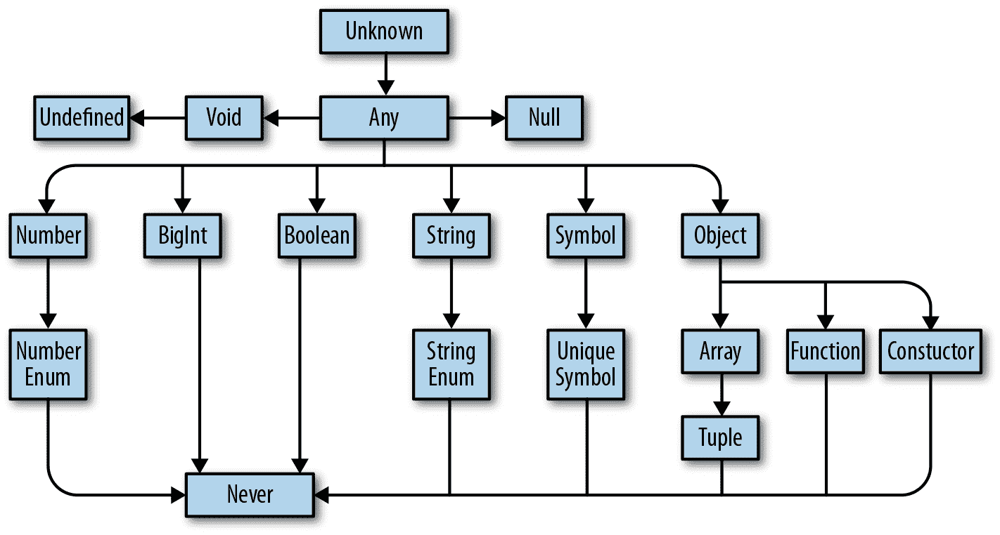
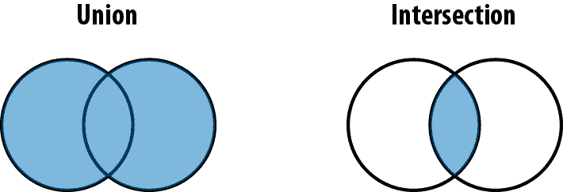

# 第三章：关于类型的一切

在上一章中，我介绍了类型系统的概念，但我从未真正定义过类型系统中的*类型*意味着什么。

如果这听起来令人困惑，让我举几个熟悉的例子：

+   `boolean` 类型是所有布尔值的集合（只有 `true` 和 `false`），以及您可以对它们执行的操作（如 `||`、`&&` 和 `!`）。

+   `number` 类型是所有数字的集合及其操作（如 `+`、`-`、`*`、`/`、`%`、`||`、`&&` 和 `?`），包括您可以调用的方法，如 `.toFixed`、`.toPrecision`、`.toString` 等。

+   `string` 类型是所有字符串的集合及其操作（如 `+`、`||` 和 `&&`），包括您可以调用的方法，如 `.concat` 和 `.toUpperCase`。

当你看到某些东西是类型 `T` 时，你不仅知道它是 `T` 类型，而且还*确切知道*你可以对该 `T` 类型做什么（以及不能做什么）。记住，整个目的是利用类型检查器阻止您执行无效操作。类型检查器知道什么是有效的，什么是无效的方法是通过查看您使用的类型及其使用方式。

在本章中，我们将介绍 TypeScript 中可用的类型，并介绍每种类型的基本用法。图 3-1 提供了一个概述。



###### 图 3-1\. TypeScript 的类型层级结构

# 关于类型的讨论

当程序员谈论类型时，他们使用精确的共同词汇来描述他们的意思。我们将在本书中始终使用这种词汇。

假设您有一个函数，它接受某个值并返回该值乘以它自己：

```
function squareOf(n) {
  return n * n
}
squareOf(2)     // evaluates to 4
squareOf('z')   // evaluates to NaN
```

显然，这个函数只对数字有效——如果您将除数字以外的任何内容传递给 `squareOf`，结果将是无效的。因此，我们明确*注释*参数的类型：

```
function squareOf(n: number) {
  return n * n
}
squareOf(2)     *`// evaluates to 4`*
squareOf('z')   *`// Error TS2345: Argument of type '"z"' is not assignable to`*
                *`// parameter of type 'number'.`*

```

现在，如果我们使用除了数字以外的任何东西调用 `squareOf`，TypeScript 将立即发出警告。这是一个简单的示例（我们将在下一章节详细讨论函数），但已足以介绍 TypeScript 中几个关键概念。关于最后一个代码示例，我们可以说以下几点：

1.  `squareOf` 的参数 `n` 受限于 `number`。

1.  值 `2` 的类型可以*分配给*（同样地：*兼容于*）`number`。

在没有类型注释的情况下，`squareOf` 对其参数没有限制，您可以将任何类型的参数传递给它。一旦我们对其进行限制，TypeScript 就会为我们验证我们调用函数的每个位置时都使用了兼容的参数。在这个例子中，值 `2` 的类型是 `number`，可以分配给 `squareOf` 的注释 `number`，所以 TypeScript 接受我们的代码；但 `'z'` 是 `string`，不可分配给 `number`，因此 TypeScript 报错。

你也可以将其视为*边界*：我们告诉 TypeScript，`n`的*上界*是`number`，因此我们传递给`squareOf`的任何值最多只能是一个`number`。如果它超出了`number`（例如，如果它是一个可能是`number`或可能是`string`的值），那么它就不能赋给`n`。

我将在第六章中更正式地定义可分配性、边界和约束。目前，你只需知道这是我们用来讨论类型是否可以在我们需要特定类型的地方使用的语言。

# 类型的基础知识

让我们深入了解 TypeScript 支持的各种类型、它们包含的值以及你可以对它们进行的操作。我们还将涵盖一些用于处理类型的基本语言特性：类型别名、联合类型和交叉类型。

## 任何

`any`是类型的教父。它可以为了价格而做任何事情，但是除非你已经彻底无路可走，否则不要向`any`求助。在 TypeScript 中，一切都需要在编译时具有类型，而当你（程序员）和 TypeScript（类型检查器）无法确定某个东西的类型时，`any`就是默认类型。它是最后的备选类型，尽可能避免使用它。

为什么应该避免使用它？记住类型是什么吗？（它是一组值及其可以执行的操作。）`any`是*所有*值的集合，你可以对`any`做*任何*事情。这意味着如果你有一个`any`类型的值，你可以对它进行加法运算，乘法运算，调用`.pizza()`——任何操作都可以。

`any`使你的值表现得像在常规 JavaScript 中一样，并且完全阻止类型检查器发挥其魔力。当你允许`any`进入你的代码时，你就像闭着眼睛飞行一样。避免像火一样的`any`，只在绝对没有其他选择时使用它。

在极少数情况下，当你确实需要使用它时，你可以这样做：

```
let a: any = 666            // any
let b: any = ['danger']     // any
let c = a + b               // any
```

注意第三种类型应该报告错误（你为什么要尝试将一个数字和一个数组相加？），但是并没有，因为你告诉 TypeScript 你正在添加两个`any`。如果要使用`any`，你必须明确说明。当 TypeScript 推断出某个值是`any`类型时（例如，如果你忘记了注释函数的参数，或者导入了一个未经类型标注的 JavaScript 模块），它会在编译时抛出异常，并在编辑器中用红色的波浪线提示你。通过显式注释`a`和`b`的类型为`any`（`: any`），你可以避免异常——这是告诉 TypeScript 你知道自己在做什么的一种方式。

# TSC 标志：noImplicitAny

默认情况下，TypeScript 是宽容的，并且不会抱怨它推断出的值为`any`。要让 TypeScript 抱怨隐式的`any`，确保在*tsconfig.json*中启用`noImplicitAny`标志。

`noImplicitAny`是 TSC 标志的`strict`系列的一部分，因此如果你已经在你的*tsconfig.json*中启用了`strict`（就像我们在“tsconfig.json”中所做的那样），你就可以开始了。

## 未知

如果 `any` 是教父，那么 `unknown` 就像是基努·里维斯在《终极警探》中扮演的约翰尼·尤塔：悠闲自在，与坏人混在一起，但深藏在心底的尊重法律，站在好人一边。在你确实不知道其类型的值的少数情况下，不要使用 `any`，而是使用 `unknown`。像 `any` 一样，它表示任何值，但 TypeScript 不会让你使用 `unknown` 类型，直到你通过检查它的类型来细化它（见“细化”）。

`unknown` 支持哪些操作？你可以比较 `unknown` 值（使用 `==`, `===`, `||`, `&&`, 和 `?`），对它们进行否定（使用 `!`），并使用 JavaScript 的 `typeof` 和 `instanceof` 运算符来细化它们（就像你可以处理任何其他类型一样）。像这样使用 `unknown`：

```
let a: unknown = 30         // unknown
let b = a === 123           // boolean
let c = a + 10              // Error TS2571: Object is of type 'unknown'.
if (typeof a === 'number') {
  let d = a + 10            // number
}
```

此示例应该让你大致了解如何使用 `unknown`：

1.  TypeScript 永远不会推断出某些东西是 `unknown` ——你必须显式注释它 (`a`)。^(1)

1.  你可以将值与 `unknown` 类型的值进行比较 (`b`)。

1.  但是，你不能做那些假设 `unknown` 值是特定类型的事情 (`c`)；你必须先向 TypeScript 证明该值确实是该类型 (`d`)。

## boolean

`boolean` 类型有两个值：`true` 和 `false`。你可以比较它们（使用 `==`, `===`, `||`, `&&`, 和 `?`），对它们进行否定（使用 `!`），除此之外几乎不能做其他事情。像这样使用 `boolean`：

```
let a = true                // boolean
var b = false               // boolean
const c = true              // true
let d: boolean = true       // boolean
let e: true = true          // true
let f: true = false         // Error TS2322: Type 'false' is not assignable
                            // to type 'true'.
```

此示例展示了几种告诉 TypeScript 某物是 `boolean` 的方法：

1.  你可以让 TypeScript 推断出你的值是一个 `boolean` (`a` 和 `b`)。

1.  TypeScript 可以让你推断出你的值是特定的 `boolean` (`c`)。

1.  你可以显式告诉 TypeScript，你的值是一个 `boolean` (`d`)。

1.  你可以显式告诉 TypeScript，你的值是一个特定的 `boolean` (`e` 和 `f`)。

通常情况下，你将在你的程序中使用第一种或第二种方式。很少情况下，你会使用第四种方式——只有当它能带来额外的类型安全性时（本书中将为您展示示例）。你几乎不会使用第三种方式。

第二和第四种情况尤其有趣，因为虽然它们做了直觉上的事情，但是它们得到的支持语言很少，所以对你来说可能是新的。在那个示例中，我做的是说，“嘿 TypeScript！看看这个变量 `e`，`e` 不只是任何旧的 `boolean` ——它是具体的 `boolean` `true`。”通过使用值作为类型，我本质上将 `e` 和 `f` 的可能值从所有的 `boolean` 限制为每个具体的 `boolean`。这个功能被称为*类型字面量*。

在第四种情况下，我明确注释了我的变量类型字面量，在第二种情况下，TypeScript 为我推断了一个字面量类型，因为我使用了`const`而不是`let`或`var`。因为 TypeScript 知道一旦一个基本类型使用`const`赋值后其值不会改变，它会为该变量推断出最窄的类型。这就是为什么在第二种情况下 TypeScript 推断`c`的类型为`true`而不是`boolean`的原因。要了解更多关于 TypeScript 为何对`let`和`const`推断不同类型的详细信息，请参阅“类型扩展”。

我们将在本书中多次讨论类型字面量。它们是一种强大的语言特性，可以在各个地方提供额外的安全性。类型字面量使 TypeScript 在语言世界中独具一格，并且是你应该向你的 Java 朋友炫耀的东西。

## number

`number`是所有数字的集合：整数、浮点数、正数、负数、`Infinity`、`NaN`等等。数字可以进行诸如加法（`+`）、减法（`-`）、取模（`%`）和比较（`<`）等操作。让我们看几个例子：

```
let a = 1234                // number
var b = Infinity * 0.10     // number
const c = 5678              // 5678
let d = a < b               // boolean
let e: number = 100         // number
let f: 26.218 = 26.218      // 26.218
let g: 26.218 = 10          // Error TS2322: Type '10' is not assignable
                            // to type '26.218'.
```

就像在`boolean`的示例中一样，有四种方法将某物声明为`number`：

1.  你可以让 TypeScript 推断你的值是一个`number`（`a`和`b`）。

1.  你可以使用`const`，这样 TypeScript 就会推断你的值是一个特定的`number`（`c`）。

1.  你可以明确告诉 TypeScript 你的值是一个`number`（`e`）。

1.  你可以明确告诉 TypeScript 你的值是一个特定的`number`（`f`和`g`）。

就像处理`booleans`一样，通常你会让 TypeScript 自动推断类型（第一种方式）。偶尔你可能会做一些需要将数值类型限制为特定值的 clever programming（第二或第四种方式）。没有充分的理由明确将某物类型声明为`number`（第三种方式）。

###### 提示

当处理长数字时，使用数字分隔符使这些数字更易于阅读。数字分隔符可用于类型和值的位置：

```
let oneMillion = 1_000_000 // Equivalent to 1000000
let twoMillion: 2_000_000 = 2_000_000
```

## bigint

`bigint`是 JavaScript 和 TypeScript 中的新成员：它允许你处理大整数而不会遇到舍入错误。而`number`类型只能表示最多 2⁵³的整数，`bigint`可以表示更大的整数。`bigint`类型是所有 BigInts 的集合，并支持加法（`+`）、减法（`-`）、乘法（*）、除法（`/`）和比较（`<`）。使用方式如下：

```
let a = 1234n               // bigint
const b = 5678n             // 5678n
var c = a + b               // bigint
let d = a < 1235            // boolean
let e = 88.5n               // Error TS1353: A bigint literal must be an integer.
let f: bigint = 100n        // bigint
let g: 100n = 100n          // 100n
let h: bigint = 100         // Error TS2322: Type '100' is not assignable
                            // to type 'bigint'.
```

就像在`boolean`和`number`中一样，有四种方法声明 bigints。尽量在能够的时候让 TypeScript 推断出你的 bigint 类型。

###### 警告

在撰写本文时，`bigint`尚未被每个 JavaScript 引擎原生支持。如果你的应用依赖于`bigint`，请注意检查目标平台是否支持。

## string

`string`是所有字符串及其相关操作的集合，比如拼接（`+`）、切片（`.slice`）等等。让我们看几个例子：

```
let a = 'hello'             // string
var b = 'billy'             // string
const c = '!'               // '!'
let d = a + ' ' + b + c     // string
let e: string = 'zoom'      // string
let f: 'john' = 'john'      // 'john'
let g: 'john' = 'zoe'       // Error TS2322: Type "zoe" is not assignable
                            // to type "john".
```

类似于 `boolean` 和 `number`，有四种声明 `string` 类型的方式，你应该尽可能地让 TypeScript 推断类型。

## 符号

`symbol` 是一个相对较新的语言特性，随着 JavaScript 最新的主要版本（ES2015）而引入。符号在实际中并不经常出现；它们被用作对象和映射中字符串键的替代，在你确信人们使用了正确的已知键而没有意外设置键的地方——比如为对象设置默认迭代器 (`Symbol.iterator`)，或者在运行时重写对象是否是某个实例 (`Symbol.hasInstance`)。符号的类型是 `symbol`，并且你可以做的事情并不多：

```
let a = Symbol('a')         // symbol
let b: symbol = Symbol('b') // symbol
var c = a === b             // boolean
let d = a + 'x'             // Error TS2469: The '+' operator cannot be applied
                            // to type 'symbol'.
```

JavaScript 中 `Symbol('a')` 的工作方式是创建一个具有给定名称的新 `symbol`；该 `symbol` 是唯一的，并且不会等于任何其他 `symbol`（即使你使用完全相同的名称创建第二个 `symbol` ！）。类似于当你用 `let` 声明时 `27` 被推断为 `number`，但当你用 `const` 声明时它是具体的 `27`，符号被推断为 `symbol` 类型但可以显式地标注为 `unique symbol`：

```
const e = Symbol('e')                // typeof e
const f: unique symbol = Symbol('f') // typeof f
let g: unique symbol = Symbol('f')   // Error TS1332: A variable whose type is a
                                     // 'unique symbol' type must be 'const'.
let h = e === e             // boolean
let i = e === f             // Error TS2367: This condition will always return
                            // 'false' since the types 'unique symbol' and
                            // 'unique symbol' have no overlap.
```

这个示例展示了创建唯一符号的几种方法：

1.  当你声明一个新的 `symbol` 并将其赋给一个 `const` 变量（不是 `let` 或 `var` 变量）时，TypeScript 会推断它的类型为 `unique symbol`。它将在你的代码编辑器中显示为 `typeof` *yourVariableName*，而不是 `unique symbol`。

1.  你可以显式地注释 `const` 变量的类型为 `unique symbol`。

1.  一个 `unique symbol` 总是等于它自身。

1.  TypeScript 在编译时知道 `unique symbol` 永远不会等于任何其他 `unique symbol`。

将 `unique symbol` 视为其他文字类型（比如 `1`、`true` 或 `"literal"`）。它们是一种创建代表特定 `symbol` 的类型的方式。

## 对象

TypeScript 的对象类型指定了对象的形状。值得注意的是，它们无法区分简单对象（比如你用 `{}` 创建的那种）和更复杂的对象（比如你用 `new Blah` 创建的那种）。这是有意设计的：JavaScript 通常是 *结构化类型* 的，因此 TypeScript 更偏向于这种编程风格，而不是 *名义类型* 的风格。

在 TypeScript 中，有几种方法可以用类型来描述对象。第一种方法是将一个值声明为 `object`：

```
let a: object = {
  b: 'x'
}
```

当你访问 `b` 时会发生什么？

```
a.b   // Error TS2339: Property 'b' does not exist on type 'object'.
```

等等，这并不是很有用！如果你不能对 `object` 做任何事情，那么给它加类型有什么意义呢？

为什么，这是一个很重要的观点，有抱负的 TypeScripter！实际上，`object` 比 `any` 稍微窄一些，但差别不大。`object` 并不能告诉你关于它描述的值的很多信息，只是告诉你这个值是一个 JavaScript 对象（并且它不是 `null`）。

如果我们省略显式的类型标注，让 TypeScript 自行处理会怎样？

```
let a = {
  b: 'x'
}            // {b: string}
a.b          // string

let b = {
  c: {
    d: 'f'
  }
}            // {c: {d: string}}
```

太棒了！你刚刚发现了第二种对象类型的类型化方法：对象字面量语法（不要与类型文字混淆）。你可以让 TypeScript 自动推断对象的形状，也可以在花括号内显式描述它：

```
let a: {b: number} = {
  b: 12
}            // {b: number}
```

对象字面量语法表示：“这是一个具有这种形状的东西。” 这个东西可以是对象字面量，也可以是类：

```
let c: {
  firstName: string
  lastName: string
} = {
  firstName: 'john',
  lastName: 'barrowman'
}

class Person {
  constructor(
    public firstName: string,   // public is shorthand for
                                // this.firstName = firstName
    public lastName: string
  ) {}
}
c = new Person('matt', 'smith') // OK

```

`{firstName: string, lastName: string}` 描述了一个对象的 *形状*，上一个例子中的对象字面量和类实例都满足这个形状，所以 TypeScript 允许我们将 `Person` 赋给 `c`。

让我们看看当我们添加额外属性或略过必需的属性时会发生什么：

```
let a: {b: number}

a = {}  // Error TS2741: Property 'b' is missing in type '{}'
        // but required in type '{b: number}'.

a = {
  b: 1,
  c: 2  // Error TS2322: Type '{b: number; c: number}' is not assignable
}       // to type '{b: number}'. Object literal may only specify known
        // properties, and 'c' does not exist in type '{b: number}'.
```

默认情况下，TypeScript 对对象属性相当严格——如果你说对象应该有一个叫做 `b` 的 `number` 属性，TypeScript 期望只有 `b` 而不是其他。如果 `b` 缺失或有额外的属性，TypeScript 将会报错。

你能告诉 TypeScript 某物是可选的，或者可能会有比你计划的更多属性吗？当然可以：

```
let a: {
  b: number 
  c?: string 
  [key: number]: boolean 
}
```


`a` 有一个叫做 `b` 的 `number` 属性。


`a` 可能有一个叫做 `c` 的 `string` 属性。如果设置了 `c`，它可能是 `undefined`。


`a` 可能有任意数量的数值属性，类型为 `boolean`。

让我们看看我们可以分配给 `a` 的对象类型：

```
a = {b: 1}
a = {b: 1, c: undefined}
a = {b: 1, c: 'd'}
a = {b: 1, 10: true}
a = {b: 1, 10: true, 20: false}
a = {10: true}          // Error TS2741: Property 'b' is missing in type
                        // '{10: true}'.
a = {b: 1, 33: 'red'}   // Error TS2741: Type 'string' is not assignable
                        // to type 'boolean'.
```

可选项 (`?`) 不是声明对象类型时唯一的修饰符。你还可以使用 `readonly` 修饰符来标记字段为只读（即声明字段在赋初值后不能修改，有点像对象属性的 `const`）：

```
let user: {
  readonly firstName: string
} = {
  firstName: 'abby'
}

user.firstName // string
user.firstName =
  'abbey with an e' // Error TS2540: Cannot assign to 'firstName' because it
                    // is a read-only property.
```

对象字面量表示法有一个特殊情况：空对象类型 (`{}`)。除了 `null` 和 `undefined` 之外的所有类型都可以分配给空对象类型，这可能会使其使用起来有些棘手。尽量在可能的情况下避免使用空对象类型：

```
let danger: {}
danger = {}
danger = {x: 1}
danger = []
danger = 2
```

最后关于对象，值得一提的是将某物声明为对象的最后一种方式：`Object`。这几乎和使用 `{}` 是一样的，最好避免使用。^(3)

总结一下，在 TypeScript 中声明对象有四种方式：

1.  对象字面量表示法（如 `{a: string}`），也称为 *形状*。当你知道你的对象可能有哪些字段，或者当你的对象所有值都具有相同类型时使用这个。

1.  空对象字面量表示法 (`{}`)。尽量避免使用这个。

1.  `object` 类型。当你只需要一个对象而不关心它有哪些字段时使用。

1.  `Object` 类型。尽量避免使用这个。

在你的 TypeScript 程序中，你几乎总是应该使用第一种和第三种方式。要小心避免第二种和第四种方式——使用 linter 进行警告，进行代码审查时进行抱怨，打印海报——使用你团队首选的工具来使它们远离你的代码库。

表 3-1 是前述列表中选项 2–4 的一个便利参考。

表 3-1\. 值是否为有效对象？

| Value | `{}` | `object` | `Object` |
| --- | --- | --- | --- |
| `{}` | 是 | 是 | 是 |
| `['a']` | 是 | 是 | 是 |
| `function () {}` | 是 | 是 | 是 |
| `new String('a')` | 是 | 是 | 是 |
| `'a'` | 是 | **不** | 是 |
| `1` | 是 | **不** | 是 |
| `Symbol('a')` | 是 | **不** | 是 |
| `null` | **不** | **不** | **不** |
| `undefined` | **不** | **不** | **不** |

## 插曲：类型别名、联合和交集

你很快就会成为一个经验丰富的 TypeScript 程序员。你已经看过几种类型及其工作方式，并且现在熟悉类型系统、类型和安全性的概念。现在是我们深入的时候了。

如你所知，如果你有一个值，你可以根据其类型允许的操作对其进行操作。例如，你可以使用 `+` 来添加两个数字，或者 `.toUpperCase` 来将字符串转换为大写。

如果你有一个*类型*，你也可以对其执行一些操作。我将在这里介绍一些类型级操作——在书中稍后还会有更多，但这些是如此常见，我希望尽早介绍它们。

### 类型别名

就像你可以使用变量声明（`let`、`const` 和 `var`）来声明一个变量别名值一样，你可以声明一个指向类型的类型别名。它看起来像这样：

```
type Age = number

type Person = {
  name: string
  age: Age
}
```

`Age` 只是一个 `number`。它还有助于更容易理解 `Person` 结构的定义。别名在 TypeScript 中不会被推断，因此你必须明确地为它们设置类型：

```
let age: Age = 55

let driver: Person = {
  name: 'James May'
  age: age
}
```

因为 `Age` 只是 `number` 的别名，这意味着它也可以赋给 `number`，所以我们可以将其重写为：

```
let age = 55

let driver: Person = {
  name: 'James May'
  age: age
}
```

无论何处都可以使用类型别名，而不改变程序的含义。

就像 JavaScript 的变量声明（`let`、`const` 和 `var`）一样，你不能重复声明一个类型：

```
type Color = 'red'
type Color = 'blue'  // Error TS2300: Duplicate identifier 'Color'.
```

而像 `let` 和 `const` 一样，类型别名是块级作用域的。每个块和每个函数都有自己的作用域，内部的类型别名声明会覆盖外部的声明：

```
type Color = 'red'

let x = Math.random() < .5

if (x) {
  type Color = 'blue'  // This shadows the Color declared above.
  let b: Color = 'blue'
} else {
  let c: Color = 'red'
}
```

类型别名对于简化重复的复杂类型（^(4)）很有用，并且可以清楚地说明变量的用途（有些人更喜欢使用描述性的类型名称而不是描述性的变量名称！）。在决定是否给一个类型取别名时，可以使用与决定是否将值拉出到自己的变量中相同的判断标准。

### 联合和交集类型

如果你有两个事物 `A` 和 `B`，它们的*并集*是它们的总和（`A` 或 `B` 或两者都有的所有内容），而*交集*是它们共有的部分（两者都有的所有内容）。最简单的方式是用集合来理解这一点。在图 3-2 中，我将集合表示为圆圈。左边是两个集合的并集或*和*；右边是它们的交集或*积*。



###### 图 3-2\. 并集（|）和交集（&）

TypeScript 给我们提供了特殊的类型运算符来描述类型的并集和交集：`|` 表示并集，`&` 表示交集。由于类型很像集合，我们可以以同样的方式思考它们：

```
type Cat = {name: string, purrs: boolean}
type Dog = {name: string, barks: boolean, wags: boolean}
type CatOrDogOrBoth = Cat | Dog
type CatAndDog = Cat & Dog
```

如果某物是 `CatOrDogOrBoth`，你知道它有一个 `name` 属性是字符串，除此之外没有什么信息。另一方面，你可以给 `CatOrDogOrBoth` 分配什么呢？嗯，一个 `Cat`，一个 `Dog`，或者两者都有：

```
// Cat
let a: CatOrDogOrBoth = {
  name: 'Bonkers',
  purrs: true
}

// Dog
a = {
  name: 'Domino',
  barks: true,
  wags: true
}

// Both
a = {
  name: 'Donkers',
  barks: true,
  purrs: true,
  wags: true
}

```

这值得再强调一下：一个具有联合类型 (`|`) 的值不一定是联合中的某一个特定成员；事实上，它可以同时是两个成员！^(5)

另一方面，关于 `CatAndDog`，你知道什么？你的狗猫混血超级宠物不仅有一个 `name`，还能咕噜、吠叫和摇尾巴：

```
let b: CatAndDog = {
  name: 'Domino',
  barks: true,
  purrs: true,
  wags: true
}
```

并集比交集更自然地出现得多。例如，看看这个函数：

```
function trueOrNull(isTrue: boolean) {
  if (isTrue) {
    return 'true'
  }
  return null
}
```

这个函数返回值的类型是什么？嗯，它可能是一个`string`，或者可能是`null`。我们可以将其返回类型表示为：

```
type Returns = string | null
```

这个呢？

```
function(a: string, b: number) {
  return a || b
}
```

如果 `a` 是真的，那么返回类型是 `string`，否则就是 `number`：换句话说，`string | number`。

最后一个自然出现并集的地方是数组（特别是异构数组），我们接下来会讨论它。

## 数组

就像在 JavaScript 中一样，TypeScript 中的数组是一种特殊的对象，支持连接、推入、搜索和切片等操作。举个例子：

```
let a = [1, 2, 3]           // number[]
var b = ['a', 'b']          // string[]
let c: string[] = ['a']     // string[]
let d = [1, 'a']            // (string | number)[]
const e = [2, 'b']          // (string | number)[]

let f = ['red']
f.push('blue')
f.push(true)                // Error TS2345: Argument of type 'true' is not
                            // assignable to parameter of type 'string'.

let g = []                  // any[]
g.push(1)                   // number[]
g.push('red')               // (string | number)[]

let h: number[] = []        // number[]
h.push(1)                   // number[]
h.push('red')               // Error TS2345: Argument of type '"red"' is not
                            // assignable to parameter of type 'number'.
```

###### 注意

TypeScript 支持两种数组的语法：`T[]` 和 `Array<T>`。它们在含义和性能上都是相同的。本书使用 `T[]` 语法是为了简洁性，但你可以选择自己喜欢的风格。

当你阅读这些例子时，注意除了 `c` 和 `h` 之外的一切都是隐式类型化的。你还会注意到 TypeScript 有关于你可以放入数组中的内容的规则。

一个常见的经验法则是保持数组*同质化*。也就是说，不要在一个数组中混合苹果、橙子和数字 —— 设计你的程序，让数组的每个元素都具有相同的类型。原因是，否则，你将不得不做更多工作来向 TypeScript 证明你的操作是安全的。

要理解当数组同质化时为什么事情变得更容易，看看例子 `f`。我用字符串 `'red'` 初始化了一个数组（在我声明数组时，它只包含字符串，因此 TypeScript 推断它必须是一个字符串数组）。然后我推入了 `'blue'`；`'blue'` 是一个字符串，所以 TypeScript 让它通过了。接着我尝试将 `true` 推入数组，但失败了！为什么呢？因为 `f` 是一个字符串数组，而 `true` 不是一个字符串。

另一方面，当我初始化`d`时，我给它一个`number`和一个`string`，因此 TypeScript 推断它必须是一个类型为`number | string`的数组。因为每个元素可以是数字或字符串，所以在使用之前必须检查它是哪种类型。例如，假设你想要映射该数组，将每个字母转换为大写并将每个数字乘以三：

```
let d = [1, 'a']

d.map(_ => {
  if (typeof _ === 'number') {
    return _ * 3
  }
  return _.toUpperCase()
})

```

在能对它做任何操作之前，你必须用`typeof`查询每个项的类型，检查它是`number`还是`string`。

就像对象一样，使用`const`创建的数组不会提示 TypeScript 更精确地推断它们的类型。这就是为什么 TypeScript 推断`d`和`e`都是`number | string`数组的原因。

`g`是特殊情况：当你初始化一个空数组时，TypeScript 不知道数组元素的类型，因此会默认将它们设置为`any`。随着你操作数组并向其中添加元素，TypeScript 开始推断数组的类型。一旦数组离开了它定义的作用域（例如，如果你在函数中声明它，然后返回它），TypeScript 将为其分配一个不能再扩展的最终类型：

```
function buildArray() {
  let a = []                // any[]
  a.push(1)                 // number[]
  a.push('x')               // (string | number)[]
  return a
}

let myArray = buildArray()  // (string | number)[]
myArray.push(true)          // Error 2345: Argument of type 'true' is not
                            // assignable to parameter of type 'string | number'.
```

因此，在使用`any`的用途中，这个不应该让你过于担心。

## 元组

元组是`array`的子类型。它们是一种特殊的数组类型，具有固定的长度，每个索引处的值具有特定的已知类型。与大多数其他类型不同，声明元组时必须显式指定它们的类型。这是因为 JavaScript 的语法对元组和数组是相同的（都使用方括号），并且 TypeScript 已经有规则从方括号中推断数组类型：

```
let a: [number] = [1]

// A tuple of [first name, last name, birth year]
let b: [string, string, number] = ['malcolm', 'gladwell', 1963]

b = ['queen', 'elizabeth', 'ii', 1926]  // Error TS2322: Type 'string' is not
                                        // assignable to type 'number'.
```

元组也支持可选元素。就像对象类型一样，`?`表示“可选”：

```
// An array of train fares, which sometimes vary depending on direction
let trainFares: [number, number?][] = [
  [3.75],
  [8.25, 7.70],
  [10.50]
]

// Equivalently:
let moreTrainFares: ([number] | [number, number])[] = [
  // ...
]
```

元组还支持剩余元素，你可以使用它们来对具有最小长度的元组进行类型标记：

```
// A list of strings with at least 1 element
let friends: [string, ...string[]] = ['Sara', 'Tali', 'Chloe', 'Claire']

// A heterogeneous list
let list: [number, boolean, ...string[]] = [1, false, 'a', 'b', 'c']
```

不仅可以安全地编码异构列表，元组类型还捕获了列表的长度。这些特性比普通的旧数组提供了更多的安全性——经常使用它们。

### 只读数组和元组

虽然常规数组是可变的（意味着你可以`.push`，`.splice`它们，并在原地更新它们），这可能是你大多数时间想要的，但有时你需要一个不可变数组——一个你可以更新以生成新数组，而不更改原始数组的数组。

TypeScript 默认支持`readonly`数组类型，你可以使用它来创建不可变数组。只读数组就像普通数组一样，但你不能直接更新它们。要创建只读数组，使用显式类型注解；要更新只读数组，使用非变异方法如`.concat`和`.slice`，而不是`.push`和`.splice`等变异方法：

```
let as: readonly number[] = [1, 2, 3]     // readonly number[]
let bs: readonly number[] = as.concat(4)  // readonly number[]
let three = bs[2]                         // number
as[4] = 5            // Error TS2542: Index signature in type
                     // 'readonly number[]' only permits reading.
as.push(6)           // Error TS2339: Property 'push' does not
                     // exist on type 'readonly number[]'.
```

就像`Array`一样，TypeScript 提供了几种更长的方式来声明只读数组和元组：

```
type A = readonly string[]           // readonly string[]
type B = ReadonlyArray<string>       // readonly string[]
type C = Readonly<string[]>          // readonly string[]

type D = readonly [number, string]   // readonly [number, string]
type E = Readonly<[number, string]>  // readonly [number, string]
```

你使用的语法是更简洁的`readonly`修饰符，还是更长的形式`Readonly`或`ReadonlyArray`实用程序，这取决于个人口味。

需要注意的是，尽管只读数组在某些情况下可以通过避免可变性来使代码更易于理解，但它们实际上是由常规 JavaScript 数组支持的。 这意味着即使对数组进行小更新，也需要先复制原始数组，如果不小心的话，这可能会损害应用程序的运行性能。 对于小型数组，这种开销很少引人注意，但对于较大的数组，开销可能会变得显著。

###### Tip

如果您计划大量使用不可变数组，请考虑使用效率更高的实现，比如 Lee Byron 的优秀 [`immutable`](https://www.npmjs.com/package/immutable)。

## null、undefined、void 和 never

JavaScript 有两个值用于表示缺失的情况：`null` 和 `undefined`。 TypeScript 支持这两者作为值，并为它们提供类型定义——猜猜叫什么？没错，它们的类型也叫 `null` 和 `undefined`。

在 TypeScript 中，`undefined` 的唯一值是 `undefined`，`null` 的唯一值是 `null`，因此它们都是特殊类型。

JavaScript 程序员通常可以互换使用这两个，尽管其中有一个微妙的语义差异值得一提：`undefined` 意味着尚未定义某事物，而 `null` 意味着值的缺失（例如，如果您试图计算一个值，但途中遇到错误）。 这些只是约定，TypeScript 不会强制您遵循它们，但区分它们可能是有用的。

除了 `null` 和 `undefined`，TypeScript 还有 `void` 和 `never`。 这些是非常特定的、专用的类型，更细致地划分了不同类型不存在的情况：`void` 是没有显式返回任何内容的函数的返回类型（例如 `console.log`），而 `never` 是根本不会返回的函数的类型（例如抛出异常的函数或永远运行的函数）：

```
// (a) A function that returns a number or null
function a(x: number) {
  if (x < 10) {
    return x
  }
  return null
}

// (b) A function that returns undefined
function b() {
  return undefined
}

// (c) A function that returns void
function c() {
  let a = 2 + 2
  let b = a * a
}

// (d) A function that returns never
function d() {
  throw TypeError('I always error')
}

// (e) Another function that returns never
function e() {
  while (true) {
    doSomething()
  }
}
```

（a）和（b）显式返回 `null` 和 `undefined`。 （c）返回 `undefined`，但没有显式使用 `return` 语句，因此我们称其返回类型为 `void`。 （d）抛出异常，（e）永远运行不会返回，因此我们称它们的返回类型为 `never`。

如果 `unknown` 是每种其他类型的超类型，那么 `never` 是每种其他类型的子类型。 我们称之为 *底部类型*。 这意味着它可以分配给任何其他类型，并且类型为 `never` 的值可以安全地在任何地方使用。 这在理论上具有重要意义，^(6) 但当您与其他语言爱好者讨论 TypeScript 时，这是一个会出现的话题。

表 3-2 总结了这四种缺失类型的使用方式。

表 3-2\. 表示某种缺失的类型

| Type | 含义 |
| --- | --- |
| `null` | 缺少值 |
| `undefined` | 尚未分配值的变量 |
| `void` | 没有 `return` 语句的函数 |
| `never` | 永不返回的函数 |

## 枚举

枚举是一种用于列举类型可能值的方式。它们是无序的数据结构，将键映射到值。可以把它们想象成在编译时键是固定的对象，因此当你访问它时 TypeScript 可以检查给定的键是否实际存在。

有两种枚举类型：将字符串映射到字符串的枚举，以及将字符串映射到数字的枚举。它们看起来像这样：

```
enum Language {
  English,
  Spanish,
  Russian
}
```

###### 注意

按照约定，枚举名称为大写单数形式。它们的键也是大写的。

TypeScript 将自动推断出枚举的每个成员的数字值，但你也可以显式设置值。让我们明确 TypeScript 在上一个示例中推断出的内容：

```
enum Language {
  English = 0,
  Spanish = 1,
  Russian = 2
}
```

要从枚举中检索值，你可以像从常规对象获取值一样，使用点号或方括号表示法：

```
let myFirstLanguage = Language.Russian      // Language
let mySecondLanguage = Language['English']  // Language
```

你可以将枚举分割成多个声明，TypeScript 将自动合并它们（要了解更多，请跳到 “声明合并”）。请注意，当你分割枚举时，TypeScript 只能为其中一个声明推断值，因此最好为每个枚举成员显式分配一个值：

```
enum Language {
  English = 0,
  Spanish = 1
}

enum Language {
  Russian = 2
}
```

你可以使用计算值，并且不必定义所有的值（TypeScript 将尽力推断缺失的部分）：

```
enum Language {
  English = 100,
  Spanish = 200 + 300,
  Russian                 // TypeScript infers 501 (the next number after 500)
}
```

你也可以使用字符串值来定义枚举，甚至可以混合使用字符串和数字值：

```
enum Color {
  Red = '#c10000',
  Blue = '#007ac1',
  Pink = 0xc10050,        // A hexadecimal literal
  White = 255             // A decimal literal
}

let red = Color.Red       // Color
let pink = Color.Pink     // Color
```

TypeScript 允许你通过值和键来访问枚举，以方便使用，但这可能很快变得不安全：

```
let a = Color.Red         // Color
let b = Color.Green       // Error TS2339: Property 'Green' does not exist
                          // on type 'typeof Color'.
let c = Color[0]          // string
let d = Color[6]          // string (!!!)
```

你不应该能够获取 `Color[6]`，但 TypeScript 并不会阻止你！我们可以要求 TypeScript 通过选择更安全的 `const enum` 子集来防止这种不安全访问。让我们重新编写先前的 `Language` 枚举：

```
const enum Language {
  English,
  Spanish,
  Russian
}

// Accessing a valid enum key
let a = Language.English  // Language

// Accessing an invalid enum key
let b = Language.Tagalog  // Error TS2339: Property 'Tagalog' does not exist
                          // on type 'typeof Language'.

// Accessing a valid enum value
let c = Language[0]       // Error TS2476: A const enum member can only be
                          // accessed using a string literal.

// Accessing an invalid enum value
let d = Language[6]       // Error TS2476: A const enum member can only be
                          // accessed using a string literal.
```

`const enum` 不允许你进行反向查找，因此其行为类似于常规的 JavaScript 对象。它还不会默认生成任何 JavaScript 代码，而是在使用时内联枚举成员的值（例如，TypeScript 将会用其值 `1` 替换每个 `Language.Spanish` 的出现）。

# TSC 标志：preserveConstEnums

当从别人的 TypeScript 代码中导入 `const enum` 时，`const enum` 的内联可能会导致安全问题：如果枚举的作者在你编译 TypeScript 代码后更新了其 `const enum`，那么你的枚举版本和他们的枚举版本在运行时可能指向不同的值，而 TypeScript 并不会察觉到这一点。

如果使用 `const enum`，请注意避免内联它们，并且只在你控制的 TypeScript 程序中使用它们：避免在计划发布到 NPM 或作为库供他人使用的程序中使用它们。

要在 `tsconfig.json` 中打开 `preserveConstEnums` TSC 设置以启用 `const enum` 的运行时代码生成：

```
{
  "compilerOptions": {
    "preserveConstEnums": true
  }
}
```

让我们看看如何使用 `const enum`：

```
const enum Flippable {
  Burger,
  Chair,
  Cup,
  Skateboard,
  Table
}

function flip(f: Flippable) {
  return 'flipped it'
}

flip(Flippable.Chair)     // 'flipped it'
flip(Flippable.Cup)       // 'flipped it'
flip(12)                  // 'flipped it' (!!!)
```

一切看起来都很好——`椅子`和`杯子`的工作正如你所预期的那样…… 直到你意识到所有数字也可以赋值给枚举！这种行为是 TypeScript 可赋值性规则的一个不幸后果，为了修复它，你必须特别小心，只使用字符串值的枚举：

```
const enum Flippable {
  Burger = 'Burger',
  Chair = 'Chair',
  Cup = 'Cup',
  Skateboard = 'Skateboard',
  Table = 'Table'
}

function flip(f: Flippable) {
  return 'flipped it'
}

flip(Flippable.Chair)     // 'flipped it'
flip(Flippable.Cup)       // 'flipped it'
flip(12)                  // Error TS2345: Argument of type '12' is not
                          // assignable to parameter of type 'Flippable'.
flip('Hat')               // Error TS2345: Argument of type '"Hat"' is not
                          // assignable to parameter of type 'Flippable'.
```

只需一个讨厌的数值枚举，整个枚举就不安全了。

###### 警告

因为安全使用枚举时存在的所有陷阱，我建议您远离它们——在 TypeScript 中有很多更好的表达方式。

如果你的同事坚持使用枚举，并且你无法改变他们的想法，确保在他们离开时，秘密合并几个 TSLint 规则，以警告数值和非`const`枚举。

# 摘要

简而言之，TypeScript 自带一堆内置类型。您可以让 TypeScript 根据值推断类型，或者可以显式地为您的值指定类型。`const` 会推断更具体的类型，`let` 和 `var` 推断更一般的类型。大多数类型都有一般和更具体的对应类型，后者是前者的子类型（请参见 表 3-3）。

表 3-3\. 类型及其更具体的子类型

| 类型 | 子类型 |
| --- | --- |
| `boolean` | 布尔字面量 |
| `bigint` | BigInt 字面量 |
| `number` | 数字字面量 |
| `string` | 字符串字面量 |
| `symbol` | `unique symbol` |
| `object` | 对象字面量 |
| 数组 | 元组 |
| `enum` | `const enum` |

# 练习

1.  对于这些值中的每一个，TypeScript 会推断出什么类型？

    1.  `let a = 1042`

    1.  `let b = 'apples and oranges'`

    1.  `const c = 'pineapples'`

    1.  `let d = [true, true, false]`

    1.  `let e = {type: 'ficus'}`

    1.  `let f = [1, false]`

    1.  `const g = [3]`

    1.  `let h = null`（在您的代码编辑器中尝试一下，然后跳到 “类型扩展” 如果结果让您惊讶！）

1.  为什么每个值都会引发它所引发的错误？

    1.  ```
        let i: 3 = 3
        i = 4 // Error TS2322: Type '4' is not assignable to type '3'.

        ```

    1.  ```
        let j = [1, 2, 3]
        j.push(4)
        j.push('5') // Error TS2345: Argument of type '"5"' is not
                    // assignable to parameter of type 'number'.

        ```

    1.  ```
        let k: never = 4 // Error TSTS2322: Type '4' is not assignable
                         // to type 'never'.

        ```

    1.  ```
        let l: unknown = 4
        let m = l * 2 // Error TS2571: Object is of type 'unknown'.

        ```

^(1) 差不多了。当 `unknown` 是联合类型的一部分时，联合的结果将是 `unknown`。您将在 “联合和交叉类型” 中进一步了解联合类型。

^(2) JavaScript 中的对象使用字符串作为键；数组是一种特殊的对象，它使用数值键。

^(3) 有一个小的技术差异：`{}`允许您为 `Object` 原型上的内置方法（如 `.toString` 和 `.hasOwnProperty`）定义任何类型（请访问[MDN](https://mzl.la/2VSuDJz)了解更多关于原型的信息），而 `Object` 强制声明的类型必须可赋值给 `Object` 的原型上的类型。例如，这段代码类型检查通过：`let a: {} = {toString() { return 3 }}`。但如果您将类型注释更改为 `Object`，TypeScript 将抱怨：`let b: Object = {toString() { return 3 }}` 会导致 `Error TS2322: Type 'number' is not assignable to type 'string'`。

^(4) 缩写 DRY 意为“不要重复自己”，即代码不应重复。这一概念由安德鲁·亨特和大卫·托马斯在他们的书籍《程序员修炼之道：通向务实的最高境界》（Addison-Wesley）中首次提出。

^(5) 立即转到“标记联合类型”，了解如何提示 TypeScript 您的联合类型是不交叉的，该联合类型的值必须是其中之一，而不是两者兼有。

^(6) 关于底部类型的思考方式是它是一种没有值的类型。底部类型对应于数学命题，总是为假。
