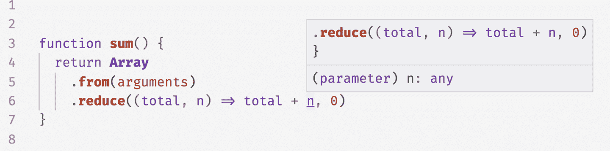
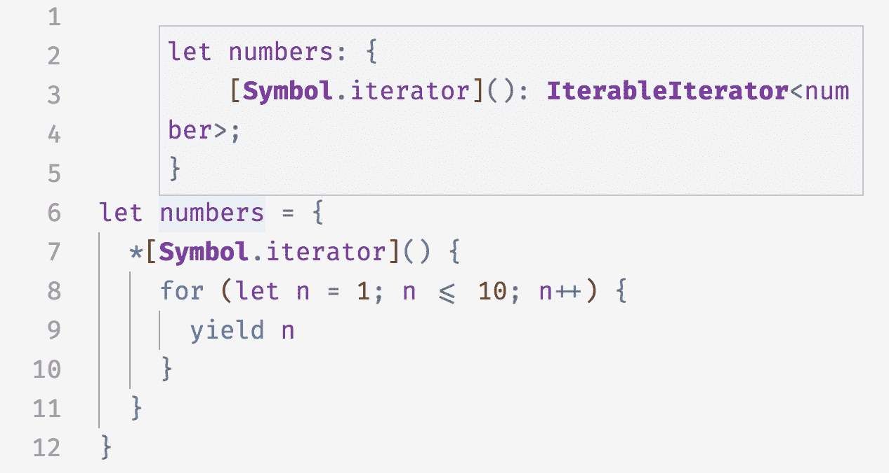
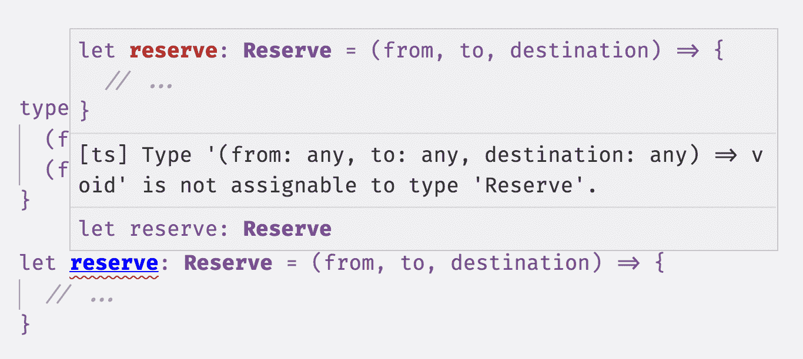

# 第四章：函数

在上一章中，我们已经讨论了 TypeScript 类型系统的基础知识：原始类型、对象、数组、元组和枚举，以及 TypeScript 类型推断的基础知识以及类型可赋值性是如何工作的。现在你已经准备好学习 TypeScript 的“杰作”（或者说是存在的理由，如果你是一个函数式编程者的话）：函数。本章我们将讨论以下几个主题：

+   TypeScript 中声明和调用函数的不同方法

+   签名重载

+   多态函数

+   多态类型别名

# 声明和调用函数

在 JavaScript 中，函数是一等对象。这意味着你可以像对待任何其他对象一样使用它们：将它们分配给变量，传递它们给其他函数，从函数中返回它们，将它们分配给对象和原型，写入它们的属性，读取这些属性，等等。在 JavaScript 中，你可以对函数做很多事情，而 TypeScript 则通过其丰富的类型系统模拟了所有这些功能。

TypeScript 中函数的样子如下（这在上一章应该看起来很熟悉）：

```
function add(a: number, b: number) {
  return a + b
}
```

通常你会显式注解函数的参数（比如这个例子中的 `a` 和 `b`）— TypeScript 总是会在函数体内推断类型，但在大多数情况下它不会从参数中推断类型，除了一些特殊情况，它可以从上下文推断类型（更多关于“上下文类型推断”见 “上下文类型推断”）。返回类型 *会* 被推断，但如果你愿意，你也可以显式注解它：

```
function add(a: number, b: number): number {
  return a + b
}
```

###### 注意

在本书中，当它有助于你理解函数的功能时，我会显式注释返回类型。否则我会略去注释，因为 TypeScript 已经为我们推断了类型，我们为什么要重复做这项工作呢？

上一个例子使用了 *命名函数语法* 来声明函数，但是 JavaScript 和 TypeScript 支持至少五种方法来做到这一点：

```
// Named function
function greet(name: string) {
  return 'hello ' + name
}

// Function expression
let greet2 = function(name: string) {
  return 'hello ' + name
}

// Arrow function expression
let greet3 = (name: string) => {
  return 'hello ' + name
}

// Shorthand arrow function expression
let greet4 = (name: string) =>
  'hello ' + name

// Function constructor
let greet5 = new Function('name', 'return "hello " + name')
```

除了函数构造函数（你不应该使用它们，除非你被蜜蜂追赶，因为它们完全不安全）^(1)，所有这些语法都得到了 TypeScript 安全类型的支持，并且它们都遵循通常参数需要强制类型注解和返回类型可选注解的相同规则。

###### 注意

术语快速复习：

+   参数是函数运行所需的数据片段，作为函数声明的一部分声明。也称为 *形式参数*。

+   参数是你在调用函数时传递给它的数据片段。也称为 *实际参数*。

当你在 TypeScript 中调用函数时，你不需要提供任何额外的类型信息—只需传递一些参数，TypeScript 将开始检查你的参数是否与函数参数的类型兼容：

```
add(1, 2)         // evaluates to 3
greet('Crystal')  // evaluates to 'hello Crystal'
```

当然，如果你忘记了一个参数，或者传递了一个错误类型的参数，TypeScript 会迅速指出：

```
add(1)            // Error TS2554: Expected 2 arguments, but got 1.
add(1, 'a')       // Error TS2345: Argument of type '"a"' is not assignable
                  // to parameter of type 'number'.
```

## 可选和默认参数

就像对象和元组类型一样，你可以使用 `?` 标记参数为可选的。在声明函数的参数时，必需参数必须首先出现，然后是可选参数：

```
function log(message: string, userId?: string) {
  let time = new Date().toLocaleTimeString()
  console.log(time, message, userId || 'Not signed in')
}

log('Page loaded') // Logs "12:38:31 PM Page loaded Not signed in"
log('User signed in', 'da763be') // Logs "12:38:31 PM User signed in da763be"
```

就像在 JavaScript 中一样，你可以为可选参数提供默认值。从语义上讲，这类似于使参数变为可选，即调用者不再需要传递它（不同之处在于默认参数不必位于参数列表的末尾，而可选参数必须）。

例如，我们可以将 `log` 重写为：

```
function log(message: string, userId `=` `'Not signed in'`) {
  let time = new Date().toISOString()
  console.log(time, message, userId)
}

log('User clicked on a button', 'da763be')
log('User signed out')

```

注意当我们为 `userId` 设置默认值时，我们去掉了可选注释 `?`。我们也不需要再为它指定类型了。TypeScript 足够聪明，能够从其默认值推断参数的类型，使得我们的代码简洁易读。

当然，你也可以为默认参数添加显式类型注解，方式与无默认值的参数相同：

```
`type` `Context` `=` `{`
  `appId?``:` `string`
  `userId?``:` `string`
`}`

function log(message: string, `context``:` `Context` `=` `{``}`) {
  let time = new Date().toISOString()
  console.log(time, message, `context``.`userId)
}

```

你会经常发现自己使用默认参数而不是可选参数。

## Rest 参数

如果一个函数接受一个参数列表，你当然可以将列表作为一个数组直接传入：

```
function sum(numbers: number[]): number {
  return numbers.reduce((total, n) => total + n, 0)
}

sum([1, 2, 3]) // evaluates to 6
```

有时，你可能会选择使用 *可变参数* 函数 API —— 即接受可变数量参数的 API —— 而不是 *固定数量* 参数 API。传统上，这需要使用 JavaScript 的魔法 `arguments` 对象。

`arguments` 是“魔法”，因为你的 JavaScript 运行时自动为函数定义它，并将你传递给函数的参数列表分配给它。因为 `arguments` 只是类似数组而不是真正的数组，所以在调用内置的 `.reduce` 方法之前，你首先必须将其转换为数组：

```
function sumVariadic(): number {
  return Array
    .from(arguments)
    .reduce((total, n) => total + n, 0)
}

sumVariadic(1, 2, 3) // evaluates to 6
```

但是使用 `arguments` 有一个大问题：它完全不安全！如果你在文本编辑器中悬停在 `total` 或 `n` 上，你将看到类似于在 Figure 4-1 中显示的输出。



###### 图 4-1\. arguments 是不安全的

这意味着 TypeScript 推断 `n` 和 `total` 都是类型 `any`，并且默默地让它通过——也就是说，直到你尝试使用 `sumVariadic` 时：

```
sumVariadic(1, 2, 3) // Error TS2554: Expected 0 arguments, but got 3.
```

因为我们没有声明 `sumVariadic` 接受参数，从 TypeScript 的角度来看它不接受任何参数，所以当我们尝试使用它时会得到 `TypeError`。

那么，我们如何安全地为可变参数函数设置类型？

Rest 参数来拯救！我们可以使用 Rest 参数安全地使我们的 `sum` 函数接受任意数量的参数，而不是借助不安全的 `arguments` 魔法变量：

```
function sumVariadicSafe(...numbers: number[]): number {
  return numbers.reduce((total, n) => total + n, 0)
}

sumVariadicSafe(1, 2, 3) // evaluates to 6
```

就是这样！注意这个可变参数 `sum` 和我们原来的单参数 `sum` 函数之间唯一的变化是参数列表中额外的 `...` —— 其他都不需要改变，完全类型安全。

函数最多可以有一个剩余参数，并且该参数必须是函数参数列表中的最后一个。例如，看看 TypeScript 内置声明的 `console.log`（如果不知道 `interface` 是什么，不用担心——我们将在 第五章 中介绍它）。`console.log` 接受一个可选的 `message` 和任意数量的其他参数来记录：

```
interface Console {
  log(message?: any, ...optionalParams: any[]): void
}
```

## 调用、应用和绑定

除了使用圆括号 `()` 调用函数外，JavaScript 还支持至少两种其他调用函数的方式。看看本章前面的 `add`：

```
function add(a: number, b: number): number {
  return a + b
}

add(10, 20)                // evaluates to 30
add.apply(null, [10, 20])  // evaluates to 30
add.call(null, 10, 20)     // evaluates to 30
add.bind(null, 10, 20)()   // evaluates to 30
```

`apply` 将一个值绑定到函数内部的 `this`（在本例中，我们将 `this` 绑定到 `null`），并将其第二个参数展开到函数的参数上。`call` 执行类似操作，但按顺序应用其参数，而不是展开参数。

`bind()` 类似，它会将 `this` 参数和一系列参数绑定到函数上。不同之处在于，`bind` 不会立即调用函数；相反，它返回一个新的函数，然后您可以使用 `()`、`.call` 或 `.apply` 调用它，并传入更多参数来绑定到迄今未绑定的参数。

# TSC 标志：strictBindCallApply

要在您的代码中安全使用 `.call`、`.apply` 和 `.bind`，请确保在您的 *tsconfig.json* 中启用 `strictBindCallApply` 选项（如果您已启用 `strict` 模式，则会自动启用）。

## 类型化这个

如果你不是从 JavaScript 过来的，你可能会惊讶地了解，在 JavaScript 中，`this` 变量对每个函数都有定义，而不仅仅是作为类方法存在的函数。`this` 的值取决于如何调用函数，这使得它异常脆弱且难以理解。

###### 提示

出于这个原因，许多团队禁止在代码中无处不在地使用 `this`，除了在类方法中。若要在您的代码库中执行此操作，请启用 `no-invalid-this` TSLint 规则。

`this` 脆弱的原因与其赋值方式有关。通常规则是，在调用方法时，`this` 将取左侧点号的值。例如：

```
let x = {
  a() {
    return this
  }
}
x.a() // this is the object x in the body of a()
```

但如果在调用之前重新分配 `a`，结果将会改变！

```
let a = x.a
a() // now, this is undefined in the body of a()
```

假设你有一个用于格式化日期的实用函数，其代码如下：

```
function fancyDate() {
  return ${this.getDate()}/${this.getMonth()}/${this.getFullYear()}
}
```

你在初学者时期设计了这个 API（在了解函数参数之前）。要使用 `fancyDate`，您必须将一个 `Date` 绑定到 `this` 上：

```
fancyDate.call(new Date) // evaluates to "4/14/2005"
```

如果忘记将 `Date` 绑定到 `this`，将会导致运行时异常！

```
fancyDate() // Uncaught TypeError: this.getDate is not a function
```

虽然探索 `this` 的所有语义超出了本书的范围^(2)，但 `this` 的行为——取决于调用函数的方式，而不是声明函数的方式——可能会令人意外。

幸运的是，TypeScript 为您排忧解难。如果您的函数使用 `this`，请确保在任何其他参数之前（在任何额外的参数之前），将您期望的 `this` 类型声明为函数的第一个参数，并且 TypeScript 将在每个调用点强制执行 `this` 确实是您说的那样。`this` 不像其他参数一样对待——在函数签名中使用时它是一个保留字：

```
function fancyDate(`this``:` `Date`) {
  return ${this.getDate()}/${this.getMonth()}/${this.getFullYear()}
}

```

现在我们来看一下调用 `fancyDate` 时会发生什么：

```
fancyDate.call(new Date) // evaluates to "6/13/2008"

fancyDate() // Error TS2684: The 'this' context of type 'void' is
            // not assignable to method's 'this' of type 'Date'.
```

我们遇到了一个运行时错误，并向 TypeScript 提供了足够的信息，使其能够在编译时警告该错误。

# TSC 标志：noImplicitThis

要强制在函数中始终明确注解 `this` 类型，请在您的 *tsconfig.json* 中启用 `noImplicitThis` 设置。`strict` 模式包含 `noImplicitThis`，因此如果您已经启用了它，那就没问题了。

请注意，`noImplicitThis` 不会强制要求类或对象上的函数使用 `this` 注解。

## 生成器函数

生成器函数（简称 *生成器*）是一种方便的方式来，嗯，*生成* 一堆值。它们让生成器的消费者可以精确控制生成值的速度。因为它们是惰性的——也就是说，只有在消费者要求时才计算下一个值——它们可以做一些其他方式难以实现的事情，比如生成无限列表。

它们的工作方式如下：

```
function* createFibonacciGenerator() { 
  let a = 0
  let b = 1
  while (true) { 
    yield a; 
    [a, b] = [b, a + b] 
  }
}

let fibonacciGenerator = createFibonacciGenerator() // IterableIterator<number> fibonacciGenerator.next()   // evaluates to {value: 0, done: false} fibonacciGenerator.next()   // evaluates to {value: 1, done: false} fibonacciGenerator.next()   // evaluates to {value: 1, done: false} fibonacciGenerator.next()   // evaluates to {value: 2, done: false} fibonacciGenerator.next()   // evaluates to {value: 3, done: false} fibonacciGenerator.next()   // evaluates to {value: 5, done: false}
```


在函数名前的星号（`*`）将该函数定义为生成器。调用生成器会返回一个可迭代的迭代器。


我们的生成器可以无限生成值。


生成器使用 `yield` 关键字来，嗯，*产出* 值。当消费者请求生成器的下一个值时（例如通过调用 `next`），`yield` 将结果发送回给消费者，并暂停执行，直到消费者请求下一个值。通过这种方式，`while(true)` 循环不会立即导致程序无限运行并崩溃。


要计算下一个斐波那契数，我们将 `a` 重新赋值为 `b`，并将 `b` 重新赋值为 `a + b`，这一切都在一步完成。

我们调用了 `createFibonacciGenerator`，它返回了一个 `IterableIterator`。每次调用 `next` 方法时，迭代器计算下一个斐波那契数并将其 `yield` 回给我们。注意 TypeScript 如何能够根据 `yield` 的值推断出迭代器的类型。

您还可以显式注释生成器，将其产出的类型包装在 `IterableIterator` 中：

```
function* createNumbers(): IterableIterator<number> {
  let n = 0
  while (1) {
    yield n++
  }
}

let numbers = createNumbers()
numbers.next()              // evaluates to {value: 0, done: false}
numbers.next()              // evaluates to {value: 1, done: false}
numbers.next()              // evaluates to {value: 2, done: false}
```

在本书中我们不会深入讨论生成器——它们是一个大的主题，而本书关注 TypeScript，我不想被 JavaScript 的特性分心。简而言之，它们是 JavaScript 的一个非常酷的语言特性，TypeScript 也支持它们。要了解更多关于生成器的信息，请访问 [MDN](https://mzl.la/2UitIk4)。

## 迭代器

迭代器是生成器的反面：生成器是产生一系列值的方法，而迭代器是消费这些值的方法。术语可以变得相当混乱，因此让我们从一些定义开始。

当您创建一个生成器（比如通过调用`createFibonacciGenerator`），您会得到一个既是可迭代又是迭代器的值——一个*可迭代迭代器*，因为它同时定义了`Symbol.iterator`属性和`next`方法。

您可以通过创建一个实现`Symbol.iterator`或`next`的对象（或类）来手动定义迭代器或可迭代对象。例如，让我们定义一个返回 1 到 10 的数字的迭代器：

```
let numbers = {
  *[Symbol.iterator]() {
    for (let n = 1; n <= 10; n++) {
      yield n
    }
  }
}
```

如果您将该迭代器键入到您的代码编辑器中并悬停在其上，您将看到 TypeScript 推断其类型（见图 4-2）。



###### 图 4-2\. 手动定义一个迭代器

换句话说，`numbers`是一个迭代器，调用生成器函数`numbers[Symbol.iterator]()`会返回一个可迭代的迭代器。

不仅可以定义自己的迭代器，还可以使用 JavaScript 内置的迭代器来处理常见的集合类型——`Array`、`Map`、`Set`、`String`，^(3) 等等，以执行如下操作：

```
// Iterate over an iterator with for-of
for (let a of numbers) {
  // 1, 2, 3, etc.
}

// Spread an iterator
let allNumbers = [...numbers] // number[]

// Destructure an iterator
let [one, two, ...rest] = numbers // [number, number, number[]]
```

再次强调，本书不会深入讲解迭代器。你可以在[MDN](https://mzl.la/2OAoy1o)上了解更多关于迭代器和异步迭代器的信息。

# TSC 标志：downlevelIteration

如果您将 TypeScript 编译到早于`ES2015`的 JavaScript 版本中，您可以在*tsconfig.json*中使用`downlevelIteration`标志启用自定义迭代器。

如果您的应用程序对捆绑大小特别敏感，您可能希望保持`downlevelIteration`禁用：在旧环境中使自定义迭代器工作需要大量代码。例如，前面的`numbers`示例生成了将近 1 KB 的代码（经过 gzip 压缩）。

## 调用签名

到目前为止，我们已经学会了为函数的参数和返回类型进行类型化。现在，让我们转换方向，讨论如何表达函数本身的完整类型。

让我们回顾一下本章开头提到的`sum`。作为提醒，它看起来像这样：

```
function sum(a: number, b: number): number {
  return a + b
}
```

`sum`的类型是什么？嗯，`sum`是一个函数，所以它的类型是：

```
Function
```

正如你可能已经猜到的那样，`Function`类型并不是您大多数时候想要使用的类型。就像`object`描述了所有对象一样，`Function`是一个适用于所有函数的通用类型，并且不能告诉您有关其具体类型的任何信息。

我们还可以如何为`sum`定义类型？`sum`是一个接受两个`number`并返回一个`number`的函数。在 TypeScript 中，我们可以表示它的类型为：

```
(a: number, b: number) => number
```

这是 TypeScript 用于函数类型的语法，或者*调用签名*（也称为*类型签名*）。您会注意到它看起来非常类似于箭头函数——这是有意为之！当您将函数作为参数传递，或者从其他函数返回它们时，您将使用这种语法来为它们类型化。

###### 注意

参数名`a`和`b`仅作为文档说明，不影响具有该类型的函数的可赋值性。

函数调用签名只包含*类型级别*代码，即只有类型，没有值。这意味着函数调用签名可以表达参数类型、`this`类型（参见“Typing this”）、返回类型、剩余类型和可选类型，但它们不能表达默认值（因为默认值是一个值，不是一个类型）。并且因为它们没有函数体供 TypeScript 推断，调用签名需要显式的返回类型注释。

让我们来看看本章中我们已经见过的一些函数示例，并将它们的类型提取为独立的调用签名，然后将它们绑定到类型别名：

```
// function greet(name: string)
type Greet = (name: string) => string

// function log(message: string, userId?: string)
type Log = (message: string, userId?: string) => void

// function sumVariadicSafe(...numbers: number[]): number
type SumVariadicSafe = (...numbers: number[]) => number
```

搞清楚了吗？函数的调用签名看起来与它们的实现非常相似。这是有意为之的，是一种语言设计选择，使调用签名更易于理解。

让我们使调用签名与它们的实现关系更加具体化。如果你有一个调用签名，你如何声明一个实现该签名的函数？你只需将调用签名与实现它的函数表达式组合起来。例如，让我们重写`Log`以使用它的全新签名：

```
type Log = (message: string, userId?: string) => void

let log: Log = ( 
  message, 
  userId = 'Not signed in' 
) => { 
  let time = new Date().toISOString()
  console.log(time, message, userId)
}
```


我们声明了一个函数表达式`log`，并明确将其类型为`Log`类型。


我们不需要两次注释我们的参数。因为`message`已经作为`Log`定义的一部分注释为`string`，我们不需要在这里再次注释它。相反，我们让 TypeScript 从`Log`中推断它。


我们为`userId`添加了一个默认值，因为我们在`Log`的签名中捕获了`userId`的类型，但是我们无法将默认值作为`Log`的一部分捕获，因为`Log`是一种类型，不能包含值。


我们不需要再次注释我们的返回类型，因为我们已经在`Log`类型中声明了它为`void`。

## 上下文类型推断

注意，最后一个示例是我们看到的第一个示例，我们不需要显式注释我们函数参数类型。因为我们已经声明了`log`的类型为`Log`，TypeScript 能够从上下文推断出`message`必须是`string`类型。这是 TypeScript 类型推断的一个强大特性，称为*上下文类型推断*。

在本章的早些时候，我们提到了另一个上下文类型推断出现的地方：回调函数。^(5)

让我们声明一个函数`times`，它调用其回调函数`f`多次`n`次，每次将当前索引传递给`f`：

```
function times(
  f: (index: number) => void,
  n: number
) {
  for (let i = 0; i < n; i++) {
    f(i)
  }
}
```

当你调用`times`时，如果你在内联声明函数，你不需要显式地注释传递给`times`的函数：

```
times(n => console.log(n), 4)
```

TypeScript 从上下文中推断出 `n` 是一个 `number` ——我们在 `times` 的签名中声明 `f` 的参数 `index` 是一个 `number`，而 TypeScript 足够智能，推断出 `n` 就是该参数，因此它必须是一个 `number`。

请注意，如果我们没有内联声明 `f`，TypeScript 将无法推断其类型：

```
function f(n) { // Error TS7006: Parameter 'n' implicitly has an 'any' type.
  console.log(n)
}

times(f, 4)
```

## 函数重载类型

在上一节中我们使用的函数类型语法——`type Fn = (...) => ...`——是*简写调用签名*。我们也可以更明确地写出它。再次以 `Log` 的例子来说明：

```
// Shorthand call signature
type Log = (message: string, userId?: string) => void

// Full call signature
type Log = {
  (message: string, userId?: string): void
}
```

两者在所有方面完全等效，仅在语法上有所不同。

您是否希望在简写和完整签名之间选择完整的调用签名？对于像我们的 `Log` 函数这样的简单情况，您应该更倾向于简写；但对于更复杂的函数，完整签名有几个很好的使用案例。

其中之一是*函数类型的重载*。但首先，重载函数是什么意思呢？

在大多数编程语言中，一旦声明了一个接受一些参数并生成某种返回类型的函数，您可以使用完全相同的参数集调用该函数，并且始终会得到相同的返回类型。但在 JavaScript 中不是这样的。由于 JavaScript 是一种如此动态的语言，有一个常见模式是有多种方式调用给定函数；不仅如此，有时输出类型实际上取决于参数的输入类型！

TypeScript 通过其静态类型系统模拟了这种动态性——函数重载声明以及函数的输出类型取决于其输入类型。我们可能认为这种语言特性理所当然，但对于类型系统来说，这确实是一个非常先进的功能！

您可以使用函数重载签名设计非常表达力的 API。例如，让我们设计一个用于预订假期的 API——我们称之为`Reserve`。让我们从勾勒其类型开始（这次是完整的类型签名）：

```
type Reserve = {
  (from: Date, to: Date, destination: string): Reservation
}
```

接下来，让我们为 `Reserve` 做一个桩实现：

```
let reserve: Reserve = (from, to, destination) => {
  // ...
}
```

因此，想要预订到巴厘岛的用户必须使用我们的 `reserve` API，提供一个`from`日期，一个`to`日期，并将`"Bali"`作为目的地传入。

我们可以重新设计我们的 API 来支持单程旅行：

```
type Reserve = {
  (from: Date, to: Date, destination: string): Reservation
  (from: Date, destination: string): Reservation
}
```

当您尝试运行此代码时，您会注意到 TypeScript 将在您实现 `Reserve` 的地方给出错误（见 图 4-3）。



###### 图 4-3\. 当缺少组合重载签名时的 TypeError

这是因为在 TypeScript 中调用签名重载函数的方式。如果为函数 `f` 声明了一组重载签名，从调用者的角度来看，`f` 的类型是这些重载签名的联合。但从 `f` 的实现角度来看，必须有一个单一的、合并的类型实际上可以被实现。在实现 `f` 时，您需要手动声明这个合并的调用签名——它不会为您推断。对于我们的 `Reserve` 示例，我们可以像这样更新我们的 `reserve` 函数：

```
type Reserve = {
  (from: Date, to: Date, destination: string): Reservation
  (from: Date, destination: string): Reservation
} 

let reserve: Reserve = (
  from: Date,
  toOrDestination: Date | string,
  destination?: string
) => { 
  // ... }
```


我们声明了两个重载函数签名。


实现签名是我们手动组合两个重载签名的结果（换句话说，我们通过手工计算得到 `Signature1 | Signature2`）。请注意，组合签名对调用 `reserve` 的函数不可见；从消费者的角度来看，`Reserve` 的签名是：

```
type Reserve = {
  (from: Date, to: Date, destination: string): Reservation
  (from: Date, destination: string): Reservation
}
```

值得注意的是，这不包括我们创建的组合签名：

```
// Wrong!
type Reserve = {
  (from: Date, to: Date, destination: string): Reservation
  (from: Date, destination: string): Reservation
  (from: Date, toOrDestination: Date | string,
    destination?: string): Reservation
}
```

由于 `reserve` 可能以两种方式之一被调用，因此在实现 `reserve` 时，您必须向 TypeScript 证明您检查了它的调用方式：^(6)

```
let reserve: Reserve = (
  from: Date,
  toOrDestination: Date | string,
  destination?: string
) => {
  if (toOrDestination instanceof Date && destination !== undefined) {
    // Book a one-way trip
  } else if (typeof toOrDestination === 'string') {
    // Book a round trip
  }
}
```

浏览器 DOM API 中自然会遇到重载。例如，`createElement` DOM API 用于创建新的 HTML 元素。它接受一个对应于 HTML 标签的字符串，并返回该标签类型的新 HTML 元素。TypeScript 包含每个 HTML 元素的内置类型。这些包括：

+   `<a>` 元素的 `HTMLAnchorElement`

+   `<canvas>` 元素的 `HTMLCanvasElement`

+   `<table>` 元素的 `HTMLTableElement`

重载的调用签名是模拟 `createElement` 如何工作的一种自然方式。想想您可能如何为 `createElement` 编写类型（在阅读以下内容之前尝试自己回答！）。

答案是：

```
type CreateElement = {
  (tag: 'a'): HTMLAnchorElement 
  (tag: 'canvas'): HTMLCanvasElement
  (tag: 'table'): HTMLTableElement
  (tag: string): HTMLElement 
}

let createElement: CreateElement = (tag: string): HTMLElement => { 
  // ... }
```


我们会根据参数的类型进行重载，使用字符串字面类型进行匹配。


我们添加了一个捕获所有情况：如果用户传递了一个自定义标签名称，或者是一个尚未包含在 TypeScript 内置类型声明中的前沿实验性标签名称，我们将返回一个通用的 `HTMLElement`。由于 TypeScript 解析重载时会按照声明的顺序进行（例如，调用没有特定重载定义的字符串时，如 `createElement('foo')`，TypeScript 将退而求其次返回 `HTMLElement`）。


为了为实现的参数设置类型，我们将 `createElement` 的重载签名中可能具有的所有类型组合在一起，结果是 `'a' | 'canvas' | 'table' | string`。由于这三个字符串字面类型都是 `string` 的子类型，类型最终简化为 `string`。

###### 注意

在本节中的所有示例中，我们都重载了函数表达式。但是，如果我们想要重载函数声明怎么办？幸运的是，TypeScript 提供了等效于函数表达式的语法。让我们重新编写我们的 `createElement` 的重载：

```
function createElement(tag: 'a'): HTMLAnchorElement
function createElement(tag: 'canvas'): HTMLCanvasElement
function createElement(tag: 'table'): HTMLTableElement
function createElement(tag: string): HTMLElement {
  // ...
}
```

您可以根据需要选择使用哪种语法，这取决于您要重载的函数类型（函数表达式还是函数声明）。

完整的类型签名不仅限于重载函数的调用方式。您还可以使用它们来模拟函数的属性。由于 JavaScript 函数只是可调用对象，您可以为它们分配属性来执行诸如以下操作的功能：

```
function warnUser(warning) {
  if (warnUser.wasCalled) {
    return
  }
  warnUser.wasCalled = true
  alert(warning)
}
warnUser.wasCalled = false
```

也就是说，我们向用户显示警告，但我们不会重复显示警告。让我们使用 TypeScript 来定义`warnUser`的完整签名：

```
type WarnUser = {
  (warning: string): void
  wasCalled: boolean
}
```

然后，我们可以将`warnUser`重写为一个实现该签名的函数表达式：

```
let warnUser: WarnUser = (warning: string) => {
  if (warnUser.wasCalled) {
    return
  }
  warnUser.wasCalled = true
  alert(warning)
}
warnUser.wasCalled = false
```

请注意，TypeScript 足够聪明，尽管在声明`warnUser`函数时我们没有将`wasCalled`赋值给它，但我们确实在声明后立即将`wasCalled`赋值给它了。

# 多态性

到目前为止，在这本书中，我们一直在讨论具体类型的使用方式和原因，以及使用具体类型的函数。什么是*具体类型*？到目前为止，我们看到的每一种类型都是具体类型：

+   `boolean`

+   `string`

+   `Date[]`

+   `{a: number} | {b: string}`

+   `(numbers: number[]) => number`

具体类型在您确切知道期望的类型并希望验证实际传递的类型时非常有用。但有时，您并不知道预期的类型，并且不希望将函数的行为限制为特定类型！

作为我所说的一个例子，让我们来实现`filter`。您可以使用`filter`来迭代数组并细化它；在 JavaScript 中，它可能看起来像这样：

```
function filter(array, f) {
  let result = []
  for (let i = 0; i < array.length; i++) {
    let item = array[i]
    if (f(item)) {
      result.push(item)
    }
  }
  return result
}

filter([1, 2, 3, 4], _ => _ < 3) // evaluates to [1, 2]
```

让我们首先提取`filter`的完整类型签名，并为类型添加一些占位符`unknown`：

```
type Filter = {
  (array: unknown, f: unknown) => unknown[]
}
```

现在，让我们尝试用`number`来填充类型：

```
type Filter = {
  (array: `number``[``]`, f: `(``item``:` `number``)` `=``>` `boolean`): `number``[``]`
}

```

将数组的元素类型定义为`number`对于这个例子效果很好，但是`filter`函数应该是一个泛型函数——您可以过滤数字、字符串、对象、其他数组或任何类型的数组。我们编写的签名适用于数字数组，但对其他类型的数组不适用。让我们尝试使用重载来扩展它，使其也适用于字符串数组：

```
type Filter = {
  (array: number[], f: (item: number) => boolean): number[]
  `(``array``:` `string``[``]``,` `f``:` `(``item``:` `string``)` `=``>` `boolean``)``:` `string``[``]`
}

```

到目前为止还好（虽然为每种类型编写重载可能会变得混乱）。那么对象数组怎么办？

```
type Filter = {
  (array: number[], f: (item: number) => boolean): number[]
  (array: string[], f: (item: string) => boolean): string[]
  `(``array``:` `object``[``]``,` `f``:` `(``item``:` `object``)` `=``>` `boolean``)``:` `object``[``]`
}

```

乍一看，这看起来可能没问题，但让我们试着使用它来看看它在哪里出问题。如果您使用该签名（即`filter: Filter`）来实现一个`filter`函数，并尝试使用它，您会得到：

```
let names = [
  {firstName: 'beth'},
  {firstName: 'caitlyn'},
  {firstName: 'xin'}
]

let result = filter(
  names,
  _ => _.firstName.startsWith('b')
) // Error TS2339: Property 'firstName' does not exist on type 'object'.

result[0].firstName // Error TS2339: Property 'firstName' does not exist
                    // on type 'object'.
```

此时，TypeScript 抛出错误应该有点讲得通了。我们告诉 TypeScript 我们可能会传递一个数字、字符串或对象的数组给`filter`。我们传递了一个对象数组，但请记住，`object`并不告诉您对象的具体形状。因此，每次我们尝试访问数组中对象的属性时，TypeScript 都会抛出错误，因为我们没有告诉它对象具体是什么形状。

该怎么办？

如果您来自支持泛型类型的语言，那么现在您可能正在翻白眼并大声喊道，“这就是泛型的用途！”好消息是，您说得对（坏消息是，您刚刚把邻居家的孩子吵醒了）。

如果您之前没有使用过泛型类型，我将首先定义它们，然后通过我们的`filter`函数给出一个示例。

回到我们的`filter`示例，当我们使用泛型类型参数`T`重新编写它时，它的类型如下所示：

```
type Filter = {
  `<``T``>`(array: `T`[], f: (item: `T`) => boolean): `T`[]
}

```

我们在这里做的是告诉 TypeScript：“这个函数 `filter` 使用一个泛型类型参数 `T`；我们事先不知道这种类型会是什么，所以 TypeScript 如果你能推断出每次我们调用 `filter` 时它是什么类型，那就太好了。” TypeScript 会从我们为 `array` 传入的类型推断出 `T`。一旦 TypeScript 推断出给 `filter` 的特定调用中的 `T` 是什么，它就会用该类型替换它看到的每一个 `T`。`T` 就像是一个占位符类型，将从上下文中由类型检查器填充；它 *参数化* 了 `Filter` 的类型，这就是为什么我们称其为泛型类型 *参数*。

###### 注意

因为每次都说 “泛型类型参数” 很麻烦，人们通常将其缩短为 “泛型类型” 或简称 “泛型”。本书中我会交替使用这些术语。

看起来有点滑稽的尖括号 `<>`，是你声明泛型类型参数的方式（把它们想象成 `type` 关键字，但用于泛型类型）；尖括号的位置决定了泛型的作用范围（你可以放它们的地方很有限），TypeScript 会确保在它们的范围内，所有泛型类型参数的实例最终都绑定到相同的具体类型。在这个例子中，由于尖括号的位置，当我们调用 `filter` 时，TypeScript 将为我们的泛型 `T` 绑定具体类型。它会根据我们如何调用 `filter` 来决定将哪种具体类型绑定到 `T`。你可以在一对尖括号之间声明任意数量的逗号分隔的泛型类型参数。

###### 注意

`T` 只是一个类型名称，我们完全可以使用其他任何名称：`A`、`Zebra` 或 `l33t`。按照惯例，人们使用从大写单字母 `T` 开始一直到 `U`、`V`、`W` 等，具体取决于他们需要多少个泛型。

如果你连续声明了很多泛型，或者在复杂的情况下使用它们，请考虑偏离这种惯例，而是使用更具描述性的名称，比如 `Value` 或 `WidgetType`。

有些人喜欢从 `A` 开始而不是从 `T` 开始。不同的编程语言社区根据其传统偏好其中之一：函数语言用户喜欢 `A`、`B`、`C` 等，因为它们类似于数学证明中可能会出现的希腊字母 α、β 和 γ；面向对象语言用户倾向于使用 `T` 表示 “类型”。尽管 TypeScript 支持这两种编程风格，但它使用后者的约定。

就像一个函数的参数在每次调用该函数时都会被重新绑定一样，每次调用 `filter` 都会为 `T` 获得自己的绑定：

```
type Filter = {
  <T>(array: T[], f: (item: T) => boolean): T[]
}

let filter: Filter = (array, f) => // ...

// (a) T is bound to number
filter([1, 2, 3], _ => _ > 2)

// (b) T is bound to string
filter(['a', 'b'], _ => _ !== 'b')

// (c) T is bound to {firstName: string}
let names = [
  {firstName: 'beth'},
  {firstName: 'caitlyn'},
  {firstName: 'xin'}
]
filter(names, _ => _.firstName.startsWith('b'))
```

TypeScript 从我们传入的参数类型中推断出这些泛型绑定。让我们逐步了解 TypeScript 如何为 (a) 绑定 `T`：

1.  从 `filter` 的类型签名中，TypeScript 知道 `array` 是一个包含某种类型 `T` 元素的数组。

1.  TypeScript 注意到我们传入了数组 `[1, 2, 3]`，因此 `T` 必须是 `number`。

1.  TypeScript 在任何地方看到`T`时都会将其替换为`number`类型。因此，参数`f: (item: T) => boolean`变成了`f: (item: number) => boolean`，返回类型`T[]`变成了`number[]`。

1.  TypeScript 检查所有类型是否满足可赋值性，并检查我们传入的函数`f`是否可分配给其新推断的签名。

泛型是一种比具体类型更通用地描述函数行为的强大方式。理解泛型的方式就像*约束*一样。就像将函数参数注释为`n: number`约束参数`n`的*值*类型为`number`一样，使用泛型`T`约束了绑定到`T`的任何类型在出现`T`的任何地方都是相同的类型。

###### 提示

泛型类型也可以用于类型别名、类和接口中——在本书中我们将大量使用它们。随着我们涵盖更多的主题，我会在相关上下文中介绍它们。

尽可能使用泛型。它们将有助于保持代码的通用性、重用性和简洁性。

## 泛型何时被绑定？

声明泛型类型的位置不仅仅是作用域的问题，还决定了 TypeScript 何时将具体类型绑定到你的泛型中。从最后一个例子可以看出：

```
type Filter = {
  <T>(array: T[], f: (item: T) => boolean): T[]
}

let filter: Filter = (array, f) =>
  // ...
```

因为我们将`<T>`声明为调用签名的一部分（在签名的开括号`()`之前），当我们实际调用类型为`Filter`的函数时，TypeScript 将会将一个具体的类型绑定到`T`。

如果我们将`T`限定为类型别名`Filter`，TypeScript 将要求我们在使用`Filter`时显式绑定一个类型：

```
type Filter`<``T``>` = {
  (array: T[], f: (item: T) => boolean): T[]
}

let filter: Filter = (array, f) => *`// Error TS2314: Generic type 'Filter'`*
  // ... *`// requires 1 type argument(s).`*

type OtherFilter = Filter          *`// Error TS2314: Generic type 'Filter'`*
                                   *`// requires 1 type argument(s).`*

let filter: Filter<number> = (array, f) =>
  // ... 
type StringFilter = Filter<string>
let stringFilter: StringFilter = (array, f) =>
  // ... 
```

通常情况下，TypeScript 在你使用泛型时会将具体类型绑定到你的泛型中：对于函数来说，是在调用它们时；对于类来说，是在实例化它们时（更多内容请参见“多态性”）；对于类型别名和接口（请参见“接口”），是在使用或实现它们时。

## 你可以在哪里声明泛型？

对于 TypeScript 声明调用签名的每种方式，都有一种方法可以为其添加泛型类型：

```
type Filter = { 
  <T>(array: T[], f: (item: T) => boolean): T[]
}
let filter: Filter = // ... 
type Filter<T> = { 
  (array: T[], f: (item: T) => boolean): T[]
}
let filter: Filter<number> = // ... 
type Filter = <T>(array: T[], f: (item: T) => boolean) => T[] 
let filter: Filter = // ... 
type Filter<T> = (array: T[], f: (item: T) => boolean) => T[] 
let filter: Filter<string> = // ... 
function filter<T>(array: T[], f: (item: T) => boolean): T[] { 
  // ... }
```


全部调用签名，`T`作用域限定为单个签名。因为`T`限定在单个签名中，所以当你调用类型为`filter`的函数时，TypeScript 将为该签名的`T`绑定一个具体的类型。每次调用`filter`都会为`T`获得自己的绑定。


全部调用签名，`T`作用域涵盖*所有*签名。因为`T`声明为`Filter`类型的一部分（而不是特定签名类型的一部分），所以当你声明类型为`Filter`的函数时，TypeScript 将绑定`T`。


就像，但是这是一种简写的调用签名而不是完整的调用签名。


就像，但是这是一种简写的调用签名而不是完整的调用签名。


一个命名函数调用签名，`T`作用域在签名中。当你调用`filter`时，TypeScript 将一个具体类型绑定到`T`，每次调用`filter`都会为`T`得到一个新的绑定。

作为第二个例子，让我们编写一个`map`函数。`map`函数与`filter`非常相似，但是它不会从数组中移除项目，而是使用映射函数转换每个项目。我们首先草拟实现如下：

```
function map(array: unknown[], f: (item: unknown) => unknown): unknown[] {
  let result = []
  for (let i = 0; i < array.length; i++) {
    result[i] = f(array[i])
  }
  return result
}
```

在你继续之前，试着思考一下如何使`map`函数成为泛型，用某些类型替换每个`unknown`。你需要多少个泛型？如何声明你的泛型，并将其作用域限制在`map`函数中？`array`、`f`和返回值应该是什么类型？

准备好了吗？如果你还没有自己尝试，请尝试一下。你能做到的。真的！

好了，不再唠叨。答案如下：

```
function map`<``T``,` `U``>`(array: `T`[], f: (item: `T`) => `U`): `U`[] {
  let result = []
  for (let i = 0; i < array.length; i++) {
    result[i] = f(array[i])
  }
  return result
}

```

我们需要确切两个泛型类型：`T`表示输入数组成员的类型，`U`表示输出数组成员的类型。我们传入一个`T`类型的数组，并且传入一个将`T`映射到`U`的映射函数。最后，我们返回一个`U`类型的数组。

## 泛型类型推断

在大多数情况下，TypeScript 很好地推断出了泛型类型。当你调用我们之前编写的`map`函数时，TypeScript 推断出`T`是`string`，`U`是`boolean`：

```
function map<T, U>(array: T[], f: (item: T) => U): U[] {
  // ...
}

map(
  ['a', 'b', 'c'],  // An array of T
  _ => _ === 'a'    // A function that returns a U
)

```

不过，你也可以显式注释你的泛型。对于泛型的显式注释，要么对所有必需的泛型类型进行注释，要么不对任何泛型类型进行注释：

```
map	<string, boolean>(
  ['a', 'b', 'c'],
  _ => _ === 'a'
)

map	<string>( // Error TS2558: Expected 2 type arguments, but got 1.
  ['a', 'b', 'c'],
  _ => _ === 'a'
)

```

TypeScript 将检查每个推断出的泛型类型是否可以分配给其相应的显式绑定泛型类型；如果不能分配，就会报错：

```
// OK, because boolean is assignable to boolean | string
map<string, boolean | string>(
  ['a', 'b', 'c'],
  _ => _ === 'a'
)

map<string, number>(
  ['a', 'b', 'c'],
  _ => _ === 'a'  // Error TS2322: Type 'boolean' is not assignable
)                 // to type 'number'.
```

由于 TypeScript 从你传递给泛型函数的参数中推断出泛型的具体类型，有时你会遇到这样的情况：

```
let promise = new Promise(resolve =>
  resolve(45)
)
promise.then(result => // Inferred as {}
  result * 4 // Error TS2362: The left-hand side of an arithmetic operation must
)            // be of type 'any', 'number', 'bigint', or an enum type.
```

怎么回事？为什么 TypeScript 将`result`推断为`{}`？因为我们没有给它足够的信息来处理——因为 TypeScript 只使用泛型函数参数的类型来推断泛型的类型，它默认将`T`推断为`{}`！

要修复这个问题，我们必须显式注释`Promise`的泛型类型参数：

```
let promise = new Promise<number>(resolve =>
  resolve(45)
)
promise.then(result => // number
  result * 4
)
```

## 泛型类型别名

我们已经在本章的`Filter`示例中涉及了泛型类型别名。如果你还记得上一章的`Array`和`ReadonlyArray`类型（参见“只读数组和元组”），那些也是泛型类型别名！让我们通过一个简短的示例深入了解在类型别名中使用泛型。

让我们定义一个描述 DOM 事件（如`click`或`mousedown`）的`MyEvent`类型：

```
type MyEvent<T> = {
  target: T
  type: string
}
```

注意，在类型别名中声明泛型类型的唯一有效位置是：在类型别名的名称后面、分配（`=`）之前。

`MyEvent`的`target`属性指向发生事件的元素：如`<button />`，`<div />`等。例如，你可以像这样描述一个按钮事件：

```
type ButtonEvent = MyEvent<HTMLButtonElement>
```

当您使用像 `MyEvent` 这样的泛型类型时，必须在使用该类型时显式绑定其类型参数；它们不会为您推断出来：

```
let myEvent: Event<HTMLButtonElement | null> = {
  target: document.querySelector('#myButton'),
  type: 'click'
}
```

您可以使用 `MyEvent` 来构建另一个类型——比如 `TimedEvent`。当泛型 `T` 在 `TimedEvent` 中被绑定时，TypeScript 也会将其绑定到 `MyEvent`：

```
type TimedEvent<T> = {
  event: MyEvent<T>
  from: Date
  to: Date
}
```

您也可以在函数的签名中使用泛型类型别名。当 TypeScript 将一个类型绑定到 `T` 时，它也会为您将其绑定到 `MyEvent`：

```
function triggerEvent<T>(event: MyEvent<T>): void {
  // ...
}

triggerEvent({ // T is Element | null
  target: document.querySelector('#myButton'),
  type: 'mouseover'
})
```

让我们一步步地解析这里发生的事情：

1.  我们使用一个对象调用 `triggerEvent`。

1.  TypeScript 看到，根据我们函数的签名，我们传递的参数必须是 `MyEvent<T>` 类型。它还注意到，我们定义了 `MyEvent<T>` 为 `{target: T, type: string}`。

1.  TypeScript 注意到我们传递的对象的 `target` 字段是 `document.querySelector('#myButton')`。这意味着 `T` 必须是 `document.querySelector('#myButton')` 的类型：`Element | null`。所以 `T` 现在绑定到 `Element | null`。

1.  TypeScript 遍历并替换每个 `T` 的出现位置为 `Element | null`。

1.  TypeScript 检查所有类型是否满足可赋值性。它们确实如此，所以我们的代码类型检查通过。

## 有界多态性

###### 注意

在本节中，我将以二叉树为例。如果您之前没有使用过二叉树，请不要担心。对于我们的目的，基本原理是：

+   二叉树是一种数据结构。

+   一个二叉树由节点组成。

+   一个节点持有一个值，并且可以指向最多两个子节点。

+   一个节点可以是两种类型之一：*叶节点*（表示它没有子节点）或*内部节点*（表示它至少有一个子节点）。

有时，仅仅说“这个东西是某种泛型类型 `T`，并且那个东西必须具有相同的类型 `T`”是不够的。有时，您还想说“类型 `U` 应该*至少是 `T`*”。我们称这在 `U` 上设置*上界*。

为什么我们要这样做？假设我们正在实现一个二叉树，并且有三种类型的节点：

1.  常规的 `TreeNode` 

1.  `LeafNode` 是没有子节点的 `TreeNode`

1.  `InnerNode` 是具有子节点的 `TreeNode`

让我们从声明节点类型开始：

```
type TreeNode = {
  value: string
}
type LeafNode = TreeNode & {
  isLeaf: true
}
type InnerNode = TreeNode & {
  children: [TreeNode] | [TreeNode, TreeNode]
}
```

我们要说的是：`TreeNode` 是一个带有单个属性 `value` 的对象。`LeafNode` 类型具有 `TreeNode` 的所有属性，加上一个始终为 `true` 的 `isLeaf` 属性。`InnerNode` 也具有 `TreeNode` 的所有属性，加上一个指向一个或两个子节点的 `children` 属性。

接下来，让我们编写一个 `mapNode` 函数，它接受一个 `TreeNode` 并映射其值，返回一个新的 `TreeNode`。我们希望设计一个可以像这样使用的 `mapNode` 函数：

```
let a: TreeNode = {value: 'a'}
let b: LeafNode = {value: 'b', isLeaf: true}
let c: InnerNode = {value: 'c', children: [b]}

let a1 = mapNode(a, _ => _.toUpperCase()) // TreeNode
let b1 = mapNode(b, _ => _.toUpperCase()) // LeafNode
let c1 = mapNode(c, _ => _.toUpperCase()) // InnerNode
```

现在暂停一下，考虑一下如何编写一个 `mapNode` 函数，它接受 `TreeNode` 的子类型并返回*相同的子类型*。传入 `LeafNode` 应该返回 `LeafNode`，传入 `InnerNode` 应该返回 `InnerNode`，传入 `TreeNode` 应该返回 `TreeNode`。在继续之前，请考虑一下如何做到这一点。这可能吗？

答案如下：

```
function mapNode<T extends TreeNode>( 
  node: T, 
  f: (value: string) => string
): T { 
  return {
    ...node,
    value: f(node.value)
  }
}
```


`mapNode`是一个定义了单个泛型类型参数`T`的函数。`T`的上界是`TreeNode`。也就是说，`T`可以是`TreeNode`，或者`TreeNode`的子类型。


`mapNode`接受两个参数，第一个参数是类型为`T`的`node`。因为在  中我们声明了 `node extends TreeNode`，如果我们传入的不是`TreeNode`，比如空对象`{}`、`null`或者`TreeNode`的数组，那么会立即显示红色下划线。`node`必须是`TreeNode`或`TreeNode`的子类型。


`mapNode`返回类型为`T`的值。请记住，`T`可能是`TreeNode`，也可能是`TreeNode`的任何子类型。

为什么我们要那样声明`T`呢？

+   如果我们将`T`简单地声明为`T`（省略`extends TreeNode`），那么`mapNode`将会抛出编译时错误，因为在未限定类型为`T`的情况下安全读取`node.value`是不可能的（如果用户传递一个数字会怎么样？）。

+   如果我们完全省略了`T`并声明`mapNode`为`(node: TreeNode, f: (value: string) => string) => TreeNode`，那么在映射节点后我们将丢失信息：`a1`、`b1`和`c1`都将只是`TreeNode`。

通过声明`T extends TreeNode`，我们能够在映射后保留输入节点的具体类型（`TreeNode`、`LeafNode`或`InnerNode`）。

### 使用多个约束的有界多态性

在上一个例子中，我们对`T`施加了单一类型约束：`T`至少必须是一个`TreeNode`。但是如果你想要多个类型约束呢？

只需扩展这些约束的交集（`&`）：

```
type HasSides = {numberOfSides: number}
type SidesHaveLength = {sideLength: number}

function logPerimeter< 
  Shape extends HasSides & SidesHaveLength 
>(s: Shape): Shape { 
  console.log(s.numberOfSides * s.sideLength)
  return s
}

type Square = HasSides & SidesHaveLength
let square: Square = {numberOfSides: 4, sideLength: 3}
logPerimeter(square) // Square, logs "12"
```


`logPerimeter`是一个接受类型为`Shape`的单一参数`s`的函数。


`Shape`是一个泛型类型，它同时扩展了`HasSides`类型和`SidesHaveLength`类型。换句话说，一个`Shape`至少具有具有长度的边。


`logPerimeter`返回的值与你给它的完全相同的类型。

### 使用有界多态性来建模参数个数

另一个你将会使用有界多态性的地方是模拟可变参数函数（接受任意数量参数的函数）。例如，让我们实现自己版本的 JavaScript 内置的`call`函数（提醒一下，`call`是一个函数，它接受一个函数和可变数量的参数，并将这些参数应用于函数）。^(8) 我们将定义并使用它如下，使用`unknown`来填充我们稍后会填写的类型：

```
function call(
  f: (...args: unknown[]) => unknown,
  ...args: unknown[]
): unknown {
  return f(...args)
}

function fill(length: number, value: string): string[] {
  return Array.from({length}, () => value)
}

call(fill, 10, 'a') // evaluates to an array of 10 'a's
```

现在让我们填写这些`unknown`。我们想要表达的约束是：

+   `f`应该是一个接受某些参数`T`并返回某种类型`R`的函数。我们事先不知道它将有多少个参数。

+   `call`接受`f`，以及与`f`本身接受的`T`相同的一组参数。再次强调，我们事先不知道期望的参数数量。

+   `call`返回与`f`返回相同的类型`R`。

我们需要两个类型参数：`T`，它是一个参数数组，以及`R`，它是一个任意返回值。让我们填写类型：

```
function call`<``T` `extends` `unknown``[``]``,` `R``>`( 
  f: (...args: `T`) => `R`, 
  ...args: `T` 
): `R` { 
  return f(...args)
}

```

这究竟是如何工作的？让我们逐步走过它：


`call`是一个可变参数函数（提醒一下，可变参数函数是接受任意数量参数的函数），具有两个类型参数：`T`和`R`。`T`是`unknown[]`的子类型；也就是说，`T`是任何类型的数组或元组。


`call`的第一个参数是一个函数`f`。`f`也是可变参数的，并且其参数与`args`共享类型：无论`args`的类型是什么，`f`的参数类型都完全相同。


除了函数`f`外，`call`还具有一组可变数量的额外参数`...args`。`args`是一个剩余参数，描述了可变数量的参数。`args`的类型是`T`，而`T`必须是数组类型（事实上，如果我们忘记说`T`扩展了数组类型，TypeScript 会向我们抛出一个波浪线），因此 TypeScript 将根据我们传递给`args`的特定参数推断出`T`的*元组类型*。


`call`返回类型为`R`的值（`R`绑定到`f`返回的任何类型）。

现在当我们调用`call`时，TypeScript 将精确地知道返回类型，并且当我们传递错误数量的参数时，它会抱怨：

```
let a = call(fill, 10, 'a')      // string[]
let b = call(fill, 10)           // Error TS2554: Expected 3 arguments; got 2.
let c = call(fill, 10, 'a', 'z') // Error TS2554: Expected 3 arguments; got 4.
```

我们使用类似的技术来利用 TypeScript 为剩余参数推断元组类型以改进元组在“改进元组的类型推断”中的类型推断。

## 泛型类型默认值

就像你可以给函数参数提供默认值一样，你也可以给泛型类型参数提供默认类型。例如，让我们重新访问来自“泛型类型别名”的`MyEvent`类型。作为提醒，我们用这个类型来模拟 DOM 事件，它看起来像这样：

```
type MyEvent<T> = {
  target: T
  type: string
}
```

要创建一个新事件，我们必须显式地将一个泛型类型绑定到`MyEvent`，表示事件分派在其上的 HTML 元素的类型：

```
let buttonEvent: MyEvent<HTMLButtonElement> = {
  target: myButton,
  type: string
}
```

为了方便起见，当我们事先不知道`MyEvent`将绑定到的具体元素类型时，我们可以为`MyEvent`的泛型添加一个默认值：

```
type MyEvent<T `=` `HTMLElement`> = {
  target: T
  type: string
}

```

我们还可以利用这个机会应用我们在最近几节中学到的内容，并给`T`添加一个限制，以确保`T`是一个 HTML 元素：

```
type MyEvent<T `extends` `HTMLElement` = HTMLElement> = {
  target: T
  type: string
}

```

现在，我们可以轻松创建一个不特定于特定 HTML 元素类型的事件，并且在创建事件时不必手动将`MyEvent`的`T`绑定到`HTMLElement`：

```
let myEvent: MyEvent = {
  target: myElement,
  type: string
}
```

请注意，与函数中的可选参数一样，具有默认值的泛型类型必须出现在没有默认值的泛型类型之后：

```
// Good
type MyEvent2<
  Type extends string,
  Target extends HTMLElement = HTMLElement,
> = {
  target: Target
  type: Type
}

// Bad
type MyEvent3<
  Target extends HTMLElement = HTMLElement,
  Type extends string  // Error TS2706: Required type parameters may
> = {                  // not follow optional type parameters.
  target: Target
  type: Type
}
```

# 类型驱动开发

强大的类型系统带来了巨大的威力。当你使用 TypeScript 编写代码时，你经常会发现自己“以类型为先导”。这当然是指 *类型驱动开发*。

静态类型系统的目的是限制表达式可以保存的值的类型。类型系统越具表达性，它就越能告诉你关于表达式中包含的值的信息。当你将一个具有表达性的类型系统应用于函数时，函数的类型签名可能会告诉你大部分关于该函数的所需信息。

让我们来看看本章前面提到的 `map` 函数的类型签名：

```
function map<T, U>(array: T[], f: (item: T) => U): U[] {
  // ...
}
```

即使你以前从未见过 `map` 函数，单看这个签名，你也应该对 `map` 的功能有一定直觉：它接受一个 `T` 类型的数组和一个从 `T` 到 `U` 的映射函数，并返回一个 `U` 类型的数组。请注意，你并不需要看函数的实现就能知道这些！^(9)

当你编写 TypeScript 程序时，首先定义函数的类型签名——换句话说，*以类型为先导*——稍后再填写实现细节。通过首先在类型层面上勾勒出你的程序，你确保在深入实现之前所有内容都在高层次上有意义。

到目前为止，我们一直在做相反的事情：先实现，然后推断类型。现在你已经掌握了在 TypeScript 中编写和类型化函数的方法，我们将改变方式，首先勾勒类型，然后再填写细节。

# 摘要

在本章中，我们讨论了如何声明和调用函数，如何为参数类型化，以及如何在 TypeScript 中表达常见的 JavaScript 函数特性，如默认参数、剩余参数、生成器函数和迭代器。我们讨论了函数的调用签名和实现之间的区别，上下文类型化，以及多态函数和类型别名的深入理解：为什么它有用，如何在何处声明泛型类型，TypeScript 如何推断泛型类型，以及如何为泛型类型添加界限和默认值。最后，我们简要介绍了类型驱动开发：它是什么，以及如何利用你对函数类型的新知识来实现它。

# 练习

1.  TypeScript 推断函数类型签名的哪些部分：参数、返回类型还是两者都包括？

1.  JavaScript 的 `arguments` 对象类型安全吗？如果不安全，有什么替代品？

1.  你希望能够立即预订一个假期。在本章前面的“函数重载”中更新 `reserve` 函数的多个签名之一，添加一个只接受目的地参数而不需要明确开始日期的第三个调用签名。更新 `reserve` 的实现以支持这个新的重载签名。

1.  [Hard] 更新我们章节前面的 `call` 实现（“使用有界多态性来建模元数”），*只能*用于第二个参数为 `string` 的函数。对于所有其他函数，你的实现应在编译时失败。

1.  实现一个小型类型安全的断言库，`is`。首先勾勒出你的类型。完成后，你应该能像这样使用它：

```
// Compare a string and a string
is('string', 'otherstring') // false

// Compare a boolean and a boolean
is(true, false) // false

// Compare a number and a number
is(42, 42) // true

// Comparing two different types should give a compile-time error
is(10, 'foo') // Error TS2345: Argument of type '"foo"' is not assignable
              // to parameter of type 'number'.

// [Hard] I should be able to pass any number of arguments
is([1], [1, 2], [1, 2, 3]) // false
```

^(1) 为什么它们不安全？如果你将最后一个示例输入到你的代码编辑器中，你会看到它的类型是 `Function`。这个 `Function` 类型是什么？它是一个可以调用的对象（你知道，通过在其后加上 `()`），并具有来自 `Function.prototype` 的所有原型方法。但它的参数和返回类型是未定义的，所以你可以用任何参数来调用这个函数，而 TypeScript 则会无动于衷地看着你做一些在你所在的任何城市都应该是非法的事情。

^(2) 深入了解 `this`，请查看 Kyle Simpson 的 [You Don’t Know JS](http://shop.oreilly.com/product/0636920033738.do) 系列书籍。

^(3) 特别要注意，`Object` 和 `Number` 并不是迭代器。

^(4) 例外情况是枚举和命名空间。枚举会生成类型和值，而命名空间仅存在于值级别。详见附录 C 获取完整参考。

^(5) 如果你之前没听说过“回调”这个术语，它只是指将一个函数作为参数传递给另一个函数。

^(6) 想了解更多，请跳转至“精炼”章节。

^(7) 大部分情况下，TypeScript 会将文字重载提升至非文字重载之上，再按顺序解析。不过，你可能不希望依赖这个特性，因为它可能会让其他不熟悉此行为的工程师难以理解你的重载。

^(8) 为了简化我们的实现，我们将设计我们的 `call` 函数时不考虑 `this`。

^(9) 有一些编程语言（如类似 Haskell 的语言 Idris）具有内置的约束求解器，能够*自动*从你编写的签名中实现函数体！
