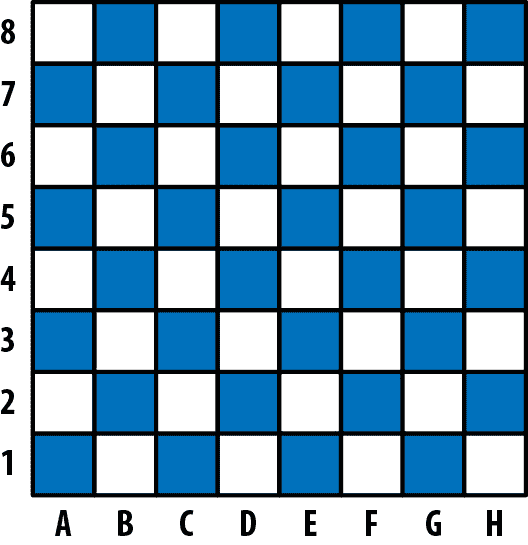
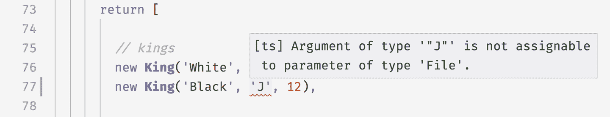
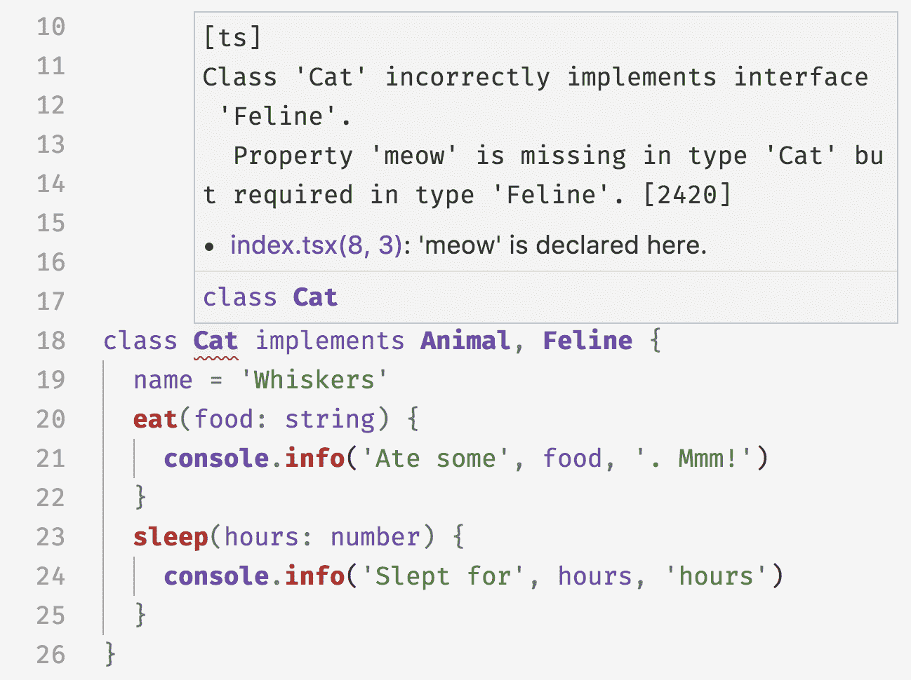

# 第五章：类和接口

如果您像大多数来自面向对象编程语言的程序员一样，类是您的基础和要点。类是您组织和思考代码的方式，也是封装的主要单元。您会高兴地发现，TypeScript 类大量借鉴了 C#，支持可见性修饰符、属性初始化器、多态、装饰器和接口等功能。但由于 TypeScript 类编译成常规 JavaScript 类，您也可以以类型安全的方式表达 JavaScript 习语，如混合类。

TypeScript 的某些类特性，如属性初始化器和装饰器，也被 JavaScript 类支持，^(1) 因此会生成运行时代码。其他特性，如可见性修饰符、接口和泛型，则是 TypeScript 独有的特性，仅在编译时存在，编译应用程序为 JavaScript 时不会生成任何代码。

在本章中，我将通过一个扩展示例向您介绍如何在 TypeScript 中使用类，以便您不仅可以对 TypeScript 的面向对象语言特性有直观的理解，还可以理解我们使用它们的方式和原因。请尝试跟着进行，将代码输入到您的代码编辑器中。

# 类和继承

我们要构建一个国际象棋引擎。我们的引擎将模拟国际象棋游戏，并为两名玩家提供轮流进行移动的 API。

我们将从勾勒类型开始：

```
// Represents a chess game
class Game {}

// A chess piece
class Piece {}

// A set of coordinates for a piece
class Position {}
```

有六种类型的棋子：

```
// ...
class King extends Piece {}
class Queen extends Piece {}
class Bishop extends Piece {}
class Knight extends Piece {}
class Rook extends Piece {}
class Pawn extends Piece {}
```

每个棋子都有颜色和当前位置。在国际象棋中，位置被建模为（字母，数字）坐标对；字母沿着 x 轴从左到右，数字沿着 y 轴从底部到顶部（图 5-1）。



###### 图 5-1\. 国际象棋中的标准代数符号：A–H（x 轴）称为“列”，1–8（反向 y 轴）称为“行”

让我们向我们的 `Piece` 类添加颜色和位置：

```
`type` `Color` `=` `'Black'` `|` `'White'`
`type` `File` `=` `'A'` `|` `'B'` `|` `'C'` `|` `'D'` `|` `'E'` `|` `'F'` `|` `'G'` `|` `'H'`
`type` `Rank` `=` `1` `|` `2` `|` `3` `|` `4` `|` `5` `|` `6` `|` `7` `|` `8` 

class Position {
  `constructor``(`
    `private` `file``:` `File``,` 
    `private` `rank``:` `Rank`
  `)` `{``}`
}

class Piece {
  `protected` `position``:` `Position` 
  `constructor``(`
    `private` `readonly` `color``:` `Color``,` 
    `file``:` `File``,`
    `rank``:` `Rank`
  `)` `{`
    `this``.``position` `=` `new` `Position``(``file``,` `rank``)`
  `}`
}

```


由于颜色、行和列相对较少，我们可以手动枚举它们的可能值作为类型文字。这将通过将这些类型的域约束为一些非常具体的字符串和数字，来帮助我们提供额外的安全性。


在构造函数中，`private` *访问修饰符* 自动将参数分配给 `this`（`this.file` 等），并将其可见性设置为私有，这意味着 `Piece` 实例内的代码可以读取和写入它，但 `Piece` 实例外的代码不能。不同 `Piece` 实例可以访问彼此的私有成员；任何其他类的实例，甚至是 `Piece` 的子类，也不能访问。


我们将实例变量 `position` 声明为 `protected`。与 `private` 不同，`protected` 将属性分配给 `this`，但与 `private` 不同的是，`protected` 使得属性对 `Piece` 的实例和任何 `Piece` 的子类的实例都可见。我们在声明时没有为 `position` 分配一个值，因此我们必须在 `Piece` 构造函数中为其分配一个值。如果我们没有在构造函数中为其分配一个值，TypeScript 会告诉我们该变量未被 *确定赋值*，即我们说它是类型 `T`，但实际上是 `T | undefined`，因为它在属性初始化程序或构造函数中未被赋值 —— 因此我们需要更新其签名以表明它不一定是 `Position`，而可能也是 `undefined`。


`new Piece` 接受三个参数：`color`、`file` 和 `rank`。我们对 `color` 添加了两个修饰符：`private`，意味着将其分配给 `this` 并确保它仅从 `Piece` 的实例访问，以及 `readonly`，意味着在此初始分配后，它只能读取，不能再写入。

# TSC 标志：`strictNullChecks` 和 `strictPropertyInitialization`

要为类实例变量启用确定赋值检查，请在你的 *tsconfig.json* 中启用 `strictNullChecks` 和 `strictPropertyInitialization` 标志。如果你已经使用了 `strict` 标志，你可以继续使用。

TypeScript 支持类的属性和方法的三种访问修饰符：

`public`

可从任何地方访问。这是默认的访问级别。

`protected`

可从此类的实例和其子类访问。

`private`

仅从此类的实例访问。

使用访问修饰符，你可以设计不会过多暴露其实现细节的类，并暴露出为他人使用定义良好的 API。

我们定义了一个 `Piece` 类，但不希望用户直接实例化一个新的 `Piece` —— 我们希望他们扩展它以创建 `Queen`、`Bishop` 等，并实例化那些类。我们可以使用类型系统来强制执行这一点，使用 `abstract` 关键字：

```
*`// ...`*
`abstract` class Piece {
  constructor(
    *`// ...`*

```

现在如果你尝试直接实例化一个 `Piece`，TypeScript 会报错：

```
new Piece('White', 'E', 1)  // Error TS2511: Cannot create an instance
                            // of an abstract class.
```

`abstract` 关键字意味着你不能直接实例化这个类，但并不意味着你不能在其上定义一些方法：

```
*`// ...`*
abstract class Piece {
  *`// ...`*
  `moveTo``(``position``:` `Position``)` `{`
    `this``.``position` `=` `position`
  `}`
  `abstract` `canMoveTo``(``position``:` `Position``)``:` `boolean`
}

```

我们的 `Piece` 类现在：

+   告知其子类它们必须实现一个名为 `canMoveTo` 的方法，该方法的签名必须兼容。如果一个类扩展了 `Piece` 但忘记实现抽象的 `canMoveTo` 方法，那在编译时就是类型错误：当你实现一个抽象类时，你必须也要实现其抽象方法。

+   提供了一个默认的 `moveTo` 实现（其子类可以选择覆盖）。我们没有在 `moveTo` 上放置访问修饰符，所以默认是 `public`，意味着它可从任何其他代码中读写。

让我们更新 `King`，实现 `canMoveTo`，以满足这个新需求。我们还将实现一个 `distanceFrom` 函数，以便轻松计算两个棋子之间的距离：

```
*`// ...`*
class Position {
  *`// ...`*
  `distanceFrom``(``position``:` `Position``)` `{`
    `return` `{`
      `rank``:` `Math.abs``(``position``.``rank` `-` `this``.``rank``)``,`
      `file``:` `Math.abs``(``position``.``file``.``charCodeAt``(``0``)` `-` `this``.``file``.``charCodeAt``(``0``)``)`
    `}`
  `}`
}

class King extends Piece {
  `canMoveTo``(``position``:` `Position``)` `{`
    `let` `distance` `=` `this``.``position``.``distanceFrom``(``position``)`
    `return` `distance``.``rank` `<` `2` `&&` `distance``.``file` `<` `2`
  `}`
}

```

当我们创建一个新游戏时，我们会自动创建一个棋盘和一些棋子：

```
*`// ...`*
class Game {
  `private` `pieces` `=` `Game``.``makePieces``(``)`

  `private` `static` `makePieces() {`
    `return` `[`

      `// Kings `      `new` `King``(``'White'``,` `'E'``,` `1``)``,`
      `new` `King``(``'Black'``,` `'E'``,` `8``)``,`

      `// Queens `      `new` `Queen``(``'White'``,` `'D'``,` `1``)``,`
      `new` `Queen``(``'Black'``,` `'D'``,` `8``)``,`

      `// Bishops `      `new` `Bishop``(``'White'``,` `'C'``,` `1``)``,`
      `new` `Bishop``(``'White'``,` `'F'``,` `1``)``,`
      `new` `Bishop``(``'Black'``,` `'C'``,` `8``)``,`
      `new` `Bishop``(``'Black'``,` `'F'``,` `8``)``,`

      *`// ...`*
    `]`
  }
}

```

由于我们严格类型化了 `Rank` 和 `File`，如果我们输入了另一个字母（如 `'J'`）或超出范围的数字（如 `12`），TypeScript 将在编译时给出错误（见图 5-2 ）。



###### 图 5-2。TypeScript 帮助我们坚持有效的等级和文件

这已足以展示 TypeScript 类的工作原理——我将避免深入讨论如何知道骑士何时可以吃掉一枚棋子，主教如何移动等细节。如果你有雄心壮志，看看是否可以以我们迄今为止所做的作为实现游戏其余部分的起点。

总结一下：

+   使用 `class` 关键字声明类。使用 `extends` 关键字扩展类。

+   类可以是具体类或 `abstract` 类。抽象类可以有 `abstract` 方法和 `abstract` 属性。

+   方法可以是 `private`、`protected` 或默认的 `public`。它们可以是实例方法或静态方法。

+   类可以有实例属性，这些属性也可以是 `private`、`protected` 或默认的 `public`。你可以在构造函数参数中声明它们，也可以在属性初始化器中声明它们。

+   在声明时，可以将实例属性标记为 `readonly`。

# super

与 JavaScript 一样，TypeScript 支持 `super` 调用。如果你的子类覆盖了父类定义的方法（比如 `Queen` 和 `Piece` 都实现了 `take` 方法），子类实例可以使用 `super` 调用来调用其父类的方法（例如 `super.take`）。`super` 调用有两种类型：

+   方法调用，如 `super.take`。

+   构造函数调用，具有特殊形式 `super()`，只能从构造函数中调用。如果你的子类有构造函数，必须从子类的构造函数中调用 `super()`，以正确连接类（别担心，TypeScript 会在你忘记时提醒你；这就像一个酷炫的未来机器大象）。

请注意，你只能使用 `super` 访问父类的方法，而不能访问其属性。

# 使用 `this` 作为返回类型

就像你可以将 `this` 用作值一样，你也可以将其用作类型（就像我们在“Typing this”中所做的那样）。在处理类时，`this` 类型对于注释方法的返回类型非常有用。

例如，让我们构建一个简化版的 ES6 `Set` 数据结构，支持两种操作：向集合中添加一个数字，以及检查给定的数字是否在集合中。你可以像这样使用它：

```
let set = new Set
set.add(1).add(2).add(3)
set.has(2) // true
set.has(4) // false
```

让我们定义 `Set` 类，从 `has` 方法开始：

```
class Set {
  has(value: number): boolean {
    // ...
  }
}
```

`add` 方法如何？当你调用 `add` 时，会得到一个 `Set` 的实例。我们可以将其类型定义为：

```
class Set {
  has(value: number): boolean {
    *`// ...`*
  }
  `add``(``value``:` `number``)``:` `Set` `{`
    *`// ...`*
  `}`
}

```

到目前为止，一切都好。当我们尝试子类化 `Set` 时会发生什么？

```
class MutableSet extends Set {
  delete(value: number): boolean {
    // ...
  }
}
```

当然，`Set`的`add`方法仍然返回一个`Set`，我们需要为我们的子类`MutableSet`覆盖它：

```
class MutableSet extends Set {
  delete(value: number): boolean {
    // ...
  }
  `add``(``value``:` `number``)``:` `MutableSet` `{`
    `// ... `  `}`
}

```

当你与扩展其他类的类一起工作时，这可能会变得有点乏味——你必须为每个返回`this`的方法覆盖签名。如果你最终不得不为了满足类型检查器而覆盖每个方法，那么从基类继承有什么意义呢？

相反，你可以使用`this`作为返回类型注释，让 TypeScript 为你完成这项工作：

```
class Set {
  has(value: number): boolean {
    // ...
  }
  add(value: number): `this` {
    // ...
  }
}

```

现在，你可以从`MutableSet`中删除`add`的覆盖，因为`Set`中的`this`指向一个`Set`实例，而`MutableSet`中的`this`指向一个`MutableSet`实例：

```
class MutableSet extends Set {
  delete(value: number): boolean {
    // ...
  }
}
```

这对于与链式 API（如我们在“构建器模式”中所做的）一起工作非常方便。

# 接口

当你使用类时，你经常会发现自己使用*接口*。

像类型别名一样，接口是一种命名类型的方法，这样你就不必在内联中定义它。类型别名和接口在大多数情况下是同一件事的两种语法（就像函数表达式和函数声明一样），但它们有一些小差异。让我们从它们的共同点开始。考虑以下类型别名：

```
type Sushi = {
  calories: number
  salty: boolean
  tasty: boolean
}
```

将它重写为接口是很容易的：

```
`interface` `Sushi` {
  calories: number
  salty: boolean
  tasty: boolean
}

```

在你使用`Sushi`类型别名的任何地方，你也可以使用`Sushi`接口。这两个声明都定义了形状，并且这些形状可以互相赋值（实际上它们是相同的！）。

当你开始组合类型时，事情变得更加有趣。让我们模拟除了`Sushi`之外的另一种食物：

```
type Cake = {
  calories: number
  sweet: boolean
  tasty: boolean
}
```

很多食物都有卡路里，而且味道不错——不只是`Sushi`和`Cake`。让我们将`Food`提取到它自己的类型中，并根据它重新定义我们的食物：

```
type Food = {
  calories: number
  tasty: boolean
}
type Sushi = `Food` `&` {
  salty: boolean
}
type Cake = `Food` `&` {
  sweet: boolean
}

```

几乎等效地，你也可以用接口做到这一点：

```
interface Food {
  calories: number
  tasty: boolean
}
interface Sushi `extends` `Food` {
  salty: boolean
}
interface Cake `extends` `Food` {
  sweet: boolean
}

```

###### 注意

接口不必扩展其他接口。事实上，一个接口可以扩展任何形状：一个对象`type`，一个`class`或另一个`interface`。

类型和接口之间有哪些区别？有三个，而且它们是微妙的。

首先，类型别名更通用，因为它们的右侧可以是任何类型，包括类型表达式（一种类型，可能还包括一些类型操作符如`&`或`|`）；对于接口来说，右侧必须是一个形状。例如，无法将以下类型别名重写为接口：

```
type A = number
type B = A | string
```

第二个区别是，当你扩展一个接口时，TypeScript 将确保你扩展的接口可以赋值给你的扩展。例如：

```
interface A {
  good(x: number): string
  bad(x: number): string
}

interface B extends A {
  good(x: string | number): string
  bad(x: string): string  // Error TS2430: Interface 'B' incorrectly extends
}                         // interface 'A'. Type 'number' is not assignable
                          // to type 'string'.
```

当你使用交集类型时不是这样的：如果你将上一个示例中的接口转换为类型别名，并将`extends`转换为交集（`&`），TypeScript 将尽力将你的扩展与它扩展的类型结合起来，导致`bad`的重载签名而不是编译时错误（在你的代码编辑器中试试吧！）。

当您为对象类型建模继承时，TypeScript 为接口进行的可分配性检查可以帮助您捕捉错误。

第三个区别是在相同作用域中多个名称相同的*类型别名*将抛出编译时错误。这是一种称为*声明合并*的功能。

## 声明合并

声明合并是 TypeScript 自动组合多个具有相同名称的声明的方式。当我们引入枚举时（“枚举”），它出现了；当处理`namespace`声明（参见“命名空间”）等其他功能时也会出现。在本节中，我们将简要介绍接口上下文中的声明合并。要深入了解，请转到“声明合并”。

例如，如果您声明两个名称相同的`User`接口，则 TypeScript 会自动将它们合并为单个接口：

```
// User has a single field, name
interface User {
  name: string
}

// User now has two fields, name and age
interface User {
  age: number
}

let a: User = {
  name: 'Ashley',
  age: 30
}
```

如果您使用类型别名重复该示例的情况如下：

```
type User = {  // Error TS2300: Duplicate identifier 'User'.
  name: string
}

type User = {  // Error TS2300: Duplicate identifier 'User'.
  age: number
}
```

请注意，这两个接口不能冲突；如果一个类型将`property`声明为`T`，而另一个类型将其声明为`U`，并且`T`和`U`不相同，则会出现错误：

```
interface User {
  age: string
}

interface User {
  age: number  // Error TS2717: Subsequent property declarations must have
}              // the same type. Property 'age' must be of type 'string',
               // but here has type 'number'.
```

如果您的接口声明泛型（请跳到“多态性”以了解更多），那些泛型必须以完全相同的方式声明两个接口才能合并 - 直到泛型的名称为止！

```
interface User<Age extends number> {  // Error TS2428: All declarations of 'User'
  age: Age                            // must have identical type parameters.
}

interface User<Age extends string> {
  age: Age
}
```

有趣的是，这是 TypeScript 检查两种类型不仅可分配，而且*相同*的罕见场所。

## 实现

当您声明类时，可以使用`implements`关键字表示它满足特定接口。与其他显式类型注释一样，这是一种方便的方式，可以在接口实现不正确的情况下将类型级约束添加到实现本身，以便在下游显示不清楚为什么会引发错误。这也是实现常见设计模式（如适配器、工厂和策略）的熟悉方式（有关一些示例，请参阅本章末尾）。

看起来是这样的：

```
interface Animal {
  eat(food: string): void
  sleep(hours: number): void
}

class Cat implements Animal {
  eat(food: string) {
    console.info('Ate some', food, '. Mmm!')
  }
  sleep(hours: number) {
    console.info('Slept for', hours, 'hours')
  }
}
```

`Cat`必须实现`Animal`声明的每个方法，并且可以在其上实现更多方法和属性。

接口可以声明实例属性，但不能声明可见性修饰符（`private`、`protected`和`public`），也不能使用`static`关键字。您还可以像在对象（在第三章）中一样为实例属性标记为`readonly`：

```
interface Animal {
  `readonly` `name``:` `string`
  eat(food: string): void
  sleep(hours: number): void
}

```

您不限于实现一个接口，您可以实现尽可能多的接口：

```
interface Animal {
  readonly name: string
  eat(food: string): void
  sleep(hours: number): void
}

`interface` `Feline` `{`
  `meow``(``)``:` `void`
`}`

class Cat implements Animal`,` `Feline` {
  name = 'Whiskers'
  eat(food: string) {
    console.info('Ate some', food, '. Mmm!')
  }
  sleep(hours: number) {
    console.info('Slept for', hours, 'hours')
  }
  `meow() {`
    `console``.``info``(``'Meow'``)`
  `}`
}

```

所有这些功能完全安全。如果您忘记实现方法或属性，或者实现不正确，TypeScript 将来拯救您（参见图 5-3）。



###### 图 5-3\. TypeScript 在你忘记实现必需方法时会抛出错误。

## 实现接口与扩展抽象类的区别

实现接口与扩展抽象类非常相似。不同之处在于接口更通用和轻量级，而抽象类则更专用和功能丰富。

接口是一种建模形状的方式。在值级别上，这意味着对象、数组、函数、类或类实例。接口不生成 JavaScript 代码，只存在于编译时。

抽象类只能模拟类。它生成运行时代码，你猜对了，是 JavaScript 类。抽象类可以有构造函数，提供默认实现，并设置属性和方法的访问修饰符。接口则不能做这些事情。

你使用哪个取决于你的用例。当一个实现被多个类共享时，请使用抽象类。当你需要一种轻量级方式来表达“这个类是`T`”时，请使用接口。

# 类是结构化类型化的

像 TypeScript 中的其他类型一样，TypeScript 通过它们的结构而不是它们的名称来比较类。类与任何其他共享相同形状的类型兼容，包括定义与类相同属性或方法的常规对象。对于从 C#、Java、Scala 和大多数其他按名义类型化类的语言中来的人来说，这一点很重要。这意味着如果你有一个接受`Zebra`的函数，并给它一个`Poodle`，TypeScript 可能不会介意：

```
class Zebra {
  trot() {
    // ...
  }
}

class Poodle {
  trot() {
    // ...
  }
}

function ambleAround(animal: Zebra) {
  animal.trot()
}

let zebra = new Zebra
let poodle = new Poodle

ambleAround(zebra)   // OK
ambleAround(poodle)  // OK
```

正如你们中的系统发生学家所知，斑马不是贵宾犬，但 TypeScript 并不介意！只要`Poodle`可分配给`Zebra`，TypeScript 就没问题，因为从我们函数的角度来看，这两者是可以互换的；重要的是它们都实现了`.trot`方法。如果你使用的是几乎任何其他按名义类型化类的语言，此代码将引发错误；但 TypeScript 是完全结构化类型化的，所以此代码是完全可接受的。

此规则的例外是带有`private`或`protected`字段的类：在检查形状是否可分配给类时，如果类具有任何`private`或`protected`字段，并且形状不是该类或其子类的实例，则形状不能分配给类：

```
class A {
  private x = 1
}
class B extends A {}
function f(a: A) {}

f(new A)   // OK
f(new B)   // OK

f({x: 1})  // Error TS2345: Argument of type '{x: number}' is not
           // assignable to parameter of type 'A'. Property 'x' is
           // private in type 'A' but not in type '{x: number}'.
```

# 类声明值和类型两者：

在 TypeScript 中你可以表达的大多数事物要么是值，*要么*是类型：

```
// values
let a = 1999
function b() {}

// types
type a = number
interface b {
  (): void
}
```

在 TypeScript 中，类型和值是分开命名空间的。根据你如何使用术语（例如本例中的`a`或`b`），TypeScript 知道是否将其解析为类型还是值：

```
// ...
if (a + 1 > 3) //... // TypeScript infers from context that you mean the value a
let x: a = 3         // TypeScript infers from context that you mean the type a
```

这种*上下文术语解析*真的很好，让我们能够做一些很酷的事情，比如实现伴生类型（见“伴生对象模式”）。

类和枚举是特殊的。它们是独特的，因为它们在类型命名空间和值命名空间都生成了一个类型和一个值：

```
class C {}
let c: C 
  = new C 

enum E {F, G}
let e: E 
  = E.F 
```


在这个上下文中，`C` 指的是我们的 `C` 类的实例类型。


在这个上下文中，`C` 指的是值 `C`。


在这个上下文中，`E` 指的是我们的 `E` 枚举类型。


在这个上下文中，`E` 指的是值 `E`。

当我们使用类时，我们需要一种方式来表达“这个变量应该是这个类的实例”，枚举类型也是如此（“这个变量应该是这个枚举的成员”）。因为类和枚举在类型级别生成类型，我们能够轻松地表达这种“is-a”关系。^(2)

我们还需要一种方法在运行时表示类，以便我们可以使用 `new` 实例化它，调用静态方法，使用元编程，并使用 `instanceof` 操作它——因此类还需要生成一个值。

在上一个示例中，`C` 指的是类 `C` 的实例。那么如何讨论 `C` 类本身？我们使用 `typeof` 关键字（TypeScript 提供的类型运算符，类似于 JavaScript 的值级 `typeof`，但用于类型）。

让我们创建一个 `StringDatabase` 类——这是世界上最简单的数据库：

```
type State = {
  [key: string]: string
}

class StringDatabase {
  state: State = {}
  get(key: string): string | null {
    return key in this.state ? this.state[key] : null
  }
  set(key: string, value: string): void {
    this.state[key] = value
  }
  static from(state: State) {
    let db = new StringDatabase
    for (let key in state) {
      db.set(key, state[key])
    }
    return db
  }
}
```

这个类声明生成了哪些类型？实例类型 `StringDatabase`：

```
interface StringDatabase {
  state: State
  get(key: string): string | null
  set(key: string, value: string): void
}
```

而构造函数类型 `typeof StringDatabase`：

```
interface StringDatabaseConstructor {
  new(): StringDatabase
  from(state: State): StringDatabase
}
```

即，`StringDatabaseConstructor` 有一个单一的方法 `.from`，并且通过 `new` 构造函数创建一个 `StringDatabase` 实例。结合起来，这两个接口模拟了类的构造函数和实例两个方面。

`new()` 这一部分称为 *构造函数签名*，是 TypeScript 表示给定类型可以使用 `new` 操作符实例化的方式。由于 TypeScript 是结构化类型的，这是我们描述类的最佳方式：一个类是任何可以使用 `new` 实例化的东西。

在这种情况下，构造函数不接受任何参数，但是您也可以使用它来声明接受参数的构造函数。例如，假设我们更新 `StringDatabase` 来接受一个可选的初始状态：

```
class StringDatabase {
  constructor(public state: State = {}) {}
  // ...
}
```

然后我们可以将 `StringDatabase` 的构造函数签名类型化为：

```
interface StringDatabaseConstructor {
  new(state?: State): StringDatabase
  from(state: State): StringDatabase
}
```

因此，类声明不仅在值和类型层面生成术语，还在类型层面生成了两个术语：一个表示类的实例；一个表示类构造函数本身（可以使用 `typeof` 类型操作符访问）。

# 多态性

类和接口像函数和类型一样，对泛型类型参数具有丰富的支持，包括默认值和边界。您可以将泛型范围限制到整个类或接口，或者到特定的方法：

```
class MyMap<K, V> { 
  constructor(initialKey: K, initialValue: V) { 
    // ...
  }
  get(key: K): V { 
    // ...
  }
  set(key: K, value: V): void {
    // ...
  }
  merge<K1, V1>(map: MyMap<K1, V1>): MyMap<K | K1, V | V1> { 
    // ...
  }
  static of<K, V>(k: K, v: V): MyMap<K, V> { 
    // ...
  }
}
```


在你声明你的 `class` 时绑定类作用域的泛型类型。这里，`K` 和 `V` 可用于 `MyMap` 上的每个实例方法和实例属性。


注意，你不能在 `constructor` 中声明泛型类型。相反，将声明提升到你的 `class` 声明中。


在你的类内部任何地方使用类作用域的泛型类型。


实例方法可以访问类级别的泛型，并且还可以在顶部声明它们自己的泛型。`.merge` 使用了类级别的泛型 `K` 和 `V`，并且还声明了它自己的两个泛型，`K1` 和 `V1`。


静态方法不可以访问它们类的泛型，就像在值级别上它们不能访问它们类的实例变量一样。`of` 不能访问在  中声明的 `K` 和 `V`；相反，它声明了它自己的 `K` 和 `V` 泛型。

你也可以将泛型绑定到接口上：

```
interface MyMap<K, V> {
  get(key: K): V
  set(key: K, value: V): void
}
```

就像函数一样，你可以显式地将具体类型绑定到泛型上，或者让 TypeScript 自动推断类型：

```
let a = new MyMap<string, number>('k', 1) // MyMap<string, number>
let b = new MyMap('k', true) // MyMap<string, boolean>

a.get('k')
b.set('k', false)
```

# Mixins

JavaScript 和 TypeScript 没有 `trait` 或 `mixin` 关键字，但是我们可以自己实现它们。两者都是模拟“多继承”（一个类可以继承多个其他类）和“角色导向编程”的方式，一种编程风格，你不会说“这个东西是一个 `Shape`”，而是描述一个东西的属性，比如“它可以被测量”或“它有四个边”。而不是“是一个”的关系，你描述“能”和“有一个”的关系。

让我们来实现一个 mixin。

Mixins 是一种模式，允许我们将行为和属性“混入”到一个类中。按照惯例，mixins：

+   可以有状态（即实例属性）

+   只能提供具体方法（而不是抽象方法）

+   可以有构造函数，它们按照它们被混合进来的类的顺序调用

TypeScript 没有内置的 mixin 概念，但是我们可以自己实现它们。例如，让我们为 TypeScript 类设计一个调试库。我们将其称为 `EZDebug`。该库通过让你在运行时记录使用该库的任何类的信息来工作，以便你可以检查它们。我们可以这样使用它：

```
class User {
  // ...
}

User.debug() // evaluates to 'User({"id": 3, "name": "Emma Gluzman"})'
```

有了标准的 `.debug` 接口，我们的用户将能够调试任何东西！让我们来构建它。我们将使用一个 mixin 来建模它，我们称之为 `withEZDebug`。一个 mixin 只是一个接受一个类构造函数并返回一个类构造函数的函数，因此我们的 mixin 可能看起来像这样：

```
type ClassConstructor = new(...args: any[]) => {} 

function withEZDebug<C extends ClassConstructor>(Class: C) { 
  return class extends Class { 
    constructor(...args: any[]) { 
      super(...args) 
    }
  }
}
```


我们首先声明一个类型`ClassConstructor`，它代表任何构造函数。由于 TypeScript 是完全结构化类型的，我们说一个构造函数是可以`new`的任何东西。我们不知道构造函数可能具有什么类型的参数，因此我们说它接受任意数量的任何类型的参数。^(3)


我们声明我们的`withEZDebug`混入一个类型参数`C`。`C`至少必须是一个类构造函数，我们通过一个`extends`子句来强制执行这一点。我们让 TypeScript 推断`withEZDebug`的返回类型，这是`C`和我们的新匿名类的交集。


由于混入是一个接受构造函数并返回构造函数的函数，我们返回一个匿名类构造函数。


类构造函数必须至少接受类可能接受的参数。但请记住，由于我们事先不知道可能传入的类是什么，我必须保持尽可能一般化，这意味着任意数量的任何类型的参数——就像`ClassConstructor`一样。


最后，由于这个匿名类扩展了另一个类，为了正确地连接一切，我们需要记住调用`Class`的构造函数。

就像常规 JavaScript 类一样，如果在`constructor`中没有更多的逻辑，你可以省略和行。对于这个`withEZDebug`示例，我们不会在构造函数中放置任何逻辑，所以可以省略它们。

现在我们已经设置好样板，是时候进行一些调试魔术了。当我们调用`.debug`时，我们希望记录出类的构造函数名称和实例的值：

```
type ClassConstructor = new(...args: any[]) => {}

function withEZDebug<C extends ClassConstructor>(Class: C) {
  return class extends Class {
    `debug() {`
      `let` `Name` `=` `Class``.``constructor``.``name`
      `let` `value` `=` `this``.``getDebugValue``(``)`
      `return` `Name` `+` `'('` `+` `JSON``.``stringify``(``value``)` `+` `')'`
    `}`
  }
}

```

但是！我们如何确保类实现了`.getDebugValue`方法，以便我们可以调用它？在继续之前，请花点时间考虑一下——你能想出来吗？

答案是，我们不接受任何旧类，而是使用泛型类型确保传递给`withEZDebug`的类定义了`.getDebugValue`方法：

```
type ClassConstructor`<``T``>` = new(...args: any[]) => `T` 

function withEZDebug<C extends ClassConstructor`<``{`
  `getDebugValue``(``)``:` `object` 
`}``>`>(Class: C) {
  *`// ...`*
}

```


我们向`ClassConstructor`添加了一个泛型类型参数。


我们将一个形状类型绑定到`ClassConstructor`，`C`，强制执行我们传递给`withEZDebug`的构造函数至少定义`.getDebugValue`方法。

就这样！那么，你如何使用这个令人难以置信的调试工具呢？像这样：

```
class HardToDebugUser {
  constructor(
    private id: number,
    private firstName: string,
    private lastName: string
  ) {}
  getDebugValue() {
    return {
      id: this.id,
      name: this.firstName + ' ' + this.lastName
    }
  }
}

let User = withEZDebug(HardToDebugUser)
let user = new User(3, 'Emma', 'Gluzman')
user.debug() // evaluates to 'User({"id": 3, "name": "Emma Gluzman"})'
```

酷，对吧？你可以将尽可能多的混入应用于一个类，从而产生行为更丰富的类，所有这些都是类型安全的。混入有助于封装行为，是指定可重用行为的一种表达方式。^(4)

# 装饰器

装饰器是 TypeScript 的一项实验性功能，它为类、类方法、属性和方法参数的元编程提供了清晰的语法。它们只是在你装饰的内容上调用函数的语法而已。

# TSC Flag: experimentalDecorators

因为它们仍处于实验阶段——这意味着它们可能会在未来的 TypeScript 版本中以不兼容的方式更改，甚至可能会完全移除——装饰器被隐藏在了一个 TSC 标志后面。如果你可以接受这一点，并且想要尝试这个功能，请在你的 *tsconfig.json* 中设置 `"experimentalDecorators": true`，然后继续阅读。

为了了解装饰器的工作原理，让我们从一个例子开始：

```
@serializable
class APIPayload {
  getValue(): Payload {
    // ...
  }
}
```

类装饰器`@serializable`包装我们的`APIPayload`类，并可选择返回替代它的新类。没有装饰器的话，你可能需要用以下方式来实现同样的功能：

```
let APIPayload = serializable(class APIPayload {
  getValue(): Payload {
    // ...
  }
})
```

对于每种类型的装饰器，TypeScript 要求在作用域中具有指定名称和所需签名的函数（见表 5-1）。

表 5-1\. 不同类型装饰器函数的预期类型签名

| 正在装饰的内容 | 预期的类型签名 |
| --- | --- |
| 类 | `(Constructor: {new(...any[]) => any}) => any` |
| 方法 | `(classPrototype: {}, methodName: string, descriptor: PropertyDescriptor) => any` |
| 静态方法 | `(Constructor: {new(...any[]) => any}, methodName: string, descriptor: PropertyDescriptor) => any` |
| 方法参数 | `(classPrototype: {}, paramName: string, index: number) => void` |
| 静态方法参数 | `(Constructor: {new(...any[]) => any}, paramName: string, index: number) => void` |
| 属性 | `(classPrototype: {}, propertyName: string) => any` |
| 静态属性 | `(Constructor: {new(...any[]) => any}, propertyName: string) => any` |
| 属性的 getter/setter | `(classPrototype: {}, propertyName: string, descriptor: PropertyDescriptor) => any` |
| 静态属性的 getter/setter | `(Constructor: {new(...any[]) => any}, propertyName: string, descriptor: PropertyDescriptor) => any` |

TypeScript 并没有任何内置的装饰器：无论使用什么装饰器，都需要自己实现（或从 NPM 安装）。对于每种装饰器类型（类、方法、属性和函数参数），其实现都是一个满足特定签名的常规函数。例如，我们的 `@serializable` 装饰器可能看起来像这样：

```
type ClassConstructor<T> = new(...args: any[]) => T 

function serializable<
  T extends ClassConstructor<{
    getValue(): Payload 
  }>
>(Constructor: T) { 
  return class extends Constructor { 
    serialize() {
      return this.getValue().toString()
    }
  }
}
```


记住，在 TypeScript 中，`new()` 是我们对类构造函数进行结构化类型的方式。对于可以被扩展（使用`extends`）的类构造函数，TypeScript 要求我们用`any`展开来对其参数进行类型化：`new(...any[])`。


`@serializable` 可以装饰任何其实例实现了 `.getValue` 方法且返回 `Payload` 的类。


类装饰器是一个接受单个参数——类的函数。如果装饰器函数返回一个类（如示例中所示），它将在运行时替换它所装饰的类；否则，它将返回原始类。


要装饰类，我们返回一个扩展它并添加 `.serialize` 方法的类。

当我们尝试调用 `.serialize` 时会发生什么？

```
let payload = new APIPayload
let serialized = payload.serialize() // Error TS2339: Property 'serialize' does
                                     // not exist on type 'APIPayload'.
```

TypeScript 假设装饰器不会改变其装饰对象的形状——这意味着你没有添加或移除方法和属性。它在编译时检查你返回的类是否可以分配给传入的类，但目前 TypeScript 不会跟踪你在装饰器中所做的扩展。

在 TypeScript 的装饰器成为更成熟的功能之前，建议避免使用它们，而是坚持使用普通函数：

```
let DecoratedAPIPayload = serializable(APIPayload)
let payload = new DecoratedAPIPayload
payload.serialize()                  // string
```

我们不会在本书中深入探讨装饰器。更多信息请访问[官方文档](http://bit.ly/2IDQd1U)。

# 模拟 final 类

虽然 TypeScript 不支持类或方法的 `final` 关键字，但可以轻松地为类模拟它。如果你之前没有接触过面向对象语言，`final` 是一些语言用来标记类为不可扩展或方法为不可覆盖的关键字。

要模拟 TypeScript 中的 `final` 类，我们可以利用私有构造函数：

```
class MessageQueue {
  private constructor(private messages: string[]) {}
}
```

当 `constructor` 被标记为 `private` 时，你不能 `new` 这个类或者扩展它：

```
class BadQueue extends MessageQueue {}  // Error TS2675: Cannot extend a class
                                        // 'MessageQueue'. Class constructor is
                                        // marked as private.

new MessageQueue([])                    // Error TS2673: Constructor of class
                                        // 'MessageQueue' is private and only
                                        // accessible within the class
                                        // declaration.
```

除了阻止你扩展类之外，私有构造函数还阻止你直接实例化它。但是对于 `final` 类，我们希望能够实例化类，只是不允许扩展它。我们如何保留第一个限制但消除第二个限制呢？很简单：

```
class MessageQueue {
  private constructor(private messages: string[]) {}
  `static` `create``(``messages``:` `string``[``]``)` `{`
    `return` `new` `MessageQueue``(``messages``)`
  `}`
}

```

这改变了 `MessageQueue` 的 API 一点，但在编译时很好地防止扩展：

```
class BadQueue extends MessageQueue {}  // Error TS2675: Cannot extend a class
                                        // 'MessageQueue'. Class constructor is
                                        // marked as private.

MessageQueue.create([]) // MessageQueue
```

# 设计模式

如果我们在 TypeScript 中没有实现一两个设计模式，这将不会是一个面向对象编程的章节，对吧？

## 工厂模式

*工厂模式* 是一种创建某种类型对象的方式，将具体对象的创建决策留给创建该对象的特定工厂。

让我们建立一个鞋厂。我们首先定义一个`Shoe`类型，和几种鞋子：

```
type Shoe = {
  purpose: string
}

class BalletFlat implements Shoe {
  purpose = 'dancing'
}

class Boot implements Shoe {
  purpose = 'woodcutting'
}

class Sneaker implements Shoe {
  purpose = 'walking'
}
```

注意，此示例使用了 `type`，但我们也可以使用 `interface`。

现在，让我们来制造一个鞋厂：

```
let Shoe = {
  create(type: 'balletFlat' | 'boot' | 'sneaker'): Shoe { 
    switch (type) { 
      case 'balletFlat': return new BalletFlat
      case 'boot': return new Boot
      case 'sneaker': return new Sneaker
    }
  }
}
```


使用联合类型来定义 `type` 可以尽可能地使 `.create` 类型安全，防止在编译时传入无效的 `type`。


切换 `type` 让 TypeScript 能够轻松强制我们处理每种 `Shoe` 的类型。

在这个示例中，我们使用伴生对象模式（参见 “伴生对象模式”）来声明类型`Shoe`和具有相同名称的值`Shoe`（请记住 TypeScript 为值和类型分别提供了独立的命名空间），作为一种信号表明该值提供了操作该类型的方法。要使用工厂，我们只需调用`.create`：

```
Shoe.create('boot') // Shoe
```

大功告成！我们有了一个工厂模式。请注意，我们还可以进一步指示`Shoe.create`的类型签名，传入`'boot'`将返回一个`Boot`，传入`'sneaker'`将返回一个`Sneaker`等等，但这将打破工厂模式给我们的抽象（消费者不应知道他们将得到什么具体的类，只知道这个类满足特定的接口）。

## 建造者模式

建造者模式（*builder pattern*）是一种将对象的构建过程与其实际实现方式分离的方法。如果你使用过 JQuery 或者 ES6 中的数据结构如`Map`和`Set`，这种 API 风格应该很熟悉。它看起来像这样：

```
new RequestBuilder()
  .setURL('/users')
  .setMethod('get')
  .setData({firstName: 'Anna'})
  .send()
```

如何实现`RequestBuilder`？很简单——我们从一个空的类开始：

```
class RequestBuilder {}
```

首先，我们将添加`.setURL`方法：

```
class RequestBuilder {

  `private` `url``:` `string` `|` `null` `=` `null` 

  `setURL``(``url``:` `string``)``:` `this` `{` 
    `this``.``url` `=` `url`
    `return` `this`
  `}`
}

```


我们使用一个私有实例变量`url`来跟踪用户设置的 URL，初始值为`null`。


`setURL`方法的返回类型是`this`（参见 “将 this 用作返回类型”），即用户在`setURL`上调用的具体`RequestBuilder`实例。

现在让我们添加示例中的其他方法：

```
class RequestBuilder {

  `private` `data``:` `object` `|` `null` `=` `null`
  `private` `method``:` `'get'` `|` `'post'` `|` `null` `=` `null`
  private url: string | null = null

  `setMethod``(``method``:` `'get'` `|` `'post'``)``:` `this` `{`
    `this``.``method` `=` `method`
    `return` `this`
  `}`
  `setData``(``data``:` `object``)``:` `this` `{`
    `this``.``data` `=` `data`
    `return` `this`
  `}`
  setURL(url: string): this {
    this.url = url
    return this
  }

  `send() {`
    `// ... `  `}`
}

```

就是这样了。

###### 注意

这种传统的构建者设计并不完全安全：我们可以在设置方法、URL 或数据之前调用`.send`，导致运行时异常（记住，那是糟糕的异常）。参见练习 4，了解如何改进这种设计。

# 总结

现在，我们全面探索了 TypeScript 类的各个方面：如何声明类；如何从类继承和实现接口；如何将类标记为`abstract`以防止实例化；如何使用`static`在类上添加字段或方法，以及在实例上不使用它；如何使用`private`、`protected`和`public`可见性修饰符来控制对字段或方法的访问；如何使用`readonly`修饰符将字段标记为只读。我们讨论了如何安全地使用`this`和`super`，探讨了类同时作为值和类型的含义，以及类型别名和接口之间的差异，声明合并的基础知识，以及如何在类中使用泛型类型。最后，我们还涵盖了一些更高级的类模式：混入（mixins）、装饰器（decorators）以及模拟`final`类。为了结束本章，我们总结了几种常见的处理类的模式。

# 练习

1.  类和接口之间有哪些区别？

1.  当你将一个类的构造函数标记为`private`时，这意味着你不能实例化或扩展这个类。如果你将它标记为`protected`会发生什么？在你的代码编辑器中尝试一下，并看看你能否弄清楚。

1.  扩展我们开发的 “工厂模式” 实现，使其更安全，牺牲一些抽象性。更新实现，以便消费者在编译时知道调用 `Shoe.create('boot')` 返回一个 `Boot`，调用 `Shoe.create('balletFlat')` 返回一个 `BalletFlat`（而不是两者都返回一个 `Shoe`）。提示：回想一下 “重载函数类型”。

1.  [困难] 作为一个练习，想一想你如何设计一个类型安全的建造者模式。扩展 “建造者模式” 以：

    1.  在编译时保证在设置至少一个 URL 和一个方法之前，某人不能调用`.send`。如果你还强制用户按特定顺序调用方法，会更容易实现这个保证吗？（提示：你可以返回什么代替 `this`？）

    1.  [困难] 如果你想要做出这个保证，同时又让人们可以按任意顺序调用方法，你会如何修改你的设计？（提示：你可以使用 TypeScript 的哪个特性，使得每个方法的返回类型在每次方法调用后“添加”到 `this` 类型？）

^(1) 或者很快将由 JavaScript 类支持。

^(2) 因为 TypeScript 是结构化类型的，所以对于类的关系更像是“看起来像”—任何实现与你的类相同形状的对象都可以赋值给你的类的类型。

^(3) 注意 TypeScript 在这里很挑剔：构造函数类型的参数类型必须是 `any[]`（而不是 `void`、`unknown[]` 等），以便我们能够扩展它。

^(4) 少数语言—Scala、PHP、Kotlin 和 Rust 等—实现了一个精简版的混入，称为 *traits*。Traits 类似于混入，但没有构造函数，也不支持实例属性。这样更容易将它们连接起来，防止多个 trait 访问它们与基类之间共享的状态时发生冲突。
