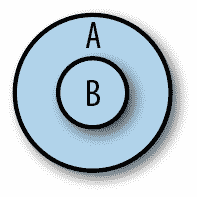
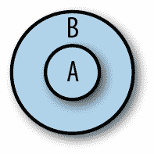

# 第六章：高级类型

TypeScript 拥有一个世界级的类型系统，支持强大的类型级编程特性，甚至可能让最顽固的 Haskell 程序员也会嫉妒。正如你现在所知道的，该类型系统不仅极具表现力，而且易于使用，使得声明类型约束和关系变得简单、简洁，并且大多数情况下都能被推断出来。

我们需要这样一个富有表现力且不寻常的类型系统，因为 JavaScript 是如此动态。建模原型、动态绑定的 `this`、函数重载和始终变化的对象等内容需要一个丰富的类型系统和一整套类型操作符，这些让蝙蝠侠都会瞪大眼睛。

我将以深入探讨 TypeScript 中的子类型、可赋值性、变异和扩展开始本章，更详细地介绍 TypeScript 基于控制流的类型检查特性，包括细化和全面性，并继续介绍一些高级的类型级编程特性：对象类型的键入和映射、使用条件类型、定义自己的类型保护以及像类型断言和确定赋值断言这样的逃逸口。最后，我将介绍一些高级模式，以提高类型的安全性：伴随对象模式、改进元组类型的推断、模拟名义类型以及安全地扩展原型。

# 类型之间的关系

让我们从更近距离来看 TypeScript 中的类型关系。

## 子类型和超类型

我们在“谈论类型”中稍微提到了可赋值性。既然你已经见识了 TypeScript 提供的大部分类型，我们可以更深入地探讨，从顶层开始：什么是子类型？



###### 图 6-1\. B 是 A 的子类型

如果你回头看第 3-1 图，你会看到 TypeScript 内建的子类型关系。例如：

+   数组是对象的子类型。

+   元组是数组的子类型。

+   一切都是 `any` 的子类型。

+   `never` 是一切的子类型。

+   如果你有一个扩展 `Animal` 的类 `Bird`，那么 `Bird` 是 `Animal` 的子类型。

从我刚给出的子类型的定义来看，这意味着：

+   你需要对象的地方也可以使用数组。

+   你需要数组的任何地方也可以使用元组。

+   你需要 `any` 的地方也可以使用对象。

+   你可以在任何地方使用 `never`。

+   你需要 `Animal` 的地方也可以使用 `Bird`。

正如你所猜测的那样，超类型是子类型的反义词。



###### 图 6-2\. B 是 A 的超类型

再次来自图 3-1 中的流程图：

+   数组是元组的超类型。

+   对象是数组的超类型。

+   `Any` 是一切的超类型。

+   `never` 是一无所有的超类型。

+   `Animal` 是 `Bird` 的超类型。

这只是子类型工作的反向操作，没有更多内容。

## 变异性

对于大多数类型来说，直觉上判断某个类型`A`是否是另一个类型`B`的子类型是相当容易的。对于诸如`number`、`string`等简单类型，你可以在图 3-1 中查找，或通过推理（“`number`包含在联合类型`number | string`中，因此它必须是它的子类型”）。

但对于参数化（泛型）类型和其他更复杂的类型，情况就变得更加复杂了。考虑这些情况：

+   `Array<A>`何时是`Array<B>`的子类型？

+   当形状`A`何时是另一个形状`B`的子类型？

+   一个函数`(a: A) => B`何时是另一个函数`(c: C) => D`的子类型？

对于包含其他类型的类型的子类型规则（即具有类型参数的东西，如`Array<A>`，具有字段的形状如`{a: number}`，或函数如`(a: A) => B`），推理起来更为困难，答案也不那么明确。事实上，关于这些复杂类型的子类型规则是编程语言之间差异的一个重要争议点——几乎没有两种语言是相同的！

为了使以下规则更易于阅读，我将介绍一些语法片段，让我们能更精确、更简洁地谈论类型。这种语法不是有效的 TypeScript；这只是让你和我在谈论类型时使用的一种共同语言。别担心，我保证这种语法不是数学：

+   `A <: B`的意思是“`A`是`B`类型的子类型或相同类型。”

+   `A >: B`的意思是“`A`是`B`类型的超类型或相同类型。”

### 形状和数组的变化

要对为什么不同的语言在复杂类型的子类型规则上存在分歧有所直觉，让我通过一个例子复杂类型来带你了解一下：形状。假设您的应用程序中有一个描述用户的形状。您可能用一对看起来像这样的类型表示它：

```
// An existing user that we got from the server
type ExistingUser = {
  id: number
  name: string
}

// A new user that hasn't been saved to the server yet
type NewUser = {
  name: string
}
```

现在假设您公司的一位实习生被要求编写一些代码来删除用户。他们从这样开始：

```
function deleteUser(user: {id?: number, name: string}) {
  delete user.id
}

let existingUser: ExistingUser = {
  id: 123456,
  name: 'Ima User'
}

deleteUser(existingUser)
```

`deleteUser`接受一个类型为`{id?: number, name: string}`的对象，并且传递了一个类型为`{id: number, name: string}`的`existingUser`。请注意，`id`属性的类型（`number`）是预期类型（`number | undefined`）的*子类型*。因此整个对象`{id: number, name: string}`是`{id?: number, name: string}`的子类型，因此 TypeScript 允许它通过。

你能看到这里的安全问题吗？这是一个微妙的问题：在将`ExistingUser`传递给`deleteUser`后，TypeScript 不知道用户的`id`已经被删除了，所以如果我们在用`deleteUser(existingUser)`删除后仍然读取`existingUser.id`，TypeScript 仍然认为`existingUser.id`的类型是`number`！

显然，在某个期望其超类型的位置使用对象类型可能是不安全的。那么为什么 TypeScript 允许呢？一般来说，TypeScript 并不是设计为完全安全的；相反，它的类型系统试图在捕捉真正的错误和易用性之间取得平衡，而不需要你去攻读编程语言理论学位来理解为什么某些事情是错误的。这种特定的不安全情况是实用的：因为在实践中破坏性更新（比如删除属性）相对较少，TypeScript 是宽松的，允许你将对象赋给期望其超类型的位置。

那么相反的情况呢——你可以将一个对象分配给期望其子类型的位置吗？

让我们为旧用户添加一个新类型，然后删除一个属于该类型的用户（假设你要在开始使用 TypeScript 之前为同事编写的代码添加类型）。

```
type LegacyUser = {
  id?: number | string
  name: string
}

let legacyUser: LegacyUser = {
  id: '793331',
  name: 'Xin Yang'
}

deleteUser(legacyUser) // Error TS2345: Argument of type 'LegacyUser' is not
                       // assignable to parameter of type '{id?: number |
                       // undefined, name: string}'. Type 'string' is not
                       // assignable to type 'number | undefined'.
```

当我们传递一个具有属性类型为期望类型的超类型的形状时，TypeScript 会抱怨。这是因为 `id` 是 `string | number | undefined`，而 `deleteUser` 只处理 `id` 是 `number | undefined` 的情况。

TypeScript 的行为如下：如果你期望一个形状，你也可以传递具有其属性类型为 `<:` 其期望类型的类型，但你不能传递具有其属性类型为其期望类型的超类型的形状。当谈论类型时，我们说 TypeScript 的形状（对象和类）在其属性类型方面是*协变*的。也就是说，要使对象 `A` 能够分配给对象 `B`，它的每个属性必须是其在 `B` 中对应属性的 `<:`。

更一般地说，协变只是四种变性之一：

*不变*

你需要确切地一个 `T`。

*协变*

你需要一个 `<:T`。

*逆变*

你需要一个 `>:T`。

*双变性*

你可以接受 `<:T` 或者 `>:T`。

在 TypeScript 中，每种复杂类型在其成员（对象、类、数组和函数返回类型）方面是协变的，唯一的例外是函数参数类型，它们是*逆变的*。

###### 注意

并非所有语言都做出相同的设计决策。在一些语言中，对象在其属性类型方面是*不变*的，因为正如我们所见，协变的属性类型可能导致不安全行为。一些语言对可变和不可变对象有不同的规则（尝试自行推理！）。一些语言——比如 Scala、Kotlin 和 Flow——甚至为程序员提供了专门的语法来为其自定义数据类型指定变性。

在设计 TypeScript 时，其作者选择在易用性和安全性之间取得平衡。当你使对象在其属性类型方面是不变的时候，即使它更安全，也会使类型系统变得繁琐，因为你最终会禁止实践中安全的事物（例如，如果我们没有在 `deleteUser` 中删除 `id`，那么将一个超类型的对象传入将是完全安全的）。

### 函数变性

让我们从几个例子开始。

如果函数 `A` 是函数 `B` 的子类型，那么 `A` 的参数数量不能多于 `B` 的参数数量，而且：

1.  `A` 的 `this` 类型要么未指定，要么是 `>: B` 的 `this` 类型。

1.  `A` 的每个参数都是 `>:` 它对应的 `B` 中的参数。

1.  `A` 的返回类型是 `<:` `B` 的返回类型。

多次阅读并确保你理解每条规则的含义。你可能已经注意到，要使函数 `A` 成为函数 `B` 的子类型，我们说它的 `this` 类型和参数必须是 `>:` 于 `B` 中对应的，而返回类型必须是 `<:`！为什么方向会这样变化？为什么不像对象、数组、联合类型等那样简单地都是 `<:` 呢？

要回答这个问题，让我们自己推导一下。我们将从定义三种类型开始（为了清晰起见，我们将使用 `class`，但这对于任何类型的选择都适用，其中 `A <: B <: C`）：

```
class Animal {}
class Bird extends Animal {
  chirp() {}
}
class Crow extends Bird {
  caw() {}
}
```

在这个例子中，`Crow` 是 `Bird` 的一个子类型，而 `Bird` 是 `Animal` 的一个子类型。也就是说，`Crow <: Bird <: Animal`。

现在，让我们定义一个接受 `Bird` 并让它叫的函数：

```
function chirp(bird: Bird): Bird {
  bird.chirp()
  return bird
}
```

目前为止一切顺利。TypeScript 让你可以传递哪些类型的东西给 `chirp`？

```
chirp(new Animal) // Error TS2345: Argument of type 'Animal' is not assignable
chirp(new Bird)   // to parameter of type 'Bird'.
chirp(new Crow)
```

你可以传递一个 `Bird` 的实例（因为 `chirp` 的参数 `bird` 的类型就是它）或者一个 `Crow` 的实例（因为它是 `Bird` 的子类型）。很好：传递子类型正常工作。

让我们创建一个新的函数。这次，它的参数将是一个*函数*：

```
function clone(f: (b: Bird) => Bird): void {
  // ...
}
```

`clone` 需要一个函数 `f`，该函数接受一个 `Bird` 并返回一个 `Bird`。你可以安全地传递哪些类型的函数给 `f`？显然你可以传递一个接受 `Bird` 并返回 `Bird` 的函数：

```
function birdToBird(b: Bird): Bird {
  // ...
}
clone(birdToBird) // OK
```

那么接受一个 `Bird` 并返回一个 `Crow` 或者 `Animal` 的函数呢？

```
function birdToCrow(d: Bird): Crow {
  // ...
}
clone(birdToCrow) // OK

function birdToAnimal(d: Bird): Animal {
  // ...
}
clone(birdToAnimal) // Error TS2345: Argument of type '(d: Bird) => Animal' is
                    // not assignable to parameter of type '(b: Bird) => Bird'.
                    // Type 'Animal' is not assignable to type 'Bird'.
```

`birdToCrow` 正常工作，但 `birdToAnimal` 给了我们一个错误。为什么？想象一下，如果 `clone` 的实现看起来像这样：

```
function clone(f: (b: Bird) => Bird): void {
  let parent = new Bird
  let babyBird = f(parent)
  babyBird.chirp()
}
```

如果我们传递给 `clone` 函数一个返回 `Animal` 的 `f`，那么我们就不能在其上调用 `.chirp` 了！因此 TypeScript 在编译时必须确保我们传递的函数返回*至少*是一个 `Bird`。

我们说函数在其返回类型上是*协变*的，这是说为了一个函数能够成为另一个函数的子类型，其返回类型必须是小于等于另一个函数的返回类型。

好了，那么参数类型呢？

```
function animalToBird(a: Animal): Bird {
  // ...
}
clone(animalToBird) // OK

function crowToBird(c: Crow): Bird {
  // ...
}
clone(crowToBird) // Error TS2345: Argument of type '(c: Crow) => Bird' is not
                  // assignable to parameter of type '(b: Bird) => Bird'.
```

要使一个函数能够分配给另一个函数，它的参数类型（包括 `this`）都必须是大于等于另一个函数中对应参数类型的。为了理解原因，想想用户在传递 `clone` 之前如何实现 `crowToBird`。

```
function crowToBird(c: Crow): Bird {
  c.caw()
  return new Bird
}
```

现在如果 `clone` 用一个 `new Bird` 调用 `crowToBird`，我们会得到一个异常，因为`.caw` 只在 `Crow` 上定义，而不是所有的 `Bird` 上。

这意味着函数在其参数和 `this` 类型上是*逆变*的。也就是说，对于一个函数作为另一个函数的子类型，其每个参数及其 `this` 类型必须是与另一个函数中相应参数 `>:` 的对应参数。

幸运的是，你不必记住并背诵这些规则。当你在代码编辑器中传递错误类型的函数时，只需将它们记在脑后，这样你就知道为什么 TypeScript 给出了错误提示。

# TSC 标志：strictFunctionTypes

由于遗留原因，TypeScript 中的函数默认情况下实际上是协变的，在其参数和 `this` 类型上。要选择我们刚刚探讨过的更安全的逆变行为，请确保在你的 *tsconfig.json* 中启用 `{"strictFunctionTypes": true}` 标志。

`strict` 模式包括 `strictFunctionTypes`，所以如果你已经使用 `{"strict": true}`，你可以放心使用。

## 可赋值性

子类型和超类型关系是任何静态类型语言中的核心概念。它们对于理解*可赋值性*的工作方式也非常重要（作为提醒，可赋值性是指 TypeScript 中确定是否可以将类型 `A` 用在另一类型 `B` 所需位置的规则）。

当 TypeScript 想要回答“类型 `A` 是否可以分配给类型 `B`？”这个问题时，它遵循几个简单的规则。对于*非枚举类型*，如数组、布尔值、数字、对象、函数、类、类实例和字符串，包括文字类型，如果以下任一条件为真，则 `A` 可分配给 `B`：

1.  `A <: B`。

1.  `A` 是 `any`。

规则 1 只是子类型的定义：如果 `A` 是 `B` 的子类型，则无论何时需要 `B`，你也可以使用 `A`。

规则 2 是规则 1 的例外，并且是与 JavaScript 代码互操作的便利性。

对于使用 `enum` 或 `const enum` 关键字创建的*枚举类型*，如果以下任一条件为真，则类型 `A` 可分配给枚举 `B`：

1.  `A` 是枚举 `B` 的成员。

1.  `B` 至少有一个是 `number` 类型的成员，并且 `A` 是 `number`。

规则 1 与简单类型的规则完全相同（如果 `A` 是枚举 `B` 的成员，则 `A` 的类型是 `B`，因此我们所说的是 `B <: B`）。

规则 2 是与枚举一起工作的便利性。正如我们在 “枚举” 中讨论的那样，规则 2 是 TypeScript 中不安全性的一个重要原因，这也是我建议彻底摒弃枚举的原因之一。

## 类型扩展

*类型扩展*是理解 TypeScript 类型推断工作方式的关键。总体而言，TypeScript 在推断类型时会比较宽松，通常会推断出更一般的类型而不是可能的最具体类型。这使得作为程序员的生活更轻松，意味着减少了消除类型检查器投诉的时间。

在 第三章 中，你已经看到几个类型扩展的实例。让我们看几个更多的例子。

当您以后可以更改其变异的方式声明一个变量（例如使用`let`或`var`）时，其类型会从其字面值扩展到该字面值所属的基本类型：

```
let a = 'x'               // string
let b = 3                 // number
var c = true              // boolean
const d = {x: 3}          // {x: number}

enum E {X, Y, Z}
let e = E.X               // E
```

对于不可变声明，则不适用：

```
const a = 'x'             // 'x'
const b = 3               // 3
const c = true            // true

enum E {X, Y, Z}
const e = E.X             // E.X
```

您可以使用显式类型注释防止类型扩展：

```
let a: 'x' = 'x'          // 'x'
let b: 3 = 3              // 3
var c: true = true        // true
const d: {x: 3} = {x: 3}  // {x: 3}
```

当您使用`let`或`var`重新分配非扩展类型时，TypeScript 会为您扩展它。要告诉 TypeScript 保持狭义，将显式类型注释添加到您的原始声明中：

```
const a = 'x'             // 'x'
let b = a                 // string

const c: 'x' = 'x'        // 'x'
let d = c                 // 'x'
```

变量初始化为`null`或`undefined`时会被扩展为`any`：

```
let a = null              // any
a = 3                     // any
a = 'b'                   // any
```

但是，当变量初始化为`null`或`undefined`并离开其声明范围时，TypeScript 会为其分配一个确定的类型：

```
`function` `x() {`
  let a = null            *`// any`*
  a = 3                   *`// any`*
  a = 'b'                 *`// any`*
  `return` `a`
`}`

`x``(``)`                       *`// string`*

```

### 常量类型

TypeScript 带有一个特殊的`const`类型，您可以使用它来选择不对声明进行类型扩展。将其用作类型断言（请阅读“类型断言”）：

```
let a = {x: 3}                // {x: number}
let b: {x: 3}                 // {x: 3}
let c = {x: 3} as const       // {readonly x: 3}
```

`const`选择了不对类型进行扩展，并递归地将其成员标记为`readonly`，即使是对于深度嵌套的数据结构也是如此：

```
let d = [1, {x: 2}]           // (number | {x: number})[]
let e = [1, {x: 2}] as const  // readonly [1, {readonly x: 2}]
```

当您希望 TypeScript 尽可能狭义地推断您的类型时，请使用`as const`。

### 多余属性检查

类型扩展也涉及到 TypeScript 检查一个对象类型是否可分配给另一个对象类型。

请回想“形状和数组的差异”，对象类型在其成员中是协变的。但是，如果 TypeScript 坚持这一规则而不进行任何额外的检查，可能会导致问题。

例如，考虑一个您可能传递到类中以配置它的`Options`对象：

```
type Options = {
  baseURL: string
  cacheSize?: number
  tier?: 'prod' | 'dev'
}

class API {
  constructor(private options: Options) {}
}

new API({
  baseURL: 'https://api.mysite.com',
  tier: 'prod'
})
```

现在，如果您拼写选项错误会发生什么？

```
new API({
  baseURL: 'https://api.mysite.com',
  tierr: 'prod'      // Error TS2345: Argument of type '{tierr: string}'
})                   // is not assignable to parameter of type 'Options'.
                     // Object literal may only specify known properties,
                     // but 'tierr' does not exist in type 'Options'.
                     // Did you mean to write 'tier'?
```

这在使用 JavaScript 时是一个常见的 bug，因此 TypeScript 帮助我们捕获它真的很有帮助。但是如果对象类型在其成员中是协变的，那么 TypeScript 是如何捕获这个问题的呢？

那就是：

+   我们预期的类型是`{baseURL: string, cacheSize?: number, tier?: 'prod' | 'dev'}`。

+   我们传递了类型`{baseURL: string, tierr: string}`。

+   我们传入的类型是我们预期类型的子类型，但不知何故，TypeScript 知道报告错误。

TypeScript 之所以能够捕捉到这一点，是因为它的*多余属性检查*，工作原理如下：当您尝试将一个新的对象字面类型`T`分配给另一个类型`U`时，而`T`具有`U`中不存在的属性时，TypeScript 会报告错误。

*新的对象字面类型*是 TypeScript 从对象字面值中推断出的类型。如果该对象字面量使用类型断言（参见“类型断言”）或分配给变量，则新的对象字面类型将被扩展为常规对象类型，其新鲜度将消失。

此定义内容丰富，让我们再次以示例进行详细解释，这次试着换几个不同的变体：

```
type Options = {
  baseURL: string
  cacheSize?: number
  tier?: 'prod' | 'dev'
}

class API {
  constructor(private options: Options) {}
}

new API({ 
  baseURL: 'https://api.mysite.com',
  tier: 'prod'
})

new API({ 
  baseURL: 'https://api.mysite.com',
  badTier: 'prod'    // Error TS2345: Argument of type '{baseURL: string; badTier: })                   // string}' is not assignable to parameter of type 'Options'. 
new API({ 
  baseURL: 'https://api.mysite.com',
  badTier: 'prod'
} as Options)

let badOptions = { 
  baseURL: 'https://api.mysite.com',
  badTier: 'prod'
}
new API(badOptions)

let options: Options = { 
  baseURL: 'https://api.mysite.com',
  badTier: 'prod'    // Error TS2322: Type '{baseURL: string; badTier: string}' }                    // is not assignable to type 'Options'. new API(options)
```


我们使用`baseURL`和我们的两个可选属性之一，`tier`，来实例化`API`。这符合预期。


在这里，我们将`tier`错误拼写为`badTier`。我们传递给`new API`的选项对象是新鲜的（因为其类型被推断，没有分配给变量，并且我们没有对其类型进行断言），因此 TypeScript 在其上运行多余属性检查，揭示了多余的`badTier`属性（在我们的选项对象中定义，但不在`Options`类型中）。


我们断言我们的无效选项对象是`Options`类型。TypeScript 不再将其视为新鲜的，并退出多余属性检查：无错误。如果你对`as T`语法不熟悉，请继续阅读“类型断言”。


我们将选项对象分配给变量`badOptions`。TypeScript 不再将其视为新鲜的，并退出多余属性检查：无错误。


当我们明确将`options`类型声明为`Options`时，我们分配给`options`的对象是新鲜的，因此 TypeScript 执行多余属性检查，捕获了我们的 bug。请注意，在这种情况下，多余属性检查不会发生在我们将`options`传递给`new API`时，而是在我们尝试将选项对象分配给变量`options`时发生。

别担心 —— 你不需要记住这些规则。它们是 TypeScript 捕捉尽可能多 bug 的内部启发式规则，以便不会成为程序员负担的实用方式，只需在疑惑 TypeScript 为何要抱怨那一个 bug 时记在心中，即使是你们公司代码库的老兵伊凡，也未必察觉得到。

## 精化

TypeScript 执行基于流的类型推断，这是一种符号执行，其中类型检查器使用控制流语句如`if`、`?`、`||`和`switch`，以及类型查询如`typeof`、`instanceof`和`in`，在进行过程中*精化*类型，就像程序员阅读代码一样。^(1) 这是一项对类型检查器非常方便的功能，但令人惊讶的是，非常少的语言支持这种功能。^(2)

让我们举个例子。假设我们已经在 TypeScript 中构建了一个用于定义 CSS 规则的 API，一位同事想要用它来设置 HTML 元素的`width`。他们传入了宽度，然后我们想要解析和验证它。

首先，我们将实现一个函数，将 CSS 字符串解析为值和单位：

```
// We use a union of string literals to describe
// the possible values a CSS unit can have
type Unit = 'cm' | 'px' | '%'

// Enumerate the units
let units: Unit[] = ['cm', 'px', '%']

// Check each unit, and return null if there is no match
function parseUnit(value: string): Unit | null {
  for (let i = 0; i < units.length; i++) {
    if (value.endsWith(units[i])) {
      return units[i]
    }
  }
  return null
}
```

然后，我们可以使用`parseUnit`来解析用户传递给我们的宽度值。`width`可能是一个数字（我们假设是像素），或者一个附带单位的字符串，或者可能是`null`或`undefined`。

在这个示例中，我们几次利用了类型精化：

```
type Width = {
  unit: Unit,
  value: number
}

function parseWidth(width: number | string | null | undefined): Width | null {
  // If width is null or undefined, return early
  if (width == null) { 
    return null
  }

  // If width is a number, default to pixels
  if (typeof width === 'number') { 
    return {unit: 'px', value: width}
  }

  // Try to parse a unit from width
  let unit = parseUnit(width)
  if (unit) { 
    return {unit, value: parseFloat(width)}
  }

  // Otherwise, return null
  return null 
}
```


TypeScript 足够聪明，能够知道在 JavaScript 中，对 `null` 进行宽松相等性检查将返回 `true`，对 `undefined` 也是如此。它知道如果此检查通过，则我们将返回，并且如果没有返回，则意味着检查未通过，因此从那时起，`width` 的类型就是 `number | string`（它不再可能是 `null` 或 `undefined`）。我们称这种类型从 `number | string | null | undefined` 细化为 `number | string`。


`typeof` 检查在运行时查询值的类型。TypeScript 在编译时也利用 `typeof`：在检查通过的 `if` 分支中，TypeScript 知道 `width` 是一个 `number`；否则（因为该分支有 `return`），`width` 必须是一个 `string` ——这是唯一剩下的类型。


因为调用 `parseUnit` 可能会返回 `null`，所以我们通过测试其结果是否真值来检查它是否返回了。^(3) TypeScript 知道如果 `unit` 是真值，则在 `if` 分支中它必须是 `Unit` 类型 ——否则，`unit` 必须是假值，意味着它必须是 `null` 类型（从 `Unit | null` 细化而来）。


最后，我们返回 `null`。这只会发生在用户为 `width` 传递了一个 `string`，但该字符串包含了我们不支持的单位。

我已经详细说明了 TypeScript 在执行每个类型细化时的思考过程，但我希望对您作为程序员来说，阅读该代码时这些已经是直观且显而易见的。TypeScript 在读写代码时非常善于捕捉您思维中的内容，并以类型检查和推断规则的形式加以表现。

### 区分联合类型

正如我们刚刚学到的，TypeScript 对 JavaScript 的工作原理有深入的理解，并且能够在您精炼类型的过程中跟随，就像您在头脑中追踪程序一样。

例如，假设我们正在为一个应用程序构建一个自定义事件系统。我们首先定义了几种事件类型，以及一个处理进来事件的函数。想象一下，`UserTextEvent` 模拟了键盘事件（例如，用户在文本 `<input />` 中输入了一些内容），而 `UserMouseEvent` 模拟了鼠标事件（例如，用户将鼠标移动到坐标 `[100, 200]` 处）：

```
type UserTextEvent = {value: string}
type UserMouseEvent = {value: [number, number]}

type UserEvent = UserTextEvent | UserMouseEvent

function handle(event: UserEvent) {
  if (typeof event.value === 'string') {
    event.value  // string
    // ...
    return
  }
  event.value    // [number, number]
}
```

在 `if` 块内部，TypeScript 知道 `event.value` 必须是一个 `string`（因为 `typeof` 检查），这意味着在 `if` 块之后，`event.value` 必须是一个元组 `[number, number]`（因为在 `if` 块中有 `return`）。

如果我们使这个过程变得更加复杂会发生什么呢？让我们为我们的事件类型添加更多信息，看看当我们细化我们的类型时，TypeScript 的表现如何：

```
type UserTextEvent = {value: string`,` `target``:` `HTMLInputElement`}
type UserMouseEvent = {value: [number, number]`,` `target``:` `HTMLElement`}

type UserEvent = UserTextEvent | UserMouseEvent

function handle(event: UserEvent) {
  if (typeof event.value === 'string') {
    event.value  *`// string`*
    `event``.``target` *`// HTMLInputElement | HTMLElement (!!!)`*
    // ...
    return
  }
  event.value    *`// [number, number]`*
  `event``.``target`   *`// HTMLInputElement | HTMLElement (!!!)`*
}

```

虽然细化适用于`event.value`，但并不适用于`event.target`。为什么呢？当`handle`接受类型为`UserEvent`的参数时，并不意味着我们必须传递`UserTextEvent`或`UserMouseEvent`——事实上，我们可以传递`UserMouseEvent | UserTextEvent`类型的参数。并且，由于联合类型的成员可能重叠，TypeScript 需要一种更可靠的方式来知道我们处于联合类型的哪种情况下。

实现此目的的方法是使用文字类型来*标记*联合类型的每个情况。一个好的标记是：

+   在联合类型的每个情况中都使用相同的位置。这意味着如果是对象类型的联合，则使用相同的对象字段，如果是元组类型的联合，则使用相同的索引。在实践中，带标签的联合通常使用对象类型。

+   类型化为文字类型（文字字符串、数字、布尔等）。您可以混合和匹配不同类型的文字，但是最好坚持使用单一类型；通常是字符串文字类型。

+   不是泛型的。标记不应采用任何泛型类型参数。

+   互斥的（即在联合类型内唯一的）。

有了这些知识，让我们再次更新我们的事件类型：

```
type UserTextEvent = {`type``:` `'TextEvent'``,` value: string, target: HTMLInputElement}
type UserMouseEvent = {`type``:` `'MouseEvent'``,` value: [number, number],
                       target: HTMLElement}

type UserEvent = UserTextEvent | UserMouseEvent

function handle(event: UserEvent) {
  if (`event``.``type` `===` `'TextEvent'`) {
    event.value  *`// string`*
    event.target *`// HTMLInputElement`*
    // ...
    return
  }
  event.value    *`// [number, number]`*
  event.target   *`// HTMLElement`*
}

```

现在，当我们根据其标记字段（`event.type`）的值来细化`event`时，TypeScript 知道在`if`分支中`event`必须是`UserTextEvent`，并且在`if`分支后它必须是`UserMouseEvent`。由于标记在联合类型中是唯一的，TypeScript 知道这两者是互斥的。

当编写需要处理联合类型不同情况的函数时，请使用带标签的联合类型。例如，在处理 Flux 操作、Redux 减速器或 React 的`useReducer`时，它们非常有用。

# 总体性

> 程序员在睡前在床头桌上放了两个杯子：一个装满的，以防口渴；一个空的，以防不渴。
> 
> 匿名

总体性，也称为*穷尽性检查*，允许类型检查器确保您已覆盖所有情况。这一概念源自 Haskell、OCaml 和其他基于模式匹配的语言。

TypeScript 将在多种情况下检查总体性，并在您遗漏某些情况时提供有用的警告。这是一个非常有用的功能，可以防止真正的错误。例如：

```
type Weekday = 'Mon' | 'Tue'| 'Wed' | 'Thu' | 'Fri'
type Day = Weekday | 'Sat' | 'Sun'

function getNextDay(w: Weekday): Day {
  switch (w) {
    case 'Mon': return 'Tue'
  }
}
```

我们显然错过了几天（这是一个漫长的一周）。TypeScript 来拯救：

```
Error TS2366: Function lacks ending return statement and
return type does not include 'undefined'.
```

# TSC 标志：noImplicitReturns

要求 TypeScript 检查所有函数代码路径是否返回一个值（并在您遗漏情况时抛出前面的警告），请在您的*tsconfig.json*中启用`noImplicitReturns`标志。是否启用此标志取决于您：有些人喜欢代码风格少一些显式的`return`，而有些人则愿意在更好的类型安全和类型检查器捕获更多错误的情况下多一些`return`。

这个错误信息告诉我们，要么我们遗漏了一些情况，并且应该在最后添加一个万能的`return`语句，返回类似`'Sat'`的内容（那将很好，对吧），要么我们应该调整`getNextDay`的返回类型为`Day | undefined`。在我们为每个`Day`添加一个`case`之后，错误就消失了（试试看！）。因为我们注解了`getNextDay`的返回类型，并且并非所有分支都保证返回该类型的值，TypeScript 给出了警告。

在这个示例中的具体实现细节并不重要：无论你使用何种控制结构——`switch`、`if`、`throw`等，TypeScript 都会确保你的后背有所依托，以确保你覆盖了每一个情况。

这里还有一个例子：

```
function isBig(n: number) {
  if (n >= 100) {
    return true
  }
}
```

也许客户关于错过的最后期限的持续语音邮件让你感到不安，你忘记在业务关键的`isBig`函数中处理小于`100`的数字。再次，无需担心——TypeScript 会保护你：

```
Error TS7030: Not all code paths return a value.
```

也许周末给了你一个清空思绪的机会，你意识到应该重写之前的`getNextDay`示例以提高效率。不要再使用`switch`了，为什么不在对象中进行常量时间查找呢？

```
let nextDay = {
  Mon: 'Tue'
}

nextDay.Mon // 'Tue'
```

当你的比熊犬在另一个房间狂吠（似乎是关于邻居的狗？）时，你心不在焉地忘记在提交代码并转向其他事情之前填写新的`nextDay`对象中的其他日期。

虽然 TypeScript 会在下次尝试访问`nextDay.Tue`时给出错误，但在首次声明`nextDay`时，你本可以更为主动。有两种方法可以做到这一点，正如你将在“记录类型”和“映射类型”中学到的；但在此之前，让我们稍微偏离一下，讨论对象类型的类型运算符。

# 高级对象类型

对象在 JavaScript 中至关重要，而 TypeScript 则为你提供了安全表达和操作它们的多种方式。

## 对象类型的类型运算符

还记得我在“联合和交集类型”中介绍的联合（`|`）和交集（`&`）两种类型运算符吗？原来 TypeScript 还为你提供了其他几种有用的类型运算符！让我们来看看一些处理形状的类型运算符。

### 键入运算符

假设你有一个复杂的嵌套类型，用来模拟你从所选社交媒体 API 中获取的 GraphQL API 响应：

```
type APIResponse = {
  user: {
    userId: string
    friendList: {
      count: number
      friends: {
        firstName: string
        lastName: string
      }[]
    }
  }
}
```

你可以从 API 获取响应，然后将其渲染：

```
function getAPIResponse(): Promise<APIResponse> {
  // ...
}

function renderFriendList(friendList: unknown) {
  // ...
}

let response = await getAPIResponse()
renderFriendList(response.user.friendList)
```

`friendList`的类型应该是什么？（它现在被存根为`unknown`。）你可以将它类型化，并根据它重新实现你的顶层`APIResponse`类型：

```
type FriendList = {
  count: number
  friends: {
    firstName: string
    lastName: string
  }[]
}

type APIResponse = {
  user: {
    userId: string
    friendList: FriendList
  }
}

function renderFriendList(friendList: FriendList) {
  // ...
}
```

但是你需要为每个顶层类型想出名称，这并不总是你想要的（例如，如果你使用构建工具从 GraphQL 架构生成 TypeScript 类型）。相反，你可以*键入*到你的类型中：

```
type APIResponse = {
  user: {
    userId: string
    friendList: {
      count: number
      friends: {
        firstName: string
        lastName: string
      }[]
    }
  }
}

`type` `FriendList` `=` `APIResponse``[``'user'``]``[``'friendList'``]`

function renderFriendList(friendList: FriendList) {
  *`// ...`*
}

```

你可以对任何形状（对象、类构造函数或类实例）和任何数组进行键入。例如，要获取单个朋友的类型：

```
type Friend = FriendList['friends'][number]
```

`number` 是键入到数组类型的方式；对于元组，请使用 `0`、`1` 或其他数字字面类型来表示你想要键入的索引。

键入的语法故意设计得与在常规 JavaScript 对象中查找字段的方式相似——就像你可能在对象中查找值一样，你也可以在形状中查找类型。请注意，当进行属性类型键入时，必须使用方括号而不是点表示法。

### 键入操作符 `keyof`

使用 `keyof` 可以将对象的所有键作为字符串字面类型的联合体。使用前面的 `APIResponse` 示例：

```
type ResponseKeys = keyof APIResponse // 'user'
type UserKeys = keyof APIResponse['user'] // 'userId' | 'friendList'
type FriendListKeys =
  keyof APIResponse['user']['friendList'] // 'count' | 'friends'
```

结合键入和 `keyof` 操作符，可以实现一个类型安全的获取器函数，该函数在对象中查找给定键的值：

```
function get< 
  O extends object,
  K extends keyof O 
>(
  o: O,
  k: K
): O[K] { 
  return o[k]
}
```


`get` 是一个函数，它接受一个对象 `o` 和一个键 `k`。


`keyof O` 是字符串字面类型的联合体，表示 `O` 的所有键。泛型类型 `K` 扩展并且是该联合体的子类型。例如，如果 `o` 的类型是 `{a: number, b: string, c: boolean}`，那么 `keyof o` 的类型是 `'a' | 'b' | 'c'`，而 `K`（它扩展了 `keyof o`）可以是 `'a'`、`'b'`、`'a' | 'c'` 或 `keyof o` 的任何子类型。


`O[K]` 是当你在 `O` 中查找 `K` 时得到的类型。继续上述例子 ，如果 `K` 是 `'a'`，那么我们在编译时知道 `get` 返回一个 `number`。或者，如果 `K` 是 `'b' | 'c'`，那么我们知道 `get` 返回 `string | boolean`。

这些类型操作符的优点在于它们如何精确且安全地描述形状类型：

```
type ActivityLog = {
  lastEvent: Date
  events: {
    id: string
    timestamp: Date
    type: 'Read' | 'Write'
  }[]
}

let activityLog: ActivityLog = // ...
let lastEvent = get(activityLog, 'lastEvent') // Date
```

TypeScript 会为你工作，编译时验证 `lastEvent` 的类型是 `Date`。当然，你也可以扩展它，以便更深入地键入对象。让我们重载 `get` 以接受最多三个键：

```
type Get = { 
  <
    O extends object,
    K1 extends keyof O
  >(o: O, k1: K1): O[K1] 
  <
    O extends object,
    K1 extends keyof O,
    K2 extends keyof O[K1] 
  >(o: O, k1: K1, k2: K2): O[K1][K2] 
  <
    O extends object,
    K1 extends keyof O,
    K2 extends keyof O[K1],
    K3 extends keyof O[K1][K2]
  >(o: O, k1: K1, k2: K2, k3: K3): O[K1][K2][K3] 
}

let get: Get = (object: any, ...keys: string[]) => {
  let result = object
  keys.forEach(k => result = result[k])
  return result
}

get(activityLog, 'events', 0, 'type') // 'Read' | 'Write' 

get(activityLog, 'bad') // Error TS2345: Argument of type '"bad"'
                        // is not assignable to parameter of type
                        // '"lastEvent" | "events"'.
```


我们为 `get` 声明了一个重载函数签名，涵盖了调用 `get` 时使用一个键、两个键和三个键的情况。


这个单键情况与上一个例子相同：`O` 是 `object` 的子类型，`K1` 是该对象的键的子类型，返回类型是你在 `O` 中用 `K1` 键入时得到的具体类型。


两个键的情况类似于一个键的情况，但我们声明了一个额外的泛型类型 `K2`，以模拟通过 `K1` 键入 `O` 后得到的嵌套对象上可能的键。


我们在  的基础上进行了两次键入——首先获取 `O[K1]` 的类型，然后获取结果上的 `[K2]` 的类型。


对于这个示例，我们处理最多三层嵌套的键；如果你正在编写一个真实的库，你可能会想处理更多的情况。

很酷，对吧？如果你有一分钟，向你的 Java 朋友展示这个例子，并确保在向他们讲解时好好炫耀。

# TSC 标志：keyofStringsOnly

在 JavaScript 中，对象和数组可以同时具有字符串和符号键。而且按照惯例，我们通常在数组中使用数字键，这些键在运行时被强制转换为字符串。

因此，默认情况下 TypeScript 的`keyof`返回一个`number | string | symbol`类型的值（虽然如果你在更具体的形状上调用它，TypeScript 可以推断出该联合的更具体的子类型）。

这种行为是正确的，但可能会使得使用`keyof`变得啰嗦，因为你可能需要向 TypeScript 证明你操作的特定键是一个`string`，而不是一个`number`或`symbol`。

要选择 TypeScript 的传统行为——键必须是字符串——请启用`tsconfig.json`中的`keyofStringsOnly`标志。

## Record 类型

TypeScript 的内置`Record`类型是一种描述对象的一种到另一种的映射的方法。

在“全体性”中的`Weekday`示例中，我们可以回想到有两种方法来强制对象定义特定的键集合。`Record`类型是第一种方法。

让我们使用`Record`来构建一个从每周的一天到下一天的映射。使用`Record`，你可以对`nextDay`的键和值施加一些约束：

```
type Weekday = 'Mon' | 'Tue'| 'Wed' | 'Thu' | 'Fri'
type Day = Weekday | 'Sat' | 'Sun'

let nextDay: Record<Weekday, Day> = {
  Mon: 'Tue'
}
```

现在，你会立即得到一个很好的、有用的错误信息：

```
Error TS2739: Type '{Mon: "Tue"}' is missing the following properties
from type 'Record<Weekday, Day>': Tue, Wed, Thu, Fri.
```

添加缺少的`Weekday`到你的对象中，当然可以解决这个错误。

`Record`给你比常规对象索引签名多了一层自由度：普通索引签名只能约束对象值的类型，但键只能是常规的`string`、`number`或`symbol`类型；而`Record`还允许你将对象的键类型约束为`string`和`number`的子类型。

## 映射类型

TypeScript 给了我们第二种更强大的声明安全`nextDay`类型的方式：映射类型。让我们使用映射类型来表示`nextDay`是一个具有每个`Weekday`键的对象，其值是一个`Day`：

```
let nextDay: {[K in Weekday]: Day} = {
  Mon: 'Tue'
}
```

这是另一种帮助你修复遗漏的提示方式：

```
Error TS2739: Type '{Mon: "Tue"}' is missing the following properties
from type '{Mon: Weekday; Tue: Weekday; Wed: Weekday; Thu: Weekday;
Fri: Weekday}': Tue, Wed, Thu, Fri.
```

映射类型是 TypeScript 中独有的语言特性。像字面量类型一样，它们是一种对静态类型化 JavaScript 挑战的实用功能。

正如你所见，映射类型有其特殊的语法。而且和索引签名一样，你每个对象只能有一个映射类型：

```
type MyMappedType = {
  [Key in UnionType]: ValueType
}
```

正如其名称所示，它是一种映射对象键和值类型的方法。事实上，TypeScript 使用映射类型来实现我们之前使用的内置`Record`类型：

```
type Record<K extends keyof any, T> = {
  [P in K]: T
}
```

映射类型比普通的`Record`给你更多的自由度，因为除了让你给对象的键和值赋予类型之外，当你将它们与键入的类型结合时，它们还允许你对对应键名的值类型施加约束。

让我们快速浏览一下您可以使用映射类型做的一些事情。

```
type Account = {
  id: number
  isEmployee: boolean
  notes: string[]
}

// Make all fields optional type OptionalAccount = {
  [K in keyof Account]?: Account[K] 
}

// Make all fields nullable type NullableAccount = {
  [K in keyof Account]: Account[K] | null 
}

// Make all fields read-only type ReadonlyAccount = {
  readonly [K in keyof Account]: Account[K] 
}

// Make all fields writable again (equivalent to Account) type Account2 = {
  -readonly [K in keyof ReadonlyAccount]: Account[K] 
}

// Make all fields required again (equivalent to Account) type Account3 = {
  [K in keyof OptionalAccount]-?: Account[K] 
}
```


通过映射`Account`并在途中将每个字段标记为可选，我们创建了一个新的对象类型`OptionalAccount`。


通过映射`Account`并途中为每个字段添加`null`，我们创建了一个新的对象类型`NullableAccount`。


我们通过获取`Account`并将其每个字段标记为只读（即可读但不可写）来创建一个新的对象类型`ReadonlyAccount`。


我们可以标记字段为可选（`?`）或`readonly`，也可以取消标记。通过减号（`–`）操作符——仅在映射类型中可用的特殊类型操作符——我们可以撤消`?`和`readonly`，使字段再次成为必需且可写。在此示例中，我们通过映射`ReadonlyAccount`并使用减号（`–`）操作符去除`readonly`修饰符，创建了一个等效于我们的`Account`类型的新对象类型`Account2`。


通过映射`OptionalAccount`并使用减号（`–`）操作符去除可选（`?`）操作符，我们创建了一个等效于原始`Account`类型的新对象类型`Account3`。

###### 注意

减号（`–`）有一个对应的加号（`+`）类型操作符。你可能永远不会直接使用这个操作符，因为它是隐含的：在映射类型内部，`readonly`等同于`+readonly`，`?`等同于`+?`。`+`只是为了完整性而存在。

### 内置映射类型

我们在上一节中派生的映射类型非常有用，以至于 TypeScript 内置了许多这样的类型：

`Record<Keys, Values>`

具有类型为`Keys`的键和类型为`Values`的值的对象

`Partial<Object>`

将`Object`中的每个字段标记为可选

`Required<Object>`

将`Object`中的每个字段标记为非可选

`Readonly<Object>`

将`Object`中的每个字段标记为只读

`Pick<Object, Keys>`

返回`Object`的子类型，仅包含给定的`Keys`

## 伴随对象模式

伴随对象模式来自于[Scala](http://bit.ly/2I9Nqg2)，它是一种将对象和共享相同名称的类配对的方法。在 TypeScript 中，有一种类似的模式，同样很有用——我们也称之为伴随对象模式——我们可以使用它来配对类型和对象。

它看起来像这样：

```
type Currency = {
  unit: 'EUR' | 'GBP' | 'JPY' | 'USD'
  value: number
}

let Currency = {
  DEFAULT: 'USD',
  from(value: number, unit = Currency.DEFAULT): Currency {
    return {unit, value}
  }
}
```

请记住，在 TypeScript 中，类型和值存在于不同的命名空间；您将在“声明合并”中稍微了解这一点。这意味着在同一作用域内，您可以同时将同一个名称（在本例中为`Currency`）绑定为类型和值。通过伴随对象模式，我们利用这种分开的命名空间来两次声明一个名称：首先作为类型，然后作为值。

这种模式具有一些优点。它允许你将语义上属于单一名称（如`Currency`）的类型和值信息分组在一起。它还允许消费者同时导入两者：

```
import {Currency} from './Currency'

let amountDue: Currency = { 
  unit: 'JPY',
  value: 83733.10
}

let otherAmountDue = Currency.from(330, 'EUR') 
```


将`Currency`用作类型


将`Currency`用作值

当类型和对象在语义上相关联时，可以使用伴生对象模式，其中对象提供操作该类型的实用方法。

# 高级函数类型

让我们看看一些通常与函数类型一起使用的更高级技术。

## 提升元组的类型推断

当你在 TypeScript 中声明一个元组时，TypeScript 在推断该元组的类型时会比较宽松。它将根据你提供的内容推断出最一般的可能类型，忽略元组的长度以及每个位置上的类型：

```
let a = [1, true] // (number | boolean)[]
```

但有时候你希望推断更严格，希望将`a`视为固定长度的元组而不是数组。当然，你可以使用类型断言将你的元组转换为元组类型（关于此更多内容，请参见“类型断言”）。或者，你可以使用`as const`断言（关于“const 类型”）尽可能地推断元组类型，标记它为只读。

如果你想将你的元组类型化为元组，但又想避免类型断言、避免`as const`给出的窄推断和只读修饰符，该怎么办？为了做到这一点，你可以利用 TypeScript 为剩余参数推断类型的方式（参见“使用有界多态来模拟元组长度”获取更多信息）：

```
function tuple< 
  T extends unknown[] 
>(
  ...ts: T 
): T { 
  return ts 
}

let a = tuple(1, true) // [number, boolean]
```


我们声明一个`tuple`函数，用于构造元组类型（而不是使用内置的`[]`语法）。


我们声明了一个名为`T`的单一类型参数，它是`unknown[]`的子类型（意味着`T`是任何类型的数组）。


`tuple`接受一个名为`ts`的可变参数。由于`T`描述了一个剩余参数，TypeScript 将为其推断出一个元组类型。


`tuple`返回一个与其推断出的`ts`相同类型的值。


我们的函数返回我们传递给它的相同参数。其中的魔力都在于类型上。

利用这种技术，可以在代码使用大量元组类型时避免类型断言。

## 用户定义的类型保护

对于某些返回`boolean`的函数，简单地声明函数返回`boolean`可能还不够。例如，让我们编写一个函数，告诉你是否传递了一个`string`：

```
function isString(a: unknown): boolean {
  return typeof a === 'string'
}

isString('a') // evaluates to true
isString([7]) // evaluates to false
```

到目前为止还不错。如果你尝试在一些实际代码中使用`isString`会发生什么？

```
function parseInput(input: string | number) {
  let formattedInput: string
  if (isString(input)) {
    formattedInput = input.toUpperCase() // Error TS2339: Property 'toUpperCase'
  }                                      // does not exist on type 'number'.
}
```

怎么回事？如果`typeof`适用于常规类型细化（参见“细化”），为什么在这里不起作用？

类型细化的问题在于它只能在你所在的作用域中细化变量的类型。一旦你离开该作用域，这种细化就不会传递到你进入的新作用域。在我们的`isString`实现中，我们使用`typeof`将输入参数的类型细化为`string`，但是因为类型细化不会传递到新的作用域，它就丢失了——TypeScript 只知道`isString`返回了一个`boolean`。

我们可以告诉类型检查器，`isString`不仅返回一个`boolean`，而且当这个`boolean`为`true`时，我们传递给`isString`的参数是一个`string`。为了做到这一点，我们使用了一种称为*用户定义的类型守卫*的东西：

```
function isString(a: unknown): `a` `is` `string` {
  return typeof a === 'string'
}

```

类型守卫是 TypeScript 的内置特性，可以让你使用`typeof`和`instanceof`来细化类型。但有时候，你需要能够自己声明类型守卫——这就是`is`运算符的用途。当你有一个函数可以细化其参数类型并返回一个`boolean`时，你可以使用用户定义的类型守卫来确保在使用该函数时流动该细化。

用户定义的类型守卫限制于单个参数，但并不限于简单类型：

```
type LegacyDialog = // ...
type Dialog = // ...

function isLegacyDialog(
  dialog: LegacyDialog | Dialog
): dialog is LegacyDialog {
  // ...
}
```

你不经常使用用户定义的类型守卫，但当你使用时，它们非常适合编写干净、可重用的代码。如果没有它们，你将不得不内联所有你的`typeof`和`instanceof`类型守卫，而不是像`isLegacyDialog`和`isString`这样构建函数，以更好封装、更可读的方式执行相同的检查。

# 条件类型

条件类型可能是 TypeScript 中最独特的功能。在高层次上，条件类型让你说，“声明一个依赖于类型`U`和`V`的类型`T`；如果`U <: V`，则将`T`分配给`A`，否则，将`T`分配给`B`。”

在代码中，它可能看起来像这样：

```
type IsString<T> = T extends string 
  ? true 
  : false 

type A = IsString<string> // true type B = IsString<number> // false
```

让我们逐行分解这个问题。


我们声明了一个新的条件类型`IsString`，它接受一个泛型类型`T`。这个条件类型的“条件”部分是`T extends string`；也就是说，“`T`是`string`的子类型吗？”


如果`T`是`string`的子类型，我们解析为类型`true`。


否则，我们解析为类型`false`。

注意语法看起来就像是常规的值级三元表达式，但在类型级别。而且和常规的三元表达式一样，你也可以嵌套它们。

条件类型并不限于类型别名。你可以在几乎任何你可以使用类型的地方使用它们：在类型别名中、接口、类、参数类型以及函数和方法中的泛型默认值。

## 分布式条件

虽然你可以用 TypeScript 中的条件类型、重载函数签名和映射类型来表达简单的条件，但条件类型让你可以做更多事情。原因在于它们遵循 *分布法则*（还记得代数课上学过的吗？）。这意味着如果你有一个条件类型，右侧的表达式在 表 6-1 中等效于左侧的表达式。

表 6-1\. 条件类型的分布

| 这… | 等同于 |
| --- | --- |
| `string extends T ? A : B` | `string extends T ? A : B` |
| `(string &#124; number) extends T ? A : B` | `(string extends T ? A : B) &#124; (number extends T ? A : B)` |
| `(string &#124; number &#124; boolean) extends T ? A : B` | `(string extends T ? A : B) &#124; (number extends T ? A : B) &#124; (boolean extends T ? A : B)` |

我知道，我知道，你不是为了数学知识买这本书的——你是为了类型。那么让我们更具体点。假设我们有一个函数，它接受类型 `T` 的某个变量，并将其提升为类型 `T[]` 的数组。如果我们为 `T` 传入一个联合类型会发生什么？

```
type ToArray<T> = T[]
type A = ToArray<number>          // number[]
type B = ToArray<number | string> // (number | string)[]
```

非常直观。那么如果我们添加一个条件类型会发生什么呢？（请注意，此处的条件实际上没有做任何事情，因为它的两个分支都会解析为相同的类型 `T[]`；它只是告诉 TypeScript *分布* `T` 到元组类型中。）看一下：

```
type ToArray2<T> = T extends unknown ? T[] : T[]
type A = ToArray2<number> *`// number[]`*
type B = ToArray2<number | string> *`// number[] | string[]`*

```

你明白了吗？当你使用条件类型时，TypeScript 将会将联合类型分布到条件的分支中。这就像是将条件类型映射（或者说 *分布*）到联合的每个元素中一样。

这些有什么作用呢？它让你能够安全地表达一些常见的操作。

例如，TypeScript 提供了 `&` 来计算两种类型共有的部分，`|` 来获取两种类型的并集。我们来构建 `Without<T, U>`，它计算了存在于 `T` 中但不存在于 `U` 中的类型。

```
type Without<T, U> = T extends U ? never : T
```

你可以这样使用 `Without`：

```
type A = Without<
  boolean | number | string,
  boolean
> // number | string
```

让我们来看看 TypeScript 如何计算这种类型：

1.  从输入开始：

    ```
    type A = Without<boolean | number | string, boolean>
    ```

1.  在联合中分布条件：

    ```
    type A = Without<boolean, boolean>
           | Without<number, boolean>
           | Without<string, boolean>
    ```

1.  在 `Without` 的定义中替换并应用 `T` 和 `U`：

    ```
    type A = (boolean extends boolean ? never : boolean)
           | (number extends boolean ? never : number)
           | (string extends boolean ? never : string)
    ```

1.  评估条件：

    ```
    type A = never
           | number
           | string
    ```

1.  简化：

    ```
    type A = number | string
    ```

如果没有条件类型的分布性质，我们将会得到 `never` 类型（如果你不确定为什么，请自行思考会发生什么！）。

## `infer` 关键字

条件类型的最终特性是能够将通用类型声明为条件的一部分。简而言之，到目前为止，我们只见过一种声明通用类型参数的方式：使用尖括号 (`<T>`）。条件类型有自己的语法来内联声明通用类型：`infer` 关键字。

让我们声明一个条件类型 `ElementType`，用来获取数组元素的类型：

```
type ElementType<T> = T extends unknown[] ? T[number] : T
type A = ElementType<number[]> // number
```

现在，让我们使用 `infer` 来重写它：

```
type ElementType2<T> = T extends (infer U)[] ? U : T
type B = ElementType2<number[]> // number
```

在这个简单的例子中，`ElementType` 等价于 `ElementType2`。注意 `infer` 子句如何声明一个新的类型变量 `U` —— TypeScript 将根据您传递给 `ElementType2` 的 `T` 的上下文推断出 `U` 的类型。

还要注意为什么我们内联声明 `U` 而不是与 `T` 一起最前面声明它。如果我们最前面声明它会发生什么？

```
type ElementUgly<T, U> = T extends U[] ? U : T
type C = ElementUgly<number[]> // Error TS2314: Generic type 'ElementUgly'
                               // requires 2 type argument(s).
```

哎呀。因为 `ElementUgly` 定义了两个泛型类型 `T` 和 `U`，当实例化 `ElementUgly` 时，我们必须同时传入它们。但如果我们这样做，那么就失去了首次引入 `ElementUgly` 类型的意义；它把计算 `U` 的负担放在了调用者身上，而我们希望 `ElementUgly` 自己计算类型。

老实说，这个例子有点傻，因为我们已经有了键入运算符（`[]`）来查找数组元素的类型。那么更复杂的例子呢？

```
type SecondArg<F> = F extends (a: any, b: infer B) => any ? B : never

// Get the type of Array.slice
type F = typeof Array['prototype']['slice']

type A = SecondArg<F> // number | undefined
```

因此，`[].slice` 的第二个参数是 `number | undefined`。我们在编译时知道这一点 —— 尝试在 Java 中做*这个*。

## 内置条件类型

条件类型允许您在类型级别表达一些非常强大的操作。这就是为什么 TypeScript 提供了一些全局可用的条件类型：

`Exclude<T, U>`

就像我们之前的 `Without` 类型一样，计算在 `T` 中不在 `U` 中的那些类型：

```
type A = number | string
type B = string
type C = Exclude<A, B>  // number
```

`Extract<T, U>`

计算在 `T` 中可以赋值给 `U` 的类型：

```
type A = number | string
type B = string
type C = Extract<A, B>  // string
```

`NonNullable<T>`

计算 `T` 的一个版本，排除 `null` 和 `undefined`：

```
type A = {a?: number | null}
type B = NonNullable<A['a']>  // number
```

`ReturnType<F>`

计算函数的返回类型（请注意，这对于泛型和重载函数的预期效果与您期望的不同）：

```
type F = (a: number) => string
type R = ReturnType<F>  // string
```

`InstanceType<C>`

计算类构造函数的实例类型：

```
type A = {new(): B}
type B = {b: number}
type I = InstanceType<A>  // {b: number}
```

# 逃生舱口

有时您没有时间完全打字，只想 TypeScript 相信您所做的是安全的。也许您正在使用第三方模块的类型声明存在错误，希望在贡献修复到 DefinitelyTyped 之前测试您的代码，^(4) 或者您正在从 API 获取数据，但尚未使用 Apollo 重新生成类型声明。

幸运的是，TypeScript 知道我们只是人类，所以在我们只想做一些事情而没有时间向 TypeScript 证明它是安全的时候，它给了我们一些逃生舱口。

###### 注意

如果不明显的话，您应尽可能少地使用以下 TypeScript 功能。如果发现自己依赖它们，可能做错了什么。

## 类型断言

如果您有类型 `B` 并且 `A <: B <: C`，那么您可以断言给类型检查器，`B` 实际上是 `A` 或 `C`。特别地，您只能断言类型是其自身的超类型或子类型 —— 例如，您不能断言 `number` 是 `string`，因为这些类型没有关系。

TypeScript 为我们提供了两种类型断言语法：

```
function formatInput(input: string) {
  // ... }

function getUserInput(): string | number {
  // ... }

let input = getUserInput()

// Assert that input is a string formatInput(input as string) 

// This is equivalent to formatInput(<string>input) 
```


我们使用类型断言（`as`）告诉 TypeScript `input` 是一个`string`，而不是类型会告诉我们的`string | number`。例如，如果您想快速测试您的`formatInput`函数，并且您确定`getUserInput`返回一个`string`，您可能会这样做。


类型断言的传统语法使用尖括号。这两种语法在功能上是等效的。

###### 注意

更喜欢使用`as`语法进行类型断言，而不是尖括号（`<>`）语法。前者是明确的，而后者可能与 TSX 语法冲突（参见“TSX = JSX + TypeScript”）。使用 TSLint 的[`no-angle-bracket-type-assertion`](http://bit.ly/2WEGGKe)规则可以自动强制执行此操作，适用于您的代码库。

有时，两种类型可能不足够相关，因此您不能断言一种类型是另一种类型。为了解决这个问题，简单地断言为`any`（从“可赋值性”中记住，`any`可以赋值给任何类型），然后在角落里花几分钟思考您所做的事情：

```
function addToList(list: string[], item: string) {
  // ...
}

addToList('this is really,' as any, 'really unsafe')
```

显然，类型断言是不安全的，在可能的情况下应避免使用它们。

## 非空断言

对于可为空类型的特殊情况——即类型为`T | null`或`T | null | undefined`——TypeScript 有特殊的语法来断言该类型的值是`T`，而不是`null`或`undefined`。这在几个地方会遇到。

例如，假设我们已经为在 Web 应用程序中显示和隐藏对话框编写了一个框架。每个对话框都有一个唯一的 ID，我们使用它来获取对话框的 DOM 节点的引用。一旦对话框从 DOM 中移除，我们删除其 ID，表示它在 DOM 中不再存在：

```
type Dialog = {
  id?: string
}

function closeDialog(dialog: Dialog) {
  if (!dialog.id) { 
    return
  }
  setTimeout(() => 
    removeFromDOM(
      dialog,
      document.getElementById(dialog.id) // Error TS2345: Argument of type
                                         // 'string | undefined' is not assignable
                                         // to parameter of type 'string'. 
    )
  )
}

function removeFromDOM(dialog: Dialog, element: Element) {
  element.parentNode.removeChild(element) // Error TS2531: Object is possibly
                                          //'null'. 
  delete dialog.id
}
```


如果对话框已被删除（因此没有`id`），我们会提前返回。


在事件循环的下一个轮次中，我们从 DOM 中移除对话框，以便依赖于`dialog`的任何其他代码都有机会完成运行。


因为我们现在在箭头函数内部，所以我们现在处于一个新的作用域中。TypeScript 不知道在和之间的某些代码是否会更改`dialog`，因此它无效了我们在中进行的细化。此外，虽然我们知道如果`dialog.id`被定义，则具有该 ID 的元素肯定存在于 DOM 中（因为我们设计了我们的框架），但 TypeScript 只知道调用`document.getElementById`返回一个`HTMLElement | null`。我们知道它总是一个非空的`HTMLElement`，但 TypeScript 不知道这一点——它只知道我们给它的类型。


同样地，虽然我们知道对话框肯定在 DOM 中，并且它确实有一个父 DOM 节点，但 TypeScript 只知道 `element.parentNode` 的类型是 `Node | null`。

修复此问题的一种方法是在每个地方添加一堆 `if (_ === null)` 检查。如果你不确定某些东西是否为 `null`，那么这样做是正确的方式，但是 TypeScript 提供了特殊的语法，当你确定它不是 `null | undefined` 时可以使用它：

```
type Dialog = {
  id?: string
}

function closeDialog(dialog: Dialog) {
  if (!dialog.id) {
    return
  }
  setTimeout(() =>
    removeFromDOM(
      dialog,
      document.getElementById(dialog.id`!`)`!`
    )
  )
}

function removeFromDOM(dialog: Dialog, element: Element) {
  element.parentNode`!`.removeChild(element)
  delete dialog.id
}

```

注意非`null`断言操作符 (`!`) 的使用，告诉 TypeScript 我们确定 `dialog.id`、`document.getElementById` 调用的结果以及 `element.parentNode` 是定义的。当非`null`断言跟随一个可能是 `null` 或 `undefined` 的类型时，TypeScript 将假定该类型是定义的：`T | null | undefined` 变成 `T`，`number | string | null` 变成 `number | string`，依此类推。

当你发现自己经常使用非`null`断言时，这通常是你应该重构代码的一个标志。例如，我们可以通过将 `Dialog` 拆分为两种类型的联合来消除断言：

```
type VisibleDialog = {id: string}
type DestroyedDialog = {}
type Dialog = VisibleDialog | DestroyedDialog
```

然后我们可以更新 `closeDialog` 来利用这个联合：

```
function closeDialog(dialog: Dialog) {
  if (!`(``'id'` `in` `dialog``)`) {
    return
  }
  setTimeout(() =>
    removeFromDOM(
      dialog,
      document.getElementById(`dialog``.``id`)!
    )
  )
}

function removeFromDOM(dialog: `VisibleDialog`, element: Element) {
  element.parentNode!.removeChild(element)
  delete dialog.id
}

```

在我们检查 `dialog` 是否定义了 `id` 属性之后——这意味着它是一个 `Visible``Dialog`——即使在箭头函数内部 TypeScript 也知道引用 `dialog` 没有改变：箭头函数内部的 `dialog` 与函数外部的 `dialog` 是同一个，因此类型细化会被保留，而不像上一个示例中那样失效。

## 确定赋值断言

TypeScript 为确定赋值检查的非`null`断言特例提供了特殊的语法（作为提醒，确定赋值检查是 TypeScript 确保在你使用变量之前，该变量已被赋值的方式）。例如：

```
let userId: string

userId.toUpperCase() // Error TS2454: Variable 'userId' is used
                     // before being assigned.
```

显然，TypeScript 通过捕获此错误为我们提供了极大的帮助。我们声明了变量 `userId`，但在尝试将其转换为大写之前忘记给它赋值。如果 TypeScript 没有注意到，这将是一个运行时错误！

但是，如果我们的代码看起来更像这样呢？

```
let userId: string
`fetchUser``(``)`

userId.toUpperCase() *`// Error TS2454: Variable 'userId' is used`*
                     *`// before being assigned.`*

`function` `fetchUser() {`
  `userId` `=` `globalCache``.``get``(``'userId'``)`
`}`

```

我们碰巧拥有世界上最棒的缓存，当我们查询此缓存时，我们百分百的时间都会命中缓存。因此在调用 `fetchUser` 后，`userId` 被保证已定义。但 TypeScript 无法静态检测到这一点，因此仍然抛出与之前相同的错误。我们可以使用确定赋值断言告诉 TypeScript，在我们读取它之前，`userId` 一定会被赋值（注意感叹号）：

```
let userId`!`: string
fetchUser()

userId.toUpperCase() *`// OK`*

function fetchUser() {
  userId = globalCache.get('userId')
}

```

和类型断言和非`null`断言一样，如果你发现自己经常使用确定赋值断言，那么你可能做错了什么。

# 模拟名义类型

在本书的这一阶段，如果我在凌晨三点把你摇醒并大声喊“TYPESCRIPT 的类型系统是结构化的还是名义的？！”你会大声回答“当然是结构化的！现在快滚出去，不然我要报警了！”这对我突然问类型系统问题确实是一个合理的反应。

法律之外，事实上有时名义类型确实很有用。例如，假设您的应用程序中有几种`ID`类型，表示系统中不同对象类型的唯一方式：

```
type CompanyID = string
type OrderID = string
type UserID = string
type ID = CompanyID | OrderID | UserID
```

类型为`UserID`的值可能是一个看起来像`"d21b1dbf"`的简单哈希。所以虽然你可能将其别名为`UserID`，但在底层它当然只是一个普通的`string`。接受`UserID`的函数可能如下所示：

```
function queryForUser(id: UserID) {
  // ...
}
```

这是很好的文档，有助于团队中的其他工程师确切地知道他们应该传递哪种类型的`ID`。但是由于`UserID`只是`string`的别名，这种方法几乎无法防止错误。工程师可能会不小心传递错误类型的`ID`，而类型系统对此一无所知！

```
let id: CompanyID = 'b4843361'
queryForUser(id) // OK (!!!)
```

这就是*名义类型*派上用场的地方^(5)。虽然 TypeScript 不直接支持名义类型，但我们可以通过一种称为*类型品牌*的技术来模拟它们。类型品牌需要一些设置工作，在 TypeScript 中使用它并不像在具有内置支持名义类型别名的语言中那样顺畅。尽管如此，品牌类型可以显著提高程序的安全性。

###### 注意

根据您的应用程序和工程团队的规模（团队越大，使用此技术防止错误的可能性就越大），您可能不需要这样做。

首先为每个名义类型创建一个合成的*类型品牌*：

```
`type` `CompanyID` `=` `string` `&` `{``readonly` `brand``:` `unique` `symbol``}`
`type` `OrderID` `=` `string` `&` `{``readonly` `brand``:` `unique` `symbol``}`
`type` `UserID` `=` `string` `&` `{``readonly` `brand``:` `unique` `symbol``}`
type ID = CompanyID | OrderID | UserID

```

`string` 和 `{readonly brand: unique symbol}` 的交集当然是无意义的。我选择它是因为不可能自然地构造出这种类型，而唯一创建这种类型值的方法是通过断言。这就是品牌类型的关键特性：它们使得在其位置意外使用错误类型变得困难。我将`unique symbol`用作“品牌”，因为它是 TypeScript 中两种真正的名义类型之一（另一种是`enum`）；我将其与`string`的交集，以便我们可以断言给定的`string`是给定的品牌类型。

现在我们需要一种方法来创建`CompanyID`、`OrderID`和`UserID`类型的值。为此，我们将使用伴生对象模式（介绍见“伴生对象模式”）。我们将为每个品牌类型制作一个构造函数，并使用类型断言来构造我们各种虚构类型的值：

```
function CompanyID(id: string) {
  return id as CompanyID
}

function OrderID(id: string) {
  return id as OrderID
}

function UserID(id: string) {
  return id as UserID
}
```

最后，让我们看看使用这些类型是什么感觉：

```
function queryForUser(id: UserID) {
  // ...
}

let companyId = CompanyID('8a6076cf')
let orderId = OrderID('9994acc1')
let userId = UserID('d21b1dbf')

queryForUser(userId)    // OK
queryForUser(companyId) // Error TS2345: Argument of type 'CompanyID' is not
                        // assignable to parameter of type 'UserID'.
```

这种方法的优点在于它几乎没有运行时开销：每个 `ID` 构造只需一个函数调用，这可能会被你的 JavaScript 虚拟机内联处理。在运行时，每个 `ID` 简单地就是一个 `string` —— 品牌纯粹是一个编译时的构造。

对大多数应用程序来说，这种方法可能有些过头了。但是对于大型应用程序，尤其是在处理易混淆的类型（如不同类型的 ID）时，品牌类型可能是一个非常有效的安全特性。

# 安全地扩展原型

在构建 JavaScript 应用程序时，传统观点认为扩展内置类型的原型是不安全的。这条经验法则可以追溯到 jQuery 之前的时代，当时聪明的 JavaScript 法师们构建了像 [MooTools](https://mootools.net) 这样的库，直接扩展和重写内置原型方法。但是，当太多法师同时扩展原型时，就会出现冲突。没有静态类型系统，你只能在运行时从愤怒的用户那里找到这些冲突。

如果你不是从 JavaScript 转过来的，你可能会惊讶地发现在 JavaScript 中，你可以在运行时修改任何内置方法（比如 `[].push`、`'abc'.toUpperCase` 或 `Object.assign`）。因为它是一种如此动态的语言，JavaScript 允许你直接访问每个内置对象的原型 —— `Array.prototype`、`Function.prototype`、`Object.prototype` 等等。

回到过去，扩展这些原型是不安全的。但是，如果你的代码受到像 TypeScript 这样的静态类型系统的保护，那么现在你可以安全地这样做了。^(6)

例如，我们将向 `Array` 原型添加一个 `zip` 方法。要安全地扩展原型，需要两步。首先，在一个 *.ts* 文件中（比如 *zip.ts*），我们扩展 `Array` 原型的类型；然后，我们用我们的新 `zip` 方法增强原型：

```
// Tell TypeScript about .zip interface Array<T> { 
  zip<U>(list: U[]): [T, U][]
}

// Implement .zip Array.prototype.zip = function<T, U>(
  this: T[], 
  list: U[]
): [T, U][] {
  return this.map((v, k) =>
    tuple(v, list[k]) 
  )
}
```


我们首先告诉 TypeScript 我们要将 `zip` 添加到 `Array` 上。我们利用接口合并（“声明合并”）来扩展全局的 `Array<T>` 接口，将我们自己的 `zip` 方法添加到已经全局定义的接口中。

由于我们的文件没有任何显式的导入或导出 —— 这意味着它处于脚本模式，如 “模块模式与脚本模式” 中所述 —— 我们能够通过声明一个与现有的 `Array<T>` 接口同名的接口来直接扩展全局的 `Array` 接口，并让 TypeScript 帮我们合并这两者。如果我们的文件处于模块模式（例如，如果我们需要为我们的 `zip` 实现 `import` 一些内容），我们将不得不在一个 `declare global` 类型声明中包装我们的全局扩展（参见 “类型声明”）：

```
`declare` `global` `{`
  interface Array<T> {
    zip<U>(list: U[]): [T, U][]
  }
`}`

```

`global` 是一个特殊的命名空间，包含所有全局定义的值（即在模块模式文件中可以直接使用而不需要首先 `import` 的任何内容；参见第十章），允许你从模块模式中的文件中增加全局作用域中的名称。


然后我们在 `Array` 的原型上实现 `zip` 方法。我们使用 `this` 类型，以便 TypeScript 正确推断我们调用 `.zip` 的数组的 `T` 类型。


因为 TypeScript 推断映射函数的返回类型为 `(T | U)[]`（TypeScript 没有足够智能以意识到实际上它总是一个包含 `T` 在零索引和 `U` 在第一索引的元组），我们使用我们的 `tuple` 实用工具（来自“改进元组类型推断”）创建一个元组类型，而不是使用类型断言。

请注意，当我们声明 `interface Array<T>` 时，我们为整个 TypeScript 项目增加了全局的 `Array` 命名空间 —— 这意味着即使我们不从我们的文件导入 *zip.ts*，TypeScript 仍然认为 `[].zip` 可用。但是为了增加 `Array.prototype`，我们必须确保任何使用 `zip` 的文件首先加载 *zip.ts*，以便在 `Array.prototype` 上安装 `zip` 方法。我们如何确保任何使用 `zip` 的文件都首先加载 *zip.ts* 呢？

简单来说：我们更新我们的 *tsconfig.json* 文件，明确排除项目中的 *zip.ts*，这样消费者必须首先显式 `import` 它：

```
{
  *exclude*: [
    "./zip.ts"
  ]
}
```

现在我们可以安全地随心所欲地使用 `zip`：

```
import './zip'

[1, 2, 3]
  .map(n => n * 2)        // number[]
  .zip(['a', 'b', 'c'])   // [number, string][]
```

运行这个代码会给我们第一次映射的结果，然后再对数组进行打包：

```
[
  [2, 'a'],
  [4, 'b'],
  [6, 'c']
]
```

# 摘要

在本章中，我们涵盖了 TypeScript 类型系统中最先进的特性：从变异性的内外到基于流的类型推断、精炼、类型扩展、全面性以及映射和条件类型。然后，我们推导了一些高级类型处理模式：使用类型品牌模拟名义类型，利用条件类型的分配属性在类型级别上操作类型，以及安全地扩展原型。

如果你没有理解或者记不住所有内容，没关系 —— 稍后再回到本章，当你在如何更安全地表达某些内容时遇到困难时，可以将其用作参考。

# 练习

1.  对于以下每一对类型，请决定第一个类型是否可分配给第二个类型，以及为什么或为什么不可。考虑这些问题涉及子类型和变异性，并在需要时参考本章开头的规则（如果你仍然不确定，只需在代码编辑器中输入以检查！）：

    1.  `1` 和 `number`

    1.  `number` 和 `1`

    1.  `string` 和 `number | string`

    1.  `boolean` 和 `number`

    1.  `number[]` 和 `(number | string)[]`

    1.  `(number | string)[]` 和 `number[]`

    1.  `{a: true}` 和 `{a: boolean}`

    1.  `{a: {b: [string]}}` 和 `{a: {b: [number | string]}}`

    1.  `(a: number) => string` 和 `(b: number) => string`

    1.  `(a: number) => string` 和 `(a: string) => string`

    1.  `(a: number | string) => string` 和 `(a: string) => string`

    1.  `E.X`（定义在枚举 `enum E {X = 'X'}` 中）和 `F.X`（定义在枚举 `enum F {X = 'X'}` 中）

1.  如果您有一个对象类型 `type O = {a: {b: {c: string}}}`，那么 `keyof O` 的类型是什么？`O['a']['b']` 的类型又是什么？

1.  编写一个 `Exclusive<T, U>` 类型，计算既属于 `T` 又属于 `U` 中的类型，但不包括两者都有的类型。例如，`Exclusive<1 | 2 | 3, 2 | 3 | 4>` 应解析为 `1 | 4`。逐步写出类型检查器如何评估 `Exclusive<1 | 2, 2 | 4>`。

1.  重新编写示例（来自“明确赋值断言”），以避免明确赋值断言。

^(1) 符号执行是一种程序分析形式，您可以使用特殊的程序（称为符号评估器）运行您的程序，就像运行时运行一样，但不为变量分配确定值；而是将每个变量建模为一个*符号*，其值在程序运行时被约束。符号执行使您可以说出像“这个变量从未被使用”，“这个函数从不返回”，或者“在第 102 行的 if 语句的正分支中，变量`x`保证不是`null`”这样的话语。

^(2) 基于流的类型推断受到少数语言的支持，包括 TypeScript、Flow、Kotlin 和 Ceylon。这是一种在代码块内细化类型的方法，是 C/Java 风格显式类型注解和 Haskell/OCaml/Scala 风格模式匹配的替代方法。其思想是将符号执行引擎嵌入到类型检查器中，以便向类型检查器提供反馈，并以更接近人类程序员思维方式来推理程序。

^(3) JavaScript 有七个假值：`null`、`undefined`、`NaN`、`0`、`-0`、`""`，当然还有`false`。其他一切皆为真值。

^(4) [DefinitelyTyped](https://github.com/DefinitelyTyped/DefinitelyTyped) 是第三方 JavaScript 类型声明的开源存储库。要了解更多信息，请跳到“在 DefinitelyTyped 上具有类型声明的 JavaScript”。

^(5) 在某些语言中，这些也称为*不透明类型*。

^(6) 还有其他原因可能会让您希望避免扩展原型，例如代码的可移植性、使依赖关系图更加明确，或通过仅加载实际使用的方法来提高性能。然而，安全性不再是这些原因之一。
