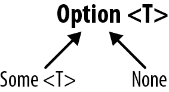

# 第七章：处理错误

> 一名物理学家、一名结构工程师和一名程序员在驾驶一辆汽车越过陡峭的高山通道时，刹车失灵了。汽车越来越快，他们挣扎着转过弯道，有时脆弱的防护栏救了他们一两次免于滚落山坡。他们确信自己都要死了，突然他们发现了一个逃生车道。他们驶入逃生车道，安全地停了下来。
> 
> 物理学家说：“我们需要建模制动片的摩擦和由此产生的温升，并看看为什么它们失灵了。”
> 
> 结构工程师说：“我想我后面有几把扳手。我来看看能不能找出问题所在。”
> 
> 程序员说：“为什么我们不看看它是否可以重现？”
> 
> 匿名

TypeScript 尽其所能将运行时异常转移到编译时：从其提供的丰富类型系统到执行的强大静态和符号分析，它努力让你不必在周五夜晚调试拼写错误的变量和空指针异常（也让你的值班同事不必因此迟到参加他们的大姨妈生日派对）。

不幸的是，无论您使用什么语言编写，有时运行时异常都会偷偷溜走。TypeScript 在防止它们方面做得非常好，但即使是它也无法防止诸如网络和文件系统故障、用户输入解析错误、堆栈溢出和内存耗尽等问题。它所做的——得益于其丰富的类型系统——是为您提供了处理最终导致这些运行时错误的多种方式。

在本章中，我将为您介绍 TypeScript 中表示和处理错误的最常见模式：

+   返回`null`

+   抛出异常

+   返回异常

+   `Option`类型

您使用哪种机制取决于您的应用程序。在我讨论每种错误处理机制时，我会谈论它的优缺点，以便您可以为自己做出正确选择。

# 返回`null`

我们将编写一个程序，询问用户的生日，然后将其解析为`Date`对象：

```
function ask() {
  return prompt('When is your birthday?')
}

function parse(birthday: string): Date {
  return new Date(birthday)
}

let date = parse(ask())
console.info('Date is', date.toISOString())
```

我们可能应该验证用户输入的日期——毕竟只是一个文本提示：

```
*`// ...`*
function parse(birthday: string): Date `|` `null` {
  `let` `date` `=` `new` `Date``(``birthday``)`
  `if` `(``!``isValid``(``date``)``)` `{`
    `return` `null`
  `}`
  return `date`
}

// *`Checks if the given date is valid`*
`function` `isValid``(``date``:` `Date``)` `{`
  `return` `Object``.``prototype``.``toString``.``call``(``date``)` `===` `'[object Date]'`
      `&&` `!``Number``.``isNaN``(``date``.``getTime``(``)``)`
`}`

```

当我们使用时，我们被迫首先检查结果是否为`null`，然后才能使用它：

```
// ... let date = parse(ask())
`if` `(``date``)` `{`
  console.info('Date is', date.toISOString())
`}` `else` `{`
  `console``.``error``(``'Error parsing date for some reason'``)`
`}`

```

返回`null`是一种在类型安全的方式下处理错误的最轻量级方法。有效的用户输入结果是一个`Date`，无效的用户输入是一个`null`，而类型系统会检查我们是否处理了这两种情况。

然而，通过这种方式我们会丢失一些信息 `parse`并没有告诉我们确切的操作失败原因，这对于不得不查阅我们的日志来调试的工程师和接收到弹出窗口显示“由于某些原因解析日期出错”的用户来说都很糟糕，而不是一个具体的、可操作的错误，比如“请输入形式为 YYYY/MM/DD 的日期”。

返回 `null` 也很难组合：在每次操作后都必须检查 `null`，随着嵌套和链接操作的增加，这可能会变得冗长。

# 抛出异常

让我们抛出一个异常，而不是返回 `null`，这样我们就可以处理特定的失败模式，并且可以获得一些关于失败的元数据，以便更容易地调试它。

```
*`// ...`*
function parse(birthday: string): `Date` {
  let date = new Date(birthday)
  if (!isValid(date)) {
    `throw` `new` `RangeError``(``'Enter a date in the form YYYY/MM/DD'``)`
  }
  return date
}

```

现在当我们使用这段代码时，我们需要小心捕获异常，以便我们可以优雅地处理它，而不会使整个应用程序崩溃：

```
*`// ...`*
`try` `{`
  let date = parse(ask())
  console.info('Date is', date.toISOString())
`}` `catch` `(``e``)` `{`
  `console``.``error``(``e``.``message``)`
`}`

```

我们可能希望小心地重新抛出其他异常，以免无声地吞咽每一个可能的错误：

```
*`// ...`*
try {
  let date = parse(ask())
  console.info('Date is', date.toISOString())
} catch (e) {
  `if` `(``e` `instanceof` `RangeError``)` `{`
    console.error(e.message)
  `}` `else` `{`
    `throw` `e`
  `}`
}

```

我们可能希望为某些更具体的内容创建错误的子类，以便当另一个工程师更改 `parse` 或 `ask` 以抛出其他 `RangeError` 时，我们可以区分我们的错误和他们添加的错误：

```
*`// ...`*

*`// Custom error types`* `class` `InvalidDateFormatError` `extends` `RangeError` `{``}`
`class` `DateIsInTheFutureError` `extends` `RangeError` `{``}`

function parse(birthday: string): Date {
  let date = new Date(birthday)
  if (!isValid(date)) {
    throw `new` `InvalidDateFormatError`('Enter a date in the form YYYY/MM/DD')
  }
  `if` `(``date``.``getTime``(``)` `>` `Date``.``now``(``)``)` `{`
    `throw` `new` `DateIsInTheFutureError``(``'Are you a timelord?'``)`
  `}`
  return date
}

try {
  let date = parse(ask())
  console.info('Date is', date.toISOString())
} catch (e) {
  if (e instanceof `InvalidDateFormatError`) {
    console.error(e.message)
  } `else` `if` `(``e` `instanceof` `DateIsInTheFutureError``)` `{`
    `console``.``info``(``e``.``message``)`
  } else {
    throw e
  }
}

```

看起来不错。现在我们不仅可以表示某些事情失败了，而且可以使用自定义错误来指示*为什么*它失败了。当通过服务器日志调试问题时，这些错误可能会派上用场，或者我们可以将它们映射到特定的错误对话框，向用户提供有关他们做错了什么以及如何修复的可操作反馈。我们还可以通过在单个 `try`/`catch` 中包装任意数量的操作来有效地链接和嵌套操作（我们不必像返回 `null` 时那样检查每个操作的失败）。

使用这段代码感觉如何？假设大的 `try`/`catch` 在一个文件中，其余的代码在从其他地方导入的库中。工程师如何知道要捕获这些特定类型的错误（`InvalidDateFormatError` 和 `DateIsInTheFutureError`），或者甚至只是检查普通的 `RangeError`？（请记住，TypeScript 不会将异常编码为函数签名的一部分。）我们可以在函数名中指示它（`parseThrows`），或者在文档块中包含它：

```
`/**  * @throws {InvalidDateFormatError} The user entered their birthday incorrectly.  * @throws {DateIsInTheFutureError} The user entered a birthday in the future.  */`
function parse(birthday: string): Date {
  *`// ...`*

```

但在实际操作中，工程师可能根本不会在 `try`/`catch` 中包装此代码并检查异常，因为工程师都是懒惰的（至少我是），而且类型系统并未告诉他们他们错过了一个案例并应该处理它。然而，有时候——就像这个例子一样——错误是如此预期，以至于下游代码确实应该处理它们，以免导致程序崩溃。

我们还能以何种方式向使用者指示他们应该处理成功和错误的情况？

# 返回异常

TypeScript 不是 Java，不支持 `throws` 子句。^(1) 但我们可以使用联合类型实现类似的效果：

```
// ... function parse(
  birthday: string
): Date `|` `InvalidDateFormatError` `|` `DateIsInTheFutureError` {
  let date = new Date(birthday)
  if (!isValid(date)) {
    `return` new InvalidDateFormatError('Enter a date in the form YYYY/MM/DD')
  }
  if (date.getTime() > Date.now()) {
    `return` new DateIsInTheFutureError('Are you a timelord?')
  }
  return date
}

```

现在，消费者被迫处理所有三种情况——`InvalidDateFormatError`、`DateIsInTheFutureError` 和成功的解析——否则他们将在编译时获得 `TypeError`：

```
// ...
let result = parse(ask()) // Either a date or an error
if (result instanceof InvalidDateFormatError) {
  console.error(result.message)
} else if (result instanceof DateIsInTheFutureError) {
  console.info(result.message)
} else {
  console.info('Date is', result.toISOString())
}
```

在这里，我们成功地利用了 TypeScript 的类型系统来：

+   在 `parse` 的签名中编码可能的异常。

+   向使用者传达可能会抛出的具体异常。

+   强制使用者处理（或重新抛出）每个异常。

一个懒惰的消费者可以避免单独处理每个错误。但他们必须显式地这样做：

```
*`// ...`*
let result = parse(ask()) // Either a date or an error if (result instanceof `Error`) {
  console.error(result.message)
} else {
  console.info('Date is', result.toISOString())
}

```

当然，你的程序可能因为内存不足或堆栈溢出异常而崩溃，但我们对此无能为力。

这种方法轻巧且不需要复杂的数据结构，但它也足够信息化，以便消费者知道错误代表的失败类型以及要搜索的更多信息。

一个缺点是，链式和嵌套的可能引发错误的操作可能会变得冗长。如果一个函数返回 `T | Error1`，那么消费该函数的任何函数都有两个选项：

1.  显式处理 `Error1`。

1.  处理 `T`（成功情况）并将 `Error1` 传递给其消费者进行处理。如果您做得足够多，消费者必须处理的可能错误列表会迅速增长：

    ```
    function x(): T | Error1 {
      // ...
    }
    function y(): U | Error1 | Error2 {
      let a = x()
      if (a instanceof Error) {
        return a
      }
      // Do something with a
    }
    function z(): U | Error1 | Error2 | Error3 {
      let a = y()
      if (a instanceof Error) {
        return a
      }
      // Do something with a
    }
    ```

这种方法冗长，但确保了我们的安全性。

# 选项类型

你也可以使用专用的数据类型来描述异常。与返回值和错误的联合相比，这种方法有一些缺点（特别是与不使用这些数据类型的代码的互操作性），但它确实使您能够在可能出错的计算中链式操作。三种最受欢迎的选项（哈！）是 `Try`、`Option`、^(2) 和 `Either` 类型。在本章中，我们只涵盖 `Option` 类型；^(3) 另外两种在精神上类似。

###### 注意

请注意，`Try`、`Option` 和 `Either` 数据类型不像 `Array`、`Error`、`Map` 或 `Promise` 那样内置于 JavaScript 环境中。如果您想使用这些类型，您必须在 NPM 上找到实现，或者自己编写。

`Option` 类型源自像 Haskell、OCaml、Scala 和 Rust 这样的语言。其想法是，不返回一个值，而是返回一个*容器*，该容器可能包含或不包含值。容器上定义了几种方法，这让您能够链式操作，即使容器内实际上可能没有值。容器可以是几乎任何数据结构，只要它能保存一个值。例如，您可以使用数组作为容器：

```
*`// ...`*
function parse(birthday: string): `Date``[``]` {
  let date = new Date(birthday)
  if (!isValid(date)) {
    `return` `[``]`
  }
  `return` `[``date``]`
}

let date = parse(ask())
`date`
  `.``map``(``_` `=``>` `_``.``toISOString``(``)``)`
  `.``forEach``(``_` `=``>` `console``.``info``(``'Date is'``,` `_``)``)`

```

###### 注意

正如您可能已经注意到的那样，`Option` 的一个缺点是，就像我们最初的返回 `null` 的方法一样，它并不告诉消费者错误发生的原因；它只是表明出了问题。

`Option` 真正发光的时候是当您需要连续执行多个操作，每个操作都可能失败时。

例如，在之前我们假设 `prompt` 总是成功的，而 `parse` 可能失败。但如果 `prompt` 也可能失败呢？如果用户取消了生日提示，那就是一个错误，我们不应该继续计算。我们可以用另一个 `Option` 来建模！

```
function ask() {
  `let` `result` `=` prompt('When is your birthday?')
  `if` `(``result` `===` `null``)` `{`
    `return` `[``]`
  `}`
  `return` `[``result``]`
}
*`// ...`*
`ask``(``)`
  `.``map``(``parse``)`
  .map(date => date.toISOString())
    *`// Error TS2339: Property 'toISOString' does not exist on type 'Date[]'.`*
  .forEach(date => console.info('Date is', date))

```

哎呀——那行不通。因为我们将`Date`数组（`Date[]`）映射为`Date`数组的数组（`Date[][]`），所以我们需要将其展平为`Date`数组，然后才能继续：

```
`flatten``(`ask()
  .map(parse)`)`
  .map(date => date.toISOString())
  .forEach(date => console.info('Date is', date))

*`// Flattens an array of arrays into an array`*
`function` `flatten``<``T``>``(``array``:` `T``[``]``[``]``)``:` `T``[``]` `{`
  `return` `Array``.``prototype``.``concat``.``apply``(``[``]``,` `array``)`
`}`

```

这一切看起来有点笨重。因为类型没有告诉你太多（一切都是常规数组），一眼看不出代码的运行情况。为了解决这个问题，让我们将我们正在做的事情——将一个值放入容器中，公开操作该值的方法，并公开从容器中获取结果的方法——封装在一个特殊的数据类型中，以帮助文档化我们的方法。一旦我们完成了实现，您将能够像这样使用数据类型：

```
ask()
  .flatMap(parse)
  .flatMap(date => new Some(date.toISOString()))
  .flatMap(date => new Some('Date is ' + date))
  .getOrElse('Error parsing date for some reason')
```

我们将如下定义我们的`Option`类型：

+   `Option`是一个接口，由两个类实现：`Some<T>`和`None`（参见图 7-1）。它们是两种`Option`。`Some<T>`是包含类型为`T`的值的`Option`，而`None`是没有值的`Option`，表示失败。

+   `Option`既是一个类型，也是一个函数。它的类型是一个接口，仅作为`Some`和`None`的超类型。它的函数是创建类型为`Option`的新值的方法。



###### 图 7-1\. `Option<T>`有两种情况：`Some<T>`和`None`

让我们从草图开始：

```
interface Option<T> {} 
class Some<T> implements Option<T> { 
  constructor(private value: T) {}
}
class None implements Option<never> {} 
```


`Option<T>`是一个接口，我们将在`Some<T>`和`None`之间共享。


`Some<T>`代表成功的操作结果值。像我们之前使用的数组一样，`Some<T>`是该值的容器。


`None`表示操作失败，不包含值。

在我们基于数组的`Option`实现中，这些类型等同于以下内容：

+   `Option<T>`是`[T] | []`。

+   `Some<T>`是`[T]`。

+   `None`是`[]`。

您可以如何处理`Option`？对于我们的基本实现，我们将仅定义两个操作：

`flatMap`

用于链式操作可能为空的`Option`的方法。

`getOrElse`

从`Option`中检索值的方法。

我们将首先在我们的`Option`接口上定义这些操作，这意味着`Some<T>`和`None`将需要为它们提供具体的实现：

```
interface Option<T> {
  `flatMap``<``U``>``(``f``:` `(``value``:` `T``)` `=``>` `Option``<``U``>``)``:` `Option``<``U``>`
  `getOrElse``(``value``:` `T``)``:` `T`
}
class Some<T> extends Option<T> {
  constructor(private value: T) {}
}
class None extends Option<never> {}

```

即：

+   `flatMap`接受一个函数`f`，该函数接受类型为`T`的值（`Option`包含的值的类型），并返回类型为`U`的`Option`。`flatMap`调用`f`与`Option`的值，并返回一个新的`Option<U>`。

+   `getOrElse`接受与`Option`包含的值相同类型的默认值`T`，并返回该默认值（如果`Option`为空的`None`）或`Option`的值（如果`Option`是`Some<T>`）。

在类型的指导下，让我们为`Some<T>`和`None`实现这些方法：

```
interface Option<T> {
  flatMap<U>(f: (value: T) => Option<U>): Option<U>
  getOrElse(value: T): T
}
class Some<T> implements Option<T> {
  constructor(private value: T) {}
  `flatMap``<``U``>``(``f``:` `(``value``:` `T``)` `=``>` `Option``<``U``>``)``:` `Option``<``U``>` `{` 
    `return` `f``(``this``.``value``)`
  `}`
  `getOrElse``(``)``:` `T` `{` 
    `return` `this``.``value`
  `}`
}
class None implements Option<never> {
  `flatMap``<``U``>``(``)``:` `Option``<``U``>` `{` 
    `return` `this`
  `}`
  `getOrElse``<``U``>``(``value``:` `U``)``:` `U` `{` 
    `return` `value`
  `}`
}

```


当我们在`Some<T>`上调用`flatMap`时，我们传入一个函数`f`，`flatMap`会使用`Some<T>`的值调用它，以产生一个新类型的`Option`。


在`Some<T>`上调用`getOrElse`只会返回`Some<T>`的值。


因为`None`表示一个失败的计算，调用它的`flatMap`总是返回`None`：一旦计算失败，我们无法从这个失败中恢复（至少在我们特定的`Option`实现中是这样）。


在`None`上调用`getOrElse`总是返回我们传递给`getOrElse`的值。

实际上，我们可以进一步完善这个天真的实现，并更好地指定我们的类型。如果你只知道你有一个`Option`和一个从`T`到`Option<U>`的函数，那么`Option<T>`总是`flatMap`到`Option<U>`。但当你知道你有一个`Some<T>`或`None`时，你可以更具体地指定。

表 7-1 展示了在两种`Option`类型上调用`flatMap`时我们想要的结果类型。

表 7-1\. 在`Some<T>`和`None`上调用`.flatMap(f)`的结果

|  | 来自 `Some<T>` | 来自 `None` |
| --- | --- | --- |
| 对于 `Some<U>` | `Some<U>` | `None` |
| 对于 `None` | `None` | `None` |

换句话说，我们知道在`None`上映射总是导致`None`，而在`Some<T>`上映射则会导致`Some<T>`或`None`，具体取决于调用`f`返回什么。我们将利用这一点并使用重载签名来为`flatMap`提供更具体的类型：

```
interface Option<T> {
  `flatMap``<``U``>``(``f``:` `(``value``:` `T``)` `=``>` `None``)``:` `None`
  flatMap<U>(f: (value: T) => Option<U>): Option<U>
  getOrElse(value: T): T
}
class Some<T> implements Option<T> {
  constructor(private value: T) {}
  `flatMap``<``U``>``(``f``:` `(``value``:` `T``)` `=``>` `None``)``:` `None`
  `flatMap``<``U``>``(``f``:` `(``value``:` `T``)` `=``>` `Some``<``U``>``)``:` `Some``<``U``>`
  flatMap<U>(f: (value: T) => Option<U>): Option<U> {
    return f(this.value)
  }
  getOrElse(): T {
    return this.value
  }
}
class None implements Option<never> {
  `flatMap``(``)``:` `None` {
    return this
  }
  getOrElse<U>(value: U): U {
    return value
  }
}

```

我们快完成了。剩下的就是实现`Option`函数，我们将用它来创建新的`Option`。我们已经将`Option` *类型* 实现为一个接口；现在我们将实现一个同名的函数（请记住 TypeScript 为类型和值分别有两个独立的命名空间），用于创建类似于我们在“伴随对象模式”中所做的新`Option`。如果用户传入`null`或`undefined`，我们将返回`None`；否则，我们将返回`Some`。再次，我们将重载签名来实现这一点：

```
function Option<T>(value: null | undefined): None 
function Option<T>(value: T): Some<T> 
function Option<T>(value: T): Option<T> { 
  if (value == null) {
    return new None
  }
  return new Some(value)
}
```


如果消费者用`null`或`undefined`调用`Option`，我们会返回`None`。


否则，我们返回一个`Some<T>`，其中`T`是用户传入的值的类型。


最后，我们手动计算了两个重载签名的上界。`null | undefined` 和 `T` 的上界是 `T | null | undefined`，简化为 `T`。`None` 和 `Some<T>` 的上界是 `None | Some<T>`，我们已经有一个名称：`Option<T>`。

就这样。我们得到了一个完全工作的、最小的`Option`类型，让我们能够安全地处理可能为`null`的值。我们可以像这样使用它：

```
let result = Option(6)          // Some<number>
  .flatMap(n => Option(n * 3))  // Some<number>
  .flatMap(n => new None)       // None
  .getOrElse(7)                 // 7
```

回到我们的生日提示示例，我们的代码现在按照我们的预期工作：

```
ask()                                              // Option<string>
  .flatMap(parse)                                  // Option<Date>
  .flatMap(date => new Some(date.toISOString()))   // Option<string>
  .flatMap(date => new Some('Date is ' + date))    // Option<string>
  .getOrElse('Error parsing date for some reason') // string
```

`Option`是处理可能成功或可能失败的一系列操作的强大方式。它为你提供了优秀的类型安全性，并通过类型系统向使用者发出信号，表明特定操作可能会失败。

然而，`Option`并不是没有缺点。它们通过`None`表示失败，因此你无法获得更多关于失败及其原因的详细信息。它们也无法与不使用`Option`的代码互操作（你必须显式地包装那些 API 以返回`Option`）。

尽管如此，你在那里所做的事情非常棒。你添加的重载使你能够做一些在大多数语言中无法表达的事情，即使是那些依赖于`Option`类型处理可空值的语言也是如此。通过限制`Option`尽可能地只有`Some`或`None`，你使你的代码更加安全，让许多 Haskell 程序员都很羡慕。现在去拿一杯冷饮庆祝一下吧，你值得拥有。

# 摘要

在本章中，我们讨论了在 TypeScript 中信号和从错误中恢复的不同方法：返回`null`，抛出异常，返回异常以及`Option`类型。你现在拥有一系列安全处理可能失败的方法。你选择哪种方法取决于你，并且取决于：

+   无论你只是想简单地表明某些操作失败了（`null`，`Option`），还是想提供更多关于失败原因的信息（抛出异常并返回）。

+   无论你是否想要强制消费者显式处理每一个可能的异常（返回异常），还是减少错误处理的样板代码（抛出异常）。

+   无论你需要一种组合错误的方式（`Option`），还是仅仅在错误发生时处理它们（`null`，异常）。

# 练习

1.  设计一种处理以下 API 错误的方法，使用本章中的一个模式。在这个 API 中，每个操作都可能失败——随意更新 API 的方法签名以允许失败（或者如果你喜欢的话，不要这样做）。考虑如何在处理出现的错误时执行一系列操作（例如，获取已登录用户的 ID，然后获取他们的朋友列表，然后获取每个朋友的名称）：

    ```
    class API {
      getLoggedInUserID(): UserID
      getFriendIDs(userID: UserID): UserID[]
      getUserName(userID: UserID): string
    }
    ```

^(1) 如果你之前没有使用过 Java，`throws`子句表示方法可能会抛出哪些类型的运行时异常，因此使用者必须处理这些异常。

^(2) 也称为`Maybe`类型。

^(3) 搜索“try 类型”或“either 类型”获取更多关于这些类型的信息。
