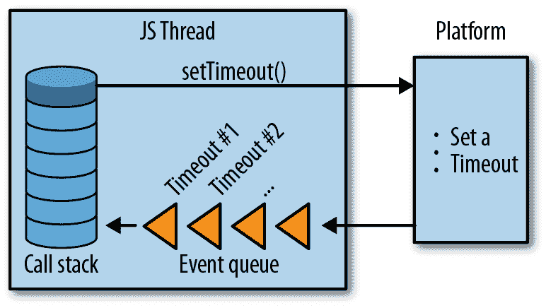
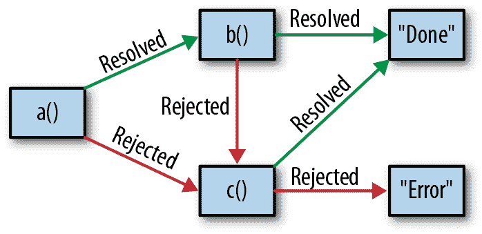

# 第八章：异步编程、并发和并行

到目前为止，在本书中，我们主要处理了同步程序 —— 程序接受一些输入，完成一些任务，并在单次执行中运行完成。但真正有趣的程序 —— 现实世界应用的构建模块，它们发起网络请求、与数据库和文件系统交互、响应用户交互、将 CPU 密集型工作转移到单独的线程 —— 都利用了像回调、Promise 和流这样的异步 API。

这些异步任务正是 JavaScript 真正闪耀并与其他主流多线程语言如 Java 和 C++ 区分开来的地方。像 V8 和 SpiderMonkey 这样的流行 JavaScript 引擎利用单线程做多线程的事情，通过巧妙地将任务多路复用到单线程，而其他任务则处于空闲状态。这种 *事件循环* 是 JavaScript 引擎的标准线程模型，也是我们假设你正在使用的模型。从最终用户的角度来看，你的引擎使用事件循环模型还是多线程模型通常并不重要，但它影响了我对事物如何工作以及我们设计事物方式的解释。

这种事件循环并发模型是 JavaScript 避免多线程编程中所有常见陷阱的方式，同时也避免了同步数据类型、互斥锁、信号量以及多线程术语的所有开销。当你在多线程上运行 JavaScript 时，很少使用共享内存；典型模式是使用消息传递，在发送数据时对其进行序列化。这种设计让人想起了 Erlang、actor 系统和其他纯函数并发模型，并且正是这种设计使得 JavaScript 中的多线程编程变得无懈可击。

尽管如此，异步编程确实使得程序更难理解，因为你不能再逐行 mentally 通过程序；你必须知道何时暂停并将执行移至其他地方，以及何时恢复执行。

TypeScript 为我们提供了理解异步程序的工具：类型让我们追踪异步工作，而内置对 `async`/`await` 的支持则让我们将熟悉的同步思维应用到异步程序中。我们还可以使用 TypeScript 为多线程程序指定严格的消息传递协议（比听起来简单得多）。如果所有其他方法都失败了，当你的同事的异步代码变得过于复杂而你不得不加班调试时，TypeScript 可以给你一个后背按摩（当然，前提是启用了编译器标志）。

但在我们开始处理异步程序之前，让我们再谈谈现代 JavaScript 引擎中异步性是如何工作的 —— 我们如何在看似单线程的情况下暂停和恢复执行？

# JavaScript 的事件循环

让我们以一个例子开始。我们将设置几个定时器，一个在一毫秒后触发，另一个在两毫秒后触发：

```
setTimeout(() => console.info('A'), 1)
setTimeout(() => console.info('B'), 2)
console.info('C')
```

现在，控制台会输出什么呢？是`A`，`B`，`C`吗？

如果你是 JavaScript 程序员，你本能地知道答案是否定的——实际的触发顺序是`C`，`A`，然后是`B`。如果你之前没有使用过 JavaScript 或 TypeScript，这种行为可能看起来神秘和不直观。实际上，这很简单；只是它不遵循 C 中的`sleep`或 Java 中调度工作的并发模型。

在高层次上，JavaScript 虚拟机以这种方式模拟并发（见图 8-1）：

+   主 JavaScript 线程调用本地的异步 API，例如`XMLHTTPRequest`（用于 AJAX 请求），`setTimeout`（用于延时），`readFile`（用于从磁盘读取文件）等等。这些 API 是由 JavaScript 平台提供的 —— 你不能自己创建它们。^(1)

+   一旦调用了本地的异步 API，控制会返回到主线程，并且执行会继续，就好像从未调用过 API 一样。

+   一旦异步操作完成，平台会将一个任务放入其事件队列中。每个线程都有自己的队列，用于将异步操作的结果传递回主线程。任务包括有关调用的一些元信息，以及来自主线程的回调函数的引用。

+   每当主线程的调用栈清空时，平台就会检查其事件队列中是否有待处理的任务。如果有等待的任务，平台会执行它；这会触发一个函数调用，并且控制会返回到主线程函数。当由该函数调用产生的调用栈再次为空时，平台会再次检查事件队列，查看是否有准备就绪的任务。这个循环重复进行，直到调用栈和事件队列都为空，并且所有异步本地 API 调用都已完成。



###### 图 8-1\. JavaScript 的事件循环：当调用异步 API 时会发生什么

有了这些信息，现在是时候回到我们的`setTimeout`示例了。以下是发生的事情：

1.  我们调用`setTimeout`，它调用一个带有我们传入的回调函数和参数`1`的本地超时 API。

1.  我们再次调用`setTimeout`，它再次使用我们传入的第二个回调函数和参数`2`调用本地的超时 API。

1.  我们将`C`记录到控制台中。

1.  在后台，在至少一毫秒后，我们的 JavaScript 平台会向其事件队列中添加一个任务，指示第一个`setTimeout`的超时已经过去，并且它的回调现在可以被调用了。

1.  再过一毫秒，平台会为第二个`setTimeout`的回调添加第二个任务到事件队列中。

1.  自从调用栈为空后，在步骤 3 完成后，平台会查看其事件队列，看看是否有任何任务。如果步骤 4 和/或 5 完成，它将找到一些任务。对于每个任务，它将调用相应的回调函数。

1.  一旦两个定时器都已经超时，并且事件队列和调用堆栈为空，程序就会退出。

这就是为什么我们记录了 `C`、`A`、`B`，而不是 `A`、`B`、`C`。有了这个基础，我们可以开始讨论如何安全地为异步代码编写类型。

# 使用回调函数

异步 JavaScript 程序的基本单元是 *回调函数*。回调函数是你作为参数传递给另一个函数的普通函数。就像同步程序一样，当另一个函数完成其操作（如发出网络请求等），它会调用你的函数。被异步代码调用的回调函数只是普通的函数，在它们的类型签名中没有任何特殊标记表明它们是异步调用。

对于像 `fs.readFile`（用于从磁盘异步读取文件内容）和 `dns.resolveCname`（用于异步解析 `CNAME` 记录）这样的 NodeJS 原生 API，回调函数的约定是第一个参数是错误或 `null`，第二个参数是结果或 `null`。

`readFile` 的类型签名如下所示：

```
function readFile(
  path: string,
  options: {encoding: string, flag?: string},
  callback: (err: Error | null, data: string | null) => void
): void
```

注意，`readFile` 的类型或 `callback` 的类型都没有任何特殊之处：它们都是普通的 JavaScript 函数。从签名上看，看不出 `readFile` 是异步的，以及在调用 `readFile` 后控制将传递到下一行（不等待其结果）。

###### 注意

要自行运行以下示例，请确保首先安装 NodeJS 的类型声明：

```
npm install @types/node --save-dev
```

要了解更多关于第三方类型声明的信息，请跳到“在 DefinitelyTyped 上有类型声明的 JavaScript”。

例如，让我们编写一个 NodeJS 程序，读取并写入到你的 Apache 访问日志中：

```
import * as fs from 'fs'

// Read data from an Apache server's access log
fs.readFile(
  '/var/log/apache2/access_log',
  {encoding: 'utf8'},
  (error, data) => {
    if (error) {
      console.error('error reading!', error)
      return
    }
    console.info('success reading!', data)
  }
)

// Concurrently, write data to the same access log
fs.appendFile(
  '/var/log/apache2/access_log',
  'New access log entry',
  error => {
    if (error) {
      console.error('error writing!', error)
    }
  })
```

除非你是 TypeScript 或 JavaScript 工程师，并且熟悉 NodeJS 的内置 API 如何工作，并且知道它们是异步的，并且不能依赖 API 调用在代码中出现的顺序来决定文件系统操作实际发生的顺序，否则你不会知道我们刚刚引入了一个微妙的 bug，即第一个 `readFile` 调用可能会或可能不会返回访问日志及其新行添加情况，这取决于文件系统在代码运行时的繁忙程度。

你可能知道 `readFile` 是异步的是因为经验，或者因为你在 NodeJS 的文档中看到过，或者因为你知道 NodeJS 通常遵循的约定：如果一个函数的最后一个参数是一个接受两个参数的函数——一个 `Error | null` 和一个 `T | null`，那么通常这个函数是异步的，或者因为你跑到邻居家借了一杯糖，结果聊了一会，然后不知怎么地谈到了 NodeJS 中的异步编程，他们告诉了你几个月前他们遇到类似问题及其如何解决的经历。

无论是什么，类型肯定不会帮助你到达那里。

除了你不能使用类型来帮助引导你对函数同步性质的直觉之外，回调在排序上也很难，这可能导致一些人所说的“回调金字塔”：

```
async1((err1, res1) => {
  if (res1) {
    async2(res1, (err2, res2) => {
      if (res2) {
        async3(res2, (err3, res3) => {
          // ...
        })
      }
    })
  }
})
```

在排序操作时，通常希望在操作成功时继续向下执行，一旦遇到错误就退出。使用回调时，你必须手动处理这些情况；如果还要考虑同步错误（例如，当你给 NodeJS 一个类型错误的参数时，它的惯例是`throw`而不是调用你提供的回调函数来处理`Error`对象），正确地排序回调可能会变得容易出错。

而排序只是你可能想要在异步任务上运行的一种操作——你可能还想要并行运行函数以知晓它们何时全部完成，或者比赛以获取第一个完成的结果等等。

这是纯回调的一个局限。如果没有更复杂的用于处理异步任务的抽象，使用多个彼此依赖的回调可能会很快变得混乱。

总结一下：

+   使用回调执行简单的异步任务。

+   虽然回调很适合建模简单任务，但在尝试处理*大量*异步任务时，它们很快变得棘手。

# 用 Promises 恢复理智

幸运的是，我们不是第一个遇到这些限制的程序员。在本节中，我们将开发*promises*的概念，这是一种抽象异步工作的方式，使我们可以组合、排序等。即使你之前有过使用 promises 或 futures 的经验，这也将是一个有益的练习来理解它们的工作原理。

###### 注意

大多数现代 JavaScript 平台都内置支持 Promise。在本节中，我们将开发自己的部分`Promise`实现作为练习，但实际上，你应该使用内置的或现成的实现。检查你喜欢的平台是否支持 Promise，请点击[这里](http://bit.ly/2uMxkk5)，或跳转到“lib”了解如何在不支持的平台上使用 polyfill 填充 promises。

我们将从一个示例开始，展示我们如何使用`Promise`首先向文件追加内容，然后读回结果：

```
function appendAndReadPromise(path: string, data: string): Promise<string> {
  return appendPromise(path, data)
    .then(() => readPromise(path))
    .catch(error => console.error(error))
}
```

注意这里没有回调金字塔——我们已经有效地将我们想要做的事情线性化成了一个简单易懂的异步任务链。一个成功后，下一个就运行；如果失败，我们跳转到`catch`子句。使用基于回调的 API，这可能看起来更像：

```
function appendAndRead(
  path: string,
  data: string
  cb: (error: Error | null, result: string | null) => void
) {
  appendFile(path, data, error => {
    if (error) {
      return cb(error, null)
    }
    readFile(path, (error, result) => {
      if (error) {
        return cb(error, null)
      }
      cb(null, result)
    })
  })
}
```

让我们设计一个`Promise` API，让我们可以做到这一点。

`Promise` 从一开始就很谦逊：

```
class Promise {
}
```

一个`new Promise`接受一个我们称为*executor*的函数，`Promise`实现将调用该函数，并传入两个参数，一个`resolve`函数和一个`reject`函数：

```
type Executor = (
  resolve: Function,
  reject: Function
) => void

class Promise {
  constructor(f: Executor) {}
}
```

`resolve`和`reject`如何工作？让我们通过思考如何手动将基于回调的 NodeJS API，如`fs.readFile`，包装成基于`Promise`的 API 来演示它。我们像这样使用 NodeJS 的内置`fs.readFile` API：

```
import {readFile} from 'fs'

readFile(path, (error, result) => {
  // ...
})
```

将该 API 包装在我们的`Promise`实现中，现在看起来像这样：

```
import {readFile} from 'fs'

function readFilePromise(path: string): Promise<string> {
  return new Promise((resolve, reject) => {
    readFile(path, (error, result) => {
      if (error) {
        reject(error)
      } else {
        resolve(result)
      }
    })
  })
}
```

因此，`resolve`参数的类型取决于我们使用的特定 API（在本例中，其参数类型将是`result`的类型），而`reject`参数的类型始终是某种`Error`类型。回到我们的实现，让我们通过用更具体的类型替换我们不安全的`Function`类型来更新我们的代码：

```
type Executor`<``T``,` `E` `extends` `Error``>` = (
  resolve: `(``result``:` `T``)` `=``>` `void`,
  reject: `(``error``:` `E``)` `=``>` `void`
) => void
*`// ...`*

```

因为我们希望能够通过查看`Promise`来了解它将解析为的类型（例如，`Promise<number>`表示一个异步任务，其结果是一个`number`），我们将使`Promise`成为泛型，并将其类型参数传递给其构造函数中的`Executor`类型：

```
// ...
class Promise<T, E extends Error> {
  constructor(f: Executor<T, E>) {}
}
```

到目前为止，我们已经定义了`Promise`的构造函数 API，并了解了所涉及的类型。现在，让我们考虑链式调用 - 我们想要公开哪些操作来运行一系列`Promise`，传播它们的结果并捕获它们的异常？如果回顾一下本节开头的初始代码示例，`then`和`catch`的作用就是这样。让我们将它们添加到我们的`Promise`类型中：

```
*`// ...`*
class Promise<T, E extends Error> {
  constructor(f: Executor<T, E>) {}
  `then``<``U``,` `F` `extends` `Error``>``(``g``:` `(``result``:` `T``)` `=``>` `Promise``<``U``,` `F``>``)``:` `Promise``<``U``,` `F``>`
  `catch``<``U``,` `F` `extends` `Error``>``(``g``:` `(``error``:` `E``)` `=``>` `Promise``<``U``,` `F``>``)``:` `Promise``<``U``,` `F``>`
}

```

`then`和`catch`是顺序执行`Promise`的两种方式：`then`将`Promise`的成功结果映射到一个新的`Promise`，^(2) 而`catch`通过将错误映射到一个新的`Promise`来从拒绝中恢复。

使用`then`看起来像这样：

```
let a: () => Promise<string, TypeError> = // ...
let b: (s: string) => Promise<number, never> = // ...
let c: () => Promise<boolean, RangeError> = // ...

a()
  .then(b)
  .catch(e => c()) // b won't error, so this is if a errors
  .then(result => console.info('Done', result))
  .catch(e => console.error('Error', e))
```

因为`b`的第二个类型参数的类型是`never`（意味着`b`永远不会抛出错误），如果`a`出错，第一个`catch`子句才会被调用。但请注意，当我们使用`Promise`时，我们不需要关心`a`可能会抛出异常而`b`不会 - 如果`a`成功，则将`Promise`映射到`b`，否则跳转到第一个`catch`子句并映射`Promise`到`c`。如果`c`成功，则记录`Done`，如果拒绝，则再次`catch`。这模仿了常规的`try`/`catch`语句的工作方式，并且对异步任务执行了`try`/`catch`对同步任务的操作（参见 Figure 8-2）。



###### 图 8-2\. Promise 状态机

我们还必须处理抛出实际异常的`Promise`的情况（例如，`throw Error('foo')`）。在我们实现`then`和`catch`时，我们将通过使用`try`/`catch`包装代码并在`catch`子句中拒绝来处理这种情况。不过，这确实有一些影响。这意味着：

1.  每个`Promise`都有可能被拒绝，并且我们无法静态检查这一点（因为 TypeScript 不支持在函数签名中指示函数可能抛出哪些异常）。

1.  `Promise`不一定会被`Error`拒绝。因为 TypeScript 别无选择，只能继承 JavaScript 的行为，而在 JavaScript 中，当你`throw`时，可以抛出任何东西——一个字符串、一个函数、一个数组、一个`Promise`，并且不一定是`Error`的子类型。这很不幸，但这是我们不强迫消费者在每个可能跨多个文件或模块的`Promise`链中使用`try/catch`的牺牲。

考虑到这一点，我们可以通过不对错误进行类型化来稍微放宽我们的`Promise`类型：

```
type Executor<T> = (
  resolve: (result: T) => void,
  reject: (error: unknown) => void
) => void

class Promise<T> {
  constructor(f: Executor<T>) {}
  then<U>(g: (result: T) => Promise<U>): Promise<U> {
    // ...
  }
  catch<U>(g: (error: unknown) => Promise<U>): Promise<U> {
    // ...
  }
}
```

现在我们有了一个完全成熟的`Promise`接口。

我会让你练习把所有内容都用`then`和`catch`实现。`Promise`的实现非常棘手，正确书写起来非常困难——如果你雄心勃勃并且有几个小时空闲时间，可以去[ES2015 规范](http://bit.ly/2JT3KUh)了解一下`Promise`的状态机应该如何在底层工作。

# 异步和等待

`Promise`是处理异步代码的非常强大的抽象。它们是如此流行的一种模式，以至于它们甚至有了自己的 JavaScript（因此也是 TypeScript）语法：`async`和`await`。这种语法让你以与同步操作相同的方式与异步操作进行交互。

###### 提示

把`await`想象成语言级别的语法糖，用于`.then`。当你`await`一个`Promise`时，必须在一个`async`块中这样做。而且，你可以用普通的`try`/`catch`块来包装你的`await`，而不是用`.catch`。

假设你有以下的`Promise`（我们在前面的章节中没有涵盖`finally`，但它的行为和你想象的一样，在`then`和`catch`都有机会执行之后才会执行）：

```
function getUser() {
  getUserID(18)
    .then(user => getLocation(user))
    .then(location => console.info('got location', location))
    .catch(error => console.error(error))
    .finally(() => console.info('done getting location'))
}
```

要将此代码转换为`async`和`await`，首先将其放入一个`async`函数中，然后`await`该`Promise`的结果：

```
`async` function getUser() {
  try {
    let user = `await` getUserID(18)
    let location = `await` getLocation(user)
    console.info('got location', user)
  } catch(error) {
    console.error(error)
  } finally {
    console.info('done getting location')
  }
}

```

由于`async`和`await`是 JavaScript 的特性，我们在这里不会深入讨论它们——简单来说，TypeScript 完全支持它们，并且它们是完全类型安全的。在处理`Promise`时，请使用它们，以便更轻松地推理链式操作，并避免大量的`then`。要了解更多关于`async`和`await`的信息，请访问它们在[MDN](https://mzl.la/2TJLFYt)上的文档。

# 异步流

虽然 promises 在建模、顺序化和组合未来值方面表现出色，但如果您有多个值将在未来的多个时间点可用，该怎么办呢？这并不像听起来那么奇特——想象一下从文件系统读取文件的一部分位、从 Netflix 服务器通过互联网流式传输到您的笔记本电脑的视频像素、填写表单时的一堆按键、朋友们来到您家参加晚餐聚会，或者在超级星期二期间向选票箱投票。尽管这些事情在表面上看起来很不同，但你可以把它们都看作是异步流；它们都是一系列东西，其中每一件东西都将在未来的某个时间点到来。

有几种建模这种行为的方法，最常见的是使用事件发射器（例如 NodeJS 的`EventEmitter`）或使用响应式编程库（如[RxJS](https://www.npmjs.com/package/@reactivex/rxjs)）。它们之间的区别就像回调和 promises 之间的区别：事件快速且轻量，而响应式编程库更加强大，可以组合和顺序化事件流。

我们将在下一节介绍事件发射器。要了解更多关于响应式编程的信息，请查看您喜爱的响应式编程库的文档，例如[RxJS](https://www.npmjs.com/package/@reactivex/rxjs)、[MostJS](https://github.com/mostjs/core)或[xstream](https://www.npmjs.com/package/xstream)。

## 事件发射器

在高层次上，事件发射器提供了支持在通道上发出事件并监听该通道上事件的 API：

```
interface Emitter {

  // Send an event
  emit(channel: string, value: unknown): void

  // Do something when an event is sent
  on(channel: string, f: (value: unknown) => void): void

}
```

事件发射器是 JavaScript 中流行的设计模式。你可能在使用 DOM 事件、JQuery 事件或 NodeJS 的`EventEmitter`模块时遇到过它们。

大多数语言中，像这样的事件发射器是不安全的。这是因为`value`的类型取决于特定的`channel`，并且在大多数语言中，你无法使用类型来表示这种关系。除非你的语言支持重载函数签名和字面类型，否则你将很难说“这是在这个通道上发出的事件的类型”。生成用于发出事件和监听每个通道的方法的宏是解决这个问题的常见方法，但在 TypeScript 中，你可以通过类型系统自然而安全地表达这一点。

例如，假设我们正在使用[NodeRedis 客户端](https://github.com/NodeRedis/node_redis)，这是一个流行的 Redis 内存数据存储的 Node API。它的工作方式如下：

```
import Redis from 'redis'

// Create a new instance of a Redis client
let client = redis.createClient()

// Listen for a few events emitted by the client
client.on('ready', () => console.info('Client is ready'))
client.on('error', e => console.error('An error occurred!', e))
client.on('reconnecting', params => console.info('Reconnecting...', params))

```

作为使用 Redis 库的程序员，我们希望在使用`on`API 时知道在回调中可以期望哪些类型的参数。但是由于每个参数的类型取决于 Redis 发布的通道，单一类型将无法满足要求。如果我们是这个库的作者，实现安全的最简单方法是使用重载类型：

```
type RedisClient = {
  on(event: 'ready', f: () => void): void
  on(event: 'error', f: (e: Error) => void): void
  on(event: 'reconnecting',
     f: (params: {attempt: number, delay: number}) => void): void
}
```

这样做效果不错，但有些啰嗦。让我们用一个映射类型的术语来表达它（参见“映射类型”），将事件定义提取到它们自己的类型 `Events` 中：

```
type Events = { 
  ready: void
  error: Error
  reconnecting: {attempt: number, delay: number}
}

type RedisClient = { 
  on<E extends keyof Events>(
    event: E,
    f: (arg: Events[E]) => void
  ): void
}
```


我们首先定义一个单一对象类型，枚举了 Redis 客户端可能发出的每个事件，以及该事件的参数。


我们对我们的 `Events` 类型进行映射，告诉 TypeScript 可以使用我们定义的任何事件调用 `on`。

然后，我们可以使用此类型使 Node-Redis 库更安全，尽可能安全地为其两种方法—`emit` 和 `on`—进行类型化：

```
// ...
type RedisClient = {
  on<E extends keyof Events>(
    event: E,
    f: (arg: Events[E]) => void
  ): void
  emit<E extends keyof Events>(
    event: E,
    arg: Events[E]
  ): void
}
```

将事件名称和参数提取到一个形状中，并在该形状上进行映射以生成监听器和发射器，这种模式在真实的 TypeScript 代码中很常见。它也很简洁，非常安全。当发射器以这种方式类型化时，您不会拼错键，误输入参数，或者忘记传入参数。它还为使用您代码的工程师提供文档，因为他们的代码编辑器将为他们建议可能监听的事件及其回调中的参数类型。

# 类型安全的多线程

到目前为止，我们一直在讨论可能在单个 CPU 线程上运行的异步程序，这是大多数您编写的 JavaScript 和 TypeScript 程序可能属于的类别。但是有时，在执行 CPU 密集型任务时，您可能选择真正的并行性：在多个线程间分配工作，以便更快地执行或使主线程保持空闲和响应性。在本节中，我们将探讨一些在浏览器和服务器上编写安全并行程序的模式。

## 在浏览器中：使用 Web Workers

Web Workers 是在浏览器中进行多线程的广泛支持方式。您可以从主 JavaScript 线程中启动一些特殊的受限后台线程，并使用它们执行本来会阻塞主线程并使用户界面无响应的任务（即 CPU 绑定任务）。Web Workers 是在浏览器中以真正并行的方式运行代码的一种方式；而像 `Promise` 和 `setTimeout` 这样的异步 API 是并发运行代码的方式，Workers 则使您能够在另一个 CPU 线程上并行运行代码。Web Workers 可以发送网络请求，写入文件系统等，只有一些小的限制。

因为 Web Workers 是浏览器提供的 API，其设计者非常强调安全性——不是我们熟悉和喜爱的类型安全，而是 *内存安全*。任何写过 C、C++、Objective C 或多线程 Java 或 Scala 的人都知道并发操作共享内存的陷阱。当你有多个线程读写同一块内存时，很容易遇到各种并发问题，如非确定性、死锁等。

因为浏览器代码必须特别安全，并且尽量减少崩溃浏览器并造成不良用户体验的机会，主线程与 Web Workers 之间以及 Web Workers 之间的主要通信方式是 *消息传递*。

###### 注意

要跟着本节中的示例操作，请确保通过在你的 *tsconfig.json* 中启用 `dom` 库来告诉 TSC 你打算在浏览器中运行这段代码：

```
{
  "compilerOptions": {
    "lib": ["dom", "es2015"]
  }
}

```

对于在 Web Worker 中运行的代码，请使用 `webworker` 库：

```
{
  "compilerOptions": {
    "lib": ["webworker", "es2015"]
  }
}

```

如果你在同一个 *tsconfig.json* 文件中同时使用 Web Worker 脚本和主线程脚本，请一起启用它们。

消息传递 API 的工作方式如下。首先从一个线程生成一个 Web Worker：

```
// MainThread.ts
let worker = new Worker('WorkerScript.js')
```

然后，你可以向该工作线程传递消息：

```
*`// MainThread.ts`*
let worker = new Worker('WorkerScript.js')

`worker``.``postMessage``(``'some data'``)`

```

你可以使用 `postMessage` API 将几乎任何类型的数据传递给另一个线程。^(4)

主线程会在交给工作线程之前克隆你传递的数据。^(5) 在 Web Worker 方面，你可以使用全局可用的 `onmessage` API 监听传入的事件：

```
// WorkerScript.ts
onmessage = e => {
  console.log(e.data) // Logs out 'some data'
}
```

要在反方向——从工作线程回到主线程——进行通信，你可以使用全局可用的 `postMessage` 发送消息到主线程，并在主线程中使用 `.onmessage` 方法监听传入的消息。将所有内容整合起来：

```
// MainThread.ts
let worker = new Worker('WorkerScript.js')
worker.onmessage = e => {
  console.log(e.data) // Logs out 'Ack: "some data"'
}
worker.postMessage('some data')

// WorkerScript.ts
onmessage = e => {
  console.log(e.data) // Logs out 'some data'
  postMessage(Ack: "${e.data}")
}
```

这个 API 很像我们在 “事件发射器” 中看到的事件发射器 API。这是一种简单的消息传递方式，但没有类型信息，我们无法确保我们已经正确处理了可能发送的所有消息类型。

由于这个 API 实际上只是一个事件发射器，我们可以像对待常规事件发射器一样对待它。例如，让我们为聊天客户端构建一个简单的消息层，在工作线程中运行。消息层将向主线程推送更新，我们不必担心诸如错误处理、权限等问题。我们首先定义一些传入和传出的消息类型（主线程向工作线程发送 `Commands`，工作线程向主线程发送 `Events`）：

```
// MainThread.ts
type Message = string
type ThreadID = number
type UserID = number
type Participants = UserID[]

type Commands = {
  sendMessageToThread: [ThreadID, Message]
  createThread: [Participants]
  addUserToThread: [ThreadID, UserID]
  removeUserFromThread: [ThreadID, UserID]
}

type Events = {
  receivedMessage: [ThreadID, UserID, Message]
  createdThread: [ThreadID, Participants]
  addedUserToThread: [ThreadID, UserID]
  removedUserFromThread: [ThreadID, UserID]
}
```

我们如何将这些类型应用到 Web Worker 消息传递 API？最简单的方法可能是定义所有可能消息类型的联合，然后根据 `Message` 类型进行切换。但这可能会变得非常乏味。对于我们的 `Command` 类型，可能看起来像这样：

```
// WorkerScript.ts type Command = 
  | {type: 'sendMessageToThread', data: [ThreadID, Message]} 
  | {type: 'createThread', data: [Participants]}
  | {type: 'addUserToThread', data: [ThreadID, UserID]}
  | {type: 'removeUserFromThread', data: [ThreadID, UserID]}

onmessage = e => 
  processCommandFromMainThread(e.data)

function processCommandFromMainThread( 
  command: Command
) {
  switch (command.type) { 
    case 'sendMessageToThread':
      let [threadID, message] = command.data
      console.log(message)
    // ...
  }
}
```


我们定义了主线程可能发送到工作线程的所有可能命令的联合，并附带每个命令的参数。


这只是一个常规的联合类型。在定义长联合类型时，以管道符号（`|`）开头可以使这些类型更易于阅读。


我们接收通过未类型化的`onmessage` API 发送的消息，并委托处理它们给我们的已类型化`processCommandFromMainThread` API。


`processCommandFromMainThread` 负责处理主线程发送的所有传入消息。它是未类型化`onmessage` API 的安全、类型化包装器。


由于`Command`类型是一个区分联合类型（参见[[discriminated unions]]），我们使用`switch`来详尽处理主线程可能发送给我们的每一种消息类型。

让我们将 Web Workers 的雪花 API 抽象到一个熟悉的基于`EventEmitter`的 API 后面。这样我们可以减少我们传入和传出的消息类型的冗长。

我们将从构建 NodeJS 的`EventEmitter` API 的类型安全包装器开始（该 API 在 NPM 上的 [`events` package](https://www.npmjs.com/package/events) 中也适用于浏览器）：

```
import EventEmitter from 'events'

class SafeEmitter<
  Events extends Record<PropertyKey, unknown[]>  
> {
  private emitter = new EventEmitter  
  emit<K extends keyof Events>(  
    channel: K,
    ...data: Events[K]
  ) {
    return this.emitter.emit(channel, ...data)
  }
  on<K extends keyof Events>(  
    channel: K,
    listener: (...data: Events[K]) => void
  ) {
    return this.emitter.on(channel, listener)
  }
}
```


`SafeEmitter` 声明一个泛型类型`Events`，一个从`PropertyKey`（TypeScript 中有效对象键的内置类型：`string`、`number` 或 `Symbol`）到参数列表的映射。


我们将`emitter`声明为`SafeEmitter`上的私有成员。我们这样做是因为我们的`emit`和`on`的签名比它们在`EventEmitter`中重载的对应签名更严格，而且由于函数在它们的参数中是逆变的（记住，对于一个函数`a`能够分配给另一个函数`b`，它的参数必须是`b`中对应参数的超类型），TypeScript 不会让我们声明这些重载。


`emit` 接受一个`channel`以及与我们在`Events`类型中定义的参数列表对应的参数。


同样，`on`接受一个`channel`和一个`listener`。`listener`接受与我们在`Events`类型中定义的参数列表相对应的可变数量的参数。

我们可以使用`SafeEmitter`大大减少安全实现监听层所需的样板代码。在工作线程上，我们将所有`onmessage`调用委托给我们的发射器，并为消费者暴露一个方便且安全的监听器 API：

```
// WorkerScript.ts
type Commands = {
  sendMessageToThread: [ThreadID, Message]
  createThread: [Participants]
  addUserToThread: [ThreadID, UserID]
  removeUserFromThread: [ThreadID, UserID]
}

type Events = {
  receivedMessage: [ThreadID, UserID, Message]
  createdThread: [ThreadID, Participants]
  addedUserToThread: [ThreadID, UserID]
  removedUserFromThread: [ThreadID, UserID]
}

// Listen for events coming from the main thread
let commandEmitter = new SafeEmitter	<Commands>()

// Emit events back to the main thread
let eventEmitter = new SafeEmitter	<Events>()

// Wrap incoming commands from the main thread
// using our typesafe event emitter
onmessage = command =>
  commandEmitter.emit(
    command.data.type,
    ...command.data.data
  )

// Listen for events issued by the worker, and send them to the main thread
eventEmitter.on('receivedMessage', data =>
  postMessage({type: 'receivedMessage', data})
)
eventEmitter.on('createdThread', data =>
  postMessage({type: 'createdThread', data})
)
// etc.

// Respond to a sendMessageToThread command from the main thread
commandEmitter.on('sendMessageToThread', (threadID, message) =>
  console.log(OK, I will send a message to threadID ${threadID})
)

// Send an event back to the main thread
eventEmitter.emit('createdThread', 123, [456, 789])

```

另一方面，我们也可以使用基于`EventEmitter`的 API，将命令从主线程发送回工作线程。请注意，如果您在自己的代码中使用此模式，您可能考虑使用更全面的发射器（例如 Paolo Fragomeni 的优秀[`EventEmitter2`](https://www.npmjs.com/package/eventemitter2)），它支持通配符监听器，这样您就不必为每种事件类型手动添加监听器：

```
// MainThread.ts
type Commands = {
  sendMessageToThread: [ThreadID, Message]
  createThread: [Participants]
  addUserToThread: [ThreadID, UserID]
  removeUserFromThread: [ThreadID, UserID]
}

type Events = {
  receivedMessage: [ThreadID, UserID, Message]
  createdThread: [ThreadID, Participants]
  addedUserToThread: [ThreadID, UserID]
  removedUserFromThread: [ThreadID, UserID]
}

let commandEmitter = new SafeEmitter	<Commands>()
let eventEmitter = new SafeEmitter	<Events>()

let worker = new Worker('WorkerScript.js')

// Listen for events coming from our worker,
// and re-emit them using our typesafe event emitter
worker.onmessage = event =>
  eventEmitter.emit(
    event.data.type,
    ...event.data.data
  )

// Listen for commands issues by this thread, and send them to our worker
commandEmitter.on('sendMessageToThread', data =>
  worker.postMessage({type: 'sendMessageToThread', data})
)
commandEmitter.on('createThread', data =>
  worker.postMessage({type: 'createThread', data})
)
// etc.

// Do something when the worker tells us a new thread was created
eventEmitter.on('createdThread', (threadID, participants) =>
  console.log('Created a new chat thread!', threadID, participants)
)

// Send a command to our worker
commandEmitter.emit('createThread', [123, 456])

```

就这样！我们已经创建了一个简单的类型安全包装器，用于熟悉的事件发射器抽象，可以在各种设置中使用，从浏览器中的光标事件到线程间的通信，使得线程间消息传递变得安全。这是 TypeScript 中的常见模式：即使某些内容不安全，您通常也可以将其包装在类型安全的 API 中。

### 类型安全的协议

到目前为止，我们已经看到如何在两个线程之间传递消息。如果要扩展技术以确保特定命令始终接收特定事件作为响应，需要做些什么？

让我们构建一个简单的调用-响应协议，用于将函数评估移动到线程之间。我们无法轻松地在线程之间传递函数，但是我们可以在工作线程中定义函数并将参数发送到它们，然后将结果发送回来。例如，假设我们正在构建一个支持三个操作的矩阵数学引擎：查找矩阵的行列式、计算两个矩阵的点积以及求逆矩阵。

你知道怎么做了——让我们首先勾画出这三个操作的类型：

```
type Matrix = number[][]

type MatrixProtocol = {
  determinant: {
    in: [Matrix]
    out: number
  }
  'dot-product': {
    in: [Matrix, Matrix]
    out: Matrix
  }
  invert: {
    in: [Matrix]
    out: Matrix
  }
}
```

我们在主线程中定义矩阵，并在工作线程中运行所有计算。再次强调，其思想是用安全的操作包装一个不安全的操作（向工作线程发送和接收未类型化的消息），为消费者暴露一个定义良好、类型化的 API。在这个简单的实现中，我们首先定义了一个简单的请求-响应协议`Protocol`，列出了工作线程可以执行的操作及其预期的输入和输出类型。^(6) 然后，我们定义了一个通用的`createProtocol`函数，该函数接受一个`Protocol`和一个指向 Worker 的文件路径，并返回一个函数，该函数接受该协议中的一个`command`，并返回一个我们可以调用以实际评估该`command`的最终函数的函数。好的，我们开始吧：

```
type Protocol = { 
  [command: string]: {
    in: unknown[]
    out: unknown
  }
}

function createProtocol<P extends Protocol>(script: string) { 
 return <K extends keyof P>(command: K) => 
   (...args: P[K]['in']) => 
    new Promise<P[K]['out']>((resolve, reject) => { 
      let worker = new Worker(script)
      worker.onerror = reject
      worker.onmessage = event => resolve(event.data.data)
      worker.postMessage({command, args})
    })
}
```


我们首先定义了一个通用的`Protocol`类型，该类型不特定于我们的`MatrixProtocol`。


当我们调用`createProtocol`时，我们传入了一个工作脚本的文件路径，以及一个特定的`Protocol`。


`createProtocol`返回一个匿名函数，然后我们可以用一个`command`来调用它，该`command`是我们在中绑定的`Protocol`的键。


然后，我们使用传入的命令的具体`in`类型调用该函数在。


这将为我们返回一个`Promise`，该`Promise`是我们特定协议中特定`out`类型的。请注意，我们必须显式地将类型参数绑定到`Promise`，否则它将默认为`{}`。

现在让我们应用我们的`MatrixProtocol`类型加上我们的 Web Worker 脚本的路径到`createProtocol`（我们不会深入探讨如何计算行列式的细节，我会假设你已经在*MatrixWorkerScript.ts*中实现了它）。我们将得到一个函数，我们可以用来运行该协议中的特定命令：

```
let runWithMatrixProtocol = createProtocol<MatrixProtocol>(
  'MatrixWorkerScript.js'
)
let parallelDeterminant = runWithMatrixProtocol('determinant')

parallelDeterminant([[1, 2], [3, 4]])
  .then(determinant =>
    console.log(determinant) // -2
  )
```

酷，对吧？我们已经拿到了一些完全不安全的东西——线程间的无类型消息传递，并用完全类型安全的请求-响应协议进行了抽象。所有使用该协议运行的命令都集中在一个地方（`MatrixProtocol`），而我们的核心逻辑（`createProtocol`）则与我们的具体协议实现（`runWithMatrixProtocol`）分开。

任何时候您需要在两个进程之间进行通信——无论是在同一台机器上还是在网络上的多台计算机之间——类型安全的协议都是确保通信安全的好工具。虽然本节帮助开发了一些关于协议解决问题的直觉，但对于真实世界的应用，您可能希望使用现有的工具，如 Swagger、gRPC、Thrift 或 GraphQL——关于概述，请访问“类型安全的 API”。

## 在 NodeJS 中：使用子进程

###### 注意

要跟随本节中的示例，请确保从 NPM 安装 NodeJS 的类型声明：

```
npm install @types/node --save-dev
```

要了解更多关于使用类型声明的信息，请跳转到“在 DefinitelyTyped 上有类型声明的 JavaScript”。

在 NodeJS 中，类型安全的并行性与 Web Worker 线程中的工作方式相同（参见“类型安全协议”）。虽然消息传递层本身不安全，但很容易在其上构建一个类型安全的 API。NodeJS 的子进程 API 如下所示：

```
// MainThread.ts import {fork} from 'child_process'

let child = fork('./ChildThread.js') 

child.on('message', data => 
  console.info('Child process sent a message', data)
)

child.send({type: 'syn', data: [3]}) 
```


我们使用 NodeJS 的`fork` API 来生成一个新的子进程。


我们使用`on` API 监听来自子进程的传入消息。NodeJS 子进程可能向其父进程发送几条消息；在这里，我们只关心`'message'`消息。


我们使用`send` API 向子进程发送消息。

在我们的子线程中，我们使用`process.on` API 监听主线程发送过来的消息，并使用`process.send`发送消息回去：

```
// ChildThread.ts process.on('message', data => 
  console.info('Parent process sent a message', data)
)

process.send({type: 'ack', data: [3]}) 
```


我们使用全局定义的`process`上的`on` API 来监听来自父线程的传入消息。


我们使用`process`的`send` API 向父进程发送消息。

因为机制与 Web Workers 如此相似，我将其作为一个练习留给你，以实现一个类型安全协议来抽象 NodeJS 中的进程间通信。

# 总结

在本章中，我们从 JavaScript 事件循环的基础开始讨论，继续探讨了 JavaScript 异步代码的构建块以及如何在 TypeScript 中安全地表达它们：回调函数、Promises、`async`/`await`和事件发射器。然后我们讨论了多线程，探索了在浏览器和服务器上传递消息以及构建完整的线程间通信协议。

与第七章中使用的技术相似，你可以自行选择：

+   对于简单的异步任务，回调函数是最直接的方法。

+   对于需要按顺序和并行执行的更复杂任务，Promises 和`async`/`await`是你的好帮手。

+   当一个 Promise 不够用（例如，如果你需要多次触发事件），可以使用事件发射器或类似 RxJS 的响应式流库。

+   要将这些技术扩展到多线程，可以使用事件发射器、类型安全协议或类型安全的 API（参见“类型安全 API”）。

# 练习

1.  实现一个通用的 `promisify` 函数，它接受一个接受一个参数和一个回调函数的函数，并将其包装在一个返回 Promise 的函数中。完成后，你应该能像这样使用 `promisify`（首先安装 NodeJS 的类型声明，使用 `npm install @types/node --save-dev`）：

    ```
    import {readFile} from 'fs'

    let readFilePromise = promisify(readFile)
    readFilePromise('./myfile.ts')
      .then(result => console.log('success reading file', result.toString()))
      .catch(error => console.error('error reading file', error))
    ```

1.  在“类型安全协议”部分，我们推导了一半类型安全矩阵数学协议。给定在主线程中运行的协议的一半，请实现在 Web Worker 线程中运行的另一半。

1.  使用映射类型（如“在浏览器中：使用 Web Workers”）来为 NodeJS 的 `child_process` 实现类型安全的消息传递协议。

^(1) 好吧，如果你分叉你的浏览器平台，或者构建一个 C++ NodeJS 扩展，你就可以做到。

^(2) 用心的读者会注意到这个 API 如何与我们在“Option 类型”中开发的 `flatMap` API 相似。这种相似性并非偶然！`Promise` 和 `Option` 都受到了函数式编程语言 Haskell 中流行的 Monad 设计模式的启发。

^(3) `Observables` 是响应式编程对随时间做值操作的基本构建块。正在进行的提案是在 [`Observable` 提案](https://tc39.github.io/proposal-observable/) 中标准化 `Observables`。期待在本书的将来版本中深入探讨 `Observables`。

^(4) 除了函数、错误、DOM 节点、属性描述符、getter 和 setter，以及原型方法和属性之外。欲了解更多信息，请访问[HTML5 规范](http://w3c.github.io/html/infrastructure.html#safe-passing-of-structured-data)。

^(5) 你也可以使用 `Transferable` API 在线程之间通过引用传递某些类型的数据（比如 `ArrayBuffer`）。在本节中，我们不会使用 `Transferable` 明确地在线程之间传递对象所有权，但这是一个实现细节。如果你的用例使用 `Transferable`，从类型安全的角度来看，方法是相同的。

^(6) 这个实现很简单，因为它每次发出命令时都会生成一个新的 worker；在实际世界中，你可能希望有一个保持热池的池化机制，并回收已释放的 workers。
