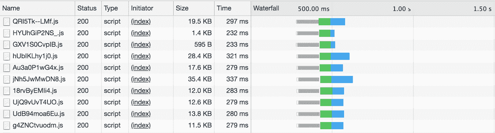

# 第十章：命名空间和模块

当你编写程序时，可以在多个级别表达封装。在最低级别，函数封装行为，而像对象和列表这样的数据结构封装数据。然后，你可以将函数和数据组合成类，或者将它们作为具有单独数据库或存储的命名空间实用程序保持分离。每个文件通常包含一个类或一组实用程序。再上一层，你可能将几个类或实用程序组合成一个包，并将其发布到 NPM。

当我们谈论模块时，重要的是要区分编译器（TSC）如何解析模块，构建系统（Webpack、Gulp 等）如何解析模块，以及模块如何在运行时加载到应用程序中（`<script />` 标签、SystemJS 等）。在 JavaScript 的世界中，通常有一个单独的程序来执行每一项任务，这使得模块很难理解。CommonJS 和 ES2015 模块标准使得这三个程序更容易互操作，而像 Webpack 这样的强大捆绑工具帮助抽象出底层的三种解析方式。

在本章中，我们将重点关注这三种程序中的第一种：TypeScript 如何解析和编译模块。我们将把讨论构建系统和运行时加载器如何处理模块的工作留给第十二章，在这里我们讨论：

+   不同的命名空间和模块化代码的方式

+   不同的导入和导出代码的方式

+   随着代码库的增长而扩展这些方法

+   模块模式与脚本模式

+   什么是声明合并，以及你可以用它做什么

不过首先，稍微了解一下背景。

# JavaScript 模块的简要历史

因为 TypeScript 编译成 JavaScript 并与之互操作，所以必须支持 JavaScript 程序员使用的各种模块标准。

最初（1995 年），JavaScript 不支持任何模块系统。没有模块，一切都声明在全局命名空间中，这使得构建和扩展应用程序非常困难。你很快就会用完变量名，并遇到变量名之间的冲突；没有为每个模块公开明确的 API，很难知道哪些模块部分是应该使用的，哪些是私有实现细节。

为了解决这些问题，人们用对象或*立即调用的函数表达式*（IIFE）模拟模块，并将它们分配给全局的 `window`，使它们可以在应用程序中的其他模块（以及同一网页上的其他应用程序）中使用。看起来像这样：

```
window.emailListModule = {
  renderList() {}
  // ...
}

window.emailComposerModule = {
  renderComposer() {}
  // ...
}

window.appModule = {
  renderApp() {
    window.emailListModule.renderList()
    window.emailComposerModule.renderComposer()
  }
}
```

因为加载和运行 JavaScript 会阻塞浏览器的 UI，随着 Web 应用程序越来越多地包含更多行代码，用户的浏览器会变得越来越慢。因此，聪明的程序员开始在页面加载后动态加载 JavaScript，而不是一次性加载它。在 JavaScript 首次发布近 10 年后，Dojo（Alex Russell，2004）、YUI（Thomas Sha，2005）和 LABjs（Kyle Simpson，2009）发布了模块加载器——在初始页面加载后惰性（通常是异步地）加载 JavaScript 代码的方法。惰性和异步模块加载意味着三件事：

1.  模块需要良好封装。否则，在依赖项流入时页面可能会崩溃。

1.  模块之间的依赖关系需要是显式的。否则，我们不知道哪些模块需要被加载以及以什么顺序加载。

1.  每个模块在应用程序内部需要一个唯一的标识符。否则，无法可靠地指定需要加载哪些模块。

使用 LABjs 加载一个模块看起来像这样：

```
$LAB
  .script('/emailBaseModule.js').wait()
  .script('/emailListModule.js')
  .script('/emailComposerModule.js')
```

同一时期，NodeJS（Ryan Dahl，2009）正在开发中，其创造者从 JavaScript 的成长痛苦和其他语言中吸取教训，并决定在平台中构建一个模块系统。像任何良好的模块系统一样，它需要满足 LABjs 和 YUI 加载器的三个标准。NodeJS 通过 CommonJS 模块标准实现了这一点，它看起来像这样：

```
// emailBaseModule.js
var emailList = require('emailListModule')
var emailComposer = require('emailComposerModule')

module.exports.renderBase = function() {
  // ...
}
```

与此同时，在 Web 上，由 Dojo 和 RequireJS 推动的 AMD 模块标准（James Burke，2008）正在崛起。它支持一组等效功能，并配备了自己的构建系统用于打包 JavaScript 代码：

```
define('emailBaseModule',
  ['require', 'exports', 'emailListModule', 'emailComposerModule'],
  function(require, exports, emailListModule, emailComposerModule) {
    exports.renderBase = function() {
      // ...
    }
  }
)
```

几年后，Browserify 出现了（James Halliday，2011），使得前端工程师也能在前端使用 CommonJS。CommonJS 成为了模块捆绑和导入/导出语法的事实标准。

CommonJS 做事情的方式存在一些问题。其中之一是，`require`调用是同步的，且 CommonJS 模块解析算法在 Web 上并不理想。除此之外，使用它的代码在某些情况下不能静态分析（作为 TypeScript 程序员，这应该引起您的注意），因为`module.exports`可以出现在任何地方（甚至在永远不会实际达到的死代码分支中），而`require`调用可以出现在任何地方并包含任意字符串和表达式，这使得静态链接 JavaScript 程序并验证所有引用的文件是否真实存在并导出它们说他们导出的内容成为不可能。

在这种背景下，ES2015——ECMAScript 语言的第六版——引入了一个新的标准，用于导入和导出，具有清晰的语法并且是静态分析可行的。它看起来像这样：

```
// emailBaseModule.js
import emailList from 'emailListModule'
import emailComposer from 'emailComposerModule'

export function renderBase() {
  // ...
}
```

这是我们今天在 JavaScript 和 TypeScript 代码中使用的标准。然而，在撰写本文时，该标准尚未在每个 JavaScript 运行时原生支持，因此我们必须将其编译为受支持的格式（NodeJS 环境下的 CommonJS，浏览器环境中的全局或模块可加载格式）。

TypeScript 为我们提供了几种在模块中使用和导出代码的方式：使用全局声明、标准的 ES2015 的`import`和`export`，以及从 CommonJS 模块中向后兼容的`import`。此外，TSC 的构建系统允许我们将模块编译为多种环境：全局、ES2015、CommonJS、AMD、SystemJS 或 UMD（CommonJS、AMD 和全局的混合——以消费者环境中可用的为准）。

# import，export

除非你被狼追赶，否则在你的 TypeScript 代码中应该使用 ES2015 的`import`和`export`，而不是使用 CommonJS、全局或命名空间模块。它们看起来像这样——与普通的 JavaScript 一样：

```
// a.ts
export function foo() {}
export function bar() {}

// b.ts
import {foo, bar} from './a'
foo()
export let result = bar()
```

ES2015 模块标准支持默认导出：

```
// c.ts
export default function meow(loudness: number) {}

// d.ts
import meow from './c' // Note the lack of {curlies}
meow(11)
```

它还支持使用通配符导入（`*`）从一个模块中导入所有内容：

```
// e.ts
import * as a from './a'
a.foo()
a.bar()
```

并重新导出一个模块的一些（或全部）导出：

```
// f.ts
export * from './a'
export {result} from './b'
export meow from './c'
```

因为我们写的是 TypeScript，而不是 JavaScript，当然可以导出类型和接口以及值。而且因为类型和值存在于不同的命名空间中，所以当您实际使用它时，TypeScript 会推断您是指类型还是值：

```
// g.ts
export let X = 3
export type X = {y: string}

// h.ts
import {X} from './g'

let a = X + 1         // X refers to the value X
let b: X = {y: 'z'}   // X refers to the type X
```

模块路径是文件系统上的文件名。这将模块与它们在文件系统中的布局方式耦合在一起，但对于需要了解该布局以解析模块名称为文件的模块加载器来说，这是一个重要的特性。

## 动态导入

随着应用程序变得越来越庞大，其初始渲染的时间会变得越来越糟糕。这在前端应用程序中尤为严重，因为网络可能成为瓶颈，但它也适用于后端应用程序，随着在顶层导入更多代码，启动时间会更长——这些代码需要从文件系统加载、解析、编译和评估，同时阻塞其他代码的运行。

在前端，解决这个问题的一种方法（除了写更少的代码之外！）是使用*代码分割*：将代码分成许多生成的 JavaScript 文件，而不是将所有内容打包到一个大文件中。使用分割，您可以并行加载多个块，从而减轻大型网络请求的负担（参见图 10-1）。



###### 图 10-1\. 从 facebook.com 加载的 JavaScript 的网络瀑布图

进一步的优化是在实际需要时延迟加载代码块。像 Facebook 和 Google 这样的非常大型前端应用程序通常使用这种优化。没有这个优化，客户端可能会在初始页面加载时加载数千兆字节的 JavaScript 代码，这可能需要几分钟或几小时（更不用说一旦收到手机账单，人们可能会停止使用这些服务）。

惰性加载也因其他原因而有用。例如，流行的[Moment.js](https://momentjs.com)日期处理库提供了支持全球使用的每种日期格式的包，按区域划分。每个包大小约为 3 KB。为每个用户加载所有这些区域设置可能会对性能和带宽造成不可接受的影响；相反，您可能希望检测用户的区域设置，然后仅加载相关的日期包。

LABjs 及其衍生物介绍了在实际需要时延迟加载代码的概念，该概念在*动态导入*中得到了正式化。看起来像这样：

```
let locale = await import('locale_us-en')
```

您可以将`import`用作静态拉取代码的语句（就像我们到目前为止使用的那样），也可以将其用作返回您模块的`Promise`的函数（就像我们在此示例中所做的那样）。

虽然您可以将评估为字符串的任意表达式传递给`import`，但这样做会丢失类型安全性。要安全地使用动态导入，请确保要么

1.  直接将字符串文字传递给`import`，而不先将字符串分配给变量。

1.  将表达式传递给`import`并手动注释模块的签名。

如果使用第二个选项，一个常见模式是静态导入模块，但仅在类型位置使用它，这样 TypeScript 将编译掉静态导入（要了解更多，请参见“types 指令”）。例如：

```
import {locale} from './locales/locale-us'

async function main() {
  let userLocale = await getUserLocale()
  let path = ./locales/locale-${userLocale}
  let localeUS: typeof locale = await import(path)
}
```

我们从*./locales/locale-us*导入了`locale`，但我们仅将其用于其类型，我们通过`typeof locale`检索了它的类型。我们之所以需要这样做，是因为 TypeScript 不能静态查找`import(path)`的类型，因为`path`是一个计算的变量，而不是静态字符串。因为我们从未将`locale`用作值，而是只是为了获取其类型，所以在这个示例中，TypeScript 没有生成任何顶级导出，这使我们既拥有出色的类型安全性，又具有动态计算的导入。

# TSC 设置：模块

TypeScript 仅在`esnext`模块模式下支持动态导入。要使用动态导入，请在您的*tsconfig.json*的`compilerOptions`中设置`{"module": "esnext"}`。跳到“在服务器上运行 TypeScript”和“在浏览器中运行 TypeScript”了解更多信息。

## 使用 CommonJS 和 AMD 代码

在使用 CommonJS 或 AMD 标准的 JavaScript 模块时，您可以像 ES2015 模块一样简单地从中导入名称：

```
import {something} from './a/legacy/commonjs/module'
```

默认情况下，CommonJS 默认导出与 ES2015 默认导入不兼容；要使用默认导出，必须使用通配符导入：

```
import * as fs from 'fs'
fs.readFile('some/file.txt')
```

为了更顺畅地进行互操作性，可以在您的 *tsconfig.json* 的 `compilerOptions` 中设置 `{"esModuleInterop": true}`。现在，您可以省略通配符：

```
`import` `fs` `from` `'fs'`
fs.readFile('some/file.txt')

```

###### 注意

正如我在本章开头提到的，即使此代码编译通过，也不能保证在运行时能正常工作。无论您使用哪种模块标准——`import`/`export`、CommonJS、AMD、UMD 或浏览器全局对象——您的模块捆绑器和模块加载器都必须了解该格式，以便在编译时正确打包和拆分您的代码，并在运行时正确加载您的代码。请前往第十二章了解更多信息。

## 模块模式与脚本模式的区别

TypeScript 在其中一种模式下解析每个 TypeScript 文件：*模块模式* 或 *脚本模式*。它根据一个简单的启发式算法决定使用哪种模式：您的文件是否有任何 `import` 或 `export`？如果有，它将使用模块模式；否则，它将使用脚本模式。

模块模式是我们到目前为止使用的模式，也是您大部分时间会使用的模式。在模块模式中，您使用 `import` 和 `import()` 来从其他文件中引入代码，并使用 `export` 将代码提供给其他文件使用。如果您使用任何第三方 UMD 模块（提醒一下，UMD 模块尝试使用环境支持的 CommonJS、RequireJS 或浏览器全局对象），您必须首先 `import` 它们，不能直接使用它们的全局导出。

在脚本模式中，您声明的任何顶级变量将在项目中的其他文件中可用，无需显式导入，并且您可以安全地使用来自第三方 UMD 模块的全局导出，而无需先显式导入它们。脚本模式的几个用例包括：

+   为了快速原型化浏览器代码，您计划将其编译为完全不使用模块系统（在您的 *tsconfig.json* 中设置 `{"module": "none"}`），并将其作为原始 `<script />` 标签包含在您的 HTML 文件中。

+   创建类型声明（参见“类型声明”）

您几乎总是希望坚持使用模块模式，TypeScript 会在您编写实际代码时自动选择这种模式，该模式通过 `import` 其他代码和 `export` 供其他文件使用。

# 命名空间

TypeScript 为我们提供了另一种封装代码的方式：`namespace` 关键字。对于许多 Java、C#、C++、PHP 和 Python 程序员来说，命名空间会感觉很熟悉。

###### 小贴士

如果您之前使用过带命名空间的语言，请注意，尽管 TypeScript 支持命名空间，但它们不是封装代码的首选方式；如果不确定是使用命名空间还是模块，请选择模块。

命名空间抽象了文件系统中文件布局的细节；您不必知道您的 `.mine` 函数位于 `schemes/scams/bitcoin/apps` 文件夹中，而是可以通过简短方便的命名空间 `Schemes.Scams.Bitcoin.Apps.mine` 来访问它。^(1)

假设我们有两个文件——一个用于进行 HTTP GET 请求的模块，一个用于使用该模块进行请求的消费者：

```
// Get.ts
namespace Network {
  export function get<T>(url: string): Promise<T> {
    // ...
  }
}

// App.ts
namespace App {
  Network.get<GitRepo>('https://api.github.com/repos/Microsoft/typescript')
}
```

命名空间必须有一个名称（比如 `Network`），它可以导出函数、变量、类型、接口或其他命名空间。在命名空间块中未显式导出的任何代码对该块是私有的。因为命名空间可以导出命名空间，所以你可以轻松地建模嵌套命名空间。假设我们的 `Network` 模块变得很大，我们想将其拆分成几个子模块。我们可以使用命名空间来实现这一点：

```
namespace Network {
  export namespace HTTP {
    export function get	<T>(url: string): Promise	<T> {
      // ...
    }
  }
  export namespace TCP {
    listenOn(port: number): Connection {
      //...
    }
    // ...
  }
  export namespace UDP {
    // ...
  }
  export namespace IP {
    // ...
  }
}

```

现在，我们所有与网络相关的实用程序都在 `Network` 的子命名空间下。例如，我们现在可以从任何文件调用 `Network.HTTP.get` 和 `Network.TCP.listenOn`。与接口一样，命名空间可以被扩展，使得跨文件拆分它们变得方便。TypeScript 将递归地为我们合并同名的命名空间：

```
// HTTP.ts
namespace Network {
  export namespace HTTP {
    export function get<T>(url: string): Promise<T> {
      // ...
    }
  }
}

// UDP.ts
namespace Network {
  export namespace UDP {
    export function send(url: string, packets: Buffer): Promise<void> {
      // ...
    }
  }
}

// MyApp.ts
Network.HTTP.get<Dog[]>('http://url.com/dogs')
Network.UDP.send('http://url.com/cats', new Buffer(123))
```

如果你有很长的命名空间层次结构，你可以使用*别名*来方便地缩短它们。请注意，尽管语法类似，但不支持别名的解构（就像导入 ES2015 模块时所做的那样）：

```
// A.ts
namespace A {
  export namespace B {
    export namespace C {
      export let d = 3
    }
  }
}

// MyApp.ts
import d = A.B.C.d

let e = d * 3
```

## 冲突

相同名称导出之间的冲突是不允许的：

```
// HTTP.ts
namespace Network {
  export function request<T>(url: string): T {
    // ...
  }
}

// HTTP2.ts
namespace Network {
  // Error TS2393: Duplicate function implementation.
  export function request<T>(url: string): T {
    // ...
  }
}
```

不与不发生碰撞规则的例外是过载的环境函数声明，您可以使用它来细化函数类型：

```
// HTTP.ts
namespace Network {
  export function request<T>(url: string): T
}

// HTTP2.ts
namespace Network {
  export function request<T>(url: string, priority: number): T
}

// HTTPS.ts
namespace Network {
  export function request<T>(url: string, algo: 'SHA1' | 'SHA256'): T
}
```

## 编译输出

与导入和导出不同，命名空间不尊重您的 *tsconfig.json* 的 `module` 设置，并始终编译为全局变量。让我们窥视幕后，看看生成的输出是什么样子的。假设我们有以下模块：

```
// Flowers.ts
namespace Flowers {
  export function give(count: number) {
    return count + ' flowers'
  }
}
```

通过 `TSC` 运行，生成的 JavaScript 输出如下：

```
let Flowers
(function (Flowers) { 
  function give(count) {
    return count + ' flowers'
  }
  Flowers.give = give 
})(Flowers || (Flowers = {})) 

```


`Flowers` 在一个立即调用的函数表达式（IIFE）中声明，以创建闭包并防止未显式导出的变量泄漏出 `Flowers` 模块。


TypeScript 将我们导出的 `give` 函数分配给 `Flowers` 命名空间。


如果 `Flowers` 命名空间已经全局定义，则 TypeScript 会扩展它（`Flowers`）；否则，TypeScript 会创建并扩展新创建的命名空间（`Flowers = {}`）。

# 声明合并

到目前为止，我们已经涉及 TypeScript 为我们做的三种合并类型：

+   合并值和类型，使得相同的名称可以根据使用方式引用值或类型（见“伴生对象模式”）

+   将多个命名空间合并为一个

+   将多个接口合并为一个（见“声明合并”）

正如你可能直觉到的那样，这些都是 TypeScript 更一般行为的三个特例。TypeScript 拥有丰富的名称合并行为，可以解锁各种模式，否则可能难以表达（详见表 10-1）。

表 10-1\. 声明是否可以合并？

|  |  |  |  |  |  | 到 |  |  |  |  |
| --- | --- | --- | --- | --- | --- | --- | --- | --- | --- | --- |
|  |  | 值 | 类 | 枚举 | 函数 | 类型别名 | 接口 | 命名空间 | 模块 |
|  | 值 | 否 | 否 | 否 | 否 | 是 | 是 | 否 |  —  |
|  | 类 |  —  | 否 | 否 | 否 | 否 | 是 | 是 |  —  |
|  | 枚举 |  —  |  —  | 是 | 否 | 否 | 否 | 是 |  —  |
| 来自 | 函数 |  —  |  —  |  —  | 否 | 是 | 是 | 是 |  —  |
|  | 类型别名 |  —  |  —  |  —  |  —  | 否 | 否 | 是 |  —  |
|  | 接口 |  —  |  —  |  —  |  —  |  —  | 是 | 是 |  —  |
|  | 命名空间 |  —  |  —  |  —  |  —  |  —  |  —  | 是 |  —  |
|  | 模块 |  —  |  —  |  —  |  —  |  —  |  —  |  —  | 是 |

意味着，例如，如果你在同一作用域中声明一个值和一个类型别名，TypeScript 将允许这样做，并且从你在值或类型位置使用名称来推断你所指的是类型还是值。这就是我们实现“伴生对象模式”中描述的模式的原因。这也意味着你可以使用接口和命名空间来实现伴生对象——你不仅限于值和类型别名。或者你可以利用模块合并来增强第三方模块声明（详见“扩展模块”）。或者你可以通过将命名空间与枚举合并来添加静态方法（试试看！）。

# 总结

在本章中，我们介绍了 TypeScript 的模块系统，从 JavaScript 模块系统的简要历史开始，ES2015 模块，以及使用动态导入安全地延迟加载代码，与 CommonJS 和 AMD 模块的互操作，以及模块模式与脚本模式的比较。然后我们涵盖了命名空间、命名空间合并，以及 TypeScript 的声明合并工作原理。

在开发 TypeScript 应用程序时，努力坚持使用 ES2015 模块。TypeScript 不关心你使用哪种模块系统，但它会使得与构建工具集成更容易（参见第十二章了解更多）。

# 练习

1.  玩转声明合并，以：

    1.  使用命名空间和接口重新实现伴生对象（来自“伴生对象模式”），而不是使用值和类型。

    1.  给枚举添加静态方法。

^(1) 我真的希望这个笑话会成为经典，并且我不会后悔没有投资比特币。
