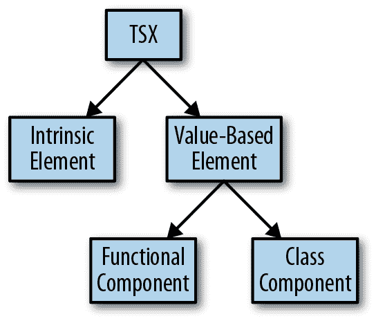

# 附录 G. TSX

TypeScript 在底层公开了几个钩子，用于以可插拔方式为 TSX 类型化。这些是 `global.JSX` 命名空间上的特殊类型，TypeScript 在整个程序中将其视为 TSX 类型的真实来源。

###### 注意

如果只使用 React，您无需了解这些底层钩子，但如果编写一个不使用 React 而使用 TSX 的 TypeScript 库，本附录为您提供了可以使用的钩子的有用参考。

TSX 支持两种类型的元素：内置元素（*内置元素*）和用户定义元素（*值类型元素*）。内置元素始终使用小写名称，并指代内置元素如 `<li>`、`<h1>` 和 `<div>`。值类型元素使用帕斯卡命名法，并指代使用 React（或使用 TSX 与其他前端框架）创建的元素；它们可以定义为函数或类。请参见 图 G-1。



###### 图 G-1. TSX 元素的种类

使用 [React 的类型声明](http://bit.ly/2CNzeW2) 作为示例，我们将详细介绍 TypeScript 用于安全地为 TSX 类型化的钩子。以下是 React 如何将钩子插入 TSX 以安全地为 JSX 类型化的步骤：

```
declare global {
  namespace JSX {
    interface Element extends React.ReactElement<any> {} 
    interface ElementClass extends React.Component<any> { 
      render(): React.ReactNode
    }
    interface ElementAttributesProperty { 
      props: {}
    }
    interface ElementChildrenAttribute { 
      children: {}
    }

    type LibraryManagedAttributes<C, P> = // ... 

    interface IntrinsicAttributes extends React.Attributes {} 
    interface IntrinsicClassAttributes<T> extends React.ClassAttributes<T> {} 

    interface IntrinsicElements { 
      a: React.DetailedHTMLProps<
        React.AnchorHTMLAttributes<HTMLAnchorElement>,
        HTMLAnchorElement
      >
      abbr: React.DetailedHTMLProps<
        React.HTMLAttributes<HTMLElement>,
        HTMLElement
      >
      address: React.DetailedHTMLProps<
        React.HTMLAttributes<HTMLElement>,
        HTMLElement
      >
      // ...
    }
  }
}
```


`JSX.Element` 是值类型 TSX 元素的类型。


`JSX.ElementClass` 是值类型类组件实例的类型。每当声明一个类组件，并计划使用 TSX 的 `<MyComponent />` 语法实例化时，其类必须满足此接口。


`JSX.ElementAttributesProperty` 是 TypeScript 查看以确定组件支持哪些属性的属性名称。对于 React，这意味着查看 `props` 属性。TypeScript 在类实例上查找此值。


`JSX.ElementChildrenAttribute` 是 TypeScript 查看以确定组件支持哪些类型子节点的属性名称。对于 React，这意味着查看 `children` 属性。


`JSX.IntrinsicAttributes` 是所有内置元素支持的属性集。对于 React，这意味着支持 `key` 属性。


`JSX.IntrinsicClassAttributes` 是所有类组件（包括内置和值类型）支持的属性集。对于 React，这意味着支持 `ref`。


`JSX.LibraryManagedAttributes` 指定 JSX 元素可以声明和初始化属性类型的其他位置。对于 React，这意味着 `propTypes` 可以作为声明属性类型的另一位置，而 `defaultProps` 是声明属性默认值的位置。


`JSX.IntrinsicElements` 枚举了你可以在 TSX 中使用的每种 HTML 元素类型，将每个元素的标签名称映射到其属性和子元素的类型。因为 JSX 不是 HTML，React 的类型声明必须告诉 TypeScript 究竟哪些元素可能会在 TSX 表达式中使用，并且因为你可以在 TSX 中使用任何标准的 HTML 元素，这些声明必须手动枚举每个元素及其属性类型（例如，对于 `<a>` 标签，有效的属性包括 `href: string` 和 `rel: string`，但不包括 `value`）以及它可能具有的子元素类型。

声明任何这些类型在全局的 JSX 命名空间中，你可以钩入 TypeScript 对 TSX 的类型检查行为，并按需自定义它。除非你正在编写一个使用 TSX（而不使用 React）的库，否则你可能永远不会接触这些钩子。
