# 第一章：创建应用程序

React 是一个非常灵活的开发框架。开发者使用它来创建大型 JavaScript 重度单页应用（SPA），或者创建非常小的插件。你可以在 Rails 应用中嵌入代码，也可以生成内容丰富的网站。

在本章中，我们将探讨创建 React 应用程序的各种方式。我们还将介绍一些可能想要添加到开发周期中的更有价值的工具。现在很少有人从头开始创建他们的 JavaScript 项目。这样做是一个繁琐的过程，涉及大量琢磨和配置。好消息是，你可以使用一个工具来几乎在每种情况下生成你需要的代码。

让我们快速浏览一下开始 React 之旅的多种方式，从最常用的一种开始：`create-react-app`。

# 生成一个简单的应用程序

## 问题

从头开始创建和配置 React 项目是具有挑战性的。不仅需要做出众多设计选择（包括要包含哪些库、使用哪些工具、启用哪些语言功能），而且手动创建的应用程序由于其特性而彼此不同。项目的特殊性增加了新开发者达到生产力所需时间。

## 解决方案

`create-react-app` 是一个用于构建符合标准结构且具有良好默认选项的 SPA 的工具。生成的项目使用 React Scripts 库来构建、测试和运行代码。项目有一个标准的 Webpack 配置和一组启用的标准语言功能。

任何曾在一个 `create-react-app` 应用程序上工作过的开发者都能立刻适应其他任何一个。他们理解项目结构并知道可以使用哪些语言功能。这是一个简单易用的工具，包含了典型应用程序所需的所有功能：从 Babel 配置和文件加载器到测试库和开发服务器。

如果你是 React 的新手，或者需要用最少的麻烦创建一个通用的 SPA，那么你应该考虑使用 `create-react-app` 来创建你的应用程序。

你可以选择在计算机上全局安装 `create-react-app` 命令，但这现在已经不被推荐。相反，你应该通过 `npx` 调用 `create-react-app` 来创建新项目。使用 `npx` 确保你使用的是 `create-react-app` 的最新版本：

```
$ npx create-react-app my-app
```

这个命令创建一个名为 *my-app* 的新项目目录。默认情况下，该应用程序使用 JavaScript。如果你想要使用 TypeScript 作为开发语言，`create-react-app` 也提供了这个选项：

```
$ npx create-react-app --template typescript my-app
```

`create-react-app` 是由 Facebook 开发的，因此如果你已安装 `yarn` 包管理器，那么你的新项目将默认使用 `yarn` 并不足为奇。要使用 `npm`，你可以指定 `--use-npm` 标志，或者进入目录并删除 *yarn.lock* 文件，然后使用 `npm` 重新运行安装。

```
$ cd my-app
$ rm yarn.lock
$ npm install
```

要启动你的应用程序，请运行 `start` 脚本：

```
$ npm start # or yarn start
```

此命令在端口 3000 上启动服务器，并在主页打开浏览器，如图 1-1 所示。

###### 图 1-1\. 生成的首页

服务器将你的应用程序作为一个单独的大 JavaScript 包交付。代码将其所有组件挂载在*public/index.html*中的这个`<div/>`内：

```
<div id="root"></div>
```

生成组件的代码始于*src/index.js*文件（如果你使用 TypeScript，则为*src/index.tsx*）：

```
import React from 'react'
import ReactDOM from 'react-dom'
import './index.css'
import App from './App'
import reportWebVitals from './reportWebVitals'

ReactDOM.render(
  <React.StrictMode>
    <App />
  </React.StrictMode>,
  document.getElementById('root')
)

// If you want to start measuring performance in your app, pass a function
// to log results (for example: reportWebVitals(console.log))
// or send to an analytics endpoint. Learn more: https://bit.ly/CRA-vitals
reportWebVitals()
```

此文件几乎只是渲染一个名为`<App/>`的单个组件，它从同一目录中的*App.js*（或*App.tsx*）导入：

```
import logo from './logo.svg'
import './App.css'

function App() {
  return (
    <div className="App">
      <header className="App-header">
        
        <p>
          Edit <code>src/App.js</code> and save to reload.
        </p>
        <a
          className="App-link"
          href="https://reactjs.org"
          target="_blank"
          rel="noopener noreferrer"
        >
          Learn React
        </a>
      </header>
    </div>
  )
}

export default App
```

如果你在`start`状态下编辑此文件，浏览器中的页面将自动更新。

当你准备将代码部署到生产环境时，你需要生成一组静态文件，这些文件可以部署到标准的 Web 服务器上。要做到这一点，请运行`build`脚本：

```
$ npm run build
```

`build`脚本创建一个*build*目录，然后发布一组静态文件（参见图 1-2）。

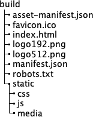

###### 图 1-2\. 构建目录中生成的内容

构建从*public/*目录复制了许多这些文件。应用程序的代码被转译为浏览器兼容的 JavaScript，并存储在*static/js*目录中的一个或多个文件中。应用程序使用的样式表被拼接在一起，并存储在*static/css*中。其中的几个文件添加了哈希 ID，以便在部署应用程序时，浏览器下载最新代码，而不是某个旧版本的缓存。

## 讨论

`create-react-app`不仅是一个生成新应用程序的工具，还是一个平台，可用于保持你的 React 应用程序与最新工具和库保持更新。你可以像更新其他库一样更新`react-scripts`库：通过更改版本号并重新运行`npm install`。你无需管理一长串的 Babel 插件或 postcss 库，也无需维护复杂的*webpack.config.js*文件。`react-scripts`库为你管理它们。

当然，配置仍然在那里，但是埋藏在*react-scripts*目录的深处。在那里，你会找到*webpack.config.js*文件，其中包含你的应用程序将使用的所有 Babel 配置和文件加载器。因为它是一个库，你可以像更新任何其他依赖项一样更新 React Scripts。

然而，如果你后来决定自行管理所有内容，完全可以这样做。如果你将应用程序弹出，那么所有内容将重新回到你的控制下：

```
$ npm run eject
```

然而，这是一次性的变更。一旦你弹出了应用程序，就无法再回去了。在弹出应用程序之前，请仔细考虑。你可能会发现你需要的配置已经可用。例如，开发者经常会弹出应用程序以切换到使用 TypeScript。现在，`--template typescript`选项消除了这种需要。

另一个常见的弹出的原因是代理 Web 服务。React 应用程序经常需要连接到某个独立的 API 后端。开发人员过去通过配置 Webpack 在本地开发服务器上代理远程服务器来完成此操作。现在您可以通过在 *package.json* 文件中设置代理来避免这样做：

```
"proxy": "http://myapiserver",
```

如果您的代码现在访问了服务器在本地找不到的 URL（*/api/thing*），`react-scripts` 会自动将这些请求代理到 *http://myapiserver/api/thing*。

如果可能的话，避免弹出您的应用程序。查看 [`create-react-app` 文档](https://oreil.ly/99Ied) 看看是否可以通过其他方式进行更改。

您可以从 GitHub 站点下载此示例的源代码，支持 [JavaScript](https://oreil.ly/UK0dZ) 或 [TypeScript](https://oreil.ly/oOSo9)。

# 用 Gatsby 构建内容丰富的应用程序

## 问题

*内容丰富* 的网站，如博客和在线商店，需要有效地提供大量复杂的内容。像 `create-react-app` 这样的工具并不适合这种类型的网站，因为它会将所有内容打包为一个大的 JavaScript 捆绑包，浏览器必须在显示任何内容之前下载。

## 解决方案

如果您正在构建内容丰富的网站，请考虑使用 Gatsby。

Gatsby 专注于以最高效的方式加载、转换和提供内容。它可以生成网页的静态版本，这意味着 Gatsby 网站的响应时间通常明显慢于使用 `create-react-app` 构建的网站。

Gatsby 拥有许多插件，可以高效地从静态本地数据、GraphQL 数据源和第三方内容管理系统（如 WordPress）加载和转换数据。

您可以全局安装 `gatsby`，但也可以通过 `npx` 命令运行它：

```
$ npx gatsby new my-app
```

`gatsby new` 命令在名为 *my-app* 的子目录中创建一个新项目。第一次运行此命令时，它会询问要使用哪个包管理器：`yarn` 还是 `npm`。

要启动您的应用程序，请进入新目录并以开发模式运行它：

```
$ cd my-app
$ npm run develop
```

此后，您可以打开您的应用程序，网址为 *http://localhost:8000*，如 图 1-3 所示。

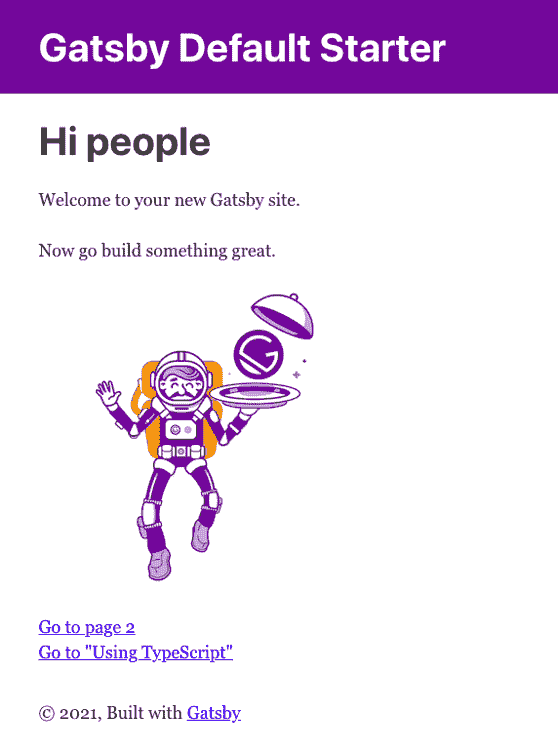

###### 图 1-3\. Gatsby 页面位于 http://localhost:8000

Gatsby 项目具有简单的结构，如 图 1-4 所示。

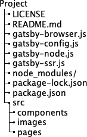

###### 图 1-4\. Gatsby 目录结构

应用程序的核心位于 *src* 目录下。Gatsby 应用程序中的每个页面都有其自己的 React 组件。这是默认应用程序的首页，位于 *index.js* 中：

```
import * as React from "react"
import { Link } from "gatsby"
import { StaticImage } from "gatsby-plugin-image"

import Layout from "../components/layout"
import Seo from "../components/seo"

const IndexPage = () => (
  <Layout>
    <Seo title="Home" />
    <h1>Hi people</h1>
    <p>Welcome to your new Gatsby site.</p>
    <p>Now go build something great.</p>
    <StaticImage
      src="../images/gatsby-astronaut.png"
      width={300}
      quality={95}
      formats={["AUTO", "WEBP", "AVIF"]}
      alt="A Gatsby astronaut"
      style={{ marginBottom: `1.45rem` }}
    />
    <p>
      <Link to="/page-2/">Go to page 2</Link> <br />
      <Link to="/using-typescript/">Go to "Using TypeScript"</Link>
    </p>
  </Layout>
)

export default IndexPage
```

不需要为页面创建路由。每个页面组件都会自动分配一个路由。例如，位于 *src/pages/using-typescript.tsx* 的页面会自动在 *using-typescript* 处可用^(1)。这种方法有多个优点。首先，如果有多个页面，您无需手动管理它们的路由。其次，这意味着 Gatsby 可以更快地交付。要了解原因，请看如何为 Gatsby 应用程序生成生产构建。

如果停止 Gatsby 开发服务器^(2)，您可以使用以下命令生成生产构建：

```
$ npm run build
```

此命令运行 `gatsby build` 命令，创建一个 *public* 目录。而 *public* 目录则包含了 Gatsby 的真正魔力。对于每个页面，您会找到两个文件。首先是生成的 JavaScript 文件：

```
1389 06:48 component---src-pages-using-typescript-tsx-93b78cfadc08d7d203c6.js
```

在这里，您可以看到 *using-typescript.tsx* 的代码仅有 1,389 字节长，与核心框架一起，这些 JavaScript 刚好足够构建页面。这不是在 `create-react-app` 项目中找到的包含所有内容的脚本。

其次，每个页面都有一个子目录，其中包含一个生成的 HTML 文件。例如，对于 *using-typescript.tsx*，文件名为 *public/using-typescript/index.html*，包含了网页的静态生成版本。它包含了 *using-typescript.tsx* 组件本应动态渲染的 HTML。在网页末尾，它加载页面的 JavaScript 版本来生成任何动态内容。

这种文件结构意味着 Gatsby 页面的加载速度与静态页面一样快。使用捆绑的 `react-helmet` 库，您还可以生成关于您站点的 `<meta/>` 标签，具有关于您站点的额外功能。这两个功能对搜索引擎优化（SEO）非常有利。

## 讨论

如何将内容导入到您的 Gatsby 应用程序中？您可以使用无头内容管理系统、GraphQL 服务、静态数据源或其他方式。幸运的是，Gatsby 有许多插件可以让您连接数据源到您的应用程序，然后将内容从其他格式（如 Markdown）转换为 HTML。

您可以在 [Gatsby 网站](https://oreil.ly/9GwLv) 上找到完整的插件集。

大多数情况下，您在创建项目时选择需要的插件。为了让您更快上手，Gatsby 还支持 *启动模板*。模板提供了初始的应用程序结构和配置。我们之前构建的应用程序使用了默认的起始模板，非常简单。应用程序根目录下的 *gatsby-config.js* 文件配置了应用程序使用的插件。

但是有大量预配置的 Gatsby starters 可用于构建连接到各种数据源的应用程序，具有用于 SEO、样式、离线缓存、渐进式 Web 应用程序（PWA）等的预配置选项。无论您构建什么类型的内容丰富应用程序，都会有一个接近您需求的 starter。

关于[Gatsby starters](https://oreil.ly/vwUd8)，以及关于最有用的工具和命令的[cheat sheet](https://oreil.ly/f7xbF)，Gatsby 网站上有更多信息。

您可以从[GitHub 网站](https://oreil.ly/DzLSy)下载此配方的源代码。

# 使用 Razzle 构建 Universal Apps

## 问题

有时当您开始构建应用程序时，很难确定哪些重要的架构决策。您应该创建 SPA 吗？如果性能至关重要，应该使用服务器端 r 吗？您需要决定您的部署平台将是什么，以及您是否将在 JavaScript 或 TypeScript 中编写代码。

许多工具要求您尽早回答这些问题。如果您后来改变主意，修改构建和部署应用程序的方式可能会很复杂。

## 解决方案

如果您希望推迟有关如何构建和部署应用程序的决策，您应该考虑使用[Razzle](https://oreil.ly/3pZic)。

Razzle 是用于构建[Universal applications](https://oreil.ly/C496O)的工具：可以在服务器上执行其 JavaScript。或者在客户端上。或者两者兼而有之。

Razzle 使用插件架构，允许您改变构建应用程序的方式。它甚至可以让您改变构建代码的想法，无论是在 React、Preact 还是完全不同的框架如 Elm 或 Vue。

使用`create-razzle-app`命令可以创建一个 Razzle 应用程序：^(3)

```
$ npx create-razzle-app my-app
```

此命令在*my-app*子目录中创建一个新的 Razzle 项目。您可以使用`start`脚本启动开发服务器：

```
$ cd my-app
$ npm run start
```

`start`脚本将动态构建客户端代码和服务器代码，然后在端口 3000 上运行服务器，如图 1-5 所示。

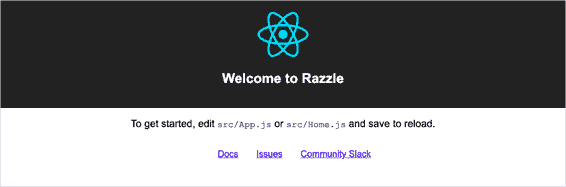

###### 图 1-5\. Razzle 首页位于 http://localhost:3000

当您希望部署应用程序的生产版本时，可以运行`build`脚本：

```
$ npm run build
```

不像`create-react-app`，这不仅会构建客户端代码，还会构建一个 Node 服务器。 Razzle 生成的代码位于*build*子目录下。服务器代码将在运行时继续为客户端生成静态代码。您可以通过运行*build/server.js*文件使用`start:prod`脚本启动生产服务器：

```
$ npm run start:prod
```

您可以将生产服务器部署到任何支持 Node 的地方。

服务器和客户端都可以运行相同的代码，这使得它变得*Universal*。但它是如何做到的呢？

客户端和服务器有不同的入口点。服务器在*src/server.js*中运行代码；浏览器在*src/client.js*中运行代码。*server.js*和*client.js*都使用*src/App.js*渲染相同的应用程序。

如果要将您的应用程序作为 SPA 运行，请删除*src/index.js*和*src/server.js*文件。然后在*public*文件夹中创建一个包含`<div/>`并带有 ID `root`的*index.html*文件，并使用以下命令重新构建应用程序：

```
$ node_modules/.bin/razzle build --type=spa
```

要每次将您的应用程序构建为 SPA，请在*package.json*的`start`和`build`脚本中添加`--type=spa`。

您将生成一个完整的 SPA，位于*build/public/*目录下，可以部署到任何 Web 服务器上。

## 讨论

Razzle 非常适应，因为它是从一组高度可配置的插件构建的。每个插件都是一个高阶函数，接收一个 Webpack 配置并返回一个修改过的版本。一个插件可能会转译 TypeScript 代码，另一个插件可能会捆绑 React 库。

如果要将应用程序切换到 Vue，只需替换您使用的插件即可。

您可以在[Razzle 网站](https://oreil.ly/UXwPv)上找到可用插件的列表。

您可以从[GitHub 网站](https://oreil.ly/rBR9r)下载此配方的源代码。

# 使用 Next.js 管理服务器和客户端代码

## 问题

React 会生成客户端代码，即使在服务器上也是如此。但是，有时您可能希望将相对较少的应用程序编程接口（API）代码作为同一 React 应用程序的一部分管理。

## 解决方案

Next.js 是一个用于生成 React 应用程序和服务器代码的工具。API 端点和客户端页面使用默认路由约定，使它们比您自行管理时更容易构建和部署。您可以在[网站](https://nextjs.org)上找到关于 Next.js 的详细信息。

您可以使用以下命令创建一个 Next.js 应用程序：

```
$ npx create-next-app my-app
```

如果已安装`yarn`，将使用它作为包管理器。您可以使用`--user-npm`标志强制使用`npm`包管理器：

```
$ npx create-next-app --use-npm my-app
```

这将在*my-app*子目录中创建一个 Next.js 应用程序。要启动该应用程序，请运行`dev`脚本（参见图 1-6）：

```
$ cd my-app
$ npm run dev
```

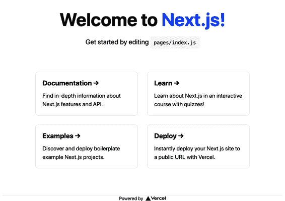

###### 图 1-6\. 一个运行在 http://localhost:3000 的 Next.js 页面

Next.js 允许您创建页面，无需管理任何路由配置。例如，如果您向*pages*文件夹添加一个组件脚本，它将立即通过服务器可用。例如，默认应用程序的*pages/index.js*组件生成主页。

这种方法类似于 Gatsby 的方法^(4)，但在 Next.js 中进一步包含了服务器端代码。

Next.js 应用通常包含一些 API 服务器代码，这在 React 应用中是不常见的，React 应用通常是与服务器代码分开构建的。但如果你查看 *pages/api* 目录，你会找到一个名为 *hello.js* 的示例服务器端点：

```
// Next.js API route support: https://nextjs.org/docs/api-routes/introduction

export default (req, res) => {
  res.status(200).json({ name: 'John Doe' })
}
```

将此路由挂载到 *api/hello* 端点是自动完成的。

Next.js 将你的代码转译成一个名为 .next 的隐藏目录，然后可以部署到诸如 Next.js 自家平台 [Vercel](https://vercel.com) 的服务上。

如果你愿意，你可以通过以下命令生成应用的静态构建版本：

```
$ node_modules/.bin/next export
```

`export` 命令将会在一个名为 *out* 的目录中构建你的客户端代码。该命令会将每个页面转换为静态渲染的 HTML 文件，这样在浏览器中加载速度会很快。页面末尾会加载 JavaScript 版本以生成任何动态内容。

如果你创建了一个 Next.js 应用的导出版本，它将不会包含任何服务器端 API。

Next.js 提供了一系列数据获取选项，允许你从静态内容或通过 [无头内容管理系统 (CMS) 源](https://oreil.ly/Xmia8) 获取数据。

## 讨论

Next.js 在很多方面与 Gatsby 类似。它的重点是交付速度，配置量很小。它可能对几乎没有服务器代码的团队最为有益。

你可以从 [GitHub 站点](https://oreil.ly/9gbJs) 下载本示例的源代码。

# 使用 Preact 创建一个微型应用

## 问题

React 应用可能会很大。创建一个简单的 React 应用并将其转译成数百千字节大小的 JavaScript 捆绑包是非常容易的。你可能希望构建一个具有类似 React 功能但体积小得多的应用。

## 解决方案

如果你需要 React 的功能但不想付出 React 规模的 JavaScript 捆绑包代价，可以考虑使用 Preact。

Preact *不是* React。它是一个独立的库，旨在尽可能接近 React 但体积要小得多。

React 框架如此庞大的原因在于它的工作方式。React 组件不会直接在浏览器的文档对象模型 (DOM) 中生成元素。相反，它们在 *虚拟 DOM* 中构建元素，然后在频繁的间隔内更新实际 DOM。这样做可以让基本的 DOM 渲染速度很快，因为只有在实际发生变化时才需要更新实际 DOM。但这也有一个缺点。React 的虚拟 DOM 需要大量代码来保持更新。它需要管理一个完整的合成事件模型，与浏览器中的事件模型相似。因此，React 框架体积庞大，并且下载时间可能较长。

解决方法之一是使用 SSR 等技术，但配置 SSR 可能会比较复杂。^(5) 有时候，你只想下载少量代码。这就是为什么 Preact 存在的原因。

尽管 Preact 库与 React 类似，但体积小巧。在撰写本文时，主要的 Preact 库大小约为 4KB，足够小，以至于能够在网页中添加类似 React 的功能，几乎不需要比编写原生 JavaScript 多的代码。

Preact 允许您选择如何使用它：作为包含在网页中的小型 JavaScript 库（*无需工具*方法）或作为完整的 JavaScript 应用程序。

无需工具方法非常基础。核心 Preact 库不支持 JSX，您将无法使用现代 JavaScript。以下是使用原始 Preact 库的示例网页：

```
<html>
    <head>
        <title>No Tools!</title>
        <script src="https://unpkg.com/preact?umd"></script>
    </head>
    <body>
        <h1>No Tools Preact App!</h1>
        <div id="root"></div>
        <script>
         var h = window.preact.h;
         var render = window.preact.render;

         var mount = document.getElementById('root');

         render(
             h('button',
               {
                   onClick: function() {
                       render(h('div', null, 'Hello'), mount);
                   }
               },
               'Click!'),
             mount
         );
        </script>
    </body>
</html>
```

此应用程序将在 ID 为`root`的`<div/>`中挂载自身，在那里它将显示一个按钮。当您单击按钮时，它将用字符串`"Hello"`替换根`div`的内容，这是 Preact 应用程序可以达到的基本操作。

你很少会以这种方式编写应用程序。实际上，您将创建一个简单的构建链，至少支持现代 JavaScript。

Preact 支持整个 JavaScript 应用程序的范围。在另一极端，您可以使用`preact-cli`创建完整的 Preact 应用程序。

`preact-cli`是一个用于创建 Preact 项目的工具，类似于`create-react-app`。您可以使用以下命令创建 Preact 应用程序：

```
$ npx preact-cli create default my-app
```

这个命令使用默认模板。其他模板可用于创建项目，例如，使用 Material 组件或 TypeScript。有关更多信息，请参见[Preact GitHub 页面](https://oreil.ly/IVQua)。

此命令将在*my-app*子目录中创建您的新 Preact 应用程序。要启动它，请运行`dev`脚本：

```
$ cd my-app
$ npm run dev
```

服务器将在端口 8080 上运行，如图 1-7 所示。

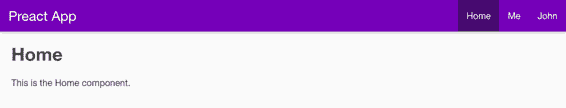

###### 图 1-7\. 来自 Preact 的页面

服务器生成一个网页，该网页从*src/index.js*中的代码生成一个 JavaScript 捆绑包。

现在，您拥有一个类似于全尺寸的 React 应用程序。例如，`Home`组件（*src/routes/home/index.js*）中的代码看起来非常像 React，并支持完整的 JSX：

```
import { h } from 'preact';
import style from './style.css';

const Home = () => (
    <div class={style.home}>
        <h1>Home</h1>
        <p>This is the Home component.</p>
    </div>
);

export default Home;
```

与标准 React 组件的唯一显著区别是，从`preact`库导入了名为`h`的函数，而不是从`react`库导入`React`。

Preact 代码中的 JSX 将转换为对`h`函数的一系列调用，这就是为什么需要导入它的原因。出于同样的原因，之前版本的`create-react-app`在版本 17 之前也需要导入`react`对象。从版本 17 开始，`create-react-app`切换到使用[JSX 转换](https://oreil.ly/HOwS9)，不再需要每次导入`react`。未来版本的 Preact 可能会做出类似的更改。

不过，应用程序的大小已经增加到略高于 300KB。这相当大，但我们仍处于开发模式。要看到 Preact 的真正强大之处，请按 Ctrl-C 停止开发服务器，然后运行 `build` 脚本：

```
$ npm run build
```

此命令将在 *build* 目录中生成应用程序的静态版本。首先，这样做有助于创建首页的静态副本，渲染速度快。其次，它会删除应用程序中的所有未使用代码并将所有内容缩小。如果您在标准 Web 服务器上提供此构建版本的应用程序，则在打开时，浏览器只会传输大约 50–60KB 的内容。

## 讨论

Preact 是一个非常出色的项目。尽管它的工作方式与 React 完全不同，但在几乎相同的功能强大的同时，它的体积却只有一小部分。您可以用它来处理从最低级的内联代码到完整的单页面应用程序的任何事情，因此，如果代码大小对您的项目至关重要，那么考虑使用它是非常值得的。

您可以在 [Preact 网站](https://preactjs.com) 上了解更多关于 Preact 的信息。

您可以从 GitHub 站点下载 [无工具示例](https://oreil.ly/N9PKf) 和 [更大的 Preact 示例](https://oreil.ly/F0tW9) 的源代码。

如果想让 Preact 看起来更像 React，请查看 [preact-compat](https://oreil.ly/3YXOv) 库。

最后，如果想要一个与 Preact 类似的项目，请查看 [InfernoJS](https://infernojs.org)。

# 使用 nwb 构建库

## 问题

大型组织通常同时开发多个 React 应用程序。如果您是咨询公司，可能会为多个组织创建应用程序。如果您是软件公司，可能会创建需要相同外观和感觉的各种应用程序，因此可能希望构建共享组件以在多个应用程序中使用。

创建组件项目时，需要创建目录结构，选择一组工具，选择一组语言特性，并创建能够将您的组件捆绑成可部署格式的构建链。这个过程可能与手动创建整个 React 应用程序的项目一样繁琐。

## 解决方案

您可以使用 `nwb` 工具包创建完整的 React 应用程序或单个 React 组件。它还可以为在 Preact 和 InfernoJS 项目中使用的组件创建组件，但我们在这里专注于 React 组件。

要创建一个新的 React 组件项目，首先需要全局安装 `nwb` 工具：

```
$ npm install -g nwb
```

使用 `nwb` 命令可以创建一个新项目：

```
$ nwb new react-component my-component
```

如果不只是创建单个组件，而是要创建一个完整的 `nwb` 应用程序，可以在该命令中用 `react-app`、`preact-app` 或 `inferno-app` 替换 `react-component`，以在给定的框架中创建一个应用程序。如果想创建一个没有框架的基本 JavaScript 项目，则可以使用 `vanilla-app`。

当您运行此命令时，它会询问您关于要构建的库类型的几个问题。例如，它会问您是否要构建 ECMAScript 模块：

```
Creating a react-component project...
? Do you want to create an ES modules build? (Y/n)
```

此选项允许您构建包含 `export` 语句的版本，Webpack 可以使用它来决定是否需要将组件包含在客户端应用程序中。还会询问您是否要创建通用模块定义（UMD）：

```
? Do you want to create a UMD build? (y/N)
```

如果您希望在网页中的 `<script/>` 中包含组件，则这非常有用。对于我们的示例，我们不会创建 UMD 构建。

在问题回答完毕后，该工具将在 *my-component* 子目录中创建一个 `nwb` 组件项目。该项目附带一个简单的包装器应用程序，您可以使用 `start` 脚本启动它：

```
$ cd my-component
$ npm run start
```

演示应用程序在端口 3000 上运行，如 图 1-8 所示。


###### 图 1-8\. 一个 `nwb` 组件

应用程序将包含一个在 *src/index.js* 中定义的单个组件：

```
import React, { Component } from 'react'

export default class extends Component {
  render() {
    return (
      <div>
        <h2>Welcome to React components</h2>
      </div>
    )
  }
}
```

现在您可以像构建任何 React 项目一样构建组件。当您准备好创建可发布版本时，请输入：

```
$ npm run build
```

构建的组件将位于 *lib/index.js*，您可以将其部署到存储库中供其他项目使用。

## 讨论

要了解有关创建 `nwb` 组件的更多详细信息，请参阅 [`nwb` 开发组件和库指南](https://oreil.ly/XHrQa)。

您可以从 [GitHub 网站](https://oreil.ly/P4Xzj) 下载此示例的源代码。

# 使用 Webpacker 将 React 添加到 Rails 中

## 问题

Rails 框架是在交互式 JavaScript 应用程序变得流行之前创建的。Rails 应用程序遵循更传统的 Web 应用程序开发模型，即在服务器上生成 HTML 页面，以响应浏览器请求。但有时，您可能希望在 Rails 应用程序中包含更多交互式元素。

## 解决方案

使用 Webpacker 库可以将 React 应用程序插入由 Rails 生成的网页中。要查看其工作原理，首先让我们生成一个包含 Webpacker 的 Rails 应用程序：

```
$ rails new my-app --webpack=react
```

此命令将在名为 *my-app* 的目录中创建一个预配置为运行 Webpacker 服务器的 Rails 应用程序。在我们启动应用程序之前，让我们进入其中并生成一个示例页面/控制器：

```
$ cd my-app
$ rails generate controller Example index
```

此代码将在 *app/views/example/index.html.erb* 中生成此模板页面：

```
<h1>Example#index</h1>
<p>Find me in app/views/example/index.html.erb</p>
```

接下来，我们需要创建一个小的 React 应用程序，可以将其插入到此页面中。Rails 将 Webpacker 应用程序作为 *packs* 插入：即 Rails 内的小 JavaScript 捆绑包。我们将在 *app/javascript/packs/counter.js* 中创建一个新的 pack，其中包含一个简单的计数器组件：

```
import React, { useState } from 'react'
import ReactDOM from 'react-dom'

const Counter = (props) => {
  const [count, setCount] = useState(0)
  return (
    <div className="Counter">
      You have clicked the button {count} times.
      <button onClick={() => setCount((c) => c + 1)}>Click!</button>
    </div>
  )
}

document.addEventListener('DOMContentLoaded', () => {
  ReactDOM.render(
    <Counter />,
    document.body.appendChild(document.createElement('div'))
  )
})
```

每当用户点击按钮时，此应用程序会更新计数器。

现在，我们可以通过向模板页面添加一行代码来将 pack 插入到网页中：

```
<h1>Example#index</h1>
<p>Find me in app/views/example/index.html.erb</p>
<%= javascript_pack_tag 'counter' %>
```

最后，我们可以在端口 3000 上运行 Rails 服务器：

```
$ rails server
```

在撰写本文时，启动服务器时需要安装 `yarn` 包管理器。你可以使用 `npm install -g yarn` 全局安装 `yarn`。

你将在 Figure 1-9 中看到 *http://localhost:3000/example/index.html* 页面。

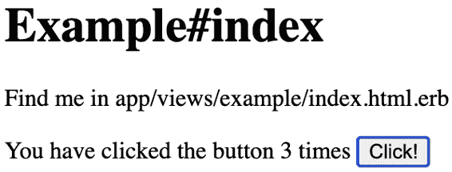

###### 图 1-9\. 一个嵌入在 http://localhost:3000/example/index.html 中的 React 应用程序

## 讨论

幕后，正如你可能已经猜到的那样，Webpacker 使用 Webpack 的副本转换应用程序，你可以使用 *app/config/webpacker.yml* 配置文件对其进行配置。

Webpacker 与 Rails 代码一起使用，而不是替代它。如果你的 Rails 应用程序需要少量的额外交互性，你应该考虑使用它。

你可以在 [Webpacker GitHub 站点](https://oreil.ly/aYZ0h) 上找到关于 Webpacker 的更多信息。

你可以从 [GitHub 站点](https://oreil.ly/H3q1F) 下载本示例的源代码。

# 使用 Preact 创建自定义元素

## 问题

有时在现有内容中添加 React 代码是有挑战性的情况。例如，在某些 CMS 配置中，用户不允许将额外的 JavaScript 插入到页面的主体中。在这些情况下，有一个标准化的方式可以安全地将 JavaScript 应用程序插入到页面中将会很有帮助。

## 解决方案

自定义元素是创建新 HTML 元素的标准方法，您可以在网页上使用它们。实际上，它们通过使更多的标签可用来扩展 HTML 语言。

这个示例介绍了如何使用像 Preact 这样的轻量级框架创建自定义元素，并将其发布到第三方服务器上。

让我们从创建一个新的 Preact 应用程序开始。该应用程序将提供我们将能够在其他地方使用的自定义元素：^(6)

```
$ preact create default my-element
```

现在我们将进入应用程序目录，并向项目添加 `preact-custom-element` 库：

```
$ cd my-element
$ npm install preact-custom-element
```

`preact-custom-element` 库将允许我们在浏览器中注册一个新的自定义 HTML 元素。

接下来，我们需要修改 Preact 项目的 *src/index.js* 文件，以便注册一个新的自定义元素，我们将其命名为 *components/Converter/index.js*：

```
import register from 'preact-custom-element'
import Converter from './components/Converter'

register(Converter, 'x-converter', ['currency'])
```

`register` 方法告诉浏览器，我们要创建一个名为 `<x-converter/>` 的新自定义 HTML 元素，该元素具有一个名为 `currency` 的属性，我们将在 *src/components/Converter/index.js* 中定义它：

```
import { h } from 'preact'
import { useEffect, useState } from 'preact/hooks'
import 'style/index.css'

const rates = { gbp: 0.81, eur: 0.92, jpy: 106.64 }

export default ({ currency = 'gbp' }) => {
  const [curr, setCurr] = useState(currency)
  const [amount, setAmount] = useState(0)

  useEffect(() => {
    setCurr(currency)
  }, [currency])

  return (
    <div className="Converter">
      <p>
        <label htmlFor="currency">Currency: </label>
        <select
          name="currency"
          value={curr}
          onChange={(evt) => setCurr(evt.target.value)}
        >
          {Object.keys(rates).map((r) => (
            <option value={r}>{r}</option>
          ))}
        </select>
      </p>
      <p className="Converter-amount">
        <label htmlFor="amount">Amount: </label>
        <input
          name="amount"
          size={8}
          type="number"
          value={amount}
          onInput={(evt) => setAmount(parseFloat(evt.target.value))}
        />
      </p>
      <p>
        Cost:
        {((amount || 0) / rates[curr]).toLocaleString('en-US', {
          style: 'currency',
          currency: 'USD',
        })}
      </p>
    </div>
  )
}
```

要符合自定义元素规范，我们必须为我们的元素选择一个以小写字母开头、不包含任何大写字母并包含连字符的名称。^(7) 这种约定确保该名称不会与任何标准元素名称冲突。

我们的 `Converter` 组件是一个货币转换器，在我们的示例中使用了一组固定的汇率。如果现在启动我们的 Preact 服务器：

```
$ npm run dev
```

自定义元素的 JavaScript 将在 *http://localhost:8080/bundle.js* 上可用。

要使用这个新的自定义元素，让我们在某个地方创建一个静态网页，并使用以下 HTML：

```
<html>
    <head>
        <script src="https://unpkg.com/babel-polyfill/dist/polyfill.min.js">
        </script>
        <script src="https://unpkg.com/@webcomponents/webcomponentsjs">
        </script>
        <!-- Replace this with the address of your custom element -->
        <script type="text/javascript" src="http://localhost:8080/bundle.js">
        </script>
    </head>
    <body>
        <h1>Custom Web Element</h1>
        <div style="float: right; clear: both">
            <!-- This tag will insert the Preact app -->
            <x-converter currency="jpy"/>
        </div>
        <p>This page contains an example custom element called
            <code>&lt;x-converter/&gt;</code>,
            which is being served from a different location</p>
    </body>
</html>
```

此网页包含在 `<head/>` 元素的最终 `<script/>` 中嵌入的自定义元素的定义。为了确保自定义元素在新旧浏览器中都可用，我们还从 *unpkg.com* 包含了一些 shims。

现在我们已经在网页中包含了自定义元素代码，我们可以像将其作为标准 HTML 的一部分一样插入 `<x-converter/>` 标签。在我们的示例中，我们还向底层 Preact 组件传递了一个 `currency` 属性。

无论我们在 HTML 中如何定义它们，自定义元素属性都以小写名称传递给底层组件。

我们可以通过一个独立于 Preact 服务器的 Web 服务器运行此页面。图 1-10 显示了新的自定义元素。

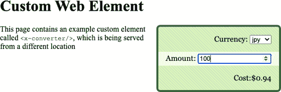

###### 图 1-10\. 嵌入静态页面中的自定义元素

## 讨论

自定义元素不需要与使用它的网页位于同一服务器上，这意味着我们可以使用自定义元素为任何网页发布小部件。因此，您可能希望检查任何传入请求的 `Referer` 标头，以防止未经授权的使用。

我们的示例是从 Preact 的开发服务器提供自定义元素。对于生产发布，您可能希望创建组件的静态构建，这可能会显著减小体积。^(8)

您可以从 [GitHub 网站](https://oreil.ly/aB7BP) 下载此示例的源代码。

# 使用 Storybook 进行组件开发

## 问题

React 组件是 React 应用程序的稳定构建材料。如果我们仔细编写它们，就可以在其他 React 应用程序中重用这些组件。但是当你构建一个组件时，需要检查它在所有情况下的工作情况。例如，在异步应用程序中，React 可能会使用未定义的属性渲染组件。组件仍然会正确渲染吗？会显示错误吗？

但是，如果您正在构建复杂应用程序的组件，可能很难创建组件需要处理的所有情况。

另外，如果您的团队中有专门的用户体验（UX）开发人员，如果他们必须浏览整个应用程序才能查看正在开发的单个组件，那将浪费很多时间。

如果有一种方法可以独立显示组件并传递示例属性集，那将会很有帮助。

## 解决方案

Storybook 是一种用于显示各种状态下组件库的工具。您可以将其描述为组件的画廊，但这可能有点贬低它。实际上，Storybook 是一个用于组件开发的工具。

如何将 Storybook 添加到项目中？让我们从使用 `create-react-app` 创建一个 React 应用程序开始：

```
$ npx create-react-app my-app
$ cd my-app
```

现在我们可以将 Storybook 添加到项目中：

```
$ npx sb init
```

我们可以使用 `yarn` 或 `npm` 启动 Storybook 服务器：

```
$ npm run storybook
```

Storybook 在 9000 端口上运行一个单独的服务器，如您在 Figure 1-11 中所见。使用 Storybook 时，无需运行实际的 React 应用程序。

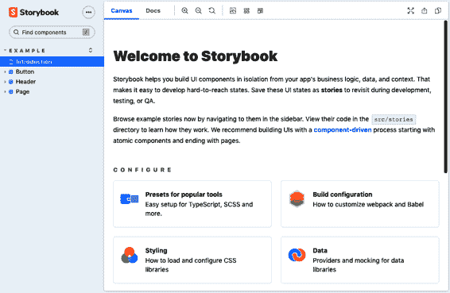

###### Figure 1-11\. Storybook 的欢迎页面

Storybook 将用示例属性呈现的单个组件称为 *story*。Storybook 的默认安装在应用程序的 *src/stories* 目录中生成示例故事。例如，*src/stories/Button.stories.js*：

```
import React from 'react';

import { Button } from './Button';

export default {
  title: 'Example/Button',
  component: Button,
  argTypes: {
    backgroundColor: { control: 'color' },
  },
};

const Template = (args) => <Button {...args} />;

export const Primary = Template.bind({});
Primary.args = {
  primary: true,
  label: 'Button',
};

export const Secondary = Template.bind({});
Secondary.args = {
  label: 'Button',
};

export const Large = Template.bind({});
Large.args = {
  size: 'large',
  label: 'Button',
};

export const Small = Template.bind({});
Small.args = {
  size: 'small',
  label: 'Button',
};
```

Storybook 监视源文件夹中命名为 **.stories.js* 的文件，并不关心它们的位置，因此您可以自由地在喜欢的位置创建它们。一个典型的模式是将故事放在与其展示的组件相邻的文件夹中。因此，如果您将文件夹复制到不同的应用程序中，可以将故事作为活动文档包含在内。

Figure 1-12 显示了在 Storybook 中 *Button.stories.js* 的外观。

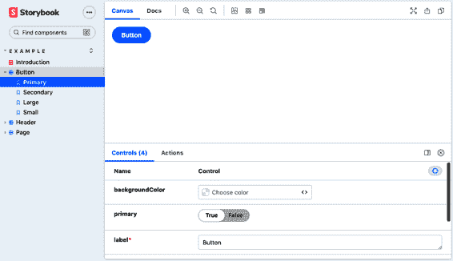

###### Figure 1-12\. 一个示例故事

## 讨论

尽管其看起来简单，但 Storybook 是一个高效的开发工具。它允许您一次专注于一个组件。就像一种视觉单元测试，它使您能够在一系列可能的场景中尝试组件，以检查其行为是否适当。

Storybook 还拥有大量额外的 [插件](https://oreil.ly/3kSVa)。

插件允许您：

+   检查无障碍问题（*addon-a11y*）

+   添加用于设置属性的交互式控件（*Knobs*）

+   为每个故事包含内联文档（*Docs*）

+   记录 HTML 的快照以测试更改的影响（*Storyshots*）

还可以做更多事情。

欲了解更多关于 Storybook 的信息，请访问 [该网站](https://storybook.js.org)。

您可以从 [GitHub 站点](https://oreil.ly/GyxTX) 下载此示例的源代码。

# 使用 Cypress 在浏览器中测试您的代码

## 问题

大多数 React 项目都包含一个测试库。最常见的可能是 `@testing-library/react`，它与 `create-react-app` 捆绑在一起，或者是 Preact 使用的 Enzyme。

但是没有什么比在真实浏览器中测试代码更好，因为那会带来额外的复杂性。传统上，浏览器测试可能会不稳定，并且需要频繁维护，因为您需要每次升级浏览器时升级浏览器驱动程序（如 ChromeDriver）。

加上在后端服务器上生成测试数据的问题，基于浏览器的测试可能会复杂设置和管理。

## 解决方案

[Cypress 测试框架](https://www.cypress.io) 避免了传统浏览器测试的许多缺点。它在浏览器中运行，但避免了使用外部的 Web 驱动程序工具。相反，它通过网络端口直接与浏览器（如 Chrome 或 Electron）通信，然后注入 JavaScript 来运行大部分测试代码。

让我们创建一个 `create-react-app` 应用程序，看看它是如何工作的：

```
$ npx create-react-app --use-npm my-app
```

现在让我们进入应用程序目录并安装 Cypress：

```
$ cd my-app
$ npm install cypress --save-dev
```

在运行 Cypress 之前，我们需要配置它，以便它知道如何找到我们的应用程序。我们可以通过在应用程序目录中创建一个*cypress.json*文件，并告诉它我们应用程序的统一资源定位器（URL）来实现这一点：

```
{
  "baseUrl": "http://localhost:3000/"
}
```

一旦我们启动了主应用程序：

```
$ npm start
```

然后我们可以打开 Cypress：

```
$ npx cypress open
```

第一次运行 Cypress 时，它会安装所有需要的依赖项。现在我们将在*cypress/integration*目录下创建一个名为*screenshot.js*的测试，它将打开首页并截图：

```
describe('screenshot', () => {
    it('should be able to take a screenshot', () => {
        cy.visit('/');
        cy.screenshot('frontpage');
    });
});
```

您会注意到我们以 Jest 格式编写了测试。保存测试后，它将显示在主 Cypress 窗口中，如图 1-13 所示。

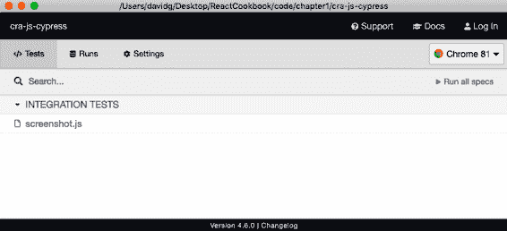

###### 图 1-13. Cypress 窗口

如果双击测试，Cypress 将在浏览器中运行它。应用程序的首页将打开，并且测试将保存一个截图到*cypress/screenshots/screenshot.js/frontpage.png*。

## 讨论

这里是您可以在 Cypress 中执行的一些示例命令：

| 命令 | 描述 |
| --- | --- |
| `cy.contains('Fred')` | 查找包含*`Fred`*的元素 |
| `cy.get('.Norman').click()` | 单击具有类*`Norman`*的元素 |
| `cy.get('input').type('Hi!')` | 在输入框中键入`"Hi!"` |
| `cy.get('h1').scrollIntoView()` | 滚动`<h1/>`到视图中 |

这些只是与网页交互的一些命令。但是 Cypress 还有另一个绝招。Cypress 还可以修改浏览器内部的代码以更改时间（`cy.clock()`）、cookies（`cy.setCookie()`）、本地存储（`cy.clearLocalStorage()`）和最令人印象深刻的是伪造请求和响应到 API 服务器。

它通过修改内置在浏览器中的网络功能来实现这一点，使得这段代码：

```
cy.route("/api/server?*", [{some: 'Data'}])
```

将拦截任何以/api/server?开头的服务器端点的请求，并返回 JSON 数组`[{some: 'Data'}]`。

模拟网络响应可以彻底改变团队开发应用程序的方式，因为它将前端开发与后端解耦。浏览器测试可以指定它们所需的数据，而无需创建真实的服务器和数据库。

要了解更多关于 Cypress 的信息，请访问[文档站点](https://oreil.ly/eX09t)。

您可以从[GitHub 网站](https://oreil.ly/3j8vI)下载此配方的源代码。

^(1) 是的，这意味着 Gatsby 内置了对 TypeScript 的支持。

^(2) 大多数操作系统按 Ctrl-C 即可完成此操作。

^(3) 名称有意与`create-react-app`相似。Razzle 的维护者 Jared Palmer 将`create-react-app`列为 Razzle 的灵感之一。

^(4) 参见“使用 Gatsby 构建内容丰富的应用程序”。

^(5) 查看配方 1.2 和 1.3。

^(6) 欲了解如何创建 Preact 应用程序的更多信息，请参阅 “使用 Preact 创建微型应用”。

^(7) 参阅 [WHATWG 规范](https://oreil.ly/KOjmP) 了解自定义元素和命名约定的详细信息。

^(8) 进一步了解如何缩小 Preact 的下载量，请参阅 “使用 Preact 创建微型应用”。
