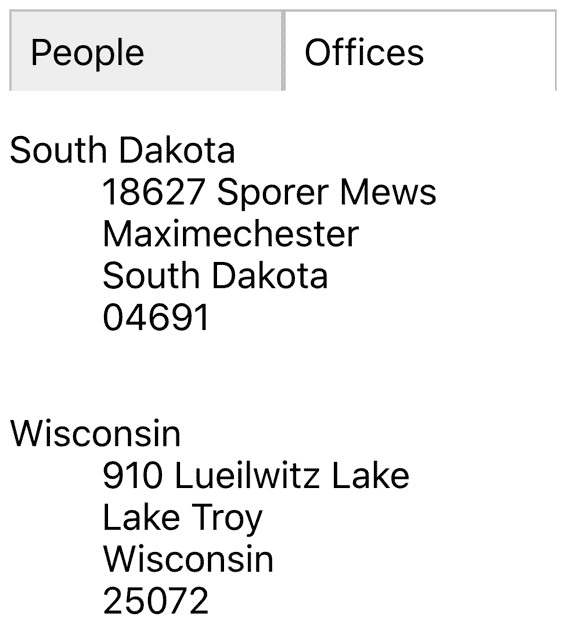
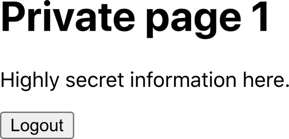

# 第二章：路由

本章将探讨使用 React 路由和`react-router-dom`库的技巧。

`react-router-dom` 使用*声明式路由*，这意味着你将路由看作是任何其他 React 组件。与按钮、文本字段和文本块不同，React 路由没有视觉外观。但在大多数其他方面，它们与按钮和文本块类似。路由存在于组件的虚拟 DOM 树中。它们监听当前浏览器位置的变化，并允许您打开和关闭界面的部分。它们使得单页面应用程序看起来像是多页面应用程序。

如果使用得当，它们可以使您的应用程序感觉像任何其他网站。用户可以将您的应用程序的部分添加到书签中，就像他们可能会将维基百科的页面添加到书签中一样。他们可以在浏览器历史记录中前进和后退，并且您的界面将正常工作。如果您对 React 不熟悉，深入了解路由的强大功能是非常值得的。

# 创建具有响应式路由的界面

## 问题

大多数应用程序在移动设备和笔记本电脑上都有用户使用，这意味着您可能希望您的 React 应用程序在所有屏幕尺寸上都能良好运行。使您的应用程序响应式涉及相对简单的 CSS 更改，以调整文本和屏幕布局的大小，并且更深入的更改可以使移动设备和桌面用户在浏览站点时有非常不同的体验。

我们的示例应用程序显示了一组人员的姓名和地址。在图 2-1 中，您可以看到应用程序在桌面机器上运行。


###### 图 2-1\. 应用程序的桌面视图

但是这种布局在移动设备上效果不佳，可能只能显示人员列表或者一个人的详细信息，但不能同时显示。

在 React 中，我们能做些什么来为移动设备和桌面用户提供定制的导航体验，而不需要创建完全不同的应用程序版本？

## 解决方案

我们将使用*响应式路由*。响应式路由会根据用户显示器的大小而变化。我们现有的应用程序使用单一路由显示一个人员的信息：*/people/:id*。

当您导航到这个路由时，浏览器将显示图 2-1 中的页面。您可以看到人员列表显示在左侧。页面突出显示所选人员并在右侧显示其详细信息。

我们将修改我们的应用程序以处理在*/people*路由上的附加路由。然后我们将使路由具有响应能力，以便用户在不同设备上看到不同的内容：

| 路由 | 移动设备 | 桌面 |
| --- | --- | --- |
| /people | 显示人员列表 | 重定向到*people*:someId |
| *people*:id | 显示:id 的详细信息 | 显示人员列表和:id 的详细信息 |

我们需要哪些要素来实现这一点？首先，如果我们的应用程序尚未安装，我们需要安装`react-router-dom`：

```
$ npm install react-router-dom
```

`react-router-dom` 库允许我们将浏览器当前位置与应用程序的状态协调一致。接下来，我们将安装 `react-media` 库，这样我们就可以创建响应式的 React 组件，以响应显示屏尺寸的变化：

```
$ npm install react-media
```

现在我们将创建一个响应式的 `PeopleContainer` 组件，它将管理我们想要创建的路由。在小屏幕上，我们的组件将显示人员列表或单个人员的详细信息中的*一个*。在大屏幕上，它将显示左侧人员列表和右侧单个人员详细信息的组合视图。

`PeopleContainer` 将使用 `react-media` 中的 `Media` 组件。`Media` 组件的作用类似于 CSS 的 `@media` 规则：它允许您生成适用于指定屏幕尺寸范围的输出。`Media` 组件接受一个 `queries` 属性，允许您指定一组屏幕尺寸。我们将定义一个单独的屏幕尺寸—`small`，它将用作移动和桌面屏幕之间的断点：

```
<Media queries={{
        small: "(max-width: 700px)"
    }}>
  ...
</Media>
```

`Media` 组件接受一个子组件，期望它是一个函数。这个函数会传入一个 `size` 对象，用于获取当前屏幕尺寸信息。在我们的例子中，`size` 对象会包含一个 `small` 属性，我们可以用它来决定显示哪些其他组件：

```
<Media queries={{
        small: "(max-width: 700px)"
    }}>
  {
    size => size.small ? [SMALL SCREEN COMPONENTS] : [BIG SCREEN COMPONENTS]
  }
</Media>
```

在查看返回的代码细节之前，我们需要看一下如何在应用程序中挂载 `PeopleContainer`。下面的代码将是我们的主要 `App` 组件：

```
import { BrowserRouter, Link, Route, Switch } from 'react-router-dom'
import PeopleContainer from './PeopleContainer'

function App() {
  return (
    <BrowserRouter>
      <Switch>
        <Route path="/people">
          <PeopleContainer />
        </Route>
        <Link to="/people">People</Link>
      </Switch>
    </BrowserRouter>
  )
}

export default App
```

我们正在使用来自 `react-router-dom` 的 `BrowserRouter`，它将我们的代码与浏览器的 HTML5 历史记录 API 连接起来。我们需要将所有路由包装在 `Router` 中，以便它们可以访问浏览器的当前地址。

在 `BrowserRouter` 内部，我们有一个 `Switch`。`Switch` 会查看内部的组件，寻找与当前位置匹配的 `Route`。这里有一个单独的 `Route`，匹配路径以 */people* 开头。如果条件成立，我们展示 `PeopleContainer`。如果没有匹配的路由，我们会继续查看 `Switch` 的末尾，并渲染一个指向 */people* 路径的 `Link`。所以，当有人访问应用程序的首页时，他们只会看到一个指向 `People` 页面的链接。

代码将匹配以指定 `path` 开头的路由，除非指定了 `exact` 属性，在这种情况下，只有整个路径匹配时才会显示路由。

因此，如果我们在 `PeopleContainer` 内部，我们已经在以 */people/…* 开头的路径上。如果在小屏幕上，我们需要显示人员列表或显示单个人员的详细信息，但不能同时显示。我们可以使用 `Switch` 来实现这一点：

```
<Media queries={{
        small: "(max-width: 700px)"
    }}>
  {
    size => size.small ? [SMALL SCREEN COMPONENTS]
        <Switch>
          <Route path='/people/:id'>
            <Person/>
          </Route>
          <PeopleList/>
        </Switch>
        : [BIG SCREEN COMPONENTS]
  }
</Media>
```

在小设备上，`Media`组件将使用一个值调用其子函数，该值表示`size.small`为`true`。我们的代码将渲染一个`Switch`，如果当前路径包含一个`id`，则显示`Person`组件。否则，`Switch`将无法匹配该`Route`，而是渲染一个`PeopleList`。

即使我们还没有为大屏幕编写代码，如果我们现在在移动设备上运行此代码并点击首页的`People`链接，我们将导航至*people*，这可能会导致应用程序渲染`PeopleList`组件。`PeopleList`组件显示一组以*/people/id*形式的路径链接的人员。^(1) 当有人从列表中选择一个人时，我们的组件将重新渲染，这次`PeopleContainer`将显示单个人员的详细信息（参见图 2-2）。


###### 图 2-2\. 在移动视图中：左侧的人员列表链接到右侧的个人详情

目前为止一切顺利。现在我们需要确保我们的应用程序仍然适用于大屏幕。我们需要在`PeopleContainer`中生成响应式路由，以便当`size.small`为`false`时，如果当前路由形式为*/people/id*，我们可以在左侧显示`PeopleList`组件，在右侧显示`Person`组件：

```
<div style={{display: 'flex'}}>
  <PeopleList/>
  <Person/>
</div>
```

不幸的是，这并不能处理当前路径为*/people*的情况。我们需要另一个`Switch`，要么显示单个人员的详细信息，要么将重定向到列表中第一个人员的*/people/first-person-id*。

```
<div style={{display: 'flex'}}>
    <PeopleList/>
    <Switch>
        <Route path='/people/:id'>
            <Person/>
        </Route>
        <Redirect to={`/people/${people[0].id}`}/>
    </Switch>
</div>
```

`Redirect`组件并不执行*实际*的浏览器重定向。它只是更新当前路径为*/people/first-person-id*，这会导致`PeopleContainer`重新渲染。这类似于在 JavaScript 中调用`history.push()`，但它不会在浏览器历史记录中添加额外页面。如果一个人导航至*/people*，浏览器将简单地将其位置更改为*/people/first-person-id*。

如果我们现在在笔记本电脑或更大的平板电脑上转到*/people*，我们将看到人员列表旁边的第一个人员的详细信息（图 2-3）。


###### 图 2-3\. 在大屏幕上查看 http://localhost:3000/people 时看到的内容

这是我们的`PeopleContainer`的最终版本：

```
import Media from 'react-media'
import { Redirect, Route, Switch } from 'react-router-dom'
import Person from './Person'
import PeopleList from './PeopleList'
import people from './people'

const PeopleContainer = () => {
  return (
    <Media
      queries={{
        small: '(max-width: 700px)',
      }}
    >
      {(size) =>
        size.small ? (
          <Switch>
            <Route path="/people/:id">
              <Person />
            </Route>
            <PeopleList />
          </Switch>
        ) : (
          <div style={{ display: 'flex' }}>
            <PeopleList />
            <Switch>
              <Route path="/people/:id">
                <Person />
              </Route>
              <Redirect to={`/people/${people[0].id}`} />
            </Switch>
          </div>
        )
      }
    </Media>
  )
}

export default PeopleContainer
```

## 讨论

在组件内部声明式路由可能在初次接触时显得奇怪。假设您以前使用过集中式路由模型。在这种情况下，声明式路由可能一开始看起来很混乱，因为它们将应用程序的连接分布在多个组件中，而不是在单个文件中。而不是创建干净的组件，这些组件对外界一无所知，突然之间您需要给出应用程序中使用的路径的详细知识，这可能会使它们不太便携。

然而，响应式路由展示了声明式路由的真正威力。如果您担心您的组件对应用程序中的路径了解过多，请考虑将路径字符串提取到一个共享文件中。这样，您既可以根据当前路径修改组件行为，又可以有一个集中的路径配置。

您可以从[GitHub 网站](https://oreil.ly/tZzMD)下载此示例的源代码。

# 将状态移入路由

## 问题

使用显示它的路由来管理组件的内部状态通常很有帮助。例如，这是一个显示两个信息选项卡的 React 组件：一个用于*/people*，一个用于*/offices*：

```
import { useState } from 'react'
import People from './People'
import Offices from './Offices'

import './About.css'

const OldAbout = () => {
  const [tabId, setTabId] = useState('people')

  return (
    <div className="About">
      <div className="About-tabs">
        <div
          onClick={() => setTabId('people')}
          className={
            tabId === 'people' ? 'About-tab active' : 'About-tab'
          }
        >
          People
        </div>
        <div
          onClick={() => setTabId('offices')}
          className={
            tabId === 'offices' ? 'About-tab active' : 'About-tab'
          }
        >
          Offices
        </div>
      </div>
      {tabId === 'people' && <People />}
      {tabId === 'offices' && <Offices />}
    </div>
  )
}

export default OldAbout
```

当用户点击选项卡时，内部的`tabId`变量会更新，并显示`People`或`Offices`组件（参见图 2-4）。


###### 图 2-4。默认情况下，OldAbout 组件显示人员的详细信息

问题在哪里？组件是有效的，但如果我们选择 Offices 选项卡然后刷新页面，组件将重置为 People 选项卡。同样地，当页面在 Offices 选项卡上时，我们无法将其作为书签保存。我们无法在应用程序的其他位置创建直接导航到 Offices 的链接。辅助功能硬件可能不会注意到选项卡作为超链接的工作方式，因为它们没有以那种方式呈现。

## 解决方案

我们将从组件中移动`tabId`状态到当前浏览器位置。因此，不再在*/about*路径渲染组件，然后使用`onClick`事件来改变内部状态，而是将路由设置为*/about/people*和*/about/offices*，显示其中一个选项卡。选项卡选择将在浏览器刷新时保留。我们可以将页面上的特定选项卡书签保存或创建链接到特定选项卡。并且我们将选项卡实际作为超链接，这样键盘或屏幕阅读器导航的人就会认识到它们。

我们需要哪些成分？只需一个：`react-router-dom`：

```
$ npm install react-router-dom
```

`react-router-dom`将允许我们将当前浏览器的 URL 与我们在屏幕上呈现的组件同步。

我们现有的应用程序已经使用`react-router-dom`在路径*/oldabout*显示`OldAbout`组件，如您可以从*App.js*文件的这段代码片段中看到的那样：

```
<Switch>
    <Route path="/oldabout">
        <OldAbout/>
    </Route>
    <p>Choose an option</p>
</Switch>
```

您可以在[GitHub 存储库](https://oreil.ly/WmZ18)中查看此文件的完整代码。

我们将创建一个名为`About`的`OldAbout`组件的新版本，并将其挂载到自己的路由上：

```
<Switch>
    <Route path="/oldabout">
        <OldAbout/>
    </Route>
    <Route path="/about/:tabId?">
        <About/>
    </Route>
    <p>Choose an option</p>
</Switch>
```

此添加允许我们在示例应用程序中打开两个版本的代码。

我们的新版本看起来几乎与旧组件相同。我们将`tabId`从组件中提取出来，并移入当前路径。

将 `Route` 的路径设置为 */about/:tabId?* 意味着 */about*、*/about/offices* 和 */about/people* 都将装载我们的组件。`?` 表示 `tabId` 参数是可选的。

现在我们已经完成了第一部分：我们已经将组件的状态放入了显示它的路径中。现在我们需要更新组件，使其与路由交互，而不是与内部状态变量交互。

在 `OldAbout` 组件中，我们在每个选项卡上都有 `onClick` 监听器：

```
<div onClick={() => setTabId("people")}
     className={tabId === "people" ? "About-tab active" : "About-tab"}
>
    People
</div>
<div onClick={() => setTabId("offices")}
     className={tabId === "offices" ? "About-tab active" : "About-tab"}
>
    Offices
</div>
```

我们将把这些转换为 `Link` 组件，转到 */about/people* 和 */about/offices*。事实上，我们将它们转换为 `NavLink` 组件。`NavLink` 就像一个链接，但是它有能力在其链接的位置是当前位置时设置额外的类名。这意味着我们不需要原始代码中的 `className` 逻辑：

```
<NavLink to="/about/people"
         className="About-tab"
         activeClassName="active">
    People
</NavLink>
<NavLink to="/about/offices"
         className="About-tab"
         activeClassName="active">
    Offices
</NavLink>
```

我们不再设置 `tabId` 变量的值。我们改为在路径中跳转到新位置，并带有新的 `tabId` 值。

但是我们该如何读取 `tabId` 的值呢？`OldAbout` 代码像这样显示当前选项卡内容：

```
{tabId === "people" && <People/>}
{tabId === "offices" && <Offices/>}
```

这段代码可以替换为一个 `Switch` 和几个 `Route` 组件：

```
<Switch>
    <Route path='/about/people'>
        <People/>
    </Route>
    <Route path='/about/offices'>
        <Offices/>
    </Route>
</Switch>
```

我们现在*几乎*完成了。只剩下一步：如果路径是 */about* 且不包含 `tabId`，我们该如何决定。

`OldAbout` 在首次创建状态时为 `tabId` 设置了默认值：

```
const [tabId, setTabId] = useState("people")
```

我们可以通过在 `Switch` 结尾添加一个 `Redirect` 来实现相同的效果。`Switch` 会按顺序处理其子组件，直到找到匹配的 `Route`。如果当前路径没有匹配的 `Route`，它将达到 `Redirect`，这将把地址更改为 */about/people*。这将导致 `About` 组件重新渲染，并且默认选择 People 标签：

```
<Switch>
    <Route path='/about/people'>
        <People/>
    </Route>
    <Route path='/about/offices'>
        <Offices/>
    </Route>
    <Redirect to='/about/people'/>
</Switch>
```

您可以通过为 `Redirect` 提供一个 `from` 属性来使其在当前路径上有条件地执行。在这种情况下，我们可以将 `from` 设置为 `/about`，这样只有匹配 `/about` 的路由才会被重定向到 `/about/people`。

这是我们完成的 `About` 组件：

```
import { NavLink, Redirect, Route, Switch } from 'react-router-dom'
import './About.css'
import People from './People'
import Offices from './Offices'

const About = () => (
  <div className="About">
    <div className="About-tabs">
      <NavLink
        to="/about/people"
        className="About-tab"
        activeClassName="active"
      >
        People
      </NavLink>
      <NavLink
        to="/about/offices"
        className="About-tab"
        activeClassName="active"
      >
        Offices
      </NavLink>
    </div>
    <Switch>
      <Route path="/about/people">
        <People />
      </Route>
      <Route path="/about/offices">
        <Offices />
      </Route>
      <Redirect to="/about/people" />
    </Switch>
  </div>
)

export default About
```

我们不再需要内部的 `tabId` 变量，现在我们有一个纯声明的组件（参见图 2-5）。



###### 图 2-5\. 使用新组件访问 http://localhost/about/offices

## 讨论

将状态从组件移至地址栏可能会简化您的代码，但这只是一个幸运的副作用。真正的价值在于，您的应用程序开始表现得不像应用程序，而更像一个网站。我们可以书签页，并且浏览器的“后退”和“前进”按钮能正常工作。在路由中管理更多状态不是抽象的设计决策；这是使您的应用程序对用户来说不那么令人惊讶的一种方式。

您可以从 [GitHub 站点](https://oreil.ly/myAGj) 下载此示例的源代码。

# 用 MemoryRouter 进行单元测试

## 问题

我们在 React 应用程序中使用路由，以便更好地利用浏览器的功能。我们可以收藏页面，创建应用程序的深链接，并在历史记录中前进和后退。

然而，一旦我们使用路由，我们使组件依赖于其外部的某些东西：浏览器位置。这可能看起来不是太大的问题，但它确实有后果。

假设我们想要对一个路由感知的组件进行单元测试。例如，让我们为我们在“将状态移到路由”中构建的`About`组件创建一个单元测试：

```
describe('About component', () => {
  it('should show people', () => {
    render(<About />)
    expect(screen.getByText('Kip Russel')).toBeInTheDocument()
  })
})
```

这个单元测试渲染组件，然后检查它是否能在输出中找到“Kip Russel”这个名字。当我们运行这个测试时，我们得到以下错误：

```
console.error node_modules/jsdom/lib/jsdom/virtual-console.js:29
    Error: Uncaught [Error: Invariant failed: You should not use <NavLink>
        outside a <Router>]
```

错误发生是因为`NavLink`找不到组件树中更高级别的`Router`。这意味着我们需要在测试之前将组件包装在`Router`中。

另外，我们可能希望编写一个单元测试，检查`About`组件在特定路由上挂载时的工作情况。即使我们提供一个`Router`组件，我们如何伪造一个特定的路由？

这不仅仅是单元测试的问题。如果我们使用像 Storybook 这样的库工具，我们可能希望展示一个组件在特定路径上挂载时的示例。

我们需要像实际浏览器路由器那样的东西，但允许我们指定其行为。

## 解决方案

`react-router-dom`库提供了这样一个路由器：`MemoryRouter`。`MemoryRouter`在外界看来与`BrowserRouter`一样。不同之处在于，虽然`BrowserRouter`是底层浏览器历史记录 API 的接口，但`MemoryRouter`没有这样的依赖。它可以跟踪当前位置，并可以在历史记录中前进和后退，但它通过简单的内存结构实现了这一点。

让我们再看看那个失败的单元测试。不只是渲染`About`组件，让我们把它包装在`MemoryRouter`中：

```
describe('About component', () => {
  it('should show people', () => {
    render(
      <MemoryRouter>
        <About />
      </MemoryRouter>
    )

    expect(screen.getByText('Kip Russel')).toBeInTheDocument()
  })
})
```

现在，当我们运行测试时，它可以工作了。这是因为`MemoryRouter`将一个模拟版本的 API 注入到上下文中。这使得它对所有子组件都可用。`About`组件现在可以呈现`Link`或`Route`，因为历史记录可用。

但是`MemoryRouter`有一个额外的优势。因为它伪造了浏览器的历史记录 API，它可以使用`initialEntries`属性提供完全虚假的历史记录。`initialEntries`属性应该设置为历史记录条目的数组。如果传递一个单值数组，它将被解释为当前位置。这使您能够编写单元测试，检查组件在给定路由上挂载时的行为：

```
describe('About component', () => {
  it('should show offices if in route', () => {
    render(
      <MemoryRouter initialEntries={[{ pathname: '/about/offices' }]}>
        <About />
      </MemoryRouter>
    )

    expect(screen.getByText('South Dakota')).toBeInTheDocument()
  })
})
```

我们可以在 Storybook 中使用真实的`BrowserRouter`，因为我们在真实的浏览器中，但`MemoryRouter`也允许我们伪造当前位置，就像我们在`ToAboutOffices` Storybook 故事中所做的那样（见图 2-6）。


###### 图 2-6\. 使用 `MemoryRouter`，我们可以模拟 `/about/offices` 路由。

## 讨论

路由器允许您将希望去哪里的详细信息与如何到达目的地分开。在这个示例中，我们看到了这种分离的一个优势：我们可以创建一个虚拟的浏览器位置来检查不同路由上组件的行为。这种分离允许您更改应用程序跟随链接的方式，而不会导致中断。如果将单页应用程序转换为服务器端渲染应用程序，可以将 `BrowserRouter` 替换为 `StaticRouter`。用于调用浏览器历史 API 的链接将成为导致浏览器进行本机页面加载的本机超链接。路由器是分离策略（您想做什么）和机制（您将如何做到）优势的一个很好的例子。

您可以从 [GitHub 网站](https://oreil.ly/1NW8e) 下载此配方的源代码。

# 使用 `Prompt` 进行页面退出确认

## 问题

有时，如果用户正在编辑某些内容，需要询问用户是否确认离开页面。这个看似简单的任务可能会很复杂，因为它依赖于识别用户何时点击“返回”按钮，然后找到拦截历史记录移动并可能取消其行为的方法（见图 2-7）。


###### 图 2-7\. 离开前询问确认

如果应用程序中有多个页面需要相同的功能，该如何简单地创建此功能以覆盖任何需要它的组件？

## 解决方案

`react-router-dom` 库包含一个名为 `Prompt` 的组件，用于要求用户确认是否离开页面。

此处我们唯一需要的配料是 `react-router-dom` 库本身：

```
npm install react-router-dom
```

假设我们有一个名为 `Important` 的组件，安装在 */important*，允许用户编辑一段文本：

```
import React, { useEffect, useState } from 'react'

const Important = () => {
  const initialValue = 'Initial value'

  const [data, setData] = useState(initialValue)
  const [dirty, setDirty] = useState(false)

  useEffect(() => {
    if (data !== initialValue) {
      setDirty(true)
    }
  }, [data, initialValue])

  return (
    <div className="Important">
      <textarea
        onChange={(evt) => setData(evt.target.value)}
        cols={40}
        rows={12}
      >
        {data}
      </textarea>
      <br />
      <button onClick={() => setDirty(false)} disabled={!dirty}>
        Save
      </button>
    </div>
  )
}

export default Important
```

`Important` 已经在跟踪 `textarea` 中的文本是否与原始值不同。如果文本不同，`dirty` 的值为 `true`。当 `dirty` 为 `true` 时，我们如何要求用户确认他们是否希望离开页面，如果他们点击“返回”按钮？

我们添加了一个 `Prompt` 组件：

```
return (
  <div className="Important">
    <textarea
      onChange={(evt) => setData(evt.target.value)}
      cols={40}
      rows={12}
    >
      {data}
    </textarea>
    <br />
    <button onClick={() => setDirty(false)} disabled={!dirty}>
      Save
    </button>
    <Prompt
      when={dirty}
      message={() => 'Do you really want to leave?'}
    />
  </div>
)
```

如果用户编辑文本，然后点击“返回”按钮，将显示 `Prompt`（见图 2-8）。


###### 图 2-8\. `Prompt` 要求用户确认他们希望离开

添加确认信息很容易，但默认的提示界面是一个简单的 JavaScript 对话框。我们希望能够自行决定用户确认离开页面的方式。

为了演示我们如何做到这一点，让我们将 Material-UI 组件库添加到应用程序中：

```
$ npm install '@material-ui/core'
```

Material-UI 库是 Google Material Design 标准的 React 实现。我们将使用它作为一个示例，说明如何用更定制化的内容替换标准的 `Prompt` 界面。

`Prompt`组件不会呈现任何 UI。相反，`Prompt`组件请求当前的`Router`显示确认对话框。默认情况下，`BrowserRouter`显示默认的 JavaScript 对话框，但可以用自己的代码替换它。

将`BrowserRouter`添加到组件树中后，我们可以传递一个名为`getUserConfirmation`的属性：

```
<div className="App">
    <BrowserRouter
        getUserConfirmation={(message, callback) => {
          // Custom code goes here
        }}
    >
        <Switch>
            <Route path='/important'>
                <Important/>
            </Route>
        </Switch>
    </BrowserRouter>
</div>
```

`getUserConfirmation`属性是一个接受两个参数的函数：要显示的消息和一个回调函数。

当用户单击“返回”按钮时，`Prompt`组件将运行`getUserCon⁠firmation`，然后等待回调函数被调用，参数为`true`或`false`。

回调函数以异步方式返回用户的响应。`Prompt`组件会等待我们询问用户想要做什么。这使我们能够创建一个自定义界面。

让我们创建一个名为`Alert`的自定义 Material-UI 对话框。我们将使用这个对话框代替默认的 JavaScript 模态框：

```
import Button from '@material-ui/core/Button'
import Dialog from '@material-ui/core/Dialog'
import DialogActions from '@material-ui/core/DialogActions'
import DialogContent from '@material-ui/core/DialogContent'
import DialogContentText from '@material-ui/core/DialogContentText'
import DialogTitle from '@material-ui/core/DialogTitle'

const Alert = ({ open, title, message, onOK, onCancel }) => {
  return (
    <Dialog
      open={open}
      onClose={onCancel}
      aria-labelledby="alert-dialog-title"
      aria-describedby="alert-dialog-description"
    >
      <DialogTitle id="alert-dialog-title">{title}</DialogTitle>
      <DialogContent>
        <DialogContentText id="alert-dialog-description">
          {message}
        </DialogContentText>
      </DialogContent>
      <DialogActions>
        <Button onClick={onCancel} color="primary">
          Cancel
        </Button>
        <Button onClick={onOK} color="primary" autoFocus>
          OK
        </Button>
      </DialogActions>
    </Dialog>
  )
}

export default Alert
```

当然，我们没有必要显示对话框。我们可以显示倒计时器或者 Snackbar 消息，或者自动保存用户的更改。但我们将显示一个自定义的`Alert`对话框。

我们将如何在界面中使用`Alert`组件？首先，我们需要创建自己的`getUserConfirmation`函数。我们将存储消息和回调函数，然后设置一个布尔值，表示我们要打开`Alert`对话框：

```
const [confirmOpen, setConfirmOpen] = useState(false)
const [confirmMessage, setConfirmMessage] = useState()
const [confirmCallback, setConfirmCallback] = useState()

return (
  <div className="App">
    <BrowserRouter
      getUserConfirmation={(message, callback) => {
        setConfirmMessage(message)
        // Use this setter form because callback is a function
        setConfirmCallback(() => callback)
        setConfirmOpen(true)
      }}
    >
  .....
```

值得注意的是，当我们存储回调函数时，我们使用`setConfirmCallback(() => callback)`而不是简单地写`setConfirmCallback(callback)`。这是因为`useState`钩子返回的设置器将执行传递给它们的任何函数，而不是仅仅存储它们。

然后，我们可以使用`confirmMessage`、`confirmCallback`和`confirmOpen`的值来渲染界面中的`Alert`。

这是完整的*App.js*文件：

```
import { useState } from 'react'
import './App.css'
import { BrowserRouter, Link, Route, Switch } from 'react-router-dom'
import Important from './Important'
import Alert from './Alert'

function App() {
  const [confirmOpen, setConfirmOpen] = useState(false)
  const [confirmMessage, setConfirmMessage] = useState()
  const [confirmCallback, setConfirmCallback] = useState()

  return (
    <div className="App">
      <BrowserRouter
        getUserConfirmation={(message, callback) => {
          setConfirmMessage(message)
          // Use this setter form because callback is a function
          setConfirmCallback(() => callback)
          setConfirmOpen(true)
        }}
      >
        <Alert
          open={confirmOpen}
          title="Leave page?"
          message={confirmMessage}
          onOK={() => {
            confirmCallback(true)
            setConfirmOpen(false)
          }}
          onCancel={() => {
            confirmCallback(false)
            setConfirmOpen(false)
          }}
        />
        <Switch>
          <Route path="/important">
            <Important />
          </Route>
          <div>
            <h1>Home page</h1>
            <Link to="/important">Go to important page</Link>
          </div>
        </Switch>
      </BrowserRouter>
    </div>
  )
}

export default App
```

现在，当用户退出编辑时，他们会看到自定义对话框，如图 2-9 所示。


###### 图 2-9\. 当用户单击“返回”按钮时，自定义警报框将出现

## 讨论

在这个示例中，我们使用组件库重新实现了`Prompt`模态框，但你不必仅仅将一个对话框替换为另一个对话框。如果有人离开页面，你完全可以做其他的事情：比如将工作进度保存在某个地方，以便稍后返回。`getUserConfirmation`函数的异步特性允许这种灵活性。这是`react-router-dom`如何抽象出横切关注点的另一个例子。

您可以从[GitHub 网站](https://oreil.ly/1FyoE)下载此示例的源代码。

# 使用 React Transition Group 创建过渡效果

## 问题

原生和桌面应用程序通常使用动画来在视觉上连接不同的元素。如果您点击列表中的一个项目，它会展开以显示详细信息。左右滑动可以用来指示用户接受或拒绝一个选项。

因此，动画通常用于指示位置变化。它们放大细节。它们带你去列表中的下一个人。我们用匹配的动画反映了 URL 的变化。

但是当我们从一个位置移动到另一个位置时，如何创建动画呢？

## 解决方案

对于这个示例，我们将需要`react-router-dom`库和`react-transition-group`库：

```
$ npm install react-router-dom
$ npm install react-transition-group
```

我们将对我们先前使用的`About`组件进行动画化处理。^(4) `About`组件有两个称为 People 和 Offices 的选项卡，它们分别显示在*/about/people*和*/about/offices*路由上。

当有人点击其中一个选项卡时，我们将淡出旧选项卡的内容，然后淡入新选项卡的内容。虽然我们使用了淡出效果，但我们也可以使用更复杂的动画，比如将选项卡内容向左或向右滑动。^(5) 然而，简单的淡入淡出动画将更清楚地展示其工作原理。

在`About`组件内部，选项卡内容由`People`和`Offices`组件在不同的路由内呈现：

```
import { NavLink, Redirect, Route, Switch } from 'react-router-dom'
import './About.css'
import People from './People'
import Offices from './Offices'

const About = () => (
  <div className="About">
    <div className="About-tabs">
      <NavLink
        to="/about/people"
        className="About-tab"
        activeClassName="active"
      >
        People
      </NavLink>
      <NavLink
        to="/about/offices"
        className="About-tab"
        activeClassName="active"
      >
        Offices
      </NavLink>
    </div>
    <Switch>
      <Route path="/about/people">
        <People />
      </Route>
      <Route path="/about/offices">
        <Offices />
      </Route>
      <Redirect to="/about/people" />
    </Switch>
  </div>
)

export default About
```

我们需要为`Switch`组件内部的组件添加动画效果。为此，我们需要两样东西：

+   有些事情需要跟踪位置何时发生了变化

+   有些事情需要在选项卡内容发生变化时进行动画处理

我们如何知道位置何时发生了变化？我们可以从`react-router-dom`的`useLocation`钩子中获取当前位置：

```
const location = useLocation()
```

现在进入更复杂的任务：动画本身。接下来是一系列相当复杂的事件，但花时间理解它是值得的。

当我们从一个组件动画到另一个组件时，我们需要保持页面上的两个组件。随着`Offices`组件的淡出，`People`组件淡入。^(6) 我们可以通过将这两个组件放在*转换组*中来实现这一点。转换组是一组组件，其中一些出现，而其他一些消失。

我们可以通过将我们的动画包裹在`TransitionGroup`组件中来创建一个过渡组。我们还需要一个`CSSTransition`组件来协调 CSS 动画的细节。

我们更新的代码将`Switch`同时包裹在`TransitionGroup`和`CSSTransition`中：

```
import {
  NavLink,
  Redirect,
  Route,
  Switch,
  useLocation,
} from 'react-router-dom'
import People from './People'
import Offices from './Offices'
import {
  CSSTransition,
  TransitionGroup,
} from 'react-transition-group'

import './About.css'
import './fade.css'

const About = () => {
  const location = useLocation()

  return (
    <div className="About">
      <div className="About-tabs">
        <NavLink
          to="/about/people"
          className="About-tab"
          activeClassName="active"
        >
          People
        </NavLink>
        <NavLink
          to="/about/offices"
          className="About-tab"
          activeClassName="active"
        >
          Offices
        </NavLink>
      </div>
      <TransitionGroup className="About-tabContent">
        <CSSTransition
          key={location.key}
          classNames="fade"
          timeout={500}
        >
          <Switch location={location}>
            <Route path="/about/people">
              <People />
            </Route>
            <Route path="/about/offices">
              <Offices />
            </Route>
            <Redirect to="/about/people" />
          </Switch>
        </CSSTransition>
      </TransitionGroup>
    </div>
  )
}

export default About
```

注意我们将 `location.key` 传递给 `CSSTransition` 组的 `key`，并将 `location` 传递给 `Switch` 组件。`location.key` 是当前位置的哈希值。将 `location.key` 传递给过渡组件将使 `CSSTransition` 在动画完成之前保持在虚拟 DOM 中。当用户点击其中一个标签时，位置会发生变化，这将刷新 `About` 组件。`TransitionGroup` 将在组件树中保留现有的 `CSSTransition` 直到其超时结束：即 500 毫秒。但现在它还会有第二个 `CSSTransition` 组件。

每个 `CSSTransition` 组件都将保持其子组件的活动状态（见图 2-10）。


###### 图 2-10\. 过渡组件在虚拟 DOM 中保留了旧组件和新组件

我们需要将 `location` 值传递给 `Switch` 组件：我们需要旧标签页的 `Switch`，并且我们需要新标签页的 `Switch` 来持续渲染它们的路由。

现在，让我们来看动画本身。`CSSTransition` 组件接受一个名为 `classNames` 的属性，我们将其设置为值 `fade`。请注意，`classNames` 是复数形式，以区分它与标准的 `className` 属性。

`CSSTransition` 将使用 `classNames` 生成四个不同的类名：

+   `fade-enter`

+   `fade-enter-active`

+   `fade-exit`

+   `fade-exit-active`

`fade-enter` 类用于即将开始动画进入视图的组件。`fade-enter-active` 类应用于实际动画中的组件。`fade-exit` 和 `fade-exit-active` 用于即将开始或正在消失动画中的组件。

`CSSTransition` 组件将这些类名添加到其直接子元素。如果我们从 Offices 标签页到 People 标签页进行动画处理，那么旧的 `CSSTransition` 将在 `People` HTML 中添加 `fade-enter-active` 类，并在 `Offices` HTML 中添加 `fade-exit-active` 类。

剩下的事情就是定义 CSS 动画本身：

```
.fade-enter {
    opacity: 0;
}
.fade-enter-active {
    opacity: 1;
    transition: opacity 250ms ease-in;
}
.fade-exit {
    opacity: 1;
}
.fade-exit-active {
    opacity: 0;
    transition: opacity 250ms ease-in;
}
```

`fade-enter-` 类使用 CSS 过渡效果将组件的不透明度从 0 变为 1\. `fade-exit-` 类将组件的不透明度从 1 变为 0\. 通常建议将动画类定义放在单独的 CSS 文件中。这样，我们可以在其他动画中重用它们。

动画完成。当用户点击标签时，他们会看到内容从旧数据向新数据交叉淡出（见图 2-11）。


###### 图 2-11\. 标签页内容从 Offices 淡出到 People

## 讨论

当动画使用不当时，它们可能非常恼人。每个添加的动画都应该有其意图。如果您只是因为认为它会很吸引人而添加动画，那么几乎可以肯定用户会不喜欢它。通常，在添加动画之前最好先问几个问题：

+   此动画是否会澄清两个路由之间的关系？您是放大以查看更多细节，还是横向移动以查看相关项目？

+   动画的时长应该多长？超过半秒可能太长了。

+   性能会受到什么影响？如果浏览器将工作交给 GPU 处理，CSS 过渡通常影响很小。但在旧浏览器和移动设备上会发生什么？

您可以从 [GitHub 网站](https://oreil.ly/UCu75) 下载此示例的源代码。

# 创建安全路由

## 问题

大多数应用程序需要阻止访问特定路由，直到某人登录。但如何保护某些路由而不是其他路由？是否可以将安全机制与用于登录和退出登录的用户界面元素分离？而且如何在不编写大量代码的情况下实现？

## 解决方案

让我们看看在 React 应用程序中实现基于路由的安全性的一种方法。此应用程序包含一个主页（/），一个没有安全性的公共页面（*/public*），以及两个私密页面（*/private1* 和 */private2*）需要我们保护：

```
import React from 'react'
import './App.css'
import { BrowserRouter, Route, Switch } from 'react-router-dom'
import Public from './Public'
import Private1 from './Private1'
import Private2 from './Private2'
import Home from './Home'

function App() {
  return (
    <div className="App">
      <BrowserRouter>
        <Switch>
          <Route exact path="/">
            <Home />
          </Route>
          <Route path="/private1">
            <Private1 />
          </Route>
          <Route path="/private2">
            <Private2 />
          </Route>
          <Route exact path="/public">
            <Public />
          </Route>
        </Switch>
      </BrowserRouter>
    </div>
  )
}

export default App
```

我们将使用上下文构建安全系统。上下文是组件可以存储数据并使其可用于子组件的地方。`BrowserRouter` 使用上下文将路由信息传递给其内部的 `Route` 组件。

我们将创建一个名为 `SecurityContext` 的自定义上下文：

```
import React from 'react'

const SecurityContext = React.createContext({})

export default SecurityContext
```

上下文的默认值是一个空对象。我们需要一些东西将登录和注销函数添加到上下文中。我们将通过创建一个 `SecurityProvider` 来实现：

```
import { useState } from 'react'
import SecurityContext from './SecurityContext'

const SecurityProvider = (props) => {
  const [loggedIn, setLoggedIn] = useState(false)

  return (
    <SecurityContext.Provider
      value={{
        login: (username, password) => {
          // Note to engineering team:
          // Maybe make this more secure...
          if (username === 'fred' && password === 'password') {
            setLoggedIn(true)
          }
        },
        logout: () => setLoggedIn(false),
        loggedIn,
      }}
    >
      {props.children}
    </SecurityContext.Provider>
  )
}

export default SecurityProvider
```

在实际系统中，代码可能会有很大不同。您可能会创建一个组件，该组件使用 web 服务或第三方安全系统进行登录和注销。但在我们的示例中，`SecurityProvider` 使用简单的 `loggedIn` 布尔值来跟踪我们是否已登录。`SecurityProvider` 将三件事放入上下文中：

+   一个用于登录的函数（`login`）

+   一个用于注销的函数（`logout`）

+   一个布尔值，表示我们是否已登录或退出（`loggedIn`）

这三件事将对放置在 `SecurityProvider` 组件内的任何组件可用。为了允许 `SecurityProvider` 内的任何组件访问这些函数，我们将添加一个名为 `useSecurity` 的自定义钩子：

```
import SecurityContext from './SecurityContext'
import { useContext } from 'react'

const useSecurity = () => useContext(SecurityContext)

export default useSecurity
```

现在我们有了 `SecurityProvider`，我们需要使用它来保护一部分路由。我们将创建另一个名为 `SecureRoute` 的组件：

```
import Login from './Login'
import { Route } from 'react-router-dom'
import useSecurity from './useSecurity'

const SecureRoute = (props) => {
  const { loggedIn } = useSecurity()

  return (
    <Route {...props}>{loggedIn ? props.children : <Login />}</Route>
  )
}

export default SecureRoute
```

`SecureRoute` 组件从 `SecurityContext` 中获取当前的 `loggedIn` 状态（使用 `useSecurity` 钩子），如果用户已登录，则呈现路由内容。如果用户未登录，则显示登录表单。^(7)

`LoginForm` 调用 `login` 函数，如果成功，则重新渲染 `SecureRoute`，然后显示安全数据。

如何使用所有这些新组件？这里是*App.js*文件的更新版本：

```
import './App.css'
import { BrowserRouter, Route, Switch } from 'react-router-dom'
import Public from './Public'
import Private1 from './Private1'
import Private2 from './Private2'
import Home from './Home'
import SecurityProvider from './SecurityProvider'
import SecureRoute from './SecureRoute'

function App() {
  return (
    <div className="App">
      <BrowserRouter>
        <SecurityProvider>
          <Switch>
            <Route exact path="/">
              <Home />
            </Route>
            <SecureRoute path="/private1">
              <Private1 />
            </SecureRoute>
            <SecureRoute path="/private2">
              <Private2 />
            </SecureRoute>
            <Route exact path="/public">
              <Public />
            </Route>
          </Switch>
        </SecurityProvider>
      </BrowserRouter>
    </div>
  )
}

export default App
```

`SecurityProvider`包裹了我们整个路由系统，使得`login()`、`logout()`和`loggedIn`对每个`SecureRoute`都可用。

您可以在图 2-12 中看到应用程序正在运行。


###### 图 2-12\. 主页链接到其他页面

如果我们点击*公共页面*链接，页面会显示（见图 2-13）。


###### 图 2-13\. 公共页面在未登录时可用

但如果我们点击*私密页面 1*，将呈现登录屏幕（见图 2-14）。


###### 图 2-14\. 您需要先登录才能查看私密页面 1

如果您使用用户名*fred*和密码*password*登录，然后您将看到私密内容（见图 2-15）。



###### 图 2-15\. 登录后的私密页面 1 的内容

## 讨论

真正的安全性只能由安全的后端服务提供。然而，安全路由可以防止用户误入无法从服务器读取数据的页面。

更好的`SecurityProvider`实现将委托给某些第三方 OAuth 工具或其他安全服务。但通过将`SecurityProvider`与安全 UI（`Login`和`Logout`）及主应用程序分离，您可以随时间修改安全机制而不需大量更改应用程序中的代码。

如果您想看看组件在用户登录和退出时的行为，您可以在单元测试中创建`SecurityProvider`的模拟版本。

您可以从[GitHub 网站](https://oreil.ly/Kut73)下载此配方的源代码。

^(1) 我们在这里不会展示`PeopleList`的代码，但它在[GitHub](https://oreil.ly/tZzMD)上是可用的。

^(2) 在这个例子中，我们使用了 React 测试库。

^(3) 请参阅“使用 Storybook 进行组件开发”。

^(4) 请参阅配方 2.2 和 2.3。

^(5) 这是第三方选项卡组件的常见特性。动画增强了用户的印象，他们在选项卡之间左右移动。

^(6) 该代码使用相对定位在淡出期间将两个组件放置在同一位置。

^(7) 我们将在此省略`Login`组件的内容，但代码可在 GitHub 存储库中找到。
