# 第三章：管理状态

当我们在 React 中管理状态时，我们必须存储数据，但我们也记录数据依赖关系。依赖关系是 React 工作的本质。它们允许 React 在必要时高效地更新页面。

管理数据依赖关系，是 React 状态管理的关键。你将在本章中看到，我们使用的大多数工具和技术都是为了确保我们高效地管理依赖关系。

下面食谱中的一个关键概念是数据*reducer*。*Reducer*只是一个接收单个对象或数组的函数，然后返回一个修改后的副本。这个简单的概念是 React 中大部分状态管理的基础。我们将看看 React 如何本地使用*reducer*函数，以及如何使用 Redux 库来全局管理数据和*reducer*。

我们还将看看选择器函数。这些函数允许我们深入到*reducer*返回的状态中。选择器帮助我们忽略不相关的数据，并显著提高代码的性能。

在这个过程中，我们将看到一些简单的方法来检查你是否在线，如何管理表单数据，以及其他各种提示和技巧，以确保你的应用程序正常运行。

# 使用 Reducers 管理复杂状态

## 问题

许多 React 组件很简单。它们只是渲染一个 HTML 部分，可能显示几个属性。

然而，有些组件可能更加复杂。它们可能需要管理多个内部状态。例如，考虑你可以在图 3-1 中看到的简单数字游戏。

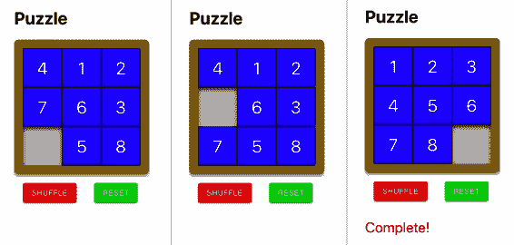

###### 图 3-1 简单数字拼图

该组件显示一系列数字方块，排列成网格，其中有一个空格。如果用户点击空格旁边的方块，则可以移动它。通过这种方式，用户可以重新排列方块，直到它们按照从 1 到 8 的正确顺序排列。

这个组件渲染了少量 HTML，但它将需要一些相当复杂的逻辑和数据。它将记录各个方块的位置。它需要知道用户是否可以移动给定的方块。它需要知道如何移动方块。它需要知道游戏是否完成。它还需要执行其他操作，比如通过洗牌方块来重置游戏。

完全可以在组件内部编写所有这些代码，但测试起来会更困难。你可以使用 React 测试库，但这可能过于复杂，因为大部分代码与渲染 HTML 无关。

## 解决方案

如果你有一个具有复杂内部状态或需要以复杂方式操纵其状态的组件，请考虑使用*reducer*。

一个*reducer*是一个接受两个参数的函数：

+   一个表示给定状态的对象或数组

+   描述如何修改状态的动作

函数返回一个我们传递给它的状态的新副本。

动作参数可以是任何你想要的，但通常它是一个带有字符串`type`属性和一个包含额外信息的`payload`对象。您可以将`type`视为命令名称，将`payload`视为命令的参数。

例如，如果我们将我们的瓦片位置从 0（左上角）到 8（右下角）编号，我们可以告诉减速器移动左上角的瓦片：

```
{type: 'move', payload: 0}
```

我们需要一个完全定义游戏内部状态的对象或数组。我们可以使用一个简单的字符串数组：

```
['1', '2', '3', null, '5', '6', '7', '8', '4']
```

那将表示瓦片布局如下：

| 1 | 2 | 3 |
| --- | --- | --- |
|  | 5 | 6 |
| 7 | 8 | 4 |

然而，一个稍微更灵活的方法是为我们的状态使用对象，并给它一个包含当前瓦片布局的`items`属性：

```
{
    items: ['1', '2', '3', null, '5', '6', '7', '8', '4']
}
```

为什么要这样做？因为这将允许我们的减速器返回其他状态值，比如游戏是否已完成：

```
{
    items: ['1', '2', '3', '4', '5', '6', '7', '8', null],
    complete: true
}
```

我们已经决定了一个动作（`move`），并且知道状态将如何被构造，这意味着我们已经做了足够的设计来创建一个测试：

```
import reducer from './reducer'

describe('reducer', () => {
  it('should be able to move 1 down if gap below', () => {
    let state = {
      items: ['1', '2', '3', null, '5', '6', '7', '8', '4'],
    }

    state = reducer(state, { type: 'move', payload: 0 })

    expect(state.items).toEqual([
      null,
      '2',
      '3',
      '1',
      '5',
      '6',
      '7',
      '8',
      '4',
    ])
  })

  it('should say when it is complete', () => {
    let state = {
      items: ['1', '2', '3', '4', '5', '6', '7', null, '8'],
    }

    state = reducer(state, { type: 'move', payload: 8 })

    expect(state.complete).toBe(true)

    state = reducer(state, { type: 'move', payload: 5 })

    expect(state.complete).toBe(false)
  })
})
```

在我们的第一个测试场景中，我们在一个状态中传入瓦片的位置。然后我们检查减速器是否返回了新状态的瓦片。

在我们的第二个测试中，我们执行两次瓦片移动，然后查找`complete`属性来告诉我们游戏是否结束了。

好的，我们已经推迟看减速器代码的时间足够长了：

```
function trySwap(newItems, position, t) {
  if (newItems[t] === null) {
    const temp = newItems[position]
    newItems[position] = newItems[t]
    newItems[t] = temp
  }
}

function arraysEqual(a, b) {
  for (let i = 0; i < a.length; i++) {
    if (a[i] !== b[i]) {
      return false
    }
  }
  return true
}

const CORRECT = ['1', '2', '3', '4', '5', '6', '7', '8', null]

function reducer(state, action) {
  switch (action.type) {
    case 'move': {
      const position = action.payload
      const newItems = [...state.items]
      const col = position % 3

      if (position < 6) {
        trySwap(newItems, position, position + 3)
      }
      if (position > 2) {
        trySwap(newItems, position, position - 3)
      }
      if (col < 2) {
        trySwap(newItems, position, position + 1)
      }
      if (col > 0) {
        trySwap(newItems, position, position - 1)
      }

      return {
        ...state,
        items: newItems,
        complete: arraysEqual(newItems, CORRECT),
      }
    }
    default: {
      throw new Error('Unknown action: ' + action.type)
    }
  }
}

export default reducer
```

我们的减速器当前只识别一个动作：`move`。我们的[GitHub 存储库](https://oreil.ly/q85H3)中的代码还包括`shuffle`和`reset`的动作。该存储库还有一个更[详尽的测试集](https://oreil.ly/yRNyU)，我们用它来创建前面的代码。

但是*没有*这段代码包含任何 React 组件。这是纯 JavaScript，因此可以在与外界隔离的环境中创建和测试。

要小心在减速器中生成一个新对象来表示新状态。这样做可以确保每个新状态都完全独立于之前的状态。

现在是时候将我们的减速器与 React 组件进行连接，使用`useReducer`钩子：

```
import { useReducer } from 'react'
import reducer from './reducer'

import './Puzzle.css'

const Puzzle = () => {
  const [state, dispatch] = useReducer(reducer, {
    items: ['4', '1', '2', '7', '6', '3', null, '5', '8'],
  })

  return (
    <div className="Puzzle">
      <div className="Puzzle-squares">
        {state.items.map((s, i) => (
          <div
            className={`Puzzle-square ${
              s ? '' : 'Puzzle-square-empty'
            }`}
            key={`square-${i}`}
            onClick={() => dispatch({ type: 'move', payload: i })}
          >
            {s}
          </div>
        ))}
      </div>
      <div className="Puzzle-controls">
        <button
          className="Puzzle-shuffle"
          onClick={() => dispatch({ type: 'shuffle' })}
        >
          Shuffle
        </button>
        <button
          className="Puzzle-reset"
          onClick={() => dispatch({ type: 'reset' })}
        >
          Reset
        </button>
      </div>
      {state.complete && (
        <div className="Puzzle-complete">Complete!</div>
      )}
    </div>
  )
}

export default Puzzle
```

即使我们的拼图组件正在做一些相当复杂的事情，实际的 React 代码也相对简短。

`useReducer`接受一个减速器函数和一个初始状态，并返回一个两元素数组：

+   数组中的第一个元素是来自减速器的当前状态。

+   数组的第二个元素是一个`dispatch`函数，允许我们向减速器发送动作。

我们通过遍历`state.items`数组中的字符串来显示瓦片。

如果有人点击位置为`i`的瓦片，我们向减速器发送`move`命令：

```
onClick={() => dispatch({type: 'move', payload: i})}
```

React 组件不知道如何移动瓦片。它甚至不知道是否可以移动瓦片。组件将动作发送到减速器。

如果`move`动作移动了一个瓦片，组件将自动重新渲染具有新位置瓦片的组件。如果游戏完成，组件将通过`state.complete`的值知道：

```
state.complete && <div className='Puzzle-complete'>Complete!</div>
```

我们还添加了两个按钮来运行 `shuffle` 和 `reset` 操作，这些之前遗漏了但在[GitHub 仓库](https://oreil.ly/WmZ18)中有说明。

现在我们已经创建了组件，让我们试试它。当我们首次加载组件时，我们会看到它处于初始状态，如图 3-2 所示。

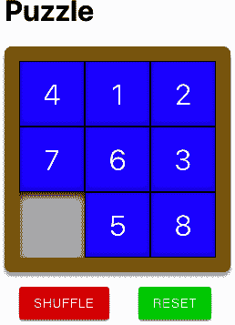

###### 图 3-2\. 游戏的初始状态

如果我们点击标记为 7 的瓷砖，则其将移动到空白处（见图 3-3）。

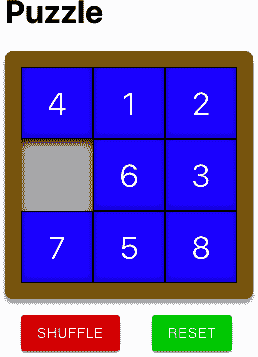

###### 图 3-3\. 移动瓷砖 7 后

如果点击“洗牌”按钮，则 reducer 会随机重新排列瓷砖，如图 3-4 所示。

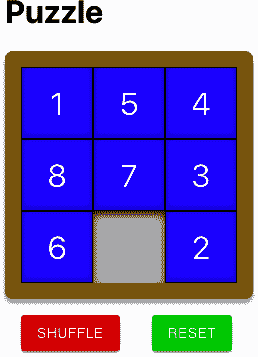

###### 图 3-4\. 洗牌按钮将瓷砖移动到随机位置

点击“重置”按钮后，拼图将变为完成状态，并显示“完成！”文本（见图 3-5）。

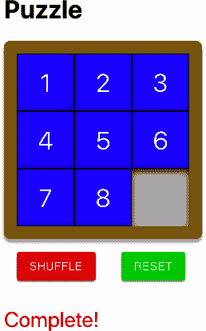

###### 图 3-5\. 重置按钮将瓷砖移动到其正确位置

我们将所有复杂性都隐藏在 reducer 函数内部，这样我们可以对其进行测试，而组件则简单易维护。

## 讨论

Reducers 是管理复杂性的一种方式。通常会在以下情况下使用 reducer：

+   您需要管理大量的内部状态。

+   您需要复杂的逻辑来管理组件的内部状态。

如果上述任一情况正确，则 reducer 可以显著简化您的代码管理。

但是，要注意不要在非常小的组件中使用 reducers。如果您的组件具有简单的状态和少量逻辑，可能不需要引入 reducer 的额外复杂性。

有时，即使存在复杂状态，也可以采用其他方法。例如，如果在表单中捕获和验证数据，创建一个验证表单组件可能更好（见“创建和验证表单”）。

您需要确保您的 reducer 没有任何副作用。避免例如更新服务器的网络调用。如果 reducer 有副作用，那么可能会导致其破坏。React 在开发模式下有时会对您的 reducer 进行额外调用，以确保没有副作用。如果您使用 reducer 并注意到 React 在渲染组件时调用了两次您的代码，则意味着 React 正在检查不良行为。

在满足所有这些条件的情况下，reducers 是应对复杂性的极好工具。它们是 Redux 等库的核心部分，可以轻松重用和组合，简化组件，并显著简化 React 代码的测试。

您可以从[GitHub 网站](https://oreil.ly/q85H3)下载此示例的源代码。

# 创建撤销功能

## 问题

JavaScript 丰富框架如 React 的承诺之一是 Web 应用可以与桌面应用程序密切相似。桌面应用程序的一个常见功能是撤消操作。React 应用程序中的某些本机组件自动支持撤消功能。如果您在文本区域中编辑文本，然后按下 Cmd/Ctrl-Z，它将撤消您的编辑。但是如何将撤消扩展到自定义组件？如何在没有大量代码的情况下跟踪状态变化？

## 解决方案

如果一个 reducer 函数管理您组件中的状态，则可以使用 undo-reducer 实现一个相当通用的撤消功能。

考虑来自“使用 reducer 管理复杂状态”的`Puzzle`示例中的此代码片段：

```
const [state, dispatch] = useReducer(reducer, {
  items: ['4', '1', '2', '7', '6', '3', null, '5', '8'],
})
```

此代码使用一个称为`reducer`的 reducer 函数和一个初始状态来管理数字拼图游戏中的图块（见图 3-6）。


###### 图 3-6\. 一个简单的数字拼图游戏

如果用户单击 Shuffle 按钮，则组件通过将`shuffle`操作发送到 reducer 来更新图块状态：

```
<button className='Puzzle-shuffle'
        onClick={() => dispatch({type: 'shuffle'})}>Shuffle</button>
```

（有关 reducer 的详细信息及何时应使用它们，请参见“使用 reducer 管理复杂状态”。）

我们将创建一个名为`useUndoReducer`的新钩子，它可以替代`useReducer`：

```
const [state, dispatch] = useUndoReducer(reducer, {
  items: ['4', '1', '2', '7', '6', '3', null, '5', '8'],
})
```

`useUndoReducer`钩子将神奇地赋予我们的组件回到过去的能力：

```
<button
  className="Puzzle-undo"
  onClick={() => dispatch({ type: 'undo' })}
>
  Undo
</button>
```

如果我们在组件中添加此按钮，则可以撤消用户执行的最后一个操作，如图 3-7](#ch03_image_7)所示。

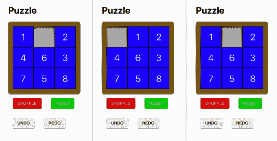

###### 图 3-7\. (1) 游戏进行中；(2) 进行移动；(3) 单击*撤消*以撤消移动

但是我们如何执行这种魔法呢？虽然`useUndoReducer`相对容易使用，但理解起来有些困难。但值得这样做，这样您就可以根据需要调整该方法。

我们可以利用所有 reducer 都以相同方式工作的事实：

+   行为定义了你想做的事情。

+   reducer 在每个操作后返回一个新状态。

+   调用 reducer 时不允许产生副作用。

此外，reducer 只是接受状态对象和操作对象的简单 JavaScript 函数。

因为 reducer 以如此明确定义的方式工作，我们可以创建一个新的 reducer（一个 undo-reducer），它包裹在另一个 reducer 函数周围。我们的 undo-reducer 将作为中介工作。它将大多数操作传递给底层 reducer，同时保留所有先前状态的历史记录。如果有人想要撤消一个操作，它将从其历史记录中找到最后一个状态，然后返回该状态而不调用底层 reducer。

我们将从创建一个接受一个 reducer 并返回另一个的高阶函数开始：

```
import lodash from 'lodash'

const undo = (reducer) => (state, action) => {
  let {
    undoHistory = [],
    undoActions = [],
    ...innerState
  } = lodash.cloneDeep(state)
  switch (action.type) {
    case 'undo': {
      if (undoActions.length > 0) {
        undoActions.pop()
        innerState = undoHistory.pop()
      }
      break
    }

    case 'redo': {
      if (undoActions.length > 0) {
        undoHistory = [...undoHistory, { ...innerState }]
        undoActions = [
          ...undoActions,
          undoActions[undoActions.length - 1],
        ]
        innerState = reducer(
          innerState,
          undoActions[undoActions.length - 1]
        )
      }
      break
    }

    default: {
      undoHistory = [...undoHistory, { ...innerState }]
      undoActions = [...undoActions, action]
      innerState = reducer(innerState, action)
    }
  }
  return { ...innerState, undoHistory, undoActions }
}

export default undo
```

这个 reducer 函数相当复杂，所以值得花些时间来理解它的作用。

它创建一个 reducer 函数，用于跟踪我们传递给它的动作和状态。假设我们的游戏组件发送一个动作来打乱游戏中的方块。我们的 reducer 首先检查动作是否是 `undo` 或 `redo` 类型。它不是。因此，它将 `shuffle` 动作传递给管理游戏中方块的底层 reducer（参见 图 3-8）。

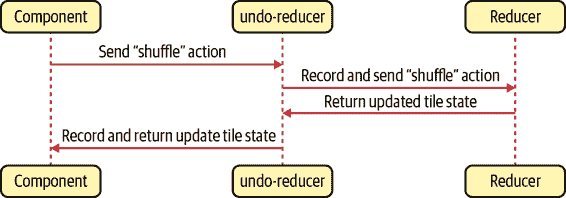

###### 图 3-8\. undo-reducer 将大多数动作传递给底层 reducer

当它将 `shuffle` 动作传递给底层 reducer 时，`undo` 代码通过将它们添加到 `undoHistory` 和 `undoActions` 中来跟踪现有状态和 `shuffle` 动作。然后返回底层游戏 reducer 的状态以及 `undoHistory` 和 `undoActions`。

如果我们的拼图组件发送了一个 `undo` 动作，则 undo-reducer 从 `undoHistory` 中返回先前的状态，完全绕过游戏自身的 reducer 函数（参见 图 3-9）。

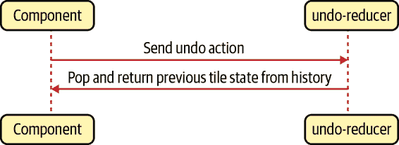

###### 图 3-9\. 对于撤销操作，undo-reducer 返回最新的历史状态

现在让我们看看 `useUndoReducer` 钩子本身：

```
import { useReducer } from 'react'
import undo from './undo'

const useUndoReducer = (reducer, initialState) =>
  useReducer(undo(reducer), initialState)

export default useUndoReducer
```

这个 `useUndoReducer` 钩子是一段简洁的代码。它只是对内置的 `useReducer` 钩子的调用，但是不直接传递 reducer，而是传递 `undo(reducer)`。结果是您的组件使用您提供的 reducer 的增强版本：一个可以撤销和重做动作的版本。

这是我们更新后的 `Puzzle` 组件（查看 “使用 Reducers 管理复杂状态” 获取原始版本）：

```
import reducer from './reducer'
import useUndoReducer from './useUndoReducer'

import './Puzzle.css'

const Puzzle = () => {
  const [state, dispatch] = useUndoReducer(reducer, {
    items: ['4', '1', '2', '7', '6', '3', null, '5', '8'],
  })

  return (
    <div className="Puzzle">
      <div className="Puzzle-squares">
        {state.items.map((s, i) => (
          <div
            className={`Puzzle-square ${
              s ? '' : 'Puzzle-square-empty'
            }`}
            key={`square-${i}`}
            onClick={() => dispatch({ type: 'move', payload: i })}
          >
            {s}
          </div>
        ))}
      </div>
      <div className="Puzzle-controls">
        <button
          className="Puzzle-shuffle"
          onClick={() => dispatch({ type: 'shuffle' })}
        >
          Shuffle
        </button>
        <button
          className="Puzzle-reset"
          onClick={() => dispatch({ type: 'reset' })}
        >
          Reset
        </button>
      </div>
      <div className="Puzzle-controls">
        <button
          className="Puzzle-undo"
          onClick={() => dispatch({ type: 'undo' })}
        >
          Undo
        </button>
        <button
          className="Puzzle-redo"
          onClick={() => dispatch({ type: 'redo' })}
        >
          Redo
        </button>
      </div>
      {state.complete && (
        <div className="Puzzle-complete">Complete!</div>
      )}
    </div>
  )
}

export default Puzzle
```

唯一的更改是我们使用 `useUndoReducer` 替代了 `useReducer`，并且我们添加了一对按钮来调用 “undo” 和 “redo” 动作。

现在，如果加载组件并进行一些更改，您可以逐个撤销更改，如 图 3-10 所示。


###### 图 3-10\. 使用 useUndoReducer，您现在可以发送 *undo* 和 *redo* 动作

## 讨论

此处显示的 undo-reducer 将与接受和返回状态对象的 reducer 一起工作。如果您的 reducer 使用数组管理状态，则必须修改 `undo` 函数。

因为它保留了所有先前状态的历史记录，所以如果你的状态数据庞大或者在可能进行大量更改的情况下使用它时，可能需要避免使用它。否则，你可能希望限制历史记录的最大大小。

另外，请记住它在内存中维护其历史记录。如果用户重新加载整个页面，则历史记录将消失。每当全局状态发生变化时，通过将其持久化到本地存储可以解决此问题。

您可以从 [GitHub 网站](https://oreil.ly/Oz27A) 下载此示例的源代码。

# 创建和验证表单

## 问题

大多数 React 应用程序在某种程度上使用表单，并且大多数应用程序对创建表单采取临时方法。如果团队正在构建您的应用程序，您可能会发现一些开发人员单独管理各个字段的状态变量。其他人则选择将表单状态记录在单一值对象中，这样更简单地将其传入和传出表单，但每个字段更新起来可能有些棘手。字段验证通常会导致混乱的代码，一些表单在提交时进行验证，而另一些表单在用户键入时动态验证。有些表单可能在首次加载时显示验证消息，而其他表单可能仅在用户触摸字段后才会显示消息。

设计上的这些变化可能会导致用户体验差和编写代码时方法不一致。在我们与 React 团队合作的经验中，表单和表单验证是开发人员常见的绊脚石。

## 解决方案

为了对表单开发应用一些一致性，我们将创建一个 `SimpleForm` 组件，该组件将包裹一个或多个 `InputField` 组件。这是使用 `SimpleForm` 和 `InputField` 的示例：

```
import { useEffect, useState } from 'react'
import './App.css'
import SimpleForm from './SimpleForm'
import InputField from './InputField'

const FormExample0 = ({ onSubmit, onChange, initialValue = {} }) => {
  const [formFields, setFormFields] = useState(initialValue)

  const [valid, setValid] = useState(true)
  const [errors, setErrors] = useState({})

  useEffect(() => {
    if (onChange) {
      onChange(formFields, valid, errors)
    }
  }, [onChange, formFields, valid, errors])

  return (
    <div className="TheForm">
      <h1>Single field</h1>

      <SimpleForm
        value={formFields}
        onChange={setFormFields}
        onValid={(v, errs) => {
          setValid(v)
          setErrors(errs)
        }}
      >
        <InputField
          name="field1"
          onValidate={(v) =>
            !v || v.length < 3 ? 'Too short!' : null
          }
        />

        <button
          onClick={() => onSubmit && onSubmit(formFields)}
          disabled={!valid}
        >
          Submit!
        </button>
      </SimpleForm>
    </div>
  )
}

export default FormExample0
```

我们在单个对象 `formFields` 中跟踪表单的状态。每当我们在表单中更改字段时，该字段将在 `SimpleForm` 上调用 `onChange`。使用 `onValidate` 方法验证 `field1` 字段，并且每当验证状态发生变化时，该字段将在 `SimpleForm` 上调用 `onValid` 方法。只有在用户与字段交互时才会进行验证，使其变为 *dirty*。

您可以在 图 3-11 中看到表单的运行情况。

无需跟踪单个字段值。表单值对象记录具有从字段名称派生的属性的单个字段值。`InputField` 处理何时运行验证的详细信息：它将更新表单值并决定何时显示错误。

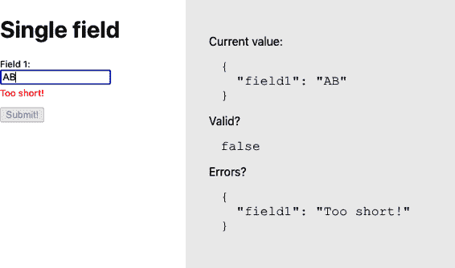

###### 图 3-11\. 带有字段验证的简单表单

图 3-12 展示了一个稍微复杂的例子，使用了带有几个字段的 `SimpleForm`。

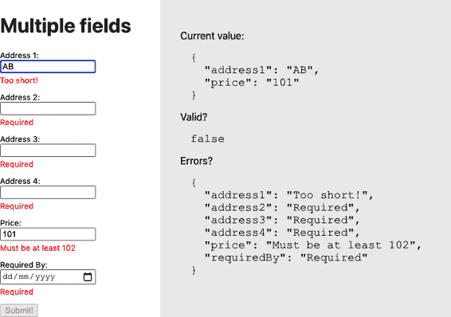

###### 图 3-12\. 更复杂的表单

要创建 `SimpleForm` 和 `InputField` 组件，我们必须首先查看它们如何彼此通信。`InputField` 组件需要告诉 `SimpleForm` 其值何时发生变化以及新值是否有效。它将使用上下文来实现这一点。

*上下文* 是存储范围。当组件在上下文中存储值时，该值对其子组件可见。`SimpleForm` 将创建一个名为 `FormCon⁠text` 的上下文，并用它来存储一组回调函数，任何子组件都可以使用这些函数与表单通信：

```
import { createContext } from 'react'

const FormContext = createContext({})

export default FormContext
```

要了解 `SimpleForm` 的工作原理，让我们从一个简化版本开始，该版本仅跟踪其子组件的值，暂时不用担心验证：

```
import React, { useCallback, useEffect, useState } from 'react'

import './SimpleForm.css'
import FormContext from './FormContext'

function updateWith(oldValue, field, value) {
  const newValue = { ...oldValue }
  newValue[field] = value
  return newValue
}

const SimpleForm = ({ children, value, onChange, onValid }) => {
  const [values, setValues] = useState(value || {})

  useEffect(() => {
    setValues(value || {})
  }, [value])

  useEffect(() => {
    if (onChange) {
      onChange(values)
    }
  }, [onChange, values])

  let setValue = useCallback(
    (field, v) => setValues((vs) => updateWith(vs, field, v)),
    [setValues]
  )
  let getValue = useCallback((field) => values[field], [values])
  let form = {
    setValue: setValue,
    value: getValue,
  }

  return (
    <div className="SimpleForm-container">
      <FormContext.Provider value={form}>
        {children}
      </FormContext.Provider>
    </div>
  )
}

export default SimpleForm
```

最终版本的`SimpleForm`将增加额外的代码来跟踪验证和错误，但这个简化的表单更易于理解。

表单将在`values`对象中跟踪所有字段值。表单创建了两个名为`getValue`和`setValue`的回调函数，并将它们放入上下文（作为`form`对象），子组件将在其中找到它们。我们通过在子组件周围包装`<FormContext.Provider>`来将`form`放入上下文中。

请注意，我们已经在`useCallback`中包装了`getValue`和`setValue`回调，这样可以防止组件每次渲染`SimpleForm`时创建这些函数的新版本。

每当子组件调用`form.value()`函数时，它将收到指定字段的当前值。如果子组件调用`form.setValue()`，它将更新该值。

现在让我们看一个简化版的`InputField`组件，再次删除任何验证代码，以便更容易理解：

```
import React, { useContext } from 'react'
import FormContext from './FormContext'

import './InputField.css'

const InputField = (props) => {
  const form = useContext(FormContext)

  if (!form.value) {
    return 'InputField should be wrapped in a form'
  }

  const { name, label, ...otherProps } = props

  const value = form.value(name)

  return (
    <div className="InputField">
      <label htmlFor={name}>{label || name}:</label>
      <input
        id={name}
        value={value || ''}
        onChange={(event) => {
          form.setValue(name, event.target.value)
        }}
        {...otherProps}
      />{' '}
      {}
    </div>
  )
}

export default InputField
```

`InputField`从`FormContext`中提取`form`对象。如果找不到`form`对象，它知道我们没有将其包装在`SimpleForm`组件中。然后，`InputField`渲染一个`input`字段，并将其值设置为`form.value(name)`返回的任何内容。如果用户更改字段的值，`InputField`组件将新值发送到`form.setValue(name, event.target.value)`。

如果您需要除了`input`之外的表单字段，可以将其包装在类似此处所示的`InputField`组件中。

验证代码与前面类似。与表单在`values`状态中跟踪当前值的方式相同，它还需要跟踪哪些字段是脏的，哪些是无效的。然后需要传递`setDirty`、`isDirty`和`setInvalid`的回调函数。这些回调函数在子字段运行其`onValidate`代码时使用。

这是包含验证的`SimpleForm`组件的最终版本：

```
import { useCallback, useEffect, useState } from 'react'
import FormContext from './FormContext'
import './SimpleForm.css'

const SimpleForm = ({ children, value, onChange, onValid }) => {
  const [values, setValues] = useState(value || {})
  const [dirtyFields, setDirtyFields] = useState({})
  const [invalidFields, setInvalidFields] = useState({})

  useEffect(() => {
    setValues(value || {})
  }, [value])

  useEffect(() => {
    if (onChange) {
      onChange(values)
    }
  }, [onChange, values])

  useEffect(() => {
    if (onValid) {
      onValid(
        Object.keys(invalidFields).every((i) => !invalidFields[i]),
        invalidFields
      )
    }
  }, [onValid, invalidFields])

  const setValue = useCallback(
    (field, v) => setValues((vs) => ({ ...vs, [field]: v })),
    [setValues]
  )
  const getValue = useCallback((field) => values[field], [values])
  const setDirty = useCallback(
    (field) => setDirtyFields((df) => ({ ...df, [field]: true })),
    [setDirtyFields]
  )
  const getDirty = useCallback(
    (field) => Object.keys(dirtyFields).includes(field),
    [dirtyFields]
  )
  const setInvalid = useCallback(
    (field, error) => {
      setInvalidFields((i) => ({
        ...i,
        [field]: error ? error : undefined,
      }))
    },
    [setInvalidFields]
  )
  const form = {
    setValue: setValue,
    value: getValue,

    setDirty: setDirty,
    isDirty: getDirty,

    setInvalid: setInvalid,
  }

  return (
    <div className="SimpleForm-container">
      <FormContext.Provider value={form}>
        {children}
      </FormContext.Provider>
    </div>
  )
}

export default SimpleForm
```

这是`InputField`组件的最终版本。请注意，一旦它失去焦点或其值发生变化，该字段被标记为*dirty*：

```
import { useContext, useEffect, useState } from 'react'
import FormContext from './FormContext'

import './InputField.css'

const splitCamelCase = (s) =>
  s
    .replace(/([a-z0-9])([A-Z0-9])/g, '$1 $2')
    .replace(/^([a-z])/, (x) => x.toUpperCase())

const InputField = (props) => {
  const form = useContext(FormContext)

  const [error, setError] = useState('')

  const { onValidate, name, label, ...otherProps } = props

  let value = form.value && form.value(name)

  useEffect(() => {
    if (onValidate) {
      setError(onValidate(value))
    }
  }, [onValidate, value])

  const setInvalid = form.setInvalid

  useEffect(() => {
    if (setInvalid) {
      setInvalid(name, error)
    }
  }, [setInvalid, name, error])

  if (!form.value) {
    return 'InputField should be wrapped in a form'
  }

  return (
    <div className="InputField">
      <label htmlFor={name}>{label || splitCamelCase(name)}:</label>
      <input
        id={name}
        onBlur={() => form.setDirty(name)}
        value={value || ''}
        onChange={(event) => {
          form.setDirty(name)
          form.setValue(name, event.target.value)
        }}
        {...otherProps}
      />{' '}
      {
        <div className="InputField-error">
          {form.isDirty(name) && error ? error : <>&nbsp;</>}
        </div>
      }
    </div>
  )
}

export default InputField
```

## 讨论

您可以使用此方案创建许多简单的表单，并可以扩展它以与任何 React 组件一起使用。例如，如果您正在使用第三方日历或日期选择器，只需将其包装在类似`InputField`的组件中，即可在`SimpleForm`内部使用它。

此方案不支持表单内嵌或表单数组。可以修改`SimpleForm`组件，使其像`InputField`一样，以便在一个表单内放置另一个表单。

您可以从[GitHub 网站](https://oreil.ly/gU03F)下载此方案的源代码。

# 使用时钟测量时间

## 问题

有时，React 应用程序需要根据一天中的时间做出响应。它可能只需要显示当前时间，或者可能需要定期轮询服务器，或者在白天变成黑夜时更改其界面。但是，如何使您的代码在时间变化时重新渲染？如何避免过度渲染组件？而且如何在不过度复杂化代码的情况下完成所有这些？

## 解决方案

我们将创建一个 `useClock` 钩子。`useClock` 钩子将使我们能够访问当前日期和时间的格式化版本，并在时间变化时自动更新界面。以下是代码示例，并且 图 3-13 显示其运行中：

```
import { useEffect, useState } from 'react'
import useClock from './useClock'
import ClockFace from './ClockFace'

import './Ticker.css'

const SimpleTicker = () => {
  const [isTick, setTick] = useState(false)

  const time = useClock('HH:mm:ss')

  useEffect(() => {
    setTick((t) => !t)
  }, [time])

  return (
    <div className="Ticker">
      <div className="Ticker-clock">
        <h1>Time {isTick ? 'Tick!' : 'Tock!'}</h1>
        {time}
        <br />
        <ClockFace time={time} />
      </div>
    </div>
  )
}

export default SimpleTicker
```

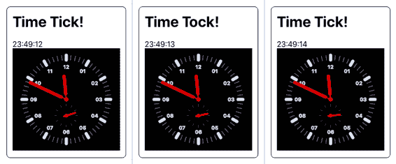

###### 图 3-13\. `SimpleTicker` 每三秒

`time` 变量包含格式为 `HH:mm:ss` 的当前时间。当时间变化时，`isTick` 状态的值在真和假之间切换，然后用于显示 *Tick!* 或 *Tock!*。我们显示当前时间，然后还显示带有 `ClockFace` 组件的时间。

除了接受日期和时间格式外，`useClock` 还可以接受一个指定更新之间毫秒数的数字（见 图 3-14）：

```
import { useEffect, useState } from 'react'
import useClock from './useClock'

import './Ticker.css'

const IntervalTicker = () => {
  const [isTick3, setTick3] = useState(false)

  const tickThreeSeconds = useClock(3000)

  useEffect(() => {
    setTick3((t) => !t)
  }, [tickThreeSeconds])

  return (
    <div className="Ticker">
      <div className="Ticker-clock">
        <h1>{isTick3 ? '3 Second Tick!' : '3 Second Tock!'}</h1>
        {tickThreeSeconds}
      </div>
    </div>
  )
}

export default IntervalTicker
```

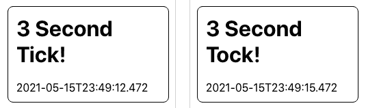

###### 图 3-14\. `IntervalTicker` 每三秒重新渲染组件

如果您希望定期执行某些任务（例如轮询网络服务），这个版本会更加实用。

要轮询网络服务，请考虑使用具有 “将网络调用转换为钩子” 的时钟。如果将时钟的当前值作为依赖项传递给执行网络调用的钩子，则每次时钟变化时都会重复网络调用。

如果向 `useClock` 传递一个数值参数，它将返回一个 ISO 格式的时间字符串，例如 `2021-06-11T14:50:34.706`。

为了构建这个钩子，我们将使用一个名为 [Moment.js](https://momentjs.com) 的第三方库来处理日期和时间格式化。如果您更愿意使用另一个库，如 [Day.js](https://day.js.org)，转换应该是直接的：

```
$ npm install moment
```

这是 `useClock` 的代码：

```
import { useEffect, useState } from 'react'
import moment from 'moment'

const useClock = (formatOrInterval) => {
  const format =
    typeof formatOrInterval === 'string'
      ? formatOrInterval
      : 'YYYY-MM-DDTHH:mm:ss.SSS'
  const interval =
    typeof formatOrInterval === 'number' ? formatOrInterval : 500
  const [response, setResponse] = useState(
    moment(new Date()).format(format)
  )

  useEffect(() => {
    const newTimer = setInterval(() => {
      setResponse(moment(new Date()).format(format))
    }, interval)

    return () => clearInterval(newTimer)
  }, [format, interval])

  return response
}

export default useClock
```

我们从传递给钩子的 `formatOrInterval` 参数派生日期时间的 `format` 和所需的 *tick* `interval`。然后我们使用 `setInterval` 创建一个定时器。每 `interval` 毫秒，此定时器将设置 `response` 值为新的时间字符串。当我们将 `response` 字符串设置为新时间时，依赖于 `useClock` 的任何组件都将重新渲染。

我们需要确保取消任何不再使用的定时器。我们可以利用 `useEffect` 钩子的一个特性来实现这一点。如果在 `useEffect` 代码的末尾返回一个函数，那么该函数将在下次 `useEffect` 需要运行时调用。因此，我们可以在创建新定时器之前清除旧定时器。

如果我们向 `useClock` 传递新的格式或间隔，它将取消旧的定时器，并使用新的定时器响应。

## 讨论

此示例展示了如何使用钩子来简单解决问题。React 代码（名字就是提示）会对依赖项更改做出反应。不要想着“如何每秒运行这段代码？”`useClock`钩子允许您编写依赖于当前时间的代码，并隐藏了创建定时器、更新状态和清除定时器的所有复杂细节。

如果在组件中多次使用`useClock`钩子，则时间更改可能导致多次渲染。例如，如果您有两个时钟，分别以 12 小时制（04:45）和 24 小时制（16:45）格式化当前时间，则当分钟更改时，您的组件将渲染两次。每分钟额外渲染一次不太可能对性能产生太大影响。

您还可以在其他钩子内部使用`useClock`钩子。如果您创建一个`useMessages`钩子来从服务器检索消息，您可以在其中调用`useClock`以定期轮询服务器。

您可以从[GitHub 网站](https://oreil.ly/hohKK)下载此示例的源代码。

# 监控在线状态

## 问题

假设有人在其手机上使用您的应用程序，然后他们进入没有数据连接的地铁。如何检查网络连接已经断开？如何以 React 友好的方式更新您的界面，告知用户存在问题或禁用一些需要网络访问的功能？

## 解决方案

我们将创建一个名为`useOnline`的钩子，用于告诉我们是否连接到网络。我们需要的代码在浏览器失去或重新获得与网络的连接时运行。幸运的是，有称为`online`和`offline`的窗口/全局事件正是做这些事情的。当触发`online`和`offline`事件时，当前网络状态将由`navigator.onLine`给出，其值将设置为`true`或`false`：

```
import { useEffect, useState } from 'react'

const useOnline = () => {
  const [online, setOnline] = useState(navigator.onLine)

  useEffect(() => {
    if (window.addEventListener) {
      window.addEventListener('online', () => setOnline(true), false)
      window.addEventListener(
        'offline',
        () => setOnline(false),
        false
      )
    } else {
      document.body.ononline = () => setOnline(true)
      document.body.onoffline = () => setOnline(false)
    }
  }, [])

  return online
}

export default useOnline
```

此钩子在`online`变量中管理其连接状态。当首次运行该钩子时（请注意空依赖数组），我们会注册浏览器的在线/离线事件监听器。当任一事件发生时，我们可以将`online`的值设置为`true`或`false`。如果这是当前值的更改，则使用此钩子的任何组件都将重新渲染。

下面是钩子实际运行的示例：

```
import useOnline from './useOnline'
import './App.css'

function App() {
  const online = useOnline()

  return (
    <div className="App">
      <h1>Network Checker</h1>
      <span>
        You are now....
        {online ? (
          <div className="App-indicator-online">ONLINE</div>
        ) : (
          <div className="App-indicator-offline">OFFLINE</div>
        )}
      </span>
    </div>
  )
}

export default App
```

如果运行应用程序，页面当前将显示为在线状态。如果断开/重新连接网络，则消息将切换到离线，然后再切换到在线（参见图 3-15）。


###### 图 3-15\. 当网络关闭和重新打开时，代码将重新渲染

## 讨论

重要的是要注意，此钩子检查的是浏览器连接到网络的情况，而不是连接到更广泛的 Internet 或您的服务器。如果要检查服务器是否正在运行并可用，您需要编写额外的代码。

您可以从[GitHub 网站](https://oreil.ly/9hkSA)下载此示例的源代码。

# 使用 Redux 管理全局状态

## 问题

在本章的其他示例中，我们已经看到您可以使用称为 reducer 的纯 JavaScript 函数来管理复杂的组件状态。*Reducers* 简化组件并使业务逻辑更易于测试。

但是如果您有一些数据，比如购物篮，需要在所有地方访问怎么办？

## 解决方案

我们将使用 Redux 库来管理全局应用程序状态。Redux 使用相同的 reducers，我们可以提供给 React 的 `useReducer` 函数，但它们用于管理整个应用程序的单个状态对象。此外，Redux 还有许多扩展，用于解决常见的编程问题，以便更快地开发和管理您的应用程序。

首先，我们需要安装 Redux 库：

```
$ npm install redux
```

我们还将安装 React Redux 库，这将使 Redux 与 React 结合使用更加简单：

```
$ npm install react-redux
```

我们将使用 Redux 构建一个包含购物篮的应用程序（参见 图 3-16）。

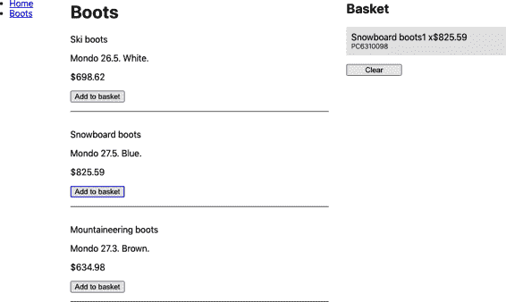

###### 图 3-16\. 当客户购买产品时，应用程序将其添加到购物篮中

如果客户点击“购买”按钮，应用程序将产品添加到购物篮中。如果他们再次点击“购买”按钮，则更新购物篮中的数量。购物篮将出现在应用程序的多个位置，因此非常适合迁移到 Redux。这是我们将用来管理购物篮的 reducer 函数：

```
const reducer = (state = {}, action = {}) => {
  switch (action.type) {
    case 'buy': {
      const basket = state.basket ? [...state.basket] : []
      const existing = basket.findIndex(
        (item) => item.productId === action.payload.productId
      )
      if (existing !== -1) {
        basket[existing].quantity = basket[existing].quantity + 1
      } else {
        basket.push({ quantity: 1, ...action.payload })
      }
      return {
        ...state,
        basket,
      }
    }
    case 'clearBasket': {
      return {
        ...state,
        basket: [],
      }
    }
    default:
      return { ...state }
  }
}

export default reducer
```

这里我们创建了一个单一的 reducer。当您的应用程序规模扩大时，您可能希望将 reducer 拆分为更小的 reducers，并使用 Redux 的 `combineReduc⁠ers` [函数](https://oreil.ly/IVh7x) 将它们组合起来。

reducer 函数响应 `buy` 和 `clearBasket` 操作。`buy` 操作将添加新项目到购物篮，或者如果已有匹配的 `productId`，则更新现有项目的数量。`clearBasket` 操作将将购物篮设置为空数组。

现在我们有了一个 reducer 函数，我们将使用它来创建一个 Redux *store*。这个 store 将成为我们共享应用程序状态的中央存储库。要创建一个 store，在一些顶层组件（如 *App.js*）中添加以下两行代码：

```
import { createStore } from 'redux'
import reducer from './reducer'

const store = createStore(reducer)
```

商店需要全局可用，为此，我们需要将其注入到可能需要它的组件的上下文中。React Redux 库提供了一个用于在组件上下文中注入 store 的组件，称为 `Provider`：

```
<Provider store={store}>
  All the components inside here can access the store
</Provider>
```

这是示例应用程序中的 *reducer.js* 组件，您可以在本书的 [GitHub 仓库](https://oreil.ly/j90xI) 中找到它：

```
const reducer = (state = {}, action = {}) => {
  switch (action.type) {
    case 'buy': {
      const basket = state.basket ? [...state.basket] : []
      const existing = basket.findIndex(
        (item) => item.productId === action.payload.productId
      )
      if (existing !== -1) {
        basket[existing].quantity = basket[existing].quantity + 1
      } else {
        basket.push({ quantity: 1, ...action.payload })
      }
      return {
        ...state,
        basket,
      }
    }
    case 'clearBasket': {
      return {
        ...state,
        basket: [],
      }
    }
    default:
      return { ...state }
  }
}

export default reducer
```

现在我们的组件可以访问商店了，那么我们如何使用它呢？React Redux 允许您通过 hooks 访问商店。如果您想要读取全局状态的内容，可以使用 `useSelector`：

```
const basket = useSelector((state) => state.basket)
```

`useSelector`钩子接受一个函数来提取中央状态的一部分。选择器非常高效，只有在您关注的状态部分发生变化时，您的组件才会重新渲染。

如果您需要将动作提交到中央存储，可以使用`useDispatch`钩子：

```
const dispatch = useDispatch()
```

这将返回一个`dispatch`函数，您可以使用它发送动作到存储中：

```
dispatch({ type: 'clearBasket' })
```

这些钩子通过从当前上下文中提取存储来工作。如果您忘记向应用程序添加`Provider`或尝试在`Provider`上下文之外运行`useSelector`或`useDispatch`，则会收到错误，如图 3-17 所示。

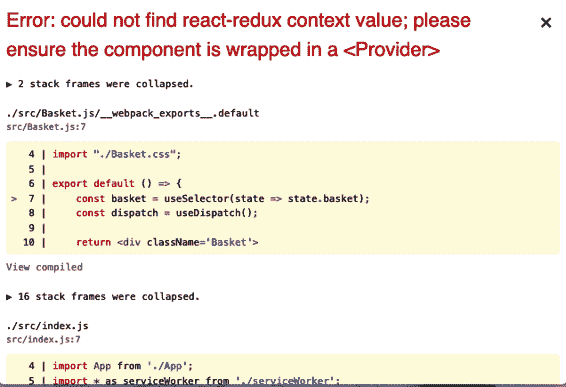

###### 图 3-17\. 如果您忘记包含`Provider`，您将会收到此错误

完成的`Basket`组件读取并清除应用程序范围内的购物篮：

```
import { useDispatch, useSelector } from 'react-redux'

import './Basket.css'

const Basket = () => {
  const basket = useSelector((state) => state.basket)
  const dispatch = useDispatch()

  return (
    <div className="Basket">
      <h2>Basket</h2>
      {basket && basket.length ? (
        <>
          {basket.map((item) => (
            <div className="Basket-item">
              <div className="Basket-itemName">{item.name}</div>
              <div className="Basket-itemProductId">
                {item.productId}
              </div>
              <div className="Basket-itemPricing">
                <div className="Basket-itemQuantity">
                  {item.quantity}
                </div>
                <div className="Basket-itemPrice">{item.price}</div>
              </div>
            </div>
          ))}
          <button onClick={() => dispatch({ type: 'clearBasket' })}>
            Clear
          </button>
        </>
      ) : (
        'Empty'
      )}
    </div>
  )
}

export default Basket
```

为了演示一些向购物篮添加商品的代码，这里是一个`Boots`组件，允许客户购买一系列产品：

```
import { useDispatch } from 'react-redux'

import './Boots.css'

const products = [
  {
    productId: 'BE8290004',
    name: 'Ski boots',
    description: 'Mondo 26.5\. White.',
    price: 698.62,
  },
  {
    productId: 'PC6310098',
    name: 'Snowboard boots',
    description: 'Mondo 27.5\. Blue.',
    price: 825.59,
  },
  {
    productId: 'RR5430103',
    name: 'Mountaineering boots',
    description: 'Mondo 27.3\. Brown.',
    price: 634.98,
  },
]

const Boots = () => {
  const dispatch = useDispatch()

  return (
    <div className="Boots">
      <h1>Boots</h1>

      <dl className="Boots-products">
        {products.map((product) => (
          <>
            <dt>{product.name}</dt>
            <dd>
              <p>{product.description}</p>
              <p>${product.price}</p>
              <button
                onClick={() =>
                  dispatch({ type: 'buy', payload: product })
                }
              >
                Add to basket
              </button>
            </dd>
          </>
        ))}
      </dl>
    </div>
  )
}

export default Boots
```

这两个组件可能出现在组件树中非常不同的位置，但它们共享同一个 Redux 存储。一旦客户将产品添加到购物篮中，`Basket`组件将自动更新变化（参见图 3-18）。

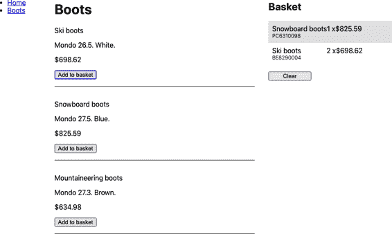

###### 图 3-18\. Redux-React 钩子确保当用户购买产品时，`Basket`将被重新渲染

## 讨论

开发人员通常将 Redux 库与 React 框架一起使用。长期以来，几乎每个 React 应用程序默认都包含 Redux。我们认为 Redux 经常被过度使用或不当使用。我们曾经看到一些项目甚至禁止使用本地状态，而是使用 Redux 来处理*所有*状态。我们认为这种做法是错误的。Redux 旨在用于集中管理应用程序状态，而不是简单的组件状态。如果您存储的数据仅关系到一个组件或其子组件，您可能不应将其存储在 Redux 中。

然而，如果您的应用程序管理一些全局应用程序状态，那么 Redux 仍然是首选的工具。

您可以从[GitHub 网站](https://oreil.ly/j90xI)下载本教程的源代码。

# 使用 Redux Persist 解决页面重新加载问题

## 问题

Redux 是管理应用程序状态的绝佳方式。然而，它确实存在一个小问题：当您重新加载页面时，整个状态会消失（参见图 3-19）。

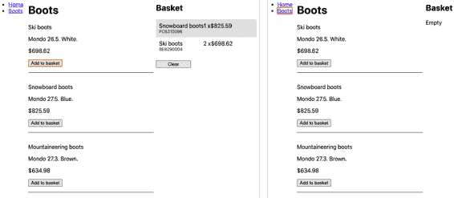

###### 图 3-19\. Redux 状态（左）在页面重新加载时会丢失（右）

状态会消失是因为 Redux 将其状态保存在内存中。我们如何防止状态消失呢？

## 解决方案

我们将使用 Redux Persist 库将 Redux 状态的副本保存在本地存储中。要安装 Redux Persist，请输入以下命令：

```
$ npm install redux-persist
```

我们需要做的第一件事是创建一个*持久化的 reducer*，围绕我们现有的 reducer 包装起来：

```
import storage from 'redux-persist/lib/storage'

const persistConfig = {
  key: 'root',
  storage,
}

const persistedReducer = persistReducer(persistConfig, reducer)
```

`storage` 指定了我们将持久化 Redux 状态的位置：默认情况下将在 `localStorage` 中。`persistConfig` 表明我们希望将我们的状态保存在名为 `persist:root` 的 `localStorage` 项中。当 Redux 状态发生变化时，`persistedReducer` 将通过 `localStorage.setItem('persist:root', ...)` 写入副本。现在我们需要使用 `persistedReducer` 创建我们的 Redux store：

```
const store = createStore(persistedReducer)
```

我们需要在访问 Redux store 的代码和 Redux store 之间插入 Redux Persist 代码。我们使用一个名为 `PersistGate` 的组件来实现这一点：

```
import { PersistGate } from 'redux-persist/integration/react'
import { persistStore } from 'redux-persist'

const persistor = persistStore(store)
...
<Provider store={store}>
  <PersistGate loading={<div>Loading...</div>} persistor={persistor}>
    Components live in here
  </PersistGate>
</Provider>
```

`PersistGate` 必须位于 Redux `Provider` 内部，并且位于将使用 Redux 的组件之外。`PersistGate` 将监视 Redux 状态丢失的情况，并从 `localStorage` 中重新加载它。当 Redux 正在重新加载数据时，可能需要一点时间，如果您想显示 UI 稍微忙碌的状态，可以将一个 `loading` 组件传递给 `PersistGate`：例如，一个动画旋转器。当 Redux 重新加载时，加载组件将显示在其子组件的位置。如果您不想要加载组件，可以将其设置为 `null`。

这是示例应用程序中修改后的 *App.js* 的最终版本：

```
import { BrowserRouter, Route, Switch } from 'react-router-dom'
import { Provider } from 'react-redux'
import { createStore } from 'redux'

import Menu from './Menu'
import Home from './Home'
import Boots from './Boots'
import Basket from './Basket'

import './App.css'
import reducer from './reducer'

import { persistStore, persistReducer } from 'redux-persist'
import { PersistGate } from 'redux-persist/integration/react'
import storage from 'redux-persist/lib/storage'

const persistConfig = {
  key: 'root',
  storage,
}

const persistedReducer = persistReducer(persistConfig, reducer)

const store = createStore(persistedReducer)

const persistor = persistStore(store)

function App() {
  return (
    <div className="App">
      <Provider store={store}>
        <PersistGate
          loading={<div>Loading...</div>}
          persistor={persistor}
        >
          <BrowserRouter>
            <Menu />
            <Switch>
              <Route exact path="/">
                <Home />
              </Route>
              <Route path="/boots">
                <Boots />
              </Route>
            </Switch>
            <Basket />
          </BrowserRouter>
        </PersistGate>
      </Provider>
    </div>
  )
}

export default App
```

现在，当用户重新加载页面时，Redux 状态会保留，如 图 3-20 所示。

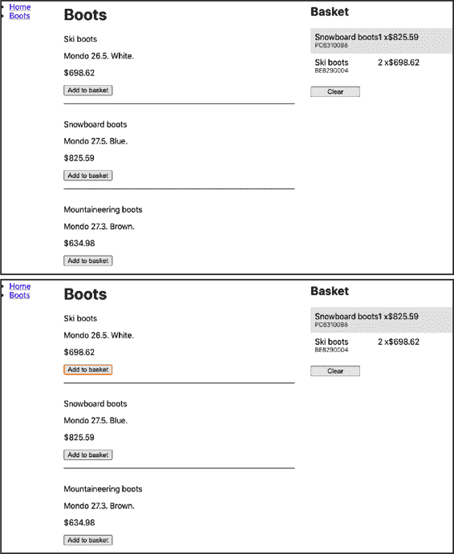

###### 图 3-20\. 重新加载前的 Redux 状态（顶部）和重新加载后（底部）

## 讨论

Redux Persist 库是通过页面重新加载简单地持久化 Redux 状态的方法。如果您有大量的 Redux 数据，需要小心不要超出 `localStorage` 的限制，这个限制因浏览器而异，但通常约为 10 MB。但是，如果您的 Redux 数据量如此之大，您应该考虑将其中一些数据转移到服务器上。

您可以从 [GitHub 站点](https://oreil.ly/K8U5J) 下载本配方的源代码。

# 使用 Reselect 计算派生状态

## 问题

当您将应用程序状态提取到类似 Redux 这样的工具中的外部对象时，通常需要在显示之前对数据进行某种方式的处理。例如，图 3-21 展示了本章中几个配方中使用过的应用程序。


###### 图 3-21\. 如何计算购物篮的总费用和税金的最佳方法？

如果我们想要计算购物篮中物品的总费用，然后计算要支付的销售税，该怎么办？我们可以创建一个 JavaScript 函数，读取购物篮中的物品并计算这两个值，但是每次购物篮重新渲染时，该函数都需要重新计算这些值。有没有一种方法可以从更新状态时仅计算派生值呢？

## 解决方案

Redux 开发者专门创建了一个库，名为 `reselect`，用于高效地从状态对象中派生值。

`reselect` 库创建选择器函数。*选择器函数* 接受一个参数——状态对象，并返回一个处理过的版本。

我们已经在 “使用 Redux 管理全局状态” 中看到了一个选择器。我们用它来从中央 Redux 状态返回当前的购物篮：

```
const basket = useSelector((state) => state.basket)
```

`state => state.basket` 是一个选择器函数；它从状态对象中派生出一些值。`reselect` 库创建高效的选择器函数，如果它们依赖的状态没有改变，可以缓存它们的结果。

要安装 `reselect`，请输入以下命令：

```
$ npm install reselect
```

让我们从创建一个选择器函数开始，它将执行以下操作：

+   计算购物篮中所有物品的总数

+   计算所有商品的总成本

我们将这个函数称为 `summarizer`。在详细介绍如何编写它之前，我们将首先编写一个测试，展示它需要做什么：

```
it('should be able to handle multiple products', () => {
  const actual = summarizer({
    basket: [
      { productId: '1234', quantity: 2, price: 1.23 },
      { productId: '5678', quantity: 1, price: 1.5 },
    ],
  })
  expect(actual).toEqual({ itemCount: 3, cost: 3.96 })
})
```

因此，如果我们给它一个状态对象，它将添加数量和成本，并返回一个包含 `itemCount` 和 `cost` 的对象。

我们可以像这样使用 Reselect 库创建一个名为 `summarizer` 的选择器函数：

```
import { createSelector } from 'reselect'

const summarizer = createSelector(
  (state) => state.basket || [],
  (basket) => ({
    itemCount: basket.reduce((i, j) => i + j.quantity, 0),
    cost: basket.reduce((i, j) => i + j.quantity * j.price, 0),
  })
)

export default summarizer
```

`createSelector` 函数创建一个基于其他选择器函数的选择器函数。传递给它的每个参数（除了最后一个参数）都应该是选择器函数。我们只传递了一个：

```
(state) => state.basket || []
```

这段代码从状态中提取了购物篮。

传递给 `createSelector` 的最后一个参数（*combiner*）是一个函数，根据前面选择器的结果派生出一个新值：

```
(basket) => ({
  itemCount: basket.reduce((i, j) => i + j.quantity, 0),
  cost: basket.reduce((i, j) => i + j.quantity * j.price, 0),
})
```

`basket` 值是通过第一个选择器处理状态得到的结果。

到底有谁会以这种方式创建函数？这难道不比仅仅手动创建一个 JavaScript 函数复杂得多，而不需要将所有这些函数传递给函数？

答案是*效率*。选择器只会在需要时重新计算它们的值。状态对象可能很复杂，可能有数十个属性。但是我们只关注 `basket` 属性的内容，如果其他任何内容发生变化，我们都不希望重新计算成本。

`reselect` 的作用是确定它返回的值何时可能已经发生了变化。假设我们调用它一次，它会像这样计算 `itemCount` 和 `value`：

```
{itemCount: 3, cost: 3.96}
```

然后用户运行一堆命令，更新个人偏好设置，向某人发布消息，将几件物品添加到他们的愿望清单中，等等。

每个事件可能会更新全局应用程序状态。但是下次运行 `summarizer` 函数时，它将返回之前生成的缓存值：

```
{itemCount: 3, cost: 3.96}
```

为什么？因为它知道这个值仅仅依赖于全局状态中的 `basket` 值。如果那没有改变，它就不需要重新计算返回值。

因为 `reselect` 允许我们从其他选择器函数构建选择器函数，我们可以构建另一个名为 `taxer` 的选择器，来计算购物篮的销售税：

```
import { createSelector } from 'reselect'
import summarizer from './summarizer'

const taxer = createSelector(
  summarizer,
  (summary) => summary.cost * 0.07
)

export default taxer
```

`taxer`选择器使用`summarizer`函数返回的值。它获取`summarizer`结果的`cost`，并将其乘以 7%。如果篮子的总结总额不变，则`taxer`函数将不需要更新其结果。

现在我们有了`summarizer`和`taxer`选择器，我们可以像使用任何其他选择器函数一样在组件内部使用它们：

```
import { useDispatch, useSelector } from 'react-redux'

import './Basket.css'
import summarizer from './summarizer'
import taxer from './taxer'

const Basket = () => {
  const basket = useSelector((state) => state.basket)
  const { itemCount, cost } = useSelector(summarizer)
  const tax = useSelector(taxer)
  const dispatch = useDispatch()

  return (
    <div className="Basket">
      <h2>Basket</h2>
      {basket && basket.length ? (
        <>
          {basket.map((item) => (
            <div className="Basket-item">
              <div className="Basket-itemName">{item.name}</div>
              <div className="Basket-itemProductId">
                {item.productId}
              </div>
              <div className="Basket-itemPricing">
                <div className="Basket-itemQuantity">
                  {item.quantity}
                </div>
                <div className="Basket-itemPrice">{item.price}</div>
              </div>
            </div>
          ))}
          <p>{itemCount} items</p>
          <p>Total: ${cost.toFixed(2)}</p>
          <p>Sales tax: ${tax.toFixed(2)}</p>
          <button onClick={() => dispatch({ type: 'clearBasket' })}>
            Clear
          </button>
        </>
      ) : (
        'Empty'
      )}
    </div>
  )
}

export default Basket
```

当我们现在运行代码时，在购物篮底部看到一个摘要，每当我们购买新产品时它都会更新（见图 3-22）。

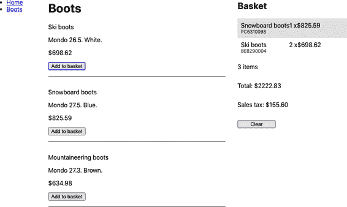

###### 图 3-22\. 选择器重新计算总成本和销售税，仅在篮子变化时。

## 讨论

第一次遇到选择器函数时，它们可能会显得复杂和难以理解。但是花时间理解它们是值得的。它们与 Redux 无关。你也可以将它们与非 Redux reducer 一起使用。因为它们除了`reselect`库本身外没有任何依赖，所以很容易进行单元测试。我们在本章的代码中包含了示例测试。

你可以从[GitHub 网站](https://oreil.ly/U7SLr)下载此配方的源代码。
