# 第四章：交互设计

在本章中，我们将探讨一些解决典型界面问题的配方。如何处理错误？如何帮助人们使用您的系统？如何在不编写大量混乱代码的情况下创建复杂的输入序列？

这是一些我们一次又一次发现有用的技巧集合。在本章末尾，我们将探讨向应用程序添加动画的各种方法。我们尽可能采取低技术的方法，理想情况下，我们包含的配方将以最少的麻烦为界面设计增添意义。

# 构建一个集中式错误处理程序

## 问题

很难准确定义什么使得良好的软件变得优秀。但大多数优秀的软件共同点之一是它们如何响应错误和异常。当人们运行您的代码时，总会出现异常的、意外的情况：网络可能会消失，服务器可能会崩溃，存储可能会损坏。重要的是考虑在这些情况发生时应该如何处理。

几乎肯定会失败的一个方法是忽视错误条件的发生并隐藏发生了什么错误的细节。无论何时何地，您都需要留下一串证据，以便您可以防止再次发生该错误。

当我们编写服务器代码时，我们可能会记录错误详细信息并返回一个适当的响应消息。但是，如果我们编写客户端代码，我们需要一个处理本地错误的计划。我们可以选择向用户显示崩溃的详细信息，并要求他们提交错误报告。我们也可以使用像[Sentry.io](https://sentry.io)这样的第三方服务远程记录详细信息。

无论我们的代码做什么，它应该是一致的。但是在 React 应用程序中如何一致地处理异常？

## 解决方案

在这个配方中，我们将看一种创建集中式错误处理程序的方式。明确一点：这段代码不会自动捕获所有异常。它仍然需要明确添加到 JavaScript 的`catch`块中。它也不能替代从其他方面可以恢复的任何错误处理。如果一个订单失败是因为服务器正在进行维护，最好是告诉用户稍后再试。

但是这种技术有助于捕捉我们之前未计划的任何错误。

作为一个通则，当出现问题时，有三件事情你应该告诉用户：

+   发生了什么

+   为什么会发生

+   他们应该如何应对

在我们展示的示例中，我们将通过显示对话框来处理错误，该对话框显示 JavaScript `Error` 对象的详细信息，并要求用户将内容发送到系统支持的邮箱。我们希望有一个简单的错误处理函数，当出现错误时我们可以调用它：

```
setVisibleError('Cannot do that thing', errorObject)
```

如果我们希望使函数在整个应用程序中都能够轻松使用，则通常的方法是使用*上下文*。上下文是一种我们可以在一组 React 组件周围包装的范围。我们放入该上下文的任何内容都可用于所有子组件。我们将使用我们的上下文来存储错误处理程序函数，当出现错误时我们可以运行它。

我们将称我们的上下文为`ErrorHandlerContext`：

```
import React from 'react'

const ErrorHandlerContext = React.createContext(() => {})

export default ErrorHandlerContext
```

为了让上下文在一组组件中可用，让我们创建一个`ErrorHandlerProvider`组件，该组件将创建一个上下文实例，并使其对我们传递给它的任何子组件可用：

```
import ErrorHandlerContext from './ErrorHandlerContext'

let setError = () => {}

const ErrorHandlerProvider = (props) => {
  if (props.callback) {
    setError = props.callback
  }

  return (
    <ErrorHandlerContext.Provider value={setError}>
      {props.children}
    </ErrorHandlerContext.Provider>
  )
}

export default ErrorHandlerProvider
```

现在我们需要一些代码来说明当调用错误处理程序时应该做什么。在我们的情况下，我们需要一些代码来响应错误报告，并显示包含所有错误详情的对话框。如果您希望以不同方式处理错误，这就是您需要修改的代码：

```
import { useCallback, useState } from 'react'
import ErrorHandlerProvider from './ErrorHandlerProvider'
import ErrorDialog from './ErrorDialog'

const ErrorContainer = (props) => {
  const [error, setError] = useState()
  const [errorTitle, setErrorTitle] = useState()
  const [action, setAction] = useState()

  if (error) {
    console.error(
      'An error has been thrown',
      errorTitle,
      JSON.stringify(error)
    )
  }

  const callback = useCallback((title, err, action) => {
    console.error('ERROR RAISED ')
    console.error('Error title: ', title)
    console.error('Error content', JSON.stringify(err))
    setError(err)
    setErrorTitle(title)
    setAction(action)
  }, [])
  return (
    <ErrorHandlerProvider callback={callback}>
      {props.children}

      {error && (
        <ErrorDialog
          title={errorTitle}
          onClose={() => {
            setError(null)
            setErrorTitle('')
          }}
          action={action}
          error={error}
        />
      )}
    </ErrorHandlerProvider>
  )
}

export default ErrorContainer
```

`ErrorContainer`使用`ErrorDialog`显示详细信息。我们不会在此处详细介绍`ErrorDialog`的代码，因为这是您最有可能用自己实现替换的代码。^(1)

我们需要将应用程序的大部分内容包装在`ErrorContainer`中。`ErrorContainer`内的任何组件都可以调用错误处理程序：

```
import './App.css'
import ErrorContainer from './ErrorContainer'
import ClockIn from './ClockIn'

function App() {
  return (
    <div className="App">
      <ErrorContainer>
        <ClockIn />
      </ErrorContainer>
    </div>
  )
}

export default App
```

组件如何使用错误处理程序？我们将创建一个名为`useErrorHandler()`的自定义钩子，它将从上下文中获取错误处理程序函数并返回它：

```
import ErrorHandlerContext from './ErrorHandlerContext'
import { useContext } from 'react'

const useErrorHandler = () => useContext(ErrorHandlerContext)

export default useErrorHandler
```

这是一组相当复杂的代码，但现在我们来使用错误处理程序；这非常简单。此示例代码在用户单击按钮时进行网络请求。如果网络请求失败，则将错误的详细信息传递给错误处理程序：

```
import useErrorHandler from './useErrorHandler'
import axios from 'axios'

const ClockIn = () => {
  const setVisibleError = useErrorHandler()

  const doClockIn = async () => {
    try {
      await axios.put('/clockTime')
    } catch (err) {
      setVisibleError('Unable to record work start time', err)
    }
  }

  return (
    <>
      <h1>Click Button to Record Start Time</h1>
      <button onClick={doClockIn}>Start work</button>
    </>
  )
}

export default ClockIn
```

你可以在图 4-1 中看到应用程序的外观。

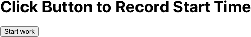

###### 图 4-1\. 记时应用程序

当你点击按钮时，由于服务器代码不存在，网络请求失败。图 4-2 显示了出现的错误对话框。注意，它显示了出错的原因、原因以及用户应该如何处理。

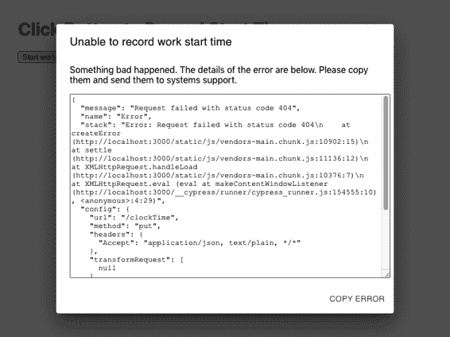

###### 图 4-2\. 当网络请求抛出异常时，我们将其传递给错误处理程序

## 讨论

在我们多年来创建的所有示例中，这个示例节省了最多的时间。在开发过程中，代码经常会出现问题，如果失败的唯一证据是隐藏在 JavaScript 控制台中的堆栈跟踪，您很可能会错过它。

当某个基础设施（网络、网关、服务器、数据库）出现故障时，这段小代码可以节省大量时间用于追踪故障原因。

你可以从[GitHub 网站](https://oreil.ly/wUM7Q)下载此示例的源代码。

# 创建一个交互式帮助指南

## 问题

蒂姆·伯纳斯-李（Tim Berners-Lee）特意设计了具有极少特性的 Web。它有一个简单的协议（HTTP），最初有一个简单的标记语言（HTML）。缺乏复杂性意味着网站的新用户立即知道如何使用它们。如果您看到类似超链接的东西，您可以单击它并转到另一页。

但是，富 JavaScript 应用程序改变了一切。现在的 Web 应用程序不再是超链接网页的集合。相反，它们类似于旧桌面应用程序；它们更强大且功能丰富，但缺点是现在使用起来更加复杂。

如何在您的应用程序中构建交互式指南？

## 解决方案

我们将构建一个简单的帮助系统，可以覆盖到现有应用程序上。当用户打开帮助时，他们将看到一系列弹出式说明，描述如何使用页面上可见的各种功能，如图 4-3 所示。

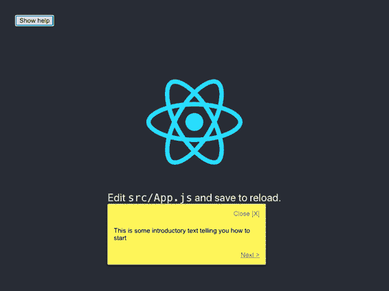

###### 图 4-3\. 当用户询问时显示一系列帮助消息

我们希望能够轻松维护并且只为可见组件提供帮助。这听起来是一项相当大的任务，所以让我们首先构建一个能够显示弹出帮助消息的组件：

```
import { Popper } from '@material-ui/core'
import './HelpBubble.css'

const HelpBubble = (props) => {
  const element = props.forElement
    ? document.querySelector(props.forElement)
    : null

  return element ? (
    <Popper
      className="HelpBubble-container"
      open={props.open}
      anchorEl={element}
      placement={props.placement || 'bottom-start'}
    >
      <div className="HelpBubble-close" onClick={props.onClose}>
        Close [X]
      </div>
      {props.content}
      <div className="HelpBubble-controls">
        {props.previousLabel ? (
          <div
            className="HelpBubble-control HelpBubble-previous"
            onClick={props.onPrevious}
          >
            &lt; {props.previousLabel}
          </div>
        ) : (
          <div>&nbsp;</div>
        )}
        {props.nextLabel ? (
          <div
            className="HelpBubble-control HelpBubble-next"
            onClick={props.onNext}
          >
            {props.nextLabel} &gt;
          </div>
        ) : (
          <div>&nbsp;</div>
        )}
      </div>
    </Popper>
  ) : null
}

export default HelpBubble
```

我们正在使用`@material-ui`库中的`Popper`组件。`Popper`组件可以在页面上的其他组件旁边锚定。我们的`HelpBubble`采用一个`forElement`字符串，该字符串将代表一个 CSS 选择器，如`.class-name`或`#some-id`。我们将使用选择器将屏幕上的事物与弹出消息关联起来。

现在我们有了一个弹出消息组件，我们需要一个协调一系列`HelpBubbles`的东西。我们将其称为`HelpSequence`：

```
import { useEffect, useState } from 'react'

import HelpBubble from './HelpBubble'

function isVisible(e) {
  return !!(
    e.offsetWidth ||
    e.offsetHeight ||
    e.getClientRects().length
  )
}

const HelpSequence = (props) => {
  const [position, setPosition] = useState(0)
  const [sequence, setSequence] = useState()

  useEffect(() => {
    if (props.sequence) {
      const filter = props.sequence.filter((i) => {
        if (!i.forElement) {
          return false
        }
        const element = document.querySelector(i.forElement)
        if (!element) {
          return false
        }
        return isVisible(element)
      })
      setSequence(filter)
    } else {
      setSequence(null)
    }
  }, [props.sequence, props.open])

  const data = sequence && sequence[position]

  useEffect(() => {
    setPosition(0)
  }, [props.open])

  const onNext = () =>
    setPosition((p) => {
      if (p === sequence.length - 1) {
        props.onClose && props.onClose()
      }
      return p + 1
    })

  const onPrevious = () =>
    setPosition((p) => {
      if (p === 0) {
        props.onClose && props.onClose()
      }
      return p - 1
    })

  return (
    <div className="HelpSequence-container">
      {data && (
        <HelpBubble
          open={props.open}
          forElement={data.forElement}
          placement={data.placement}
          onClose={props.onClose}
          previousLabel={position > 0 && 'Previous'}
          nextLabel={
            position < sequence.length - 1 ? 'Next' : 'Finish'
          }
          onPrevious={onPrevious}
          onNext={onNext}
          content={data.text}
        />
      )}
    </div>
  )
}

export default HelpSequence
```

`HelpSequence`接受一个像这样的 JavaScript 对象数组：

```
[
    {forElement: "p",
        text: "This is some introductory text telling you how to start"},
    {forElement: ".App-link", text: "This will show you how to use React"},
    {forElement: ".App-nowhere", text: "This help text will never appear"},
]
```

并将其转换为动态序列的`HelpBubbles`。仅当它可以找到与`forElement`选择器匹配的元素时，它才会显示`HelpBubble`。然后，它将`HelpBubble`放置在元素旁边并显示帮助文本。

让我们向由`create-react-app`生成的默认*App.js*代码添加一个`HelpSequence`：

```
import { useState } from 'react'
import logo from './logo.svg'
import HelpSequence from './HelpSequence'
import './App.css'

function App() {
  const [showHelp, setShowHelp] = useState(false)

  return (
    <div className="App">
      <header className="App-header">
        
        <p>
          Edit <code>src/App.js</code> and save to reload.
        </p>
        <a
          className="App-link"
          href="https://reactjs.org"
          target="_blank"
          rel="noopener noreferrer"
        >
          Learn React
        </a>
      </header>
      <button onClick={() => setShowHelp(true)}>Show help</button>
      <HelpSequence
        sequence={[
          {
            forElement: 'p',
            text: 'This is some introductory text telling you how to start',
          },
          {
            forElement: '.App-link',
            text: 'This will show you how to use React',
          },
          {
            forElement: '.App-nowhere',
            text: 'This help text will never appear',
          },
        ]}
        open={showHelp}
        onClose={() => setShowHelp(false)}
      />
    </div>
  )
}

export default App
```

起初，我们除了一个帮助按钮之外什么也看不到（见图 4-4）。

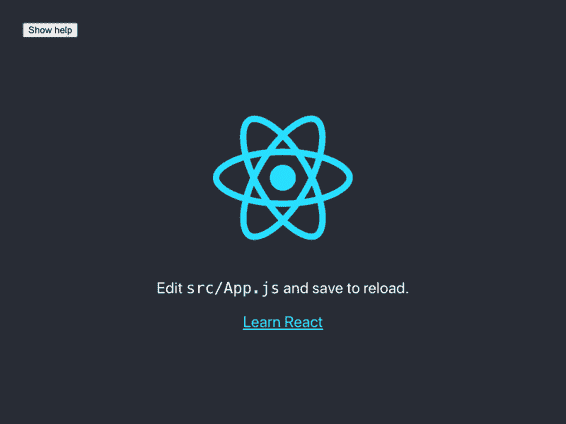

###### 图 4-4\. 应用程序在首次加载时

当用户点击帮助按钮时，第一个帮助主题将显示，如图 4-5 所示。


###### 图 4-5\. 当用户点击帮助按钮时，帮助气泡将出现在第一个匹配项上。

图 4-6 显示了当用户点击“下一个”时帮助移动到下一个元素。用户可以继续从一个项目移动到另一个项目，直到没有更多匹配的可见元素。

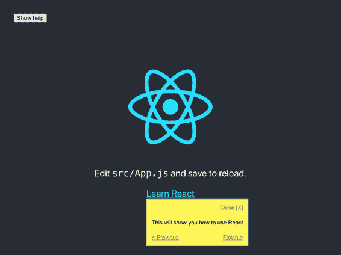

###### 图 4-6\. 最后一个元素有一个*完成*按钮

## 讨论

向应用程序添加交互式帮助使用户界面*可发现*。开发人员花费大量时间向应用程序添加功能，而用户可能永远不知道它存在，仅仅是因为他们不知道它的存在。

此示例中的实现将帮助显示为简单的纯文本。您可以考虑使用 Markdown，因为这将允许更丰富的体验，帮助主题可以包含链接到其他更详细的帮助页面。^(2)

帮助主题自动限制为页面上可见的元素。您可以选择为每个页面创建一个单独的帮助序列，或者创建一个单一的大帮助序列，它将自动适应用户当前界面的视图。

最后，像这样的帮助系统非常适合存储在无头 CMS 中，这样可以动态更新帮助内容，而无需每次创建新的部署。

您可以从[GitHub 网站](https://oreil.ly/CsiMN)下载此示例的源代码。

# 用于复杂交互的 Reducer。

## 问题

应用程序经常需要用户按照一系列操作。他们可能正在完成向导中的步骤，或者他们可能需要登录并确认某些危险操作（参见图 4-7）。

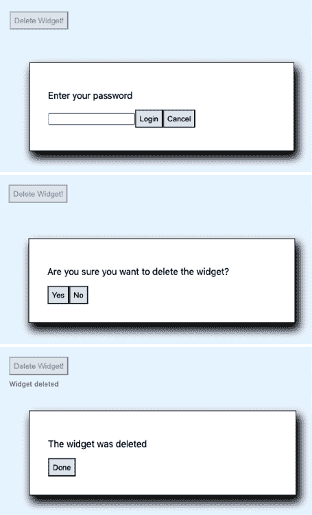

###### 图 4-7\. 这个删除过程需要登录然后确认删除。

用户不仅需要执行一系列步骤，这些步骤可能是有条件的。如果用户最近已经登录过，他们可能不需要再次登录。他们可能希望在序列的中途取消操作。

如果您在组件内建模复杂的序列，很快您的应用程序可能就会充满混乱的代码。

## 解决方案。

我们将使用一个 Reducer 来管理一系列复杂的操作。我们在第三章介绍了用于管理状态的 Reducer。*Reducer*是一个接受状态对象和动作的函数。Reducer 使用动作来决定如何更改状态，并且它不能有副作用。

因为 Reducer 没有用户界面代码，它们非常适合管理复杂的相互关联的状态片段，而不用担心视觉外观。它们特别适合单元测试。

例如，假设我们实现了在本示例开头提到的删除序列。我们可以通过经典的测试驱动风格开始，编写一个单元测试：

```
import deletionReducer from './deletionReducer'

describe('deletionReducer', () => {
  it('should show the login dialog if we are not logged in', () => {
    const actual = deletionReducer({}, { type: 'START_DELETION' })
    expect(actual.showLogin).toBe(true)
    expect(actual.message).toBe('')
    expect(actual.deleteButtonDisabled).toBe(true)
    expect(actual.loginError).toBe('')
    expect(actual.showConfirmation).toBe(false)
  })
})
```

我们的减少函数将被称为`deletionReducer`。我们向它传递一个空对象（`{}`）和一个指示我们要开始删除过程的动作（`{type: 'START_DELETION'}`）。然后我们说我们期望状态的新版本具有`showLogin`值为`true`，`showConfirmation`值为`false`，等等。

然后，我们可以实现一个 Reducer 的代码来做到这一点：

```
function deletionReducer(state, action) {
  switch (action.type) {
    case 'START_DELETION':
      return {
        ...state,
        showLogin: true,
        message: '',
        deleteButtonDisabled: true,
        loginError: '',
        showConfirmation: false,
      }
    default:
      return null // Or anything
  }
}
```

起初，我们只是将状态属性设置为通过测试的值。随着我们添加更多的测试，我们的减速器在处理更多情况时得到改进。

最终，我们得到了类似这样的东西：^(3)

```
function deletionReducer(state, action) {
  switch (action.type) {
    case 'START_DELETION':
      return {
        ...state,
        showLogin: !state.loggedIn,
        message: '',
        deleteButtonDisabled: true,
        loginError: '',
        showConfirmation: !!state.loggedIn,
      }
    case 'CANCEL_DELETION':
      return {
        ...state,
        showLogin: false,
        showConfirmation: false,
        showResult: false,
        message: 'Deletion canceled',
        deleteButtonDisabled: false,
      }
    case 'LOGIN':
      const passwordCorrect = action.payload === 'swordfish'
      return {
        ...state,
        showLogin: !passwordCorrect,
        showConfirmation: passwordCorrect,
        loginError: passwordCorrect ? '' : 'Invalid password',
        loggedIn: true,
      }
    case 'CONFIRM_DELETION':
      return {
        ...state,
        showConfirmation: false,
        showResult: true,
        message: 'Widget deleted',
      }
    case 'FINISH':
      return {
        ...state,
        showLogin: false,
        showConfirmation: false,
        showResult: false,
        deleteButtonDisabled: false,
      }
    default:
      throw new Error('Unknown action: ' + action.type)
  }
}

export default deletionReducer
```

尽管此代码复杂，但如果您首先创建测试，可以快速编写它。

现在我们有了减速器，可以在我们的应用程序中使用它：

```
import { useReducer, useState } from 'react'
import './App.css'
import deletionReducer from './deletionReducer'

function App() {
  const [state, dispatch] = useReducer(deletionReducer, {})
  const [password, setPassword] = useState()

  return (
    <div className="App">
      <button
        onClick={() => {
          dispatch({ type: 'START_DELETION' })
        }}
        disabled={state.deleteButtonDisabled}
      >
        Delete Widget!
      </button>
      <div className="App-message">{state.message}</div>
      {state.showLogin && (
        <div className="App-dialog">
          <p>Enter your password</p>
          <input
            type="password"
            value={password}
            onChange={(evt) => setPassword(evt.target.value)}
          />
          <button
            onClick={() =>
              dispatch({ type: 'LOGIN', payload: password })
            }
          >
            Login
          </button>
          <button
            onClick={() => dispatch({ type: 'CANCEL_DELETION' })}
          >
            Cancel
          </button>
          <div className="App-error">{state.loginError}</div>
        </div>
      )}
      {state.showConfirmation && (
        <div className="App-dialog">
          <p>Are you sure you want to delete the widget?</p>
          <button
            onClick={() =>
              dispatch({
                type: 'CONFIRM_DELETION',
              })
            }
          >
            Yes
          </button>
          <button
            onClick={() =>
              dispatch({
                type: 'CANCEL_DELETION',
              })
            }
          >
            No
          </button>
        </div>
      )}
      {state.showResult && (
        <div className="App-dialog">
          <p>The widget was deleted</p>
          <button
            onClick={() =>
              dispatch({
                type: 'FINISH',
              })
            }
          >
            Done
          </button>
        </div>
      )}
    </div>
  )
}

export default App
```

这段代码的大部分只是为序列中的每个对话框创建用户界面。在这个组件中几乎没有逻辑。它只是按照减速器告诉它做的事情。它将用户带过*快乐路径*，登录并确认删除（参见图 4-8）。


###### 图 4-8\. 最终结果

但是图 4-9 显示它也处理了所有的边缘情况，比如无效密码和取消。

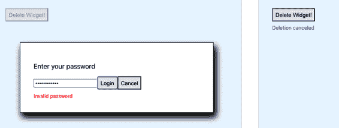

###### 图 4-9\. 缩小处理的边缘情况均由减速器处理

## 讨论

有时减速器会使您的代码变得复杂；如果您的状态片段很少并且它们之间的交互也很少，您可能不需要一个减速器。但是，如果您发现自己在绘制流程图或状态图来描述一系列用户交互的顺序，那就是您可能需要减速器的信号。

您可以从[GitHub 网站](https://oreil.ly/hfqLn)下载此示例的源代码。

# 添加键盘交互

## 问题

电源用户喜欢使用键盘进行频繁使用的操作。React 组件可以响应键盘事件，但仅当它们（或它们的子组件）具有焦点时。如果您希望组件在文档级别响应事件，该怎么办？

## 解决方案

我们将创建一个键监听器钩子，以监听`document`级别的`keydown`事件。但是，可以轻松修改以便在 DOM 中监听任何其他 JavaScript 事件。这是钩子：

```
import { useEffect } from 'react'

const useKeyListener = (callback) => {
  useEffect(() => {
    const listener = (e) => {
      e = e || window.event
      const tagName = e.target.localName || e.target.tagName
      // Only accept key-events that originated at the body level
      // to avoid key-strokes in e.g. text-fields being included
      if (tagName.toUpperCase() === 'BODY') {
        callback(e)
      }
    }
    document.addEventListener('keydown', listener, true)
    return () => {
      document.removeEventListener('keydown', listener, true)
    }
  }, [callback])
}

export default useKeyListener
```

该钩子接受一个回调函数并在`document`对象上注册它以监听`keydown`事件。在`useEffect`结束时，它返回一个函数，该函数将注销回调。如果我们传入的回调函数发生变化，我们将首先注销旧函数，然后注册新函数。

我们如何使用这个钩子？这里有一个例子。看看你是否注意到我们必须处理的小编码瑕疵：

```
import { useCallback, useState } from 'react'
import './App.css'
import useKeyListener from './useKeyListener'

const RIGHT_ARROW = 39
const LEFT_ARROW = 37
const ESCAPE = 27

function App() {
  const [angle, setAngle] = useState(0)
  const [lastKey, setLastKey] = useState('')

  let onKeyDown = useCallback(
    (evt) => {
      if (evt.keyCode === LEFT_ARROW) {
        setAngle((c) => Math.max(-360, c - 10))
        setLastKey('Left')
      } else if (evt.keyCode === RIGHT_ARROW) {
        setAngle((c) => Math.min(360, c + 10))
        setLastKey('Right')
      } else if (evt.keyCode === ESCAPE) {
        setAngle(0)
        setLastKey('Escape')
      }
    },
    [setAngle]
  )
  useKeyListener(onKeyDown)

  return (
    <div className="App">
      <p>
        Angle: {angle} Last key: {lastKey}
      </p>
      <svg
        width="400px"
        height="400px"
        title="arrow"
        fill="none"
        strokeWidth="10"
        stroke="black"
        style={{
          transform: `rotate(${angle}deg)`,
        }}
      >
        <polyline points="100,200 200,0 300,200" />
        <polyline points="200,0 200,400" />
      </svg>
    </div>
  )
}

export default App
```

这段代码监听用户按左/右光标键。我们的`onKeyDown`函数说明了这些按键点击发生时应该发生什么，但请注意，我们已经将其包装在`useCallback`中。如果我们*没有*这样做，浏览器将在每次渲染`App`组件时重新创建`onKeyDown`函数。新函数将与旧的`onKeyDown`函数执行相同的操作，但它会存在于内存中的不同位置，而`useKeyListener`将不断注销和重新注册它。

如果您忘记在`useCallback`中包装回调函数，可能会导致大量的渲染调用，从而减慢应用程序的速度。

通过使用`useCallback`，我们可以确保只在`setAngle`发生变化时创建该函数。

如果您运行该应用程序，您将在屏幕上看到一个箭头。如果您按左/右箭头键（参见图 4-10），您可以旋转图像。如果您按 Escape 键，则可以将其重置为垂直状态。

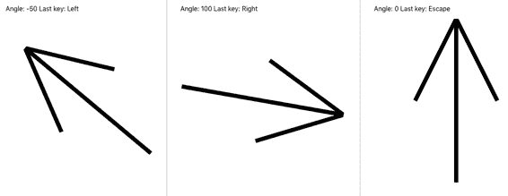

###### 图 4-10\. 按下左/右/Escape 键会导致箭头旋转

## 讨论

我们在`useKeyListener`函数中小心地只监听源自`body`级别的事件。如果用户在文本字段中点击箭头键，浏览器不会将这些事件发送到你的代码。

你可以从[GitHub 网站](https://oreil.ly/VIY1O)下载这个示例的源代码。

# 使用 Markdown 进行富内容处理

## 问题

如果你的应用允许用户提供大块文本内容，那么让这些内容包含格式化文本、链接等将会很有帮助。然而，允许用户传递原始的 HTML 等内容可能会导致安全漏洞，并给开发人员带来无法预料的痛苦。

如何让用户发布富文本内容而不损害应用程序的安全性？

## 解决方案

Markdown 是一种安全地允许用户向您的应用程序发布富内容的绝佳方式。要了解如何在您的应用程序中使用 Markdown，请考虑这个简单的应用程序，它允许用户在列表中发布带有时间戳的一系列消息：

```
import { useState } from 'react'
import './Forum.css'

const Forum = () => {
  const [text, setText] = useState('')
  const [messages, setMessages] = useState([])

  return (
    <section className="Forum">
      <textarea
        cols={80}
        rows={20}
        value={text}
        onChange={(evt) => setText(evt.target.value)}
      />
      <button
        onClick={() => {
          setMessages((msgs) => [
            {
              body: text,
              timestamp: new Date().toISOString(),
            },
            ...msgs,
          ])
          setText('')
        }}
      >
        Post
      </button>
      {messages.map((msg) => {
        return (
          <dl>
            <dt>{msg.timestamp}</dt>
            <dd>{msg.body}</dd>
          </dl>
        )
      })}
    </section>
  )
}

export default Forum
```

当您运行该应用程序时（参见图 4-11），您会看到一个大文本区域。当您发布纯文本消息时，应用程序会保留空格和换行符。

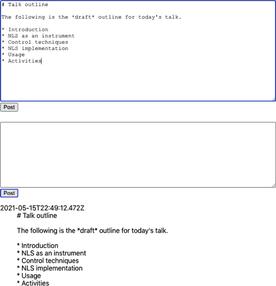

###### 图 4-11\. 用户在文本区域输入文本，然后将其作为纯文本消息发布

如果你的应用程序包含文本区域，考虑允许用户输入 Markdown 内容是值得的。

有许多 Markdown 库可供选择，但大多数都是`react-markdown`的包装器或语法高亮器，如[PrismJS](https://prismjs.com)或[CodeMirror](https://codemirror.net)。

我们将查看一个名为`react-md-editor`的库，它为`react-markdown`添加了额外的功能，并允许您显示和编辑 Markdown。我们将从安装该库开始：

```
$ npm install @uiw/react-md-editor
```

现在我们将将我们的纯文本区域转换为 Markdown 编辑器，并将发布的消息从 Markdown 转换为 HTML：

```
import { useState } from 'react'
import MDEditor from '@uiw/react-md-editor'

const MarkdownForum = () => {
  const [text, setText] = useState('')
  const [messages, setMessages] = useState([])

  return (
    <section className="Forum">
      <MDEditor height={300} value={text} onChange={setText} />
      <button
        onClick={() => {
          setMessages((msgs) => [
            {
              body: text,
              timestamp: new Date().toISOString(),
            },
            ...msgs,
          ])
          setText('')
        }}
      >
        Post
      </button>
      {messages.map((msg) => {
        return (
          <dl>
            <dt>{msg.timestamp}</dt>
            <dd>
              <MDEditor.Markdown source={msg.body} />
            </dd>
          </dl>
        )
      })}
    </section>
  )
}

export default MarkdownForum
```

将纯文本转换为 Markdown 是一个小改变，却有很大的回报。正如您在图 4-12 中所看到的，用户可以对消息应用丰富的格式，并选择在发布之前在全屏模式下进行编辑。

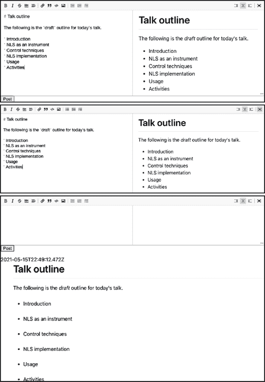

###### 图 4-12\. Markdown 编辑器在您输入时显示预览，并允许您全屏工作

## 讨论

将 Markdown 添加到应用程序中非常快速，并且可以通过最小的努力来改善用户体验。有关 Markdown 的更多详情，请参阅[约翰·格鲁伯的原始指南](https://oreil.ly/2EE9x)。

你可以从[GitHub 网站](https://oreil.ly/S0n7x)下载这个示例的源代码。

# 使用 CSS 类进行动画处理

## 问题

你想给你的应用程序添加一点简单的动画效果，但又不想通过安装第三方库来增加应用程序的大小。

## 解决方案

在 React 应用程序中，大多数你可能需要的动画可能不需要第三方动画库。这是因为现在 CSS 动画使得浏览器具有用极少代码实现 CSS 属性动画的能力。它只需很少的代码，并且由于图形硬件生成动画非常流畅。GPU 动画消耗的能量更少，更适合移动设备。

如果你想在你的 React 应用程序中添加动画，先从 CSS 动画开始，然后再看其他地方。

CSS 动画如何工作？它使用了一个叫做 `transition` 的 CSS 属性。假设我们想创建一个可扩展的信息面板。当用户点击按钮时，面板会平滑地打开。当他们再次点击时，它会平滑地关闭，如图 Figure 4-13 所示。

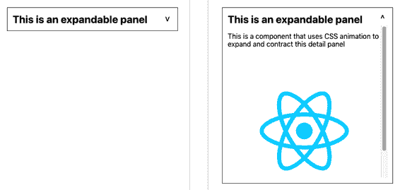

###### 图 4-13\. 简单的 CSS 动画会平滑地展开和收缩面板

我们可以使用 CSS 的 `transition` 属性来创建这种效果：

```
.InfoPanel-details {
    height: 350px;
    transition: height 0.5s;
}
```

此 CSS 指定了 `height` 和 `transition` 属性。这个组合意味着“无论当前的高度如何，在下半秒内动画到我的首选高度。”

当元素的 `height` 改变时（例如当额外的 CSS 规则变为有效时），动画将会发生。例如，如果我们有一个额外的 CSS 类名，其高度不同，`transition` 属性将在元素切换到不同类时动画高度变化：

```
.InfoPanel-details {
    height: 350px;
    transition: height 0.5s;
}
.InfoPanel-details.InfoPanel-details-closed {
    height: 0;
}
```

这个类名结构是块元素修饰符（BEM）命名的一个例子。*块* 是组件（`InfoPanel`），*元素* 是块内的东西（`details`），*修饰符* 描述了元素的当前状态（`closed`）。BEM 规范减少了代码中名称冲突的可能性。

如果一个 `InfoPanel-details` 元素突然获得了额外的 `.InfoPanel-details-closed` 类，`height` 将从 `350px` 变为 `0`，并且 `transition` 属性将平滑地收缩该元素。相反，如果组件*失去* `.InfoPanel-details-closed` 类，则元素将再次展开。

这意味着我们可以将繁重的工作推迟到 CSS 上，而我们在 React 代码中所需做的只是向元素添加或移除类：

```
import { useState } from 'react'

import './InfoPanel.css'

const InfoPanel = ({ title, children }) => {
  const [open, setOpen] = useState(false)

  return (
    <section className="InfoPanel">
      <h1>
        {title}
        <button onClick={() => setOpen((v) => !v)}>
          {open ? '^' : 'v'}
        </button>
      </h1>
      <div
        className={`InfoPanel-details ${
          open ? '' : 'InfoPanel-details-closed'
        }`}
      >
        {children}
      </div>
    </section>
  )
}

export default InfoPanel
```

## 讨论

我们经常看到许多项目打包第三方组件库，以使用一些小部件来展开或收缩其内容。正如你所见，这样的动画非常容易包含。

你可以从[GitHub 网站](https://oreil.ly/FKnIc)下载这个配方的源代码。

# 使用 React 动画

## 问题

CSS 动画非常简单，并且适用于大多数你可能需要的动画效果。

然而，它们要求您理解各种 CSS 属性及其动画效果。如果您想通过快速扩展并变成透明来说明删除项目，您该如何做？

诸如 [Animate.css](https://animate.style) 这样的库包含大量预设的 CSS 动画，但它们通常需要更高级的 CSS 动画概念，如关键帧，并且不特别适合 React。我们如何将 CSS 库动画添加到 React 应用程序中？

## 解决方案

React Animations 库是 Animate.css 库的 React 包装器。它会有效地向您的组件添加动画样式，而不会产生不必要的渲染或显著增加生成的 DOM 的大小。

它能如此高效地工作，因为 React Animations 与 CSS-in-JS 库配合使用。CSS-in-JS 是一种直接在 JavaScript 代码中编写样式信息的技术。React 将允许您将样式属性添加为 React 组件，但是 CSS-in-JS 更加高效，动态创建页面头部的共享样式元素。

有几个 CSS-in-JS 库可供选择，但在本示例中，我们将使用一个称为 [Radium](https://oreil.ly/oNBEl) 的库。

让我们从安装 Radium 和 React Animations 开始：

```
$ npm install radium
$ npm install react-animations
```

我们的示例应用（图 4-14）每次向集合添加图像项时都会运行一个动画。

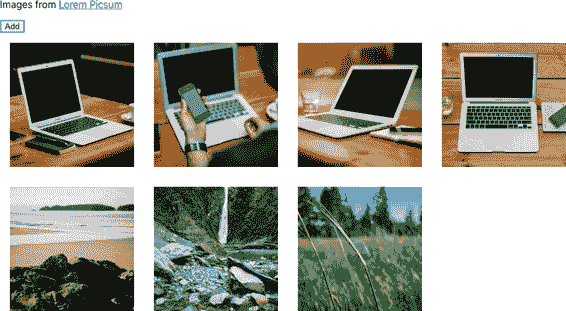

###### 图 4-14\. 单击“添加”按钮将从 picsum.photos 加载新图像

同样地，当用户点击图像时，会显示一个淡出动画，然后从列表中移除图像，如 图 4-15 所示。^(4)

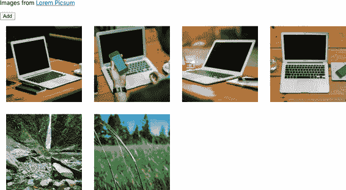

###### 图 4-15\. 如果单击第五张图像，它将从列表中淡出并消失

我们将从 Radium 中导入一些动画和辅助代码：

```
import { pulse, zoomOut, shake, merge } from 'react-animations'
import Radium, { StyleRoot } from 'radium'

const styles = {
  created: {
    animation: 'x 0.5s',
    animationName: Radium.keyframes(pulse, 'pulse'),
  },
  deleted: {
    animation: 'x 0.5s',
    animationName: Radium.keyframes(merge(zoomOut, shake), 'zoomOut'),
  },
}
```

从 React Animations 中获取 `pulse`、`zoomOut` 和 `shake` 动画。当我们添加图像时，我们将使用 `pulse` 动画。当我们移除图像时，我们将使用 `zoomOut` 和 `shake` 的*合并*动画。我们可以使用 React Animations 的 `merge` 函数组合动画。

`styles` 生成运行这些半秒动画所需的所有 CSS 样式。对 `Radium.keyframes()` 的调用为我们处理所有动画细节。

我们必须知道动画何时完全结束。如果我们在删除动画完成之前删除图像，就不会有图像可以动画化。

我们可以通过向要动画化的任何元素传递 `onAnimationEnd` 回调来跟踪 CSS 动画。对于我们图像集合中的每个项目，我们将跟踪三件事：

+   它表示的图像的 URL

+   一个布尔值，在“created”动画运行时为真

+   一个布尔值，在“deleted”动画运行时为真

这是将图像动画化进出集合的示例代码：

```
import { useState } from 'react'
import { pulse, zoomOut, shake, merge } from 'react-animations'
import Radium, { StyleRoot } from 'radium'

import './App.css'

const styles = {
  created: {
    animation: 'x 0.5s',
    animationName: Radium.keyframes(pulse, 'pulse'),
  },
  deleted: {
    animation: 'x 0.5s',
    animationName: Radium.keyframes(merge(zoomOut, shake), 'zoomOut'),
  },
}

function getStyleForItem(item) {
  return item.deleting
    ? styles.deleted
    : item.creating
    ? styles.created
    : null
}

function App() {
  const [data, setData] = useState([])

  let deleteItem = (i) =>
    setData((d) => {
      const result = [...d]
      result[i].deleting = true
      return result
    })
  let createItem = () => {
    setData((d) => [
      ...d,
      {
        url: `https://picsum.photos/id/${d.length * 3}/200`,
        creating: true,
      },
    ])
  }
  let completeAnimation = (d, i) => {
    if (d.deleting) {
      setData((d) => {
        const result = [...d]
        result.splice(i, 1)
        return result
      })
    } else if (d.creating) {
      setData((d) => {
        const result = [...d]
        result[i].creating = false
        return result
      })
    }
  }
  return (
    <div className="App">
      <StyleRoot>
        <p>
          Images from&nbsp;
          <a href="https://picsum.photos/">Lorem Picsum</a>
        </p>
        <button onClick={createItem}>Add</button>
        {data.map((d, i) => (
          <div
            style={getStyleForItem(d)}
            onAnimationEnd={() => completeAnimation(d, i)}
          >
             deleteItem(i)}
            />
          </div>
        ))}
      </StyleRoot>
    </div>
  )
}

export default App
```

## 讨论

在选择要使用的动画时，我们首先应该问：这个动画意味着什么？

所有的动画都应该有意义。它可以展示某种存在（创建或删除）。它可能指示状态的变化（启用或禁用）。它可能放大以显示细节或缩小以揭示更广泛的背景。或者它可能说明限制或边界（在长列表末尾的弹簧回弹动画）或允许用户表达偏好（向左或向右滑动）。

动画应该也要简短。大多数动画可能在半秒内完成，这样用户可以体验动画的含义，而无需过于关注其外观。

动画永远不应该仅仅是*吸引人*。

您可以从[GitHub 站点](https://oreil.ly/rRK8F)下载此配方的源代码。

# 使用 TweenOne 动画信息图表

## 问题

CSS 动画流畅而高效。浏览器可能会将 CSS 动画延迟到合成阶段的图形硬件上，这意味着动画不仅以机器码速度运行，而且机器码本身不在 CPU 上运行。

然而，将 CSS 动画运行在图形硬件上的缺点是，在动画*期间*，您的应用程序代码不会知道发生了什么。您可以跟踪动画何时开始，结束或重复（`onAnimationStart`，`onAni⁠ma⁠tionEnd`，`onAnimationIteration`），但其中发生的一切是个谜。

如果你正在制作信息图表动画，可能希望在条形图的柱子增长或缩小时动画化数字。或者，如果你正在编写一个跟踪骑行者的应用程序，你可能希望在自行车穿越地形时显示当前的海拔高度。

但是，您如何创建可以在发生时*侦听*的动画？

## 解决方案

TweenOne 库使用 JavaScript 创建动画，这意味着您可以帧-by-帧地跟踪它们发生的过程。

让我们从安装 TweenOne 库开始：

```
$ npm install rc-tween-one
```

TweenOne 与 CSS 一起工作，但它不使用 CSS 动画。相反，它生成 CSS 转换，并且每秒更新多次。

你需要将想要动画化的对象包裹在一个`<TweenOne/>`元素中。例如，假设我们想要在 SVG 中动画化一个`rect`：

```
<TweenOne component='g' animation={...details here}>
    <rect width="2" height="6" x="3" y="-3" fill="white"/>
</TweenOne>
```

`TweenOne`接受一个元素名称和一个描述要执行的动画的对象。我们将很快看到这个动画对象的样子。

TweenOne 将使用元素名称（本例中为`g`）生成包裹在动画对象周围的包装器。此包装器将具有一个样式属性，其中包括一组 CSS 转换，用于将内容移动和旋转到某个位置。

因此，在我们的例子中，动画的某个时刻，DOM 可能看起来像这样：

```
<g style="transform: translate(881.555px, 489.614px) rotate(136.174deg);">
  <rect width="2" height="6" x="3" y="-3" fill="white"/>
</g>
```

尽管您可以创建类似于 CSS 动画的效果，但 TweenOne 库的工作方式不同。TweenOne 库不会将动画交给硬件处理，而是使用 JavaScript 逐帧创建动画，这有两个后果。首先，它会使用更多的 CPU 资源（不好），其次，我们可以跟踪动画的进行（好）。

如果我们向 `TweenOne` 传递一个 `onUpdate` 回调，我们将收到有关每一帧动画的信息：

```
<TweenOne component='g' animation={...details here} onUpdate={info=>{...}}>
    <rect width="2" height="6" x="3" y="-3" fill="white"/>
</TweenOne>
```

传递给 `onUpdate` 的 `info` 对象有一个 `ratio` 值，介于 0 到 1 之间，表示 TweenOne 元素在动画中的位置比例。我们可以使用 `ratio` 来动画化与图形关联的文本。

例如，如果我们构建一个动画仪表板，显示赛道上的车辆，我们可以使用 `onUpdate` 显示每辆车的速度和距离随着动画的进行。

我们将在 SVG 中创建此示例的可视化内容。首先，让我们创建一个包含 SVG 路径的字符串，代表赛道：

```
export default 'm 723.72379,404.71306 ...  -8.30851,-3.00521 z'
```

这只是我们将使用的实际路径的大大简化版本。我们可以像这样从 *track.js* 导入路径字符串：

```
import path from './track'
```

要在 React 组件内显示轨道，我们可以渲染一个 `svg` 元素：

```
<svg height="600" width="1000" viewBox="0 0 1000 600"
     style={{backgroundColor: 'black'}}>
  <path stroke='#444' strokeWidth={10}
        fill='none' d={path}/>
</svg>
```

我们可以为车辆添加一对矩形——一个红色用于车身，一个白色用于挡风玻璃：

```
<svg height="600" width="1000" viewBox="0 0 1000 600"
     style={{backgroundColor: 'black'}}>
  <path stroke='#444' strokeWidth={10}
        fill='none' d={path}/>
  <rect width={24} height={16} x={-12} y={-8} fill='red'/>
  <rect width={2} height={6} x={3} y={-3} fill='white'/>
</svg>
```

图 4-16 显示了顶部左侧带有车辆的轨道。

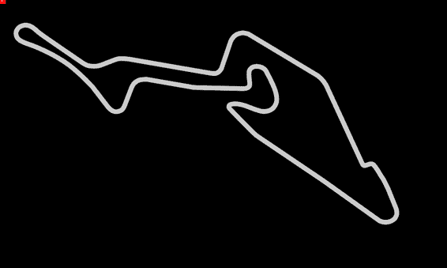

###### 图 4-16\. 左上角带有微小车辆的静态图像

但是，我们如何使车辆在赛道周围动起来呢？TweenOne 让这变得很容易，因为它包含一个插件，用于生成遵循 SVG 路径字符串的动画。

```
import PathPlugin from 'rc-tween-one/lib/plugin/PathPlugin'

TweenOne.plugins.push(PathPlugin)
```

我们已经配置了 TweenOne 用于 SVG 路径动画。这意味着我们可以看看如何描述 TweenOne 的动画。我们用一个简单的 JavaScript 对象来做到这一点：

```
import path from './track'

const followAnimation = {
  path: { x: path, y: path, rotate: path },
  repeat: -1,
}
```

使用这个对象告诉 TweenOne 两件事：首先，我们告诉它生成跟随我们从 *track.js* 导入的 `path` 字符串的平移和旋转。其次，我们通过将 `repeat` 计数设置为-1，表示我们希望动画无限循环。

我们可以将其作为我们车辆动画的基础：

```
<svg height="600" width="1000" viewBox="0 0 1000 600"
     style={{backgroundColor: 'black'}}>
  <path stroke='#444' strokeWidth={10}
        fill='none' d={path}/>
  <TweenOne component='g' animation={{...followAnimation, duration: 16000}}>
    <rect width={24} height={16} x={-12} y={-8} fill='red'/>
    <rect width={2} height={6} x={3} y={-3} fill='white'/>
  </TweenOne>
</svg>
```

注意，我们使用展开运算符提供了额外的动画参数：`duration`。值为 16000 表示我们希望动画持续 16 秒。

我们可以添加第二辆车，并使用 `onUpdate` 回调方法为每辆车创建一个非常基本的虚拟遥测统计信息。以下是完成的代码：

```
import { useState } from 'react'
import TweenOne from 'rc-tween-one'
import Details from './Details'
import path from './track'
import PathPlugin from 'rc-tween-one/lib/plugin/PathPlugin'
import grid from './grid.svg'

import './App.css'

TweenOne.plugins.push(PathPlugin)

const followAnimation = {
  path: { x: path, y: path, rotate: path },
  repeat: -1,
}

function App() {
  const [redTelemetry, setRedTelemetry] = useState({
    dist: 0,
    speed: 0,
    lap: 0,
  })
  const [blueTelemetry, setBlueTelemetry] = useState({
    dist: 0,
    speed: 0,
    lap: 0,
  })

  const trackVehicle = (info, telemetry) => ({
    dist: info.ratio,
    speed: info.ratio - telemetry.dist,
    lap:
      info.ratio < telemetry.dist ? telemetry.lap + 1 : telemetry.lap,
  })

  return (
    <div className="App">
      <h1>Nürburgring</h1>
      <Details
        redTelemetry={redTelemetry}
        blueTelemetry={blueTelemetry}
      />
      <svg
        height="600"
        width="1000"
        viewBox="0 0 1000 600"
        style={{ backgroundColor: 'black' }}
      >
        <image href={grid} width={1000} height={600} />
        <path stroke="#444" strokeWidth={10} fill="none" d={path} />
        <path
          stroke="#c0c0c0"
          strokeWidth={2}
          strokeDasharray="3 4"
          fill="none"
          d={path}
        />

        <TweenOne
          component="g"
          animation={{
            ...followAnimation,
            duration: 16000,
            onUpdate: (info) =>
              setRedTelemetry((telemetry) =>
                trackVehicle(info, telemetry)
              ),
          }}
        >
          <rect width={24} height={16} x={-12} y={-8} fill="red" />
          <rect width={2} height={6} x={3} y={-3} fill="white" />
        </TweenOne>

        <TweenOne
          component="g"
          animation={{
            ...followAnimation,
            delay: 3000,
            duration: 15500,
            onUpdate: (info) =>
              setBlueTelemetry((telemetry) =>
                trackVehicle(info, telemetry)
              ),
          }}
        >
          <rect width={24} height={16} x={-12} y={-8} fill="blue" />
          <rect width={2} height={6} x={3} y={-3} fill="white" />
        </TweenOne>
      </svg>
    </div>
  )
}

export default App
```

图 4-17 显示了动画。车辆沿着赛道的路径移动，并旋转以面向行驶方向。

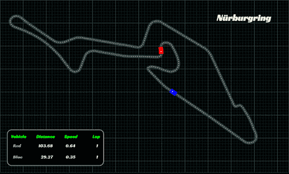

###### 图 4-17\. 从当前动画状态生成的遥测的最终动画

## 讨论

CSS 动画是大多数 UI 动画应该使用的技术。然而，在信息图表的情况下，通常需要同步文本和图形。TweenOne 可以实现这一点，但会增加 CPU 使用率的成本。

你可以从[GitHub 网站](https://oreil.ly/8l7Vp)下载此配方的源代码。

^(1) 你可以在[GitHub 仓库](https://oreil.ly/wUM7Q)上下载此配方的所有源代码。

^(2) 详细了解如何在您的应用程序中使用 Markdown，请参阅“使用 Markdown 创建丰富内容”。

^(3) 参见[GitHub 仓库](https://oreil.ly/DCGIv)以获取我们用于驱动此代码的测试。

^(4) 纸质书籍是美好的事物，但要完全体验动画效果，请在[GitHub](https://oreil.ly/OcAqo)上查看完整的代码。
