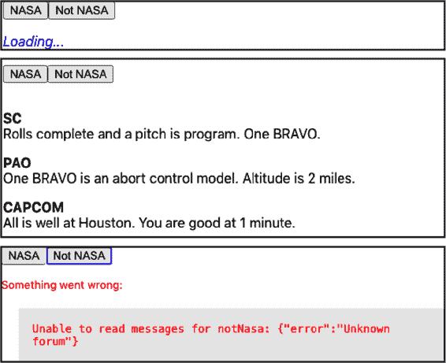
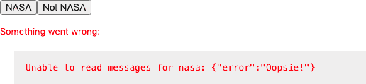
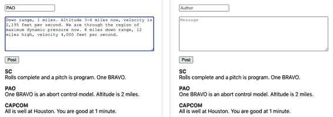
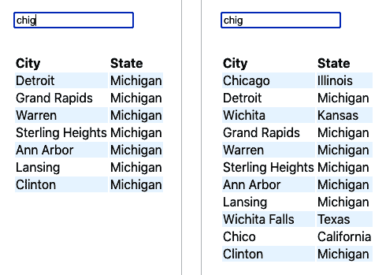
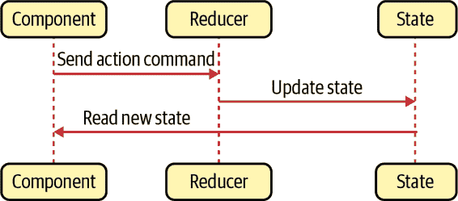
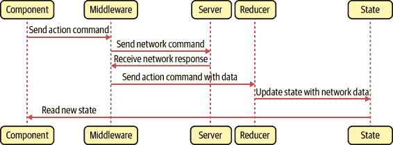
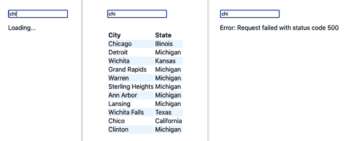
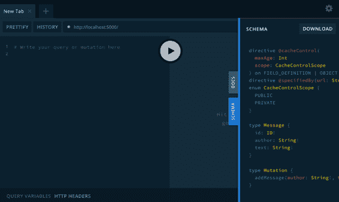
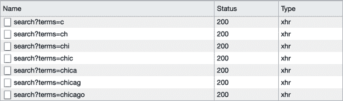

# 第五章：连接到服务

与 Angular 等框架不同，React 并不包含应用程序可能需要的一切。特别是，它不提供一种标准方法将数据从网络服务获取到您的应用程序中。这种自由很好，因为它意味着 React 应用程序可以使用最新的技术。不利之处在于，刚开始使用 React 的开发人员可能会被单独留给自己解决的困境。

在本章中，我们将看到一些将网络服务附加到您的应用程序的方法。我们将通过每个示例看到一些共同的主题，并尝试将网络代码与使用它的组件分开。这样，当新的网络服务技术出现时，我们可以无需大量更改代码就进行切换。

# 将网络调用转换为 Hooks

## 问题

组件化开发的优势之一是将代码分解为小的可管理的块，每个块执行一个明确可识别的操作。在某些方面，最好的组件是您可以在大屏幕上看到而无需滚动的组件。React 的一个伟大特性是，它在许多方面随着时间的推移变得更简单了。React hooks 和远离基于类的组件已经消除了样板代码并减少了代码量。

但是，扩展组件大小的一种方法是填充网络代码。如果您的目标是创建简单的代码，您应该尝试从组件中剥离网络代码。组件将变得更小，网络代码将更具重复使用性。

但我们应该如何拆分出网络代码呢？

## 解决方案

在这个示例中，我们将看到一种将您的网络请求移动到 React hooks 中的方法，以跟踪网络请求是否仍在进行中，或者是否发生了阻止其成功的错误。

在我们查看细节之前，我们需要考虑在进行异步网络请求时对我们来说什么是重要的。有三件事我们需要跟踪：

+   请求返回的数据

+   请求是否仍在从服务器加载数据

+   在运行请求时可能发生的任何错误

您将会在本章的每个示例中看到这三个要素出现。无论我们是使用`fetch`或`axios`命令，通过 Redux 中间件，还是通过类似*GraphQL*的 API 查询层进行请求，我们的组件始终会关注数据、加载状态和错误。

例如，让我们构建一个简单的留言板，其中包含几个论坛。每个论坛上的留言包含一个`author`字段和一个`text`字段。图 5-1 显示了示例应用程序的屏幕截图，您可以从 GitHub 站点下载。


###### 图 5-1\. 这些按钮选择*NASA*或*Not NASA*论坛

页面顶部的按钮选择“NASA”或“Not NASA”论坛。一个小的 Node 服务器为我们的示例应用程序提供后端，预先向 NASA 论坛中预填充了一些消息。下载源代码后，您可以通过运行应用程序主目录中的*server.js*脚本来运行后端服务器：

```
$ node ./server.js
```

后端服务器运行在*http://localhost:5000*。我们可以以通常的方式启动 React 应用程序：

```
$ npm run start
```

React 应用程序将在端口 3000 上运行。

在开发模式下，我们通过 React 服务器代理所有后端请求。如果您使用的是`create-react-app`，可以通过在*package.json*中添加`proxy`属性并将其设置为*http://localhost:5000*来实现这一点。React 服务器将 API 调用传递给我们的*server.js*后端。例如，*http://localhost:3000/messages/nasa*（返回 NASA 论坛的消息数组）将被代理到*http://localhost:5000/messages/nasa*。

我们将使用简单的`fetch`命令进行网络请求以读取消息：

```
const response = await fetch(`/messages/${forum}`)
if (!response.ok) {
  const text = await response.text()
  throw new Error(`Unable to read messages for ${forum}: ${text}`)
}
const body = await response.json()
```

在这里，`forum`值将包含论坛的字符串 ID。`fetch`命令是异步的并返回一个 promise，所以我们将`await`它。然后我们可以检查调用是否因为任何错误的 HTTP 状态而失败，如果是，我们将抛出一个错误。我们将从响应中提取 JSON 对象并将其存储在`body`变量中。如果响应体不是正确格式的 JSON 对象，我们也将抛出一个错误。

在此调用中，我们需要跟踪三件事：数据、加载状态和任何错误。我们将把整个过程封装在一个自定义钩子中，所以让我们有三个状态称为`data`、`loading`和`error`：

```
const useMessages = (forum) => {
  const [data, setData] = useState([])
  const [loading, setLoading] = useState(false)
  const [error, setError] = useState()
  ....
  return { data, loading, error }
}
```

我们将论坛名称作为参数传递给`useMessages`钩子，该钩子将返回一个包含`data`、`loading`和`error`状态的对象。我们可以在使用该钩子的任何组件中使用对象解构来提取和重命名这些值，例如：

```
const {
  data: messages,
  loading: messagesLoading,
  error: messagesError,
} = useMessages('nasa')
```

在扩展运算符中重命名变量有助于避免命名冲突。例如，如果您想从多个论坛读取消息，可以第二次调用`useMessages`钩子并选择与第二个钩子响应不同的变量名。

让我们回到`useMessages`钩子。网络请求取决于我们传入的`forum`值，因此我们需要确保在`useEffect`中运行`fetch`请求：

```
useEffect(() => {
  setError(null)
  if (forum) {
    ....
  } else {
    setData([])
    setLoading(false)
  }
}, [forum])
```

目前我们省略了实际请求的代码。`useEffect`中的代码将在第一次调用钩子时运行。如果客户端组件重新渲染并传入相同的`forum`值，`useEffect`将不会运行，因为`[forum]`依赖项没有变化。只有当`forum`值改变时，它才会再次运行。

现在让我们看看如何将`fetch`请求插入到这个钩子中：

```
import { useEffect, useState } from 'react'

const useMessages = (forum) => {
  const [data, setData] = useState([])
  const [loading, setLoading] = useState(false)
  const [error, setError] = useState()

  useEffect(() => {
    let didCancel = false
    setError(null)
    if (forum) {
      ;(async () => {
        try {
          setLoading(true)
          const response = await fetch(`/messages/${forum}`)
          if (!response.ok) {
            const text = await response.text()
            throw new Error(
              `Unable to read messages for ${forum}: ${text}`
            )
          }
          const body = await response.json()
          if (!didCancel) {
            setData(body)
          }
        } catch (err) {
          setError(err)
        } finally {
          setLoading(false)
        }
      })()
    } else {
      setData([])
      setLoading(false)
    }
    return () => {
      didCancel = true
    }
  }, [forum])

  return { data, loading, error }
}

export default useMessages
```

因为我们使用`await`正确处理承诺，所以我们需要在一个相当难看的`(async () => {...})`调用中包装代码。在其中，我们能够为`data`、`loading`和`error`设置值，因为请求运行、完成和（可能）失败。所有这些将在钩子调用完成后异步发生。当`data`、`loading`和`error`状态变化时，钩子将导致组件使用新值重新渲染。

在钩子中使用异步代码的后果是，在网络响应接收之前，钩子将返回。这意味着在先前的网络响应接收之前，有可能再次调用钩子。为了避免网络响应按错误的顺序解析，示例代码使用`didCancel`变量跟踪当前请求是否被后续请求覆盖。这个变量将控制钩子是否返回钩子中的数据。它不会取消网络请求本身。要取消网络请求，请参阅“使用令牌取消网络请求”。

让我们看一看示例应用程序中的*App.js*，看看如何使用这个钩子：

```
import './App.css'
import { useState } from 'react'
import useMessages from './useMessages'

function App() {
  const [forum, setForum] = useState('nasa')
  const {
    data: messages,
    loading: messagesLoading,
    error: messagesError,
  } = useMessages(forum)

  return (
    <div className="App">
      <button onClick={() => setForum('nasa')}>NASA</button>
      <button onClick={() => setForum('notNasa')}>Not NASA</button>
      {messagesError ? (
        <div className="error">
          Something went wrong:
          <div className="error-contents">
            {messagesError.message}
          </div>
        </div>
      ) : messagesLoading ? (
        <div className="loading">Loading...</div>
      ) : messages && messages.length ? (
        <dl>
          {messages.map((m) => (
            <>
              <dt>{m.author}</dt>
              <dd>{m.text}</dd>
            </>
          ))}
        </dl>
      ) : (
        'No messages'
      )}
    </div>
  )
}

export default App
```

我们的示例应用程序在你点击 NASA 或非 NASA 按钮时改变加载的论坛。示例服务器返回“Not NASA”论坛的 404 状态，导致屏幕上出现错误。在图 5-2 中，我们可以看到示例应用程序显示加载状态，来自 NASA 论坛的消息，以及尝试从缺失的“Not NASA”论坛加载数据时的错误。



###### 图 5-2\. 应用程序显示加载、消息和错误

如果服务器抛出错误，`useMessages` 钩子也会处理，如图 5-3 所示。



###### 图 5-3\. 组件可以显示来自服务器的错误

## 讨论

当你创建一个应用程序时，很容易花费时间构建假设一切正常工作的功能。但是值得投资时间来处理错误，并努力显示数据仍在加载的状态。你的应用将更加愉快使用，并且你将更容易追踪到慢服务和错误。

您还可以考虑将此示例与“构建集中式错误处理程序”结合使用，这将使用户更容易描述发生的情况。

您可以从[GitHub 网站](https://oreil.ly/T6M6q)下载此示例的源代码。

# 使用状态计数器自动刷新

## 问题

网络服务经常需要相互交互。例如，在我们之前的示例中使用的论坛应用程序中。如果我们添加一个表单来发布新消息，我们希望每次有人发布消息时，消息列表都会自动更新。

在这个应用程序的先前版本中，我们创建了一个名为`useMessages`的自定义钩子，其中包含读取论坛消息所需的所有代码。

我们将向应用程序添加一个表单，用于将新消息发布到服务器：

```
const {
  data: messages,
  loading: messagesLoading,
  error: messagesError,
} = useMessages('nasa')
const [text, setText] = useState()
const [author, setAuthor] = useState()
const [createMessageError, setCreateMessageError] = useState()
// Other code here...
<input
  type="text"
  value={author}
  placeholder="Author"
  onChange={(evt) => setAuthor(evt.target.value)}
/>
<textarea
  value={text}
  placeholder="Message"
  onChange={(evt) => setText(evt.target.value)}
/>
<button
  onClick={async () => {
    try {
      await [code to post message here]
      setText('')
      setAuthor('')
    } catch (err) {
      setCreateMessageError(err)
    }
  }}
>
  Post
</button>
```

这是问题所在：当您发布新消息时，除非手动刷新页面（参见图 5-4），否则不会出现在列表中。



###### 图 5-4\. 发布消息不会刷新消息列表

如何在每次发布新消息时自动重新加载来自服务器的消息？

## 解决方案

我们将通过使用*状态计数器*来触发数据刷新。状态计数器只是一个递增的数字。当前计数器的值无关紧要；重要的是每次重新加载数据时更改它：

```
const [stateVersion, setStateVersion] = useState(0)
```

您可以将状态计数器视为表示服务器数据视图的版本。当我们做一些可能改变服务器状态的操作时，我们会更新状态计数器以反映这些变化：

```
// code to post a new message here
setStateVersion((v) => v + 1)
```

注意，我们正在使用函数增加`stateVersion`的值，而不是使用`setStateVersion(stateVersion + 1)`。如果新值取决于旧值，您应始终使用函数来更新状态值。这是因为 React 异步设置状态。如果我们快速连续两次运行`setStateVersion(stateVersion + 1)`，则`stateVersion`的值在两次调用之间可能不会更改，我们会错过一个增量。

读取当前消息集的代码被包装在`useEffect`中，我们可以通过使其依赖于`stateVersion`值来强制重新运行它：

```
useEffect(() => {
  setError(null)
  if (forum) {
    // Code to read /messages/:forum
  } else {
    setData([])
    setLoading(false)
  }
}, [forum, stateVersion])
```

如果`forum`变量的值更改或者`stateVersion`更改，它将自动重新加载消息（参见图 5-5）。


###### 图 5-5\. 发布新消息会导致消息列表重新加载

这是我们的方法。现在我们需要看看代码放在哪里。这是组件的上一个版本，只读取消息：

```
import './App.css'
import { useState } from 'react'
import useMessages from './useMessages'

function App() {
  const [forum, setForum] = useState('nasa')
  const {
    data: messages,
    loading: messagesLoading,
    error: messagesError,
  } = useMessages(forum)

  return (
    <div className="App">
      <button onClick={() => setForum('nasa')}>NASA</button>
      <button onClick={() => setForum('notNasa')}>Not NASA</button>
      {messagesError ? (
        <div className="error">
          Something went wrong:
          <div className="error-contents">
            {messagesError.message}
          </div>
        </div>
      ) : messagesLoading ? (
        <div className="loading">Loading...</div>
      ) : messages && messages.length ? (
        <dl>
          {messages.map((m) => (
            <>
              <dt>{m.author}</dt>
              <dd>{m.text}</dd>
            </>
          ))}
        </dl>
      ) : (
        'No messages'
      )}
    </div>
  )
}

export default App
```

我们将把新的表单添加到这个组件中。我们还可以在组件内部包括网络代码和状态计数器代码。但是，这会将发布代码放在组件中，并将读取代码放在`useMessages`钩子中。将所有网络代码集中在钩子中更好。这样不仅组件更清洁，而且网络代码更可重用。

这是我们将用于`useForum`钩子新版本的代码，我们将其重命名为`useMessages`：^(1)

```
import { useCallback, useEffect, useState } from 'react'

const useForum = (forum) => {
  const [data, setData] = useState([])
  const [loading, setLoading] = useState(false)
  const [error, setError] = useState()
  const [creating, setCreating] = useState(false)
  const [stateVersion, setStateVersion] = useState(0)

  const create = useCallback(
    async (message) => {
      try {
        setCreating(true)
        const response = await fetch(`/messages/${forum}`, {
          method: 'POST',
          body: JSON.stringify(message),
          headers: {
            'Content-type': 'application/json; charset=UTF-8',
          },
        })
        if (!response.ok) {
          const text = await response.text()
          throw new Error(
            `Unable to create a ${forum} message: ${text}`
          )
        }
        setStateVersion((v) => v + 1)
      } finally {
        setCreating(false)
      }
    },
    [forum]
  )

  useEffect(() => {
    let didCancel = false
    setError(null)
    if (forum) {
      ;(async () => {
        try {
          setLoading(true)
          const response = await fetch(`/messages/${forum}`)
          if (!response.ok) {
            const text = await response.text()
            throw new Error(
              `Unable to read messages for ${forum}: ${text}`
            )
          }
          const body = await response.json()
          if (!didCancel) {
            setData(body)
          }
        } catch (err) {
          setError(err)
        } finally {
          setLoading(false)
        }
      })()
    } else {
      setData([])
      setLoading(false)
    }
    return () => {
      didCancel = true
    }
  }, [forum, stateVersion])

  return { data, loading, error, create, creating }
}

export default useForum
```

我们现在在`useForum`钩子内构造一个`create`函数，然后将其与其他各种状态一起返回到组件中。请注意，我们将`create`函数包装在`useCallback`中，这意味着除非我们需要为不同的`forum`值创建数据，否则我们不会创建函数的新版本。

在 hooks 和组件内创建函数时要小心。如果创建了一个新的函数对象，即使这个函数与之前的版本做的事情相同，React 通常会触发重新渲染。

当我们调用`create`函数时，它会向论坛发布一条新消息，然后更新`stateVersion`值，这将自动导致 hook 从服务器重新读取消息。请注意，我们还有一个`creating`值，在网络代码发送消息到服务器时为`true`。我们可以使用`creating`值来禁用 POST 按钮。

然而，在`create`中我们不会跟踪任何错误。为什么不呢？毕竟，当我们从服务器*读取*数据时我们会这样做。这是因为当您在服务器上更改数据时，通常希望对异常处理有更多的控制，而不像在仅仅读取数据时那样。在示例应用程序中，当向服务器发送消息时，我们会清空消息表单。如果有错误发生，我们希望保留消息表单中的文本。

现在让我们来看一下调用 hook 的代码：

```
import './App.css'
import { useState } from 'react'
import useForum from './useForum'

function App() {
  const {
    data: messages,
    loading: messagesLoading,
    error: messagesError,
    create: createMessage,
    creating: creatingMessage,
  } = useForum('nasa')
  const [text, setText] = useState()
  const [author, setAuthor] = useState()
  const [createMessageError, setCreateMessageError] = useState()

  return (
    <div className="App">
      <input
        type="text"
        value={author}
        placeholder="Author"
        onChange={(evt) => setAuthor(evt.target.value)}
      />
      <textarea
        value={text}
        placeholder="Message"
        onChange={(evt) => setText(evt.target.value)}
      />
      <button
        onClick={async () => {
          try {
            await createMessage({ author, text })
            setText('')
            setAuthor('')
          } catch (err) {
            setCreateMessageError(err)
          }
        }}
        disabled={creatingMessage}
      >
        Post
      </button>
      {createMessageError ? (
        <div className="error">
          Unable to create message
          <div className="error-contents">
            {createMessageError.message}
          </div>
        </div>
      ) : null}
      {messagesError ? (
        <div className="error">
          Something went wrong:
          <div className="error-contents">
            {messagesError.message}
          </div>
        </div>
      ) : messagesLoading ? (
        <div className="loading">Loading...</div>
      ) : messages && messages.length ? (
        <dl>
          {messages.map((m) => (
            <>
              <dt>{m.author}</dt>
              <dd>{m.text}</dd>
            </>
          ))}
        </dl>
      ) : (
        'No messages'
      )}
    </div>
  )
}

export default App
```

我们读取和写入消息的详细信息隐藏在`useForum` hook 内部。我们使用对象解构将`create`函数赋值给`createMessage`变量。如果我们调用`createMessage`，它不仅会发布消息，还会自动从论坛重新读取消息并更新屏幕（见图 5-6）。


###### 图 5-6\. 发布新消息并自动重新加载

我们的 hook 不再只是从服务器读取数据的方式。它正在变成管理论坛本身的*服务*。

## 讨论

如果您打算在一个组件中向服务器发送数据，然后在*不同*的组件中读取数据，请注意使用此方法时要小心。独立的 hook 实例将有独立的状态计数器，从一个组件中发布数据将不会自动在另一个组件中重新读取数据。如果您想要将发布和读取数据的代码拆分到不同的组件中，请在某个共同的父组件中调用自定义 hook，将数据传递给子组件，并将需要它们的发布函数传递给子组件。

如果您想要使您的代码定期轮询网络服务，那么请考虑创建一个时钟，并使您的网络代码依赖于当前时钟值，就像前面的代码依赖于状态计数器一样。^(2)

您可以从[GitHub 网站](https://oreil.ly/knyC5)下载此配方的源代码。

# 取消网络请求的令牌

## 问题

考虑一个有 bug 的应用程序，可以搜索城市。当用户在搜索框中开始输入名称时，会出现一列匹配的城市。当用户输入“C... H... I... G...”时，匹配的城市会出现在结果表中。但是，过了一会儿，会出现一个更长的城市列表，其中包括错误的结果，比如威奇托福尔斯（见图 5-7）。



###### 图 5-7\. 初始搜索正常工作，然后显示错误的城市

问题在于应用程序每次用户输入字符时都会发送新的网络请求。但并不是所有的网络请求所花费的时间都相同。在这个例子中，你可以看到，“CHI”搜索花费的时间比“CHIG”搜索长了几秒钟。这意味着“CHI”的结果在“CHIG”的结果之后返回。

如何防止一系列异步网络调用返回顺序混乱？

## 解决方案

如果您正在向网络服务器进行多次 GET 调用，您可以在发送新请求之前取消旧调用，这意味着您永远不会因为只有一个网络请求在服务端调用时，不会收到结果返回顺序不一致的问题。

对于此示例，我们将使用 Axios 网络库。这意味着我们必须安装它：

```
$ npm install axios
```

Axios 库是原生`fetch`函数的封装，允许您使用令牌取消网络请求。Axios 的实现基于 ECMA 的[可取消的 Promise 提案](https://oreil.ly/jd4LF)。

让我们首先看看我们的问题代码。网络代码被包装在一个自定义钩子内部：^(3)

```
import { useEffect, useState } from 'react'
import axios from 'axios'

const useSearch = (terms) => {
  const [data, setData] = useState([])
  const [loading, setLoading] = useState(false)
  const [error, setError] = useState()

  useEffect(() => {
    setError(null)
    if (terms) {
      ;(async () => {
        try {
          setLoading(true)
          const response = await axios.get('/search', {
            params: { terms },
          })
          setData(response.data)
        } catch (err) {
          setError(err)
        } finally {
          setLoading(false)
        }
      })()
    } else {
      setData([])
      setLoading(false)
    }
  }, [terms])

  return { data, loading, error }
}

export default useSearch
```

`terms`参数包含搜索字符串。问题出现在代码发送了一个网络请求到*/search*，搜索字符串为`"CHI"`。

在这期间，我们使用字符串`"CHIG"`再次发起了另一个调用。之前的请求花费了更长的时间，这导致了错误。

我们将通过使用 Axios 取消令牌来避免这个问题。如果我们给请求附加一个令牌，我们稍后可以使用这个令牌来取消请求。浏览器将终止请求，我们将不再接收到响应。

要使用令牌，我们首先需要为其创建一个源：

```
const source = axios.CancelToken.source()
```

`source`就像是网络请求的遥控器。一旦网络请求与源关联，我们可以告诉源取消它。我们使用`source.token`将源与请求关联：

```
const response = await axios.get('/search', {
  params: { terms },
  cancelToken: source.token,
})
```

Axios 会记住哪个令牌附加在哪个网络请求上。如果我们想要取消请求，我们可以调用这个：

```
source.cancel('axios request canceled')
```

我们需要确保仅在发出新请求时取消请求。幸运的是，我们的网络调用位于一个`useEffect`内部，它有一个很方便的特性。如果我们返回一个取消当前请求的函数，这个函数会在`useEffect`再次运行之前被执行。因此，如果我们返回一个取消当前网络请求的函数，每次运行新请求时就会自动取消旧的网络请求。^(4) 这是定制钩子的更新版本：

```
import { useEffect, useState } from 'react'
import axios from 'axios'

const useCancelableSearch = (terms) => {
  const [data, setData] = useState([])
  const [loading, setLoading] = useState(false)
  const [error, setError] = useState()

  useEffect(() => {
    setError(null)
    if (terms) {
      const source = axios.CancelToken.source()
      ;(async () => {
        try {
          setLoading(true)
          const response = await axios.get('/search', {
            params: { terms },
            cancelToken: source.token,
          })
          setData(response.data)
        } catch (err) {
          setError(err)
        } finally {
          setLoading(false)
        }
      })()

      return () => {
        source.cancel('axios request cancelled')
      }
    } else {
      setData([])
      setLoading(false)
    }
  }, [terms])

  return { data, loading, error }
}

export default useCancelableSearch
```

## 讨论

只有在访问幂等服务时才应该使用这种方法。实际上，这意味着您应该仅对您只关心最新结果的`GET`请求使用它。

您可以从[GitHub 网站](https://oreil.ly/aQj5g)下载此示例的源代码。

# 使用 Redux 中间件进行网络调用

## 问题

Redux 是一个允许您集中管理应用程序状态的库。^(5)当您想要更改应用程序状态时，您通过分派命令（称为*actions*）来执行，这些命令由 JavaScript 函数（称为*reducers*）捕获并处理。 Redux 因为提供了一种将状态管理逻辑与组件代码分离的方式，因此在 React 开发人员中很受欢迎。 Redux 异步执行操作但严格按顺序执行。 因此，您可以在 Redux 中创建大型复杂的应用程序，这些应用程序既高效又稳定。

如果我们能利用 Redux 的强大功能来编排所有网络请求，那将是很好的。我们可以分派类似于“去读取最新搜索结果”的操作，Redux 可以进行网络请求，然后更新中心状态。

然而，为了确保 Redux 代码稳定，减少函数必须符合几个非常严格的标准之一是*没有任何减速器函数可以具有副作用*。这意味着你永远不应该在减速器内部进行网络请求。

但是，如果我们不能在减速器函数内部进行网络请求，那么我们如何配置 Redux 来代替我们与网络进行通信呢？

## 解决方案

在 React Redux 应用程序中，组件发布（*dispatch*）操作，并且减速器通过更新中心状态来响应操作（请参阅图 5-8）。



###### 图 5-8。 使用 Redux 减速器更新中心状态

如果我们想要创建具有副作用的操作，我们将不得不使用 Redux *中间件*。 中间件在 Redux 将它们发送到减速器之前接收操作，并且中间件可以转换操作、取消操作或创建新操作。 最重要的是，Redux 中间件代码允许具有副作用。 这意味着如果组件分派一个说“去搜索这个字符串”的操作，我们可以编写一个接收该操作的中间件，生成一个网络调用，然后将响应转换为新的“存储这些搜索结果”的操作。 您可以在图 5-9 中看到 Redux 中间件的工作原理。



###### 图 5-9。 中间件可以进行网络调用

让我们创建一个中间件，拦截类型为`"SEARCH"`的操作，并使用它来生成一个网络服务。

当我们从网络获取结果返回时，我们将创建一个类型为`"SEARCH_RESULTS"`的新操作，然后可以将搜索结果存储在中央 Redux 状态中。我们的操作对象将看起来像这样：

```
{
  "type": "SEARCH",
  "payload": "Some search text"
}
```

这是我们将用来拦截`SEARCH`操作的*axiosMiddleware.js*代码：

```
import axios from 'axios'

const axiosMiddleware = (store) => (next) => (action) => {
  if (action.type === 'SEARCH') {
    const terms = action.payload
    if (terms) {
      ;(async () => {
        try {
          store.dispatch({
            type: 'SEARCH_RESULTS',
            payload: {
              loading: true,
              data: null,
              error: null,
            },
          })
          const response = await axios.get('/search', {
            params: { terms },
          })
          store.dispatch({
            type: 'SEARCH_RESULTS',
            payload: {
              loading: false,
              error: null,
              data: response.data,
            },
          })
        } catch (err) {
          store.dispatch({
            type: 'SEARCH_RESULTS',
            payload: {
              loading: false,
              error: err,
              data: null,
            },
          })
        }
      })()
    }
  }
  return next(action)
}
export default axiosMiddleware
```

Redux 中间件的函数签名可能会让人感到困惑。 您可以将其视为接收存储、操作和称为`next`的另一个函数的函数，该函数可以将操作转发到 Redux 的其余部分。

在上述代码中，我们检查操作是否为`SEARCH`类型。如果是，我们将进行网络调用。如果不是，则运行`next(action)`，这会将其传递给其他对其感兴趣的代码。

当我们启动网络调用、接收数据或捕获任何错误时，我们可以生成一个新的`SEARCH_RESULTS`操作：

```
store.dispatch({
  type: 'SEARCH_RESULTS',
  payload: {
    loading: ...,
    error: ...,
    data: ...
  },
})
```

我们的新操作的有效载荷如下：

+   一个名为`loading`的布尔标志，当网络请求正在运行时为`true`

+   包含来自服务器响应的`data`对象

+   包含发生的任何错误详细信息的`error`对象^(6)

然后，我们可以创建一个减速器，将`SEARCH_RESULTS`存储在中心状态中：

```
const reducer = (state, action) => {
  if (action.type === 'SEARCH_RESULTS') {
    return {
      ...state,
      searchResults: { ...action.payload },
    }
  }
  return { ...state }
}

export default reducer
```

当我们创建 Redux 存储时，还需要使用 Redux `applyMiddleware`函数注册我们的中间件。在示例代码中，我们在*App.js*文件中执行此操作：

```
import { Provider } from 'react-redux'
import { createStore, applyMiddleware } from 'redux'
import './App.css'

import reducer from './reducer'
import Search from './Search'
import axiosMiddleware from './axiosMiddleware'

const store = createStore(reducer, applyMiddleware(axiosMiddleware))

function App() {
  return (
    <div className="App">
      <Provider store={store}>
        <Search />
      </Provider>
    </div>
  )
}

export default App
```

最后，我们可以在一个`Search`组件中将所有内容连接起来，该组件将调度一个搜索请求，然后通过 Redux 选择器读取结果：

```
import './App.css'
import { useState } from 'react'
import { useDispatch, useSelector } from 'react-redux'

const Search = () => {
  const [terms, setTerms] = useState()
  const {
    data: results,
    error,
    loading,
  } = useSelector((state) => state.searchResults || {})
  const dispatch = useDispatch()

  return (
    <div className="App">
      <input
        placeholder="Search..."
        type="text"
        value={terms}
        onChange={(e) => {
          setTerms(e.target.value)
          dispatch({
            type: 'SEARCH',
            payload: e.target.value,
          })
        }}
      />
      {error ? (
        <p>Error: {error.message}</p>
      ) : loading ? (
        <p>Loading...</p>
      ) : results && results.length ? (
        <table>
          <thead>
            <tr>
              <th>City</th>
              <th>State</th>
            </tr>
          </thead>
          {results.map((r) => (
            <tr>
              <td>{r.name}</td>
              <td>{r.state}</td>
            </tr>
          ))}
        </table>
      ) : (
        <p>No results</p>
      )}
    </div>
  )
}
export default Search
```

您可以查看运行中的演示应用程序图 5-10。



###### 图 5-10\. 数据加载、加载完成或出错时的应用程序

## 讨论

Redux 减速器总是严格按照调度顺序处理操作。对于由中间件生成的网络请求则不然。如果您快速连续进行许多网络请求，可能会发现响应以不同的顺序返回。如果这可能导致错误，请考虑使用取消令牌。^(7)

您还可以考虑将所有 Redux `useDispatch()/useSelector()`代码从组件中移出，并将其放入自定义挂钩中，这样可以通过将服务层与组件代码分开来获得更灵活的架构。

您可以从[GitHub 网站](https://oreil.ly/YlqEF)下载此配方的源代码。

# 连接到 GraphQL

## 问题

GraphQL 是创建 API 的绝佳方式。如果您已经使用 REST 服务一段时间，那么 GraphQL 的某些功能看起来会有些奇怪（甚至可能是异端的），但是在几个 GraphQL 项目上工作后，我们强烈建议您考虑在下一个开发项目中使用它。

当人们提到 GraphQL 时，他们可能指的是几件事情。他们可能指的是由 GraphQL 基金会管理和维护的 GraphQL 语言。GraphQL 允许您指定 API 并创建查询，以访问和变异存储在这些 API 背后的数据。他们可能是指 GraphQL 服务器，它将多个低级数据访问方法组合成一个丰富的 Web 服务。或者他们可能正在讨论 GraphQL 客户端，它允许您仅使用极少的代码快速创建新的客户端请求，并在网络上传输您所需的数据。

但是，如何将 GraphQL 集成到您的 React 应用程序中？

## 解决方案

在我们看如何从 React 中使用 GraphQL 之前，我们将先创建一个小的 GraphQL 服务器。我们需要的第一件事是一个 GraphQL *schema*。该模式是我们的 GraphQL 服务器将提供的数据和服务的正式定义。

这是我们将使用的*schema.graphql*模式。这是我们在本章中之前使用的论坛消息示例的 GraphQL 规范：

```
type Query {
    messages: [Message]
}

type Message {
    id: ID!
    author: String!
    text: String!
}

type Mutation {
    addMessage(
        author: String!
        text: String!
    ): Message
}
```

该模式定义了一个名为`messages`的单一*query*（用于读取数据的方法），它返回一个`Message`对象数组。每个`Message`具有一个`id`，一个名为`author`的非空字符串和一个名为`text`的非空字符串。我们还有一个名为`addMessage`的单一*mutation*（用于更改数据的方法），它将基于`author`字符串和`text`字符串存储消息。

在创建样本服务器之前，我们将安装一些库：

```
$ npm install apollo-server
$ npm install graphql
$ npm install require-text
```

`apollo-server`是一个创建 GraphQL 服务器的框架。`require-text`库允许我们读取`schema.graphql`文件。这是*server.js*，我们的示例服务器：

```
const { ApolloServer } = require('apollo-server')
const requireText = require('require-text')

const typeDefs = requireText('./schema.graphql', require)

const messages = [
  {
    id: 0,
    author: 'SC',
    text: 'Rolls complete and a pitch is program. One BRAVO.',
  },
  {
    id: 1,
    author: 'PAO',
    text: 'One BRAVO is an abort control model. Altitude is 2 miles.',
  },
  {
    id: 2,
    author: 'CAPCOM',
    text: 'All is well at Houston. You are good at 1 minute.',
  },
]

const resolvers = {
  Query: {
    messages: () => messages,
  },
  Mutation: {
    addMessage: (parent, message) => {
      const item = { id: messages.length + 1, ...message }
      messages.push(item)
      return item
    },
  },
}

const server = new ApolloServer({
  typeDefs,
  resolvers,
})

server.listen({ port: 5000 }).then(({ url }) => {
  console.log(Launched at ${url}!)
})
```

服务器将消息存储在一个数组中，并预先填充了一些消息。您可以使用以下命令启动服务器：

```
$ node ./server.js
```

此命令将在 5000 端口启动服务器。如果您打开浏览器到*http://localhost:5000*，您将看到 GraphQL Playground 客户端。Playground 客户端是一个工具，允许您在将其添加到代码之前交互式地尝试查询和变更（见图 5-11）。



###### 图 5-11\. GraphQL Playground 应该在 http://localhost:5000 运行

现在我们可以开始查看 React 客户端代码了。我们将安装 Apollo 客户端：

```
$ npm install @apollo/client
```

GraphQL 支持`GET`和`POST`请求，但 Apollo 客户端将查询和变更发送到 GraphQL 服务器作为`POST`请求，这样可以避免任何跨域问题，也意味着你可以连接到第三方 GraphQL 服务器而无需代理。因此，这意味着 GraphQL 客户端必须处理自己的缓存，所以当我们在*App.js*中配置客户端时，我们需要提供一个缓存和服务器地址：

```
import './App.css'
import {
  ApolloClient,
  ApolloProvider,
  InMemoryCache,
} from '@apollo/client'
import Forum from './Forum'

const client = new ApolloClient({
  uri: 'http://localhost:5000',
  cache: new InMemoryCache(),
})

function App() {
  return (
    <div className="App">
      <ApolloProvider client={client}>
        <Forum />
      </ApolloProvider>
    </div>
  )
}

export default App
```

`ApolloProvider`使客户端对任何子组件都可用。如果忘记添加`ApolloProvider`，您会发现您的所有 GraphQL 客户端代码将失败。

我们将从`Forum`组件内部调用 GraphQL。我们将执行两个操作：

+   一个称为`Messages`的*query*，读取所有消息

+   一个称为`AddMessage`的*mutation*，将发布一个新消息

查询和变更是用 GraphQL 语言编写的。这是`Messages`查询：

```
query Messages {
  messages {
    author text
  }
}
```

此查询意味着我们想要读取所有消息，但只想返回`author`和`text`字符串。因为我们没有请求消息的`id`，GraphQL 服务器将不会返回它。这是 GraphQL 的灵活性的一部分：您在查询时指定您想要的内容，而不是为每种变化制定特定的 API 调用。

`AddMessage` 变更略微复杂，因为它需要参数化，以便我们每次调用时可以指定 `author` 和 `text` 值：

```
mutation AddMessage(
  $author: String!
  $text: String!
) {
  addMessage(
    author: $author
    text: $text
  ) {
    author
    text
  }
}
```

我们将使用 Apollo GraphQL 客户端提供的 `useQuery` 和 `useMutation` 钩子。`useQuery` 钩子返回一个带有 `data`、`loading` 和 `error` 属性的对象。^(8) `useMutation` 钩子返回一个包含两个值的数组：一个函数和表示结果的对象。

在 “使用状态计数器自动刷新” 中，我们看到了如何在某些变更后自动重新加载数据。幸运的是，Apollo 客户端提供了现成的解决方案。当你调用一个变更时，你可以指定一个数组，包含了在变更成功时应该重新运行的其他查询：

```
await addMessage({
  variables: { author, text },
  refetchQueries: ['Messages'],
})
```

`'Messages'` 字符串指的是 GraphQL 查询的名称，这意味着我们可以对 GraphQL 服务运行多个查询，并指定哪些查询在变更后可能需要刷新。

最后，这是完整的 `Forum` 组件：

```
import { gql, useMutation, useQuery } from '@apollo/client'
import { useState } from 'react'

const MESSAGES = gql`
  query Messages {
    messages {
      author
      text
    }
  }
`

const ADD_MESSAGE = gql`
  mutation AddMessage($author: String!, $text: String!) {
    addMessage(author: $author, text: $text) {
      author
      text
    }
  }
`

const Forum = () => {
  const {
    loading: messagesLoading,
    error: messagesError,
    data,
  } = useQuery(MESSAGES)
  const [addMessage] = useMutation(ADD_MESSAGE)
  const [text, setText] = useState()
  const [author, setAuthor] = useState()

  const messages = data && data.messages

  return (
    <div className="App">
      <input
        type="text"
        value={author}
        placeholder="Author"
        onChange={(evt) => setAuthor(evt.target.value)}
      />
      <textarea
        value={text}
        placeholder="Message"
        onChange={(evt) => setText(evt.target.value)}
      />
      <button
        onClick={async () => {
          try {
            await addMessage({
              variables: { author, text },
              refetchQueries: ['Messages'],
            })
            setText('')
            setAuthor('')
          } catch (err) {}
        }}
      >
        Post
      </button>
      {messagesError ? (
        <div className="error">
          Something went wrong:
          <div className="error-contents">
            {messagesError.message}
          </div>
        </div>
      ) : messagesLoading ? (
        <div className="loading">Loading...</div>
      ) : messages && messages.length ? (
        <dl>
          {messages.map((m) => (
            <>
              <dt>{m.author}</dt>
              <dd>{m.text}</dd>
            </>
          ))}
        </dl>
      ) : (
        'No messages'
      )}
    </div>
  )
}
export default Forum
```

当您运行应用程序并发布新消息时，消息列表将自动更新，并将新消息添加到末尾，如图 Figure 5-12 所示。


###### 图 5-12\. 我们发布消息后，它将出现在列表中

## 讨论

如果你的团队分为前端和后端开发人员，GraphQL 将特别有用。与 REST 不同，GraphQL 系统不需要后端开发人员手工制定客户端的每个 API 调用。相反，后端团队可以提供一个坚固和一致的 API 结构，让前端团队决定 *如何* 使用它。

如果您正在使用 GraphQL 创建 React 应用程序，您可能考虑将所有 `useQuery` 和 `useMutation` 调用提取到自定义钩子中。^(9) 这样一来，您将创建一个更灵活的架构，使组件不那么依赖于服务层的细节。

您可以从 [GitHub 站点](https://oreil.ly/xTcAK) 下载此示例的源代码。

# 使用防抖请求减少网络负载

## 问题

在开发系统中工作时，很容易忽略性能问题。这可能是件好事，因为比起快速执行错误操作，正确执行代码更为重要。

但是，当您的应用程序部署到其首个实际环境（例如用于用户验收测试的环境）时，性能将变得更加重要。与 React 相关的动态界面通常会产生大量的网络调用，而这些调用的成本只有在服务器必须处理大量并发客户端时才会显现。

在本章中，我们多次使用了一个示例搜索应用程序。在搜索应用程序中，用户可以按名称或州查找城市。搜索是实时进行的——当他们输入时。如果打开开发者工具并查看网络请求（参见图 5-13），你会发现它为每个键入的字符生成网络请求。



###### 图 5-13\. 演示搜索应用程序为每个字符运行网络请求。

大多数这些网络请求几乎没有价值。平均打字员可能每半秒钟按一次键，如果他们看着键盘，他们可能甚至看不到每个搜索的结果。在发送给服务器的七个请求中，他们可能只会阅读最后一个的结果。这意味着服务器做了七倍于所需的工作。

我们能做些什么来避免发送这么多浪费的请求？

## 解决方案

我们将对搜索调用的网络请求进行*防抖*。防抖意味着我们将延迟发送网络请求一个非常短的时间，比如半秒钟。如果在等待时有另一个请求进来，我们将忘记第一个请求，然后创建另一个延迟请求。通过这种方式，我们推迟发送任何请求，直到半秒钟内没有收到新请求。

要了解如何做到这一点，请查看我们的示例搜索钩子 *useSearch.js*：

```
import { useEffect, useState } from 'react'
import axios from 'axios'

const useSearch = (terms) => {
  const [data, setData] = useState([])
  const [loading, setLoading] = useState(false)
  const [error, setError] = useState()

  useEffect(() => {
    let didCancel = false
    setError(null)
    if (terms) {
      ;(async () => {
        try {
          setLoading(true)
          const response = await axios.get('/search', {
            params: { terms },
          })
          if (!didCancel) {
            setData(response.data)
          }
        } catch (err) {
          setError(err)
        } finally {
          setLoading(false)
        }
      })()
    } else {
      setData([])
      setLoading(false)
    }
    return () => {
      didCancel = true
    }
  }, [terms])

  return { data, loading, error }
}
export default useSearch
```

发送网络请求的代码位于`(async ()....)()`代码块内。我们需要延迟此代码，直到我们有半秒钟的空闲时间。

JavaScript 函数 `setTimeout` 将在延迟后运行代码。这将是我们实现防抖特性的关键：

```
const newTimer = setTimeout(SOMEFUNCTION, 500)
```

我们可以使用 `newTimer` 值来清除超时，如果我们做得足够快，这可能意味着我们的函数永远不会被调用。要了解如何使用此功能来防抖网络请求，请查看 *useDebouncedSearch.js*，这是 *useSearch.js* 的防抖版本：

```
import { useEffect, useState } from 'react'
import axios from 'axios'

const useDebouncedSearch = (terms) => {
  const [data, setData] = useState([])
  const [loading, setLoading] = useState(false)
  const [error, setError] = useState()

  useEffect(() => {
    setError(null)
    if (terms) {
      const newTimer = setTimeout(() => {
        ;(async () => {
          try {
            setLoading(true)
            const response = await axios.get('/search', {
              params: { terms },
            })
            setData(response.data)
          } catch (err) {
            setError(err)
          } finally {
            setLoading(false)
          }
        })()
      }, 500)
      return () => clearTimeout(newTimer)
    } else {
      setData([])
      setLoading(false)
    }
  }, [terms])

  return { data, loading, error }
}

export default useDebouncedSearch
```

我们将网络代码传递给 `setTimeout` 函数，然后返回以下内容：

```
() => clearTimeout(newTimer)
```

如果从 `useEffect` 返回一个函数，这段代码将在下次 `useEffect` 触发之前调用，这意味着如果用户快速输入，我们将继续推迟网络请求。只有当用户停止输入半秒钟时，代码才会提交一个网络请求。

`useSearch` 钩子的原始版本为每个字符都运行一个网络请求。使用钩子的防抖版本后，以平均速度打字将仅导致单个网络请求（参见图 5-14）。


###### 图 5-14\. 防抖搜索钩子将发送更少的请求。

## 讨论

防抖动请求将减少您的网络流量和服务器负载。重要的是要记住，防抖动可以减少不必要的网络请求数量，但不能避免网络响应以不同顺序返回的问题。有关如何避免响应顺序问题的详细信息，请参阅“使用令牌取消网络请求”(#ch05-03)。

你可以从[GitHub 网站](https://oreil.ly/5nciD)下载此示例的源代码。

^(1) 我们正在重命名它，因为它不再仅仅是读取消息列表的方式，而是整个论坛。我们最终可以添加删除、编辑或标记消息的功能。

^(2) 查看“使用时钟测量时间”章节(ch03.xhtml#ch03-04)。

^(3) 将此代码与使用`fetch`的“将网络调用转换为 Hooks”(ch05-01)进行比较。

^(4) 如果上一个网络请求已完成，则取消它将不会产生任何效果。

^(5) 第一次使用时可能会感到相当困惑。查看第三章以获取更多 Redux 示例。

^(6) 为简化问题，我们只是存储整个对象。实际上，您会希望确保错误只包含可序列化的文本。

^(7) 参见“使用令牌取消网络请求”(#ch05-03)。

^(8) 这是异步服务的标准值集合。我们在本章的其他示例中也使用过它们。

^(9) 就像我们在“使用状态计数器自动刷新”中处理 HTTP 网络调用一样。
