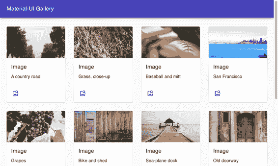
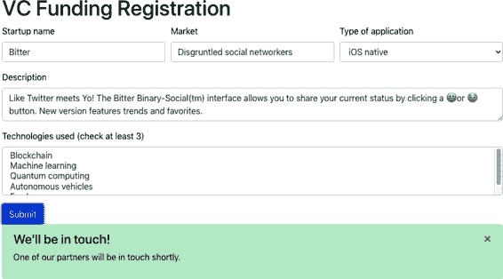
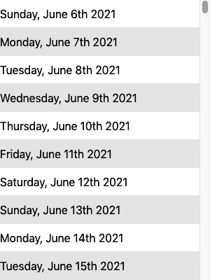
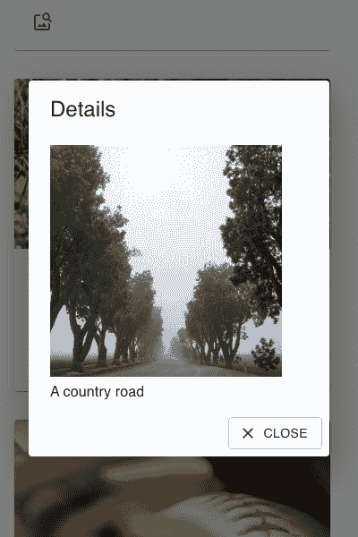
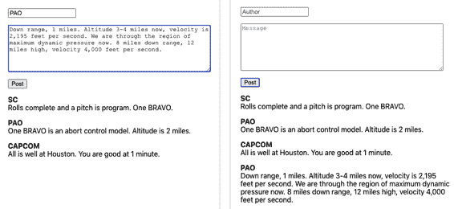
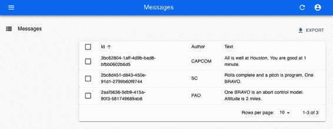
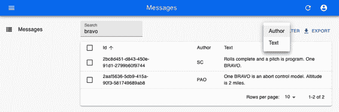
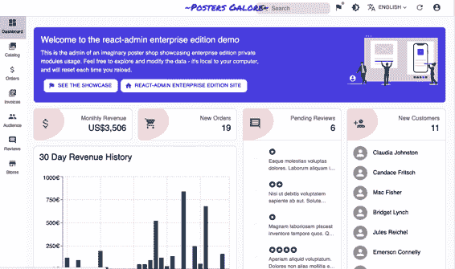
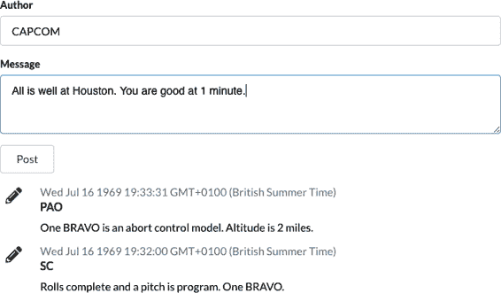

# 第六章：组件库

如果您正在构建任何大小的应用程序，则可能需要一个组件库。本机 HTML 支持的数据类型有些受限，并且实现可能因浏览器而异。例如，日期输入字段在 Chrome、Firefox 和 Edge 浏览器上看起来非常不同。

组件库允许您为应用程序创建一致的外观。在切换桌面和移动客户端时，它们通常能很好地适应。最重要的是，组件库通常会提升您的应用程序的可用性。它们要么是根据经过深入测试的设计标准生成的（如 Material Design），要么是多年来开发的。任何粗糙的地方通常都已经被修复了。

请注意：并不存在*完美*的组件库。它们各有优势和劣势，您需要选择一个最符合您需求的库。如果您有一个庞大的用户体验团队和一套健全的设计标准，您可能希望选择一个允许大量*微调*以适应公司主题的库。一个例子是 Material-UI，它允许您对其组件进行相当大的修改。如果您的用户体验团队很小或根本没有用户体验团队，您可能会考虑像 Semantic UI 这样的库，它简洁而功能齐全，并可以快速启动您的项目。

无论您选择哪个库，始终要记住用户体验中最重要的不是应用程序的外观，而是其行为。用户很快会忽略您添加到界面的任何花哨图形，但他们永远不会忘记（或原谅）每次使用时使他们感到烦恼的界面的某些部分。

# 使用 Material Design 与 Material-UI

## 问题

现在许多应用程序既可在 Web 上使用，也可作为移动设备上的原生应用程序使用。谷歌创建 Material Design 旨在在所有平台上提供无缝体验。如果您的用户也使用安卓手机或任何由谷歌创建的产品，Material Design 对他们来说会很熟悉。Material Design 只是一个规范，有几种可用的实现。其中一种是 React 的 Material-UI 库。但是，使用 Material-UI 的步骤是什么，如何安装呢？

## 解决方案

让我们从安装核心 Material-UI 库开始：

```
$ npm install @material-ui/core
```

核心库包含主要组件，但遗漏了一个显著的功能：标准字体。为了使 Material-UI 在原生移动应用程序中感觉相同，您还应安装谷歌的 Roboto 字体：

```
$ npm install fontsource-roboto
```

Material Design 还规定了一组大量的标准图标。这些图标为标准任务（如编辑任务、创建新项目、共享内容等）提供了共同的视觉语言。为了使用这些图标的高质量版本，您还应安装 Material-UI 图标库：

```
$ npm install @material-ui/icons
```

现在我们已经准备好使用 Material-UI 了，我们可以做些什么呢？我们不能在这里详细查看所有可用的组件，但我们将看一些更流行的功能^(1)。

我们将从 Material-UI 内部样式的基础开始。为了确保 Material-UI 组件在不同的浏览器中看起来相同，它们包括了一个`CssBaseline`组件，它将规范应用程序的基本样式。它将删除边距并应用标准的背景颜色。您应该在应用程序的开头附近添加一个`CssBaseline`组件。例如，如果您使用的是`create-react-app`，您可能应该将其添加到您的*App.js*中：

```
import CssBaseline from '@material-ui/core/CssBaseline'
...

function App() {
  // ...

  return (
    <div className="App">
      <CssBaseline />
      ...
    </div>
  )
}

export default App
```

接下来，我们将看一下 Material Design 的`AppBar`和`Toolbar`组件。这些提供了大多数 Material Design 应用程序中看到的标准标题，也是其他功能（如汉堡菜单和抽屉面板）将出现的地方。

我们将在屏幕顶部放置一个`AppBar`，并在其中放置一个`Toolbar`。这将让我们看看 Material-UI 内部如何处理排版：

```
<div className="App">
    <CssBaseline/>
    <AppBar position='relative'>
        <Toolbar>
            <Typography component='h1' variant='h6' color='inherit' noWrap>
                Material-UI Gallery
            </Typography>
        </Toolbar>
    </AppBar>
    <main>
      {/* Main content goes here...*/}
    </main>
</div>
```

虽然您可以在 Material-UI 应用程序中插入普通文本内容，但通常最好在`Typography`内显示它。`Typography`组件将确保文本符合 Material Design 标准。我们还可以使用它在适当的标记元素内显示文本。在这种情况下，我们将在`Toolbar`中将文本显示为`h1`元素。这就是`Typography` `component`属性指定的：应用于包装文本的 HTML 元素。然而，我们也可以告诉 Material-UI 将文本*样式*设定为`h6`标题。这将使其稍小，作为页面标题时不会过于突出。

接下来，让我们看一下 Material-UI 如何处理输出的样式。它使用*主题*。主题是定义 CSS 样式层次结构的 JavaScript 对象。您可以集中定义主题，这使您可以控制应用程序的整体外观。

主题是可扩展的。我们将导入一个名为`makeStyles`的函数，它将允许我们创建默认主题的修改版本：

```
import { makeStyles } from '@material-ui/core/styles'
```

我们将使我们的示例应用程序显示一个图像库，因此我们将希望为图库项、描述等创建样式。我们可以使用`makeStyles`为这些不同的屏幕元素创建样式：

```
const useStyles = makeStyles((theme) => ({
  galleryGrid: {
    paddingTop: theme.spacing(4),
  },
  galleryItemDescription: {
    overflow: 'hidden',
    textOverflow: 'ellipsis',
    whiteSpace: 'nowrap',
  },
}))
```

在这个简化的示例中，我们扩展了基础主题以包含`galleryGrid`和`galleryItemDescription`类的样式。我们可以直接添加 CSS 属性，或者（在`galleryGrid`的`paddingTop`的情况下）我们可以引用当前主题中的某个值：在这种情况下是`theme.spacing(4)`。因此，我们可以将样式的某些部分推迟到一个集中的主题中，稍后可以更改它。

`makeStyles`返回的`useStyles`是一个钩子，它将生成一组 CSS 类，然后返回它们的名称，以便我们可以在组件内部引用它们。

例如，我们希望使用`Container`和`Grid`组件显示图像网格。^(2) 我们可以像这样从主题中为它们附加样式：

```
const classes = useStyles()

return (
  <div className="App">
    ...
    <main>
      <Container className={classes.galleryGrid}>
        <Grid container spacing="4">
          <Grid item>...</Grid>
          <Grid item>...</Grid>
          ...
        </Grid>
      </Container>
    </main>
  </div>
)
```

每个`Grid`组件都是一个*容器*或一个*项目*。我们将在每个项目中显示一个图库图像。

在 Material Design 中，我们将重要的项目显示在卡片内。*卡片*是一个矩形面板，看起来略高于背景浮动。如果你曾经使用过 Google Play Store，你会看到卡片用于显示应用程序、音乐曲目或其他你想要下载的内容。我们将在每个`Grid`项目中放置一个卡片，并用它来显示预览、文本描述和一个按钮，该按钮可以显示图像的更详细版本。你可以在示例应用程序中查看这些卡片，如图 6-1 所示。



###### 图 6-1。卡片位于网格项目内，而这些网格项目则位于容器内

Material-UI 还对对话窗口有着广泛的支持。这里是一个自定义对话框的例子：

```
import Dialog from '@material-ui/core/Dialog'
import DialogTitle from '@material-ui/core/DialogTitle'
import Typography from '@material-ui/core/Typography'
import DialogContent from '@material-ui/core/DialogContent'
import DialogActions from '@material-ui/core/DialogActions'
import Button from '@material-ui/core/Button'
import CloseIcon from '@material-ui/icons/Close'

const MyDialog = ({ onClose, open, title, children }) => {
  return (
    <Dialog open={open} onClose={onClose}>
      <DialogTitle>
        <Typography
          component="h1"
          variant="h5"
          color="inherit"
          noWrap
        >
          {title}
        </Typography>
      </DialogTitle>
      <DialogContent>{children}</DialogContent>
      <DialogActions>
        <Button
          variant="outlined"
          startIcon={<CloseIcon />}
          onClick={onClose}
        >
          Close
        </Button>
      </DialogActions>
    </Dialog>
  )
}

export default MyDialog
```

注意，我们从之前安装的 Material-UI 图标库中导入了一个 SVG 图标。`DialogTitle`出现在对话框顶部。`DialogActions`是出现在对话框底部的按钮。你可以在`DialogContent`中定义对话框的主体内容。

这里是*App.js*的完整代码：

```
import './App.css'
import CssBaseline from '@material-ui/core/CssBaseline'
import AppBar from '@material-ui/core/AppBar'
import { Toolbar } from '@material-ui/core'
import Container from '@material-ui/core/Container'
import Grid from '@material-ui/core/Grid'
import Card from '@material-ui/core/Card'
import CardMedia from '@material-ui/core/CardMedia'
import CardContent from '@material-ui/core/CardContent'
import CardActions from '@material-ui/core/CardActions'
import Typography from '@material-ui/core/Typography'
import { makeStyles } from '@material-ui/core/styles'
import { useState } from 'react'
import MyDialog from './MyDialog'
import ImageSearchIcon from '@material-ui/icons/ImageSearch'

import gallery from './gallery.json'
import IconButton from '@material-ui/core/IconButton'

const useStyles = makeStyles((theme) => ({
  galleryGrid: {
    paddingTop: theme.spacing(4),
  },
  galleryItem: {
    height: '100%',
    display: 'flex',
    flexDirection: 'column',
    // maxWidth: '200px'
  },
  galleryImage: {
    paddingTop: '54%',
  },
  galleryItemDescription: {
    overflow: 'hidden',
    textOverflow: 'ellipsis',
    whiteSpace: 'nowrap',
  },
}))

function App() {
  const [showDetails, setShowDetails] = useState(false)
  const [selectedImage, setSelectedImage] = useState()
  const classes = useStyles()

  return (
    <div className="App">
      <CssBaseline />
      <AppBar position="relative">
        <Toolbar>
          <Typography
            component="h1"
            variant="h6"
            color="inherit"
            noWrap
          >
            Material-UI Gallery
          </Typography>
        </Toolbar>
      </AppBar>
      <main>
        <Container className={classes.galleryGrid}>
          <Grid container spacing="4">
            {gallery.map((item, i) => {
              return (
                <Grid item key={`photo-${i}`} xs={12} sm={3} lg={2}>
                  <Card className={classes.galleryItem}>
                    <CardMedia
                      image={item.image}
                      className={classes.galleryImage}
                      title="A photo"
                    />
                    <CardContent>
                      <Typography
                        gutterBottom
                        variant="h6"
                        component="h2"
                      >
                        Image
                      </Typography>
                      <Typography
                        className={classes.galleryItemDescription}
                      >
                        {item.description}
                      </Typography>
                    </CardContent>
                    <CardActions>
                      <IconButton
                        aria-label="delete"
                        onClick={() => {
                          setSelectedImage(item)
                          setShowDetails(true)
                        }}
                        color="primary"
                      >
                        <ImageSearchIcon />
                      </IconButton>
                    </CardActions>
                  </Card>
                </Grid>
              )
            })}
          </Grid>
        </Container>
      </main>
      <MyDialog
        open={showDetails}
        title="Details"
        onClose={() => setShowDetails(false)}
      >
        
        <Typography>
          {selectedImage && selectedImage.description}
        </Typography>
      </MyDialog>
    </div>
  )
}

export default App
```

## 讨论

Material-UI 是一个非常好用的库，也是当前与 React 一起使用最广泛的库之一。使用你的应用程序的用户几乎肯定在其他地方也用过它，这将增加你的应用程序的可用性。在开始在你的应用程序中使用 Material-UI 之前，值得花一些时间了解[Material Design 原则](https://oreil.ly/Jlk7w)。这样，你将创建一个不仅外观吸引人，而且易于使用和[可访问](https://oreil.ly/RJiW1)的应用程序。

你可以从[GitHub 网站](https://oreil.ly/TqVFz)下载此示例的源代码。

# 使用 React Bootstrap 创建一个简单的 UI

## 问题

过去 10 年中最流行的 CSS 库可能是 Twitter 的 Bootstrap 库。如果你正在创建一个新应用程序，且没有太多时间去定制 UI，只是想要一个易于使用且对大多数用户来说很熟悉的东西，那 Bootstrap 也是一个不错的选择。

但是 Bootstrap 出现在像 React 这样的框架之前。Bootstrap 包含了用于包含少量手工客户端代码的网页的 CSS 资源和一组 JavaScript 库。基础的 Bootstrap 库与像 React 这样的框架不兼容。

当你创建一个 React 应用程序时，你如何使用 Bootstrap？

## 解决方案

有几个 Bootstrap 库的端口可以与 React 一起使用。在这个示例中，我们将看看 React Bootstrap。React Bootstrap 与标准的 Bootstrap CSS 库一起工作，但它扩展了 Bootstrap JavaScript，使其更加适合 React 使用。

让我们首先安装 React Bootstrap 组件和 Bootstrap JavaScript 库：

```
$ npm install react-bootstrap bootstrap
```

React Bootstrap 库本身不包含任何 CSS 样式。你需要自己包含一份副本。最常见的方法是在你的 HTML 文件中从内容分发网络（CDN）下载它。例如，如果你使用 `create-react-app`，你应该在你的 *public/index.html* 文件中包含类似以下的内容：

```
<link
  rel="stylesheet"
  href="https://maxcdn.bootstrapcdn.com/bootstrap/4.5.0/css/bootstrap.min.css"
  integrity="sha384-9aIt2nRpC12Uk9gS9baDl411NQApFmC26EwAOH8WgZl5MYYxFfc+NcPb1dKG"
  crossorigin="anonymous"
/>
```

你应该使用可用的最新稳定版本的 Bootstrap 替换它。你需要手动管理 Bootstrap 的版本；当你升级 JavaScript 库时，它不会自动更新。

Bootstrap 是一个很好的通用库，但它对表单的支持特别强大。良好的表单布局可能需要时间并且可能很繁琐。Bootstrap 为你处理了所有艰难的工作，允许你专注于表单的功能。例如，React Bootstrap 的 `Form` 组件包含几乎你创建表单所需的一切。`Form.Control` 组件默认会生成一个 `input`。`Form.Label` 会生成一个 `label`，`Form.Group` 会将它们关联起来并适当地布局：

```
<Form.Group controlId="startupName">
    <Form.Label>Startup name</Form.Label>
    <Form.Control placeholder="No names ending in ...ly, please"/>
</Form.Group>
```

表单字段通常显示在一行上并占用可用宽度。如果你想要一行上显示多个字段，那么你可以使用 `Form.Row`：

```
<Form.Row>
    <Form.Group as={Col} controlId="startupName">
        <Form.Label>Startup name</Form.Label>
        <Form.Control placeholder="No names ending in ...ly, please"/>
    </Form.Group>
    <Form.Group as={Col} controlId="market">
        <Form.Label>Market</Form.Label>
        <Form.Control placeholder="e.g. seniors on Tik-Tok"/>
    </Form.Group>
</Form.Row>
```

`Col` 组件确保标签和字段的大小适当。如果你想要一个不是 `input` 的表单字段，你可以使用 `as` 属性：

```
<Form.Control as="select" defaultValue="Choose...">
    <option>Progressive web application</option>
    <option>Conservative web application</option>
    <option>Android native</option>
    <option>iOS native</option>
    <option>New Jersey native</option>
    <option>VT220</option>
</Form.Control>
```

这将生成一个 Bootstrap 样式的 `select` 元素。

将所有内容放在一起，就得到了你可以在图 6-2 中看到的表单：

```
import Form from 'react-bootstrap/Form'
import Col from 'react-bootstrap/Col'
import Button from 'react-bootstrap/Button'
import Alert from 'react-bootstrap/Alert'
import { useState } from 'react'
import './App.css'

function App() {
  const [submitted, setSubmitted] = useState(false)

  return (
    <div className="App">
      <h1>VC Funding Registration</h1>
      <Form>
        <Form.Row>
          <Form.Group as={Col} controlId="startupName">
            <Form.Label>Startup name</Form.Label>
            <Form.Control placeholder="No names ending in ...ly, please" />
          </Form.Group>
          <Form.Group as={Col} controlId="market">
            <Form.Label>Market</Form.Label>
            <Form.Control placeholder="e.g. seniors on Tik-Tok" />
          </Form.Group>
          <Form.Group as={Col} controlId="appType">
            <Form.Label>Type of application</Form.Label>
            <Form.Control as="select" defaultValue="Choose...">
              <option>Progressive web application</option>
              <option>Conservative web application</option>
              <option>Android native</option>
              <option>iOS native</option>
              <option>New Jersey native</option>
              <option>VT220</option>
            </Form.Control>
          </Form.Group>
        </Form.Row>

        <Form.Row>
          <Form.Group as={Col} controlId="description">
            <Form.Label>Description</Form.Label>
            <Form.Control as="textarea" />
          </Form.Group>
        </Form.Row>

        <Form.Group id="technologiesUsed">
          <Form.Label>
            Technologies used (check at least 3)
          </Form.Label>
          <Form.Control as="select" multiple>
            <option>Blockchain</option>
            <option>Machine learning</option>
            <option>Quantum computing</option>
            <option>Autonomous vehicles</option>
            <option>For-loops</option>
          </Form.Control>
        </Form.Group>

        <Button variant="primary" onClick={() => setSubmitted(true)}>
          Submit
        </Button>
      </Form>
      <Alert
        show={submitted}
        variant="success"
        onClose={() => setSubmitted(false)}
        dismissible
      >
        <Alert.Heading>We'll be in touch!</Alert.Heading>
        <p>One of our partners will be in touch shortly.</p>
      </Alert>
    </div>
  )
}

export default App
```



###### 图 6-2\. 一个 React 引导表单和警告框

## 讨论

Bootstrap 是一个比 Material Design 更早的 UI 工具包，但仍然有市场认为它更合适。如果你正在构建一个需要更像传统网站的应用程序，那么 Bootstrap 将赋予它更传统的感觉。如果你想构建更像跨平台应用程序的东西，你应该考虑 Material-UI。^(3)

你可以从[GitHub 网站](https://oreil.ly/ZpzF3)下载这个示例的源代码。

# 使用 React Window 查看数据集

## 问题

一些应用程序需要显示看似无穷的数据量。如果你正在开发像 Twitter 这样的应用程序，你不希望下载用户时间轴上的所有推文，因为这可能需要几个小时、几天或几个月的时间。解决方案是*窗口化*数据。当你窗口化一个项目列表时，你只保留当前显示的项目在内存中。当你向上或向下滚动时，应用程序会下载当前视图所需的数据。

但是创建这种窗口逻辑是相当复杂的。它不仅涉及对当前可见内容的精确跟踪，^(4) 而且如果未能有效缓存窗口数据，可能会很快遇到内存问题。

在 React 应用程序中如何实现窗口代码？

## 解决方案

React Window 库是一组用于需要滚动大量数据的应用程序的组件。我们将看看如何创建一个大型、固定大小的列表。^(5)

首先，我们需要创建一个组件，用于显示单个项目的详细信息。在我们的示例应用程序中，我们将创建一组 10,000 个日期字符串。我们将使用一个名为 `DateRow` 的组件来渲染每个日期，这将是我们的项目渲染器。React Window 通过仅渲染当前视口中可见的项目来工作。当用户向上或向下滚动列表时，它会在项目进入视图时创建新项目，并在项目消失时将其移除。

当 React Window 调用一个项目渲染器时，它会传递两个属性：一个项目编号（从 0 开始），以及一个样式对象。

这是我们的 `DateRow` 项渲染器：

```
import moment from 'moment'

const DateRow = ({ index, style }) => (
  <div className={`aDate ${index % 2 && 'aDate-odd'}`} style={style}>
    {moment().add(index, 'd').format('dddd, MMMM Do YYYY')}
  </div>
)

export default DateRow
```

此组件会计算未来 `index` 天的日期。在一个更实际的应用程序中，此组件可能会从后端服务器下载一个数据项。

要生成列表本身，我们将使用 `FixedSizeList`。我们需要给列表一个固定的宽度和高度。React Window 通过列表的高度和每个项目的高度来计算可见项目的数量，使用 `itemSize` 属性的值。如果 `height` 是 400，`itemHeight` 是 40，那么列表只需要显示 10 或 11 个 `DateRow` 组件（见 Figure 6-3）。

这是代码的最终版本。请注意，`FixedSizeList` 不包括 `DateRow` 组件的实例。这是因为它想要使用 `DateRow` 函数动态创建多个项目，当我们滚动列表时。因此，它使用 `{DateRow}` 函数本身，而不是使用 `<DateRow/>`。

```
import { FixedSizeList } from 'react-window'
import DateRow from './DateRow'
import './App.css'

function App() {
  return (
    <div className="App">
      <FixedSizeList
        height={400}
        itemCount={10000}
        itemSize={40}
        width={300}
      >
        {DateRow}
      </FixedSizeList>
    </div>
  )
}

export default App
```



###### 图 6-3\. 列表仅包含可见项目

还有一个需要注意的细节是，由于项目会动态添加到列表中并从列表中移除，因此在 CSS 中使用 `nth-child` 选择器时需要小心：

```
.aDate:nth-child(even) { /* This won't work */
    background-color: #eee;
}
```

相反，您需要动态检查项目的当前索引，并使用一些模数-2 数学来检查它是否为奇数，就像我们在示例中所做的那样：

```
<div className={`aDate ${index % 2 && 'aDate-odd'}`} ...>
```

## 讨论

React Window 是一个专注于组件库，但如果您需要展示大量数据集，则非常有价值。在列表中显示的数据的下载和缓存仍由您负责，但与 React Window 执行的窗口处理相比，这是一个相对简单的任务。

您可以从 [GitHub 网站](https://oreil.ly/lXxv3) 下载此示例的源代码。

# 使用 Material-UI 创建响应式对话框

## 问题

如果您使用一个组件库，很有可能会在某个时候显示对话框窗口。对话框允许您添加 UI 细节，而不让用户感觉他们正在切换到另一页。它们非常适合内容创建或快速显示有关项目的详细信息。

然而，对话框在移动设备上的表现不佳。移动设备有一个小的显示屏，并且对话框通常会浪费大量空间来显示背景页面的边缘。

如何创建响应式对话框，在桌面机器上像浮动窗口一样运行，但在移动设备上看起来像单独的全屏页面？

## 解决方案

Material-UI 库包含一个高阶函数，可以判断您是否在移动设备上，并将对话框显示为全屏窗口：

```
import { withMobileDialog } from '@material-ui/core'
...

const ResponsiveDialog = withMobileDialog()(
  ({ fullScreen }) => {
    // Return some component using the fullScreen (true/false) property
  }
)
```

`withMobileDialog` 使其包装的任何组件都有一个额外的属性称为 `fullScreen`，它设置为 `true` 或 `false`。`Dialog` 组件可以使用此属性来更改其行为。如果像这样传递 `fullScreen` 给 `Dialog`：

```
import { withMobileDialog } from '@material-ui/core'
import Dialog from '@material-ui/core/Dialog'
import DialogTitle from '@material-ui/core/DialogTitle'
import Typography from '@material-ui/core/Typography'
import DialogContent from '@material-ui/core/DialogContent'
import DialogActions from '@material-ui/core/DialogActions'
import Button from '@material-ui/core/Button'
import CloseIcon from '@material-ui/icons/Close'

const ResponsiveDialog = withMobileDialog()(
  ({ onClose, open, title, fullScreen, children }) => {
    return (
      <Dialog open={open} fullScreen={fullScreen} onClose={onClose}>
        <DialogTitle>
          <Typography
            component="h1"
            variant="h5"
            color="inherit"
            noWrap
          >
            {title}
          </Typography>
        </DialogTitle>
        <DialogContent>{children}</DialogContent>
        <DialogActions>
          <Button
            variant="outlined"
            startIcon={<CloseIcon />}
            onClick={onClose}
          >
            Close
          </Button>
        </DialogActions>
      </Dialog>
    )
  }
)

export default ResponsiveDialog
```

当在移动设备或桌面设备上运行时，对话框将更改其行为。

假设我们修改了在 “将网络调用转换为钩子” 中创建的应用程序。在我们原始的应用程序中，当用户点击画廊中的图像时会出现对话框。在移动设备上，对话框如 图 6-4 所示。



###### 图 6-4\. 在移动设备上，默认情况下，对话框周围有空间

如果您用 `ResponsiveDialog` 替换此对话框，在大屏幕上看起来是一样的。但在小屏幕上，对话框将填满显示屏，就像您在 图 6-5 中看到的那样。这不仅为对话框内容提供了更多空间，还简化了移动用户的体验。它不再像弹出窗口一样工作，而更像是一个独立的页面。


###### 图 6-5\. 在移动设备上，响应式对话框填满了屏幕

## 讨论

关于如何处理响应式界面的更多想法，请参见 “创建具有响应路由的界面”。

您可以从 [GitHub 站点](https://oreil.ly/836i2) 下载此示例的源代码。

# 使用 React Admin 构建管理控制台

## 问题

开发人员通常会花费很长时间来创建和维护终端用户应用程序，以至于一个重要的任务经常被忽视：管理控制台。客户不使用管理控制台；它们被后台工作人员和管理员用来查看当前数据集，并调查和解决应用程序中的数据问题。一些数据存储系统如 [Firebase](https://oreil.ly/ugvEI) 内置了相当先进的管理控制台。但对于大多数后端服务来说并非如此。相反，开发人员通常不得不直接访问位于多层云基础设施后面的数据库来解决数据问题。

如何为几乎任何 React 应用程序创建管理控制台？

## 解决方案

我们将研究 React Admin，尽管本章是关于组件库，但 React Admin 包含的内容远不止组件。它是一个应用程序框架，可以轻松构建界面，允许管理员查看和维护应用程序中的数据。

不同的应用程序将使用不同的网络服务层。它们可能使用 REST、GraphQL 或其他许多系统之一。但在大多数情况下，数据是作为在服务器上保存的一组资源进行访问的。React Admin 已经准备好大部分组件，用于创建一个管理员应用程序，使您能够浏览每个资源。它允许您创建、维护和搜索数据。它还可以将数据导出到外部应用程序。

为了展示`react-admin`的工作原理，我们将为我们在第五章中创建的消息板应用程序创建一个管理控制台（参见图 6-6）。



###### 图 6-6。原始留言板应用程序

应用程序的后端是一个简单的 GraphQL 服务器。GraphQL 服务器具有相对简单的模式，类似于这样定义消息的模式语言：

```
type Message {
    id: ID!
    author: String!
    text: String!
}
```

每条消息都有一个唯一的`id`。字符串记录消息的文本和作者的姓名。

用户只能对数据做一种类型的更改：他们可以添加一条消息。他们可以运行一种类型的查询：他们可以读取所有消息。

要创建一个`react-admin`应用程序，首先需要创建一个新的 React 应用程序，然后安装`react-admin`库：

```
$ npm install react-admin
```

这个库的主要组件称为`Admin`。这将构成我们整个应用程序的框架：

```
<Admin dataProvider={...}>
  ...UI for separate resources goes here...
</Admin>
```

`Admin`组件需要一个数据提供程序。数据提供程序是一个适配器，将应用程序连接到后端服务。我们的后端服务使用 GraphQL，因此我们需要一个 GraphQL 数据提供程序：

```
$ npm install graphql
$ npm install ra-data-graphql-simple
```

大多数后端服务都有可用的数据提供程序。有关详细信息，请参阅[React Admin 网站](https://oreil.ly/2qtVY)。我们需要在使用数据提供程序之前初始化我们的数据提供程序。GraphQL 配置了一个异步的`buildGraphQLProvider`函数，因此在使用它之前我们需要确保它已经准备就绪：

```
import { Admin } from 'react-admin'
import buildGraphQLProvider from 'ra-data-graphql-simple'
import { useEffect, useState } from 'react'

function App() {
  const [dataProvider, setDataProvider] = useState()

  useEffect(() => {
    let didCancel = false
    ;(async () => {
      const dp = await buildGraphQLProvider({
        clientOptions: { uri: 'http://localhost:5000' },
      })
      if (!didCancel) {
        setDataProvider(() => dp)
      }
    })()
    return () => {
      didCancel = true
    }
  }, [])

  return (
    <div className="App">
      {dataProvider && (
        <Admin dataProvider={dataProvider}>
          ...resource UI here...
        </Admin>
      )}
    </div>
  )
}

export default App
```

数据提供程序连接到运行在 5000 端口上的 GraphQL 服务器。^(6) 数据提供程序将首先下载应用程序的模式，这将告诉它有哪些资源（在我们的情况下只有一个资源`Messages`）可用以及可以在这些资源上执行哪些操作。

如果现在尝试运行应用程序，它将不会执行任何操作。这是因为即使它知道服务器上有一个`Messages`资源，它也不知道我们想对其执行任何操作。所以，让我们将`Messages`资源添加到应用程序中。

如果我们希望应用程序列出服务器上的所有消息，我们需要创建一个名为`ListMessages`的简单组件。这将使用`react-admin`中的一些现成组件来构建其界面：

```
const ListMessages = (props) => {
  return (
    <List {...props}>
      <Datagrid>
        <TextField source="id" />
        <TextField source="author" />
        <TextField source="text" />
      </Datagrid>
    </List>
  )
}
```

这将创建一个包含消息`id`、`author`和`text`列的表。现在，我们可以通过将`Resource`传递给`Admin`组件来告知管理员系统有关新组件的信息：

```
<Admin dataProvider={dataProvider}>
    <Resource name="Message" list={ListMessages}/>
</Admin>
```

`Admin`组件将查看新的`Resource`，联系服务器以读取消息，然后使用`ListMessages`组件呈现它们（见图 6-7）。



###### 图 6-7\. 显示来自服务器的消息

屏幕更新似乎像魔术一样工作，但这是因为服务器必须遵循某些约定，以便 GraphQL 适配器知道调用哪个服务。在这种情况下，它将找到一个名为`allMessages`的查询，该查询返回消息：

```
type Query {
    Message(id: ID!): Message
    allMessages(page: Int, perPage: Int,
        sortField: String, sortOrder: String,
        filter: MessageFilter): [Message]
}
```

因此，您可能需要更改后端 API 以满足数据提供者的要求。然而，您添加的服务可能会在主应用程序中非常有用。

`allMessages`查询允许管理员界面从服务器分页获取数据。它可以接受一个名为`filter`的属性，用于搜索数据。示例模式中的`MessageFilter`将允许管理员控制台查找包含`author`和`text`字符串的消息。它还允许管理员控制台发送通用搜索字符串（`q`），用于查找包含任何字段中字符串的消息。

下面是`MessageFilter`对象的 GraphQL 模式定义。您需要为应用程序中的每个资源创建类似的内容：

```
input MessageFilter {
    q: String
    author: String
    text: String
}
```

为了在前端实现过滤和搜索功能，我们首先需要在一个名为`MessageFilter`的 React 组件中创建一些过滤字段。这与架构中的`MessageFilter`有很大区别，尽管您会注意到它包含匹配字段：

```
const MessageFilter = (props) => (
  <Filter {...props}>
    <TextInput label="Author" source="author" />
    <TextInput label="Text" source="text" />
    <TextInput label="Search" source="q" alwaysOn />
  </Filter>
)
```

现在，我们可以将`MessageFilter`添加到`ListMessages`组件中，突然间，我们发现可以在管理员控制台中进行分页、搜索和过滤消息（见图 6-8）：

```
const ListMessages = (props) => {
  return (
    <List {...props} filters={<MessageFilter />}>
      <Datagrid>
        <TextField source="id" />
        <TextField source="author" />
        <TextField source="text" />
      </Datagrid>
    </List>
  )
}
```



###### 图 6-8\. 按作者或文本过滤消息表

我们还可以通过添加`CreateMessage`组件来实现创建新消息的能力：

```
const CreateMessage = (props) => {
  return (
    <Create title="Create a Message" {...props}>
      <SimpleForm>
        <TextInput source="author" />
        <TextInput multiline source="text" />
      </SimpleForm>
    </Create>
  )
}
```

然后将`CreateMessage`组件添加到`Resource`中（见图 6-9）：

```
<Resource name="Message" list={ListMessages} create={CreateMessage}/>
```


###### 图 6-9\. 在控制台上创建消息

GraphQL 数据提供程序将通过将`CreateMessage`表单的内容传递给名为`CreateMessage`的变化来创建消息：

```
type Mutation {
    createMessage(
        author: String!
        text: String!
    ): Message
}
```

同样地，您可以添加更新或删除消息的功能。如果您的模式复杂并且包含子资源，`react-admin`可以在表格内显示子项。它还可以处理不同的显示类型。它可以显示图像和链接。有可用的组件可以在日历或图表上显示资源（参见图 6-10 来自[在线演示应用程序](https://oreil.ly/fmFwR)的示例）。^(7) 管理控制台还可以与现有的安全系统配合使用。



###### 图 6-10\. 在线演示中的不同视图类型

## 讨论

虽然您必须对后端服务进行一些额外的更改，以使`react-admin`适合您的应用，但这些额外的服务极有可能对您的主要应用程序也有帮助。即使它们没有，`react-admin`提供的构建模块也很可能大大减少创建后台系统所需的开发时间。

你可以从[GitHub 站点](https://oreil.ly/2sUhp)下载此配方的源代码。

# 没有设计师？使用 Semantic UI

## 问题

设计良好的样式可以为应用程序增添很多视觉吸引力。但糟糕的样式可能会使一个好的应用程序看起来廉价和业余。许多开发者在设计方面的感知有限。^(8) 在您几乎没有或没有专业设计帮助的情况下，一个简单、清晰的 UI 组件库可以让您专注于应用程序的功能，而不必花费无数小时调整按钮和边框的位置。

经过试验的框架如 Bootstrap 可以为大多数应用程序提供一个良好的、无光泽的基础。^(9) 但即使是它们通常也需要大量关注视觉外观。如果您希望专注于应用程序的功能并希望获得清晰的功能视觉外观，那么 Semantic UI 库是一个不错的选择。

但 Semantic UI 库很老，来自 jQuery 统治的时代。在撰写本文时，它已经超过两年没有更新了。如果您想在 React 中使用像 Semantic UI 这样可靠和成熟的库，该怎么办？

## 解决方案

Semantic UI React 库是一个包装器，使 Semantic UI 库可用于 React 用户。

顾名思义，Semantic UI 侧重于界面的含义。您可以通过 CSS 管理其视觉外观，而不是组件。相反，Semantic UI 组件侧重于功能性。例如，当您创建一个表单时，您说要包括哪些字段，而不是关于它们布局的任何内容。这导致了干净、一致的外观，几乎不需要任何视觉调整。

要开始使用，让我们安装 Semantic 库及其样式支持：

```
$ npm install semantic-ui-react semantic-ui-css
```

此外，我们还需要在应用程序的*index.js*文件中包含对样式表的引用：

```
import React from 'react'
import ReactDOM from 'react-dom'
import './index.css'
import App from './App'
import reportWebVitals from './reportWebVitals'
import 'semantic-ui-css/semantic.min.css'

ReactDOM.render(
  <React.StrictMode>
    <App />
  </React.StrictMode>,
  document.getElementById('root')
)

// If you want to start measuring performance in your app, pass a function
// to log results (for example: reportWebVitals(console.log))
// or send to an analytics endpoint. Learn more: https://bit.ly/CRA-vitals
reportWebVitals()
```

我们将重新创建我们的消息发布应用程序。我们需要一个包含作者姓名文本字段和发布消息文本区域的表单。语义化组件旨在尽可能与简单的 HTML 元素相似。因此，如果我们构建一个表单，我们将导入`Form`、`Input`、`TextArea`和`Button`来发布消息：

```
import { Button, Form, Input, TextArea } from 'semantic-ui-react'
import './App.css'
import { useState } from 'react'

function App() {
  const [author, setAuthor] = useState('')
  const [text, setText] = useState('')
  const [messages, setMessages] = useState([])

  return (
    <div className="App">
      <Form>
        <Form.Field>
          <label htmlFor="author">Author</label>
          <Input
            value={author}
            id="author"
            onChange={(evt) => setAuthor(evt.target.value)}
          />
        </Form.Field>
        <Form.Field>
          <label htmlFor="text">Message</label>
          <TextArea
            value={text}
            id="text"
            onChange={(evt) => setText(evt.target.value)}
          />
        </Form.Field>
        <Button
          basic
          onClick={() => {
            setMessages((m) => [
              {
                icon: 'pencil',
                date: new Date().toString(),
                summary: author,
                extraText: text,
              },
              ...m,
            ])
            setAuthor('')
            setText('')
          }}
        >
          Post
        </Button>
      </Form>
    </div>
  )
}

export default App
```

这段代码应该感觉很熟悉。`Form`组件确实有一个`Field`助手，可以更轻松地组合标签和字段，但除此之外，代码看起来与基本的 HTML 表单类似。

在示例应用程序中，我们通过将消息添加到名为`messages`的数组中来“发布”消息。您可能已经注意到，我们是按照特定的对象结构将消息添加到数组中的：

```
setMessages((m) => [
  {
    icon: 'pencil',
    date: new Date().toString(),
    summary: author,
    extraText: text,
  },
  ...m,
])
```

我们并非出于偶然选择了这些属性。尽管语义化中的大多数组件都很简单，但也有一些更复杂的组件，这些组件旨在支持一些常见的用例。一个例子是`Feed`组件。`Feed`组件用于呈现社交消息流，例如您可能在 Twitter 或 Instagram 上看到的消息流。它将呈现一系列干净的消息，带有日期戳、标题、图标等等。包括`Feed`组件的最终代码如下所示：

```
import {
  Button,
  Form,
  Input,
  TextArea,
  Feed,
} from 'semantic-ui-react'
import './App.css'
import { useState } from 'react'

function App() {
  const [author, setAuthor] = useState('')
  const [text, setText] = useState('')
  const [messages, setMessages] = useState([])

  return (
    <div className="App">
      <Form>
        <Form.Field>
          <label htmlFor="author">Author</label>
          <Input
            value={author}
            id="author"
            onChange={(evt) => setAuthor(evt.target.value)}
          />
        </Form.Field>
        <Form.Field>
          <label htmlFor="text">Message</label>
          <TextArea
            value={text}
            id="text"
            onChange={(evt) => setText(evt.target.value)}
          />
        </Form.Field>
        <Button
          basic
          onClick={() => {
            setMessages((m) => [
              {
                icon: 'pencil',
                date: new Date().toString(),
                summary: author,
                extraText: text,
              },
              ...m,
            ])
            setAuthor('')
            setText('')
          }}
        >
          Post
        </Button>
      </Form>
      <Feed events={messages} />
    </div>
  )
}

export default App
```

当您运行应用程序时，界面干净简洁（请参阅图 6-11）。



###### 图 6-11\. Semantic UI 界面实例

## 讨论

Semantic UI 是一个老旧的库。但这并不是坏事。它经过了实战考验的界面既清晰又功能强大，是在没有视觉设计师支持的情况下快速启动和测试产品市场的最佳方式之一。如果您正在创建精益创业公司，并希望快速组合一些内容来测试产品是否有市场，它特别有用。^(10)

您可以从[GitHub 站点](https://oreil.ly/qeNqy)下载此示例的源代码。

^(1) 有关整个组件集的详细信息，请参阅[Material-UI 网站](https://material-ui.com)。

^(2) 有关这些组件的更多信息，请参阅[Material-UI 网站](https://material-ui.com)。

^(3) 查看更多信息，请参阅“将网络调用转换为 Hooks”。

^(4) 包括处理视口大小变化时发生的所有棘手边缘情况。

^(5) 您可以使用该库来处理可变大小和固定大小的列表和网格。详细信息请参阅[文档](https://oreil.ly/pCYaq)。

^(6) 您可以在本章的源代码中找到服务器。您可以通过输入**`node ./server.js`**来运行服务器。

^(7) 其中一些仅在您订阅企业版时才可用。

^(8) 包括至少一位作者...

^(9) 参见《使用 React Bootstrap 创建简单 UI》，了解如何在应用程序中使用 Bootstrap 的指导。

^(10) 更多详细信息，请参阅*《精益创业》*（Eric Ries 著，Crown Business 出版）。
