# 第七章：安全

在本章中，我们将探讨多种保护应用程序的方法。我们将看看将你的应用程序与标准安全系统集成的常见模式。我们将看看如何审计你的代码以解决几种常见的安全缺陷。在本章的几个示例中，我们将使用 WebAuthn API 将应用程序集成到安全设备（如指纹传感器和物理令牌）中。WebAuthn 是一种令人兴奋且未充分利用的技术，可以提高应用程序的安全性并增强用户体验。

# 安全请求，而不是路由。

## 问题

“创建安全路由” 展示了如何使用 React Router 创建安全路由。这意味着如果用户尝试访问应用程序中特定的路径，你可以强制他们在查看该页面内容之前提交登录表单。

当你首次构建应用程序时，安全路由方法是一个很好的、相当通用的方法。然而，有些应用程序并不容易落实到这种静态的安全模型中。有些页面将是安全的，有些将是不安全的。但在许多应用程序中，更容易保护数据服务而不是页面。重要的是你查看的不是哪个页面，而是你正在查看的数据。

所有这些复杂性通常在 API 层面定义起来很直接。但这种复杂性不应该在前端客户端的逻辑中重复。因此，将某些路由标记为安全的，而其他路由标记为不安全的这种简单方法是不够好的。

## 解决方案

如果仅将路由定义为安全或不安全不足以满足客户端的安全性要求，你可能需要考虑通过使用后端服务器接收到的安全响应来控制对你的应用程序的访问。

使用这种方法，你首先假设用户可以在你的应用中随处访问。你不需要担心安全路由和不安全路由。你只有路由。如果用户访问包含私人数据的路径，API 服务器会返回一个错误，通常是 HTTP 状态码 401（未授权）。当发生错误时，安全系统会将用户重定向到一个登录表单。

使用这种方法，API 服务器驱动的是什么是私有的、什么是公共的策略。如果安全策略发生变化，你只需要修改 API 服务器上的代码，而不需要更改客户端代码。

让我们再次看看原始安全路由示例的代码。在我们的应用程序中，我们注入了一个 `SecurityProvider`，它控制其所有子组件的安全性。在示例应用程序中，我们在 *App.js* 文件中实现这一点：

```
import './App.css'
import { BrowserRouter, Route, Switch } from 'react-router-dom'
import Public from './Public'
import Private1 from './Private1'
import Private2 from './Private2'
import Home from './Home'
import SecurityProvider from './SecurityProvider'
import SecureRoute from './SecureRoute'

function App() {
  return (
    <div className="App">
      <BrowserRouter>
        <SecurityProvider>
          <Switch>
            <Route exact path="/">
              <Home />
            </Route>
            <SecureRoute path="/private1">
              <Private1 />
            </SecureRoute>
            <SecureRoute path="/private2">
              <Private2 />
            </SecureRoute>
            <Route exact path="/public">
              <Public />
            </Route>
          </Switch>
        </SecurityProvider>
      </BrowserRouter>
    </div>
  )
}

export default App
```

你可以看到应用程序具有简单的 `Routes` 和 `SecuredRoutes`。如果未经认证的用户尝试访问安全路由，则会被重定向到登录表单，正如你在 图 7-1 中所看到的。

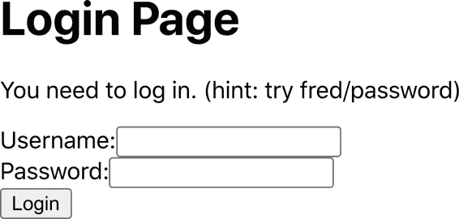

###### 图 7-1\. 当你首次访问一个安全路由时，会看到一个登录表单。

一旦他们登录（参见 Figure 7-2），他们可以访问安全内容。

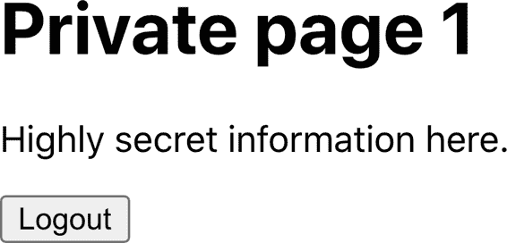

###### 图 7-2. 一旦您登录，安全路由就可见

如果我们想基于后端 API 的安全性来设计我们的安全性，我们将从所有`SecuredRoutes`替换为简单的`Routes`开始。应用程序只有在 API 服务器告诉它哪些数据是私有的和公共的时候才知道。对于本食谱中的示例应用程序，我们将在应用程序上有两个页面，这两个页面包含公开和私有数据的混合。交易页面将从服务器读取安全数据。优惠页面将从服务器读取不安全数据。以下是我们*App.js*文件的新版本：

```
import './App.css'
import { BrowserRouter, Route, Switch } from 'react-router-dom'
import Transactions from './Transactions'
import Offers from './Offers'
import Home from './Home'
import SecurityProvider from './SecurityProvider'

function App() {
  return (
    <div className="App">
      <BrowserRouter>
        <SecurityProvider>
          <Switch>
            <Route exact path="/">
              <Home />
            </Route>
            <Route exact path="/transactions">
              <Transactions />
            </Route>
            <Route exact path="/offers">
              <Offers />
            </Route>
          </Switch>
        </SecurityProvider>
      </BrowserRouter>
    </div>
  )
}

export default App
```

我们还需要对我们的`SecurityProvider`进行更改。在 API 安全模型中，客户端首先假设所有数据都是公开的，这与安全路由方法相反，后者假设您在登录前没有访问权限。

这意味着我们的新`SecurityProvider`必须将其初始登录状态默认为`true`：

```
import { useState } from 'react'
import SecurityContext from './SecurityContext'
import Login from './Login'
import axios from 'axios'

const SecurityProvider = (props) => {
  const [loggedIn, setLoggedIn] = useState(true)

  return (
    <SecurityContext.Provider
      value={{
        login: async (username, password) => {
          await axios.post('/api/login', { username, password })
          setLoggedIn(true)
        },
        logout: async () => {
          await axios.post('/api/logout')
          return setLoggedIn(false)
        },
        onFailure() {
          return setLoggedIn(false)
        },
        loggedIn,
      }}
    >
      {loggedIn ? props.children : <Login />}
    </SecurityContext.Provider>
  )
}

export default SecurityProvider
```

我们还进行了几项其他更改：

+   确定用户是否应该看到`Login`表单的代码现在位于`SecurityProvider`中。这段代码曾经存在于`SecuredRoute`组件内部，但现在我们将其集中显示。

+   我们用对后端服务调用*/api/login*和*/api/logout*取代了虚拟的用户名/密码检查。您应该根据您的系统应用程序替换这些内容。

+   `SecurityProvider`现在提供了一个名为`onFailure`的新函数，它简单地将人员标记为已登出。

当您调用此函数时，它会强制用户登录。如果我们不再使用安全路由，那么在什么时候进行安全检查？我们会在 API 调用本身中执行它们。

在真实的应用程序中，您可能需要添加处理无效登录尝试的代码。为了保持代码简洁，我们在这里省略了任何特殊处理。登录失败将简单地使您留在登录表单中，而没有任何错误消息。

让我们来看看我们新的*src/Transactions.js*定义的交易页面。该组件读取交易数据并在屏幕上显示：

```
import useTransactions from './useTransactions'

const Transactions = () => {
  const { data: transactions } = useTransactions()

  return (
    <div>
      <h1>Transactions</h1>
      <main>
        <table>
          <thead>
            <tr>
              <th>Date</th>
              <th>Amount</th>
              <th>Description</th>
            </tr>
          </thead>
          <tbody>
            {transactions &&
              transactions.map((trx) => (
                <tr>
                  <td>{trx.date}</td>
                  <td>{trx.amount}</td>
                  <td>{trx.description}</td>
                </tr>
              ))}
          </tbody>
        </table>
      </main>
    </div>
  )
}

export default Transactions
```

`useTransactions`钩子包含了从服务器读取数据的网络代码。在这个钩子内部，我们需要添加对来自服务器的 401（未经授权）响应的检查：

```
import { useEffect, useState } from 'react'
import axios from 'axios'
import useSecurity from './useSecurity'

const useTransactions = () => {
  const security = useSecurity()
  const [transactions, setTransactions] = useState([])

  useEffect(() => {
    ;(async () => {
      try {
        const result = await axios.get('/api/transactions')
        setTransactions(result.data)
      } catch (err) {
        const status = err.response && err.response.status
        if (status === 401) {
          security.onFailure()
        }
        // Handle other exceptions here (consider a shared
        // error handler -- see elsewhere in the book)
      }
    })()
  }, [])

  return { data: transactions }
}

export default useTransactions
```

在示例应用中，我们使用`axios`库联系服务器。`axios`处理 HTTP 错误，如`401`（未经授权的 HTTP 状态），将其作为异常处理。这使得处理意外响应的代码更加清晰。如果您使用不同的 API 标准，如 GraphQL，您可以通过检查 GraphQL 返回的错误对象的内容以类似的方式处理安全错误。

如果从服务器返回未授权响应，`useTransac⁠tions` 钩子会调用 `SecurityPro⁠vider` 中的 `onFailure` 函数。

我们将以相同方式构建“优惠”页面。*src/Offers.js* 组件将格式化来自服务器的 `offers` 数据：

```
import useOffers from './useOffers'

const Offers = () => {
  const { data: offers } = useOffers()

  return (
    <div>
      <h1>Offers</h1>
      <main>
        <ul>
          {offers &&
            offers.map((offer) => <li className="offer">{offer}</li>)}
        </ul>
      </main>
    </div>
  )
}

export default Offers
```

读取数据的代码位于 *src/useOffers.js* 钩子中：

```
import { useEffect, useState } from 'react'
import axios from 'axios'
import useSecurity from './useSecurity'

const useOffers = () => {
  const security = useSecurity()
  const [offers, setOffers] = useState([])

  useEffect(() => {
    ;(async () => {
      try {
        const result = await axios.get('/api/offers')
        setOffers(result.data)
      } catch (err) {
        const status = err.response && err.response.status
        if (status === 401) {
          security.onFailure()
        }
        // Handle other exceptions here (consider a shared
        // error handler -- see elsewhere in the book)
      }
    })()
  }, [])

  return { data: offers }
}

export default useOffers
```

即使 */api/offers* 端点未受保护，我们仍然有代码来检查安全错误。 API 安全方法的一个后果是，您必须把所有端点都视为安全的，以防它们未来变得安全。

让我们尝试我们的示例应用程序。我们将从打开首页开始（见 图 7-3）。

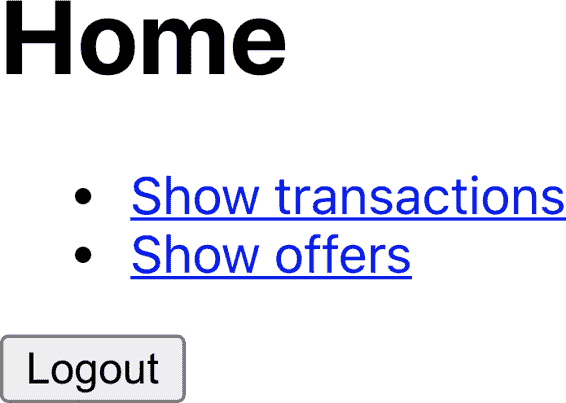

###### 图 7-3\. 应用程序的首页

如果我们点击“优惠”链接，我们可以看到从服务器读取的优惠内容（见 图 7-4）。这些数据未受保护，应用程序不要求我们登录。


###### 图 7-4\. 如果我们点击“优惠”链接，我们可以看到内容

如果现在我们返回首页并点击“交易”链接，应用程序会要求我们登录（见 图 7-5）。交易页面尝试从服务器下载交易数据，结果是 401（未授权）响应。代码捕获此异常并调用 `SecurityProvider` 中的 `onFailure` 函数，然后显示登录表单（见 图 7-5）。


###### 图 7-5\. 如果我们尝试访问“交易”页面，系统会要求我们登录

如果我们登录，应用程序将我们的用户名和密码发送到服务器。假设这不会导致错误，`SecurityProvider` 将隐藏登录表单，重新渲染“交易”页面，并且现在可以读取数据，因为我们已登录（见 图 7-6）。

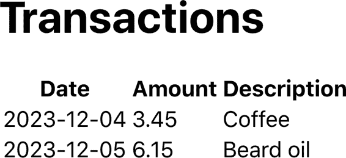

###### 图 7-6\. 一旦我们登录，我们可以看到“交易”页面

## 讨论

我们的示例应用现在没有任何内容表明哪些 API 是受保护的，哪些是不受保护的。服务器现在处理所有这些工作。 API 端点完全负责应用程序的安全性。

使用这种方法，您应该对所有 API 调用应用相同的安全处理。将 API 调用提取到自定义钩子中的一个好处是，这些钩子可以共享安全代码。钩子可以调用其他钩子，一个常见的方法是创建行为通用的 `GET` 和 `POST` 调用的钩子。^(1) 通用的 `GET` 钩子不仅可以处理访问失败，还可以包括请求取消、防抖（见第 5.3 和 5.6 章节），以及共享的错误处理（“构建集中式错误处理程序”）^(“ch04.xhtml#ch04-01”)。

采用安全 API 方法的另一个优点是，在某些情况下完全可以禁用安全性。例如，在开发过程中，可以取消开发人员需要配置身份提供者的需求。还可以选择在不同的部署中使用不同的安全配置。

最后，对于像 Cypress 这样的自动化测试系统，它可以模拟网络响应，您可以将应用程序功能的测试与非功能性安全性测试分开。建议使用额外的仅服务器安全性测试，以确保服务器本身的安全性。

你可以从[GitHub 站点](https://oreil.ly/ByWVZ)下载此配方的源代码。

# 使用物理令牌进行认证

## 问题

用户名和密码并不总是足够安全；它们可能被窃取或猜测。因此，一些用户可能只使用提供额外安全性的应用程序。

越来越多的系统现在提供**双因素认证**。双因素系统要求用户首先用表单登录，然后提供额外的信息。额外的信息可能是通过短信文本消息发送给他们的代码。或者可能是他们手机上的应用程序生成的一次性密码。或者，可能是最安全的，它可能涉及使用物理硬件设备，比如一个[YubiKey](https://www.yubico.com)，在需要时连接到计算机并按下。

这些物理令牌使用公钥密码学，为特定应用程序生成公钥并使用私钥加密字符串。应用程序可以向设备发送随机的“挑战”字符串，使用私钥生成签名。然后，应用程序可以使用公钥检查字符串是否被正确签名。

但是你如何将它们与你的 React 应用程序集成？

## 解决方案

*Web Authentication*（也称为*WebAuthn*）是一个广泛支持的^(2) W3C 标准，允许浏览器与物理设备（如 YubiKey）通信。

Web 认证中有两种*流程*。第一种称为*attestation*。在 attestation 期间，用户将安全设备注册到应用程序中。在*assertion*期间，用户可以验证其身份以登录系统。

首先，让我们看看 attestation。在这个流程中，用户会注册一个物理设备到他们的帐户。这意味着用户在 attestation 期间应始终保持登录状态。

此配方的代码包括一个虚拟的 Node 服务器，可以从应用程序中的*server*目录运行：

```
$ cd server
$ npm install
$ npm run start
```

Attestation 有三个步骤：

1.  服务器生成 attestation 请求，说明可以接受的设备类型。

1.  用户连接设备并激活它，可能通过按下设备上的按钮。

1.  设备生成响应，其中包括公钥，然后将其返回到服务器，在那里可以存储在用户的帐户中。

我们可以通过检查 `window.PublicKeyCredential` 的存在来判断浏览器是否支持 WebAuthn。如果存在，则可以继续。

在 */startRegister* 处有一个端点，该端点将在服务器上创建认证请求。因此，我们将首先调用该端点。

```
import axios from 'axios'
...
// Ask to start registering a physical token for the current user
const response = await axios.post('/startRegister')
```

这就是认证请求的外观：

```
{
    "rpName": "Physical Token Server",
    "rpID": "localhost",
    "userID": "1234",
    "userName": "freda",
    "excludeCredentials": [
        {"id": "existingKey1", "type": "public-key"}
    ],
    "authenticatorSelection": {
        "userVerification": "discouraged"
    },
    "extensions": {
        "credProps": true
    }
}
```

一些属性以 `rp...` 开头，表示*依赖方*。依赖方是生成请求的应用程序。

`rpName` 是一个描述应用程序的自由格式文本字符串。应将 `rpId` 设置为当前域名。在这里，它是 `localhost`，因为我们正在运行开发服务器。`userID` 是一个唯一标识用户的字符串。`userName` 是用户的名称。

`excludeCredentials` 是一个有趣的属性。用户可能会将多个设备记录到其帐户中。该值列出已记录的设备，以避免用户注册相同的设备两次。如果尝试多次注册同一设备，则浏览器将立即抛出异常，指出设备已在其他地方注册。

`authenticatorSelection` 允许您设置各种选项，用于在用户激活其设备时需要执行的操作。在这里，我们将 `userVerification` 设置为 `false`，以防止用户在激活其设备时执行任何额外的步骤（如输入 PIN 码）。因此，当要求用户插入其设备时，用户将其插入 USB 插槽并按下按钮，无需执行其他操作。

`credProps` 扩展请求设备返回附加的凭证属性，这可能对服务器有所帮助。

一旦服务器生成了认证请求，我们需要要求用户连接其安全设备。我们使用一个名为的浏览器函数进行此操作：

```
navigator.credentials.create()
```

`create` 函数接受一个认证请求对象。不幸的是，对象内的数据需要采用各种低级二进制形式，如字节数组。我们可以通过从 GitHub 安装名为 `webauthn-json` 的库来显著简化我们的工作，该库允许您使用 JSON 指定请求：

```
$ npm install "@github/webauthn-json"
```

然后，我们可以将 WebAuthn 请求的内容传递给 GitHub 版本的 `create` 函数：

```
import { create } from '@github/webauthn-json'
import axios from 'axios'
...
// Ask to start registering a physical token for the current user
const response = await axios.post('/startRegister')
// Pass the WebAuthn config to webauthn-json 'create' function
const attestation = await create({ publicKey: response.data })
```

这是浏览器要求用户插入并激活其安全设备的时刻（见 Figure 7-7）。

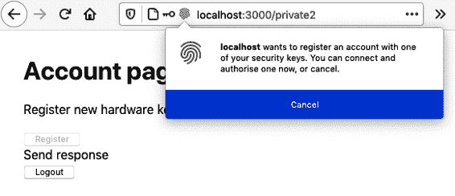

###### 图 7-7\. 当调用 `create` 时，浏览器请求令牌

`create` 函数返回一个 *attestation 对象*，你可以将其视为设备的注册信息。服务器可以使用 attestation 对象在用户登录时验证其身份。我们需要将 attestation 对象记录在用户的账户上。我们将通过将其发布到示例服务器上的 */register* 端点来实现：

```
import { create } from '@github/webauthn-json'
import axios from 'axios'
...
// Ask to start registering a physical token for the current user
const response = await axios.post('/startRegister')
// Pass the WebAuthn config to webauthn-json 'create' function
const attestation = await create({ publicKey: response.data })
// Send the details of the physical YubiKey to be stored against the user
const attestationResponse = await axios.post('/register', {
  attestation,
})
```

这就是我们为用户注册新设备的概述。但是我们在代码中放置它在哪里呢？

示例应用程序有一个账户页面（参见 图 7-8），我们将在其中添加一个按钮来注册新密钥。

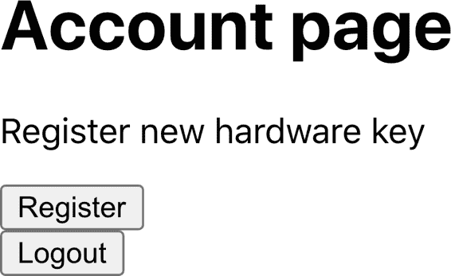

###### 图 7-8\. 我们将在账户页面上添加一个按钮来注册新设备

这是已经就位的注册代码：

```
import { useState } from 'react'
import Logout from './Logout'
import axios from 'axios'
import { create } from '@github/webauthn-json'

const Private2 = () => {
  const [busy, setBusy] = useState(false)
  const [message, setMessage] = useState()

  return (
    <div className="Private2">
      <h1>Account page</h1>

      {window.PublicKeyCredential && (
        <>
          <p>Register new hardware key</p>
          <button
            onClick={async () => {
              setBusy(true)
              try {
                const response = await axios.post('/startRegister')
                setMessage('Send response')
                const attestation = await create({
                  publicKey: response.data,
                })
                setMessage('Create attestation')
                const attestationResponse = await axios.post(
                  '/register',
                  {
                    attestation,
                  }
                )
                setMessage('registered!')
                if (
                  attestationResponse.data &&
                  attestationResponse.data.verified
                ) {
                  alert('New key registered')
                }
              } catch (err) {
                setMessage('' + err)
              } finally {
                setBusy(false)
              }
            }}
            disabled={busy}
          >
            Register
          </button>
        </>
      )}
      <div className="Account-message">{message}</div>

      <Logout />
    </div>
  )
}

export default Private2
```

如果我们在账户页面上点击注册按钮，浏览器会要求我们连接安全设备（参见 图 7-9）。一旦完成，应用程序将设备的凭据发送到服务器，然后告诉我们已在我们的账户上记录了一个新设备（参见 图 7-10）。


###### 图 7-9\. 当您选择注册新设备时，系统要求您激活它

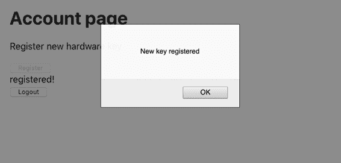

###### 图 7-10\. 当注册新设备时，我们会收到通知

我们需要考虑的下一个流程是断言。当用户登录时，断言发生。

步骤与证明类似：

1.  应用程序请求服务器创建一个断言请求。

1.  用户通过激活其安全设备将该请求转换为断言对象。

1.  服务器将根据其存储的凭据检查断言以证明该人是他们自称的人。

让我们从创建断言请求的第一阶段开始。这是断言请求的外观：

```
{
    "allowCredentials": [
        {"id": "existingTokenID", "type": "public-key"}
    ],
    "attestation": "direct",
    "extensions": {
        "credProps": true,
    },
    "rpID": "localhost",
    "timeout": 60000,
    "challenge": "someRandomString"
}
```

`allowCredentials` 属性是一个注册设备数组，将被接受。浏览器将使用此数组来检查用户是否连接了正确的设备。

断言请求还包括一个 `challenge` 字符串：设备将需要使用其私钥创建一个签名。服务器将使用公钥来检查此签名，以确保我们使用了正确的设备。

`timeout` 指定了用户需要证明身份的时间长度。

当您使用指定的用户 ID 调用 */startVerify* 端点时，示例服务器将生成一个断言请求：

```
import axios from 'axios'
...
// Ask for a challenge to verify user userID
const response = await axios.post('/startVerify', { userID })
```

然后，我们可以将断言请求传递给 `get` webauthn-json 函数，该函数将要求用户通过连接一个可接受的设备来验证其身份（参见 图 7-11）：

```
import { get } from '@github/webauthn-json'
import axios from 'axios'
...
const response = await axios.post('/startVerify', { userID })
const assertion = await get({ publicKey: response.data })
```

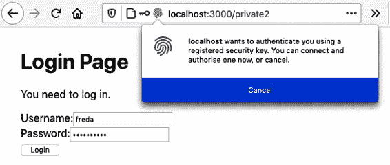

###### 图 7-11\. `get` 函数要求用户连接设备

`get` 函数返回一个断言对象，其中包含用于挑战字符串的签名，发送回服务器的 */verify* 端点以检查签名。对该调用的响应将告诉我们用户是否正确验证了其身份：

```
import { get } from '@github/webauthn-json'
import axios from 'axios'
...
const response = await axios.post('/startVerify', { userID })
const assertion = await get({ publicKey: response.data })
const resp2 = await axios.post('/verify', { userID, assertion })
if (resp2.data && resp2.data.verified) {
  // User is verified
}
```

我们在应用程序中把这段代码放在哪里？

该示例应用基于安全路由配方。^(3) 它包含一个 `SecurityProvider`，用于管理其所有子组件的安全性。`SecurityProvider` 提供一个 `login` 函数，在用户提交登录表单时调用该函数并传递用户名和密码。我们将在这里放置验证代码：

```
import { useState } from 'react'
import SecurityContext from './SecurityContext'
import { get } from '@github/webauthn-json'
import axios from 'axios'

const SecurityProvider = (props) => {
  const [loggedIn, setLoggedIn] = useState(false)

  return (
    <SecurityContext.Provider
      value={{
        login: async (username, password) => {
          const response = await axios.post('/login', {
            username,
            password,
          })
          const { data } = response
          if (data.twoFactorNeeded) {
            const userID = data.userID
            const response = await axios.post('/startVerify', {
              userID,
            })
            const assertion = await get({ publicKey: response.data })
            const resp2 = await axios.post('/verify', {
              userID,
              assertion,
            })
            if (resp2.data && resp2.data.verified) {
              setLoggedIn(true)
            }
          } else {
            setLoggedIn(true)
          }
        },
        logout: async () => {
          await axios.post('/logout')
          setLoggedIn(false)
        },
        loggedIn,
      }}
    >
      {props.children}
    </SecurityContext.Provider>
  )
}
export default SecurityProvider
```

我们首先将用户名和密码发送到 */login* 终点。如果用户注册了安全设备，那么 */login* 的响应将设置 `twoFactorNeeded` 属性为 true。我们可以使用用户的 ID 调用 */startVerify* 终点，并使用生成的断言请求要求用户激活他们的设备。我们可以将断言发送回服务器。如果一切顺利，我们将 `loggedIn` 设置为 true，用户将能看到页面。

让我们看看它是如何工作的。假设我们已经注册了设备到我们的账户。我们打开应用程序并点击账户页面（见图 7-12）。

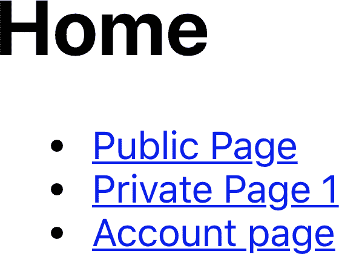

###### 图 7-12\. 应用程序打开时，点击账户链接

账户页面是安全的，所以我们被要求输入用户名和密码（见图 7-13）。在示例应用程序中，您可以将 **`freda`** 作为用户名和 **`mypassword`** 作为密码输入。

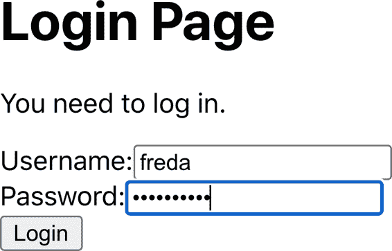

###### 图 7-13\. 登录表单出现

一旦我们输入了用户名和密码，浏览器会要求我们连接安全设备（见图 7-14）。

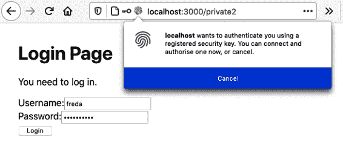

###### 图 7-14\. 浏览器要求用户激活他们的安全设备

如果他们连接他们的设备并激活它，用户可以看到安全页面（见图 7-15）。


###### 图 7-15\. 用户验证身份后，账户页面可见

## 讨论

正如你可能已经注意到的，WebAuthn 是一个相当复杂的 API。它使用相当晦涩的术语（*attestation* 用于 *registration*，*assertion* 用于 *verification*），并使用一些低级数据类型，幸运的是 GitHub 的 `webauthn-json` 让我们可以避免这些。

复杂性存在于服务器端。可下载源代码中的示例服务器使用一个名为 SimpleWebAuthn 的库来处理大部分的加密 *事务*。如果你计划在应用程序的服务器端使用 SimpleWebAuthn，请注意还有一个客户端的 SimpleWebAuthn 库与之配套。在示例客户端源代码中，我们避免使用它，以避免使我们的代码过于依赖 SimpleWebAuthn。

如果您实施双因素认证，您需要考虑如果用户丢失了他们的安全设备该怎么办。从技术上讲，您只需删除注册在其名下的设备即可重新启用他们的帐户。但最好要非常小心。针对双因素认证的典型攻击是致电服务台，假装是丢失令牌的用户。

相反，您需要创建一个足够严格的流程，以检查任何要求重置帐户的人的身份。

您可以从[GitHub 网站](https://oreil.ly/Diy5D)下载此教程的源代码。

# 启用 HTTPS

## 问题

在生产环境中通常使用 HTTPS，但在开发过程中使用 HTTPS 可能会有所帮助。某些网络服务只能在通过 HTTPS 保护的页面中工作。WebAuthn 只能通过 HTTPS 远程工作。^(4) 如果您的应用程序使用带有 HTTPS 代理服务器，可能会在您的代码中引入许多错误和其他问题。

在生产服务器上启用 HTTPS 现在相对简单，^(5) 但是如何在开发服务器上启用 HTTPS 呢？

## 解决方案

如果您使用`create-react-app`创建了您的应用程序，您可以通过以下方式启用 HTTPS：

+   生成自签名 SSL 证书

+   将证书注册到您的开发服务器

要生成自签名证书，我们需要了解 HTTPS 的一些工作原理。

HTTPS 只是通过加密的安全套接字层（SSL）连接隧道传输的 HTTP。当浏览器连接到 HTTPS 地址时，它会打开到服务器上安全套接字的连接。^(6) 服务器必须提供来自浏览器信任的组织的证书。如果浏览器接受证书，它将向服务器上的安全套接字发送加密数据，然后服务器会将其解密并转发给 HTTP 服务器。

设置 HTTPS 服务器的主要困难在于获取一个 Web 浏览器将信任的证书。浏览器维护一组*根证书*。这些是由大型、可信任的组织发布的证书。当 HTTPS 服务器向浏览器呈现证书时，该证书必须由浏览器的一个根证书签名。

如果我们想生成一个 SSL 证书，我们首先需要创建一个根证书，并告诉浏览器信任它。然后我们必须为我们的开发服务器生成一个由根证书签名的证书。

如果听起来很复杂，那是因为确实如此。

让我们首先创建一个根证书。为此，您需要在您的机器上安装一个名为 OpenSSL 的工具。

我们将使用`openssl`命令创建一个密钥文件。它会要求您输入一个密码，您需要输入两次：

```
$ openssl genrsa -des3 -out mykey.key 2048
Generating RSA private key, 2048 bit long modulus
.......................................................+++
.................................+++
e is 65537 (0x10001)
Enter pass phrase for mykey.key:
Verifying - Enter pass phrase for mykey.key:
$
```

*mykey.key* 文件现在包含一个私钥，用于加密数据。我们可以使用这个密钥文件来创建一个证书文件。证书文件包含关于组织的信息以及一个截止日期，之后它将不再有效。

您可以使用以下命令创建一个证书：

```
$ openssl req -x509 -new -nodes -key mykey.key -sha256 -days 2048 -out mypem.pem
Enter pass phrase for mykey.key:
You are about to be asked to enter information that will be incorporated
into your certificate request.
What you are about to enter is what is called a Distinguished Name or a DN.
There are quite a few fields but you can leave some blank
For some fields there will be a default value,
If you enter '.', the field will be left blank.
-----
Country Name (2 letter code) []:US
State or Province Name (full name) []:Massachusetts
Locality Name (eg, city) []:Cambridge
Organization Name (eg, company) []:O'Reilly Media
Organizational Unit Name (eg, section) []:Harmless scribes
Common Name (eg, fully qualified host name) []:Local
Email Address []:me@example.com
$
```

在这里，我们正在创建一个有效期为 2,048 天的证书。系统会要求你输入的密码是你创建 *mykey.key* 文件时设置的密码。组织细节无关紧要，因为你只会在本地机器上使用它。

证书存储在名为 *mypem.pem* 的文件中，我们需要将这个文件安装为我们机器上的根证书。^(7) 有几种方法可以在您的机器上安装根证书。^(8) 您可以使用根证书来签署网站证书，这是我们接下来要做的事情。

我们将创建一个本地密钥文件，并使用以下命令创建一个证书签名请求（CSR）文件：

```
$ openssl req -new -sha256 -nodes -out myprivate.csr -newkey rsa:2048 \
-keyout myprivate.key \
-subj "/C=US/ST=Massachusetts/L=Cambridge/O=O'Reilly \
Media/OU=Harmless scribes/CN=Local/emailAddress=me@example.com"
Generating a 2048 bit RSA private key
....................+++
..+++
writing new private key to 'myprivate.key'
-----
$
```

接下来，创建一个名为 `extfile.txt` 的文件，其中包含以下内容：

```
authorityKeyIdentifier=keyid,issuer
basicConstraints=CA:FALSE
keyUsage=digitalSignature,nonRepudiation,keyEncipherment,dataEncipherment
subjectAltName=DNS:localhost
```

现在我们可以运行一个命令来为我们的应用程序生成一个 SSL 证书：

```
$ openssl x509 -req -in myprivate.csr -CA mypem.pem -CAkey mykey.key \
-CAcreateserial -out \
myprivate.crt -days 500 -sha256 -extfile ./extfile.txt
Signature ok
subject=/C=US/ST=Massachusetts/L=Cambridge/O=O'Reilly
Media/OU=Harmless scribes/CN=Local/
emailAddress=me@example.com
Getting CA Private Key
Enter pass phrase for mykey.key:
$
```

记住，密码是你第一次创建 *mykey.key* 文件时设置的密码。

经过所有这些步骤的结果是，我们有两个文件可以用来保护我们的开发服务器：

+   *myprivate.crt* 文件是由根证书签名的证书，这个文件向浏览器保证我们的应用程序是可信的。

+   *myprivate.key* 文件将用于加密开发服务器与浏览器之间的连接。

如果你是使用 `create-react-app` 创建你的应用程序，你可以通过将以下内容放入应用程序目录中的 `.env` 文件来启用 HTTPS：

```
HTTPS=true
SSL_CRT_FILE=myprivate.crt
SSL_KEY_FILE=myprivate.key
```

如果重新启动服务器，你应该能够通过 *https://localhost:3000* 访问你的应用程序，而不是 *http://localhost:3000*。

## 讨论

自签名证书是创建起来非常复杂的东西，但在某些情况下是必需的。然而，即使在开发环境中不需要运行 HTTPS，理解 HTTPS 是什么、它是如何工作的以及为什么应该信任它仍然是值得的。

你可以从 [GitHub 网站](https://oreil.ly/BAKAE) 下载这个示例的源代码。

# 使用指纹进行身份验证

## 问题

“使用物理令牌进行身份验证” 讨论了如何使用物理令牌，如 YubiKeys，进行双因素身份验证。但物理令牌仍然相对稀少，而且价格相对较高。大多数人已经拥有手机、平板等移动设备。其中许多设备都内置了指纹传感器。但如何让一个 React 应用程序使用指纹传感器进行双因素身份验证呢？

## 解决方案

我们可以使用指纹传感器作为 WebAuthn 认证令牌。它们以同样的方式连接到 API，尽管需要进行几个配置更改。

此配方基于“使用物理令牌进行身份验证”，用于使用可移动令牌进行双因素认证。我们在“使用物理令牌进行身份验证”中看到，在 WebAuthn 身份验证中有两个主要流程：

认证

在这个流程中，用户注册设备或令牌到他们的账户。一种方法是在他们的手机上按指纹传感器。

断言

在这个流程中，用户激活设备或令牌，服务器检查它是否与之前注册的设备或令牌匹配。

无论是认证还是断言都有三个阶段：

1.  服务器生成请求。

1.  用户使用令牌，生成响应。

1.  响应发送到服务器。

如果我们想要从使用可移动物理令牌切换到使用设备中内置的指纹传感器，我们只需更改认证请求阶段。认证请求说明浏览器可以为用户注册的令牌类型。对于可移动物理令牌，如 YubiKeys，我们生成了一个类似这样的认证请求：

```
{
    "rpName": "Physical Token Server",
    "rpID": "localhost",
    "userID": "1234",
    "userName": "freda",
    "excludeCredentials": [
        {"id": "existingKey1", "type": "public-key"}
    ],
    "authenticatorSelection": {
        "userVerification": "discouraged"
    },
    "extensions": {
        "credProps": true,
    },
}
```

我们需要稍微更改这一点，以允许用户使用指纹传感器：

```
{
    "rpName": "Physical Token Server",
    "rpID": "localhost",
    "userID": "1234",
    "userName": "freda",
    "excludeCredentials": [
        {"id": "existingKey1", "type": "public-key"}
    ],
    "authenticatorSelection": {
        "authenticatorAttachment": "platform",
        "userVerification": "required"
    },
    "attestation": "direct",
    "extensions": {
        "credProps": true,
    },
}
```

这两个请求几乎相同。第一个变化在认证器选择上。我们现在想使用`platform`认证器，因为指纹传感器内置于设备中，不可移动，这意味着我们有效地限制用户在其当前物理设备上使用。相比之下，YubiKey 可以从一台机器断开连接，然后连接到另一台机器。

我们还表示我们希望使用直接认证，这意味着我们不需要任何额外的验证。例如，我们不会要求用户按指纹传感器然后输入 PIN 码。

除了更改初始的认证请求对象之外，所有其他代码保持不变。一旦用户按指纹传感器响应认证请求，它将生成一个公钥，我们可以存储在用户账户中。当用户再次登录并通过按指纹传感器确认其身份时，它将以与 YubiKey 相同的方式签署挑战字符串。

因此，如果你要支持一种类型的认证器，值得允许用户同时使用指纹传感器和可移动令牌。

除非用户有一个也适用于移动设备的可移动令牌，例如使用近场通信（NFC），否则任何用户都不太可能注册可移动令牌和指纹。一旦他们注册了一个指纹，他们将无法登录并注册可移动令牌，反之亦然。

这里是更新后的组件，允许用户注册令牌：

```
import { useState } from 'react'
import Logout from './Logout'
import axios from 'axios'
import { create } from '@github/webauthn-json'

const Private2 = () => {
  const [busy, setBusy] = useState(false)
  const [message, setMessage] = useState()

  const registerToken = async (startRegistrationEndpoint) => {
    setBusy(true)
    try {
      const response = await axios.post(startRegistrationEndpoint)
      setMessage('Send response')
      const attestation = await create({ publicKey: response.data })
      setMessage('Create attestation')
      const attestationResponse = await axios.post('/register', {
        attestation,
      })
      setMessage('registered!')
      if (
        attestationResponse.data &&
        attestationResponse.data.verified
      ) {
        alert('New key registered')
      }
    } catch (err) {
      setMessage('' + err)
    } finally {
      setBusy(false)
    }
  }
  return (
    <div className="Private2">
      <h1>Account page</h1>

      {window.PublicKeyCredential && (
        <>
          <p>Register new hardware key</p>
          <button
            onClick={() => registerToken('/startRegister')}
            disabled={busy}
          >
            Register Removable Token
          </button>
          <button
            onClick={() => registerToken('/startFingerprint')}
            disabled={busy}
          >
            Register Fingerprint
          </button>
        </>
      )}
      <div className="Account-message">{message}</div>

      <Logout />
    </div>
  )
}

export default Private2
```

当我们要注册指纹时，我们调用了一个稍微不同的端点。否则，代码的其余部分保持不变。

要尝试它，您需要使用带有指纹传感器的设备。只有在本地主机或使用 HTTPS 的远程服务器上运行应用程序时，我们才能使用 WebAuthn。要从移动设备测试此代码，您需要在开发服务器上配置 HTTPS（参见“启用 HTTPS”），或者您需要配置您的设备将*localhost*连接代理到您的开发机器（参见“在 Android 设备上测试”）。

要运行示例应用程序，您需要切换到应用程序目录，并使用以下命令启动开发服务器：

```
$ npm run start
```

您还需要运行 API 服务器。为此打开一个单独的终端，然后从*server*子目录运行它：

```
$ cd server
$ npm run start
```

开发服务器将在端口 3000 上运行，API 服务器将在端口 5000 上运行。开发服务器将代理 API 请求到 API 服务器。

打开应用程序后，您应单击“账户页面”链接（参见图 7-16）。

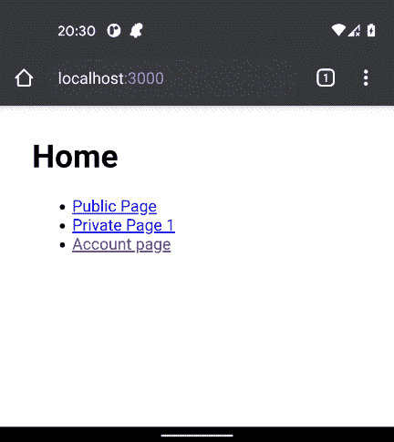

###### 图 7-16\. 在主页上单击“账户页面”链接

应用程序将要求您登录。输入用户名**`freda`**和密码**`mypassword`**（参见图 7-17）。这些值在示例服务器中已硬编码。

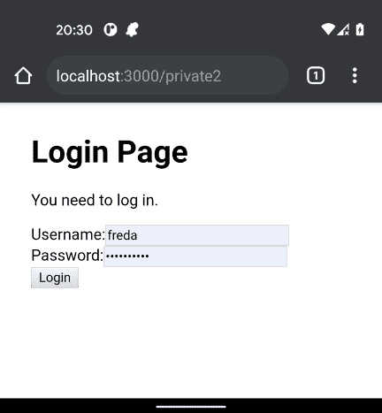

###### 图 7-17\. 在登录表单中输入**`freda/mypassword`**

现在您将看到两个按钮，用于为您的账户注册令牌：一个用于可移动令牌，另一个用于指纹（参见图 7-18）。

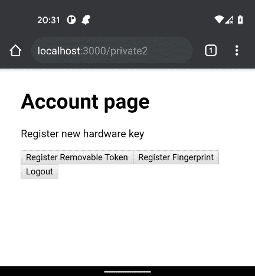

###### 图 7-18\. 有按钮用于注册可移动令牌和指纹

按下按钮注册指纹。您的移动设备将要求您按下指纹传感器。您的指纹传感器将生成一个公钥，该应用程序可以存储在*freda*账户中。消息框将显示在完成时，如图 7-19 所示。

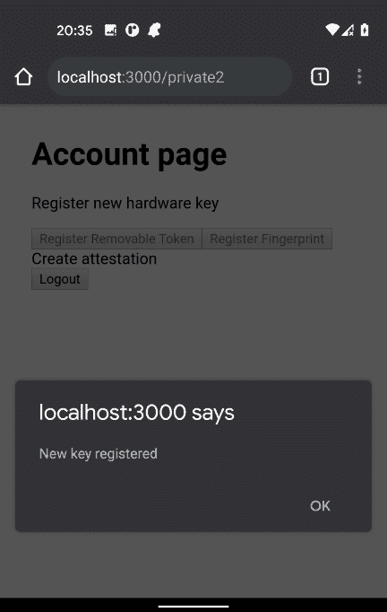

###### 图 7-19\. 应用程序将在令牌注册完成时进行确认

现在注销。再次登录时，在表单中输入**`freda`**和**`mypassword`**。应用程序现在将要求您通过指纹传感器确认身份，然后再次登录。

## 讨论

内置指纹传感器比可移动令牌（如 YubiKeys）更常见。这两种设备的使用模式有所不同。YubiKeys 可以从一个设备移动到另一个设备，而指纹通常限于单个设备。^(9) 因此，对于希望从多个设备连接的用户来说，可移动令牌具有额外的灵活性。可移动设备的缺点是它们比手机更容易丢失。在大多数情况下，支持这两种设备并让用户决定哪种选项最适合他们是值得的。

您可以从[GitHub 网站](https://oreil.ly/m8hs6)下载此示例的源代码。

# 使用确认登录

## 问题

有时用户可能希望执行更危险或不易撤销的操作。他们可能想要删除数据，移除用户帐户，或者执行会发送电子邮件的操作。如何防止恶意第三方在找到登录但未被关注的机器时执行这些操作？

## 解决方案

许多系统要求用户在执行敏感操作之前确认其登录凭据。您很可能希望为多个操作执行此操作，因此如果有一种集中进行确认的方法将非常有帮助。

我们将基于“创建安全路由”中的代码来编写此示例。在那个示例中，我们构建了一个`SecurityProvider`组件，为其子组件提供了`login`和`logout`函数：

```
import { useState } from 'react'
import SecurityContext from './SecurityContext'

const SecurityProvider = (props) => {
  const [loggedIn, setLoggedIn] = useState(false)

  return (
    <SecurityContext.Provider
      value={{
        login: (username, password) => {
          // Note to engineering team:
          // Maybe make this more secure...
          if (username === 'fred' && password === 'password') {
            setLoggedIn(true)
          }
        },
        logout: () => setLoggedIn(false),
        loggedIn,
      }}
    >
      {props.children}
    </SecurityContext.Provider>
  )
}

export default SecurityProvider
```

需要使用`login`和`logout`函数的组件可以从`useSecurity`钩子中访问它们：

```
const security = useSecurity()
...
// Anywhere that we need to logout...
security.logout()
```

对于此示例，我们将在`SecurityProvider`中添加一个额外的函数，允许子组件确认用户已登录。一旦他们提供了用户名和密码，我们允许他们执行危险操作。

我们可以通过创建一个接受包含危险操作的回调函数的函数来完成此操作，在用户确认其登录详细信息后应用程序调用此函数。在`SecurityProvider`中实现此函数会更容易，但在从组件中调用它时会有一些问题。我们可以返回一个成功/失败标志：

```
// We WON'T do it like this
confirmLogin((success) => {
    if (success) {
        // Do dangerous thing here
    } else {
        // Handle the user canceling the login
    }
})
```

这种方法的缺点是，如果您忘记检查`success`标志的值，即使用户取消了登录表单，代码也将执行危险操作。

或者，我们将不得不传递两个单独的回调函数：一个用于成功，一个用于取消：

```
// We WON'T do it like this either
confirmLogin(
    () => {
        // Do dangerous thing here
    },
    () => {
        // Handle the user canceling the login
    });
```

然而，这段代码有点丑陋。

相反，我们将使用一个 promise 来实现该代码，这将使实现变得更加复杂，但将简化调用它的任何代码。

这是`SecurityProvider`的一个版本，完整包含了新的`confirmLogin`函数：

```
import { useRef, useState } from 'react'
import SecurityContext from './SecurityContext'
import LoginForm from './LoginForm'

export default (props) => {
  const [showLogin, setShowLogin] = useState(false)
  const [loggedIn, setLoggedIn] = useState(false)
  const resolver = useRef()
  const rejecter = useRef()

  const onLogin = async (username, password) => {
    // Note to engineering team:
    // Maybe make this more secure...
    if (username === 'fred' && password === 'password') {
      setLoggedIn(true)
    }
  }
  const onConfirmLogin = async (username, password) => {
    // Note to engineering team:
    // Same here...
    return username === 'fred' && password === 'password'
  }

  return (
    <SecurityContext.Provider
      value={{
        login: onLogin,
        confirmLogin: async (callback) => {
          setShowLogin(true)
          return new Promise((res, rej) => {
            resolver.current = res
            rejecter.current = rej
          })
        },
        logout: () => setLoggedIn(false),
        loggedIn,
      }}
    >
      {showLogin ? (
        <LoginForm
          onLogin={async (username, password) => {
            const valid = await onConfirmLogin(username, password)
            if (valid) {
              setShowLogin(false)
              resolver.current()
            }
          }}
          onCancel={() => {
            setShowLogin(false)
            rejecter.current()
          }}
        />
      ) : null}
      {props.children}
    </SecurityContext.Provider>
  )
}
```

如果用户调用`confirmLogin`函数，`SecurityProvider`将显示一个登录表单，允许用户确认其用户名和密码。`confirmLo⁠gin`函数返回一个承诺，仅当用户正确输入用户名和密码时才会解决。如果用户取消登录表单，则承诺将被拒绝。

我们在这里不显示`LoginForm`组件的详细信息，但您可以在此配方的可下载源代码中找到它。

在我们的示例代码中，这里检查用户名和密码与静态字符串是否匹配。在您的代码版本中，您将用一些安全服务的调用替换它。

当我们调用`confirmLogin`时，我们正在将承诺存储在一个*ref*中。*Refs*通常指向 DOM 中的元素，但您可以使用它们来存储任何状态片段。与`useState`不同，*refs*会立即更新。一般来说，在代码中不应大量使用*refs*并且我们在这里仅使用它们以便我们可以立即记录承诺，而不必等待`useState`操作完成。

在实际中如何使用`confirmLogin`函数？假设我们有一个包含执行某些危险操作按钮的组件：

```
import { useState } from 'react'
import Logout from './Logout'

const Private1 = () => {
  const [message, setMessage] = useState()

  const doDangerousThing = () => {
    setMessage('DANGEROUS ACTION!')
  }

  return (
    <div className="Private1">
      <h1>Private page 1</h1>

      <button
        onClick={() => {
          doDangerousThing()
        }}
      >
        Do dangerous thing
      </button>

      <p className="message">{message}</p>

      <Logout />
    </div>
  )
}

export default Private1
```

如果我们希望用户在执行此操作之前确认其登录详细信息，我们可以首先获取由`SecurityProvider`提供的上下文：

```
const security = useSecurity()
```

在执行危险操作的代码中，我们可以`await`由`confirmLogin`返回的承诺：

```
const security = useSecurity()
...
await security.confirmLogin()
setMessage('DANGEROUS ACTION!')
```

在调用`confirmLogin`后的代码将仅在用户提供正确的用户名和密码时运行。

如果用户取消登录对话框，承诺将被拒绝，我们可以在`catch`块中处理取消。

这是一个修改后的执行危险代码的组件版本，现在在继续之前确认用户的登录：

```
import { useState } from 'react'
import Logout from './Logout'
import useSecurity from './useSecurity'

export default () => {
  const security = useSecurity()
  const [message, setMessage] = useState()

  const doDangerousThing = async () => {
    try {
      await security.confirmLogin()
      setMessage('DANGEROUS ACTION!')
    } catch (err) {
      setMessage('DANGEROUS ACTION CANCELLED!')
    }
  }

  return (
    <div className="Private1">
      <h1>Private page 1</h1>

      <button
        onClick={() => {
          doDangerousThing()
        }}
      >
        Do dangerous thing
      </button>

      <p className="message">{message}</p>

      <Logout />
    </div>
  )
}
```

如果我们尝试这段代码，我们首先需要从应用程序目录运行应用程序：

```
$ npm run start
```

当应用程序打开时（参见图 7-20），您将需要点击私人页面 1。


###### 图 7-20\. 首先点击私人页面 1 链接

然后应用程序会要求您登录（参见图 7-21）。您应该使用*fred/password*登录。

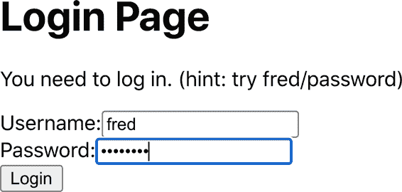

###### 图 7-21\. 页面受保护，因此您需要登录

如果您现在点击按钮执行危险操作，您将需要确认您的凭据后才能继续（如图 7-22 所示）。

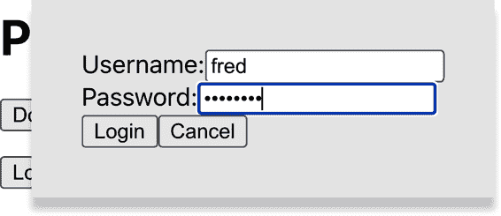

###### 图 7-22\. 您必须确认您的登录详细信息才能继续

## 讨论

此配方将您的确认代码集中在`SecurityProvider`中，这具有优势：不仅可以减少组件中的代码量，还意味着用户确认可以在自定义钩子内完成。如果您将一组操作抽象成基于钩子的服务，^(10)那么您还可以在该服务中包含确认逻辑。因此，您的组件将完全不知道哪些操作是危险的，哪些不是。

您可以从[GitHub 网站](https://oreil.ly/zP75q)下载此配方的源代码。

# 使用单因素认证

## 问题

我们已经看到可移动令牌和指纹可以用于双因素认证系统，为用户的账户提供额外的安全性。

但是，您也可以将它们用作简单的登录便利。许多移动应用程序允许用户通过按压指纹传感器而无需输入用户名或密码登录。

如何为 React 应用启用单因素认证？

## 解决方案

安全令牌，如指纹传感器和 USB 设备（如 YubiKeys），需要记录在服务器上的用户账户上。单因素认证的问题在于，当他们触摸指纹传感器时，我们不知道用户应该是谁。在双因素系统中，他们刚刚在表单中输入了他们的用户名。但在单因素系统中，当我们创建断言请求时，我们需要知道用户应该是谁。^(11)

通过在浏览器中设置包含用户 ID 的 cookie，我们可以避免这个问题，每当启用了令牌的账户的用户登录时。^(12)

当应用程序显示登录表单时，应用程序可以检查 cookie 的存在，然后使用它创建一个断言请求，并要求用户输入安全令牌。如果用户不想使用令牌，他们可以取消请求，简单地使用登录表单。^(13)

用户 ID 通常是机器生成的内部密钥，不包含安全信息。但是，如果您的用户 ID 更容易识别，比如电子邮件地址，您不应该使用这种方法。

我们基于“创建安全路由”中的安全路由代码来编写此配方的代码。我们通过名为`SecurityProvider`的包装组件管理所有安全性。这为子组件提供了`login`和`logout`功能。我们将添加另一个名为`loginWithToken`的函数：

```
import { useState } from 'react'
import SecurityContext from './SecurityContext'
import { get } from '@github/webauthn-json'
import axios from 'axios'

const SecurityProvider = (props) => {
  const [loggedIn, setLoggedIn] = useState(false)

  return (
    <SecurityContext.Provider
      value={{
        login: async (username, password) => {
          const response = await axios.post('/login', {
            username,
            password,
          })
          setLoggedIn(true)
        },
        loginWithToken: async (userID) => {
          const response = await axios.post('/startVerify', {
            userID,
          })
          const assertion = await get({ publicKey: response.data })
          await axios.post('/verify', { userID, assertion })
          setLoggedIn(true)
        },
        logout: async () => {
          await axios.post('/logout')
          setLoggedIn(false)
        },
        loggedIn,
      }}
    >
      {props.children}
    </SecurityContext.Provider>
  )
}
export default SecurityProvider
```

`loginWithToken`接受一个用户 ID，然后要求用户用令牌验证其身份：

1.  在服务器上调用`startVerify`函数创建一个断言请求

1.  将请求传递给 WebAuthn，要求用户按压指纹传感器

1.  将生成的断言传递回名为`verify`的端点，以检查令牌是否有效

您需要在您的实现中替换 `startVerify` 和 `verify` 端点。

要调用 `SecurityProvider` 中的 `loginWithToken` 函数，我们需要从 cookie 中找到当前用户的 ID。我们将通过安装 `js-cookie` 库来实现这一点：

```
$ npm install js-cookie
```

这将允许我们像这样读取 `userID` cookie：

```
import Cookies from 'js-cookie'
...
const userIDCookie = Cookies.get('userID')
```

现在，我们可以在 `Login` 组件中使用此代码，它将检查 `userID` cookie。如果存在，它将要求通过令牌登录。否则，它将允许用户使用用户名和密码登录：

```
import { useEffect, useState } from 'react'
import useSecurity from './useSecurity'
import Cookies from 'js-cookie'

const Login = () => {
  const { login, loginWithToken } = useSecurity()
  const [username, setUsername] = useState()
  const [password, setPassword] = useState()
  const userIDCookie = Cookies.get('userID')

  useEffect(() => {
    ;(async () => {
      if (userIDCookie) {
        loginWithToken(userIDCookie)
      }
    })()
  }, [userIDCookie])

  return (
    <div>
      <h1>Login Page</h1>

      <p>You need to log in.</p>

      <label htmlFor="username">Username:</label>
      <input
        id="username"
        name="username"
        type="text"
        value={username}
        onChange={(evt) => setUsername(evt.target.value)}
      />

      <br />
      <label htmlFor="password">Password:</label>
      <input
        id="password"
        name="password"
        type="password"
        value={password}
        onChange={(evt) => setPassword(evt.target.value)}
      />

      <br />
      <button onClick={() => login(username, password)}>Login</button>
    </div>
  )
}

export default Login
```

让我们试试示例应用程序。我们必须首先从应用程序目录启动开发服务器：

```
$ npm run start
```

然后，在单独的终端中，我们可以启动示例 API 服务器：

```
$ cd server
$ npm run start
```

开发服务器运行在端口 3000 上；API 服务器运行在端口 5000 上。

应用程序启动时，点击链接到账户页面（如图 7-23 所示）。

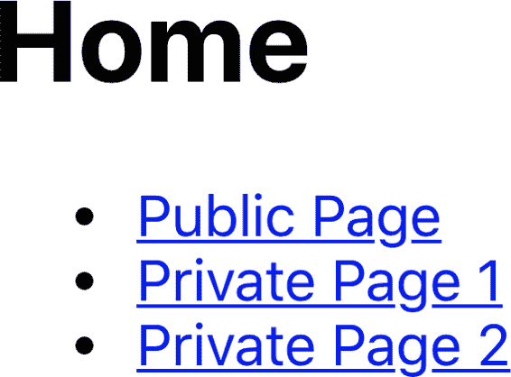

###### 图 7-23\. 应用程序打开时，点击链接到账户页面

应用程序要求我们登录（见图 7-24）。使用用户名 **`freda`** 和密码 **`mypassword`**。


###### 图 7-24\. 使用 **`freda/mypassword`** 登录

账户页面询问我们是否希望使用指纹传感器或物理令牌进行登录（见图 7-25）。您可以注册一个令牌，然后注销。

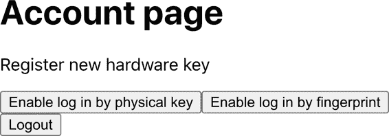

###### 图 7-25\. 选择启用使用物理令牌或指纹登录

下次我们登录时，将立即看到激活令牌的请求（见图 7-26）。

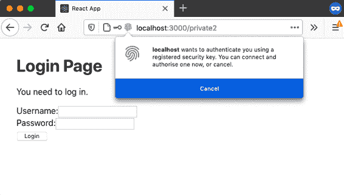

###### 图 7-26\. 一旦启用，您可以仅使用令牌登录

如果我们激活令牌，我们将无需提供用户名和密码即可登录。

## 讨论

值得注意的是，单因素身份验证主要是为了增加便利性而非安全性。指纹传感器特别方便，因为登录实际上只需要移动一个手指。

您应始终提供返回到使用登录表单的能力。这样做不会降低应用程序的安全性，因为狡猾的黑客可能会删除 cookie，并返回使用表单。

您可以从 [GitHub 网站](https://oreil.ly/4ZDh6) 下载此示例的源代码。

# 在 Android 设备上测试

## 问题

您可以使用桌面浏览器模拟移动设备的外观进行大多数移动浏览器测试（见图 7-27）。


###### 图 7-27\. 您可以使用桌面浏览器进行大多数移动测试

但有时最好在物理移动设备上测试 React 应用程序，这通常不是问题；移动设备可以使用开发机的 IP 地址远程访问 React 应用程序。

然而，在某些情况下，这并不成立：

+   您的移动设备可能无法连接到与开发机相同的网络。

+   您可能正在使用需要除 *localhost* 外域名的 HTTPS 的技术，比如 WebAuthn。

是否可以配置移动设备访问 React 应用，就像它在 *localhost* 上运行一样，尽管它是在不同的机器上运行？

## 解决方案

此步骤将探讨如何在基于 Android 的设备上代理网络，以便连接到 *localhost* 的连接将转到您开发机器上的服务器。

您需要的第一件事是拥有启用了 [USB 调试](https://oreil.ly/fc5Fv) 的 Android 设备。您还需要安装 [Android SDK](https://oreil.ly/BFeXr) 的一个副本，它将允许您使用一个称为 *Android 调试桥* (ADB) 的工具。ADB 在开发机器和 Android 设备之间打开了一个通信通道。

然后，您需要使用 USB 数据线将 Android 设备连接到开发机器，并确保 `adb` 命令在您的命令路径中可用。^(14) 您随后可以列出连接到您的机器的 Android 设备：

```
$ adb devices
* daemon not running; starting now at tcp:5037
* daemon started successfully
List of devices attached
25PRIFFEJZWWDFWO        device
$
```

在这里，您可以看到只连接了一个设备，其设备 ID 为 `25PRIFFEJZWWDFWO`。

您现在可以使用 `adb` 命令在 Android 设备上配置代理，将所有 HTTP 流量重定向到其内部端口 3000：

```
$ adb shell settings put global http_proxy localhost:3000
```

如果有多台 Android 设备连接到您的机器，您需要使用 `adb` 选项 `-s <device-id>` 指定其设备 ID。

接下来，您需要告诉 `adb` 在 Android 设备上运行一个代理服务，该服务将从设备的端口 3000 转发到开发机器的端口 3000：

```
$ adb reverse tcp:3000 tcp:3000
```

如果现在在 Android 设备上打开浏览器，并告诉它访问 *http://localhost:3000*，它将显示在您的开发机器上运行的应用程序，就像它在设备内部运行一样（参见 图 7-28）。


###### 图 7-28\. 如果您在移动浏览器中打开 localhost，则将连接到开发机器

使用完应用程序后，您需要在 Android 设备上禁用代理设置。

如果未能在 Android 设备上禁用代理，则将无法访问网络。

您可以通过将代理重置回 `:0` 来完成此操作：

```
$ adb shell settings put global http_proxy :0
```

## 讨论

这个步骤第一次使用时需要大量工作，因为它涉及在开发机器上安装整个 Android SDK。但之后，连接和断开真实的 Android 设备到您的机器将变得非常简单。

# 使用 ESlint 进行安全检查

## 问题

JavaScript 中经常出现的一些常见编码问题会导致安全威胁。您可以决定创建一组编码标准，以避免这些错误。但是，您需要经常审查这些标准，以使它们与技术的最新变化保持同步，并且还需要引入缓慢和昂贵的代码审查过程。

是否有一种方法可以检查代码中的不良安全实践，而不会减慢您的开发过程？

## 解决方案

引入安全审查的一种方法是尝试自动化。一个可以帮助您做到这一点的工具是`eslint`。如果您使用类似`create-react-app`这样的工具创建了您的应用程序，您可能已经安装了`eslint`。事实上，`create-react-app`每次重新启动开发服务器时都会运行`eslint`。如果您曾在终端中看到代码问题被突出显示，那输出就来自于`eslint`：

```
Compiled with warnings.

src/App.js
 Line 5:9:  'x' is assigned a value but never used  no-unused-vars

Search for the keywords to learn more about each warning.
To ignore, add // eslint-disable-next-line to the line before.
```

如果您尚未安装`eslint`，可以通过`npm`安装它：

```
$ npm install --save-dev eslint
```

安装完成后，您可以像这样初始化它：

```
$ node_modules/.bin/eslint --init
- How would you like to use ESLint? · problems
- What type of modules does your project use? · esm
- Which framework does your project use? · react
- Does your project use TypeScript? · No / Yes
- Where does your code run? · browser
- What format do you want your config file to be in? · JavaScript
Local ESLint installation not found.
The config that you've selected requires the following dependencies:

eslint-plugin-react@latest eslint@latest
- Would you like to install them now with npm? · No / Yes
$
```

记住：如果您使用`create-react-app`，您不需要初始化`eslint`；它已经为您做好了。

在此时，您可以选择编写自己的`eslint`规则集，以检查任何安全实践的违规。然而，安装一个已经为您编写好一套安全规则的`eslint`插件要简单得多。

例如，让我们安装由[Slyk](https://slyk.io)创建和管理的`eslint-plugin-react-security`包：

```
$ npm install --save-dev eslint-plugin-react-security
```

安装完成后，我们可以通过编辑`package.json`中的`eslintConfig`部分（如果您使用`create-react-app`），或者在您的应用目录中的`eslintrc`文件中启用此插件。

您应该将它从这个变成这个：

```
"eslintConfig": {
  "extends": [
    "react-app",
    "react-app/jest"
  ]
},
```

to this:

```
"eslintConfig": {
  "extends": [
    "react-app",
    "react-app/jest"
  ],
  "plugins": [
    "react-security"
  ],
  "rules": {
    "react-security/no-javascript-urls": "warn",
    "react-security/no-dangerously-set-innerhtml": "warn",
    "react-security/no-find-dom-node": "warn",
    "react-security/no-refs": "warn"
  }
},
```

这一更改将启用来自 React 安全插件的四个规则。

为了检查它们是否有效，让我们向应用程序添加一些代码，违反*no-dangerously-set-innerhtml*规则：

```
import logo from './logo.svg'
import './App.css'

function App() {
  return (
    <div className="App">
      <header className="App-header">
        
        <p>
          Edit <code>src/App.js</code> and save to reload.
        </p>
        <div
          dangerouslySetInnerHTML={{
            __html: '<p>This is a bad idea</p>',
          }}
        />
        <a
          className="App-link"
          href="https://reactjs.org"
          target="_blank"
          rel="noopener noreferrer"
        >
          Learn React
        </a>
      </header>
    </div>
  )
}

export default App
```

如果您手动安装了`eslint`，现在可以使用以下命令扫描此文件：

```
$ node_modules/.bin/eslint src/App.js
```

如果您使用`create-react-app`，只需重新启动服务器即可确保重新加载`eslint`配置：

```
Compiled with warnings.

src/App.js
 Line 12:16:  dangrouslySetInnerHTML prop usage detected
 react-security/no-dangerously-set-innerhtml

Search for the keywords to learn more about each warning.
To ignore, add // eslint-disable-next-line to the line before.
```

## 讨论

如果您有一个开发团队，您可能还希望使用 Git 的*pre-commit*钩子来运行`eslint`检查，以防止开发人员提交失败的代码。Git 钩子将更快地向开发人员反馈，并阻止他们让所有人的构建失败。

如果您想通过*package.json*文件配置预提交钩子，请考虑安装[Husky code hooks](https://oreil.ly/uEjix)。

自动化安全检查的另一个好处是您可以将它们添加到您的构建和部署管道中。如果您在管道的开始运行检查，您可以立即拒绝提交并通知开发人员。

您可以从[GitHub 站点](https://oreil.ly/kvBcS)下载此配方的源代码。

# 使登录表单在浏览器中友好

## 问题

许多安全解决方案依赖于用户名/密码表单，但在创建它们时很容易陷入几个可用性陷阱。在某些设备上，自动大写和自动更正可能会破坏用户名和密码，以帮助为目的。一些浏览器会尝试自动填充用户名字段，但通常不清楚它们使用了什么规则，因此自动完成在某些站点上有效，但在其他站点上则无效。

在构建登录表单时，应遵循哪些实践，以使其与浏览器配合而不是相互对抗？

## 解决方案

几个 HTML 属性可以显著提高登录表单的可用性。

首先，可以禁用用户名字段的自动更正可能会有所帮助。在移动设备上经常会应用自动更正来弥补键盘小和不可避免的拼写错误。但是在输入用户名时，自动更正没有什么用处。您可以使用`autoCorrect`属性禁用自动更正：

```
<input autoCorrect="off"/>
```

接下来，如果您的用户名是电子邮件地址，请考虑将`type`设置为`email`，这可能会在移动设备上启动专用于电子邮件的键盘。某些浏览器甚至可能在自动完成窗口或电子邮件专用键盘的标题中显示最近的电子邮件地址：

```
<input type="email"/>
```

您还可以考虑将`j_username`用作用户名字段的`id`和`name`。为什么？因为基于 Java 的应用程序通常有名为`j_username`的字段，因此用户可能以前已经提供了`j_username`值。这增加了浏览器在自动完成窗口中提供电子邮件地址的可能性：

```
<input id="j_username" name="j_username"/>
```

您可以明确指定一个字段表示用户名字段，这样很可能会触发浏览器的自动完成响应：

```
<input autoComplete="username"/>
```

现在，关于密码，该怎么办呢？

首先，始终将类型设置为`password`：

```
<input type="password"/>
```

永远不要试图以其他方式复制密码字段的视觉外观，例如通过自定义 CSS 样式。这样做将阻止浏览器对密码字段应用标准安全功能，例如在其中禁用复制功能。此外，如果不将类型设置为`password`，浏览器将不会提供将值存储在其密码管理器中的选项。

密码字段有两种类型：用于当前密码（登录时）和用于新密码（注册或更改密码时）。

为什么这很重要？因为 HTML 中的`autoComplete`属性可以告诉浏览器您打算如何使用密码字段。

如果是登录表单，您将希望说密码是`current-password`：

```
<input type="password" autoComplete="current-password"/>
```

如果是注册或更改密码表单，您应将其设置为`new-password`：

```
<input type="password" autoComplete="new-password"/>
```

这个值将促使浏览器在登录表单中自动填充存储的密码。它还会触发任何内置或第三方密码生成工具。

最后，避免使用向导式登录界面（参见图 7-29，来自*华盛顿邮报*的示例）。

浏览器不太可能将单个用户名字段识别为登录表单，因此不太可能为您提供完整的详细信息。

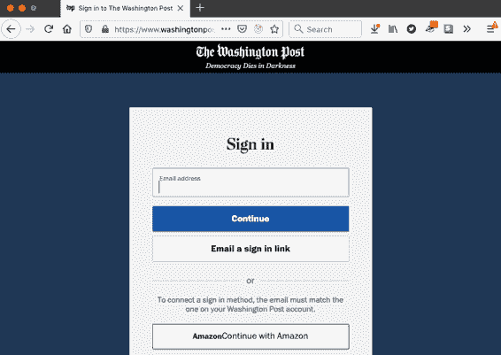

###### 图 7-29。多步表单可能会阻止浏览器使用自动完成。

## 讨论

`autocomplete`属性对于几种表单字段类型有许多其他不常用的值，包括地址详细信息、电话号码和信用卡号。有关更多信息，请参见[Mozilla 开发网站](https://oreil.ly/TLHLF)。

^(1) 或者，在 GraphQL 的情况下，访问器和变异器。

^(2) 与 Internet Explorer 显著不同。

^(3) 参见“创建安全路由”。

^(4) 在 Android 设备上通过代理手机到开发机器可以解决此问题。参见“在 Android 设备上进行测试”。

^(5) 查看[Let’s Encrypt 网站](https://letsencrypt.org)。

^(6) 默认情况下，这将在端口 443 上进行。

^(7) *.pem*扩展名代表 Privacy-Enhanced Mail。PEM 格式最初设计用于电子邮件，但现在用作通用证书存储格式。

^(8) 要详细的指南，请参阅来自 BounCA 的[此教程](https://oreil.ly/9NN1H)。

^(9) 唯一的例外情况是用户连接了外部指纹传感器。

^(10) 有关此类服务的示例，请参见“使用状态计数器自动刷新”中的`useForum`钩子。

^(11) 当浏览器要求用户扫描他们的指纹或激活他们的令牌时，需要断言请求。它包含所有可接受设备的列表，因此对于特定用户是唯一的。

^(12) 这种方法的一个后果是用户将仅在注册令牌的浏览器上进行单因素认证。如果他们使用不同的浏览器或最近清除了他们的 Cookies，他们将不得不回到使用登录表单。

^(13) 这假定您使用的是 JavaScript 可读取的 Cookie。也可以使用 HTTP-only Cookie，只有服务器（或服务工作者）才能读取。如果使用 HTTP-only Cookie，则需要服务器上的代码来检查用户是否应提供令牌。

^(14) 您需要找到安装在您计算机上的 Android SDK。您可以在安装的子目录中找到`adb`命令。
