# 第八章：测试

在本章中，我们将探讨测试 React 应用程序的各种技术。总的来说，我们发现对于应该具有的确切测试组合，过于具体的建议并不是一个好主意。一个好的指导原则是遵循以下两条规则：

+   除非你有一个失败的测试，否则不要编写代码。

+   如果一次性运行测试通过，请将其删除。

这两条规则将帮助你构建能够工作的代码，同时避免创建提供较少价值的冗余测试。

我们发现，在项目初期，编写基于浏览器的测试更容易一些。这些测试往往是高级别的，并有助于捕捉应用程序的主要业务需求。稍后，当应用程序的架构开始出现和稳定下来时，编写单元测试变得更容易一些。它们编写速度更快，运行速度更快，一旦你的代码结构稳定，你就不需要不断更新它们了。

有时候值得放宽对测试的定义。当你在处理主要价值在于视觉的布局代码时，你可能会认为 Storybook 故事是一种“测试”。断言是通过你的眼睛完成的，你在创建时查看组件。当然，这种类型的测试不会自动检测到回归失败，但我们在一篇食谱中提出了一种技术，可以将这些视觉检查转化为实际的自动化测试。

如果你在编写代码之前编写测试，你会发现测试是设计工具。它们将成为你希望应用程序如何工作的可执行示例。

相反，如果你在编写代码之后编写测试，它们将只是一种工件。这些代码片段你必须机械地创建，因为它们感觉像是专业开发者应该写的东西。

我们在本章中关注四种工具：React Testing Library、Storybook、Selenium 库和 Cypress。

React Testing Library 是创建非常详细的单元测试的一个很好的方式。

Storybook 是一个我们之前介绍过的展示工具。我们将其包括在本章中是因为一个展示是一组代码示例，这也是测试的一种形式。您将找到使用 Storybook 作为您测试/开发过程的一部分的方法。

Selenium 是用于在真实浏览器中测试应用程序的最成熟的库之一。

最后，让我们快速了解目前我们最喜欢的测试工具：Cypress。Cypress 类似于 Selenium，因为它在浏览器内运行。但它包含了许多额外的功能，比如测试重放、生成测试运行视频以及更简单的编程模型。如果你只想使用本章的一个工具，那就选择 Cypress 吧。

# 使用 React Testing Library

## 问题

有许多方法可以测试 React 应用程序。在项目的早期阶段，当您仍在定义应用程序的基本目的和功能时，您可能会选择以某种非常高级的形式创建测试，例如[Cucumber tests](https://cucumber.io)。如果您正在查看系统的某个隔离部分（例如创建和维护数据项），您可能希望使用类似 Cypress 的工具创建功能测试。

但是，如果您深入到创建单个组件的详细信息中，那么您可能希望创建单元测试。*单元测试*之所以被称为单元测试，是因为它们试图测试作为独立单元的单个代码片段。尽管是否*单元测试*是正确的术语来测试组件（通常包含子组件，因此不是隔离的）仍有争议，但通常用于测试可以在浏览器之外测试的组件的名称。

那么，如何对 React 组件进行单元测试呢？历史上存在几种方法。早期的单元测试依赖将组件渲染为 HTML 字符串，这需要最小的测试基础设施，但存在多个缺点：

+   处理组件状态变化时的重新渲染。

+   对必须从字符串中解析的 HTML 元素进行断言。

+   要测试 UI 交互，你需要模拟事件模型。

不久之后，开发人员创建了库来解决这些问题的每一个细节。

然而，通过这种方式创建的测试缺乏浏览器中测试的真实性。虚拟文档对象模型（DOM）与浏览器 DOM 之间的交互细微差别被忽略了。通常，为了减少测试的复杂性，子组件未被渲染。

结果是，React 应用程序通常只有少数单元测试。开发人员会重构其代码，将复杂逻辑移至易于测试的 JavaScript 函数中。开发人员必须使用真实浏览器测试更复杂的任何内容，导致测试速度变慢。由于速度慢，开发人员可能会被 discouraged 不测试太多场景。

那么如何可以在不启动整个应用程序和在真实浏览器中运行测试的情况下，现实地对 React 组件进行单元测试呢？

## 解决方案

Kent C. Dodds 的测试库试图避免先前单元测试库存在的问题，通过提供 DOM 的独立实现来实现此目标。因此，测试可以将 React 组件渲染到虚拟 DOM 中，然后与 Testing Library 的 DOM 同步，并创建一个行为类似于真实浏览器的 HTML 元素树。

您可以像在浏览器中一样检查元素。它们具有相同的属性和属性。您甚至可以将按键传递给 `input` 字段，并使它们像浏览器中的字段一样工作。

如果您使用 `create-react-app` 创建应用程序，则应已安装 Testing Library。如果没有，您可以从命令行安装它：

```
$ npm install --save-dev "@testing-library/react"
$ npm install --save-dev "@testing-library/jest-dom"
$ npm install --save-dev "@testing-library/user-event"
```

这三个库将允许我们对组件进行单元测试。

Testing Library 允许我们使用`@testing-library/jest-dom`中的 DOM 实现来渲染组件。User Event 库（`@testing-library/user-event`）简化了与生成的 DOM 元素交互的过程。这个 User Event 库允许我们点击按钮和在组件的字段中输入内容。

为了展示如何对组件进行单元测试，我们需要一个要测试的应用程序。我们将在本章的大部分内容中使用相同的应用程序。应用程序打开时，会要求用户进行简单的计算。应用程序将告诉用户的答案是否正确（参见图 8-1）。


###### 图 8-1\. 在测试中的应用程序

应用程序的主要组件称为`App`。我们可以通过编写一个名为*App.test.js*的新文件为这个组件创建一个单元测试：

```
describe('App', () => {
  it('should tell you when you win', () => {
    // Given we've rendered the app
    // When we enter the correct answer
    // Then we are told that we've won
  })
})
```

上述代码是一个 Jest 测试，测试`App`组件在我们输入正确答案时是否告诉我们已经赢了。我们已经为测试结构放置了占位符注释。

我们将通过将组件导入并将其传递给 Testing Library 的`render`函数来开始渲染`App`组件：

```
import { render } from '@testing-library/react'
import App from './App'

describe('App', () => {
  it('should tell you when you win', () => {
    // Given we've rendered the app
    render(<App />)

    // When we enter the correct answer
    // Then we are told that we've won
  })
})
```

注意，我们将实际的*JSX*传递给`render`函数，这意味着我们可以在需要时测试组件在传递不同属性集时的行为。

在测试的下一部分中，我们需要输入正确的答案。为此，我们必须首先知道正确的答案是什么。这个谜题总是随机生成的乘法，所以我们可以从页面上捕捉数字，然后将乘积输入到`Guess`字段中。^(1)

我们将需要查看`App`组件生成的元素。`render`函数返回一个包含元素和一组用于过滤它们的函数的对象。与使用此返回值不同，我们将使用 Testing Library 的`screen`对象。

你可以把`screen`对象看作是浏览器窗口的内容。它允许我们在页面内查找元素，以便我们可以与它们交互。例如，如果我们想要找到标记为`Guess`的输入字段，我们可以这样做：

```
const input = screen.getByLabelText(/guess:/i)
```

`screen`对象中的过滤方法通常以以下方式开头：

`getBy...`

如果你知道 DOM 只包含匹配元素的单个实例

`queryBy...`

如果你知道匹配的元素数为零或一个

`getAllBy...`

如果你知道匹配的元素数至少为一个（返回一个数组）

`queryAllBy...`

要查找零个或多个元素（返回一个数组）

如果这些方法发现的元素数量与期望的不符，它们将抛出异常。还有`findBy...`和`findAllBy...`方法，它们是`getBy...`和`getAllBy...`的异步版本，返回 Promise。

对于每一种这样的过滤方法类型，你可以搜索以下内容：

| 函数名称结尾 | 描述 |
| --- | --- |
| `...ByLabelText` | 根据标签查找字段 |
| `...ByPlaceHolderText` | 查找具有占位符文本的字段 |
| `...ByText` | 匹配文本内容 |
| `...ByDisplayValue` | 根据值查找 |
| `...ByAltText` | 匹配 alt 属性 |
| `...ByTitle` | 匹配标题属性 |
| `...ByRole` | 根据 ARIA 角色查找 |
| `...ByTestId` | 根据 `data-testid` 属性查找 |

在页面中有近 50 种查找元素的方法。然而，你可能已经注意到 *none* 一词没有使用 CSS 选择器来追踪元素，这是有意的。Testing Library 限制了在 DOM 中查找元素的方式数量。例如，它不允许你通过类名查找元素，以减少测试的脆弱性。类名经常用于样式美化，并且经常会发生变化。

仍然可以通过使用 render 方法返回的 `container` 来使用选择器追踪元素：

```
const { container } = render(<App />)
const theInput = container.querySelector('#guess')
```

但是这种方法被认为是不良实践。如果你使用 Testing Library，最好遵循标准方法，根据内容或角色查找元素。

这种方法在筛选函数中有一个小的让步：`...ByTestId` 函数。如果你没有实际的方法通过内容查找元素，你可以随时向相关标签添加 `data-testid` 属性。这在我们当前正在编写的测试中非常有用，因为我们需要找到页面上显示的两个随机生成的数字。这些数字的内容是不知道的（图 8-2）。

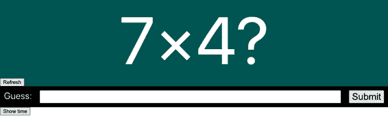

###### 图 8-2。我们不能通过内容找到数字，因为我们不知道它们是什么

所以，我们对代码进行了小修改，并添加了测试 ID：

```
<div className="Question-detail">
  <div data-testid="number1" className="number1">
    {pair && pair[0]}
  </div>
  &times;
  <div data-testid="number2" className="number2">
    {pair && pair[1]}
  </div>
  ?
</div>
```

这意味着我们可以开始实现测试的下一部分：

```
import { render, screen } from '@testing-library/react'
import App from './App'

describe('App', () => {
  it('should tell you when you win', () => {
    // Given we've rendered the app
    render(<App />)

    // When we enter the correct answer
    const number1 = screen.getByTestId('number1').textContent
    const number2 = screen.getByTestId('number2').textContent
    const input = screen.getByLabelText(/guess:/i)
    const submitButton = screen.getByText('Submit')
    // Err...

    // Then we are told that we've won
  })
})
```

我们已经有每个数字的文本，也有 `input` 元素。现在我们需要在字段中输入正确的数字，然后提交答案。我们将使用 `@testing-library/user-event` 库完成这个操作。User Event 库简化了为 HTML 元素生成 JavaScript 事件的过程。通常会看到 User Event 库被导入为别名 `user`，这是因为可以将对 User Event 库的调用视为用户所执行的操作：

```
import { render, screen } from '@testing-library/react'
import user from '@testing-library/user-event'
import App from './App'

describe('App', () => {
  it('should tell you when you win', () => {
    // Given we've rendered the app
    render(<App />)

    // When we enter the correct answer
    const number1 = screen.getByTestId('number1').textContent
    const number2 = screen.getByTestId('number2').textContent
    const input = screen.getByLabelText(/guess:/i)
    const submitButton = screen.getByText('Submit')
    user.type(input, '' + parseFloat(number1) * parseFloat(number2))
    user.click(submitButton)

    // Then we are told that we've won
  })
})
```

最后，我们需要断言我们已经获胜了。我们可以通过查找包含单词 *won* 的某个元素来简单地编写这个：^(2)

```
// Then we are told that we've won
screen.getByText(/won/i)
```

如果找不到精确匹配的元素，`getByText` 断言将失败。

如果你对测试中某一时刻的当前 HTML 状态感到不确定，请尝试在代码中添加 `screen.getByTestId('NONEXISTENT')`。抛出的异常将显示当前的 HTML。

然而，如果您的应用程序运行缓慢，测试很可能会失败。这是因为`get...`和`query...`函数查看 DOM 的现有状态。如果结果需要几秒钟才能出现，断言将失败。因此，将一些断言设置为异步是个好主意。这会使代码变得稍微复杂，但在运行速度慢的代码上运行时，测试会更加稳定。

`find...`方法是`get...`方法的异步版本，Testing Library 的`waitFor`函数将允许您在一段时间内重新运行代码。通过结合这两个函数，我们可以创建我们测试的最后一部分：

```
import { render, screen, waitFor } from '@testing-library/react'
import user from '@testing-library/user-event'
import App from './App'

describe('App', () => {
  it('should tell you when you win', async () => {
    // Given we've rendered the app
    render(<App />)

    // When we enter the correct answer
    const number1 = screen.getByTestId('number1').textContent
    const number2 = screen.getByTestId('number2').textContent
    const input = screen.getByLabelText(/guess:/i)
    const submitButton = screen.getByText('Submit')
    user.type(input, '' + parseFloat(number1) * parseFloat(number2))
    user.click(submitButton)

    // Then we are told that we've won
    await waitFor(() => screen.findByText(/won/i), { timeout: 4000 })
  })
})
```

单元测试应该快速运行，但如果由于某些原因您的测试需要超过五秒钟的时间，您将需要将第二个`timeout`值以毫秒传递给`it`函数。

## 讨论

在与不同团队合作时，我们发现在项目的早期阶段，开发人员会为每个组件编写单元测试。但随着时间的推移，他们会减少甚至删除太需要维护的单元测试。

部分原因是单元测试比浏览器测试更抽象。它们正在执行与浏览器测试相同类型的操作，但是这些操作是不可见的。当它们与组件交互时，您不会*看见*它们。

第二个原因是团队经常将测试视为项目中的可交付工件。如果单元测试未覆盖代码的某个百分比，团队甚至可能会有构建失败的情况。

如果开发人员在编写代码之前编写测试，这些问题通常会消失。如果您逐行编写测试，您将更好地掌握 HTML 的当前状态。如果您停止将测试视为开发工件，并开始将其视为设计代码的工具，它们将不再是耗时的负担，而是使您工作更轻松的工具。

写代码时的重要一点是从一个失败的测试开始。在项目的早期阶段，这可能是一个失败的浏览器测试。随着项目的成熟和架构的稳定，您应该创建越来越多的单元测试。

您可以从[GitHub 网站](https://oreil.ly/P1Tqj)下载此配方的源代码。

# 使用 Storybook 进行渲染测试

## 问题

测试只是您可以执行的简单示例。因此，测试与组件库系统（例如 Storybook）有很多共同之处。测试和图库都是在特定情况下运行的组件示例。而测试会用代码做出断言，开发人员会通过查看示例并检查其是否符合预期来对库示例进行*断言*。在图库和测试中，异常将非常明显。

存在一些差异。测试可以自动与组件交互；画廊组件需要人工按按钮和输入文本。开发人员可以用单一命令运行测试；画廊必须一次查看一个示例。画廊组件是视觉化的，易于理解；而测试则是抽象的，不那么有趣。

有没有办法将像 Storybook 这样的画廊与自动化测试结合起来，以兼得两者的优点？

## 解决方案

我们将看看如何在测试中重用您的 Storybook 故事。您可以使用以下命令将 Storybook 安装到您的应用中：

```
$ npx sb init
```

本章的示例应用是一个简单的数学游戏，用户需要计算乘法问题的答案（参见图 8-3）。


###### 图 8-3\. 示例应用

游戏中的一个组件称为 `Question`，它显示一个随机生成的乘法问题（参见图 8-4）。


###### 图 8-4\. 问题组件

我们可以不用太担心这个组件的测试。只需通过创建一些 Storybook 故事来构建它。我们将编写一个新的 *Question.stories.js* 文件：

```
import Question from './Question'

const Info = {
  title: 'Question',
}

export default Info

export const Basic = () => <Question />
```

然后，我们将创建一个初始版本的组件，在 Storybook 中查看并且满意：

```
import { useEffect, useState } from 'react'
import './Question.css'

const RANGE = 10

function rand() {
  return Math.floor(Math.random() * RANGE + 1)
}

const Question = ({ refreshTime }) => {
  const [pair, setPair] = useState()

  const refresh = () => {
    setPair((pair) => {
      return [rand(), rand()]
    })
  }

  useEffect(refresh, [refreshTime])

  return (
    <div className="Question">
      <div className="Question-detail">
        <div data-testid="number1" className="number1">
          {pair && pair[0]}
        </div>
        &times;
        <div data-testid="number2" className="number2">
          {pair && pair[1]}
        </div>
        ?
      </div>
      <button onClick={refresh}>Refresh</button>
    </div>
  )
}

export default Question
```

如果用户点击刷新按钮或者父组件传入新的 `refreshTime` 值，该组件会显示一个随机生成的问题。

在 Storybook 中显示组件，看起来它工作正常。我们可以点击刷新按钮，它就会刷新。因此，在这一点上，我们开始在主应用中使用这个组件。过了一段时间，我们添加了一些额外的功能，但它们都不是视觉上的改变，所以我们不再查看它的 Storybook 故事。毕竟，它看起来还是一样的。对吧？

这是一个修改后的组件版本，我们将其连接到应用的其余部分之后：

```
import { useEffect, useState } from 'react'
import './Question.css'

const RANGE = 10

function rand() {
  return Math.floor(Math.random() * RANGE + 1)
}

const Question = ({ onAnswer, refreshTime }) => {
  const [pair, setPair] = useState()
  const result = pair && pair[0] * pair[1]

  useEffect(() => {
    onAnswer(result)
  }, [onAnswer, result])

  const refresh = () => {
    setPair((pair) => {
      return [rand(), rand()]
    })
  }

  useEffect(refresh, [refreshTime])

  return (
    <div className="Question">
      <div className="Question-detail">
        <div data-testid="number1" className="number1">
          {pair && pair[0]}
        </div>
        &times;
        <div data-testid="number2" className="number2">
          {pair && pair[1]}
        </div>
        ?
      </div>
      <button onClick={refresh}>Refresh</button>
    </div>
  )
}

export default Question
```

这个版本只比之前略长一点点。我们添加了一个 `onAnswer` 回调函数，每次应用生成新问题时，它都会向父组件返回正确答案。

这个新组件在应用中表现良好，但接着发生了一件奇怪的事情。下次有人查看 Storybook 时，他们会注意到一个错误，如图 8-5 所示。

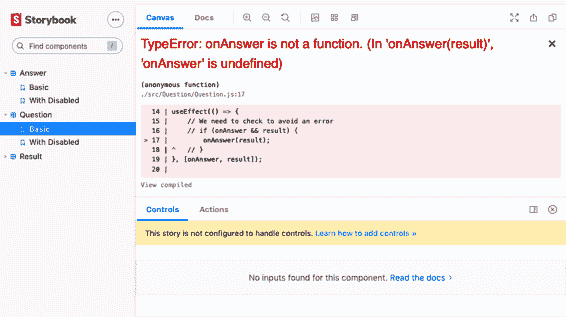

###### 图 8-5\. 查看组件新版本时发生错误

发生了什么？我们在代码中添加了一个隐含的假设，即父组件将始终向组件传递一个 `onAnswer` 回调函数。因为 Storybook 故事渲染 `Basic` 故事时没有 `onAnswer`，所以我们遇到了错误：

```
<Question/>
```

这重要吗？对于像这样的简单组件来说，可能不重要。毕竟，应用本身仍在工作。但是，未能处理丢失的属性，例如这里缺少的回调或更常见的缺少数据，是 React 中错误的最典型原因之一。

应用程序经常使用来自网络的数据生成 React 属性，这意味着您传递给组件的初始属性通常会是 null 或 undefined。通常建议要么使用类型安全的语言，如 TypeScript，以避免这些问题，要么编写测试以检查您的组件是否能够处理丢失的属性。

我们创建了这个组件而没有任何测试，但我们确实用 Storybook 的故事创建了它，并且该故事确实捕捉到了问题。那么有没有办法编写一个测试来自动检查 Storybook 是否可以渲染所有故事？

我们将在名为*Question.test.js*的文件中为此组件创建一个测试。

考虑为每个组件创建一个文件夹。而不是在*src*目录中简单地放置一个名为*Question.js*的文件，创建一个名为*src/Question*的文件夹，在其中放置*Question.js*、*Question.stories.js*和*Question.test.js*。然后，如果添加一个*src/Question/index.js*文件，它默认导出`Question`组件，那么您的其余代码将不受影响，并且可以减少其他开发人员需要处理的文件数量。^(3)

然后在测试文件中，我们可以创建一个 Jest 测试，加载每个故事，然后将它们传递给 Testing Library 的`render`函数：^(4)

```
import { render } from '@testing-library/react'
import Question from './Question'

const stories = require('./Question.stories')

describe('Question', () => {
  it('should render all storybook stories without error', () => {
    for (let story in stories) {
      if (story !== 'default') {
        let C = stories[story]
        render(<C />)
      }
    }
  })
})
```

如果您的故事使用*装饰器*来提供诸如路由器或样式之类的内容，则此技术将无法自动获取它们。您应该在测试中的`render`方法中添加它们。

运行此测试时，您将会收到一个失败：

```
onAnswer is not a function
TypeError: onAnswer is not a function
```

我们可以通过在调用之前检查是否有回调来修复错误：

```
useEffect(() => {
  // We need to check to avoid an error
  if (onAnswer && result) {
    onAnswer(result)
  }
}, [onAnswer, result])
```

这种技术允许您以最小的工作量为组件创建一些基本测试。值得为组件创建一个不包含任何属性的故事。然后，在添加新属性之前，创建一个使用它的故事，并考虑您期望组件如何行为。

即使测试只执行每个故事的简单渲染，也没有理由您不能导入单个故事并创建一个使用该故事的测试：

```
import { render, screen } from '@testing-library/react'
import user from '@testing-library/user-event'
import Question from './Question'
import { Basic, WithDisabled } from './Question.stories'
...
it('should disable the button when asked', () => {
  render(<WithDisabled />)
  const refreshButton = screen.getByRole('button')
  expect(refreshButton.disabled).toEqual(true)
})
```

## 讨论

Storybook 渲染测试将基础单元测试引入到您的应用程序中，它可以发现大量的回归错误。它还帮助您将测试视为示例，这些示例有助于您设计代码，而不是必须为了让团队领导满意而创建的编码工件。为故事创建渲染测试还有助于如果您的团队对单元测试还不熟悉的话。通过创建视觉示例，它可以避免非视觉测试感觉抽象所带来的问题。它还可以让开发人员养成为系统中的每个组件编写测试文件的习惯。当您需要对组件进行微小更改时，添加一个小的单元测试函数就会变得更加容易。

你可以从[GitHub 网站](https://oreil.ly/P1Tqj)下载这个配方的源代码。

# 使用 Cypress 在没有服务器的情况下进行测试

## 问题

高质量代码的主要特征之一是其对错误的响应方式。Peter Deutsch 的[分布式计算的八个谬论](https://oreil.ly/eDtKG)中的第一个是：“网络是可靠的”。不仅网络*不*可靠，连接到它的服务器或数据库也不可靠。在某些时候，您的应用程序将不得不处理某些网络故障。可能是手机失去连接，服务器宕机，数据库崩溃，或者其他人已经删除了您尝试更新的数据。无论原因是什么，您都需要决定在发生严重问题时应用程序应该做什么。

在测试环境中模拟网络问题可能是具有挑战性的。如果您编写的代码使服务器进入某种错误状态，这可能会对其他测试或连接到服务器的用户造成问题。

您如何为网络故障情况创建自动化测试？

## 解决方案

对于这个配方，我们将使用 Cypress。我们在第一章中提到了 Cypress 测试系统。这是一个真正卓越的测试系统，在许多开发项目中迅速成为我们的首选工具。

要将 Cypress 安装到您的项目中，请输入以下命令：

```
$ npm install --save-dev cypress
```

Cypress 通过自动化 Web 浏览器来工作。从这个意义上说，它类似于其他系统如 Selenium。不过，Cypress 的区别在于它不需要你安装单独的驱动程序，它可以远程控制浏览器，并将自己注入到浏览器的 JavaScript 引擎中。

因此，Cypress 可以积极地用虚拟版本替换 JavaScript 基础设施的核心部分，以便控制它们。例如，Cypress 可以替换用于向服务器发出网络调用的 JavaScript `fetch` 函数。^(5) 因此，Cypress 测试可以伪造网络服务器的行为，并允许客户端开发人员从服务器上人工制作响应。

我们将使用本章其他配方中使用的示例游戏应用程序。每当用户回答问题时，我们将添加一个网络调用来存储结果。在 Cypress 中，我们可以通过伪造响应而无需创建实际的服务器代码来实现这一点。

为了展示其工作原理，我们首先将创建一个模拟服务器正确响应的测试。然后我们将创建一个模拟服务器失败的测试。

安装 Cypress 后，在 *cypress/integration/* 目录下创建一个名为 *0001-basic-game-functions.js* 的文件:^(6)

```
describe('Basic game functions', () => {
  it('should notify the server if I lose', () => {
    // Given I started the application
    // When I enter an incorrect answer
    // Then the server will be told that I have lost
  })
})
```

我们已为需要编写的每个步骤放置了占位符注释。

Cypress 中的每个命令和断言都以 `cy` 开头。如果我们想在浏览器中打开位置为 *http://localhost:3000* 的页面，可以使用以下命令：

```
describe('Basic game functions', () => {
  it('should notify the server if I lose', () => {
    // Given I started the application
    cy.visit('http://localhost:3000')

    // When I enter an incorrect answer
    // Then the server will be told that I have lost
  })
})
```

要运行测试，我们可以输入：

```
$ npx cypress run
```

那个命令将运行所有测试而不显示浏览器。^(7) 我们还可以输入以下内容：

```
$ npx cypress open
```

此命令将打开 Cypress 应用程序窗口（如您在 图 8-6 中所见）。如果我们双击测试文件，测试将在浏览器中打开（如您在 图 8-7 中所见）。

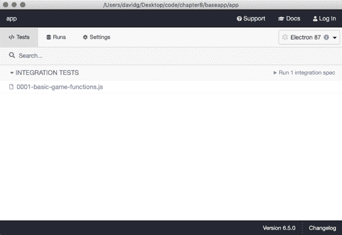

###### 图 8-6\. 当您输入`**npx cypress open**`时，测试将显示在 Cypress 窗口中。

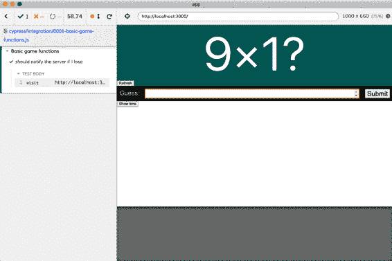

###### 图 8-7\. 在浏览器中运行的 Cypress 测试

示例应用程序要求用户计算两个随机数的乘积（参见 图 8-8）。这些数字的范围是 1–10，因此，如果我们输入 **`101`**，我们可以确定答案是错误的。

Cypress 不允许直接从屏幕捕获文本内容。因此，我们无法简单地读取两个数字的值并将其存储在变量中，因为 Cypress 命令不会立即在浏览器中执行操作。相反，当您运行命令时，Cypress 将其添加到一系列指令中，并在测试结束时执行它们。这种方法可能有些奇怪，但这些可链式操作的指令允许 Cypress 处理大多数由异步接口引起的问题。^(8) 不利之处在于，没有命令能够返回页面内容，因为命令运行时页面尚不存在。

我们将在本章其他地方看到如何在测试场景中去除随机性，并使此测试具有确定性，这将消除从页面获取数据的需求。


###### 图 8-8\. 应用程序要求用户计算两个随机数的乘积

我们可以使用 `cy.get` 命令通过 CSS 选择器找到输入字段。我们还可以使用 `cy.contains` 命令找到提交按钮：

```
describe('Basic game functions', () => {
  it('should notify the server if I lose', () => {
    // Given I started the application
    cy.visit('http://localhost:3000')

    // When I enter an incorrect answer
    cy.get('input').type('101')
    cy.contains('Submit').click()

    // Then the server will be told that I have lost
  })
})
```

现在我们只需测试应用程序是否将游戏结果传递给服务器。

我们将使用 `cy.intercept()` 命令来做到这一点。`cy.intercept()` 命令将改变应用程序中网络请求的行为，以便我们可以为特定请求伪造响应。如果结果将被 POST 到端点 */api/result*，我们可以生成如下的伪造响应：

```
cy.intercept('POST', '/api/result', {
  statusCode: 200,
  body: '',
})
```

一旦这个命令生效，对 */api/result* 的网络请求将收到伪造的响应。这意味着我们需要在进行网络请求之前运行该命令。我们将在测试开始时执行它：

```
describe('Basic game functions', () => {
  it('should notify the server if I lose', () => {
    // Given I started the application
    cy.intercept('POST', '/api/result', {
      statusCode: 200,
      body: '',
    })
    cy.visit('http://localhost:3000')

    // When I enter an incorrect answer
    cy.get('input').type('101')
    cy.contains('Submit').click()

    // Then the server will be told that I have lost
  })
})
```

现在我们已经指定了网络响应。但是如何断言应用程序已经进行了网络调用，并且如何知道它已经将正确的数据发送到了 */api/result* 端点呢？

我们需要为网络请求指定一个 *别名*。这样可以让我们稍后在测试中引用该请求:^(9)

```
cy.intercept('POST', '/api/result', {
  statusCode: 200,
  body: '',
}).as('postResult')
```

然后我们可以在测试结束时进行断言，等待网络调用完成，并检查发送到请求体中的数据内容：

```
describe('Basic game functions', () => {
  it('should notify the server if I lose', () => {
    // Given I started the application
    cy.intercept('POST', '/api/result', {
      statusCode: 200,
      body: '',
    }).as('postResult')
    cy.visit('http://localhost:3000')

    // When I enter an incorrect answer
    cy.get('input').type('101')
    cy.contains('Submit').click()

    // Then the server will be told that I have lost
    cy.wait('@postResult').then((xhr) => {
      expect(xhr.request.body.guess).equal(101)
      expect(xhr.request.body.result).equal('LOSE')
    })
  })
})
```

此断言检查请求体的两个属性是否具有预期值。

如果我们现在运行测试，它将通过（如您在 图 8-9 中所见）。

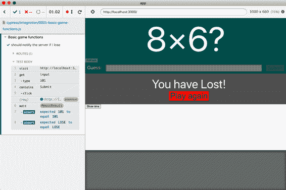

###### 图 8-9\. 完成的测试通过

现在我们已经为成功情况创建了一个测试，我们可以为失败情况编写测试。如果网络调用失败，应用程序应在屏幕上显示一条消息。在这个测试中，我们实际上并不关心发送到服务器的详细信息，但我们仍然需要等待网络请求完成，然后检查错误消息的存在：

```
it('should display a message if I cannot post the result', () => {
  // Given I started the application
  cy.intercept('POST', '/api/result', {
    statusCode: 500,
    body: { message: 'Bad thing happened!' },
  }).as('postResult')
  cy.visit('http://localhost:3000')

  // When I enter an answer
  cy.get('input').type('16')
  cy.contains('We are unable to save the result').should('not.exist')
  cy.contains('Submit').click()

  // Then I will see an error message
  cy.wait('@postResult')
  cy.contains('We are unable to save the result')
})
```

注意，在进行网络调用之前，我们检查错误消息 *不存在*，以确保网络调用 *导致* 错误。

除了生成存根响应和状态码外，`cy.intercept` 还可以执行其他技巧，如减慢响应时间、限制网络速度或从测试函数生成响应。更多详细信息，请参阅 [`cy.intercept` 文档](https://oreil.ly/tcZR8)。

## 讨论

Cypress 测试可以改变开发团队的工作方式，特别是在模拟网络调用方面。团队通常以不同的节奏开发 API 和前端代码。此外，一些团队有专门从事前端或服务器代码的开发人员。Cypress 在这些情况下很有帮助，因为它允许前端开发人员编写针对尚不存在的端点的代码。Cypress 还可以模拟所有病理性失败情况。

网络性能可能会引入间歇性的错误。开发环境使用本地服务器，数据很少或没有，这意味着开发时的 API 性能比生产环境好得多。编写假设数据立即可用的代码很简单，但是在生产环境中，数据可能需要一两秒才能到达，这种代码就会出问题。

因此，值得至少为每个 API 调用运行一次测试，其中响应时间延迟约一秒钟：

```
cy.intercept('GET', '/api/widgets', {
  statusCode: 200,
  body: [{ id: 1, name: 'Flange' }],
  delay: 1000,
}).as('getWidgets')
```

模拟缓慢的网络响应通常会暴露出许多可能会潜入代码中的异步错误。

几乎同样重要的是，创建人工缓慢的网络响应将让您了解每个 API 调用对性能的总体影响。

您可以从[GitHub 站点](https://oreil.ly/P1Tqj)下载此配方的源代码。

# 使用 Cypress 进行离线测试

## 问题

此配方使用了由[Etienne Bruines](https://oreil.ly/oOMHP)发明的自定义 Cypress 命令。

应用程序需要处理与网络断开连接的情况。我们在其他地方已经看到如何创建钩子以检测当前是否离线。^(10) 但是我们如何测试离线行为呢？

## 解决方案

我们可以使用 Cypress 模拟离线工作。Cypress 测试可以注入修改浏览器测试的内部行为的代码。因此，我们应该能够修改网络代码以模拟离线条件。

对于此配方，您需要在应用程序中安装 Cypress。如果尚未安装 Cypress，则可以在应用程序目录中运行以下命令进行安装：

```
$ npm install --save-dev cypress
```

您可以然后在 *cypress/integration* 目录中添加一个 *0002-offline-working.js* 文件：

```
describe('Offline working', () => {
  it(
    'should tell us when we are offline',
    { browser: '!firefox' },
    () => {
      // Given we have started the application
      // When the application is offline
      // Then we will see a warning
      // When the application is back online
      // Then we will not see a warning
    }
  )
})
```

我们将在 Firefox 上忽略此测试。离线模拟代码依赖于 Chrome DevTools 远程调试协议，而该协议目前在 Firefox 浏览器中不可用。

我们已经将测试结构标记为一系列注释。所有 Cypress 命令都以 `cy` 开头，因此我们可以像这样打开应用程序：

```
describe('Offline working', () => {
  it(
    'should tell us when we are offline',
    { browser: '!firefox' },
    () => {
      // Given we have started the application
      cy.visit('http://localhost:3000')

      // When the application is offline
      // Then we will see a warning
      // When the application is back online
      // Then we will not see a warning
    }
  )
})
```

如何强制浏览器模拟离线工作呢？

我们可以这样做，因为 Cypress 设计为可扩展的。我们可以添加一个自定义 Cypress 命令，允许我们切换到离线状态然后再切换回在线状态：

```
cy.network({ offline: true })
cy.network({ offline: false })
```

要添加自定义命令，请打开 *cypress/support/commands.js* 文件，并添加以下代码：

```
Cypress.Commands.add('network', (options = {}) => {
  Cypress.automation('remote:debugger:protocol', {
    command: 'Network.enable',
  })

  Cypress.automation('remote:debugger:protocol', {
    command: 'Network.emulateNetworkConditions',
    params: {
      offline: options.offline,
      latency: 0,
      downloadThroughput: 0,
      uploadThroughput: 0,
      connectionType: 'none',
    },
  })
})
```

此命令使用 DevTools 中的远程调试协议来模拟离线网络条件。保存此文件后，您可以实现其余的测试：

```
describe('Offline working', () => {
  it(
    'should tell us when we are offline',
    { browser: '!firefox' },
    () => {
      // Given we have started the application
      cy.visit('http://localhost:3000')
      cy.contains(/you are currently offline/i).should('not.exist')

      // When the application is offline
      cy.network({ offline: true })

      // Then we will see a warning
      cy.contains(/you are currently offline/i).should('be.visible')

      // When the application is back online
      cy.network({ offline: false })

      // Then we will not see a warning
      cy.contains(/you are currently offline/i).should('not.exist')
    }
  )
})
```

如果现在在 Electron 中运行测试，它将通过（见 Figure 8-10）。

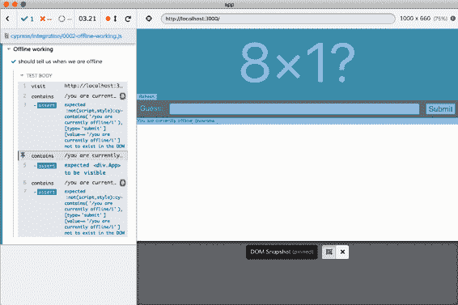

###### 图 8-10\. 您可以通过单击左侧面板查看在线/离线测试的每个阶段

## 讨论

应该可以创建类似的命令来模拟各种网络条件和速度。

有关网络命令工作原理的更多信息，请参阅[Cypress.io 的此篇博文](https://oreil.ly/PB4zO)。

您可以从[GitHub 站点](https://oreil.ly/P1Tqj)下载此配方的源代码。

# 使用 Selenium 在浏览器中进行测试

## 问题

没有什么比在真实浏览器中运行代码更好，编写自动化基于浏览器的测试的最常见方法是使用*Web 驱动程序*。你可以通过向网络端口发送命令来控制大多数浏览器。不同的浏览器有不同的命令，而 Web 驱动程序是一个命令行工具，它简化了控制浏览器的过程。

但是，我们如何为使用 Web 驱动程序的 React 应用程序编写测试呢？

## 解决方案

我们将使用 Selenium 库。Selenium 是一个为各种 Web 驱动程序提供一致 API 的框架，这意味着你可以为 Firefox 编写测试，同样的代码应该在 Chrome、Safari 和 Edge 中同样有效。^(11)

我们将使用本章中的所有示例应用程序相同的示例应用程序。这是一个询问用户简单乘法问题答案的游戏。

Selenium 库支持多种不同的编程语言，如 Python、Java 和 C#。我们将使用 JavaScript 版本：Selenium WebDriver。

我们将从安装 Selenium 开始：

```
$ npm install --save-dev selenium-webdriver
```

我们还需要安装至少一个 Web 驱动程序。你可以全局安装 Web 驱动程序，但更可管理的方式是将它们安装在你的应用程序中。我们可以为 Firefox 安装像`geckodriver`这样的驱动程序，但现在我们将为 Chrome 安装`chromedriver`：

```
$ npm install --save-dev chromedriver
```

我们现在可以开始创建一个测试。将 Selenium 测试包含在应用程序的*src*文件夹内是很有用的，因为这样可以更轻松地使用 IDE 手动运行测试。因此，我们将创建一个名为*src/selenium*的文件夹，并在其中添加一个名为*0001-basic-game-functions.spec.js*的文件:^(12)

```
describe('Basic game functions', () => {
  it('should tell me if I won', () => {
    // Given I have started the application
    // When I enter the correct answer
    // Then I will be told that I have won
  })
})
```

我们在注释中概述了测试。

尽管将 Selenium 测试包含在*src*树中很方便，但这可能导致像 Jest 这样的工具将其视为单元测试来运行，如果你在后台持续运行单元测试，这就是个问题。例如，如果你使用`create-react-app`创建应用程序并保持`npm run test`命令运行，你会发现每次保存 Selenium 测试时浏览器突然出现在屏幕上。为了避免这种情况，请采用某种命名约定来区分 Selenium 和单元测试。如果你将所有的 Selenium 测试命名为**.spec.js*，你可以通过修改测试脚本来避免它们，设置为*react-scripts test ‘.*.test.js’*。

Selenium 使用 Web 驱动程序来自动化 Web 浏览器。我们可以在每个测试开始时创建一个驱动程序的实例：

```
import { Builder } from 'selenium-webdriver'
let driver

describe('Basic game functions', () => {
  beforeEach(() => {
    driver = new Builder().forBrowser('chrome').build()
  })

  afterEach(() => {
    driver.quit()
  })

  it('should tell me if I won', () => {
    // Given I have started the application
    // When I enter the correct answer
    // Then I will be told that I have won
  })
})
```

在这个示例中，我们正在创建一个 Chrome 驱动程序。

通过为每个测试创建一个驱动程序，我们还将为每个测试创建一个全新的浏览器实例，确保没有浏览器状态在测试之间传递。 如果我们在测试之间不保留状态，那么我们可以以任何顺序运行测试。 我们在共享服务器状态上没有这样的保证。 例如，如果您的测试依赖于数据库数据，您应确保每个测试在启动时正确初始化服务器。

要让 Selenium 创建驱动程序的实例，我们还应该明确*require*驱动程序：

```
import { Builder } from 'selenium-webdriver'
require('chromedriver')

let driver

describe('Basic game functions', () => {
  beforeEach(() => {
    driver = new Builder().forBrowser('chrome').build()
  })

  afterEach(() => {
    driver.quit()
  })

  it('should tell me if I won', () => {
    // Given I have started the application
    // When I enter the correct answer
    // Then I will be told that I have won
  })
})
```

现在我们可以开始填写测试。 Selenium 的 JavaScript 版本是高度异步的。 几乎所有命令都返回承诺，这意味着它非常高效，但也很容易引入测试错误。

让我们通过打开应用程序来开始我们的测试：

```
import { Builder } from 'selenium-webdriver'
require('chromedriver')

let driver

describe('Basic game functions', async () => {
  beforeEach(() => {
    driver = new Builder().forBrowser('chrome').build()
  })

  afterEach(() => {
    driver.quit()
  })

  it('should tell me if I won', () => {
    // Given I have started the application
    await driver.get('http://localhost:3000')
    // When I enter the correct answer
    // Then I will be told that I have won
  }, 60000)
})
```

`driver.get`命令告诉浏览器打开给定的 URL。为了使其工作，我们还必须进行其他两个更改。首先，我们必须使用`async`标记测试函数，这将允许我们`await`通过`driver.get`返回的承诺。

其次，我们向测试添加了一个 60,000 毫秒的超时值，覆盖了 Jest 测试的隐式五秒限制。如果您不增加默认超时时间，则会发现您的测试在浏览器启动之前失败。我们在这里将其设置为 60,000 毫秒，以确保测试在任何机器上都能正常工作。您应根据您的预期硬件调整此值。

要输入正确的值到游戏中，我们需要读取问题中显示的两个数字（如图 8-11 所示）。


###### 图 8-11\. 游戏要求用户计算一个随机乘积

我们可以使用名为`findElement`的命令找到页面上的两个数字以及`input`和`submit`按钮：

```
const number1 = await driver.findElement(By.css('.number1')).getText()
const number2 = await driver.findElement(By.css('.number2')).getText()
const input = await driver.findElement(By.css('input'))
const submit = await driver.findElement(
  By.xpath("//button[text()='Submit']")
)
```

如果您从页面中读取一组元素，并且不关心按严格顺序解析它们，您可以使用`Promise.all`函数将它们组合成一个单一的承诺，然后等待它们：

```
const [number1, number2, input, submit] = await Promise.all([
  driver.findElement(By.css('.number1')).getText(),
  driver.findElement(By.css('.number2')).getText(),
  driver.findElement(By.css('input')),
  driver.findElement(By.xpath("//button[text()='Submit']")),
])
```

在示例应用程序中，这种优化几乎不会节省时间，但如果页面以不确定的顺序渲染不同的组件，那么结合承诺可能会提高测试性能。

这意味着我们现在可以完成我们测试的下一部分：

```
import { Builder, By } from 'selenium-webdriver'
require('chromedriver')

let driver

describe('Basic game functions', async () => {
  beforeEach(() => {
    driver = new Builder().forBrowser('chrome').build()
  })

  afterEach(() => {
    driver.quit()
  })

  it('should tell me if I won', () => {
    // Given I have started the application
    await driver.get('http://localhost:3000')
    // When I enter the correct answer
    const [number1, number2, input, submit] = await Promise.all([
      driver.findElement(By.css('.number1')).getText(),
      driver.findElement(By.css('.number2')).getText(),
      driver.findElement(By.css('input')),
      driver.findElement(By.xpath("//button[text()='Submit']")),
    ])
    await input.sendKeys('' + number1 * number2)
    await submit.click()
    // Then I will be told that I have won
  }, 60000)
})
```

注意，我们没有将`sendKeys`和`click`返回的承诺合并，因为我们在意测试在提交之前*将答案输入到输入字段中*。

最后，我们希望断言屏幕上出现一个*你赢了！*的消息（参见图 8-12）。


###### 图 8-12\. 应用程序告诉用户他们得到了正确的答案

现在我们可以这样写我们的断言：

```
const resultText = await driver
  .findElement(By.css('.Result'))
  .getText()
expect(resultText).toMatch(/won/i)
```

这段代码几乎肯定会成功，因为在用户提交答案后结果会迅速显示。React 应用程序通常会显示动态结果，特别是如果它们依赖于网络数据。如果我们修改应用程序代码以模拟结果出现前的两秒延迟^(13)，我们的测试将产生以下错误：

```
no such element: Unable to locate element: {"method":"css selector",
 "selector":".Result"}
 (Session info: chrome=88.0.4324.192)
NoSuchElementError: no such element: Unable to locate element: {
 "method":"css selector","selector":".Result"}
 (Session info: chrome=88.0.4324.192)
```

我们可以通过等待元素出现在屏幕上，然后等待文本匹配预期结果来避免这个问题。我们可以使用`driver.wait`函数来完成这两件事情：

```
await driver.wait(until.elementLocated(By.css('.Result')))
const resultElement = driver.findElement(By.css('.Result'))
await driver.wait(until.elementTextMatches(resultElement, /won/i))
```

这给了我们测试的最终版本：

```
import { Builder, By } from 'selenium-webdriver'
require('chromedriver')

let driver

describe('Basic game functions', async () => {
  beforeEach(() => {
    driver = new Builder().forBrowser('chrome').build()
  })

  afterEach(() => {
    driver.quit()
  })

  it('should tell me if I won', () => {
    // Given I have started the application
    await driver.get('http://localhost:3000')
    // When I enter the correct answer
    const [number1, number2, input, submit] = await Promise.all([
      driver.findElement(By.css('.number1')).getText(),
      driver.findElement(By.css('.number2')).getText(),
      driver.findElement(By.css('input')),
      driver.findElement(By.xpath("//button[text()='Submit']")),
    ])
    await input.sendKeys('' + number1 * number2)
    await submit.click()
    // Then I will be told that I have won
    await driver.wait(until.elementLocated(By.css('.Result')))
    const resultElement = driver.findElement(By.css('.Result'))
    await driver.wait(until.elementTextMatches(resultElement, /won/i))
  }, 60000)
})
```

## 讨论

根据我们的经验，Web 驱动程序测试是 Web 应用程序的自动化测试中最流行的形式——*流行*，即*经常使用的*。它们不可避免地依赖于匹配的浏览器和 Web 驱动程序版本，并且因时序问题而偶尔会失败。这些时序问题通常在单页面应用程序中更为常见，因为它们可以异步更新内容。

尽管可以通过在代码中小心添加时序延迟和重试来避免这些问题，但这可能会使您的测试对环境变化敏感，例如在不同的测试服务器上运行应用程序。如果您经常遇到间歇性失败的问题，另一个选择是将更多的测试移至像 Cypress 这样的系统，它通常更 [容忍](https://oreil.ly/IZJ2T) 时序失败。

您可以从 [GitHub 站点](https://oreil.ly/P1Tqj) 下载此配方的源代码。

# 使用 ImageMagick 测试跨浏览器视觉

## 问题

应用程序在不同浏览器上查看时可能会有很大差异。甚至在同一浏览器但不同操作系统上查看时，应用程序的外观也可能不同。一个例子是 Chrome，在 Mac 上查看时往往隐藏滚动条，但在 Windows 上显示它们。值得庆幸的是，像 Internet Explorer 这样的旧浏览器终于在逐渐消失，但即使是现代浏览器也可能以微妙不同的方式应用 CSS，从而根本改变页面的外观。

在多种浏览器和平台上手动持续检查应用程序可能会耗费大量时间。

我们可以做什么来自动化这个兼容性过程？

## 解决方案

在这个配方中，我们将结合三种工具来检查不同浏览器和平台上的视觉一致性：

Storybook

这将为我们提供一个所有相关配置中所有组件的基本画廊，我们需要检查这些组件。

Selenium

这将允许我们捕获 Storybook 中所有组件的视觉外观。Selenium Grid 还将允许我们远程连接到不同操作系统上的浏览器，以进行操作系统之间的比较。

ImageMagick

具体来说，我们将使用 ImageMagick 的`compare`工具生成两个屏幕截图之间的视觉差异，并提供两幅图像有多远的数值度量。

我们将从安装 Storybook 开始。您可以使用以下命令在您的应用程序中执行此操作：

```
$ npx sb init
```

然后，您需要为您感兴趣跟踪的每个组件和配置创建*stories*。您可以从本书的其他章节或[Storybook 教程](https://oreil.ly/ak7VW)中了解如何操作。

接下来，我们将需要 Selenium 来自动化截取屏幕截图。您可以使用以下命令安装 Selenium：

```
$ npm install --save-dev selenium-webdriver
```

您还需要安装相关的 Web 驱动程序。例如，要自动化 Firefox 和 Chrome，您需要以下内容：

```
$ npm install --save-dev geckodriver
$ npm install --save-dev chromedriver
```

最后，您需要安装 ImageMagick，一组命令行图像处理工具。有关如何安装 ImageMagick 的详细信息，请参阅[ImageMagick 下载页面](https://oreil.ly/NIQ0A)。

我们将使用本章之前用过的同一个示例游戏应用程序。您可以在 Storybook 中查看应用程序中显示的组件，如图 8-13 所示。

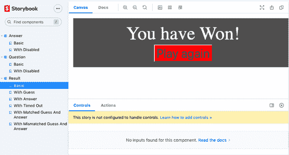

###### 图 8-13\. Storybook 中显示的应用程序组件

您可以通过输入以下内容来运行您的应用程序上的 Storybook 服务器： 

```
$ npm run storybook
```

接下来，我们将创建一个测试，这个测试将只是一个脚本，用于捕获 Storybook 中每个组件的屏幕截图。在名为*src/selenium*的文件夹中，创建一个名为*shots.spec.js*的脚本：^(14)

```
import { Builder, By, until } from 'selenium-webdriver'

require('chromedriver')
let fs = require('fs')

describe('shots', () => {
  it('should take screenshots of storybook components', async () => {
    const browserEnv = process.env.SELENIUM_BROWSER || 'chrome'
    const url = process.env.START_URL || 'http://localhost:6006'
    const driver = new Builder().forBrowser('chrome').build()
    driver.manage().window().setRect({
      width: 1200,
      height: 900,
      x: 0,
      y: 0,
    })

    const outputDir = './screenshots/' + browserEnv
    fs.mkdirSync(outputDir, { recursive: true })

    await driver.get(url)

    await driver.wait(
      until.elementLocated(By.className('sidebar-item')),
      60000
    )
    let elements = await driver.findElements(
      By.css('button.sidebar-item')
    )
    for (let e of elements) {
      const expanded = await e.getAttribute('aria-expanded')
      if (expanded !== 'true') {
        await e.click()
      }
    }
    let links = await driver.findElements(By.css('a.sidebar-item'))
    for (let link of links) {
      await link.click()
      const s = await link.getAttribute('id')
      let encodedString = await driver
        .findElement(By.css('#storybook-preview-wrapper'))
        .takeScreenshot()
      await fs.writeFileSync(
        `${outputDir}/${s}.png`,
        encodedString,
        'base64'
      )
    }

    driver.quit()
  }, 60000)
})
```

该脚本打开一个浏览器到 Storybook 服务器，打开每个组件，并对每个 story 进行截图，然后将其存储在*screenshots*子目录中。

我们可以使用不同的测试系统来截取每个组件的屏幕截图，比如 Cypress。使用 Selenium 的优势在于我们可以在远程机器上打开浏览器会话。

默认情况下，*shots.spec.js*测试将使用 Chrome 浏览器在*http://localhost:6006*地址上的 Storybook 进行屏幕截图。假设我们在 Mac 上运行*shots*测试。如果我们有一个在同一网络上的 Windows 机器，我们可以安装 Selenium Grid 服务器，这是一个[代理服务器](https://oreil.ly/gYLds)，允许远程机器启动 Web 驱动程序会话。

如果 Windows 机器的地址是`192.168.1.16`，我们可以在运行*shots.spec.js*测试之前在命令行中设置这个环境变量：

```
$ export SELENIUM_REMOTE_URL=http://192.168.1.16:4444/wd/hub
```

因为 Windows 机器将访问位于 Mac 上的 Storybook 服务器，例如，其 IP 地址为`192.168.1.14`，我们还需要在命令行中为其设置一个环境变量：

```
$ export START_URL=http://192.168.1.14:6006
```

我们还可以选择 Windows 机器要使用的浏览器：^(15)

```
$ export SELENIUM_BROWSER=firefox
```

如果我们创建一个脚本在*package.json*中运行*shots.spec.js*：

```
 "scripts": {
  ...
  "testShots": "CI=true react-scripts test --detectOpenHandles \
 'selenium/shots.spec.js'"
  }
```

我们可以运行测试并捕获每个组件的屏幕截图：

```
$ npm run testShots
```

测试将使用我们创建的环境变量联系远程机器上的 Selenium Grid 服务器。它将要求 Selenium Grid 打开一个 Firefox 浏览器到我们本地的 Storybook 服务器。然后它将通过网络发送每个组件的屏幕截图，在测试中将它们存储在名为 *screenshots/firefox* 的文件夹中。

运行完 Firefox 后，我们可以继续运行 Chrome：

```
$ export SELENIUM_BROWSER=chrome
$ npm run testShots
```

测试将把 Chrome 的屏幕截图写入 *screenshots/chrome* 文件夹。

这种技术的更全面实现还会记录操作系统和客户端类型（例如，屏幕大小）。

现在我们需要检查 Chrome 和 Firefox 屏幕截图之间的视觉差异，这就是 ImageMagick 发挥作用的地方。ImageMagick 中的 `compare` 命令可以生成一个突出显示两个其他图像之间视觉差异的图像。例如，考虑 图 8-14 中的 Firefox 和 Chrome 两个屏幕截图。

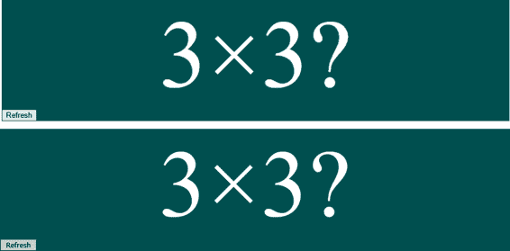

###### 图 8-14\. Chrome 和 Firefox 中的同一组件

这两个图像看起来是相同的。如果我们从应用程序目录中输入以下命令：

```
$ compare -fuzz 15% screenshots/firefox/question--basic.png \
 screenshots/chrome/question--basic.png difference.png
```

我们将生成一个新的图像，显示两个屏幕截图之间的差异，你可以在 图 8-15 中看到。


###### 图 8-15\. 显示两个屏幕截图差异的生成图像

生成的图像显示两个图像之间超过 15% 的视觉差异的像素。你可以看到这些屏幕截图几乎是相同的。

这很好，但仍需要一个人看图片并评估差异是否显著。我们还能做些什么？

`compare` 命令还能显示两个图像之间差异的数值度量：

```
$ compare -metric AE -fuzz 15% screenshots/firefox/question--basic.png
 screenshots/chrome/question--basic.png difference.png
6774
```

值 `6774` 是两个图像视觉差异的数值度量（基于绝对误差计数，或 *AE*）。举例来说，考虑 图 8-16 中展示的当 `Answer` 组件被赋予 `disabled` 属性时的两个屏幕截图。

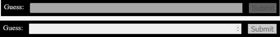

###### 图 8-16\. Chrome 和 Firefox 渲染的禁用表单

比较这两个图像会返回一个更大的数值：

```
$ compare -metric AE -fuzz 15% screenshots/firefox/answer--with-disabled.png
 screenshots/chrome/answer--with-disabled.png difference3.png
28713
```

实际上，生成的图像（见 图 8-17）清楚地显示了差异所在：禁用的输入字段。


###### 图 8-17\. Chrome 和 Firefox 表单之间的视觉差异

图 8-18 展示了在两个浏览器之间展示不同字体样式的组件的类似显著差异（21,131），这是由一些特定于 Mozilla 的 CSS 属性引起的。

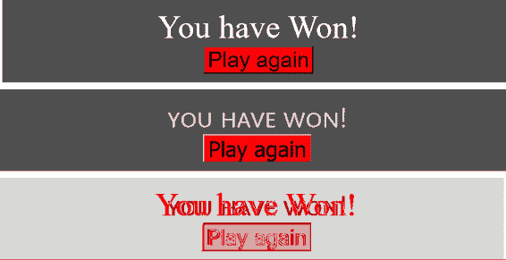

###### 图 8-18\. Chrome 和 Firefox 中文本样式不同的组件

实际上，可以编写一个 shell 脚本，通过每个图像并生成一个小的网页报告，显示其视觉差异和相关指标：

```
#!/bin/bash
mkdir -p screenshots/diff
export HTML=screenshots/compare.html
echo '<body><ul>' > $HTML
for file in screenshots/chrome/*.png
do
 FROM=$file
 TO=$(echo $file | sed 's/chrome/firefox/')
 DIFF=$(echo $file | sed 's/chrome/diff/')
 echo "FROM $FROM TO $TO"
 ls -l $FROM
 ls -l $TO
 METRIC=$(compare -metric AE -fuzz 15% $FROM $TO $DIFF 2>&1)
 echo "<li>$FROM $METRIC<br/></li>" >> $HTML
done
echo "</li></body>" >> $HTML
```

此脚本创建了*screenshots/compare.html*报告，可以在图 8-19 中看到。

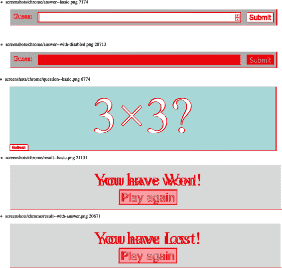

###### 图 8-19\. 生成的比较报告示例

## 讨论

为了节省空间，我们仅展示了这种技术的简单实现。可以创建一个排名报告，按从大到小的顺序显示视觉差异。这样的报告将突出显示不同平台之间最显著的视觉差异。

您还可以使用自动化视觉测试来防止回归。您需要避免由于微小变化（如抗锯齿）引起的误报。持续集成作业可以设置一些图像之间的视觉阈值，并在任何组件超出该阈值时失败。

您可以从[GitHub 站点](https://oreil.ly/P1Tqj)下载此技巧的源代码。

# 给移动浏览器添加控制台

## 问题

这个技巧与本章其他技巧略有不同，因为它不是关于自动化测试，而是关于手动测试——特别是在移动设备上手动测试代码。

如果你在移动设备上测试应用程序，可能会遇到在桌面环境中不存在的错误。通常，如果出现错误，可以在 JavaScript 控制台中添加调试消息。但移动浏览器通常没有可见的 JavaScript 控制台。如果你使用的是移动版 Chrome，你可以尝试通过桌面版 Chrome 远程调试。但如果你在其他浏览器中发现问题怎么办？或者如果你根本不想设置远程调试会话怎么办？

是否有办法从移动浏览器内部访问 JavaScript 控制台和其他开发工具？

## 解决方案

我们将使用一个名为[Eruda](https://oreil.ly/jCFSn)的软件。

Eruda 是一个轻量级的开发工具面板实现，允许您查看 JavaScript 控制台、页面结构以及一系列其他[插件和扩展](https://oreil.ly/ZUQHw)。

要启用 Eruda，您需要在应用程序的`head`部分安装一小段相对基础的 JavaScript。您可以从内容分发网络下载 Eruda。但是，因为它可能相当大，应仅在浏览器的使用者表示希望访问时才启用它。

一种方法是仅当 URL 中出现*eruda=true*时才启用 Eruda。以下是可以插入到页面容器中的示例脚本：^(16)

```
<script>
    (function () {
        var src = '//cdn.jsdelivr.net/npm/eruda';
        if (!/eruda=true/.test(window.location)
            && localStorage.getItem('active-eruda') != 'true') return;
        document.write('<scr' + 'ipt src="' + src
            + '"></scr' + 'ipt>');
        document.write('<scr' + 'ipt>');
        document.write('window.addEventListener(' +
            '"load", ' +
            'function () {' +
            '  var container=document.createElement("div"); ' +
            '  document.body.appendChild(container);' +
            '  eruda.init({' +
            '    container: container,' +
            '    tool: ["console", "elements"]' +
            '  });' +
            '})');
        document.write('</scr' + 'ipt>');
    })();
</script>
```

如果你现在将你的应用程序打开为 *http://ipaddress/?eruda=true* 或 *http://ipaddress/#eruda=true*，你会注意到界面上出现了一个额外的按钮，如图 8-20 所示。

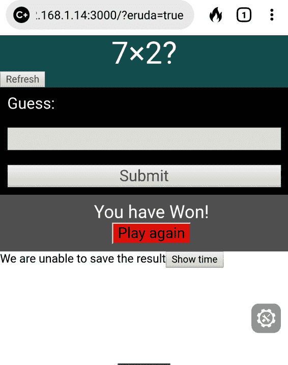

###### 图 8-20\. 如果在 URL 中添加 ?eruda=true，页面右侧将会出现一个按钮。

如果你在本章中使用示例应用程序，请尝试输入一些游戏答案。^(17) 然后点击 Eruda 按钮。控制台将如图 8-21 所示出现。

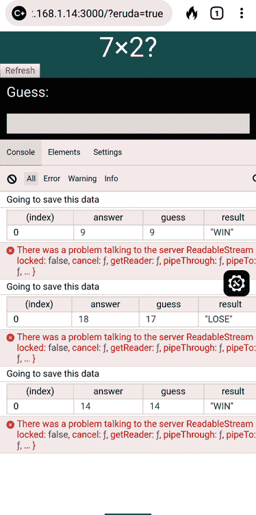

###### 图 8-21\. 单击按钮打开 Eruda 工具

由于示例应用程序调用的端点缺失，你应该在控制台中找到一些错误和其他记录。控制台还支持很少使用的 `console.table` 函数，这是一种有用的以表格形式显示对象数组的方式。

元素标签提供了对 DOM 的相当基本的视图（见图 8-22）。

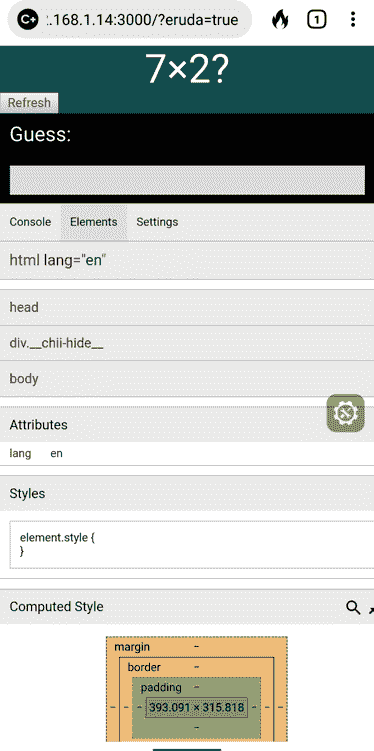

###### 图 8-22\. Eruda 元素视图

同时，设置选项卡具有广泛的 JavaScript 功能集，您可以在与网页交互时启用和禁用它们（见图 8-23）。

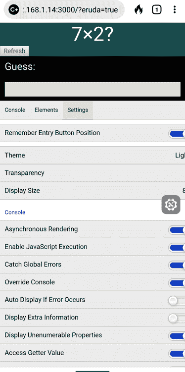

###### 图 8-23\. Eruda 设置视图

## 讨论

Eruda 是一个令人愉快的工具，提供了一整套功能，开发者几乎不需要做任何工作。除了基本功能外，它还有插件，允许您跟踪性能、设置屏幕刷新率、生成虚假地理位置，甚至在浏览器内部编写和运行 JavaScript。一旦开始使用，您可能会发现它很快成为您手动测试过程的标准部分。

你可以从 [GitHub 网站](https://oreil.ly/P1Tqj) 下载这个示例的源代码。

# 从测试中去除随机性

## 问题

在理想的情况下，测试应该始终处于完全人工的环境中。测试是你希望应用程序在明确定义的条件下运行的示例。但是测试通常必须应对不确定性。例如，它们可能在不同的时间运行。本章中我们一直使用的示例应用程序需要处理*随机性*。

我们的示例应用程序是一个游戏，向用户展示一个随机生成的问题，用户必须回答（见图 8-24）。


###### 图 8-24\. 游戏要求用户计算一个随机生成的乘法问题

随机性还可能出现在代码内部标识符或随机数据集的生成中。如果你要求一个新的用户名，你的应用程序可能会建议一个随机生成的字符串。

但是随机性为测试带来了问题。这是我们在本章前面实施的一个示例测试：

```
describe('Basic game functions', () => {
  it('should notify the server if I lose', () => {
    // Given I started the application
    // When I enter an incorrect answer
    // Then the server will be told that I have lost
  })
})
```

其实有一个很好的理由，为什么那个测试看起来关注用户输入*不正确*的答案。问题始终要求计算 1 到 10 之间两个数的乘积。因此很容易想到一个不正确的答案：101。它将*始终*是错误的。但是，如果我们想编写一个测试来展示当用户输入*正确*答案时会发生什么，我们就会遇到问题。正确的答案取决于随机生成的数据。我们可以编写一些代码来找到屏幕上出现的两个数字，就像本章第一个 Selenium 配方中的示例一样：

```
const [number1, number2, input, submit] = await Promise.all([
  driver.findElement(By.css('.number1')).getText(),
  driver.findElement(By.css('.number2')).getText(),
  driver.findElement(By.css('input')),
  driver.findElement(By.xpath("//button[text()='Submit']")),
])
await input.sendKeys('' + number1 * number2)
await submit.click()
```

有时这种方法甚至是不可能的。例如，Cypress 不允许您从页面上捕获数据。如果我们想编写一个 Cypress 测试来输入乘法问题的正确答案，我们将会遇到很大困难。这是因为 Cypress 不允许您从页面上捕获值并将它们传递给测试中的其他步骤。

在测试期间关闭随机性会更好。

但是我们可以吗？

## 解决方案

我们将看看如何使用 Sinon 库来临时替换 `Math.random` 函数，以制作一个自己制作的虚假函数。

让我们首先考虑如何在单元测试中做到这一点。我们将为顶级 `App` 组件创建一个新的测试，检查输入正确值是否会显示我们赢了的消息。

我们将创建一个函数，用于修复 `Math.random` 的返回值：

```
const sinon = require('sinon')

function makeRandomAlways(result) {
  if (Math.random.restore) {
    Math.random.restore()
  }
  sinon.stub(Math, 'random').returns(result)
}
```

该函数通过替换 `Math` 对象的 `random` 方法为一个始终返回相同值的存根方法来工作。现在我们可以在测试中使用它。页面上显示的 `Question` 总是基于以下值生成 1 到 10 之间的随机数：

```
Math.random() * 10 + 1
```

如果我们修复 `Math.random`，让它始终生成值为 0.5，那么“随机”数将始终是 6。这意味着我们可以编写一个单元测试如下：

```
it('should tell you that you entered the right answer', async () => {
  // Given we've rendered the app
  makeRandomAlways(0.5)
  render(<App />)

  // When we enter the correct answer
  const input = screen.getByLabelText(/guess:/i)
  const submitButton = screen.getByText('Submit')
  user.type(input, '36')
  user.click(submitButton)

  // Then we are told that we've won
  await waitFor(() => screen.findByText(/won/i), { timeout: 4000 })
})
```

并且这个测试将始终通过，因为应用程序将始终询问，“6 × 6 是多少？”

修复 `Math.random` 的真正价值在于我们使用显式*阻止*我们捕获像 Cypress 这样的随机生成值的测试框架，正如我们之前看到的。

Cypress 允许我们通过将它们添加到 *cypress/support/commands.js* 脚本中来添加自定义命令。如果你编辑该文件并添加以下代码：

```
Cypress.Commands.add('random', (result) => {
  cy.reload().then((win) => {
    if (win.Math.random.restore) {
      win.Math.random.restore()
    }
    sinon.stub(win.Math, 'random').returns(result)
  })
})
```

您将创建一个名为 `cy.random` 的新命令。我们可以使用这个命令来创建一个测试，展示我们在介绍中讨论的*获胜*情况：^(18)

```
describe('Basic game functions', () => {
  it('should notify the server if I win', () => {
    // Given I started the application
    cy.intercept('POST', '/api/result', {
      statusCode: 200,
      body: '',
    }).as('postResult')
    cy.visit('http://localhost:3000')
    cy.random(0.5)
    cy.contains('Refresh').click()

    // When I enter the correct answer
    cy.get('input').type('36')
    cy.contains('Submit').click()

    // Then the server will be told that I have won
    cy.wait('@postResult').then((xhr) => {
      assert.deepEqual(xhr.request.body, {
        guess: 36,
        answer: 36,
        result: 'WIN',
      })
    })
  })
})
```

在调用 `cy.random` 命令后，如果应用程序在替换 `Math.random` 函数之前生成了随机数，我们需要点击刷新按钮。

## 讨论

你永远无法从测试中完全消除所有的随机性。例如，机器的性能可以显著影响组件何时以及多频繁地重新渲染。但尽可能减少不确定性通常是测试中的一件好事。我们能够尽可能地从测试中去除外部依赖，这样做会更好。

接下来的示例中，我们还将探讨如何消除外部依赖。

你可以从[GitHub 站点](https://oreil.ly/P1Tqj)下载这个示例的源代码。

# 时间旅行

## 问题

时间可能是引发大量 bug 的根源。如果时间只是一个科学上的测量，那么情况就相对简单。但实际情况并非如此。时间的表示受到国界和当地法律的影响。一些国家有自己的时区，其他国家则有多个时区。一个让人放心的因素是，所有国家的时区偏移都是整小时，除了像印度这样的地方，那里的时间偏移量是从 UTC 开始算的+05:30。

这就是为什么在测试中尝试修复时间很有帮助。但我们该怎么做呢？

## 解决方案

我们将看看在测试 React 应用程序时如何修复时间。在测试依赖于时间的代码时，需要考虑一些问题。首先，你应该避免在服务器上改变时间。在大多数情况下，最好将服务器设置为 UTC 时间并保持不变。

这意味着，如果你想在浏览器中伪造日期和时间，当浏览器与服务器联系时就会出现问题。这意味着你必须修改服务器的 API 以接受*有效日期*或者在与服务器隔离时测试依赖于时间的浏览器代码。^(19)

对于这个示例，我们将采用后一种方法：使用 Cypress 测试系统来伪造与服务器的任何连接。

我们将使用与本章其他示例相同的应用程序。这是一个简单的游戏，要求用户计算两个数字的乘积。我们将测试游戏的一个功能，即用户有 30 秒的时间来提供答案。30 秒后，他们将看到一个消息，告诉他们时间已经用完（见图 8-25）。

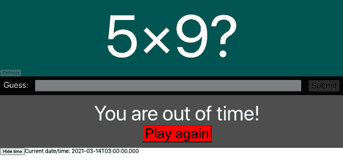

###### 图 8-25\. 如果玩家在 30 秒内没有答复，将会输掉比赛

我们可以尝试编写一个测试，让其暂停 30 秒，但这有两个问题。首先，它会减慢你的测试速度。在测试中加入多个 30 秒的暂停会让测试变得难以忍受。其次，添加暂停并不是测试功能的一种精确方法。如果你试图暂停 30 秒，可能会暂停 30.5 秒然后再查看消息。

要获得精确性，我们需要控制浏览器内的时间。如前一篇章中所示，Cypress 可以将代码注入浏览器，用存根函数替换关键代码片段，以便我们控制。Cypress 内置了一个名为 `cy.clock` 的命令，允许我们指定当前时间。

让我们看看如何通过创建一个超时功能的测试来使用 `cy.clock`。这将是我们测试的结构：

```
describe('Basic game functions', () => {
  it('should say if I timed out', () => {
    // Given I have started a new game
    // When 29 seconds have passed
    // Then I will not see the time-out message
    // When another second has passed
    // Then I will see the time-out message
    // And the game will be over
  })
})
```

我们可以从打开应用并点击刷新按钮开始：

```
describe('Basic game functions', () => {
  it('should say if I timed out', () => {
    // Given I have started a new game
    cy.visit('http://localhost:3000')
    cy.contains('Refresh').click()

    // When 29 seconds have passed
    // Then I will not see the time-out message
    // When another second has passed
    // Then I will see the time-out message
    // And the game will be over
  })
})
```

现在我们需要模拟经过的 29 秒时间。我们可以使用 `cy.clock` 和 `cy.tick` 命令来实现这一点。`cy.clock` 命令允许你指定一个新的日期和时间；或者，如果你不带参数调用 `cy.clock`，它将把时间和日期设置回 1970 年。`cy.tick()` 命令允许你向当前日期和时间添加一定数量的毫秒：

```
describe('Basic game functions', () => {
  it('should say if I timed out', () => {
    // Given I have started a new game
    cy.clock()
    cy.visit('http://localhost:3000')
    cy.contains('Refresh').click()

    // When 29 seconds have passed
    cy.tick(29000)

    // Then I will not see the time-out message
    // When another second has passed
    // Then I will see the time-out message
    // And the game will be over
  })
})
```

现在我们可以完成测试中的其他步骤。关于我们使用的其他 Cypress 命令的详细信息，请参阅 [Cypress 文档](https://oreil.ly/vahMA)：

```
describe('Basic game functions', () => {
  it('should say if I timed out', () => {
    // Given I have started a new game
    cy.clock()
    cy.visit('http://localhost:3000')
    cy.contains('Refresh').click()

    // When 29 seconds have passed
    cy.tick(29000)

    // Then I will not see the time-out message
    cy.contains(/out of time/i).should('not.exist')

    // When another second has passed
    cy.tick(1000)

    // Then I will see the time-out message
    cy.contains(/out of time/i).should('be.visible')

    // And the game will be over
    cy.get('input').should('be.disabled')
    cy.contains('Submit').should('be.disabled')
  })
})
```

如果我们在 Cypress 中运行测试，它会通过（如你可以在 图 8-26 中看到）。


###### 图 8-26。通过控制时间，我们可以强制测试中的超时发生

这是一个相对简单的基于时间的测试。但如果我们想测试更复杂的东西，比如夏令时（DST），怎么办呢？

DST（夏令时）的错误是大多数开发团队的梦魇。它们会悄无声息地停留在你的代码库中数月，然后突然在春秋交替之际，在清晨的早些时候出现。

DST 发生的时间取决于你所在的时区。对客户端代码来说，这是一个特别棘手的问题，因为 JavaScript 的日期处理不了时区。它们当然可以处理偏移量；例如，你可以在像 Chrome 这样的浏览器中创建一个设置为格林威治标准时间之前五小时的 `Date` 对象：^(20)

```
new Date('2021-03-14 01:59:30 GMT-0500')
```

但 JavaScript 的日期都隐式地使用浏览器的时区。当你创建一个带有时区名称的日期时，JavaScript 引擎会将其简单地转换为浏览器的时区。

浏览器的时区在打开浏览器时就已固定。没有办法说“让我们从现在开始假装我们在纽约”。

如果开发人员为 DST 创建测试，这些测试可能仅在开发者的时区下工作。如果在设置为 UTC 的集成服务器上运行，则可能导致测试失败。

然而，有一个解决这个问题的方法。在 Linux 和 Mac 计算机上（但不适用于 Windows），你可以在启动浏览器时通过设置名为 `TZ` 的环境变量来指定时区。如果我们启动 Cypress 时设置了 `TZ` 变量，Cypress 启动的任何浏览器都将继承它，这意味着虽然我们不能为单个测试设置时区，但可以为整个测试运行设置时区。

首先，让我们使用设置为纽约时区的 Cypress 启动：

```
$ TZ='America/New_York' npx cypress open
```

示例应用程序有一个按钮，允许您查看当前时间（参见图 8-27）。

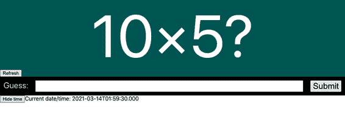

###### 图 8-27\. 屏幕上显示当前时间

我们可以创建一个测试，检查页面上的时间是否正确处理了夏令时的更改。这是我们将创建的测试：

```
describe('Timing', () => {
  it('should tell us the current time', () => {
    cy.clock(new Date('2021-03-14 01:59:30').getTime())
    cy.visit('http://localhost:3000')
    cy.contains('Show time').click()
    cy.contains('2021-03-14T01:59:30.000').should('be.visible')
    cy.tick(30000)
    cy.contains('2021-03-14T03:00:00.000').should('be.visible')
  })
})
```

在这个测试中，我们向 `cy.clock` 传递了一个显式的日期。我们需要通过调用 `getTime` 将其转换为毫秒，因为 `cy.clock` 仅接受数值时间。然后我们检查初始时间，30 秒后，我们检查时间是否已经从上午 2 点转变为上午 3 点（如图 8-28 所示）。

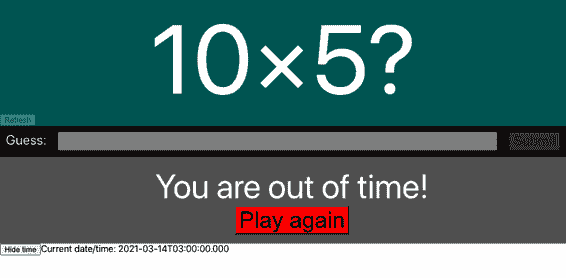

###### 图 8-28\. 30 秒后，时间从 01:59 正确地变为 03:00

## 讨论

如果您需要创建依赖于当前时区的测试，请考虑将它们放入子文件夹中，以便单独运行。如果您想要将日期格式化为不同的时区，可以使用 `toLocaleString` 日期方法：

```
new Date().toLocaleString('en-US', { timeZone: 'Asia/Tokyo' })
```

您可以从[GitHub 网站](https://oreil.ly/P1Tqj)下载此示例的源代码。

^(1) 在本章的其他示例中，您将看到可以动态地从测试中去除随机性，并且在不捕获页面上的问题的情况下修复正确的答案。

^(2) 注意，许多测试使用正则表达式进行文本比较，这允许像这个示例一样进行不区分大小写的子字符串匹配。正则表达式可以有效地防止测试经常性地中断。

^(3) 查看[GitHub 仓库](https://oreil.ly/P1Tqj)中的源代码，了解我们如何在示例应用程序中组织代码。

^(4) 如果您尚未安装 Testing Library，请参阅“使用 React Testing Library”。

^(5) 直接或间接地通过 Axios 等库。

^(6) 无论你如何称呼这个文件，但我们遵循的惯例是在高级测试中加上故事编号。这样做可以减少测试合并冲突的可能性，并且更容易跟踪单个更改的意图。

^(7) 这将加快测试的运行速度，并为每个测试记录一个视频，这在您的测试运行在集成服务器上时非常有帮助。

^(8) Cypress 命令在许多方面类似于 promises，尽管它们不是 promises。您可以把每一个看作是一个“类 promise”。

^(9) `cy.intercept` 命令不能简单地返回对伪造网络请求的引用，因为 Cypress 命令具有链式特性。

^(10) 参见“监控在线状态”。

^(11) 这并不意味着测试将在每个浏览器上都能工作，只是它们将在每个浏览器上运行。

^(12) 我们遵循的约定是在测试前面加上其关联的故事编号。Selenium 不需要这样做。

^(13) 下载本章的源代码，您将找到执行此操作的代码，网址为[GitHub](https://oreil.ly/P1Tqj)。

^(14) 您可以将此脚本放在任何地方，但这是我们在 GitHub 网站上示例代码中使用的位置。

^(15) 远程机器必须安装适当的浏览器和 Web 驱动程序才能使其正常工作。

^(16) 对于 `create-react-app` 应用程序，应将此添加到 *public/index.html* 文件中。

^(17) 本书的源代码存储库中提供了这段代码的内容，网址为[source code repository](https://oreil.ly/P1Tqj)。

^(18) 您可以在“使用 Cypress 在没有服务器的情况下进行测试”中了解更多关于此测试的信息。

^(19) 也就是说，允许浏览器对服务器说“让我们假装是四月十四日星期四”。

^(20) 通常情况下，Firefox 不会接受这种格式。
