# 第九章：可访问性

写这一章节很有挑战性，因为除了戴眼镜和隐形眼镜外，我们两个都不需要使用特殊的无障碍设备或软件。我们在本章中尝试汇集了一些工具和技术，希望能帮助您找到代码中一些更为明显的无障碍问题。

我们将讨论如何使用地标和 ARIA 角色，这将为您的页面增加意义和结构，否则这些只能通过视觉分组来实现。然后我们提供了几个操作步骤，展示如何对应用进行手动和自动化审核，通过静态分析查找代码中的问题，并通过自动化浏览器查找运行时错误。

然后我们将深入讨论创建自定义对话框涉及的一些更为技术性的问题（提示：尝试使用来自库的预构建对话框），最后，我们构建一个简单的屏幕阅读器。

欲深入了解无障碍性，请务必查看 [Web Content Accessibility Guidelines (WCAG)](https://oreil.ly/ie0aT)，提供了三个符合级别：A、AA 和 AAA。AAA 是最高的符合级别。

如果您正在编写专业软件，理想情况下，您会发现这些操作步骤很有帮助。但没有什么可以取代那些每天都要与不可访问软件问题共存的人的经验。无障碍软件就是好软件。它扩展了您的市场，并迫使您更深入地考虑设计问题。我们建议至少对您的代码运行一次可访问性审核。您可以联系类似 [AbilityNet](https://oreil.ly/N7XkH) 这样的组织，或者无论您身在何处，只需搜索 *无障碍软件测试*，您就会发现这是追踪代码问题的最有效方式。

# 使用地标

## 问题

让我们考虑 图 9-1 中的应用程序。这是一个用于创建和管理任务的简单应用程序。

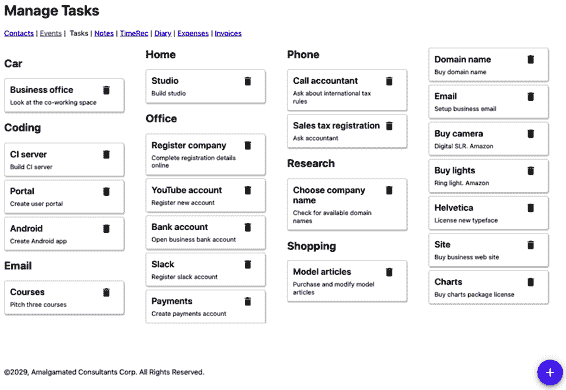

###### 图 9-1\. *任务* 应用示例

如果有人能看到应用程序，他们将轻松区分主要内容（任务）和页面边缘的所有其他内容：链接到其他页面、标题、版权等等。

让我们看看此应用程序的主要 `App` 组件的代码：

```
const App = () => {
  ...
  return (
    <>
      <h1>Manage Tasks</h1>
      <a href='/contacts'>Contacts</a>&nbsp;|&nbsp;
      <a href='/events'>Events</a>&nbsp;|&nbsp;
      Tasks&nbsp;|&nbsp;
      <a href='/notes'>Notes</a>&nbsp;|&nbsp;
      <a href='/time'>TimeRec</a>&nbsp;|&nbsp;
      <a href='/diary'>Diary</a>&nbsp;|&nbsp;
      <a href='/expenses'>Expenses</a>&nbsp;|&nbsp;
      <a href='/invoices'>Invoices</a>
      <button className='addButton'
          onClick={() => setFormOpen(true)}>+</button>
      <TaskContexts .../>
      &#169;2029, Amalgamated Consultants Corp. All Rights Reserved.
      <TaskForm .../>
      <ModalQuestion ...>
        Are you sure you want to delete this task?
      </ModalQuestion>
    </>
  )
}
```

如果依赖设备朗读页面，理解页面结构可能会很困难。导航链接在哪里？页面的主要内容又在哪里？人眼进行的分析（见 图 9-2）如果无法评估界面的空间分组，则难以复制。

那么，我们该如何解决这个问题？我们可以用什么来替代视觉分组，使页面的结构更易于理解？

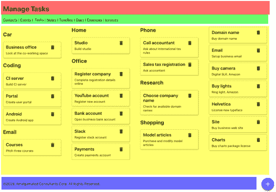

###### 图 9-2\. 视觉观众可以迅速识别页面的各个部分

## 解决方案

我们将在我们的代码中引入 *地标*。地标是我们可以使用的 HTML 元素，用于结构上地组织我们的界面，以反映它们在视觉上的组织方式。地标在设计页面时也很有帮助，因为它们迫使您考虑各种类型页面内容的功能。

让我们从 *header* 开始突出显示。页面的这一部分标识页面的主题。通常我们会使用 `h1` 标题来表示，但我们也可能包括常用工具，或者一个标志。我们可以使用 `header` 标签来标识页眉：

```
<header>
    <h1>Manage Tasks</h1>
</header>
```

我们页面上应该始终有一个 `h1` 标题，并且应该使用较低级别的标题来结构化页面的其余内容，而不跳过任何级别。例如，您不应该在两个 `h1` 标题之间有一个 `h3` 标题而没有 `h2` 标题。标题是屏幕阅读器用户的便捷导航设备，包括允许用户在标题之间向前跳转和向后跳转的功能。

接下来，我们需要考虑 *导航*。导航可以采用多种形式。它可能是一系列链接的列表（如此处），或者可能是一系列菜单或侧边栏。导航是一个允许您访问网站主要部分的组件块。您页面上几乎肯定会有其他不属于导航的链接。

我们可以使用 `nav` 地标来标识页面的导航：

```
<nav>
    <a href='/contacts'>Contacts</a>&nbsp;|&nbsp;
    <a href='/events'>Events</a>&nbsp;|&nbsp;
    Tasks&nbsp;|&nbsp;
    <a href='/notes'>Notes</a>&nbsp;|&nbsp;
    <a href='/time'>TimeRec</a>&nbsp;|&nbsp;
    <a href='/diary'>Diary</a>&nbsp;|&nbsp;
    <a href='/expenses'>Expenses</a>&nbsp;|&nbsp;
    <a href='/invoices'>Invoices</a>
</nav>
```

页面的关键部分是内容。在我们的任务应用程序中，内容就是任务的集合。主要内容是用户主要想要阅读和与页面交互的内容。偶尔，主要内容还可能包括工具，比如任务应用程序中的浮动“添加”按钮，但这些不一定要在主要内容中，并且我们可以将它们移动到页眉的某个位置。

我们可以使用 `main` 标签将页面的主要内容分组在一起：

```
<main>
    <button className='addButton'
            onClick={() => setFormOpen(true)}>+</button>
    <TaskContexts contexts={contexts}
                  tasks={tasks}
                  onDelete={setTaskToRemove}
                  onEdit={task => {
                      setEditTask(task)
                      setFormOpen(true)
                  }}
    />
</main>
```

最后，我们有网页的 *元数据*：关于数据的数据。在任务应用程序中，页面底部的版权声明就是元数据的一个例子。通常会将元数据放在页面底部的一个组中，因此它被分组在 `footer` 标签中：

```
<footer>
    &#169;2029, Amalgamated Consultants Corp. All Rights Reserved.
</footer>
```

还有几件事情留在我们原始的 `App` 组件中：

```
<TaskForm .../>
<ModalQuestion ...>
    Are you sure you want to delete this task?
</ModalQuestion>
```

`TaskForm` 是一个模态对话框，当用户想要创建或编辑任务时出现（见 Figure 9-3）。

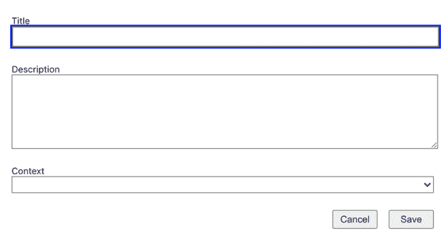

###### Figure 9-3\. `TaskForm` 是一个模态对话框，显示在其他内容上方。

`ModalQuestion` 是一个确认框，如果用户尝试删除任务时会出现（见 Figure 9-4）。

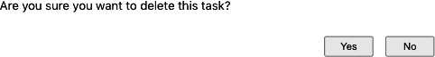

###### Figure 9-4\. 模态问题框询问用户确认删除任务。

这两个组件只会在需要时显示。在页面处于正常状态时，模态框不会出现在页面结构中，因此不必包含在地标中。我们将在本章的其他地方看到处理动态内容（如模态框）的其他方法，这将使它们对您的受众更具可访问性。

这是我们的`App`组件的最终形式：

```
const App = () => {
  ....
  return (
    <>
      <header>
        <h1>Manage Tasks</h1>
      </header>
      <nav>
        <a href='/contacts'>Contacts</a>&nbsp;|&nbsp;
        <a href='/events'>Events</a>&nbsp;|&nbsp;
        Tasks&nbsp;|&nbsp;
        <a href='/notes'>Notes</a>&nbsp;|&nbsp;
        <a href='/time'>TimeRec</a>&nbsp;|&nbsp;
        <a href='/diary'>Diary</a>&nbsp;|&nbsp;
        <a href='/expenses'>Expenses</a>&nbsp;|&nbsp;
        <a href='/invoices'>Invoices</a>
      </nav>
      <main>
      <button className='addButton'
          onClick={() => setFormOpen(true)}>+</button>
        <TaskContexts .../>
      </main>
      <footer>
        &#169;2029, Amalgamated Consultants Corp. All Rights Reserved.
      </footer>
      <TaskForm .../>
      <ModalQuestion ...>
        Are you sure you want to delete this task?
      </ModalQuestion>
    </>
  )
}
```

## 讨论

地标是 HTML5 的一部分，因此在浏览器中原生支持。这意味着您可以开始使用它们，而无需添加特殊的工具或支持库。

您会发现一些自动辅助工具可能会抱怨由 React 应用程序渲染的地标。标准指南指出，网页正文中的*所有*内容都应该在一个地标内。但大多数 React 应用程序将它们的内容（包括任何地标）渲染在一个单独的`div`中，这立即违反了规则。

忽略这个问题可能是安全的。只要地标存在且它们在同一级别，它们被包装在额外的`div`中就不会有问题。

您可以从[GitHub site]下载此配方的源代码。

# 应用角色、替代文本和标题

## 问题

应用程序中常见的组件可能表现得像按钮，即使它们并不是按钮。同样，您可能有类似对话框的组件，而实际上并不是对话框。或者您可能有结构类似于列表但不使用`ol`和`ul`标签的数据集合。

如果您可以看到组件的视觉样式，创建行为像标准 UI 元素的组件就不是问题。如果某些东西对用户来说看起来像一个按钮，他们会将其视为按钮，而不管其实现方式如何。

但是，如果有人看不到组件的视觉样式，就会出现问题。相反，您需要为无法看到的人描述组件的目的。

## 解决方案

我们将讨论在应用程序中使用*角色*。*角色*描述了组件的含义：它告诉用户它的目的是什么。角色是网页语义的一部分，因此类似于我们在“使用地标”中讨论的语义地标。

这里列出了一些您可以应用于渲染 HTML 的典型角色：

| Role name | Purpose |
| --- | --- |
| alert | 告诉用户发生了某事。 |
| article | 大块的文本内容，比如新闻报道。 |
| button | 可以点击以执行某些操作的内容。 |
| checkbox | 用户可选择的真/假值。 |
| comment | 类似于用户提交的评论或反应。 |
| complementary | 补充信息，可能在侧边栏中。 |
| contentinfo | 版权声明、作者姓名、出版日期等。 |
| dialog | 浮在其他内容之上的东西。通常是模态框。 |
| feed | 在博客中常见，是文章的列表。 |
| figure | 插图。 |
| list | 一组顺序排列的事物。 |
| listitem | 列表中的每个事物。 |
| 搜索 | 搜索字段。 |
| 菜单 | 一系列选项，通常用于导航。 |
| 菜单项 | 菜单中的项。 |

您可以将角色应用于具有`role`属性的元素。让我们考虑本章示例应用程序中的`Task`组件。`Task`组件将每个任务渲染为一个小面板，并带有一个删除按钮：

```
import DeleteIcon from './delete-24px.svg'
import './Task.css'

const Task = ({ task, onDelete, onEdit }) => {
  return (
    <div className="Task">
        <div className="Task-contents"
          ...
        >
        <div className="Task-details">
          <div className="Task-title">{task.title}</div>
          <div className="Task-description">{task.description}</div>
        </div>
        <div className="Task-controls">
           {
              evt.stopPropagation()
              onDelete()
            }}
            alt="Delete icon"
          />
        </div>
      </div>
    </div>
  )
}
```

我们在页面上根据描述人们执行任务的上下文将任务分组在一起。例如，您可能会在“Phone”标题下分组一系列任务（见图 9-5）。


###### 图 9-5\. 每个组包含任务列表

因此，任务似乎与`listitem`角色相匹配。它们是出现在有序集合内部的事物。因此，我们可以将该角色添加到第一个`div`中：

```
return <div role='listitem' className='Task'>
    <div className='Task-details'>
        ....
```

如果我们就此止步，我们会遇到问题。*角色有规则*。你不能将`listitem`角色应用于组件，除非它出现在具有`list`角色的某物内部。因此，如果我们要将我们的`Task`组件标记为`listitems`，我们还需要给`TaskList`父元素一个`list`角色：

```
import Task from '../Task'
import './TaskList.css'

function TaskList({ tasks, onDelete, onEdit }) {
  return (
    <div role="list" className="TaskList">
      {tasks.map((t) => (
        <Task
          key={t.id}
          task={t}
          onDelete={() => onDelete(t)}
          onEdit={() => onEdit(t)}
        />
      ))}
    </div>
  )
}

export default TaskList
```

使用`list`和`listitem`角色是完全有效的。但是实践中，如果我们有行为像列表的 HTML，最好改变标记并使用真正的`ul`和`li`标签。从可访问性的角度来看，可能没有什么区别。但是总是避免在 HTML 中填充无尽的`div`标签是一种好习惯。通常情况下，如果可以使用真正的 HTML 标签而不是角色，那可能是最好的选择。

让我们从`TaskList`中移除`list`角色，并创建一个真正的`ul`：

```
import Task from '../Task'
import './TaskList.css'

function TaskList({ tasks, onDelete, onEdit }) {
  return (
    <ul className="TaskList">
      {tasks.map((t) => (
        <Task
          key={t.id}
          task={t}
          onDelete={() => onDelete(t)}
          onEdit={() => onEdit(t)}
        />
      ))}
    </ul>
  )
}

export default TaskList
```

然后我们可以在`Task`中用`li`标签替换`listitem`角色：

```
import './Task.css'

const Task = ({ task, onDelete, onEdit }) => {
  return (
    <li className="Task">
      <div
        className="Task-contents"
        ...
      >
        <div className="Task-details">...</div>
        <div className="Task-controls">...</div>
      </div>
    </li>
  )
}

export default Task
```

使用`li`标签意味着我们需要进行一些 CSS 样式更改来移除列表项目符号，但是对于未来的任何开发人员（可能包括你自己）来说，代码将更易于阅读。

接下来，让我们来看看示例应用程序的导航部分。它有一系列链接，你几乎可以把它们看作是选项菜单：

```
<nav>
    <a href='/contacts'>Contacts</a>&nbsp;|&nbsp;
    <a href='/events'>Events</a>&nbsp;|&nbsp;
    Tasks&nbsp;|&nbsp;
    <a href='/notes'>Notes</a>&nbsp;|&nbsp;
    <a href='/time'>TimeRec</a>&nbsp;|&nbsp;
    <a href='/diary'>Diary</a>&nbsp;|&nbsp;
    <a href='/expenses'>Expenses</a>&nbsp;|&nbsp;
    <a href='/invoices'>Invoices</a>
</nav>
```

所以，在这里应用`menu`和`menuitem`角色吗？答案几乎肯定是*不*。

菜单和菜单项具有预期行为。用户到达菜单时，可能期望如果选择它，则弹出菜单。一旦菜单可见，他们可能会使用箭头键浏览选项，而不是用 Tab 键移动。^(1)

现在让我们来看看我们示例应用程序中的+按钮，它允许用户通过显示弹出式任务表单来创建新任务（见图 9-6）。

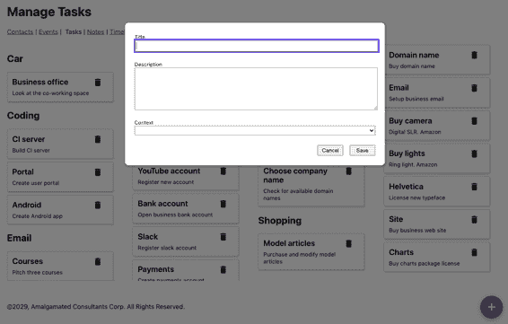

###### 图 9-6\. 用户点击*+*按钮后会出现一个新任务表单

这是按钮的代码：

```
<button className='addButton'
    onClick={() => setFormOpen(true)}>+</button>
```

我们是否需要应用`button`角色？不需要。该元素已经是一个按钮。但我们可以提供关于用户点击按钮后可以期待发生什么的一些额外信息。将弹出窗口显式显示在 HTML 中，使用`aria-haspopup`属性：

```
<button aria-haspopup='dialog' className='addButton'
    onClick={() => setFormOpen(true)}>+</button>
```

`aria-haspopup`属性的值必须与作为结果显示的组件的角色相匹配。在这种情况下，我们将显示一个对话框。您还可以将`aria-haspopup`属性设置为值`true`。但是屏幕阅读器将其解释为`menu`，因为通常与弹出窗口相关的组件用于打开菜单。

因为我们将`aria-haspopup`设置为`dialog`，所以我们还需要确保显示的`TaskForm`具有`dialog`角色。这是当前`TaskForm`的代码：

```
const TaskForm = ({ task, contexts, onCreate, onClose, open }) => {
  ...

  return <Modal open={open} onCancel={close}>
    <form>
      ....
    </form>
    <ModalFooter>
      <button onClick={...}>Cancel</button>
      <button onClick={...}>Save</button>
    </ModalFooter>
  </Modal>
}
```

我们将`TaskForm`包装在`Modal`组件中，如下所示：

```
import './Modal.css'

function Modal({ open, onCancel, children }) {
  if (!open) {
    return null
  }

  return <div className='Modal'
        ...
  >
    <div className='Modal-dialog'
       ...
    >
      {children}
    </div>
  </div>
}

export default Modal
```

这个`Modal`组件分为两部分：

+   一个外部的`Modal`包装器，用于遮蔽页面的其他内容，是一个半透明的层

+   一个内部`Modal-dialog` `div`，显示的内容看起来像一个窗口

因为`Modal`类可重用，可能会用于除*对话框*（例如*警报*）之外的其他内容，因此我们将为`Modal`类添加一个额外的`title`属性，该属性将应用于`Modal-dialog`。`title`将使屏幕阅读器用户清楚地了解对话框的目的。

这给我们带来了更新后的`Modal`组件：

```
import './Modal.css'

function Modal({ open, onCancel, children, role, title }) {
  if (!open) {
    return null
  }

  return <div role='presentation' className='Modal'
        ...
  >
    <div className='Modal-dialog'
       role={role} title={title}
       ...
    >
      {children}
    </div>
  </div>
}

export default Modal
```

这是我们更新后的`TaskForm`组件：

```
const TaskForm = ({ task, contexts, onCreate, onClose, open }) => {
  ...

  return <Modal title='Create or edit a task'
          role='dialog'
          open={open} onCancel={close}>
    <form>
      ....
    </form>
    <ModalFooter>
      <button onClick={...}>Cancel</button>
      <button onClick={...}>Save</button>
    </ModalFooter>
  </Modal>
}
```

最后，让我们考虑每个`Task`旁边出现的删除按钮，看起来像一个小垃圾桶：

```
 {
     evt.stopPropagation()
     evt.preventDefault()
     onDelete()
   }}
/>
```

垃圾桶图标作为按钮工作，因此我们赋予它该角色。垃圾桶已经具有`aria-haspopup`，因为对话框会要求用户确认删除。

但就像列表和列表项的情况一样，将按钮实现为按钮通常更好。我们可以将此组件重写为包装图像的`button`：

```
<button
  onClick={evt => {
    evt.stopPropagation()
    evt.preventDefault()
    onDelete()
  }}
  title='Delete'
  aria-haspopup='dialog'
>
  
</button>
```

这不仅对开发人员更清晰，而且也是可自动使用的。

## 讨论

角色在某些方面与地标重叠。有可用的地标角色，如`main`和`header`。但它们有两种不同的用途。地标是如其名，用于突出显示网页的重要部分。角色则描述接口某些部分的预期行为。在这两种情况下，地标和角色都旨在为网页提供额外的含义。

如果您的界面包含行为类似标准 HTML 元素的组件，例如列表，通常最好样式化标准 HTML 标记，而不是使用自定义代码重新创建元素。

您可以从[GitHub 网站](https://oreil.ly/0GfgA)下载此示例的源代码。

# 使用 ESlint 检查辅助功能

## 问题

如果你不需要使用任何可访问性设备，识别可访问性问题可能会很具有挑战性。^(2)在开发的热情中，还很容易出现破坏你之前测试过的代码可访问性的回归问题。

当你创建代码时，你需要一种快速而简便地找出可访问性问题的方式。你需要一个可以在你输入代码时持续监控并立即标记问题的流程，这样你还记得你做了什么。

## 解决方案

我们将看看如何配置`eslint`工具以查找代码中更明显的可访问性问题。

`eslint`是一个对你的代码进行静态分析的工具。它会找出未使用的变量，在`useEffect`调用中缺少的依赖等问题。如果你用`create-react-app`创建了你的应用程序，可能已经在你的应用上持续运行`eslint`。开发服务器将在每次代码需要重新编译时重新运行`eslint`，任何`eslint`错误都将出现在服务器窗口中。

如果你还没有安装`eslint`，你可以使用以下命令进行安装：

```
$ npm install --save-dev eslint
```

或者你可以使用它的`yarn`等效方式。`eslint`可以通过*插件*进行扩展。插件是一组规则，`eslint`将在保存静态代码时应用这些规则。有一个专门用来检查可访问性问题的插件。它被称为 jsx-a11y，你可以使用以下命令安装它：

```
$ npm install --save-dev eslint-plugin-jsx-a11y
```

如果你想手动运行`eslint`，你可以将一个脚本添加到你的*package.json*文件中：^(3)

```
"scripts": {
  ....
  "lint": "eslint src"
},
```

在我们可以使用 jsx-a11y 插件之前，我们需要对其进行配置。我们可以通过更新*package.json*中的`eslintConfig`部分来实现这一点：

```
"eslintConfig": {
  "extends": [
    "react-app"
    "react-app/jest",
    "plugin:jsx-a11y/recommended"
  ],
  "plugins": [
    "jsx-a11y"
  ],
  "rules": {}
}
```

这个配置将告诉`eslint`使用新的插件，并启用一组推荐的可访问性规则。

如果你选择，你也可以通过向`rules`部分添加额外配置来配置每个规则的工作方式。我们现在将通过禁用其中一个规则来实现这一点：

```
"eslintConfig": {
  "extends": [
    "react-app"
    "react-app/jest",
    "plugin:jsx-a11y/recommended"
  ],
  "plugins": [
    "jsx-a11y"
  ],
  "rules": {
    "jsx-a11y/no-onchange": "off"
  }
}
```

禁用规则可能看起来不是一个好主意，但有一个特定的理由你可能想要禁用`no-onchange`规则。

jsx-a11y 开发人员创建了`no-onchange`规则，因为旧版浏览器存在问题，它们以不同的方式实现了`onchange`。一些浏览器在用户每次在输入字段中键入字符时都会生成一个`onChange`事件。其他浏览器仅在用户离开字段时生成事件。这些不同的行为给使用可访问性工具的人们带来了大量问题。

解决方案是将所有的`onChange`处理程序替换为`onBlur`处理程序，这意味着*所有*浏览器在用户离开字段时会触发字段更改事件。

但是现在这条规则已经完全过时，并且在插件中已被弃用。如果您尝试将 React 代码中所有的 `onChange` 处理程序替换为 `onBlur` 处理程序，将会显著改变应用程序的工作方式。您还将远离 React 用于跟踪表单字段状态的标准方法：使用 `onChange`。

因此，在这 *一* 情况下，禁用规则是一个好主意。

现在我们可以运行 `eslint`，并启用我们的可访问性规则：

```
$ npm run lint
```

在应用程序的早期版本中，`eslint` 发现了一些错误：

```
$ npm run lint
> app@0.1.0 lint app
> eslint src
app/src/Task/Task.js
 6:9  error  Visible, non-interactive elements with click handlers
 must have at least one keyboard listener
 jsx-a11y/click-events-have-key-events
 6:9  error  Static HTML elements with event handlers require a role
 jsx-a11y/no-static-element-interactions
✖ 2 problems (2 errors, 0 warnings)
```

要查看这些错误的原因，让我们看一下 *Task.js* 的源代码：

```
<li className="Task">
  <div className="Task-contents" onClick={onEdit}>
    ....
  </div>
</li>
```

`Task` 组件在一个小卡片面板内显示任务的详细信息（参见 图 9-7）。

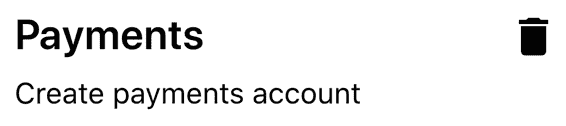

###### 图 9-7\. 应用程序在单独的面板中显示任务，每个面板都有一个删除按钮

如果用户点击一个任务，他们将打开一个表单，允许他们编辑任务的细节。完成此操作的代码是 `Task-contents` `div` 上的 `onClick` 处理程序。

要了解为什么 `eslint` 不高兴，让我们先看看这个错误：

```
6:9  error  Static HTML elements with event handlers require a role
 jsx-a11y/no-static-element-interactions
```

像 `div` 这样的元素是 *静态* 的。它们没有内置的交互行为。默认情况下，它们只是布局其他内容的东西。`eslint` 不高兴是因为 `onClick` 处理程序表明这个特定的 `div` 实际上被用作 *活动* 组件。如果有人使用辅助功能设备，我们需要告诉他们此组件的目的。`eslint` 希望我们通过给 `div` 分配一个 *role* 来做到这一点。^(4)

我们将为这个 `div` 元素设置 `button` 角色，以指示用户通过点击来使用该组件。当我们点击一个任务时，将显示一个弹出的编辑窗口，因此我们还会给 `div` 元素添加 `aria-haspopup` 属性，告知用户点击任务将打开一个对话框：

```
<li className='Task'>
        <div className='Task-contents'
             role='button'
             aria-haspopup='dialog'
             onClick={onEdit}
        >
    ....
</div>
</li>
```

将元素转换为原生 `button` 标签通常比使用 `button` 角色更好。但在这种情况下，`div` 元素包裹了一块相当大的 HTML 文本块，因此提供角色而不是处理将灰色按钮看起来像卡片的样式后果更有意义。

如果我们再次运行 `eslint`，我们仍然有两个错误。但其中一个是新的：

```
$ npm run lint
> app@0.1.0 lint app
> eslint src
app/src/Task/Task.js
 6:9  error  Visible, non-interactive elements with click handlers
 must have at least one keyboard listener
 jsx-a11y/click-events-have-key-events
 6:9  error  Elements with the 'button' interactive role must be tabbable
 jsx-a11y/interactive-supports-focus
✖ 2 problems (2 errors, 0 warnings)
```

我们说任务的行为像一个按钮。但是：角色有规则。如果我们希望某物被视为按钮，它必须表现得像按钮一样。按钮可以做的一件事是可以被 *切换* 到。它们需要能够从键盘接收焦点。我们可以通过添加 `tabIndex` 属性来实现这一点：

```
<li className='Task'>
        <div className='Task-contents'
             role='button'
             tabIndex={0}
             onClick={onEdit}
        >
    ....
</div>
</li>
```

将 `tabIndex` 设置为 `0` 意味着我们的任务将成为页面的标签顺序的一部分。

`tabIndex`可以有几个值：-1 表示只能通过程序设置焦点；0 表示它是一个普通的可标记组件。如果一个元素的可标记值大于 0，这意味着焦点系统应该给它更高的优先级。通常应避免使用大于 0 的值，因为它们可能会引起可访问性问题。^(5)

如果我们再次运行`eslint`，我们只有一个错误：

```
$ npm run lint
> app@0.1.0 lint app
> eslint src
app/src/Task/Task.js
 6:9  error  Visible, non-interactive elements with click handlers
 must have at least one keyboard listener
 jsx-a11y/click-events-have-key-events
1 problems (1 errors, 0 warnings)
```

这个错误意味着我们有一个`onClick`事件来定义鼠标点击任务时发生的操作，但是我们没有代码来响应键盘。如果有人无法使用鼠标，他们将无法编辑任务。

因此，我们需要添加某种键盘事件处理程序。我们将添加代码以在用户按 Enter 键或空格键时调用编辑事件：

```
<li className="Task">
  <div
    className="Task-contents"
    role="button"
    tabIndex={0}
    onClick={onEdit}
    onKeyDown={(evt) => {
      if (evt.key === 'Enter' || evt.key === ' ') {
        evt.preventDefault()
        onEdit()
      }
    }}
  >
    ....
  </div>
</li>
```

添加键盘处理程序将修复剩余的错误。

jsx-a11y 中的每个规则都有一个关联的[GitHub 页面](https://oreil.ly/uo7Ry)，详细说明代码可能违反规则的原因以及如何修复它。

## 讨论

jsx-a11y 可能是`eslint`中最有用的插件之一。通常，lint 规则会检查良好的编程实践并可以找到一些编码问题。但是 jsx-a11y 插件可以真正改变应用程序的设计。

确保您的应用程序允许键盘导航对于使用辅助工具的人来说很重要，但对于经常使用您的应用程序的人来说也很有用。如果有人长时间使用应用程序，他们通常会更喜欢使用键盘而不是鼠标，因为键盘需要更少的移动并且更精确。

我们还看过如何设置`tabIndex`来给元素添加键盘焦点。一些浏览器，特别是 Firefox，会提供微妙的指示器来显示当前具有键盘焦点的元素。如果您希望清楚地向用户显示当前焦点在哪里，请考虑在您的应用程序中添加一些顶级 CSS：

```
:focus-visible {
    outline: 2px solid blue;
}
```

这个样式规则将为任何具有键盘焦点的组件添加一个可识别的轮廓。一些用户更有可能选择键盘导航，一旦他们看到它是可用的。

您可以从[GitHub 站点](https://oreil.ly/0GfgA)下载此示例的源代码。

# 在运行时使用 Axe DevTools

## 问题

静态代码分析工具，如`eslint`，可以用于发现许多可访问性问题。但是静态分析是有限的。它通常会忽略运行时发生的错误。

代码可能以动态方式行为，静态分析工具无法预测。我们需要在 Web 浏览器中运行应用程序时检查其可访问性。

## 解决方案

我们将安装 axe DevTools 插件。这个插件在[Firefox](https://oreil.ly/S1TcB)和[Chrome](https://oreil.ly/MhiK0)中都可用。

安装完成后，您将在浏览器开发者控制台中多一个选项卡（见图 9-8）。

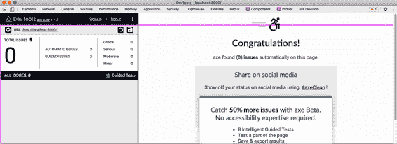

###### 图 9-8\. 开发者控制台中的 axe DevTools。

为了看到它的工作原理，让我们在本章中始终使用的示例任务应用程序中搞乱一些代码。

应用程序包含一个弹出式`TaskForm`组件。此组件已被赋予`dialog`角色，但我们可以修改它以具有一些无效值：

```
const TaskForm = ({ task, contexts, onCreate, onClose, open }) => {
  ...
  return (
    <Modal
      title="Create or edit a task"
      role="fish"
      open={open}
      onCancel={close}
    >
      <form>...</form>
      <ModalFooter>...</ModalFooter>
    </Modal>
  )
}
```

如果您打开*http://localhost:3000*并单击按钮以创建任务，您将看到任务表单（参见图 9-9）。


###### 图 9-9\. 按下*+*按钮后会出现新的任务表单。

如果现在在浏览器中打开开发者工具窗口，切换到 axe DevTools 选项卡，并在页面上运行审核，您将看到两个错误（参见图 9-10）。

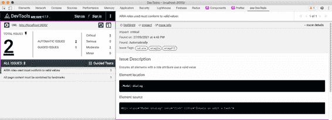

###### 图 9-10\. 在模态框中设置无效值会导致两个错误。

有两个错误，首先，对话框不包含有效的*role*。其次，模态框不再具有`dialog`角色，这意味着它不再作为页面中的重要地标。某些角色，如`dialog`，标记元素作为页面中重要的地标元素。应用程序的每个部分必须出现在一个地标内。

如果您重置代码并刷新 DevTools 的审计，则错误将消失。

您可以想象，一些未来的静态代码分析可能包括扫描检查所有代码，以检查无效的`role`值。^(6) 然而，DevTools 也可以检查其他更微妙的问题。

在示例应用程序中，编辑*App.css*文件，并添加一些代码以更改主标题的颜色：

```
h1 {
    color: #9e9e9e;
}
```

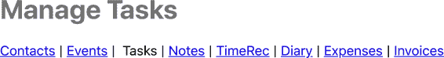

###### 图 9-11\. 改变一级标题的颜色的结果。

结果似乎并不太严重（参见图 9-11），但是这确实导致 DevTools 显示此错误：

```
Elements must have sufficient color contrast

Fix the following:
Element has insufficient color contrast of 2.67 (foreground color: #9e9e9e,
background color: #ffffff, font size: 24.0pt (32px), font weight: bold).
Expected contrast ratio of 3:1
```

Chrome 浏览器在开发者控制台内部相对容易修复对比度错误。如果您检查`h1`标题，检查元素的`color`样式，然后点击小颜色面板，您将看到在图 9-12 中报告的对比度问题。

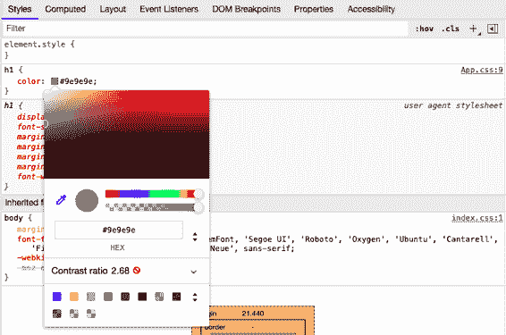

###### 图 9-12\. 点击颜色属性中的小灰色方块查看对比度。

如果您现在打开对比度部分，您可以调整颜色以满足 AA 和 AAA 的无障碍标准（参见图 9-13）。

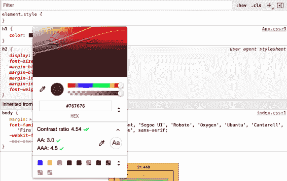

###### 图 9-13\. 打开对比度比率以调整颜色以满足无障碍标准。

Chrome 建议将颜色从`#949494`改为`#767676`。对于大多数人来说，这种差异并不是很明显，但对于对比度较低的用户来说，阅读将显著更容易（参见图 9-14）。

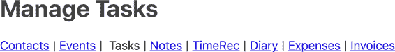

###### 图 9-14\. 改变对比度以满足 AAA 标准的结果。

有时，如果 Chrome 无法识别特定的背景颜色，它将不显示对比信息。您可以通过临时为您检查的元素分配`backgroundColor`来避免此问题。

## 讨论

axe DevTools 扩展程序易于使用，并且可以找到许多静态分析工具无法找到的问题。

它确实依赖于开发人员手动检查错误，但我们将在下一章中看到，有方法可以自动化基于浏览器的可访问性测试。

您可以从[GitHub 网站](https://oreil.ly/0GfgA)下载此示例代码。

# 使用 Cypress Axe 自动化浏览器测试

## 问题

前一个示例清楚地表明，一些可访问性问题只会在真实的 Web 浏览器中的运行时才会出现，因此无法通过静态分析找到。

如果我们依赖于手动浏览器测试，很可能会出现回归问题。更好的做法是自动化像 axe DevTools 这样的工具允许我们在浏览器内执行的手动检查。

## 解决方案

我们将研究如何使用 Cypress 测试框架的插件`cypress-axe`自动化浏览器可访问性测试。`cypress-axe`插件使用与 axe DevTools 相同的`axe-core`库。但因为我们可以在浏览器级别的测试中使用`cypress-axe`，所以我们可以自动化审核过程，以便集成服务器可以立即发现回归错误。

我们需要在我们的应用程序中安装 Cypress 和`axe-core`库：

```
$ npm install --save-dev cypress axe-core
```

然后，我们可以安装`cypress-axe`扩展程序：

```
$ npm install --save-dev cypress-axe
```

如果这是您第一次安装 Cypress，您需要运行 Cypress 应用程序，它将创建适当的目录和初始代码，供您用作测试的基础。您可以使用以下命令启动 Cypress：

```
$ npx cypress open
```

我们需要配置`cypress-axe`插件。编辑*cypress/support/index.js*文件，并添加这一行代码：

```
import 'cypress-axe'
```

我们还需要添加一些钩子，允许我们在测试运行期间记录错误。我们可以通过编辑*cypress/plugins/index.js*文件并添加以下代码来实现这一点：

```
module.exports = (on, config) => {
  on('task', {
    log(message) {
      console.log(message)
      return null
    },
    table(message) {
      console.table(message)
      return null
    },
  })
}
```

然后，您可以删除*cypress/integration*目录下的所有示例测试，并创建一个名为*cypress/integration/accessibility.js*的新文件:^(7)

```
function terminalLog(violations) {
  cy.task(
    'log',
    `${violations.length} accessibility violation${
      violations.length === 1 ? '' : 's'
    } ${violations.length === 1 ? 'was' : 'were'} detected`
  )
  const violationData = violations.map(
    ({ id, impact, description, nodes }) => ({
      id,
      impact,
      description,
      nodes: nodes.length,
    })
  )

  cy.task('table', violationData)
  console.table(violationData)
}

describe('can be used', () => {
  it('should be accessible when starting', () => {
    cy.visit('/')
    cy.injectAxe()
    cy.checkA11y(null, null, terminalLog)
  })
})
```

这基于来自`cypress-axe`存储库的[示例代码](https://oreil.ly/2Exyx)。

测试位于`describe`函数内。`terminalLog`函数用于报告错误。

测试具有以下结构：

1.  打开页面在*/*。

1.  将`axe-core`库注入页面中

1.  运行页面的审核

做大部分工作的`axe-core`库是其他工具（如 axe DevTools 浏览器扩展）所使用的相同库。`axe-core`库将检查当前 DOM 并根据其规则集检查它。然后，它将报告它发现的任何失败。

`cypress-axe`插件将 axe-core 库注入浏览器，并使用`checkA11y`命令运行审核。它将问题发送到`terminalLog`函数。

如果您在 Cypress 中双击*accessibility.js*运行此测试，它将通过（参见图 9-15）。

因此，让我们创建一个问题。让我们添加第二个测试：

```
it('should be accessible when creating a task', () => {
  cy.visit('/')
  cy.injectAxe()
  cy.contains('+').click()
  cy.checkA11y(null, null, terminalLog)
})
```

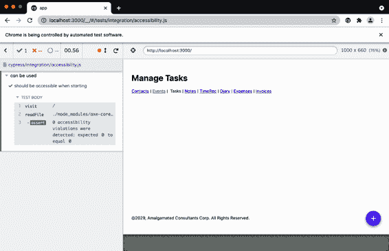

###### 图 9-15\. 通过可访问性测试的代码

测试打开应用程序，单击+按钮以打开创建任务的表单，然后执行审核。

在当前形式下，应用程序也将通过此测试。因此，让我们修改示例应用程序中的`TaskForm`，使其具有无效的`role`值：

```
const TaskForm = ({ task, contexts, onCreate, onClose, open }) => {
  ...
  return (
    <Modal
      title="Create or edit a task"
      role="hatstand"
      open={open}
      onCancel={close}
    >
      <form>...</form>
      <ModalFooter>...</ModalFooter>
    </Modal>
  )
}
```

如果重新运行测试，它现在将失败。您需要在打开 JavaScript 控制台时运行测试（参见图 9-16），以在控制台表格中看到失败。

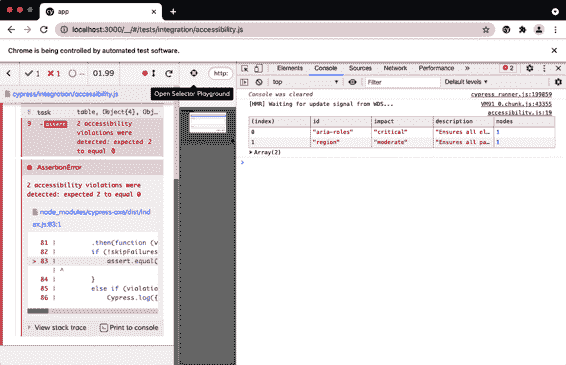

###### 图 9-16\. 如果测试期间打开控制台，您将找到失败的详细信息

## 讨论

有关可访问性审核和 cypress-axe 测试的出色介绍，请参见[马西·萨顿（Marcy Sutton）的演讲](https://oreil.ly/nS6R2)，她在 ReactJS Girls Conference 上介绍了该插件，并且自那以后我们一直在使用它。

您可以从[GitHub 网站](https://oreil.ly/0GfgA)下载此示例的源代码。

# 添加跳过按钮

## 问题

页面通常在开始时有大量内容。可能有导航链接、快速操作菜单、社交媒体账号链接、搜索字段等。如果您可以使用鼠标并查看页面，这不会成为问题。您可能会在心理上过滤它们，并开始使用页面的主要内容。

但是，如果您使用屏幕阅读器，则可能需要听取您访问的每个页面上这些初始元素的详细信息。现代屏幕阅读器技术通常允许用户自动浏览部分和标题，但仍可能需要一些时间才能找到重要内容的位置。

因此，许多网站包含隐藏的链接和按钮，通常包含文本如“跳转到内容”，使键盘用户能够快速到达页面的关键部分。

一个例子是 YouTube。如果打开 YouTube 然后按 Tab 键几次，您会看到一个按钮出现（参见图 9-17），如果按空格键，它将将键盘焦点移动到主内容。

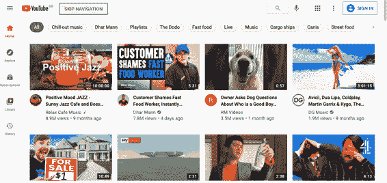

###### 图 9-17\. 如果按 Tab 键三次，YouTube 将显示跳过按钮

如何创建一个仅在 Tab 到达时才出现的按钮？

## 解决方案

此示例包含一个可重用的`SkipButton`组件，我们可以将其几乎添加到任何页面而不会破坏设计或布局。

它需要具有几个特性：

+   它需要隐藏，除非我们 Tab 进入。我们不只想要一个透明按钮，以防用户在意外点击屏幕的这部分时按到它。

+   它需要浮动在页面内容的上方，这样我们就不需要在布局中为它留出空间。

+   它需要作为一个可访问的按钮工作。这意味着它必须被屏幕阅读器识别，并且表现出按钮的行为。如果我们在它获得焦点时按下 Enter 键或空格键，我们希望它能起作用。

+   它需要在我们使用它之后消失。

我们在这个过程中会添加一些其他要求，但这应该能让我们开始。

让我们首先创建一个名为`SkipButton`的新组件。我们将使其返回一个单一的`div`，并允许它包含任何传递给它的子元素：

```
const SkipButton = (props) => {
  const { className, children, ...others } = props

  return (
    <div className={`SkipButton ${className || ''}`} {...others}>
      {children}
    </div>
  )
}
```

该组件还将接受一个类名和任何父组件可能想要传递的其他属性。

我们希望屏幕阅读器将其视为一个实际的`button`。我们可以通过用`button`替换`div`来实现这一点，但我们将保持它为`div`，以便样式更容易应用。然而，我们会给它一个`role`为`button`，并且——因为角色有规则——我们还会给它一个`tabIndex`值为`0`。这是我们无论如何都需要做的事情，因为我们希望用户能够通过 Tab 键访问它：

```
const SkipButton = (props) => {
  const { className, children, ...others } = props

  return (
    <div
      className={`SkipButton ${className || ''}`}
      role="button"
      tabIndex={0}
      {...others}
    >
      {children}
    </div>
  )
}
```

当点击按钮时，我们希望它执行某些操作。或者更确切地说，我们希望在用户按下 Enter 键或空格键时执行某些操作。因此，我们将允许它接受一个名为`onClick`的属性，然后将其附加到一个事件处理程序上，该处理程序将在用户按下 Enter 键或空格键时触发：

```
const SkipButton = (props) => {
  const { className, children, onClick, ...others } = props

  return (
    <div
      className={`SkipButton ${className || ''}`}
      role="button"
      tabIndex={0}
      {...others}
      onKeyDown={(evt) => {
        if (evt.key === 'Enter' || evt.key === ' ') {
          evt.preventDefault()
          onClick(evt)
        }
      }}
    >
      {children}
    </div>
  )
}
```

当然，我们可以将这个属性命名为`onKeyDown`，但是按钮通常有`onClick`，在使用时更容易记住。

最后，我们将在组件中做的一件事情是：允许它接受一个引用，在我们在下一个示例中重用组件时会很有用。

你不能像传递大多数其他属性那样传递引用。React 渲染器使用引用来跟踪在 DOM 中生成的元素。

如果我们希望一个组件接受一个引用对象，我们需要将所有内容包裹在调用 React 的`forwardRef`函数中。`forwardRef`函数返回你的组件的包装版本，从父组件中提取引用并显式地传递给它包装的组件。这听起来有点复杂，但实际上就是这样：

```
import { forwardRef } from 'react'
import './SkipButton.css'

const SkipButton = forwardRef((props, ref) => {
  const { className, children, onClick, ...others } = props

  return (
    <div
      className={`SkipButton ${className || ''}`}
      role="button"
      tabIndex={0}
      ref={ref}
      {...others}
      onKeyDown={(evt) => {
        if (evt.key === 'Enter' || evt.key === ' ') {
          evt.preventDefault()
          onClick(evt)
        }
      }}
    >
      {children}
    </div>
  )
})
```

这就是我们完成的`SkipButton`，包含一些样式信息的导入。它只是一个按钮。其余的就是在*SkipButton.css*文件中进行样式设置。

我们希望按钮浮动在页面其他内容的上方，因此我们将`z-index`设置为非常高的值：

```
.SkipButton {
    z-index: 10000;
}
```

我们希望在用户按下 Tab 键进入按钮之前隐藏该按钮。我们可以尝试将其设置为透明，但这会带来两个问题。首先，它可能会挡住某些可点击的内容。除非我们还将`pointer-events`设置为`none`，否则会阻挡点击事件。其次，如果按钮虽然透明但仍然在屏幕上显示，对于屏幕阅读器来说可能会被视为额外的屏幕杂乱，因为如果屏幕阅读器将屏幕空间转换为点字，用户可能会在其他文本中听到“跳转到内容”。

因此，我们将按钮放在屏幕之外，直到需要它为止：

```
.SkipButton {
    z-index: 10000;
    position: absolute;
    left: -1000px;
    top: -1000px;
}
```

那么，当有人按 Tab 键进入按钮时会发生什么？我们可以设置仅在按钮获得焦点时应用的样式：

```
.SkipButton {
    z-index: 10000;
    position: absolute;
    left: -1000px;
    top: -1000px;
}

.SkipButton:focus {
    top: auto;
    left: auto;
}
```

此外，我们可以添加一些纯视觉样式。重要的是要记住，并非每个使用此按钮的人都会使用屏幕阅读器。有些人会选择使用键盘导航，因为他们无法使用鼠标，或者因为他们觉得键盘导航更快：

```
.SkipButton {
    z-index: 10000;
    position: absolute;
    left: -1000px;
    top: -1000px;
    font-size: 12px;
    line-height: 16px;
    display: inline-block;
    color: black;
    font-family: sans-serif;
    background-color: #ffff88;
    padding: 8px;
    margin-left: 8px;

}

.SkipButton:focus {
    top: auto;
    left: auto;
}
```

现在，我们可以将`SkipButton`插入到页面的开头某处。在用户按下 Tab 键进入之前，它不会可见，但位置很重要。我们希望它在页面的前两到三个 Tab 处。我们将其添加到`header`部分：

```
<header>
    <SkipButton onClick={() => document.querySelector('.addButton').focus()}>
        Skip to content
    </SkipButton>
    <h1>Manage Tasks</h1>
</header>
```

在这里，我们只是使用 `document.querySelector` 来找到将接收焦点的元素。您可以选择引用要跳转到的元素，或者导航到一个位置。在实践中，我们发现使用简单的 `document.querySelector` 是最直接的方法。它允许您轻松引用可能不在当前组件中的元素。并且不依赖于导航到页面内锚点，如果应用程序更改其路由方法可能会导致断裂。

如果您在浏览器中打开示例应用程序，然后按 Tab 键，您将看到`SkipButton`（见图 9-18）。

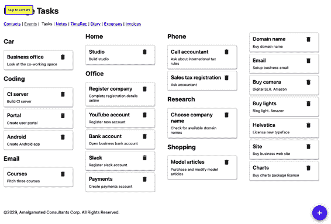

###### 图 9-18\. 如果按下 Tab 键，跳过按钮将出现在主标题上方。

## 讨论

将`SkipButton`放在页面开头的前三个 Tab 处是个好主意，如果每个页面中所需的*Tab*数量相同，用户很快就能学会如何跳转到每个页面的关键部分。我们发现，喜欢使用键盘更加高效的人群也很喜欢`SkipButton`。

您可以为每个页面创建一个标准的`SkipButton`，还可以将焦点移动到页面`main`部分的第一个可标签化项上。^(8)

您可以从[GitHub 网站](https://oreil.ly/0GfgA)下载此示例的源代码。

# 添加跳过区域

## 问题

在上一个示例中，我们看到*跳过按钮*对于用户想要快速跳过页面开头的所有标题和导航，直接进入主要内容是很有帮助的。

然而，即使在主内容中，有时候用户跳过一些组件集合会更有帮助。考虑本章中我们一直在使用的示例任务应用程序。用户可以在不同组中创建相当多的任务（见图 9-19）。


###### 图 9-19\. 该示例应用程序显示了一组任务，分成了几个组

如果他们想要进入 `Shopping` 任务，他们可能需要跳过其他 14 个任务。每个任务都有两个焦点：任务本身和任务的删除按钮。这意味着即使进入页面内容后，仍然需要跳过 28 个焦点。

我们能做些什么来使用户更容易跳过一系列组件？

## 解决方案

我们将使用之前创建的 `SkipButton` 组件来创建跳过区域。

如果我们向前切换到页面主内容的某个部分，比如办公任务，我们希望出现一个按钮，允许用户完全跳过办公任务（见图 9-20）。

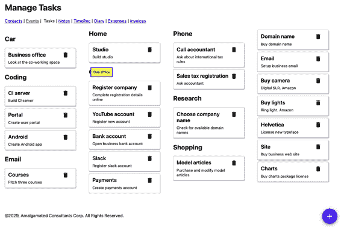

###### 图 9-20\. 我们希望在向前切换到一个组时出现一个跳过按钮

相反，如果他们向后切换到办公室部分，我们希望出现一个按钮，允许他们在办公室任务之前跳过（见图 9-21）。

我们只希望在进入一个区域时显示这些按钮，而在离开时不显示。这意味着当我们向前切换标签时只显示“跳过办公室”按钮，并且在向后切换标签时只显示“在办公室之前跳过”按钮。

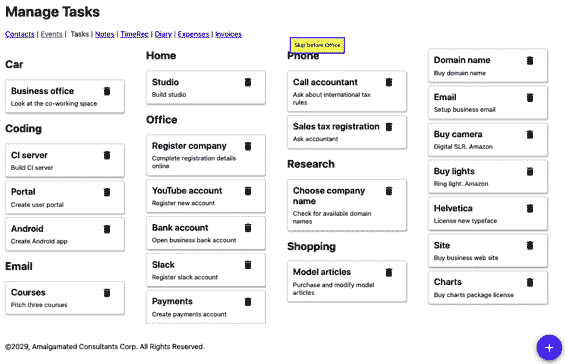

###### 图 9-21\. 当我们向后切换到一个组时，也应该出现一个跳过按钮

在看具体实现之前，让我们看看如何在进入实现细节的血腥细节之前使用跳过区域。我们的任务应用程序使用 `TasksContexts` 组件渲染一系列任务组：

```
import TaskList from '../TaskList'
import './TaskContexts.css'

function TaskContexts({ contexts, tasks, onDelete, onEdit }) {
  return contexts.map((c) => {
    const tasksForContext = tasks.filter((t) => t.context === c.value)
    if (tasksForContext.length === 0) {
      return <div className="TaskContexts-context">&nbsp;</div>
    }
    return (
      <div key={c.value} className="TaskContexts-context">
        <h2>{c.name}</h2>
        <TaskList
          tasks={tasksForContext}
          onDelete={onDelete}
          onEdit={onEdit}
        />
      </div>
    )
  })
}

export default TaskContexts
```

每个“上下文”（如购物、办公、研究等任务组）都有一个标题和一组任务。我们希望用户能够跳过每个任务组。我们将每个任务组包装在一个名为 `Skip` 的新组件中，如下所示：

```
import TaskList from '../TaskList'
import Skip from '../Skip'
import './TaskContexts.css'

function TaskContexts({ contexts, tasks, onDelete, onEdit }) {
  return contexts.map((c) => {
    const tasksForContext = tasks.filter((t) => t.context === c.value)
    if (tasksForContext.length === 0) {
      return <div className="TaskContexts-context">&nbsp;</div>
    }
    return (
      <div key={c.value} className="TaskContexts-context">
        <Skip name={c.name}>
          <h2>{c.name}</h2>
          <TaskList
            tasks={tasksForContext}
            onDelete={onDelete}
            onEdit={onEdit}
          />
        </Skip>
      </div>
    )
  })
}

export default TaskContexts
```

如果我们把一些任务包装在我们（尚不存在的）`Skip` 组件中，用户进入任务组时将会看到 `SkipButtons` 神奇地出现和消失。

我们只需要传递一个名称给 `Skip` 组件，它将用于“跳过…”和“在…之前跳过…”文本中。

现在，要创建 `Skip` 组件，让我们从一个简单的组件开始，它渲染两个 `SkipButtons` 和它所接收到的任何子组件：

```
import { useRef } from 'react'
import SkipButton from '../SkipButton'
import './Skip.css'

const Skip = ({ children, name }) => {
  const startButton = useRef()
  const endButton = useRef()

  return (
    <div className="Skip">
      <SkipButton ref={startButton}>Skip {name}</SkipButton>
      {children}
      <SkipButton ref={endButton}>Skip before {name}</SkipButton>
    </div>
  )
}
```

我们创建了两个引用，用于跟踪每个按钮。当用户点击 `startButton` 时，焦点将跳转到 `endButton`，反之亦然：

```
import { useRef, useState } from 'react'
import SkipButton from '../SkipButton'
import './Skip.css'

const Skip = ({ children, name }) => {
  const startButton = useRef()
  const endButton = useRef()

  const skipAfter = () => {
    if (endButton.current) {
      endButton.current.focus()
    }
  }
  const skipBefore = () => {
    if (startButton.current) {
      startButton.current.focus()
    }
  }

  return (
    <div className="Skip">
      <SkipButton ref={startButton} onClick={skipAfter}>
        Skip {name}
      </SkipButton>
      {children}
      <SkipButton ref={endButton} onClick={skipBefore}>
        Skip before {name}
      </SkipButton>
    </div>
  )
}
```

如果我们运行此代码，当我们进入一组任务时，我们会看到`SkipButton`，并且当我们点击 Enter 键时，焦点将移动到任务列表末尾的`SkipButton`。

然而，我们不是要跳到`endButton`，而是想要聚焦于`endButton`后面的内容。就像我们希望跳到列表末尾的按钮，然后立即按 Tab 键到达下一个内容。如果我们创建一个函数来执行 Tab 操作，我们就可以做到这一点：^(9)

```
const focusableSelector = 'a[href], ..., *[contenteditable]'

function focusNextElement() {
  var focusables = document.querySelectorAll(focusableSelector)
  var current = document.querySelectorAll(':focus')
  var nextIndex = 0
  if (current.length === 1) {
    var currentIndex = Array.prototype.indexOf.call(
      focusables,
      current[0]
    )
    if (currentIndex + 1 < focusables.length) {
      nextIndex = currentIndex + 1
    }
  }

  focusables[nextIndex].focus()
}
```

此代码查找 DOM 中所有可以使用 Tab 键导航到的元素。然后它在列表中搜索，直到找到当前具有焦点的元素，然后将焦点设置为下一个元素。

我们可以编写一个类似的函数称为`focusPreviousElement`，用于程序化地执行反向 Tab 操作。然后我们可以添加我们的`Skip`组件：

```
import { useRef, useState } from 'react'
import {
  focusNextElement,
  focusPreviousElement,
} from './focusNextElement'
import SkipButton from '../SkipButton'
import './Skip.css'

const Skip = ({ children, name }) => {
  const startButton = useRef()
  const endButton = useRef()

  const skipAfter = () => {
    if (endButton.current) {
      endButton.current.focus()
      focusNextElement()
    }
  }
  const skipBefore = () => {
    if (startButton.current) {
      startButton.current.focus()
      focusPreviousElement()
    }
  }

  return (
    <div className="Skip">
      <SkipButton ref={startButton} onClick={skipAfter}>
        Skip {name}
      </SkipButton>
      {children}
      <SkipButton ref={endButton} onClick={skipBefore}>
        Skip before {name}
      </SkipButton>
    </div>
  )
}
```

当我们进入一组任务（例如办公室）时，我们会看到一个`SkipButton`，它让我们可以跳过整个组，继续到接下来的内容。

我们只需再添加一个功能。我们只希望在进入跳过区域时显示`SkipButton`，而不是在离开时显示。我们可以通过保持一个名为`inside`的状态变量来实现这一点，该变量跟踪当前组件内外焦点的状态：

```
import { useRef, useState } from 'react'
import {
  focusNextElement,
  focusPreviousElement,
} from './focusNextElement'
import SkipButton from '../SkipButton'
import './Skip.css'

const Skip = ({ children, name }) => {
  const startButton = useRef()
  const endButton = useRef()
  const [inside, setInside] = useState(false)

  const skipAfter = () => {
    if (endButton.current) {
      endButton.current.focus()
      focusNextElement()
    }
  }
  const skipBefore = () => {
    if (startButton.current) {
      startButton.current.focus()
      focusPreviousElement()
    }
  }

  return (
    <div
      className="Skip"
      onFocus={(evt) => {
        if (
          evt.target !== startButton.current &&
          evt.target !== endButton.current
        ) {
          setInside(true)
        }
      }}
      onBlur={(evt) => {
        if (
          evt.target !== startButton.current &&
          evt.target !== endButton.current
        ) {
          setInside(false)
        }
      }}
    >
      <SkipButton
        ref={startButton}
        tabIndex={inside ? -1 : 0}
        onClick={skipAfter}
      >
        Skip {name}
      </SkipButton>
      {children}
      <SkipButton
        ref={endButton}
        tabIndex={inside ? -1 : 0}
        onClick={skipBefore}
      >
        Skip before {name}
      </SkipButton>
    </div>
  )
}
```

我们的跳过区域现在已经完成。如果用户通过 Tab 键进入任务组，将会出现一个`SkipButton`。他们可以使用该按钮跳过该组，并继续进行下一步操作。

## 讨论

在过多应用跳过区域时，您需要谨慎。最好的用法是用于跳过用户否则需要通过 Tab 键浏览的许多组件。

您可以采取其他方法。例如，如果您的页面包含一系列标题和副标题，您可以考虑添加`SkipButton`，使用户可以跳转到下一个标题（如果他们向前 Tab）或上一个标题（如果他们向后 Tab）。

一些用户将使用辅助功能软件，使其能够跳过组和组件的部分，而无需在应用程序中添加任何额外的代码。在这些情况下，`SkipButton`不会显示在页面上，并且用户将完全忽略它们。

您可以从[GitHub 网站](https://oreil.ly/0GfgA)下载此示例的源代码。

# 捕捉模态中的范围

## 问题

React 应用程序经常显示弹出窗口。例如，在本章中使用的示例任务应用程序在单击任务时显示弹出对话框。该对话框允许用户编辑任务的详细信息（见图 9-22）。

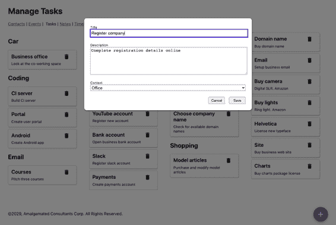

###### 图 9-22\. 用户单击任务后会出现编辑对话框

这些弹出窗口通常是*模态*的，这意味着我们要么与它们交互，要么在返回应用程序的其余部分之前将其关闭。但是，自定义模态对话框可能会存在一个问题：焦点可能会从中逃逸。

让我们看一下示例应用程序中的任务表单。早期版本的代码存在这个泄漏焦点的问题。如果用户点击一个任务，他们将看到任务表单，第一个字段将立即获得焦点。但如果用户按回 Tab 键，则焦点将移动到背景中的其他项目中（见图 9-23）。

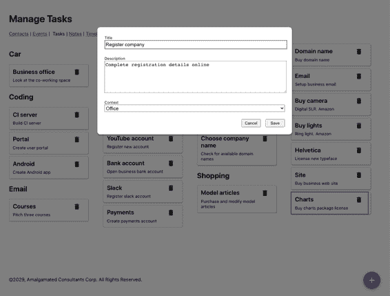

###### 图 9-23。按回 Tab 键将焦点移出对话框，转到*Charts*任务。

如果您能看到焦点已经转移到了哪里，这是一个稍微奇怪的功能。但对于使用可访问性软件的人来说，这可能是一个重大的困惑源，他们可能完全不知道模态对话框仍然在屏幕上。如果有人可以看到屏幕但无法使用鼠标，则体验可能会更加奇怪。用户可能能够聚焦到被对话框隐藏的组件上。

我们需要一种方法来限制焦点在一组组件内，以便用户不能意外地移动到本应不可及的组件中。

## 解决方案

我们将安装 React Focus Lock 库，它将限制焦点在一小部分组件内。您可以使用以下命令安装它：

```
$ npm install react-focus-lock
```

React Focus Lock 库通过在`ReactFocusLock`中包装一组组件来工作，它将监视焦点，并等待焦点移动到其外部。如果发生这种情况，它将立即将焦点移回内部。

在我们示例应用中的模态框是使用`Modal`组件创建的：

```
import './Modal.css'

function Modal({ open, onCancel, children, role, title }) {
  if (!open) {
    return null
  }

  return (
    <div role="presentation" className="Modal" ...>
      <div className="Modal-dialog" role={role} title={title} ...>
        {children}
      </div>
    </div>
  )
}
```

我们将模态框的整个内容作为子组件传递。我们可以使用 React Focus Lock 库通过将它们包装在`ReactFocusLock`中来将焦点限制在这些子组件内部：

```
import ReactFocusLock from 'react-focus-lock'
import './Modal.css'

function Modal({ open, onCancel, children, role, title }) {
  if (!open) {
    return null
  }

  return (
    <div role="presentation" className="Modal" ...>
      <div className="Modal-dialog" role={role} title={title} ...>
        <ReactFocusLock>{children}</ReactFocusLock>
      </div>
    </div>
  )
}
```

现在，如果用户打开`TaskForm`并开始按 Tab 键，他们将在对话框内循环浏览按钮和字段。如果他们在最后一个按钮后按 Tab 键，则将移动到第一个字段，反之亦然。

该库的工作原理是创建一个隐藏的按钮，其中`tabIndex`设置为 1，违反了 axe-core 的 tabindex 规则，该规则指出 tabindex 不应大于 0。如果这造成问题，您可以禁用 tabindex 规则。例如，在 cypress-axe 中，在执行页面审核之前，您可以运行`cy.configureAxe({rules: [{ id: 'tabindex', enabled: false }]})`。

## 讨论

我们的示例应用程序使用自定义模式对话框，从而展示了为何这通常是一个不好的做法。如果您使用来自 Material UI 等库的对话框和其他组件，通常会免费获得许多可访问性功能。此外，库通常会在 React 应用程序的“root” `div`之外创建浮动元素。然后，它们将整个“root” `div`的`aria-hidden`属性设置为`true`，有效地隐藏了屏幕阅读器和其他可访问性软件的整个应用程序余下的部分。

要查看一个无障碍模态的优秀示例，请看来自 ReactJS 团队的[React Modal](https://oreil.ly/2nI5x)。

您可以从[GitHub 网站](https://oreil.ly/0GfgA)下载此示例的源代码。

# 使用 Speech API 创建页面阅读器

## 问题

您可以使用许多工具来检查无障碍性，但是了解特定需求人员如何使用您的应用程序是很困难的。这就是为什么创建无障碍应用程序的最佳方法是让必须使用辅助设备的人士参与建立和测试您的代码。

对于我们其他人来说，通过辅助软件体验使用应用程序的“感觉”仍然是有帮助的。但是存在问题。盲文阅读器依赖用户阅读盲文的能力。能够读取您应用程序内容的软件是一个不错的选择，但大多数屏幕阅读器价格昂贵。Mac 自带名为 VoiceOver 的内置屏幕阅读器，具有许多功能，可以让您在屏幕上跳转。但并非每个人都使用 Mac。

Chrome 有一个名为 ChromeVox 的扩展，效果很好，但只适用于 Chrome，并且似乎不再积极开发。

除了所有这些问题外，屏幕阅读器还会想要告诉您有关*一切*的信息。您可能希望使用屏幕阅读器查看应用程序的某些部分是什么样子，但当您切换回 IDE 或其他浏览器标签中的一些参考材料时，它将继续朗读给您。

尽管存在所有这些问题，尝试体验应用程序的音频版本仍然值得一试。至少，它会让您对我们大多数人在编写可供人们使用的软件方面表现得多么糟糕有所了解。

我们可以做些什么来尝试使用屏幕阅读器测试我们的应用程序？

## 解决方案

我们将创建一个简单的屏幕阅读器——非常、*非常*简单的屏幕阅读器。它不会达到专业质量，但它会通过键盘和音频反馈来提供使用应用程序的一些体验。它还将在我们的本地 React 应用程序上运行，并且不会影响我们机器上的其他页面或桌面应用程序。它被称为 TalkToMe。^(10)

我们将在本章中始终使用的示例任务应用程序中添加少量代码。我们不希望屏幕阅读器代码包含在我们代码的生产版本中，因此我们将首先在主源文件夹中添加一个名为*talkToMe.js*的文件：

```
function talkToMe() {
  if (
    process.env.NODE_ENV !== 'production' &&
    sessionStorage.getItem('talkToMe') === 'true'
  ) {
    ...
  }
}
```

通过检查`NODE_ENV`值，我们可以将代码限制在开发环境中运行。我们还检查了名为`talkToMe`的会话存储变量。只有当此变量存在且具有值`"true"`时，我们才会运行屏幕阅读器。

我们需要代码来读取具有焦点的当前元素的详细信息。焦点事件不会冒泡，这意味着我们不能简单地将`onFocus`事件处理程序附加到高级元素并开始跟踪焦点。

然而，我们*可以*侦听`focusin`事件。我们可以将`focusin`侦听器附加到`document`对象上，每当用户移动到新组件时，它将被调用：

```
function talkToMe() {
  if (
    process.env.NODE_ENV !== 'production' &&
    sessionStorage.getItem('talkToMe') === 'true'
  ) {
    document.addEventListener('focusin', (evt) => {
      if (sessionStorage.getItem('talkToMe') === 'true') {
        ....
      }
    })
  }
}
```

注意，我们对`talkToMe`项目进行了额外的检查，以防用户在使用应用程序时关闭了它。

我们需要一些方法来描述当前聚焦的元素。此函数将基于其名称、角色等提供当前元素的粗略描述：

```
function getDescription(element) {
  const nodeName = element.nodeName.toUpperCase()
  const role = element.role
    ? element.role
    : nodeName === 'BUTTON'
    ? 'button'
    : nodeName === 'INPUT' || nodeName === 'TEXTAREA'
    ? 'text field ' + element.value
    : nodeName === 'SELECT'
    ? 'select field ' + element.value
    : element.getAttribute('role') || 'group'
  const title = element.title || element.textContent
  const extraInstructions =
    nodeName === 'INPUT' || nodeName === 'TEXTAREA'
      ? 'You are currently in a text field. To enter text, type.'
      : ''
  return role + '. ' + title + '. ' + extraInstructions
}
```

现在我们可以获取当前聚焦元素的描述：

```
function talkToMe() {
  if (
    process.env.NODE_ENV !== 'production' &&
    sessionStorage.getItem('talkToMe') === 'true'
  ) {
    document.addEventListener('focusin', (evt) => {
      if (sessionStorage.getItem('talkToMe') === 'true') {
        const description = getDescription(evt.target)
        ....
      }
    })
  }
}
```

现在我们需要将描述的文本转换为语音。为此，我们可以使用现在大多数浏览器都包含的 Web Speech API。语音合成器接受一个称为*utterance*的对象：

```
window.speechSynthesis.speak(
  new SpeechSynthesisUtterance(description)
)
```

在开始朗读文本片段之前，我们首先需要检查是否已经在处理其他内容。如果是这样，我们将取消旧的朗读并开始新的朗读，这将允许用户在听到足够的信息后快速跳转到组件：

```
if (window.speechSynthesis.speaking) {
  window.speechSynthesis.cancel()
}
window.speechSynthesis.speak(
  new SpeechSynthesisUtterance(description)
)
```

这给了我们最终版本的`talkToMe`：

```
function talkToMe() {
  if (
    process.env.NODE_ENV !== 'production' &&
    sessionStorage.getItem('talkToMe') === 'true'
  ) {
    document.addEventListener('focusin', (evt) => {
      if (sessionStorage.getItem('talkToMe') === 'true') {
        const description = getDescription(evt.target)
        if (window.speechSynthesis.speaking) {
          window.speechSynthesis.cancel()
        }
        window.speechSynthesis.speak(
          new SpeechSynthesisUtterance(description)
        )
      }
    })
  }
}
```

现在我们可以通过在应用程序的*index.js*文件顶部调用它来添加`talkToMe`：

```
import React from 'react'
import ReactDOM from 'react-dom'
import './index.css'
import App from './App'
import reportWebVitals from './reportWebVitals'
import talkToMe from './talkToMe'

talkToMe()

ReactDOM.render(
  <React.StrictMode>
    <App />
  </React.StrictMode>,
  document.getElementById('root')
)

// If you want to start measuring performance in your app, pass a function
// to log results (for example: reportWebVitals(console.log))
// or send to an analytics endpoint. Learn more: https://bit.ly/CRA-vitals
reportWebVitals()
```

如果现在在浏览器中打开应用程序，打开开发者控制台，并创建一个名为`talkToMe`的新会话存储变量，将其设置为字符串“true”，则在按 Tab 键切换元素时，您应该听到元素的描述。

## 讨论

*talkToMe*屏幕阅读器只不过是一个玩具，但它将帮助您在代码中创建简明的标题和其他元数据，强调“前置加载”信息的重要性。用户越早能决定某个元素不是他们正在寻找的，他们就越快可以继续。它还将清楚地显示出您的应用程序中哪些部分难以导航，并允许您在不查看屏幕的情况下尝试应用程序。

您可以从[GitHub 网站](https://oreil.ly/0GfgA)下载此示例的源代码。

^(1) 有关围绕菜单和菜单项问题的有趣讨论，请参见 Adrian Roselli 的[这篇文章](https://oreil.ly/i8AMI)。

^(2) 在撰写本章时，我们自己发现了这一点。因此，在示例应用程序中，我们无疑错过了许多无障碍问题。

^(3) 如果您想在预提交 Git 钩子或集成服务器上检查代码，这将特别有用。

^(4) 有关角色及其用途的详细信息，请参见“应用角色、替代文本和标题”。

^(5) 参见“在模态框中捕获范围”中涉及大于零值的问题。

^(6) 当你阅读本书时，这样的规则可能已经存在。

^(7) 您可以根据需要为此文件命名，只要它具有 *.js* 扩展名并且位于集成目录内。

^(8) 有关 `main` 部分的更多信息，请参阅 “使用地标”。

^(9) 这是基于用户 [Radek](https://oreil.ly/5p8nS) 在 [StackOverflow](https://oreil.ly/Li5sB) 上回答的问题的答案。

^(10) 感谢 Terry Tibbs 在编写此工具时提供的帮助。
