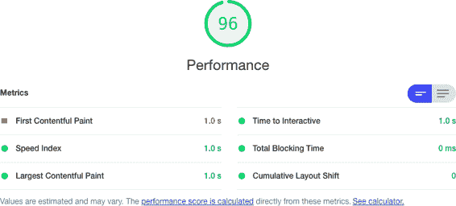

# 第十章：性能

我们中的一位计算机科学讲师曾在一堂课上开头说过：“你永远不应该、绝对不应该试图优化你的代码。但当你确实需要优化你的代码时，这是你应该如何做的方法。”

正如 Donald Knuth 曾经说过的那样，过早优化是万恶之源。你应该先让你的代码工作起来。然后让你的代码易于维护。只有在有问题时，你才应该考虑让你的代码快速运行。慢速但工作正常的代码永远比快速但不可用的代码好。

话虽如此，性能可能成为重要问题的时候。如果你的应用加载时间超过几秒，可能会失去永不返回的用户。在低功率设备上，慢速可能导致无法使用。本章将采用我们称之为*本质主义*的性能方法。你应该很少调整你的代码，但当你需要时，你应该调整正确的代码。我们将看看各种工具和技术，让你能够追踪和测量性能瓶颈，以便在必要时应用性能修复，确保它们应用在正确的地方，并且有一些方法来衡量它们带来的改变。

所有性能修复都会带来成本。如果使客户端代码更快，可能会消耗更多内存或更多服务器时间。你几乎总是需要添加更多的代码和更多的复杂性。

本章中的示例按照我们建议的处理性能问题的顺序排列。我们从浏览器中的高级测量开始，探讨如何客观地识别性能瓶颈。如果找到了瓶颈，我们将向您展示如何使用 React 内置的`Profiler`组件来跟踪导致问题的各个组件。然后，我们会深入探讨更低级别和更精确的性能测量方法，精确到亚毫秒级别。

只有在您能够精确测量性能之后，才能考虑提高代码的速度。

我们接下来将向您展示一些改善应用性能的简单方法。有些方法很简单，比如将代码拆分成更小的包或组合异步网络调用。其他方法则更为复杂，比如在服务器上预渲染页面。

总结一下：本章更多关注的是性能测量而不是性能调优。因为你永远不应该、绝对不应该优化你的代码，但当你确实需要时，你应该从测量开始。

# 使用浏览器性能工具

## 问题

值得一提的是，在确信存在问题之前，最好延迟性能调优。从某种意义上说，只有当用户注意到你的应用程序性能不佳时，你才真正面临问题。但如果等到用户注意到了，可能为时已晚。因此，有必要设定一些客观的度量标准，用以判断何时需要对应用程序进行调优，而不只是寻找可能运行更快的代码。几乎总能使代码运行更快，许多开发人员花费了大量时间调优代码，却没有对用户体验产生显著影响。

最好有一个工具，可以专注于在哪些地方可能需要优化你的代码。

## 解决方案

检查性能的最佳方法是使用浏览器。最终，用户的体验是唯一重要的。因此，我们将查看各种内置于浏览器的工具，这些工具将提供客观的度量，并找出代码潜在的瓶颈。

我们将首先看一下 Chrome 中名为 Lighthouse 的内置工具。

谷歌为 Firefox 生产了一个名为 Google Lighthouse 的附加组件。虽然它效果很好，但它只是 Google Page Speed 服务的前端，因此只能用于公开的 Web 页面。但是，你可以在 Chrome 上的任何页面上使用 Lighthouse 扩展。

Lighthouse 扩展是检查应用程序基本适用性的好方法。除了检查性能外，Lighthouse 还会审查网页的可访问性以及是否遵循最佳网络实践。它还将检查您的页面是否为搜索引擎机器人优化，并查看您的 Web 应用程序是否符合被视为渐进式 Web 应用程序的标准（见图 10-1）。


###### 图 10-1\. Lighthouse 检查的指标

你可以以两种方式运行 Lighthouse 审计：在命令行上或在浏览器中。

如果你想在命令行上运行审计，你首先需要安装 Lighthouse 命令：

```
$ npm install -g lighthouse
```

然后，你可以使用 `lighthouse` 命令来运行审核：

```
$ lighthouse http://localhost:3000
```

Lighthouse 的命令行版本只是 Google Chrome 浏览器的自动化脚本。它的优势在于生成审核的 HTML 报告，适合在持续集成服务器上使用。

你也可以在 Google Chrome 中交互地使用 Lighthouse。最好在隐身窗口中进行此操作，这样可以减少其他扩展程序和存储与 Lighthouse 审计的干扰。一旦启动了 Chrome 并打开了你的应用程序，进入开发者工具，然后切换到 Lighthouse 标签（见图 10-2）。


###### 图 10-2\. 带有 Chrome 开发工具的 Lighthouse 标签页

然后点击生成审核按钮。 Lighthouse 将刷新您的页面多次并执行一系列审核。性能审核将集中在六个不同的指标上（见图 10-3）。



###### 图 10-3. Lighthouse 性能审核测量的六个 Web 核心指标

这些指标被称为*Web 核心指标*。Web 核心指标是您在应用程序运行中跟踪性能的指标。

*首次内容绘制*（FCP）是浏览器开始渲染内容所需的时间。FCP 将显著影响用户对性能的感知。在 FCP 之前，用户将只看到空白屏幕，如果这种情况持续时间过长，用户可能会关闭浏览器并转向其他地方。

Lighthouse 测量 FCP 所需时间，然后将其与 Google 全球记录的性能统计数据进行比较。如果您的应用程序在全球 FCP 的前 25%中，它将标记为绿色。目前，绿色评级意味着第一个内容在两秒内呈现。如果在前 75%内，它将给您一个橙色等级，这意味着您的页面开始在四秒内呈现。Lighthouse 将为其他情况给出红色评分。

*速度指数*（SI）衡量页面视觉稳定化所需的时间。它通过录制视频并检查帧之间的差异来进行视觉检查。

Lighthouse 将 SI 指标与全球网站性能进行比较。如果 SI 小于 4.3 秒，则您在全球网页的前 25%中，Lighthouse 将给出绿色评级。如果小于 5.8 秒，则您将在前 75%中，并获得橙色评级。其他情况下都会被评为红色。

*最大内容绘制*（LCP）发生在浏览器视口完全加载时。其他内容可能仍在视野之外加载，但 LCP 是用户感觉到页面可见的时候。要获得绿色评级，LCP 需要在 2.5 秒内完成。对于橙色评级，它需要少于 4 秒。其他情况下都会被评为红色。服务器端渲染可以显著提高 LCP 评级。

*交互时间*（TTI）是在您可以使用鼠标和键盘与页面交互之前所需的时间。在 React 中，这发生在第一个完整渲染之后，当 React 附加了事件处理程序时。您希望这个时间少于 3.8 秒以获得绿色评级。如果您可以获得 7.3 秒或更少的 TTI，您将获得橙色评级。其他情况下都会被评为红色。您可以通过延迟加载第三方 JavaScript 或代码分割来改善 TTI。^(1)

*总阻塞时间*（TBT）是在 FCP 和 TTI 之间发生的所有阻塞任务的总和。阻塞任务是任何超过 50 毫秒的任务。这大约是电影中显示一帧所需的时间，超过 50 毫秒的任何事情开始变得显著。如果阻塞任务过多，浏览器将开始感觉像是冻结。因此，TBT 的等级涵盖了较短的时间段。如果 TBT 小于 300 毫秒，Lighthouse 将评估您的页面为绿色。600 毫秒以内为橙色，其他情况为红色。高 TBT 分数会使用户感觉浏览器超负荷运行。通常通过减少 JavaScript 代码运行或减少 DOM 扫描次数来改善 TBT。最有效的技术可能是代码拆分。

*累积布局偏移*（CLS）衡量的是您网页的*跳动性*或视觉稳定性。如果您的应用在页面加载期间插入额外内容并移动其他内容，这将开始影响 CLS 指标。CLS 是页面在加载期间移动的比例。

Lighthouse 报告中未包括的*首次输入延迟*（FID）指标是用户向页面发送事件（例如点击按钮）和 JavaScript 处理程序接收事件之间所需的时间。您希望 FID 不超过 300 毫秒。FID 与 TBT 密切相关，因为阻塞事件通常由事件处理程序创建。

除了提供页面主要指标的审计外，Lighthouse 报告还将包括修复任何发现问题的建议。

Lighthouse 是检查性能问题的绝佳起点。它并非详尽检查，但会突出显示您可能没有注意到的问题。

许多因素（带宽、内存、CPU 等）都会影响 Lighthouse 的审核结果，因此您可以预期结果会因运行而异。像[WebPageTest](https://www.webpagetest.org)和[GTmetrix](https://gtmetrix.com)这样的在线服务可以从世界各地的多个位置对您的应用程序进行审核，这将为您提供比针对*http://localhost:3000*运行的 Lighthouse 审核更真实的应用程序速度视图。

虽然 Lighthouse 擅长突出性能问题的存在，但在找出问题的根本原因方面不太有帮助。可能是网页的代码过大或速度太慢。也可能是服务器响应迟缓。甚至可能是资源问题，如内存不足或缓存大小过大。

要找出瓶颈存在的*原因*，我们接下来可以访问浏览器本身的性能工具。

如果您正在使用 Firefox 或 Chrome，您可以通过在隐身窗口中打开您的页面，然后转到开发工具中的性能选项卡（见图 10-4）来访问性能控制台。


###### 图 10-4\. 浏览器开发工具中的性能选项卡

性能选项卡就像浏览器的引擎管理系统。在那里，您可以跟踪内存使用情况、任何 CPU 阻塞程序、DOM 中的元素数量等等。要收集统计信息，您需要单击工具栏上的记录按钮，然后与页面进行交互几秒钟，然后停止录制。性能系统将追踪您选择的所有内容。例如，在图 10-5 的示例中，您可以看到当用户单击按钮时发生了阻塞操作（请参阅早期的 TBT），浏览器在事件处理程序返回之前阻塞了 60.92 毫秒。


###### 图 10-5\. 放大以调查长时间运行的任务

性能选项卡为您提供了在性能调优时可能需要的所有统计数据。它可能包含的细节远远超出您可能需要的范围。因此，您可能希望安装 React 开发者工具，它们适用于[Chrome](https://oreil.ly/vvCLp)和[Firefox](https://oreil.ly/mw1yn)。

安装 React 开发者工具后，您可能会发现它们默认情况下无法在隐身模式中运行。启用它们是值得的（参见 Chrome 的图 10-6 和 Firefox 的图 10-7）。


###### 图 10-6\. 在 Chrome 的隐身模式中启用 React Dev 工具


###### 图 10-7\. 在 Firefox 的私密模式中启用 React Dev 工具

与浏览器的性能工具类似，React 开发者工具需要您通过单击开发者面板左上角的记录按钮来记录性能会话（参见图 10-8）。


###### 图 10-8\. Chrome DevTools 中的 React Profiler 选项卡

记录会话后，性能统计数据将显示，并与呈现网页的 React 组件相关联。如果某个组件显示时间过长，您可以将鼠标悬停在性能结果上，并在页面上看到其高亮显示（请参见图 10-9）。

React 开发者工具通常是识别性能问题根本原因的最佳交互工具。但是，如同往常一样，如果用户或像 Lighthouse 这样的更高级别工具发现存在性能瓶颈，您应该考虑调优性能。


###### 图 10-9\. 如果您在火焰图中悬停在一个组件上，它将在页面上被高亮显示

## 讨论

如果您在性能方面采取了“本质主义”的方法，您应该始终从浏览器开始，无论是使用应用程序还是使用我们在此处讨论的内置工具或扩展。

# 使用 Profiler 跟踪渲染

## 问题

浏览器工具提供了丰富的性能详细信息，它们应该始终是您寻找底层性能问题原因的首选位置。

一旦您确定了问题，获取应用程序的某个部分的更详细的性能统计信息可能会有所帮助。在进行更改前后收集实际的性能数据是提升性能的唯一途径。使用浏览器扩展可能会很难做到这一点，因为它们会向您提供关于所有内容的大量信息。

我们如何获取我们正在调优的应用程序部分的性能统计信息？

## 解决方案

我们将使用 React 的`Profiler`组件。您可以将`Profiler`组件包装在您要调优的应用程序的任何部分周围。每当 React 渲染它时，它将记录性能统计信息，并向您显示几个重要的信息：

| 统计 | 目的 |
| --- | --- |
| 阶段 | 是安装还是更新引起了渲染 |
| 实际持续时间 | 如果不应用内部缓存，渲染完成所需的时间 |
| 基础持续时间 | 使用缓存进行渲染所花费的时间 |
| 开始时间 | 页面加载后的毫秒数 |
| 提交时间 | 当渲染结果进入浏览器的 DOM 时 |
| 交互 | 我们当前正在跟踪的任何事件处理程序 |

要了解`Profiler`组件的工作原理，让我们开始检查您可以在图 10-10 中看到的示例应用程序。


###### 图 10-10\. 示例日历应用程序

这是`App`组件的代码：

```
import { useState } from 'react'
import { unstable_trace as trace } from 'scheduler/tracing'
import './App.css'

function App({ onRender }) {
  const [year, setYear] = useState(2023)

  return (
    <div className="App">
      <h1>Year: {year}</h1>
      <button onClick={() => setYear((y) => y - 1)}>Previous</button>
      <button onClick={() => setYear((y) => y + 1)}>Next</button>
      <br />
      <YearCalendar year={year} onRender={onRender} />
    </div>
  )
}

export default App
```

应用程序显示两个按钮：一个用于向前移动一年，另一个用于向后移动。

我们可以首先将按钮和日历组件包装在`Profiler`组件中：

```
import { useState, Profiler } from 'react'
import { unstable_trace as trace } from 'scheduler/tracing'
import './App.css'

function App({ onRender }) {
  const [year, setYear] = useState(2023)

  return (
    <div className="App">
      <h1>Year: {year}</h1>
      <Profiler id="app" onRender={() => {}}>
        <button onClick={() => setYear((y) => y - 1)}>
          Previous
        </button>
        <button onClick={() => setYear((y) => y + 1)}>Next</button>
        <br />
        <YearCalendar year={year} onRender={onRender} />
      </Profiler>
    </div>
  )
}

export default App
```

`Profiler`接受一个`id`和一个回调函数`onRender`。每次`Profiler`被渲染时，它都会将统计信息发送回`onRender`函数。因此，让我们更详细地填写`onRender`函数的细节：

```
import { useState, Profiler } from 'react'
import { unstable_trace as trace } from 'scheduler/tracing'
import './App.css'

let renders = []
let tracker = (
  id,
  phase,
  actualDuration,
  baseDuration,
  startTime,
  commitTime,
  interactions
) => {
  renders.push({
    id,
    phase,
    actualDuration,
    baseDuration,
    startTime,
    commitTime,
    interactions: JSON.stringify(Array.from(interactions)),
  })
}

function App({ onRender }) {
  const [year, setYear] = useState(2023)

  return (
    <div>
      ....
      <Profiler id="app" onRender={tracker}>
        ....
      </Profiler>
      <button onClick={() => console.table(renders)}>Stats</button>
    </div>
  )
}
```

`tracker`函数将在名为`renders`的数组中记录`Profiler`的每个结果。我们还在界面上添加了一个按钮，每当我们点击它时，它将以表格格式在控制台中显示渲染结果。

如果我们重新加载页面并点击几次“前进”和“后退”按钮，然后点击“统计”按钮，我们将在控制台上看到概要统计信息（见图 10-11）。

数据以表格格式呈现，这使得阅读起来稍微容易一些。这还意味着我们可以按任何列排序。我们还可以复制整个表格并将其粘贴到电子表格中进行更多分析。


###### 图 10-11\. JavaScript 控制台中显示的渲染统计信息

您会注意到*交互*列始终是一个空数组。这是因为我们目前没有追踪任何事件处理程序或其他代码片段。如果我们想要查看在渲染过程中当前正在运行的事件处理程序，我们可以导入一个跟踪函数并将其包装在我们想要追踪的任何代码周围。例如，这是我们如何开始跟踪用户点击“上一页”按钮的方式：

```
import { unstable_trace as trace } from 'scheduler/tracing'
...
<button
  onClick={() => {
    trace('previous button click', performance.now(), () => {
      setYear((y) => y - 1)
    })
  }}
/>
```

`trace` 函数接受一个标签、一个时间戳和一个包含它正在追踪的代码的回调函数。时间戳可以是一个日期，但通常最好使用从 `performance.now()` 返回的毫秒数。

如果我们重新加载网页，点击几次“下一页”，然后点击几次“上一页”，我们将开始看到这些交互出现在结果表格中（见图 10-12）。


###### 图 10-12\. 在结果表格中显示跟踪的交互作为 JSON 字符串

我们对输出进行字符串化，因为 `trace` 将交互存储为 JavaScript 集合，这些集合通常在控制台中不正确显示。尽管交互数据在表格中看起来被截断，但您仍然可以复制结果。以下是单个跟踪交互返回的数据示例：

```
[
    {
        "__count":1,
        "id":1,
        "name":"previous button click",
        "timestamp":4447.909999988042
    }
]
```

## 讨论

`Profiler` 组件从 React 版本 16.4.3 开始存在。`trace` 函数仍处于实验阶段，但它具有巨大的功能。虽然在我们的示例中仅使用了一个简单的事件处理程序，但它还可以为更大的代码块（例如网络请求）提供真实的时间信息。React 容器组件在渲染期间通常会有许多正在进行中的网络请求，`trace` 函数使您能够查看在特定慢渲染时发生了什么。它还能让您大致了解多少次渲染是由一整套不同的网络流程链导致的。

您可以从[GitHub 网站](https://oreil.ly/XhJLR)下载此示例的源代码。

# 创建性能分析单元测试

## 问题

React 的 `Profiler` 是一个强大的工具。它让您可以访问 React 开发者工具中提供的相同性能分析信息。它的优势在于您可以专注于正在尝试优化的代码。

然而，它仍然依赖于您与网页的交互。在进行代码更改之前和之后，您会想测试性能。但是如何确保您在之前和之后测量的时间是相同的？如果进行手动测试，如何保证每次执行相同的一组操作？

## 解决方案

本文将介绍如何创建调用 `Profiler` 代码的单元测试。自动化测试将允许我们创建可重复运行的性能测试，以验证我们所做的任何优化是否真正对性能产生影响。

在单元测试中，我们可以在 Web 浏览器之外渲染 React 组件，因为 Testing Library 提供了一个无头 DOM 的实现。

要了解如何使用 `Profiler`，我们将再次查看示例日历应用程序（参见 图 10-13）。


###### 图 10-13\. 示例日历应用程序

我们可以将 `Profiler` 组件添加到 `App` 组件的主要代码中，然后允许任何其他代码传递一个 `onRender` 方法，该方法可用于跟踪渲染性能：

```
import { useState, Profiler } from 'react'
import YearCalendar from './YearCalendar'
import { unstable_trace as trace } from 'scheduler/tracing'
import './App.css'

function App({ onRender }) {
  const [year, setYear] = useState(2023)

  return (
    <div className="App">
      <h1>Year: {year}</h1>
      <Profiler id="app" onRender={onRender || (() => {})}>
        <button
          onClick={() => {
            trace('previous button click', performance.now(), () => {
              setYear((y) => y - 1)
            })
          }}
        >
          Previous
        </button>
        <button onClick={() => setYear((y) => y + 1)}>Next</button>
        <br />
        <YearCalendar year={year} onRender={onRender} />
      </Profiler>
    </div>
  )
}

export default App
```

我们还可以将 `onRender` 函数传递给子组件，以跟踪它们的渲染性能。在上述代码中，我们将 `onRender` 传递给 `YearCalendar`，它可以在其自己的 `Profiler` 组件中使用它，或者将其传递到组件树的更深层次。

通过创建提供程序组件，可以避免将 `onRender` 传递给子组件并将其注入到当前上下文中。我们这里没有这样做是为了保持代码的简单性。但书中其他地方有各种提供程序的例子。例如，参见 “安全请求，而不是路由” 中的 `SecurityProvider`。

`Profiler` 组件必须具有 `id` 属性和 `onRender` 属性。当应用程序正常运行时，`App` 组件不会传递 `onRender` 属性，因此我们需要提供一个默认函数：

```
<Profiler id='app' onRender={onRender || (() => {})}>
```

`Profiler` 组件相对轻量，通常不会减慢应用程序的性能。如果忘记从代码中移除 `Profiler`，也没有关系。`Profiler` 仅在开发模式下运行。创建生产版本时，将从代码中删除它。

现在我们可以开始构建单元测试：

```
import { render, screen } from '@testing-library/react'
import user from '@testing-library/user-event'
import App from './App'

let renders = []
let tracker = (
  id,
  phase,
  actualDuration,
  baseDuration,
  startTime,
  commitTime,
  interactions
) => {
  renders.push({
    id,
    phase,
    actualDuration,
    baseDuration,
    startTime,
    commitTime,
    interactions: JSON.stringify(Array.from(interactions)),
  })
}

let startTime = 0

describe('App', () => {
  beforeEach(() => {
    renders = []
    startTime = performance.now()
  })
  afterEach(() => {
    console.log('Time taken: ', performance.now() - startTime)
    console.table(renders)
  })
  it('should move between years', async () => {
    render(<App onRender={tracker} />)
    user.click(screen.getByRole('button', { name: /previous/i }))
    user.click(screen.getByRole('button', { name: /previous/i }))
    user.click(screen.getByRole('button', { name: /previous/i }))
    user.click(screen.getByRole('button', { name: /next/i }))
    user.click(screen.getByRole('button', { name: /next/i }))
    user.click(screen.getByRole('button', { name: /next/i }))
  }, 30000)
})
```

测试时间超过五秒钟可能会违反 Jest 的超时限制。避免此限制的最简单方法是在 `it` 函数调用中添加超时参数，就像我们在这里做的那样，将超时设置为 30,000 毫秒。您需要根据测试的复杂性调整此值。

运行此测试时，在控制台中会捕获大量数据（参见 图 10-14）。


###### 图 10-14\. 单元测试将捕获大量的渲染信息

值得注意的是，该测试是*可重复*的。每次执行时都会执行相同的操作。我们发现单元测试通常比在浏览器中运行的代码更一致。前一个测试的重复运行总时间为 2,100 毫秒 +/- 20 毫秒。这个变化小于 1%。它们每次还产生了确切的 2,653 个分析分数。

在浏览器中进行手动测试，很难获得可重复的结果。

在这里的示例中，我们只是显示捕获的结果。在实际性能情况下，您可能希望以某种方式处理结果，以找到特定组件的平均渲染时间，例如。然后，当您开始调整组件时，可以更有信心地确保任何性能提升都是由于实际性能变化而不是浏览器行为的变化。

## 讨论

即使我们在 Jest 单元测试中编写了这段性能测试代码，它并不像常规功能测试那样是一个*测试*；我们没有执行任何断言。断言仍然可能有所帮助，^(2)但编写断言某些操作比给定时间快的性能测试并不好。性能测试高度依赖于环境。如果您在开发环境上编写了一个断言某些事情将花费少于三秒的测试，那么如果它在集成服务器上花费了九秒，您不应感到惊讶。

如果您确实想要自动跟踪性能，您可以考虑添加回归检查。回归检查将在某个中央存储库中记录一组性能统计信息，并记录生成这些统计信息的环境的 ID。您可以检查将来在相同环境中运行的速度是否显著慢于在相同环境中历史运行的速度。

总体而言，报告性能结果比断言所需的性能更为重要。

您可以从[GitHub 网站](https://oreil.ly/XhJLR)下载此配方的源代码。

# 精确测量时间

## 问题

一旦您需要优化非常底层的 JavaScript 代码，您应该使用什么来测量性能？例如，您可以使用`Date()`函数在某些 JavaScript 代码的开头和结尾创建时间戳：

```
const beforeDate = new Date()
for (let i = 0; i < 1000; i++) {}
const afterDate = new Date()
console.log(
  '1,000 loops took',
  afterDate.getTime() - beforeDate.getTime()
)
```

我们可以将每个日期转换为毫秒，这样我们就可以看到从一个日期减去另一个日期需要多长时间。

这是一种常见的技术，`console`对象被赋予了称为`time`和`timeEnd`的新方法，以缩短代码：

```
console.time('1,000 loops')
for (let i = 0; i < 1000; i++) {}
console.timeEnd('1,000 loops')
```

`time`函数接受一个标签参数，如果我们使用相同的标签调用`timeEnd`，它会在控制台上显示结果。让我们运行代码：

```
1,000 loops: 0ms
```

这是一个问题。React 应用程序很少包含长时间运行的函数，因此您通常只需要优化浏览器多次调用它们的小段 JavaScript 代码。例如，您可能希望优化在屏幕上渲染动画的游戏代码。由于短代码片段可能运行时间少于一毫秒，因此很难测量它们的性能。我们不能使用`Date`对象来测量性能，因为它们只能精确到毫秒，即使机器的内部时钟要精确得多。

我们需要一些可以用来测量少于一毫秒时间的东西。

## 解决方案

我们将使用`performance.now()`。此函数调用返回以毫秒分数表示的高分辨率时间戳。例如，如果您打开 Chrome 控制台并键入`performance.now()`，您将看到类似于这样的内容：

```
> performance.now()
< 10131.62500000908
```

与 JavaScript 日期中的时间测量方式不同。JavaScript 日期从 1970 年 1 月 1 日开始测量时间。相反，`performance.now()`从当前网页加载时开始计时。^(3)

如果您尝试在 Firefox 中运行`performance.now()`，会发生一件有趣的事情：

```
> performance.now()
< 4194
```

默认情况下，Firefox 仅返回`performance.now()`的整数毫秒部分，有效地删除了使用它的大部分优势。Firefox 四舍五入到整数毫秒，这是出于安全考虑。从技术上讲，如果 JavaScript 可以精确地计时微小的代码量，这可以为浏览器提供签名。

您可以通过打开`about:config`，搜索名为`privacy.reduceTimerPrecision`的属性，并将其设置为`false`来在 Firefox 中启用高分辨率时间。如果您这样做，将开始获得高分辨率时间：

```
performance.now()
151405.8
```

如果您希望避免第三方使用它来跟踪您，请确保禁用此属性。

要回到我们的示例代码，我们可以测量执行类似于这样的循环所花费的时间：

```
const before0 = performance.now()
for (let i = 0; i < 1000; i++) {}
const after0 = performance.now()
console.log('1,000 loops took', after0 - before0)
const before1 = performance.now()
for (let i = 0; i < 100000; i++) {}
const after1 = performance.now()
console.log('100,000 loops took', after1 - before1)
```

当我们运行此代码时，我们看到以下结果：

```
1,000 loops took 0.03576700000007804
100,000 loops took 1.6972319999999854
```

这些答案更为精确，并提供有关 JavaScript 底层性能的更多信息。在这种情况下，我们可以看到向循环添加更多迭代并不会线性扩展，这表明 JavaScript 引擎在意识到每个循环迭代相同时开始即时优化代码。

## 讨论

`performance.now()`相比于 JavaScript 日期具有几个优点。除了额外的精度外，它不受时钟更改的影响，这在决定添加一些性能监控到长时间运行的代码时非常有用。它还会在页面加载时从零开始计时，这对于优化页面加载时间非常有用。

在使用`performance.now()`时需要注意一点：谨慎使用它来构建某些高级定时功能。例如，我们曾经创建了一个简单的 JavaScript 生成器函数，使使用`performance.now()`变得更容易：

```
function* timekeeper() {
  let now = 0
  while (true) yield -now + (now = performance.now())
}
```

创建此函数是为了避免需要计算开始和结束时间之间差异的需求。而不是写成这样：

```
const before0 = performance.now()
for (let i = 0; i < 1000; i++) {}
const after0 = performance.now()
console.log('1,000 loops took', after0 - before0)
const before1 = performance.now()
for (let i = 0; i < 100000; i++) {}
const after1 = performance.now()
console.log('100,000 loops took', after1 - before1)
```

相反，我们可以这样编写：

```
const t = timekeeper()
t.next()
for (let i = 0; i < 1000; i++) {}
console.log('1,000 loops took', t.next().value)
for (let i = 0; i < 100000; i++) {}
console.log('100,000 loops took', t.next().value)
```

没有必要使用所有那些丑陋的`before`和`after`变量。每次调用`t.next().value`后时间将重置为零，不再需要计算。

问题在于，将`performance.now()`调用包装在另一个函数内会显著增加测量时间，从而破坏`performance.now()`的精度：

```
1,000 loops took 0.05978800000002593
100,000 loops took 19.585223999999926
```

在这种情况下，即使运行 100,000 次循环仅需 1.69 毫秒，该函数也会报告超过 19 毫秒的时间。

如果希望准确，请勿将对`performance.now()`的调用隐藏在另一个函数中。

您可以从[GitHub 网站](https://oreil.ly/baiOr)下载此配方的源代码。

# 使用代码拆分来缩小您的应用程序

## 问题

SPA 的性能损耗之一是需要下载和运行的 JavaScript 代码量。 JavaScript 不仅需要时间来渲染，而且所需的网络带宽量可能会显著减慢连接到移动网络的设备上的应用程序速度。

让我们考虑我们在 第二章 中使用的 *同步路由* 应用程序（参见 图 10-15）。


###### 图 10-15\. 同步路由应用程序

示例应用程序很小，但包含一些相当大的 JavaScript 捆绑包：

```
$ ls -l build/static/js
total 1336
-rw-r--r--  1 davidg  admin  161800 12:07 2.4db4d779.chunk.js
-rw-r--r--  1 davidg  admin    1290 12:07 2.4db4d779.chunk.js.LICENSE.txt
-rw-r--r--  1 davidg  admin  461100 12:07 2.4db4d779.chunk.js.map
-rw-r--r--  1 davidg  admin    4206 12:07 3.307a63d5.chunk.js
-rw-r--r--  1 davidg  admin    9268 12:07 3.307a63d5.chunk.js.map
-rw-r--r--  1 davidg  admin    3082 12:07 main.e8a3e1cb.chunk.js
-rw-r--r--  1 davidg  admin    6001 12:07 main.e8a3e1cb.chunk.js.map
-rw-r--r--  1 davidg  admin    2348 12:07 runtime-main.67df5f2e.js
-rw-r--r--  1 davidg  admin   12467 12:07 runtime-main.67df5f2e.js.map
$
```

最大的 (*2.4db4d779.chunk.js*) 包含主要的 React 框架代码，而应用程序特定的代码仅限于小的 *main.e8a3e1cb.chunk.js* 文件。 这意味着该应用程序几乎是一个 React 应用程序可以达到的最小尺寸。 大多数 React 应用程序通常会更大：通常总计 1 Mb 的大小，这对于使用慢速连接的用户来说将是一个显著问题。

那么，在 React 中，我们可以做些什么来减少 JavaScript 捆绑包的大小呢？

## 解决方案

我们将使用 *代码拆分*，它涉及将应用程序的主要代码拆分为几个较小的捆绑包。 然后，浏览器将 *延迟加载* 这些捆绑包。 只有当需要其中一个包含的组件时，才会加载特定的捆绑包。

我们为本示例应用程序使用的应用程序肯定不需要代码拆分。 与所有性能更改一样，只有在拆分代码确实显著改善了 Web 性能时，才应该尝试拆分代码。 我们将在这个应用程序中拆分代码，因为这样做更容易看到它的工作原理。

我们使用 `lazy` 函数在 React 中拆分代码：

```
import { lazy } from 'react'
```

`lazy` 函数接受一个工厂函数，调用时将导入一个组件。 `lazy` 函数返回一个占位符组件，在浏览器渲染它之前什么也不做。 占位符组件将运行工厂函数并动态加载包含实际组件的任何捆绑包。

要了解这是如何工作的，请考虑我们示例应用程序中的这个组件：

```
import { NavLink, Redirect, Route, Switch } from 'react-router-dom'
import People from './People'
import Offices from './Offices'
import './About.css'

const About = () => (
  <div className="About">
    <div className="About-tabs">
      <NavLink
        to="/about/people"
        className="About-tab"
        activeClassName="active"
      >
        People
      </NavLink>
      <NavLink
        to="/about/offices"
        className="About-tab"
        activeClassName="active"
      >
        Offices
      </NavLink>
    </div>
    <Switch>
      <Route path="/about/people">
        <People />
      </Route>
      <Route path="/about/offices">
        <Offices />
      </Route>
      <Redirect to="/about/people" />
    </Switch>
  </div>
)

export default About
```

当用户访问特定路由时，浏览器将仅渲染 `People` 和 `Offices` 组件。 如果应用程序当前位于路径 */about/people*，则 `Offices` 组件将不会渲染，这意味着我们可以推迟加载 `Offices` 组件直至稍后。 我们可以通过 `lazy` 函数实现这一点。

我们将 `Offices` 组件的导入替换为调用 `lazy`：

```
//import Offices from "./Offices"
const Offices = lazy(() => import('./Offices'))
```

现在存储在 `Offices` 变量中的对象将在应用程序的其余部分中显示为另一个组件。 它是一个惰性占位符。 在内部，它包含对工厂函数的引用，在浏览器渲染时将调用该函数。

如果尝试刷新网页，将会看到一个错误（参见 图 10-16）。


###### 图 10-16\. 如果忘记添加 Suspense 组件，您将收到延迟加载错误

占位符在返回之前不会等待实际组件加载。相反，它会在等待实际组件加载时替换一些其他 HTML。

我们可以通过 `Suspense` 容器设置这个“加载”界面：

```
import { lazy, Suspense } from 'react'
import { NavLink, Redirect, Route, Switch } from 'react-router-dom'
import People from './People'
// import Offices from './Offices'
import './About.css'

const Offices = lazy(() => import('./Offices'))

const About = () => (
  <div className="About">
    <div className="About-tabs">
      <NavLink
        to="/about/people"
        className="About-tab"
        activeClassName="active"
      >
        People
      </NavLink>
      <NavLink
        to="/about/offices"
        className="About-tab"
        activeClassName="active"
      >
        Offices
      </NavLink>
    </div>
    <Suspense fallback={<div>Loading...</div>}>
      <Switch>
        <Route path="/about/people">
          <People />
        </Route>
        <Route path="/about/offices">
          <Offices />
        </Route>
        <Redirect to="/about/people" />
      </Switch>
    </Suspense>
  </div>
)

export default About
```

`lazy` 占位符将检查其上下文，找到由 `Suspense` 提供的 `fallback` 组件，并在等待额外的 JavaScript 包加载时在页面上显示它。

我们在这里使用了一个简单的“加载中…”消息，但你完全可以显示一些假的替代界面，以给人一种新组件已加载的假象。YouTube 在其首页也使用了同样的技术。当 YouTube 加载内容时，它会显示一组块和矩形，代替即将加载的视频（参见图 10-17）。视频通常需要两到三秒才能加载完毕，但这种技术让用户感觉它们几乎瞬间加载完成。


###### 图 10-17\. YouTube 在加载推荐内容时呈现一个假的首页

在我们的应用程序中，如果现在刷新页面，你应该看到应用程序恢复正常，就像图 10-18 所示。


###### 图 10-18\. 添加 `Suspense` 组件可以消除错误

在幕后，Webpack 开发服务器将 `Offices` 代码拆分为一个单独的 JavaScript 捆绑包。

当生成构建时，Webpack 还会拆分捆绑包。它将使用 tree shaking 来确定哪些组件可以安全地出现在哪些 JavaScript 捆绑包中。

*Tree shaking* 是一个递归分析代码文件之间导入关系的过程，从某个初始文件（如 *index.js*）开始。这允许 Webpack 避免将从未被任何其他代码导入的代码添加到捆绑包中。`React.lazy` 的调用不会被 tree shaking 进程跟踪，因此延迟加载的代码不会包含在初始 JavaScript 捆绑包中。相反，Webpack 将为每个延迟加载的文件运行单独的 tree shaking 进程，这将导致生产应用程序中大量的小代码包。

如果我们生成一个新的构建，然后查看生成的 JavaScript 代码，现在会看到一些额外的文件：

```
$ yarn build
...Builds code
$ ls -l build/static/js
total 1352
-rw-r--r--  1 davidg  admin     628 12:09 0.a30b3768.chunk.js
-rw-r--r--  1 davidg  admin     599 12:09 0.a30b3768.chunk.js.map
-rw-r--r--  1 davidg  admin  161801 12:09 3.f7664178.chunk.js
-rw-r--r--  1 davidg  admin    1290 12:09 3.f7664178.chunk.js.LICENSE.txt
-rw-r--r--  1 davidg  admin  461100 12:09 3.f7664178.chunk.js.map
-rw-r--r--  1 davidg  admin    4206 12:09 4.a74be2bf.chunk.js
-rw-r--r--  1 davidg  admin    9268 12:09 4.a74be2bf.chunk.js.map
-rw-r--r--  1 davidg  admin    3095 12:09 main.e4de2e45.chunk.js
-rw-r--r--  1 davidg  admin    6089 12:09 main.e4de2e45.chunk.js.map
-rw-r--r--  1 davidg  admin    2361 12:09 runtime-main.9df06006.js
-rw-r--r--  1 davidg  admin   12496 12:09 runtime-main.9df06006.js.map
```

由于这是一个非常小的应用程序，这不太可能影响性能，但无论如何让我们检查一下。

使用 Chrome 的 Lighthouse 工具可以最方便地检查加载性能。你可以在图 10-19 中看到该应用程序原始版本的性能。


###### 图 10-19\. 应用程序在不进行代码拆分时的性能

如果我们添加一些懒加载，性能会有所提升，主要是因为完成 FCP 所需的时间（参见图 10-20）。


###### 图 10-20\. 应用程序在进行代码拆分后的性能

这并不是性能上的巨大提升，但它确实表明，即使在小型应用程序中，您也可以从延迟加载中获益。

## 讨论

所有优化都有一个代价，但代码拆分需要最少的实现工作量，并且我们发现这是我们最常用的方法。它通常会改善 FCP 和 TTI 的 Web-vitals 指标。您应该避免过于激进地使用它，因为框架需要下载和评估每个脚本。但对于大多数相当大的应用程序，您将从拆分代码中获得一些即时的好处。

最好在路由级别进行代码拆分。路由控制哪些组件可见，因此是将需要现在加载的代码与需要稍后加载的代码分开的好地方。这也意味着，如果有人在您的应用程序中书签一个位置，当他们返回时，他们只会下载该位置所需的代码。

您可以从 [GitHub 站点](https://oreil.ly/Pj2Bu) 下载此示例的源代码。

# 合并网络 promises

## 问题

许多 React 应用程序进行异步网络调用，许多应用程序的不活跃结果来自于等待这些异步请求的响应。在这些调用期间，应用程序可能做的事情很少，因此应用程序并不忙碌；它只是在等待。

随着时间的推移，客户端应用程序变得更加复杂，而服务器 API 变得更加简单。在 *无服务器* 应用程序的情况下，服务器 API 如此通用，无需自定义代码，这导致客户端代码发起的 API 调用数量增加了^(4)。

让我们看一个例子。我们有一个应用程序从后端 API 读取几个人的详细信息。服务器有一个端点，如果浏览器发送 `GET` 请求到 */people/1234*，将返回 id 为 1234 的人的详细信息。开发人员编写了一个 hook 来进行这些请求：

```
import { useEffect, useState } from 'react'
import { get } from './fakeios'

const usePeopleSlow = (...ids) => {
  const [people, setPeople] = useState([])

  useEffect(() => {
    let didCancel = false
    ;(async () => {
      const result = []
      for (let i = 0; i < ids.length; i++) {
        const id = ids[i]
        result.push(await get('/people/' + id))
      }
      if (!didCancel) {
        setPeople(result)
      }
    })()
    return () => {
      didCancel = true
    }
    // eslint-disable-next-line react-hooks/exhaustive-deps
  }, [...ids])

  return people
}

export default usePeopleSlow
```

钩子的调用方式如下：

```
const peopleSlow = usePeopleSlow(1, 2, 3, 4)
```

该代码为每个 ID 调用服务器。它在存储结果到数组之前等待每个响应完成。如果 API 端点需要 5 秒来响应，那么 `usePeopleSlow` 钩子将需要 20 秒才能返回所有数据。

我们能做些什么来加快速度吗？

## 解决方案

我们将组合异步 promises，以便可以同时进行多个 API 请求。

大多数异步请求库通过返回 promises 来工作。如果你等待一个 promise，它会返回响应的载荷。但在前面的示例 `usePeopleSlow` 代码中，这些 promises 是按顺序等待的：

```
const result = []
for (let i = 0; i < ids.length; i++) {
  const id = ids[i]
  result.push(await get('/people/' + id))
}
```

在收到第一个人的响应之前，第二个人的请求甚至都没有发送，这就是为什么在读取四个人的详细信息时，5 秒延迟会导致 20 秒的响应时间。

另一种方法是我们可以这样做。我们可以发送请求而不等待，并同时将它们全部发送出去。然后我们需要等待所有的响应，当我们收到最后一个响应时，我们可以从钩子中返回数据。

您可以使用名为`Promise.all`的 JavaScript 函数进行并行请求。

`Promise.all`函数不仅接受一组 Promises，还将它们组合成单个 Promise。这意味着我们可以像这样组合多个`get()`调用：

```
const [res1, res2, res3] = await Promise.all(
  get('/people/1'),
  get('/people/2'),
  get('/people/3')
)
```

`Promise.all`不仅组合 Promises，还组合结果。如果您等待一个由`Promise.all`返回的 Promise 数组，您将收到一个包含每个 Promise 的数组。

现在我们可以编写`usePeopleSlow`钩子的新版本，使用`Promise.all`：

```
import { useEffect, useState } from 'react'
import { get } from './fakeios'

const usePeopleFast = (...ids) => {
  const [people, setPeople] = useState([])

  useEffect(() => {
    let didCancel = false
    ;(async () => {
      const result = await Promise.all(
        ids.map((id) => get('/people/' + id))
      )
      if (!didCancel) {
        setPeople(result)
      }
    })()
    return () => {
      didCancel = true
    }
    // eslint-disable-next-line react-hooks/exhaustive-deps
  }, [...ids])

  return people
}

export default usePeopleFast
```

这段代码的关键在于这三行：

```
const result = await Promise.all(
  ids.map((id) => get('/people/' + id))
)
```

通过将`id`映射为网络请求返回的一组 Promise 数组，我们可以等待`Promise.all`的结果，并接收所有响应的数组。

如果您计时两个钩子，那么`usePeopleFast`将在五秒多的时间内读取四个人的详细信息。事实上，我们已经在一个请求的时间内完成了五次请求。在示例应用程序中，这些是代码两个版本之间的比较时间：

| 版本 | 耗时（毫秒） |
| --- | --- |
| usePeopleSlow | 5000.99999998929 |
| usePeopleFast | 20011.224999994738 |

## 讨论

如果您有多个独立的异步请求，这种方法将显著提高性能。如果您进行了许多并行请求，那么浏览器、网络卡或服务器可能会开始排队响应。但是，它仍然会比一系列独立的响应更快地生成响应。

如果您发送并行请求，将加重服务器的负载，但这不太可能成为一个巨大的问题。首先，正如我们刚刚注意到的那样，服务器在繁忙时通常会排队请求。其次，服务器仍将执行相同数量的工作。您所做的只是将该工作集中到一个较短的时间段内。

你可以从[GitHub 网站](https://oreil.ly/LhVY8)下载此示例的源代码。

# 使用服务器端渲染

## 问题

单页应用（SPA）非常擅长使网站像桌面应用程序一样丰富多彩。如果您使用像谷歌文档这样的应用程序，体验几乎与使用桌面文字处理器无异。

但是所有的事情都是有代价的。单页应用的一个主要性能问题之一是，浏览器必须在构建界面之前下载大量的 JavaScript 代码包。如果您使用像`create-react-app`这样的工具创建 React 应用程序，则 HTML 正文中唯一的东西是一个名为`root`的空的`DIV`：

```
<div id="root"></div>
```

直到 JavaScript 引擎下载代码、运行并更新 DOM 之前，浏览器将看到的只是空的`DIV`。

即使我们通过代码拆分减少包大小并且浏览器已经缓存了 JavaScript，读取代码并设置界面仍可能需要几秒钟。

从 JavaScript 构建整个界面意味着 SPA 通常会遇到两个主要问题。首先，最重要的是，用户体验可能会下降，特别是对于大型 React 应用程序。其次，您的应用程序在搜索引擎优化（SEO）方面将表现不佳。搜索引擎机器人在扫描站点时通常不会等待 JavaScript 渲染界面。它们将下载页面的基本 HTML 并索引其内容。对于许多业务应用程序来说，这可能并不重要。但是，如果您正在构建比如购物网站，您可能希望尽可能多地索引页面以捕获流量。

因此，如果在 HTML 加载时不显示空的`DIV`，而是在浏览器下载并运行应用程序的 JavaScript 之前包含页面的初始 HTML，这将是有帮助的。

## 解决方案

我们将探讨如何使用服务器端渲染来将 React 页面的空的`DIV`替换为预渲染的 HTML 版本。这是因为 React 与 Web 页面的 DOM 交互方式。

当您在 React 中渲染组件时，您并不直接更新 DOM。相反，当您运行类似以下代码的一段代码时：

```
ReactDOM.render(
  <React.StrictMode>
    <App />
  </React.StrictMode>,
  document.getElementById('root')
)
```

`render` 方法会更新虚拟 DOM，然后我们会定期将其与页面上的实际 HTML 元素同步。React 会以高效的方式进行此操作，因此它只会更新在实际 DOM 中与虚拟 DOM 中不匹配的元素。

服务器端渲染的工作方式是不将内容渲染到 React 虚拟 DOM，而是渲染到一个字符串。当浏览器向服务器发送 HTML 页面请求时，我们将把 React 内容的一个版本渲染为一个字符串，然后将该字符串插入到 HTML 中，然后返回给浏览器。这意味着浏览器在开始下载应用程序的 JavaScript 之前会立即渲染页面的 HTML。我们的服务器端代码将类似于以下内容：

```
let indexHTML = <contents of index.html>
const app = <render App to string>
indexHTML = indexHTML.replace(
  '<div id="root"></div>',
  `<div id="app">${app}</div>`
)
res.contentType('text/html')
res.status(200)
return res.send(indexHTML)
```

让我们首先使用 `create-react-app` 创建一个应用程序，以便更详细地了解其工作原理。

有许多 React 工具和框架支持服务器端渲染，但 `create-react-app` 不是这些工具之一。因此，查看如何将 `create-react-app` 应用程序转换为支持 SSR 的应用程序，将帮助我们理解在 React 中启用 SSR 所需的所有步骤：

```
$ npx create-react-app ssrapp
```

我们将构建一个用于托管 SSR 代码的服务器。让我们首先创建一个服务器代码的文件夹：

```
$ mkdir server
```

我们将使用 Express 构建服务器。我们的服务器代码将渲染应用程序的组件。

在加载 React 组件时，我们将需要一些额外的库。在主应用程序目录中（而不是*server*子目录），安装以下内容：

```
$ npm install --save-dev ignore-styles url-loader @babel/register
```

`create-react-app`工具生成的代码使用了许多现代 JavaScript 特性，这些特性不是开箱即用的，因此我们在服务器代码中需要做的第一件事就是为服务器启用这些 JavaScript 特性，以便运行我们的 React 组件。在新的*server*文件夹中创建一个名为*index.js*的文件，并将以下内容放入其中：

```
require('ignore-styles')
require('url-loader')
require('file-loader')
require('regenerator-runtime/runtime')
require('@babel/register')({
  ignore: [/(node_modules)/],
  presets: [
    '@babel/preset-env',
    [
      '@babel/preset-react',
      {
        runtime: 'automatic',
      },
    ],
  ],
  plugins: [],
})
require('./ssr')
```

此文件将配置我们将在服务器代码中使用的语言特性。我们加载了`preset-react` Babel 插件，它会自动安装在每个`create-react-app`应用程序中。在脚本的末尾，我们加载了一个名为*ssr.js*的文件，我们将在其中放置我们的主服务器代码。

创建*server/ssr.js*文件，并将以下代码添加到其中：

```
import express from 'express'
import fs from 'fs'
import path from 'path'

const server = express()

server.get(
  /.(js|css|map|ico|svg|png)$/,
  express.static(path.resolve(__dirname, '../build'))
)

server.use('*', async (req, res) => {
  let indexHTML = fs.readFileSync(
    path.resolve(__dirname, '../build/index.html'),
    {
      encoding: 'utf8',
    }
  )

  res.contentType('text/html')
  res.status(200)

  return res.send(indexHTML)
})

server.listen(8000, () => {
  console.log(`Launched at http://localhost:8000!`)
})
```

我们的自定义服务器将类似于`create-react-app`提供的开发服务器。它使用以下行创建 Web 服务器：

```
const server = express()
```

如果服务器收到对 JavaScript、样式表或图像文件的请求，它将在*build*目录中查找文件。*build*目录是`create-react-app`生成的可部署版本的应用程序所在地：

```
server.get(
  /.(js|css|map|ico|svg|png)$/,
  express.static(path.resolve(__dirname, '../build'))
)
```

如果我们收到对任何其他内容的请求，我们将返回*build/index.html*文件的内容：

```
server.use('*', async (req, res) => {
  ...
})
```

最后，我们在 8000 端口上启动服务器：

```
server.listen(8000, () => {
  console.log(`Launched at http://localhost:8000!`)
})
```

在我们运行此服务器之前，我们需要构建应用程序。我们可以使用以下命令来完成这个过程：

```
$ yarn run build
```

构建应用程序将生成所有静态文件，并存放在*build*目录中，这些文件是我们服务器所需的。现在我们可以启动服务器本身：

```
$ node server
Launched at http://localhost:8000!
```

如果我们在*http://localhost:8000*处打开浏览器，我们将看到我们的 React 应用程序（见 Figure 10-21）。


###### 图 10-21\. 我们新服务器上运行的应用程序

到目前为止，一切顺利。但实际上我们并没有进行任何服务器端渲染。为此，我们需要加载一些 React 代码来加载和渲染`App`组件：

```
import express from 'express'
import fs from 'fs'
import path from 'path'
import { renderToString } from 'react-dom/server'
import App from '../src/App'

const server = express()

server.get(
  /.(js|css|map|ico|svg|png)$/,
  express.static(path.resolve(__dirname, '../build'))
)

server.use('*', async (req, res) => {
  let indexHTML = fs.readFileSync(
    path.resolve(__dirname, '../build/index.html'),
    {
      encoding: 'utf8',
    }
  )

  const app = renderToString(<App />)

  indexHTML = indexHTML.replace(
    '<div id="root"></div>',
    `<div id="app">${app}</div>`
  )

  res.contentType('text/html')
  res.status(200)

  return res.send(indexHTML)
})

server.listen(8000, () => {
  console.log(`Launched at http://localhost:8000!`)
})
```

这段新代码使用了 React 的 SSR 库`react-dom/server`中的`renderToString`函数。`renderToString`函数会像你期望的那样工作。它不会将`App`组件呈现为虚拟 DOM，而是将其呈现为字符串。我们可以用从`App`组件生成的 HTML 替换*index.html*内容中的空`DIV`。如果重新启动服务器并重新加载 Web 浏览器，您会发现应用程序仍然可以工作。大部分时间（见 Figure 10-22）。


###### 图 10-22\. React 应用程序显示损坏的 SVG 图像

而不是看到旋转的 React 标志，我们看到了一个损坏的图像符号。如果查看服务器返回的生成 HTML，我们可以看到发生了什么：

```
<div id="app">
  <div class="App" data-reactroot="">
    <header class="App-header">
      
      <p>Edit <code>src/App.js</code> and save to reload.</p>
      <a class="App-link" href="https://reactjs.org"
         target="_blank" rel="noopener noreferrer">
        Learn React
      </a>
    </header>
  </div>
</div>
```

`img`元素出现了一些奇怪的问题。它没有呈现 SVG 图像，而是尝试加载 URL“[object Object]”。这里发生了什么？

在 React 代码中，我们像这样加载标志：

```
import logo from './logo.svg'
...

```

此代码依赖于`create-react-app`的一些 Webpack 配置。当您通过开发服务器访问应用程序时，Webpack 将使用一个称为*svgr*的库，将 SVG 文件的任何导入替换为包含原始 SVG 内容的生成的 React 组件。*svgr*允许像导入*.js*文件一样导入 SVG 图像。

但是，在我们手动构建的服务器上，我们没有这样的 Webpack 配置。我们可以通过将*logo.svg*文件复制到*public*文件夹中，然后更改`App`组件中的代码来避免配置 Webpack 的麻烦：

```
// import logo from './logo.svg'
import './App.css'

function App() {
  return (
    <div className="App">
      <header className="App-header">
        
        <p>
          Edit <code>src/App.js</code> and save to reload.
        </p>
        <a
          className="App-link"
          href="https://reactjs.org"
          target="_blank"
          rel="noopener noreferrer"
        >
          Learn React
        </a>
      </header>
    </div>
  )
}

export default App
```

如果我们现在重新构建应用程序并重新启动服务器：

```
$ yarn build
$ node server
```

SSR 应用程序将正确显示应用程序（参见图 10-23）。


###### 图 10-23\. 应用程序现在正确显示 SVG 图像

实际上，还有最后一步需要实现。在*src/index.js*文件中，我们像这样渲染应用程序的单页版本：

```
ReactDOM.render(
  <React.StrictMode>
    <App />
  </React.StrictMode>,
  document.getElementById('root')
)
```

请记住，即使通过 SSR 服务器访问我们的应用程序，此代码仍将运行。浏览器将下载预渲染版本的网页，然后再下载 SPA 的 JavaScript。当 SPA 代码运行时，它将执行*index.js*中的前述代码。浏览器仍然需要加载和运行 JavaScript 才能使界面交互。当不需要时，`ReactDOM.render`方法可能会替换所有我们的预渲染 HTML。因此，如果我们将调用`ReactDOM.render`替换为`ReactDOM.hydrate`，那么只有在 DOM 中的 HTML 与虚拟 DOM 中的 HTML 不同时，才会替换 HTML。对于我们的服务器端渲染页面，静态网页的内容和虚拟 DOM 的内容应该是相同的。结果是，`hydrate`不会更新页面上的元素；它只会附加一组事件监听器以使页面交互。

因此，我们现在有了一个服务器端渲染的应用程序。但这是否使页面加载速度更快了？

测试页面加载时间的最简单方法是在 Chrome 中运行 Lighthouse 性能审计。请记住，Lighthouse 执行网页的基本审计，检查性能、可访问性和一些其他功能。它将给我们一个指标，我们可以用来比较应用程序的两个版本。

当我们在开发笔记本上尝试时，通过访问`create-react-app`捆绑的普通 React 开发服务器，我们获得了 91 分的性能评分和*首次内容绘制*（FCP）时间为 1.2 秒（参见图 10-24）。


###### 图 10-24\. 应用程序的基本性能，不包括服务器端渲染

这并不是一个糟糕的性能评分。但我们运行的是一个小型 React 应用程序。

当我们测试应用程序的 SSR 版本时会发生什么？毕竟，服务器仍然需要花费一些时间来渲染 React 代码。它会运行得更快吗？您可以在图 10-25 中查看我们的测试结果。

总体分数已提高到 100 分中的 99 分。FCP 时间降至 0.6 秒：是原始版本的一半。此外，如果您在浏览器中加载应用程序的原始 SPA 版本并不断点击刷新按钮，您会看到页面在渲染网页之前经常会闪白屏。闪白屏是因为下载的 HTML 只是一个空的`DIV`，浏览器在 JavaScript 渲染应用程序之前将其显示为白色页面。


###### 图 10-25\. 应用程序的服务器端渲染性能

将其与应用程序的 SSR 版本进行比较。如果您在 SSR 版本上不断点击刷新按钮，您唯一会注意到的是徽标的旋转会不断重置。您几乎看不到任何闪烁。

即使服务器仍然会发生渲染过程，但生成 HTML 字符串所需的时间比渲染相同一组 DOM 元素所需的时间少。

## 讨论

在本教程中，我们已经介绍了如何为应用程序设置基本的服务器端渲染的基础知识。对于*您的*应用程序，具体细节可能会因应用程序使用的附加库而有所不同。

大多数 React 应用程序都使用某种形式的路由，例如。如果您使用`react-router`，那么您需要在服务器端添加一些额外的代码来处理浏览器请求的路径不同而需要渲染不同组件的情况。例如，我们可以像这样使用`react-router`中的`StaticRouter`：

```
import { StaticRouter } from 'react-router-dom'
...
const app = renderToString(
  <StaticRouter location={req.originalUrl} context={{}}>
    <App />
  </StaticRouter>
)
```

`StaticRouter`为单个特定路由渲染其子组件。在这种情况下，我们使用浏览器请求的`originalURL`路由。如果浏览器请求*/person/1234*，`StaticRouter`将为此路由渲染`App`组件。请注意，我们还可以使用`StaticRouter`传递任何其他上下文以供应用程序其余部分使用。

如果您在应用程序中使用了`React.lazy`进行代码拆分，您需要注意这在服务器端是无法工作的。幸运的是，有一个解决方法。[Loadable Components](https://oreil.ly/v8zan)库与`React.lazy`完成相同的工作，但也可以在服务器端运行。因此，Loadable Components 为您提供了服务器端渲染的所有优势以及代码拆分的所有好处。

就像所有优化一样，服务器端渲染是有代价的。它将需要在您的代码中增加复杂性，并且还将增加服务器的额外负载。您可以将 SPA 部署为任何 Web 服务器上的静态代码。而对于服务器端渲染的代码，则不是这样。它将需要一个 JavaScript 服务器，并可能增加您的云托管成本。

此外，如果您从一开始就知道要为应用程序使用服务器端渲染，那么您应该考虑使用工具如 Razzle 或 Next.js，并从第一天开始构建服务器端渲染。

最后，还有替代的 SSR 方法可以提升网页性能，而无需服务器端渲染。考虑使用 Gatsby。 Gatsby 可以在*构建时*预渲染页面，带来了许多 SSR 的优点，而无需服务器端代码。

您可以从[GitHub 站点](https://oreil.ly/Mfzex)下载此配方的源代码。

# 使用 Web Vitals

## 问题

拥有运行良好且可读性高的代码比高度调整的代码更为重要。正如我们所看到的，调整总是伴随着相关的成本。

但是如果存在显著的性能问题，必须尽快意识到并尽快修复。互联网的很多依赖于*经过的交易*。如果人们访问您的网站，但它不立即响应，他们可能会离开并永远不会回来。

开发人员通常使用内嵌在代码中的*信标*跟踪服务器性能。如果存在性能问题，这些信标可以生成警报，开发人员可以在影响大量用户之前修复问题。

但是我们如何在客户端代码中嵌入跟踪信标呢？

## 解决方案

我们将看看如何跟踪*Web vitals*。我们在“使用浏览器性能工具”中提到了 Web vitals。它们是衡量您应用程序最重要的性能特征的一小组指标，例如*累计布局转移*（CLS），它衡量的是应用程序首次加载时的跳动程度。

诸如 Lighthouse Chrome 扩展程序之类的多种工具用于跟踪 Web 关键性能指标。 *Web vitals* 这个名字旨在提醒您关注关键指标，如心率和血压，因为它们告诉您需要解决的潜在问题。

如果您使用`create-react-app`创建应用程序，可能已经嵌入了自动跟踪应用程序 Web vitals 的代码。如果查看*src/index.js*文件，您将看到在末尾调用报告 Web vitals 的代码：

```
import React from 'react'
import ReactDOM from 'react-dom'
import './index.css'
import App from './App'
import reportWebVitals from './reportWebVitals'

ReactDOM.render(
  <React.StrictMode>
    <App />
  </React.StrictMode>,
  document.getElementById('root')
)

reportWebVitals()
```

`reportWebVitals`函数可以接受一个回调函数，该函数在应用程序运行时用于跟踪各种度量指标。例如，如果将`console.log`传递给它：

```
reportWebVitals(console.log)
```

然后，您将在 JavaScript 控制台中看到度量指标以一系列 JSON 对象的形式出现（参见图 10-26）。


###### 图 10-26\. JavaScript 控制台中的 Web vitals

这不是跟踪 Web Vital 的预期方式。更好的选择是将数据发送回某些后端存储。例如，您可以选择将它们`POST`到发送 API 端点：

```
reportWebVitals((vital) => {
  fetch('/trackVitals', {
    body: JSON.stringify(vital),
    method: 'POST',
    keepalive: true,
  })
})
```

许多浏览器都有内置功能，用于记录关键测量。如果用户离开页面，浏览器将取消正常的网络请求，例如通过调用`fetch`发出的请求。考虑到页面加载时最重要的 Web Vital，如果失去这些指标将是一种遗憾。因此，在可用时应考虑使用`navigator.sendBeacon`函数：

```
reportWebVitals((vital) => {
  if (navigator.sendBeacon) {
    navigator.sendBeacon('/trackVitals', JSON.stringify(vital))
  } else {
    fetch('/trackVitals', {
      body: JSON.stringify(vital),
      method: 'POST',
      keepalive: true,
    })
  }
})
```

如果用户打开页面后立即离开，`navigator.sendBeacon`将允许完成其`POST`请求再终止。

## 讨论

有商业跟踪服务可用于记录 Web Vital，例如[sentry.io](https://sentry.io)。如果已安装性能监控系统，则可能还能够通过 Web Vital 来提供额外的性能监控。

最后，考虑像在[`create-react-app` site](https://oreil.ly/wImZt)中描述的那样使用 Google Analytics 跟踪 Web Vital 指标。

^(1) 请参阅“使用代码分割来缩小您的应用程序”。

^(2) 例如，在执行某些操作之前，先检查组件是否处于特定状态。

^(3) 如果在 Node 中运行，`performance.now()`将从当前进程的启动时间开始计时。

^(4) 这在 GraphQL 服务的情况下有一个例外。在 GraphQL 中，客户端可以向后端发出复杂查询，标准化的查询解析器将在服务器上将低级查询的结果“拼接”在一起。GraphQL 可以生成更快的网络响应，而无需调整客户端。
