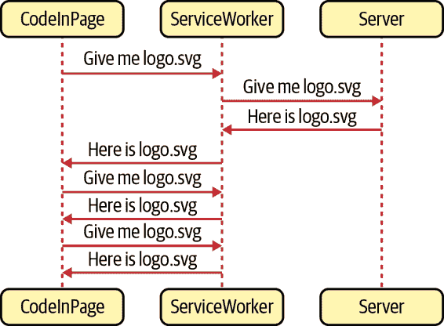
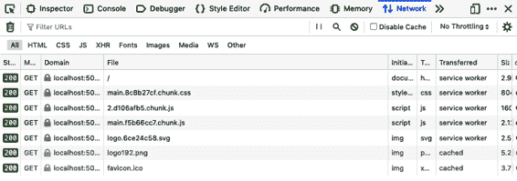

# 第十一章：渐进式 Web 应用程序

渐进式 Web 应用程序（PWAs）是尝试像本地安装的应用程序一样行为的 Web 应用程序。它们可以在离线状态下工作，集成本机通知系统，并具有运行长时间后台进程的能力，即使您离开网站后仍可继续。它们之所以被称为“渐进式”，是因为如果当前浏览器中某些功能不可用，它们会平滑降级其功能。

本章几乎完全集中在 PWAs 的一个特性上：service workers。偶尔会遇到“渐进式 Web 应用程序”这个术语，用来描述任何 JavaScript 丰富的浏览器应用程序。事实上，除非该应用程序使用 service workers，否则它不算是 PWA。

Service workers 实际上是应用程序的本地安装服务器。后端服务器是软件分发机制和实时数据服务的提供者，但是实际控制权在于 service worker，因为它提供对网络的访问。它可以选择从自己的本地缓存满足网络请求。如果网络不可用，它可以选择用本地占位符替换网络资源。它甚至可以在离线状态下排队数据更新，并在网络连接恢复时与后端服务器同步。

由于它是写作过程中最令人愉悦的一章，因此这是一个很好的最终章主题。Service workers 是现代浏览器中最迷人的功能之一。希望您会喜欢。

# 使用 Workbox 创建 Service Workers

## 问题

PWAs 即使在离线状态下也能工作。它们可以缓存所需的任何内容或代码，并且缓存会在用户刷新页面后保留。它们可以独立于在浏览器中运行的代码运行后台操作。

PWAs 之所以能够做到这一点，是因为 service workers。Service workers 是一种 Web worker。Web worker 是在与 Web 页面运行的 JavaScript 分离的单独线程中运行的 JavaScript 片段。Service workers 是特殊的 Web worker，可以拦截 Web 页面与服务器之间的网络流量，从而对注册它们的页面具有极大的控制权。您可以将 service worker 理解为一种本地代理服务，即使在断开网络连接时也可用。

Service workers 最常用于本地缓存内容。浏览器会缓存大部分它们看到的内容，但是 service worker 可以更加积极地进行缓存。例如，在浏览器中进行强制刷新通常会强制从网络重新加载资产。但是无论用户使用多少次强制刷新功能，它都不会影响 service workers。

您可以在 图 11-1 中看到一个 service worker 在运行中的情况。



###### 图 11-1。一个 service worker 将拦截所有网络请求

在这种情况下，服务工作线程将在第一次下载文件时进行缓存。如果页面多次请求 *logo.svg* 文件，服务工作线程将从其私有缓存中返回它，而不是从网络中获取。

服务工作线程如何缓存数据以及它如何决定是否从其缓存或网络返回数据称为 *策略*。在本章中，我们将查看各种标准策略。

服务工作线程以单独的 JavaScript 文件形式存储在服务器上，并且浏览器将从 URL 下载并安装它们。没有什么可以阻止您手工制作一个服务工作线程并将其存储在应用程序的公共文件夹中，但是手工编写服务工作线程存在几个问题。

首先，服务工作线程非常难以创建。它们不仅可以包含复杂的代码，还有复杂的生命周期。编写一个加载失败或者缓存错误文件的服务工作线程非常容易。更糟糕的是，有可能编写一个会使您的应用程序与网络隔离的服务工作线程。

其次，您可以使用服务工作线程来预缓存应用程序代码。对于 React 应用程序来说，这是一个非常棒的功能。服务工作线程可以从本地缓存中一瞬间返回几百千字节的 JavaScript，而不是从网络下载，这意味着您的应用程序可以几乎立即启动，即使在网络连接不佳的低功耗设备上也是如此。

但是代码缓存也有其自身的问题。假设我们有一个包含以下生成的 JavaScript 文件的 React 应用程序：

```
$ ls build/static/js/
2.d106afb5.chunk.js             2.d106afb5.chunk.js.map
3.9e79b289.chunk.js.map         main.095e14c4.chunk.js.map
runtime-main.b175c5d9.js.map    2.d106afb5.chunk.js.LICENSE.txt
3.9e79b289.chunk.js             main.095e14c4.chunk.js
runtime-main.b175c5d9.js
$
```

如果我们想要预缓存这些文件，服务工作线程将需要知道这些文件的名称。这是因为它将在后台下载这些文件，甚至在浏览器请求它们之前。因此，如果您手动创建服务工作线程，您将需要包括每个文件的名称以进行预缓存。

但是，如果您对源代码进行小改动然后重新构建应用程序会发生什么？

```
$ yarn run build
$ ls build/static/js/
2.d106afb5.chunk.js             2.d106afb5.chunk.js.map
3.9e79b289.chunk.js.map         main.f5b66cc7.chunk.js.map
runtime-main.b175c5d9.js.map    2.d106afb5.chunk.js.LICENSE.txt
3.9e79b289.chunk.js             main.f5b66cc7.chunk.js
runtime-main.b175c5d9.js
$
```

文件名 *会改变*，这意味着现在您必须使用最新生成的文件名更新服务工作线程脚本。

如何创建稳定的服务工作线程，始终与最新的应用程序代码同步？

## 解决方案

我们将使用来自 Google 的一组工具称为 [Workbox](https://oreil.ly/9dPXh)。Workbox 工具允许您生成与最新应用程序文件同步的服务工作线程。

Workbox 包含一组标准策略来处理常见服务工作线程用例的详细信息。如果您想要预缓存您的应用程序，可以通过一行代码将其集成到 Workbox 中。

要了解如何使用 Workbox，请考虑您可以在图 11-2 中看到的应用程序。


###### 图 11-2\. 我们的示例应用程序有两个页面

这是一个基于`create-react-app`生成的简单的双页面应用程序。我们将构建一个服务工作者，预缓存所有应用程序的代码和文件。

我们将从 Workbox 安装几个库：

```
$ yarn add workbox-core
$ yarn add workbox-precaching
$ yarn add workbox-routing
```

当构建服务工作者时，您将看到每个库的作用。

在我们的应用程序中，我们将创建一个名为*service-worker.js*的新文件作为服务工作者。我们可以将这个文件放在与应用程序其余代码相同的目录中：

```
import { clientsClaim } from 'workbox-core'
import { precacheAndRoute } from 'workbox-precaching'

clientsClaim()

precacheAndRoute(self.__WB_MANIFEST)
```

如果我们手动创建服务工作者，我们必须将其创建在用于存储其他静态内容的相同目录中。例如，在`create-react-app`应用程序中，我们必须将其创建在*public*目录中。

我们的服务工作者将预缓存所有应用程序代码。这意味着它将自动缓存作为应用程序一部分的任何 CSS、JavaScript、HTML 和图像。

服务工作者从*workbox-core*调用`clientsClaim`函数，这将使服务工作者成为其范围内所有客户端的控制器。*客户端*是一个网页，*范围*是与服务工作者相同路径的任何网页 URL。Workbox 将在*https://host/service-worker.js*生成我们的服务工作者，这意味着服务工作者将成为所有以*https://host/*开头的页面的控制器。

函数`precacheAndRoute`将处理预缓存过程的所有细节。它将创建和管理本地缓存，并拦截应用程序文件的网络请求，从本地缓存而不是网络加载它们。

只有通过 HTTPS 加载，服务工作者才能正常运行。大多数浏览器会为从*localhost*加载的站点做出例外。出于安全原因，浏览器不会在私密标签页中运行服务工作者。

当我们创建了服务工作者后，我们需要从主应用程序代码中注册它。注册是一个复杂的过程，但好消息是几乎总是相同的。一旦您为一个应用程序编写了注册代码，您可以无需更改地复制到另一个应用程序中。此外，如果您使用*cra-template-pwa*模板构建应用程序，它会为您生成注册代码。^(1)

了解注册过程的细节仍然很重要；这将帮助您理解部署应用程序后发生的任何看似奇怪的行为背后的生命周期。这将使您更容易理解注册过程。

在应用程序的主源目录中创建一个名为*registerWorker.js*的新文件：

```
const register = (pathToWorker, onInstall, onUpdate, onError) => {
  // We will write this code shortly
}

const registerWorker = () => {
  register(
    '/service-worker.js',
    (reg) => console.info('Service worker installed', reg),
    (reg) => console.info('Service worker updated', reg),
    (err) => console.error('Service worker failed', err)
  )
}

export default registerWorker
```

现在先将`register`函数保持为空。

我们将在应用程序中的*index.js*文件中调用`registerWorker`函数：

```
import React from 'react'
import ReactDOM from 'react-dom'
import './index.css'
import App from './App'
import registerWorker from './registerWorker'

ReactDOM.render(
  <React.StrictMode>
    <App />
  </React.StrictMode>,
  document.getElementById('root')
)

registerWorker()
```

函数`registerWorker`将使用生成的服务工作者的路径调用`register`函数：*service-worker.js*。

现在我们可以开始编写`register`函数：

```
const register = (pathToWorker, onInstall, onUpdate, onError) => {
  if (
    process.env.NODE_ENV === 'production' &&
    'serviceWorker' in navigator
  ) {
    const publicUrl = new URL(
      process.env.PUBLIC_URL,
      window.location.href
    )
    if (publicUrl.origin !== window.location.origin) {
      return
    }

    // Do the loading and registering here
  }
}
```

我们将检查我们是否处于*生产*模式，并且浏览器是否支持运行服务工作线程。*渐进*网页应用程序中的*渐进*意味着我们应该始终检查功能是否可用才使用。几乎所有浏览器（除了著名的 Internet Explorer）都支持服务工作线程，但是如果浏览器不支持，我们可以完全跳过服务工作线程。这意味着应用程序将失去离线工作的能力，但除此之外，应用程序应该仍然可以运行。

我们还添加了额外的检查以确保我们运行在应用程序指定的`PUBLIC URL`上，这将避免在从内容分发网络加载代码时出现的跨域问题。^(2)

现在我们可以下载并注册服务工作线程：

```
const register = (pathToWorker, onInstall, onUpdate, onError) => {
  if (
    process.env.NODE_ENV === 'production' &&
    'serviceWorker' in navigator
  ) {
    const publicUrl = new URL(
      process.env.PUBLIC_URL,
      window.location.href
    )
    if (publicUrl.origin !== window.location.origin) {
      return
    }

    window.addEventListener('load', async () => {
      try {
        const registration = await navigator.serviceWorker.register(
          process.env.PUBLIC_URL + pathToWorker
        )

        // Code to check progress goes here
      } catch (err) {
        if (onError) {
          onError(err)
        }
      }
    })
  }
}
```

一旦我们知道网页已加载，我们可以使用`navigator.serviceWorker.register`函数注册服务工作线程，并传递服务工作线程的完整 URL：*[*https://host/service-worker.js*](https://host/service-worker.js)*。

它返回一个*注册*对象，可用于跟踪和管理服务工作线程。例如，您可以使用注册对象查找服务工作线程何时更新或安装：

```
const register = (pathToWorker, onInstall, onUpdate, onError) => {
  if (
    process.env.NODE_ENV === 'production' &&
    'serviceWorker' in navigator
  ) {
    const publicUrl = new URL(
      process.env.PUBLIC_URL,
      window.location.href
    )
    if (publicUrl.origin !== window.location.origin) {
      return
    }

    window.addEventListener('load', async () => {
      try {
        const registration = await navigator.serviceWorker.register(
          process.env.PUBLIC_URL + pathToWorker
        )

        registration.onupdatefound = () => {
          const worker = registration.installing
          if (worker) {
            worker.onstatechange = () => {
              if (worker.state === 'installed') {
                if (navigator.serviceWorker.controller) {
                  if (onUpdate) {
                    onUpdate(registration)
                  }
                } else {
                  if (onInstall) {
                    onInstall(registration)
                  }
                }
              }
            }
          }
        }
      } catch (err) {
        if (onError) {
          onError(err)
        }
      }
    })
  }
}
```

`onupdatefound` 处理程序在浏览器开始安装服务工作线程时运行。一旦浏览器安装了服务工作线程，我们可以检查 `navigator.serviceWorker.controller` 来查看之前的服务工作线程是否仍在运行。如果没有，则知道这是一个全新的安装，而不是更新。

有关服务工作线程最令人困惑的事情之一是它们的更新方式。如果旧的服务工作线程已经控制了一个页面，浏览器将将新的服务工作线程置于*等待*状态，这意味着它将*绝对什么也不做*，直到旧的服务工作线程停止。服务工作线程停止的时机是当用户关闭所有它控制的页面时。因此，如果更新了您的服务工作线程，您将不会运行新的代码，直到您再次打开页面，然后关闭并再次打开页面。

这个过程对于手动测试新服务工作线程功能的任何人来说可能会有些混乱。

在构建应用程序之前，我们需要配置构建工具以将我们的*service-worker.js*源文件转换为紧凑编写的服务工作线程脚本。

如果您使用 Webpack 构建应用程序，您应该安装 Workbox Webpack 插件：

```
$ yarn install -D workbox-webpack-plugin
```

如果您使用`create-react-app`创建应用程序，无需安装 Workbox Webpack 插件或配置其使用，因为它已经包含并配置了插件。

然后，您可以将以下内容添加到您的*webpack.config.js*配置中：

```
const { InjectManifest } = require('workbox-webpack-plugin')

module.exports = {
  ....
  plugins: [
    ....
    new InjectManifest({
      swSrc: './src/service-worker.js',
    }),
  ],
}
```

此配置将告诉 Webpack 从 *src/service-worker.js* 文件生成服务工作线程。它还将在构建的应用程序中生成一个名为 *asset-manifest.json* 的文件，该文件将列出所有应用程序文件。服务工作线程在预缓存应用程序时将使用 *asset-manifest.json* 中的信息。

现在构建应用程序：

```
$ yarn run build
```

在您的 *build* 目录中，您将看到一个生成的 *service-worker.js* 文件和 *asset-manifest.json* 文件：

```
asset-manifest.json  logo192.png        service-worker.js.map
favicon.ico          manifest.json      static
index.html           robots.txt
logo512.png          service-worker.js
```

*asset-manifest.json* 文件将包含类似以下内容：

```
{
  "files": {
    "main.css": "/static/css/main.8c8b27cf.chunk.css",
    "main.js": "/static/js/main.f5b66cc7.chunk.js",
    "main.js.map": "/static/js/main.f5b66cc7.chunk.js.map",
    "runtime-main.js": "/static/js/runtime-main.b175c5d9.js",
    "runtime-main.js.map": "/static/js/runtime-main.b175c5d9.js.map",
    "static/js/2.d106afb5.chunk.js": "/static/js/2.d106afb5.chunk.js",
    "static/js/2.d106afb5.chunk.js.map": "/static/js/2.d106afb5.chunk.js.map",
    "static/js/3.9e79b289.chunk.js": "/static/js/3.9e79b289.chunk.js",
    "static/js/3.9e79b289.chunk.js.map": "/static/js/3.9e79b289.chunk.js.map",
    "index.html": "/index.html",
    "service-worker.js": "/service-worker.js",
    "service-worker.js.map": "/service-worker.js.map",
    "static/css/main.8c8b27cf.chunk.css.map":
        "/static/css/main.8c8b27cf.chunk.css.map",
    "static/js/2.d106afb5.chunk.js.LICENSE.txt":
        "/static/js/2.d106afb5.chunk.js.LICENSE.txt",
    "static/media/logo.6ce24c58.svg": "/static/media/logo.6ce24c58.svg"
  },
  "entrypoints": [
    "static/js/runtime-main.b175c5d9.js",
    "static/js/2.d106afb5.chunk.js",
    "static/css/main.8c8b27cf.chunk.css",
    "static/js/main.f5b66cc7.chunk.js"
  ]
}
```

现在可以运行应用程序了。您不能只使用以下命令启动开发服务器：

```
$ yarn run start
```

这只会以开发模式运行应用程序，并且服务工作线程不会启动。您需要在 *build* 目录上运行服务器。最简单的方法是全局安装 *serve* 包，然后针对 *build* 目录运行它：

```
$ npm install -s serve
$ serve -s build/
 ┌──────────────────────────────────────────────────┐
 │                                                  │
 │   Serving!                                       │
 │                                                  │
 │   - Local:            http://localhost:5000      │
 │   - On Your Network:  http://192.168.1.14:5000   │
 │                                                  │
 │   Copied local address to clipboard!             │
 │                                                  │
 └──────────────────────────────────────────────────┘
```

`-s` 选项用于运行单页面应用程序。如果服务器找不到匹配的文件，它将返回 *build/index.html* 文件。

现在您可以在 *http://localhost:5000* 打开浏览器。应用程序将显示出来，如果您打开开发者工具并切换到应用程序选项卡，在服务工作线程下，您应该可以看到 *service-worker.js* 脚本正在运行（见 图 11-3）。


###### 图 11-3\. 应用程序中安装并运行的服务工作线程

服务工作线程将所有应用程序文件下载到本地缓存中，因此下次加载页面时，文件将来自本地缓存而不是服务器。如果您切换到开发者工具中的 *网络* 选项卡然后重新加载页面，您可以看到这一过程（见 图 11-4）。服务工作线程将提供每个网络响应，除了那些超出其范围的响应。属于站点级而不是页面级别的文件，如 *favicon* 图标，仍将以通常的方式下载。



###### 图 11-4\. 刷新后，文件将使用服务工作线程下载

服务工作线程从本地缓存返回文件。如果您使用 Chrome，您可以在应用程序选项卡中看到缓存。对于 Firefox，您将在存储选项卡中找到它（见 图 11-5）。


###### 图 11-5\. 缓存将文件存储在本地

缓存不包含 *所有* 应用程序文件的副本，只包含应用程序请求的文件。这样，它将避免下载不需要的文件，并且仅在浏览器或应用程序代码请求它们后将文件下载到缓存中。

因此，第一次加载应用程序时，缓存可能是空的。这取决于服务工作线程何时变为活动状态。如果页面在服务工作线程变为活动状态之前加载，服务工作线程不会拦截网络请求并缓存响应。因此，在看到缓存出现之前，您可能需要刷新页面。

要证明文件确实来自服务工作线程，您可以停止服务器并刷新网页。即使服务器不再存在，页面也应该正常加载（见 图 11-6）。


###### 图 11-6\. 即使没有运行服务器，您也可以刷新页面。

现在，您应该将 React 应用程序视为本地应用程序，而不是网络应用程序。它是通过服务工作线程提供的，而不是通过后端服务器。甚至可以让您导航到第二页（见 图 11-7）。


###### 图 11-7\. 即使服务器离线，您仍然可以在页面之间导航。

使用代码分割可能会干扰某些离线功能。例如，如果用于显示示例应用程序中第二页的代码存储在一个未初始化加载的单独 JavaScript 文件中，浏览器将不会从本地缓存返回它。只有当浏览器在在线状态下访问该页面时，它才会可用。

当我们查看第二页时，我们可以检查服务工作线程的当前问题。确保服务器 *未* 运行，并导航到第二页。它应该正常加载。然后重新加载页面。而不是看到第二页，您将从浏览器得到一个错误页面（见 图 11-8）。


###### 图 11-8\. 当服务器离线时，第二页不会重新加载。

我们可以在离线状态下重新加载应用程序的首页，那为什么不能对第二页做到呢？因为这是一个单页面应用程序（SPA）。当我们导航到第二页时，浏览器不会从服务器加载一个新的网页；相反，它使用历史 API 更新地址栏中的 URL，然后修改 DOM 来显示第二页。

但是，当您重新加载页面时，浏览器将向服务器发出新的请求以获取 *http://localhost:5000/page2*。当服务器运行时，它将为所有页面请求返回 *index.html* 的内容，而 React 路由器将渲染组件，看起来像第二页。

当服务器不再在线时，这个过程就会失败。服务工作线程将无法使用缓存数据响应 *http://localhost:5000/page2* 的请求。对于 *page2*，缓存中没有任何内容。因此，它会将请求转发到不再运行的服务器，这就是为什么会出现错误页面的原因。

我们可以通过向 *service-worker.js* 添加更多代码来解决这个问题：^(3)

```
import { clientsClaim } from 'workbox-core'
import {
  createHandlerBoundToURL,
  precacheAndRoute,
} from 'workbox-precaching'
import { registerRoute } from 'workbox-routing'

clientsClaim()

precacheAndRoute(self.__WB_MANIFEST)

const fileExtensionRegexp = new RegExp('/[^/?]+\.[^/]+$')
registerRoute(({ request, url }) => {
  if (request.mode !== 'navigate') {
    return false
  }
  if (url.pathname.startsWith('/_')) {
    return false
  }
  if (url.pathname.match(fileExtensionRegexp)) {
    return false
  }
  return true
}, createHandlerBoundToURL(process.env.PUBLIC_URL + '/index.html'))
```

我们现在正在使用`workbox-routing`注册显式*路由*。路由决定服务工作线程如何处理一组路径的请求。我们使用前面示例代码中的过滤器函数和处理程序注册了一个新路由。过滤器函数是`registerRoute`调用中传递的第一个值。如果该路由处理给定请求，则返回 true。在前面的代码中，过滤器函数将处理任何导航到新网页的请求。因此，如果您在*http://localhost:5000/*或*http://localhost:5000/page2*打开浏览器，此路由将返回相同的缓存*index.html*副本。

函数`createHandlerBoundToURL`将创建一个处理程序，将这些请求视为对*http://localhost:5000/index.html*的请求，这意味着如果我们在第 2 页重新加载应用程序，服务工作线程应该以与在首页上加载 HTML 相同的方式加载它。

让我们试试这个。在保存更改到*service-worker.js*之后，重新构建应用程序：

```
$ yarn run build
```

现在确保本地服务器正在运行：

```
$ serve -s build/
```

打开浏览器访问*http://localhost:5000*，您应该看到应用程序。如果检查开发者工具，您会发现它已加载了新版本的服务工作线程，但旧版本的服务工作线程仍在运行（见图 11-9）。


###### 图 11-9\. 工具中显示了新旧服务工作线程。

先前版本的服务工作线程仍然控制应用程序。浏览器已安装了新的服务工作线程，但处于*等待*状态。直到旧的服务工作线程消失，它才会接管，如果您关闭标签页然后重新打开它（见图 11-10）。


###### 图 11-10\. 重新打开应用程序以激活新工作线程。

如果您现在停止本地服务器并导航到第 2 页，应该能够重新加载而无任何问题（见图 11-11）。


###### 图 11-11\. 一旦注册了路由处理程序，您可以重新加载第 2 页。

## 讨论

在这个配方中，我们深入探讨了如何创建、注册和使用服务工作线程。在接下来的配方中，您将看到，在首次构建应用程序时，可以自动生成大部分这些代码。但是，深入了解服务工作线程的混乱细节仍然是值得的。这有助于理解工作线程的生命周期：浏览器如何安装服务工作线程以及它如何变为活动状态。

我们发现服务工作线程可能会让手动测试代码的人感到困惑。如果浏览器仍在运行旧版本的服务工作线程，则可能仍在运行旧版本的应用程序。这种混淆可能导致测试报告失败，因为旧 bug 可能仍然存在。一旦理解了新服务工作线程如何加载以及旧服务工作线程如何消失，您就可以快速诊断问题。

自动化浏览器测试不会受过时的服务工作线程影响，测试开始时通常处于*干净*状态，没有缓存或正在运行的服务工作线程。

带有服务工作线程的渐进式网络应用程序是本地应用程序和远程应用程序的混合体。服务器成为安装在本地的应用程序的分发服务器。当应用程序更新时，它将在浏览器中安装一个新版本，但通常要等到浏览器重新打开才能使用新应用程序。

现在我们已经详细介绍了服务工作线程，可以看看如何将它们快速添加到新应用程序中。

您可以从[GitHub 网站](https://oreil.ly/su224)下载此示例的源代码。

# 使用 Create React App 构建 PWA

## 问题

在您的应用程序中运行服务工作线程之前，您需要两件事情。首先，您需要一个服务工作线程，“使用 Workbox 创建服务工作线程”介绍了 Workbox 库如何帮助简化服务工作线程的创建和管理。其次，您需要一段代码，在您的应用程序中注册服务工作线程。虽然创建复杂，但您可以通过少量更改将注册代码复制到新应用程序中。

然而，随着服务工作线程使用模式的发展，避免创建自己的注册代码将是有帮助的。我们可以如何做到这一点？

## 解决方案

我们将看看如何在 `create-react-app` 中使用模板来构建一个包含服务工作线程的应用程序。

即使您不打算使用 `create-react-app`，使用它生成应用程序然后在项目中重用服务工作线程代码可能是值得的。

我们在第一章简要介绍了如何在生成 TypeScript 项目时使用应用程序模板，该模板是`create-react-app`在生成新应用程序时使用的样板代码。

如果我们想创建一个渐进式网络应用程序，我们可以通过输入以下内容来实现：

```
$ npx create-react-app appname --template cra-template-pwa
```

如果您想创建一个 TypeScript 应用程序，请使用 `cra-template-pwa-typescript` 替换 `cra-template-pwa`。

如果我们这样做，它将在名为*appname*的新文件夹中生成一个 React 应用程序。该应用程序看起来几乎与任何其他 CRA 应用程序相同，但它将安装几个 Workbox 库。它将添加两个额外的源文件。在*src*目录中，您将找到一个名为*service-worker.js*的示例脚本：

```
import { clientsClaim } from 'workbox-core'
import { ExpirationPlugin } from 'workbox-expiration'
import {
  precacheAndRoute,
  createHandlerBoundToURL,
} from 'workbox-precaching'
import { registerRoute } from 'workbox-routing'
import { StaleWhileRevalidate } from 'workbox-strategies'

clientsClaim()

precacheAndRoute(self.__WB_MANIFEST)

const fileExtensionRegexp = new RegExp('/[^/?]+\.[^/]+$')
registerRoute(({ request, url }) => {
  if (request.mode !== 'navigate') {
    return false
  }

  if (url.pathname.startsWith('/_')) {
    return false
  }

  if (url.pathname.match(fileExtensionRegexp)) {
    return false
  }

  return true
}, createHandlerBoundToURL(process.env.PUBLIC_URL + '/index.html'))

registerRoute(
  ({ url }) =>
    url.origin === self.location.origin &&
    url.pathname.endsWith('.png'),
  new StaleWhileRevalidate({
    cacheName: 'images',
    plugins: [new ExpirationPlugin({ maxEntries: 50 })],
  })
)

self.addEventListener('message', (event) => {
  if (event.data && event.data.type === 'SKIP_WAITING') {
    self.skipWaiting()
  }
})
```

服务工作者类似于我们在“使用 Workbox 创建服务工作者”中创建的服务工作者。

您还会在 *src* 目录中找到一个名为 *serviceWorkerRegistration.js* 的新文件。这个文件非常长，所以我们不会在这里包含其内容。但它与我们在“使用 Workbox 创建服务工作者”中编写的 *registerWorker.js* 脚本具有相同的目的。它将服务工作者注册为应用程序的控制器。即使您不打算在应用程序中使用 `create-react-app`，*serviceWorkerRegistration.js* 文件也非常有价值。它有几个前一篇配方中的注册代码没有的附加功能。例如，假设您正在运行在 *localhost* 上。如果它们看起来属于不同应用程序，它将注销任何服务工作者，这在您同时在几个 React 应用程序上工作时非常有用。

尽管服务工作者和注册代码在您的新应用程序中为您创建了，但它们实际上并没有配置好。在 *index.js* 文件中，您会发现该应用程序实际上会注销任何服务工作者：

```
import React from 'react'
import ReactDOM from 'react-dom'
import './index.css'
import App from './App'
import * as serviceWorkerRegistration from './serviceWorkerRegistration'
import reportWebVitals from './reportWebVitals'

ReactDOM.render(
  <React.StrictMode>
    <App />
  </React.StrictMode>,
  document.getElementById('root')
)

serviceWorkerRegistration.unregister()

reportWebVitals()
```

如果您想要启用 *service-worker.js* 脚本，您需要将 `serviceWor⁠kerRegistration.unregister` 更改为 `serviceWorkerRegistration.register`。

`register` 函数允许您将回调传递到注册过程中，以便您可以跟踪服务工作者安装的当前状态。为此，请传递一个带有 `onInstall` 和 `onUpdate` 函数的对象：

```
serviceWorkerRegistration.register({
  onInstall: (registration) => {
    console.log('Service worker installed')
  },
  onUpdate: (registration) => {
    console.log('Service worker updated')
  },
})
```

如果您想要延迟某些处理直到浏览器安装了服务工作者，或者如果您想在新的服务工作者更新到先前版本时运行代码，则回调非常有用。如果调用 `onUpdate`，则您将知道您的新服务工作者正在等待旧服务工作者消失。

## 讨论

“使用 Workbox 创建服务工作者” 帮助您了解服务工作者的操作方式。当您最终构建一个真实的应用程序时，模板代码将更加精致和功能丰富。

您可以从 [GitHub 站点](https://oreil.ly/hHAC9)下载此配方的源代码。

# 缓存第三方资源

## 问题

现代应用程序中使用的许多资源来自第三方服务器：支付库、字体、图片等等。第三方资源可能会消耗大量带宽，并且随着时间的推移可能会增长。如果它们来自慢速服务器，那么它们可能会以您无法控制的方式减慢您的应用程序速度。^(4)

是否可以使用服务工作者缓存第三方资源？

## 解决方案

由于服务工作者只允许控制相同 URL 路径内的页面，所以它们的范围有限。这就是为什么服务工作者通常位于应用程序的根目录的原因；它允许它们控制每一页。

但对于它们允许访问的 URL 并无限制。它们可以与页面或代码可以访问的任何端点通信。这意味着你可以开始缓存来自第三方服务器的资源。

您在 图 11-12 中看到的应用程序使用了从 Google Fonts 下载的字体。


###### 图 11-12\. 使用谷歌字体的应用程序——非常漂亮！

在页面头部添加了以下两行代码来添加字体：

```
<link rel="preconnect" href="https://fonts.gstatic.com">
<link href="https://fonts.googleapis.com/css2?family=Fascinate&display=swap"
      rel="stylesheet">
```

第一个 `link` 导入了网络字体，第二个导入了相关样式表。

要在应用程序中缓存这些内容，我们首先需要注册一个服务工作者。示例应用程序是使用 *cra-template-pwa* 模板创建的，因此我们需要在 *index.js* 文件中调用 `register` 函数：

```
import React from 'react'
import ReactDOM from 'react-dom'
import './index.css'
import App from './App'
import * as serviceWorkerRegistration from './serviceWorkerRegistration'
import reportWebVitals from './reportWebVitals'

ReactDOM.render(
  <React.StrictMode>
    <App />
  </React.StrictMode>,
  document.getElementById('root')
)

serviceWorkerRegistration.register()

reportWebVitals()
```

现在我们将在 *service-worker.js* 脚本中添加一些路由，该脚本包含应用程序的服务工作者。服务工作者使用 Workbox 库。

我们需要缓存样式表和可下载字体。

我们在 “使用 Workbox 创建服务工作者” 中看到，我们可以预缓存应用程序代码，这是一个非常常见的需求，Workbox 让你只需一行代码即可完成：

```
precacheAndRoute(self.__WB_MANIFEST)
```

这个命令将创建一个路由，本地缓存任何应用程序代码。如果要缓存第三方资源，我们需要做更多工作。让我们创建一个路由来缓存样式表：

```
registerRoute(
  ({ url }) => url.origin === 'https://fonts.googleapis.com'
  // TODO Add handler
)
```

当我们调用 `registerRoute` 时，我们需要传递一个过滤函数和一个处理程序。过滤函数接收一个请求对象，并返回 true 如果处理程序应该处理该请求。处理程序是一个函数，决定如何满足请求。它可能查找本地缓存，将请求传递给网络，或者两者结合。

处理程序是相当复杂的构建函数，但通常遵循某些标准的 *策略*，比如在从网络下载文件之前检查缓存。Workbox 有一些函数提供了几种策略的实现。

当我们下载样式表时，我们将使用 [`stale-while-revalidate` 策略](https://oreil.ly/Ct1K3)，这意味着当浏览器想要下载 Google 样式表时，我们会发送一个样式表请求，并检查本地缓存是否已经有样式表文件的副本。如果没有，我们将等待样式表网络请求返回。如果你频繁请求资源但不关心是否有最新版本，这种策略非常有用。我们更喜欢使用缓存版本的样式表，因为速度更快。但我们也会始终从网络请求新版本的样式表。我们将缓存从 Google 返回的任何内容，因此即使这次没有获取到样式表的最新版本，下次加载时我们也会得到。

这是我们为 `stale-while-revalidate` 策略创建处理程序的方法：

```
registerRoute(
  ({ url }) => url.origin === 'https://fonts.googleapis.com',
  new StaleWhileRevalidate({
    cacheName: 'stylesheets',
  })
)
```

`StaleWhileRevalidate`函数将返回一个处理程序函数，该处理程序将在名为`stylesheets`的缓存中缓存样式表。

当加载第三方请求时，您可能会发现您的请求可能因为跨域资源共享（CORS）错误而失败。即使第三方资源带有有效的 CORS 头，由于`GET`请求来自 JavaScript 代码而不是页面的 HTML，也可能发生此错误。您可以通过在使用资源的 HTML 元素上将`crossorigin`设置为`anonymous`来解决此问题，例如正在下载样式表的`link`引用。

当下载 Google 字体时，我们可以应用相同的策略。但是字体文件可能很大，`stale-while-revalidate`策略将始终下载资源的最新版本，即使仅仅是为了更新本地缓存。

相反，我们将使用[*缓存优先策略*](https://oreil.ly/c8aa5)。在缓存优先策略中，我们首先检查资源的缓存，如果存在，则使用缓存。如果在本地找不到资源，我们将发送网络请求。这是处理大资源的有益策略。它确实有一个缺点：只有当缓存中不存在资源时，你才能下载资源的新版本。这意味着你可能永远无法下载任何更新版本。

因此，通常我们会配置缓存优先策略，只缓存一段时间内的资源。如果处理程序在本地缓存中找到资源但它太旧，它将从网络请求资源，然后缓存更新版本。

无论我们缓存什么，我们都将使用直到缓存超时。因此，如果第三方服务器出现临时问题并且我们收到`500`状态，^(5)我们不希望缓存响应。因此，在决定是否缓存响应之前，我们还需要检查状态。

以下代码显示了我们如何注册路由以缓存 Google 字体：

```
registerRoute(
  ({ url }) => url.origin === 'https://fonts.gstatic.com',
  new CacheFirst({
    cacheName: 'fonts',
    plugins: [
      new CacheableResponsePlugin({
        statuses: [0, 200],
      }),
      new ExpirationPlugin({
        maxAgeSeconds: 60 * 60 * 24 * 7,
        maxEntries: 5,
      }),
    ],
  })
)
```

此代码将在名为`fonts`的本地缓存中缓存最多五个字体文件。缓存副本将在一周后超时，我们只会在状态为`200`或`0`时缓存响应。状态`0`表示请求存在跨域问题，在这种情况下，我们会缓存响应。CORS 错误不会因为代码更改而消失，如果我们缓存错误，我们将避免发送注定失败的未来请求。

## 讨论

第三方资源缓存可以显著改善应用程序的性能，但更重要的是，在应用程序离线时，它将使资源可用。如果应用程序无法读取诸如字体文件之类的外观文件并不太重要，但是，如果您使用第三方代码生成付款表单，即使用户设备暂时断开网络，保持操作也会很有帮助。

您可以从[GitHub 网站](https://oreil.ly/QaFYG)下载此配方的源代码。

# 自动重新加载工作线程

## 问题

服务工作线程更新的方式可能会让使用或测试应用程序的任何人感到困惑。如果我们对服务工作线程进行更改，应用程序将下载新版本并将其状态设置为已安装（参见 图 11-13）。


###### 图 11-13\. 更新后的工作线程已安装，但旧版本仍在运行

只有当用户关闭标签页然后重新打开时，旧的服务工作线程才会消失。旧的工作线程消失，新的工作线程可以停止等待并开始运行（参见 图 11-14）。


###### 图 11-14\. 只有在关闭并重新打开应用程序时，新的工作线程才会开始运行

如果服务工作线程正在缓存应用程序的代码，那么如果服务工作线程没有启动，它将不会从服务器下载最新的代码。您可能会发现您正在使用整个客户端应用程序的旧版本。为了运行新的应用程序，您需要重新加载页面（以安装新的工作线程），然后关闭并重新打开标签页（删除旧的工作线程并启动新的工作线程）。

测试人员很快会习惯这种稍微奇怪的顺序，但对真正的用户来说却不是这样。事实上，新代码只有在下次但一个时间可用时才会更新，通常不是一个大问题。如果您对代码进行了重大更改，例如更新 API，*可能* 会有问题。^(6)

在某些情况下，您希望立即使用新代码。有没有一种方法可以清除旧的服务工作线程并升级到应用程序的新版本？

## 解决方案

有两件事情我们需要做来切换到一个新的服务工作线程：

如果您使用 `create-react-app` 创建应用程序，或者使用 *cra-template-pwa* 模板的代码，^(7) 那么您将会注册您的服务工作线程，使用 `serviceWorkerRegistration.register` 函数。例如，您可能在应用程序的 *index.js* 文件中有以下代码：

```
import React from 'react'
import ReactDOM from 'react-dom'
import './index.css'
import App from './App'
import * as serviceWorkerRegistration from './serviceWorkerRegistration'
import reportWebVitals from './reportWebVitals'

ReactDOM.render(
  <React.StrictMode>
    <App />
  </React.StrictMode>,
  document.getElementById('root')
)

serviceWorkerRegistration.register()

reportWebVitals()
```

即使您已经编写了自己的注册代码，您可能也有类似的内容。

`serviceWorkerRegistration.register` 函数允许您传递一对回调函数，这些函数将告知您服务工作线程何时已被安装或更新：

```
serviceWorkerRegistration.register({
  onInstall: (registration) => {},
  onUpdate: (registration) => {},
})
```

回调函数接收到一个 *registration* 对象：这是浏览器刚刚安装或更新的服务工作线程的包装器。

当服务工作线程下载后，会被安装。但是如果已经有一个现存的服务工作线程在运行，新的服务工作线程将等待旧的服务工作线程消失。如果服务工作线程在等待，`onUpdate` 函数将会被调用。

我们希望在每次调用 `onUpdate` 函数时自动删除旧的服务工作线程。这将允许新的服务工作线程开始运行。

服务工作线程是一种特殊形式的*网络工作者*。网络工作者是在与网页中运行的 JavaScript 分离的线程中运行的 JavaScript 片段。您可以通过向它们发送异步消息来与所有网络工作者进行通信。服务工作线程可以拦截网络请求，因为浏览器将网络请求转换为消息。

因此，我们可以通过向服务工作线程发送消息来要求其运行任意代码片段。我们可以通过给服务工作线程添加消息事件侦听器来使其响应消息：

```
self.addEventListener('message', (event) => {
  // handle messages here
})
```

`self` 变量包含服务工作线程的全局范围。这就像 `window` 对于页面代码一样。

页面代码可以向新服务工作线程发送消息，告诉它我们希望它停止等待并替换旧的服务工作线程：

```
serviceWorkerRegistration.register({
  onUpdate: (registration) => {
    registration.waiting.postMessage({ type: 'SKIP_WAITING' })
  },
})
```

`registration.waiting` 是对服务工作线程的引用，`registration.wait⁠ing.postMessage` 将向其发送消息。

当浏览器安装新版本的服务工作线程但旧的服务工作线程仍在运行时，应用程序代码将向新的服务工作线程发送 `SKIP_WAITING` 消息。

服务工作线程有一个名为 `skipWaiting` 的内置函数，它将终止旧的服务工作线程并允许新的服务工作线程接管。因此，当服务工作线程收到 `SKIP_WAITING` 消息时，我们可以在服务工作线程中调用 `skipWaiting`：

```
self.addEventListener('message', (event) => {
  if (event.data && event.data.type === 'SKIP_WAITING') {
    self.skipWaiting()
  }
})
```

如果应用程序现在已更新，新的服务工作线程将立即取代旧的服务工作线程。

只剩下一步：我们需要重新加载页面，以便通过新的服务工作线程下载新的应用程序代码。这意味着应用程序中的更新版本的 *index.js* 文件看起来像这样：

```
import React from 'react'
import ReactDOM from 'react-dom'
import './index.css'
import App from './App'
import * as serviceWorkerRegistration from './serviceWorkerRegistration'
import reportWebVitals from './reportWebVitals'

ReactDOM.render(
  <React.StrictMode>
    <App />
  </React.StrictMode>,
  document.getElementById('root')
)

serviceWorkerRegistration.register({
  onUpdate: (registration) => {
    registration.waiting.postMessage({ type: 'SKIP_WAITING' })
    window.location.reload()
  },
})

reportWebVitals()
```

一旦安装了这个新版本的代码，每次应用程序更改时应用程序将自动更新自身。与旧的服务工作线程并排等待新服务工作线程的耐心版本不同，您将只看到新加载的版本（见图 11-15）。


###### 图 11-15\. 新的服务工作线程现在将立即取代旧版本

## 讨论

通过添加页面重新加载，当新代码正在下载时，您会发现页面会“闪烁”。如果您的应用程序很大，这可能会让用户感到不适，因此您可能会选择在重新加载之前询问用户是否要升级到应用程序的新版本。Gmail 在有重大更新可用时会这样做。

您可以从[GitHub 网站](https://oreil.ly/Lbal7)下载此配方的源代码。

# 添加通知

## 问题

服务工作线程以及一般的网络工作者的一个优点是，它们不会因用户离开页面而停止运行。如果服务工作线程执行了一个耗时的操作，只要浏览器本身仍在运行，它将继续在后台运行。这意味着您可以离开页面或关闭选项卡，并确保您的工作者将有时间完成。

但是，如果用户想知道后台任务何时完成，怎么办？服务工作者没有任何可视化界面。它们可能控制网页，但不能更新它们。网页和服务工作者之间唯一的通信方式是发送消息。

鉴于服务工作者没有可视化界面，它们如何告诉我们发生了重要事件？

## 解决方案

我们将从服务工作者创建通知。我们的示例应用程序（参见图 11-16）将在您点击按钮时启动一个长时间运行的过程，大约需要 20 秒。


###### 图 11-16\. 当您点击按钮时，示例应用程序会启动一个较慢的进程。

用户将不得不授予发送完成通知的权限（参见图 11-17）。如果他们拒绝了权限，后台任务仍将运行，但完成时不会看到任何内容。


###### 图 11-17\. 您将需要授予接收通知的权限

通知的声誉很差。通常情况下，当网站想用信息轰炸您时，您会看到它们。一般来说，如果您使用通知，最好在用户明白为什么需要时再请求权限。避免在页面加载时就请求发送通知的权限，因为用户不会知道为什么要发送通知。

然后服务工作者将运行一些代码，暂停 20 秒钟，然后显示通知（参见图 11-18）。


###### 图 11-18\. 当任务完成时显示的通知

让我们开始看代码。在`App`组件中，我们将添加一个按钮来运行后台，但确保仅在浏览器支持服务工作者时可见：

```
function App() {
  const startTask = () => {
    // Start task here
  }
  return (
    <div className="App">
      <header className="App-header">
        
        <p>
          Edit <code>src/App.js</code> and save to reload.
        </p>
        {'serviceWorker' in navigator && (
          <button onClick={startTask}>Do slow thing</button>
        )}
      </header>
    </div>
  )
}
```

当用户点击按钮时，它们将调用`startTask`函数。我们可以在那里请求权限来显示通知：

```
const startTask = () => {
  Notification.requestPermission((permission) => {
    navigator.serviceWorker.ready.then(() => {
      const notifyMe = permission === 'granted'
      // Then run task
    })
  })
}
```

如果用户授予权限，则`permission`字符串将具有`granted`值，这将将`notifyMe`变量设置为`true`。我们可以在服务工作者中运行任务，并告诉它在完成时是否允许发送通知。

我们不能直接与服务工作者交流。相反，我们必须发布消息，因为服务工作者在与网页代码分离的单独线程中运行。

我们可以从`navigator.serviceWorker.controller`获取当前控制页面的服务工作者。因此，我们可以像这样向服务工作者发送消息：

```
const startTask = () => {
  Notification.requestPermission((permission) => {
    navigator.serviceWorker.ready.then(() => {
      const notifyMe = permission === 'granted'
      navigator.serviceWorker.controller.postMessage({
        type: 'DO_SLOW_THING',
        notifyMe,
      })
    })
  })
}
```

在示例应用程序中，我们的服务在*service-worker.js*中。它可以通过添加`message`事件处理程序来接收消息：

```
self.addEventListener('message', (event) => {
  ...
  if (event.data && event.data.type === 'DO_SLOW_THING') {
    // Code for slow task here
  }
})
```

在服务工作者中，`self`指的是全局作用域对象。它相当于网页代码中的`window`。让我们模拟一个慢任务，通过调用`setTimeout`等待 20 秒钟，然后向控制台发送消息：^(8)

```
self.addEventListener('message', (event) => {
  ...
  if (event.data && event.data.type === 'DO_SLOW_THING') {
    setTimeout(() => {
      console.log('Slow thing finished!')
      // TODO: Send notification here
    }, 20000)
  }
})
```

现在剩下的事情就是显示通知。我们可以使用服务工作线程的 *registration* 对象来实现，该对象具有一个 `showNotification` 方法：

```
self.addEventListener('message', (event) => {
  ...
  if (event.data && event.data.type === 'DO_SLOW_THING') {
    setTimeout(() => {
      console.log('Slow thing finished!')
      if (event.data.notifyMe) {
        self.registration.showNotification('Slow thing finished!', {
          body: 'Now get on with your life',
          icon: '/logo512.png',
          vibrate: [100, 100, 100, 200, 200, 200, 100, 100, 100],
          // tag: 'some-id-if-you-do-not-want-duplicates'
        })
      }
    }, 20000)
  }
})
```

注意，在尝试显示通知之前，我们会检查 `event.data.notifyMe`；这是我们在网页代码中添加的变量。

通知需要一个 `title` 和一个 `options` 对象。选项允许你修改通知的行为。在本例中，我们给它一些主体文本和一个图标，并设置了一个振动序列。如果用户的设备支持，他们应该在通知出现时感受到一组 *dot-dot-dot-dash-dash-dash-dot-dot-dot* 的振动。

在示例代码中，还有一个 `tag` 选项，我们已经将其注释掉了。我们可以使用 `tag` 来唯一标识一个通知，防止用户多次接收相同的通知。如果你省略它，每次调用 `showNotification` 都会产生一个新的通知。

要试验代码，你首先需要构建应用程序，因为服务工作线程只在生产模式下运行：

```
$ yarn run build
```

你接下来需要在生成的 *build* 目录上运行一个服务器。你可以通过安装 *serve* 模块来实现，并执行以下命令：

```
$ serve -s build
```

如果你在 *http://localhost:5000* 打开应用并点击按钮，慢速处理将开始。然后你可以转到另一页或关闭标签页，慢速任务将继续运行。只有当你关闭浏览器时，它才会停止。

20 秒后，你应该会看到一个类似于 图 11-19 的通知出现。


###### 图 11-19\. Mac 上显示的通知

很诱人从移动设备访问你的服务器以检查通知中的振动是否工作。请注意，服务工作线程仅在访问 *localhost* 或使用 HTTPS 时启用。如果你想通过 HTTPS 测试应用程序，请参见 “启用 HTTPS” 以在服务器上启用它。

考虑到通知可能在你关闭页面后出现，如果你给用户一个简单的方式回到你的应用程序将会很有帮助。你可以通过在服务工作线程中添加一个通知点击处理程序来实现这一点。如果服务工作线程创建了一个通知并且用户点击了它，浏览器将向服务工作线程发送一个 `notificationclick` 事件。你可以像这样创建一个处理程序：

```
self.addEventListener('notificationclick', (event) => {
  event.notification.close()
  // TODO Go back to the application
})
```

你可以通过调用 `event.notification.close` 来关闭通知。但是如何将用户发送回 React 应用程序呢？

服务工作线程是零个或多个浏览器标签页的控制器，这些标签页被称为其 *clients*。这些标签页的网络请求被服务工作线程拦截。你可以使用 `self.clients` 来获取客户端列表。这个对象有一个叫做 `openWindow` 的实用函数，可以用来在浏览器中打开一个新的标签页：

```
self.addEventListener('notificationclick', (event) => {
  event.notification.close()
  if (self.clients.openWindow) {
    self.clients.openWindow('/')
  }
})
```

如果用户现在点击通知，则浏览器将返回到 React 应用程序的首页。

但我们可以做得更好一点。如果用户已切换到不同的标签页但 React 应用程序仍然打开，我们可以将焦点切回到正确的标签页。

为此，我们需要获取服务工作线程控制的每个打开标签的数组。然后我们可以查看是否有任何匹配的正确路径。如果找到一个，我们可以将焦点切换到该标签：

```
self.addEventListener('notificationclick', (event) => {
  event.notification.close()

  event.waitUntil(
    self.clients
      .matchAll({
        type: 'window',
      })
      .then((clientList) => {
        const returnPath = '/'

        const tab = clientList.find((t) => {
          return t.url === self.location.origin + returnPath
        })
        if (tab && 'focus' in tab) {
          tab.focus()
        } else if (self.clients.openWindow) {
          self.clients.openWindow(returnPath)
        }
      })
  )
})
```

如果我们点击通知，我们将切换回一个打开的标签页，而不是总是创建新的标签页（见 图 11-20）。


###### 图 11-20\. 如果仍然打开，则通知可以切换回我们的应用程序

## 讨论

通知是让用户了解重要事件的好方法。关键在于澄清他们为什么应该同意接收通知，然后只有在发生重要事件时才发送通知。

您可以从 [GitHub 站点](https://oreil.ly/ZkcrR) 下载此示例的源代码。

# 利用后台同步进行离线更改

## 问题

想象有人在网络连接不可用的地方（例如，在地铁上）使用应用程序。应用程序代码的预缓存意味着可以无需网络连接打开应用程序。用户还可以在页面之间移动，一切都应该正常显示。

但是如果他们做了一些会向服务器发送数据的事情怎么办？如果他们试图发布消息怎么办？

## 解决方案

*后台同步* 是一种在服务器不可用时排队网络请求并在以后自动重新发送它们的方式。

我们的示例应用程序将在用户点击按钮时向后端服务器发送一些数据（参见 图 11-21）。


###### 图 11-21\. 当用户点击按钮时，示例应用程序会向服务器发送数据

要启动应用程序，您首先需要使用此命令构建它：

```
$ yarn run build
```

示例项目在 *server/index.js* 中包含此服务器：

```
const express = require('express')
const app = express()

app.use(express.json())
app.use(express.static('build'))

app.post('/endpoint', (request, response) => {
  console.log('Server received data', request.body)
  response.send('OK')
})

app.listen(8000, () => console.log('Launched on port 8000!'))
```

服务器将从 *build* 目录中提供内容，该目录中发布了生成的代码。它还显示从发送到 *http://localhost:8000/endpoint* 的任何 `POST` 请求接收到的数据。

您可以使用此命令启动服务器：

```
$ node server
```

如果现在在浏览器中打开应用程序，地址为 *http://localhost:8000*，并在首页点击按钮几次，你将看到数据出现在服务器窗口中：

```
$ node server
Launched on port 8000!
Server received data { timeIs: '2021-05-09T18:59:37.280Z' }
Server received data { timeIs: '2021-05-09T18:59:37.720Z' }
Server received data { timeIs: '2021-05-09T18:59:38.064Z' }
Server received data { timeIs: '2021-05-09T18:59:38.352Z' }
```

这是发送数据到服务器的应用程序代码。它使用 `fetch` 函数在按下按钮时 `POST` 当前时间：

```
import React from 'react'
import logo from './logo.svg'
import './App.css'

function App() {
  const sendData = () => {
    const options = {
      method: 'POST',
      body: JSON.stringify({ timeIs: new Date() }),
      headers: {
        'Content-Type': 'application/json',
      },
    }
    fetch('/endpoint', options)
  }
  return (
    <div className="App">
      <header className="App-header">
        
        <p>
          Edit <code>src/App.js</code> and save to reload.
        </p>
        <button onClick={sendData}>Send data to server</button>
      </header>
    </div>
  )
}

export default App
```

如果现在停止服务器，点击网页上的按钮将生成一系列失败的网络请求，如 图 11-22 所示。


###### 图 11-22\. 如果无法联系服务器，则网络请求将失败

停止服务器会模拟用户暂时失去网络联系后尝试从应用程序发送数据的情况。

我们可以通过使用 service worker 来解决这个问题。Service worker 可以拦截渐进式 web 应用程序中网页发出的网络请求。在本章的其他示例中，我们已经使用 service worker 通过返回本地缓存版本的文件来处理网络故障。现在我们需要处理数据的反向传输：从浏览器到服务器。

我们需要缓存我们尝试发送到服务器的 `POST` 请求，并在再次与服务器联系时重新发送它们。

为此，我们将使用 `workbox-background-sync` 库。*后台同步* 是一种 API，用于在我们无法联系服务器的情况下将网络请求重定向到队列中。这是一个复杂的 API，并非所有浏览器都支持。

`workbox-background-sync` 库使得 API 的使用变得更加简单，并且它还能够在像 Firefox 这样不原生支持后台同步的浏览器上运行。

示例应用程序的 service worker 在 *service-worker.js* 文件中。我们可以通过添加以下代码来添加后台同步功能：

```
import { NetworkOnly } from 'workbox-strategies'
import { BackgroundSyncPlugin } from 'workbox-background-sync'

// Other service worker code here....

registerRoute(
  //endpoint/,
  new NetworkOnly({
    plugins: [
      new BackgroundSyncPlugin('endPointQueue1', {
        maxRetentionTime: 24 * 60,
      }),
    ],
  }),
  'POST'
)
```

这段代码将在 service worker 中注册一个新的 *路由*，用于处理特定 URL 的网络请求。在这种情况下，我们正在创建一个路由来处理所有对 *http://localhost:8000/endpoint* 的请求。我们使用正则表达式来匹配路径。然后，我们使用 [Network Only](https://oreil.ly/rLqLq) 策略，这意味着浏览器会将所有请求发送到 service worker，并且所有响应都将来自网络。但我们配置该策略以使用后台同步插件。路由的第三个参数表示它只对 `POST` 请求到 endpoint 感兴趣。

当应用程序向 *http://localhost:8000/endpoint* 发送 `POST` 请求时，service worker 会拦截它。Service worker 将请求转发到服务器，如果成功，将返回响应给网页。如果服务器不可用，service worker 将向网页返回网络错误，然后将网络请求添加到名为 `endPointQueue1` 的重试队列中。

Workbox 在浏览器内的索引数据库中存储队列。将 `maxRe⁠tentionTime` 设置为 *24 * 60* 将请求存储在数据库中最多一天。

`workbox-background-sync` 库将在认为服务器可能已经可用时重新发送队列中的请求，例如，如果网络连接重新上线。重试也会每隔几分钟进行一次。

如果您重新启动服务器然后等待大约五分钟，您应该会看到失败的网络请求出现在服务器中：

```
$ node server
Launched on port 8000!
Server received data { timeIs: '2021-05-09T21:26:11.068Z' }
Server received data { timeIs: '2021-05-09T21:02:44.647Z' }
Server received data { timeIs: '2021-05-09T21:02:45.647Z' }
```

如果您打开开发者工具中的应用程序选项卡，选择服务工作者，然后向`workbox-background-sync:endPointQueue1`发送同步消息（如图 11-23 所示），则可以强制 Chrome 立即重新发送请求。


###### 图 11-23\. 在 Chrome 中强制进行同步

## 讨论

后台同步是一个非常强大的功能，但在启用之前需要仔细考虑。客户端代码发送请求的顺序不一定是服务器处理它们的顺序。

如果您创建简单的一组资源并使用`POST`请求，确切的顺序可能并不重要。例如，如果您从在线书店购买书籍，购买它们的顺序并不重要。

但是，如果您创建依赖资源或对同一资源应用多个更新⁠^(10)，那么您需要小心。例如，如果您先将信用卡号修改为*1111 1111 1111 1111*，然后再修改为*2222 2222 2222 2222*，更新的顺序将完全改变最终结果。

您可以从[GitHub 站点](https://oreil.ly/NFVAY)下载此配方的源代码。

# 添加自定义安装 UI

## 问题

PWAs 在许多方面的行为方式类似于本地安装的应用程序。您可以在桌面机器或移动设备上安装它们。许多浏览器允许您在当前设备上创建快捷方式，以在单独的窗口中启动您的应用程序。如果您在桌面机器上，您可以将快捷方式添加到码头或启动菜单中。如果您在移动设备上，您可以将应用程序添加到主屏幕上。

但是，许多用户忽略了他们可以安装 PWA 的事实，这一情况在浏览器中使用低调界面来指示可安装性时并没有得到改善（参见图 11-24）。


###### 图 11-24\. PWA 安装在地址栏中的一个小按钮中

浏览器这样做是为了最大化您网站的屏幕空间。然而，如果您认为本地安装对您的用户有帮助，您可以选择添加自定义安装 UI。但是如何做到呢？

## 解决方案

一些浏览器^(11)会在检测到您的应用程序是一个完整的 PWA 时生成 JavaScript `beforeinstallprompt`事件。^(12)

您可以捕获此事件并使用它来显示您的自定义安装 UI。

创建一个名为*MyInstaller.js*的组件，并添加以下代码：

```
import React, { useEffect, useState } from 'react'

const MyInstaller = ({ children }) => {
  const [installEvent, setInstallEvent] = useState()

  useEffect(() => {
    window.addEventListener('beforeinstallprompt', (event) => {
      event.preventDefault()
      setInstallEvent(event)
    })
  }, [])

  return (
    <>
      {installEvent && (
        <button
          onClick={async () => {
            installEvent.prompt()
            await installEvent.userChoice
            setInstallEvent(null)
          }}
        >
          Install this app!
        </button>
      )}
      {children}
    </>
  )
}

export default MyInstaller
```

此组件将捕获`onbeforeinstallprompt`事件，并将其存储在`installEvent`变量中。然后，它利用事件的存在来显示自定义用户界面。在此处的代码中，它在屏幕上显示一个简单的按钮。然后，您可以将此组件插入到您的应用程序中，例如：

```
function App() {
  return (
    <div className="App">
      <MyInstaller>
        <header className="App-header">
          
          <p>
            Edit <code>src/App.js</code> and save to reload.
          </p>
          <a
            className="App-link"
            href="https://reactjs.org"
            target="_blank"
            rel="noopener noreferrer"
          >
            Learn React
          </a>
        </header>
      </MyInstaller>
    </div>
  )
}
```

如果现在构建并运行应用程序：

```
$ yarn run build
$ serve -s build
```

您将在首页顶部看到安装按钮（参见 图 11-25）。如果您像这样使用开发服务器运行应用程序，则不会看到安装按钮：

```
$ yarn run start
```


###### 图 11-25\. 自定义安装按钮出现在页面顶部

这是因为应用程序只有在有服务工作线程运行时才能被视为 PWA。服务工作线程只会在生产代码中运行。

如果单击安装按钮，`MyInstaller` 组件将运行 `installEvent.prompt` 方法。这将显示通常的安装对话框（参见 图 11-26）。


###### 图 11-26\. 单击自定义安装按钮后，将出现安装提示。

如果您的设备已安装该应用程序，则浏览器不会触发`onbeforeinstallprompt`事件。

如果用户选择安装该应用程序，将启动一个单独的应用程序窗口。^(13) 如果他们使用桌面设备，可能会出现一个查找器或资源管理器窗口，其中包含一个可添加到您的设备上的停靠栏或启动菜单的应用程序启动图标（参见 图 11-27）。在移动设备上，该图标将出现在主屏幕上。


###### 图 11-27\. 浏览器将为该应用程序创建一个启动图标

## 讨论

本地安装是一个对经常运行您的应用程序的用户非常有用的功能。根据我们的经验，许多用户并不知道某些网站可以安装，因此添加一个自定义界面是个好主意。但是，如果您认为用户可能只是偶然访客，最好避免触发页面加载时自动显示安装实例。这样做可能会让用户感到不适，从而阻止他们返回您的网站。

您可以从[GitHub 网站](https://oreil.ly/Dbmpc)下载此示例的源代码。

# 提供离线响应

## 问题

您不希望在应用程序中缓存所有第三方资源；这会占用太多空间。这意味着有时您的代码将无法加载所需的所有资源。例如，您可以看到在早期章节中创建的应用程序，该应用程序显示了从第三方图像站点获取的一系列图像（参见 图 11-28）。


###### 图 11-28\. 应用程序显示来自 http://picsum.photos 的图像

您可以使用服务工作线程将此应用程序的所有代码缓存以便离线工作。您可能不希望缓存第三方图像，因为这样会导致太多的缓存。这意味着如果断开网络连接，应用程序仍将打开，但没有图像（参见 图 11-29）。


###### 图 11-29\. 如果您处于离线状态，图片将无法加载。

有助于用本地提供的替代图像替换丢失的图像。这样，当用户处于离线状态时，他们仍然可以看到占位图像。

这是一个特定情况的普遍问题：当一个大型外部文件不可用时，您可能希望有占位文件。您可能想用一些临时替代品替换视频文件、音频文件，甚至完整的网页。

## 解决方案

为了解决这个问题，我们将结合使用几种服务工作者技术，以返回一个本地替代品和一个缓存文件。

假设我们想要用在 图 11-30 中显示的替代图像来替换所有加载失败的图像。


###### 图 11-30\. 用于替换加载失败的图像

我们需要做的第一件事是确保图像文件在本地缓存中可用。我们将把图像添加到应用程序使用的静态文件中，但我们不能依赖于替代图像被自动缓存。预缓存将存储我们从服务器下载的任何文件。在网络离线时，我们将需要占位图像，因此我们必须使用 *缓存预热* 明确地将图像加载到本地缓存中。

在服务工作者中，我们将在服务工作者安装时运行一些代码。我们可以通过添加一个 `install` 事件处理程序来实现这一点：

```
self.addEventListener('install', (event) => {
  // Cache image here
})
```

我们可以显式地打开一个名为 `fallback` 的本地缓存，然后从网络中添加文件：

```
self.addEventListener('install', (event) => {
  event.waitUntil(
    caches.open('fallback').then((cache) => {
      cache.add('/comingSoon.png')
    })
  )
})
```

如果您希望在应用程序安装时缓存文件，这种技术将会很有帮助，特别是对于那些虽然不会被应用程序立即加载，但在离线时仍然需要的文件。

现在我们已经存储了替代图像，当真正的图像不可用时，我们需要返回它。我们需要添加在网络请求失败时运行的代码。我们可以使用 *catch 处理程序* 来实现这一点。当 Workbox 策略失败时，将执行 catch 处理程序：^(14)

```
setCatchHandler(({ event }) => {
  if (event.request.destination === 'image') {
    return caches.match('/comingSoon.png')
  }
  return Response.error()
})
```

catch 处理程序接收失败的请求对象。我们可以检查请求的 URL，但最好检查请求的 `destination`。目的地是将消耗文件的事物，并在选择文件的占位符时非常有帮助。如果目的地是 `image`，则请求发生是因为浏览器尝试加载 `img` 元素。以下是一些其他请求目的地的示例：

| 目的地 | 生成者 |
| --- | --- |
| “” | JavaScript 网络请求 |
| “音频” | 加载一个 <audio> |
| “document” | 导航到一个网页 |
| “嵌入” | 加载一个 <embed> |
| “font” | 在 CSS 中加载字体 |
| “frame” | 加载一个 <frame> |
| “iframe” | 加载一个 <iframe> |
| “image” | 加载一个 、/favicon.ico、SVG <image> 或 CSS 图像 |
| “object” | 加载一个 <object> |
| “script” | 加载一个 <script> |
| “serviceworker” | 加载一个服务工作者 |
| “sharedworker” | 加载一个共享工作者 |
| “style” | 加载 CSS |
| “video” | 加载一个 <video> |
| “worker” | 加载一个 worker |

如果我们的捕获处理程序被调用，我们将从缓存中返回 *comingSoon.png* 图像。我们使用 `caches.match` 在所有可用缓存中查找文件。

但是现在我们有了一个捕获处理程序，我们需要确保为每个请求定义一个 Workbox 策略。如果没有，可能会导致失败的请求不触发捕获处理程序。如果设置了默认处理程序，它将对每个未以其他方式处理的请求应用策略：

```
setDefaultHandler(new NetworkOnly())
```

此命令将确保服务工作器将所有请求转发到网络，除非定义了更具体的处理程序。

页面上每个 `img` 标签都会生成一个目标为 `image` 的请求。默认处理程序将它们转发到第三方服务器，这将导致应用程序无法联系网络而出错。然后捕获处理程序将为每个 `img` 元素返回替换的图像文件。你可以在 图 11-31 中看到此过程的结果。


###### 图 11-31\. 当离线时，所有图像将被占位符替换

## 讨论

这种技术对于难以或无法在本地缓存的大型媒体文件非常有益。例如，如果你构建了一个播放播客的应用程序，你可以用短音频剪辑替换丢失的剧集，并说明只有在下次联机时才能使用该剧集。

缓存中预热文件可能增加服务工作器安装所需的时间。因此，如果你正在预热一个包含相当大文件的缓存，你应该在你的服务工作器中添加以下行：

```
import * as navigationPreload from 'workbox-navigation-preload'
...
navigationPreload.enable()
```

*导航预加载* 是浏览器优化的一部分，如果服务工作器在安装时开始，则在后台运行网络请求。并非所有浏览器都支持导航预加载，但如果可用，`workbox-navigation-preload` 库将使用它。

你可以从 [GitHub 网站](https://oreil.ly/5nN80) 下载这个示例的源码。

^(1) 参见 “使用 Create React App 构建 PWA”。

^(2) 我们将在这里构建的代码是 `cra-template-pwa` 库中代码的简化版本。更多信息，请参见 [GitHub 上的这个问题](https://oreil.ly/dKJE0)。

^(3) 这段代码基于 `cra-template-pwa` 中的服务工作器示例，我们将在下一个示例中查看。

^(4) 我们最近开发的一个项目依赖于第三方支付库。在测试应用程序性能时，支付库是最慢的组件，不仅因为它很大，而且因为其服务器通常需要几百毫秒才能开始下载代码。

^(5) “内部服务器错误。”

^(6) 如果你使用 API 端点的语义化版本控制，情况就不同了。

^(7) 请参阅“使用 Create React App 构建 PWA”。

^(8) 在 Chrome 浏览器中你会看到这条消息。如果你使用 Firefox，你将看不到它，因为 Firefox 不允许服务工作线程访问 JavaScript 控制台。

^(9) 诚然，越来越多的地铁现在都有移动中继站。

^(10) 在 RESTful API 中，你可能会使用 PUT 或 PATCH 请求进行更新。

^(11) 截至目前，Chrome、Edge 和 Samsung Internet 支持此事件。

^(12) 你可以通过在 Chrome 开发者工具中运行 Lighthouse 工具来检查你的应用是否符合 PWA 的要求。它不仅会告诉你你的应用是否符合条件，还会告诉你如果不符合的原因。

^(13) 尽管它会创建一个独立的应用窗口，但如果你关闭了 web 浏览器，它将会消失。如果直接启动应用程序，则会启动 web 浏览器（如果尚未运行）。

^(14) 欲了解有关 Workbox 库的更多详情，请参阅本章其他部分的内容。
