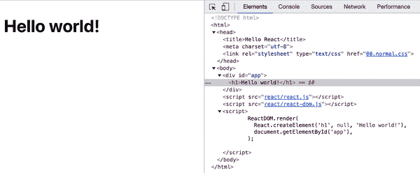
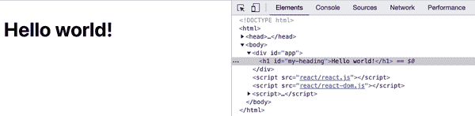
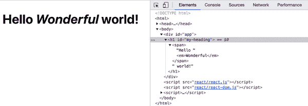
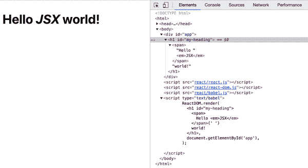

# 第一章：Hello World

让我们开始使用 React 掌握应用程序开发之旅。在本章中，您将学习如何设置 React 并编写您的第一个“Hello World”Web 应用程序。

# 设置

首先要做的事情是获取 React 库的副本。有多种方法可以做到这一点。让我们选择最简单的方法，它不需要任何特殊工具，可以让您很快地学习和进行开发。

在一个您可以找到的位置为本书中的所有代码创建一个文件夹。

例如：

```
$ mkdir ~/reactbook

```

创建一个*/react*文件夹来保留 React 库代码的分离。

```
$ mkdir ~/reactbook/react
```

接下来，您需要添加两个文件：一个是 React 本身，另一个是 ReactDOM 插件。您可以从[*unpkg.com*](https://unpkg.com)主机获取最新的 17.*版本，如下所示：

```
$ curl -L https://unpkg.com/react@17/umd/react.development.js > ~/reactbook/react/react.js
$ curl -L https://unpkg.com/react-dom@17/umd/react-dom.development.js > ~/reactbook/react/react-dom.js
```

请注意，React 不强制任何目录结构；您可以自由移动到不同的目录或根据需要重命名*react.js*。

您不必下载这些库；您可以直接从[*unpkg.com*](https://unpkg.com)使用它们。但是，将它们本地化使得可以在任何地方学习，而不需要互联网连接。

###### 注意

在前面示例中显示的 URL 中的`@17`获取了当前写作本书时最新的 React 17 版本。省略`@17`以获取最新可用的 React 版本。或者，您可以显式指定所需的版本，例如`@17.0.2`。

# Hello React World

让我们从您工作目录中的一个简单页面开始（*~/reactbook/01.01.hello.html*）：

```
<!DOCTYPE html>
<html>
  <head>
    <title>Hello React</title>
    <meta charset="utf-8">
  </head>
  <body>
    <div id="app">
      <!-- my app renders here -->
    </div>
    <script src="react/react.js"></script>
    <script src="react/react-dom.js"></script>
    <script>
      // my app's code
    </script>
  </body>
</html>
```

###### 注意

您可以在本书的[附带存储库中找到所有代码](https://github.com/stoyan/reactbook2)。

此文件中仅发生了两件显著的事情：

+   您包含了 React 库及其文档对象模型（DOM）插件（通过`<script src>`标签）

+   您定义应用程序应放置在页面上的位置（`<div id="app">`）

###### 注意

您始终可以混合常规 HTML 内容以及其他 JavaScript 库与 React 应用程序。您还可以在同一页上拥有几个 React 应用程序。您所需要的只是 DOM 中可以指向 React 并说“在这里施展你的魔法”的地方。

现在让我们添加说“hello”的代码—更新 *01.01.hello.html* 并将 `// my app's code` 替换为：

```
ReactDOM.render(
  React.createElement('h1', null, 'Hello world!'),
  document.getElementById('app')
);
```

在浏览器中加载 *01.01.hello.html*，您将看到您的新应用程序正在运行（如图 1-1 所示）。



###### 图 1-1\. “Hello world!”在运行中

恭喜您，您刚刚构建了您的第一个 React 应用程序！

图 1-1](#FIG0101)还显示了在 Chrome 开发工具中生成的代码，您可以在其中看到`<div id="app">`占位符的内容被您的 React 应用程序生成的内容替换。

# 刚刚发生了什么？

代码中有一些值得注意的地方，这些地方使您的第一个应用程序起作用。

首先，你看到了`React`对象的使用。所有可用的 API 都可以通过这个对象访问。API 故意保持最小化，因此记住的方法名称并不多。

你还可以看到`ReactDOM`对象。它只有少数几个方法，其中最有用的是`render()`。`ReactDOM`负责在*浏览器*中呈现应用程序。实际上，你可以创建 React 应用并在不同的环境中呈现它们，例如在画布中，或者在 Android 或 iOS 本地应用中。

接下来，有*组件*的概念。你可以使用组件构建你的 UI，并以任何你认为合适的方式组合这些组件。在你的应用程序中，你将会创建自定义组件，但是为了让你入门，React 提供了围绕 HTML DOM 元素的包装器。你可以通过`React.createElement`函数使用这些包装器。在这个第一个示例中，你可以看到使用了`h1`元素。它对应于 HTML 中的`<h1>`，并且可以通过调用`React.createElement('h1')`来使用。

最后，你看到了老旧的`document.getElementById('app')` DOM 访问方式。你可以使用这个方法告诉 React 应用程序在页面上的位置。这就是从你知道的 DOM 操作到 React 领域的桥梁。

一旦你从 DOM 转向 React，你就不必再担心 DOM 操作，因为 React 会将组件转换为底层平台（浏览器 DOM、画布、本地应用）。事实上，不再担心 DOM 是 React 的伟大之处之一。你只需关心组件及其数据的组合——这是应用程序的核心部分——让 React 以最高效的方式更新 DOM。不再寻找 DOM 节点、`firstChild`、`appendChild()`等。

###### 注意

你*不必*担心 DOM，但这并不意味着你不能。如果有必要，React 为你提供了“逃生通道”，让你可以返回到 DOM 领域。

现在你知道每行代码的作用，让我们来看看整体。发生的事情是：你在你选择的 DOM 位置中渲染了一个 React 组件。你总是渲染一个顶级组件，它可以有任意多的子组件（和孙子组件等）。即使在这个简单的例子中，`h1`组件也有一个子组件——“Hello world!”文本。

# React.createElement()

正如你现在所知，你可以通过`React.createElement()`方法将多个 HTML 元素用作 React 组件。让我们仔细看看这个 API。

记住，“Hello world!”应用程序看起来像这样：

```
ReactDOM.render(
  React.createElement('h1', null, 'Hello world!'),
  document.getElementById('app')
);
```

`createElement`的第一个参数是要创建的元素类型。第二个参数（在本例中为`null`）是一个对象，用于指定要传递给元素的任何属性（类似于 DOM 属性）。例如，你可以这样做：

```
React.createElement(
  'h1',
  {
    id: 'my-heading',
  },
  'Hello world!'
),
```

此示例生成的 HTML 显示在图 1-2 中。



###### 图 1-2\. 由`React.createElement()`调用生成的 HTML

第三个参数（在这个例子中是 `"Hello world!"`）定义了组件的子元素。最简单的情况就是一个文本子元素（在 DOM 中叫做 `Text` 节点），就像你在前面的代码中看到的那样。但你可以有任意多个嵌套的子元素，并且将它们作为额外的参数传递。例如：

```
React.createElement(
  'h1',
  {id: 'my-heading'},
  React.createElement('span', null, 'Hello'),
  ' world!'
),
```

另一个例子，这次是带有嵌套组件的（结果显示在 图 1-3 中）如下所示：

```
React.createElement(
  'h1',
  {id: 'my-heading'},
  React.createElement(
    'span',
    null,
    'Hello ',
    React.createElement('em', null, 'Wonderful'),
  ),
  ' world!'
),
```



###### 图 1-3\. 由嵌套 `React.createElement()` 调用生成的 HTML

你可以在 图 1-3 中看到，React 生成的 DOM 中 `<em>` 元素是 `<span>` 的子元素，而 `<span>` 又是 `<h1>` 元素的子元素（也是 “world” 文本节点的同级节点）。

# JSX

当你开始嵌套组件时，你很快会遇到许多函数调用和括号要跟踪。为了简化操作，你可以使用 *JSX 语法*。JSX 有点争议：人们经常一见面就觉得它不好看（啊，XML 混在我的 JavaScript 里面！），但是在使用后却不可或缺。

###### 注意

JSX 这个缩写具体代表什么并不十分清楚，但很可能是 JavaScriptXML 或 JavaScript 语法扩展。这个开源项目的官方主页是 [*https://facebook.github.io/jsx*](https://facebook.github.io/jsx)。

下面是上面代码片段，这次使用 JSX 语法：

```
ReactDOM.render(
  <h1 id="my-heading">
    <span>Hello <em>Wonderful</em></span> world!
  </h1>,
  document.getElementById('app')
);
```

这样更易读。这种语法看起来非常像 HTML，而且你已经熟悉 HTML。但它并不是浏览器能理解的有效 JavaScript。你需要 *转译* 这段代码以使其在浏览器中运行。同样地，出于学习目的，你可以在没有特殊工具的情况下完成这项工作。你需要 Babel 库，它可以将前沿的 JavaScript（和 JSX）转换为老式浏览器可以运行的 JavaScript。

## 设置 Babel

就像使用 React 一样，先获取 Babel 的本地副本：

```
$ curl -L https://unpkg.com/babel-standalone/babel.min.js > ~/reactbook/react/babel.js
```

接着，你需要更新学习模板以包含 Babel。像这样创建一个名为 *01.04.hellojsx.html* 的文件：

```
<!DOCTYPE html>
<html>
  <head>
    <title>Hello React+JSX</title>
    <meta charset="utf-8">
  </head>
  <body>
    <div id="app">
      <!-- my app renders here -->
    </div>
    <script src="react/react.js"></script>
    <script src="react/react-dom.js"></script>
    <script src="react/babel.js"></script>
    <script type="text/babel">
      // my app's code
    </script>
  </body>
</html>
```

###### 注意

注意 `<script>` 如何变成 `<script type="text/babel">`。这是一个技巧，通过指定一个无效的 `type`，浏览器会忽略这段代码。这给了 Babel 解析和转换 JSX 语法的机会，将其转换成浏览器可以运行的代码。

## Hello JSX 世界

现在设置完成，让我们尝试一下 JSX。将前面 HTML 中 `// my app's code` 部分替换为：

```
ReactDOM.render(
  <h1 id="my-heading">
    <span>Hello <em>JSX</em></span> world!
  </h1>,
  document.getElementById('app')
);
```

在浏览器中运行的结果显示在 图 1-4 中。



###### 图 1-4\. 你好 JSX 世界

## 关于转译

很高兴你已经让 JSX 和 Babel 正常工作了，但也许再多说几句也无妨，特别是如果你对 Babel 和转译过程还不太熟悉的话。如果你已经熟悉了，请随意跳过这部分，我们稍微了解一下 *JSX*、*Babel* 和 *转译* 的术语。

*JSX*是 React 的一项独立技术，完全是可选的。正如你所见，本章的第一个示例甚至没有使用 JSX。你完全可以选择永远不接触 JSX。但很可能一旦尝试过，你就不会再回到函数调用。

*转译*的过程是将源代码重写成使用旧版浏览器理解的语法来实现相同结果的过程。这与使用*垫片*不同。例如，向`Array.prototype`添加`map()`方法，该方法是在 ECMAScript5 中引入的，在仅支持 ECMAScript3 的浏览器中使其生效。垫片是 JavaScript 领域的一种解决方案。当向现有对象添加新方法或实现新对象（例如`JSON`）时，它是一个很好的解决方案。但是，当语言引入新的语法时，垫片是不够的。对于不支持它的浏览器，任何新语法都是无效的，并且会抛出解析错误。因此，新语法需要一个编译（转译）步骤，以便在提供给浏览器之前进行转换。

随着程序员希望使用最新的 JavaScript（ECMAScript）功能而不必等待浏览器实现它们，JavaScript 的转译变得越来越普遍。如果您已经设置了构建流程（例如，缩小或任何其他代码转换），您可以简单地将 JSX 步骤添加到其中。假设您*没有*构建过程，您将在本书的后面看到设置一个所需步骤。

目前，让我们将 JSX 转译留在客户端（在浏览器中），继续学习 React。只需注意，这仅用于教育和实验目的。客户端转换不适用于实时生产站点，因为它们比提供已转译代码更慢且资源消耗更大。

# 接下来：自定义组件

到此为止，你已经完成了基本的“Hello world”应用程序。现在你知道如何：

+   为了实验和学习，设置 React 库（实际上只需几个`<script>`标签）

+   在你选择的 DOM 位置中渲染一个 React 组件（例如，`ReactDOM.render(reactWhat, domWhere)`）

+   使用内置组件，它们是常规 DOM 元素的包装器（例如，`React.createElement(element, attributes, content, children)`）

然而，React 的真正强大之处在于当你开始使用自定义组件来构建（和更新！）你的应用程序用户界面（UI）时。让我们在下一章中学习如何做到这一点。
