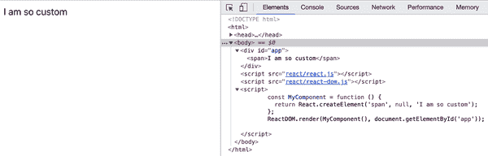
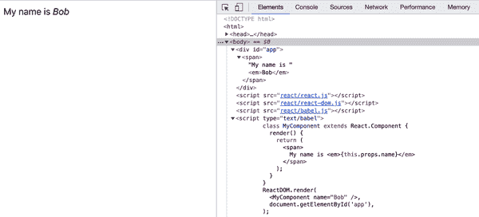
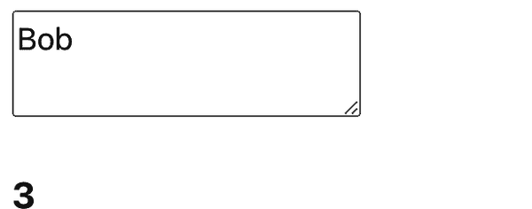
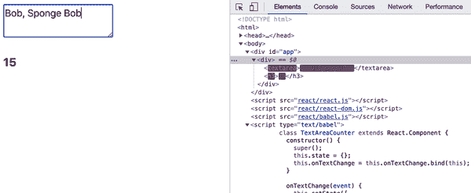
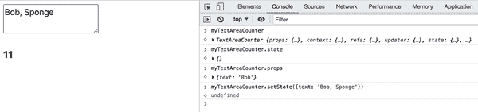
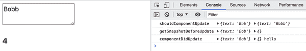
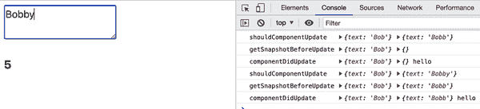
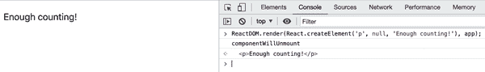

# 第二章：组件的生命周期

现在你知道如何使用现成的 DOM 组件了，现在是时候学习如何制作自己的组件了。

有两种定义自定义组件的方式，但两种方式都能实现同样的结果，只是使用了不同的语法：

+   使用函数（这种方式创建的组件称为*函数*组件）

+   使用扩展 `React.Component` 类的类（通常称为*类*组件）

# 自定义函数组件

这里有一个函数组件的示例：

```
const MyComponent = function() {
  return 'I am so custom';
};
```

但是，等等，这只是一个函数！是的，自定义组件只是一个返回所需 UI 的函数。在这种情况下，UI 只是文本，但通常你会需要更多，很可能是其他组件的组合。这里有一个使用 `span` 包装文本的示例：

```
const MyComponent = function() {
  return React.createElement('span', null, 'I am so custom');
};
```

在应用程序中使用你的全新组件与使用第一章中的 DOM 组件类似，只是你*调用*定义组件的函数：

```
ReactDOM.render(
  MyComponent(),
  document.getElementById('app')
);
```

渲染你的自定义组件的结果显示在图 2-1 中。



###### 图 2-1\. 你的第一个自定义组件（书中存储库的 *02.01.custom-functional.html*）

## JSX 版本

使用 JSX 的相同示例看起来会更容易阅读。定义组件的方式如下：

```
const MyComponent = function() {
  return <span>I am so custom</span>;
};
```

无论组件本身是如何定义的（使用 JSX 还是不使用 JSX），使用 JSX 方式使用组件如下：

```
ReactDOM.render(
  <MyComponent />,
  document.getElementById('app')
);
```

###### 注意

注意，在自闭合标签 `<MyComponent />` 中，斜杠是不可选的。这也适用于 JSX 中使用的 HTML 元素。`<br>` 和 `` 是行不通的；你需要像 `<br/>` 和 `` 这样关闭它们。

# 自定义类组件

创建组件的第二种方式是定义一个扩展 `React.Component` 并实现 `render()` 函数的类：

```
class MyComponent extends React.Component {
  render() {
    return React.createElement('span', null, 'I am so custom');
    // or with JSX:
    // return <span>I am so custom</span>;
  }
}
```

在页面上渲染组件：

```
ReactDOM.render(
  React.createElement(MyComponent),
  document.getElementById('app')
);
```

如果你使用 JSX，你不需要知道组件是如何定义的（使用类或函数）。在使用组件的两种情况下，都是一样的：

```
ReactDOM.render(
  <MyComponent />,
  document.getElementById('app')
);
```

## 使用哪种语法？

你可能会想：在所有这些选项（JSX vs. 纯 JavaScript，类组件 vs. 函数组件）中，应该选择哪一个？JSX 是最常见的。而且，除非你不喜欢在 JavaScript 中使用 XML 语法，选择 JSX 是最少阻力和打字量最少的路径。从现在开始，本书将使用 JSX，除非是为了说明概念。那么，为什么还要讨论非 JSX 的方式呢？嗯，你应该知道还*有*另一种方式，而且 JSX 并不是魔法，而是一层薄薄的语法层，在将代码发送到浏览器之前，它会将 XML 转换为普通的 JavaScript 函数调用，比如`React.createElement()`。

类组件与函数组件之争？这是一个偏好问题。如果您熟悉面向对象编程（OOP），并且喜欢类的布局方式，那么尽管去选择类组件。函数组件在计算机 CPU 上稍轻，输入少一些。它们也更符合 JavaScript 的本性。实际上，在 JavaScript 语言的早期版本中并不存在*类*；它们是后来的想法，仅仅是函数和原型的语法糖。

从 React 的历史角度来看，函数组件无法像类组件那样完成所有任务，直到*hooks*的发明。关于未来，只能进行推测，但很可能 React 会更多地向函数组件靠拢。但是，类组件不太可能很快就会被废弃。本书将教授您两种方式，并不会为您做出决定，尽管您可能会感觉到对函数组件的轻微偏爱。您可能会问，为什么本书还要使用类？（正如手稿的大多数技术编辑所问。）

在现实世界中有很多使用类编写的代码和许多在线教程。事实上，在撰写本文时，即使 React 的官方文档也显示大多数示例为类组件。因此，作者认为读者应该熟悉两种语法，以便能够阅读和理解所有呈现给他们的代码，并且在出现非函数组件时不会感到困惑。

# 属性

在自定义组件中渲染*硬编码*的 UI 是完全可以的，并且具有其用途。但是组件也可以接受*属性*并根据属性值的不同进行渲染或行为上的差异。考虑 HTML 中的`<a>`元素及其根据`href`属性值的不同而行为不同。React 中的属性概念与此类似（JSX 语法也是如此）。

在类组件中，所有属性都可以通过`this.props`对象访问。让我们看一个例子：

```
class MyComponent extends React.Component {
  render() {
    return <span>My name is <em>{this.props.name}</em></span>;
  }
}
```

###### 注意

如此示例所示，您可以打开花括号，并在您的 JSX 中添加 JavaScript 值（包括表达式）。随着您在本书中的进展，您将了解更多有关此行为的信息。

当渲染组件时为`name`属性传递一个值的示例如下所示：

```
ReactDOM.render(
  <MyComponent name="Bob" />,
  document.getElementById('app')
);
```

结果显示在图 2-2 中。



###### 图 2-2\. 使用组件属性（*02.05.this.props.html*）

需要记住的重要一点是`this.props`是只读的。它旨在从父组件传递配置到子组件，但它不是通用的值存储器。如果您感到诱惑设置`this.props`的属性，只需使用额外的局部变量或组件类的属性即可（意思是使用`this.thing`而不是`this.props.thing`）。

## 函数组件中的属性

在函数组件中，没有`this`（在 JavaScript 的*严格*模式下），或者`this`指向全局对象（在非严格模式下，我们可以说是*松散*模式）。所以，你不再使用`this.props`，而是将一个`props`对象作为第一个参数传递给你的函数：

```
const MyComponent = function(props) {
  return <span>My name is <em>{props.name}</em></span>;
};
```

一个常见的模式是使用 JavaScript 的*解构赋值*将属性值分配给局部变量。换句话说，前面的例子变成了：

```
// 02.07.props.destructuring.html in the book's repository
const MyComponent = function({name}) {
  return <span>My name is <em>{name}</em></span>;
};
```

你可以拥有任意多的属性。例如，如果你需要两个属性（`name`和`job`），你可以像这样使用它们：

```
// 02.08.props.destruct.multi.html in the book's repository
const MyComponent = function({name, job}) {
  return <span>My name is <em>{name}</em>, the {job}</span>;
};
ReactDOM.render(
  <MyComponent name="Bob" job="engineer"/>,
  document.getElementById('app')
);
```

## 默认属性

你的组件可能提供多个属性，但有时少数属性可能有适合大多数情况的默认值。你可以为函数和类组件使用`defaultProps`属性来指定默认属性值。

函数组件：

```
const MyComponent = function({name, job}) {
  return <span>My name is <em>{name}</em>, the {job}</span>;
};
MyComponent.defaultProps = {
  job: 'engineer',
};
ReactDOM.render(
  <MyComponent name="Bob" />,
  document.getElementById('app')
);
```

类组件：

```
class MyComponent extends React.Component {
  render() {
    return (
      <span>My name is <em>{this.props.name}</em>,
      the {this.props.job}</span>
    );
  }
}
MyComponent.defaultProps = {
  job: 'engineer',
};
ReactDOM.render(
  <MyComponent name="Bob" />,
  document.getElementById('app')
);
```

在这两种情况下，结果都是输出：

```
My name is *Bob*, the engineer

```

###### 提示

注意`render()`方法的`return`语句如何用括号包裹返回的值。这只是因为 JavaScript 的*自动分号插入*（ASI）机制。跟在新行后面的`return`语句相当于`return;`，这等同于`return undefined;`，这绝对不是你想要的。用括号包裹返回的表达式可以在保持正确性的同时，提供更好的代码格式化。

# 状态

到目前为止的例子都比较静态（或称为“无状态”）。目标仅仅是让你了解如何组合你的 UI 的构建模块。但是，React 真正闪耀的地方（以及旧式浏览器 DOM 操作和维护变得复杂的地方）是当你的应用程序中的数据发生变化时。React 具有*状态*的概念，它是组件想要用来渲染自己的任何数据。当状态发生变化时，React 会在 DOM 中重新构建 UI，而你无需做任何事情。在你的`render()`方法（或函数组件的渲染函数）中首次构建 UI 后，你只需关心更新数据。你根本不需要担心 UI 的变化。毕竟，你的渲染方法/函数已经提供了组件应该看起来像什么的蓝图。

###### 注意

“无状态”并不是一个坏词，一点也不是。无状态组件更容易管理和思考。然而，尽可能地使组件无状态通常是可取的，但应用程序是复杂的，你确实需要状态。

与通过`this.props`访问属性类似，你通过`this.state`对象*读取*状态。要*更新*状态，你使用`this.setState()`。当调用`this.setState()`时，React 调用你组件的渲染方法（及其所有子组件），并更新 UI。

在调用`this.setState()`后更新 UI 是通过一个高效批处理更改的队列机制完成的。直接更新`this.state`可能会产生意外的行为，你不应该这样做。和`this.props`一样，考虑`this.state`对象为只读，不仅因为在语义上这是一个不好的主意，而且因为它可能以你意想不到的方式行事。同样，不要自行调用`this.render()`—而是让 React 来批处理更改、找出最少的工作量，并在适当时调用`render()`。

# 一个文本域组件

让我们构建一个新组件——一个`textarea`，它会计算键入字符的数量（如图 2-3 所示）。



###### 图 2-3\. 自定义`textarea`组件的最终结果

你（以及其他未来使用这个非常可重用组件的人）可以像这样使用新组件：

```
ReactDOM.render(
  <TextAreaCounter text="Bob" />,
  document.getElementById('app')
);
```

现在，让我们来实现这个组件。首先创建一个不处理更新的“无状态”版本，这与之前的所有示例并没有太大不同：

```
class TextAreaCounter extends React.Component {
  render() {
    const text = this.props.text;
    return (
      <div>
        <textarea defaultValue={text}/>
        <h3>{text.length}</h3>
      </div>
    );
  }
}
TextAreaCounter.defaultProps = {
  text: 'Count me as I type',
};
```

###### 注意

你可能已经注意到，在前面的片段中，`<textarea>`使用`defaultValue`属性而不是像你在常规 HTML 中习惯的文本子节点。这是因为在 React 和老式 HTML 之间存在一些细微差别。这些差异在书中进一步讨论，但请放心，它们并不多。此外，你会发现这些差异使开发者的生活更轻松。

正如你所看到的，`TextAreaCounter`组件接受一个可选的`text`字符串属性，并渲染一个带有给定值的`textarea`，以及一个显示字符串长度的`<h3>`元素。如果未提供`text`属性，则使用默认的“Count me as I type”值。

# 使其具有状态

下一步是将这个*无状态*组件转换为一个*有状态*组件。换句话说，让组件维护一些数据（状态），并使用这些数据来初始化自身，并在数据变化时更新自身（重新渲染）。

首先，你需要在类构造函数中使用`this.state`来设置初始状态。请记住，构造函数是唯一可以直接设置状态而不调用`this.setState()`的地方。

初始化`this.state`是必需的；如果不这样做，在`render()`方法中连续访问`this.state`将失败。

在这种情况下，不需要使用一个值来初始化`this.state.text`，因为你可以回退到属性`this.prop.text`（尝试在书的仓库中查看*02.12.this.state.html*）：

```
class TextAreaCounter extends React.Component {
  constructor() {
    super();
    this.state = {};
  }
  render() {
    const text = 'text' in this.state ? this.state.text : this.props.text;
    return (
      <div>
        <textarea defaultValue={text} />
        <h3>{text.length}</h3>
      </div>
    );
  }
}
```

###### 注意

在使用`this`之前，需要在构造函数中调用`super()`。

这个组件维护的数据是`textarea`的内容，因此状态只有一个名为`text`的属性，可以通过`this.state.text`访问。接下来，你需要更新状态。你可以使用一个辅助方法来实现这个目的：

```
onTextChange(event) {
  this.setState({
    text: event.target.value,
  });
}
```

你总是使用 `this.setState()` 更新状态，它接受一个对象并将其与 `this.state` 中已有的数据合并。你可能已经猜到，`onTextChange()` 是一个事件处理程序，它接收一个 `event` 对象并从中获取 `textarea` 输入的内容。

最后要做的是更新 `render()` 方法来设置事件处理程序：

```
render() {
  const text = 'text' in this.state ? this.state.text : this.props.text;
  return (
    <div>
      <textarea
        value={text}
        onChange={event => this.onTextChange(event)}
      />
      <h3>{text.length}</h3>
    </div>
  );
}
```

现在，每当用户在 `textarea` 中输入时，计数器的值都会更新以反映其内容（见图 2-4）。

请注意，在之前你使用了 `<textarea defaultValue...>`，现在在前述代码中改为了 `<textarea value...>`。这是因为 HTML 中输入的工作方式，浏览器通过维护它们的状态来完成。但是 React 可以做得更好。在这个例子中，实现 `onChange` 意味着 `textarea` 现在被 React *控制*。关于*受控组件*的更多内容将在本书后面介绍。



###### 图 2-4\. 在 `textarea` 中输入（*02.12.this.state.html*）

# DOM 事件的一则说明

为了避免混淆，以下是关于以下行的一些澄清：

```
onChange={event => this.onTextChange(event)}
```

React 使用自己的*合成*事件系统以提升性能（以及便利性和理智）。为了理解其中的原因，你需要考虑纯 DOM 世界中的工作方式。

## 旧日的事件处理

使用*内联*事件处理程序来做这样的事情非常方便：

```
<button onclick="doStuff">
```

尽管方便且易于阅读（事件监听器直接与 UI 代码并列），但是如此散落的事件监听器过多效率低下。尤其是在同一个按钮上安装多个监听器，特别是当该按钮位于他人的“组件”或库中，你不想进去“修复”或分叉他们的代码时。这就是为什么在 DOM 世界中使用 `element.addEventListener` 来设置监听器是常见的（这导致代码分布在两个或更多地方），并且*事件委托*（以解决性能问题）。事件委托意味着你在某个父节点（如包含多个按钮的 `<div>`）上监听事件，并为所有按钮设置一个监听器，而不是每个按钮都设置一个监听器。因此，你*委托*事件处理给父级授权。

使用事件委托，你可以这样做：

```
<div id="parent">
  <button id="ok">OK</button>
  <button id="cancel">Cancel</button>
</div>

<script>
document.getElementById('parent').addEventListener('click', function(event) {
  const button = event.target;

  // do different things based on which button was clicked
  switch (button.id) {
    case 'ok':
      console.log('OK!');
      break;
    case 'cancel':
      console.log('Cancel');
      break;
    default:
      new Error('Unexpected button ID');
  };
});
</script>
```

这种方法确实有效且运行良好，但也存在一些缺点：

+   声明监听器离 UI 组件更远，这使得代码更难找到和调试。

+   使用委托和总是进行 `switch` 创建不必要的样板代码，甚至在实际工作（例如响应按钮点击）之前。

+   浏览器不一致性（此处省略）实际上要求这段代码更长。

不幸的是，当你将此代码发布到真实用户面前时，如果想支持旧版本浏览器，你需要添加更多内容：

+   你需要在 `addEventListener` 之外还要使用 `attachEvent`。

+   你需要在监听器顶部添加 `const event = event || window.event;`。

+   当涉及到在`render()`方法中显示你的组件时，你需要`const button = event.target || event.srcElement;`。

所有这些都是必要的，而且足够让人讨厌，以至于最终你会使用某种事件库。但是当 React 已经捆绑了处理事件噩梦的解决方案时，为什么要再添加另一个库（并学习更多的 API）呢？

## React 中的事件处理

React 使用*合成事件*来包装和规范化浏览器事件，这意味着不再存在浏览器的不一致性。你始终可以依赖于`event.target`在所有浏览器中都是可用的。这就是为什么在`TextAreaCounter`片段中，你只需要`event.target.value`，它就能正常工作。这也意味着取消事件的 API 在所有浏览器中都是相同的；换句话说，`event.stopPropagation()`和`event.preventDefault()`即使在旧版的 Internet Explorer 中也能工作。

这种语法使得将 UI 和事件监听器放在一起变得容易。它看起来像是旧式的内联事件处理程序，但在幕后并非如此。实际上，React 出于性能原因使用了事件委托。

React 使用驼峰式语法来处理事件处理程序，因此你使用`onClick`而不是`onclick`。

如果因为某种原因需要原始的浏览器事件，可以通过`event.nativeEvent`获取到，但你很少会需要这样做。

还有一件事：`onChange`事件（就像在`textarea`示例中使用的那样）的行为与你期望的一样：用户输入时触发，而不是在他们完成输入并离开字段后触发，这是纯 DOM 中的行为。

## 事件处理语法

前面的示例使用箭头函数调用辅助的`onTextChange`事件：

```
onChange={event => this.onTextChange(event)}
```

这是因为短语法`onChange={this.onTextChange}`不起作用的原因。

另一种选择是像这样绑定方法：

```
onChange={this.onTextChange.bind(this)}
```

另一个选项，也是一个常见模式，是在构造函数中绑定所有事件处理方法：

```
constructor() {
  super();
  this.state = {};
  this.onTextChange = this.onTextChange.bind(this);
}
// ....
<textarea
  value={text}
  onChange={this.onTextChange}
/>
```

这是一些必要的样板代码，但通过这种方式，事件处理程序仅绑定一次，而不是每次调用`render()`方法时都绑定，这有助于减少应用程序的内存占用。

一旦在 JavaScript 中可以将函数用作类属性，这种常见模式就大部分被取代了。

之前：

```
class TextAreaCounter extends React.Component {
  constructor() {
    // ...
    this.onTextChange = this.onTextChange.bind(this);
  }

  onTextChange(event) {
    // ...
  }
}
```

之后：

```
class TextAreaCounter extends React.Component {
  constructor() {
    // ...
  }

  onTextChange = (event) => {
    // ...
  };
}
```

在书的存储库中查看*02.12.this.state2.html*以获取完整的示例。

# 属性与状态的区别

现在你知道在渲染你的组件时，可以访问`this.props`和`this.state`。你可能想知道何时使用其中的一个而不是另一个。

属性是外部世界（组件的用户）配置你的组件的机制。状态是你的内部数据维护。因此，如果将其与面向对象编程进行类比，`this.props`就像是传递给类构造函数的所有参数的集合，而`this.state`则是你的私有属性的集合。

总的来说，最好将你的应用程序拆分为更少的*有状态*组件和更多的*无状态*组件。

# Props 在初始状态中的使用：反模式

在前述 `textarea` 示例中，很容易使用 `this.props` 设置初始的 `this.state`：

```
// Warning: Anti-pattern
this.state = {
  text: props.text,
};
```

这被视为一种反模式。理想情况下，您可以根据需要结合 `this.state` 和 `this.props` 在 `render()` 方法中构建您的 UI。但有时，您可能希望使用传递给组件的值来构建初始状态。这本身没有问题，但您组件的调用者可能期望属性（例如前述示例中的 `text`）始终具有最新的值，而前述代码将违反此预期。为了明确预期，仅需进行简单的命名更改即可，例如将属性命名为 `defaultText` 或 `initialValue` 而不仅仅是 `text`：

###### 注意

第四章 展示了 React 如何解决其输入和 `textarea` 的实现，人们可能会从他们先前的 HTML 知识中有所期待。

# 从外部访问组件

您并非总能够奢侈地从头开始创建一个全新的 React 应用程序。有时候，您需要连接到现有的应用程序或网站，并逐步迁移到 React。幸运的是，React 设计时考虑到了您可能有的任何预先存在的代码库。毕竟，在 React 刚刚起步的早期，原始的 React 创建者并没有办法停止整个世界并完全从头开始重写一个庞大的应用程序（如 Facebook.com）。

React 应用程序与外部世界通信的一种方法是获取您使用 `ReactDOM.render()` 渲染的组件的引用，然后从组件外部使用它：

```
const myTextAreaCounter = ReactDOM.render(
  <TextAreaCounter text="Bob" />,
  document.getElementById('app')
);
```

现在，您可以使用 `myTextAreaCounter` 访问与在组件内部使用 `this` 访问的相同方法和属性。甚至可以使用您的 JavaScript 控制台玩弄该组件（如 图 2-5 所示）。



###### 图 2-5\. 通过保持引用访问渲染的组件

在此示例中，`myTextAreaCounter.state` 检查当前状态（最初为空）；`myTextAreaCounter.props` 检查属性，并通过此行设置新状态：

```
myTextAreaCounter.setState({text: "Hello outside world!"});
```

此行获取了 React 创建的主父 DOM 节点的引用：

```
const reactAppNode = ReactDOM.findDOMNode(myTextAreaCounter);
```

这是 `<div id="app">` 的第一个子元素，这是您告诉 React 进行其魔术的地方。

###### 注意

您可以从组件外部访问整个组件 API。但是，如果可能的话，应该谨慎使用您的新超能力。也许您会心生把控不属于您的组件状态并“修复”它们的诱惑，但这会违反预期，从而在未来引起 bug，因为该组件并不预期此类干预。

# 生命周期方法

React 提供了几个所谓的 *生命周期* 方法。您可以使用生命周期方法监听组件在 DOM 操作方面的变化。组件的生命周期经历三个步骤：

挂载

初始时将组件添加到 DOM 中。

更新

组件通过调用 `setState()` 和/或者提供给组件的 prop 发生变化而更新。

卸载

将组件从 DOM 中移除。

React 在更新 DOM 之前会做一部分工作。这也被称为 *渲染阶段*。然后它更新 DOM，这个阶段称为 *提交阶段*。在此背景下，让我们考虑一些生命周期方法：

+   在初始挂载和提交到 DOM 之后，如果存在，你的组件的 `componentDidMount()` 方法会被调用。这是进行任何需要 DOM 的初始化工作的地方。任何不需要 DOM 的初始化工作应该在构造函数中完成。大多数初始化工作不应该依赖 DOM。但在这个方法中，你可以例如测量刚刚渲染的组件的高度，添加任何事件监听器（例如 `addEventListener('resize')`），或从服务器获取数据。

+   在组件从 DOM 中被移除之前，方法 `componentWillUnmount()` 会被调用。这是进行任何可能需要的清理工作的地方。任何事件处理程序或其他可能会泄露内存的东西都应该在这里清理。之后，组件永远消失了。

+   在组件更新之前（例如通过 `setState()` 的结果），你可以使用 `getSnapshotBeforeUpdate()`。该方法接收先前的属性和状态作为参数。它可以返回一个“快照”值，这个值可以传递给下一个生命周期方法 `componentDidUpdate()`。

+   `componentDidUpdate(previousProps, previousState, snapshot)`。每当组件被更新时调用此方法。由于此时 `this.props` 和 `this.state` 已经更新了，你会得到之前的副本。你可以用这些信息比较旧状态和新状态，并在必要时进行更多的网络请求。

+   然后是 `shouldComponentUpdate(newProps, newState)`，这是一个优化的机会。你可以拿到即将更新的状态，与当前状态进行比较，决定是否更新组件，如果不更新，其 `render()` 方法就不会被调用。

其中，`componentDidMount()` 和 `componentDidUpdate()` 是最常见的方法之一。

# 生命周期示例：全部记录下来

为了更好地理解组件的生命周期，让我们在 `TextAreaCounter` 组件中添加一些日志记录。简单地实现所有的生命周期方法，在它们被调用时在控制台打印日志及相关参数：

```
class TextAreaCounter extends React.Component {
  // ...

  componentDidMount() {
    console.log('componentDidMount');
  }
  componentWillUnmount() {
    console.log('componentWillUnmount');
  }
  componentDidUpdate(prevProps, prevState, snapshot) {
    console.log('componentDidUpdate     ', prevProps, prevState, snapshot);
  }
  getSnapshotBeforeUpdate(prevProps, prevState) {
    console.log('getSnapshotBeforeUpdate', prevProps, prevState);
    return 'hello';
  }
  shouldComponentUpdate(newProps, newState) {
    console.log('shouldComponentUpdate  ', newProps, newState);
    return true;
  }

  // ...
}
```

页面加载后，控制台中唯一的消息是 `componentDidMount`。

接下来，当您键入“b”以使文本变为“Bobb”（参见图 2-6）时，`shouldComponentUpdate()`将使用新的 props（与旧的相同）和新的状态进行调用。由于此方法返回`true`，React 继续调用`getSnapshotBeforeUpdate()`，传递旧的 props 和状态。这是您处理它们和旧的 DOM 并将任何生成的信息作为快照传递给下一个方法的机会。例如，这是一个机会来做一些元素的测量或滚动位置，并将它们快照以查看它们是否在更新后改变。最后，`componentDidUpdate()`被调用时使用旧信息（您在`this.state`和`this.props`中有新的信息）以及由前一个方法定义的任何快照。



###### 图 2-6\. 更新组件

让我们再次更新`textarea`，这次键入“y”。结果显示在图 2-7 中。



###### 图 2-7\. 对组件的又一次更新

最后，为了演示`componentWillUnmount()`的实际效果（使用本书 GitHub 存储库中的示例*02.14.lifecycle.html*），您可以在控制台中键入：

```
ReactDOM.render(React.createElement('p', null, 'Enough counting!'), app);
```

这将整个`textarea`组件替换为一个新的`<p>`组件。然后，您可以在控制台中看到`componentWillUnmount`的日志消息（显示在图 2-8 中）。



###### 图 2-8\. 从 DOM 中移除组件

## 偏执状态保护

假设您想要限制在`textarea`中键入的字符数。您应该在事件处理程序`onTextChange()`中执行此操作，该事件在用户键入时调用。但是如果有人（比如一个更年轻、更天真的你？）从组件外部调用`setState()`会怎么样（正如前面提到的，这是一个坏主意）？你仍然可以保护组件的一致性和健康。您可以在`componentDidUpdate()`中进行验证，如果字符数超过允许的限制，将状态恢复到原来的状态。类似这样：

```
componentDidUpdate(prevProps, prevState) {
  if (this.state.text.length > 3) {
    this.setState({
      text: prevState.text || this.props.text,
    });
  }
}
```

条件`prevState.text || this.props.text`是在第一次更新时没有前一个状态时的情况下。

这可能看起来过于偏执，但仍然是可能的。实现相同保护的另一种方法是利用`shouldComponentUpdate()`：

```
shouldComponentUpdate(_, newState) {
  return newState.text.length > 3 ? false : true;
}
```

在书籍的存储库中查看*02.15.paranoid.html*以尝试这些概念。

###### 注意

在上述代码中，将`_`作为函数参数名是一种约定，向代码的未来读者传达：“我知道函数签名中还有另一个参数，但我不打算使用它。”

# 生命周期示例：使用子组件

您知道您可以根据需要混合和嵌套 React 组件。到目前为止，您只在`render()`方法中看到了`ReactDOM`组件（而不是自定义组件）。让我们看看另一个简单的自定义组件，可以用作子组件。

让我们将负责计数的部分隔离到自己的组件中。毕竟，分而治之就是这一切的关键！

首先，让我们将生活方式日志记录单独隔离到一个独立的类中，并让这两个组件继承它。在 React 中，几乎从不需要继承，因为对于 UI 工作，*组合* 更可取，对于非 UI 工作，普通的 JavaScript 模块就可以了。不过，了解它的工作原理是有用的，它可以帮助你避免复制粘贴日志记录方法。

这是父组件：

```
class LifecycleLoggerComponent extends React.Component {
  static getName() {}
  componentDidMount() {
    console.log(this.constructor.getName() + '::componentDidMount');
  }
  componentWillUnmount() {
    console.log(this.constructor.getName() + '::componentWillUnmount');
  }
  componentDidUpdate(prevProps, prevState, snapshot) {
    console.log(this.constructor.getName() + '::componentDidUpdate');
  }
}
```

新的 `Counter` 组件只显示计数。它不维护状态，而是显示父组件给出的 `count` 属性：

```
class Counter extends LifecycleLoggerComponent {
  static getName() {
    return 'Counter';
  }
  render() {
    return <h3>{this.props.count}</h3>;
  }
}
Counter.defaultProps = {
  count: 0,
};
```

`textarea` 组件设置了一个静态的 `getName()` 方法：

```
class TextAreaCounter extends LifecycleLoggerComponent {
  static getName() {
    return 'TextAreaCounter';
  }
  // ....
}
```

最后，`textarea` 的 `render()` 可以使用 `<Counter/>` 并有条件地使用它；如果计数为 0，则不显示任何内容：

```
render() {
  const text = 'text' in this.state ? this.state.text : this.props.text;
  return (
    <div>
      <textarea
        value={text}
        onChange={this.onTextChange}
      />
      {text.length > 0
        ? <Counter count={text.length} />
        : null
      }
    </div>
  );
}
```

###### 注意

注意 JSX 中的条件语句。你将表达式包裹在 `{}` 中，有条件地渲染 `<Counter/>` 或什么都不渲染（`null`）。只是为了演示：另一个选项是将条件移到 `return` 外。将 JSX 表达式的结果赋给变量是完全可以的。

```
render() {
  const text = 'text' in this.state
    ? this.state.text
    : this.props.text;
  let counter = null;
  if (text.length > 0) {
    counter = <Counter count={text.length} />;
  }
  return (
    <div>
      <textarea
        value={text}
        onChange={this.onTextChange}
      />
      {counter}
    </div>
  );
}
```

现在你可以观察到两个组件的生命周期方法被记录下来。在书的存储库中打开 *02.16.child.html*，在浏览器中查看当加载页面然后更改 `textarea` 内容时会发生什么。

在初始加载时，子组件会在父组件之前挂载和更新。你可以在控制台日志中看到：

```
Counter::componentDidMount
TextAreaCounter::componentDidMount
```

删除两个字符后，你会看到子组件如何更新，然后是父组件：

```
Counter::componentDidUpdate
TextAreaCounter::componentDidUpdate
Counter::componentDidUpdate
TextAreaCounter::componentDidUpdate
```

删除最后一个字符后，子组件完全从 DOM 中移除：

```
Counter::componentWillUnmount
TextAreaCounter::componentDidUpdate
```

最后，输入一个字符会将计数组件带回 DOM 中：

```
Counter::componentDidMount
TextAreaCounter::componentDidUpdate
```

# 性能优化：阻止组件更新

你已经了解了 `shouldComponentUpdate()` 并看到它的作用。在构建应用程序的性能关键部分时，这一点尤为重要。它在 `componentWillUpdate()` 之前被调用，让你有机会取消更新，如果你认为不必要的话。

有一类组件在其 `render()` 方法中只使用 `this.props` 和 `this.state`，没有额外的函数调用。这些组件被称为“纯”组件。它们可以实现 `shouldComponentUpdate()`，在更新前后比较状态和属性，如果没有任何变化，则返回 `false`，节省一些处理能力。此外，还可以有纯静态组件，既不使用 props 也不使用 state。这些组件可以直接返回 `false`。

React 可以更容易地使用常见（和通用）情况下在 `shouldComponentUpdate()` 中检查所有 props 和 state：而不是重复这项工作，你可以让你的组件继承 `React.PureComponent` 而不是 `React.Component`。这样你就不需要实现 `shouldComponentUpdate()` —— 它已经为你做好了。让我们利用这一点并调整前面的例子。

由于两个组件都继承了日志记录器，你只需要：

```
class LifecycleLoggerComponent extends React.PureComponent {
  // ... no other changes
}
```

现在这两个组件都是*纯的*。让我们还在`render()`方法中添加一个日志消息：

```
render() {
  console.log(this.constructor.getName() + '::render');
  // ... no other changes
}
```

现在加载页面（从存储库中的*02.17.pure.html*）打印出：

```
TextAreaCounter::render
Counter::render
Counter::componentDidMount
TextAreaCounter::componentDidMount
```

将“Bob”更改为“Bobb”会得到预期的渲染和更新结果：

```
TextAreaCounter::render
Counter::render
Counter::componentDidUpdate
TextAreaCounter::componentDidUpdate
```

现在，如果你将字符串“LOLz”粘贴到替换“Bobb”（或任何包含 4 个字符的字符串），你会看到：

```
TextAreaCounter::render
TextAreaCounter::componentDidUpdate
```

正如你所见，无需重新渲染`<Counter>`，因为它的 props 没有改变。新字符串的字符数相同。

# 函数组件究竟发生了什么？

你可能已经注意到，一旦`this.state`参与其中，函数组件就不再本章中。它们在本书的后面会再次出现，那时你还会学到*hooks*的概念。因为函数中没有`this`，所以在组件中管理状态需要另一种方法。好消息是，一旦你理解了状态和 props 的概念，函数组件的差异只是语法问题。

尽管花费大量时间在一个`textarea`上是多么“有趣”，让我们转向更具挑战性的内容。在下一章中，你将看到 React 的好处体现在哪里——即专注于你的*数据*，而让 React 处理所有的 UI 更新。
