# 第三章：Excel：一个花哨的表格组件

现在你知道如何创建自定义的 React 组件，使用通用 DOM 组件以及你自己的定制组件来组合 UI，设置属性，维护状态，钩入组件的生命周期，并通过在不必要时避免重新渲染来优化性能。

让我们将所有内容整合在一起（并在此过程中学习更多关于 React 的知识），创建一个更强大的组件——数据表格。类似于 Microsoft Excel 的早期原型，它允许你编辑数据表格的内容，还可以对数据进行排序、搜索和导出为可下载的文件。

# 数据优先

表格关乎数据，所以这个花哨的表格组件（为什么不称它为 `Excel`？）应该接受一个数据数组和描述每列数据的表头数组。为了测试，让我们从 [Wikipedia](https://en.wikipedia.org/wiki/List_of_best-selling_books) 获取一份畅销书列表：

```
const headers = ['Book', 'Author', 'Language', 'Published', 'Sales'];

const data = [
  [
    'A Tale of Two Cities', 'Charles Dickens',
      'English', '1859', '200 million',
  ],
  [
    'Le Petit Prince (The Little Prince)', 'Antoine de Saint-Exupéry',
      'French', '1943', '150 million',
  ],
  [
    "Harry Potter and the Philosopher's Stone", 'J. K. Rowling',
      'English', '1997', '120 million',
  ],
  [
    'And Then There Were None', 'Agatha Christie',
      'English', '1939', '100 million',
  ],
  [
    'Dream of the Red Chamber', 'Cao Xueqin',
      'Chinese', '1791', '100 million',
  ],
  [
    'The Hobbit', 'J. R. R. Tolkien',
      'English', '1937', '100 million',
  ],
];
```

那么，如何在表格中渲染这些数据呢？

# 表头循环

第一步，为了让新组件能够运行起来，只显示表格的表头。以下是一个最简实现的示例（*03.01.table-th-loop.html* 在书籍的代码库中）：

```
class Excel extends React.Component {
  render() {
    const headers = [];
    for (const title of this.props.headers) {
      headers.push(<th>{title}</th>);
    }
    return (
      <table>
        <thead>
          <tr>{headers}</tr>
        </thead>
      </table>
    );
  }
}
```

现在你有一个工作中的组件，下面是如何使用它：

```
ReactDOM.render(
  <Excel headers={headers} />,
  document.getElementById('app'),
);
```

这个起步示例的结果显示在图 3-1 中。在这个讨论中，CSS 只是稍微提及了一下，不是关注的重点，但你可以在书籍仓库的 `03.table.css` 中找到它。


###### 图 3-1\. 渲染表头

组件的 `return` 部分相当简单。它看起来就像一个 HTML 表格，除了 `headers` 数组。

```
return (
  <table>
    <thead>
      <tr>{headers}</tr>
    </thead>
  </table>
);
```

正如你在上一章节中看到的，你可以在 JSX 中使用大括号打开并放置任何 JavaScript 值或表达式。如果这个值恰好是一个数组，就像前面的例子一样，JSX 解析器会将其视为你单独传递了数组的每个元素，就像`{headers[0]}{headers[1]}...`。

在这个例子中，`headers` 数组的元素包含更多的 JSX 内容，这完全没问题。在`return`之前的循环使用 JSX 值填充了 `headers` 数组，如果你在硬编码数据，它看起来可能是这样的：

```
const headers = [
  <th>Book</th>,
  <th>Author</th>,
  // ...
];
```

你可以在 JSX 中的大括号内使用 JavaScript 表达式，你可以按需嵌套它们。这是 React 的美妙之处之一——JavaScript 的全部功能都可以用来创建你的 UI。循环和条件语句都像往常一样工作，你不需要学习另一种“模板”语言或语法来构建 UI。

# 表头循环，简洁版本

前面的例子运行良好（我们称之为“v1”，代表“版本 1”），但让我们看看如何用更少的代码完成相同的功能。让我们将循环移到 JSX 返回的末尾。实质上，整个 `render()` 方法变成了一个单独的 `return`（参见书籍仓库中的 *03.02.table-th-map.html*）。

```
class Excel extends React.Component {
  render() {
    return (
      <table>
        <thead>
          <tr>
            {this.props.headers.map(title => <th>{title}</th>)}
          </tr>
        </thead>
      </table>
    );
  }
}
```

看看如何通过调用`this.props.headers`传递的数据在`map()`上调用生成表头内容的数组。`map()`调用接受一个输入数组，在每个元素上执行一个回调函数，并创建一个新数组。

在前面的示例中，回调函数使用了最简洁的*箭头函数*语法。如果这对你来说有点晦涩，我们称之为 v2，并探讨一些其他选项。

这里是 v3：使用大括号包裹回调函数体的更详细的`map()`循环和一个*函数表达式*，而不是箭头函数：

```
{
  this.props.headers.map(
    function(title) {
      return <th>{title}</th>;
    }
  )
}
```

接下来是 v4，它稍微简洁一些，回到了使用箭头函数：

```
{
  this.props.headers.map(
    (title) => {
      return <th>{title}</th>;
    }
  )
}
```

这可以使用更少的缩进格式化为 v5：

```
{this.props.headers.map((title) => {
  return <th>{title}</th>;
})}
```

你可以根据个人偏好和要渲染内容的复杂性选择适合你的方式来遍历数组生成 JSX 输出。简单的数据可以在 JSX 中方便地内联循环（从 v2 到 v5）。如果数据类型对于内联的`map()`来说有点复杂，你可能会发现将内容生成放在渲染函数的顶部更容易阅读，保持 JSX 简洁，从某种意义上将数据与展示分离（v1 是一个例子）。有时候太多的内联表达式会在跟踪所有的闭合括号和大括号时变得混乱。

至于 v2 和 v5 的比较，它们基本相同，只是 v5 在回调参数周围有额外的括号，并且在回调函数体周围有大括号包裹。虽然这两者都是可选的，但它们使未来在差异/代码审查上或者在调试时更容易解析。例如，在 v5 中添加一个新行到函数体中（可能是一个临时的`console.log()`）非常简单——只需添加一个新行。而在 v2 中，添加一个新行还需要添加大括号并重新格式化和重新缩进代码。

# 调试控制台警告

如果你在加载前面的两个示例（*03.01.table-th-loop.html* 和 *03.01.table-th-map.html*）时查看浏览器控制台，你会看到一个警告。它说：

```
Warning: Each child in a list should have a unique "key" prop.
Check the render method of `Excel`.
```

它是什么问题以及如何修复它？正如警告信息所述，React 希望你为数组元素提供一个唯一的标识符，以便以后更高效地更新它们。为了解决警告，你需要为每个标题添加一个`key`属性。这个新属性的值可以是任何唯一的内容，比如数组元素的索引（0、1、2……）：

```
// before
for (const title of this.props.headers) {
  headers.push(<th>{title}</th>);
}

// after - 03.03.table-th-loop-key.html
for (const idx in this.props.headers) {
  const title = this.props.headers[idx];
  headers.push(<th key={idx}>{title}</th>);
}
```

键值只需要在每个数组循环内唯一，不需要在整个 React 应用程序中唯一，因此 0、1 等值是完全可以接受的。

对于内联版本（v5）的相同修复，从回调函数的第二个参数中获取元素的索引：

```
// before
<tr>
  {this.props.headers.map((title) => {
    return <th>{title}</th>;
  })}
</tr>

// after - 03.04.table-th-map-key.html
<tr>
  {this.props.headers.map((title, idx) => {
    return <th key={idx}>{title}</th>;
  })}
</tr>
```

# 添加 <td> 内容

现在你有了一个漂亮的表头，是时候添加表体了。要渲染的数据是一个二维数组（行和列），看起来像这样：

```
const data = [
  [
    'A Tale of Two Cities', 'Charles Dickens',
      'English', '1859', '200 million',
  ],
  ....
];
```

要将数据传递给`<Excel>`，让我们使用一个名为`initialData`的新 prop。为什么是“initial”而不仅仅是“data”？正如在上一章中简要提到的，这关乎管理期望。你的`Excel`组件的调用者应该能够传递数据以初始化表格。但随后，随着表格的存在，数据会发生变化，因为用户可以排序、编辑等。换句话说，组件的*状态*会改变。所以让我们使用`this.state.data`来跟踪这些变化，并使用`this.props.initialData`来让调用者初始化组件。

渲染一个新的`Excel`组件看起来像这样：

```
ReactDOM.render(
  <Excel headers={headers} initialData={data} />,
  document.getElementById('app'),
);
```

接下来你需要添加一个构造函数来从给定的数据中设置初始状态。构造函数接收`props`作为参数，并且还需要通过`super()`调用其父类的构造函数。

```
constructor(props) {
  super();
  this.state = {data: props.initialData};
}
```

现在渲染`this.state.data`。数据是二维的，所以你需要两个循环：一个用于遍历行，另一个用于遍历每行的数据（单元格）。这可以通过使用两个相同的`.map()`循环来实现，这些循环你已经知道如何使用了：

```
{this.state.data.map((row, idx) => (
  <tr key={idx}>
    {row.map((cell, idx) => (
      <td key={idx}>{cell}</td>
    ))}
  </tr>
))}
```

如你所见，这两个循环都需要`key={idx}`，在这种情况下，名称`idx`被重新用作每个循环内的局部变量。

完整的实现可能看起来像这样（结果显示在图 3-2 中）：

```
class Excel extends React.Component {
  constructor(props) {
    super();
    this.state = {data: props.initialData};
  }
  render() {
    return (
      <table>
        <thead>
          <tr>
            {this.props.headers.map((title, idx) => (
              <th key={idx}>{title}</th>
            ))}
          </tr>
        </thead>
        <tbody>
          {this.state.data.map((row, idx) => (
            <tr key={idx}>
              {row.map((cell, idx) => (
                <td key={idx}>{cell}</td>
              ))}
            </tr>
          ))}
        </tbody>
      </table>
    );
  }
}
```

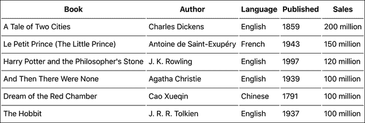

###### 图 3-2\. 渲染整个表格（*03.05.table-th-td.html*）

## Prop Types

在 JavaScript 语言中，无法指定你要处理的变量类型（字符串、数字、布尔值等）。但是来自其他语言的开发人员，以及在有许多其他开发人员参与的大型项目上工作的人会错过它。存在两个流行的选项，可以让你使用类型编写 JavaScript：Flow 和 TypeScript。你当然可以使用它们来编写 React 应用程序。但另一个选项存在，它仅限于指定组件期望的 props 类型：*prop types*。最初它们是 React 本身的一部分，但从 React v15.5 开始已移动到一个单独的库中。

Prop types 允许你更具体地指定`Excel`接收的数据类型，从而及早向开发人员展示错误。你可以这样设置 prop types（*03.06.table-th-td-prop-types.html*）：

```
Excel.propTypes = {
  headers: PropTypes.arrayOf(PropTypes.string),
  initialData: PropTypes.arrayOf(PropTypes.arrayOf(PropTypes.string)),
};
```

这意味着`headers` prop 预期是一个字符串数组，`initialData`预期是一个数组，其中每个元素是另一个字符串元素的数组。

要使这段代码工作，你需要获取暴露了全局变量`PropTypes`的库，就像你在第一章开始时所做的那样：

```
$ curl -L https://unpkg.com/prop-types/prop-types.js > ~/reactbook/react/prop-types.js

```

然后，在 HTML 中，你将新库与其他库一起包含：

```
<script src="react/react.js"></script>
<script src="react/react-dom.js"></script>
<script src="react/babel.js"></script>
<script src="react/prop-types.js"></script>
<script type="text/babel">
  class Excel extends React.Component {
    /* ... */
  }
</script>
```

现在你可以通过修改`headers`来测试所有这些工作，例如：

```
// before
const headers = ['Book', 'Author', 'Language', 'Published', 'Sales'];
// after
const headers = [0, 'Author', 'Language', 'Published', 'Sales'];
```

现在当你加载页面时（存储库中的*03.06.table-th-td-prop-types.html*），你可以在控制台中看到：

```
Warning: Failed prop type: Invalid prop `headers[0]` of type `number` supplied to `Excel`, expected `string`.
```

现在这就严格了！

要探索其他`PropTypes`，请在控制台中输入**`PropTypes`**（如图 3-3 所示）。

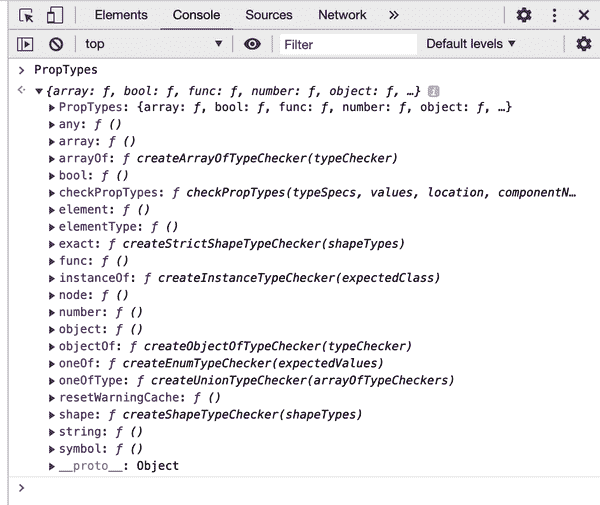

###### 图 3-3\. 探索`PropTypes`

## 你能改进组件吗？

仅允许字符串数据对于通用的 Microsoft Excel 电子表格来说有些太过于限制性。作为自己娱乐的练习，你可以改变这个例子以允许更多的数据类型（`PropTypes.any`），然后根据类型不同进行不同的渲染（例如，将数字右对齐）。

# 排序

有多少次你看到一个网页上的表格，希望它排序方式不同？幸运的是，使用 React 做到这一点非常简单。实际上，这正是 React 突出的一个例子，因为你所需做的就是对`data`数组进行排序，所有的 UI 更新都由它处理。

为了方便和可读性，所有排序逻辑都在`Excel`类的`sort()`方法中。一旦创建，需要两个连接件。首先，在标题行中添加一个点击处理程序：

```
<thead onClick={this.sort}>
```

然后在构造函数中绑定`this.sort`，就像你在第二章中所做的一样：

```
class Excel extends React.Component {
  constructor(props) {
    super();
    this.state = {data: props.initialData};
    this.sort = this.sort.bind(this);
  }
  sort(e) {
    // TODO: implement me
  }
  render() { /* ...*/}
}
```

现在让我们实现`sort()`方法。你需要知道按哪一列排序，可以通过事件目标（表头 `<th>`）的`cellIndex` DOM 属性方便地获取：

```
const column = e.target.cellIndex;
```

###### 注意

你可能很少在应用程序开发中看到使用`cellIndex`。它是一个早在 DOM Level 1（约 1998 年）定义的属性，表示“该单元格在行中的索引”，后来在 DOM Level 2 中被定义为只读。

你还需要一个数据的 *副本* 进行排序。否则，如果直接使用数组的`sort()`方法，它会修改数组。意味着调用`this.state.data.sort()`会修改`this.state`。正如你已经了解的，应该避免直接修改`this.state`，而只能通过`setState()`来修改。

JavaScript 中存在多种方法来对对象或数组进行 *浅复制*（数组在 JavaScript 中是对象，例如，`Object.assign()`）或使用扩展运算符 `{...state}`。然而，没有内建的方法来对对象进行 *深复制*。一个快速的解决方案是将对象编码为 JSON 字符串，然后解码回对象。让我们出于简洁性使用这种方法，尽管要注意，如果你的对象/数组包含`Date`对象，这种方法会失败。

```
function clone(o) {
  return JSON.parse(JSON.stringify(o));
}
```

利用方便的`clone()`实用函数，在开始操作数组之前先复制它：

```
// copy the data
const data = clone(this.state.data);
```

实际的排序是通过对数组的`sort()`方法进行回调来完成的：

```
data.sort((a, b) => {
  if (a[column] === b[column]) {
    return 0;
  }
  return a[column] > b[column] ? 1 : -1;
});
```

最后，这一行设置了新排序后的状态：

```
this.setState({
  data,
});
```

现在，当你点击标题时，内容按字母顺序排序（如图 3-4 所示）。

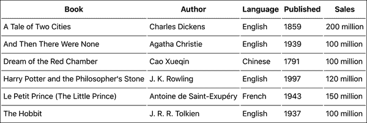

###### 图 3-4\. 按书名排序 (*03.07.table-sort.html*)

就是这样——你根本不必触碰 UI 渲染。在`render()`方法中，你已经定义了组件如何根据一些数据呈现。数据变化时，UI 也随之变化；但这已经不再是你的责任。

###### 注意

此示例使用了 ECMAScript 的 *属性值简写* 功能，其中 `this.setState({data})` 是通过跳过与变量同名的键来更简洁地表示 `this.setState({data: data})`。

## 你能改进这个组件吗？

上面的示例使用了相当简单的排序，刚好足够涉及到 React 的讨论。你可以按需进行更复杂的排序，解析内容以查看值是否是数字，是否带有单位等。

# 排序 UI 提示

表格已经很好地排序了，但是不清楚它按哪一列排序。让我们更新 UI 以显示基于正在排序的列的箭头。在此过程中，让我们也实现降序排序。

为了跟踪新状态，你需要向 `this.state` 添加两个新属性：

`this.state.sortby`

当前正在排序的列的索引

`this.state.descending`

一个布尔值以确定升序还是降序排序

现在构造函数可以是这样的：

```
constructor(props) {
  super();
  this.state = {
    data: props.initialData,
    sortby: null,
    descending: false,
  };
  this.sort = this.sort.bind(this);
}
```

在 `sort()` 函数中，你需要弄清楚排序的方式。默认为升序（A 到 Z），除非新列的索引与当前按照的列相同，并且排序不是由于之前点击头部而变成降序：

```
const column = e.target.cellIndex;
const data = clone(this.state.data);
const descending = this.state.sortby === column && !this.state.descending;
```

你还需要对排序回调进行小的调整：

```
data.sort((a, b) => {
  if (a[column] === b[column]) {
    return 0;
  }
  return descending
    ? a[column] < b[column]
      ? 1
      : -1
    : a[column] > b[column]
      ? 1
      : -1;
});
```

最后，你需要设置新状态：

```
this.setState({
  data,
  sortby: column,
  descending,
});
```

在此时，降序排序已经可以工作了。点击表头首先按升序排序数据，然后按降序排序，之后在两者之间切换。

唯一剩下的任务是更新 `render()` 函数以指示排序方向。对于当前已排序的列，让我们在标题中添加一个箭头符号。现在 `headers` 循环看起来像下面这样：

```
{this.props.headers.map((title, idx) => {
  if (this.state.sortby === idx) {
    title += this.state.descending ? ' \u2191' : ' \u2193'
  }
  return <th key={idx}>{title}</th>
})}
```

排序功能已经完备，用户可以按任何列排序，一次点击升序，再次点击降序，并且 UI 会通过视觉提示进行更新（如图 3-5 所示）。

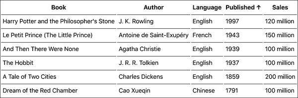

###### 图 3-5\. 升序/降序排序（注意“发布日期”旁边的箭头）

# 编辑数据

`Excel` 组件的下一步是为人们提供在表格中编辑数据的选项。一个解决方案可以这样工作：

1.  你双击了一个单元格。`Excel` 确定了被点击的单元格，并将其内容从简单文本转换为预先填充内容的输入字段（如图 3-6 所示）。

1.  你编辑了内容（如图 3-7 所示）。

1.  你按下 Enter 键。输入字段消失，表格更新为新文本（如图 3-8 所示）。

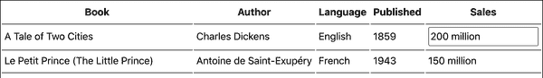

###### 图 3-6\. 双击后表格单元格变成输入字段

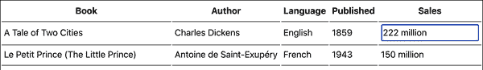

###### 图 3-7\. 编辑内容

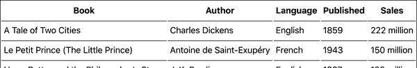

###### 图 3-8\. 按 Enter 键更新内容

## 可编辑单元格

第一件事是设置一个简单的事件处理程序。双击时，组件“记住”选定的单元格：

```
<tbody onDoubleClick={this.showEditor}>
```

###### 注意

注意友好易读的 `onDoubleClick`，而不是 W3C 的 `ondblclick`。

让我们看看 `showEditor` 方法的实现：

```
showEditor(e) {
  this.setState({
    edit: {
      row: parseInt(e.target.parentNode.dataset.row, 10),
      column: e.target.cellIndex,
    },
  });
}
```

这里发生了什么？

+   函数设置了 `this.state` 的 `edit` 属性。当未进行编辑时，此属性为 `null`，然后变为一个包含正在编辑的单元格的行索引和列索引的对象。因此，如果双击第一个单元格，`this.state.edit` 的值将为 `{row: 0, column: 0}`。

+   要确定列索引，您可以像之前一样使用 `e.target.cellIndex`，其中 `e.target` 是双击的 `<td>`。

+   在 DOM 中，并没有 `rowIndex` 可以免费获取，因此您需要通过 `data-` 属性自行完成。每一行应该有一个 `data-row` 属性来存储行索引，您可以使用 `parseInt()` 来获取索引。

让我们先处理一些先决条件。首先，`edit` 属性之前并不存在，在构造函数中也应该进行初始化。在处理构造函数时，让我们绑定 `showEditor()` 和 `save()` 方法。`save()` 方法用于在用户编辑完成后进行数据更新。更新后的构造函数如下所示：

```
constructor(props) {
  super();
  this.state = {
    data: props.initialData,
    sortby: null,
    descending: false,
    edit: null, // {row: index, column: index}
  };
  this.sort = this.sort.bind(this);
  this.showEditor = this.showEditor.bind(this);
  this.save = this.save.bind(this);
}
```

`data-row` 属性是您需要的，以便您可以跟踪行索引。在循环中，您可以通过数组索引获取索引。之前您看到 `idx` 被同时行和列循环中的本地变量重复使用。让我们为了清晰起见将其重命名为 `rowidx` 和 `columnidx`。

整个 `<tbody>` 构造可能如下所示：

```
<tbody onDoubleClick={this.showEditor}>
  {this.state.data.map((row, rowidx) => (
    <tr key={rowidx} data-row={rowidx}>
      {row.map((cell, columnidx) => {

        // TODO - turn `cell` into an input if the `columnidx`
        // and the `rowidx` match the one being edited;
        // otherwise, just show it as text

        return <td key={columnidx}>{cell}</td>;
      })}
    </tr>
  ))}
</tbody>
```

最后，让我们按照 `TODO` 中的要求——在必要时创建一个输入字段。由于 `setState()` 调用设置了 `edit` 属性，整个 `render()` 函数被再次调用，React 重新渲染了表格，这给了您更新被双击的表格单元格的机会。

## 输入字段单元格

让我们来看看替换 `TODO` 注释的代码。首先，为了简洁起见，记住编辑状态：

```
const edit = this.state.edit;
```

检查是否已设置 `edit`，以及是否正在编辑此确切单元格：

```
if (edit && edit.row === rowidx && edit.column === columnidx) {
  // ...
}
```

如果这是目标单元格，让我们创建一个表单和一个带有单元格内容的输入字段：

```
cell = (
  <form onSubmit={this.save}>
    <input type="text" defaultValue={cell} />
  </form>
);
```

如您所见，这是一个带有单个输入字段的表单，输入字段的内容预先填充。当提交表单时，提交事件被 `save()` 方法捕获。

## 保存

编辑过程的最后一部分是在用户完成输入并提交表单（通过 Enter 键）后保存内容更改：

```
save(e) {
  e.preventDefault();
  // ... do the save
}
```

在阻止默认行为（以避免页面重新加载）之后，您需要获取输入字段的引用。事件目标 `e.target` 是表单，它的第一个子元素就是输入字段：

```
const input = e.target.firstChild;
```

克隆数据，以避免直接操作 `this.state`：

```
const data = clone(this.state.data);
```

根据 `state` 的 `edit` 属性中存储的新值以及列和行索引，更新给定的数据片段：

```
data[this.state.edit.row][this.state.edit.column] = input.value;
```

最后，设置状态，导致 UI 重新渲染：

```
this.setState({
  edit: null,
  data,
});
```

现在表格可以编辑了。要查看完整列表，请参阅 *03.09.table-editable.html*。

## 结论和虚拟 DOM 差异

现在编辑功能已完成。不需要太多的代码。你只需要：

+   通过 `this.state.edit` 跟踪要编辑的单元格。

+   在显示表格时，如果行和列索引与用户双击的单元格匹配，则渲染一个输入字段。

+   使用输入字段中的新值更新数据数组。

一旦使用新数据调用 `setState()`，React 就会调用组件的 `render()` 方法，UI 就会神奇地更新。看起来每次只更改一个单元格的内容可能不会特别高效，因为事实上，React 只更新浏览器 DOM 中的一个单元格。

如果你打开浏览器的开发者工具，可以看到当你与应用程序交互时，DOM 树的哪些部分被更新了。在图 3-9 中，你可以看到开发工具在将《霍比特人》的语言从英语改为精灵语后，突出显示了 DOM 的变化。

在幕后，React 调用您的 `render()` 方法并创建所需 DOM 结果的轻量级树表示。这被称为*虚拟 DOM 树*。当再次调用 `render()` 方法（例如，在调用 `setState()` 后）时，React 取出前后的虚拟树并计算差异。根据这些差异，React 找出执行所需的最小 DOM 操作（例如 `appendChild()`、`textContent` 等），将该变化传递到浏览器的 DOM 中。

在图 3-9 中，只需要对单元格进行一个变化，而不必重新渲染整个表格。通过计算最小的变化集并批处理 DOM 操作，React 轻轻地“触碰” DOM，因为已知 DOM 操作慢（与纯 JavaScript 操作、函数调用等比较），通常是丰富的 Web 应用程序渲染性能的瓶颈。

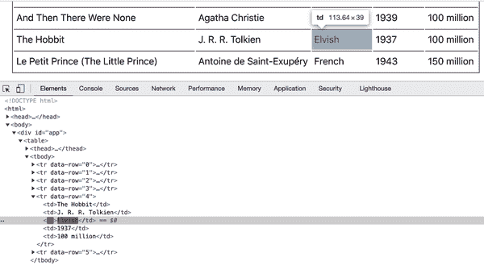

###### 图 3-9\. 突出显示 DOM 变化

当涉及到性能和更新 UI 时，React 会给你提供支持：

+   轻触 DOM

+   使用事件委托处理用户交互

# 搜索

接下来，让我们给 `Excel` 组件添加一个搜索功能，允许用户过滤表格的内容。这是计划：

1.  添加一个按钮来切换新功能的开关状态（如图 3-10）。

1.  如果搜索开启，在每个输入框处添加一行输入框，每个输入框都在相应的列中搜索（如图 3-11）。

1.  当用户在输入框中输入时，过滤 `state.data` 数组以仅显示匹配的内容（如图 3-12）。

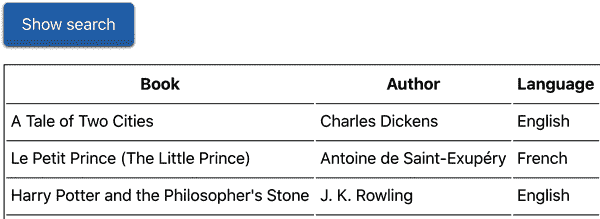

###### 图 3-10\. 搜索按钮

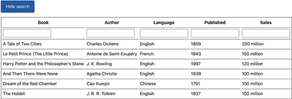

###### 图 3-11\. 搜索/筛选输入行

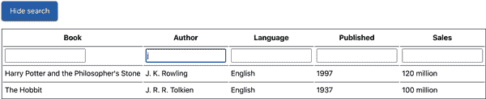

###### 图 3-12\. 搜索结果

## 状态和用户界面

首先要做的是更新构造函数：

+   向`this.state`对象添加一个`search`属性，以跟踪搜索功能的开关状态

+   绑定了两个新方法：`this.toggleSearch()`用于打开和关闭搜索框，以及`this.search()`用于实际执行搜索。

+   设置一个新的类属性`this.preSearchData`

+   使用连续的 ID 更新传入的初始数据，以帮助标识编辑已过滤数据内容的行

```
constructor(props) {
  super();
  const data = clone(props.initialData).map((row, idx) => {
    row.push(idx);
    return row;
  });
  this.state = {
    data,
    sortby: null,
    descending: false,
    edit: null, // {row: index, column: index}
    search: false,
  };

  this.preSearchData = null;

  this.sort = this.sort.bind(this);
  this.showEditor = this.showEditor.bind(this);
  this.save = this.save.bind(this);
  this.toggleSearch = this.toggleSearch.bind(this);
  this.search = this.search.bind(this);
}
```

克隆和更新`initialData`通过添加一种*记录 ID*，改变了状态中使用的数据。当编辑已经过滤的数据时，这将非常方便。您使用`map()`函数映射数据，添加了一个额外的列，即整数 ID。

```
const data = clone(props.initialData).map((row, idx) =>
  row.concat(idx),
);
```

因此，`this.state.data`现在看起来如下：

```
  [
    'A Tale of Two Cities', ..., 0
  ],
  [
    'Le Petit Prince (The Little Prince)', ..., 1
  ],
  // ...
```

此更改还需要更改`render()`方法，即使用此记录 ID 来标识行，无论是查看所有数据还是查看其过滤子集（作为搜索结果）：

```
{this.state.data.map((row, rowidx) => {
  // the last piece of data in a row is the ID
  const recordId = row[row.length - 1];
  return (
    <tr key={recordId} data-row={recordId}>
      {row.map((cell, columnidx) => {
        if (columnidx === this.props.headers.length) {
          // do not show the record ID in the table UI
          return;
        }
        const edit = this.state.edit;
        if (
          edit &&
          edit.row === recordId &&
          edit.column === columnidx
        ) {
          cell = (
            <form onSubmit={this.save}>
              <input type="text" defaultValue={cell} />
            </form>
          );
        }
        return <td key={columnidx}>{cell}</td>;
      })}
    </tr>
  );
})}
```

接下来是用搜索按钮更新 UI。在此之前，根元素是`<table>`，现在我们使用一个`<div>`来包含搜索按钮和相同的表格。

```
<div>
  <button className="toolbar" onClick={this.toggleSearch}>
    {this.state.search ? 'Hide search' : 'Show search'}
  </button>
  <table>
    {/* ... */}
  </table>
</div>
```

正如您所见，搜索按钮的标签是动态的，以反映搜索功能的开启或关闭（`this.state.search`为`true`或`false`）。

接下来是搜索框的行。您可以将其添加到越来越大的 JSX 块中，或者可以直接组合并添加到常量中，然后包含在主 JSX 中。我们选择第二种方法。如果搜索功能关闭，则不需要渲染任何内容，因此`searchRow`只是`null`。否则，将创建一个新的表格行，其中每个单元格都是一个输入元素。

```
const searchRow = !this.state.search ? null : (
  <tr onChange={this.search}>
    {this.props.headers.map((_, idx) => (
      <td key={idx}>
        <input type="text" data-idx={idx} />
      </td>
    ))}
  </tr>
);
```

###### 注意

使用`(_, idx)`是一个约定的示例，其中回调中未使用的变量用下划线`_`命名，以向代码读者表明它未被使用。

搜索输入框的行只是在主`data`循环（创建所有表格行和单元格的循环）之前的另一个子节点。在那里包括`searchRow`：

```
<tbody onDoubleClick={this.showEditor}>
  {searchRow}
  {this.state.data.map((row, rowidx) => (....
```

到此为止，UI 更新就完成了。现在让我们来看看功能的核心部分，“业务逻辑”，如果您愿意的话：实际的搜索功能。

## 过滤内容

搜索功能将非常简单：在数据数组上调用`Array.prototype.filter()`方法，并返回一个匹配搜索字符串的过滤后数组。UI 仍然使用`this.state.data`进行渲染，但`this.state.data`已经是其自身的减少版本。

在进行搜索之前，您需要引用数据，以免永久丢失数据。这样用户就可以返回到完整的表格或更改搜索字符串以获取不同的匹配项。我们将这个引用称为`this.preSearchData`。

当用户单击“搜索”按钮时，将调用`toggleSearch()`函数。此函数的任务是打开和关闭搜索功能。它通过以下方式执行其任务：

+   将`this.state.search`设置为相应的`true`或`false`

+   启用搜索时，“记住”当前数据

+   当禁用搜索时，恢复到记住的数据

函数可以编写如下：

```
toggleSearch() {
  if (this.state.search) {
    this.setState({
      data: this.preSearchData,
      search: false,
    });
    this.preSearchData = null;
  } else {
    this.preSearchData = this.state.data;
    this.setState({
      search: true,
    });
  }
}
```

最后要做的是实现`search()`函数，每当搜索行中的内容发生变化时调用该函数，这意味着用户正在输入其中一个输入框。以下是完整的实现方式，随后是一些更多细节：

```
search(e) {
  const needle = e.target.value.toLowerCase();
  if (!needle) {
    this.setState({data: this.preSearchData});
    return;
  }
  const idx = e.target.dataset.idx;
  const searchdata = this.preSearchData.filter((row) => {
    return row[idx].toString().toLowerCase().indexOf(needle) > -1;
  });
  this.setState({data: searchdata});
}
```

从更改事件的目标（即输入框）获取搜索字符串。让我们称之为“needle”，因为我们正在一堆数据中寻找针：

```
const needle = e.target.value.toLowerCase();
```

如果没有搜索字符串（用户删除了他们输入的内容），该函数会获取原始缓存数据，并将此数据作为新的状态：

```
if (!needle) {
  this.setState({data: this.preSearchData});
  return;
}
```

如果存在搜索字符串，则将原始数据进行过滤，并将过滤后的结果设置为数据的新状态：

```
const idx = e.target.dataset.idx;
const searchdata = this.preSearchData.filter((row) => {
  return row[idx].toString().toLowerCase().indexOf(needle) > -1;
});
this.setState({data: searchdata});
```

有了这个功能，搜索功能就完成了。要实现这个功能，您需要做的只是：

+   添加搜索 UI

+   根据请求显示/隐藏新 UI

+   实际的“业务逻辑”：一个简单的数组`filter()`调用

一如既往，您只需关注数据的状态，并让 React 在数据状态更改时进行渲染（以及所有相关的 DOM 工作）。

## 更新`save()`方法

以前只需克隆和更新`state.data`，但现在还有“remembered”`preSearchData`。如果用户正在编辑（甚至在搜索时），现在这两个数据片段都需要更新。这正是添加记录 ID 的全部原因——这样你就可以在过滤状态下找到真正的行。

更新`preSearchData`与之前的`save()`实现方式类似；只需找到行和列。更新状态数据需要额外的步骤，找到正在编辑的行的记录 ID（`this.state.edit.row`）并与之匹配。

```
save(e) {
  e.preventDefault();
  const input = e.target.firstChild;
  const data = clone(this.state.data).map((row) => {
    if (row[row.length - 1] === this.state.edit.row) {
      row[this.state.edit.column] = input.value;
    }
    return row;
  });
  this.logSetState({
    edit: null,
    data,
  });
  if (this.preSearchData) {
    this.preSearchData[this.state.edit.row][this.state.edit.column] =
      input.value;
  }
}
```

在书的存储库中查看*03.10.table-search.html*以获取完整代码。

## 您能改进搜索吗？

这只是一个简单的工作示例以进行说明。您能改进这个功能吗？

尝试在多个框中实现*增量搜索*，过滤已经过滤过的数据。如果用户在语言行中输入“Eng”，然后使用另一个搜索框进行搜索，为什么不仅在前一个搜索的搜索结果中搜索呢？您如何实现这个功能？

# 即时重播

现在您知道了，您的组件关心它们的状态，并让 React 在适当时渲染和重新渲染。这意味着在给定相同数据（状态和属性）的情况下，应用程序看起来完全相同，无论在这特定数据状态之前还是之后发生了什么变化。这为您提供了一个在实际环境中进行优秀调试的机会。

想象有人在使用你的应用程序时遇到了一个 bug —— 他们可以点击一个按钮报告这个 bug，而不需要解释发生了什么。Bug 报告可以直接发送给你`this.state`和`this.props`的副本，你应该能够重新创建确切的应用程序状态并看到视觉结果。

"撤销"功能可能是另一个功能，因为 React 根据相同的 props 和 state 渲染你的应用程序。实际上，"撤销"的实现有点微不足道：你只需回到上一个状态。

让我们进一步发展这个想法，只是为了好玩。让我们记录`Excel`组件中的每个状态变化，然后回放它。看到所有你的操作在你面前回放是很迷人的。变化发生的*时间*并不那么重要，所以让我们以 1 秒的间隔“播放”应用状态变化。

要实现这个功能，你需要添加一个`logSetState()`方法，它首先将新状态记录到`this.log`数组中，然后调用`setState()`。代码中所有调用`setState()`的地方现在都应该改为调用这个新函数。

所有对…

```
this.setState(...);
```

…变成:

```
this.logSetState(...);
```

现在让我们继续构造函数。你需要绑定两个新函数`logSetState()`和`replay()`，声明`this.log`数组，并将初始状态赋给它。

```
constructor(props) {
  // ...

  // log the initial state
  this.log = [clone(this.state)];

  // ...
  this.replay = this.replay.bind(this);
  this.logSetState = this.logSetState.bind(this);
}
```

`logSetState`需要做两件事情：记录新状态然后将其传递给`setState()`。这里有一个示例实现，你可以对状态进行深拷贝然后将其附加到`this.log`：

```
logSetState(newState) {
  // remember the old state in a clone
  this.log.push(clone(newState));
  // now set it
  this.setState(newState);
}
```

现在所有的状态变化都已经被记录下来，让我们回放它们。为了触发回放，让我们添加一个简单的事件监听器，捕获键盘动作并调用`replay()`函数。像这样的事件监听器应该放在`componentDidMount()`生命周期方法中：

```
componentDidMount() {
  document.addEventListener('keydown', e => {
    if (e.altKey && e.shiftKey && e.keyCode === 82) {
      // ALT+SHIFT+R(eplay)
      this.replay();
    }
  });
}
```

最后，考虑一下`replay()`方法。它使用`setInterval()`，每秒读取一次日志中的下一个对象并将其传递给`setState()`：

```
replay() {
  if (this.log.length === 1) {
    console.warn('No state changes to replay yet');
    return;
  }
  let idx = -1;
  const interval = setInterval(() => {
    if (++idx === this.log.length - 1) {
      // the end
      clearInterval(interval);
    }
    this.setState(this.log[idx]);
  }, 1000);
}
```

通过这样，新功能完成了（*03.11.table-replay.html* 在库中）。尝试一下这个组件，排序、编辑... 然后按下 Alt+Shift+R（或在 Mac 上是 Option-Shift-R）来看看过去是如何展开的。

## 清理事件处理程序

回放功能需要进行一些清理。当这个组件是页面上唯一的活动内容时，清理并不是必需的；在实际应用中，组件更频繁地被添加和移除。当从 DOM 中移除时，“良好的公民”组件应该在自己之后进行清理。在上面的例子中，有两个需要清理的地方：`keydown`事件监听器和回放间隔的回调。

如果你不清理 `keydown` 事件监听器函数，它将在组件消失后仍然留在内存中。而且因为它使用了 `this`，整个 `Excel` 实例需要保留在内存中。这实际上是一种内存泄漏。如果出现太多这样的情况，用户可能会耗尽内存，你的应用程序可能会崩溃浏览器标签页。至于间隔，回调函数将在组件消失后继续执行，并引起另一个内存泄漏。回调还会尝试在不存在的组件上调用 `setState()`（React 会通过警告优雅地处理这种情况）。

你可以在重放仍在进行时从 DOM 中移除组件来测试后一种行为。要从 DOM 中移除组件，你可以简单地替换它（例如，在控制台中运行 第一章 的“Hello world”）：

```
ReactDOM.render(
  React.createElement('h1', null, 'Hello world!'),
  document.getElementById('app'),
);
```

你还可以在间隔回调中向控制台记录时间戳，以查看它是否持续执行。

```
const interval = setInterval(() => {
  // ...
  console.log(Date.now());
  // ...
}, 1000);
```

现在，在重播期间替换组件时，你会看到来自 React 的错误，并且间隔回调的时间戳仍在记录，证明回调仍在运行中（如 图 3-13 所示）。

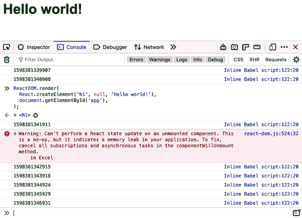

###### 图 3-13\. 内存泄漏实例

同样地，当组件从 DOM 中移除后，你可以通过按下 Alt+Shift+R 键来测试事件监听器的内存泄漏。

## 清理解决方案

处理这些内存泄漏非常简单。你需要保留对你想要清理的处理程序和间隔/超时的引用。然后在 `componentWillUnmount()` 中进行清理。

对于事件处理程序，将其作为类方法而不是内联函数：

```
keydownHandler(e) {
  if (e.altKey && e.shiftKey && e.keyCode === 82) {
    // ALT+SHIFT+R(eplay)
    this.replay();
  }
}
```

然后 `componentDidMount()` 变得更简单：

```
componentDidMount() {
  document.addEventListener('keydown', this.keydownHandler);
}
```

对于间隔重播 ID，将其作为类属性而不是局部变量：

```
this.replayID = setInterval(() => {
  if (++idx === this.log.length - 1) {
    // the end
    clearInterval(this.replayID);
  }
  this.setState(this.log[idx]);
}, 1000);
```

当然，你需要在构造函数中绑定新方法并添加新属性：

```
constructor(props) {
  // ...
  this.replayID = null;

  // ...
  this.keydownHandler = this.keydownHandler.bind(this);
}
```

最后，在`componentWillUnmount()`函数中进行清理：

```
componentWillUnmount() {
  document.removeEventListener('keydown', this.keydownHandler);
  clearInterval(this.replayID);
}
```

现在所有的泄漏问题都已解决（参见书中仓库中的 *03.12.table-replay-clean.html*）。

## 你能改进回放吗？

关于实现撤销/重做功能怎么样？比如，当用户使用 Alt+Z 键盘快捷键时，你可以回退到状态日志中的上一步，在 Alt+Shift+Z 上则前进。

## 另一种实现方式？

是否有其他实现回放/撤销功能的方法，而不需要改变所有你的 `setState()` 调用？也许可以使用适当的生命周期方法（参见 第二章）？你可以自己尝试一下。

# 下载表格数据

在所有排序、编辑和搜索之后，用户终于对表格中数据的状态感到满意。如果他们能够下载这些数据，即他们所有努力的结果，以便以后使用，那将是很好的。

幸运的是，在 React 中没有比这更简单的事情了。你所需要做的就是获取当前的 `this.state.data` 并返回它——例如以 JSON 或逗号分隔值（CSV）的格式。

当用户点击“导出 CSV”后，下载名为 *data.csv* 的文件（请查看浏览器窗口左下角），然后在 Numbers（Mac 上）或 Microsoft Excel（PC 或 Mac 上）中打开，结果见 图 3-14。

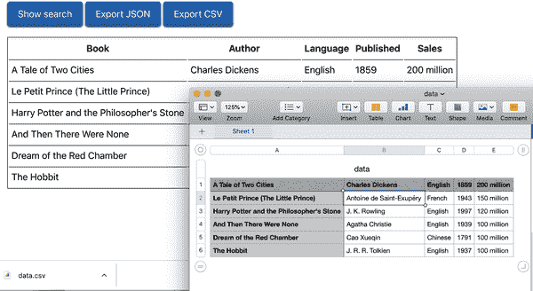

###### 图 3-14\. 通过 CSV 导出表格数据到 Numbers

首先要做的是将新选项添加到工具栏（搜索按钮所在位置）。让我们使用一些 HTML 魔法来强制 `<a>` 链接触发文件下载，因此新的“按钮”必须是通过一些 CSS 伪装为按钮的链接：

```
<div className="toolbar">
  <button onClick={this.toggleSearch}>
    {this.state.search ? 'Hide search' : 'Show search'}
  </button>
  <a href="data.json" onClick={this.downloadJSON}>
    Export JSON
  </a>
  <a href="data.csv" onClick={this.downloadCSV}>
    Export CSV
  </a>
</div>
```

正如你所见，你需要 `downloadJSON()` 和 `downloadCSV()` 方法。这些方法有一些重复逻辑，因此可以通过一个带有 `format` 参数的单一 `download()` 函数来处理。`download()` 方法的签名可能如下所示：

```
download(format, ev) {
  // TODO: implement me
}
```

在构造函数中，你可以像这样绑定该方法两次：

```
this.downloadJSON = this.download.bind(this, 'json');
this.downloadCSV = this.download.bind(this, 'csv');
```

所有的 React 工作都已完成。现在来看 `download()` 函数。导出为 JSON 很简单，但 CSV 需要更多工作。基本上，它只是遍历所有行和每行中的所有单元格，生成一个长字符串。完成后，该函数通过 `download` 属性和 `href` Blob（由 `window.URL` 创建）启动下载：

```
download(format, ev) {
  const data = clone(this.state.data).map(row => {
    row.pop(); // drop the last column, the recordId
    return row;
  });
  const contents =
    format === 'json'
      ? JSON.stringify(data, null, '  ')
      : data.reduce((result, row) => {
          return (
            result +
            row.reduce((rowcontent, cellcontent, idx) => {
              const cell = cellcontent.replace(/"/g, '""');
              const delimiter = idx < row.length - 1 ? ',' : '';
              return `${rowcontent}"${cellcontent}"${delimiter}`;
            }, '') +
            '\n'
          );
        }, '');

  const URL = window.URL || window.webkitURL;
  const blob = new Blob([contents], {type: 'text/' + format});
  ev.target.href = URL.createObjectURL(blob);
  ev.target.download = 'data.' + format;
}
```

完整的代码位于仓库中的 *03.13.table-download.html*。

# 获取数据

在整章中，`Excel` 组件在同一文件中具有对 `data` 的访问权。但是如果数据存在于服务器上并需要获取呢？有多种解决方案，你将在本书的后面部分看到更多，但让我们先尝试其中一个最简单的解决方案——在 `componentDidMount()` 中获取数据。

假设 `Excel` 组件是以空的 `initialData` 属性创建的：

```
ReactDOM.render(
  <Excel headers={headers} initialData={[]} />,
  document.getElementById('app'),
);
```

组件可以优雅地呈现中间状态，让用户知道数据即将到来。在 `render()` 方法中，如果数据不存在，可以根据条件呈现不同的表体：

```
{this.state.data.length === 0 ? (
  <tbody>
    <tr>
      <td colSpan={this.props.headers.length}>
        Loading data...
      </td>
    </tr>
  </tbody>
) : (
  <tbody onDoubleClick={this.showEditor}>
    {/* ... same as before ...*/}
  </tbody>
)}
```

当等待数据时，用户会看到加载指示器（如 图 3-15 所示），在这种情况下是一个简单的文本，当然你也可以使用动画。

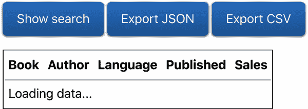

###### 图 3-15\. 等待数据获取

现在让我们获取数据。使用 [Fetch API](https://developer.mozilla.org/zh-CN/docs/Web/API/Fetch_API)，向服务器发出请求，一旦响应到达，使用新数据更新状态。同时，需要负责添加记录 ID，之前由构造函数处理。更新后的 `componentDidMount()` 可以如下所示：

```
componentDidMount() {
  document.addEventListener('keydown', this.keydownHandler);
  fetch('https://www.phpied.com/files/reactbook/table-data.json')
    .then((response) => response.json())
    .then((initialData) => {
      const data = clone(initialData).map((row, idx) => {
        row.push(idx);
        return row;
      });
      this.setState({data});
    });
}
```

完整的代码位于仓库中的 *03.14.table-fetch.html*。
