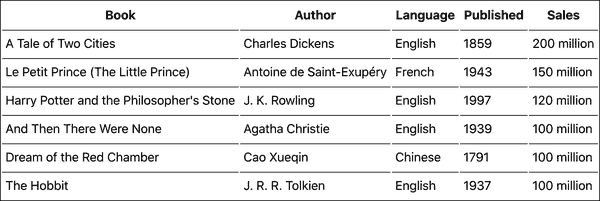
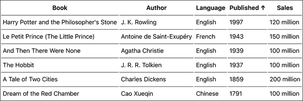
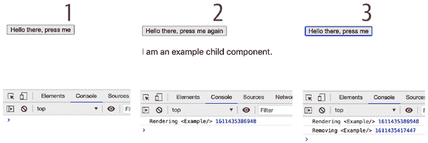
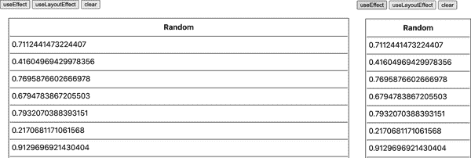
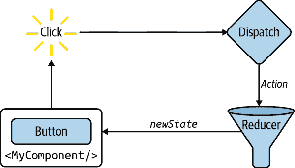
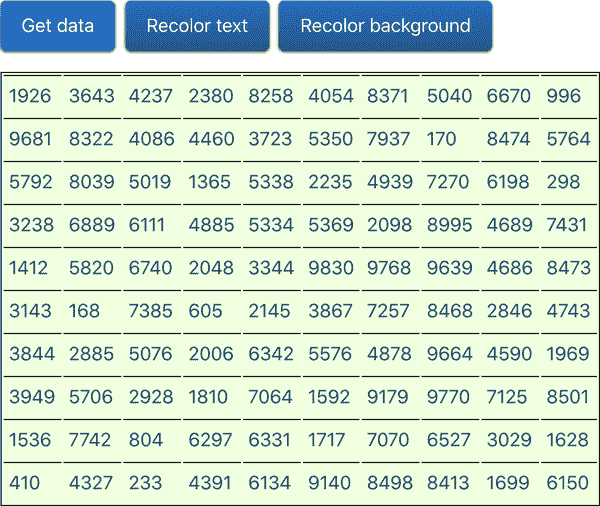

# 第四章：功能性 Excel

记得函数组件吗？在第 2 章的某个时候，当 *state* 出现时，函数组件退出了讨论。现在是时候把它们带回来了。

# 快速复习：函数 vs 类组件

在其最简单的形式下，类组件只需要一个`render()`方法。这是您构建 UI 的地方，可以选择使用`this.props`和`this.state`：

```
class Widget extends React.Component {
  render() {
    let ui;
    // fun with this.props and this.state
    return <div>{ui}</div>;
  }
}
```

在函数组件中，整个组件 *就是* 函数，UI 是函数返回的内容。当组件构建时，props 将传递给函数：

```
function Widget(props) {
    let ui;
    // fun with props but where's the state?
    return <div>{ui}</div>;
}
```

函数组件的实用性在 React v16.8 之后结束了：您只能用它们来创建不维护状态（*stateless*）的组件。但是随着 v16.8 中 hooks 的增加，现在可以在任何地方使用函数组件。在本章的其余部分中，您将看到如何将 第 3 章 的 `Excel` 组件实现为函数组件。

# 渲染数据

第一步是渲染传递给组件的数据（图 4-1）。使用组件的开发人员不需要知道它是类组件还是函数组件。`initialData` 和 `headers` props 看起来一样。即使是 `propTypes` 定义也是相同的。

```
function Excel(props) {
  // implement me...
}

Excel.propTypes = {
  headers: PropTypes.arrayOf(PropTypes.string),
  initialData: PropTypes.arrayOf(PropTypes.arrayOf(PropTypes.string)),
};

const headers = ['Book', 'Author', 'Language', 'Published', 'Sales'];

const data = [
  [
    'A Tale of Two Cities', 'Charles Dickens', // ...
  ],
  // ...
];

ReactDOM.render(
  <Excel headers={headers} initialData={data} />,
  document.getElementById('app'),
);
```

实现函数组件的主体主要是复制粘贴类组件的 `render()` 方法的主体部分：

```
function Excel({headers, initialData}) {
  return (
    <table>
      <thead>
        <tr>
          {headers.map((title, idx) => (
            <th key={idx}>{title}</th>
          ))}
        </tr>
      </thead>
      <tbody>
        {initialData.map((row, idx) => (
          <tr key={idx}>
            {row.map((cell, idx) => (
              <td key={idx}>{cell}</td>
            ))}
          </tr>
        ))}
      </tbody>
    </table>
  );
}
```

在上面的代码中，您可以看到，可以使用解构语法`function Excel({headers, initialData}){}`代替`function Excel(props){}`，以节省稍后使用`props.headers`和`props.initialData`的输入。



###### 图 4-1\. 在函数组件中渲染表格（见*04.01.fn.table.html*）

# 状态钩子

要在函数组件中维护 *state*，您需要 *hooks*。什么是 hook？它是一个以`use*`开头的函数，允许您使用各种 React 功能，如管理状态和组件生命周期的工具。您还可以创建自己的 hooks。本章结束时，您将学习如何使用几个内置 hooks 并编写自己的 hooks。

让我们从状态钩子开始。它是一个名为`useState()`的函数，作为`React`对象的属性提供（`React.useState()`）。它接受一个值，即状态变量（要管理的数据片段）的初始值，并返回包含两个元素（元组）的数组。第一个元素是状态变量，第二个是用于修改此变量的函数。让我们看一个例子。

在类组件中，在 `constructor()` 中定义初始值的方法如下：

```
this.state = {
  data: initialData;
};
```

稍后，当您想要更改`data`状态时，可以改为执行以下操作：

```
this.setState({
  data: newData,
});
```

在函数组件中，您既定义初始状态，又获得更新器函数：

```
const [data, setData] = React.useState(initialData);
```

###### 注意

注意数组解构语法，其中您将`useState()`返回的数组的两个元素分配给两个变量：`data`和`setData`。这是获取两个返回值的更短更干净的方法，与之相反：

```
const stateArray = React.useState(initialData);
const data = stateArray[0];
const setData = stateArray[1];
```

对于渲染，您现在可以使用变量`data`。当您想要更新此变量时，请使用：

```
setData(newData);
```

重写使用状态钩子的组件现在可以看起来像这样：

```
function Excel({headers, initialData}) {
  const [data, setData] = React.useState(initialData);

  return (
    <table>
      <thead>
        <tr>
          {headers.map((title, idx) => (
            <th key={idx}>{title}</th>
          ))}
        </tr>
      </thead>
      <tbody>
        {data.map((row, idx) => (
          <tr key={idx}>
            {row.map((cell, idx) => (
              <td key={idx}>{cell}</td>
            ))}
          </tr>
        ))}
      </tbody>
    </table>
  );
}
```

即使这个示例（见*04.02.fn.table-state.html*）没有使用`setData()`，您仍然可以看到它如何使用`data`状态。让我们继续排序表格，这时您将需要改变状态的手段。

# 对表进行排序

在类组件中，所有各种状态的碎片都放在`this.state`对象中，这是一个通常包含不相关信息片段的大杂烩。使用状态钩子，您仍然可以做同样的事情，但也可以决定将状态片段保留在不同的变量中。当涉及到对表格进行排序时，表中包含的`data`是一个信息片段，而辅助的特定于排序的信息是另一个信息片段。换句话说，您可以使用状态钩子任意次数。

```
function Excel({headers, initialData}) {
  const [data, setData] = React.useState(initialData);
  const [sorting, setSorting] = React.useState({
    column: null,
    descending: false,
  });

  // ....
}
```

`data`是您在表格中显示的内容；`sorting`对象是一个独立的问题。它涉及如何排序（升序或降序）以及按哪一列（标题、作者等）。

现在排序的函数内联在`Excel`函数内部：

```
function Excel({headers, initialData}) {

  // ..

  function sort(e) {
    // implement me
  }

  return (
    <table>
      {/* ... */}
    </table>
  );
}
```

`sort()`函数确定按哪列（使用其索引）排序以及排序是否降序：

```
const column = e.target.cellIndex;
const descending = sorting.column === column && !sorting.descending;
```

然后，它克隆`data`数组，因为直接修改状态仍然是个坏主意：

```
const dataCopy = clone(data);
```

###### 注意

提醒一下，`clone()`函数仍然是深度复制的快速脏 JSON 编码/解码方式：

```
function clone(o) {
  return JSON.parse(JSON.stringify(o));
}
```

实际排序与以前相同：

```
dataCopy.sort((a, b) => {
  if (a[column] === b[column]) {
    return 0;
  }
  return descending
    ? a[column] < b[column]
      ? 1
      : -1
    : a[column] > b[column]
      ? 1
      : -1;
});
```

最后，`sort()`函数需要用新值更新这两个状态片段：

```
setData(dataCopy);
setSorting({column, descending});
```

至于排序的事务，就是这样。剩下的只是更新 UI（`Excel()`函数的返回值），以反映用于排序的列，并处理标题的任何点击：

```
<thead onClick={sort}>
  <tr>
    {headers.map((title, idx) => {
      if (sorting.column === idx) {
        title += sorting.descending ? ' \u2191' : ' \u2193';
      }
      return <th key={idx}>{title}</th>;
    })}
  </tr>
</thead>
```

您可以在图 4-2 中看到带有排序箭头的结果。

您可能已经注意到，使用状态钩子的另一个好处是，不需要像在类组件的构造函数中那样绑定任何回调函数。没有`this`，没有`constructor()`。一个函数就足以定义一个组件。



###### 图 4-2\. 数据排序（见*04.03.fn.table-sort.html*）

# 编辑数据

正如您从第三章记得的那样，编辑功能包括以下步骤：

1.  您双击表格单元格，它会变成文本输入表单。

1.  您在文本输入表单中输入文字。

1.  完成后，按 Enter 提交表单。

为了跟踪此过程，请添加一个`edit`状态对象。当没有编辑时为`null`；否则，它存储正在编辑的单元格的行和列索引。

```
const [edit, setEdit] = useState(null);
```

在 UI 中，你需要处理双击事件 (`onDoubleClick={showEditor}`)，如果用户正在编辑，则显示表单；否则，只显示数据。当用户按下 Enter 键时，你会捕获提交事件 (`onSubmit={save}`)。

```
<tbody onDoubleClick={showEditor}>
  {data.map((row, rowidx) => (
    <tr key={rowidx} data-row={rowidx}>
      {row.map((cell, columnidx) => {
        if (
          edit &&
          edit.row === rowidx &&
          edit.column === columnidx
        ) {
          cell = (
            <form onSubmit={save}>
              <input type="text" defaultValue={cell} />
            </form>
          );
        }
        return <td key={columnidx}>{cell}</td>;
      })}
    </tr>
  ))}
</tbody>
```

还有两个短函数需要实现：`showEditor()` 和 `save()`。

`showEditor()` 在双击表格主体的单元格时被调用。在这里，你通过 `setEdit()` 更新 `edit` 状态，并提供行和列索引，以便渲染知道要用表单替换哪些单元格。

```
function showEditor(e) {
  setEdit({
    row: parseInt(e.target.parentNode.dataset.row, 10),
    column: e.target.cellIndex,
  });
}
```

`save()` 函数捕获表单提交事件，阻止提交，并更新 `data` 状态为正在编辑的单元格中的新值。它还调用 `setEdit()` 并传递 `null` 作为新的编辑状态，表示编辑完成。

```
function save(e) {
  e.preventDefault();
  const input = e.target.firstChild;
  const dataCopy = clone(data);
  dataCopy[edit.row][edit.column] = input.value;
  setEdit(null);
  setData(dataCopy);
}
```

有了这些，编辑功能就完成了。请参考书的仓库中的 *04.04.fn.table-edit.html* 获取完整的代码。

# 搜索

数据的搜索/过滤在 React 和 hooks 中没有新挑战。你可以尝试自己实现，并在书的仓库中的 *04.05.fn.table-search.html* 中参考实现。

你需要两个新的状态变量：

+   布尔值 `search` 用于表示用户是在过滤还是仅查看数据。

+   将 `data` 的拷贝作为 `preSearchData`，因为现在 `data` 成为了所有数据的过滤子集。

```
const [search, setSearch] = useState(false);
const [preSearchData, setPreSearchData] = useState(null);
```

你需要确保及时更新 `preSearchData`，因为 `data`（过滤后的子集）可能在用户编辑时也会更新。作为复习，请参考 第三章。

我们接着实现回放功能，这提供了一个机会去熟悉两个新概念：

+   使用生命周期 hooks

+   自编写 hooks

# 在 Hooks 的世界中的生命周期

第三章 中的回放功能使用了 `Excel` 类的两个生命周期方法：`componentDidMount()` 和 `componentWillUnmount()`。

## 生命周期方法的问题

如果你重新查看 *03.14.table-fetch.html* 的例子，你可能会注意到每个例子有两个不相关的任务：

```
componentDidMount() {
  document.addEventListener('keydown', this.keydownHandler);
  fetch('https://www...')
    .then(/*...*/)
    .then((initialData) => {
      /*...*/
      this.setState({data});
    });
}

componentWillUnmount() {
  document.removeEventListener('keydown', this.keydownHandler);
  clearInterval(this.replayID);
}
```

在 `componentDidMount()` 中，你设置了一个 `keydown` 监听器来启动回放，并从服务器获取数据。在 `componentWillUnmount()` 中，你移除了 `keydown` 监听器，并清除了一个 `setInterval()` 的 ID。这展示了在类组件中使用生命周期方法时遇到的两个问题（这些问题在使用 hooks 时得到解决）：

不相关的任务被一起实现了。

例如，在一个地方进行数据获取和设置事件监听器。这导致生命周期方法变得很长，同时执行着不相关的任务。在简单的组件中，这没问题，但在更大的组件中，你需要依靠代码注释或将代码片段移动到不同的函数中，以便分割不相关的任务，使代码更易读。

相关的任务分散开来。

例如，考虑添加和移除相同的事件侦听器。随着生命周期方法的增长，当您以后阅读代码时，很难一眼看到相同关注点的不同部分，因为它们根本不适合在同一屏幕中。

## useEffect()

替代上述两个生命周期方法的内置钩子是 `React.use​Ef⁠fect()`。

###### 注意

单词 “effect” 代表 “副作用”，意思是与主任务无关的工作类型，但在大致相同的时间内发生。任何 React 组件的主要任务是根据状态和属性渲染某些内容。但是在同一函数中（在同一功能中）与几个副作业（例如从服务器获取数据或设置事件侦听器）同时进行渲染可能是必要的。

例如，在 `Excel` 组件中，设置 `keydown` 处理程序是渲染表格数据主要任务的副作用。

钩子 `useEffect()` 接受两个参数：

+   React 在适当的时间调用的回调函数

+   一个可选的 *依赖项* 数组

依赖项列表包含在回调函数被调用之前将被检查的变量，并决定是否应该调用回调函数。

+   如果依赖变量的值未更改，则无需调用回调函数。

+   如果依赖项列表是空数组，则回调函数只会被调用一次，类似于 `componentDidMount()`。

+   如果省略依赖项，则回调函数在每次重新渲染时都会被调用。

```
useEffect(() => {
  // logs only if `data` or `headers` have changed
  console.log(Date.now());
}, [data, headers]);

useEffect(() => {
  // logs once, after initial render, like `componentDidMount()`
  console.log(Date.now());
}, []);

useEffect(() => {
  // called on every re-render
  console.log(Date.now());
}, /* no dependencies here */);
```

## 清理副作用

现在您知道如何使用钩子来完成类组件中 `componentDidMount()` 提供的功能。但是如何处理类似 `componentWill​Un⁠mount()` 的等效操作呢？为此，您可以使用传递给 `useEffect()` 的回调函数的返回值：

```
useEffect(() => {
  // logs once, after initial render, like `componentDidMount()`
  console.log(Date.now());
  return () => {
    // log when the component will be removed form the DOM
    // like `componentDidMount()`
    console.log(Date.now());
  };
}, []);
```

让我们看一个更完整的例子（*04.06.useEffect.html* 在存储库中）：

```
function Example() {
  useEffect(() => {
    console.log('Rendering <Example/>', Date.now());
    return () => {
      // log when the component will be removed form the DOM
      // like `componentDidMount()`
      console.log('Removing <Example/>', Date.now());
    };
  }, []);
  return <p>I am an example child component.</p>;
}

function ExampleParent() {
  const [visible, setVisible] = useState(false);
  return (
    <div>
      <button onClick={() => setVisible(!visible)}>
        Hello there, press me {visible ? 'again' : ''}
      </button>
      {visible ? <Example /> : null}
    </div>
  );
}
```

点击按钮一次会渲染一个子组件，再次点击则会将其移除。正如您在 图 4-3 中所见，`useEffect()` 的返回值（一个函数）会在组件从 DOM 中移除时被调用。



###### 图 4-3\. 使用 `useEffect`

请注意，当依赖数组为空时，清理（也称为 *teardown*）函数在组件从 DOM 中移除时被调用。如果依赖数组中有值，则每当依赖值发生变化时都会调用清理函数。

## 无麻烦的生命周期

如果再次考虑设置和清除事件侦听器的用例，可以像这样实现：

```
useEffect(() => {
  function keydownHandler() {
    // do things
  }
  document.addEventListener('keydown', keydownHandler);
  return () => {
    document.removeEventListener('keydown', keydownHandler);
  };
}, []);
```

上述模式解决了以前提到的基于类的生命周期方法的第二个问题——即在组件周围分散相关任务的问题。在这里，您可以看到如何使用钩子允许您在同一个地方拥有处理函数、其设置和其移除。

至于第一个问题（在同一地方处理无关任务），可以通过多个 `useEffect` 调用来解决，每个调用专注于一个特定任务。类似于可以拥有单独的状态而不是一个杂包对象，您也可以拥有单独的 `useEffect` 调用，每个调用专注于一个不同的关注点，而不是需要处理所有事情的单个类方法：

```
function Example() {
  const [data, setData] = useState(null);

  useEffect(() => {
    // fetch() and then call setData()
  });

  useEffect(() => {
    // event handlers
  });

  return <div>{data}</div>;
}
```

## `useLayoutEffect()`

总结 `useEffect()` 的讨论，让我们再考虑另一个名为 `useLayoutEffect()` 的内置钩子。

###### 注意

只有少数几个内置钩子，所以不必担心要记住一长串新的 API。

`useLayoutEffect()` 的工作原理类似于 `useEffect()`，唯一的区别在于它在 React 完成渲染所有 DOM 节点之前调用。一般情况下，除非需要测量页面上的某些内容（比如渲染组件的尺寸或更新后的滚动位置），然后根据这些信息重新渲染，否则应该使用 `useEffect()`。当这些都不需要时，`useEffect()` 更好，因为它是异步的，并且也告诉代码阅读者 DOM 变化对组件不重要。

因为 `useLayoutEffect()` 被更早调用，您可以重新计算和重新渲染，用户只会看到最后一次渲染。否则，他们会先看到初始渲染，然后是第二次渲染。根据布局的复杂程度，用户可能会在两次渲染之间感受到闪烁效果。

下一个示例（repo 中的 *04.07.useLayoutEffect.html*）渲染了一个具有随机单元格宽度的长表格（只是为了使浏览器更难处理）。然后，在效果钩子中设置表格的宽度。

```
function Example({layout}) {
  if (layout === null) {
    return null;
  }

  if (layout) {
    useLayoutEffect(() => {
      const table = document.getElementsByTagName('table')[0];
      console.log(table.offsetWidth);
      table.width = '250px';
    }, []);
  } else {
    useEffect(() => {
      const table = document.getElementsByTagName('table')[0];
      console.log(table.offsetWidth);
      table.width = '250px';
    }, []);
  }

  return (
    <table>
      <thead>
        <tr>
          <th>Random</th>
        </tr>
      </thead>
      <tbody>
        {Array.from(Array(10000)).map((_, idx) => (
          <tr key={idx}>
            <td width={Math.random() * 800}>{Math.random()}</td>
          </tr>
        ))}
      </tbody>
    </table>
  );
}

function ExampleParent() {
  const [layout, setLayout] = useState(null);
  return (
    <div>
      <button onClick={() => setLayout(false)}>useEffect</button>{' '}
      <button onClick={() => setLayout(true)}>useLayoutEffect</button>{' '}
      <button onClick={() => setLayout(null)}>clear</button>
      <Example layout={layout} />
    </div>
  );
}
```

根据是否触发 `useEffect()` 或 `useLayoutEffect()` 路径，当表格从随机值（大约 600 像素）调整为硬编码的 250 像素时，可能会看到闪烁效果（见图 4-4）。



###### 图 4-4\. 闪烁重新渲染的示意图

注意，无论哪种情况，您都可以获取表格的几何信息（例如 `table.offsetWidth`），因此如果仅出于信息目的需要此信息并且不打算重新渲染，则使用异步的 `useEffect()` 会更好。`useLayoutEffect()` 应该保留用于避免闪烁，例如在需要基于测量的内容执行（重新渲染）时，例如根据所指向的元素大小定位一个花哨工具提示组件。

# 自定义钩子

让我们回到 `Excel`，看看如何实现回放功能。对于类组件，需要创建 `logSetState()` 并将所有 `this.setState()` 调用替换为 `this.logSetState()`。对于函数组件，可以将所有 `useState()` 钩子调用替换为 `useLoggedState()`。这样做更加方便，因为调用次数较少（每个独立的状态位点）且都位于函数顶部。

```
// before
function Excel({headers, initialData}) {
  const [data, setData] = useState(initialData);
  const [edit, setEdit] = useState(null);
  // ... etc
}

// after
function Excel({headers, initialData}) {
  const [data, setData] = useLoggedState(initialData, true);
  const [edit, setEdit] = useLoggedState(null);
  // ... etc
}
```

没有内置的 `useLoggedState()` 钩子，但没关系。你可以创建自己的*自定义钩子*。像内置钩子一样，自定义钩子只是以 `use*()` 开头的函数。这里是一个例子：

```
function useLoggedState(initialValue, isData) {
  // ...
}
```

钩子的签名可以是任何你想要的。在这种情况下，有一个额外的 `isData` 参数。它的目的是帮助区分数据状态与非数据状态。在第三章的类组件示例中，所有状态都是一个单一对象，但这里存在多个状态片段。在回放功能中，主要目标是显示数据变化，然后显示所有辅助信息（排序、降序等）是次要的。由于每秒更新一次回放，逐个观察支持数据变化将不那么有趣；回放将会太慢。因此，我们有一个主要日志（`dataLog` 数组）和一个辅助日志（`auxLog` 数组）。此外，包含一个标志指示状态是因用户交互（自动）还是在回放过程中变化，也是很有用的：

```
let dataLog = [];
let auxLog = [];
let isReplaying = false;
```

自定义钩子的目标不是干预常规状态更新，因此将此责任委托给原始的 `useState`。目标是在回放期间记录状态，并提供一个知道如何在回放期间更新此状态的函数的引用。这个函数看起来像这样：

```
function useLoggedState(initialValue, isData) {
  const [state, setState] = useState(initialValue);

  // fun here...

  return [state, setState];
}
```

上面的代码正在使用默认的 `useState`。但现在你有了一个状态片段的引用和更新它的方法。你需要记录下来。让我们在这里利用 `useEffect()` 钩子的好处：

```
function useLoggedState(initialValue, isData) {
  const [state, setState] = useState(initialValue);

  useEffect(() => {
    // todo
  }, [state]);

  return [state, setState];
}
```

此方法确保仅在 `state` 的值变化时才记录日志。`useLoggedState()` 函数可能在各种重新渲染过程中被多次调用，但除非涉及感兴趣的状态变化，否则可以忽略这些调用。

在 `useEffect()` 的回调函数中：

+   如果用户正在回放，则不执行任何操作。

+   将每个数据状态的变化记录到 `dataLog` 中。

+   将每个支持数据的变化记录到 `auxLog` 中，按关联的数据变化索引。

```
useEffect(() => {
  if (isReplaying) {
    return;
  }
  if (isData) {
    dataLog.push([clone(state), setState]);
  } else {
    const idx = dataLog.length - 1;
    if (!auxLog[idx]) {
      auxLog[idx] = [];
    }
    auxLog[idx].push([state, setState]);
  }
}, [state]);
```

为什么存在自定义钩子？它们帮助你隔离并整洁打包在组件中使用的逻辑片段，通常在组件之间共享。上面的自定义 `useLoggedState()` 可以嵌入到任何可以从记录其状态中受益的组件中。此外，自定义钩子可以调用其他钩子，而常规（非钩子和非组件）函数无法做到这一点。

# 总结回放

现在你有了一个能够记录各种状态变化的自定义钩子，是时候接入回放功能了。

`replay()` 函数在 React 讨论中并不是一个激动人心的部分，但它设置了一个间隔 ID。当 `Excel` 在回放过程中从 DOM 中移除时，你需要这个 ID 来清理间隔。在回放过程中，数据变化每秒钟重播一次，而辅助信息则一起刷新：

```
function replay() {
  isReplaying = true;
  let idx = 0;
  replayID = setInterval(() => {
    const [data, fn] = dataLog[idx];
    fn(data);
    auxLog[idx] &&
      auxLog[idx].forEach((log) => {
        const [data, fn] = log;
        fn(data);
      });
    idx++;
    if (idx > dataLog.length - 1) {
      isReplaying = false;
      clearInterval(replayID);
      return;
    }
  }, 1000);
}
```

最后一点是设置一个效果挂钩。在`Excel`渲染后，挂钩负责设置监听器，监视特定组合的键来开始回放展示。这也是在组件销毁后进行清理的地方。

```
useEffect(() => {
  function keydownHandler(e) {
    if (e.altKey && e.shiftKey && e.keyCode === 82) {
      // ALT+SHIFT+R(eplay)
      replay();
    }
  }
  document.addEventListener('keydown', keydownHandler);
  return () => {
    document.removeEventListener('keydown', keydownHandler);
    clearInterval(replayID);
    dataLog = [];
    auxLog = [];
  };
}, []);
```

要查看完整的代码，请访问书籍存储库中的*04.08.fn.table-replay.html*。

# useReducer

让我们用一个名为`useReducer()`的内置钩子结束本章。使用减速器是替代`useState()`的一种选择。不同部分的组件调用变更状态的方式，可以在单个位置处理所有更改。

减速器只是一个 JavaScript 函数，接受两个输入——旧状态和动作——并返回新状态。将动作视为应用程序中发生的事件，例如点击、数据获取或超时。某些变量（新状态、旧状态、动作）可以是任何类型，尽管它们通常是对象。

## 减速器函数

减速器函数在其最简单形式如下所示：

```
function myReducer(oldState, action) {
  const newState = {};
  // do something with `oldState` and `action`
  return newState;
}
```

想象一下，当世界发生某事时，减速器函数负责理清现实。世界是一团`混乱`，然后发生了一个`事件`。应该`makeSense()`的函数调和了混乱和新事件，并将所有复杂性减少为一个良好的状态或`秩序`：

```
function makeSense(mess, event) {
  const order = {};
  // do something with mess and event
  return order;
}
```

另一个类比来自烹饪世界。一些酱料和汤也被称为*还原物*，通过*还原*过程（浓缩，增强风味）产生。初始状态是一锅水，然后各种操作（沸腾，添加成分，搅拌）通过每个动作改变了锅内内容的状态。

## 动作

减速器函数可以采取任何内容（字符串、对象），但常见的实现是具有`event`对象的形式：

+   一个`类型`（例如 DOM 世界中的`click`）

+   可选地，一些`payload`或关于事件的其他信息

然后“调度”动作。调度动作时，React 将使用当前状态和您的新事件（动作）调用适当的减速器函数。

使用`useState`时：

```
const [data, setData] = useState(initialData);
```

可以用减速器替换：

```
const [data, dispatch] = useReducer(myReducer, initialData);
```

`data`仍然以相同方式用于渲染组件。但是当发生某事时，不再进行少量工作后调用`setData()`，而是调用`useReducer()`返回的`dispatch()`函数。从那里，减速器接管并返回新版本的`data`。没有其他函数调用来设置新状态；React 使用新的`data`重新渲染组件。

图 4-5 展示了此过程的图表。



###### 图 4-5\. 组件-调度-动作-减速器流

## 一个示例减速器

让我们看一个快速、独立的使用 reducer 的例子。假设你有一个随机数据表，还有可以刷新数据或将表的背景和前景颜色更改为随机颜色的按钮（如图 4-6 所示）。

最初，没有数据，并且黑白色是默认值：

```
const initialState = {data: [], color: 'black', background: 'white'};
```

reducer 在组件`<RandomData>`的顶部初始化：

```
function RandomData() {
  const [state, dispatch] = useReducer(myReducer, initialState);
  // ...
}
```

在这里，`state`又回到了一个各种状态片段的抓包对象（但情况并非一定如此）。组件的其余部分按常规操作，根据`state`进行渲染，有一个区别。之前你可能会有一个按钮的`onClick`处理程序是一个更新状态的函数，现在所有处理程序只调用`dispatch()`，发送有关事件的信息：

```
return (
  <div>
    <div className="toolbar">
      <button onClick={() => dispatch({type: 'newdata'})}>
        Get data
      </button>{' '}
      <button
        onClick={() => dispatch({type: 'recolor', payload: {what: 'color'}})}>
        Recolor text
      </button>{' '}
      <button
        onClick={
          () => dispatch({type: 'recolor', payload: {what: 'background'}})
      }>
        Recolor background
      </button>
    </div>
    <table style={{color, background}}>
      <tbody>
        {data.map((row, idx) => (
          <tr key={idx}>
            {row.map((cell, idx) => (
              <td key={idx}>{cell}</td>
            ))}
          </tr>
        ))}
      </tbody>
    </table>
  </div>
);
```



###### 图 4-6. `<RandomData/>`组件（*04.09.random-table-reducer.html*）

每个分派的事件/动作对象都有一个`type`属性，因此 reducer 函数可以确定需要执行什么操作。可能会有一个指定事件进一步细节的`payload`，也可能没有。

最后是 reducer。它有许多 if/else 语句（或者如果你喜欢，可以使用 switch 语句），用于检查发送的事件类型。然后根据操作来操作数据，并返回状态的新版本：

```
function myReducer(oldState, action) {
  const newState = clone(oldState);

  if (action.type === 'recolor') {
    newState[action.payload.what] =
      `rgb(${rand(256)},${rand(256)},${rand(256)})`;
  } else if (action.type === 'newdata') {
    const data = [];
    for (let i = 0; i < 10; i++) {
      data[i] = [];
      for (let j = 0; j < 10; j++) {
        data[i][j] = rand(10000);
      }
    }
    newState.data = data;
  }
  return newState;
}

// couple of helpers
function clone(o) {
  return JSON.parse(JSON.stringify(o));
}
function rand(max) {
  return Math.floor(Math.random() * max);
}
```

注意如何使用你已经知道的快速脏克隆`clone()`来克隆旧状态。在使用`useState()/setState()`时，在许多情况下这并不是严格必要的。你通常可以通过修改现有变量并将其传递给`setState()`来解决问题。但是在这里，如果你不克隆，仅修改内存中的同一对象，React 将看到旧状态和新状态指向同一个对象，并将跳过渲染，认为什么也没变。你可以自己试试：删除对`clone()`的调用，观察到重新渲染未发生。

## 单元测试 Reducers

切换到`useReducer()`来进行状态管理，可以更轻松地编写单元测试。你不需要设置组件及其属性和状态。你不需要涉及浏览器或找到另一种模拟点击事件的方式。你甚至不需要完全依赖 React。要测试状态逻辑，你只需将旧状态和一个动作传递给 reducer 函数，并检查是否返回了期望的新状态。这是纯 JavaScript：输入两个对象，输出一个对象。单元测试不应比测试典型示例更复杂：

```
function add(a, b) {
  return a + b;
}
```

书中稍后会讨论测试的问题，但为了让你尝试一下，一个示例测试可能是这样的：

```
const initialState = {data: [], color: 'black', background: 'white'};

it('produces a 10x10 array', () => {
  const {data} = myReducer(initialState, {type: 'newdata'});
  expect(data.length).toEqual(10);
  expect(data[0].length).toEqual(10);
});
```

# 带有 Reducer 的 Excel 组件

最后一个使用 reducer 的例子，让我们看看如何在`Excel`组件中从`useState()`切换到`useReducer()`。

在上一节的示例中，由 reducer 管理的状态再次是一组不相关的数据对象。不必这样做。您可以有多个 reducer 来分离您的关注点。甚至可以混合和匹配`useState()`和`useReducer()`。让我们尝试用`Excel`。

以前表格中的`data`由`useState()`管理：

```
const [data, setData] = useState(initialData);
// ...
const [edit, setEdit] = useState(null);
const [search, setSearch] = useState(false);
```

切换到使用`useReducer()`管理`data`，同时保持其余部分不变如下所示：

```
const [data, dispatch] = useReducer(reducer, initialData);
// ...
const [edit, setEdit] = useState(null);
const [search, setSearch] = useState(false);
```

由于`data`相同，渲染部分无需更改任何内容。只需在操作处理程序中进行更改。例如，使用`filter()`进行过滤并调用`setData()`：

```
function filter(e) {
  const needle = e.target.value.toLowerCase();
  if (!needle) {
    setData(preSearchData);
    return;
  }
  const idx = e.target.dataset.idx;
  const searchdata = preSearchData.filter((row) => {
    return row[idx].toString().toLowerCase().indexOf(needle) > -1;
  });
  setData(searchdata);
}
```

重写的版本改为分派动作。事件具有“search”类型和一些额外的有效载荷（用户搜索什么以及在哪里？）：

```
function filter(e) {
  const needle = e.target.value;
  const column = e.target.dataset.idx;
  dispatch({
    type: 'search',
    payload: {needle, column},
  });
  setEdit(null);
}
```

另一个例子是切换搜索字段：

```
// before
function toggleSearch() {
  if (search) {
    setData(preSearchData);
    setSearch(false);
    setPreSearchData(null);
  } else {
    setPreSearchData(data);
    setSearch(true);
  }
}

// after
function toggleSearch() {
  if (!search) {
    dispatch({type: 'startSearching'});
  } else {
    dispatch({type: 'doneSearching'});
  }
  setSearch(!search);
}
```

在这里，您可以看到`setSearch()`和`dispatch()`的混合使用来管理状态。`!search`切换是 UI 显示或隐藏输入框的标志，而`dispatch()`用于管理数据。

最后，让我们看看`reducer()`函数。这是现在发生所有数据过滤和操作的地方。它再次是一系列`if`/`else`块，每个块处理不同的操作类型：

```
let originalData = null;

function reducer(data, action) {
  if (action.type === 'sort') {
    const {column, descending} = action.payload;
    return clone(data).sort((a, b) => {
      if (a[column] === b[column]) {
        return 0;
      }
      return descending
        ? a[column] < b[column]
          ? 1
          : -1
        : a[column] > b[column]
          ? 1
          : -1;
    });
  }
  if (action.type === 'save') {
    data[action.payload.edit.row][action.payload.edit.column] =
      action.payload.value;
    return data;
  }
  if (action.type === 'startSearching') {
    originalData = data;
    return originalData;
  }
  if (action.type === 'doneSearching') {
    return originalData;
  }
  if (action.type === 'search') {
    return originalData.filter((row) => {
      return (
        row[action.payload.column]
          .toString()
          .toLowerCase()
          .indexOf(action.payload.needle.toLowerCase()) > -1
      );
    });
  }
}
```
