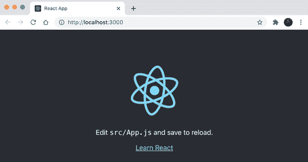
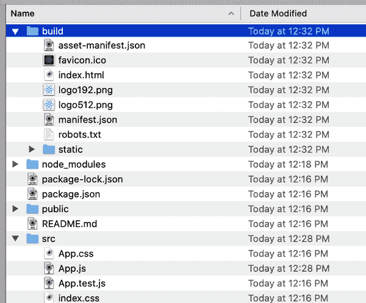
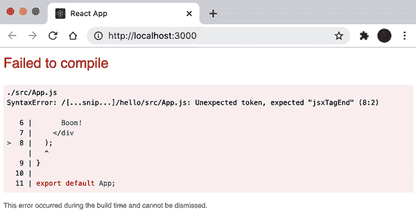

# 第六章：为应用程序开发进行设置

现在您已经了解了 React、JSX 以及类组件和函数组件中的状态管理的许多知识，是时候开始创建和部署一个真实的应用程序了。第七章将开始这个过程，但首先有几个要求需要您处理。

对于任何严肃的开发和部署，除了原型或测试 JSX 外，您需要设置一个构建过程。目标是使用 JSX 和其他现代 JavaScript，而不必等待浏览器实现它们。您需要设置一个后台运行的转换过程，以便在开发时运行。转换过程应该生成尽可能接近最终用户在实时网站上运行的代码（意味着不再进行客户端转换）。此过程还应尽可能不显眼，以便您无需在开发和构建环境之间切换。

JavaScript 社区和生态系统在开发和构建过程中提供了丰富的选择。其中一种最简单、最常见的方法是使用 Create React App（CRA）实用程序（它有[很棒的文档](https://create-react-app.dev)），所以让我们选择这个。

# Create React App

CRA 是一组 Node.js 脚本及其依赖项，它们帮助您摆脱设置一切的负担。因此，您首先需要安装 Node.js。

## Node.js

要安装 Node.js，请访问[*https://nodejs.org*](https://nodejs.org)，并获取适合您操作系统的安装程序。按照安装程序的说明操作，就完成了。现在您可以使用命令行 Node 包管理器（`npm`）实用程序提供的服务。

即使您已经安装了 Node.js，确保您拥有最新版本仍然是一个好主意。

要验证，请在您的终端中输入以下内容：

```
$ npm --version
```

如果您没有使用终端（命令提示符）的经验，现在是一个开始的好时机！在 Mac OS X 上，点击 Spotlight 搜索（位于右上角的放大镜图标），输入 **`Terminal`**。在 Windows 上，找到开始菜单（右键单击屏幕左下角的 Windows 图标），选择运行，然后输入 **`powershell`**。

###### 注意

在本书中，您在终端中键入的所有命令都以 `$` 作为提示，以区分它们与普通代码。在终端中输入时，忽略 `$`。

## Hello CRA

您可以安装 CRA 并在将来的项目中使用它。但这意味着偶尔需要更新它。更方便的方法是使用随 Node.js 一起提供的 `npx` 实用程序。它允许您执行（因此称为“x”）Node 包脚本。您可以运行 CRA 脚本一次：它会下载并执行最新版本，设置您的应用程序，然后就消失了。下次需要启动另一个项目时，再次运行它，无需担心更新。

要开始，请创建一个临时目录并执行 CRA：

```
$ mkdir ~/reactbook/test
$ cd ~/reactbook/test
$ npx create-react-app hello
```

给它一两分钟的时间来完成这个过程，您将会看到成功/欢迎消息：

```
Success! Created hello at /[...snip...]/reactbook/hello
Inside that directory, you can run several commands:

  npm start
    Starts the development server.

  npm run build
    Bundles the app into static files for production.

  npm test
    Starts the test runner.

  npm run eject
    Removes this tool and copies build dependencies, configuration files
    and scripts into the app directory. If you do this, you can’t go back!

We suggest that you begin by typing:

  cd hello
  npm start

Happy hacking!
```

正如屏幕上所示，键入：

```
$ cd hello
$ npm start
```

这将打开你的浏览器并指向 *http://localhost:3000/*，在那里你可以看到一个工作的 React 应用程序（如 图 6-1 所示）。



###### 图 6-1\. 一个新的 React 应用

现在你可以打开 *~/reactbook/test/hello/src/App.js* 并做出一个小改变。只要你保存了更改，浏览器就会更新显示新的内容。

## 构建和部署

假设你对更改满意，并准备好将新应用发布到世界上。转到终端/控制台窗口并按下 Ctrl + C。这会终止进程，进一步的更改将不会自动更新到浏览器中。你已准备好了。键入以下内容：

```
$ npm run build
```

这是构建和打包应用程序的过程，准备部署。构建结果位于 */build* 文件夹中（如 图 6-2 所示）。



###### 图 6-2\. React 应用程序的新构建

将此文件夹的内容复制到 web 服务器上——即使是一个简单的共享主机也可以——你就可以宣布这个新应用了。当你想做出改变时，重复这个过程：

```
$ npm start
// work, work, work...
// Ctrl+C
$ npm run build
```

## 犯了错误

当你保存一个文件时，其中有错误（也许你忘记关闭一个 JSX 标签），持续的构建会失败，并且你会在控制台和浏览器中得到错误消息（参见 图 6-3 作为示例）。



###### 图 6-3\. 一个错误

这太棒了！你可以立即获得反馈。引用约翰·C·麦克斯韦尔的话：“早失败，频繁失败，但始终向前失败。”这是生活的智慧之言。

# package.json 和 node_modules

应用程序根目录中的 *package.json* 文件包含应用程序的各种配置（[CRA](https://create-react-app.dev) 有广泛的文档）。其中一个配置部分涉及依赖项，例如 React 和 React-DOM。这些依赖项安装在应用程序根目录中的 *node_modules* 文件夹中。

那里的依赖项是用于开发和构建应用程序，而不是用于部署。如果你与朋友、同事或开源社区分享你的应用程序代码，它们不应包括在内。例如，如果你要在 GitHub 上分享此应用程序，不要包括 *node_modules*。当其他人想要贡献或者你想要为另一个应用程序贡献时，可以在本地安装依赖项。

试一试。删除整个 *node_modules* 文件夹。然后转到应用的根目录并键入：

```
$ npm i
```

`i` 是“install”的意思。这样，*package.json* 中列出的所有依赖项（及其依赖项）都会安装到新创建的 *node_modules* 目录中。

# 浏览代码

让我们浏览一下 CRA 生成的代码，并注意一些关于应用程序入口点（*index.html* 和 *index.js*）以及它如何处理 JavaScript 和 CSS 依赖项的具体信息。

## 索引

在*public/index.html*中，您将找到老式的 HTML 索引页面，这是浏览器渲染的一切的根源。这是定义`<div id="root">`的地方，也是 React 将渲染顶层组件及其所有子组件的地方。

文件*src/index.js*是就 React 而言应用程序的主要入口。请注意顶部部分：

```
import React from 'react';
import ReactDOM from 'react-dom';
import './index.css';
import App from './App';
```

## JavaScript：现代化

到目前为止书中的示例只使用了简单的组件，并确保`React`和`ReactDOM`作为*全局变量*可用。当您转向具有多个组件的更复杂的应用程序时，您需要一个更好的组织计划。随意散布全局变量是危险的（它们往往会导致命名冲突），并且依赖于全局变量始终存在是不可靠的。

你需要*模块*。模块将构成应用程序的不同功能片段分割成小的、可管理的文件。一般来说，每个关注点应有一个单独的模块；模块和关注点具有一对一的关系。一些模块可以是单独的 React 组件；有些可能只是与 React 无关的实用程序，比如一个 reducer、一个自定义 hook 或一个处理日期或货币格式化的库。

一个模块的通用模板是：在顶部声明要求，在底部导出，在中间实现“核心”。换句话说，这三个任务：

1.  需要/导入依赖项

1.  提供一个函数/类/对象形式的 API

1.  导出 API

对于一个 React 组件，模板可能如下所示：

```
import React from 'react';
import MyOtherComponent from './MyOtherComponent';

function MyComponent() {
  return <div>Hello</div>;
}

export default MyComponent;
```

###### 注意

再次，一个可能有帮助的约定是：一个模块只导出一个 React 组件。

您是否注意到了导入 React 与`MyOtherComponent`之间的区别：`from 'react'`和`from './MyOtherComponent'`？后者是一个目录路径——您告诉模块从相对于模块的文件位置拉取依赖项，而前者是从共享位置（*node_modules*）拉取依赖项。

## CSS

在`src/index.js`中，您可以看到 CSS 被视为另一个模块一样处理：

```
import './index.css';
```

*src/index.css*应包含通用样式，例如`body`、`html`等，适用于整个页面。

除了应用程序范围的样式之外，您还需要每个组件的特定样式。根据每个 React 组件只有一个 CSS 文件（和一个 JS 文件）的约定，将*MyComponent.css*中仅与*MyComponent.js*相关的样式放在这里是个好主意，不要有其他内容。另一个好主意可能是在*MyComponent.js*中使用的所有类名前缀都以*MyComponent-*开头。例如：

```
.MyComponent-table {
  border: 1px solid black;
}

.MyComponent-table-heading {
  border: 1px solid black;
}
```

虽然有许多其他编写 CSS 的方法，但让我们保持简单和老派：任何在浏览器中运行而无需任何转译的东西。

# 继续进行

现在你有了一个简单的写作、构建和部署流水线的示例。有了这些经验，现在是时候转向更有趣的话题了：利用现代 JavaScript 提供的许多功能来构建和测试一个真正的应用程序。

此时，你可以删除`hello`应用程序，也可以保留它来进行探索和尝试想法。
