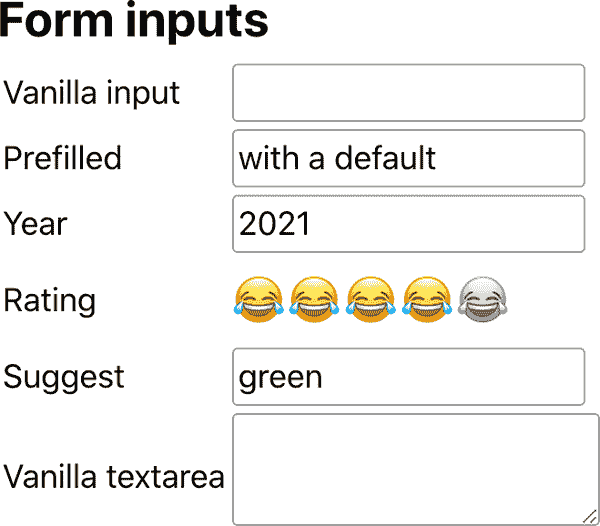

# 第七章：构建应用程序的组件

现在您已经了解了创建自定义 React 组件（以及使用内置组件）、使用 JSX 定义用户界面，以及使用`create-react-app`构建和部署结果的所有基础知识，是时候开始构建更完整的应用程序了。

该应用程序称为“Whinepad”，允许用户记笔记和评价他们尝试的葡萄酒。实际上不一定是葡萄酒；它可以是任何他们想要*抱怨*的东西。它应该完成您对创建、读取、更新和删除（CRUD）应用程序的所有期望。它还应该是一个客户端应用程序，将数据存储在客户端上。目标是学习 React，因此叙述中非 React 部分（例如服务器端存储、CSS 展示）被保持在最低限度。

在构建应用程序时，从小、可重用的组件开始，并将它们组合成整体是一个好主意。这些组件越独立和可重用，越好。本章重点介绍逐个创建组件，下一章将它们组合在一起。

# 设置

首先，初始化并启动新的 CRA 应用程序：

```
$ cd ~/reactbook/
$ npx create-react-app whinepad
$ cd whinepad
$ npm start
```

# 开始编码

仅仅为了验证一切都按预期工作，打开*~/reactbook/whinepad/public/index.html*并将文档标题更改为匹配新应用程序：

```
// before
<title>React App</title>

//after
<title>Whinepad</title>
```

浏览器自动重新加载，您可以看到标题更改（见图 7-1）。


###### 图 7-1。一个新应用程序的开端

现在，为了组织目的，让我们将所有 React 组件及其对应的 CSS 放在一个新目录*whinepad/src/components*内。其他不严格属于组件的代码，例如您可能需要的各种实用程序，可以放在*whinepad/src/modules*内。根目录*src*包含 CRA 生成的所有文件。当然您可以更改它们，但任何新代码都放在这两个新目录`components`或`modules`中：

```
whinepad/
├──  public/
│   ├── index.html
└── src/
    ├── App.css // CRA-generated
    ├── App.js  // CRA-generated
    ├── ...
    └── components/       // all components live here
        │   ├── Excel.js
        │   ├── Excel.css
        │   ├── ...
        │   └──  ...
        └── modules/      // helper JS modules here
            ├── clone.js
            ├── ...
            └── ...
```

# 重构 Excel 组件

让我们开始 Whinepad。这是一个评级应用程序，您可以在其中做笔记。那么，将欢迎屏幕设置为您已经评级的东西的列表，放在一个漂亮的表格中如何？这意味着从第四章重复使用`<Excel>`组件。

让我们从*04.10.fn.table-reducer.html*文件中获取`Excel`的一个版本（正如它在第四章末尾所示），并将其复制到*whinepad/src/components/Excel.js*。

`Excel`现在可以是一个可重用的独立组件，不知道数据来自哪里以及如何将内容插入 HTML 页面中。它只是一个 React 组件，应用程序的构建块之一。您已经知道一个可用的组件有三个工作：

+   导入依赖项。

+   做这项工作。

+   导出组件。

忽略依赖部分一分钟，现在`Excel`看起来是这样的：

```
// dependencies go here

// do the work
function Excel({headers, initialData}) {
  // same as before
}

// export
export default Excel;
```

回到依赖项。之前，在处理纯 HTML 时，`React`是一个全局变量，`PropTypes`也是如此。现在您需要`import`它们：

```
import React from 'react';
import PropTypes from 'prop-types';
```

现在，您可以通过 `React.useState()` 使用状态钩子。但通常使用 *named import* 语法分配一些 React 属性更为方便：

```
import {useState, useReducer} from 'react';
```

现在您可以使用状态钩子，并使用更短的 `useState()`。

最后，让我们将对象克隆助手移到自己的模块中，因为这不是 `Excel` 的职责，将其移动将使在任何后续时间更容易用正确的库替换快速而简单的实现。这意味着从 `Excel` 导入一个新的 `clone` 模块：

```
import clone from '../modules/clone.js';
```

克隆模块的实现位于 *modules/* 目录中，这是为模块设计的位置。换句话说，它是一个没有依赖关系的 JavaScript 文件，名为 *whinepad/src/modules/clone.js*，看起来像这样：

```
function clone(o) {
  return JSON.parse(JSON.stringify(o));
}

export default clone;
```

###### 注意

在导入 JavaScript 文件时，可以省略 *.js* 扩展名。您可以使用：

```
import clone from '../modules/clone';
```

而不是：

```
import clone from '../modules/clone.js';
```

因此，新的 `Excel` 看起来如下所示：

```
import {useState, useReducer} from 'react';
import PropTypes from 'prop-types';
import clone from '../modules/clone';

// do the work
function Excel({headers, initialData}) {
  // same as before
}

// export
export default Excel;
```

# 新应用程序的版本 0.0.1

现在您有了一个独立可重用的组件。因此，让我们使用它。由 CRA 生成的 *App.js* 文件是应用程序的顶级组件，在那里您可以导入 `Excel`。删除 CRA 生成的代码，并用 `Excel` 和一些临时数据替换，您可以得到：

```
import './App.css';
import Excel from './components/Excel';

function App() {
  return (
    <div>
      <Excel
        headers={['Name', 'Year']}
        initialData={[
          ['Charles', '1859'],
          ['Antoine', '1943'],
        ]}
      />
    </div>
  );
}

export default App;
```

通过这种方式，您可以获得一个工作的应用程序，显示在 图 7-2 中。它相当简单，但仍然可以搜索和编辑数据。


###### 图 7-2\. 一个新应用程序诞生了

# CSS

如 第 6 章 中讨论的，让每个组件都有一个 CSS 文件。因此，如果需要的话，*Excel.js* 组件应该配有一个 *Excel.css*。*Excel.js* 中的任何类名都应以 *Excel-* 为前缀。在来自 第 4 章 的当前实现中，元素使用 HTML 选择器进行样式设置（例如 `table th {...}`），但在由可重用元素组成的真实应用程序中，样式应该被限定在组件内部，以防止干扰其他组件。

###### 注意

在样式应用程序方面有许多选择。但是，为了本次讨论的目的，让我们专注于 React 部分。一个简单的 CSS 命名约定就可以搞定。

任何“全局”样式都可以放在 CRA 创建的 *App.css* 中，但这些样式应该限制在一小部分真正通用的样式，例如整个应用程序的字体。 CRA 还生成了一个 *index.css*，但为了避免混淆哪些全局样式放在哪里，请将其删除。

因此，`Excel` 渲染的顶级 `<div>` 变成了：

```
return (
  <div className="Excel">
    {/* everything else */}
  <div>
);
```

现在，您可以通过使用 `Excel` 前缀将样式范围限定为仅适用于此组件：

```
.Excel table {
  width: 100%;
}

.Excel td {
  /* etc. */
}

.Excel th {
  /* etc. */
}
```

# 本地存储

为了尽可能将讨论限制在 React 上，让我们将所有数据保留在浏览器中，不要担心服务器端的部分。但是，不要在应用程序中硬编码数据，而是使用 `localStorage`。如果存储为空，则一个默认值足以向用户提示应用程序的目的。

数据检索可以在顶层的 *App.js* 中完成：

```
const headers = localStorage.getItem('headers');
const data = localStorage.getItem('data');

if (!headers) {
  headers = ['Title', 'Year', 'Rating', 'Comments'];
  data = [['Red whine', '2021', '3', 'meh']];
}
```

让我们也将 “搜索” 按钮从 `Excel` 中删除；它应该成为自己组件的一部分，与 `Excel` 组件分离得更好。

有了这个，你就在通向一个伟大新应用程序的道路上了（见 图 7-3）。


###### 图 7-3\. 一个带有风格的应用程序

# 组件

现在你知道设置已经起作用了，是时候构建组成应用程序的所有组件了。图 7-4 和 7-5 显示了即将构建的应用程序的截图。


###### 图 7-4\. 要构建的 Whinepad 应用程序


###### 图 7-5\. 编辑项目

重新使用现有的 `<Excel>` 组件是开始的一种方式；然而，这个组件做得太多了。通过“分而治之”的方式将其分割成小的可重用组件更好。例如，按钮应该是它们自己的组件，这样它们可以在 `Excel` 表格之外被重复使用。

另外，应用程序还需要一些其他专业组件，如一个显示表情符号而不仅仅是数字的评分小部件，一个对话框组件等等。在开始新组件之前，让我们再添加一个辅助工具——一个组件发现工具。它的目标是：

+   让你在隔离环境中开发和测试组件。通常，在应用程序中使用组件会导致你将组件与应用程序“结合”起来，降低其可重用性。将组件单独存在迫使你做出更好的关于将其与环境解耦的决策。

+   让其他团队成员发现和重复使用现有的组件。随着应用程序的增长，团队也在增长。为了最小化两个人同时工作在非常相似的组件上的风险，并促进组件重用（这导致更快的应用程序开发），将所有组件放在一个地方是个好主意，同时附带它们的使用示例。

有一些可用的工具允许组件发现和测试，但让我们不要引入另一个依赖。相反，让我们采取一种轻量级的自助方法。

## 发现

一个发现工具可以作为一个新组件实现，与应用程序一起存在。

这个任务可以很简单，比如创建一个新组件（*src/components/Discovery.js*），在这里列出所有你的组件。你甚至可以使用不同的 props 渲染相同的组件，以演示组件的各种用法。例如：

```
import Excel from './Excel';
// more imports here...

function Discovery() {
  return (
    <div>
      <h2>Excel</h2>
      <Excel
        headers={['Name', 'Year']}
        initialData={[
          ['Charles', '1859'],
          ['Antoine', '1943'],
        ]}
      />
      {/* more components here */}
    </div>
  );
}

export default Discovery;
```

现在你可以通过在 *App.js* 中使用 URL 作为条件，加载发现组件而不是真正的应用程序：

```
const isDiscovery = window.location.pathname.replace(/\//g, '') === 'discovery';

function App() {
  if (isDiscovery) {
    return <Discovery />;
  }
  return (
    <div>
      <Excel headers={headers} initialData={data} />
    </div>
  );
}
```

现在，如果你加载 *http://localhost:3000/discovery* 而不是 *http://localhost:3000/*，你可以看到你已经添加到 `<Discovery>` 的所有组件。此时只有一个组件，但这个页面很快会变得更多。你的新组件发现工具（见 图 7-6）是开始使用新组件的地方。让我们开始工作，逐个构建它们。


###### 图 7-6\. Whinepad 的组件发现工具

# Logo 和一个 Body

从几个简单的组件开始，你可以验证一切是否正常工作，并因快速进展而感到兴奋。以下是每个应用程序都需要的两个新组件：

## Logo

一个 *components/Logo.js* 并不需要太多。为了展示可能性，让我们使用箭头函数来定义这个组件：

```
import logo from './../images/whinepad-logo.svg';

const Logo = () => {
  return ;
};

export default Logo;
```

你需要的图像文件可以存储在 *src/images/* 中，与 *src/components/* 中找到的组件同级。

## Body

主体也是一个简单的地方，只需呈现传递给它的子元素：

```
import './Body.css';

const Body = ({children}) => {
  return <div className="Body">{children}</div>;
};

export default Body;
```

在 *Body.css* 中，你可以像在 JavaScript 文件中一样引用图片：相对于 CSS 文件所在位置。构建过程会确保提取代码中引用的图片，并将它们打包到 *build/* 目录下（正如你在上一章节中看到的）：

```
.Body {
  background: url('./../images/back.jpg') no-repeat center center fixed;
  background-size: cover;
  padding: 40px;
}
```

## 可发现的

这些确实是非常简单的组件（也许是不必要的，你可能会争论，但应用程序确实会不断增长），它们展示了如何从小拼图开始组装应用程序。既然它们存在，它们应该出现在发现工具中（如 图 7-7 所示）：

```
import Logo from './Logo';
import Header from './Header';
import Body from './Body';

function Discovery() {
  return (
    <div className="Discovery">
      <h2>Logo</h2>
      <div style={{background: '#f6f6f6', display: 'inline-block'}}>
        <Logo />
      </div>

      <h2>Body</h2>
      <Body>I am content inside the body</Body>

      {/* and so on */}

    </div>
  );
}
```


###### 图 7-7\. 开始构建组件库

# `<Button>` 组件

并非言过其实地概括，每个应用都需要一个按钮。它通常是一个样式良好的原生 HTML `<button>`，但有时可能需要是一个 `<a>`，就像在 第三章 中下载按钮所需的那样。新的闪亮 `<Button>` 是否可以接受一个可选的 `href` 属性？如果有，它会在底层渲染一个 `<a>`。

符合测试驱动开发（TDD）精神，你可以从定义 `<Discovery>` 组件的示例使用开始：

```
import Button from './Button';

// ...

<h2>Buttons</h2>
<p>
  Button with onClick:{' '}
  <Button onClick={() => alert('ouch')}>Click me</Button>
</p>
<p>
  A link: <Button href="https://reactjs.org/">Follow me</Button>
</p>
<p>
  Custom class name:{' '}
  <Button className="Discovery-custom-button">I do nothing</Button>
</p>
```

（那我们是不是应该称之为发现驱动开发，或者 DDD？）

## Button.js

让我们完整地看一下 *components/Button.js*：

```
import classNames from 'classnames';
import PropTypes from 'prop-types';
import './Button.css';

const Button = (props) =>
  props.href ? (
    <a {...props} className={classNames('Button', props.className)}>
      {props.children}
    </a>
  ) : (
    <button {...props} className={classNames('Button', props.className)} />
  );

Button.propTypes = {
  href: PropTypes.string,
};

export default Button;
```

这个组件很简短，但有几点需要注意：

+   它使用了 `classnames` 模块（后续会有更多内容）。

+   它使用了函数表达式语法（`const Button = () => {}` 而不是 `function Button() {}`）。在这个上下文中真的没有理由使用这种语法；你可以选择自己喜欢的语法，但知道这种方式是可能的也是好的。

+   它使用展开运算符 `...props` 作为一种方便的方式来表达：无论传递给 `Button` 的属性是什么，都将其传递到底层的 HTML 元素。

## classnames 包

记住这行吗？

```
import classNames from 'classnames';
```

`classnames` 包为处理 CSS 类名提供了一个有用的函数。它可以帮助组件使用自己的类名，同时也灵活到允许通过父组件传递的类名进行自定义。

将这个包引入你的 CRA 设置中需要运行：

```
$ cd ~/reactbook/whinepad
$ npm i classnames
```

注意你的 *package.json* 已经更新了新的依赖。

使用包的唯一函数：

```
const cssclasses = classNames('Button', props.className);
```

这行代码将 `Button` 类名与创建组件时传递的任何（如果有的话）类名合并在一起（参见 图 7-8）。


###### 图 7-8\. 带有自定义类名的`<Button>`

###### 注意

你总是可以自己去做，并连接类名，但是`classnames`是一个小巧的包，更方便地完成这种常见任务。它还允许你有条件地设置类名，这也很方便，例如：

```
<div className={classNames({
  'mine': true, // unconditional
  'highlighted': this.state.active, // dependent on the
                                    // state...
  'hidden': this.props.hide, // ... or properties
})} />
```

# 表单

让我们继续下一个任务，这对于任何数据录入应用程序都是必不可少的：处理表单。作为应用程序开发者，我们很少满足于浏览器内置表单输入的外观和感觉，因此我们倾向于创建我们自己的版本。Whinepad 应用程序当然也不例外。

让我们来看一个通用的`<FormInput>`组件——可以说是一个工厂。根据它的`type`属性，这个组件应该将输入的创建委托给更专门的组件，例如，`<Suggest>`输入、`<Rating>`输入等。

让我们从较低级别的组件开始。

## `<Suggest>`

网页上常见的高级自动建议（也称为类型提醒）输入很复杂，但我们可以简单一点（就像图 7-9 中一样），利用浏览器已经提供的东西——即[`<datalist>`](https://developer.mozilla.org/en-US/docs/Web/HTML/Element/datalist) HTML 元素。

首先要做的事情是——更新发现应用程序：

```
<h2>Suggest</h2>
<p>
  <Suggest options={['eenie', 'meenie', 'miney', 'mo']} />
</p>
```

现在我们去实现组件在*components/Suggest.js*中：

```
import PropTypes from 'prop-types';

function Suggest({id, defaultValue = '', options=[]}) {

  const randomid = Math.random().toString(16).substring(2);
  return (
    <>
      <input
        id={id}
        list={randomid}
        defaultValue={defaultValue}
      />
      <datalist id={randomid}>
        {options.map((item, idx) => (
          <option value={item} key={idx} />
        ))}
      </datalist>
    </>
  );
}

Suggest.propTypes = {
  defaultValue: PropTypes.string,
  options: PropTypes.arrayOf(PropTypes.string),
};

export default Suggest;
```

正如前面的代码所示，这个组件并没有什么特别之处；它只是一个围绕着一个带有`<datalist>`的`<input>`的包装器（通过`randomid`连接）。


###### 图 7-9\. `<Suggest>`输入的示例

从 JavaScript 语法角度来看，这个例子展示了如何使用*解构赋值*来为一个变量赋值多个属性，并同时定义默认值：

```
// before
function Suggest(props) {
  const id = props.id;
  const defaultValue = props.defaultValue || '';
  const options = props.options || [];
  // ...
}

// after
function Suggest({id, defaultValue = '', options=[]}) {}
```

## `<Rating>` 组件

该应用程序是关于记录你尝试的事物。最懒的记笔记方法就是使用星级评分，例如从 1 到 5 的整数标度，5 分为最高/最好评分。

这个高度可重用的组件可以配置为：

+   使用任意数量的“星星”。默认是 5，但为什么不试试 11 呢？

+   保持只读，因为有时你不希望意外点击星星来改变那些重要的评分数据。

在发现工具中测试这个组件（见图 7-10）：

```
<h2>Rating</h2>
<p>
  No initial value: <Rating />
</p>
<p>
  Initial value 4: <Rating defaultValue={4} />
</p>
<p>
  This one goes to 11: <Rating max={11} />
</p>
<p>
  Read-only: <Rating readonly={true} defaultValue={3} />
</p>
```


###### 图 7-10\. 评分小部件

实施的基本要求包括设置属性、它们的类型和默认值，以及要维护的状态：

```
import classNames from 'classnames';
import {useState} from 'react';
import PropTypes from 'prop-types';
import './Rating.css';

function Rating({id, defaultValue = 0, max = 5, readonly = false}) {
  const [rating, setRating] = useState(defaultValue);
  const [tempRating, setTempRating] = useState(defaultValue);

  // TODO the rendering goes here...

}

Rating.propTypes = {
  defaultValue: PropTypes.number,
  readonly: PropTypes.bool,
  max: PropTypes.number,
};

export default Rating;
```

属性是不言自明的：`max`是星星的数量，`readonly`使得小部件只读。状态包含`rating`，即分配的当前星级值，以及`tempRating`，用户在组件周围移动鼠标但尚未点击提交评分时使用的临时值。

接下来是渲染。它有：

+   循环生成星星，从 1 到`props.max`。星星只是表情符号`&#128514;`。当未应用`RatingOn`样式时，星星通过 CSS 滤镜变灰（`filter: grayscale(0.9);`）。

+   作为真正表单输入的隐藏输入，允许以通用方式获取其值（就像任何旧的`<input>`一样）：

```
const stars = [];
for (let i = 1; i <= max; i++) {
  stars.push(
    <span
      className={i <= tempRating ? 'RatingOn' : null}
      key={i}
      onClick={() => (readonly ? null : setRating(i))}
      onMouseOver={() => (readonly ? null : setTempRating(i))}>
      &#128514;
    </span>,
  );
}
return (
  <span
    className={classNames({
      Rating: true,
      RatingReadonly: readonly,
    })}
    onMouseOut={() => setTempRating(rating)}>
    {stars}
    <input id={id} type="hidden" value={rating} />
  </span>
);
```

当用户将鼠标移动到组件上时，`tempRating`状态会更新，从而改变`RatingOn`类名。当用户点击时，真正的`rating`状态也会更新，同时更新隐藏输入。离开组件（鼠标移出时），`tempRating`会被放弃，变成与`rating`相同。

这里还可以看到使用`classNames`函数的条件性 CSS 类名的示例。`Rating`类始终应用，而`RatingReadonly`仅在将`readonly`属性设置为`true`时应用。

这是处理只读和鼠标悬停行为的相关 CSS 的部分：

```
.Rating {cursor: pointer;}
.Rating.RatingReadonly {cursor: auto;}
.Rating span {filter: grayscale(0.9);}
.Rating .RatingOn {filter: grayscale(0);}
```

## 一个 `<FormInput>`“工厂”

接下来是一个通用的`<FormInput>`，根据给定的属性可以生成不同的输入。这将允许您将整个应用程序泛化，从撰写葡萄酒笔记转变为例如通过简单配置管理个人图书馆。稍后详细说明。

在发现应用程序中测试`<FormInput>`（参见图 7-11）：

```
<h2>Form inputs</h2>
<table className="Discovery-pad">
  <tbody>
    <tr>
      <td>Vanilla input</td>
      <td><FormInput /></td>
    </tr>
    <tr>
      <td>Prefilled</td>
      <td><FormInput defaultValue="with a default" /></td>
    </tr>
    <tr>
      <td>Year</td>
      <td><FormInput type="year" /></td>
    </tr>
    <tr>
      <td>Rating</td>
      <td><FormInput type="rating" defaultValue={4} /></td>
    </tr>
    <tr>
      <td>Suggest</td>
      <td>
        <FormInput
          type="suggest"
          options={['red', 'green', 'blue']}
          defaultValue="green"
        />
      </td>
    </tr>
    <tr>
      <td>Vanilla textarea</td>
      <td><FormInput type="textarea" /></td>
    </tr>
  </tbody>
</table>
```



###### 图 7-11\. 表单输入

`<FormInput>`的实现（位于*components/FormInput.js*中）需要常规的导入、导出和`propTypes`用于验证的样板文件：

```
import PropTypes from 'prop-types';
import Rating from './Rating';
import Suggest from './Suggest';

function FormInput({type = 'input', defaultValue = '', options = [], ...rest}) {
  // TODO rendering goes here...
}

FormInput.propTypes = {
  type: PropTypes.oneOf(['textarea', 'input', 'year', 'suggest', 'rating']),
  defaultValue: PropTypes.oneOfType([PropTypes.string, PropTypes.number]),
  options: PropTypes.array,
};

export default FormInput;
```

注意`PropTypes.oneOfType([])`中的属性类型，它允许组件接受默认值为字符串或数字的任一类型。

渲染部分是一个大的`switch`语句，它将个别的输入创建委托给更具体的组件，或者回退到内置的 DOM 元素`<input>`和`<textarea>`：

```
switch (type) {
  case 'year':
    return (
      <input
        {...rest}
        type="number"
        defaultValue={
          (defaultValue && parseInt(defaultValue, 10)) ||
          new Date().getFullYear()
        }
      />
    );
  case 'suggest':
    return (
      <Suggest defaultValue={defaultValue} options={options} {...rest} />
    );
  case 'rating':
    return (
      <Rating
        {...rest}
        defaultValue={defaultValue ? parseInt(defaultValue, 10) : 0}
      />
    );
  case 'textarea':
    return <textarea defaultValue={defaultValue} {...rest} />;
  default:
    return <input defaultValue={defaultValue} type="text" {...rest} />;
}
```

正如您所看到的，这里并没有太多事情；此组件只是一个方便的包装器，允许对表单进行实现无关的定义。

## `<Form>`

现在您有：

+   自定义输入（例如`<Rating>`）

+   内置输入（例如`<textarea>`）

+   `<FormInput>`—一个基于`type`属性制作输入的工厂

是时候在`<Form>`中使它们全部协同工作了（见图 7-12）。


###### 图 7-12\. 表单元素

表单组件应该是可重用的，因此关于葡萄酒评级应该没有任何硬编码的内容。（再进一步说，关于葡萄酒的任何内容也不应该被硬编码，这样应用程序可以被重新用于*抱怨*任何事情。）`<Form>`组件可以通过一个`fields`数组进行配置，其中每个字段由以下内容定义：

`type`

默认是“input”。

`id`

这是为了稍后可以找到输入。

`label`

放置在输入框旁边。

`options`

这些被传递到自动建议输入框。

`<Form>` 还接受默认值映射，并能够渲染为只读，以便用户无法编辑字段。

从样板开始：

```
import {forwardRef} from 'react';
import PropTypes from 'prop-types';
import Rating from './Rating';
import FormInput from './FormInput';
import './Form.css';

const Form = forwardRef(({fields, initialData = {}, readonly = false}, ref) => {
  return (
    <form className="Form" ref={ref}>
      {/* more rendering here */}
    </form>
  );
});

Form.propTypes = {
  fields: PropTypes.objectOf(
    PropTypes.shape({
      label: PropTypes.string.isRequired,
      type: PropTypes.oneOf(['textarea', 'input', 'year', 'suggest', 'rating']),
      options: PropTypes.arrayOf(PropTypes.string),
    }),
  ).isRequired,
  initialData: PropTypes.object,
  readonly: PropTypes.bool,
};

export default Form;
```

在继续之前，让我们回顾一下这段代码中的一些新内容。

### 类型：shape、objectOf、arrayOf

在 prop types 中注意使用 `PropTypes.shape`。它让你能够精确地定义期望的 map/object 结构。这比像 `PropTypes.object` 这样的泛化更加严格，并且可以在其他开发者开始使用你的组件之前捕获更多错误。另外，请注意使用 `PropTypes.objectOf`。它类似于 `arrayOf`，让你定义期望包含特定数据类型的数组。这里的 `objectOf` 意味着组件期望一个 `fields` prop，它是一个对象。对于 `fields` 中的每对键值对，值期望是另一个对象，该对象具有 `label`、`type` 和 `options` 属性，类似于：

```
<Form
  fields={{
    name: {label: 'Rating', type: 'input'},
    comments: {label: 'Comments', type: 'textarea'},
  }}
/>
```

总结一下：`PropTypes.object` 是任何对象，`PropTypes.shape` 是一个具有预定义键名（属性）的对象，`PropTypes.objectOf` 是一个具有未知键名但已知值类型的对象。

### Refs

那个 `ref` 是怎么回事？Ref（引用）允许你从 React 中访问底层 DOM 元素。不建议在可以依赖 React 的地方滥用它。然而，在这种情况下，我们希望允许表单外的代码对表单输入进行通用循环和收集表单数据。还有一点要注意的是链式（或父/子级）关系。例如，我们希望 `<Discovery>` 组件收集表单数据。因此链条看起来像这样：

```
<Discovery>
  <Form>
    <form>
      <FormInput>
        <input />
```

Refs 允许 `Discovery` 以这种方式获取输入的 `value`：

1.  在 `<Discovery>` 中使用钩子 `useRef()` 创建一个 ref 对象。

1.  Ref 被传递给 `<Form>`，后者通过 `forwardRef()` 钩子抓取它。

1.  将这个 ref *转发* 给 HTML/DOM `<form>` 元素。

1.  `<Discovery>` 现在通过 ref 对象的 `.current` 属性访问底层表单 DOM 元素。

下面是在探索工具中使用 `<Form>` 的示例：

```
const form = useRef();
// ...

<Form
  ref={form}
  fields={{
    rateme: {label: 'Rating', type: 'rating'},
    freetext: {label: 'Greetings'},
  }}
  initialData={{rateme: 4, freetext: 'Hello'}}
/>
```

现在你可以添加一个按钮，使用 `form` ref 及其属性 `form.current` 收集表单中的数据。因为 `form.current` 给你访问原生表单 DOM 节点的能力，而原生表单包含一个类似数组的输入集合，这意味着你可以将表单转换为数组（使用 `Array.from()`）并遍历该数组。数组中的每个元素是一个原生 DOM 输入元素，你可以使用它们的 `value` 属性获取输入的值。这也是为什么即使是“高级”表单输入如 `Rating` 也包含（并更新）一个隐藏的输入元素。

```
<Button
  onClick={() => {
    const data = {};
    Array.from(form.current).forEach(
      (input) => (data[input.id] = input.value),
    );
    alert(JSON.stringify(data));
  }}>
  Submit
</Button>
```

点击按钮会显示一个类似 `{"rateme":"4","freetext":"Hello"}` 的 JSON 字符串的消息。

### 封装 <Form>

现在回到 `<Form>` 的渲染部分。它是对 `fields` prop 的循环，并通过将每个字段信息传递给 `<FormInput>`，渲染出初始数据的只读版本或可工作的表单：

```
<form className="Form" ref={ref}>
  {Object.keys(fields).map((id) => {
    const prefilled = initialData[id];
    const {label, type, options} = fields[id];
    if (readonly) {
      if (!prefilled) {
        return null;
      }
      return (
        <div className="FormRow" key={id}>
          <span className="FormLabel">{label}</span>
          {type === 'rating' ? (
            <Rating
              readonly={true}
              defaultValue={parseInt(prefilled, 10)}
            />
          ) : (
            <div>{prefilled}</div>
          )}
        </div>
      );
    }
    return (
      <div className="FormRow" key={id}>
        <label className="FormLabel" htmlFor={id}>
          {label}
        </label>
        <FormInput
          id={id}
          type={type}
          options={options}
          defaultValue={prefilled}
        />
      </div>
    );
  })}
</form>
```

你可以看到这相对简单；唯一的复杂性来自于渲染只读评分小部件而不是简单的数值。

# <操作>

在数据表格中的每一行旁边应该有操作（见图 7-13），您可以对每一行执行：删除、编辑和查看（当所有信息无法适合一行时）。


###### 图 7-13\. 操作

这里是在发现工具中测试`<操作>`组件的情况：

```
<Actions onAction={(type) => alert(type)} />
```

以及整个组件：

```
import PropTypes from 'prop-types';
import './Actions.css';

import deleteImage from './../images/close.svg';
import editImage from './../images/edit.svg';

import Button from './Button';

const Actions = ({onAction = () => {}}) => (
  <span className="Actions">
    <Button
      className="ActionsInfo"
      title="More info"
      onClick={() => onAction('info')}>
      View Details
    </Button>
    <Button
      title="Edit"
      onClick={() => onAction('edit')}>
      
    </Button>
    <Button
      tabIndex="0"
      title="Delete"
      onClick={onAction.bind(null, 'delete')}>
      
    </Button>
  </span>
);

Actions.propTypes = {
  onAction: PropTypes.func,
};

export default Actions;
```

如您所见，操作是作为按钮实现的。该组件以`onAction`属性接受回调函数。当用户点击按钮时，将调用回调函数，传递标识哪个按钮被点击的字符串：`'info'`、`'edit'`或`'delete'`。这是子组件通知其父组件组件内部变化的简单模式。正如您所见，自定义事件（如`onAction`、`onAlienAttack`等）就是这么简单。

下一章将全面讨论 React 应用程序中的数据流，但您已经了解了两种在父组件和子组件之间交换数据的方法：回调属性（如`onAction`）和引用。

# 对话框

接下来，让我们构建一个通用的对话框组件，用于显示任何类型的消息（而不是`alert()`）或弹出窗口（如图 7-14 所示）。例如，所有添加/编辑表单可以显示在数据表格的模态对话框中。


###### 图 7-14\. 对话框

要在`Discovery`组件中测试对话框，只需稍微修改状态以管理它们的打开或关闭：

```
function DialogExample() {
  const [example, setExample] = useState(null);
  return (
    <>
      <p>
        <Button onClick={() => setExample(1)}>Example 1</Button>{' '}
        <Button onClick={() => setExample(2)}>Example 2</Button>
      </p>
      {example === 1 ? (
        <Dialog
          modal
          header="Out-of-the-box example"
          onAction={(type) => {
            alert(type);
            setExample(null);
          }}>
          Hello, dialog!
        </Dialog>
      ) : null}

      {example === 2 ? (
        <Dialog
          header="Not modal, custom dismiss button"
          hasCancel={false}
          confirmLabel="Whatever"
          onAction={(type) => {
            alert(type);
            setExample(null);
          }}>
          Anything goes here, like a <Button>a button</Button> for example
        </Dialog>
      ) : null}
    </>
  );
}
```

对话框的实现并不需要太复杂，但让我们使其变得有趣，并添加一些不错的功能：

+   有一个标题字符串的头部来自`header`属性。

+   有一个仅仅是传递给`<Dialog>`的子元素的主体。

+   底部有*确定*/*取消*按钮：让我们称它们为`confirm`和`dismiss`。有时对话框仅仅是一个信息提示，你只需要一个按钮。属性`hasCancel`可以定义这一点。如果它是`false`，则只显示确定按钮。

+   `confirm`按钮可以通过`confirmLabel`属性更改标签。`dismiss`按钮始终显示“取消”。

+   对话框可以是“模态”的，意味着它占据整个应用程序，直到关闭为止。

+   一个`onAction`属性（类似于`<操作>`组件）可以将用户的操作传递给父组件。

+   用户可以通过按下 Escape 键或点击对话框外部来关闭对话框。这是一个不错且预期的功能，但有时可能不可取。例如，如果在对话框中大量输入，写出了一些你最好的散文，然后突然按下 Escape 键？一切都丢失了！对话框行为的决定应留给使用该组件的开发人员。`Dialog`可以仅在通过`extendedDismiss`属性请求时启用这种*扩展*行为（按下 Escape 或点击外部）。

`import`/`export`/`props`设置可以如下所示：

```
import {useEffect} from 'react';
import PropTypes from 'prop-types';
import Button from './Button';
import './Dialog.css';

function Dialog(props) {
  const {
    header,
    modal = false,
    extendedDismiss = true,
    confirmLabel = 'ok',
    onAction = () => {},
    hasCancel = true,
  } = props;

  // rendering here...

}

Dialog.propTypes = {
  header: PropTypes.string.isRequired,
  modal: PropTypes.bool,
  extendedDismiss: PropTypes.bool,
  confirmLabel: PropTypes.string,
  onAction: PropTypes.func,
  hasCancel: PropTypes.bool,
};

export default Dialog;
```

渲染并不复杂；它是一个条件性的 CSS，当对话框是模态时显示一些条件性按钮：

```
return (
  <div className={modal ? 'Dialog DialogModal' : 'Dialog'}>
    <div className={modal ? 'DialogModalWrap' : null}>
      <div className="DialogHeader">{header}</div>
      <div className="DialogBody">{props.children}</div>
      <div className="DialogFooter">
        {hasCancel ? (
          <Button className="DialogDismiss" onClick={() => onAction('dismiss')}>
            Cancel
          </Button>
        ) : null}
        <Button onClick={() => onAction(hasCancel ? 'confirm' : 'dismiss')}>
          {confirmLabel}
        </Button>
      </div>
    </div>
  </div>
);
```

最后，用户可以通过`Escape`键或点击对话框体外部与其交互的*扩展*功能是在`useEffect()`钩子中实现的。这个钩子将仅在对话框渲染时执行一次，并负责设置（和清理）DOM 事件侦听器。如您已经知道的那样，一般的`useEffect()`模板是：

```
useEffect(() => {
    // setup
    return () => {
      // cleanup
    };
  },
  [] // dependencies
)
```

带有此模板，实现可能如下：

```
useEffect(() => {
  function dismissClick(e) {
    if (e.target.classList.contains('DialogModal')) {
      onAction('dismiss');
    }
  }

  function dismissKey(e) {
    if (e.key === 'Escape') {
      onAction('dismiss');
    }
  }

  if (modal) {
    document.body.classList.add('DialogModalOpen');
    if (extendedDismiss) {
      document.body.addEventListener('click', dismissClick);
      document.addEventListener('keydown', dismissKey);
    }
  }
  return () => {
    document.body.classList.remove('DialogModalOpen');
    document.body.removeEventListener('click', dismissClick);
    document.removeEventListener('keydown', dismissKey);
  };
}, [onAction, modal, extendedDismiss]);
```

这是一些替代想法：

+   与单个`onAction`不同，另一个选项是提供`onConfirm`（用户单击确定）和`onDismiss`。

+   包装的`div`具有条件和非条件类名。组件可能受益于`classnames`模块，如下所示。

之前：

```
<div className={modal ? 'Dialog DialogModal' : 'Dialog'}>
```

之后:

```
<div className={classNames({
    'Dialog': true,
    'DialogModal': modal,
  })}>
```

# 标题

在这一点上，所有最底层的组件都已完成。在着手处理大组件`Excel`之前，让我们添加一个方便的`Header`组件，由标志、搜索框和“添加”按钮组成，用于向数据表格添加新记录：

```
import Logo from './Logo';
import './Header.css';

import Button from './Button';
import FormInput from './FormInput';

function Header({onSearch, onAdd, count = 0}) {
  const placeholder = count > 1 ? `Search ${count} items` : 'Search';
  return (
    <div className="Header">
      <Logo />
      <div>
        <FormInput placeholder={placeholder} id="search" onChange={onSearch} />
      </div>
      <div>
        <Button onClick={onAdd}>
          <b>&#65291;</b> Add whine
        </Button>
      </div>
    </div>
  );
}

export default Header;
```

如您所见，标题不执行任何搜索或添加数据的操作，但为其父组件提供回调以进行数据管理。

# 应用配置

最好将 Whinepad 应用程序与特定于葡萄酒的主题分离，并使其成为管理任何类型数据的可重用 CRUD 方法。不应该有硬编码的数据字段。而是，`schema`对象可以是您想在应用程序中处理的数据类型的描述。

这是一个例子（*src/config/schema.js*），可以帮助您启动一个面向葡萄酒的应用程序：

```
import classification from './classification';

const schema = {
  name: {
    label: 'Name',
    show: true,
    samples: ['$2 Chuck', 'Chateau React', 'Vint.js'],
    align: 'left',
  },
  year: {
    label: 'Year',
    type: 'year',
    show: true,
    samples: [2015, 2013, 2021],
  },
  grape: {
    label: 'Grape',
    type: 'suggest',
    options: classification.grapes,
    show: true,
    samples: ['Merlot', 'Bordeaux Blend', 'Zinfandel'],
    align: 'left',
  },
  rating: {
    label: 'Rating',
    type: 'rating',
    show: true,
    samples: [3, 1, 5],
  },
  comments: {
    label: 'Comments',
    type: 'textarea',
    samples: ['Nice for the price', 'XML in my JS, orly??!', 'Lodi? Again!'],
  },
};

export default schema;
```

这是您可以想象的最简单的 ECMAScript 模块之一，它导出一个变量。它还导入了另一个简单的模块，其中包含一些用于在表单中预填的选项（*src/config/classification.js*）。只是为了保持`schema`更短并更易读：

```
const classification = {
  grapes: [
    'Baco Noir',
    'Barbera',
    'Cabernet Franc',
    'Cabernet Sauvignon',
    // ...
  ],
};

export default classification;
```

借助`schema`模块的帮助，您现在可以配置您想在应用程序中管理的数据类型。

# `<Excel>：新版`

现在是应用程序的主要部分，数据表格负责大部分工作：CRUD 操作中的一切，除了创建（C）。

在`<Discovery>`中使用新的`<Excel>`，以便可以独立于整个应用程序进行测试：

```
import schema from '../config/schema';

// ...

<h2>Excel</h2>

<Excel
  schema={schema}
  initialData={schema.name.samples.map((_, idx) => {
    const element = {};
    for (let key in schema) {
      element[key] = schema[key].samples[idx];
    }
    return element;
  })}
  onDataChange={(data) => {
    console.log(data);
  }}
/>
```

如您所见，所有数据配置都来自`schema`，包括作为`initialData`属性传递用于测试的三个数据样本。然后是`onDataChange`回调属性，使得组件的父组件能够管理整体数据并执行诸如将其写入数据库或`localStorage`的任务。对于发现和测试的目的，`console.log()`已足够。

图 7-15 到 7-18 展示了`Excel`在发现工具中的外观和行为。


###### 图 7-15. `Excel`组件在`Discovery`中呈现，样本数据来自`schema`


###### 图 7-16. 在 `Dialog` 中使用 `Form` 编辑项目


###### 图 7-17. 查看项目详细信息：相同的 `Form` 但以只读方式呈现


###### 图 7-18. 点击删除 `Action` 时的确认

## 整体结构

熟悉的结构是顶部的导入，底部的导出以及用于渲染的 `Excel` 函数。此外，组件管理了一些状态：

+   数据是否已排序？如何排序？

+   是否有打开的对话框？里面有什么？

+   用户是否在表格内联编辑？

+   数据！

数据状态由 reducer 管理，对于其他一切，使用 `useState()`。在 `Excel` 函数内联中，有一些辅助函数用于隔离一些状态处理代码。

```
import {useState, useReducer, useRef} from 'react';
// more imports...

function reducer(data, action) {/*...*/}

function Excel({schema, initialData, onDataChange, filter}) {
  const [data, dispatch] = useReducer(reducer, initialData);
  const [sorting, setSorting] = useState({
    column: '',
    descending: false,
  });
  const [edit, setEdit] = useState(null);
  const [dialog, setDialog] = useState(null);
  const form = useRef(null);

  function sort(e) {/*...*/}

  function showEditor(e) {/*...*/}

  function save(e) {/*...*/}

  function handleAction(rowidx, type) {/*...*/}

  return (<div className="Excel">{/*...*/}</div>);
}

Excel.propTypes = {
  schema: PropTypes.object,
  initialData: PropTypes.arrayOf(PropTypes.object),
  onDataChange: PropTypes.func,
  filter: PropTypes.string,
};
export default Excel;
```

## 渲染

让我们从组件的渲染部分开始。有一个总体的 `div` 用于帮助样式化，在其中有一个 `table` 和（可选的）对话框，其内容来自 `dialog` 状态。这意味着在调用 `setDialog()`（由 `useState()` 提供）时，您传递要呈现的对话框内容（例如 `setDialog(<Dialog />)`）：

```
  return (
    <div className="Excel">
      <table>
        {/* ... */}
      </table>
      {dialog}
    </div>
  );
```

### 渲染表头

表头与前几章节类似，不同之处在于表头标签现在来自于作为属性传递给 `Excel` 的 `schema`：

```
<thead onClick={sort}>
  <tr>
    {Object.keys(schema).map((key) => {
      let {label, show} = schema[key];
      if (!show) {
        return null;
      }
      if (sorting.column === key) {
        label += sorting.descending ? ' \u2191' : ' \u2193';
      }
      return (
        <th key={key} data-id={key}>
          {label}
        </th>
      );
    })}
    <th className="ExcelNotSortable">Actions</th>
  </tr>
</thead>
```

`sorting` 变量来自状态，并影响哪些标题获得排序箭头以及排序方向。整个表头 (`<thead>`) 有一个 `onClick` 处理程序，调用 `sort()` 辅助函数：

```
function sort(e) {
  const column = e.target.dataset.id;
  if (!column) { // The last "Action" column is not sortable
    return;
  }
  const descending = sorting.column === column && !sorting.descending;
  setSorting({column, descending});
  dispatch({type: 'sort', payload: {column, descending}});
}
```

### 渲染表体

表体 (`<tbody>`) 包含了表行 (`<tr>`)，每行内有表格单元 (`<td>`)。每行的最后一个单元格保留给 `<Actions>`。您需要两个循环，一个用于行，另一个用于行内的单元格（列）。

在调整每个单元格的内容之后（您将在下一节中看到），您可以定义 `<td>`：

```
<tbody onDoubleClick={showEditor}>
  {data.map((row, rowidx) => {

    // TODO: data filtering comes here...

    return (
      <tr key={rowidx} data-row={rowidx}>
        {Object.keys(row).map((cell, columnidx) => {

          const config = schema[cell];
          let content = row[cell];

          // TODO: content tweaks go here...

          return (
            <td
              key={columnidx}
              data-schema={cell}
              className={classNames({
                [`schema-${cell}`]: true,
                ExcelEditable: config.type !== 'rating',
                ExcelDataLeft: config.align === 'left',
                ExcelDataRight: config.align === 'right',
                ExcelDataCenter:
                  config.align !== 'left' && config.align !== 'right',
              })}>
              {content}
            </td>
          );
        })}
        <td>
          <Actions onAction={handleAction.bind(null, rowidx)} />
        </td>
      </tr>
    );
  })}
</tbody>
```

大部分工作用于定义 CSS 类名。它们根据 `schema` 条件而定，例如各种数据在单元格中的对齐方式（左边或居中）。

最奇怪的类名定义是 `schema-${cell}`。这是可选的，但是对于开发者来说，它提供了一个额外的 CSS 类名，用于每种数据类型，以防需要特定的内容。语法可能看起来奇怪，但这是 ECMAScript 的一种定义动态（计算）对象属性名称的方式，使用 `[]` 与模板字符串结合。

最终，示例单元格的结果 DOM 看起来大致如下：

```
<td
  data-schema="grape"
  class="schema-grape ExcelEditable ExcelDataLeft">
  Bordeaux Blend
</td>
```

所有单元格都是可编辑的，除了硬编码的操作和评分，因为您不希望意外点击更改评分。

### 调整和过滤内容

让我们解决表格渲染中的两个 `TODO` 注释。首先是内容调整，发生在内部循环中：

```
const config = schema[cell];
if (!config.show) {
  return null;
}
let content = row[cell];
if (edit && edit.row === rowidx && edit.column === cell) {
  content = (
    <form onSubmit={save}>
      <input type="text" defaultValue={content} />
    </form>
  );
} else if (config.type === 'rating') {
  content = (
    <Rating
      id={cell}
      readonly
      key={content}
      defaultValue={Number(content)}
    />
  );
}
```

您有一个来自模式的布尔值`show`配置。当您有太多列要在单个表格中显示时，这将很有帮助。在这种情况下，表格中每个项目的注释可能太长，使得用户很难解析该表格。因此，它不会显示在表格中，但仍可通过“查看详细信息”操作进行查看和通过“编辑”操作进行编辑。

接下来，如果用户双击以内联编辑数据（将表格置于编辑状态），则会显示一个表单。否则，只显示文本内容，除非是评级单元格。显示“星级”评分组件更友好，而不是像其他所有单元格一样简单的文本（例如，“5”或“2”）。

至于第二个`TODO`，它是用户搜索字符串的结果数据过滤。在前一章节中，每列有单独的输入字段用于过滤。在真实应用程序中，让我们在标题中只有一个单一的搜索输入，并将用户输入的内容传递给数据表。实现是关于遍历每行中的每列，并尝试与作为`filter`属性传递的搜索字符串匹配。如果没有找到匹配项，则整行将从表中移除。

```
if (filter) {
  const needle = filter.toLowerCase();
  let match = false;
  const fields = Object.keys(schema);
  for (let f = 0; f < fields.length; f++) {
    if (row[fields[f]].toString().toLowerCase().includes(needle)) {
      match = true;
    }
  }
  if (!match) {
    return null;
  }
}
```

为什么这个过滤在这里完成，而不是在 reducer 函数中？这是一个个人选择，在某种程度上是由于 reducer 的双调用，React 在“严格”模式下会这样做。

## React.Strict 和 Reducers

`Excel`使用`reducer()`进行各种数据操作。在每次操作结束时，它会调用传递给组件的`onDataChange`回调函数。这就是`Excel`的父级如何被通知数据变化的方式。

```
function reducer(data, action) {
  // ...
  setTimeout(() => action.payload.onDataChange(data));
  return data;
}
```

这就是 `<Discovery>` 中的内容：

```
<Excel
  schema={schema}
  initialData={/* ... */}
  onDataChange={(data) => {
    console.log(data);
  }}
/>
```

如果您在打开控制台的情况下测试组件，您会发现每次更改都会有两个相同的条目记录（参见图 7-19 的示例）。


###### 图 7-19\. 在将“$2 Chuck”更改为“$2 Chucks”后的两条控制台消息

这是因为在开发时的严格模式下，React 会将您的 reducer 调用两次。如果您回顾由 CRA 生成的 *index.js*，整个应用程序都包裹在 `<React.StrictMode>`中：

```
ReactDOM.render(
  <React.StrictMode>
    <App />
  </React.StrictMode>,
  document.getElementById('root')
);
```

您可以移除包装器：

```
ReactDOM.render(
  <App />,
  document.getElementById('root')
);
```

现在控制台只会有一条日志消息。

这种双调用是 React 帮助您发现 reducer 中的杂质。reducer 必须是*纯粹*的：对于相同的数据，它应该返回相同的结果。这是一个很棒的（再次强调，仅在开发时）功能，您应该警惕其中的杂质。一旦构建您的应用程序，就不会再有双调用了。

在这种情况下（记录更改），杂质是可以容忍的。但在其他情况下，可能不行。例如，假设您将一个数组传递给 reducer 并在返回数组之前移除了最后一个数组元素。返回的数组在内存中是相同的对象，如果再次将其传递给 reducer，则会再次移除另一个元素。这不是预期的行为。

在下一章中，您将看到一种不同的方式（使用*contexts*）在父子组件之间进行通信，超出了您在本书中到目前为止看到的回调 props。这将有助于避免双重调用问题。不过，出于教育目的和简单的回调（例如，`<Dialog onAction...>`），暂时继续使用 props 是可以的。

###### 注意

“超时是怎么回事？”你可能会问。每当有一个不带 0 毫秒实际超时的`setTimeout`时，很可能存在一些变通方法。这段代码也不例外，它再次涉及到父子通信。我们将在第八章讨论并解决这个问题。

如您所见，我们揭示了在 reducers 和 strict mode 下出现的有趣问题。在未来，您将知道在应用程序中查找 reducers 问题的可能位置。如果发现有什么异常，看起来某些事情发生了两次，一个快速的调试练习就是删除`<React.StrictMode>`，看看问题是否消失。如果是这样，就是时候再次审视您的 reducers 了。

## Excel 的小帮手

现在回到`Excel`。在这一点上，渲染已经完成。现在是时候看看在初始代码清单中注释掉的几个函数了，即`reducer()`函数和帮助函数`sort()`、`showEditor()`、`save()`和`handleAction()`。

### `sort()`

实际上，已经讨论过`sort()`的问题。它是点击表头时的回调函数：

```
function sort(e) {
  const column = e.target.dataset.id;
  if (!column) {
    return;
  }
  const descending = sorting.column === column && !sorting.descending;
  setSorting({column, descending});
  dispatch({type: 'sort', payload: {column, descending}});
}
```

总体任务是弄清发生了什么（用户点击了表头，哪一个？），然后更新状态（调用由`useState()`提供的`setSorting()`以绘制排序箭头），并`dispatch()`一个事件以供`reducer`处理。`reducer`的任务是执行实际的排序。

### `showEditor()`

另一个短小的辅助函数是`showEditor()`。当用户双击单元格并更改状态时，会调用它，以显示内联输入字段：

```
function showEditor(e) {
  const config = e.target.dataset.schema;
  if (!config || config === 'rating') {
    return;
  }
  setEdit({
    row: parseInt(e.target.parentNode.dataset.row, 10),
    column: config,
  });
}
```

由于此函数适用于表格中任何位置的所有点击事件（`<tbody onDoubleClick={showEditor}>`），您需要过滤出不希望显示内联表单的情况，即评分（不对项目进行内联评分）和操作列中的任何位置。操作列没有关联的模式配置，所以`!config`处理了这种情况。对于所有其他单元格，将调用`setEdit()`，该函数更新标识要编辑哪个单元格的状态。由于这只是渲染层面的变化，所以不涉及到`reducer`，因此不需要调用`dispatch()`。

### `save()`

接下来是`save()`辅助函数。当用户完成内联编辑并通过按 Enter 键提交内联表单时调用它（`<form onSubmit={save}>`）。类似于`sort()`，`save()`也需要知道发生了什么（提交了什么），然后更新状态（`setEdit()`）并`dispatch()`一个事件给`reducer`来更新数据：

```
function save(e) {
  e.preventDefault();
  const value = e.target.firstChild.value;
  const valueType = schema[e.target.parentNode.dataset.schema].type;
  dispatch({
    type: 'save',
    payload: {
      edit,
      value,
      onDataChange,
      int: valueType === 'year' || valueType === 'rating',
    },
  });
  setEdit(null);
}
```

弄清`valueType`有助于`reducer`在数据中写入整数与字符串，因为所有表单值都作为字符串从 DOM 中获取。

### `handleAction()`

接下来是`handleAction()`方法。它是最长的，但并不太复杂。它需要处理三种类型的动作：删除、编辑和查看信息。编辑和信息在实现上很接近，因为信息是一个只读表单。我们先从删除开始：

```
function handleAction(rowidx, type) {
  if (type === 'delete') {
    setDialog(
      <Dialog
        modal
        header="Confirm deletion"
        confirmLabel="Delete"
        onAction={(action) => {
          setDialog(null);
          if (action === 'confirm') {
            dispatch({
              type: 'delete',
              payload: {
                rowidx,
                onDataChange,
              },
            });
          }
        }}>
        {`Are you sure you want to delete "${data[rowidx].name}"?`}
      </Dialog>,
    );
  }

  // TODO: edit and info
}
```

单击删除动作会弹出一个`<Dialog>`，显示“确定吗？”通过更新状态并通过`setDialog()`传递`<Dialog>`组件作为对话状态。无论答案如何（对话框的`onAction`），都可以通过传递`null`对话框来关闭对话框（`setDialog(null)`）。但如果操作是“确认”，则会向减少器发送一个事件。

如果用户的操作是编辑或查看数据行，会创建一个新的`<Dialog>`，其中包含一个编辑表单。当仅查看数据时，表单是只读的。用户可以关闭对话框，放弃任何更改（这是查看时的唯一选项），或保存更改。保存意味着另一个调度，其中包括对表单的`ref`，以便于减少器收集表单数据。

```
const isEdit = type === 'edit';
if (type === 'info' || isEdit) {
  const formPrefill = data[rowidx];
  setDialog(
    <Dialog
      modal
      extendedDismiss={!isEdit}
      header={isEdit ? 'Edit item' : 'Item details'}
      confirmLabel={isEdit ? 'Save' : 'ok'}
      hasCancel={isEdit}
      onAction={(action) => {
        setDialog(null);
        if (isEdit && action === 'confirm') {
          dispatch({
            type: 'saveForm',
            payload: {
              rowidx,
              onDataChange,
              form,
            },
          });
        }
      }}>
      <Form
        ref={form}
        fields={schema}
        initialData={formPrefill}
        readonly={!isEdit}
      />
    </Dialog>,
  );
```

### 减少器（reducer）

最后，全能的减少器。它与你已经在第四章末尾看到的内容相似。排序和内联编辑部分基本相同，过滤已经移动到表格的呈现中，并且现在有一种删除行和保存编辑表单的方法：

```
function reducer(data, action) {
  if (action.type === 'sort') {
    const {column, descending} = action.payload;
    return data.sort((a, b) => {
      if (a[column] === b[column]) {
        return 0;
      }
      return descending
        ? a[column] < b[column]
          ? 1
          : -1
        : a[column] > b[column]
          ? 1
          : -1;
    });
  }
  if (action.type === 'save') {
    const {int, edit} = action.payload;
    data[edit.row][edit.column] = int
      ? parseInt(action.payload.value, 10)
      : action.payload.value;
  }
  if (action.type === 'delete') {
    data = clone(data);
    data.splice(action.payload.rowidx, 1);
  }

  if (action.type === 'saveForm') {
    Array.from(action.payload.form.current).forEach(
      (input) => (data[action.payload.rowidx][input.id] = input.value),
    );
  }

  setTimeout(() => action.payload.onDataChange(data));
  return data;
}
```

最后两行已经在上面讨论过了。其余内容都与数组操作有关。减少器被调用时，使用当前数据和一些描述发生情况的有效载荷，并根据该信息执行操作。

需要注意的一点是*删除*操作是唯一执行原始数组克隆的操作。这回到了上面关于减少器双调用的讨论。所有其他操作都可以修改数组，因为它们有一个精确的行/列要修改。或者在排序的情况下，不修改任何数据片段。因此，两次询问“请更新列 1，行 2，值为 2018”的结果每次都一样。然而，所有行只是零索引数组元素。当你有元素 0、1 和 2，删除 1 后，你有 0、1。因此，两次删除`id`为 1 的操作会删除两个元素。通过在删除之前克隆数组来解决这个问题，从而生成一个新的数组对象。双调用发生在原始的`data`上，而不是第一次调用返回的`data`上，因此从 0、1、2 中删除`id`为 1，再次从 0、1、2 中删除`id`为 1。这类微小的细节，当它是 React 严格模式与 JavaScript 中对象（数组也是对象）工作方式的结合时，可能会带来麻烦。因此，在修改减少器中的数组和对象时，务必格外小心。

通过这一步，应用程序中的最后一个组件完成了，现在是时候将它们全部放在一起创建一个可工作的应用程序了。
