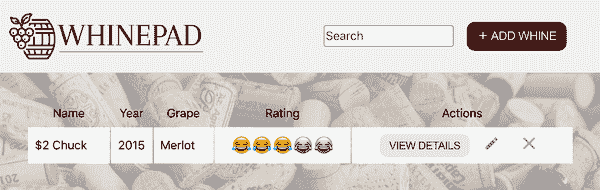
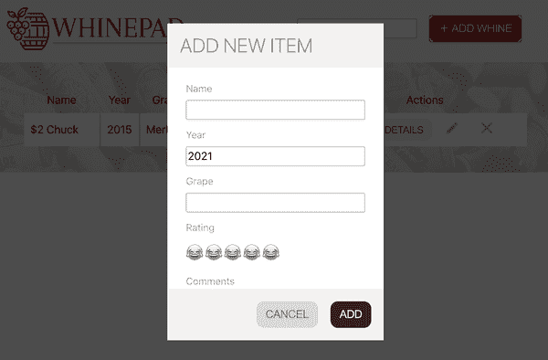
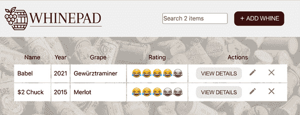
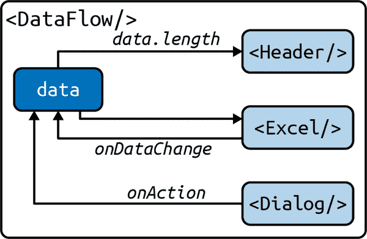
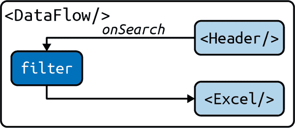

# 第八章：完成的应用程序

新应用程序的所有组件都已完成并可以在发现工具中进行测试（*http://localhost:3000/discovery*）。现在是时候将它们集成到一个工作应用程序中（在浏览器中可用作 *http://localhost:3000/*）。图 8-1 显示了用户首次加载应用程序时的期望结果。从模式示例中获取的默认数据的单行用于向用户展示应用程序的目的。



###### 图 8-1\. 首次加载完成的应用程序

图 8-2 显示了当用户单击 + 添加红葡萄酒按钮时弹出的对话框。



###### 图 8-2\. 添加新记录

图 8-3 显示了用户添加了一行后应用程序的状态。



###### 图 8-3\. 表中的两条记录

由于你已经有了头部、主体、表格组件 `Excel` 和对话框组件，所以渲染只是简单地组装它们，如下所示：

```
<div>
  <Header/>
  <Body>
    <Excel/>
    <Dialog>
      <Form/>
    </Dialog>
  </Body>
</div>
```

主要任务是为这些组件提供正确的属性，并处理它们之间的数据流。让我们创建一个名为 `DataFlow` 的组件来处理所有这些。`DataFlow` 应该包含所有数据，并可以将其传递给 `<Excel>` 和 `<Header>`（后者需要知道搜索字段的占位符的记录数）。当用户在表格中更改数据时，`Excel` 通过 `onDataChange` 属性通知父级 `DataFlow`。当用户在 `DataFlow` 中使用 `Dialog` 添加新记录时，通过 `onAction` 回调将更新后的数据传递给 `Excel`。图 8-4 将此数据流程展示为图表。



###### 图 8-4\. 数据流

`DataFlow`还需要传递由头部搜索框中输入的搜索（过滤）字符串。`DataFlow`从头部的`onSearch`回调中获取它，并将其作为`Excel`的`filter`属性传递，如图 8-5 所示。



###### 图 8-5\. 传递搜索（过滤）字符串

最后，`DataFlow`还负责更新`localStorage`，以始终包含最新数据。

# 更新的 App.js

`<App>` 组件需要进行一些更新。它导入`schema`，然后在`localStorage`中查找数据。如果没有数据，它就从`schema`中取第一个样本作为初始数据。然后渲染新的组件`DataFlow`，传递数据和`schema`：

```
import './App.css';
import Discovery from './components/Discovery';
import DataFlow from './components/DataFlow';
import schema from './config/schema';

const isDiscovery = window.location.pathname.replace(/\//g, '') === 'discovery';

let data = JSON.parse(localStorage.getItem('data'));

// default example data, read from the schema
if (!data) {
  data = [{}];
  Object.keys(schema).forEach((key) => (data[0][key] = schema[key].samples[0]));
}

function App() {
  if (isDiscovery) {
    return <Discovery />;
  }
  return <DataFlow schema={schema} initialData={data} />;
}

export default App;
```

# DataFlow 组件

现在 `<DataFlow>` 组件的目标已经明确，并且你看到它是如何在 `<App>` 组件中使用的，让我们看看如何实现它。

总体结构，正如你所期望的那样，涉及导入/导出和属性类型：

```
import {useState, useReducer, useRef} from 'react';
import PropTypes from 'prop-types';

import Header from './Header';
import Body from './Body';
import Dialog from './Dialog';
import Excel from './Excel';
import Form from './Form';
import clone from '../modules/clone';

function commitToStorage(data) {
  // TODO
}

function reducer(data, action) {
  // TODO
}

function DataFlow({schema, initialData}) {
  // TODO
}

DataFlow.propTypes = {
  schema: PropTypes.object.isRequired,
  initialData: PropTypes.arrayOf(PropTypes.object).isRequired,
};

export default DataFlow;
```

现在我们来看看这些 `TODO` 注释。

第一个只是一个一行代码，它接受传递给它的任何内容（最新的 `data`，这个应用程序的核心）并将其写入 `localStorage`，以便在用户关闭浏览器选项卡后在下一个会话中使用：

```
function commitToStorage(data) {
  localStorage.setItem('data', JSON.stringify(data));
}
```

接下来是 reducer。它只负责两种类型的事件（动作）：

`save`

当用户点击 + ADD WHINE 按钮时，这将在 `data` 中创建一条新记录。

`excelchange`

处理来自 `Excel` 的任何数据变化。此操作不修改数据，只是将其提交到存储并原样返回：

```
function reducer(data, action) {
  if (action.type === 'save') {
    data = clone(data);
    data.unshift(action.payload.formData);
    commitToStorage(data);
    return data;
  }
  if (action.type === 'excelchange') {
    commitToStorage(action.payload.updatedData);
    return action.payload.updatedData;
  }
}
```

为什么在添加到数组的 `unshift()` 中之前需要克隆数据？因为在开发中 reducer 会被调用两次（见 第七章），否则同一条记录会被添加两次。

###### 注意

对于这样一个简单的 reducer，是否真的应该选择 reducer 而不是状态来管理 `data`？可能不是。事实上，书中的代码库中提供了一种只使用状态的替代实现 *DataFlow1.js*，代码行数较短。使用 reducer 的潜在好处是，如果预期将来有新的操作，扩展起来更简单。

让我们深入了解定义 `DataFlow` 组件的函数主体。

## 数据流体

类似于 `Excel` 管理其状态的方式，让我们尝试结合 `useState()` 和 `useReducer()`。让我们为 `data` 设计一个 reducer，因为它可能涉及更多操作，其他方面均使用状态。`addNew` 状态用于切换是否显示添加对话框，`filter` 用于用户在搜索框中输入的字符串：

```
function DataFlow({schema, initialData}) {
  const [data, dispatch] = useReducer(reducer, initialData);
  const [addNew, setAddNew] = useState(false);
  const [filter, setFilter] = useState(null);

  const form = useRef(null);

  function saveNew(action) {/* TODO */}

  function onExcelDataChange(updatedData) {/* TODO */}

  function onSearch(e) {/* TODO */}

  return (
    // TODO: render
  );
}
```

`form` 引用类似于 第七章 中的 `Excel`，用于从显示在添加对话框中的表单中获取数据。

接下来，让我们解决渲染 `TODO`。其任务是组合所有主要组件（`<Header>`、`<Excel>` 等），并传递 `data` 和回调函数。条件是，如果用户点击添加按钮，还会构造一个 `<Dialog>`。

```
return (
  <div className="DataFlow">
    <Header
      onAdd={() => setAddNew(true)}
      onSearch={onSearch}
      count={data.length}
    />
    <Body>
      <Excel
        schema={schema}
        initialData={data}
        key={data}
        onDataChange={(updatedData) => onExcelDataChange(updatedData)}
        filter={filter}
      />
      {addNew ? (
        <Dialog
          modal={true}
          header="Add new item"
          confirmLabel="Add"
          onAction={(action) => saveNew(action)}>
          <Form ref={form} fields={schema} />
        </Dialog>
      ) : null}
    </Body>
  </div>
);
```

另外三个 `TODO` 注释是关于内联辅助函数的，此时应看起来都不复杂。

`onSearch()` 从标题中获取搜索字符串并更新 `filter` 状态，通过重新渲染将其传递给 `Excel`，在那里用于仅显示匹配的数据记录：

```
function onSearch(e) {
  setFilter(e.target.value);
}
```

`onExcelDataChange()` 是另一个一行代码。这是一个回调函数，接收来自 `Excel` 的任何数据更新，并分发一个由 reducer 处理的动作：

```
function onExcelDataChange(updatedData) {
  dispatch({
    type: 'excelchange',
    payload: {updatedData},
  });
}
```

最后，处理对话框操作的 `saveNew()` 辅助函数。它无条件关闭对话框（通过设置 `addNew` 状态），并且如果对话框不仅仅是被解散，它还会从对话框中收集表单数据，并分派适当的 `save` 动作给 reducer 处理。

```
function saveNew(action) {
  setAddNew(false);
  if (action === 'dismiss') {
    return;
  }

  const formData = {};
  Array.from(form.current).forEach(
    (input) => (formData[input.id] = input.value),
  );

  dispatch({
    type: 'save',
    payload: {formData},
  });
}
```

# 任务完成

现在，应用程序已经完成。您可以构建它，部署到您附近的服务器，并使其对世界可用。

正如你所见，任务是创建所有必要的组件（第七章），尽可能使它们小而通用，并通过渲染顶层组件（`Header`、`Body`、`Excel`）使它们一起工作，并确保数据在子组件和父组件之间流动。

到目前为止，你已经学习了一种通过 props 和回调传递数据的方法。这是一种有效的方式，但它可能会变得难以维护，主要有两个原因：

+   子组件可能会嵌套很深，导致传递 props 和回调函数的长而笨拙的链条。

+   当你将多个回调传递给一个组件（当这个组件中发生很多事情时），定义所有这些回调很快就会失去其优雅性。

在早期的 React 应用程序中，props 和回调函数是组件之间通信的原始方式，对许多情况仍然有效。随着 React 的发展，开发人员开始考虑如何解决由此带来的复杂性。其中一种流行的方法是使用全局数据存储，然后为组件提供读写数据的 API。

考虑这个例子（早期了解我们如何使用 React 构建应用程序的方法）：一个深度嵌套的子组件使用回调进行通信：

```
// index.js
let data = [];
function dataChange(newData) {
  data = newData
}
<App data={data} onDataChange={dataChange} />

// <App> in app.js
<Body data={props.data} onDataChange={props.onDataChange} />

// <Body>
<Table
  data={props.data}
  onDataChange={props.onDataChange}
  onSorting={/* ... */}
  onPaging={/* ... */}
/>

// In <Table>
props.data.forEach((row) => {/* render */});
// later in <Table>
props.onDataChange(newData);
```

现在，通过某种形式的`Storage`模块，你可以做以下事情：

```
// index.js
<App />

// <App> in app.js
<Body />

// <Body>
<Table />

// In <Table>
const data = Storage.get('data');
data.forEach((row) => {/* render */});
// later in <Table>
Storage.set('data', newData);
```

你可以同意第二个选项看起来更干净、更简洁。

最初，这种全局存储的想法被称为*Flux*，并且在开源世界中出现了许多实现。其中一种实现，一个叫做*Redux*的库，赢得了大量开发者的青睐。另一种实现是这本书的第一版的一部分。今天，同样的想法已经成为 React 核心的一部分，被实现为*context*。

让我们看看 Whinepad 应用程序如何转向其第二个版本，并摆脱回调函数，改用上下文。

## Whinepad v2

要启动 v2 版本，你需要一个*whinepad*目录的副本，不包括*node_modules/*目录（其中存储了所有通过 npm 下载的依赖项）和*package-lock.json*文件：

```
$ cd ~/reactbook/whinepad
$ rm -rf node_modules/
$ rm package-lock.json
```

这两个是安装应用程序时的附带产物，所以当你分发应用程序（例如，在 GitHub 上与他人分享或者只是将其放入源代码控制中）时，你不需要它们。

复制*whinepad*（v1）版本，准备好进入 v2：

```
$ cd ~/reactbook/
$ cp -r whinepad whinepad2
```

在新位置安装依赖项：

```
$ cd ~/reactbook/whinepad2
$ npm i
```

启动 CRA 进行开发：

```
$ npm start .
```

现在，让我们重写这个应用程序，使其使用上下文。

# 上下文

第一步是创建一个上下文。最好在一个单独的模块中完成，以便它可以在组件之间共享。而且由于很可能会有多个上下文，你可以将它们存储在一个独立的目录中，与*/components*和*/modules*同级。

```
$ cd ~/reactbook/whinepad2/src
$ mkdir contexts
$ touch contexts/DataContext.js
```

*DataContext.js*中没有太多事情发生，只是调用了创建上下文的函数：

```
import React from 'react';

const DataContext = React.createContext();

export default DataContext;
```

调用`createContext()`接受一个默认值。它的目的主要是用于测试、文档和类型安全性。让我们提供默认值：

```
const DataContext = React.createContext({
  data: [],
  updateData: () => {},
});
```

您可以在上下文中存储任何值，但一个常见的模式是使用一个对象，该对象有两个属性：一个数据片段和一个可以更新数据的函数。

# 下一步

现在已经创建了一个上下文，下一步是在组件中需要的地方使用这个上下文。`data`被用在`Excel`和`Header`中，所以这两个组件需要更新。同时在`DataFlow`中传递数据，并且那里的变动最为显著。

但首先，需要对*App.js*进行更新和简化。在 v1 中，这是在其中确定初始（或默认）数据并将其作为 props 传递给`<DataFlow>`的地方。在 v2 中，让我们将所有数据管理都发生在`<DataFlow>`中。更新后的*App.js*看起来有点简单：

```
import './App.css';
import Discovery from './components/Discovery';
import DataFlow from './components/DataFlow';

const isDiscovery = window.location.pathname.replace(/\//g, '') === 'discovery';

function App() {
  if (isDiscovery) {
    return <Discovery />;
  }
  return <DataFlow />;
}

export default App;
```

`DataFlow`的工作是在应用程序加载时确定初始数据，在上下文中更新该数据，并确保子组件`<Excel>`和`<Header>`可以从上下文获取数据。子组件也应能够更新数据。正如您即将看到的那样，这实际上并不复杂，但首先，我们来谈谈 v2 中数据流程与 v1 有何不同。

## 循环数据

在 v1 中（还可以参见图 8-4），`Excel`在其状态中管理着`data`。这是构建可以在任何应用程序中任何地方使用的独立组件的一个很好的方法。但是父组件`DataFlow`也在其状态中保持数据，因为数据需要在`Header`和`Excel`之间共享。因此存在两个“事实来源”，需要进行同步。通过将`data`属性从`DataFlow`传递到`Excel`，并使用`onDataChange`回调从子组件`Excel`到父组件`DataFlow`进行通信来完成此操作。这创建了一个数据的循环流动，可能导致无限渲染循环。`Excel`中的`data`发生变化，因此重新渲染。`DataFlow`通过`onDataChange`接收到新数据并更新其状态，这导致了`DataFlow`的重新渲染，从而导致了`Excel`的新渲染（它是一个子组件）。

React 通过拒绝在渲染阶段更新状态来防止这种情况发生。这就是在`Excel`中调用`onDataChange`回调时需要`setTimeout`黑科技的原因：

```
function reducer(data, action) {
  // ...
  setTimeout(() => action.payload.onDataChange(data));
  return data;
}
```

这样做效果很好。超时允许 React 在再次更新状态之前完成渲染。这个黑科技是为了拥有一个完全独立的`Excel`来管理自己的数据而付出的代价。

让我们在 v2 中进行更改，使用`DataFlow`中的一个单一事实来源（`data`）。这避免了黑科技，但带来的缺点是`Excel`现在需要其他人来管理数据。这并不难，但这是一个变化，并且需要测试区域`<Discovery>`更为深入参与。

# 提供上下文

看看由`React.createContext()`创建的`DataContext`上下文如何使用。实现这一功能的重要工作发生在`DataFlow`中，所以让我们来看看它的 v2 版本。

在*DataFlow.js*中要求上下文：

```
import schema from '../config/schema';
import DataContext from '../contexts/DataContext';
```

弄清楚世界的初始状态，可以从存储或`schema`样本中进行，可以在模块的顶部完成，甚至不需要在`DataFlow`函数的体内完成：

```
let initialData = JSON.parse(localStorage.getItem('data'));

// default example data, read from the schema
if (!initialData) {
  initialData = [{}];
  Object.keys(schema).forEach(
    (key) => (initialData[0][key] = schema[key].samples[0]),
  );
}
```

`data`像以前一样保存在状态中：

```
function DataFlow() {
  const [data, setData] = useState(initialData);
  // ...
}
```

`data`将成为上下文的一部分。上下文还需要一个函数来更新数据。此函数在`DataFlow`中内联定义：

```
function updateData(newData) {
  newData = clone(newData);
  commitToStorage(newData);
  setData(newData);
}
```

更新数据的三个步骤是：

1.  克隆数据，以便始终是不可变的。

1.  将其保存到`localStorage`，以便下次加载应用程序时使用。

1.  更新状态。

利用`data`和`updateData`，最后一步是将需要上下文的子项（`Excel`和`Header`）包裹在*provider*组件中：

```
<DataContext.Provider value={{data, updateData}}>
  <Header onSearch={onSearch} />
  <Body>
    <Excel filter={filter} />
  </Body>
</DataContext.Provider>
```

由于调用了`createContext()`创建了`DataContext`，因此提供者组件`<DataContext.Provider>`可用：

```
const DataContext = React.createContext({
  data: [],
  updateData: () => {},
});
```

提供者必须设置一个`value`属性，这可以是任何东西。这里的值是常见的模式：“数据加上改变数据的方式。”

现在，任何`<DataContext.Provider>`的子组件，如`<Excel>`或`<Header>`，都可以成为上下文值的*consumer*。消费的方式可以是通过`<DataContext.Consumer>`组件或通过`useContext()`钩子。

在查看消费上下文之前，以下是新*DataFlow.js*的完整列表。有关 Whinepad v2 的完整代码，请参阅书本存储库中的*whinepad2*目录。

```
import {useState} from 'react';

import Header from './Header';
import Body from './Body';
import Excel from './Excel';
import schema from '../config/schema';
import DataContext from '../contexts/DataContext';
import clone from '../modules/clone';

let initialData = JSON.parse(localStorage.getItem('data'));

// default example data, read from the schema
if (!initialData) {
  initialData = [{}];
  Object.keys(schema).forEach(
    (key) => (initialData[0][key] = schema[key].samples[0]),
  );
}

function commitToStorage(data) {
  localStorage.setItem('data', JSON.stringify(data));
}

function DataFlow() {
  const [data, setData] = useState(initialData);
  const [filter, setFilter] = useState(null);

  function updateData(newData) {
    newData = clone(newData);
    commitToStorage(newData);
    setData(newData);
  }

  function onSearch(e) {
    const s = e.target.value;
    setFilter(s);
  }

  return (
    <div className="DataFlow">
      <DataContext.Provider value={{data, updateData}}>
        <Header onSearch={onSearch} />
        <Body>
          <Excel filter={filter} />
        </Body>
      </DataContext.Provider>
    </div>
  );
}

export default DataFlow;
```

如您所见，`filter`仍然作为一个属性传递给`<Excel>`。即使您使用了上下文，传递属性仍然是一种选择。在许多情况下，组件需要进行通信时，这可能是首选方法。

# 使用上下文

如果您查看本章前面的`DataFlow`的 v1 版本，您可能会注意到在 v2 中，`reducer()`已经消失了。Reducer 的任务是处理来自`Excel`的数据更改并从头部添加新记录。这些任务现在可以在各自的子项中执行。`Excel`可以处理任何更改，然后使用提供的`updateData()`更新上下文。`Header`可以处理添加新记录，并使用相同的函数更新上下文中的数据。让我们看看如何做到这一点。

## 标题中的上下文

新标题将负责更多的 UI，即在`Dialog`中的`Form`来添加新记录，因此导入的列表稍长。请注意，还导入了新的`DataContext`：

```
import Logo from './Logo';
import './Header.css';
import {useContext, useState, useRef} from 'react';

import Button from './Button';
import FormInput from './FormInput';
import Dialog from './Dialog';
import Form from './Form';
import schema from '../config/schema';

import DataContext from '../contexts/DataContext';

function Header({onSearch}) {
 // TODO
}

export default Header;
```

渲染标题所需的数据包括：

+   来自上下文的`data`

+   `addNew`标志是否显示添加对话框（用户点击添加按钮时）

```
function Header({onSearch}) {
  const {data, updateData} = useContext(DataContext);
  const [addNew, setAddNew] = useState(false);

  const form = useRef(null);

  const count = data.length;
  const placeholder = count > 1 ? `Search ${count} items` : 'Search';

  function saveNew(action) {
    // TODO
  }

  function onAdd() {
    // TODO
  }

  // TODO: render
}
```

`addNew`状态直接从`DataFlow`的 v1 版本复制。新代码是使用`DataContext`的消费。可以看到，通过使用`useContext()`钩子，您可以访问由`<DataContext.Provider>`传递的`value`属性。它是一个对象，具有`data`属性和`updateData()`函数。

在 v1 中，`count`属性传递给`<Header>`。现在，头部可以访问所有数据并从中获取计数（`data.length`）。现在，所有用于渲染的组件都已经准备好了，是时候开始工作了：

```
function Header({onSearch}) {

  // ....

  return (
    <div>
      <div className="Header">
        <Logo />
        <div>
          <FormInput
            placeholder={placeholder}
            id="search"
            onChange={onSearch}
          />
        </div>
        <div>
          <Button onClick={onAdd}>
            <b>&#65291;</b> Add whine
          </Button>
        </div>
      </div>
      {addNew ? (
        <Dialog
          modal={true}
          header="Add new item"
          confirmLabel="Add"
          onAction={(action) => saveNew(action)}>
          <Form ref={form} fields={schema} />
        </Dialog>
      ) : null}
    </div>
  );
}
```

与上一个版本的主要区别在于，现在在头部实现了`Dialog`和它包含的`Form`。

最后需要查看的两个功能函数是`onAdd()`和`saveNew()`。第一个函数仅更新`addNew`状态：

```
function onAdd() {
  setAddNew(true);
}
```

`saveNew()`的工作是从表单中收集新记录并添加到`data`中。然后关键时刻来了：使用更新后的`data`调用`updateData()`。这个函数来自于`<DataContext.Provider>`，在`DataFlow`中定义为：

```
function updateData(newData) {
  newData = clone(newData);
  commitToStorage(newData);
  setData(newData);
}
```

这里发生的是父组件`DataFlow`接收到新数据并更新状态（通过`setData()`），这导致 React 重新渲染。这意味着`Excel`和`Header`会重新渲染，但这次使用最新的数据。因此，新记录会出现在`Excel`表中，头部的搜索框中也会准确显示记录数量。

这里是*Header.js*文件的完整内容：

```
import Logo from './Logo';
import './Header.css';
import {useContext, useState, useRef} from 'react';

import Button from './Button';
import FormInput from './FormInput';
import Dialog from './Dialog';
import Form from './Form';
import schema from '../config/schema';

import DataContext from '../contexts/DataContext';

function Header({onSearch}) {
  const {data, updateData} = useContext(DataContext);
  const count = data.length;

  const [addNew, setAddNew] = useState(false);

  const form = useRef(null);

  function saveNew(action) {
    setAddNew(false);
    if (action === 'dismiss') {
      return;
    }

    const formData = {};
    Array.from(form.current).forEach(
      (input) => (formData[input.id] = input.value),
    );
    data.unshift(formData);
    updateData(data);
  }

  function onAdd() {
    setAddNew(true);
  }

  const placeholder = count > 1 ? `Search ${count} items` : 'Search';
  return (
    <div>
      <div className="Header">
        <Logo />
        <div>
          <FormInput
            placeholder={placeholder}
            id="search"
            onChange={onSearch}
          />
        </div>
        <div>
          <Button onClick={onAdd}>
            <b>&#65291;</b> Add whine
          </Button>
        </div>
      </div>
      {addNew ? (
        <Dialog
          modal={true}
          header="Add new item"
          confirmLabel="Add"
          onAction={(action) => saveNew(action)}>
          <Form ref={form} fields={schema} />
        </Dialog>
      ) : null}
    </div>
  );
}

export default Header;
```

## 数据表中的上下文

在 v2 完全运行之前的最后一件事是更新`Excel`，这样它就不再维护自己的状态，而是使用来自`<DataContext.Provider>`的数据。不需要渲染更改，只需管理数据。

由于`Excel`中不再需要`data`状态，因此不再需要`reducer()`。然而，所有数据操作发生在一个中心位置的想法太吸引人了，所以我们将`reducer()`简单重命名为`dataMangler()`。

这是之前的状态：

```
function reducer(data, action) {
  if (action.type === 'sort') {
    const {column, descending} = action.payload;
    // ...
  }
  // ...
}
```

这是变更后的结果：

```
function dataMangler(data, action, payload) {
  if (action === 'sort') {
    const {column, descending} = payload;
    // ...
  }
  // ...
}
```

正如你所见，`dataMangler()`不需要遵循 reducer API，因此`action`现在可以是一个字符串，而 payload 可以作为函数的一个单独参数。这只是少打点字，也希望避免任何混淆：`dataMangler()`并*不是*一个 reducer，只是一个方便的辅助函数。

`dataMangler()`的完整代码如下：

```
function dataMangler(data, action, payload) {
  if (action === 'sort') {
    const {column, descending} = payload;
    return data.sort((a, b) => {
      if (a[column] === b[column]) {
        return 0;
      }
      return descending
        ? a[column] < b[column]
          ? 1
          : -1
        : a[column] > b[column]
          ? 1
          : -1;
    });
  }
  if (action === 'save') {
    const {int, edit} = payload;
    data[edit.row][edit.column] = int
      ? parseInt(payload.value, 10)
      : payload.value;
  }
  if (action === 'delete') {
    data = clone(data);
    data.splice(payload.rowidx, 1);
  }
  if (action === 'saveForm') {
    Array.from(payload.form.current).forEach(
      (input) => (data[payload.rowidx][input.id] = input.value),
    );
  }
  return data;
}
```

注意函数末尾不再有`setTimeout(() => action.payload.onDataChange(data)`。不再需要`onDataChange`属性，也不再需要`setTimeout`的 hack。

当使用 reducer 时，只返回`data`就足以重新渲染`Excel`。现在你需要来自 provider 的`updateData()`，这样父组件`DataFlow`就可以负责重新渲染。此外，不再有自动调用 reducer 的`dispatch()`。现在所有的`dispatch()`调用点都有两个任务：调用`dataMangler()`，然后将其返回值传递给`updateData()`。

这是变更前的状态：

```
dispatch({type: 'sort', payload: {column, descending}});
```

这是更新后的版本：

```
const newData = dataMangler(data, 'sort', {column, descending});
updateData(newData);
```

或者，一个简单的一行代码：

```
updateData(dataMangler(data, 'sort', {column, descending}));
```

替换 4 个`dispatch()`调用点，Whinepad 的 v2 版本就完成并且运行正常了。要获取完整的代码清单，请参阅书籍的代码存储库。

# 更新发现

此时对`Excel`和`Header`的更改也影响了发现工具。虽然技术上没有问题，但有些混乱。例如，数据表为空，搜索输入框不显示计数。要充分利用`Discovery`，您需要设置环境，其中`Excel`和`Header`生存。在这里，“环境”意味着在示例周围包装一个`<DataConsumer.Provider>`。

这是代码转换之前的情况（内联示例和样本数据来自模式并作为属性传递）：

```
<h2>Excel</h2>
<Excel
  schema={schema}
  initialData={schema.name.samples.map((_, idx) => {
    const element = {};
    for (let key in schema) {
      element[key] = schema[key].samples[idx];
    }
    return element;
  })}
  onDataChange={(data) => {
    console.log(data);
  }}
/>
```

转换后如下（变成一个全新的示例组件）：

```
<h2>Excel</h2>
<ExcelExample />
```

示例组件也从`schema`获取样本数据，并用于维护状态。一个更简单的`updateData()`被创建，并作为上下文提供程序的一部分传递：

```
function ExcelExample() {
  const initialData = schema.name.samples.map((_, idx) => {
    const element = {};
    for (let key in schema) {
      element[key] = schema[key].samples[idx];
    }
    return element;
  });
  const [data, setData] = useState(initialData);
  function updateData(newData) {
    setData(newData);
  }
  return (
    <DataContext.Provider value={{data, updateData}}>
      <Excel />
    </DataContext.Provider>
  );
}
```

现在，`Excel`示例在发现工具中完全可操作。如果不进行此更新，当`Excel`尝试使用上下文时，它会得到`createContext()`中定义的默认`data`和`updateData()`：

```
// In DataContext.js
const DataContext = React.createContext({
  data: [],
  updateData: () => {},
});

// In Excel.js
const {data, updateData} = useContext(DataContext);

// `data` is now an empty array and `updateData` is a no-op function
```

更新`<Discovery>`中的`<Header>`示例可以更简单，因为您知道`Header`只关心`data.length`计数。

这是转换之前：

```
<h2>Header</h2>
<Header
  onSearch={(e) => console.log(e)}
  onAdd={() => alert('add')}
  count={3}
/>
```

现在是 v2 的展示：

```
<h2>Header</h2>
<DataContext.Provider value={{data: [1, 2, 3]}}>
  <Header onSearch={(e) => console.log(e)} />
</DataContext.Provider>
```

现在，将`Header`包装在提供程序中会导致上下文中使用`value`而不是来自`createContext()`的默认值。因此，如果测试标题中的“添加”按钮，您将收到错误，因为`updateData()`不存在。要修复错误并使按钮可测试，一个空操作的`updateData()`就足够了：

```
<h2>Header</h2>
<DataContext.Provider value={{data: [1, 2, 3], updateData: () => {}}}>
  <Header onSearch={(e) => console.log(e)} />
</DataContext.Provider>
```

现在，您还可以使用 Whinepad 的 v2 版本以及用于单独操作组件的发现区域。

# 路由

是时候通过实现一项额外的功能——可书签 URL——来结束这一章节和这本书，并在此过程中了解多个上下文和`useCallback()`钩子。

诸如 Whinepad 之类的单页面应用程序（SPA）不会刷新页面，因此应用程序的不同状态的 URL 无需更改。但是，当它们这样做时，这很好，因为这使用户可以共享链接并已将应用程序置于某个状态。例如，向同事发送类似*https://whinepad.com/filter/merlot*这样的 URL 比发送“转到*https://whinepad.com/*并在顶部搜索框中输入*merlot*”这样的说明更友好。

应用程序能够从 URL 中重新创建状态通常被称为*路由*，而有许多第三方库可以以某种方式为您提供路由。但让我们再次采用自助方式，并提出一个定制解决方案。

让我们提供 4 种类型的可书签化 URL：

+   */filter/merlot* 用于标记搜索“merlot”

+   */add* 以打开添加记录的“添加”对话框

+   */info/1* 用于显示 ID 为 1 的记录的信息（不可编辑）对话框

+   */edit/1* 以获取可编辑版本

第一个 URL 的处理应位于 `DataFlow`，因为这是传递过滤器的位置；第二个在 `Header` 中；最后两个在 `Excel` 中。由于各个组件都需要知道 URL，似乎需要一个新的上下文。

## 路由上下文

新上下文位于 *contexts/RouteContext.js* 中：

```
import React from 'react';

const RouteContext = React.createContext({
  route: {
    add: false,
    edit: null,
    info: null,
    filter: null,
  },
  updateRoute: () => {},
});

export default RouteContext;
```

再次看到一个熟悉的模式——上下文包括一个数据片段（`route`）和更新它的方法（`updateRoute`）。

如前所述，将上下文默认值替换为工作值的工作由父组件 `DataFlow` 执行。它需要新上下文，并尝试从 URL (`window.location.pathname`) 中读取路由信息：

```
// ...
import RouteContext from '../contexts/RouteContext';
//...

// read state from the URL "route"
const route = {};
function resetRoute() {
  route.add = false;
  route.edit = null;
  route.info = null;
  route.filter = null;
}
resetRoute();
const path = window.location.pathname.replace(/\//, '');
if (path) {
  const [action, id] = path.split('/');
  if (action === 'add') {
    route.add = true;
  } else if (action === 'edit' && id !== undefined) {
    route.edit = parseInt(id, 10);
  } else if (action === 'info' && id !== undefined) {
    route.info = parseInt(id, 10);
  } else if (action === 'filter' && id !== undefined) {
    route.filter = id;
  }
}

// ...

function DataFlow() {
  // ...
}
```

现在，如果应用加载的 URL 是 */filter/merlot*，那么 `route` 将变成：

```
{
  add: false,
  edit: null,
  info: null,
  filter: 'merlot',
};
```

如果应用加载的是 */edit/1* 这个 URL，`route` 将变成：

```
{
  add: false,
  edit: 1,
  info: null,
  filter: null,
};
```

`DataFlow` 也需要定义一个更新路由的函数：

```
function DataFlow() {

  // ...

  function updateRoute(action = '', id = '') {
    resetRoute();
    if (action) {
      route[action] = action === 'add' ? true : id;
    }
    id = id !== '' ? '/' + id : '';
    window.history.replaceState(null, null, `/${action}${id}`);
  }

  // ...
}
```

在 [`History` API](https://developer.mozilla.org/en-US/docs/Web/API/History) 中，使用 `replaceState()` 是 `pushState()` 的一个替代方法，它不会创建历史记录条目（用于与浏览器的后退按钮一起使用）。在这种情况下，这是首选，因为 URL 将频繁更新，并有可能污染历史记录堆栈。例如，当用户输入“merlot”时，会产生六个历史记录条目（/filter/m, /filter/me, /filter/mer 等），使得后退按钮无法使用。

## 使用过滤器 URL

下一步是将新上下文的任何消费者包装在提供程序组件中（在此情况下为 `<RouteContext.Provider>`）。但是，出于过滤目的，目前还不是必需，因为所有过滤都发生在 `DataFlow` 中。

要使用新的路由功能，只需要进行两个更改。一个是在 `onSearch` 回调中，每当用户在搜索框中键入时调用。

之前：

```
function onSearch(e) {
  const s = e.target.value;
  setFilter(s);
}
```

之后：

```
function onSearch(e) {
  const s = e.target.value;
  setFilter(s);
  if (s) {
    updateRoute('filter', s);
  } else {
    updateRoute();
  }
}
```

现在当用户在搜索框中键入“m”时，URL 将变为 */filter/m*。当用户删除搜索字符串时，URL 将返回到 */*。

更新 URL 只完成了一半工作。另一半是在应用加载时预填充搜索框 *并* 在加载时进行搜索。进行搜索意味着确保正确的 `filter` 属性传递给 `Excel`。幸运的是，这很简单。

之前：

```
function DataFlow() {
  const [filter, setFilter] = useState(null);
  // ...
}
```

之后：

```
function DataFlow() {
  const [filter, setFilter] = useState(route.filter);
  // ...
}
```

这已经足够了。现在，每当 `DataFlow` 渲染时，它都传递 `<Excel filter=​{fil⁠ter}>`，其中过滤器值来自 `route`。因此，`Excel` 只显示匹配的行。如果 `route` 对象中没有过滤器，则 `filter` 属性为 `null`，`Excel` 将显示所有内容。

若要预填充搜索框（位于 `Header` 中），需要将头部包裹在路由上下文提供程序中。这发生在 `DataFlow` 渲染时。

之前：

```
function DataFlow() {
  // ...
  return (
    <div className="DataFlow">
      <DataContext.Provider value={{data, updateData}}>
        <Header onSearch={onSearch} />
        <Body>
          <Excel filter={filter} />
        </Body>
      </DataContext.Provider>
    </div>
  );
}
```

之后：

```
function DataFlow() {
  // ...
  return (
    <div className="DataFlow">
      <DataContext.Provider value={{data, updateData}}>
        <RouteContext.Provider value={{route, updateRoute}}>
          <Header onSearch={onSearch} />
          <Body>
            <Excel filter={filter} />
          </Body>
        </RouteContext.Provider>
      </DataContext.Provider>
    </div>
  );
}
```

如您所见，可以拥有任意数量的上下文提供程序包装器。它们可以像上面看到的那样嵌套，或者可以仅在需要时包装不同的组件。

## 在头部使用路由上下文

`Header` 组件可以通过 `RouteContext` 获得路由访问权限。

之前：

```
// ...
import DataContext from '../contexts/DataContext';

function Header({onSearch}) {
  const {data, updateData} = useContext(DataContext);
  const [addNew, setAddNew] = useState(false);
  // ...
```

之后：

```
// ...
import DataContext from '../contexts/DataContext';
import RouteContext from '../contexts/RouteContext';

function Header({onSearch}) {
  const {data, updateData} = useContext(DataContext);
  const {route, updateRoute} = useContext(RouteContext);
  const [addNew, setAddNew] = useState(route.add);
```

注意将 `route.add` 作为 `addNew` 状态的默认值传递给组件使 */add* URL 自动工作。将 `addNew` 设置为 `true` 会导致组件的渲染部分显示一个 `Dialog`。

确保搜索框具有来自路由的预填充值也是一行代码。

Before:

```
<FormInput
  placeholder={placeholder}
  id="search"
  onChange={onSearch}
/>
```

After:

```
<FormInput
  placeholder={placeholder}
  id="search"
  onChange={onSearch}
  defaultValue={route.filter}
/>
```

头部需要做的另一件事是在用户执行适当的操作时更新路由上下文。当用户点击“添加”按钮时，URL 应更改为 */add*。这通过从上下文调用 `updateRoute()` 来完成。

Before:

```
function onAdd() {
  setAddNew(true);
}
```

After:

```
function onAdd() {
  setAddNew(true);
  updateRoute('add');
}
```

当用户关闭对话框（或提交表单并使对话框消失）时，*/add* 应从 URL 中移除。

Before:

```
function saveNew(action) {
  setAddNew(false);
  // ...
}
```

After:

```
function saveNew(action) {
  setAddNew(false);
  updateRoute();
  // ...
}
```

## 在数据表格中使用路由上下文

在 `Excel` 中使用路由上下文看起来很熟悉：

```
// ...
import RouteContext from '../contexts/RouteContext';

function Excel({filter}) {
  const {route, updateRoute} = useContext(RouteContext);
  // ...
}
```

在这个组件中，`handleAction()` 辅助函数发挥了重要作用（参见 第七章）。它负责打开和关闭对话框以及对话框内容。只要调用它时传递正确的参数，此辅助程序就可以用于路由的目的。

借助 `useEffect()` 的帮助，当数据表格渲染并且结果是打开 */edit/[ID]* 或 */info/[ID]* 的对话框时，可以调用此辅助程序。以下代码展示了如何实现这一点：

```
useEffect(() => {
  if (route.edit !== null && route.edit < data.length) {
    handleAction(route.edit, 'edit');
  } else if (route.info !== null && route.info < data.length) {
    handleAction(route.info, 'info');
  }
}, [route, handleAction, data]);
```

这里的`route`、`handleAction`和`data`是该效果的依赖项，因此不会经常调用。快速检查`data.length`可以防止打开具有超出范围的 ID 的对话框（例如，当只有 3 条记录时，无法编辑 ID 5）。然后当 URL 是 */info/2* 时调用 `handleAction()`，例如 `handleAction(2, 'info')`。

因此，`handleAction()` 负责读取路由信息并创建正确的对话框。但它还负责在用户操作时更新 URL。这一部分很简单。

Closing the dialog before:

```
setDialog(null);
```

And after:

```
setDialog(null);
updateRoute(); // clean up the URL
```

打开对话框之前：

```
const isEdit = type === 'edit';
if (type === 'info' || isEdit) {
  const formPrefill = data[rowidx];
  setDialog(
    <Dialog ...
// ...
```

And after:

```
const isEdit = type === 'edit';
if (type === 'info' || isEdit) {
  const formPrefill = data[rowidx];
  updateRoute(type, rowidx); // makes the URL e.g., /edit/3
  setDialog(
    <Dialog ...
// ...
```

这样，功能就完成了；只剩最后一步了。

## useCallback()

设置 `useEffect` 时，`handleAction()` 被作为一个依赖项传递：

```
useEffect(() => {
  if (route.edit !== null && route.edit < data.length) {
    handleAction(route.edit, 'edit');
  } else if (route.info !== null && route.info < data.length) {
    handleAction(route.info, 'info');
  }
}, [route, handleAction, data]);
```

但由于 `handleAction()` 是在 `Excel()` 内部的内联函数，这意味着每次调用 `Excel()` 进行重新渲染时都会创建一个新的 `handleAction()`。而 `useEffect()` 则会看到更新的依赖项。这是不高效的。尽管函数执行的内容相同，但每次更改函数依赖项都是没有意义的。

React 提供了 `useCallback()` 钩子来帮助处理这种情况。它会使用其依赖项*记忆化*回调函数。因此，如果在 `Excel` 重新渲染时创建了一个新的 `handleAction()`，但其依赖项没有更改，则 `useEffect()` 不需要查看新的依赖项。旧的记忆化的 `handleAction` 应该可以解决问题。

使用 `useCallback()` 将 `handleAction` 包装起来应该看起来有些熟悉，就像 `useEffect()` 一样，模式是：第一个参数是一个函数，第二个是一个依赖项数组。

Before:

```
function handleAction(rowidx, type) {
  // ...
}
```

After:

```
const handleAction = useCallback(
  (rowidx, type) => {
    // ...
  },
  [data, updateData, updateRoute],
);
```

`data`、`updateData` 和 `updateRoute` 这些依赖是 `handleAction` 正常工作所需的唯一外部信息。因此，如果这些信息在重新渲染之间没有改变，旧的记忆化 `handleAction` 就足够了。以下是经过所有路由更改后的完整和最终版本的 `handleAction()`：

```
const handleAction = useCallback(
  (rowidx, type) => {
    if (type === 'delete') {
      setDialog(
        <Dialog
          modal
          header="Confirm deletion"
          confirmLabel="Delete"
          onAction={(action) => {
            setDialog(null);
            if (action === 'confirm') {
              updateData(
                dataMangler(data, 'delete', {
                  rowidx,
                  updateData,
                }),
              );
            }
          }}>
          {`Are you sure you want to delete "${data[rowidx].name}"?`}
        </Dialog>,
      );
    }
    const isEdit = type === 'edit';
    if (type === 'info' || isEdit) {
      const formPrefill = data[rowidx];
      updateRoute(type, rowidx);
      setDialog(
        <Dialog
          modal
          extendedDismiss={!isEdit}
          header={isEdit ? 'Edit item' : 'Item details'}
          confirmLabel={isEdit ? 'Save' : 'ok'}
          hasCancel={isEdit}
          onAction={(action) => {
            setDialog(null);
            updateRoute();
            if (isEdit && action === 'confirm') {
              updateData(
                dataMangler(data, 'saveForm', {
                  rowidx,
                  form,
                  updateData,
                }),
              );
            }
          }}>
          <Form
            ref={form}
            fields={schema}
            initialData={formPrefill}
            readonly={!isEdit}
          />
        </Dialog>,
      );
    }
  },
  [data, updateData, updateRoute],
);
```

# 结束

亲爱的读者，我很高兴你读到这里。希望你现在是一个更自信的程序员，知道如何启动一个新的 React 项目或加入现有项目并将其推向未来。

编程书籍就像是时间的快照。技术在变化和演进，而书籍始终如一。我尽力专注于常青内容，让演进自然发生。但我希望在新版出版之前，尝试通过 PDF 附件给本书增加新内容。如果你希望了解新内容，请加入[邮件列表](https://react.stoyanstefanov.com)。
