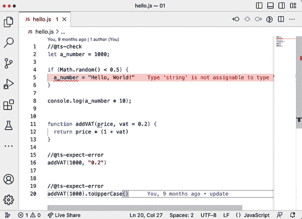
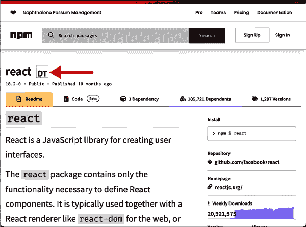
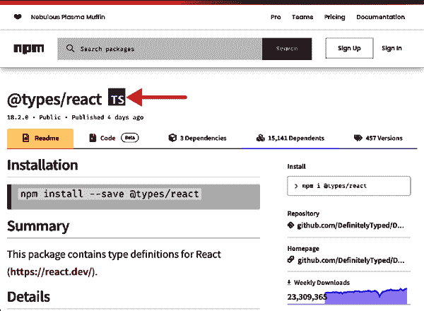

# 第一章：项目设置

你想开始使用 TypeScript，太棒了！关键问题是：你如何开始呢？你可以用多种方式将 TypeScript 集成到你的项目中，每种方式根据项目需求略有不同。就像 JavaScript 在多个运行时上运行一样，有很多方法可以配置 TypeScript，使其符合你的目标需求。

本章涵盖了向你的项目引入 TypeScript 的所有可能性，作为 JavaScript 的扩展，为你提供基本的自动完成和错误指示，直至为 Node.js 和浏览器上的全栈应用程序设置完整的配置。

由于 JavaScript 工具链是一个拥有无限可能性的领域——有人说几乎每周都会发布新的 JavaScript 构建链，几乎与新框架一样多——本章更侧重于你可以单独使用 TypeScript 编译器完成的工作，不需要任何额外工具。

TypeScript 提供了你所有转译需求所需的一切，除了创建针对 Web 分发的压缩和优化的包的能力。像 [ESBuild](https://esbuild.github.io) 或 [Webpack](https://webpack.js.org) 这样的捆绑工具会处理这项任务。此外，还有一些设置包含其他与 TypeScript 良好兼容的转译器，如 [Babel.js](https://babeljs.io)。

捆绑工具和其他转译器不在本章的范围之内。请参考它们的文档，了解如何包含 TypeScript，并使用本章中的知识来获取正确的配置设置。

TypeScript 作为一个拥有十多年历史的项目，保留了一些来自早期的遗留物，为了兼容性考虑，TypeScript 不能轻易摆脱它们。因此，本章将重点介绍现代 JavaScript 语法和 Web 标准的最新发展。

如果你仍然需要支持 Internet Explorer 8 或 Node.js 10，首先：抱歉，这些平台确实很难开发。但是，第二：通过本章和 [官方 TypeScript 文档](https://typescriptlang.org)，你将能够为旧平台整合知识。

# 1.1 JavaScript 的类型检查

## 问题

你希望尽可能少的工作量获取 JavaScript 的基本类型检查。

## 解决方案

在你想要类型检查的每个 JavaScript 文件开头添加一个带有 `@ts-check` 的单行注释。对于合适的编辑器，当 TypeScript 遇到不太匹配的事物时，你会立即看到红色波浪线。

## 讨论

TypeScript 被设计为 JavaScript 的超集，每个有效的 JavaScript 代码也是有效的 TypeScript 代码。这意味着 TypeScript 也非常擅长发现常规 JavaScript 代码中的潜在错误。

如果我们不想要一个完整的 TypeScript 设置，但想要一些基本的提示和类型检查来简化我们的开发工作流程，我们可以使用这个。

如果您只想对 JavaScript 进行类型检查，一个很好的前提条件是一个功能强大的编辑器或 IDE。一个非常适合 TypeScript 的编辑器是 [Visual Studio Code](https://code.visualstudio.com)。Visual Studio Code，或简称 VSCode，在 TypeScript 发布之前就是第一个主要使用 TypeScript 的项目。

如果您想编写 JavaScript 或 TypeScript，很多人推荐使用 VSCode。但实际上，只要支持 TypeScript 的编辑器都是很棒的。现在大多数编辑器都支持 TypeScript。

使用 Visual Studio Code 进行 JavaScript 的类型检查非常重要的一点是：当代码中有什么不对劲时，我们会看到红色波浪线，如您在 图 1-1 中所见。这是最低的入门障碍。TypeScript 的类型系统在处理代码库时有不同的严格级别。



###### 图 1-1\. 代码编辑器中的红色波浪线：如果代码中有什么不对劲，它将会给予第一级反馈

首先，类型系统会通过使用情况从 JavaScript 代码中 *推断* 类型。如果您的代码中有这样一行：

```
let a_number = 1000;
```

TypeScript 将会正确推断 `a_number` 的类型为 `number`。

JavaScript 的一个难点在于其类型是动态的。通过 `let`、`var` 或 `const` 进行绑定可以根据使用情况改变类型。^(1) 请看下面的例子：

```
let a_number = 1000;

if (Math.random() < 0.5) {
  a_number = "Hello, World!";
}

console.log(a_number * 10);
```

如果条件在下一行评估为真时，我们将一个数字赋给 `a_number` 并将绑定更改为一个 `string`。如果我们在最后一行试图对 `a_number` 进行乘法运算，这将会是一个问题。在大约 50% 的情况下，这个例子会产生意料之外的行为。

TypeScript 可以在这里提供帮助。通过在我们的 JavaScript 文件的顶部添加一行单行注释 `@ts-check`，TypeScript 将激活下一个严格级别：根据 JavaScript 文件中可用的类型信息对 JavaScript 文件进行类型检查。

在我们的例子中，TypeScript 将会发现我们试图将一个字符串分配给一个 TypeScript 推断为数字的绑定。我们在编辑器中会收到一个错误：

```
// @ts-check
let a_number = 1000;

if (Math.random() < 0.5) {
  a_number = "Hello, World!";
// ^-- Type 'string' is not assignable to type 'number'.ts(2322)
}

console.log(a_number * 10);
```

现在我们可以开始修复我们的代码，TypeScript 将会指导我们。

JavaScript 的类型推断可以在很大程度上帮助。在下面的例子中，TypeScript 通过乘法和加法操作以及默认值推断类型：

```
function addVAT(price, vat = 0.2) {
  return price * (1 + vat);
}
```

函数 `addVat` 接受两个参数。第二个参数是可选的，因为它已经被设置为默认值 `0.2`。如果您试图传递一个不起作用的值，TypeScript 将会警告您：

```
addVAT(1000, "a string");
//           ^-- Argument of type 'string' is not assignable
//               to parameter of type 'number'.ts(2345)
```

另外，由于我们在函数体内使用了乘法和加法操作，TypeScript 理解我们将会从这个函数返回一个数字：

```
addVAT(1000).toUpperCase();
//           ^-- Property 'toUpperCase' does not
//               exist on type 'number'.ts(2339)
```

在某些情况下，你需要更多的类型推断。在 JavaScript 文件中，你可以通过 JSDoc 类型注释来注释函数参数和绑定。[JSDoc](https://jsdoc.app) 是一种注释约定，允许你以一种不仅对人类可读而且对机器可解释的方式描述你的变量和函数接口。TypeScript 将获取你的注释并将其用作类型系统的类型：

```
/** @type {number} */
let amount;

amount = '12';
//       ^-- Argument of type 'string' is not assignable
//           to parameter of type 'number'.ts(2345)

/**
 * Adds VAT to a price
 *
 * @param {number} price The price without VAT
 * @param {number} vat The VAT [0-1]
 *
 * @returns {number}
 */
function addVAT(price, vat = 0.2) {
  return price * (1 + vat);
}
```

JSDoc 还允许你为对象定义新的复杂类型：

```
/**
 * @typedef {Object} Article
 * @property {number} price
 * @property {number} vat
 * @property {string} string
 * @property {boolean=} sold
 */

/**
 * Now we can use Article as a proper type
 * @param {[Article]} articles
 */
function totalAmount(articles) {
  return articles.reduce((total, article) => {
    return total + addVAT(article);
  }, 0);
}
```

尽管语法可能有点笨拙，但我们将在 Recipe 1.3 中找到更好的方法来注释对象。

假设你有一个通过 JSDoc 很好文档化的 JavaScript 代码库，只需在文件顶部添加一行就可以在代码出现问题时获得很好的理解。

# 1.2 安装 TypeScript

## 问题

编辑器中的红色波浪线并不足够：你希望获得命令行反馈、状态码、配置和选项来检查 JavaScript 并编译 TypeScript。

## 解决方案

通过 Node 的主要包注册表安装 TypeScript：[NPM](https://npmjs.com)。

## 讨论

TypeScript 是用 TypeScript 编写的，编译为 JavaScript，并使用 [Node.js JavaScript 运行时](https://nodejs.org) 作为其主要执行环境。^(2) 即使你不是在编写一个 Node.js 应用程序，你的 JavaScript 应用程序的工具将在 Node 上运行。因此，请确保从 [官方网站](https://nodejs.org) 获取 Node.js，并熟悉其命令行工具。

对于一个新项目，请确保用一个新的 *package.json* 初始化你的项目文件夹。这个文件包含了 Node 及其包管理器 NPM 理解你的项目内容的所有信息。使用 NPM 命令行工具在你项目文件夹中生成一个带有默认内容的新 *package.json* 文件：

```
$ npm init -y
```

###### 注意

在本书中，你会看到应在你的终端执行的命令。为方便起见，我们展示这些命令，如它们将出现在 Linux、macOS 或 Windows 子系统可用的 BASH 或类似的 shell 中。前导的 `$` 符号是一种指示命令的约定，但你不应该自己输入它。注意，所有命令也适用于常规的 Windows 命令行界面以及 PowerShell。

NPM 是 Node 的包管理器。它带有一个 CLI、一个注册表以及其他工具，允许你安装依赖项。一旦你初始化了你的 *package.json*，从 NPM 安装 TypeScript。我们将其安装为开发依赖项，这意味着如果你打算将你的项目作为库发布到 NPM 自身，TypeScript 将不会包含在内：

```
$ npm install -D typescript
```

你可以全局安装 TypeScript，这样你就可以在任何地方使用 TypeScript 编译器，但我强烈建议每个项目单独安装 TypeScript。根据你访问项目的频率不同，你会得到与项目代码同步的不同 TypeScript 版本。全局安装（和更新）TypeScript 可能会破坏你长时间没有碰过的项目。

###### 注意

如果你通过 NPM 安装前端依赖项，你将需要额外的工具来确保你的代码在浏览器中运行：一个捆绑工具。TypeScript 不包含与支持的模块系统一起工作的捆绑工具，因此你需要设置适当的工具。像 [Webpack](https://webpack.js.org) 这样的工具很常见，[ESBuild](https://esbuild.github.io) 也是如此。所有这些工具都设计用于执行 TypeScript。或者你可以完全使用原生支持，如第 1.8 节所述。

现在 TypeScript 已经安装好了，初始化一个新的 TypeScript 项目。使用 NPX 来执行：它允许你执行一个与项目相关联的命令行实用程序。

使用：

```
$ npx tsc --init
```

你可以运行项目的本地 TypeScript 编译器，并传递 `init` 标志来创建一个新的 *tsconfig.json*。

*tsconfig.json* 是你的 TypeScript 项目的主要配置文件。它包含了所有配置信息，以便 TypeScript 理解如何解释你的代码，如何为依赖项提供类型，并且如果需要打开或关闭某些功能。

默认情况下，TypeScript 为你设置了这些选项：

```
{
  "compilerOptions": {
    "target": "es2016",
    "module": "commonjs",
    "esModuleInterop": true,
    "forceConsistentCasingInFileNames": true,
    "strict": true,
    "skipLibCheck": true
  }
}
```

让我们详细看看它们。

`target` 是 `es2016`，这意味着如果你运行 TypeScript 编译器，它将把你的 TypeScript 文件编译成 ECMAScript 2016 兼容的语法。根据你支持的浏览器或环境，你可以将其设置为更近期的版本（ECMAScript 版本以发布年份命名），或者像 `es5` 这样更旧的版本，适合需要支持非常旧的 Internet Explorer 版本的人。当然，我希望你不必这么做。

`module` 是 `commonjs`。这允许你使用 ECMAScript 模块语法，但 TypeScript 会将其编译为 CommonJS 格式的输出。这意味着：

```
import { name } from "./my-module";

console.log(name);
//...
```

变成：

```
const my_module_1 = require("./my-module");
console.log(my_module_1.name);
```

一旦编译完成。CommonJS 是 Node.js 的模块系统，并因为 Node 的流行而变得非常普遍。Node.js 后来也采用了 ECMAScript 模块，我们将在第 1.9 节中处理这个问题。

`esModuleInterop` 确保了非 ECMAScript 模块的模块在导入后与标准对齐。`forceConsistentCasingInFileNames` 帮助使用区分大小写文件系统的人与使用不区分大小写文件系统的人协作。而 `skipLibCheck` 假设你安装的类型定义文件（稍后会详述）没有错误。因此，编译器不会检查它们，编译速度会略微加快。

TypeScript 最有趣的特性之一是严格模式。如果设置为 `true`，TypeScript 在某些领域的行为将有所不同。这是 TypeScript 团队定义类型系统行为方式的一种方式。

如果 TypeScript 引入了破坏性变更，因为对类型系统的看法变化，它将在严格模式下被整合。这最终意味着，如果你更新 TypeScript 并且始终运行在严格模式下，你的代码可能会出现问题。

为了给你适应变化的时间，TypeScript 还允许你逐个功能地启用或禁用某些严格模式特性。

除了默认设置，我强烈推荐另外两个：

```
{
  "compilerOptions": {
    //...
    "rootDir": "./src",
    "outDir": "./dist"
  }
}
```

这告诉 TypeScript 从 *src* 文件夹中获取源文件，并将编译后的文件放入 *dist* 文件夹。这种设置允许你将构建文件与你编写的文件分开。当然，你需要创建 *src* 文件夹；*dist* 文件夹将在编译后创建。

Oh, compilation. 项目设置完成后，需在 `src` 文件夹中创建一个 *index.ts* 文件：

```
console.log("Hello World");
```

扩展名 *.ts* 表明这是一个 TypeScript 文件。现在运行：

```
$ npx tsc
```

在命令行中查看编译器的工作。

# 1.3 保持侧边类型

## 问题

你想写普通的 JavaScript 而不需要额外的构建步骤，但仍然希望获得一些编辑器支持和函数的正确类型信息。然而，你不想像 Recipe 1.1 中展示的那样使用 JSDoc 定义复杂的对象类型。

## 解决方案

将类型定义文件放在“侧边”，并在 TypeScript 编译器中以“检查 JavaScript”模式运行。

## 讨论

渐进采用一直是 TypeScript 的一个专注目标。通过这种称为“侧边类型”的技术，你可以为对象类型和高级特性如泛型和条件类型编写 TypeScript 语法（参见 第五章），而不是笨重的 JSDoc 注释，但你仍然为你的实际应用编写 JavaScript。

在项目的某个地方，也许在 *@types* 文件夹中，创建一个类型定义文件。它的扩展名是 *.d.ts*，与常规的 *.ts* 文件相反，它的目的是保存声明而不是实际代码。

这里可以编写接口、类型别名和复杂类型：

```
// @types/person.d.ts

// An interface for objects of this shape
export interface Person {
  name: string;
  age: number;
}

// An interface that extends the original one
// this is tough to write with JSDoc comments alone.
export interface Student extends Person {
  semester: number;
}
```

请注意，你要从声明文件中导出接口。这样你就可以在 JavaScript 文件中导入它们：

```
// index.js
/** @typedef { import ("../@types/person").Person } Person */
```

第一行的注释告诉 TypeScript 从 *@types/person* 导入 `Person` 类型，并使其在名称 `Person` 下可用。

现在你可以使用这个标识符来注释函数参数或对象，就像你对基本类型如 `string` 所做的那样：

```
// index.js, continued

/**
 * @param {Person} person
 */
function printPerson(person) {
  console.log(person.name);
}
```

为了确保获得编辑器反馈，你仍然需要在 JavaScript 文件的开头设置 `@ts-check`，如 Recipe 1.1 中描述。或者，你可以配置项目始终检查 JavaScript。

打开 *tsconfig.json* 并将 `checkJs` 标志设置为 `true`。这将从你的 *src* 文件夹中获取所有 JavaScript 文件，并在编辑器中持续反馈类型错误。你也可以在命令行中运行 `npx tsc` 来查看是否有错误。

如果你不希望 TypeScript 将你的 JavaScript 文件转译为较旧版本的 JavaScript，请确保将 `noEmit` 设置为 `true`：

```
{
  "compilerOptions": {
    "checkJs": true,
    "noEmit": true,
  }
}
```

因此，TypeScript 将检查你的源文件，并为你提供所需的所有类型信息，但不会修改你的代码。

这种技术也被称为可扩展。像 [Preact](https://preactjs.org) 这样的知名 JavaScript 库就是这样运作的，并为他们的用户以及贡献者提供了出色的工具支持。

# 1.4 将项目迁移到 TypeScript

## 问题

你希望为项目获得 TypeScript 的全部好处，但需要迁移整个代码库。

## 解决方案

将你的模块文件从 *.js* 逐个重命名为 *.ts*。使用多个编译器选项和功能来帮助你消除错误。

## 讨论

使用 TypeScript 文件而不是带有类型的 JavaScript 文件的好处在于，你的类型和实现都在一个文件中，这为编辑器提供了更好的支持和更多的 TypeScript 功能，并增加了与其他工具的兼容性。

但是，仅仅将所有文件从 *.js* 重命名为 *.ts* 很可能会导致大量的错误。因此，你应该逐个文件地操作，并逐步增加类型安全性。

在迁移时最大的问题是，你突然要处理的是一个 TypeScript 项目，而不是 JavaScript 项目。然而，你的许多模块仍然是 JavaScript，并且没有类型信息，它们将无法通过类型检查步骤。

为了让 TypeScript 和自己更轻松，关闭 JavaScript 的类型检查，但允许 TypeScript 模块加载和引用 JavaScript 文件：

```
{
  "compilerOptions": {
    "checkJs": false,
    "allowJs": true
  }
}
```

如果你现在运行 `npx tsc`，你会看到 TypeScript 会在源文件夹中检索所有 JavaScript 和 TypeScript 文件，并在目标文件夹中创建相应的 JavaScript 文件。TypeScript 还会将你的代码转译为与指定目标版本兼容的代码。

如果你在处理依赖项，你会发现其中一些依赖项没有类型信息。这也会导致 TypeScript 错误：

```
import _ from "lodash";
//            ^- Could not find a declaration
//               file for module 'lodash'.
```

安装第三方类型定义以消除此错误。参见 Recipe 1.5。

逐个文件迁移后，你可能会意识到你无法一次性获得一个文件的所有类型定义。存在依赖关系，你很快就会陷入调整过多文件的困境，而你实际需要解决的只是其中一个文件。

你可以选择接受错误。默认情况下，TypeScript 将编译器选项 `noEmitOnError` 设置为 `false`：

```
{
  "compilerOptions": {
    "noEmitOnError": false
  }
}
```

这意味着无论你的项目有多少错误，TypeScript 都会生成结果文件，尽量不阻止你。这可能是你在完成迁移后希望打开的一个设置。

在严格模式下，TypeScript 的特性标志 `noImplicitAny` 被设置为 `true`。这个标志将确保你不会忘记为变量、常量或函数参数分配类型，即使它只是 `any`：

```
function printPerson(person: any) {
  // This doesn't make sense, but is ok with any
  console.log(person.gobbleydegook);
}

// This also doesn't make sense, but any allows it
printPerson(123);
```

`any` 是 TypeScript 中的万能类型。每个值都兼容于 `any`，而且 `any` 允许你访问每个属性或调用每个方法。`any` 有效地关闭了类型检查，在迁移过程中给你一些喘息的空间。

或者，你可以用 `unknown` 注释你的参数。这也允许你将一切传递给函数，但在了解更多类型信息之前不允许对其进行任何操作。

你还可以决定通过在要排除在类型检查之外的行之前添加 `@ts-ignore` 注释来忽略错误。在文件开头添加 `@ts-nocheck` 注释可以完全关闭该模块的类型检查。

一个对迁移非常棒的注释指令是 `@ts-expect-error`。它像 `@ts-ignore` 一样，可以吞噬类型检查过程中的错误，但如果没有类型错误，则会产生红色波浪线。

在迁移过程中，这有助于你找出成功迁移到 TypeScript 的地方。当没有剩余的 `@ts-expect-error` 指令时，你就完成了：

```
function printPerson(person: Person) {
  console.log(person.name);
}

// This error will be swallowed
// @ts-expect-error
printPerson(123);

function printNumber(nr: number) {
  console.log(nr);
}

// v- Unused '@ts-expect-error' directive.ts(2578)
// @ts-expect-error
printNumber(123);
```

这种技术的好处在于你可以颠倒责任。通常，你需要确保将正确的值传递给函数；现在你可以确保函数能够处理正确的输入。

消除迁移过程中所有错误的所有可能性都有一个共同点：它们都是显式的。你需要显式地设置 `@ts-expect-error` 注释、将函数参数注释为 `any`，或完全忽略文件的类型检查。通过这样做，你可以始终搜索这些逃逸通道，以确保随着时间的推移，你完全消除了它们。

# 1.5 从 Definitely Typed 加载类型

## 问题

你依赖于一个尚未用 TypeScript 编写并因此缺少类型定义的依赖项。

## 解决方案

从 [Definitely Typed](https://oreil.ly/nZ4xZ) 获取并安装由社区维护的类型定义。

## 讨论

Definitely Typed 是 GitHub 上最大、最活跃的仓库之一，收集由社区开发和维护的高质量 TypeScript 类型定义。

维护的类型定义数量接近 10,000，并且几乎没有 JavaScript 库不可用。

所有类型定义都经过了代码检查和部署到 Node.js 包注册表 NPM 的 `@types` 命名空间下。NPM 在每个包的信息页面上都有一个指示器，显示是否有 Definitely Typed 的类型定义，正如你可以在 Figure 1-2 中看到的那样。



###### 图 1-2\. React 的 NPM 站点显示了一个 DT 标志，这表示来自 Definitely Typed 的可用类型定义。

点击此标志将您引导到实际的类型定义站点。如果一个包已经有第一方的类型定义可用，它会在包名旁边显示一个小的 TS 标志，就像在 Figure 1-3 中显示的那样。



###### 图 1-3\. 来自 Definitely Typed 的 React 类型定义

例如，要安装流行的 JavaScript 框架 React 的类型，您需要将`@types/react`包安装到您的本地依赖项中：

```
# Installing React
$ npm install --save react

# Installing Type Definitions
$ npm install --save-dev @types/react
```

###### 注意

在这个示例中，我们安装类型到开发依赖项，因为在开发应用程序时我们会使用它们，而编译后的结果对类型没有任何用处。

默认情况下，TypeScript 会捕捉到可以在项目根文件夹相对可见的*@types*文件夹中找到的类型定义。它还会从*node_modules/@types*中捕捉到所有类型定义；例如，这就是 NPM 安装`@types/react`的位置。

我们这样做是因为在*tsconfig.json*中的`typeRoots`编译器选项设置为`@types`和`./node_modules/@types`。如果需要覆盖此设置，请确保包括原始文件夹，以便从 Definitely Typed 中获取类型定义：

```
{
  "compilerOptions": {
    "typeRoots": ["./typings", "./node_modules/@types"]
  }
}
```

注意，只需将类型定义安装到*node_modules/@types*中，TypeScript 就会在编译时加载它们。这意味着如果某些类型声明了全局变量，TypeScript 将会捕捉到它们。

你可能想要明确指定哪些包可以通过在编译器选项的`types`设置中指定它们来贡献到全局作用域：

```
{
  "compilerOptions": {
    "types": ["node", "jest"]
  }
}
```

注意，此设置仅影响对全局作用域的贡献。如果通过 import 语句加载 Node 模块，则 TypeScript 仍将从*@types*中获取正确的类型：

```
// If `@types/lodash` is installed, we get proper
// type defintions for this NPM package
import _ from "lodash"

const result = _.flattenDeep([1, [2, [3, [4]], 5]]);
```

我们将在 Recipe 1.7 中重新讨论这个设置。

# 1.6 设置一个全栈项目

## 问题

你想要编写一个针对 Node.js 和浏览器的全栈应用程序，并且共享依赖项。

## 解决方案

为每个前端和后端创建两个*tsconfig*文件，并将共享依赖项加载为组合。

## 讨论

Node.js 和浏览器都运行 JavaScript，但它们对开发者应该如何使用环境有着非常不同的理解。Node.js 用于服务器、命令行工具以及所有在没有 UI 界面的情况下运行的内容——*无头*。它有自己的一套 API 和标准库。这段小脚本启动了一个 HTTP 服务器：

```
const http = require('http'); 

const hostname = '127.0.0.1';
const port = process.env.PORT || 3000; 

const server = http.createServer((req, res) => {
  res.statusCode = 200;
  res.setHeader('Content-Type', 'text/plain');
  res.end('Hello World');
});

server.listen(port, hostname, () => {
  console.log(`Server running at http://${hostname}:${port}/`); 
});
```

尽管它毫无疑问是 JavaScript，但有些东西是 Node.js 特有的：


`"http"`是一个内置的 Node.js 模块，用于处理与 HTTP 相关的所有事务。它通过`require`加载，这是 Node 的模块系统 CommonJS 的一个指示器。在 Node.js 中，加载模块还有其他方法，我们将在 Recipe 1.9 中看到，但最常见的是使用 CommonJS。


`process` 对象是一个全局对象，包含有关环境变量和当前 Node.js 进程的信息。这也是 Node.js 独有的。


`console` 及其函数几乎在每个 JavaScript 运行时中都可用，但在 Node 中它的作用与在浏览器中的不同。在 Node 中，它打印到标准输出；在浏览器中，它将在开发工具中打印一行。

当然，Node.js 还有许多独特的 API。但是同样的情况也适用于浏览器中的 JavaScript：

```
import { msg } from `./msg.js`; 

document.querySelector('button')?.addEventListener("click", () => { 
  console.log(msg); 
});
```


多年来，没有一种加载模块的方式，ECMAScript 模块已经进入了 JavaScript 和浏览器。此行从另一个 JavaScript 模块中加载对象。这在浏览器中可以原生运行，并且是 Node.js 的第二个模块系统（参见 Recipe 1.9）。


浏览器中的 JavaScript 用于与 UI 事件交互。`document` 对象以及指向 *文档对象模型 (DOM)* 中元素的 `querySelector` 概念是浏览器独有的。添加事件侦听器并监听“click”事件也是如此。在 Node.js 中是没有这些的。


再次提到 `console`。它与 Node.js 中的 API 相同，但结果略有不同。

这些差异如此之大，很难创建一个处理两者的 TypeScript 项目。如果您要编写一个全栈应用程序，您需要创建两个 TypeScript 配置文件，分别处理每个部分。

首先，让我们先处理后端。假设您想在 Node.js 中编写一个 Express.js 服务器（Express 是 Node 的流行服务器框架）。首先，按照 Recipe 1.1 中的示例创建一个新的 NPM 项目。然后，将 Express 安装为依赖项：

```
$ npm install --save express
```

并从 Definitely Typed 安装 Node.js 和 Express 的类型定义：

```
$ npm install -D @types/express @types/node
```

创建一个名为 *server* 的新文件夹。这是您的 Node.js 代码所在之处。而不是通过 `tsc` 创建新的 *tsconfig.json*，在您项目的 *server* 文件夹中创建一个新的 *tsconfig.json*。以下是其内容：

```
// server/tsconfig.json
{
  "compilerOptions": {
    "target": "ESNext",
    "lib": ["ESNext"],
    "module": "commonjs",
    "rootDir": "./",
    "moduleResolution": "node",
    "types": ["node"],
    "outDir": "../dist/server",
    "esModuleInterop": true,
    "forceConsistentCasingInFileNames": true,
    "strict": true,
    "skipLibCheck": true
  }
}
```

您可能已经对此有所了解，但有一些事情尤为突出：

+   `module` 属性设置为 `commonjs`，这是原始的 Node.js 模块系统。所有 `import` 和 `export` 语句将被转译为它们的 CommonJS 对应语句。

+   `types` 属性设置为 `["node"]`。此属性包含您希望在全局范围内可用的所有库。如果全局范围中有 `"node"`，则将获得 `require`、`process` 和其他 Node.js 特定的类型信息。

要编译您的服务器端代码，请运行：

```
$ npx tsc -p server/tsconfig.json
```

现在来看客户端：

```
// client/tsconfig.json
{
  "compilerOptions": {
    "target": "ESNext",
    "lib": ["DOM", "ESNext"],
    "module": "ESNext",
    "rootDir": "./",
    "moduleResolution": "node",
    "types": [],
    "outDir": "../dist/client",
    "esModuleInterop": true,
    "forceConsistentCasingInFileNames": true,
    "strict": true,
    "skipLibCheck": true
  }
}
```

有些相似之处，但同样有一些事情尤为突出：

+   将`DOM`添加到`lib`属性中。这将为与浏览器相关的所有内容提供类型定义。在以前需要通过 Definitely Typed 安装 Node.js 类型定义时，TypeScript 现在将最新的浏览器类型定义与编译器一起发布。

+   `types`数组为空。这将从全局类型定义中*移除*`"node"`。由于您只能按照*package.json*安装类型定义，我们之前安装的`"node"`类型定义将在整个代码库中可用。但是，对于*client*部分，您希望摆脱它们。

要编译前端代码，请运行：

```
$ npx tsc -p client/tsconfig.json
```

请注意，您配置了两个不同的*tsconfig.json*文件。像 Visual Studio Code 这样的编辑器仅在每个文件夹的*tsconfig.json*文件中获取配置信息。您也可以将它们命名为*tsconfig.server.json*和*tsconfig.client.json*，并将它们放在项目的根文件夹中（并调整所有目录属性）。`tsc`将使用正确的配置，并在发现错误时抛出错误，但编辑器通常会保持沉默或使用默认配置。

如果您想要共享依赖关系，情况会变得有些复杂。实现共享依赖关系的一种方法是使用项目引用和组合项目。这意味着您将共享的代码提取到其自己的文件夹中，并告诉 TypeScript 这是另一个项目的依赖项目。

在与*client*和*server*同级的位置创建一个*shared*文件夹。在*shared*文件夹中创建一个*tsconfig.json*文件，并填入以下内容：

```
// shared/tsconfig.json
{
    "compilerOptions": {
      "composite": true,
      "target": "ESNext",
      "module": "ESNext",
      "rootDir": "../shared/",
      "moduleResolution": "Node",
      "types": [],
      "declaration": true,
      "outDir": "../dist/shared",
      "esModuleInterop": true,
      "forceConsistentCasingInFileNames": true,
      "strict": true,
      "skipLibCheck": true
    },
  }
```

这里再次有两件事情需要注意：

+   `composite`标志设置为`true`。这允许其他项目引用这个项目。

+   `declaration`标志也设置为`true`。这将从您的代码生成*d.ts*文件，以便其他项目可以使用类型信息。

要将它们包含在客户端和服务器代码中，请将此行添加到*client/tsconfig.json*和*server/tsconfig.json*：

```
// server/tsconfig.json
// client/tsconfig.json
{
  "compilerOptions": {
    // Same as before
  },
  "references": [
    { "path": "../shared/tsconfig.json" }
  ]
}
```

现在您已经准备好了。您可以编写共享的依赖项，并将它们包含在客户端和服务器代码中。

然而，这里有一个注意事项。如果您只共享模型和类型信息，那么这将非常有效，但是一旦您共享实际功能，您会发现两个不同的模块系统（Node 中的 CommonJS 和浏览器中的 ECMAScript 模块）无法统一到一个编译文件中。您要么创建一个 ESNext 模块，无法在 CommonJS 代码中导入它，要么创建 CommonJS 代码，无法在浏览器中导入它。

有两件事情您可以做：

+   编译为 CommonJS，并让捆绑器处理浏览器的模块解析工作。

+   编译为 ECMAScript 模块，并编写基于 ECMAScript 模块的现代 Node.js 应用程序。有关更多信息，请参见 Recipe 1.9。

因为您是新手，我强烈建议选择第二个选项。

# 1.7 设置测试环境

## 问题

您想编写测试代码，但测试框架的全局变量会干扰您的生产代码。

## 解决方案

为开发和构建创建单独的*tsconfig*，在后者中排除所有测试文件。

## 讨论

在 JavaScript 和 Node.js 生态系统中，有许多单元测试框架和测试运行器。它们在细节上有所不同，有不同的观点，或者是为特定需求定制的。有些可能只是比其他框架更漂亮。

就像[Ava](https://oreil.ly/R6xFr)这样的测试运行器依赖于导入模块来引入框架范围内，其他一些则提供一组全局对象。例如，[Mocha](https://mochajs.org)：

```
import assert from "assert";
import { add } from "..";

describe("Adding numbers", () => {
  it("should add two numbers", () => {
    assert.equal(add(2, 3), 5);
  });
});
```

`assert`来自于 Node.js 内置的断言库，但`describe`、`it`等是 Mocha 提供的全局对象。它们也只存在于 Mocha CLI 运行时。

这对你的类型设置提出了一些挑战，因为这些函数在编写测试时是必需的，但在执行实际应用程序时却不可用。

解决方案是创建两个不同的配置文件：一个是常规的*tsconfig.json*用于开发（你的编辑器可以识别，记得配方 1.6），另一个是*tsconfig.build.json*，用于编译应用程序时使用。

第一个包含所有你需要的全局对象，包括 Mocha 的类型；而后者则确保在编译中不包含任何测试文件。

让我们逐步进行。我们以 Mocha 为例，但其他提供类似全局对象的测试运行器，比如[Jest](https://jestjs.io)，也可以按照相同的方式工作。

首先，安装 Mocha 及其类型：

```
$ npm install --save-dev mocha @types/mocha @types/node
```

创建一个新的*tsconfig.base.json*。由于开发和构建之间唯一的区别是要包含的文件集和激活的库，因此你希望将所有其他编译器设置放在一个可以重用的文件中。一个用于 Node.js 应用程序的示例文件如下：

```
// tsconfig.base.json
{
  "compilerOptions": {
    "target": "esnext",
    "module": "commonjs",
    "esModuleInterop": true,
    "forceConsistentCasingInFileNames": true,
    "strict": true,
    "outDir": "./dist",
    "skipLibCheck": true
  }
}
```

源文件应位于*src*；测试文件应位于相邻的*test*文件夹中。在此配方中创建的设置还允许你在项目的任何地方创建以*.test.ts*结尾的文件。

创建一个新的*tsconfig.json*，包含你的基本开发配置。这个配置用于编辑器反馈和在 Mocha 中运行测试。你可以从*tsconfig.base.json*继承基本设置，并告诉 TypeScript 哪些文件夹用于编译：

```
// tsconfig.json
{
  "extends": "./tsconfig.base.json",
  "compilerOptions": {
    "types": ["node", "mocha"],
    "rootDirs": ["test", "src"]
  }
}
```

请注意，你需要为 Node 和 Mocha 添加`types`。`types`属性定义了可用的全局对象，在开发环境中你需要这两者。

此外，你可能会发现在执行测试之前编译它们很麻烦。有一些快捷方式可以帮助你。例如，`ts-node`首先运行你本地安装的 Node.js，并进行内存中的 TypeScript 编译：

```
$ npm install --save-dev ts-node
$ npx mocha -r ts-node/register tests/*.ts
```

在设置开发环境后，是构建环境的时候了。创建一个*tsconfig.build.json*。它看起来与*tsconfig.json*类似，但你会立即发现其中的区别：

```
// tsconfig.build.json
{
  "extends": "./tsconfig.base.json",
  "compilerOptions": {
    "types": ["node"],
    "rootDirs": ["src"]
  },
  "exclude": ["**/*.test.ts", "**/test/**"]
}
```

除了更改`types`和`rootDirs`外，您还可以定义要从类型检查和编译中排除的文件。您可以使用通配符模式来排除所有位于测试文件夹中且以*.test.ts*结尾的文件。根据您的喜好，您还可以将*.spec.ts*或*spec*文件夹添加到此数组中。

通过引用正确的 JSON 文件来编译您的项目：

```
$ npx tsc -p tsconfig.build.json
```

您将看到在结果文件（位于`dist`中）中，不会看到任何测试文件。此外，虽然在编辑源文件时仍然可以访问`describe`和`it`，但如果尝试编译，则会收到错误消息：

```
$ npx tsc -p tsconfig.build.json

src/index.ts:5:1 - error TS2593: Cannot find name 'describe'.
Do you need to install type definitions for a test runner?
Try `npm i --save-dev @types/jest` or `npm i --save-dev @types/mocha`
and then add 'jest' or 'mocha' to the types field in your tsconfig.

5 describe("this does not work", () => {})
  ~~~~~~~~

Found 1 error in src/index.ts:5
```

如果您不喜欢在开发模式中污染全局命名空间，可以选择与 Recipe 1.6 类似的设置，但它不允许您在源文件旁边编写测试。

最后，您始终可以选择偏向模块系统的测试运行器。

# 1.8 从 URL 中输入 ECMAScript 模块类型

## 问题

您希望在不使用捆绑工具的情况下使用浏览器的模块加载功能来处理您的应用程序，但仍希望获得所有类型信息。

## 解决方案

在您的*tsconfig*的编译器选项中设置`target`和`module`为`esnext`，并使用*.js*扩展名指向您的模块。此外，通过 NPM 安装依赖项的类型，并在*tsconfig*中使用`path`属性告诉 TypeScript 在哪里查找类型：

```
// tsconfig.json
{
  "compilerOptions": {
    "target": "esnext",
    "module": "esnext",
    "paths": {
      "https://esm.sh/lodash@4.17.21": [
        "node_modules/@types/lodash/index.d.ts"
      ]
    }
  }
}
```

## 讨论

现代浏览器原生支持模块加载。您可以直接使用原始 JavaScript 文件，而不是将应用程序捆绑成较小的一组文件。

内容传递网络（CDN）如[esm.sh](https://esm.sh)，[unpkg](https://unpkg.com)等旨在以 URL 形式分发节点模块和 JavaScript 依赖项，以供本地 ECMAScript 模块加载使用。

使用适当的缓存和最先进的 HTTP，ECMAScript 模块成为应用程序的真正替代品。

TypeScript 不包括现代捆绑工具，因此您无论如何都需要安装额外的工具。但是，如果决定采用模块优先方式，使用 TypeScript 时需要考虑几个因素。

您要达到的目标是在 TypeScript 中编写`import`和`export`语句，但保留模块加载语法，并让浏览器处理模块解析：

```
// File module.ts
export const obj = {
  name: "Stefan",
};

// File index.ts
import { obj } from "./module";

console.log(obj.name);
```

要实现这一点，请告诉 TypeScript：

1.  编译到理解模块的 ECMAScript 版本

1.  使用 ECMAScript 模块语法进行模块代码生成

在您的*tsconfig.json*中更新两个属性：

```
// tsconfig.json
{
  "compilerOptions": {
    "target": "esnext",
    "module": "esnext"
  }
}
```

`module`告诉 TypeScript 如何转换导入和导出语句。默认情况下，它将模块加载转换为 CommonJS 格式，如 Recipe 1.2 中所示。将`module`设置为`esnext`将使用 ECMAScript 模块加载，从而保留语法。

`target`告诉 TypeScript 您要将代码转换为的 ECMAScript 版本。每年都会发布新的 ECMAScript 版本，具有新功能。将`target`设置为`esnext`将始终针对最新的 ECMAScript 版本。

根据你的兼容性目标，你可能希望将这个属性设置为与你想要支持的浏览器兼容的 ECMAScript 版本。通常是年份形式的版本（例如 `es2015`、`es2016`、`es2017` 等）。ECMAScript 模块从 `es2015` 版本开始支持。如果选择较旧的版本，你将无法在浏览器中原生加载 ECMAScript 模块。

改变这些编译器选项已经做了一件重要的事情：保持语法不变。但是一旦你想要运行你的代码，问题就会出现。

通常，在 TypeScript 中，导入语句指向没有扩展名的文件。你可以写 `import { obj } from "./module"`，省略 *.ts* 扩展名。但是一旦编译，这个扩展名仍然缺失。但浏览器需要扩展名来实际指向相应的 JavaScript 文件。

解决方案：即使在开发时指向 *.ts* 文件，也要添加 *.js* 扩展名。TypeScript 能够智能地识别到这一点：

```
// index.ts

// This still loads types from 'module.ts', but keeps
// the reference intact once we compile it.
import { obj } from './module.js';

console.log(obj.name);
```

对于项目的模块来说，这就是你所需的一切！

当你想要使用依赖项时，情况就变得更加有趣了。如果你选择原生方式，可能会希望从 CDN 加载模块，比如 [esm.sh](https://esm.sh)：

```
import _ from "https://esm.sh/lodash@4.17.21"
//             ^- Error 2307

const result = _.flattenDeep([1, [2, [3, [4]], 5]]);

console.log(result);
```

TypeScript 将会报错，错误信息如下：“无法找到模块 *...* 或其相应的类型声明。(2307)”

TypeScript 的模块解析在文件位于你的硬盘上时有效，而不是通过 HTTP 在服务器上时有效。为了获得我们所需的信息，我们必须为 TypeScript 提供自己的解析方式。

即使我们从 URL 加载依赖项，这些依赖项的类型信息仍然驻留在 NPM 中。对于 `lodash`，你可以从 Definitely Typed 安装类型信息。

```
$ npm install -D @types/lodash
```

对于自带类型声明的依赖项，你可以直接安装这些依赖项：

```
$ npm install -D preact
```

一旦安装了类型声明，使用编译器选项中的 `path` 属性告诉 TypeScript 如何解析你的 URL：

```
// tsconfig.json
{
  "compilerOptions": {
    // ...
    "paths": {
      "https://esm.sh/lodash@4.17.21": [
        "node_modules/@types/lodash/index.d.ts"
      ]
    }
  }
}
```

确保指向正确的文件！

如果你不想使用类型声明或者找不到类型声明，还有一种应急方法。在 TypeScript 中，我们可以使用 `any` 来有意地禁用类型检查。对于模块，我们可以做类似的事情——忽略 TypeScript 的错误：

```
// @ts-ignore
import _ from "https://esm.sh/lodash@4.17.21"
```

`ts-ignore` 从类型检查中移除 *下一行* ，可以在任何你想忽略类型错误的地方使用（见 Recipe 1.4）。这实际上意味着你不会得到任何依赖项的类型信息，可能会遇到错误，但对于那些未维护的旧依赖项，这可能是最终的解决方案。

# 1.9 在 Node 中加载不同的模块类型

## 问题

你想在 Node.js 中使用 ECMAScript 模块，并为库使用 CommonJS 互操作性特性。

## 解决方案

将 TypeScript 的模块解析设置为 `"nodeNext"`，并命名你的文件为 *.mts* 或 *.cts*。

## 讨论

随着 Node.js 的出现，CommonJS 模块系统已经成为 JavaScript 生态系统中最流行的模块系统之一。

这个想法简单而有效：在一个模块中定义导出，然后在另一个模块中引用它们：

```
// person.js
function printPerson(person) {
  console.log(person.name);
}

exports = {
  printPerson,
};

// index.js
const person = require("./person");
person.printPerson({ name: "Stefan", age: 40 });
```

这个系统对 ECMAScript 模块产生了巨大影响，也已成为 TypeScript 模块解析和转译的默认方式。如果你查看 Example 1-1 中的 ECMAScript 模块语法，你可以看到这些关键字允许不同的转译。这意味着在 `commonjs` 模块设置下，你的 `import` 和 `export` 语句将被转译为 `require` 和 `exports`。

##### 示例 1-1\. 使用 ECMAScript 模块系统

```
// person.ts
type Person = {
  name: string;
  age: number;
};

export function printPerson(person) {
  console.log(person.name);
}

// index.ts
import * as person from "./person";
person.printPerson({ name: "Stefan", age: 40 });
```

随着 ECMAScript 模块稳定下来，Node.js 也开始采用它们。尽管两种模块系统的基础看起来非常相似，但在细节处理上存在一些差异，例如处理默认导出或异步加载 ECMAScript 模块。

由于无法使用不同的语法对待两种模块系统，Node.js 的维护者决定为它们留出空间，并为首选模块类型分配不同的文件结尾。表 1-1 显示了不同的结尾，它们在 TypeScript 中的命名，TypeScript 将它们编译成什么，以及它们可以导入什么。由于 CommonJS 的互操作性，从 ECMAScript 模块中导入 CommonJS 模块是可以的，但反之则不行。

表 1-1\. 模块结尾及其导入内容

| 结尾 | TypeScript | 编译为 | 可导入 |
| --- | --- | --- | --- |
| *.js* | *.ts* | CommonJS | *.js*, *.cjs* |
| *.cjs* | *.cts* | CommonJS | *.js*, *.cjs* |
| *.mjs* | *.mts* | ES Modules | *.js*, *.cjs*, *.mjs* |

在 NPM 上发布库的库开发者可以在他们的 *package.json* 文件中获取额外的信息，以指示包的主要类型（`module` 或 `commonjs`），并指向一系列主要文件或回退，以便模块加载器能够选择正确的文件：

```
// package.json
{
  "name": "dependency",
  "type": "module",
  "exports": {
     ".": {
        // Entry-point for `import "dependency"` in ES Modules
        "import": "./esm/index.js",
        // Entry-point for `require("dependency") in CommonJS
        "require": "./commonjs/index.cjs",
     },
  },
  // CommonJS Fallback
  "main": "./commonjs/index.cjs"
}
```

在 TypeScript 中，主要采用 ECMAScript 模块语法，并由编译器决定最终创建哪种模块格式。现在可能有两种格式：CommonJS 和 ECMAScript 模块。

为了允许两者，你可以在 *tsconfig.json* 中设置模块解析为 `NodeNext`：

```
{
  "compilerOptions": {
    "module": "NodeNext"
    // ...
  }
}
```

使用这个标志，TypeScript 将根据你的依赖关系 *package.json* 中描述的正确模块来选择，将识别 *.mts* 和 *.cts* 结尾，并且将遵循 表 1-1 中的模块导入。

对于开发者来说，导入文件时存在差异。由于在导入时 CommonJS 不需要结尾，TypeScript 仍支持无结尾导入。例如，在 Example 1-1 中的示例仍然有效，如果你只使用的是 CommonJS。

使用文件结尾进行导入，就像在 Recipe 1.8 中一样，允许模块在 ECMAScript 模块和 CommonJS 模块中导入：

```
// index.mts
import * as person from "./person.js"; // works in both
person.printPerson({ name: "Stefan", age: 40});
```

如果 CommonJS 互操作性不起作用，你可以始终退回到 `require` 语句。将 `"node"` 添加为全局类型到你的编译选项中：

```
// tsconfig.json
{
  "compilerOptions": {
    "module": "NodeNext",
    "types": ["node"],
  }
}
```

然后，使用这种特定于 TypeScript 的语法进行导入：

```
// index.mts
import person = require("./person.cjs");

person.printPerson({ name: "Stefan", age: 40 });
```

在 CommonJS 模块中，这将只是另一个`require`调用；在 ECMAScript 模块中，这将包括 Node.js 的辅助函数：

```
// compiled index.mts
import { createRequire as _createRequire } from "module";
const __require = _createRequire(import.meta.url);
const person = __require("./person.cjs");
person.printPerson({ name: "Stefan", age: 40 });
```

请注意，这将降低与非 Node.js 环境（如浏览器）的兼容性，但最终可能会修复互操作性问题。

# 1.10 使用 Deno 和依赖项

## 问题

您希望在 Deno 中使用 TypeScript，这是一个面向非浏览器应用程序的现代 JavaScript 运行时。

## 解决方案

这很容易；TypeScript 已经内置。

## 讨论

Deno 是由开发 Node.js 的同一团队创建的现代 JavaScript 运行时。Deno 在很多方面类似于 Node.js，但也有显著的区别：

+   Deno 采用 Web 平台标准作为其主要 API，这意味着你可以更轻松地将代码从浏览器移植到服务器。

+   它只允许在显式激活时访问文件系统或网络。

+   它不通过集中式注册表处理依赖关系，而是——再次采用浏览器特性——通过 URL 处理。

噢，它还带有内置的开发工具和 TypeScript！

如果您想尝试 TypeScript，Deno 是最低门槛的工具。无需下载任何其他工具（`tsc`编译器已经内置），也不需要 TypeScript 配置。您只需编写*.ts*文件，Deno 会处理其余：

```
// main.ts
function sayHello(name: string) {
  console.log(`Hello ${name}`);
}

sayHello("Stefan");
```

```
$ deno run main.ts
```

Deno 的 TypeScript 可以做任何`tsc`能做的事情，并且随着每次 Deno 更新而更新。然而，在你想要配置它时，有一些不同之处。

首先，默认配置在其默认设置中与通过`tsc --init`发行的默认配置有所不同。严格模式功能标志设置不同，并包括对 React（在服务器端！）的支持。

要对配置进行更改，你应该在根文件夹中创建一个*deno.json*文件。除非告诉它不要，否则 Deno 会自动加载此文件。*deno.json*包含用于 Deno 运行时的多个配置，包括 TypeScript 编译器选项：

```
{
  "compilerOptions": {
    // Your TSC compiler options
  },
  "fmt": {
    // Options for the auto-formatter
  },
  "lint": {
    // Options for the linter
  }
}
```

您可以在[Deno 网站](https://oreil.ly/zGA--)上看到更多可能性。

默认库也有所不同。尽管 Deno 支持 Web 平台标准并具有与浏览器兼容的 API，但它需要做一些裁剪，因为没有图形用户界面。这就是为什么某些类型（例如 DOM 库）与 Deno 提供的内容冲突。

一些有趣的库有：

+   *deno.ns*，默认的 Deno 命名空间

+   *deno.window*，Deno 的全局对象

+   *deno.worker*，Deno 运行时中 Web Workers 的等效物

Deno 包含 DOM 和其子集，但默认情况下不会开启。如果您的应用程序同时面向浏览器和 Deno，请配置 Deno 以包含所有浏览器和 Deno 库：

```
// deno.json
{
  "compilerOptions": {
    "target": "esnext",
    "lib": ["dom", "dom.iterable", "dom.asynciterable", "deno.ns"]
  }
}
```

[Aleph.js](https://alephjs.org)是一个旨在同时面向 Deno 和浏览器的框架的示例。

与 Deno 不同的是，外部依赖项的类型信息是如何分布的。在 Deno 中，外部依赖项通过 CDN 的 URL 加载。Deno 本身将其标准库托管在[*https://deno.land/std*](https://deno.land/std)。

但您也可以像在 Recipe 1.8 中那样使用 CDN，例如[esm.sh](https://esm.sh)或[unpkg](https://unpkg.com)。这些 CDN 通过在 HTTP 请求中发送`X-TypeScript-Types`头部来分发类型，显示 Deno 将加载类型声明。这也适用于没有官方类型声明但依赖于 Definitely Typed 的依赖项。

因此，一旦安装了依赖项，Deno 将获取源文件以及所有类型信息。

如果您不从 CDN 加载依赖项，而是在本地拥有它，您可以在导入依赖项的时候指向类型声明文件：

```
// @deno-types="./charting.d.ts"
import * as charting from "./charting.js";
```

或者在库本身中包含对类型的引用：

```
// charting.js
/// <reference types="./charting.d.ts" />
```

此引用也称为*三斜线指令*，是 TypeScript 的一个特性，而不是 Deno 的特性。有各种三斜线指令，主要用于前 ECMAScript 模块依赖系统。[文档](https://oreil.ly/EvUWm) 提供了非常好的概述。如果您坚持使用 ECMAScript 模块，您很可能不会使用三斜线指令。

# 1.11 使用预定义配置

## 问题

您想要为某个框架或平台使用 TypeScript，但不知道如何开始配置。

## 解决方案

使用[*tsconfig/bases*](https://oreil.ly/ljsVT)中的预定义配置，并在此基础上进行扩展。

## 讨论

就像 Definitely Typed 为流行库提供社区维护的类型定义一样，*tsconfig/bases*提供了一组社区维护的推荐 TypeScript 配置，可以作为项目的起点。这包括像 Ember.js、Svelte 或 Next.js 这样的框架，以及像 Node.js 和 Deno 这样的 JavaScript 运行时。

配置文件被简化到最低限度，主要处理推荐的库、模块和目标设置，以及一堆对相应环境有意义的严格模式标志。

例如，这是 Node.js 18 的推荐配置，带有推荐的严格模式设置和 ECMAScript 模块：

```
{
  "$schema": "https://json.schemastore.org/tsconfig",
  "display": "Node 18 + ESM + Strictest",
  "compilerOptions": {
    "lib": [
      "es2022"
    ],
    "module": "es2022",
    "target": "es2022",
    "strict": true,
    "esModuleInterop": true,
    "skipLibCheck": true,
    "forceConsistentCasingInFileNames": true,
    "moduleResolution": "node",
    "allowUnusedLabels": false,
    "allowUnreachableCode": false,
    "exactOptionalPropertyTypes": true,
    "noFallthroughCasesInSwitch": true,
    "noImplicitOverride": true,
    "noImplicitReturns": true,
    "noPropertyAccessFromIndexSignature": true,
    "noUncheckedIndexedAccess": true,
    "noUnusedLocals": true,
    "noUnusedParameters": true,
    "importsNotUsedAsValues": "error",
    "checkJs": true
  }
}
```

要使用此配置，请通过 NPM 安装：

```
$ npm install --save-dev @tsconfig/node18-strictest-esm
```

并将其与您自己的 TypeScript 配置连接起来：

```
{
  "extends": "@tsconfig/node18-strictest-esm/tsconfig.json",
  "compilerOptions": {
    // ...
  }
}
```

这将从预定义配置中获取所有设置。现在您可以开始设置自己的属性，例如根目录和输出目录。

^(1) 分配给`const`绑定的对象仍然可以更改值和属性，从而改变它们的类型。

^(2) TypeScript 还可以在其他 JavaScript 运行时环境中工作，比如 Deno 和浏览器，但它们并不是主要的目标。
