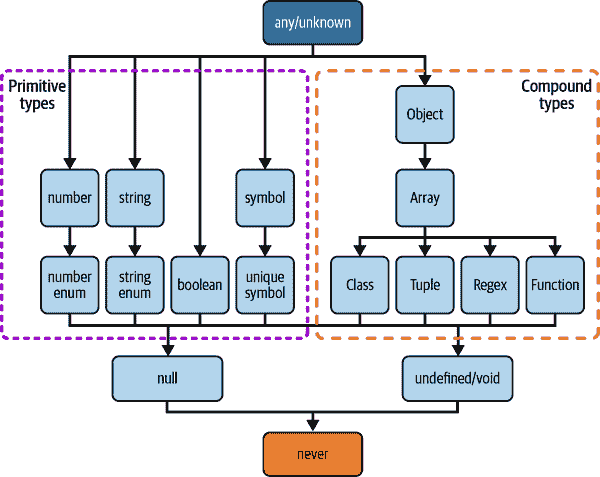

# 第二章：基本类型

现在你已经准备好了，是时候写一些 TypeScript 代码了！开始起步应该很容易，但很快你会遇到一些不确定是否正确的情况。你应该使用接口还是类型别名？应该注释还是让类型推断发挥魔力？`any` 和 `unknown` 又怎么样：它们安全吗？有些人在互联网上说你永远不应该使用它们，那为什么它们会成为 TypeScript 的一部分呢？

所有这些问题将在本章中得到解答。我们将查看构成 TypeScript 的基本类型，并了解经验丰富的 TypeScript 开发者如何使用它们。你可以将其作为即将到来的章节的基础，这样你就能感受到 TypeScript 编译器如何生成类型，以及它如何解释你的注释。

这是关于你的代码、编辑器和编译器之间的互动。它涉及到上下类型层次结构的交互，正如我们将在食谱 2.3 中看到的那样。无论你是经验丰富的 TypeScript 开发者还是刚入门的人，你都会在本章中找到有用的信息。

# 2.1 有效注释

## 问题

注释类型是繁琐且无聊的。

## 解决方案

只有当你希望检查类型时才添加注释。

## 讨论

类型注释是一种明确告知期望的类型的方式。你知道，在其他编程语言中，`StringBuilder stringBuilder = new StringBuilder()` 的冗长确保你确实在处理一个 `StringBuilder`。相反的是类型推断，其中 TypeScript 尝试为你推断类型：

```
// Type inference
let aNumber = 2;
// aNumber: number

// Type annotation
let anotherNumber: number = 3;
// anotherNumber: number
```

类型注释也是 TypeScript 和 JavaScript 之间最显而易见的语法差异。

当你开始学习 TypeScript 时，你可能希望注释所有内容以表达你期望的类型。这可能会感觉是显而易见的选择，但你也可以节省地使用注释，让 TypeScript 为你推断类型。

类型注释是你表达需要检查契约的地方。如果你在变量声明中添加类型注释，你告诉编译器在赋值过程中检查类型是否匹配：

```
type Person = {
  name: string;
  age: number;
};

const me: Person = createPerson();
```

如果 `createPerson` 返回的东西与 `Person` 不兼容，TypeScript 将抛出错误。如果你确实希望确保处理正确类型，请这样做。

从这一刻起，`me` 是 `Person` 类型，并且 TypeScript 将其视为 `Person`。如果 `me` 还有更多属性——例如 `profession`——TypeScript 将不允许你访问它们。这在 `Person` 中未定义。

如果你在函数签名的返回值中添加类型注释，你告诉编译器在返回该值的时候检查类型是否匹配：

```
function createPerson(): Person {
  return { name: "Stefan", age: 39 };
}
```

如果返回的内容与 `Person` 不匹配，TypeScript 将抛出错误。如果你想完全确保返回正确的类型，可以这样做。特别是在处理从各种来源构建大对象的函数时，这非常方便。

如果你给函数签名的参数添加类型注解，你告诉编译器在传递参数时检查类型是否匹配：

```
function printPerson(person: Person) {
  console.log(person.name, person.age);
}

printPerson(me);
```

在我看来，这是最重要且不可避免的类型注解。其他一切都可以推断：

```
type Person = {
  name: string;
  age: number;
};

// Inferred!
// return type is { name: string, age: number }
function createPerson() {
  return { name: "Stefan", age: 39 };
}

// Inferred!
// me: { name: string, age: number}
const me = createPerson();

// Annotated! You have to check if types are compatible
function printPerson(person: Person) {
  console.log(person.name, person.age);
}

// All works
printPerson(me);
```

当你期望一个注解而使用推断的对象类型时，你可以使用 TypeScript 的 *结构类型系统*。在结构类型系统中，编译器只会考虑类型的成员（属性），而不是实际的名称。

如果要检查的类型的所有成员在值的类型中都可用，则这些类型是兼容的。我们也说类型的 *形状* 或 *结构* 必须匹配：

```
type Person = {
  name: string;
  age: number;
};

type User = {
  name: string;
  age: number;
  id: number;
};

function printPerson(person: Person) {
  console.log(person.name, person.age);
}

const user: User = {
  name: "Stefan",
  age: 40,
  id: 815,
};

printPerson(user); // works!
```

`User` 拥有比 `Person` 更多的属性，但是所有 `Person` 中的属性也都在 `User` 中，并且类型相同。这就是为什么可以将 `User` 对象传递给 `printPerson`，即使这些类型没有显式的连接。

但是，如果你传递一个文字量，TypeScript 将抱怨存在不应该存在的多余属性：

```
printPerson({
  name: "Stefan",
  age: 40,
  id: 1000,
  // ^- Argument of type '{ name: string; age: number; id: number; }'
  //    is not assignable to parameter of type 'Person'.
  //    Object literal may only specify known properties,
  //    and 'id' does not exist in type 'Person'.(2345)
});
```

这确保了你不会期望这种类型存在某些属性，然后惊讶地发现更改它们没有效果。

使用结构类型系统，你可以创建具有推断类型的承载变量的有趣模式，并且可以在软件的不同部分重复使用相同的变量，而彼此之间没有类似的连接：

```
type Person = {
  name: string;
  age: number;
};

type Studying = {
  semester: number;
};

type Student = {
  id: string;
  age: number;
  semester: number;
};

function createPerson() {
  return { name: "Stefan", age: 39, semester: 25, id: "XPA" };
}

function printPerson(person: Person) {
  console.log(person.name, person.age);
}

function studyForAnotherSemester(student: Studying) {
  student.semester++;
}

function isLongTimeStudent(student: Student) {
  return student.age - student.semester / 2 > 30 && student.semester > 20;
}

const me = createPerson();

// All work!
printPerson(me);
studyForAnotherSemester(me);
isLongTimeStudent(me);
```

`Student`、`Person` 和 `Studying` 有一些重叠，但彼此无关。`createPerson` 返回与这三种类型兼容的内容。如果你注释过多，你需要创建比必要更多的类型和检查，而且没有任何好处。

因此，无论在哪里，你都应该对函数参数进行注解以便进行类型检查。

# 2.2 使用 `any` 和 `unknown`

## 问题

TypeScript 中有两个顶级类型，`any` 和 `unknown`。你应该使用哪一个？

## 解决方案

如果你希望有效地取消类型检查，请使用 `any`；当你需要谨慎处理时，请使用 `unknown`。

## 讨论

`any` 和 `unknown` 都是顶级类型，这意味着每个值都兼容于 `any` 或 `unknown`：

```
const name: any = "Stefan";
const person: any = { name: "Stefan", age: 40 };
const notAvailable: any = undefined;
```

由于 `any` 是一种每个值都兼容的类型，你可以无限制地访问任何属性：

```
const name: any = "Stefan";
// This is ok for TypeScript, but will crash in JavaScript
console.log(name.profession.experience[0].level);
```

`any` 也与每个子类型兼容，除了 `never`。这意味着你可以通过分配新类型来缩小可能值的集合：

```
const me: any = "Stefan";
// Good!
const name: string = me;
// Bad, but ok for the type system.
const age: number = me;
```

由于 `any` 非常宽容，它可能是潜在错误和陷阱的不断源头，因为你实际上是取消了类型检查。

虽然大家似乎都同意你不应该在代码库中使用 `any`，但在某些情况下，`any`确实非常有用：

迁移

当你从 JavaScript 迁移到 TypeScript 时，你可能已经有一个大型的代码库，其中包含大量关于数据结构和对象如何工作的隐含信息。一次性将所有内容明确化可能有些麻烦。`any`可以帮助你逐步迁移到更安全的代码库。

未类型化的第三方依赖项

你可能有一个 JavaScript 依赖项，仍然拒绝使用 TypeScript（或类似的东西）。甚至更糟糕的是：没有最新的类型定义。Definitely Typed 是一个很好的资源，但它也是由志愿者维护的。它是 JavaScript 中存在的东西的形式化，但并非直接从 JavaScript 派生而来。可能存在错误（甚至在像 React 这样的流行类型定义中），或者它们可能只是不是最新的！

这就是`any`可以帮助你的地方。当你了解库的工作原理，如果文档足够好以帮助你入门，并且你使用它不多时，`any`可以是一个选择，而不是与类型作斗争的选项。

JavaScript 原型

TypeScript 的工作方式与 JavaScript 有所不同，并需要做出许多权衡以确保你不会遇到边缘情况。这也意味着，如果你写的某些东西在 JavaScript 中可以工作，但在 TypeScript 中会出错：

```
type Person = {
  name: string;
  age: number;
};

function printPerson(person: Person) {
  for (let key in person) {
    console.log(`${key}: ${person[key]}`);
// Element implicitly has an 'any' --^
// type because expression of type 'string'
// can't be used to index type 'Person'.
// No index signature with a parameter of type 'string'
// was found on type 'Person'.(7053)
  }
}
```

查找在 Recipe 9.1 中为什么这是一个错误。在这种情况下，`any`可以帮助你暂时关闭类型检查，因为你知道你在做什么。而且由于你可以从任何类型转换到`any`，但也可以返回到任何其他类型，所以在你的代码中有少量明确的不安全块，你可以控制发生的事情：

```
function printPerson(person: any) {
  for (let key in person) {
    console.log(`${key}: ${person[key]}`);
  }
}
```

一旦你知道代码的这部分工作正常，你可以开始添加正确的类型，绕过 TypeScript 的限制，并进行类型断言：

```
function printPerson(person: Person) {
  for (let key in person) {
    console.log(`${key}: ${person[key as keyof Person]}`);
  }
}
```

每当使用`any`时，请确保在*tsconfig.json*中激活`noImplicitAny`标志；在`strict`模式下，默认已激活。TypeScript 需要你在通过推断或注释没有类型时显式注释`any`，这有助于在后续找到潜在的问题情况。

`any`的一种替代方案是`unknown`。它允许使用相同的值，但你可以做的事情完全不同。`any`允许你做任何事情，而`unknown`则不允许你做任何事情。你只能传递值；当你想要调用函数或使类型更具体时，首先需要进行类型检查：

```
const me: unknown = "Stefan";
const name: string = me;
//    ^- Type 'unknown' is not assignable to type 'string'.(2322)
const age: number = me;
//    ^- Type 'unknown' is not assignable to type 'number'.(2322)
```

类型检查和控制流分析帮助你更多地使用`unknown`：

```
function doSomething(value: unknown) {
  if (typeof value === "string") {
    // value: string
    console.log("It's a string", value.toUpperCase());
  } else if (typeof value === "number") {
    // value: number
    console.log("it's a number", value * 2);
  }
}
```

如果你的应用程序涉及大量不同类型，`unknown`非常适合确保你可以在整个代码中传递值，但不会因为`any`的宽松性而遇到安全问题。

# 2.3 选择正确的对象类型

## 问题

你希望允许 JavaScript 对象的值，但有三种不同的对象类型：`object`、`Object`和`{}`。你应该使用哪一个？

## 解决方案

对于对象、函数和数组等复合类型，请使用 `object`。对于所有具有值的情况，请使用 `{}`。

## 讨论

TypeScript 将其类型分为两个分支。第一个分支，*原始类型*，包括 `number`、`boolean`、`string`、`symbol`、`bigint` 和一些子类型。第二个分支，*复合类型*，包括所有对象的子类型，最终由其他复合类型或原始类型组成。图 2-1 提供了一个概述。



###### 图 2-1\. TypeScript 中的类型层次结构

在某些情况下，你希望针对*复合类型*的值，无论是因为你想修改某些属性还是因为你只是想确保不传递任何原始值。例如 `Object.create` 创建一个新对象，并将其原型作为第一个参数。这只能是一个*复合类型*；否则，你的运行时 JavaScript 代码将崩溃：

```
Object.create(2);
// Uncaught TypeError: Object prototype may only be an Object or null: 2
//    at Function.create (<anonymous>)
```

在 TypeScript 中，似乎有三种类型可以做同样的事情：空对象类型 `{}`，大写 `Object` 接口和小写 `object` 类型。你会选择哪一个用于复合类型？

`{}` 和 `Object` 允许大致相同的值，即除了 `null` 或 `undefined` 外的所有内容（假设激活了 `strict` 模式或 `strictNullChecks`）：

```
let obj: {}; // Similar to Object
obj = 32;
obj = "Hello";
obj = true;
obj = () => { console.log("Hello") };
obj = undefined; // Error
obj = null; // Error
obj = { name: "Stefan", age: 40 };
obj = [];
obj = /.*/;
```

`Object` 接口与所有具有 `Object` 原型的值兼容，这些值来自每种原始和复合类型。

然而，在 TypeScript 中，`Object` 是一个定义好的接口，并且对某些函数有一些要求。例如，`toString` 方法是 `toString() => string`，并且是任何非空值的一部分，它是 `Object` 原型的一部分。如果你分配一个具有不同 `tostring` 方法的值，TypeScript 将会报错：

```
let okObj: {} = {
  toString() {
    return false;
  }
}; // OK

let obj: Object = {
  toString() {
    return false;
  }
// ^-  Type 'boolean' is not assignable to type 'string'.ts(2322)
}
```

由于此行为，`Object` 可能会导致一些混淆，因此在大多数情况下，你可以使用 `{}`。

TypeScript 还有一个*小写* `object` 类型。这更接近你要找的类型，因为它允许任何复合类型，但不允许原始类型：

```
let obj: object;
obj = 32; // Error
obj = "Hello"; // Error
obj = true; // Error
obj = () => { console.log("Hello") };
obj = undefined;  // Error
obj = null; // Error
obj = { name: "Stefan", age: 40 };
obj = [];
obj = /.*/;
```

如果你想要一个排除函数、正则表达式、数组等的类型，请参阅第五章，我们在那里自己创建一个。

# 2.4 使用元组类型

## 问题

你正在使用 JavaScript 数组来组织你的数据。顺序很重要，每个位置的类型也很重要。但是 TypeScript 的类型推断使得处理起来非常繁琐。

## 解决方案

用元组类型进行注释。

## 讨论

像对象一样，JavaScript 数组是组织复杂对象数据的一种流行方式。与我们在其他示例中所做的典型 `Person` 对象不同，你可以逐个元素地存储条目：

```
const person = ["Stefan", 40]; // name and age
```

使用数组而不是对象的好处在于，数组元素没有属性名称。当你使用解构分配每个元素到变量时，可以很容易地分配自定义名称：

```
// objects.js
// Using objects
const person = {
  name: "Stefan",
  age: 40,
};

const { name, age } = person;

console.log(name); // Stefan
console.log(age); // 40

const { anotherName = name, anotherAge = age } = person;

console.log(anotherName); // Stefan
console.log(anotherAge); // 40

// arrays.js
// Using arrays
const person = ["Stefan", 40]; // name and age

const [name, age] = person;

console.log(name); // Stefan
console.log(age); // 40

const [anotherName, anotherAge] = person;

console.log(anotherName); // Stefan
console.log(anotherAge); // 40
```

对于需要不断分配新名称的 API，使用数组非常方便，正如在第十章中所解释的那样。

然而，在使用 TypeScript 并依赖类型推断时，这种模式可能会导致一些问题。默认情况下，TypeScript 从赋值推断数组类型。数组是具有相同元素在每个位置的开放集合：

```
const person = ["Stefan", 40];
// person: (string | number)[]
```

因此，TypeScript 认为 `person` 是一个数组，其中每个元素可以是字符串或数字，并允许在原始两个元素之后有大量元素。这意味着在解构时，每个元素也是`string`或`number`类型：

```
const [name, age] = person;
// name: string | number
// age: string | number
```

这使得 JavaScript 中的一个舒适模式在 TypeScript 中变得非常繁琐。您需要进行控制流检查以缩小到实际类型，而实际上从赋值中应该明确这是不必要的。

每当您认为在 JavaScript 中需要额外工作仅仅是为了满足 TypeScript 时，通常都有更好的方法。在这种情况下，您可以使用元组类型来更具体地指定数组应如何解释。

元组类型是数组类型的一个类似物，但其语义不同。虽然数组可能大小无限，并且每个元素都是相同类型的（无论多宽泛），元组类型具有固定的大小，并且每个元素具有不同的类型。

要获取元组类型，您只需显式注释：

```
const person: [string, number] = ["Stefan", 40];

const [name, age] = person;
// name: string
// age: number
```

太棒了！元组类型具有固定的长度；这意味着长度也编码在类型中。因此，不可能出现越界的赋值；TypeScript 将抛出错误：

```
person[1] = 41; // OK!
person[2] = false; // Error
//^- Type 'false' is not assignable to type 'undefined'.(2322)
```

TypeScript 还允许您向元组类型添加标签。这只是编辑器和编译器反馈的元信息，但它允许您更清楚地了解每个元素的期望值：

```
type Person = [name: string, age: number];
```

这将帮助您和您的同事理解期望值，就像对象类型一样。

元组类型还可以用于注释函数参数。这个函数：

```
function hello(name: string, msg: string): void {
  // ...
}
```

也可以使用元组类型编写：

```
function hello(...args: [name: string, msg: string]): {
  // ...
}
```

而且您可以非常灵活地定义它：

```
function h(a: string, b: string, c: string): void {
  //...
}
// equal to
function h(a: string, b: string, ...r: [string]): void {
  //...
}
// equal to
function h(a: string, ...r: [string, string]): void {
  //...
}
// equal to
function h(...r: [string, string, string]): void {
  //...
}
```

这些也被称为*剩余*元素，在 JavaScript 中我们有这样的功能，允许您定义几乎无限的参数列表；当它是最后一个元素时，*剩余*元素会吸收所有多余的参数。当您需要在代码中收集参数时，可以在将它们应用到函数之前使用一个元组：

```
const person: [string, number] = ["Stefan", 40];

function hello(...args: [name: string, msg: string]): {
 // ...
}

hello(...person);
```

元组类型在许多场景中非常有用。有关元组类型的更多信息，请参见第七章和第十章。

# 2.5 理解接口与类型别名之间的区别

## 问题

TypeScript 以两种方式声明对象类型：接口和类型别名。您应该使用哪一种？

## 解决方案

在项目边界内部使用类型别名，对于供他人使用的合同，请使用接口。

## 讨论

多年来，关于定义对象类型的两种方法的许多博客文章都涉及到这两种方法。但它们随时间变得过时。截至本文撰写时，类型别名和接口之间几乎没有区别。所有*以前*的差异已逐渐对齐。

从语法上看，接口和类型别名之间的区别是微妙的：

```
type PersonAsType = {
  name: string;
  age: number;
  address: string[];
  greet(): string;
};

interface PersonAsInterface {
  name: string;
  age: number;
  address: string[];
  greet(): string;
}
```

你可以在相同的场景中，为相同的事物使用接口和类型别名：

+   在类的实现声明中

+   作为对象字面量的类型注解

+   对于递归类型结构

然而，有一个重要的区别可能会引起通常不想处理的副作用：接口允许声明合并，但类型别名不允许。声明合并允许在接口已声明之后添加属性：

```
interface Person {
  name: string;
}

interface Person {
  age: number;
}

// Person is now { name: string; age: number; }
```

TypeScript 经常在*lib.d.ts*文件中使用这种技术，这样只需添加基于 ECMAScript 版本的新 JavaScript API 的增量。例如，如果你想扩展`Window`，这是一个很好的特性，但在其他情况下可能会适得其反：

```
// Some data we collect in a web form
interface FormData {
  name: string;
  age: number;
  address: string[];
}

// A function that sends this data to a backend
function send(data: FormData) {
  console.log(data.entries()) // this compiles!
  // but crashes horrendously in runtime
}
```

那么，`entries()`方法是从哪里来的呢？这是一个 DOM API！`FormData`是浏览器 API 提供的接口之一，而且还有很多类似的接口。它们是全局可用的，如果你扩展这些接口，是不会收到任何通知的。

当然，你可以争论正确的命名，但这个问题会影响你所提供的所有全局接口，甚至是一些依赖项中的接口，你甚至可能不知道它们向全局空间添加了一个接口。

将这个接口更改为类型别名会立即让你意识到这个问题：

```
type FormData = {
//   ^-- Duplicate identifier 'FormData'.(2300)
  name: string;
  age: number;
  address: string[];
};
```

如果你正在创建一个被项目中其他部分消费的库，甚至是完全由其他团队编写的其他项目，声明合并是一个非常棒的特性。它允许你定义一个描述你的应用程序的接口，但允许用户根据实际情况进行调整。想象一个插件系统，加载新模块增强功能：声明合并是一个你不想错过的特性。

然而，在你模块的边界内，使用类型别名可以防止你意外重用或扩展已声明的类型。当你不希望其他人使用它们时，请使用类型别名。

### 性能

在接口的评估中，使用类型别名而不是接口引发了一些讨论，因为接口在其评估中被认为更为高效，甚至在官方[TypeScript wiki](https://oreil.ly/8Y0hP)上也有性能建议。这些建议应该持保留态度。

在创建时，简单的类型别名可能比接口执行更快，因为接口永远不会关闭，并且可能与其他声明合并。但是，接口在其他地方可能执行得更快，因为它们在预先知道要成为对象类型。来自 TypeScript 团队的 Ryan Canavaugh 预计在声明了非常多的接口或类型别名时，性能差异将是可测量的：大约在[这条推文](https://oreil.ly/Y_2oS)中说明了这一点。

如果你的 TypeScript 代码库性能不佳，这并不是因为你声明了太多类型别名而不是接口，或者反之。

# 2.6 定义函数重载

## 问题

你的函数 API 非常灵活，允许不同类型的参数，其中上下文非常重要。这在单个函数签名中很难类型化。

## 解决方案

使用函数重载。

## 讨论

JavaScript 在处理函数参数时非常灵活。你可以传递基本上任何长度的任何参数。只要函数体正确处理输入，你就没问题。这使得 API 非常符合人体工程学，但同时也非常难以类型化。

想象一个概念上的任务运行器。通过 `task` 函数，你可以按名称定义新任务，然后传递回调函数或传递要执行的其他任务列表。或者两者兼有——在回调运行*之前*，需要执行的任务列表：

```
task("default", ["scripts", "styles"]);

task("scripts", ["lint"], () => {
    // ...
});

task("styles", () => {
    // ...
});
```

如果你觉得，“这看起来很像六年前的 Gulp”，你是对的。它的灵活 API 允许你几乎无所不能，这也是 Gulp 如此流行的原因之一。

类型函数的编写可能会是一场噩梦。可选参数，相同位置的不同类型——即使使用联合类型也很难处理：^(1)

```
type CallbackFn = () => void;

function task(
  name: string, param2: string[] | CallbackFn, param3?: CallbackFn
): void {
//...
}
```

这会捕捉到前面示例的所有变化，但它也是错误的，因为它允许不合理的组合：

```
task(
  "what",
  () => {
    console.log("Two callbacks?");
  },
  () => {
    console.log("That's not supported, but the types say yes!");
  }
);
```

幸运的是，TypeScript 有一种方法可以解决这类问题：函数重载。它的名字暗示了与其他编程语言相似的概念：相同的定义但具有不同的行为。与其他编程语言相比，TypeScript 最大的不同在于函数重载仅在类型系统层级上工作，并不影响实际实现。

思路是你将每种可能的情况定义为其自己的函数签名。最后一个函数签名是实际的实现：

```
// Types for the type system
function task(name: string, dependencies: string[]): void;
function task(name: string, callback: CallbackFn): void
function task(name: string, dependencies: string[], callback: CallbackFn): void
// The actual implementation
function task(
  name: string, param2: string[] | CallbackFn, param3?: CallbackFn
): void {
//...
}
```

这里有几件重要的事情需要注意。

首先，TypeScript 只会选取实际实现之前的声明作为可能的类型。如果实际实现的签名也相关，则会重复声明。

此外，实际的实现函数签名不能是任何东西。TypeScript 检查重载是否可以使用实现签名实现。

如果有不同的返回类型，你有责任确保输入和输出匹配：

```
function fn(input: number): number
function fn(input: string): string
function fn(input: number | string): number | string {
  if(typeof input === "number") {
    return "this also works";
  } else {
    return 1337;
  }
}

const typeSaysNumberButItsAString = fn(12);
const typeSaysStringButItsANumber = fn("Hello world");
```

实现签名通常与非常广泛的类型一起工作，这意味着您必须进行许多在 JavaScript 中无论如何都需要做的检查。这是件好事，因为它促使您格外小心。

如果您需要将重载函数作为它们自己的类型使用，以便在注释中使用并分配多个实现，您总是可以创建一个类型别名：

```
type TaskFn = {
  (name: string, dependencies: string[]): void;
  (name: string, callback: CallbackFn): void;
  (name: string, dependencies: string[], callback: CallbackFn): void;
}
```

正如您所见，您只需要类型系统的重载，而不是实际的实现定义。

# 2.7 定义此参数类型

## 问题

您正在编写对`this` 做出假设的回调函数，但在编写函数独立时不知道如何定义`this`。

## 解决方案

在函数签名的开头定义一个`this` 参数类型。

## 讨论

对于渴望成为 JavaScript 开发者的人来说，一个困惑的来源是`this` 对象指针的不断变化性质：

> 有时在编写 JavaScript 时，我想大声说：“这太荒谬了！”但我从来不知道* this * 指的是什么。
> 
> 未知的 JavaScript 开发者

前述声明尤其适用于您的背景是基于类的面向对象编程语言的情况，其中`this` 总是指向类的实例。JavaScript 中的`this` 完全不同，但并不一定更难理解。更重要的是，TypeScript 可以在使用中极大地帮助理解`this`。

`this` 存在于函数的作用域中，并且指向绑定到该函数的对象或值。在常规对象中，`this` 是非常简单明了的：

```
const author = {
  name: "Stefan",
  // function shorthand
  hi() {
    console.log(this.name);
  },
};

author.hi(); // prints 'Stefan'
```

但是在 JavaScript 中，函数是值，它们可以绑定到不同的上下文，从而有效地改变`this` 的值：

```
const author = {
  name: "Stefan",
};

function hi() {
  console.log(this.name);
}

const pet = {
  name: "Finni",
  kind: "Cat",
};

hi.apply(pet); // prints "Finni"
hi.call(author); // prints "Stefan"

const boundHi = hi.bind(author);

boundHi(); // prints "Stefan"
```

如果使用箭头函数而不是常规函数，则`this` 的语义再次改变也没有帮助：

```
class Person {
  constructor(name) {
    this.name = name;
  }

  hi() {
    console.log(this.name);
  }

  hi_timeout() {
    setTimeout(function() {
      console.log(this.name);
    }, 0);
  }

  hi_timeout_arrow() {
    setTimeout(() => {
      console.log(this.name);
    }, 0);
  }
}

const person = new Person("Stefan")
person.hi(); // prints "Stefan"
person.hi_timeout(); // prints "undefined"
person.hi_timeout_arrow(); // prints "Stefan"
```

使用 TypeScript，我们可以通过`this` 参数类型获得关于`this` 是什么以及更重要的是应该是什么的更多信息。

看看下面的例子。我们通过 DOM API 访问按钮元素并将事件侦听器绑定到它。在回调函数中，`this` 的类型是`HT⁠ML⁠Bu⁠tt⁠on​El⁠em⁠ent⁠`，这意味着您可以访问`classList` 等属性：

```
const button = document.querySelector("button");
button?.addEventListener("click", function() {
  this.classList.toggle("clicked");
});
```

`addEventListener` 函数提供关于`this` 的信息。如果您在重构步骤中提取函数，则保留功能，但 TypeScript 将出错，因为它失去了`this` 的上下文：

```
const button = document.querySelector("button");
button.addEventListener("click", handleToggle);

function handleToggle() {
  this.classList.toggle("clicked");
// ^- 'this' implicitly has type 'any'
//     because it does not have a type annotation
}
```

诀窍在于告诉 TypeScript `this` 应该是特定类型。您可以通过在函数签名的第一个位置添加名为`this` 的参数来做到这一点：

```
const button = document.querySelector("button");
button?.addEventListener("click", handleToggle);

function handleToggle(this: HTMLButtonElement) {
  this.classList.toggle("clicked");
}
```

一旦编译，此参数将被移除。TypeScript 现在具有确保`this` 必须是`HTMLButtonElement` 类型的所有信息，这也意味着一旦您在不同上下文中使用`handleToggle`，您会收到错误：

```
handleToggle();
// ^- The 'this' context of type 'void' is not
//    assignable to method's 'this' of type 'HTMLButtonElement'.
```

如果您定义`this` 为`HTMLElement`，它比`HTMLButtonElement` 的超类型更有用，您可以使`handleToggle` 更加实用：

```
const button = document.querySelector("button");
button?.addEventListener("click", handleToggle);

const input = document.querySelector("input");
input?.addEventListener("click", handleToggle);

function handleToggle(this: HTMLElement) {
  this.classList.toggle("clicked");
}
```

在处理 `this` 参数类型时，您可能希望使用两个辅助类型，可以从函数类型中提取或删除 `this` 参数。

```
function handleToggle(this: HTMLElement) {
  this.classList.toggle("clicked");
}

type ToggleFn = typeof handleToggle;
// (this: HTMLElement) => void

type WithoutThis = OmitThisParameter<ToggleFn>
// () = > void

type ToggleFnThis = ThisParameterType<ToggleFn>
// HTMLElement
```

类和对象中还有更多关于 `this` 的辅助类型。在《食谱》4.8 和 11.8 中查看更多内容。

# 2.8 使用符号工作

## 问题

您会看到类型 `symbol` 在某些错误消息中弹出，但您不知道符号的含义或如何使用它们。

## 解决方案

为您希望是唯一且不可迭代的对象属性创建符号。它们非常适合存储和访问敏感信息。

## 讨论

`symbol` 是 JavaScript 和 TypeScript 中的原始数据类型，除其他用途外，还可用于对象属性。与 `number` 和 `string` 相比，符号具有一些独特的特性。

可以使用 `Symbol()` 工厂函数创建符号：

```
const TITLE = Symbol('title')
```

`Symbol` 没有构造函数。参数是可选的描述。通过调用工厂函数，`TITLE` 被分配了这个新创建符号的唯一值。此符号现在是唯一的，与所有其他具有相同描述的符号不同，并且不会与任何其他具有相同描述的符号冲突：

```
const ACADEMIC_TITLE = Symbol('title')
const ARTICLE_TITLE = Symbol('title')

if(ACADEMIC_TITLE === ARTICLE_TITLE) {
  // This is never true
}
```

描述在开发时帮助您获取符号信息：

```
console.log(ACADEMIC_TITLE.description) // title
console.log(ACADEMIC_TITLE.toString()) // Symbol(title)
```

如果您想拥有可比较且独特的值进行运行时切换或模式比较，则符号非常适合：

```
// A really bad logging framework
const LEVEL_INFO = Symbol('INFO')
const LEVEL_DEBUG = Symbol('DEBUG')
const LEVEL_WARN = Symbol('WARN')
const LEVEL_ERROR = Symbol('ERROR')

function log(msg, level) {
  switch(level) {
    case LEVEL_WARN:
      console.warn(msg); break
    case LEVEL_ERROR:
      console.error(msg); break;
    case LEVEL_DEBUG:
      console.log(msg);
      debugger; break;
    case LEVEL_INFO:
      console.log(msg);
  }
}
```

符号也可以作为属性键，但不可迭代，这对于序列化非常有用：

```
const print = Symbol('print')

const user = {
  name: 'Stefan',
  age: 40,
  [print]: function() {
    console.log(`${this.name} is ${this.age} years old`)
  }
}

JSON.stringify(user) // { name: 'Stefan', age: 40 }
user[print]() // Stefan is 40 years old
```

全局符号注册表允许您跨整个应用程序访问令牌：

```
Symbol.for('print') // creates a global symbol

const user = {
  name: 'Stefan',
  age: 37,
  // uses the global symbol
  [Symbol.for('print')]: function() {
    console.log(`${this.name} is ${this.age} years old`)
  }
}
```

第一次调用 `Symbol.for` 创建一个符号，第二次调用使用相同的符号。如果您将符号值存储在变量中并想知道键，您可以使用 `Symbol.keyFor()`：

```
const usedSymbolKeys = []

function extendObject(obj, symbol, value) {
  //Oh, what symbol is this?
  const key = Symbol.keyFor(symbol)
  //Alright, let's better store this
  if(!usedSymbolKeys.includes(key)) {
    usedSymbolKeys.push(key)
  }
  obj[symbol] = value
}

// now it's time to retreive them all
function printAllValues(obj) {
  usedSymbolKeys.forEach(key => {
    console.log(obj[Symbol.for(key)])
  })
}
```

很巧妙！

TypeScript 对符号提供了全面的支持，它们是类型系统中的主要成员。`symbol` 本身是所有可能符号的数据类型注解。请参见上述代码块中的 `ex⁠ten⁠d​Ob⁠je⁠ct` 函数。为了允许所有符号扩展我们的对象，我们可以使用 `symbol` 类型：

```
const sym = Symbol('foo')

function extendObject(obj: any, sym: symbol, value: any) {
  obj[sym] = value
}

extendObject({}, sym, 42) // Works with all symbols
```

还有子类型 `unique symbol`。`unique symbol` 与声明紧密相关，仅允许在 `const` 声明中使用，并引用这个确切的符号，而不是其他任何符号。

您可以将 TypeScript 中的名义类型视为 JavaScript 中非常名义化的值。

要了解 `unique symbol` 的类型，您需要使用 `typeof` 运算符：

```
const PROD: unique symbol = Symbol('Production mode')
const DEV: unique symbol = Symbol('Development mode')

function showWarning(msg: string, mode: typeof DEV | typeof PROD) {
 // ...
}
```

在撰写本文时，唯一可能的名义类型是 TypeScript 的结构类型系统。

符号位于 TypeScript 和 JavaScript 中名义类型与不透明类型的交集。它们是我们在运行时最接近名义类型检查的东西。

# 2.9 理解值和类型命名空间

## 问题

令人困惑的是，您可以将某些名称用作类型注解，而不能用作其他名称。

## 解决方案

了解类型和值命名空间，以及哪些名称对应于什么。

## 讨论

TypeScript 是 JavaScript 的超集，这意味着它在已有的、已定义的语言基础上添加了更多内容。随着时间的推移，你会学会辨别哪些部分是 JavaScript，哪些部分是 TypeScript。

真的很有帮助将 TypeScript 视为常规 JavaScript 上的这一额外类型层，一层薄薄的元信息，在 JavaScript 代码在可用的运行时之一运行之前会被剥离。一些人甚至谈论 TypeScript 代码一旦编译后“擦除到 JavaScript”。

TypeScript 作为 JavaScript 顶层的这一层还意味着不同的语法贡献给不同的层。虽然`function`或`const`在 JavaScript 部分创建了一个名称，但`type`声明或`interface`贡献了 TypeScript 层的名称：

```
// Collection is in TypeScript land! --> type
type Collection = Person[]

// printCollection is in JavaScript land! --> value
function printCollection(coll: Collection) {
  console.log(...coll.entries)
}
```

我们还说声明会向*类型命名空间*或*值命名空间*贡献名称。由于类型层位于值层之上，可以在类型层消费值，但反之则不行。我们还有专门的关键字用于此目的：

```
// a value
const person = {
  name: "Stefan",
};

// a type
type Person = typeof person;
```

`typeof`从下面的值层创建一个在类型层可用的名称。

当存在既创建类型又创建值的声明类型时，会变得很恼人。例如，类可以在 TypeScript 层作为类型使用，也可以在 JavaScript 中作为值使用：

```
// declaration
class Person {
  name: string;

  constructor(n: string) {
    this.name = n;
  }
}

// used as a value
const person = new Person("Stefan");

// used as a type
type Collection = Person[];

function printPersons(coll: Collection) {
  //...
}
```

命名约定可能会让你困惑。通常，我们用大写字母开头定义类、类型、接口、枚举等。即使它们可能贡献值，它们肯定也贡献了类型。嗯，直到你为 React 应用程序编写大写函数，因为惯例要求如此。

如果你习惯于将名称用作类型和值，突然遇到旧有的“TS2749: *YourType* 指的是一个值，但却被用作类型”错误会让你摸不着头脑：

```
type PersonProps = {
  name: string;
};

function Person({ name }: PersonProps) {
  // ...
}

type PrintComponentProps = {
  collection: Person[];
  //          ^- 'Person' refers to a value,
  //              but is being used as a type
}
```

这就是 TypeScript 可以变得非常令人困惑的地方。什么是类型，什么是值，为什么我们需要将它们分开，为什么这不像其他编程语言那样工作？突然之间，你遇到了`typeof`调用或者甚至是`InstanceType`辅助类型，因为你意识到类实际上贡献了两种类型（见第十一章）。

类在类型命名空间中贡献名称，并且由于 TypeScript 是一个结构类型系统，它们允许具有与某个类实例相同形状的值。因此这是允许的：

```
class Person {
  name: string;

  constructor(n: string) {
    this.name = n;
  }
}

function printPerson(person: Person) {
  console.log(person.name);
}

printPerson(new Person("Stefan")); // ok
printPerson({ name: "Stefan" }); // also ok
```

然而，完全在值命名空间中工作并且仅在类型命名空间中产生影响的`instanceof`检查将失败，因为具有相同形状的对象可能具有相同的属性，但不是类的实际*实例*：

```
function checkPerson(person: Person) {
  return person instanceof Person;
}

checkPerson(new Person("Stefan")); // true
checkPerson({ name: "Stefan" }); // false
```

因此，了解是什么贡献类型，什么贡献值是很有用的。来自 TypeScript 文档修改的表 2-1，概括得很好。

表 2-1\. 类型和值命名空间

| 声明类型 | 类型 | 值 |
| --- | --- | --- |
| 类 | X | X |
| 枚举 | X | X |
| 接口 | X |  |
| 类型别名 | X |  |
| 函数 |  | X |
| 变量 |  | X |

如果你坚持使用函数、接口（或类型别名，请参见 Recipe 2.5）和变量开始学习，你会对在何处可以使用它们有所感觉。如果你使用类，考虑其影响可能需要更长时间。

^(1) 联合类型是将两种不同类型组合成一种的一种方法（详见第三章）。
