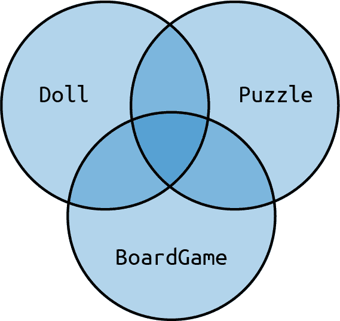
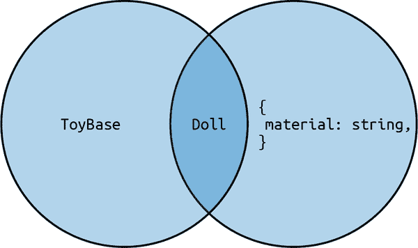
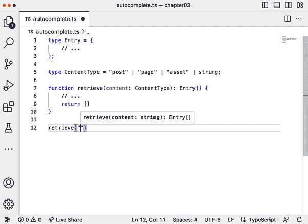
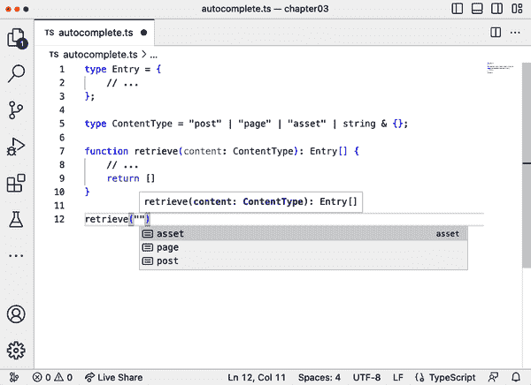

# 第三章：类型系统

在前一章中，你了解了允许你使 JavaScript 代码更具表现力的基本构建块。但如果你在 JavaScript 中有经验，你会明白 TypeScript 的基本类型和注解只覆盖了其固有灵活性的一小部分。

TypeScript 的目标是让 JavaScript 的意图更加清晰，并且在不牺牲灵活性的情况下做到这一点，特别是它允许开发者设计出被数百万人使用和喜爱的出色 API。把 TypeScript 更多地看作是形式化 JavaScript 的一种方式，而不是限制它。进入 TypeScript 的类型系统。

在本章中，你将建立一个关于类型如何思考的思维模型。你将学习如何根据需要定义值集合的范围，如何在控制流程中改变它们的作用范围，以及如何利用结构类型系统，以及何时打破规则。

本章界定了 TypeScript 基础和高级类型技术之间的分界线。但无论你是经验丰富的 TypeScript 开发者还是刚刚入门，这种思维模型都将成为未来所有内容的基础。

# 3.1 使用联合和交集类型建模数据

## 问题

你有一个复杂的数据模型，你想在 TypeScript 中描述它。

## 解决方案

使用联合类型和交集类型对你的数据进行建模。使用字面类型来定义具体的变体。

## 讨论

假设你正在为一个玩具店创建数据模型。这个玩具店中的每个物品都有一些基本属性：名称、数量和建议的最小年龄。其他属性只有在每种特定类型的玩具中才相关，这要求你创建几个衍生类：

```
type BoardGame = {
  name: string;
  price: number;
  quantity: number;
  minimumAge: number;
  players: number;
};

type Puzzle = {
  name: string;
  price: number;
  quantity: number;
  minimumAge: number;
  pieces: number;
};

type Doll = {
  name: string;
  price: number;
  quantity: number;
  minimumAge: number;
  material: string;
};
```

对于你创建的函数，你需要一个代表所有玩具的类型，一个包含所有玩具共同基本属性的超类型：

```
type ToyBase = {
  name: string;
  price: number;
  quantity: number;
  minimumAge: number;
};

function printToy(toy: ToyBase) {
  /* ... */
}

const doll: Doll = {
  name: "Mickey Mouse",
  price: 9.99,
  quantity: 10000,
  minimumAge: 2,
  material: "plush",

};

printToy(doll); // works
```

这个方法可行，因为你可以用这个函数打印所有的玩偶、棋盘游戏或者拼图，但有一个重要的注意事项：在`printToy`函数中，你会丢失原始玩具的信息。你只能打印通用属性，而不能打印特定属性。

对于表示所有可能玩具的类型，你可以创建一个*联合类型*：

```
// Union Toy
type Toy = Doll | BoardGame | Puzzle;

function printToy(toy: Toy) {
  /* ... */
}
```

把类型看作是一组兼容值的好方法。对于每个值，无论是否有注解，TypeScript 都会检查这个值是否与某个类型兼容。对于对象来说，这还包括具有比其类型定义中定义的更多属性的值。通过推断，具有更多属性的值在结构类型系统中被分配为子类型。而子类型的值也属于超类型集合。

联合类型是集合的联合。兼容值的数量变得更广泛，类型之间也存在一些重叠。例如，一个既有`material`又有`players`的对象可以同时兼容`Doll`和`BoardGame`。这是一个需要注意的细节，在 Recipe 3.2 中可以看到处理这个细节的方法。

Figure 3-1 以 Venn 图的形式说明了联合类型的概念。在这里，集合理论的类比同样适用。



###### Figure 3-1\. 联合类型的可视化；每种类型代表了一组兼容的值，而联合类型则表示这些集合的并集

你可以随处创建联合类型，甚至可以用原始类型：

```
function takesNumberOrString(value: number | string) {
  /* ... */
}

takesNumberOrString(2); // ok
takesNumberOrString("Hello"); // ok
```

这使得你可以根据需要扩展值的集合。

正如你在玩具店示例中看到的那样，存在一些冗余：`ToyBase` 属性被重复了。如果我们能够将 `ToyBase` 用作每个联合部分的基础，那将会更好。而我们可以，使用交叉类型：

```
type ToyBase = {
  name: string;
  price: number;
  quantity: number;
  minimumAge: number;
};

// Intersection of ToyBase and { players: number }
type BoardGame = ToyBase & {
  players: number;
};

// Intersection of ToyBase and { pieces: number }
type Puzzle = ToyBase & {
  pieces: number;
};

// Intersection of ToyBase and { material: string }
type Doll = ToyBase & {
  material: string;
};
```

就像联合类型一样，*交叉类型* 类似于集合理论中的对应物。它告诉 TypeScript 兼容的值需要同时是类型 `A` *和* 类型 `B`。现在的类型接受了一个更窄的值集合，其中包括两种类型及其子类型的所有属性。Figure 3-2 展示了交叉类型的可视化。

交叉类型也适用于原始类型，但它们没有什么好处。`string & number` 的交叉结果为 `never`，因为没有值同时满足 `string` 和 `number` 属性。



###### Figure 3-2\. 两种类型的交叉类型的可视化；可能值的集合变得更窄

###### 注意

相比于类型别名和交叉类型，你也可以使用接口来定义你的模型。在 Recipe 2.5 中，我们讨论了它们之间的区别，你需要注意其中的一些差异。因此，`type BoardGame = ToyBase & { /* ... */ }` 可以很容易地被描述为 `interface BoardGame extends ToyBase { /* ... */ }`。然而，你不能定义一个联合类型的接口。不过，你可以定义接口的联合。

这些已经是 TypeScript 中对数据建模的很好的方法了，但我们可以做得更多。在 TypeScript 中，字面量值可以表示为字面量类型。例如，我们可以定义一个只是数字 `1` 的类型，唯一兼容的值是 `1`：

```
type One = 1;
const one: One = 1; // nothing else can be assigned.
```

这被称为*字面量类型*，虽然它单独看起来似乎没有太大用处，但当你将多个字面量类型组合成联合类型时，它非常有用。例如，对于 `Doll` 类型，我们可以明确设置 `material` 的允许值：

```
type Doll = ToyBase & {
  material: "plush" | "plastic";
};

function checkDoll(doll: Doll) {
  if (doll.material === "plush") {
    // do something with plush
  } else {
    // doll.material is "plastic", there are no other options
  }
}
```

这使得除了 `"plush"` 或 `"plastic"` 之外的任何值都无法赋给它，从而使我们的代码更加健壮。

借助联合类型、交叉类型和字面量类型，即使是复杂的模型也能更轻松地定义。

# 3.2 明确定义具有辨别联合类型的模型

## 问题

你模拟的联合类型的部分具有巨大的属性重叠，因此在控制流中区分它们变得非常麻烦。

## 解决方案

对每个联合部分添加一个 `kind` 属性，带有一个字符串字面量类型，并检查其内容。

## 讨论

让我们来看一个类似于我们在 食谱 3.1 中创建的数据模型。这一次，我们想为图形软件定义各种形状：

```
type Circle = {
  radius: number;
};

type Square = {
  x: number;
};

type Triangle = {
  x: number;
  y: number;
};

type Shape = Circle | Triangle | Square;
```

类型之间有一些相似之处，但在 `area` 函数中仍然有足够的信息来区分它们：

```
function area(shape: Shape) {
  if ("radius" in shape) {
    // shape is Circle
    return Math.PI * shape.radius * shape.radius;
  } else if ("y" in shape) {
    // shape is Triangle
    return (shape.x * shape.y) / 2;
  } else {
    // shape is Square
    return shape.x * shape.x;
  }
}
```

这样做是有效的，但存在一些注意事项。虽然 `Circle` 是唯一带有 `radius` 属性的类型，`Triangle` 和 `Square` 共享 `x` 属性。由于 `Square` 仅包含 `x` 属性，这使得 `Triangle` 成为 `Square` 的子类型。

鉴于我们首先定义了控制流以检查区分子类型属性 `y`，这不是一个问题，但仅仅检查 `x` 并创建一个在控制流中同时计算 `Triangle` 和 `Square` 区域的分支太容易了，这是错误的。

扩展 `Shape` 也很困难。如果我们查看矩形所需的属性，我们会发现它包含与 `Triangle` 相同的属性：

```
type Rectangle = {
  x: number;
  y: number;
};

type Shape = Circle | Triangle | Square | Rectangle;
```

没有明确的方法来区分联合类型的每个部分。为了确保联合类型的每个部分可区分，我们需要在我们的模型中增加一个识别属性，清楚地表明我们正在处理什么。

通过添加 `kind` 属性可以发生这种情况。该属性采用字符串文字类型来标识模型的部分。

如 食谱 3.1 中所示，TypeScript 允许你将原始类型如 `string`、`number`、`bigint` 和 `boolean` 缩小到具体的值。这意味着每个值也是一种类型，一个由完全兼容的单个值组成的集合。

因此，为了清晰地定义我们的模型，我们向每个模型部分添加一个 `kind` 属性，并将其设置为标识此部分的确切文字类型：

```
type Circle = {
  radius: number;
  kind: "circle";
};

type Square = {
  x: number;
  kind: "square";
};

type Triangle = {
  x: number;
  y: number;
  kind: "triangle";
};

type Shape = Circle | Triangle | Square;
```

请注意，我们不将 `kind` 设置为 `string`，而是设置为精确的文字类型 `"circle"`（或分别为 `"square"` 和 `"triangle"`）。这是一种类型，而不是值，但唯一兼容的值是文字字符串。

添加具有字符串文字类型的 `kind` 属性可以确保联合类型的各部分之间没有重叠，因为文字类型彼此不兼容。这种技术称为*辨识联合类型*，有效地分离联合类型 `Shape` 的每个集合。

这对于 `area` 函数非常棒，因为我们可以有效地区分，例如在 `switch` 语句中：

```
function area(shape: Shape) {
  switch (shape.kind) {
    case "circle": // shape is Circle
      return Math.PI * shape.radius * shape.radius;
    case "triangle": // shape is Triangle
      return (shape.x * shape.y) / 2;
    case "square": // shape is Square
      return shape.x * shape.x;
    default:
      throw Error("not possible");
  }
}
```

这不仅使我们清楚地知道我们在处理什么，而且对即将到来的变更非常未来化，正如我们将在 食谱 3.3 中看到的那样。

# 3.3 使用断言技术进行完备性检查

## 问题

您的辨识联合类型随着时间的推移而变化，向联合中添加新的部分。在您的代码中跟踪所有需要适应这些更改的位置变得困难。

## 解决方案

创建穷尽性检查，其中你断言所有剩余情况都不可能发生，使用一个`assertNever`函数。

## 讨论

让我们来看一下 Recipe 3.2 中的完整示例：

```
type Circle = {
  radius: number;
  kind: "circle";
};

type Square = {
  x: number;
  kind: "square";
};

type Triangle = {
  x: number;
  y: number;
  kind: "triangle";
};

type Shape = Circle | Triangle | Square;

function area(shape: Shape) {
  switch (shape.kind) {
    case "circle": // shape is Circle
      return Math.PI * shape.radius * shape.radius;
    case "triangle": // shape is Triangle
      return (shape.x * shape.y) / 2;
    case "square": // shape is Square
      return shape.x * shape.x;
    default:
      throw Error("not possible");
  }
}
```

使用辨别联合，我们可以区分联合类型的每个部分。`area`函数使用 switch-case 语句分别处理每种情况。由于`kind`属性的字符串文字类型，类型之间不会重叠。

一旦所有选项都被耗尽，在默认情况下，我们抛出一个错误，表明我们达到了一个无效的情况，这是永远不应该发生的。如果我们的类型在整个代码库中都正确，这个错误应该永远不会被抛出。

即使类型系统告诉我们默认情况是不可能发生的场景。如果我们在默认情况下添加`shape`并将鼠标悬停在其上，TypeScript 告诉我们`shape`的类型是`never`：

```
function area(shape: Shape) {
  switch (shape.kind) {
    case "circle": // shape is Circle
      return Math.PI * shape.radius * shape.radius;
    case "triangle": // shape is Triangle
      return (shape.x * shape.y) / 2;
    case "square": // shape is Square
      return shape.x * shape.x;
    default:
      console.error("Shape not defined:", shape); // shape is never
      throw Error("not possible");
  }
}
```

`never`是一种有趣的类型。它是 TypeScript 的*底部类型*，意味着它处于类型层次结构的最末端。而`any`和`unknown`包括每一个可能的值，没有值与`never`兼容。它是空集，这解释了它的名称。如果你的值之一恰好是`never`类型，你处于一个永远不应该发生的情况中。

在默认情况下，`shape`的类型会立即改变，如果我们例如扩展`Shape`类型为`Rectangle`：

```
type Rectangle = {
  x: number;
  y: number;
  kind: "rectangle";
};

type Shape = Circle | Triangle | Square | Rectangle;

function area(shape: Shape) {
  switch (shape.kind) {
    case "circle": // shape is Circle
      return Math.PI * shape.radius * shape.radius;
    case "triangle": // shape is Triangle
      return (shape.x * shape.y) / 2;
    case "square": // shape is Square
      return shape.x * shape.x;
    default:
      console.error("Shape not defined:", shape); // shape is Rectangle
      throw Error("not possible");
  }
}
```

这是控制流分析的最佳实践：TypeScript 在每个时间点都准确地知道你的值的类型。在`default`分支中，`shape`的类型是`Rectangle`，但我们期望处理矩形。如果 TypeScript 能告诉我们，我们漏掉了处理可能类型的地方，那就太棒了。现在，每次计算矩形形状时，我们都会遇到这个问题。默认情况的目的是处理（从类型系统的角度来看）不可能的情况；我们希望保持这种状态。

在某种情况下这已经是糟糕的情况，并且如果你在代码库中多次使用穷尽性检查模式，情况会变得更糟。你无法确定自己是否确实没有遗漏一个可能导致软件最终崩溃的地方。

确保你处理了所有可能情况的一种技术是创建一个帮助函数，断言所有选项都已穷尽。它应该确保唯一可能的值是没有值：

```
function assertNever(value: never) {
  console.error("Unknown value", value);
  throw Error("Not possible");
}
```

通常，你会将`never`看作是你处于一个不可能的情况的指示器。在这里，我们将其用作函数签名的显式类型注释。你可能会问：我们应该传递哪些值？答案是：没有！在最好的情况下，这个函数永远不会被调用。

然而，如果我们将示例中的原始默认情况替换为`as⁠se⁠rt​Ne⁠ve⁠r`，我们可以利用类型系统确保所有可能的值都是兼容的，即使没有值存在：

```
function area(shape: Shape) {
  switch (shape.kind) {
    case "circle": // shape is Circle
      return Math.PI * shape.radius * shape.radius;
    case "triangle": // shape is Triangle
      return (shape.x * shape.y) / 2;
    case "square": // shape is Square
      return shape.x * shape.x;
    default: // shape is Rectangle
      assertNever(shape);
//    ^-- Error: Argument of type 'Rectangle' is not
//        assignable to parameter of type 'never'
  }
}
```

很棒！现在当我们忘记耗尽所有选项时，我们会看到红色波浪线。 TypeScript 在没有错误的情况下不会编译此代码，并且很容易在代码库中找到所有需要添加`Rectangle`情况的位置：

```
function area(shape: Shape) {
  switch (shape.kind) {
    case "circle": // shape is Circle
      return Math.PI * shape.radius * shape.radius;
    case "triangle": // shape is Triangle
      return (shape.x * shape.y) / 2;
    case "square": // shape is Square
      return shape.x * shape.x;
    case "rectangle":
      return shape.x * shape.y;
    default: // shape is never
      assertNever(shape); // shape can be passed to assertNever!
  }
}
```

尽管`never`没有兼容的值，并且用于指示 - 对于类型系统 - 一个不可能的情况，我们可以使用类型作为类型注释，以确保我们不忘记*可能的*情况。将类型视为根据控制流而变得更广或更窄的兼容值集合，使我们能够利用诸如`assertNever`之类的技术，这是一个非常有用的小函数，可以增强我们代码库的质量。

# 3.4 使用`const`上下文固定类型

## 问题

您不能将对象字面量分配给精心设计的辨别联合类型。

## 解决方案

使用类型断言和*const 上下文*固定你的字面量类型。

## 讨论

在 TypeScript 中，您可以将每个值用作其自身的类型。这些被称为文字类型，允许您将更大的集合子集化为仅仅几个有效值。

TypeScript 中的文字类型不仅是指向特定值的好技巧，而且是类型系统工作的重要部分。当您通过`let`或`const`将原始类型的值分配给不同的绑定时，这一点变得显而易见。

如果我们两次分配相同的值，一次通过`let`，一次通过`const`，TypeScript 将推断出两种不同的类型。使用`let`绑定时，TypeScript 将推断出更广泛的原始类型：

```
let name = "Stefan"; // name is string
```

使用`const`绑定时，TypeScript 将推断出精确的文字类型：

```
const name = "Stefan"; // name is "Stefan"
```

对象类型的行为略有不同。 `let`绑定仍然推断出更广泛的集合：

```
// person is { name: string }
let person = { name: "Stefan" };
```

但`const`绑定也是如此：

```
// person is { name: string }
const person = { name: "Stefan" };
```

这背后的推理是在 JavaScript 中，尽管绑定本身是*常量*，这意味着我无法重新分配`person`，但对象属性的值可以更改：

```
// person is { name: string }
const person = { name: "Stefan" };

person.name = "Not Stefan"; // works!
```

从正确性的角度来看，这种行为反映了 JavaScript 的行为，但在我们对数据模型非常精确时可能会引发问题。

在前面的配方中，我们使用联合和交集类型对数据进行建模。我们使用*辨别联合类型*来区分那些非常相似的类型。

问题在于当我们将文字用于数据时，TypeScript 通常会推断出更广泛的集合，这使得值与定义的类型不兼容。这会产生一个非常冗长的错误消息：

```
type Circle = {
  radius: number;
  kind: "circle";
};

type Square = {
  x: number;
  kind: "square";
};

type Triangle = {
  x: number;
  y: number;
  kind: "triangle";
};

type Shape = Circle | Triangle | Square;

function area(shape: Shape) {
  /* ... */
}

const circle = {
  radius: 2,
  kind: "circle",
};

area(circle);
//   ^-- Argument of type '{ radius: number; kind: string; '
//       is not assignable to parameter of type 'Shape'.
//       Type '{ radius: number; kind: string; }' is not
//       assignable to type 'Circle'.
//       Types of property 'kind' are incompatible.
//       Type 'string' is not assignable to type '"circle"'.
```

解决这个问题有几种方法。首先，我们可以使用显式注解来确保类型。如 Recipe 2.1 中所述，每个注解都是一个类型检查，这意味着右侧的值将被检查其兼容性。由于没有推断，Typescript 将查看确切的值以决定对象字面量是否兼容：

```
// Exact type
const circle: Circle = {
  radius: 2,
  kind: "circle",
};

area(circle); // Works!

// Broader set
const circle: Shape = {
  radius: 2,
  kind: "circle",
};

area(circle); // Also works!
```

我们还可以在赋值结束时进行类型断言，而不是类型注释：

```
// Type assertion
const circle = {
  radius: 2,
  kind: "circle",
} as Circle;

area(circle); // Works!
```

然而，有时注释可能会限制我们。特别是当我们必须处理包含更多信息并在不同地方以不同语义使用的文字时，这一点尤为真实。

从我们注释或断言为 `Circle` 开始，绑定将始终是一个圆，无论 `circle` 实际携带哪些值。

但是我们可以通过断言变得更加精细。我们可以断言单个属性为特定类型，而不是断言整个对象为某种类型：

```
const circle = {
  radius: 2,
  kind: "circle" as "circle",
};

area(circle); // Works!
```

另一种断言确切值的方法是使用*常量上下文*与 `as const` 类型断言；TypeScript 将值锁定为文字类型：

```
const circle = {
  radius: 2,
  kind: "circle" as const,
};

area(circle); // Works!
```

如果我们将*常量上下文*应用于整个对象，我们还确保这些值是只读的，不会被更改：

```
const circle = {
  radius: 2,
  kind: "circle",
} as const;

area2(circle); // Works!

circle.kind = "rectangle";
//     ^-- Cannot assign to 'kind' because
//         it is a read-only property.
```

*常量上下文*类型断言是一个非常方便的工具，如果我们想要将值固定为其确切的文字类型并保持不变。如果在代码库中有许多对象文字，它们不应更改但需要在各种场合使用，*常量上下文*可以帮助！

# 3.5 使用类型断言缩小类型

## 问题

基于特定条件，你可以断言一个值的类型比最初分配的更窄，但 TypeScript 无法为你缩小它。

## 解决方案

将类型断言添加到辅助函数的签名中，以指示布尔条件对类型系统的影响。

## 讨论

借助文字类型和联合类型，TypeScript 允许你定义非常具体的值集合。例如，我们可以轻松定义一个具有六个面的骰子：

```
type Dice = 1 | 2 | 3 | 4 | 5 | 6;
```

虽然这种标记法很有表现力，并且类型系统可以告诉你确切哪些值是有效的，但需要一些工作才能达到这种类型。

假设我们有某种游戏，允许用户输入任何数字。如果是有效的点数，我们执行某些操作。

我们编写一个条件检查，看看输入的数字是否属于一组值：

```
function rollDice(input: number) {
  if ([1, 2, 3, 4, 5, 6].includes(input)) {
    // `input` is still `number`, even though we know it
    // should be Dice
  }
}
```

问题在于，尽管我们进行了检查以确保值集合是已知的，TypeScript 仍将 `input` 处理为 `number`。类型系统无法将你的检查与类型系统的变化联系起来。

但是你可以帮助类型系统。首先，将你的检查提取到自己的辅助函数中：

```
function isDice(value: number): boolean {
  return [1, 2, 3, 4, 5, 6].includes(value);
}
```

请注意，此检查返回一个 `boolean`。这个条件要么为真，要么为假。对于返回布尔值的函数，我们可以将函数签名的返回类型更改为类型断言。

我们告诉 TypeScript，如果这个函数返回 true，我们更了解传递给函数的值。在我们的例子中，`value` 的类型是 `Dice`：

```
function isDice(value: number): value is Dice {
  return [1, 2, 3, 4, 5, 6].includes(value);
}
```

有了这个，TypeScript 可以获得你的值的实际类型的提示，让你能够对值进行更精细的操作：

```
function rollDice(input: number) {
  if (isDice(input)) {
    // Great! `input` is now `Dice`
  } else {
    // input is still `number`
  }
}
```

TypeScript 是严格的，不允许使用任何带有类型谓词的断言。它需要是比原始类型更窄的类型。例如，获取`string`输入并断言`number`的子集将导致错误：

```
type Dice = 1 | 2 | 3 | 4 | 5 | 6;

function isDice(value: string): value is Dice {
// Error: A type predicate's type must be assignable to
// its parameter's type. Type 'number' is not assignable to type 'string'.
  return ["1", "2", "3", "4", "5", "6"].includes(value);
}
```

这种失效安全机制在类型级别上为您提供了一些保证，但有一个警告：它不会检查您的条件是否合理。`isDice`中的原始检查确保传递的值包含在有效数字数组中。

此数组中的值由您选择。如果包含错误的数字，TypeScript 仍然会认为`value`是有效的`Dice`，尽管您的检查不匹配：

```
// Correct on a type-level
// incorrect set of values on a value-level
function isDice(value: number): value is Dice {
  return [1, 2, 3, 4, 5, 7].includes(value);
}
```

这很容易引起混淆。在示例 3-1 中的条件对于整数是正确的，但如果传递浮点数则是错误的。例如，`3.1415`将是有效的`Dice`点数！

##### 示例 3-1\. 浮点数的`isDice`逻辑不正确

```
// Correct on a type-level, incorrect logic
function isDice(value: number): value is Dice {
  return value >= 1 && value <= 6;
}
```

实际上，任何条件都适用于 TypeScript。返回`true`，TypeScript 将认为`value`是`Dice`：

```
function isDice(value: number): value is Dice {
  return true;
}
```

TypeScript 让您控制类型断言。您有责任确保这些断言是有效和合理的。如果您大量依赖类型断言和类型谓词，确保相应进行测试。

# 3.6 理解 void

## 问题

在其他编程语言中，你知道`void`是一个概念，但在 TypeScript 中它的行为可能有所不同。

## 解决方案

拥抱`void`作为回调的可替代类型。

## 讨论

您可能从 Java 或 C#等编程语言中了解`void`，其中它表示没有返回值。`void`也存在于 TypeScript 中，乍一看它做的事情也是一样的：如果您的函数或方法没有返回值，返回类型是`void`。

然而，仔细观察时，`void`的行为有些微妙，它在类型系统中的位置也是如此。在 TypeScript 中，`void`是`undefined`的子类型。JavaScript 中的函数总是返回一些东西。函数显式返回一个值，或者隐式返回`undefined`：

```
function iHaveNoReturnValue(i) {
  console.log(i);
}

let check = iHaveNoReturnValue(2);
// check is undefined
```

如果我们为`iHaveNoReturnValue`创建一个类型，它将显示一个带有`void`作为返回类型的函数类型：

```
function iHaveNoReturnValue(i) {
  console.log(i);
}

type Fn = typeof iHaveNoReturnValue;
// type Fn = (i: any) => void
```

`void`作为类型也可以用于参数和所有其他声明。唯一可以传递的值是`undefined`：

```
function iTakeNoParameters(x: void): void { }

iTakeNoParameters(); // works
iTakeNoParameters(undefined); // works
iTakeNoParameters(void 2); // works
```

`void`和`undefined`几乎相同。但有一个显著的区别：`void`作为返回类型可以被不同类型替换，以允许高级回调模式。例如，让我们创建一个`fetch`函数。它的任务是获取一组数字并将结果传递给作为参数提供的回调函数：

```
function fetchResults(
  callback: (statusCode: number, results: number[]) => void
) {
  // get results from somewhere ...
  callback(200, results);
}
```

回调函数在其签名中有两个参数——状态码和结果——返回类型是`void`。我们可以使用与`callback`精确类型匹配的回调函数调用`fetchResults`：

```
function normalHandler(statusCode: number, results: number[]): void {
  // do something with both parameters
}

fetchResults(normalHandler);
```

但是，如果函数类型指定返回类型为`void`，也接受具有不同、更具体返回类型的函数：

```
function handler(statusCode: number): boolean {
  // evaluate the status code ...
  return true;
}

fetchResults(handler); // compiles, no problem!
```

函数签名不完全匹配，但代码仍然编译。首先，提供带有较短参数列表的函数签名是可以的。JavaScript 可以调用带有多余参数的函数，如果在函数中没有指定这些参数，则这些参数将被简单地忽略。不需要携带比实际需要的参数更多的参数。

其次，返回类型是 `boolean`，但 TypeScript 仍将此功能传递。在声明 `void` 返回类型时这是有用的。原始调用者 `fetchResults` 在调用回调时不期望返回值。因此，对于类型系统来说，`callback` 的返回值仍然是 `undefined`，即使它可能是其他值。

只要类型系统不允许你使用返回值，你的代码应该是安全的：

```
function fetchResults(
  callback: (statusCode: number, results: number[]) => void
) {
  // get results from somewhere ...
  const didItWork = callback(200, results);
  // didItWork is `undefined` in the type system,
  // even though it would be a boolean with `handler`.
}
```

这就是为什么我们可以传递带有任何返回类型的回调函数。即使回调返回了某些东西，这个值也不会被使用，而是进入虚空。

功能的权力在于调用功能，它知道如何从回调功能中期望什么。如果调用功能根本不需要从回调中返回值，则可以使用任何东西！

TypeScript 称此功能为*可替代性*：在任何有意义的地方，能够替换一件事物为另一件事物。这一点起初可能看起来很奇怪。但特别是当你使用你没有编写的库时，你会发现这个功能非常有价值。

# 3.7 在 `catch` 子句中处理错误类型

## 问题

你不能在 `try-catch` 块中注释明确的错误类型。

## 解决方案

用 `any` 或 `unknown` 进行注释，并使用类型谓词（参见 Recipe 3.5）来缩小到特定的错误类型。

## 讨论

当你来自像 Java、C++ 或 C# 这样的语言时，习惯于通过抛出异常来处理错误，然后在一系列的 `catch` 子句中捕获它们。有人认为有更好的处理错误的方式，但这种方式已经存在很久，并且由于历史和影响，已经流行到了 JavaScript。^(1)

“抛出”错误并“捕获”它们是处理 JavaScript 和 TypeScript 中错误的有效方法，但在指定你的 `catch` 子句时有一个重大区别。当您尝试捕获特定的错误类型时，TypeScript 将会出错。

示例 3-2 使用流行的数据获取库 [Axios](https://axios-http.com) 来展示问题。

##### 示例 3-2\. 捕获明确的错误类型不起作用

```
try {
  // something with the popular fetching library Axios, for example
} catch(e: AxiosError) {
//         ^^^^^^^^^^ Error 1196: Catch clause variable
//                    type annotation must be 'any' or
//                    'unknown' if specified.
}
```

出现这种情况有几个原因：

### 任何类型都可以抛出

在 JavaScript 中，您被允许抛出每个表达式。当然，你可以抛出“异常”（或错误，因为在 JavaScript 中我们称它们为错误），但也可以抛出任何其他值：

```
throw "What a weird error"; // OK
throw 404; // OK
throw new Error("What a weird error"); // OK
```

由于可以抛出任何有效值，可以捕获的可能值已经比您通常的 `Error` 子类型广泛。

### JavaScript 中只有一个 `catch` 子句。

JavaScript 在每个 `try` 语句中只有一个 `catch` 子句。过去曾有过[多个 `catch` 子句的提案](https://oreil.ly/NMn8O)，甚至有条件表达式，但由于早期 2000 年代 JavaScript 的缺乏兴趣，这些从未实现。

相反，你应该使用这一个 `catch` 子句并进行 `instanceof` 和 `typeof` 检查，如[MDN](https://oreil.ly/ipzoR)提议的。

这个示例也是狭窄类型在 TypeScript 的 `catch` 子句唯一正确的方式：

```
try {
  myroutine(); // There's a couple of errors thrown here
} catch (e) {
  if (e instanceof TypeError) {
    // A TypeError
  } else if (e instanceof RangeError) {
    // Handle the RangeError
  } else if (e instanceof EvalError) {
    // you guessed it: EvalError
  } else if (typeof e === "string") {
    // The error is a string
  } else if (axios.isAxiosError(e)) {
    // axios does an error check for us!
  } else {
    // everything else
    logMyErrors(e);
  }
}
```

由于所有可能的值都可以被抛出，并且我们只有一个 `try` 语句中的一个 `catch` 子句来处理它们，`e` 的类型范围异常地广泛。

### 任何异常都可能发生

既然你知道可能发生的每个错误，用一个包含所有可能的“可抛出物”的合并类型是否同样有效？理论上是的。但实际上，没有办法确定异常会有哪些类型。

在用户定义的所有异常和错误旁边，系统可能在遇到内存出错、类型不匹配或一个函数未定义时抛出错误。一个简单的函数调用可能会超出调用栈并导致臭名昭著的堆栈溢出。

大量可能的值集合，单一的 `catch` 子句以及发生错误的不确定性，只允许 `e` 的两种类型：`any` 和 `unknown`。

所有理由都适用于如果你拒绝一个 `Promise`。 TypeScript 只允许你指定一个成功的 `Promise` 的类型。拒绝可能是由你或系统错误引起的：

```
const somePromise = () =>
  new Promise((fulfil, reject) => {
    if (someConditionIsValid()) {
      fulfil(42);
    } else {
      reject("Oh no!");
    }
  });

somePromise()
  .then((val) => console.log(val)) // val is number
  .catch((e) => console.log(e)); // can be anything, really;
```

如果你在 `async`/`await` 流程中调用同一个 `Promise`，情况就变得更清晰了：

```
try {
  const z = await somePromise(); // z is number
} catch(e) {
  // same thing, e can be anything!
}
```

如果你想定义自己的错误并相应地捕获，你可以编写错误类并进行 instanceof 检查，或创建检查特定属性并通过类型谓词告知正确类型的辅助函数。Axios 再次是一个很好的例子：

```
function isAxiosError(payload: any): payload is AxiosError {
  return payload !== null
    && typeof payload === 'object'
    && payload.isAxiosError;
}
```

如果你来自其他具有相似特性的编程语言，JavaScript 和 TypeScript 中的错误处理可能会是一个“假朋友”。要注意区别，并信任 TypeScript 团队和类型检查器，以确保有效处理你的错误。

# 3.8 使用可选的 never 创建互斥或模型

## 问题

你的模型要求你有一个联合的互斥部分，但你的 API 不能依赖于 `kind` 属性来区分。

## 解决方案

使用 *optional never* 技术来排除某些属性。

## 讨论

你想编写一个处理应用程序中选择操作结果的函数。这个选择操作既可以给出可能选项列表，也可以给出所选选项列表。这个函数可以处理仅产生单个值的选择操作的调用，也可以处理产生多个值的选择操作的调用。

既然你需要适应现有的 API，你的函数应该能够处理单一和多个情况，并在函数内部做出决定。

###### 注意

当然，有更好的方法来建模 API，我们可以无休止地谈论这个问题。但有时您必须处理一开始就不那么好的现有 API。TypeScript 提供了技术和方法来在这种情况下正确地对您的数据进行类型化。

您的模型反映了该 API，因此可以传递单个`value`或多个`values`：

```
type SelectBase = {
  options: string[];
};

type SingleSelect = SelectBase & {
  value: string;
};

type MultipleSelect = SelectBase & {
  values: string[];
};

type SelectProperties = SingleSelect | MultipleSelect;

function selectCallback(params: SelectProperties) {
  if ("value" in params) {
    // handle single cases
  } else if ("values" in params) {
    // handle multiple cases
  }
}

selectCallback({
  options: ["dracula", "monokai", "vscode"],
  value: "dracula",
});

selectCallback({
  options: ["dracula", "monokai", "vscode"],
  values: ["dracula", "vscode"],
});
```

这正如预期的那样工作，但请记住 TypeScript 的结构类型系统特性。将`SingleSelect`定义为类型允许所有子类型的值，这意味着具有`value`属性和`values`属性的对象也兼容于`SingleSelect`。`MultipleSelect`同样如此。没有什么能阻止您使用带有两者的对象的`selectCallback`函数：

```
selectCallback({
  options: ["dracula", "monokai", "vscode"],
  values: ["dracula", "vscode"],
  value: "dracula",
}); // still works! Which one to choose?
```

您在这里传递的值是有效的，但在您的应用程序中没有意义。您无法确定这是多选操作还是单选操作。

在这种情况下，我们再次需要分离这两组值，以使我们的模型更清晰。我们可以通过使用可选的`never`技术^(2)来实现这一点。它涉及将每个联合分支专属的属性作为`never`类型的可选属性添加到其他分支：

```
type SelectBase = {
  options: string[];
};

type SingleSelect = SelectBase & {
  value: string;
  values?: never;
};

type MultipleSelect = SelectBase & {
  value?: never;
  values: string[];
};
```

您告诉 TypeScript 此属性在此分支中是可选的，并且当它被设置时，没有兼容的值。因此，包含两个属性的所有对象对于`SelectProperties`都是无效的：

```
selectCallback({
  options: ["dracula", "monokai", "vscode"],
  values: ["dracula", "vscode"],
  value: "dracula",
});
// ^ Argument of type '{ options: string[]; values: string[]; value: string; }'
//   is not assignable to parameter of type 'SelectProperties'.
```

联合类型再次分开，不包括`kind`属性。这对于模型来说非常有效，其中判别属性只有几个。如果您的模型具有太多不同的属性，并且您可以负担添加`kind`属性，请使用如配方 3.2 所示的*判别联合类型*。

# 3.9 有效使用类型断言

## 问题

您的代码产生了正确的结果，但类型太宽泛了。您更了解！

## 解决方案

使用类型断言使用`as`关键字缩小到一个更小的集合，表示一种不安全的操作。

## 讨论

想象掷骰子并生成一个介于一到六之间的数字。JavaScript 函数只需一行，使用 Math 库。您希望使用一个缩小的类型，一个包含结果的六个字面数字类型的联合。但是，您的操作产生了一个`number`，而`number`对于您的结果来说是一个太宽泛的类型：

```
type Dice = 1 | 2 | 3 | 4 | 5 | 6;

function rollDice(): Dice {
  let num = Math.floor(Math.random() * 6) + 1;
  return num;
//^ Type 'number' is not assignable to type 'Dice'.(2322)
}
```

由于`number`允许的值比`Dice`更多，TypeScript 不会允许您仅通过注释函数签名来缩小类型。这仅在类型更宽的情况下，即超类型时才有效。

```
// All dice are numbers
function asNumber(dice: Dice): number {
  return dice;
}
```

相反，就像从配方 3.5 的类型谓词一样，我们可以告诉 TypeScript 我们知道更多，通过断言类型比预期更窄：

```
type Dice = 1 | 2 | 3 | 4 | 5 | 6;

function rollDice(): Dice {
  let num = Math.floor(Math.random() * 6) + 1;
  return num as Dice;
}
```

就像类型断言一样，类型断言仅适用于假定类型的超类型和子类型。我们可以将值设置为更宽的超类型或更窄的子类型。TypeScript 不允许我们切换集合：

```
function asString(num: number): string {
  return num as string;
//       ^- Conversion of type 'number' to type 'string' may
//          be a mistake because neither type sufficiently
//          overlaps with the other.
//          If this was intentional, convert the expression to 'unknown' first.
}
```

使用`as Dice`语法非常方便。它指示我们作为开发者负责的类型更改。这意味着如果出现问题，我们可以轻松扫描我们的代码以查找`as`关键字并找到可能的罪魁祸首。

###### 注意

在日常语言中，人们倾向于将类型断言称为*类型转换*。这可能来自于它与 C、Java 等编程语言中实际、显式类型转换的相似性。然而，类型断言与类型转换有很大不同。类型转换不仅改变了兼容值的集合，还改变了内存布局甚至值本身。将浮点数转换为整数会截断尾数。另一方面，在 TypeScript 中，类型断言仅改变了兼容值的集合。数值保持不变。它被称为*类型断言*，因为你断言类型是更窄或更宽的，向类型系统提供更多提示。所以如果讨论类型转换，请称其为断言而非转换。

当您组装对象的属性时，断言通常也会经常使用。您知道形状将是例如`Person`，但首先需要设置属性：

```
type Person = {
  name: string;
  age: number;
};

function createDemoPerson(name: string) {
  const person = {} as Person;
  person.name = name;
  person.age = Math.floor(Math.random() * 95);
  return person;
}
```

类型断言告诉 TypeScript 空对象最终应该是`Person`。随后，TypeScript 允许您设置属性。这也是一个*不安全*的操作，因为您可能会忘记设置某个属性，而 TypeScript 不会报错。更糟的是，`Person`可能会更改并且获取更多属性，而您却没有任何指示表明您缺少属性：

```
type Person = {
  name: string;
  age: number;
  profession: string;
};

function createDemoPerson(name: string) {
  const person = {} as Person;
  person.name = name;
  person.age = Math.floor(Math.random() * 95);
  // Where's Profession?
  return person;
}
```

在这种情况下，最好选择*安全*的对象创建。没有什么能阻止您注释并确保使用赋值设置所有必需的属性：

```
type Person = {
  name: string;
  age: number;
};

function createDemoPerson(name: string) {
  const person: Person = {
    name,
    age: Math.floor(Math.random() * 95),
  };
  return person;
}
```

尽管类型注释比类型断言更安全，在像`rollDice`这样的情况下，没有更好的选择。在其他 TypeScript 场景中，您可能可以选择，但可能希望首选类型断言，即使您可以使用注释。

当我们使用`fetch` API 时，例如从后端获取 JSON 数据，我们可以调用`fetch`并将结果分配给一个已注释的类型：

```
type Person = {
  name: string;
  age: number;
};

const ppl: Person[] = await fetch("/api/people").then((res) => res.json());
```

`res.json()`的结果是`any`，并且`any`可以通过类型注释更改为任何其他类型。不能保证结果实际上是`Person[]`。我们可以以不同方式编写相同的行，通过断言结果是`Person[]`，将`any`缩小到更具体的内容：

```
const ppl = await fetch("/api/people").then((res) => res.json()) as Person[];
```

对于类型系统来说，这是同一件事情，但我们可以轻松地扫描可能存在问题的情况。如果`"/api/people"`中的模型发生变化怎么办？如果我们只看注释，很难发现错误。此处的断言是不安全操作的指示器。

真正有帮助的是考虑创建一组在应用程序边界内工作的模型。一旦依赖外部的东西，例如 API，或者正确计算一个数字，类型断言可以表明您已经跨越了边界。

就像使用类型谓词一样（参见 Recipe 3.5），类型断言将正确类型的责任放在您手中。明智地使用它们。

# 3.10 使用索引签名

## 问题

您希望使用您知道值类型的对象进行工作，但是您不知道所有属性名称的起始值。

## 解决方案

使用索引签名定义一组开放的键，但具有定义的值类型。

## 讨论

在 Web API 中有一种风格，其中您以 JavaScript 对象的形式获取集合，其中属性名大致相当于唯一标识符，而值具有相同的结构。如果您主要关注 *键*，那么这种风格非常适合，因为简单的 `Object.keys` 调用会给您所有相关的 ID，允许您快速过滤和索引您正在寻找的值。

让我们考虑一下在所有您的网站上进行性能评审，您收集相关的性能指标并按域名对它们进行分组：

```
const timings = {
  "fettblog.eu": {
    ttfb: 300,
    fcp: 1000,
    si: 1200,
    lcp: 1500,
    tti: 1100,
    tbt: 10,
  },
  "typescript-book.com": {
    ttfb: 400,
    fcp: 1100,
    si: 1100,
    lcp: 2200,
    tti: 1100,
    tbt: 0,
  },
};
```

如果我们想要找到给定度量标准的最低时序域，我们可以创建一个函数，在此函数中我们循环遍历所有键，对每个度量标准条目进行索引并进行比较：

```
function findLowestTiming(collection, metric) {
  let result = {
    domain: "",
    value: Number.MAX_VALUE,
  };
  for (const domain in collection) {
    const timing = collection[domain];
    if (timing[metric] < result.value) {
      result.domain = domain;
      result.value = timing[metric];
    }
  }
  return result.domain;
}
```

由于我们是优秀的程序员，我们希望相应地为我们的函数编写类型，以确保我们不传递任何不符合我们度量集合理念的数据。在右侧为度量标准类型值进行类型编写非常简单：

```
type Metrics = {
  // Time to first byte
  ttfb: number;
  // First contentful paint
  fcp: number;
  // Speed Index
  si: number;
  // Largest contentful paint
  lcp: number;
  // Time to interactive
  tti: number;
  // Total blocking time
  tbt: number;
};
```

定义一个形状，其键集尚未定义，这有些棘手，但 TypeScript 提供了一个工具：索引签名。我们可以告诉 TypeScript 我们不知道有哪些属性名称，但我们知道它们将是 `string` 类型，并且它们将指向 `Metrics`：

```
type MetricCollection = {
  [domain: string]: Timings;
};
```

这是我们需要输入 `findLowestTiming` 的全部内容。我们用 `Me⁠tric​Co⁠ll⁠ec⁠ti⁠on` 对 `collection` 进行了注释，并确保我们只传递 `Metrics` 的键作为第二个参数：

```
function findLowestTiming(
  collection: MetricCollection,
  key: keyof Metrics
): string {
  let result = {
    domain: "",
    value: Number.MAX_VALUE,
  };
  for (const domain in collection) {
    const timing = collection[domain];
    if (timing[key] < result.value) {
      result.domain = domain;
      result.value = timing[key];
    }
  }
  return result.domain;
}
```

这很棒，但也有一些注意事项。 TypeScript 允许您读取任何字符串的属性，但不会检查该属性是否确实可用，因此请注意：

```
const emptySet: MetricCollection = {};
let timing = emptySet["typescript-cookbook.com"].fcp * 2; // No type errors!
```

将您的索引签名类型更改为 `Metrics` 或 `undefined` 是更实际的表示。它表示您可以使用所有可能的字符串进行索引，但可能没有值；这会增加一些保障措施，但最终是正确的选择：

```
type MetricCollection = {
  [domain: string]: Metrics | undefined;
};

function findLowestTiming(
  collection: MetricCollection,
  key: keyof Metrics
): string {
  let result = {
    domain: "",
    value: Number.MAX_VALUE,
  };
  for (const domain in collection) {
    const timing = collection[domain]; // Metrics | undefined
    // extra check for undefined values
    if (timing && timing[key] < result.value) {
      result.domain = domain;
      result.value = timing[key];
    }
  }
  return result.domain;
}

const emptySet: MetricCollection = {};
// access with optional chaining and nullish coalescing
let timing = (emptySet["typescript-cookbook.com"]?.fcp ?? 0) * 2;
```

值既可以是 `Metrics`，也可以是 `undefined`，这并不完全像是一个缺少的属性，但足够接近且足够适用于此用例。您可以在 Recipe 3.11 中了解有关缺少属性和未定义值之间细微差别的信息。要将属性键设置为可选，您告诉 TypeScript `domain` 不是 `string` 的整个集合，而是一组名为 *映射类型* 的 `string` 子集：

```
type MetricCollection = {
  [domain in string]?: Metrics;
};
```

您可以为所有有效的属性键定义索引签名：`string`，`number`或`symbol`，并且通过*映射类型*还可以定义一个类型，以索引骰子的有效面：

```
type Throws = {
  [x in 1 | 2 | 3 | 4 | 5 | 6]: number;
};
```

您还可以向类型添加属性。例如，这个`ElementCollection`允许您通过数字索引项目，但还具有`get`和`filter`函数的额外属性，以及一个`length`属性：

```
type ElementCollection = {
  [y: number]: HTMLElement | undefined;
  get(index: number): HTMLElement | undefined;
  length: number;
  filter(callback: (element: HTMLElement) => boolean): ElementCollection;
};
```

如果将索引签名与其他属性组合，需要确保您的索引签名的广泛集合包含来自特定属性的类型。在前面的例子中，数字索引签名与其他属性的字符串键之间没有重叠，但如果定义映射到`string`并希望具有`count`类型为`number`的`string`索引签名，则 TypeScript 会报错：

```
type StringDictionary = {
  [index: string]: string;
  count: number;
  // Error: Property 'count' of type 'number' is not assignable
  // to 'string' index type 'string'.(2411)
};
```

并且这是有道理的：如果所有字符串键指向一个字符串，为什么`count`会指向其他内容？存在歧义，TypeScript 不会允许这种情况。您需要扩展索引签名的类型，以确保较小的集合是较大集合的一部分：

```
type StringOrNumberDictionary = {
  [index: string]: string | number;
  count: number; // works
};
```

现在`count`同时定义了索引签名的类型和属性值的类型。

索引签名和映射类型是强大的工具，允许您使用 Web API 以及允许对元素进行灵活访问的数据结构。我们从 JavaScript 中熟悉和喜爱的东西现在在 TypeScript 中安全地进行了类型化。

# 3.11 区分缺少属性和未定义的值

## 问题

缺少属性和未定义的值不同！在此差异很重要的情况下会遇到。

## 解决方案

在*tsconfig*中启用`exactOptionalPropertyTypes`以启用对可选属性更严格的处理。

## 讨论

我们的软件具有用户设置，我们可以在其中定义用户的语言和他们首选的颜色覆盖。这是一个额外的主题，这意味着基本颜色已在`"default"`样式中设置。这意味着`theme`的用户设置是可选的：要么它可用，要么不可用。我们使用 TypeScript 的可选属性来实现这一点：

```
type Settings = {
  language: "en" | "de" | "fr";
  theme?: "dracula" | "monokai" | "github";
};
```

当`strictNullChecks`激活时，在您的代码中的某个位置访问`theme`会扩大可能值的数量。您不仅有三个主题覆盖，还有可能是`undefined`：

```
function applySettings(settings: Settings) {
  // theme is "dracula" | "monokai" | "github" | undefined
  const theme = settings.theme;
}
```

这是很好的行为，因为您确实希望确保设置了此属性；否则，可能会导致运行时错误。TypeScript 将`undefined`添加到可选属性可能值列表中是很好的，但它并不完全反映 JavaScript 的行为。*可选属性*意味着该键在对象中缺失，这是微妙但重要的。例如，缺少键会在属性检查中返回`false`：

```
function getTheme(settings: Settings) {
  if ('theme' in settings) { // only true if the property is set!
    return settings.theme;
  }
  return 'default';
}

const settings: Settings = {
  language: "de",
};

const settingsUndefinedTheme: Settings = {
  language: "de",
  theme: undefined,
};

console.log(getTheme(settings)) // "default"
console.log(getTheme(settingsUndefinedTheme)) // undefined
```

在这里，即使两个设置对象看起来相似，我们也会得到完全不同的结果。更糟糕的是，`undefined`主题是一个我们不考虑有效的值。尽管 TypeScript 没有欺骗我们，因为它完全意识到`in`检查仅告诉我们属性是否可用。`getTheme`的可能返回值包括`undefined`：

```
type Fn = typeof getTheme;
// type Fn = (settings: Settings)
//   => "dracula" | "monokai" | "github" | "default" | undefined
```

并且可以认为有更好的检查方式来查看这里是否有正确的值。使用*空值合并*前面的代码变为：

```
function getTheme(settings: Settings) {
  return settings.theme ?? "default";
}

type Fn = typeof getTheme;
// type Fn = (settings: Settings)
//   => "dracula" | "monokai" | "github" | "default"
```

尽管`in`检查是开发人员使用的有效方法，而 TypeScript 解释可选属性的方式可能会导致歧义。从可选属性读取`undefined`是正确的，但将可选属性设置为`undefined`则不正确。通过启用`exactOptionalPropertyTypes`，TypeScript 改变了这种行为：

```
// exactOptionalPropertyTypes is true
const settingsUndefinedTheme: Settings = {
  language: "de",
  theme: undefined,
};

// Error: Type '{ language: "de"; theme: undefined; }' is
// not assignable to type 'Settings' with 'exactOptionalPropertyTypes: true'.
// Consider adding 'undefined' to the types of the target's properties.
// Types of property 'theme' are incompatible.
// Type 'undefined' is not assignable to type
// '"dracula" | "monokai" | "github"'.(2375)
```

`exactOptionalPropertyTypes`进一步使 TypeScript 的行为更加接近 JavaScript。然而，这个标志并不在`strict`模式中，默认情况下不会启用，如果遇到这类问题，你需要手动设置它。

# 3.12 使用枚举

## 问题

TypeScript 枚举是一个很好的抽象，但它们似乎与类型系统的其他部分行为截然不同。

## 解决方案

要谨慎使用它们，最好选择`const`枚举，了解它们的注意事项，或者可能选择联合类型替代。

## 讨论

TypeScript 中的枚举允许开发人员定义一组命名常量，这样可以更轻松地记录意图或创建一组不同的情况。

它们使用`enum`关键字定义：

```
enum Direction {
  Up,
  Down,
  Left,
  Right,
};
```

像类一样，它们贡献于值和类型命名空间，这意味着你可以在类型注释或 JavaScript 代码中使用`Direction`作为值时使用：

```
// used as type
function move(direction: Direction) {
  // ...
}

// used as value
move(Direction.Up);
```

它们是 JavaScript 的语法扩展，这意味着它们不仅在类型系统级别上工作，而且会发出 JavaScript 代码：

```
var Direction;
(function (Direction) {
    Direction[Direction["Up"] = 0] = "Up";
    Direction[Direction["Down"] = 1] = "Down";
    Direction[Direction["Left"] = 2] = "Left";
    Direction[Direction["Right"] = 3] = "Right";
})(Direction || (Direction = {}));
```

当你将枚举定义为`const enum`时，TypeScript 尝试用实际值替换使用，消除了生成的代码：

```
const enum Direction {
  Up,
  Down,
  Left,
  Right,
};

// When having a const enum, TypeScript
// transpiles move(Direction.Up) to this:
move(0 /* Direction.Up */);
```

TypeScript 支持字符串枚举和数值枚举，这两种变体的行为差异非常大。

TypeScript 枚举默认为数值枚举，这意味着该枚举的每个变体都有一个数值值，默认从 0 开始。枚举变体的起始点和实际值可以是默认或用户定义的：

```
// Default
enum Direction {
  Up, // 0
  Down, // 1
  Left, // 2
  Right, // 3
};

enum Direction {
  Up = 1,    // 1
  Down,      // 2
  Left,      // 3
  Right = 5, // 5
};
```

从某种意义上说，数值枚举定义了与数字联合类型相同的集合：

```
type Direction = 0 | 1 | 2 | 3;
```

但它们之间存在显著差异。数值联合类型仅允许严格定义的一组值，而数值枚举允许为每个值分配任意值：

```
function move(direction: Direction) { /* ... */ }

move(30);// This is  ok!
```

原因在于使用数值枚举实现标志的用例：

```
// Possible traits of a person, can be multiple
enum Traits {
  None,              // 0000
  Friendly = 1,      // 0001 or 1 << 0
  Mean     = 1 << 1, // 0010
  Funny    = 1 << 2, // 0100
  Boring   = 1 << 3, // 1000
}

// (0010 | 0100) === 0110
let aPersonsTraits = Traits.Mean | Traits.Funny;

if ((aPersonsTraits & Traits.Mean) === Traits.Mean) {
  // Person is mean, amongst other things
}
```

枚举为这种场景提供了语法糖。为了使编译器更容易看到哪些值是允许的，TypeScript 将数值枚举的兼容值扩展到整个`number`集合。

枚举变体也可以用字符串而不是数字初始化，从而有效地创建字符串枚举。如果选择编写字符串枚举，必须定义每个变体，因为字符串无法递增：

```
enum Status {
  Admin = "Admin",
  User = "User",
  Moderator = "Moderator",
};
```

字符串枚举比数字枚举更为严格。它们只允许传递枚举的实际变体，而不是整个字符串集。然而，它们不允许传递字符串等价物：

```
function closeThread(threadId: number, status: Status): {
  // ...
}

closeThread(10, "Admin");
//              ^-- Argument of type '"Admin"' is not assignable to
//                  parameter of type 'Status'

closeThread(10, Status.Admin); // This works
```

与 TypeScript 中的其他每种类型不同，字符串枚举是*名义*类型。这也意味着具有相同值集的两个枚举不兼容：

```
enum Roles {
  Admin = "Admin",
  User = "User",
  Moderator = "Moderator",
};

closeThread(10, Roles.Admin);
//              ^-- Argument of type 'Roles.Admin' is not
//                  assignable to parameter of type 'Status'
```

当值来自于另一个不了解你的枚举但确实具有正确字符串值的来源时，这可能会引起混乱和挫败感。

明智地使用枚举并了解它们的注意事项。枚举非常适合用于功能标志和一组命名的常量，你有意让人们使用数据结构而不仅仅是值。

###### 注意

自 TypeScript 5.0 起，对数字枚举的解释变得更加严格；现在它们表现得像字符串枚举一样，作为名义类型，不包含整个数字集作为值。然而，你仍然可能会发现依赖于早期版本 5.0 之前独特特性的代码库，因此要注意！

在可能的情况下尽量优先使用`const`枚举，因为非`const`枚举可能会增加你的代码库大小，这可能是多余的。我见过的项目中有超过两千个标志位的非`const`枚举，导致了巨大的工具开销、编译时间开销，以及随后的运行时开销。

或者干脆不使用它们。简单的联合类型表现类似，并且更符合其余类型系统的行为：

```
type Status = "Admin" | "User" | "Moderator";

function closeThread(threadId: number, status: Status) {
  // ...
}

closeThread(10, "Admin"); // All good
```

你可以从枚举中获得所有的好处，如适当的工具支持和类型安全，而无需额外的回合，并且避免输出不希望的代码。这也让你更清楚地知道需要传递什么以及从哪里获取值。

如果你想以枚举的方式编写代码，使用一个对象和一个命名标识符，具有`const`对象和`Values`辅助类型可能会给你想要的行为，并且非常接近 JavaScript。相同的技术也适用于字符串联合：

```
const Direction = {
  Up: 0,
  Down: 1,
  Left: 2,
  Right: 3,
} as const;

// Get to the const values of Direction
type Direction = (typeof Direction)[keyof typeof Direction];

// (typeof Direction)[keyof typeof Direction] yields 0 | 1 | 2 | 3
function move(direction: Direction) {
  // ...
}

move(30); // This breaks!

move(0); //This works!

move(Direction.Left); // This also works!
```

这行特别有趣：

```
// = 0 | 1 | 2 | 3
type Direction = (typeof Direction)[keyof typeof Direction];
```

有一些不太常见的事情发生：

+   我们声明了与值同名的类型。这是因为 TypeScript 拥有独立的值和类型命名空间。

+   使用`typeof`运算符，我们从`Direction`中获取类型。由于`Direction`在*const 上下文*中，我们得到了字面类型。

+   我们使用自身的键来索引`Direction`类型，将对象右侧的所有值留给我们：`0`、`1`、`2` 和 `3`。简而言之：这是一个数字的联合类型。

使用联合类型不会有任何意外：

+   你*知道*输出的代码最终会是什么。

+   你不会因为有人决定从字符串枚举转换为数字枚举而导致行为变化。

+   在需要的地方获得类型安全。

+   你给同事和用户提供了与枚举提供的相同便利性。

但公平地说，简单的字符串联合类型确实满足你所需：类型安全、自动完成和可预测的行为。

# 3.13 在结构类型系统中定义名义类型

## 问题

您的应用程序有几种类型，它们是相同的原始类型的别名，但语义完全不同。结构类型处理它们的方式相同，但这不应该是这样的！

## 解决方案

使用包装类或创建原始类型与文字对象类型的交集，并使用此方法来区分两个整数。

## 讨论

TypeScript 的类型系统是结构化的。这意味着如果两种类型具有相似的形状，则这些类型的值是兼容的：

```
type Person = {
  name: string;
  age: number;
};

type Student = {
  name: string;
  age: number;
};

function acceptsPerson(person: Person) {
  // ...
}

const student: Student = {
  name: "Hannah",
  age: 27,
};

acceptsPerson(student); // all ok
```

JavaScript 大量依赖于对象字面量，而 TypeScript 试图推断这些字面量的类型或*形状*。在这种情况下，结构化类型系统是有意义的，因为值可以来自任何地方，并且需要与接口和类型定义兼容。

但是，有些情况下，您需要在类型上更加明确。对于对象类型，我们学习了像在 Recipe 3.2 中使用`kind`属性的*区分联合*技术，或者在 Recipe 3.8 中使用“可选的`never`”来进行*异或*。`string`枚举类型也是名义上的，正如我们在 Recipe 3.12 中所看到的。

那些测量值对于对象类型和枚举类型来说已经足够好了，但如果你有两种独立的类型，它们使用相同的原始类型值集合，那么这些测量值就解决不了问题。如果你的八位数账号和你的余额都指向`number`类型，并且你搞混了它们呢？在你的资产负债表上看到一个八位数的数字是一个惊喜，但很可能并不正确。

或许您需要验证用户输入的字符串，并希望确保您的程序中只携带验证过的用户输入，而不是回到原始的、可能不安全的字符串。

TypeScript 允许您在类型系统内模仿名义类型以获得更多安全性。关键也在于通过具有不同属性的不同值集合来分隔可能的值集，以确保相同的值不会落入同一集合中。

实现这一目标的一种方法是使用包装类。我们不直接使用这些值，而是将每个值都包装在一个类中。通过一个`private kind`属性，我们确保它们不会重叠：

```
class Balance {
  private kind = "balance";
  value: number;

  constructor(value: number) {
    this.value = value;
  }
}

class AccountNumber {
  private kind = "account";
  value: number;

  constructor(value: number) {
    this.value = value;
  }
}
```

这里有趣的是，由于我们使用了`private`属性，TypeScript 会区分这两个类。现在，这两个`kind`属性都是`string`类型。尽管它们具有不同的值，但它们可以在内部被更改。但是类的工作方式不同。如果存在`private`或`protected`成员，TypeScript 会认为两种类型是兼容的，如果它们来自同一声明。否则，它们不被认为是兼容的。

这使我们能够用更一般的方法来完善这种模式。与其定义一个`kind`成员并将其设置为一个值，不如在每个类声明中定义一个`_nominal`成员，其类型为`void`。这样做足以将两个类区分开来，但又防止我们在任何情况下都使用`_nominal`。`void`只允许我们将`_nominal`设置为`undefined`，而`undefined`是一个假值，因此极其无用：

```
class Balance {
  private _nominal: void = undefined;
  value: number;

  constructor(value: number) {
    this.value = value;
  }
}

class AccountNumber {
  private _nominal: void = undefined;
  value: number;

  constructor(value: number) {
    this.value = value;
  }
}

const account = new AccountNumber(12345678);
const balance = new Balance(10000);

function acceptBalance(balance: Balance) {
  // ...
}

acceptBalance(balance); // ok
acceptBalance(account);
// ^ Argument of type 'AccountNumber' is not
//   assignable to parameter of type 'Balance'.
//   Types have separate declarations of a
//    private property '_nominal'.(2345)
```

现在我们可以区分两种具有相同值集的类型。这种方法的唯一缺点是我们封装了原始类型，这意味着每次我们想要处理原始值时，都需要将其解封。

模仿名义类型的另一种方法是将基本类型与带有`kind`属性的品牌化对象类型进行交集。这样，我们保留了原始类型的所有操作，但我们需要使用类型断言告诉 TypeScript 我们想要以不同的方式使用这些类型。

正如我们在第 3.9 节中学到的，如果它是原始类型的子类型或超类型，我们可以安全地断言另一种类型：

```
type Credits = number & { _kind: "credits" };

type AccountNumber = number & { _kind: "accountNumber" };

const account = 12345678 as AccountNumber;
let balance = 10000 as Credits;
const amount = 3000 as Credits;

function increase(balance: Credits, amount: Credits): Credits {
  return (balance + amount) as Credits;
}

balance = increase(balance, amount);
balance = increase(balance, account);
// ^ Argument of type 'AccountNumber' is not
//   assignable to parameter of type 'Credits'.
//   Type 'AccountNumber' is not assignable to type '{ _kind: "credits"; }'.
//   Types of property '_kind' are incompatible.
//   Type '"accountNumber"' is not assignable to type '"credits"'.(2345)
```

还要注意，添加`balance`和`amount`仍然按原意工作，但再次生成一个数字。这就是为什么我们需要添加另一个断言：

```
const result = balance + amount; // result is number
const credits = (balance + amount) as Credits; // credits is Credits
```

这两种方法各有其优缺点，你更喜欢哪一种主要取决于你的情况。这两种方法都是社区根据对类型系统行为理解而开发的变通方法和技术。

GitHub 上的[TypeScript 问题跟踪器](https://oreil.ly/XxmUV)上有关于开放名义类型的类型系统的讨论，这种可能性正在不断调查中。一个想法是使用 Symbols 的`unique`关键字进行区分：

```
// Hypothetical code, this does not work!
type Balance = unique number;
type AccountNumber = unique number;
```

在撰写时，这个想法——以及许多其他想法——仍然是未来的可能性。

# 3.14 启用字符串子集的宽松自动完成

## 问题

你的 API 允许传递任何字符串，但你仍然希望为自动完成显示几个字符串值。

## 解决方案

在字符串字面量的联合类型中添加`string & {}`。

## 讨论

假设你定义了一个用于访问内容管理系统的 API。有预定义的内容类型，如`post`、`page`和`asset`，但开发人员可以定义自己的内容类型。

你创建了一个`retrieve`函数，它只有一个参数——内容类型，允许加载条目：

```
type Entry = {
    // tbd.
};

function retrieve(contentType: string): Entry[] {
    // tbd.
}
```

这个方法运行得足够好，但你想为用户提供关于内容类型默认选项的提示。一个可能的方法是创建一个助手类型，将所有预定义的内容类型列为字符串字面量，并与`string`联合：

```
type ContentType = "post" | "page" | "asset" | string;

function retrieve(content: ContentType): Entry[] {
  // tbd
}
```

这很好地描述了你的情况，但带来了一个缺点：`post`、`page`和`asset`是`string`的子类型，因此将它们与`string`联合起来实际上将详细信息包含在更广泛的集合中。

这意味着你无法通过编辑器获取语句完成提示，就像你在图 3-3 中看到的那样。



###### 图 3-3\. TypeScript 将 `ContentType` 扩展到整个 `string` 集合，从而吞噬了自动完成信息

要保留自动完成信息并保留字面类型，我们需要将 `string` 与空对象类型 `{}` 进行交集：

```
type ContentType = "post" | "page" | "asset" | string & {};
```

此更改的影响更为微妙。它不会改变 `ContentType` 的兼容值数量，但会将 TypeScript 设置为一种模式，防止子类型减少并保留字面类型。

您可以在 图 3-4 中看到其效果，其中 `ContentType` 并未减少为 `string`，因此在文本编辑器中所有字面值都可用于语句完成。



###### 图 3-4\. 将 `string` 与空对象交集保留语句完成提示

仍然，每个字符串都是有效的 `ContentType`；它只是改变了 API 的开发者体验，并在需要时提供提示。

这一技术被像 [CSSType](https://oreil.ly/lwtC5) 或 [React 的明确类型定义](https://oreil.ly/epbLV) 等流行库使用。

^(1) 例如，Rust 编程语言因其错误处理而受到赞扬。

^(2) Dan Vanderkam 首次在他精彩的 [*Effective TypeScript* 博客](https://effectivetypescript.com) 中将这一技术称为“可选但从未使用”。
