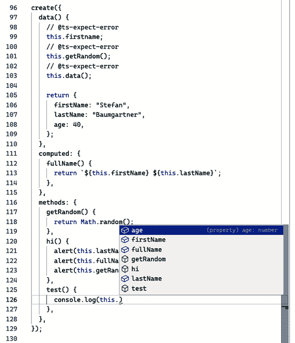

# 第四章：泛型

直到现在，我们的主要目标是利用类型系统对动态类型语言 JavaScript 的固有灵活性进行形式化。我们为了传达意图、获取工具并在错误发生之前捕获它们，为动态类型的语言添加了静态类型。

尽管在 JavaScript 的某些部分确实不关心静态类型。例如，`isKeyAvailableInObject` 函数应该只检查对象中是否存在键；它不需要了解具体类型。为了正确形式化这样一个函数，我们可以使用 TypeScript 的结构类型系统，并为信息的代价描述一个非常宽泛的类型或为灵活性的代价描述一个非常严格的类型。

但我们不想付出任何代价。我们既需要灵活性又需要信息。在 TypeScript 中，泛型正是我们所需的银弹。我们可以描述复杂的关系，并为尚未定义的数据结构形式化结构。

泛型及其映射类型、类型映射、类型修改器和辅助类型，打开了元类型化的大门，我们可以基于旧类型创建新类型，并在新生成的类型挑战原始代码可能存在的错误时保持类型之间的关系。

这是进阶 TypeScript 概念的入口。但不用担心，*除非我们定义它们*。

# 4.1 泛化函数签名

## 问题

您有两个功能，它们在不同且大部分不兼容的类型上工作相同。

## 解决方案

使用泛型概括它们的行为。

## 讨论

您正在编写一个应用程序，该应用程序在对象中存储多个语言文件（例如字幕）。键是语言代码，值是 URL。您通过选择它们来加载语言文件，选择由某些 API 或用户界面作为 `string` 提供的语言代码。为了确保语言代码是正确且有效的，您添加了一个 `isLanguageAvailable` 函数，执行 `in` 检查并使用类型断言设置正确的类型：

```
type Languages = {
  de: URL;
  en: URL;
  pt: URL;
  es: URL;
  fr: URL;
  ja: URL;
};

function isLanguageAvailable(
  collection: Languages,
  lang: string
): lang is keyof Languages {
  return lang in collection;
}

function loadLanguage(collection: Languages, lang: string) {
  if (isLanguageAvailable(collection, lang)) {
    // lang is keyof Languages
    collection[lang]; // access ok!
  }
}
```

相同的应用程序，不同的场景，完全不同的文件。您将媒体数据加载到 HTML 元素中：音频、视频或与 `canvas` 元素中某些动画的组合。所有元素已存在于应用程序中，但根据来自 API 的输入，您需要选择正确的元素。再次，选择作为 `string` 提供，并编写 `isElementAllowed` 函数以确保输入实际上是 `AllowedElements` 集合的有效键：

```
type AllowedElements = {
  video: HTMLVideoElement;
  audio: HTMLAudioElement;
  canvas: HTMLCanvasElement;
};

function isElementAllowed(
  collection: AllowedElements,
  elem: string
): elem is keyof AllowedElements {
  return elem in collection;
}

function selectElement(collection: AllowedElements, elem: string) {
  if (isElementAllowed(collection, elem)) {
    // elem is keyof AllowedElements
    collection[elem]; // access ok
  }
}
```

您不需要仔细观察就能看出这两种情况非常相似。特别是类型守卫函数引起我们的注意。如果我们去除所有类型信息并对齐名称，它们是相同的：

```
function isAvailable(obj, key) {
  return key in obj;
}
```

它们之所以存在是因为我们获得的类型信息。不是因为输入参数，而是因为类型断言。在这两种情况下，我们可以通过断言特定的 `keyof` 类型更多地了解输入参数。

问题在于集合的两种输入类型完全不同且没有重叠。除了空对象外，我们无法获得太多有价值的信息，如果我们创建一个 `keyof` 类型。`keyof {}` 实际上是 `never`。

但这里有一些类型信息，我们可以泛化。我们知道第一个输入参数是一个对象。第二个是一个属性键。如果此检查评估为 `true`，我们知道第一个参数是第二个参数的键。

要泛化此函数，我们可以在 `isAvailable` 中添加一个 *泛型类型参数*，称为 `Obj`，放在尖括号中。这是一个用于实际类型替换 `isAvailable` 时的占位符。我们可以像使用 `AllowedElements` 或 `Languages` 一样使用这个 *泛型类型参数*，并且可以添加类型断言。由于 `Obj` 可以替代 *每一个* 类型，`key` 需要包括所有可能的属性键 — `string`，`symbol` 和 `number`：

```
function isAvailable<Obj>(
  obj: Obj,
  key: string | number | symbol
): key is keyof Obj {
  return key in obj;
}

function loadLanguage(collection: Languages, lang: string) {
  if (isAvailable(collection, lang)) {
    // lang is keyof Languages
    collection[lang]; // access ok!
  }
}

function selectElement(collection: AllowedElements, elem: string) {
  if (isAvailable(collection, elem)) {
    // elem is keyof AllowedElements
    collection[elem]; // access ok
  }
}
```

现在，我们有了一个可以在两种情况下工作的函数，不管我们用什么类型替换 `Obj`，它都可以工作！就像 JavaScript 一样！我们仍然得到相同的功能，并且得到正确的类型信息。索引访问变得安全，而不会牺牲灵活性。

最棒的部分？我们可以像使用未类型化的 JavaScript 等效项一样使用 `isAvailable`。这是因为 TypeScript 通过使用推断泛型类型参数的类型。这带来了一些很棒的副作用。你可以在 Recipe 4.3 中详细了解更多。

# 4.2 创建相关函数参数

## 问题

你编写函数，其中第二个参数依赖于第一个参数。

## 解决方案

使用泛型类型为每个参数进行注释，并通过泛型约束创建它们之间的关系。

## 讨论

类似于 Recipe 4.1，我们的应用程序在 `Languages` 类型的对象中存储字幕列表。`Languages` 具有一组描述语言代码的键和一个 URL 作为值：

```
type Languages = {
  de: URL;
  en: URL;
  pt: URL;
  es: URL;
  fr: URL;
  ja: URL;
};

const languages: Languages = { /* ... */ };
```

在我们的应用程序中有几个类似的列表，我们可以将它们抽象成一个名为 `URLList` 的类型，其索引签名允许任何 `string` 键：

```
type URLList = {
  [x: string]: URL;
};
```

`URLList` 是 `Languages` 的超类型：`Languages` 类型的每个值都是 `URLList`，但并非每个 `URLList` 都是 `Languages`。尽管如此，我们可以使用 `URLList` 编写一个名为 `fetchFile` 的函数，在此列表中加载特定条目：

```
function fetchFile(urls: URLList, key: string) {
  return fetch(urls[key]).then((res) => res.json());
}

const de = fetchFile(languages, "de");
const it = fetchFile(languages, "it");
```

`key` 为 `string` 类型的问题在于允许输入过多的条目。例如，未定义任何意大利字幕，但 `fetchFile` 仍然允许我们加载 `"it"` 作为语言代码。从特定的 `URLList` 加载项目时，我们也想知道可以访问哪些键。

我们可以通过用更通用的类型替换泛型，并设置*泛型约束*来解决这个问题，以确保我们传递的是`URLList`的子类型。这样，函数签名的行为与以前非常相似，但我们可以更好地使用替代类型。我们定义一个*泛型类型参数* `List`，它是 `URLList` 的子类型，并将 `key` 设置为 `keyof List`：

```
function fetchFile<List extends URLList>(urls: List, key: keyof List) {
  return fetch(urls[key]).then((res) => res.json());
}

const de = fetchFile(languages, "de");
const it = fetchFile(languages, "it");
//                               ^
// Argument of type '"it"' is not assignable to
// parameter of type 'keyof Languages'.(2345)
```

当我们调用 `fetchFile` 时，`List` 将被替换为实际类型，并且我们知道 `"it"` 不是 `Languages` 的键。TypeScript 会在我们打错字或选择不属于我们数据类型的元素时向我们显示。

如果我们加载多个键，这也适用。相同的约束，相同的效果：

```
function fetchFiles<List extends URLList>(urls: List, keys: (keyof List)[]) {
  const els = keys.map((el) =>
    fetch(urls[el])
      .then((res) => res.json())
      .then((data) => [el, data])
  );
  return els;
}

const de_and_fr = fetchFiles(languages, ["de", "fr"]); // Promise<any[]≥[]
const de_and_it = fetchFiles(languages, ["de", "it"]);
//                                             ^
//  Type '"it"' is not assignable to type 'keyof Languages'.(2322)
```

我们将结果存储在一个元组中，语言键作为第一个元素，数据作为第二个元素。然而，当我们获取结果时，它是解析为 `any[]` 的 `Promise` 数组。这是可以理解的，因为 `fetch` 不告诉我们有关加载的数据的任何信息，而 `data` 是 `any` 类型，因此具有最广泛的类型，它只是吞下了 `el`，即 `keyof List`。

但是我们在这个阶段了解得更多。例如，我们知道`[el, data]`不是一个数组，而是一个元组。这有微妙但重要的区别，如食谱 2.4 所示。如果我们用元组类型注释结果，我们从返回值中获得更多信息：

```
function fetchFiles<List extends URLList>(urls: List, keys: (keyof List)[]) {
  const els = keys.map((el) =>
    fetch(urls[el])
      .then((res) => res.json())
      .then((data) => {
        const entry: [keyof List, any] = [el, data];
        return entry;
      })
  );
  return els;
}

const de_and_fr = fetchFiles(languages, ["de", "fr"]);
```

`fetchFiles` 现在返回一个 `[keyof List, any]` 的 `Promise` 数组。因此，我们一旦用 `Languages` 替换 `List`，我们就知道唯一可能的键是语言代码。

然而，仍然有一个注意事项。如前面的代码示例所示，`de_and_fr` 中唯一可用的语言是德语和法语，但编译器并未警告我们随后检查英语。编译器应该能够做到这一点，因为这个条件总是返回 false：

```
for (const result of de_and_fr) {
  if (result[0] === "en") {
    // English?
  }
}
```

问题在于，我们再次处理的类型范围太广泛了。是的，`keyof List`比`string`窄得多，但我们也可以用一个更小的集合替换所有键。

我们需要重复相同的过程：

1.  创建一个新的泛型类型参数。

1.  将更广泛的类型设置为新创建的泛型类型参数的约束。

1.  在函数签名中使用参数来替代实际类型。

就这样，我们也可以用一个子类型 `"de" | "fr"` 替换 `keyof List`：

```
function fetchFiles<List extends URLList, Keys extends keyof List>(
  urls: List,
  keys: Keys[]
) {
  const els = keys.map((el) =>
    fetch(urls[el])
      .then((res) => res.json())
      .then((data) => {
        const entry: [Keys, any] = [el, data];
        return entry;
      })
  );
  return els;
}

const de_and_fr = fetchFiles(languages, ["de", "fr"]);
```

令人满意的是，我们可以在泛型类型参数之间建立关系。第二个类型参数可以由第一个泛型类型参数中的某些内容约束。这使我们可以非常具体地缩小范围，直到我们用真实值替换。效果？我们可以在代码中的任何地方了解到我们类型的可能值。所以，如果我们已经知道我们从未请求过加载英语，我们就不会检查英语语言：

```
for (const entry of de_and_fr) {
  const result = await entry;
  if (result[0] === "en") {
    //  This condition will always return 'false' since the types
    //. '"de" | "fr"' and '"en"' have no overlap.(2367)
  }
}
```

我们没有摆脱的一个检查是看看在位置 0 的是哪种语言。

我们没有考虑的一件事是*泛型实例化*。我们通过使用方式让类型参数被真实值替换，就像类型推断一样。但我们也可以通过注释显式地替换它们：

```
const de_and_ja = fetchFiles<Languages, "ja" | "de">(languages, ["de"]);
```

在这里，类型告诉我们可能还有日文字幕，尽管我们从使用中可以看到我们只加载了德文字幕。让这成为一个提醒，并在配方 4.4 中获取更多见解。

# 4.3 摆脱 any 和 unknown

## 问题

泛型类型参数、`any` 和 `unknown` 看起来都描述了非常广泛的值集。在什么情况下应该使用哪个？

## 解决方案

当你最终要得到实际类型时，请使用泛型类型参数；参考配方 2.2 中关于`any`和`unknown`的决策。

## 讨论

当我们使用泛型时，它们可能看起来像`any`和`unknown`的替代品。取一个`identity`函数作为例子——它的唯一工作就是返回作为输入参数传递的值：

```
function identity(value: any): any {
  return value;
}

let a = identity("Hello!");
let b = identity(false);
let c = identity(2);
```

它接受每种类型的值，其返回类型也可以是任何类型。如果我们想安全访问属性，我们可以使用`unknown`编写相同的函数：

```
function identity(value: unknown): unknown {
  return value;
}

let a = identity("Hello!");
let b = identity(false);
let c = identity(2);
```

我们甚至可以混合和匹配 `any` 和 `unknown`，但结果始终如一：类型信息会丢失。返回值的类型是我们定义的。

现在让我们使用泛型而不是`any`或`unknown`来编写相同的函数。它的类型注释表明泛型类型也是返回类型：

```
function identity<T>(t: T): T {
  return t;
}
```

我们可以使用此函数传递任何值，并查看 TypeScript 推断的类型：

```
let a = identity("Hello!"); // a is string
let b = identity(2000);     // b is number
let c = identity({ a: 2 }); // c is { a: number }
```

使用`const`而不是`let`分配到绑定时，结果略有不同：

```
const a = identity("Hello!"); // a is "Hello!"
const b = identity(2000);     // b is 2000
const c = identity({ a: 2 }); // c is { a: number }
```

对于原始类型，TypeScript 会用实际类型替换泛型类型参数。我们可以在更高级的场景中大量使用这一特性。

使用 TypeScript 的泛型，也可以*注释*泛型类型参数：

```
const a = identity<string>("Hello!"); // a is string
const b = identity<number>(2000);     // b is number
const c = identity<{ a: 2 }>({ a: 2 }); // c is { a: 2 }
```

如果这种行为让你想起了配方 3.4 中描述的注解和推断，那么你绝对是正确的。它非常类似，但在函数中使用了泛型类型参数。

当使用无约束的泛型时，我们可以编写能处理任何类型值的函数。在内部，它们的行为像`unknown`，这意味着我们可以做类型保护来缩小类型。最大的区别在于一旦我们使用函数，我们就用实际类型替换我们的泛型，完全不会丢失任何关于类型的信息。

这使我们在类型上比允许一切更加清晰。这个`pairs`函数接受两个参数并创建一个元组：

```
function pairs(a: unknown, b: unknown): [unknown, unknown] {
  return [a, b];
}

const a = pairs(1, "1"); // [unknown, unknown]
```

使用泛型类型参数，我们得到了一个漂亮的元组类型：

```
function pairs<T, U>(a: T, b: U): [T, U] {
  return [a, b];
}

const b = pairs(1, "1"); // [number, string]
```

使用相同的泛型类型参数，我们可以确保只在每个元素都是相同类型的元组中获取元组：

```
function pairs<T>(a: T, b: T): [T, T] {
  return [a, b];
}

const c = pairs(1, "1");
//                  ^
// Argument of type 'string' is not assignable to parameter of type 'number'
```

那么，你应该在所有地方都使用泛型吗？未必。本章包括许多解决方案，这些解决方案依赖于在正确的时间获得正确的类型信息。当你对更广泛的值集合感到满意并且可以依赖于子类型兼容时，你根本不需要使用泛型。如果你的代码中有`any`和`unknown`，请思考是否在某个时刻需要实际类型。添加一个泛型类型参数可能会有所帮助。

# 4.4 理解泛型实例化

## 问题

你理解泛型如何被实际类型替换，但有时像“`Foo`可分配给类型`Bar`的约束，但可以用约束`Baz`的不同子类型来实例化”这样的错误会让你困惑。

## 解决方案

记住，泛型类型的值可以明确和隐式地替换为各种子类型。编写友好于子类型的代码。

## 讨论

为你的应用程序创建一个过滤逻辑。你有不同的过滤规则，可以使用 `"and" | "or"` 运算符组合起来。你还可以将常规过滤规则与*组合过滤器*的结果链接起来。你根据这种行为创建你的类型：

```
type FilterRule = {
  field: string;
  operator: string;
  value: any;
};

type CombinatorialFilter = {
  combinator: "and" | "or";
  rules: FilterRule[];
};

type ChainedFilter = {
  rules: (CombinatorialFilter | FilterRule)[];
};

type Filter = CombinatorialFilter | ChainedFilter;
```

现在你想要编写一个`reset`函数，根据已提供的过滤器，重置所有规则。你使用类型守卫来区分`CombinatorialFilter`和`ChainedFilter`：

```
function reset(filter: Filter): Filter {
  if ("combinator" in filter) {
    // filter is CombinatorialFilter
    return { combinator: "and", rules: [] };
  }
  // filter is ChainedFilter
  return { rules: [] };
}

const filter: CombinatorialFilter = { rules: [], combinator: "or" };
const resetFilter = reset(filter); // resetFilter is Filter
```

行为是你追求的，但`reset`的返回类型太宽泛了。当我们传递一个`CombinatorialFilter`时，我们应该确保重置的过滤器也是一个`Com⁠bin⁠a⁠to⁠rial​Fil⁠ter`。这里是联合类型，就像我们的函数签名所指示的那样。但你希望确保如果传递某种类型的过滤器，也能获得相同的返回类型。因此，你用一个受约束的泛型类型参数替换了广泛的联合类型。返回类型按预期工作，但函数的实现会抛出错误：

```
function reset<F extends Filter>(filter: F): F {
  if ("combinator" in filter) {
    return { combinator: "and", rules: [] };
//  ^ '{ combinator: "and"; rules: never[]; }' is assignable to
//     the constraint of type 'F', but 'F' could be instantiated
//     with a different subtype of constraint 'Filter'.
  }
  return { rules: [] };
//^ '{ rules: never[]; }' is assignable to the constraint of type 'F',
//   but 'F' could be instantiated with a different subtype of
//   constraint 'Filter'.
}

const resetFilter = reset(filter); // resetFilter is CombinatorialFilter
```

虽然你想要区分联合的两部分，但 TypeScript 的思考更加广泛。它知道你可能会传递一个与`Filter`结构兼容但具有更多属性的对象，因此它是一个子类型。

这意味着你可以用子类型实例化`F`来调用`reset`，你的程序会愉快地覆盖所有多余的属性。这是错误的，TypeScript 告诉你：

```
const onDemandFilter = reset({
  combinator: "and",
  rules: [],
  evaluated: true,
  result: false,
});
/* filter is {
 combinator: "and";
 rules: never[];
 evaluated: boolean;
 result: boolean;
}; */
```

通过编写友好于子类型的代码来克服这个问题。克隆输入对象（仍然是类型`F`），根据需要更改属性，并返回仍然是类型`F`的东西：

```
function reset<F extends Filter>(filter: F): F {
  const result = { ...filter }; // result is F
  result.rules = [];
  if ("combinator" in result) {
    result.combinator = "and";
  }
  return result;
}

const resetFilter = reset(filter); // resetFilter is CombinatorialFilter
```

泛型类型可以是联合类型中的一种，但也可以是更多，更多。TypeScript 的结构类型系统允许你处理各种子类型，你的代码需要反映这一点。

这里是另一种场景，但结果类似。您想创建一个树形数据结构，并编写一个递归类型来存储所有树项。此类型可以进行子类型化，因此您编写了一个带有通用类型参数的`createRootItem`函数，因为您希望使用正确的子类型进行实例化：

```
type TreeItem = {
  id: string;
  children: TreeItem[];
  collapsed?: boolean;
};

function createRootItem<T extends TreeItem>(): T {
  return {
    id: "root",
    children: [],
  };
// '{ id: string; children: never[]; }' is assignable to the constraint
//   of type 'T', but 'T' could be instantiated with a different subtype
//   of constraint 'TreeItem'.(2322)
}

const root = createRootItem(); // root is TreeItem
```

与之前类似，我们遇到了类似的错误，因为我们不可能说返回值与所有子类型兼容。为了解决这个问题，我们去掉了通用类型！我们知道返回类型的外观——它是一个`TreeItem`：

```
function createRootItem(): TreeItem {
  return {
    id: "root",
    children: [],
  };
}
```

最简单的解决方案通常是最好的。但现在你想通过能够将类型或子类型的`TreeItem`附加到新创建的根来扩展你的软件。我们尚未添加任何通用类型，并且有些不满意：

```
function attachToRoot(children: TreeItem[]): TreeItem {
  return {
    id: "root",
    children,
  };
}

const root = attachToRoot([]); // TreeItem
```

`root`的类型是`TreeItem`，但我们丢失了关于子类型化子项的任何信息。即使我们为子项添加了一个通用类型参数，并将其限制为`TreeItem`，我们也不能在此过程中保留此信息：

```
function attachToRoot<T extends TreeItem>(children: T[]): TreeItem {
  return {
    id: "root",
    children,
  };
}

const root = attachToRoot([
  {
    id: "child",
    children: [],
    collapsed: false,
    marked: true,
  },
]); // root is TreeItem
```

当我们开始将通用类型作为返回类型时，我们遇到了与之前相同的问题。为了解决这个问题，我们需要将根项目类型与子项目类型分离开来，通过将`TreeItem`定义为通用类型，其中我们可以将`Children`设置为`TreeItem`的子类型。

由于我们希望避免任何循环引用，我们需要将`Children`设置为默认的`BaseTreeItem`，这样我们就可以将`TreeItem`用作`Children`的约束和`attachToRoot`的输入：

```
type BaseTreeItem = {
  id: string;
  children: BaseTreeItem[];
};

type TreeItem<Children extends TreeItem = BaseTreeItem> = {
  id: string;
  children: Children[];
  collapsed?: boolean;
};

function attachToRoot<T extends TreeItem>(children: T[]): TreeItem<T> {
  return {
    id: "root",
    children,
  };
}

const root = attachToRoot([
  {
    id: "child",
    children: [],
    collapsed: false,
    marked: true,
  },
]);
/*
root is TreeItem<{
 id: string;
 children: never[];
 collapsed: false;
 marked: boolean;
}>
*/
```

再次编写子类型友好并将输入参数视为它们自己，而不是做出假设。

# 4.5 生成新的对象类型

## 问题

在您的应用程序中有一个与您的模型相关的类型。每次模型更改时，您都需要相应地更改您的类型。

## 解决方案

使用通用映射类型来基于原始类型创建新的对象类型。

## 讨论

让我们回到玩具店，来自 Recipe 3.1。多亏了联合类型、交集类型和判别联合类型，我们能够很好地对我们的数据进行建模：

```
type ToyBase = {
  name: string;
  description: string;
  minimumAge: number;
};

type BoardGame = ToyBase & {
  kind: "boardgame";
  players: number;
};

type Puzzle = ToyBase & {
  kind: "puzzle";
  pieces: number;
};

type Doll = ToyBase & {
  kind: "doll";
  material: "plush" | "plastic";
};

type Toy = Doll | Puzzle | BoardGame;
```

在我们的代码中的某个地方，我们需要将模型中的所有玩具分组到可以由称为`GroupedToys`的类型描述的数据结构中。`GroupedToys`具有每个类别（或`"kind"`）的属性和一个`Toy`数组作为值。一个`groupToys`函数接受一个未排序的玩具列表，并按种类分组：

```
type GroupedToys = {
  boardgame: Toy[];
  puzzle: Toy[];
  doll: Toy[];
};

function groupToys(toys: Toy[]): GroupedToys {
  const groups: GroupedToys = {
    boardgame: [],
    puzzle: [],
    doll: [],
  };
  for (let toy of toys) {
    groups[toy.kind].push(toy);
  }
  return groups;
}
```

此代码中已经有一些美好之处。首先，在声明`groups`时我们使用了显式的类型注解，这确保我们没有忘记任何类别。此外，由于`GroupedToys`的键与`Toy`中`"kind"`类型的联合相同，我们可以轻松地通过`toy.kind`索引访问`groups`。

几个月和开发周期过去了，我们需要再次触及我们的模型。现在玩具店正在销售原始或者说是互锁玩具积木的替代供应商。我们将新类型`Bricks`连接到我们的`Toy`模型：

```
type Bricks = ToyBase & {
  kind: "bricks",
  pieces: number;
  brand: string;
}

type Toy = Doll | Puzzle | BoardGame | Bricks;
```

因为 `groupToys` 需要处理 `Bricks`，我们会收到一个很好的错误，因为 `GroupedToys` 对 `"bricks"` 种类一无所知：

```
function groupToys(toys: Toy[]): GroupedToys {
  const groups: GroupedToys = {
    boardgame: [],
    puzzle: [],
    doll: [],
  };
  for (let toy of toys) {
    groups[toy.kind].push(toy);
//  ^- Element implicitly has an 'any' type because expression
//     of type '"boardgame" | "puzzle" | "doll" | "bricks"' can't
//     be used to index type 'GroupedToys'.
//     Property 'bricks' does not exist on type 'GroupedToys'.(7053)
  }
  return groups;
}
```

这是 TypeScript 中期望的行为：知道何时类型不再匹配。这应该引起我们的注意。让我们更新 `GroupedToys` 和 `groupToys`：

```
type GroupedToys = {
  boardgame: Toy[];
  puzzle: Toy[];
  doll: Toy[];
  bricks: Toy[];
};

function groupToys(toys: Toy[]): GroupedToys {
  const groups: GroupedToys = {
    boardgame: [],
    puzzle: [],
    doll: [],
    bricks: [],
  };
  for (let toy of toys) {
    groups[toy.kind].push(toy);
  }
  return groups;
}
```

有一件令人烦恼的事情：分组玩具的任务总是相同的。无论我们的模型如何变化，我们始终会按种类选择并推入数组。我们需要随着每次变化来维护 `groups`，但如果我们改变对群组的思考方式，我们可以优化变化。首先，我们将类型 `GroupedToys` 改为具有可选属性。其次，如果尚未进行任何初始化，我们用空数组初始化每个组：

```
type GroupedToys = {
  boardgame?: Toy[];
  puzzle?: Toy[];
  doll?: Toy[];
  bricks?: Toy[];
};

function groupToys(toys: Toy[]): GroupedToys {
  const groups: GroupedToys = {};
  for (let toy of toys) {
    // Initialize when not available
    groups[toy.kind] = groups[toy.kind] ?? [];
    groups[toy.kind]?.push(toy);
  }
  return groups;
}
```

我们不再需要维护 `groupToys`。唯一需要维护的是类型 `GroupedToys`。如果我们仔细观察 `GroupedToys`，我们会发现它与 `Toy` 有一个隐含的关系。每个属性键都是 `Toy["kind"]` 的一部分。让我们将这种关系变得*显式*。通过*映射类型*，我们基于 `Toy["kind"]` 中的每种类型创建一个新的对象类型。

`Toy["kind"]` 是一个字符串文字的联合：`"boardgame" | "puzzle" | "doll" | "bricks"`。由于我们有一个非常有限的字符串集合，这个联合的每个元素将被用作自己的属性键。让我们稍作思考：我们可以使用一个*类型*作为新生成的类型的*属性键*。每个属性都有一个可选的类型修饰符，并指向一个 `Toy[]`：

```
type GroupedToys = {
  [k in Toy["kind"]]?: Toy[];
};
```

太棒了！每次我们改变 `Toy`，我们立即改变 `Toy[]`。我们的代码完全不需要改动；我们仍然可以像以前一样按种类分组。

这是我们有潜力泛化的模式。让我们创建一个 `Group` 类型，它接受一个集合并按特定选择器进行分组。我们想要创建一个具有两个类型参数的通用类型：

+   `Collection` 可以是任何内容。

+   `Selector` 是 `Collection` 的一个键，因此它可以创建相应的属性。

我们的第一次尝试是采用 `GroupedToys` 中的内容，并用类型参数替换具体类型。这会创建我们需要的内容，但也会导致错误：

```
// How to use it
type GroupedToys = Group<Toy, "kind">;

type Group<Collection, Selector extends keyof Collection> = {
  [x in Collection[Selector]]?: Collection[];
//     ^ Type 'Collection[Selector]' is not assignable
//       to type 'string | number | symbol'.
//       Type 'Collection[keyof Collection]' is not
//       assignable to type 'string | number | symbol'.
//       Type 'Collection[string] | Collection[number]
//        | Collection[symbol]' is not assignable to
//       type 'string | number | symbol'.
//       Type 'Collection[string]' is not assignable to
//       type 'string | number | symbol'.(2322)
};
```

TypeScript 警告我们 `Collection[string] | Collection[number] | Collection[symbol]` 可能会导致任何结果，而不仅仅是可以用作键的内容。这是真的，我们需要为此做好准备。我们有两个选择。

首先，在 `Collection` 上使用类型约束，指向 `Record<string, any>`。`Record` 是一个实用类型，它生成一个新对象，其中第一个参数提供所有键，第二个参数提供类型：

```
// This type is built-in!
type Record<K extends string | number | symbol, T> = { [P in K]: T; };
```

这将 `Collection` 提升为通配符对象，有效地禁用了来自 `Groups` 的类型检查。这没关系，因为如果某个东西不能作为属性键使用，TypeScript 会将其丢弃。因此最终的 `Group` 有两个约束类型参数：

```
type Group<
  Collection extends Record<string, any>,
  Selector extends keyof Collection
> = {
  [x in Collection[Selector]]: Collection[];
};
```

第二个选项是对每个键进行检查，看它是否是有效的字符串键。我们可以使用*条件类型*来查看`Collection[Selector]`是否确实是键的有效类型。否则，我们会通过选择`never`来移除此类型。条件类型本身就是一种特殊情况，在第 5.4 节中我们对此进行了详细讨论：

```
type Group<Collection, Selector extends keyof Collection> = {
  [k in Collection[Selector] extends string
    ? Collection[Selector]
    : never]?: Collection[];
};
```

请注意，我们已经移除了可选类型修饰符。我们这样做是因为使键可选不是分组的任务。我们有另一种类型来处理这个问题：`Partial<T>`，这是另一种映射类型，使对象类型中的每个属性变为可选：

```
// This type is built-in!
type Partial<T> = { [P in keyof T]?: T[P] };
```

无论你创建了哪个 `Group` 辅助函数，现在你都可以通过告诉 TypeScript 你想要一个 `Partial`（将所有属性变为可选属性）的 `Group` of `Toys`，来创建一个 `GroupedToys` 对象，通过 `"kind"`：

```
type GroupedToys = Partial<Group<Toy, "kind">>;
```

现在读起来很不错。

# 4.6 使用断言签名修改对象

## 问题

在代码中的某个函数执行后，你知道值的类型已经改变了。

## 解决方案

使用断言签名可以独立于`if`和`switch`语句改变类型。

## 讨论

JavaScript 是一种非常灵活的语言。其动态类型特性允许您在运行时更改对象，动态添加新属性。开发者们利用了这一点。有些情况下，例如，您遍历一个元素集合并需要断言某些属性。然后，您存储一个 `checked` 属性，并将其设置为 `true`，这样您就知道您已经通过了某个标记点：

```
function check(person: any) {
  person.checked = true;
}

const person = {
  name: "Stefan",
  age: 27,
};

check(person); // person now has the checked property

person.checked; // this is true!
```

你希望在类型系统中反映这种行为；否则，你将不得不不断地进行额外检查，以确定对象中是否存在某些属性，尽管你可以确信它们存在。

断言某些属性存在的一种方法是使用类型断言。我们说在某个时间点，此属性具有不同的类型：

```
(person as typeof person & { checked: boolean }).checked = true;
```

不过，你需要一遍又一遍地进行这种类型断言，因为它们不会改变`person`的原始类型。另一种断言某些属性可用的方法是创建类型谓词，就像第 3.5 节中展示的那样：

```
function check<T>(obj: T): obj is T & { checked: true } {
  (obj as T & { checked: boolean }).checked = true;
  return true;
}

const person = {
  name: "Stefan",
  age: 27,
};

if (check(person)) {
  person.checked; // checked is true!
}
```

尽管这种情况有些不同，这使得`check`函数感觉笨拙：你需要在断言函数中执行额外的条件并返回`true`。这感觉不对劲。

幸运的是，TypeScript 还有另一种我们可以在这种情况下利用的技术：断言签名。断言签名可以在控制流中改变值的类型，而无需条件语句。它们已经为 Node.js 的 `assert` 函数建模，该函数接受一个条件，如果条件不为真则抛出错误。这意味着在调用 `assert` 后，你可能比之前拥有更多的信息。例如，如果你调用 `assert` 并检查值是否为 `string` 类型，你知道在这个 `assert` 函数之后该值应该是 `string`：

```
function assert(condition: any, msg?: string): asserts condition {
  if (!condition) {
    throw new Error(msg);
  }
}

function yell(str: any) {
  assert(typeof str === "string");
  // str is string
  return str.toUpperCase();
}
```

请注意，如果条件为 false，该函数会提前终止。它会抛出一个错误，即 `never` 情况。如果此函数通过，您确实可以断言该条件。

虽然断言签名已经为 Node.js 的 assert 函数建模，但您可以断言任何您喜欢的类型。例如，您可以有一个函数，接受任何类型的值进行加法，但要求这些值必须是 `number` 才能继续：

```
function assertNumber(val: any): asserts val is number {
  if (typeof val !== "number") {
    throw Error("value is not a number");
  }
}

function add(x: unknown, y: unknown): number {
  assertNumber(x); // x is number
  assertNumber(y); // y is number
  return x + y;
}
```

所有关于断言签名的示例都是在断言和条件不成立时抛出错误后立即终止的。但是我们可以使用相同的技术告诉 TypeScript 更多的属性可用。我们编写一个函数，与之前的断言函数中的 `check` 非常相似，但这次我们不需要返回 `true`。我们设置属性，并且由于 JavaScript 中的对象是按值传递的，所以我们可以断言，在调用此函数后，无论我们传入什么，它都具有一个 `checked` 属性，该属性为 `true`：

```
function check<T>(obj: T): asserts obj is T & { checked: true } {
  (obj as T & { checked: boolean }).checked = true;
}

const person = {
  name: "Stefan",
  age: 27,
};

check(person);
```

有了这个技巧，我们可以即时修改值的类型。这是一个鲜为人知但非常有用的技术。

# 4.7 类型映射

## 问题

您编写一个工厂函数，根据字符串标识符创建特定子类型的对象，并且有很多可能的子类型。

## 解决方案

将所有子类型存储在类型映射中，通过索引访问扩展，并使用像 `Partial<T>` 这样的映射类型。

## 讨论

如果您希望根据一些基本信息创建复杂对象的变体，工厂函数是一个很好的选择。您可能从浏览器 JavaScript 中了解到一个场景是创建元素。`document.createElement` 函数接受元素的标签名，您会得到一个对象，可以修改所有必要的属性。

您希望为这种创建增加一些趣味，可以调用一个名为 `cr⁠ea⁠te​El⁠eme⁠nt` 的漂亮工厂函数。它不仅接受元素的标签名，还会列出属性的清单，因此您无需逐个设置每个属性：

```
// Using create Element

// a is HTMLAnchorElement
const a = createElement("a", { href: "https://fettblog.eu" });
// b is HTMLVideoElement
const b = createElement("video", { src: "/movie.mp4", autoplay: true });
// c is HTMLElement
const c = createElement("my-element");
```

您希望为此创建良好的类型，因此需要注意两件事：

+   确保您仅创建有效的 HTML 元素。

+   提供一个接受 HTML 元素属性子集的类型。

首先我们来处理有效的 HTML 元素。大约有 140 种可能的 HTML 元素，这实在是很多。每个元素都有一个标签名，可以表示为字符串，并且在 DOM 中有一个对应的原型对象。使用你的 *tsconfig.json* 中的 *dom* 库，TypeScript 中有关这些原型对象的信息以类型的形式存在。你可以找出所有这 140 个元素名。

提供元素标签名与原型对象之间的映射的一个好方法是使用 *类型映射*。类型映射是一种技术，您可以采用类型别名或接口，并让键指向相应的类型变体。然后，您可以使用字符串字面类型的索引访问获取正确的类型变体：

```
type AllElements = {
  a: HTMLAnchorElement;
  div: HTMLDivElement;
  video: HTMLVideoElement;
  //... and ~140 more!
};

// HTMLAnchorElement
type A = AllElements["a"];
```

看起来像是使用索引访问来访问 JavaScript 对象的属性，但请记住我们仍然在类型级别上工作。这意味着索引访问可以很广泛：

```
type AllElements = {
  a: HTMLAnchorElement;
  div: HTMLDivElement;
  video: HTMLVideoElement;
  //... and ~140 more!
};

// HTMLAnchorElement | HTMLDivELement
type AandDiv = AllElements["a" | "div"];
```

让我们使用这个映射来为`createElement`函数命名类型。我们使用一个泛型类型参数，该参数受限于`AllElements`的所有键，这使我们只能传递有效的 HTML 元素：

```
function createElement<T extends keyof AllElements>(tag: T): AllElements[T] {
  return document.createElement(tag as string) as AllElements[T];
}

// a is HTMLAnchorElement
const a = createElement("a");
```

在这里使用泛型来将字符串文字固定到字面类型，我们可以用它来索引类型映射中正确的 HTML 元素变体。还要注意，使用`do⁠cum⁠ent.​cre⁠ate⁠Ele⁠me⁠nt`需要两个类型断言。一个使集合变宽（从`T`到`string`），另一个使集合变窄（从`HTMLElement`到`AllElements[T]`）。这两个断言表明我们必须处理一个在我们控制之外的 API，正如在食谱 3.9 中所确定的那样。我们将在稍后处理这些断言。

现在我们想要提供选项来传递所述 HTML 元素的额外属性，例如将`href`设置为`HTMLAnchorElement`等。所有属性已经在各自的`HTMLElement`变体中，但它们是必需的，而不是可选的。我们可以使用内置类型`Partial<T>`使所有属性变为可选。它是一个映射类型，它获取某种类型的所有属性并添加一个类型修饰符：

```
type Partial<T> = { [P in keyof T]?: T[P] };
```

我们扩展我们的函数，添加一个可选参数`props`，它是`AllElements`中索引元素的`Partial`。这样，我们知道如果传递一个`"a"`，我们只能设置在`HTMLAnchorElement`中可用的属性：

```
function createElement<T extends keyof AllElements>(
  tag: T,
  props?: Partial<AllElements[T]>
): AllElements[T] {
  const elem = document.createElement(tag as string) as AllElements[T];
  return Object.assign(elem, props);
}

const a = createElement("a", { href: "https://fettblog.eu" });
const x = createElement("a", { src: "https://fettblog.eu" });
//                           ^--
// Argument of type '{ src: string; }' is not assignable to parameter
// of type 'Partial<HTMLAnchorElement>'.
// Object literal may only specify known properties, and 'src' does not
// exist in type 'Partial<HTMLAnchorElement>'.(2345)
```

太棒了！现在轮到你找出所有 140 个 HTML 元素了。或者不找。有人已经完成了这项工作，并将`HTMLElementTagNameMap`放入*lib.dom.ts*中。所以让我们使用这个：

```
function createElement<T extends keyof HTMLElementTagNameMap>(
  tag: T,
  props?: Partial<HTMLElementTagNameMap[T]>
): HTMLElementTagNameMap[T] {
  const elem = document.createElement(tag);
  return Object.assign(elem, props);
}
```

这也是`document.createElement`使用的接口，因此你的工厂函数和内置函数之间没有摩擦。不需要额外的断言。

只有一个注意事项。你只能使用`HT⁠ML​Ele⁠men⁠tTa⁠gNa⁠me⁠Map`提供的 140 个元素。如果你想创建 SVG 元素，或者可以完全自定义元素名称的 Web 组件，你的工厂函数突然太受限制了。

为了允许更多——就像`document.createElement`那样——我们需要再次将所有可能的字符串添加到混合中。`HTMLElementTagNameMap`是一个接口。所以我们可以使用*声明合并*来通过*索引签名*扩展接口，其中我们将所有剩余的字符串映射到`HTMLUnknownElement`：

```
interface HTMLElementTagNameMap {
  [x: string]: HTMLUnknownElement;
};

function createElement<T extends keyof HTMLElementTagNameMap>(
  tag: T,
  props?: Partial<HTMLElementTagNameMap[T]>
): HTMLElementTagNameMap[T] {
  const elem = document.createElement(tag);
  return Object.assign(elem, props);
}

// a is HTMLAnchorElement
const a = createElement("a", { href: "https://fettblog.eu" });
// b is HTMLUnknownElement
const b = createElement("my-element");
```

现在我们拥有我们想要的一切：

+   一个出色的工厂函数来创建类型化的 HTML 元素

+   只需一个配置对象即可设置元素属性的可能性

+   灵活性可以创建比定义的更多的元素

最后一个很棒，但是如果你只想允许 Web 组件呢？Web 组件有一个约定；它们需要在它们的标签名称中有一个*破折号*。我们可以使用*字符串模板文字类型*上的映射类型来建模这一点。你将在第六章中详细了解字符串模板文字类型。

现在，你需要知道的唯一一件事情是，我们创建了一组字符串，其中模式是*任意字符串*后跟一个*破折号*，然后是*任意字符串*。这足以确保我们只传递正确的元素名称。

*映射类型*仅适用于类型别名，而不是接口声明，因此我们需要重新定义一个`AllElements`类型：

```
type AllElements = HTMLElementTagNameMap &
  {
    [x in `${string}-${string}`]: HTMLElement;
  };

function createElement<T extends keyof AllElements>(
  tag: T,
  props?: Partial<AllElements[T]>
): AllElements[T] {
  const elem = document.createElement(tag as string) as AllElements[T];
  return Object.assign(elem, props);
}

const a = createElement("a", { href: "https://fettblog.eu" }); // OK
const b = createElement("my-element"); // OK

const c = createElement("thisWillError");
//                      ^
// Argument of type '"thisWillError"' is not
// assignable to parameter of type '`${string}-${string}`
// | keyof HTMLElementTagNameMap'.(2345)
```

太棒了。使用`AllElements`类型，我们还可以获得类型断言，尽管我们不太喜欢这样。在这种情况下，我们可以使用函数重载，定义两个声明：一个用于我们的用户，另一个用于实现函数。您可以在《食谱》2.6 和 12.7 中了解更多关于这种函数重载技术的信息：

```
function createElement<T extends keyof AllElements>(
  tag: T,
  props?: Partial<AllElements[T]>
): AllElements[T];
function createElement(tag: string, props?: Partial<HTMLElement>): HTMLElement {
  const elem = document.createElement(tag);
  return Object.assign(elem, props);
}
```

我们已经准备好了。我们使用*映射类型*和*索引签名*定义了一个*类型映射*，并使用*泛型类型参数*非常明确地表达了我们的意图。这是在我们的 TypeScript 工具箱中多种工具的巧妙结合。

# 4.8 使用 ThisType 来定义对象中的 this

## 问题

您的应用程序需要具有方法的复杂配置对象，其中`this`在使用时具有不同的上下文。

## 解决方案

使用内置的泛型`ThisType<T>`来定义正确的`this`。

## 讨论

像[VueJS](https://vuejs.org)这样的框架非常依赖于工厂函数，其中您传递一个全面的配置对象来定义初始数据、计算属性和每个实例的方法。您希望为应用程序的组件创建类似的行为。想法是提供一个具有三个属性的配置对象：

一个`data`函数

返回值是实例的初始数据。在此函数中，您不应该访问配置对象的任何其他属性。

一个`computed`属性

这是用于基于初始数据的计算属性。计算属性使用函数声明。它们可以像普通属性一样访问初始数据。

一个`methods`属性

方法可以被调用，并且可以访问计算属性以及初始数据。当方法访问计算属性时，它们像访问普通属性一样访问它：无需调用函数。

查看正在使用的配置对象时，有三种不同的方法来解释`this`。在`data`中，`this`根本没有任何属性。在`computed`中，每个函数都可以像其对象的一部分一样访问`data`的返回值，通过`this`来访问。在`methods`中，每个方法可以像在`this`中一样访问计算属性和`data`：

```
const instance = create({
  data() {
    return {
      firstName: "Stefan",
      lastName: "Baumgartner",
    };
  },
  computed: {
    fullName() {
      // has access to the return object of data
      return this.firstName + " " + this.lastName;
    },
  },
  methods: {
    hi() {
      // use computed properties just like normal properties
      alert(this.fullName.toLowerCase());
    },
  },
});
```

这种行为是特殊的，但并不罕见。并且像这样的行为，我们绝对希望依赖良好的类型。

###### 注意

在本课程中，我们只关注类型，而不是实际的实现，因为那将超出本章的范围。

让我们为每个属性创建类型。我们定义了一个类型`Options`，我们将逐步完善它。首先是`data`函数。`data`可以由用户定义，因此我们希望使用泛型类型参数来指定`data`的数据：

```
type Options<Data> = {
  data(this: {})?: Data;
};
```

因此，一旦我们在`data`函数中指定实际的返回值，`Data`占位符就会被实际对象类型替换。请注意，我们还定义了`this`指向空对象，这意味着我们不能从配置对象中访问任何其他属性。

接下来，我们定义了`computed`。`computed`是一个函数对象。我们添加了另一个名为`Computed`的泛型类型参数，并允许通过使用进行类型化。在这里，`this`会更改为`Data`的所有属性。由于我们无法像在`data`函数中那样设置`this`，我们可以使用内置的辅助类型`ThisType`并将其设置为泛型类型参数`Data`：

```
type Options<Data, Computed> = {
  data(this: {})?: Data;
  computed?: Computed & ThisType<Data>;
};
```

这使得我们可以访问例如`this.firstName`，就像前面的示例中一样。最后但并非最不重要的是，我们想要指定`methods`。`methods`再次特殊，因为您不仅通过`this`获取`Data`，还可以通过属性访问获取所有方法和所有计算属性。

`Computed`保存所有计算属性作为函数。我们需要它们的值，更具体地说，是它们的返回值。如果我们通过属性访问访问`fullName`，我们期望它是一个`string`。

为此，我们创建了一个名为`MapFnToProp`的辅助类型。它接受一个类型，该类型是函数对象，并将其映射到返回值类型。内置的`ReturnType`辅助类型在这种情况下非常完美：

```
// An object of functions ...
type FnObj = Record<string, () => any>;

// ... to an object of return types
type MapFnToProp<FunctionObj extends FnObj> = {
  [K in keyof FunctionObj]: ReturnType<FunctionObj[K]>;
};
```

我们可以使用`MapFnToProp`为新添加的泛型类型参数`Methods`设置`ThisType`。我们还将`Data`和`Methods`混合在一起。为了将`Computed`泛型类型参数传递给`MapFnToProp`，它需要被限制为`FnObj`，这与`MapFnToProp`的第一个参数`FunctionObj`的约束相同：

```
type Options<Data, Computed extends FnObj, Methods> = {
  data(this: {})?: Data;
  computed?: Computed & ThisType<Data>;
  methods?: Methods & ThisType<Data & MapFnToProp<Computed> & Methods>;
};
```

就是这种类型！我们获取所有泛型类型属性并将它们添加到`create`工厂函数中：

```
declare function create<Data, Computed extends FnObj, Methods>(
  options: Options<Data, Computed, Methods>
): any;
```

通过使用，所有泛型类型参数将被替换。并且`Options`的类型方式，我们得到了所有必要的自动完成，以确保我们不会遇到问题，正如在图 4-1 中所见。

此示例很好地展示了 TypeScript 如何用于类型复杂的 API，其中进行了许多对象操作。^(1)



###### 图 4-1\. 工厂函数中方法配置，具有访问所有正确属性的权限

# 4.9 向泛型类型参数添加 Const 上下文

## 问题

当您将复杂的文字值传递给函数时，TypeScript 会将类型扩展为更一般的东西。虽然这在许多情况下是期望的行为，但在某些情况下，您希望处理文字类型而不是扩展类型。

## 解决方案

在你的泛型类型参数前面添加`const`修饰符，以保持传递的值处于*const 上下文*。

## 讨论

单页应用（SPA）框架倾向于在 JavaScript 中重新实现许多浏览器功能。例如，像[History API](https://oreil.ly/KMBgj)这样的功能使得覆盖常规导航行为成为可能，SPA 框架利用它在浏览器中切换页面时避免真正的页面重新加载，通过交换页面内容和更改浏览器中的 URL 来实现。

想象一下，您正在开发一个使用所谓的路由器在页面之间导航的极简 SPA 框架。页面被定义为*组件*，并且`ComponentConstructor`接口知道如何在您的网站上实例化和渲染新元素：

```
interface ComponentConstructor {
  new(): Component;
}

interface Component {
  render(): HTMLElement;
}
```

*路由器*应该接受一个组件列表和相关路径，以`string`形式存储。在通过`router`函数创建路由器时，应返回一个对象，该对象允许你`navigate`到所需的路径：

```
type Route = {
  path: string;
  component: ComponentConstructor;
};

function router(routes: Route[]) {
  return {
    navigate(path: string) {
      // ...
    },
  };
}
```

实际导航的实现方式对我们目前不重要；相反，我们希望专注于函数接口的类型定义。

路由器按预期工作；它接受一个`Route`对象数组并返回一个带有`navigate`函数的对象，允许我们从一个 URL 导航到另一个 URL 并渲染新组件：

```
const rtr = router([
  {
    path: "/",
    component: Main,
  },
  {
    path: "/about",
    component: About,
  },
])

rtr.navigate("/faq");
```

您立即看到的是类型太广泛了。如果我们允许导航到每个可用的`string`，那么没有任何东西可以阻止我们使用导致无处可去的虚假路由。我们需要为已准备和可用的信息实现一些错误处理。那么，为什么不使用它呢？

我们的第一个想法是用泛型类型参数替换具体类型。TypeScript 处理泛型替换的方式是，如果我们有一个字面类型，TypeScript 会相应地进行子类型化。引入`T`代表`Route`，并使用`T["path"]`而不是`string`接近我们想要实现的目标：

```
function router<T extends Route>(routes: T[]) {
  return {
    navigate(path: T["path"]) {
      // ...
    },
  };
}
```

理论上，这应该有效。如果我们回顾一下 TypeScript 在这种情况下如何处理字面、基本类型，我们期望值会被缩小到字面类型：

```
function getPath<T extends string>(route: T): T {
  return route;
}

const path = getPath("/"); // "/"
```

您可以在 Recipe 4.3 中了解更多信息。前面例子中的`path`处于*const 上下文*，因为返回的值是不可变的。

唯一的问题是，我们正在处理对象和数组，并且 TypeScript 倾向于将对象和数组的类型扩展为更一般的类型，以允许值的可变性。如果我们看一个类似的例子，但带有嵌套对象，我们会发现 TypeScript 接受更广泛的类型：

```
type Routes = {
  paths: string[];
};

function getPaths<T extends Routes>(routes: T): T["paths"] {
  return routes.paths;
}

const paths = getPaths({ paths: ["/", "/about"] }); // string[]
```

对于对象，`paths`的*const 上下文*仅适用于变量的绑定，而不适用于其内容。这最终导致我们丢失一些我们正确类型化`navigate`所需的信息。

解决这种限制的一种方法是手动应用*const 上下文*，这需要我们重新定义输入参数为`readonly`：

```
function router<T extends Route>(routes: readonly T[]) {
  return {
    navigate(path: T["path"]) {
      history.pushState({}, "", path);
    },
  };
}

const rtr = router([
  {
    path: "/",
    component: Main,
  },
  {
    path: "/about",
    component: About,
  },
] as const);

rtr.navigate("/about");
```

这样做虽然有效，但也要求我们在编码时不要忘记一个非常重要的细节。而积极记住解决方法总是灾难的开端。

幸运的是，TypeScript 允许我们从泛型类型参数中请求*const context*。而不是将其应用于值，我们通过将`const`修饰符添加到泛型类型参数中，用具体值*but*替代*const context*：

```
function router<const T extends Route>(routes: T[]) {
  return {
    navigate(path: T["path"]) {
      // tbd
    },
  };
}
```

我们可以像往常一样使用我们的路由器，甚至可以为可能的路径得到自动完成：

```
const rtr = router([
  {
    path: "/",
    component: Main,
  },
  {
    path: "/about",
    component: About,
  },
])

rtr.navigate("/about");
```

更好的是，当我们传入无效参数时，我们会得到适当的错误提示：

```
const rtr = router([
  {
    path: "/",
    component: Main,
  },
  {
    path: "/about",
    component: About,
  },
])

rtr.navigate("/faq");
//             ^
// Argument of type '"/faq"' is not assignable to
// parameter of type '"/" | "/about"'.(2345)
```

精彩的是：这一切都隐藏在函数的 API 中。我们所期望的变得更加清晰，接口告诉我们约束条件，使用`router`确保类型安全时无需额外操作。

^(1) 特别感谢[Type Challenges](https://oreil.ly/pHc9j)的创建者提供了这个精美的例子。
