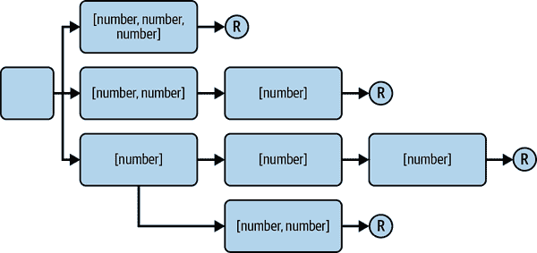

# 第七章：可变元组类型

元组类型是长度固定且每个元素类型已定义的数组。元组在像 React 这样的库中被广泛使用，因为易于解构和命名元素，但除了 React 外，它们也因为是对象的良好替代品而受到认可。

*可变元组类型* 是一种具有相同属性（定义长度和每个元素的类型已知），但其*确切形状*尚未定义的元组类型。它们基本上告诉类型系统会有一些元素，但我们还不知道它们将是哪些元素。它们是泛型的，旨在用真实类型替换。

当我们理解到元组类型也可以用于描述函数签名时，听起来像是一个相当无聊的功能，变得更加令人兴奋，因为元组可以展开到函数调用中作为参数。这意味着我们可以使用可变元组类型从函数和函数调用中获取最多的信息，以及接受函数作为参数的函数。

本章提供了许多用例，展示了我们如何使用可变元组类型来描述使用函数作为参数并需要从中获取最多信息的几种场景。如果没有可变元组类型，这些场景将很难开发或根本不可能。阅读完后，您将会将可变元组类型视为函数式编程模式的关键特性。

# 7.1 类型化 concat 函数

## 问题

你有一个`concat`函数，它接受两个数组并将它们连接起来。你想要确切的类型，但使用函数重载太过繁琐。

## 解决方案

使用可变元组类型。

## 讨论

`concat` 是一个可爱的辅助函数，它接受两个数组并将它们组合在一起。它使用数组展开，简短、优雅且可读：

```
function concat(arr1, arr2) {
  return [...arr1, ...arr2];
}
```

为这个函数创建类型可能很难，特别是如果你对你的类型有特定的期望。传入两个数组很容易，但返回类型应该是什么样的？你是否满意返回单个数组类型，还是想知道返回数组中每个元素的类型？

我们选择后者：我们想要元组，这样我们就知道将传递给此函数的每个元素的类型。为了正确地为这样的函数打上类型标记，以便考虑到所有可能的边界情况，我们最终会陷入一堆重载之中：

```
// 7 overloads for an empty second array
function concat(arr1: [], arr2: []): [];
function concat<A>(arr1: [A], arr2: []): [A];
function concat<A, B>(arr1: [A, B], arr2: []): [A, B];
function concat<A, B, C>(arr1: [A, B, C], arr2: []): [A, B, C];
function concat<A, B, C, D>(arr1: [A, B, C, D], arr2: []): [A, B, C, D];
function concat<A, B, C, D, E>(
  arr1: [A, B, C, D, E],
  arr2: []
): [A, B, C, D, E];
function concat<A, B, C, D, E, F>(
  arr1: [A, B, C, D, E, F],
  arr2: []
): [A, B, C, D, E, F];
// 7 more for arr2 having one element
function concat<A2>(arr1: [], arr2: [A2]): [A2];
function concat<A1, A2>(arr1: [A1], arr2: [A2]): [A1, A2];
function concat<A1, B1, A2>(arr1: [A1, B1], arr2: [A2]): [A1, B1, A2];
function concat<A1, B1, C1, A2>(
  arr1: [A1, B1, C1],
  arr2: [A2]
): [A1, B1, C1, A2];
function concat<A1, B1, C1, D1, A2>(
  arr1: [A1, B1, C1, D1],
  arr2: [A2]
): [A1, B1, C1, D1, A2];
function concat<A1, B1, C1, D1, E1, A2>(
  arr1: [A1, B1, C1, D1, E1],
  arr2: [A2]
): [A1, B1, C1, D1, E1, A2];
function concat<A1, B1, C1, D1, E1, F1, A2>(
  arr1: [A1, B1, C1, D1, E1, F1],
  arr2: [A2]
): [A1, B1, C1, D1, E1, F1, A2];
// and so on, and so forth
```

这仅考虑了具有多达六个元素的数组。为像这样的函数编写类型重载是非常耗费精力的。但有一种更简单的方法：可变元组类型。

TypeScript 中的元组类型是具有以下特征的数组：

+   数组的长度是定义好的。

+   每个元素的类型是已知的（且不必相同）。

例如，这是一个元组类型：

```
type PersonProps = [string, number];

const [name, age]: PersonProps = ['Stefan', 37];
```

*可变元组*类型是一种元组类型，具有相同的属性——定义长度和每个元素的类型已知——但*确切形状*尚未定义。由于我们还不知道类型和长度，所以只能在泛型中使用可变元组类型：

```
type Foo<T extends unknown[]> = [string, ...T, number];

type T1 = Foo<[boolean]>;  // [string, boolean, number]
type T2 = Foo<[number, number]>;  // [string, number, number, number]
type T3 = Foo<[]>;  // [string, number]
```

这类似于函数中的剩余元素，但其主要区别在于可变元组类型可以在元组中的任何位置和多次出现：

```
type Bar<
  T extends unknown[],
  U extends unknown[]
> = [...T, string, ...U];

type T4 = Bar<[boolean], [number]>;  // [boolean, string, number]
type T5 = Bar<[number, number], [boolean]>;  // [number, number, string, boolean]
type T6 = Bar<[], []>;  // [string]
```

当我们将其应用于`concat`函数时，我们必须引入两个泛型参数，每个数组一个。两者都需要约束为数组。然后，我们可以创建一个返回类型，将两个数组类型组合成一个新创建的元组类型：

```
function concat<T extends unknown[], U extends unknown[]>(
  arr1: T,
  arr2: U
): [...T, ...U] {
  return [...arr1, ...arr2];
}

// const test: (string | number)[]
const test = concat([1, 2, 3], [6, 7, "a"]);
```

语法非常美观；它与 JavaScript 中实际的串联非常相似。结果也非常好：我们得到了一个`(string | number)[]`，这已经是我们可以使用的内容。

但我们使用的是元组类型。如果我们想要确切地了解我们正在连接的哪些元素，我们必须将数组类型转换为元组类型，通过将泛型数组类型展开为元组类型：

```
function concat<T extends unknown[], U extends unknown[]>(
  arr1: [...T],
  arr2: [...U]
): [...T, ...U] {
  return [...arr1, ...arr2];
}
```

并且，作为返回值，我们也得到一个元组类型：

```
// const test: [number, number, number, number, number, string]
const test = concat([1, 2, 3], [6, 7, "a"]);
```

好消息是我们不会丢失任何东西。如果我们传递的是我们还不知道每个元素的数组，我们仍然会得到数组类型作为返回值：

```
declare const a: string[]
declare const b: number[]

// const test: (string | number)[]
const test = concat(a, b);
```

能够用单一类型描述这种行为显然比在函数重载中写入每种可能的组合更加灵活和可读。

# 7.2 给 promisify 函数添加类型

## 问题

您希望将回调样式的函数转换为 Promises，并完全对其进行类型化。

## 解决方案

函数参数是元组类型。使用可变元组类型使它们成为泛型。

## 讨论

在 JavaScript 中，Promises 成为一种事物之前，使用回调进行异步编程非常常见。函数通常会接受一系列参数，然后是一个回调函数，一旦结果出现，就会执行该函数，例如用于加载文件或进行非常简化的 HTTP 请求的函数：

```
function loadFile(
  filename: string,
  encoding: string,
  callback: (result: File) => void
) {
  // TODO
}

loadFile("./data.json", "utf-8", (result) => {
  // do something with the file
});

function request(url: URL, callback: (result: JSON) => void) {
  // TODO
}

request("https://typescript-cookbook.com", (result) => {
  // TODO
});
```

两者都遵循相同的模式：首先是参数，最后是带有结果的回调。这种方法有效，但如果有大量异步调用，其中包含回调中的回调，也被称为[“噩梦金字塔”](https://oreil.ly/Ye3Qr)，可能会显得笨拙：

```
loadFile("./data.txt", "utf-8", (file) => {
  // pseudo API
  file.readText((url) => {
    request(url, (data) => {
      // do something with data
    })
  })
})
```

Promises 负责处理这一切。它们不仅找到了一种方法来链式调用异步调用而不是嵌套它们，而且它们还是`async`/`await`的门户，使我们能够以同步形式编写异步代码。

```
loadFilePromise("./data.txt", "utf-8")
  .then((file) => file.text())
  .then((url) => request(url))
  .then((data) => {
      // do something with data
  });

// with async/await

const file = await loadFilePromise("./data.txt". "utf-8");
const url = await file.text();
const data = await request(url);
// do something with data.
```

好多了！幸运的是，我们可以将符合回调模式的每个函数都转换为`Promise`。我们希望创建一个`promisify`函数来自动为我们完成这项工作：

```
function promisify(fn: unknown): Promise<unknown> {
  // To be implemented
}

const loadFilePromise = promisify(loadFile);
const requestPromise = promisify(request);
```

但是我们如何对其进行类型化呢？可变元组类型来拯救我们！

每个函数头都可以描述为一个元组类型。例如：

```
declare function hello(name: string, msg: string): void;
```

就像是：

```
declare function hello(...args: [string, string]): void;
```

并且我们可以在定义时非常灵活地进行定义：

```
declare function h(a: string, b: string, c: string): void;
// equal to
declare function h(a: string, b: string, ...r: [string]): void;
// equal to
declare function h(a: string, ...r: [string, string]): void;
// equal to
declare function h(...r: [string, string, string]): void;
```

这也被称为 *剩余元素*，在 JavaScript 中我们拥有它，允许你定义具有几乎无限参数列表的函数，其中最后一个元素，剩余元素，吸收了所有多余的参数。

例如，这个通用元组函数接受任何类型的参数列表，并将其创建为元组：

```
function tuple<T extends any[]>(...args: T): T {
    return args;
}

const numbers: number[] = getArrayOfNumbers();
const t1 = tuple("foo", 1, true);  // [string, number, boolean]
const t2 = tuple("bar", ...numbers);  // [string, ...number[]]
```

问题是，其余元素必须始终位于最后。在 JavaScript 中，不可能在中间定义一个几乎无限的参数列表。然而，使用可变元组类型，我们可以在 TypeScript 中实现这一点！

让我们再次看看 `loadFile` 和 `request` 函数。如果我们将两个函数的参数描述为元组，它们会是这样的：

```
function loadFile(...args: [string, string, (result: File) => void]) {
  // TODO
}

function request2(...args: [URL, (result: JSON) => void]) {
  // TODO
}
```

让我们寻找相似之处。两者都以具有不同结果类型的回调结束。我们可以通过用一个通用的结果类型替代这些变化来对齐两个回调的类型。稍后在使用中，我们将泛型替换为实际类型。因此，`JSON` 和 `File` 变成了泛型类型参数 `Res`。

现在来看看 *在* `Res` 之前的参数。它们可能完全不同，但它们甚至有一些共同点：它们是元组内的元素。这就需要用到可变元组。我们知道它们将具有具体的长度和具体的类型，但现在我们只是用一个占位符来表示它们。让我们称之为 `Args`。

因此，描述两个函数签名的函数类型可能如下所示：

```
type Fn<Args extends unknown[], Res> = (
  ...args: [...Args, (result: Res) => void]
) => void;
```

让你的新类型试试水：

```
type LoadFileFn = Fn<[string, string], File>;
type RequestFn = Fn<[URL], JSON>;
```

这正是我们需要的 `promisify` 函数。我们能够提取所有相关参数——即回调之前的参数和结果类型——并将它们组织成新的顺序。

让我们首先直接将新创建的函数类型内联到 `promisify` 的函数签名中：

```
function promisify<Args extends unknown[], Res>(
  fn: (...args: [...Args, (result: Res) => void]) => void
): (...args: Args) => Promise<Res> {
  // soon
}
```

现在 `promisify` 看起来是这样的：

+   有两个泛型类型参数：`Args`，它需要是一个数组（或元组），以及 `Res`。

+   `promisify` 的参数是一个函数，其中前几个参数是 `Args` 的元素，最后一个参数是具有类型 `Res` 的函数。

+   `promisify` 返回一个接受 `Args` 作为参数并返回 `Res` 的 `Promise` 的函数。

如果你尝试使用 `promisify` 的新类型，你会发现我们确实得到了想要的类型。

但情况会更好。如果你看一下函数签名，那么我们期望的参数显而易见，即使它们是可变的，并将被实际类型替代。我们可以在 `promisify` 的实现中使用相同的类型：

```
function promisify<Args extends unknown[], Res>(
  fn: (...args: [...Args, (result: Res) => void]) => void
): (...args: Args) => Promise<Res> {
  return function (...args: Args) { 
    return new Promise((resolve) => { 
      function callback(res: Res) { 
        resolve(res);
      }
      fn.call(null, ...[...args, callback]); 
    });
  };
}
```

所以它的作用是什么？


我们返回一个接受除回调外的所有参数的函数。


这个函数返回一个新创建的 `Promise`。


由于我们还没有一个回调函数，我们需要构建它。它的作用是什么？它调用 `Promise` 中的 `resolve` 函数，生成一个结果。


已分割的内容需要重新组合！我们将回调函数添加到参数中，并调用原始函数。

就是这样。一个用于符合回调模式函数的工作`promisify`函数。完美地类型化。而且我们甚至保留了参数名。

# 7.3 编写柯里化函数的类型

## 问题

编写一个`curry`函数。*柯里化*是一种将接受多个参数的函数转换为一系列每个仅接受单个参数的函数的技术。

您希望提供优秀的类型。

## 解决方案

结合条件类型和可变参数元组类型，始终剥离第一个参数。

## 讨论

柯里化（Currying）是函数式编程中非常著名的技术。柯里化将接受多个参数的函数转换为一系列每个仅接受单个参数的函数。

其基本概念被称为“函数参数的部分应用”。我们用它来最大化函数的复用。柯里化的“Hello, World!”示例实现了一个可以稍后部分应用第二个参数的`add`函数：

```
function add(a: number, b: number) {
  return a + b;
}

const curriedAdd = curry(add); // convert: (a: number) => (b: number) => number
const add5 = curriedAdd(5); // apply first argument. (b: number) => number
const result1 = add5(2); // second argument. Result: 7
const result2 = add5(3); // second argument. Result: 8
```

起初看起来随意的东西在处理长参数列表时非常有用。下面这个通用函数要么添加要么移除`HTMLElement`的类。

我们可以准备好所有内容，除了最终事件：

```
function applyClass(
  this: HTMLElement, // for TypeScript only
  method: "remove" | "add",
  className: string,
  event: Event
) {
  if (this === event.target) {
    this.classListmethod;
  }
}

const applyClassCurried = curry(applyClass); // convert
const removeToggle = applyClassCurried("remove")("hidden");

document.querySelector(".toggle")?.addEventListener("click", removeToggle);
```

这样，我们可以为多个元素上的多个事件重复使用`removeToggle`。我们也可以在许多其他情况下使用`applyClass`。

柯里化是编程语言 Haskell 的基本概念，向数学家 Haskell Brooks Curry 致敬，为编程语言和技术命名。在 Haskell 中，每个操作都是柯里化的，并且程序员能够充分利用它。

JavaScript 在很大程度上借鉴了函数式编程语言，可以利用其内置的绑定功能实现部分应用：

```
function add(a: number, b: number, c: number) {
  return a + b + c;
}

// Partial application
const partialAdd5And3 = add.bind(this, 5, 3);
const result = partialAdd5And3(2); // third argument
```

由于 JavaScript 中函数是一等公民，我们可以创建一个`curry`函数，它接受一个函数作为参数，并在执行之前收集所有参数：

```
function curry(fn) {
  let curried = (...args) => {
    // if you haven't collected enough arguments
    if (fn.length !== args.length) {
      // partially apply arguments and
      // return the collector function
      return curried.bind(null, ...args);
    }
    // otherwise call all functions
    return fn(...args);
  };
  return curried;
}
```

技巧在于每个函数都在其`length`属性中存储了定义参数的数量。这就是我们如何递归地收集所有必要的参数，然后将它们应用于传递的函数的方法。

那么还缺什么？类型！让我们创建一个类型，适用于每个顺序函数都可以接受恰好一个参数的柯里化模式。我们通过创建一个条件类型来实现这一点，该类型执行与`curry`函数内部的`curried`函数相反的操作：移除参数。

因此，让我们创建一个`Curried<F>`类型。首先要检查类型是否确实是一个函数：

```
type Curried<F> = F extends (...args: infer A) => infer R
  ? /* to be done */
  : never; // not a function, this should not happen
```

我们还推断出参数为`A`，返回类型为`R`。下一步，我们将第一个参数作为`F`剥离，并将所有剩余参数存储在`L`中（用于*last*）：

```
type Curried<F> = F extends (...args: infer A) => infer R
  ? A extends [infer F, ...infer L]
    ? /* to be done */
    : () => R
  : never;
```

如果没有参数，我们返回一个不带参数的函数。最后检查：我们检查剩余参数是否为空。这意味着我们已经达到了从参数列表中移除参数的末端：

```
type Curried<F> = F extends (...args: infer A) => infer R
  ? A extends [infer F, ...infer L]
    ? L extends []
      ? (a: F) => R
      : (a: F) => Curried<(...args: L) => R>
    : () => R
  : never;
```

如果某些参数保留下来，我们再次调用`Curried`类型，但带上剩余的参数。这样，我们逐步去除一个参数，如果你仔细观察，你会发现这个过程几乎与`curried`函数中所做的相同。在`Curried<F>`中我们解构参数，而在`curried(fn)`中我们重新收集它们。

有了类型完成后，让我们把它添加到`curry`中：

```
function curry<F extends Function>(fn: F): Curried<F> {
  let curried: Function = (...args: any) => {
    if (fn.length !== args.length) {
      return curried.bind(null, ...args);
    }
    return fn(...args);
  };
  return curried as Curried<F>;
}
```

由于类型的灵活性，我们需要一些断言和`any`。但通过`as`和`any`关键字，我们标记了哪些部分被认为是不安全的类型。

就是这样！我们可以很轻松地进行函数柯里化！

# 7.4 创建一个灵活的`curry`函数的类型

## 问题

来自第 7.3 节的`curry`函数允许传递任意数量的参数，但你的类型定义只允许一次接收一个参数。

## 解决方案

扩展您的类型以创建所有可能元组组合的函数重载。

## 讨论

在第 7.3 节的配方中，我们最终得到了允许我们逐个应用函数参数的函数类型：

```
function addThree(a: number, b: number, c: number) {
  return a + b + c;
}

const adder = curried(addThree);
const add7 = adder(5)(2);
const result = add7(2);
```

然而，`curry`函数本身可以接受任意列表的参数：

```
function addThree(a: number, b: number, c: number) {
  return a + b + c;
}

const adder = curried(addThree);
const add7 = adder(5, 2); // this is the difference
const result = add7(2);
```

这使我们能够处理相同的用例，但调用函数的次数大大减少了。因此，让我们调整我们的类型以充分利用完整的`curry`体验。

###### 注意

此示例非常好地说明了类型系统如何仅作为 JavaScript 之上的薄层工作。通过在正确位置添加断言和`any`，我们有效地定义了`curry`的工作方式，而函数本身则更加灵活。请注意，当您在复杂功能的基础上定义复杂类型时，可能会以某种方式达到目标，而最终如何工作则取决于您。请相应地进行测试。

我们的目标是创建一个类型，可以为每个部分应用生成所有可能的函数签名。对于`addThree`函数，所有可能的类型看起来像这样：

```
type Adder = (a: number) => (b: number) => (c: number) => number;
type Adder = (a: number) => (b: number, c: number) => number;
type Adder = (a: number, b: number) => (c: number) => number;
type Adder = (a: number, b: number, c: number) => number;
```

另请参见图 7-1，显示所有可能调用图的可视化。



###### 图 7-1\. 显示`addThree`在柯里化时所有可能函数调用组合的图表；从三个分支开始，可能还有第四个分支

我们首先要做的是稍微调整我们调用`Curried`辅助类型的方式。在原始类型中，我们在辅助类型中进行函数参数和返回类型的推断。现在，我们需要在多个类型调用中传递返回值，因此我们直接从`curry`函数中提取返回类型和参数：

```
function curry<A extends any[], R extends any>(
  fn: (...args: A) => R
): Curried<A, R> {
  // see before, we're not changing the implementation
}
```

接下来，我们重新定义`Curried`类型。现在它包含两个泛型类型参数：`A`代表参数，`R`代表返回类型。作为第一步，我们检查参数是否包含元组元素。我们提取第一个元素`F`和所有剩余的元素`L`。如果没有剩余元素，我们返回返回类型`R`：

```
type Curried<A extends any[], R extends any> = A extends [infer F, ...infer L]
  ? // to be done
  : R;
```

不可能通过剩余运算符提取多个元组。这就是为什么我们仍然需要去掉第一个元素并收集`L`中的剩余元素。但没关系，我们至少需要*一个*参数来有效地执行部分应用。

当我们处于`true`分支时，我们创建函数定义。在前面的例子中，我们返回了一个返回递归调用的函数；现在我们需要提供所有可能的部分应用程序。

由于函数参数仅仅是元组类型（参见 Recipe 7.2），函数重载的参数可以描述为元组类型的并集。类型`Overloads`接受函数参数的元组并创建所有的部分应用程序：

```
type Overloads<A extends any[]> = A extends [infer A, ...infer L]
  ? [A] | [A, ...Overloads<L>] | []
  : [];
```

如果我们传递一个元组，我们将从空元组开始，并逐步增长到一个参数，然后到两个参数，依此类推，直到包含所有参数的元组：

```
// type Overloaded = [] | [string, number, string] | [string] | [string, number]
type Overloaded = Overloads<[string, number, string]>;
```

现在我们可以定义所有的重载，我们获取原始函数参数列表的剩余参数，并创建所有可能的函数调用，这些调用也包括第一个参数：

```
type Curried<A extends any[], R extends any> = A extends [infer F, ...infer L]
  ? <K extends Overloads<L>>(
      arg: F,
      ...args: K
    ) => /* to be done */
  : R;
```

应用于之前的`addThree`示例，这部分会将第一个参数`F`创建为`number`，然后与`[]`、`[number]`和`[number, number]`组合。

现在是返回类型的问题。这再次是对`Curried`的递归调用，就像在 Recipe 7.2 中一样。请记住，我们按顺序链接函数。我们传入相同的返回类型——最终我们需要到达那里——但也需要传递我们在函数重载中尚未展开的所有剩余参数。因此，如果我们只使用`number`调用`addThree`，则下一次`Curried`的迭代需要这两个剩余数字作为参数。这是我们如何创建可能调用的树。

要到达可能的组合，我们需要从剩余的参数中删除我们已在函数签名中描述的参数。一个辅助类型`Remove<T, U>`遍历这两个元组，并每次去掉一个元素，直到其中一个元组耗尽为止：

```
type Remove<T extends any[], U extends any[]> = U extends [infer _, ...infer UL]
  ? T extends [infer _, ...infer TL]
    ? Remove<TL, UL>
    : never
  : T;
```

将其应用于`Curried`，我们得到最终结果：

```
type Curried<A extends any[], R extends any> = A extends [infer F, ...infer L]
  ? <K extends Overloads<L>>(
      arg: F,
      ...args: K
    ) => Curried<Remove<L, K>, R>
  : R;
```

`Curried<A, R>`现在产生与 Figure 7-1 中描述的调用图相同的结果，但对我们传递给`curry`的所有可能函数都很灵活。最大灵活性的类型安全（向提供了他们在类型挑战解决方案中提供了缺失部分的 GitHub 用户 Akira Matsuzaki 致敬）。

# 7.5 Typing the Simplest curry function

## 问题

`curry`函数及其类型令人印象深刻，但伴随着许多注意事项。是否有更简单的解决方案？

## 解决方案

创建一个仅有单一顺序步骤的`curry`函数。TypeScript 能够自行确定适当的类型。

## 讨论

在柯里化三部曲的最后一部分中，我希望你坐下来思考一下我们在 Recipes 7.3 和 7.4 中看到的内容。我们通过 TypeScript 的元编程特性创建了非常复杂的类型，几乎与实际实现一样工作。尽管结果令人印象深刻，但我们必须考虑一些注意事项：

+   为了 Recipes 7.3 和 7.4 中的类型实现，实现的方式有些不同，但结果差异很大！然而，`curry`函数的底层实现保持不变。这样做的唯一方法是在参数中使用`any`和在返回类型上进行类型断言。这意味着我们通过强制 TypeScript 遵循我们的世界观，有效地禁用了类型检查。TypeScript 能够做到这一点非常棒，有时也是必要的（例如创建新对象），但它也可能适得其反，特别是当实现和类型变得非常复杂时。测试类型和实现都是必须的。我们在 Recipe 12.4 中讨论测试类型。

+   你会丢失信息。特别是在柯里化时，保持参数名对于知道哪些参数已经应用是至关重要的。之前的解决方案无法保留参数名，而是默认为通用的`a`或`args`。例如，如果你的参数类型全都是字符串，你无法知道你当前正在写哪个字符串。

+   虽然 Recipe 7.4 中的结果提供了适当的类型检查，但由于类型的特性，自动补全受到限制。你只知道在键入它的时刻需要第二个参数。TypeScript 的一个主要功能是提供正确的工具和信息，使你更加高效。灵活的`Curried`类型再次将你的生产力降低到猜测的程度。

尽管这些类型令人印象深刻，但不可否认它们伴随着一些巨大的权衡。这引发了一个问题：我们应该选择它吗？我认为这实际取决于你试图达成什么。

在柯里化和部分应用的情况下，存在两个派别。第一派喜欢函数式编程模式，并尽可能利用 JavaScript 的函数能力。他们希望尽可能多地重用部分应用，并需要先进的柯里化功能。另一派看到了在特定情况下函数式编程模式的好处，例如，等待最终参数将相同函数提供给多个事件。他们通常乐意尽可能多地应用，然后在第二步提供其余部分。

到目前为止，我们只处理了第一类营地。如果你属于第二类营地，你很可能只需要一个部分应用参数的柯里化函数，这样你可以在第二步中传递其余的参数：不是一个参数的参数序列，也不是灵活应用任意多个参数。一个理想的接口看起来像这样：

```
function applyClass(
  this: HTMLElement, // for TypeScript only
  method: "remove" | "add",
  className: string,
  event: Event
) {
  if (this === event.target) {
    this.classListmethod;
  }
}

const removeToggle = curry(applyClass, "remove", "hidden");

document.querySelector("button")?.addEventListener("click", removeToggle);
```

`curry` 是一个函数，它接受另一个函数 `f` 作为参数，然后是 `f` 的一系列参数 `t`。它返回一个函数，该函数接受 `f` 的剩余参数 `u`，并调用 `f` 以所有可能的参数。该函数在 JavaScript 中可能看起来像这样：

```
function curry(f, ...t) {
  return (...u) => f(...t, ...u);
}
```

由于剩余和展开运算符，`curry` 成为了一个一行代码的函数。现在让我们给它加上类型！我们将不得不使用泛型，因为我们处理的是尚不知道的参数。这里有返回类型 `R`，以及函数参数 `T` 和 `U` 的两个部分。后者是变长元组类型，需要如此定义。

用泛型类型参数 `T` 和 `U` 来组成 `f` 的参数，`f` 的类型看起来像这样：

```
type Fn<T extends any[], U extends any[]> =
    (...args: [...T, ...U]) => any;
```

函数参数可以描述为元组，这里我们说这些函数参数应该分成两部分。让我们将这种类型内联到 `curry` 中，并为返回类型 `R` 使用另一个泛型类型参数：

```
function curry<T extends any[], U extends any[], R>(
  f: (...args: [...T, ...U]) => R,
  ...t: T
) {
  return (...u: U) => f(...t, ...u);
}
```

这就是我们需要的所有类型：简单、直接，类型看起来非常类似于实际实现。通过一些变长元组类型，TypeScript 给我们提供了：

+   100% 类型安全。TypeScript 直接从你的使用中推断出泛型类型，并且它们是正确的。没有通过条件类型和递归繁琐地构造类型。

+   我们获得了所有可能解决方案的自动完成。当你添加一个`,`来宣布你的参数的下一步时，TypeScript 将调整类型并给出提示，告诉你可以期待什么。

+   我们不会丢失任何信息。由于我们不构建新类型，TypeScript 会保留原始类型的标签，我们知道可以期待哪些参数。

是的，`curry` 不像原始版本那样灵活，但对于许多用例而言，这可能是正确的选择。这完全取决于我们为我们的用例接受的权衡。

###### 提示

如果你经常使用元组，你可以为元组类型的元素命名：`type Person = [name: string, age: number];`。这些标签只是注释，在转译后会被移除。

最终，`curry` 函数及其许多不同的实现代表了你可以使用 TypeScript 解决特定问题的许多方法。你可以全力投入类型系统，并用它来处理非常复杂和精细的类型，或者你可以稍微减少范围，让编译器为你完成工作。你的选择取决于你的目标和你试图实现的内容。

# 7.6 从元组创建枚举

## 问题

你喜欢枚举如何简化选择有效值，但在阅读 Recipe 3.12 之后，你可能不想处理它们的所有警告。

## 解决方案

从元组创建您的枚举。使用条件类型、可变元组类型和`"length"`属性来为数据结构添加类型。

## 讨论

在 Recipe 3.12 中，我们讨论了在使用数字和字符串枚举时可能遇到的所有注意事项。我们最终得出的模式更接近类型系统，但给您提供了与常规枚举相同的开发者体验：

```
const Direction = {
  Up: 0,
  Down: 1,
  Left: 2,
  Right: 3,
} as const;

// Get to the const values of Direction
type Direction = (typeof Direction)[keyof typeof Direction];

// (typeof Direction)[keyof typeof Direction] yields 0 | 1 | 2 | 3
function move(direction: Direction) {
  // tbd
}

move(30); // This breaks!

move(0); //This works!

move(Direction.Left); // This also works!
```

这是一个非常直接的模式，没有任何意外，但如果您处理大量条目，特别是想要有字符串枚举时，可能需要为此付出很多工作：

```
const Commands = {
  Shift: "shift",
  Xargs: "xargs",
  Tail: "tail",
  Head: "head",
  Uniq: "uniq",
  Cut: "cut",
  Awk: "awk",
  Sed: "sed",
  Grep: "grep",
  Echo: "echo",
} as const;
```

存在重复，这可能导致拼写错误，进而导致未定义的行为。一个为您创建这种枚举的辅助函数可以帮助处理冗余和重复。假设您有这样一组项目：

```
const commandItems = [
  "echo",
  "grep",
  "sed",
  "awk",
  "cut",
  "uniq",
  "head",
  "tail",
  "xargs",
  "shift",
] as const;
```

辅助函数`createEnum`遍历每个项，创建一个对象，其中包含大写的键，指向字符串值或数字值，具体取决于您的输入参数：

```
function capitalize(x: string): string {
  return x.charAt(0).toUpperCase() + x.slice(1);
}

// Typings to be done
function createEnum(arr, numeric) {
  let obj = {};
  for (let [i, el] of arr.entries()) {
    obj[capitalize(el)] = numeric ? i : el;
  }
  return obj;
}

const Command = createEnum(commandItems); // string enum
const CommandN = createEnum(commandItems, true); // number enum
```

让我们为此创建类型！我们需要处理两件事：

+   从元组创建一个对象。键都是大写的。

+   将每个属性键的值设置为字符串值或数字值。数字值应从 0 开始，并随每一步递增。

要创建对象键，我们需要一个可以映射出的联合类型。为了获取所有对象键，我们需要将元组转换为联合类型。辅助类型`TupleToUnion`接受一个字符串元组并将其转换为联合类型。为什么只有字符串元组？因为我们需要对象键，而字符串键最容易使用。

`TupleToUnion<T>` 是一个递归类型。就像我们在其他课程中所做的那样，我们一直在削减单个元素——这次是元组末尾的元素——然后再次调用剩余元素的类型。我们将每次调用放入一个联合类型中，有效地得到了元组元素的联合类型：

```
type TupleToUnion<T extends readonly string[]> = T extends readonly [
  ...infer Rest extends string[],
  infer Key extends string
]
  ? Key | TupleToUnion<Rest>
  : never;
```

借助映射类型和字符串操作类型，我们可以创建`Enum<T>`的字符串枚举版本：

```
type Enum<T extends readonly string[], N extends boolean = false> = Readonly<
  {
    [K in TupleToUnion<T> as Capitalize<K>]: K
  }
>;
```

对于数字枚举版本，我们需要获取每个值的数字表示。如果我们仔细想一想，我们已经在原始数据中的某个地方存储了它。让我们看看`TupleToUnion`如何处理一个四元素元组：

```
// The type we want to convert to a union type
type Direction = ["up", "down", "left", "right"];

// Calling the helper type
type DirectionUnion = TupleToUnion<Direction>;

// Extracting the last, recursively calling TupleToUnion with the Rest
type DirectionUnion = "right" | TupleToUnion<["up", "down", "left"]>;

// Extracting the last, recursively calling TupleToUnion with the Rest
type DirectionUnion = "right" | "left" | TupleToUnion<["up", "down"]>;

// Extracting the last, recursively calling TupleToUnion with the Rest
type DirectionUnion = "right" | "left" | "down" | TupleToUnion<["up"]>;

// Extracting the last, recursively calling TupleToUnion with an empty tuple
type DirectionUnion = "right" | "left" | "down" | "up" | TupleToUnion<[]>;

// The conditional type goes into the else branch, adding never to the union
type DirectionUnion = "right" | "left" | "down" | "up" | never;

// never in a union is swallowed
type DirectionUnion = "right" | "left" | "down" | "up";
```

如果您仔细观察，可以看到每次调用时元组的长度在减少。首先是三个元素，然后是两个，然后是一个，最后没有元素了。元组由数组的长度和数组中每个位置的类型定义。TypeScript 将元组的长度存储为一个数字，可通过`"length"`属性访问：

```
type DirectionLength = Direction["length"]; // 4
```

因此，通过每次递归调用，我们可以获得剩余元素的长度，并将其作为枚举的值。我们不仅返回枚举键，还返回一个对象，其中包含键及其可能的数字值：

```
type TupleToUnion<T extends readonly string[]> = T extends readonly [
  ...infer Rest extends string[],
  infer Key extends string
]
  ? { key: Key; val: Rest["length"] } | TupleToUnion<Rest>
  : never;
```

我们使用这个新创建的对象来决定我们的枚举中是要有数字值还是字符串值：

```
type Enum<T extends readonly string[], N extends boolean = false> = Readonly<
  {
    [K in TupleToUnion<T> as Capitalize<K["key"]>]: N extends true
      ? K["val"]
      : K["key"];
  }
>;
```

就是这样！我们将新的`Enum<T, N>`类型连接到`createEnum`函数：

```
type Values<T> = T[keyof T];

function createEnum<T extends readonly string[], B extends boolean>(
  arr: T,
  numeric?: B
) {
  let obj: any = {};
  for (let [i, el] of arr.entries()) {
    obj[capitalize(el)] = numeric ? i : el;
  }
  return obj as Enum<T, B>;
}

const Command = createEnum(commandItems, false);
type Command = Values<typeof Command>;
```

能够在类型系统中访问元组的长度是 TypeScript 中的一个隐藏宝石。这允许许多事情，如本例所示，以及实现计算器在类型系统中的有趣功能。与 TypeScript 中所有高级特性一样，明智地使用它们。

# 7.7 分割函数签名的所有元素

## 问题

你知道如何在函数内部获取参数类型和返回类型，但你也想在外部使用相同的类型。

## 解决方案

使用内置的`Parameters<F>`和`ReturnType<F>`辅助类型。

## 讨论

在本章中，我们处理了辅助函数以及它们如何从作为参数的函数中获取信息。例如，这个`defer`函数接受一个函数及其所有参数，并返回另一个将执行它的函数。通过一些泛型类型，我们可以捕获所有需要的内容：

```
function defer<Par extends unknown[], Ret>(
  fn: (...par: Par) => Ret,
  ...args: Par
): () => Ret {
  return () => fn(...args);
}

const log = defer(console.log, "Hello, world!");
log();
```

如果我们将函数作为参数传递，这将非常有效，因为我们可以轻松地提取详细信息并重复使用它们。但某些情况需要一个函数的参数及其返回类型在泛型函数之外。幸运的是，我们可以利用一些内置的 TypeScript 辅助类型。使用`Parameters<F>`我们获取一个函数的参数作为元组；使用`ReturnType<F>`我们获取一个函数的返回类型。因此，之前的`defer`函数可以这样编写：

```
type Fn = (...args: any[]) => any;

function defer<F extends Fn>(
  fn: F,
  ...args: Parameters<F>
): () => ReturnType<F> {
  return () => fn(...args);
}
```

`Parameters<F>`和`ReturnType<F>`都是条件类型，依赖于函数/元组类型，非常相似。在`Parameters<F>`中，我们推断参数，在`ReturnType<F>`中，我们推断返回类型：

```
type Parameters<F extends (...args: any) => any> =
  F extends (...args: infer P) => any ? P : never;

type ReturnType<F extends (...args: any) => any> =
  F extends (...args: any) => infer R ? R : any;
```

我们可以使用这些辅助类型，例如，在函数外部准备函数参数。以这个`search`函数为例：

```
type Result = {
  page: URL;
  title: string;
  description: string;
};

function search(query: string, tags: string[]): Promise<Result[]> {
  throw "to be done";
}
```

使用`Parameters<typeof search>`我们可以了解期望的参数。我们在函数调用之外定义它们，并在调用时将它们作为参数展开：

```
const searchParams: Parameters<typeof search> = [
  "Variadic tuple tpyes",
  ["TypeScript", "JavaScript"],
];

search(...searchParams);
const deferredSearch = defer(search, ...searchParams);
```

当你生成新类型时，这两个辅助函数也很有用；参见 Recipe 4.8 作为一个例子。
