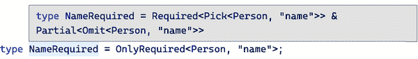
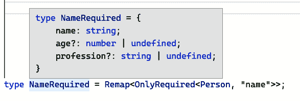
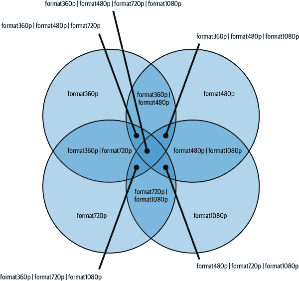

# 第八章：辅助类型

TypeScript 的一个优势是能够从其他类型派生出新的类型。这使你能够定义类型之间的关系，其中对一个类型的更新会自动传播到所有派生类型中。这减少了维护成本，最终导致更加健壮的类型设置。

在创建派生类型时，通常会应用相同的类型修改，但组合方式不同。TypeScript 已经内置了一组 [实用工具类型](https://oreil.ly/inM2y)，本书中我们已经见过其中一些。但有时候这些还不够。有些情况下，你需要以不同的方式应用已知技术，或者深入了解类型系统的内部工作原理来实现期望的结果。你可能需要自己的一组辅助类型。

本章介绍了辅助类型的概念，并展示了一些使用案例，说明自定义辅助类型如何极大地扩展你从其他类型中推导类型的能力。每种类型都设计用于不同的情况，并且每种类型应该教会你类型系统的一个新方面。当然，你在这里看到的类型列表并不全面，但它们为你提供了一个良好的起点和足够的资源来展开研究。

最终，TypeScript 的类型系统可以被视为自己的功能性元编程语言，在这里，你可以将小型、单一目的的辅助类型与更大的辅助类型结合起来，使类型派生就像将单一类型应用于现有模型一样简单。

# 8.1 设置特定属性为可选

## 问题

你希望推导出设置特定属性为可选的类型。

## 解决方案

创建一个自定义辅助类型 `SetOptional`，它交集两个对象类型：一个使用可选映射类型修饰符映射所有选定属性，另一个映射所有剩余属性。

## 讨论

TypeScript 项目中的所有模型都已设置和定义，并且你希望在整个代码中引用它们：

```
type Person = {
  name: string;
  age: number;
  profession: string;
};
```

经常出现的一种情况是，你需要像 `Person` 这样的东西，但不要求设置所有属性；其中一些可以是 *可选的*。这将使你的 API 更容易适应其他结构和类型，它们形状相似但可能缺少一个或两个字段。你不希望维护不同的类型（参见 Recipe 12.1），而是希望从原始模型中派生它们，该模型仍在使用中。

TypeScript 有一个内置的辅助类型叫做 `Partial<T>`，可以将所有属性修改为可选的：

```
type Partial<T> = { [P in keyof T]?: T[P]; };
```

这是一个 *映射类型*，它在所有键上进行映射，并使用 *可选映射类型修饰符* 将每个属性设置为可选的。制作 `SetOptional` 类型的第一步是减少可以设置为可选的键集：

```
type SelectPartial<T, K extends keyof T> = {
  [P in K]?: T[P]
};
```

###### 注意

*可选映射类型修饰符*会将一个可选属性的符号（问号）应用于一组属性。你在 Recipe 4.5 中学习了关于映射类型修饰符的内容。

在`SelectPartial<T, K extends keyof T>`中，我们不会映射所有键，只映射提供的键的子集。通过`extends keyof T`泛型约束，我们确保仅传递有效的属性键。如果我们将`SelectPartial`应用于`Person`来选择`"age"`，我们最终得到的类型将仅显示`age`属性，并将其设置为可选：

```
type Age = SelectPartial<Person, "age">;

// type Age = { age?: number | undefined };
```

第一步已经完成：我们希望设置为可选的所有内容都是可选的。但是其余的属性却丢失了。让我们将它们还原到对象类型中。

扩展现有对象类型并添加更多属性的最简单方法是创建与另一个对象类型的交集类型。因此，在我们的情况下，我们将`SelectPartial`中编写的内容与包含所有剩余键的类型相交。

我们可以通过使用`Exclude`辅助类型获取所有剩余的键。`Exclude<T, U>`是一种*条件类型*，用于比较两个集合。如果集合`T`中的元素在`U`中，则使用`never`将它们移除；否则，它们保留在类型中：

```
type Exclude<T, U> = T extends U ? never : T;
```

这与我们在食谱 5.3 中描述的`Extract<T, U>`相反。`Exclude<T, U>`是一种*分布条件类型*（见食谱 5.2），它将条件类型应用于联合类型的每个元素：

```
// This example shows how TypeScript evaluates a
// helper type step by step.

type ExcludeAge = Exclude<"name" | "age", "age">;

// 1\. Distribute
type ExcludeAge =
  "name" extends "age" ? never : "name" |
  "age" extends "age" ? never : "age";

// 2\. Evaluate
type ExcludeAge = "name" | never;

// 3\. Remove unnecessary `never`
type ExcludeAge = "name";
```

这正是我们想要的！在`SetOptional`中，我们创建一个类型，*挑选*所有选定的键并使它们可选，然后从所有对象键的更大集合中*排除*相同的键：

```
type SetOptional<T, K extends keyof T> = {
  [P in K]?: T[P];
} &
  {
    [P in Exclude<keyof T, K>]: T[P];
  };
```

两种类型的交集是新的对象类型，我们可以将其用于任何我们喜欢的模型：

```
type OptionalAge = SetOptional<Person, "age">;

/*
type OptionalAge = {
 name: string;
 age?: number | undefined;
 profession: string;
};
*/
```

如果我们想要使多个键可选，我们需要提供一个包含所有期望属性键的联合类型：

```
type OptionalAgeAndProf = SetOptional<Person, "age" | "profession">;
```

TypeScript 不仅允许您自己定义这样的类型，还提供了一组内置的辅助类型，您可以轻松地结合使用它们来达到类似的效果。我们可以仅基于辅助类型编写完全相同的`SetOptional`类型：

```
type SetOptional<T, K extends keyof T> = Partial<Pick<T, K>> & Omit<T, K>;
```

+   `Pick<T, K>`从对象`T`中选择键`K`。

+   `Omit<T, K>`从对象`T`中选择除了`K`之外的所有内容（在内部使用`Exclude`）。

+   而我们已经了解了`Partial<T>`的作用。

根据您喜欢阅读类型的方式，这些辅助类型的组合可能更易于阅读和理解，特别是因为内置类型在开发者中更为广为人知。

只有一个问题：如果您悬停在新生成的类型上，TypeScript 将向您显示类型的构建方式，而不是实际的属性。通过来自食谱 8.3 的`Remap`辅助类型，我们可以使我们的类型更易读和可用：

```
type SetOptional<T, K extends keyof T> = Remap<
  Partial<Pick<T, K>> & Omit<T, K>
>;
```

如果您将您的类型参数视为函数接口，您可能也希望考虑您的类型参数。您可以进行的一个优化是将第二个参数——所选对象键——设置为默认值：

```
type SetOptional<T, K extends keyof T = keyof T> = Remap<
  Partial<Pick<T, K>> & Omit<T, K>
>;
```

通过`K extends keyof T = keyof T`，我们可以确保将所有属性键都设置为可选，并且仅在需要时选择特定的键。我们的辅助类型刚刚变得更加灵活。

同样，您还可以开始为其他情况创建类型，比如 `SetRequired`，在这种情况下，您希望确保某些键绝对是必需的：

```
type SetRequired<T, K extends keyof T = keyof T> = Remap<
  Required<Pick<T, K>> & Omit<T, K>
>;
```

或者 `OnlyRequired`，在这种情况下，你提供的所有键都是必需的，但其余的是可选的：

```
type OnlyRequired<T, K extends keyof T = keyof T> = Remap<
  Required<Pick<T, K>> & Partial<Omit<T, K>>
>;
```

最好的一点是：您最终会拥有一整套辅助类型，可以在多个项目中使用。

# 8.2 修改嵌套对象

## 问题

像 `Partial`、`Required` 和 `Readonly` 这样的对象辅助类型仅修改对象的第一层级，并且不会触及嵌套对象属性。

## 解决方案

创建递归辅助类型，在嵌套对象上执行相同操作。

## 讨论

假设你的应用程序具有可以由用户配置的不同设置。为了使您能够随时间轻松扩展设置，您只存储一组默认设置与用户配置的设置之间的差异：

```
type Settings = {
  mode: "light" | "dark";
  playbackSpeed: number;
  subtitles: {
    active: boolean;
    color: string;
  };
};

const defaults: Settings = {
  mode: "dark",
  playbackSpeed: 1.0,
  subtitles: {
    active: false,
    color: "white",
  },
};
```

函数 `applySettings` 接受默认设置和用户设置。您将它们定义为 `Partial<Settings>`，因为用户只需要提供*一些*键；其余的将从默认设置中获取：

```
function applySettings(
  defaultSettings: Settings,
  userSettings: Partial<Settings>
): Settings {
  return { ...defaultSettings, ...userSettings };
}
```

如果你需要在第一层级设置某些属性，这种方法非常有效：

```
let settings = applySettings(defaults, { mode: "light" });
```

但是，如果你想修改对象更深层次的特定属性，比如将 `subtitles` 设置为 `active`，就会遇到问题：

```
let settings = applySettings(defaults, { subtitles: { active: true } });
//                        ^
// Property 'color' is missing in type '{ active: true; }'
// but required in type '{ active: boolean; color: string; }'.(2741)
```

TypeScript 提醒我们，对于 `subtitles`，你需要提供整个对象。这是因为 `Partial<T>` ——就像它的兄弟 `Required<T>` 和 `Readonly<T>` 一样——仅修改对象的第一层级。嵌套对象将被视为简单值。

要解决这个问题，我们需要创建一个名为 `DeepPartial<T>` 的新类型，它会递归地遍历每个属性，并为每个级别应用*可选映射类型修改器*：

```
type DeepPartial<T> = {
  [K in keyof T]?: DeepPartial<T[K]>;
};
```

第一个草案已经运行良好，感谢 TypeScript 在原始值上停止递归，但是它可能会导致无法阅读的输出。一个简单的条件检查，只有在处理对象时我们才会深入，使我们的类型更加健壮，结果更易读：

```
type DeepPartial<T> = T extends object
  ? {
      [K in keyof T]?: DeepPartial<T[K]>;
    }
  : T;
```

例如，`DeepPartial<Settings>` 会得到以下输出：

```
type DeepPartialSettings = {
  mode?: "light" | "dark" | undefined;
  playbackSpeed?: number | undefined;
  subtitles?: {
    active?: boolean | undefined;
    color?: string | undefined;
  } | undefined;
};
```

这正是我们的目标所在。如果我们在 `applySettings` 中使用 `DeepPartial<T>`，我们会发现 `applySettings` 的实际使用有效，但 TypeScript 会提示我们另一个错误：

```
function applySettings(
  defaultSettings: Settings,
  userSettings: DeepPartial<Settings>
): Settings {
  return { ...defaultSettings, ...userSettings };
//       ^
// Type '{ mode: "light" | "dark"; playbackSpeed: number;
//   subtitles: { active?: boolean | undefined;
//   color?: string | undefined; }; }' is not assignable to type 'Settings'.
}
```

在这里，TypeScript 抱怨它无法将两个对象合并为 `Settings` 的结果，因为一些 `DeepPartial` 设置元素可能无法分配给 `Settings`。这是真的！对象合并使用解构也仅在第一级上有效，就像 `Partial<T>` 为我们所定义的那样。这意味着如果我们像之前那样调用 `applySettings`，我们将得到一个与 `settings` 完全不同的类型：

```
let settings = applySettings(defaults, { subtitles: { active: true } });

// results in

let settings = {
  mode: "dark",
  playbackSpeed: 1,
  subtitles: {
    active: true
  }
};
```

`color`都消失了！这是一个情况，TypeScript 的类型可能一开始不直观：为什么对象修改类型只深入一层？因为 JavaScript 也只深入一层！但最终，它们指出了您否则可能不会发现的错误。

为了避免这种情况，您需要递归地应用您的设置。自己实现这一功能可能会很麻烦，因此我们借助`lodash`和其`merge`函数来实现：

```
import { merge } from "lodash";

function applySettings(
  defaultSettings: Settings,
  userSettings: DeepPartial<Settings>
): Settings {
  return merge(defaultSettings, userSettings)
}
```

`merge`定义了其接口以生成两个对象的交集：

```
function merge<TObject, TSource>(
  object: TObject, source: TSource
): TObject & TSource {
  // ...
}
```

再次强调，这正是我们寻求的。`Settings`和`De⁠ep​Par⁠tia⁠l<Set⁠tin⁠gs>`的交集也生成了两者的交集，这是由于类型的性质，再次是`Settings`。

因此，我们最终得到了表达力强的类型，准确预期输出的结果，以及我们工具库中的另一个辅助类型。你可以类似地创建`DeepReadonly`和`DeepRequired`。

# 8.3 重新映射类型

## 问题

构建类型为您提供了灵活、自我维护的类型，但编辑器提示还有很大的改进空间。

## 解决方案

使用`Remap<T>`和`DeepRemap<T>`辅助类型来改善编辑器提示。

## 讨论

当您使用 TypeScript 的类型系统来构建新类型时，通过使用辅助类型、复杂条件类型，甚至简单的交集，您可能会得到难以解读的编辑器提示。

让我们看一看来自 Recipe 8.1 的`OnlyRequired`。该类型使用四个辅助类型和一个交集来构建一个新类型，在这个新类型中，第二个类型参数中提供的所有键都设置为必需，而其他所有键则设置为可选：

```
type OnlyRequired<T, K extends keyof T = keyof T> =
  Required<Pick<T, K>> & Partial<Omit<T, K>>;
```

这种类型编写方式使您对发生的情况有很好的理解。您可以根据辅助类型如何与彼此组合来读取功能。然而，当您实际在模型上使用这些类型时，您可能希望了解更多，而不仅仅是类型的实际构造：

```
type Person = {
  name: string;
  age: number;
  profession: string;
};

type NameRequired = OnlyRequired<Person, "name">;
```

如果您将鼠标悬停在`NameRequired`上，您会看到 TypeScript 提供了有关如何基于您提供的参数构造类型的信息，但是编辑器提示不会显示结果，最终类型是如何使用这些辅助类型构建的。您可以在图 8-1 中看到编辑器的反馈。



###### 图 8-1\. 复杂类型的编辑器提示扩展非常浅；如果不了解底层类型及其功能，理解结果就变得困难。

要使最终结果看起来像实际类型并拼写出所有属性，我们必须使用一种简单而有效的类型称为`Remap`：

```
type Remap<T> = {
  [K in keyof T]: T[K];
};
```

`Remap<T>`只是一个对象类型，遍历每个属性并将其映射到定义的值。没有修改，没有过滤，只是将输入放出。TypeScript 将打印出映射类型的每个属性，因此您看到的是实际类型，如图 8-2 所示。



###### 图 8-2。使用`Remap<T>`，`NameRequired`的展示变得更加可读

太棒了！这已经成为 TypeScript 实用类型库中的一个基本功能。有些人称其为`Debug`，其他人称其为`Simplify`。`Remap`只是同一个工具和同一个效果的另一个名称：了解您的结果将会是什么样子。

与其他映射类型`Partial<T>`、`Readonly<T>`和`Required<T>`一样，`Remap<T>`也仅在第一级上工作。包含`Subtitles`类型的`Settings`等嵌套类型将被重新映射为相同的输出，并且编辑器反馈将是相同的：

```
type Subtitles = {
  active: boolean;
  color: string;
};

type Settings = {
  mode: "light" | "dark";
  playbackSpeed: number;
  subtitles: Subtitles;
};
```

但是，正如食谱 8.2 所示，我们可以创建一个递归变体来重新映射*所有*嵌套对象类型：

```
type DeepRemap<T> = T extends object
  ? {
      [K in keyof T]: DeepRemap<T[K]>;
    }
  : T;
```

将`DeepRemap<T>`应用于`Settings`也将扩展`Subtitles`：

```
type SettingsRemapped = DeepRemap<Settings>;

// results in

type SettingsRemapped = {
    mode: "light" | "dark";
    playbackSpeed: number;
    subtitles: {
        active: boolean;
        color: string;
    };
};
```

使用`Remap`主要是一种品味问题。有时您想了解实现，有时嵌套类型的简洁视图比扩展版本更可读。但在其他情况下，实际上您关心的是结果本身。在这些情况下，拥有一个可用的`Remap<T>`辅助类型肯定是有帮助的。

# 8.4 获取所有必需的键

## 问题

您希望创建一种类型，从对象中提取所有*必需*属性。

## 解决方案

创建一个映射辅助类型`GetRequired<T>`，根据其必需对应项的子类型检查来过滤键。

## 讨论

可选属性对类型兼容性有很大影响。一个简单的类型修饰符，问号，显著扩展了原始类型。它们允许我们定义可能存在的字段，但只有在进行额外检查时才能使用。

这意味着我们可以使我们的函数和接口与完全缺少某些属性的类型兼容：

```
type Person = {
  name: string;
  age?: number;
};

function printPerson(person: Person): void {
  // ...
}

type Student = {
  name: string;
  semester: number;
};

const student: Student = {
  name: "Stefan",
  semester: 37,
};

printPerson(student); // all good!
```

我们看到`age`在`Person`中定义，但在`Student`中根本没有定义。由于它是可选的，这并不妨碍我们使用`printPerson`来处理`Student`类型的对象。兼容值集更广泛，因为我们可以使用完全省略`age`的类型对象。

TypeScript 通过将`undefined`附加到可选属性来解决了这个问题。这是“可能存在”的真实表示。

如果我们想要检查属性键是否是必需的或不是必需的，这个事实就很重要。让我们从做最基本的检查开始。我们有一个对象，并希望检查所有键是否都是必需的。我们使用辅助类型`Required<T>`，将所有属性修改为必需的。最简单的检查是查看对象类型（例如`Name`）是否是其`Required<T>`对应项的子集：

```
type Name = {
  name: string;
};

type Test = Name extends Required<Name> ? true : false;
// type Test = true
```

在这里，如果我们使用`Required<T>`将所有属性更改为`required`，`Test`结果为`true`，因为我们仍然得到相同的类型。但是，如果我们引入一个可选属性，情况就会改变：

```
type Person = {
  name: string;
  age?: number;
};

type Test = Person extends Required<Person> ? true : false;
// type Test = false
```

在这里，`Test`的结果为`false`，因为带有可选属性`age`的类型`Person`接受比`Required<Person>`更广泛的值集合，其中`age`需要被设置。与此检查相反，如果我们交换`Person`和`Required<Person>`，我们可以看到更窄的类型`Required<Person>`实际上是`Person`的子集：

```
type Test = Required<Person> extends Person ? true : false;
// type Test = true
```

到目前为止，我们所检查的是整个对象是否具有所需的键。但实际上我们想要的是获取一个仅包含已设置为必需的属性键的对象。这意味着我们需要对每个属性键进行这种检查。需要在一组键上进行相同检查的需求是映射类型的一个很好的指标。

我们的下一步是创建一个映射类型，对每个属性进行子集检查，以查看结果值是否包括`undefined`：

```
type RequiredPerson = {
  [K in keyof Person]: Person[K] extends Required<Person[K]> ? true : false;
};

/*
type RequiredPerson = {
 name: true;
 age?: true | undefined;
}
*/
```

这是一个很好的猜测，但给出的结果却不起作用。每个属性都解析为`true`，意味着子集检查仅针对*没有*`undefined`的值类型。这是因为`Required<T>`作用于对象，而不是基本类型。我们需要更健壮的结果，即检查`Person[K]`是否包含任何*可为空*的值。`NonNullable<T>`移除了`undefined`和`null`：

```
type RequiredPerson = {
  [K in keyof Person]: Person[K] extends NonNullable<Person[K]> ? true : false;
};

/*
type RequiredPerson = {
 name: true;
 age?: false | undefined;
}
*/
```

这样做更好了，但还不是我们想要的。`undefined`又回来了，因为它被属性修饰符添加了。此外，属性仍然存在于类型中，而我们希望摆脱它。

我们需要做的是减少可能键的集合。因此，我们不是检查值，而是在映射键时对每个属性进行条件检查。我们检查`Person[K]`是否是`Required<Person>[K]`的子集，对更大的子集进行适当的检查。如果是这种情况，我们打印出键`K`；否则，我们使用`never`来删除属性（见 Recipe 5.2）：

```
type RequiredPerson = {
  [K in keyof Person as Person[K] extends Required<Person>[K]
    ? K
    : never]: Person[K];
};
```

这给了我们想要的结果。现在我们用一个泛型类型参数替换`Person`，并完成了我们的辅助类型`GetRequired<T>`：

```
type GetRequired<T> = {
  [K in keyof T as T[K] extends Required<T>[K]
    ? K
    : never]: T[K];
};
```

从这里开始，我们可以派生出像`GetOptional<T>`这样的变体。然而，检查某些内容是否可选并不像检查某些属性键是否必需那么容易，但我们可以使用`GetRequired<T>`和`keyof`运算符来获取所有必需的属性键：

```
type RequiredKeys<T> = keyof GetRequired<T>;
```

然后，我们使用`RequiredKeys<T>`来*省略*它们从我们的目标对象中：

```
type GetOptional<T> = Omit<T, RequiredKeys<T>>;
```

再次，多个辅助类型的组合产生了衍生的、自我维护的类型。

# 8.5 允许至少一个属性

## 问题

你有一个类型，你希望确保至少设置一个属性。

## 解决方案

创建一个`Split<T>`辅助类型，将对象拆分为单属性对象的并集。

## 讨论

你的应用程序在一个对象中存储一组 URL，例如视频格式，在这个对象中，每个键标识不同的格式：

```
type VideoFormatURLs = {
  format360p: URL;
  format480p: URL;
  format720p: URL;
  format1080p: URL;
};
```

你想创建一个能够加载任何视频格式 URL 的函数`loadVideo`，但需要至少加载一个 URL。

如果`loadVideo`接受类型为`VideoFormatURLs`的参数，你需要提供*所有*视频格式 URL：

```
function loadVideo(formats: VideoFormatURLs) {
  // tbd
}

loadVideo({
  format360p: new URL("..."),
  format480p: new URL("..."),
  format720p: new URL("..."),
  format1080p: new URL("..."),
});
```

但是有些视频可能不存在，因此实际上你要找的是所有可用类型的子集。`Partial<VideoFormatURLs>`正是给你这个的：

```
function loadVideo(formats: Partial<VideoFormatURLs>) {
  // tbd
}

loadVideo({
  format480p: new URL("..."),
  format720p: new URL("..."),
});
```

但由于所有键都是可选的，你还将允许空对象作为有效参数：

```
loadVideo({});
```

这导致了未定义行为。你希望至少有一个 URL，这样你就可以加载那个视频。

我们需要找到一个类型，表示我们希望至少有一个可用的视频格式：这种类型允许我们通过所有格式和其中一些格式，但也防止我们通过没有格式的情况。

让我们从“只有一个”情况开始。我们不是找到一种类型，而是创建一个联合类型，其中组合了只有一个属性设置的所有情况：

```
type AvailableVideoFormats =
  | {
      format360p: URL;
    }
  | {
      format480p: URL;
    }
  | {
      format720p: URL;
    }
  | {
      format1080p: URL;
    };
```

这使我们能够传递只有一个属性设置的对象。接下来，让我们添加具有两个属性设置的情况：

```
type AvailableVideoFormats =
  | {
      format360p: URL;
    }
  | {
      format480p: URL;
    }
  | {
      format720p: URL;
    }
  | {
      format1080p: URL;
    };
```

等等！那不是相同的类型吗？但这就是联合类型的工作方式。如果它们没有被区分（参见 Recipe 3.2），联合类型将允许位于原始集合交集中的值，如 Figure 8-3 所示。



###### 图 8-3。联合类型`AvailableVideoFormats`

每个联合成员定义了一组可能的值。交集描述了两种类型重叠的值。所有可能的组合都可以用这个联合来表示。

现在我们知道了类型，从原始类型中派生出来将是很棒的。我们希望将对象类型拆分为包含恰好一个属性的类型联合。

获取与`VideoFormatURLs`相关的联合类型的一种方法是使用`keyof`操作符：

```
type AvailableVideoFormats = keyof VideoFormatURLs;
```

这产生了`"format360p" | "format480p" | "format720p" | "format1080p"`，这是键的联合。我们可以使用`keyof`操作符索引访问原始类型：

```
type AvailableVideoFormats = VideoFormatURLs[keyof VideoFormatURLs];
```

这产生了`URL`，它只是一种类型，但实际上它是值类型的一个联合。现在我们只需要找到一种方法，以获取表示实际对象类型并与每个属性键相关联的正确值。

再次阅读这句话：“与每个属性键相关”。这需要一个映射类型！我们可以通过所有`VideoFormatURLs`映射，将属性键映射到对象的右侧：

```
type AvailableVideoFormats = {
  [K in keyof VideoFormatURLs]: K;
};

/* yields
type AvailableVideoFormats = {
 format360p: "format360p";
 format480p: "format480p";
 format720p: "format720p";
 format1080p: "format1080p";
}; */
```

有了这个，我们可以再次使用索引访问映射类型，并获取每个元素的值类型。但我们不仅将键设置为右侧，而且还创建了另一个对象类型，将此字符串作为属性键，并将其映射到相应的值类型：

```
type AvailableVideoFormats = {
  [K in keyof VideoFormatURLs]: {
    [P in K]: VideoFormatURLs[P]
  };
};

/* yields
type AvailableVideoFormats = {
  format360p: {
    format360p: URL;
  };
  format480p: {
    format480p: URL;
  };
  format720p: {
    format720p: URL;
  };
  format1080p: {
    format1080p: URL;
  };
};
```

现在我们可以再次使用索引访问，从右侧获取每个值类型并形成一个联合：

```
type AvailableVideoFormats = {
  [K in keyof VideoFormatURLs]: {
    [P in K]: VideoFormatURLs[P]
  };
}[keyof VideoFormatURLs];

/* yields
type AvailableVideoFormats =
 | {
 format360p: URL;
 }
 | {
 format480p: URL;
 }
 | {
 format720p: URL;
 }
 | {
 format1080p: URL;
 };
*/
```

这正是我们一直在寻找的！作为下一步，我们将具体类型替换为泛型，并得到`Split<T>`辅助类型：

```
type Split<T> = {
  [K in keyof T]: {
    [P in K]: T[P];
  };
}[keyof T];
```

我们武器库中的另一个辅助类型。与`loadVideo`一起使用它，正好得到了我们一直期望的行为：

```
function loadVideo(formats: Split<VideoFormatURLs>) {
  // tbd
}

loadVideo({});
//        ^
// Argument of type '{}' is not assignable to parameter
// of type 'Split<VideoFormatURLs>'

loadVideo({
  format480p: new URL("..."),
}); // all good
```

`Split<T>` 是查看基本类型系统功能如何显著更改接口行为的好方法，以及如何使用一些简单的类型技术如映射类型、索引访问类型和属性键来获得一个小而强大的辅助类型。

# 8.6 允许确切一个和全部或无

## 问题

除了要求 *至少一个* 参数像 Recipe 8.5 中一样，您还希望提供用户提供 *确切一个* 或 *全部或无* 的情景。

## 解决方案

创建 `ExactlyOne<T>` 和 `AllOrNone<T, K>`。两者都依赖于 *可选的 never* 技术，结合 `Split<T>` 的衍生。

## 讨论

使用 `Split<T>` 自 Recipe 8.5，我们创建了一个很好的辅助类型，可以描述我们希望至少提供一个参数的场景。这是 `Partial<T>` 无法为我们提供的，但常规的联合类型可以。

从这个想法开始，我们可能也会遇到需要用户提供 *确切一个* 参数的场景，确保他们不会添加过多选项。

在这里可以使用的一种技术是可选的 `never`，我们在 Recipe 3.8 中学到了它。除了允许的所有属性外，您将不想允许的所有属性设置为可选，并将它们的值设置为 `never`。这意味着一旦您写下属性名，TypeScript 将要求您将其值设置为与 `never` 兼容的某些内容，但您无法这样做，因为 `never` 没有值。

将所有属性名称放在 *排他或* 关系中的联合类型是关键。我们得到了一个联合类型，其中每个属性都已经使用 `Split<T>`：

```
type Split<T> = {
  [K in keyof T]: {
    [P in K]: T[P];
  };
}[keyof T];
```

我们所需做的就是与剩余的键交集，并将它们设置为可选的 `never`：

```
type ExactlyOne<T> = {
  [K in keyof T]: {
    [P in K]: T[P];
  } &
    {
      [P in Exclude<keyof T, K>]?: never; // optional never
    };
}[keyof T];
```

有了这个，生成的类型更加详尽，但告诉我们要排除哪些属性：

```
type ExactlyOneVideoFormat = ({
    format360p: URL;
} & {
    format480p?: never;
    format720p?: never;
    format1080p?: never;
}) | ({
    format480p: URL;
} & {
    format360p?: never;
    format720p?: never;
    format1080p?: never;
}) | ({
    format720p: URL;
} & {
    format320p?: never;
    format480p?: never;
    format1080p?: never;
}) | ({
    format1080p: URL;
} & {
    format320p?: never;
    format480p?: never;
    format720p?: never;
});
```

并且它按预期工作：

```
function loadVideo(formats: ExactlyOne<VideoFormatURLs>) {
  // tbd
}

loadVideo({
  format360p: new URL("..."),
}); // works

loadVideo({
  format360p: new URL("..."),
  format1080p: new URL("..."),
});
// ^
// Argument of type '{ format360p: URL; format1080p: URL; }'
// is not assignable to parameter of type 'ExactlyOne<VideoFormatURLs>'.
```

`ExactlyOne<T>` 与 `Split<T>` 如此相似，我们可以考虑扩展 `Split<T>`，以包括可选的 never 模式功能。

```
type Split<T, OptionalNever extends boolean = false> = {
  [K in keyof T]: {
    [P in K]: T[P];
  } &
    (OptionalNever extends false
      ? {}
      : {
          [P in Exclude<keyof T, K>]?: never;
        });
}[keyof T];

type ExactlyOne<T> = Split<T, true>;
```

我们添加了一个新的泛型类型参数 `OptionalNever`，默认为 `false`。然后，我们与一个条件类型相交，检查参数 `OptionalNever` 是否实际上为 false。如果是这样，我们与空对象相交（保留原始对象）；否则，我们向对象添加可选的 `never` 部分。`ExactlyOne<T>` 被重构为 `Split<T, true>`，在这里我们激活了 `OptionalNever` 标志。

另一个与 `Split<T>` 或 `ExactlyOne<T>` 非常相似的场景是提供所有参数或不提供任何参数。考虑将视频格式分为标准定义（SD：360p 和 480p）和高清晰度（HD：720p 和 1080p）。在您的应用程序中，您希望确保如果用户提供了 SD 格式，则应该提供所有可能的格式。单个 HD 格式是可以接受的。

这也是可选的永远技术的应用之处。我们定义了一个类型，*要求*所有选定的键或如果只提供一个则将它们设置为`never`：

```
type AllOrNone<T, Keys extends keyof T> = (
  | {
      [K in Keys]-?: T[K]; // all available
    }
  | {
      [K in Keys]?: never; // or none
    }
);
```

如果您希望确保还提供了*所有*高清格式，请通过交集将其余部分添加到其中：

```
type AllOrNone<T, Keys extends keyof T> = (
  | {
      [K in Keys]-?: T[K];
    }
  | {
      [K in Keys]?: never;
    }
) & {
  [K in Exclude<keyof T, Keys>]: T[K] // the rest, as it was defined
}
```

或者，如果高清格式完全是可选的，则通过`Partial<T>`添加它们：

```
type AllOrNone<T, Keys extends keyof T> = (
  | {
      [K in Keys]-?: T[K];
    }
  | {
      [K in Keys]?: never;
    }
) & Partial<Omit<T, Keys>>; // the rest, but optional
```

但然后您会遇到与 Recipe 8.5 中相同的问题，您可以提供不包含任何格式的值。与`Split<T>`相交的*全有或全无*变体是我们的目标解决方案：

```
type AllOrNone<T, Keys extends keyof T> = (
  | {
      [K in Keys]-?: T[K];
    }
  | {
      [K in Keys]?: never;
    }
) & Split<T>;
```

它如预期般工作：

```
function loadVideo(
  formats: AllOrNone<VideoFormatURLs, "format360p" | "format480p">
) {
  // TBD
}

loadVideo({
  format360p: new URL("..."),
  format480p: new URL("..."),
}); // OK

loadVideo({
  format360p: new URL("..."),
  format480p: new URL("..."),
  format1080p: new URL("..."),
}); // OK

loadVideo({
  format1080p: new URL("..."),
}); // OK

loadVideo({
  format360p: new URL("..."),
  format1080p: new URL("..."),
});
// ^ Argument of type '{ format360p: URL; format1080p: URL; }' is
// not assignable to parameter of type
// '({ format360p: URL; format480p: URL; } & ... (abbreviated)
```

如果我们仔细查看`AllOrNone`的作用，我们可以轻松使用内置的辅助类型重写它：

```
type AllOrNone<T, Keys extends keyof T> = (
  | Required<Pick<T, Keys>>
  | Partial<Record<Keys, never>>
) &
  Split<T>;
```

这可能更易读，但更偏向于类型系统中的元编程要点。你有一组辅助类型，可以组合它们来创建新的辅助类型：几乎像是一种函数式编程语言，但针对值的集合，在类型系统中实现。

# 8.7 将联合类型转换为交集类型

## 问题

您的模型被定义为多个变体的联合类型。要从中派生其他类型，首先需要将联合类型转换为交集类型。

## 解决方案

创建一个`UnionToIntersection<T>`辅助类型，该类型使用逆变位。

## 讨论

在 Recipe 8.5 中，我们讨论了如何将模型类型分割成其变体的联合体。根据您的应用程序的工作方式，您可能希望从一开始就将模型定义为多个变体的联合类型：

```
type BasicVideoData = {
  // tbd
};

type Format320 = { urls: { format320p: URL } };
type Format480 = { urls: { format480p: URL } };
type Format720 = { urls: { format720p: URL } };
type Format1080 = { urls: { format1080p: URL } };

type Video = BasicVideoData & (Format320 | Format480 | Format720 | Format1080);
```

类型`Video`允许您定义多种格式，但要求至少定义一种：

```
const video1: Video = {
  // ...
  urls: {
    format320p: new URL("https://..."),
  },
}; // OK

const video2: Video = {
  // ...
  urls: {
    format320p: new URL("https://..."),
    format480p: new URL("https://..."),
  },
}; // OK

const video3: Video = {
  // ...
  urls: {
    format1080p: new URL("https://..."),
  },
}; // OK
```

然而，将它们放在一个联合体中也会带来一些副作用，例如当你需要所有可用的键时：

```
type FormatKeys = keyof Video["urls"];
// FormatKeys = never

// This is not what we want here!
function selectFormat(format: FormatKeys): void {
  // tbd.
}
```

你可能期望`FormatKeys`提供一个嵌套在`urls`中的所有键的联合类型。然而，联合类型的索引访问试图找到最低公共分母。在这种情况下，不存在这样的最低公共分母。要获得所有格式键的联合类型，你需要将所有键放在一个类型中：

```
type Video = BasicVideoData & {
  urls: {
    format320p: URL;
    format480p: URL;
    format720p: URL;
    format1080p: URL;
  };
};

type FormatKeys = keyof Video["urls"];
// type FormatKeys =
//   "format320p" | "format480p" | "format720p" | "format1080p";
```

创建类似这样的对象的一种方法是将联合类型修改为交集类型。

###### 注意

在 Recipe 8.5 中，将数据建模为单一类型是正确的方式；而在这个配方中，我们看到将数据建模为联合类型更符合我们的喜好。事实上，关于如何定义您的模型并没有一个单一的答案。使用最适合您应用程序领域的表示方法，而且不会太过于阻碍您。重要的是能够根据需要派生其他类型。这样可以减少维护工作并允许您创建更加健壮的类型。在第十二章和特别是 Recipe 12.1 中，我们将介绍“低维护类型”的原则。

将联合类型转换为交集类型是 TypeScript 中一个特殊的任务，需要对类型系统内部工作原理有深入的了解。要学习所有这些概念，我们看看完成的类型，然后看看在幕后发生了什么：

```
type UnionToIntersection<T> =
  (T extends any ? (x: T) => any : never) extends
  (x: infer R) => any ? R : never;
```

这里有很多需要理解的内容：

+   我们有两种条件类型。第一个似乎总是返回`true`分支，那我们为什么需要它呢？

+   第一个条件类型将类型包装在函数参数中，第二个条件类型则再次解包它。为什么这是必要的？

+   这两种条件类型如何将联合类型转换为交集类型？

让我们逐步分析`UnionToIntersection<T>`。

在`UnionToIntersection<T>`中的第一个条件中，我们将泛型类型参数用作*裸类型*：

```
type UnionToIntersection<T> =
  (T extends any ? (x: T) => any : never) //...
```

这意味着我们检查`T`是否处于某种子类型条件中，而不将其包装在其他类型中：

```
type Naked<T> = T extends ...; // a naked type

type NotNaked<T> = { o: T } extends ...; // a non-naked type
```

在条件类型中，裸类型具有一定的特性。如果`T`是一个联合类型，它们会为联合的每个成员运行条件类型。因此，使用裸类型时，*联合类型的条件变成了条件类型的联合*：

```
type WrapNaked<T> =  T extends any ? { o: T } : never;

type Foo = WrapNaked<string | number | boolean>;

// A naked type, so this equals to

type Foo =
  WrapNaked<string> | WrapNaked<number> | WrapNaked<boolean>;

// equals to

type Foo =
  string extends any ? { o: string } : never |
  number extends any ? { o: number } : never |
  boolean extends any ? { o: boolean } : never;

type Foo =
  { o: string } | { o: number } | { o: boolean };
```

与非裸版本相比：

```
type WrapNaked<T> = { o: T } extends any ? { o: T } : never;

type Foo = WrapNaked<string | number | boolean>;

// A non-naked type, so this equals to

type Foo =
  { o: string | number | boolean } extends any ?
  { o: string | number | boolean } : never;

type Foo = { o: string | number | boolean };
```

微妙之处，在复杂类型中显著不同！

在我们的示例中，我们使用裸类型，并询问它是否扩展了`any`（它总是这样的；`any`是允许一切的顶级类型）：

```
type UnionToIntersection<T> =
  (T extends any ? (x: T) => any : never) //...
```

由于这个条件总是为真，我们将我们的泛型类型包装在一个函数中，其中`T`是函数参数的类型。但为什么我们要这样做呢？

这导致了第二个条件：

```
type UnionToIntersection<T> =
  (T extends any ? (x: T) => any : never) extends
  (x: infer R) => any ? R : never
```

由于第一个条件总是为真，意味着我们将我们的类型包装在一个函数类型中，另一个条件也总是为真。我们基本上是在检查我们刚刚创建的类型是否是其自身的子类型。但是，我们不是直接通过`T`，而是推断出一个新的类型`R`，并返回推断出的类型。

我们所做的是通过函数类型包装和解包类型`T`。

通过函数参数执行此操作将新推断出的类型`R`置于*逆变位置*。

那么*逆变性*意味着什么？*逆变性*的相反是*协变性*，与正常的子类型化预期相反：

```
declare let b: string;
declare let c: string | number;

c = b // OK
```

`string`是`string | number`的子类型；`string`的所有元素都出现在`string | number`中，所以我们可以将`b`分配给`c`。`c`仍然表现出我们最初的意图。这就是协变性。

这种情况却行不通：

```
type Fun<X> = (...args: X[]) => void;

declare let f: Fun<string>;
declare let g: Fun<string | number>;

g = f // this cannot be assigned
```

我们不能将`f`分配给`g`，因为那样我们还可以用一个数字来调用`f`！我们遗漏了`g`的一部分契约。这就是逆变性。

有趣的是逆变性实际上像交集一样工作：如果`f`接受`string`并且`g`接受`string | number`，那么被两者接受的类型是`(string | number) & string`，即`string`。

当我们将类型放在条件类型的逆变位置时，TypeScript 将其创建为一个*交集*。这意味着由于我们从函数参数*推断*，TypeScript 知道我们必须满足完整的约定，从而创建联合的所有组成部分的交集。

基本上，*联合到交集*。

让我们通过一下：

```
type UnionToIntersection<T> =
  (T extends any ? (x: T) => any : never) extends
  (x: infer R) => any ? R : never;

type Intersected = UnionToIntersection<Video["urls"]>;

// equals to

type Intersected = UnionToIntersection<
  { format320p: URL } |
  { format480p: URL } |
  { format720p: URL } |
  { format1080p: URL }
>;
```

我们有一个裸类型；这意味着我们可以对条件进行联合：

```
type Intersected =
  | UnionToIntersection<{ format320p: URL }>
  | UnionToIntersection<{ format480p: URL }>
  | UnionToIntersection<{ format720p: URL }>
  | UnionToIntersection<{ format1080p: URL }>;
```

让我们扩展 `UnionToIntersection<T>`：

```
type Intersected =
  | ({ format320p: URL } extends any ?
      (x: { format320p: URL }) => any : never) extends
      (x: infer R) => any ? R : never
  | ({ format480p: URL } extends any ?
      (x: { format480p: URL }) => any : never) extends
      (x: infer R) => any ? R : never
  | ({ format720p: URL } extends any ?
      (x: { format720p: URL }) => any : never) extends
      (x: infer R) => any ? R : never
  | ({ format1080p: URL } extends any ?
     (x: { format1080p: URL }) => any : never) extends
      (x: infer R) => any ? R : never;
```

然后评估第一个条件：

```
type Intersected =
  | ((x: { format320p: URL }) => any) extends (x: infer R) => any ? R : never
  | ((x: { format480p: URL }) => any) extends (x: infer R) => any ? R : never
  | ((x: { format720p: URL }) => any) extends (x: infer R) => any ? R : never
  | ((x: { format1080p: URL }) => any) extends (x: infer R) => any ? R : never;
```

让我们评估第二个条件，我们推断 `R`：

```
type Intersected =
  | { format320p: URL } | { format480p: URL }
  | { format720p: URL } | { format1080p: URL };
```

但等等！`R` 是从逆变位置推断出来的。我们必须做一个交集，否则会失去类型兼容性：

```
type Intersected =
  { format320p: URL } & { format480p: URL } &
  { format720p: URL } & { format1080p: URL };
```

这正是我们一直在寻找的！因此，应用到我们的原始示例中：

```
type FormatKeys = keyof UnionToIntersection<Video["urls"]>;
```

`FormatKeys` 现在是 `"format320p" | "format480p" | "format720p" | "format1080p"#`。每当我们向原始联合添加另一个格式时，`FormatKeys` 类型会自动更新。只需维护一次，随处使用。

# 8.8 使用 type-fest

## 问题

你非常喜欢你的辅助类型，以至于你想创建一个实用库以便轻松访问。

## 解决方案

*Type-fest* 很可能已经包含你所需的一切。

## 讨论

本章的整个目的是介绍几个有用的辅助类型，这些类型并不是 TypeScript 标准的一部分，但已被证明对许多场景非常灵活：单一目的的通用辅助类型，可以组合和组成，从而基于现有模型导出类型。你只需写一次你的模型，所有其他类型就会自动更新。这种从其他类型派生类型的*低维护类型*的理念是 TypeScript 的独特之处，被许多开发人员赞赏，他们创建复杂的应用程序或库。

你可能经常使用你的辅助类型，所以你开始将它们结合在一个实用库中以便轻松访问，但很可能已经有现有的库包含了你所需的一切。使用一组定义良好的辅助类型并不新鲜，市面上有很多可以提供本章中所见的所有东西的库。有时它们完全相同，只是名字不同；其他时候，它们可能是相似的想法但解决方式不同。大多数类型库基本上都覆盖了基础知识，但一个库，[*type-fest*](https://oreil.ly/Cw4Kc)，不仅有用而且积极维护，文档完善且广泛使用。

*Type-fest* 有几个方面使其脱颖而出。首先，它有详尽的文档。它的文档不仅包括某个辅助类型的*使用*，还包括使用案例和场景，告诉你何时可能需要使用这个辅助类型。一个例子是 `Integer<T>`，它确保你提供的数字没有任何小数。

这是一个几乎进入 *TypeScript Cookbook* 的实用类型，但我发现提供来自 *type-fest* 的片段告诉你关于这种类型的所有需要知道的信息：

```
/**
A `number` that is an integer.
You can't pass a `bigint` as they are already guaranteed to be integers.
Use-case: Validating and documenting parameters.

@example
```

import type {Integer} from 'type-fest';

声明一个函数`setYear<T extends number>(length: Integer<T>): void;`

```
@see NegativeInteger
@see NonNegativeInteger
@category Numeric
*/
// `${bigint}` is a type that matches a valid bigint
// literal without the `n` (ex. 1, 0b1, 0o1, 0x1)
// Because T is a number and not a string we can effectively use
// this to filter out any numbers containing decimal points

export type Integer<T extends number> = `${T}` extends `${bigint}` ? T : never;
```

文件的其余部分涉及负整数、非负整数、浮点数等。如果你想进一步了解类型的构建方式，这是一个真正的宝藏信息。

第二，*type-fest*处理边缘情况。在 Recipe 8.2 中，我们学习了递归类型并定义了`DeepPartial<T>`。它的*type-fest*对应物，`PartialDeep<T>`，则更为广泛：

```
export type PartialDeep<T, Opts extends PartialDeepOptions = {}> =
  T extends BuiltIns
  ? T
  : T extends Map<infer KeyType, infer ValueType>
    ? PartialMapDeep<KeyType, ValueType, Opts>
    : T extends Set<infer ItemType>
      ? PartialSetDeep<ItemType, Opts>
      : T extends ReadonlyMap<infer KeyType, infer ValueType>
        ? PartialReadonlyMapDeep<KeyType, ValueType, Opts>
        : T extends ReadonlySet<infer ItemType>
          ? PartialReadonlySetDeep<ItemType, Opts>
          : T extends ((...arguments: any[]) => unknown)
            ? T | undefined
            : T extends object
              ? T extends ReadonlyArray<infer ItemType>
                ? Opts['recurseIntoArrays'] extends true
                  ? ItemType[] extends T
                    ? readonly ItemType[] extends T
                      ? ReadonlyArray<PartialDeep<ItemType | undefined, Opts>>
                      : Array<PartialDeep<ItemType | undefined, Opts>>
                    : PartialObjectDeep<T, Opts>
                  : T
                : PartialObjectDeep<T, Opts>
              : unknown;

/**
Same as `PartialDeep`, but accepts only `Map`s and as inputs.
Internal helper for `PartialDeep`.
*/
type PartialMapDeep<KeyType, ValueType, Options extends PartialDeepOptions> =
  {} & Map<PartialDeep<KeyType, Options>, PartialDeep<ValueType, Options>>;

/**
Same as `PartialDeep`, but accepts only `Set`s as inputs.
Internal helper for `PartialDeep`.
*/
type PartialSetDeep<T, Options extends PartialDeepOptions> =
  {} & Set<PartialDeep<T, Options>>;

/**
Same as `PartialDeep`, but accepts only `ReadonlyMap`s as inputs.
Internal helper for `PartialDeep`.
*/
type PartialReadonlyMapDeep<
  KeyType, ValueType,
  Options extends PartialDeepOptions
> = {} & ReadonlyMap<
    PartialDeep<KeyType, Options>,
    PartialDeep<ValueType, Options>
  >;

/**
Same as `PartialDeep`, but accepts only `ReadonlySet`s as inputs.
Internal helper for `PartialDeep`.
*/
type PartialReadonlySetDeep<T, Options extends PartialDeepOptions> =
  {} & ReadonlySet<PartialDeep<T, Options>>;

/**
Same as `PartialDeep`, but accepts only `object`s as inputs.
Internal helper for `PartialDeep`.
*/
type PartialObjectDeep<
  ObjectType extends object,
  Options extends PartialDeepOptions
> = {
  [KeyType in keyof ObjectType]?: PartialDeep<ObjectType[KeyType], Options>
};
```

不需要完整了解这个实现，但它应该给你一个关于它们为某些实用类型提供了多么坚固的实现的概念。

###### 注意

`PartialDeep<T>`非常广泛并处理所有可能的边缘情况，但也因为对 TypeScript 类型检查器而言过于复杂和难以理解。根据你的使用情况，也许 Recipe 8.2 中更简单的版本才是你需要的。

第三，他们不是为了添加而添加帮助类型。他们的*Readme*文件列出了已拒绝类型及其背后的原因：要么使用案例有限，要么存在更好的替代方案。就像所有东西一样，他们对自己的选择做了非常非常好的文档记录。

第四，*type-fest*教育关于现有的帮助类型。帮助类型在 TypeScript 中一直存在，但过去几乎没有被文档化。多年前，[我的博客](https://oreil.ly/eRtx9)试图成为内置帮助类型的资源，直到[官方文档增加了一个实用类型章节](https://oreil.ly/K5cXq)。实用类型不是你只需使用 TypeScript 就能轻松掌握的东西。你需要意识到它们的存在，并需要深入阅读。*type-fest*有一个专门介绍内置类型的部分，包含示例和用例。

最后但并非最不重要的是，它被可靠的开源开发者广泛采用并开发。它的创造者[Sindre Sorhus](https://oreil.ly/thSin)已经为开源项目工作了几十年，并拥有许多出色的项目记录。*type-fest*只是他的又一杰作。很可能你的很多工作都依赖于他的工作。

通过*type-fest*，你可以获得另一个可以添加到项目中的帮助类型资源。你可以自行决定是保持一小组帮助类型还是依赖社区的实现。
