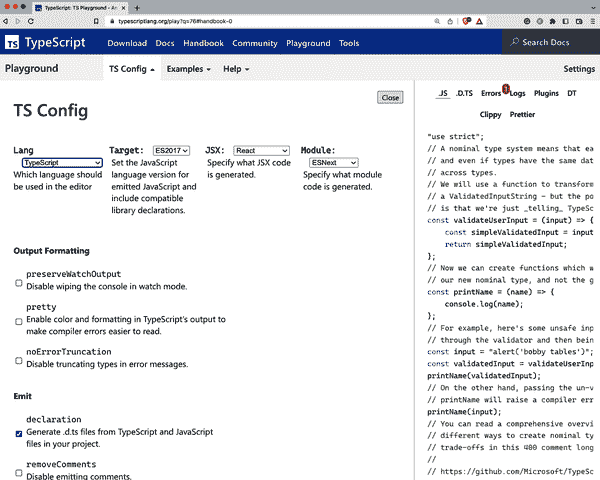

# 第十二章：类型开发策略

到目前为止，所有的配方都处理了 TypeScript 编程语言及其类型系统的特定方面。您已经学习了如何在第二章和第三章中有效地使用基本类型，通过第 4 章中的泛型使您的代码更可重用，以及在第 5 章中使用条件类型和第 6 章中的字符串模板字面量类型，以及第 7 章中的可变元组类型，来为非常微妙的情况创建高级类型。

我们在第 8 章中建立了一组辅助类型，并在第 9 章中解决了标准库的限制。我们学习了如何在第 10 章中使用 JSX 作为语言扩展，并了解了何时以及如何使用类在第 11 章中。每个配方都详细讨论了每种方法的利弊，为您提供更好的工具，以便在每种情况下做出正确的决策，创建更好的类型，更健壮的程序和稳定的开发流程。

那太多了！然而，还有一件事缺失，这是将所有事情整合在一起的最后一部分：我们如何应对新的类型挑战？我们从哪里开始？我们需要注意什么？

这些问题的答案构成了本章的内容。在这里，您将了解*低维护类型*的概念。我们将探讨一个过程，您可以从简单的类型开始，逐渐变得更加精炼和强大。您将了解到[TypeScript playground](https://www.typescriptlang.org/play)的秘密功能以及如何处理使验证更加容易的库。您将找到指南，帮助您做出艰难的决策，并了解如何处理在 TypeScript 旅程中肯定会遇到的最常见但难以解决的类型错误的解决方法。

如果本书的其余部分使您从新手成为学徒，那么接下来的教程将带领您成为专家。欢迎来到最后一章。

# 12.1 编写低维护类型

## 问题

每当模型发生变化时，您需要触及代码库中的十几种类型。这很烦人，而且很容易漏掉一些东西。

## 解决方案

从其他类型中派生类型，通过使用推断，创建低维护的类型。

## 讨论

在本书的整个过程中，我们花了大量时间从其他类型创建类型。一旦我们可以从已经存在的某物中派生出类型，这意味着我们花费更少的时间编写和适应类型信息，而是花更多的时间修复 JavaScript 中的错误和错误。

TypeScript 是建立在 JavaScript 之上的元信息层。我们的目标仍然是编写 JavaScript，但尽可能使其健壮且易于使用：工具帮助您保持高效，并且不会妨碍您。

这就是我一般写 TypeScript 的方式：我写常规的 JavaScript，而当 TypeScript 需要额外的信息时，我很乐意添加一些额外的注释。有一个条件：我不想被打扰去维护类型。我宁愿创建能够在其依赖项或周围发生变化时更新自己的类型。我称这种方法为*创建低维护类型*。

创建低维护类型是一个由三个部分组成的过程：

1.  根据您的数据模型或从现有模型中推断。

1.  定义派生（映射类型，部分类型等）。

1.  使用条件类型定义行为。

让我们来看看这个简短而不完整的`copy`函数。我想把文件从一个目录复制到另一个目录。为了让我的生活更轻松，我创建了一组默认选项，这样我就不必重复自己太多：

```
const defaultOptions = {
  from: "./src",
  to: "./dest",
};

function copy(options) {
  // Let's merge default options and options
  const allOptions = { ...defaultOptions, ...options};

  // todo: Implementation of the rest
}
```

这是你在 JavaScript 中经常看到的一种模式。你立即看到的是，TypeScript 缺少*某些*类型信息。特别是`copy`函数的`options`参数目前是`any`。所以让我们为其添加一个类型！

我可以显式地创建类型：

```
type Options = {
  from: string;
  to: string;
};

const defaultOptions: Options = {
  from: "./src",
  to: "./dest",
};

type PartialOptions = {
  from?: string;
  to?: string;
};

function copy(options: PartialOptions) {
  // Let's merge default options and options
  const allOptions = { ...defaultOptions, ...options};

  // todo: Implementation of the rest
}
```

这是一个合理的方法。您考虑类型，然后分配类型，然后获得所有您习惯的编辑器反馈和类型检查。但是如果有什么变化呢？假设我们向`Options`添加了另一个字段；我们将不得不三次调整我们的代码：

```
type Options = {
  from: string;
  to: string;
  overwrite: boolean; // added
};

const defaultOptions: Options = {
  from: "./src",
  to: "./dest",
  overwrite: true, // added
};

type PartialOptions = {
  from?: string;
  to?: string;
  overwrite?: boolean; // added
};
```

但是为什么呢？信息已经在那里！在`defaultOptions`中，我们告诉 TypeScript 确切地我们正在寻找什么。让我们优化：

1.  放弃`PartialOptions`类型，使用实用类型`Partial<T>`可以达到同样效果。你可能已经猜到这一点了。

1.  在 TypeScript 中使用`typeof`运算符即可即时创建新类型：

```
const defaultOptions = {
  from: "./src",
  to: "./dest",
  overwrite: true,
};

function copy(options: Partial<typeof defaultOptions>) {
  // Let's merge default options and options
  const allOptions = { ...defaultOptions, ...options};

  // todo: Implementation of the rest
}
```

就是这样。只需在需要告诉 TypeScript 我们正在寻找什么的地方添加注释：

+   如果我们添加新字段，我们根本不需要维护任何内容。

+   如果我们重命名一个字段，我们就会得到*仅仅*我们关心的信息：所有我们必须更改传递给函数的选项的`copy`的使用。

+   我们只有一个真正的事实来源：实际的`defaultOptions`对象。这是唯一重要的对象，因为它是我们在运行时拥有的唯一信息。

我们的代码变得更加简洁。TypeScript 变得不那么侵入性，更符合我们编写 JavaScript 的方式。

另一个例子是从一开始就伴随我们的：在第 3.1 节的配方中开始的玩具店，以及在第 4.5 节和第 5.3 节的配方中继续。重新访问所有三个项目，并考虑如何仅通过更改模型来获取所有其他类型的更新。

# 12.2 逐步细化类型

## 问题

您的 API 需要精心设计的类型，使用泛型、条件类型和字符串模板字面量类型等高级功能。您不知道从哪里开始。

## 解决方案

逐步完善您的类型。从基本的原始类型和对象类型开始，逐步添加泛型，然后深入高级类型。本课程描述的过程将帮助您制作类型。这也是回顾您学到的所有内容的好方法。

## 讨论

看看下面的例子：

```
app.get("/api/users/:userID", function (req, res) {
  if (req.method === "POST") {
    res.status(20).send({
      message: "Got you, user " + req.params.userId,
    });
  }
});
```

我们有一个 [Express 风格的服务器](https://expressjs.com)，它允许我们定义一个路由（或路径），并在请求该 URL 时执行回调。

回调函数接受两个参数：

请求对象

这里我们获取使用的 [HTTP 方法的信息](https://oreil.ly/zcoUS) — 例如 `GET`、`POST`、`PUT`、`DELETE` — 以及传入的附加参数。在这个示例中，`userID` 应该映射到包含用户标识符的参数 `userID`！

响应或回复对象

在这里，我们希望为客户端准备一份适当的服务器响应。我们希望发送正确的状态码（使用 `status` 方法）并通过网络发送 JSON 输出。

此示例中显示的内容大大简化，但很好地展示了我们要做的事情。前一个示例也充满了错误！看看：

```
app.get("/api/users/:userID", function (req, res) {
  if (req.method === "POST") { /* Error 1 */
    res.status(20).send({ /* Error 2 */
      message: "Welcome, user " + req.params.userId /* Error 3 */,
    });
  }
});
```

三行实现代码和三个错误？到底发生了什么？

1.  第一个错误有些微妙。虽然我们告诉我们的应用程序我们想监听 `GET` 请求（因此使用 `app.get`），但我们只有在请求方法是 `POST` 时才做某事。在我们应用程序的这个特定点上，`req.method` 不可能是 `POST`。因此我们永远不会发送任何响应，这可能导致意外的超时。

1.  显式发送状态码是个好习惯！`20` 并不是一个有效的状态码。客户端可能无法理解发生了什么。

1.  这是我们想要发送的响应。我们访问解析的参数，但出现了拼写错误。应该是 `userID`，而不是 `userId`。我们所有的用户都会看到“欢迎，用户未定义！”这是您一定在现实中看到过的内容！

解决这类问题是 TypeScript 的主要目的。TypeScript 希望比您更好地理解您的 JavaScript 代码。而在 TypeScript 无法理解您的意图时，您可以通过提供额外的类型信息来帮助它。问题在于开始添加类型通常很困难。您可能心中有最棘手的边缘案例，但不知道如何入手。

我希望提出一个可能帮助您入门的过程，同时也向您展示了一个停下来的好时机。您可以逐步增强类型的能力。每次细化都会有所改善，并且您可以在较长时间内提高类型安全性。让我们开始吧！

### 步骤 1：基本类型化

我们从一些基本的类型信息开始。我们有一个指向 `get` 函数的 `app` 对象。`get` 函数接受一个字符串类型的 `path` 和一个回调函数：

```
const app = {
  get /* post, put, delete, ... to come! */,
};

function get(path: string, callback: CallbackFn) {
  // to be implemented --> not important right now
}
```

`CallbackFn` 是一个返回 `void` 并接受两个参数的函数类型：

+   `req`，类型为 `ServerRequest`

+   `reply`，类型为 `ServerReply`

```
type CallbackFn = (req: ServerRequest, reply: ServerReply) => void;
```

在大多数框架中，`ServerRequest` 是一个非常复杂的对象。我们为演示目的做了一个简化版本。我们传入一个 `method` 字符串，例如 `"GET"`、`"POST"`、`"PUT"`、`"DELETE"` 等等。它还有一个 `params` 记录。记录是将一组键与一组属性关联的对象。目前，我们希望允许每个 `string` 键映射到一个 `string` 属性。稍后我们会重构这个对象：

```
type ServerRequest = {
  method: string;
  params: Record<string, string>;
};
```

对于 `ServerReply`，我们列出了一些函数，知道一个真实的 `ServerReply` 对象有更多。一个 `send` 函数带有一个可选参数 `obj`，包含我们要发送的数据。我们可以使用流畅的接口设置状态码，使用 `status` 函数：

```
type ServerReply = {
  send: (obj?: any) => void;
  status: (statusCode: number) => ServerReply;
};
```

使用一些非常基本的复合类型和路径的简单原始类型，我们已经为我们的项目增加了很多类型安全性。我们可以排除一些错误：

```
app.get("/api/users/:userID", function(req, res) {
  if(req.method === 2) {
//   ^ This condition will always return 'false' since the types
//     'string' and 'number' have no overlap.(2367)

    res.status("200").send()
//             ^
// Argument of type 'string' is not assignable to
// parameter of type 'number'.(2345)
  }
});
```

这很棒，但还有很多事情要做。我们仍然可以发送错误的状态码（任何数字都可能），并且对于可能的 HTTP 方法一无所知（任何字符串都可能）。因此，让我们细化我们的类型。

### 第二步：子集原始类型

您可以将原始类型视为特定类别的所有可能值的集合。例如，`string` 包括 JavaScript 中可以表达的所有可能字符串，`number` 包括具有双浮点精度的所有可能数值，`boolean` 包括可能的布尔值，即 `true` 和 `false`。

TypeScript 允许您将这些集合细化为更小的子集。例如，我们可以创建一个类型 `Methods`，包括我们可以接收到的所有可能的字符串作为 HTTP 方法：

```
type Methods = "GET" | "POST" | "PUT" | "DELETE";

type ServerRequest = {
  method: Methods;
  params: Record<string, string>;
};
```

`Methods` 是更大的 `string` 集合的一个较小子集。`Methods` 也是字面类型的联合类型，是给定集合的最小单元。一个字面字符串。一个字面数值。没有歧义：它只是 `"GET"`。你可以将它们与其他字面类型组合成联合类型，创建一个给定较大类型的子集。你还可以通过字面类型的组合来创建 `string` 和 `number` 的子集，或者不同的复合对象类型。有很多可能性可以结合和放置字面类型到联合中。

这对我们的服务器回调产生了直接影响。突然之间，我们可以区分这四种方法（或更多，如果需要的话），并且可以在代码中穷尽所有可能性。TypeScript 将指导我们。

这减少了一类错误。现在我们确切地知道可用的 HTTP 方法是哪些。我们可以对 HTTP 状态码做同样的事情，通过定义 `statusCode` 可以取的有效数字的子集：

```
type StatusCode =
  100 | 101 | 102 | 200 | 201 | 202 | 203 | 204 | 205 |
  206 | 207 | 208 | 226 | 300 | 301 | 302 | 303 | 304 |
  305 | 306 | 307 | 308 | 400 | 401 | 402 | 403 | 404 |
  405 | 406 | 407 | 408 | 409 | 410 | 411 | 412 | 413 |
  414 | 415 | 416 | 417 | 418 | 420 | 422 | 423 | 424 |
  425 | 426 | 428 | 429 | 431 | 444 | 449 | 450 | 451 |
  499 | 500 | 501 | 502 | 503 | 504 | 505 | 506 | 507 |
  508 | 509 | 510 | 511 | 598 | 599;

type ServerReply = {
  send: (obj?: any) => void;
  status: (statusCode: StatusCode) => ServerReply;
};
```

类型 `StatusCode` 再次是一个联合类型。有了它，我们排除了另一类错误。突然之间，像这样的代码会失败：

```
app.get("/api/user/:userID", (req, res) => {
 if(req.method === "POS") {
//   ^ This condition will always return 'false' since
//     the types 'Methods' and '"POS"' have no overlap.(2367)
    res.status(20)
//             ^
//  Argument of type '20' is not assignable to parameter of
//  type 'StatusCode'.(2345)
 }
})
```

我们的软件变得更安全了。但我们可以做得更多！

### 第三步：添加泛型

当我们使用 `app.get` 定义路由时，我们隐含地知道唯一可能的 HTTP 方法是 `"GET"`。但是通过我们的类型定义，我们仍然需要检查联合类型的所有可能部分。

`CallbackFn`的类型是正确的，因为我们可以为所有可能的 HTTP 方法定义回调函数，但是如果我们显式调用`app.get`，那么保存一些额外步骤并且符合类型是很好的：

TypeScript 泛型可以帮助。我们希望以一种可以指定`Methods`的一部分而不是整个集合的方式定义`ServerRequest`。为此，我们使用泛型语法，就像我们在函数中定义参数一样：

```
type ServerRequest<Met extends Methods> = {
  method: Met;
  params: Record<string, string>;
};
```

下面是发生的事情：

+   `ServerRequest`变成了一个泛型类型，如尖括号所示。

+   我们定义了一个名为`Met`的泛型参数，它是`Methods`类型的子集。

+   我们使用这个泛型参数作为定义方法的泛型变量。

通过这种改变，我们可以指定不同的`ServerRequest`变体而不重复定义：

```
type OnlyGET = ServerRequest<"GET">;
type OnlyPOST = ServerRequest<"POST">;
type POSTorPUT = ServerRquest<"POST" | "PUT">;
```

由于我们改变了`ServerRequest`的接口，我们必须改变所有使用`ServerRequest`的其他类型，如`CallbackFn`和`get`函数：

```
type CallbackFn<Met extends Methods> = (
  req: ServerRequest<Met>,
  reply: ServerReply
) => void;

function get(path: string, callback: CallbackFn<"GET">) {
  // to be implemented
}
```

通过`get`函数，我们向我们的泛型类型传递了一个实际的参数。我们知道这不仅仅是`Methods`的一个子集；我们确切知道我们正在处理的是哪个子集。

现在，当我们使用`app.get`时，`req.method`只有一种可能的值：

```
app.get("/api/users/:userID", function (req, res) {
  req.method; // can only be GET
});
```

这确保了我们在创建`app.get`回调时不会假设像`"POST"`或类似的 HTTP 方法是可用的。此时我们确切知道我们正在处理的内容，所以让我们在类型中反映这一点。

我们已经做了很多工作，以确保`request.method`合理地类型化并表示实际情况。通过对`Methods`联合类型进行子集处理的一个好处是，我们可以创建一个在`app.get`之外的通用回调函数，它是类型安全的：

```
const handler: CallbackFn<"PUT" | "POST"> = function(res, req) {
  res.method // can be "POST" or "PUT"
};

const handlerForAllMethods: CallbackFn<Methods> = function(res, req) {
  res.method // can be all methods
};

app.get("/api", handler);
//              ^
// Argument of type 'CallbackFn<"POST" | "PUT">' is not
// assignable to parameter of type 'CallbackFn<"GET">'.

app.get("/api", handlerForAllMethods); // This works
```

### 步骤 4：高级类型进行类型检查

我们尚未涉及的是对`params`对象进行类型化。到目前为止，我们得到了一个允许访问每个`string`键的记录。现在我们的任务是使其更加具体！

我们通过添加另一个泛型变量来实现，一个用于方法，一个用于我们`Record`中可能的键：

```
type ServerRequest<Met extends Methods, Par extends string = string> = {
  method: Met;
  params: Record<Par, string>;
};
```

通用类型变量`Par`可以是`string`类型的子集，默认值是每个字符串。通过这样做，我们可以告诉`ServerRequest`我们期望的键：

```
// request.method = "GET"
// request.params = {
//   userID: string
// }
type WithUserID = ServerRequest<"GET", "userID">;
```

让我们向我们的`get`函数和`CallbackFn`类型中添加新参数，以便设置请求的参数：

```
function get<Par extends string = string>(
  path: string,
  callback: CallbackFn<"GET", Par>
) {
  // to be implemented
}

const app = {
  get /* post, put, delete, ... to come! */,
};

type CallbackFn<Met extends Methods, Par extends string> = (
  req: ServerRequest<Met, Par>,
  reply: ServerReply
) => void;
```

如果我们没有显式设置`Par`，类型会像我们习惯的那样工作，因为`Par`默认为`string`。但是，如果我们设置了，我们就突然有了对`req.params`对象的正确定义：

```
app.get<"userID">("/api/users/:userID", function (req, res) {
  req.params.userID; // Works!!
  req.params.anythingElse; // doesn't work!!
});
```

这太棒了！不过有一件小事可以改进。尽管如此，我们仍然可以将*任何*字符串传递给`app.get`的`path`参数。如果我们也能在那里反映`Par`，岂不是更好？我们可以！这就是*字符串模板文字类型*（见第六章）发挥作用的地方。

让我们创建一个名为`IncludesRouteParams`的类型，以确保在参数名称前面添加冒号的 Express 风格中正确包含`Par`：

```
type IncludesRouteParams<Par extends string> =
  | `${string}/:${Par}`
  | `${string}/:${Par}/${string}`;
```

泛型类型 `IncludesRouteParams` 接受一个 `string` 的子集作为参数。它创建了两个模板字面量的联合类型：

+   第一个模板字面量以 *任意* `string` 开头，然后包含 `/` 字符，后跟 `:` 字符，再后面是参数名。这确保我们捕捉到参数在路由字符串末尾的所有情况。

+   第二个模板字面量以 *任意* `string` 开头，然后是 `/`、`:` 和参数名相同的模式。然后我们有另一个 `/` 字符，后面是 *任意* 字符串。联合类型的这一分支确保我们捕捉到参数在路由中的所有情况。

这就是带有参数名 `userID` 的 `IncludesRouteParams` 的行为在不同测试用例中的表现：

```
const a: IncludesRouteParams<"userID"> = "/api/user/:userID"; // works
const b: IncludesRouteParams<"userID"> = "/api/user/:userID/orders"; // works
const c: IncludesRouteParams<"userID"> = "/api/user/:userId"; // breaks
const d: IncludesRouteParams<"userID"> = "/api/user"; // breaks
const e: IncludesRouteParams<"userID"> = "/api/user/:userIDAndmore"; // breaks
```

让我们在 `get` 函数声明中包含我们的新实用类型：

```
function get<Par extends string = string>(
  path: IncludesRouteParams<Par>,
  callback: CallbackFn<"GET", Par>
) {
  // to be implemented
}

app.get<"userID">(
  "/api/users/:userID",
  function (req, res) {
    req.params.userID; // Yes!
  }
);
```

太棒了！我们获得了另一个安全机制，确保我们不会忽略向实际路由添加参数。这非常强大。

### 步骤 5：锁定文字类型

但猜猜：我仍然对此不满意。在你的路由变得稍微复杂时，这种方法的几个问题就显而易见了：

+   第一个问题是，我们需要在泛型类型参数中明确声明我们的参数。即使我们在函数的 `path` 参数中也会指定它，我们仍然必须将 `Par` 绑定到 `"userID"`。这不符合 JavaScript 的风格！

+   这种方法只处理一个路由参数。一旦我们添加一个联合类型，例如 `"userID" | "orderId"`，只要有一个参数可用，故障安全检查就会满足。这就是集合的工作原理。可以是其中一个或另一个。

必须有更好的方法。确实有。否则，这个方案会以非常糟糕的方式结束。

让我们颠倒顺序！不再在泛型类型变量中定义路由参数，而是从作为 `app.get` 第一个参数传递的 `path` 中提取变量：

```
function get<Path extends string = string>(
  path: Path,
  callback: CallbackFn<"GET", ParseRouteParams<Path>>
) {
  // to be implemented
}
```

我们移除 `Par` 泛型类型并添加 `Path`，它可以是任意 `string` 的子集。当我们将 `path` 设置为这个泛型类型 `Path` 时，一旦将参数传递给 `get`，我们就捕捉到它的字符串文字类型。我们将 `Path` 传递给一个我们尚未创建的新泛型类型 `ParseRouteParams`。

让我们来处理 `ParseRouteParams`。在这里，我们再次调整事件的顺序。不再将请求的路由参数传递给通用程序来确保路径正确，而是传递路由路径并提取可能的路由参数。为此，我们需要创建一个条件类型。

### 步骤 6：添加条件类型

条件类型在语法上类似于 JavaScript 中的三元运算符。您检查一个条件，如果条件满足，则返回分支 A；否则，返回分支 B。例如：

```
type ParseRouteParams<Route> =
  Route extends `${string}/:${infer P}`
  ? P
  : never;
```

在这里，我们检查 `Route` 是否是以 Express 风格结尾的每个路径的子集（具有前置 `"/:""`）。如果是这样，我们推断这个字符串，这意味着我们将其内容捕获到一个新变量中。如果条件满足，我们返回新提取的字符串；否则，我们返回 `never`，如：“没有路由参数。”

如果我们尝试一下，我们得到了这样的结果：

```
type Params = ParseRouteParams<"/api/user/:userID">; // Params is "userID"

type NoParams = ParseRouteParams<"/api/user">; // NoParams is never: no params!
```

这比我们之前做得要好得多了。现在，我们想要捕获所有其他可能的参数。为此，我们必须添加另一个条件：

```
type ParseRouteParams<Route> = Route extends `${string}/:${infer P}/${infer R}`
  ? P | ParseRouteParams<`/${R}`>
  : Route extends `${string}/:${infer P}`
  ? P
  : never;
```

我们的条件类型现在的工作方式如下：

1.  在第一个条件中，我们检查路由中间是否有路由参数。如果是这样，我们提取路由参数和其后的所有内容。我们将新发现的路由参数 `P` 返回为一个联合，其中我们用剩余的 `R` 递归调用相同的泛型类型。例如，如果我们将路由 `"/api/users/:userID/orders/:orderID"` 传递给 `ParseRouteParams`，我们将 `"userID"` 推断为 `P`，将 `"orders/:orderID"` 推断为 `R`。我们使用 `R` 调用相同的类型。

1.  这就是第二个条件发挥作用的地方。在这里，我们检查是否有类型在末尾。对于 `"orders/:orderID"`，就是这种情况。我们提取 `"orderID"` 并返回这个文字类型。

1.  如果没有更多的路由参数，我们返回 `never`：

```
// Params is "userID"
type Params = ParseRouteParams<"/api/user/:userID">;

// MoreParams is "userID" | "orderID"
type MoreParams = ParseRouteParams<"/api/user/:userID/orders/:orderId">;
```

让我们应用这种新类型，看看我们对 `app.get` 的最终使用是什么样的：

```
app.get("/api/users/:userID/orders/:orderID", function (req, res) {
  req.params.userID; // Works
  req.params.orderID; // Also available
});
```

就是这样！让我们回顾一下。我们刚刚为一个函数 `app.get` 创建的类型确保了排除了大量可能的错误：

+   我们只能将适当的数值状态码传递给 `res.status()`。

+   `req.method` 是四个可能字符串之一，当我们使用 `app.get` 时，我们知道它只能是 `"GET"`。

+   我们可以解析路由参数并确保在回调参数中没有任何拼写错误。

如果我们看一下这个食谱开头的示例，我们得到了以下错误消息：

```
app.get("/api/users/:userID", function(req, res) {
  if (req.method === "POST") {
//   ^ This condition will always return 'false' since
//     the types 'Methods' and '"POST"' have no overlap.(2367)
    res.status(20).send({
//             ^
//  Argument of type '20' is not assignable to parameter of
//  type 'StatusCode'.(2345)
      message: "Welcome, user " + req.params.userId
//                                           ^
//    Property 'userId' does not exist on type
//    '{ userID: string; }'. Did you mean 'userID'?
    });
  }
});
```

所有这些都发生在我们实际运行代码之前！Express 风格的服务器是 JavaScript 动态性的完美例子。根据您调用的方法和传递的第一个参数字符串，回调内的行为发生了很多变化。再举一个例子，你的所有类型看起来都完全不同。

这种方法的伟大之处在于每一步都增加了更多的类型安全性：

1.  您可以轻松停止在基本类型上，并且比根本没有类型要好。

1.  子集帮助您通过减少有效值的数量来消除拼写错误。

1.  泛型帮助您定制行为以使用案例。

1.  像字符串模板文本类型这样的高级类型在字符串类型的世界中为您的应用程序增添了更多的含义。

1.  在泛型中锁定允许您在 JavaScript 中处理文字并将其视为类型。

1.  条件类型使得您的类型像您的 JavaScript 代码一样灵活。

最好的事情？一旦添加了类型，人们将只需编写普通的 JavaScript 代码，仍然可以获得所有的类型信息。这对每个人都是一种胜利。

# 12.3 使用 `satisfies` 检查合约

## 问题

您想使用字面类型，但需要一个注释类型检查以确保您履行合同。

## 解决方案

使用`satisfies`运算符执行类似注释的类型检查，同时保留字面类型。

## 讨论

映射类型非常棒，因为它们允许 JavaScript 中已知的对象结构的灵活性。但它们对类型系统有一些关键影响。来看一个来自通用消息库的示例，该库接受“通道定义”，在其中可以定义多个通道令牌：

```
type Messages =
  | "CHANNEL_OPEN"
  | "CHANNEL_CLOSE"
  | "CHANNEL_FAIL"
  | "MESSAGE_CHANNEL_OPEN"
  | "MESSAGE_CHANNEL_CLOSE"
  | "MESSAGE_CHANNEL_FAIL";

type ChannelDefinition = {
  [key: string]: {
    open: Messages;
    close: Messages;
    fail: Messages;
  };
};
```

此通道定义对象的键是用户希望它们是什么。因此这是一个有效的通道定义：

```
const impl: ChannelDefinition = {
  test: {
    open: 'CHANNEL_OPEN',
    close: 'CHANNEL_CLOSE',
    fail: 'CHANNEL_FAIL'
  },
  message: {
    open: 'MESSAGE_CHANNEL_OPEN',
    close: 'MESSAGE_CHANNEL_CLOSE',
    fail: 'MESSAGE_CHANNEL_FAIL'
  }
}
```

然而，我们有一个问题：当我们想要访问我们灵活定义的键时。假设我们有一个打开通道的函数。我们传递整个通道定义对象，以及我们想要打开的通道：

```
function openChannel(
  def: ChannelDefinition,
  channel: keyof ChannelDefinition
) {
  // to be implemented
}
```

那么`ChannelDefinition`的键是什么呢？嗯，它是每个键：`[key: string]`。因此，一旦我们指定了具体类型，TypeScript 会将`impl`视为这个特定类型，而忽略实际的实现。合同得到满足。继续。这允许传递错误的键：

```
// Passes, even though "massage" is not part of impl
openChannel(impl, "massage");
```

因此，我们更感兴趣的是实际的实现，而不是我们为常量分配的类型。这意味着我们必须摆脱`ChannelDefinition`类型，并确保我们关心对象的实际类型。

首先，`openChannel`函数应该接受任何作为`Ch⁠ann⁠el​De⁠fi⁠ni⁠tion`子类型的对象，但是与具体的子类型一起工作：

```
function openChannel<
  T extends ChannelDefinition
>(def: T, channel: keyof T) {
  // to be implemented
}
```

TypeScript 现在在两个层面上工作：

+   它检查`T`是否实际上扩展了`ChannelDefinition`。如果是这样，我们就使用类型`T`。

+   所有我们的函数参数都用通用的`T`类型。这也意味着我们通过`keyof T`获取`T`的*真实*键。

要从中受益，我们必须摆脱`impl`的类型定义。显式类型定义会覆盖所有实际类型。从我们明确指定类型的那一刻起，TypeScript 将其视为`ChannelDefinition`，而不是实际的底层子类型。我们还必须设置*const context*，这样我们可以将所有字符串转换为它们的单位类型（从而与`Messages`兼容）：

```
const impl = {
  test: {
    open: "CHANNEL_OPEN",
    close: "CHANNEL_CLOSE",
    fail: "CHANNEL_FAIL",
  },
  message: {
    open: "MESSAGE_CHANNEL_OPEN",
    close: "MESSAGE_CHANNEL_CLOSE",
    fail: "MESSAGE_CHANNEL_FAIL",
  },
} as const;
```

没有*const context*，`impl`的推断类型是：

```
/// typeof impl
{
  test: {
    open: string;
    close: string;
    fail: string;
  };
  message: {
    open: string;
    close: string;
    fail: string;
  };
}
```

有了*const context*，`impl`的实际类型现在是：

```
/// typeof impl
{
  test: {
    readonly open: "CHANNEL_OPEN";
    readonly close: "CHANNEL_CLOSE";
    readonly fail: "CHANNEL_FAIL";
  };
  message: {
    readonly open: "MESSAGE_CHANNEL_OPEN";
    readonly close: "MESSAGE_CHANNEL_CLOSE";
    readonly fail: "MESSAGE_CHANNEL_FAIL";
  };
}
```

*Const context*允许我们满足`ChannelDefinition`所做的合同。现在`openChannel`可以正常工作：

```
openChannel(impl, "message"); // satisfies contract
openChannel(impl, "massage");
//                 ^
// Argument of type '"massage"' is not assignable to parameter
// of type '"test" | "message"'.(2345)
```

这个方法有效，但有一个注意事项。我们唯一可以检查`impl`是否实际上是`ChannelDefinition`的有效子类型的点是在我们使用它的时候。有时候我们想要提前注释以找出合同可能出现的问题。我们想要看看这个具体实现*是否满足*合同。

幸运的是，有一个关键字可以做到这一点。我们可以定义对象并进行类型检查，以查看这个实现是否满足类型，但是 TypeScript 会将其视为字面类型：

```
const impl = {
  test: {
    open: "CHANNEL_OPEN",
    close: "CHANNEL_CLOSE",
    fail: "CHANNEL_FAIL",
  },
  message: {
    open: "MESSAGE_CHANNEL_OPEN",
    close: "MESSAGE_CHANNEL_CLOSE",
    fail: "MESSAGE_CHANNEL_FAIL",
  },
} satisfies ChannelDefinition;

function openChannel<T extends ChannelDefinition>(
  def: T,
  channel: keyof T
) {
  // to be implemented
}
```

有了这个，我们可以确保我们履行了合同，但是与*const 上下文*一样具有相同的好处。唯一的区别是字段不被设置为`readonly`，但由于 TypeScript 获取了所有内容的文字类型，因此在满足类型检查后无法将字段设置为其他任何值：

```
impl.test.close = "CHANEL_CLOSE_MASSAGE";
//                 ^
// Type '"CHANEL_CLOSE_MASSAGE"' is not assignable
// to type '"CHANNEL_CLOSE"'.(2322)
```

有了这个，我们同时得到了两全其美的好处：在注解时进行正确的类型检查，以及在特定情况下使用狭窄类型的能力。

# 12.4 测试复杂类型

## 问题

你写了非常复杂和精细的类型，你想确保它们的行为是正确的。

## 解决方案

一些常见的辅助类型的工作方式就像一个测试框架。测试你的类型！

## 讨论

在动态类型的编程语言中，人们总是围绕着是否需要类型当你可以有一个合适的测试套件进行讨论。至少一个阵营会这么说；另一些人则认为，为什么我们要进行那么多测试，当我们可以有类型呢？答案可能处于中间某个地方。

类型确实可以解决很多测试案例。结果是一个数字吗？结果是一个具有某些特定类型属性的对象吗？这是我们可以通过类型轻松检查的事情。我的函数产生了正确的结果吗？值是否符合我的预期？这属于测试。

在本书中，我们学到了关于非常复杂的类型的很多知识。通过条件类型，我们打开了 TypeScript 的元编程能力，我们可以根据先前类型的某些特征制作新类型。强大、图灵完备且非常先进。这引出了一个问题：我们如何确保这些复杂类型确实做到了它们应该做的？也许我们应该*测试我们的类型*？

实际上我们可以。社区内有一些已知的辅助类型可以充当某种测试框架。以下类型来自于优秀的[Type Challenges 存储库](https://tsch.js.org)，它允许你极限测试你的 TypeScript 类型系统技能。它们包括非常具有挑战性的任务：一些与现实用例相关，另一些则只是为了好玩。

他们的测试库从一些期望真值或假值的类型开始。它们非常直接了当。通过使用泛型和文字类型，我们可以检查这个布尔值是 true 还是 false：

```
export type Expect<T extends true> = T;
export type ExpectTrue<T extends true> = T;
export type ExpectFalse<T extends false> = T;
export type IsTrue<T extends true> = T;
export type IsFalse<T extends false> = T;
```

它们单独使用时并没有多大作用，但是当与`Equal<X, Y>`和`NotEqual<X, Y>`一起使用时就非常棒，它们会返回`true`或者`false`：

```
export type Equal<X, Y> =
  (<T>() => T extends X ? 1 : 2) extends
  (<T>() => T extends Y ? 1 : 2) ? true : false;
export type NotEqual<X, Y> = true extends Equal<X, Y> ? false : true;
```

`Equal<X, Y>`很有趣，因为它创建了通用函数并将它们与应该进行比较的两种类型进行检查。由于每个条件类型都没有解决方案，TypeScript 比较了两个条件类型并可以看到它们是否兼容。这是 TypeScript 条件类型逻辑中的一步，由[Stack Overflow 上的 Alex Chashin 精彩解释](https://oreil.ly/ywWd4)。

接下来的一批允许我们检查类型是否为`any`：

```
export type IsAny<T> = 0 extends 1 & T ? true : false;
export type NotAny<T> = true extends IsAny<T> ? false : true;
```

这是一种简单的条件类型，将`0`与`1 & T`进行比较，应该始终缩小为`1`或`never`，这总是会得出条件类型的`false`分支，除非我们与`any`相交。与`any`相交总是`any`，而`0`是`any`的子集。

下一批是对我们在食谱 8.3 中看到的`Remap`和`DeepRemap`的重新解释，以及`Alike`作为一种比较结构相同但构造不同的类型的方法：

```
export type Debug<T> = { [K in keyof T]: T[K] };
export type MergeInsertions<T> = T extends object
  ? { [K in keyof T]: MergeInsertions<T[K]> }
  : T;

export type Alike<X, Y> = Equal<MergeInsertions<X>, MergeInsertions<Y>>;
```

在之前的`Equal`检查理论上应该能够理解`{ x : number, y: string }`等同于`{ x: number } & { y: string }`，但 TypeScript 类型检查器的实现细节并不认为它们相等。这就是`Alike`发挥作用的地方。

类型挑战测试文件的最后一批做了两件事：

+   它使用   它使用简单的条件类型进行子集检查。

+   它检查你构建的元组是否可以被视为函数的有效参数：

```
export type ExpectExtends<VALUE, EXPECTED> = EXPECTED extends VALUE
  ? true
  : false;
export type ExpectValidArgs<
  FUNC extends (...args: any[]) => any,
  ARGS extends any[]
> = ARGS extends Parameters<FUNC> ? true : false;
```

当你的类型变得更复杂时，拥有这样的一个小型辅助类型库用于类型测试和调试是非常有帮助的。将它们添加到你的全局类型定义文件中（参见食谱 9.7）并使用它们。

# 12.5 使用 Zod 在运行时验证数据类型

## 问题

你依赖于外部数据源，并不能信任它们是正确的。

## 解决方案

使用一个名为*Zod*的库定义模式，并使用它来验证外部数据。

## 讨论

恭喜你！我们几乎到达了终点。如果你从头到尾跟随，你一直被提醒 TypeScript 的类型系统遵循几个目标。首先也是最重要的是，它希望为你提供优秀的工具，使你在开发应用程序时能够提高生产力。它还希望能够支持所有 JavaScript 框架，并确保它们既有趣又易于使用。它将自己视为 JavaScript 的一个附加组件，作为静态类型的语法。还有一些非目标或权衡。它更倾向于生产力而非正确性，允许开发者根据需要弯曲规则，并且没有声称是可证明正确的。

在食谱 3.9 中，我们学到通过*类型断言*可以影响 TypeScript 的类型定义，认为类型应该是不同的；在食谱 9.2 中，我们学习了如何使*不安全操作*更加稳健且易于发现。由于 TypeScript 的类型系统仅在编译时有效，一旦在我们选择的运行时环境中运行 JavaScript，所有的安全措施都会消失。

通常，编译时类型检查就足够了。只要我们在编写自己类型的*内部世界*内，让 TypeScript 检查一切是否正常，我们的代码就可以正常运行。然而，在 JavaScript 应用程序中，我们还需要处理许多超出我们控制范围的事物：例如用户输入。我们需要访问和处理的第三方 API。无可避免地，我们在开发过程中会达到一个需要离开严格类型化应用程序边界并处理我们无法信任的数据的时刻。

在开发过程中，与外部来源或用户输入合作可能效果不错，但在生产环境中确保我们使用的数据保持一致需要额外的努力。您可能希望验证您的数据是否符合某种方案。

幸运的是，有一些库可以处理这种任务。近年来获得广泛认可的一个库是[Zod](https://zod.dev)。Zod 是以 TypeScript 为先导的，这意味着它不仅确保您消费的数据有效且符合您的期望，还能为您的整个程序提供可用的 TypeScript 类型。Zod 视自己为您无法控制的外部世界与一切严格类型化和类型检查的内部世界之间的卫士。

想象一下，一个 API 给了您这本书中看到的 `Person` 类型的数据。一个 `Person` 有一个名字和年龄，一个可选的职业，还有一个状态：在我们的系统中，他们可以是活跃的、不活跃的或仅注册等待确认的。

API 还在 `Result` 类型中的数组中打包了几个 `Person` 对象。简而言之，这是 HTTP 调用的经典响应类型的示例：

```
type Person = {
  name: string;
  age: number;
  profession?: string | undefined;
  status: "active" | "inactive" | "registered";
};

type Results = {
  entries: Person[]
};
```

您知道如何为这样的模型编写类型。到目前为止，您可以流利地识别和应用语法和模式。我们希望在运行时使用 Zod 处理我们无法控制的数据外，我们希望有相同的类型。并且在 JavaScript 中编写相同类型（值命名空间）看起来非常熟悉：

```
import { z } from "zod";

const Person = z.object({
  name: z.string(),
  age: z.number().min(0).max(150),
  profession: z.string().optional(),
  status: z.union([
    z.literal("active"),
    z.literal("inactive"),
    z.literal("registered"),
  ]),
});

const Results = z.object({
  entries: z.array(Person),
});
```

如您所见，我们使用 JavaScript，并向*值*命名空间添加名称，而不是*类型*命名空间（参见 Recipe 2.9）。但是，Zod 流畅接口提供的工具对于我们 TypeScript 开发人员非常熟悉。我们可以定义对象、字符串、数字和数组。我们还可以定义联合类型和文字类型。所有定义模型的构建块都在这里，我们还可以嵌套类型，如我们首先定义 `Person` 并在 `Results` 中重用它所示。

流畅的接口还允许我们使某些属性可选。这些都是我们从 TypeScript 中了解的东西。此外，我们还可以设置验证规则。我们可以说年龄应该大于或等于 0 并且小于 100。这些在类型系统内部我们无法合理做到的事情。

那些对象并不是我们可以像使用 TypeScript 类型那样使用的类型。它们是*模式*，等待可以解析和验证的数据。由于 Zod 是以 TypeScript 为先导，我们有辅助类型，允许我们从值空间过渡到类型空间。通过 `z.infer`（一个类型，不是函数），我们可以提取我们通过 Zod 的模式函数定义的类型：

```
type PersonType = z.infer<typeof Person>;
type ResultType = z.infer<typeof Results>;
```

那么，我们如何应用 Zod 的验证技术呢？让我们谈谈一个名为 `fetchData` 的函数，该函数调用获取 `ResultType` 类型的条目的 API。我们不知道我们收到的值是否实际符合我们定义的类型。因此，在将数据作为 `json` 获取后，我们使用 `Results` 模式来解析我们收到的数据。如果此过程成功，我们将得到 `ResultType` 类型的数据：

```
type ResultType = z.infer<typeof Results>;

async function fetchData(): Promise<ResultType> {
  const data = await fetch("/api/persons").then((res) => res.json());
  return Results.parse(data);
}
```

请注意，我们在如何定义函数接口时已经有了我们的第一个保护措施。`Promise<ResultType>` 基于我们从 `z.infer` 获取的内容。

`Results.parse(data)` 是推断类型但没有名称。结构类型系统确保我们返回正确的东西。可能会有错误，我们可以使用相应的 `Promise.catch` 方法或 `try`-`catch` 块来捕获它们。

使用 `try`-`catch`：

```
fetchData()
  .then((res) => {
    // do something with results
  })
  .catch((e) => {
    // a potential zod error!
  });

// or

try {
  const res = await fetchData();
  // do something with results
} catch (e) {
  // a potential zod error!
}
```

只有在我们拥有正确的数据时，我们才能确保继续进行，我们并没有被迫进行错误检查。如果我们想确保在继续我们的程序之前先查看解析结果，`safeParse` 是最好的选择：

```
async function fetchData(): Promise<ResultType> {
  const data = await fetch("/api/persons").then((res) => res.json());
  const results = Results.safeParse(data);
  if (results.success) {
    return results.data;
  } else {
    // Depending on your application, you might want to have a
    // more sophisticated way of error handling than returning
    // an empty result.
    return { entries: [] };
  }
}
```

如果您需要依赖外部数据，这已经使得 Zod 成为一个有价值的资产。此外，它允许您适应 API 的变化。假设您的程序仅能处理 `Person` 的活动和非活动状态，而不知道如何处理 `registered`。您可以轻松应用一个转换，根据您接收到的数据，将 `"registered"` 状态修改为实际的 `"active"`：

```
const Person = z.object({
  name: z.string(),
  age: z.number().min(0).max(150),
  profession: z.string().optional(),
  status: z
    .union([
      z.literal("active"),
      z.literal("inactive"),
      z.literal("registered"),
    ])
    .transform((val) => {
      if (val === "registered") {
        return "active";
      }
      return val;
    }),
});
```

然后，您将使用两种不同的类型：*输入* 类型代表 API 给您的内容，*输出* 类型是解析后的数据。幸运的是，我们可以从相应的 Zod 辅助类型 `z.input` 和 `z.output` 获取这两种类型：

```
type PersonTypeIn = z.input<typeof Person>;
/*
type PersonTypeIn = {
 name: string;
 age: number;
 profession?: string | undefined;
 status: "active" | "inactive" | "registered";
};
*/

type PersonTypeOut = z.output<typeof Person>;
/*
type PersonTypeOut = {
 name: string;
 age: number;
 profession?: string | undefined;
 status: "active" | "inactive";
};
*/
```

Zod 的类型推断足够聪明，可以理解您从 `status` 中移除了三个文字之一。因此没有任何意外，您实际上处理了您预期的数据。

Zod 的 API 非常优雅、易于使用，并且与 TypeScript 的特性紧密对齐。对于您无法控制的边界数据，需要依赖第三方提供预期数据形状的情况，Zod 是一个救命稻草，而您几乎不需要做太多工作。然而，这是有代价的：运行时验证需要时间。数据集越大，验证时间越长。此外，它的大小为 12KB。请确保您需要在边界数据上进行此类验证。

如果你请求的数据来自公司内的其他团队，也许就坐在你旁边的人，没有任何库，甚至是 Zod，能比互相交流和朝着相同目标合作更胜一筹。类型是引导协作的一种方式，而不是摆脱它的手段。

# 12.6 解决索引访问限制

## 问题

当使用索引访问对象属性时，TypeScript 抱怨要分配的类型不能赋给`never`。

## 解决方案

TypeScript 寻找可能值的最低公共分母。使用泛型类型锁定特定键，以便 TypeScript 不会假定该规则适用于所有情况。

## 讨论

有时，在编写 TypeScript 时，你通常在 JavaScript 中执行的操作会有所不同，引起一些奇怪和令人费解的情况。有时你只想通过索引访问操作将值分配给对象属性，并获得像“类型`'string | number'`不可分配给类型`'never'`。类型`'string'`不可分配给类型`'never'`。(2322).”这样的错误。

这并不是什么特别的事情；这只是“意外的交集类型”让你更多地思考类型系统。

让我们看一个例子。我们创建一个函数，允许我们通过提供一个键从一个对象`anotherPerson`更新到对象`person`。`person`和`an⁠oth⁠er​Pe⁠rs⁠on`都是类型为`Person`的相同类型，但是 TypeScript 报错了：

```
let person = {
  name: "Stefan",
  age: 39,
};

type Person = typeof person;

let anotherPerson: Person = {
  name: "Not Stefan",
  age: 20,
};

function update(key: keyof Person) {
  person[key] = anotherPerson[key];
//^ Type 'string | number' is not assignable to type 'never'.
//  Type 'string' is not assignable to type 'never'.(2322)
}

update("age");
```

通过索引访问操作符进行属性赋值对 TypeScript 来说是困难的。即使你通过`keyof Person`缩小了所有可能访问键的范围，也可以赋予的可能值是`string`或`number`（分别用于名称和年龄）。如果在语句的右侧进行索引访问（读取）是没问题的，但如果在语句的左侧进行索引访问（写入），情况就会有些有趣。

TypeScript 不能保证你传递的值实际上是正确的。看看这个函数签名：

```
function updateAmbiguous(key: keyof Person, value: Person[keyof Person]) {
  //...
}

updateAmbiguous("age", "Stefan");
```

除了 TypeScript 会报错外，没有什么能阻止我在每个键上添加错误类型的值。但为什么 TypeScript 告诉我们类型是`never`呢？

为了允许*某些*赋值，TypeScript 做出了妥协。与其完全不允许右侧的*任何*赋值，TypeScript 寻找可能值的最低公共分母，例如：

```
type Switch = {
  address: number,
  on: 0 | 1
};

declare const switcher: Switch;
declare const key: keyof Switch;
```

在这里，两个键都是`number`的子集。`address`是所有数字的集合；而`on`则是`0`或`1`。完全可以将`0`或`1`设置给这两个字段！这也是你在使用 TypeScript 时会得到的结果：

```
switcher[key] = 1; // This works
switcher[key] = 2; // Error
// ^ Type '2' is not assignable to type '0 | 1'.(2322)
```

TypeScript 通过对所有属性类型进行*交集类型*来获取可能的可赋值值。对于`Switch`，它是`number & (0 | 1)`，简化为`0 | 1`。对于所有`Person`属性，它是`string & number`，它们没有重叠；因此是`never`。哈！问题就在这里！

绕过这种严格性（这是为了你好的）的一种方法是使用泛型。我们不允许所有 `keyof Person` 值访问，而是将 `keyof Person` 的特定子集*绑定*到一个泛型变量：

```
function update<K extends keyof Person>(key: K) {
  person[key] = anotherPerson[key]; // works
}

update("age");
```

当我 `update("age")` 时，`K` 绑定到字面类型 `"age"`。没有任何歧义！

有一个理论上的漏洞，因为我们可以使用一个更广泛的泛型值来实例化 `update`：

```
update<"age" | "name">("age");
```

这是 TypeScript 团队目前允许的。另请参阅 [这条评论](https://oreil.ly/0Fetp) 由 Anders Hejlsberg。请注意，他要求看到此类情景的用例，这完美地说明了 TypeScript 团队的工作方式。在右手边的索引访问上的原始分配具有很高的错误潜力，因此他们为您提供了足够的保障，直到您非常明确地表达您想要做的事情。这排除了整个类别的错误，而不会给您带来太多阻碍。

# 12.7 决定是使用函数重载还是条件类型

## 问题

使用条件类型，您比以前有更多可能定义函数签名的方式。您是否仍然需要函数重载或者它们已经过时了呢？

## 解决方案

函数重载提供了比条件更好的可读性，并且更容易定义您的类型的期望。在情况需要时使用它们。

## 讨论

使用诸如条件类型或变长元组类型之类的类型系统功能，描述函数接口的技术已经淡出背景：函数重载。而且理由充分。这两个特性都已实施以解决常规函数重载的缺陷。

直接查看 TypeScript 4.0 发布说明中的此连接示例。这是一个数组 `concat` 函数：

```
function concat(arr1, arr2) {
  return [...arr1, ...arr2];
}
```

要正确地对这样一个函数进行类型化，以便考虑到所有可能的边缘情况，我们将陷入一片重载的海洋中：

```
// 7 overloads for an empty second array
function concat(arr1: [], arr2: []): [];
function concat<A>(arr1: [A], arr2: []): [A];
function concat<A, B>(arr1: [A, B], arr2: []): [A, B];
function concat<A, B, C>(arr1: [A, B, C], arr2: []): [A, B, C];
function concat<A, B, C, D>(arr1: [A, B, C, D], arr2: []): [A, B, C, D];
function concat<A, B, C, D, E>(
  arr1: [A, B, C, D, E],
  arr2: []
): [A, B, C, D, E];
function concat<A, B, C, D, E, F>(
  arr1: [A, B, C, D, E, F],
  arr2: []
): [A, B, C, D, E, F];
// 7 more for arr2 having one element
function concat<A2>(arr1: [], arr2: [A2]): [A2];
function concat<A1, A2>(arr1: [A1], arr2: [A2]): [A1, A2];
function concat<A1, B1, A2>(arr1: [A1, B1], arr2: [A2]): [A1, B1, A2];
function concat<A1, B1, C1, A2>(
  arr1: [A1, B1, C1],
  arr2: [A2]
): [A1, B1, C1, A2];
function concat<A1, B1, C1, D1, A2>(
  arr1: [A1, B1, C1, D1],
  arr2: [A2]
): [A1, B1, C1, D1, A2];
function concat<A1, B1, C1, D1, E1, A2>(
  arr1: [A1, B1, C1, D1, E1],
  arr2: [A2]
): [A1, B1, C1, D1, E1, A2];
function concat<A1, B1, C1, D1, E1, F1, A2>(
  arr1: [A1, B1, C1, D1, E1, F1],
  arr2: [A2]
): [A1, B1, C1, D1, E1, F1, A2];
// and so on, and so forth
```

这仅考虑了最多有六个元素的数组。变长元组类型在这些情况下非常有帮助：

```
type Arr = readonly any[];

function concat<T extends Arr, U extends Arr>(arr1: T, arr2: U): [...T, ...U] {
  return [...arr1, ...arr2];
}
```

新的函数签名需要更少的解析工作，并且非常清楚它期望获取哪些类型作为参数，并返回什么。返回值也映射到返回类型。没有额外的断言：TypeScript 可以确保您返回正确的值。

条件类型也有类似的情况。这个例子与 Recipe 5.1 非常相似。考虑基于客户、文章或订单 ID 检索订单的软件。您可能想创建类似这样的东西：

```
function fetchOrder(customer: Customer): Order[]
function fetchOrder(product: Product): Order[]
function fetchOrder(orderId: number): Order
// the implementation
function fetchOrder(param: any): Order | Order[] {
  //...
}
```

但这只是事实的一半。如果您最终面临模糊的类型，您不确定是否仅获得*仅仅*一个 `Customer` 或仅仅一个 `Product`？您需要考虑所有可能的组合：

```
function fetchOrder(customer: Customer): Order[]
function fetchOrder(product: Product): Order[]
function fetchOrder(orderId: number): Order
function fetchOrder(param: Customer | Product): Order[]
function fetchOrder(param: Customer | number): Order | Order[]
function fetchOrder(param: number | Product): Order | Order[]
// the implementation
function fetchOrder(param: any): Order | Order[] {
  //...
}
```

添加更多可能性，您最终会得到更多的组合。在这里，条件类型可以大大减少您的函数签名：

```
type FetchParams = number | Customer | Product;

type FetchReturn<T> = T extends Customer
  ? Order[]
  : T extends Product
  ? Order[]
  : T extends number
  ? Order
  : never;

function fetchOrder<T extends FetchParams>(params: T): FetchReturn<T> {
  //...
}
```

由于条件类型分布一个联合，`FetchReturn` 返回一个返回类型的联合。

因此，有充分的理由使用这些技术，而不是陷入太多的函数重载中。所以，回到问题：我们仍然需要函数重载吗？

是的，我们需要。

### 不同的函数形状

函数重载仍然很方便的一个场景是，如果你的函数变体有不同的参数列表。这意味着不仅参数本身可以有一些变化（这就是条件和可变元组的地方很棒），而且参数的数量和位置也可以有所不同。

想象一个搜索函数，有两种不同的调用方式：

+   用搜索查询调用它。它返回一个`Promise`，你可以等待。

+   用搜索查询和回调函数来调用。在这种情况下，函数不返回任何内容。

这可以用条件类型完成，但非常笨重：

```
// => (1)
type SearchArguments =
  // Argument list one: a query and a callback
  | [query: string, callback: (results: unknown[]) => void]
  // Argument list two:: just a query
  | [query: string];

// A conditional type picking either void or a Promise depending
// on the input => (2)
type ReturnSearch<T> = T extends [query: string]
  ? Promise<Array<unknown>>
  : void;

// the actual function => (3)
declare function search<T extends SearchArguments>(...args: T): ReturnSearch<T>;

// z is void
const z = search("omikron", (res) => {});

// y is Promise<unknown>
const y = search("omikron");
```

这是我们所做的：

1.  我们使用元组类型定义我们的参数列表。自 TypeScript 4.0 以来，我们可以像对象一样为元组字段命名。我们创建一个联合类型，因为我们的函数签名有两种不同的变体。

1.  `ReturnSearch` 类型根据参数列表的变体选择返回类型。如果只是一个字符串，返回一个`Promise`。否则返回`void`。

1.  我们通过将一个泛型变量限制为`SearchArguments`来添加我们的类型，以便我们可以正确选择返回类型。

那是很多啊！而且它展示了 TypeScript 功能列表中许多复杂功能：条件类型、泛型、泛型约束、元组类型、联合类型！我们得到了一些不错的自动完成，但与简单的函数重载相比，它远没有那么清晰：

```
function search(query: string): Promise<unknown[]>;
function search(query: string, callback: (result: unknown[]) => void): void;
// This is the implementation, it only concerns you
function search(
  query: string,
  callback?: (result: unknown[]) => void
): void | Promise<unknown> {
  // Implement
}
```

我们仅在实现部分使用联合类型。其余部分非常明确和清晰。我们知道我们的参数，也知道预期的返回值。没有繁文缛节，只有简单的类型。函数重载最好的部分是*实际*实现不会污染类型空间。你可以使用`any`一圈，完全不用担心。

### 确切的参数

另一个函数重载可以简化事情的情况是，当您需要确切的参数及其映射时。让我们看一个应用事件到事件处理程序的函数。例如，我们有一个`MouseEvent`并希望用它调用一个`MouseEvent​Handler`。键盘事件等等也一样。如果我们使用条件和联合类型来映射事件和处理程序，我们可能会得到这样的东西：

```
// All the possible event handlers
type Handler =
  | MouseEventHandler<HTMLButtonElement>
  | KeyboardEventHandler<HTMLButtonElement>;

// Map Handler to Event
type Ev<T> = T extends MouseEventHandler<infer R>
  ? MouseEvent<R>
  : T extends KeyboardEventHandler<infer R>
  ? KeyboardEvent<R>
  : never;

// Create a
function apply<T extends Handler>(handler: T, ev: Ev<T>): void {
  handler(ev as any); // We need the assertion here
}
```

乍一看，这看起来还不错。但是如果你考虑到所有你需要跟踪的变体，可能会有点累赘。

但还有一个更大的问题。 TypeScript 处理事件的所有可能变体的方式导致了一个*意外的交集*，正如我们在 Recipe 12.6 中看到的那样。这意味着，在函数体中，TypeScript 无法确定您正在传递哪种类型的处理程序。因此，它也无法确定我们得到的是哪种类型的事件。因此，TypeScript 表示事件可以同时是鼠标事件和键盘事件。您需要传递能够处理这两种事件的处理程序，这不符合我们函数的预期工作方式。

实际的错误消息是：“TS 2345：类型参数`*Ke⁠ybo⁠ard⁠Eve⁠nt<H⁠TML⁠Bu⁠tt⁠on​El⁠em⁠en⁠t> | MouseEvent<HTMLButtonElement, MouseEvent>*`不能赋给类型参数`*Mo⁠us⁠eEv⁠ent⁠<HT⁠MLB⁠utt⁠onE⁠lem⁠ent⁠, Mo⁠use⁠Eve⁠nt> ⁠& Key⁠boa⁠rd ​Eve⁠nt<H⁠TML⁠But⁠ton⁠Ele⁠me⁠nt>*`。”

这就是为什么我们需要一个`as any`类型断言，以确保实际上可以用事件调用处理程序。

函数签名在很多场景下都适用：

```
declare const mouseHandler: MouseEventHandler<HTMLButtonElement>;
declare const mouseEv: MouseEvent<HTMLButtonElement>;
declare const keyboardHandler: KeyboardEventHandler<HTMLButtonElement>;
declare const keyboardEv: KeyboardEvent<HTMLButtonElement>;

apply(mouseHandler, mouseEv); // works
apply(keyboardHandler, keyboardEv); // woirks
apply(mouseHandler, keyboardEv); // breaks like it should!
//                  ^
// Argument of type 'KeyboardEvent<HTMLButtonElement>' is not assignable
// to parameter of type 'MouseEvent<HTMLButtonElement, MouseEvent>'
```

但一旦存在歧义，事情就不会按预期进行：

```
declare const mouseOrKeyboardHandler:
  MouseEventHandler<HTMLButtonElement> |
  KeyboardEventHandler<HTMLButtonElement>;;

// This is accepted but can cause problems!
apply(mouseOrKeyboardHandler, mouseEv);
```

当`mouseOrKeyboardHandler`是键盘处理程序时，我们无法合理地传递鼠标事件。等等：这正是之前的 TS2345 错误尝试告诉我们的！我们只是把问题移到另一个地方，并通过`as any`断言使其无声。

明确、精确的函数签名使*所有事情*变得更容易。映射变得更清晰，类型签名更易于理解，而无需条件或联合：

```
// Overload 1: MouseEventHandler and MouseEvent
function apply(
  handler: MouseEventHandler<HTMLButtonElement>,
  ev: MouseEvent<HTMLButtonElement>
): void;
// Overload 2: KeyboardEventHandler and KeyboardEvent
function apply(
  handler: KeyboardEventHandler<HTMLButtonElement>,
  ev: KeyboardEvent<HTMLButtonElement>
): void;
// The implementation. Fall back to any. This is not a type!
// TypeScript won't check for this line nor
// will it show in the autocomplete.
// This is just for you to implement your stuff.
function apply(handler: any, ev: any): void {
  handler(ev);
}
```

函数重载帮助我们处理所有可能的情况。我们确保没有歧义的类型：

```
apply(mouseHandler, mouseEv); // works!
apply(keyboardHandler, keyboardEv); // works!
apply(mouseHandler, keyboardEv); // breaks like it should!
// ^ No overload matches this call.
apply(mouseOrKeyboardHandler, mouseEv); // breaks like it should
// ^ No overload matches this call.
```

对于实现，我们甚至可以使用`any`。由于您可以确保不会遇到暗示歧义的情况，您可以依赖于随心所欲的类型，而不必费心。

### 函数的全能处理体

最后但同样重要的是，条件类型*和*函数重载的组合。记住来自 Recipe 5.1 的例子：我们看到条件类型使函数体难以将值映射到相应的泛型返回类型。将条件类型移动到函数重载中，并对实现使用非常广泛的函数签名，这对函数的使用者和实现者都有帮助：

```
function createLabel<T extends number | string | StringLabel | NumberLabel>(
  input: T
): GetLabel<T>;
function createLabel(
  input: number | string | StringLabel | NumberLabel
): NumberLabel | StringLabel {
  if (typeof input === "number") {
    return { id: input };
  } else if (typeof input === "string") {
    return { name: input };
  } else if ("id" in input) {
    return { id: input.id };
  } else {
    return { name: input.name };
  }
}
```

函数重载仍然非常有用，并且对于许多场景来说是一个好选择。它们更易读，更易写，并且在许多情况下比其他方法更精确。

但这不是非此即彼的情况。如果您的场景需要，您可以愉快地混合和匹配条件和函数重载。

# 12.8 命名泛型

## 问题

`T` 和 `U` 并未告诉您关于泛型类型参数的任何信息。

## 解决方案

遵循命名模式。

## 讨论

TypeScript 的泛型可以说是该语言最强大的特性之一。它们打开了通往 TypeScript 自身元编程语言的大门，允许非常灵活和动态地生成类型。它几乎成为自己的函数式编程语言。

特别是在最新的 TypeScript 版本中引入了*字符串字面类型*和*递归条件类型*之后，我们可以创建做出惊人事情的类型。来自 Recipe 12.2 的这种类型解析 Express 风格的路由信息，并检索出所有参数的对象：

```
type ParseRouteParameters<T> =
  T extends `${string}/:${infer U}/${infer R}` ?
    { [P in U | keyof ParseRouteParameters<`/${R}`>]: string } :
  T extends `${string}/:${infer U}` ?
    { [P in U]: string } : {}

type X = ParseRouteParameters<"/api/:what/:is/notyou/:happening">
// type X = {
//   what: string,
//   is: string,
//   happening: string,
// }
```

当我们定义*泛型类型*时，我们也定义了*泛型类型参数*。它们可以是某种类型（或更正确地说，是某种子类型）：

```
type Foo<T extends string> = ...
```

它们可以有默认值：

```
type Foo<T extends string = "hello"> = ...
```

在使用默认值时，*顺序*很重要。这只是与常规 JavaScript 函数的许多相似之处之一！所以既然我们几乎在讨论函数，为什么我们要为通用类型参数使用单字母名称呢？

大多数通用类型参数以字母`T`开头。后续参数按字母表（`U`、`V`、`W`）或缩写如`K`表示`key`的方式进行。然而，这可能导致类型非常难读。例如看`Extract<T, U>`，很难确定我们是从`U`中提取`T`，还是反过来。

更加精心设计有所帮助：

```
type Extract<From, Union> = ...
```

现在我们知道我们要从第一个参数中提取*可赋值给`Union`*的所有内容。此外，我们理解我们想要一个联合类型。

类型是文档，我们的类型参数可以有口语化的名称，就像处理常规函数一样。采用像这样的命名方案：

+   所有类型参数都以大写字母开头，就像您命名所有其他类型一样！

+   只有在使用完全清晰时才使用单个字母。例如，`ParseRouteParams`只能有一个参数，即路由。

+   不要缩写为`T`（那太……通用了！），而是用能够明确我们在处理什么的东西来命名。例如，`ParseRouteParams<R>`，其中`R`代表`Route`。

+   很少使用单个字母；坚持使用短词或缩写：`Elem`表示`Element`，`Route`可以保持原样。

+   使用前缀来区别于内置类型。例如，`Element`已被占用，因此使用`GElement`（或坚持使用`Elem`）。

+   使用前缀使通用名称更清晰：`URLObj`比`Obj`更清晰。

+   同样的模式适用于通用类型中的推断类型。

再次看看`ParseRouteParams`，并对我们的名称更加明确：

```
type ParseRouteParams<Route> =
  Route extends `${string}/:${infer Param}/${infer Rest}` ?
    { [Entry in Param | keyof ParseRouteParameters<`/${Rest}`>]: string } :
  Route extends `${string}/:${infer Param}` ?
    { [Entry in Param]: string } : {}
```

每种类型意图明确多了。我们还看到，即使`Param`只是一个类型的集合，我们也需要迭代所有`Entry`。

可以说，这比以前要可读性强得多！

还有一个注意事项：几乎不可能区分类型参数和实际类型。还有另一种方案由[Matt Pocock](https://oreil.ly/Y1i-Q)广泛推广：使用`T`前缀：

```
type ParseRouteParameters<TRoute> =
  Route extends `${string}/:${infer TParam}/${infer TRest}` ?
    { [TEntry in TParam | keyof ParseRouteParameters<`/${TRest}`>]: string } :
  Route extends `${string}/:${infer TParam}` ?
    { [TEntry in TParam]: string } : {}
```

这与 [匈牙利命名法](https://oreil.ly/c23gW) 类似，用于类型。

无论您使用何种变体，确保泛型类型对您和您的同事易读，并且它们的参数清晰明了，与其他编程语言一样重要。

# 12.9 在 TypeScript Playground 上进行原型设计

## 问题

由于项目过大，难以正确修复类型错误。

## 解决方案

将您的类型移至 TypeScript Playground 并在隔离环境中开发它们。

## 讨论

[TypeScript Playground](https://www.typescriptlang.org/play) 如 图 12-1 所示，这是一个自 TypeScript 首次发布以来一直存在的 Web 应用程序，展示了 TypeScript 语法如何编译为 JavaScript。它最初的能力有限，专注于帮助新开发者入门，但近年来已成为在线开发的强大工具，功能丰富且对 TypeScript 开发至关重要。TypeScript 团队要求人们提交问题，并使用 Playground 重现 Bug。他们还通过允许加载夜间版本来测试新功能。简而言之，TypeScript Playground 对于 TypeScript 开发至关重要。


###### 图 12-1\. TypeScript Playground 展示的一个内置示例

对于您的常规开发实践，TypeScript Playground 是在与当前项目独立无关的环境中开发类型的绝佳方式。随着 TypeScript 配置的增长，它们变得混乱，很难理解哪些类型对您的实际项目有贡献。如果在类型中遇到奇怪或意外的行为，请尝试在 Playground 中隔离地重新创建它们。

Playground 并不包含完整的 *tsconfig.json*，但您可以通过用户界面定义配置的重要部分，如 图 12-2 中所示。或者，您可以直接在源代码中使用注解来设置编译器标志：

```
// @strictPropertyInitialization: false
// @target: esnext
// @module: nodenext
// @lib: es2015,dom
```

尽管不太方便，但高度符合人体工程学，因为它可以更轻松地共享编译器标志。



###### 图 12-2\. 而不是编写一个实际的 tsconfig.json 文件，你可以使用 TSConfig 面板来设置编译器标志。

您还可以编译 TypeScript，获取提取的类型信息，运行小段代码以查看其行为，并将所有内容导出到各种目的地，包括其他流行的在线编辑器和 IDE。

您可以选择各种版本来确保您的错误不依赖于版本更新，并且您可以运行各种详细记录的示例，以便在尝试实际源代码时学习 TypeScript 的基础知识。

如 Recipe 12.10 中所述，在 TypeScript playground 中，无法离开依赖项的支持开发 JavaScript。在 TypeScript playground 中，可以直接从 NPM 获取依赖项的类型信息。例如，在 TypeScript playground 中导入 React，该 playground 将尝试获取类型：

1.  首先，它将查看 NPM 上的相应包，并检查其内容中是否定义了类型或 *.d.ts* 文件。

1.  如果没有，则会在 NPM 上检查是否存在 Definitely Typed 的类型信息，并将下载相应的 `@types` 包。

这是递归的，意味着如果某些类型需要来自其他包的类型，类型获取也将通过类型依赖进行。对于某些包，甚至可以定义加载哪个版本：

```
import { render } from "preact"; // types: legacy
```

这里，`types` 设置为 `legacy`，加载来自 NPM 的相应旧版本。

生态系统还有更多。TypeScript playground 的重要工具是 *Twoslash*。Twoslash 是 TypeScript 文件的标记格式，允许您突出显示代码、处理多个文件，并显示 TypeScript 编译器创建的文件。它非常适合博客和网站——基本上，您拥有了内联的 TypeScript 编译器用于代码示例——但如果您需要创建复杂的调试场景，它也非常棒。

Twoslash 处理编译器标志注解，但您还可以通过在变量名直接下方的注释中添加标记来获取当前类型的内联提示：

```
// @jsxFactory: h
import { render, h } from "preact";

function Heading() {
    return <h1>Hello</h1>
}

const elem = <Heading/>
//    ^?
// This line above triggers inline hints
```

您可以在 图 12-3 中看到结果。


###### 图 12-3\. Twoslash 的应用：通过注释设置编译器标志

Twoslash 还是 [bug workbench](https://oreil.ly/jVU3u) 的一部分，这是 playground 的一个分支，重点是创建和显示 bug 的复杂重现。在这里，您还可以定义多个文件，以查看导入和导出的工作方式：

```
export const a = 2;

// @filename: a.ts

import { a } from "./input.js"
console.log(a);
```

多文件支持由第一个 `@filename` 注解触发。此行之前的所有内容都成为一个名为 *input.tsx* 的文件，基本上是您的主入口点。

最后但同样重要的是，playground 可以作为工作坊和培训的整个演示套件。使用 Twoslash，您可以在 GitHub Gist 存储库中创建多个文件，并加载 TypeScript 文件以及作为 Gist 文档集的一部分的文档，如 图 12-4 所示。

对于沉浸式学习来说，这非常强大。从简单的重现到完整的演示套件，TypeScript playground 是 TypeScript 开发人员的一站式资源——无论您是需要报告 bug、尝试新功能还是独立工作于类型之上。这是一个很好的起点资源，从那里您可以轻松迁移到“真正”的 IDE 和工具。


###### 图 12-4\. 在 playground 中的 Gist 文档集

# 12.10 提供多个库版本

## 问题

您为库编写外部类型，并希望相对于库版本更新保持类型更新。

## 解决方案

使用三斜杠引用指令，以及模块、命名空间和接口用于声明合并。

## 讨论

编程如果没有处理很多工作的外部库会变得很困难。在第三方依赖方面，JavaScript 生态系统可以说是最丰富之一，主要通过[NPM](https://npmjs.org)实现。大多数库都支持 TypeScript，要么通过内置类型，要么通过 Definitely Typed 提供的类型。根据 TypeScript 团队的说法，几乎[80% 的 NPM 包是有类型定义的](https://oreil.ly/G2Ktl)。然而，仍然有一些例外情况：例如，某些库不是用 TypeScript 编写的，或者是你公司的遗留代码，你仍然需要使其兼容今天的软件。

想象一个名为 *"lib"* 的库，它公开了一个 `Connector` 类，你可以用它来访问内部系统。这个库存在多个版本，并且功能不断添加：

```
import { Connector } from "lib";

// This exists in version 1
const connector = new Connector();
const connection = connector.connect("127.0.0.1:4000");

connection.send("Hi!");

// This exists in version 2
connection.close();
```

值得注意的是，这个库可以被你组织内的多个项目使用，并且版本可能各不相同。你的任务是编写类型，以便你的团队能够得到正确的自动补全和类型信息。

在 TypeScript 中，你可以通过为每个库版本创建一个环境模块声明来提供多个版本的类型定义。环境模块声明是一个带有 *.d.ts* 扩展名的文件，为 TypeScript 提供了非 TypeScript 编写的库的类型。

默认情况下，TypeScript 是贪婪的：它包括类型定义并且 *全面包含* 所有它能找到的内容。如果要限制 TypeScript 的文件访问，请确保在 *tsconfig.json* 中使用 `"exclude"` 和 `"include"` 属性：

```
{
  "compilerOptions": {
    // ...
    "typeRoots": [
      "@types"
    ],
    "rootDir": "./src",
    "outDir": "dist",
  },
  "include": ["./src", "./@types"]
}
```

我们在 *tsconfig.json* 包含的文件夹旁边创建一个名为 *lib.v1.d.ts* 的文件，在这里，我们存储有关如何创建对象的基本信息：

```
declare module "lib" {
  export interface ConnectorConstructor {
    new (): Connector;
  }
  var Connector: ConnectorConstructor;

  export interface Connector {
    connect(stream: string): Connection;
  }

  export interface Connection {
    send(msg: string): Connection;
  }
}
```

注意我们使用模块来定义模块的名称，并且我们也使用接口来定义大多数类型。模块和接口都可以进行声明合并，这意味着我们可以在不同文件中添加新的类型，并且 TypeScript 会将它们合并在一起。如果我们想定义多个版本，这一点至关重要。

还要注意，我们使用构造函数接口模式（参见 Recipe 11.3）来定义 `Connector`：

```
export interface ConnectorConstructor {
  new (): Connector;
}
var Connector: ConnectorConstructor;
```

通过这样做，我们可以改变构造函数的签名，并确保 TypeScript 能识别出可实例化的类。

在名为 *lib.v2.d.ts* 的另一个文件中，旁边是 *lib.v1.d.ts*，我们重新声明 `"lib"` 并向 `Connection` 添加更多方法。通过声明合并，`close` 方法被添加到 `Connection` 接口中：

```
/// <reference path="lib.v1.d.ts" />

declare module "lib" {
  export interface Connection {
    close(): void;
  }
}
```

使用三斜杠引用指令，我们从 *lib.v2.d.ts* 引用到 *lib.v1.d.ts*，表示版本 2 中包含版本 1 的所有内容。

所有这些文件存在于一个名为 *@lib* 的文件夹中。根据我们之前声明的配置，TypeScript 不会将它们拾取起来。然而，我们可以编写一个新文件 *lib.d.ts* 并将其放在 *@types* 中，并从那里引用我们想要包含的版本：

```
/// <reference path="../@lib/lib.v2.d.ts" />

declare module "lib" {}
```

简单地从 *“../@lib/lib.v2.d.ts”* 改为 *“../@lib/lib.v1.d.ts”* 将会改变我们目标的版本，同时仍然独立地维护所有库版本。

如果您感兴趣，可以尝试查看 TypeScript 的包含库文件。它们是外部类型定义的宝库，有很多可以学习的地方。例如，如果您使用编辑器查找对 `Object.keys` 的引用，您将看到此函数存在于多个位置，并且根据您的 TypeScript 配置，将包含适当的文件。图 12-5 展示了 Visual Studio Code 如何显示 `Object.keys` 的各个文件位置。TypeScript 如此灵活，您可以为您的项目使用相同的技术，甚至扩展 TypeScript 的内置类型本身（参见食谱 9.7）。


###### 图 12-5\. 在 Visual Studio Code 中查找内置类型的引用显示了 TypeScript 如何管理多个 ECMAScript 和 DOM 的版本

总之，在 TypeScript 中为库的多个版本提供多个类型可以通过为每个库版本创建环境模块声明并在 TypeScript 代码中引用适当的声明来完成。希望您能够在项目中使用包管理器来管理不同版本的库及其相应的类型，从而更轻松地处理依赖关系并避免冲突。

# 12.11 停止的时机

## 问题

编写复杂和复杂的类型是令人筋疲力尽的！

## 解决方案

不要编写复杂和复杂的类型。 TypeScript 是渐进式的；使用让您高效的内容。

## 讨论

我想以一些关于如何在正确的时间停止的一般建议结束本书。如果您已经阅读了整本书并且最终到达这里，您已经阅读了一百多个关于日常 TypeScript 问题的建议。无论是项目设置、需要找到正确类型的复杂情况，还是在 TypeScript 对其自身的好处过于严格时的变通方法，我们都已经覆盖了一切。

解决方案可能变得非常复杂，特别是当我们涉及条件类型及其周围的一切时，如辅助类型、可变元组类型和字符串模板字面类型。 TypeScript 的类型系统无疑非常强大，特别是如果您理解每一个决策、每一个特性都源于 JavaScript 潜在的事实。为一门如此内在动态的编程语言创建一个提供强大、静态类型的类型系统是一个了不起的成就。我对那些在 Redmond 做出这一切可能的聪明头脑深表敬意。

但是，不可否认，有时情况可能会变得非常复杂。类型可能难以阅读或创建，而类型系统本身又是一个图灵完备的元编程系统，需要测试库的支持也并不帮助。开发者们以理解他们工具和技能的每一个方面为荣，通常更倾向于复杂的类型解决方案，而不是简单的类型，尽管简单类型可能不提供相同的类型安全性，但更容易阅读和理解。

一个深入研究类型系统的项目被称为 [Type Challenges](https://tsch.js.org)。这是一个展示类型系统可能性的精彩项目。我喜欢尝试一些更具挑战性的谜题，从中获得如何更好地解释类型系统的好主意。虽然这些谜题对培养开发者的思维非常有帮助，但大多数情况下它们缺乏对真实世界日常情况的重要把握。

而这些情况下，我们经常忽视 TypeScript 的一个了不起的功能，这在主流编程语言中并不常见：它对类型的渐进采纳。像 `any`、泛型类型参数和类型断言以及你可以用几个注释编写简单的 JavaScript 的事实，降低了进入门槛。TypeScript 团队和 TC39 的最新努力是通过在 JavaScript 中添加 [类型注解](https://oreil.ly/yQnIO) 来进一步降低这个门槛，这个提案目前正在讨论中。该提案的目标不是使 JavaScript 类型安全，而是在我们想要简单、易于理解的类型注解时，移除编译步骤。JavaScript 引擎可以将其视为注释，并且类型检查器可以获取程序语义的真实信息。

作为开发者、项目负责人、工程师和架构师，我们应该使用这个特性。简单的类型总是更好的类型：更容易理解，也更容易使用。

[TypeScript 网站](https://typescriptlang.org) 将其宣称从 “JavaScript that scales” 更改为 “JavaScript with syntax for types”，这应该让你了解如何在项目中使用 TypeScript：编写 JavaScript，在必要时注释，编写简单但全面的类型，并将 TypeScript 作为记录、理解和传达软件的一种方式。

我认为 TypeScript 遵循 [帕累托法则](https://oreil.ly/smytJ)：80% 的类型安全性来自其 20% 的特性。这并不意味着其余部分是不好或不必要的。我们只是花了一百个场景来理解在哪些情况下我们实际上需要 TypeScript 的更高级特性。这应该只是一个指导方向。不要在每个场合都使用高级的 TypeScript 技巧。监控一下是否 loser types 是一个问题。估计一下在你的程序中更改类型的工作量，并做出明智的决策。另外，请注意，在一个细化的过程中（见 Recipe 12.2），多个步骤的原因在于可以轻松地停止。

^(1) 流畅接口通过在每次方法调用时返回实例来实现可链接操作。
