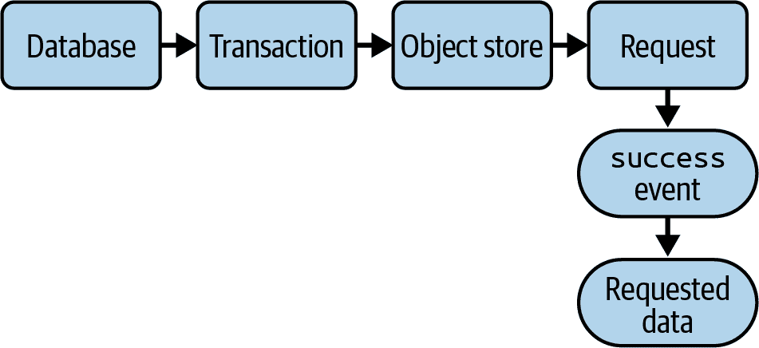

# 第五章：IndexedDB

# 介绍

第二章涵盖了本地或会话存储的数据持久性。这对于字符串值和可序列化对象效果很好，但查询不理想，对象需要 JSON 序列化。*IndexedDB* 是现代浏览器中存在的一种更新、更强大的数据持久性机制。IndexedDB 数据库包含*对象存储*（类似于关系数据库中的表）。每个对象存储可以在特定属性上有索引，以便更高效地进行查询。它还支持更高级的概念，如版本控制和事务。

## 对象存储和索引

一个 IndexedDB 数据库有一个或多个对象存储。所有添加、删除或查询数据的操作都在对象存储上进行。对象存储是持久化在数据库中的 JavaScript 对象的集合。您可以在对象存储上定义*索引*。索引会将额外的信息存储到数据库中，让您可以通过索引的属性来查询对象。例如，假设您正在创建一个用于存储产品信息的数据库。每个产品都有一个键，可能是产品 ID 或 SKU 代码。这样可以让您快速搜索数据库中的特定产品。

如果您还想通过价格查询数据，可以在价格属性上创建一个索引。这使您可以通过价格查找对象。有了索引，您可以指定特定的价格或价格范围，并且索引可以快速找到这些记录。

## 键

存储在存储中的对象具有一个用于在该存储中唯一标识该对象的*键*。这类似于关系数据库表中的主键。在 IndexedDB 对象存储中有两种类型的键。

*内联*键是在对象本身上定义的。例如，这是一个带有内联键的待办事项：

```
{
  // Here, id is the key.
  id: 100,
  name: 'Take out the trash',
  completed: false
}
```

在这里，键是 `id` 属性。当向此类对象存储中添加待办事项时，它们必须定义一个 `id` 属性。此外，在创建对象存储时，您可以指定一个*键路径*为 `id`。键路径告诉 IndexedDB 在使用内联键时包含键的属性名称：

```
const todosStore = db.createObjectStore('todos', { keyPath: 'id' });
```

如果您想使用内联键并且不想担心维护唯一键，可以告诉 IndexedDB 使用自增键：

```
const todosStore = db.createObjectStore('todos',
  { keyPath: 'id', autoIncrement: true });
```

*外联*键不会存储在对象内部。在存储对象时，可以使用 `add` 或 `put` 指定一个独立的参数作为外联键。继续上面的例子，您也可以为待办事项使用外联键。这意味着键或 `id` 属性不会作为对象的一部分存储：

```
const todo = {
  name: 'Take out the trash',
  completed: false
};

// later, when adding the new to-do
todoStore.add(todo, 100);
```

## 事务

IndexedDB 操作使用*事务*。事务是一组一起执行以执行某些工作的数据库任务的逻辑分组。它们旨在保护数据库中数据的完整性。如果事务中的某个操作失败，整个事务将失败，并且任何已完成的工作都将回滚到事务之前的状态。

事务可以是只读的或读写的，具体取决于你想执行的操作类型。你可以通过调用 IndexedDB 数据库的`transaction`方法来创建一个事务。你需要传递应该参与此事务的任何对象存储的名称以及事务类型（`readonly`或`readwrite`）。

一旦你拥有了一个事务，就可以获取到你需要的对象存储的引用。从那里，你可以开始执行你的数据库操作。这些操作返回一个 IndexedDB 的*request*。在 IndexedDB 数据库中，所有读取和写入操作都需要一个事务。

## 请求

当你在事务中对对象存储执行操作时，你会得到一个实现了`IDBRequest`接口的请求对象，并且请求的工作异步开始。

当操作完成时，请求对象会触发一个包含结果的`success`事件。例如，查询操作的`success`事件包含查询到的对象。

图 5-1 展示了一个 IndexedDB 操作的一般流程：创建事务、打开对象存储、创建请求并监听事件。



###### 图 5-1\. IndexedDB 操作的各个部分

# 在数据库中创建、读取和删除对象

## 问题

你希望创建一个基本的 IndexedDB 数据库，可以在其中创建、读取和删除对象。例如，这可以是一个联系人列表数据库。

## 解决方案

创建一个只有一个对象存储的数据库，并定义创建/读取/删除操作。

要创建或打开数据库，请调用`indexedDB.open`（参见示例 5-1）。如果之前未创建过数据库，则会触发一个`upgradeneeded`事件。在该事件的处理程序中，你可以创建对象存储。当数据库打开并准备好使用时，会触发一个`success`事件。

##### 示例 5-1\. 打开数据库

```
/**
 * Opens the database, creating the object store if needed.
 * Because this is asynchronous, it takes a callback function, onSuccess. Once the
 * database is ready, onSucces will be called with the database object.
 *
 * @param onSuccess A callback function that is executed when the database is ready
 */
function openDatabase(onSuccess) {
  const request = indexedDB.open('contacts');

  // Create the object store if needed.
  request.addEventListener('upgradeneeded', () => {
    const db = request.result;

    // The contact objects will have an 'id' property that will
    // be used as the key. When you add a new contact object, you don't need to
    // set an 'id' property; the autoIncrement flag means that the database will
    // automatically set an 'id' for you.
    db.createObjectStore('contacts', {
      keyPath: 'id',
      autoIncrement: true
    });
  });

  // When the database is ready for use, it triggers a 'success' event.
  request.addEventListener('success', () => {
    const db = request.result;

    // Call the given callback with the database.
    onSuccess(db);
  });

  // Always handle errors!
  request.addEventListener('error', () => {
    console.error('Error opening database:', request.error);
  });
}
```

在渲染联系人之前，你需要从数据库中加载它们。为此，请使用一个`readonly`事务，并调用对象存储的`getAll`方法，该方法检索对象存储中的所有对象（参见示例 5-2）。

##### 示例 5-2\. 读取联系人

```
/**
 * Reads the contacts from the database and renders them in the table.
 * @param contactsDb The IndexedDB database
 * @param onSuccess A callback function that is executed when the contacts are loaded
 */
function getContacts(contactsDb, onSuccess) {
  const request = contactsDb
    .transaction(['contacts'], 'readonly')
    .objectStore('contacts')
    .getAll();

  // When the data has been loaded, the database triggers a 'success' event on the
  // request object.
  request.addEventListener('success', () => {
    console.log('Got contacts:', request.result);
    onSuccess(request.result);
  });

  request.addEventListener('error', () => {
    console.error('Error loading contacts:', request.error);
  });
}
```

添加联系人需要一个`readwrite`事务。将联系人对象传递给对象存储的`add`方法（参见示例 5-3）。

##### 示例 5-3\. 添加联系人

```
/**
 * Adds a new contact to the database, then re-renders the table.
 * @param contactsDb The IndexedDB database
 * @param contact The new contact object to add
 * @param onSuccess A callback function that is executed when the contact is added
 */
function addContact(contactsDb, contact, onSuccess) {
  const request = contactsDb
    .transaction(['contacts'], 'readwrite')
    .objectStore('contacts')
    .add(contact);

  request.addEventListener('success', () => {
    console.log('Added new contact:', contact);
    onSuccess();
  });

  request.addEventListener('error', () => {
    console.error('Error adding contact:', request.error);
  });
}
```

对于删除联系人，你还需要一个`readwrite`事务（参见示例 5-4）。

##### 示例 5-4\. 删除联系人

```
/**
 * Deletes a contact from the database, then re-renders the table.
 * @param contactsDb The IndexedDB database.
 * @param contact The contact object to delete
 * @param onSuccess A callback function that is executed when the contact is deleted
 */
function deleteContact(contactsDb, contact, onSuccess) {
  const request = contactsDb
    .transaction(['contacts'], 'readwrite')
    .objectStore('contacts')
    .delete(contact.id);

  request.addEventListener('success', () => {
    console.log('Deleted contact:', contact);
    onSuccess();
  });

  request.addEventListener('error', () => {
    console.error('Error deleting contact:', request.error);
  });
}
```

## 讨论

创建数据库时，调用`indexedDB.open`，这将创建一个打开数据库的请求。如果触发了`upgradeneeded`事件，你可以创建必要的对象存储。

对象存储中的每个对象必须具有唯一的键。如果尝试添加具有重复键的对象，则会收到错误。

其他操作的模式通常是相同的：

1.  创建一个事务。

1.  访问对象存储。

1.  在对象存储上调用所需的方法。

1.  监听 `success` 事件。

这些函数中的每个都接受一个名为 `onSuccess` 的参数。由于 IndexedDB 是异步的，您需要等待操作完成。`openDatabase` 函数将数据库传递给 `onSuccess` 函数，在那里您可以将其保存到变量中以供以后使用（见 示例 5-5）。

##### 示例 5-5\. 使用 `openDatabase` 函数

```
let contactsDb;

// Open the database and do the initial contact list render.
// The success handler sets contactsDb to the new database object for later use,
// then loads and renders the contacts.
openDatabase(db => {
  contactsDb = db;
  renderContacts(contactsDb);
});
```

一旦设置了 `contactsDb` 变量，您可以将其传递给其他数据库操作。当您想要渲染联系人列表时，必须首先等待它们加载，因此您需要传递一个成功处理程序，该处理程序接收联系人对象并将它们渲染（见 示例 5-6）。

##### 示例 5-6\. 加载和渲染联系人

```
getContacts(contactsDb, contacts => {
  // Contacts have been loaded, now render them.
  renderContacts(contacts);
});
```

同样，在添加新联系人时，您必须等待新对象添加完成，然后加载和渲染更新后的联系人列表（见 示例 5-7）。

##### 示例 5-7\. 添加和重新渲染联系人

```
const newContact = { name: 'Connie Myers', email: 'cmyers@example.com' };
addContact(contactsDb, newContact, () => {
  // Contact has been added, now load the updated list and render it.
  getContacts(contactsDb, contacts => {
    renderContacts(contacts);
  })
});
```

如果您不想经常传递数据库引用，可以将数据库引用和函数封装在一个新对象中，如 示例 5-8 所示。

##### 示例 5-8\. 封装的数据库

```
const contactsDb = {
  open(onSuccess) {
    const request = indexedDB.open('contacts');

    request.addEventListener('upgradeneeded', () => {
      const db = request.result;
      db.createObjectStore('contacts', {
        keyPath: 'id',
        autoIncrement: true
      });
    });

    request.addEventListener('success', () => {
      this.db = request.result;
      onSuccess();
    });
  },

  getContacts(onSuccess) {
    const request = this.db
      .transaction(['contacts'], 'readonly')
      .objectStore('contacts')
      .getAll();

    request.addEventListener('success', () => {
      console.log('Got contacts:', request.result);
      onSuccess(request.result);
    });
  },

  // Other operations follow similarly.
};
```

采用这种方法，您仍然需要回调来通知操作完成，但 `contactsDb` 对象会为您跟踪数据库引用（并避免全局变量！）。

# 升级现有数据库

## 问题

要更新现有数据库以添加新的对象存储。

## 解决方案

使用新的数据库版本。在处理 `upgradeneeded` 事件时，根据版本确定当前用户的数据库是否需要添加新的对象存储。

想象一下，您有一个带有 `todos` 对象存储的待办事项数据库。稍后，在应用程序的更新中，您希望添加一个新的 `people` 对象存储，以便可以将任务分配给人员。

现在，`indexedDB.open` 调用需要一个新的版本号。您可以将版本号增加到 `2`（见 示例 5-9）。

##### 示例 5-9\. 升级数据库

```
// todoList database is now at version 2
const request = indexedDB.open('todoList', 2);

// If the user's database is still at version 1, an 'upgradeneeded' event
// is triggered so that the new object store can be added.
request.addEventListener('upgradeneeded', event => {
  const db = request.result;

  // This event is also triggered when no database exists yet, so you still need
  // to handle this case and create the to-dos object store.
  // The oldVersion property specifies the user's current version of the database.
  // If the database is just being created, the oldVersion is 0.
  if (event.oldVersion < 1) {
    db.createObjectStore('todos', {
      keyPath: 'id'
    });
  }

  // If this database has not yet been upgraded to version 2, create the
  // new object store.
  if (event.oldVersion < 2) {
    db.createObjectStore('people', {
      keyPath: 'id'
    });
  }
});

request.addEventListener('success', () => {
  // Database is ready to go.
});

// Log any error that might have occurred. The error object is
// stored in the request's 'error' property.
request.addEventListener('error', () => {
  console.error('Error opening database:', request.error);
});
```

## 讨论

当调用 `indexedDB.open` 时，您可以指定数据库版本。如果不指定版本，它将默认为 `1`。

每当打开数据库时，将在浏览器中当前的数据库版本（如果有）与传递给 `indexedDB.open` 的版本号进行比较。如果数据库尚不存在或版本不是最新的，则会触发 `upgradeneeded` 事件。

在 `upgradeneeded` 事件处理程序中，您可以检查事件的 `oldVersion` 属性，以确定浏览器当前的数据库版本。如果数据库尚不存在，则 `oldVersion` 为 `0`。

根据 `oldVersion`，您可以确定哪些对象存储和索引已存在以及哪些需要添加。

###### 警告

如果尝试创建已存在的对象存储或索引，浏览器将抛出异常。在创建这些对象之前，请确保检查事件的 `oldVersion` 属性。

# 使用索引进行查询

## 问题

你希望根据除了键（通常称为“主键”）以外的属性值高效地查询数据。

## 解决方案

在该属性上创建一个索引，然后在该索引上进行查询。

考虑员工数据库的示例。每个员工都有姓名、部门和唯一的 ID 作为其键。您可能希望按特定部门筛选员工。

当触发`upgradeneeded`事件并创建对象存储时，您还可以在该对象存储上定义索引（参见示例 5-10）。示例 5-11 展示了如何通过定义的索引进行查询。

##### 示例 5-10\. 在创建对象存储时定义索引

```
/**
 * Opens the database, creating the object store and index if needed.
 * Once the database is ready, onSuccess will be called with the database object.
 *
 * @param onSuccess A callback function that is executed when the database is ready
 */
function openDatabase(onSuccess) {
  const request = indexedDB.open('employees');

  request.addEventListener('upgradeneeded', () => {
    const db = request.result;

    // New employee objects will be given an autogenerated
    // 'id' property that serves as its key.
    const employeesStore = db.createObjectStore('employees', {
      keyPath: 'id',
      autoIncrement: true,
    });

    // Create an index on the 'department' property called 'department'.
    employeesStore.createIndex('department', 'department');
  });

  request.addEventListener('success', () => {
    onSuccess(request.result);
  });
}
```

##### 示例 5-11\. 通过部门索引查询员工

```
/**
 * Gets the employees for a given department, or all employees
 * if no department is given
 *
 * @param department The department to filter by
 * @param onSuccess A callback function that is executed when the employees
 * are loaded
 */
function getEmployees(department, onSuccess) {
  const request = employeeDb
    .transaction(['employees'], 'readonly')
    .objectStore('employees')
    .index('department')
    .getAll(department);

  request.addEventListener('success', () => {
    console.log('Got employees:', request.result);
    onSuccess(request.result);
  });

  request.addEventListener('error', () => {
    console.log('Error loading employees:', request.error);
  });
}
```

## 讨论

根据需要，IndexedDB 对象存储可以拥有多个索引。

此示例使用特定值来查询索引，但索引也可以查询一组键的*范围*。这些范围使用`IDBKeyRange`接口定义。范围根据其*边界*定义——它定义了范围的起点和终点，并返回该范围内的所有键。

`IDBKeyRange` 接口支持四种类型的边界：

`IDBKeyRange.lowerBound`

匹配从给定下界开始的键

`IDBKeyRange.upperBound`

匹配以给定上界结束的键

`IDBKeyRange.bound`

指定下界和上界

`IDBKeyRange.only`

指定单个键值

`lowerBound`、`upperBound` 和 `bound` 键范围还接受第二个布尔参数，用于指定范围是开放的还是闭合的。如果为 `true`，则被视为*开放*范围，并且排除范围本身。`IDBKeyRange.upperBound(10)` 匹配所有小于等于 `10` 的键，但 `IDBKeyRange.upperBound(10, true)` 匹配所有小于 `10` 的键，因为 `10` 本身被排除。键范围的边界不一定是数字，还可以是字符串和`Date`对象等其他对象类型。

# 使用游标搜索字符串值

## 问题

您希望查询 IndexedDB 对象存储中具有与模式匹配的字符串属性的对象。

## 解决方案

使用游标，检查每个对象的属性以查看是否包含给定的字符串。

想象一个员工列表应用程序。您希望搜索所有姓名包含输入文本的联系人。在这个例子中，假设数据库已经打开，并且对象存储称为`employees`。

*游标*在对象存储中遍历每个对象。它在每个对象处停止，您可以访问当前项和/或移动到下一个项。您可以检查联系人姓名是否包含查询文本，并将结果收集到数组中（见示例 5-12）。

##### 示例 5-12\. 使用游标搜索字符串值

```
/**
 * Searches for employees by name
 *
 * @param name A query string to match employee names
 * @param onSuccess Success callback that will receive the matching employees.
 */
function searchEmployees(name, onSuccess) {
  // An array to hold all contacts with a name containing the query text
  const results = [];

  const query = name.toLowerCase();

  const request = employeeDb
    .transaction(['employees'], 'readonly')
    .objectStore('employees')
    .openCursor();

  // The cursor request will emit a 'success' event for each object it finds.
  request.addEventListener('success', () => {
    const cursor = request.result;
    if (cursor) {
      const name = `${cursor.value.firstName} ${cursor.value.lastName}`
      .toLowerCase();
      // Add the contact to the result array if it matches the query.
      if (name.includes(query)) {
        results.push(cursor.value);
      }

      // Continue to the next record.
      cursor.continue();
    } else {
      onSuccess(results);
    }
  });

  request.addEventListener('error', () => {
    console.error('Error searching employees:', request.error);
  });
}
```

## 讨论

在对象存储上调用 `openCursor` 时，它会返回一个 `IDBRequest` 请求对象。它为存储中的第一个对象触发一个 `success` 事件。对于每个 `success` 事件，请求有一个 `result` 属性，该属性是游标对象本身。您可以通过其 `value` 属性访问游标当前指向的当前值。

成功处理程序检查当前对象的名字和姓氏字段，首先将它们转换为小写，以便进行不区分大小写的搜索。如果匹配，它将被添加到结果数组中。

处理完当前对象后，可以在游标上调用 `continue`。这会前进到下一个对象并触发另一个 `success` 事件。如果已经到达对象存储的末尾，并且没有剩余对象，`request.result` 将为 `null`。这时，您知道搜索已完成，并且已找到匹配的联系人。

在游标的每次迭代中，任何与搜索查询匹配的对象都将添加到 `results` 数组中。当游标完成时，此数组将传递给成功的回调函数。

# 对大数据集进行分页

## 问题

您希望将大型数据集分成具有偏移量和长度的页面。

## 解决方案

使用游标跳到请求页面的第一项并收集所需数量的项目（参见 示例 5-13）。

##### 示例 5-13\. 使用游标获取一页记录

```
/**
 * Uses a cursor to fetch a single "page" of data from an IndexedDB object store
 *
 * @param db The IndexedDB database object
 * @param storeName The name of the object store
 * @param offset The starting offset (0 being the first item)
 * @param length The number of items after the offset to return
 */
function getPaginatedRecords(db, storeName, offset, length) {
  const cursor = db
    .transaction([storeName], 'readonly')
    .objectStore(storeName)
    .openCursor();

  const results = [];

  // This flag indicates whether or not the cursor has skipped ahead to the
  // offset yet.
  let skipped = false;

  request.addEventListener('success', event => {
    const cursor = event.target.result;

    if (!skipped) {
      // Set the flag and skip ahead by the given offset. Next time around,
      // the cursor will be in the starting position and can start collecting
      // records.
      skipped = true;
      cursor.advance(offset);
    } else if (cursor && result.length < length) {
      // Collect the record the cursor is currently pointing to.
      results.push(cursor.value);

      // Continue on to the next record.
      cursor.continue();
    } else {
      // There are either no records left, or the length has been reached.
      console.log('Got records:', request.result);
    }
  });

  request.addEventListener('error', () => {
    console.error('Error getting records:', request.error);
  });
}
```

## 讨论

您可能不希望从第一条记录开始——这就是 `offset` 参数的作用。第一次调用事件处理程序时，使用请求的偏移量调用 `advance`。这告诉游标跳到您想要的起始项目。严格来说，`advance` 并不会移动到指定的偏移量，而是从当前索引开始按给定数量前进。但对于这个例子来说，效果是相同的，因为它总是从索引零开始。

直到游标的下一次迭代，才能开始收集值。为了处理这个问题，有一个 `skipped` 标志，用于指示游标现在已经跳过。下一次通过时，将看到这个标志为 `true`，并且不会再尝试跳过。

游标一旦前进，会触发另一个 `success` 事件。现在游标指向要收集的第一个项目（假设还有剩余项目——如果没有更多对象，则 `cursor` 对象为 `null`）。它将当前值添加到结果数组中。最后，它在游标上调用 `continue` 以移动到下一个值。

此过程继续，直到结果数组达到请求的长度，或者对象存储中没有更多对象。如果 `offset + length` 大于对象存储中的对象数，就会发生这种情况。

一旦没有更多对象可收集，完整的结果页就准备好了。

# 使用 Promises 与 IndexedDB API

## 问题

您希望有一个基于 `Promise` 的 API 来操作 IndexedDB 数据库。

## 解决方案

创建`Promise`封装来处理 IndexedDB 请求。当请求触发`success`事件时，解析`Promise`。如果触发`error`事件，则拒绝它。

示例 5-14 创建一个围绕`indexedDb.open`函数的封装。它打开或创建数据库，并返回一个`Promise`，当数据库准备好时解析。

##### 示例 5-14\. 使用`Promise`创建数据库

```
/**
 * Opens the database, creating the object store if needed.
 * @returns a Promise that is resolved with the database, or rejected with an error
 */
function openDatabase() {
  return new Promise((resolve, reject) => {
    const request = indexedDB.open('contacts-promise');

    // Create the object store if needed.
    request.addEventListener('upgradeneeded', () => {
      const db = request.result;
      db.createObjectStore('contacts', {
        keyPath: 'id',
        autoIncrement: true
      });
    });

    request.addEventListener('success', () => resolve(request.result));
    request.addEventListener('error', () => reject(request.error));
  });
}
```

要从数据库加载一些数据，示例 5-15 提供了一个围绕`getAll`方法的封装。它请求数据，然后返回一个`Promise`，当数据加载完成时，解析为对象数组。

##### 示例 5-15\. 使用`Promise`从存储区获取对象

```
/**
 * Reads the contacts from the database.
 * @returns a Promise that is resolved with the contacts, or rejected with an error
 */
function getContacts() {
  return new Promise((resolve, reject) => {
    const request = contactsDb
      .transaction(['contacts'], 'readonly')
      .objectStore('contacts')
      .getAll();

    request.addEventListener('success', () => {
      console.log('Got contacts:', request.result);
      resolve(request.result);
    });

    request.addEventListener('error', () => {
      console.error('Error loading contacts:', request.error);
      reject(request.error);
    });
  });
}
```

现在您已经有一个返回`Promise`的 API，可以在处理数据库时使用`then`或`async`/`await`（参见示例 5-16）。

##### 示例 5-16\. 使用`Promise`封装的数据库

```
async function loadAndPrintContacts() {
  try {
    const db = await openDatabase();
    const contacts = await getContacts();
    console.log('Got contacts:', contacts);
  } catch (error) {
    console.error('Error:', error);
  }
}
```

## 讨论

使用`Promise` API 和`async`/`await`可以避免传递成功处理程序回调的需求。正如示例 5-16 展示的那样，您还可以利用`Promise`链式操作来避免嵌套回调和事件处理程序。
