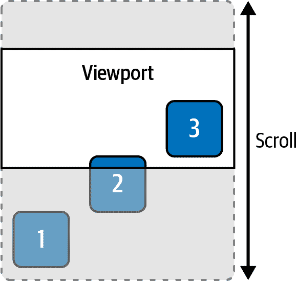

# 第六章：观察 DOM 元素

# 引言

本章介绍了浏览器提供的三种用于监视 DOM 元素的*观察者*类型：`MutationObserver`、`IntersectionObserver` 和 `ResizeObserver`。这些观察者对象可以监视 DOM 元素并通知您某些变化或事件。

观察者是通过回调函数创建的。这个函数在页面中发生相关事件时被调用。它被调用时传入一个或多个条目，这些条目包含发生的事件信息。这只是创建观察者。要实际开始监视一个元素，你需要在观察者上调用`observe`，传入你想要观察的元素以及一个可选的选项集。

## MutationObserver

`MutationObserver` 监视元素在 DOM 中的变化。你可以观察以下变化：

+   子元素

+   属性

+   文本内容

浏览器观察的内容在传递给`observe`函数的选项对象中定义。当观察一个元素时，您还可以给定一个可选的`subtree`选项。这将扩展到所有后代节点（而不仅仅是元素及其直接子元素）的监控，包括子元素、属性和/或文本内容。

当发生你感兴趣的变化时，你的回调函数会执行，并传递一个描述刚发生的变化的`MutationEntry`对象数组。

## ResizeObserver

正如其名称所示，`ResizeObserver` 在元素大小更改时通知你。大小变化时，会调用你的回调函数，并提供有关已调整大小的信息。条目包含有关元素新大小的信息。

## IntersectionObserver

`IntersectionObserver` 监视元素相对于视口的位置变化。视口可以是一个可滚动的元素或浏览器窗口本身。如果子元素的任何部分在可滚动区域内可见，则称为*相交*祖先元素。图 6-1 展示了可滚动页面上的元素。



###### 图 6-1\. 元素 1 未相交，元素 2 部分相交，元素 3 完全相交

`IntersectionObserver` 使用*相交比率*的概念——元素实际相交于根元素的比例。如果元素完全可见，则比率为 1\. 如果完全不在屏幕上，则比率为 0\. 如果正好一半可见一半不可见，则比率为 0.5\. 传递给回调函数的条目具有指定当前相交比率的`intersectionRatio`属性。

当你创建`IntersectionObserver`时，还可以指定一个*threshold*。这定义了观察者何时触发。默认情况下，阈值为 0。这意味着只要元素部分可见，观察者就会触发，即使只有一个像素。阈值为 1 时，仅当元素完全可见时触发。

# 懒加载图像当滚动到视图中

## 问题

你想要推迟加载图像，直到其位置滚动到视图中。有时这被称为*懒加载*。

## 解决方案

在``元素上使用`IntersectionObserver`，并等待直到它与视口交集。一旦进入视口，设置`src`属性开始加载图像（参见示例 6-1）。

##### 示例 6-1\. 使用`IntersectionObserver`进行图像的懒加载

```
/**
 * Observes an image element for lazy loading
 *
 * @param img A reference to the image DOM node
 * @param url The URL of the image to load
 */
function lazyLoad(img, url) {
  const observer = new IntersectionObserver(entries => {
    // isIntersecting becomes true once the image enters the viewport.
    // At that point, set the src URL and stop listening.
    if (entries[0].isIntersecting) {
      img.src = url;
      observer.disconnect();
    }
  });

  // Start observing the image element.
  observer.observe(img);
}
```

## 讨论

当你创建一个`IntersectionObserver`时，需要给它提供一个回调函数。每当一个元素进入或退出视口时，观察者就会调用这个函数，并提供有关元素交集状态的信息。

观察者可能会观察多个元素，它们的交集状态可能同时发生变化，因此回调函数会传递一个元素数组。在示例 6-1 中，观察者只观察单个图像元素，所以数组只有一个元素。

如果多个元素同时进入（或离开）视口，每个元素都会有一个条目。

你想要检查`isIntersecting`属性来确定是否该加载图像。当元素变得部分可见时，该属性变为`true`。

最后，通过在观察者对象上调用`observe`来告诉观察者要观察哪个元素。这开始监视该元素。

一旦你滚动到足够的位置，使元素进入视口区域，观察者就会调用回调函数。回调函数设置图像的 URL，然后通过调用`disconnect`停止监听。回调函数停止监听是因为一旦图像加载完成，就不需要继续观察元素。

在`IntersectionObserver`出现之前，要做这件事情的选项并不多。一种选项是监听父元素的`scroll`事件，然后通过比较父元素和子元素的边界矩形来判断元素是否在视口中。

当然，这样做性能不佳。这也通常被认为是不良实践。你需要节流或防抖这个检查，以防止它在每次滚动操作时都运行。

# 将 IntersectionObserver 与 Promise 包装起来

## 问题

你想创建一个`Promise`，一旦一个元素进入视口，就会解析该`Promise`。

## 解决方案

将`IntersectionObserver`包装在`Promise`中。一旦元素与其父元素交集，就解析`Promise`（参见示例 6-2）。

##### 示例 6-2\. 将`IntersectionObserver`与`Promise`包装起来

```
/**
 * Returns a Promise that is resolved once the given element enters the viewport
 */
function waitForElement(element) {
  return new Promise(resolve => {
    const observer = new IntersectionObserver(entries => {
      if (entries[0].isIntersecting) {
        observer.disconnect();
        resolve();
      }
    });

    observer.observe(element);
  });
}
```

## 讨论

当观察者使用指示元素交集的条目执行你的回调时，你可以解析`Promise`。

如 示例 6-3 所示，您可以使用此方法来延迟加载图像，类似于 “滚动到视图中时延迟加载图像”。

##### 示例 6-3\. 使用 `waitForElement` 辅助程序来延迟加载图像

```
function lazyLoad(img, url) {
  waitForElement(img)
    .then(() => img.src = url)
}
```

一旦解析了 `Promise`，调用代码可以确保元素位于视窗内。此时，`lazyLoad` 函数会在图像上设置 `src` 属性。

# 自动暂停和播放视频

## 问题

您在可滚动容器中有一个 `<video>` 元素。当视频正在播放时，如果它滚出视窗，您希望自动暂停它。

## 解决方案

使用 `IntersectionObserver` 监控视频元素。一旦它不再与视窗相交，就将其暂停。稍后，如果重新进入视窗，就恢复播放（见 示例 6-4）。

##### 示例 6-4\. 自动暂停和恢复视频

```
const observer = new IntersectionObserver(entries => {
  if (!entries[0].isIntersecting) {
    video.pause();
  } else {
    video.play()
      .catch(error => {
        // In case of a permission error autoplaying the video.
        // This avoids an unhandled rejection error that could crash your app.
      });
  }
});

observer.observe(video);
```

## 讨论

此观察器监视 `video` 元素。一旦它滚出视窗，就会暂停播放。稍后，如果将其滚回视窗中，它将恢复播放。

# 动画化高度变化

## 问题

您有一个内容可能会更改的元素。如果内容更改，您希望高度可以平滑过渡。

## 解决方案

使用 `MutationObserver` 监控元素的子元素。如果元素添加、删除或更改任何子元素，则使用 CSS 过渡来平滑地动画化高度变化。由于无法对具有 `auto` 高度的元素进行动画处理，因此需要一些额外的工作来计算显式高度，以便在其中进行动画化（见 示例 6-5）。

##### 示例 6-5\. 因子元素更改而动画化元素高度

```
/**
 * Watches an element for changes to its children. When the height changes
 * due to child changes, animate the change.
 * @param element The element to watch for changes
 */
function animateHeightChanges(element) {
  // You can't animate an element with 'height: auto', so an explicit
  // height is needed here.
  element.style.height = `${details.offsetHeight}px`;

  // Set a few CSS properties needed for the animated transition.
  element.style.transition = 'height 200ms';
  element.style.overflow = 'hidden';

  /**
 * This observer will fire when the element's child elements
 * change. It measures the new height, then uses requestAnimationFrame
 * to update the height. The height change will be animated.
 */
  const observer = new MutationObserver(entries => {
    // entries is always an array. There may be times where this array has multiple
    // elements, but in this case, the first and only element is what you need.
    const element = entries[0].target;

    // The content has changed, and so has the height.
    // There are a few steps to measure the new explicit height.

    // (1) Remember the current height to use for the animation's starting point.
    const currentHeightValue = element.style.height;

    // (2) Set the height to 'auto' and read the offsetHeight property.
    // This is the new height to set.
    element.style.height = 'auto';
    const newHeight = element.offsetHeight;

    // (3) Set the current height back before animating.
    element.style.height = currentHeightValue;

    // On the next animation frame, change the height. This will
    // trigger the animated transition.
    requestAnimationFrame(() => {
      element.style.height = `${newHeight}px`;
    });
  });

  // Begin watching the element for changes.
  observer.observe(element, { childList: true });
}
```

## 讨论

与其他观察器一样，创建 `MutationObserver` 时需要传递一个回调函数。当观察到的元素发生变化时（具体取决于传递给 `observer.observe` 的选项），观察器会调用此函数。当您的应用程序导致元素的子列表发生任何更改（添加、删除或修改元素）时，回调函数重新计算高度以适应新内容。

这里有很多事情要做，主要是因为浏览器不允许使用 `height` 为 `auto` 的元素进行动画处理。为了使动画正常工作，您必须使用显式值来设置起始和结束的高度。

在首次观察元素时，通过读取 `offsetHeight` 属性来计算其高度。然后，函数显式地在元素上设置此高度。这暂时处理了 `height: auto` 的问题。

当元素的子元素更改时，父元素不会自动调整大小，因为它现在具有显式设置的高度。观察器回调计算新高度。使用显式设置的高度后，`offsetHeight` 属性具有相同的值。

要测量*新*高度，必须首先将高度设置为*自动*。一旦完成这一步骤，`offsetHeight`就会给出新的高度值。但请记住，不能从`height: auto`进行动画。在更新高度之前，必须将其从*自动*设置回先前设置的状态。

现在您已经获得了新的高度。实际的高度更新放在`requestAnimationFrame`的调用中。

这种计算高度的方法增加了很多额外的代码。第八章介绍了 Web 动画 API，使得这些类型的动画变得不那么痛苦。

# 根据大小更改元素的内容

## 问题

您希望根据元素的大小在元素内显示不同的内容。例如，您可能希望处理元素非常宽的情况。

## 解决方案

对元素使用`ResizeObserver`，并在大小超过或低于您定义的阈值时更新内容（参见示例 6-6）。

##### 示例 6-6\. 更新元素大小变化时的内容

```
// Look up the element you want to observe.
const container = document.querySelector('#resize-container');

// Create a ResizeObserver that will watch the element for size changes.
const observer = new ResizeObserver(entries => {
  // The observer fires immediately, so you can set the initial text.
  // There's typically only going to be one entry in the array—the first element is
  // the element you're interested in.
  container.textContent = `My width is ${entries[0].contentRect.width}px`;
});

// Start watching the element.
observer.observe(container);
```

## 讨论

`ResizeObserver`在元素的大小变化时调用您传递的回调函数。观察者在首次观察到元素时也会立即调用它。

回调函数调用时会传递一个`ResizeObserverEntry`对象数组——在这里，因为只观察一个元素，通常只会有一个条目。`entry`对象有几个属性，包括`contentRect`，定义了元素的边界矩形。从那里您可以获取宽度。

因此，当元素调整大小时，观察者回调将更改其文本以指示当前宽度。

###### 警告

使用`ResizeObserver`时要小心，确保回调中的代码不会再次触发观察者。如果在回调中更改元素并导致其大小再次改变，这样的回调可能会导致`ResizeObserver`回调的无限循环。

# 在元素滚动到视图中时应用过渡

## 问题

您有一些不会初始显示的内容。当内容进入视口时，您希望通过动画过渡显示它。例如，当图像滚动到视图中时，您希望通过淡入使其不透明度过渡。

## 解决方案

使用`IntersectionObserver`监视元素何时滚动到视图中。当元素滚动到视图中时，应用动画过渡（参见示例 6-7）。

##### 示例 6-7\. 当页面上的所有图像淡入视图时

```
const observer = new IntersectionObserver(entries => {
  // There are multiple images per row, so there are multiple
  // entries.
  entries.forEach(entry => {
    // Once the element becomes partially visible, apply the animated transition,
    if (entry.isIntersecting) {
      // The image is 25% visible, begin the fade-in transition.
      entry.target.style.opacity = 1;

      // No need to observe this element any further.
      observer.unobserve(entry.target);
    }
  });
}, { threshold: 0.25 }); // Fires when images become 25% visible

// Observe all images on the page. Only images with the 'animate'
// class name will be observed, since you might not want to do this to
// all images on the page.
document.querySelectorAll('img.animate').forEach(image => {
  observer.observe(image);
});
```

## 讨论

本示例使用`IntersectionObserver`的`threshold`选项。默认情况下，观察者在元素首次变为可见时触发（`threshold`为`0`）。但在这种情况下并不理想，因为您希望至少有足够的图像可见，以便用户注意到过渡效果。通过将`threshold`设置为`0.25`，观察者在图像至少 25%可见时才执行回调。

回调函数还会检查图像是否实际相交，即是否已变为可见。这是必要的，因为当观察者首次开始观察一个元素时，它会立即触发。在这种情况下，屏幕外的图像尚未相交，因此此检查防止它们过早变为可见。

如果条目相交，则可以设置新的样式以触发动画或过渡效果。在这种情况下，回调函数将图像的不透明度设置为 1。为使此效果生效，您需要先将不透明度设置为 0，并定义`opacity`属性的`transition`（参见示例 6-8）。

##### 示例 6-8\. 图像淡入效果的样式

```
img.animate {
  opacity: 0;
  transition: opacity 500ms;
}
```

使用这种样式，图像是不可见的。当观察者回调将不透明度设置为 1 时，过渡生效，您将看到图像淡入。

您只希望执行此动画一次，因此一旦图像可见，就不再需要观察它。您可以通过调用`observer.unobserve`并传递元素来清理以停止观察。

# 使用无限滚动

## 问题

您希望在用户滚动到列表底部时自动加载更多数据，而无需用户点击“加载更多”按钮。

## 解决方案

将元素放置在可滚动列表的末尾，并使用`IntersectionObserver`观察它。当元素开始相交时，加载更多数据（参见示例 6-9）。

##### 示例 6-9\. 使用`IntersectionObserver`实现无限滚动

```
/**
 * Observes a placeholder element with an IntersectionObserver.
 * When the placeholder becomes visible, more data is loaded.
 *
 * @param placeholder The Load More placeholder element
 * @param loadMore A function that loads more data
 */
function observeForInfiniteScroll(placeholder, loadMore) {
  const observer = new IntersectionObserver(entries => {
    // If the placeholder becomes visible, it means the user
    // has scrolled to the bottom of the list. In this case, time to
    // load more data.
    if (entries[0].isIntersecting) {
      loadMore();
    }
  });

  observer.observe(placeholder);
}
```

## 讨论

占位符元素可以显示“加载更多”，也可以视觉上隐藏。`IntersectionObserver`监视占位符元素。一旦进入视口，回调函数开始加载更多数据。使用此技术，用户可以不断滚动直至达到数据末尾。

您可以将此占位符设置为加载旋转器。当用户滚动到列表底部并触发新请求时，他们将在加载新数据时看到旋转器。这是准确的，因为使用默认阈值 0.0 时，观察者会在用户滚动到足够看到旋转器之前触发。此时，数据已经在加载，因此这不是一个人为的旋转器。

当观察者首次开始观察时，回调立即触发。如果列表为空，则占位符可见，触发代码加载第一页数据。
