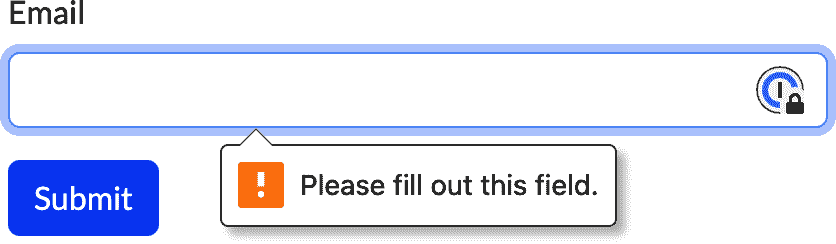

# 第七章：表单

# 简介

表单收集用户输入，并提交到远程 URL 或 API 端点。现代浏览器具有许多内置的表单输入类型，用于文本、数字、颜色等。表单是从用户获取输入的主要方式之一。

## FormData

FormData API 提供了一个访问表单数据的数据模型。它使您无需查找单个 DOM 元素并获取其值。

更好的是，一旦您有了 `FormData` 对象，您可以直接将其传递给 Fetch API 来提交表单。在提交之前，您可以修改或添加 `FormData` 对象中的数据。

## 验证

为了防止用户发送无效数据，您可以（也应该）为您的表单添加客户端验证。这可能只是将字段标记为必填项，或者涉及协调多个表单值或调用 API 的更复杂验证逻辑。

在过去，开发人员通常需要借助 JavaScript 库来执行表单验证。这可能会因为数据重复而引起头痛；它存在于表单数据中以及验证库使用的内存对象中。

HTML5 添加了更多内置验证选项，例如：

+   将字段标记为必填项

+   在数字字段中指定最小和最大值

+   指定用于验证字段输入的正则表达式

这些选项用作 `<input>` 元素的属性。

浏览器显示基本的验证错误消息（参见图 7-1），但是其样式可能与您应用程序的设计不匹配。您可以使用约束验证 API 检查内置验证结果，还可以执行自定义验证逻辑并设置自己的验证消息。



###### 图 7-1\. Chrome 中的内置验证消息

要验证表单，您可以调用其 `checkValidity` 方法。表单内的所有字段都将被验证。如果所有字段都有效，则 `checkValidity` 返回 `true`。如果一个或多个字段无效，则 `checkValidity` 返回 `false`，并且每个无效字段都会触发一个 `invalid` 事件。您也可以通过在表单字段本身上调用 `checkValidity` 来检查特定元素。

每个表单字段都有一个 `validity` 对象，反映了当前的有效性状态。它有一个布尔值 `valid`，指示表单的整体有效性状态。该对象还有其他标志，告诉您验证错误的性质。

# 从本地存储填充表单字段

## 问题

您希望在本地存储中记住表单字段的值。例如，您可能希望记住登录表单中输入的用户名。

## 解决方案

在提交表单时，使用 `FormData` 对象获取字段值并将其设置在本地存储中（参见示例 7-1）。然后，在首次加载页面时，检查是否存在记住的值。如果找到值，则填充表单字段。

##### 示例 7-1\. 记住 `username` 字段

```
const form = document.querySelector('#login-form');

const username = localStorage.getItem('username');
if (username) {
  form.elements.username.value = username;
}

form.addEventListener('submit', event => {
  const data = new FormData(form);
  localStorage.setItem('username', data.get('username'));
});
```

## 讨论

当你将表单传递给 `FormData` 构造函数时，它会填充表单的当前值。然后，你可以使用 `get` 方法检索所需的字段，并将其设置在本地存储中。

在加载时填充表单有些不同。`FormData` 对象不会与当前表单值同步保持；相反，它包含创建 `FormData` 对象时的表单值。反之亦然——如果你在 `FormData` 对象中设置了新值，它不会更新到表单本身。鉴于此，`FormData` 对象在填充表单时并不会有所帮助。Example 7-1 使用表单的 `elements` 属性查找 `username` 字段并设置其值。

# 使用 Fetch 和 FormData API 提交表单

## 问题

你希望使用 Fetch API 提交表单。可能是为了向表单提交添加额外信息，这些信息不会被浏览器包含，或者因为表单提交可能需要在内存中存储的 API 令牌而不是在表单中输入。

另一个你可能想这样做的原因是防止浏览器重定向到新页面，或导致完全页面刷新。

## 解决方案

创建一个包含要提交数据的 `FormData` 对象。添加额外所需的数据，然后使用 Fetch API 提交表单（参见 Example 7-2）。

##### 示例 7-2\. 使用 FormData API 添加数据

```
// In a real-world application, the API token would be stored somewhere and
// not hardcoded like this.
const apiToken = 'aBcD1234EfGh5678IjKlM';

form.addEventListener('submit', event => {
  // Important: Stop the browser from automatically submitting the form.
  event.preventDefault();

  // Set up a FormData object and add the API token to it.
  const data = new FormData(event.target);
  data.set('apiToken', apiToken);

  // Use the Fetch API to send this FormData object to the endpoint.
  fetch('/api/form', {
    method: 'POST',
    body: data
  });
});
```

## 讨论

通常，当你点击提交按钮时，浏览器会获取表单数据并自动提交。但在这里你不想这样做，因为你需要添加 API 令牌。

提交处理程序首先在`submit`事件上调用`preventDefault`。这样可以阻止浏览器执行默认的提交行为，从而可以提供自定义逻辑。这里的默认行为是完全的页面刷新，这可能不是你想要的。

你可以通过将表单对象传递给 `FormData` 构造函数来创建一个 `FormData` 对象。生成的对象将包含其中的现有表单数据，此时你可以添加额外的数据如 API 令牌。

最后，你可以使用 Fetch API 将 `FormData` 对象作为 POST 请求的主体。以这种方式提交表单时，主体不是 JSON，而是使用 `multipart/form-data` 内容类型提交到浏览器。

考虑一个表示你的表单数据的对象：

```
{
  username: 'john.doe',
  apiToken: 'aBcD1234EfGh5678IjKlM'
}
```

等效的请求体看起来像这样：

```
------WebKitFormBoundaryl6AuUOn9EbuYe9XO
Content-Disposition: form-data; name="username"

john.doe
------WebKitFormBoundaryl6AuUOn9EbuYe9XO
Content-Disposition: form-data; name="apiToken"

aBcD1234EfGh5678IjKlM
------WebKitFormBoundaryl6AuUOn9EbuYe9XO--
```

# 提交表单作为 JSON

## 问题

你希望将表单提交到一个期望 JSON 数据的终端点。

## 解决方案

使用 FormData API 将表单数据转换为 JavaScript 对象，并使用 Fetch API 将其作为 JSON 发送（参见 Example 7-3）。

##### 示例 7-3\. 使用 Fetch 将表单作为 JSON 提交

```
form.addEventListener('submit', event => {
  // Important: Stop the browser from automatically submitting the form.
  event.preventDefault();

  // Create a new FormData containing this form's data, then add each
  // key/value pair to the response body.
  const data = new FormData(event.target);
  const body = {};
  for (const [key, value] of data.entries()) {
    body[key] = value;
  }

  // Send the JSON body to the form endpoint.
  fetch('/api/form', {
    method: 'POST',

    // The object must be converted to a JSON string.
    body: JSON.stringify(body),

    // Tell the server you're sending JSON.
    headers: {
      'content-type': 'application/json'
    }
  })
    .then(response => response.json())
    .then(body => console.log('Got response:', body));
});
```

## 讨论

这种方法类似于直接发送 `FormData` 对象。唯一的区别是你正在将表单数据转换为 JSON 并使用正确的 `Content-Type` 标头进行发送。

你可以通过创建一个新的空对象并迭代`FormData`中的键/值对来执行转换。每对键/值都会被复制到对象中。

这种方法的一个缺点是，你无法将其用于`FormData`，其中有多个值绑定到相同的键。当你有一个具有相同名称的复选框组时，就会出现这种情况；有多个具有相同键的条目。

你可以增强转换以检测这种情况，并设置一个值数组，就像示例 7-4 中所示。

##### 示例 7-4\. 处理数组形式的数值

```
/**
 * Converts a form's data into an object that can be sent as JSON.
 * @param form The form element
 * @returns An object containing all the mapped keys and values
 */
function toObject(form) {
  const data = new FormData(form);
  const body = {};

  for (const key of data.keys()) {
    // Returns an array of all values bound to a given key
    const values = data.getAll(key);

    // If there's only one element in the array, set that element directly.
    if (values.length === 1) {
      body[key] = values[0];
    } else {
      // Otherwise, set the array
      body[key] = values;
    }
  }

  return body;
}
```

示例 7-4 使用`FormData`的`getAll`函数，该函数返回一个包含绑定到给定键的所有值的数组。这样你就可以将给定复选框组的所有值收集到一个数组中。

`getAll`始终返回一个数组。如果只有一个值，则它是一个只有一个元素的数组。`toObject`检查这种情况，如果数组只有一个元素，则将该元素用作结果对象中的单个值。否则，它使用值数组。

# 使表单字段为必填项

## 问题

你想要要求表单字段具有值，如果留空则引发验证错误。

## 解决方案

在`<input>`元素上使用`required`属性（参见示例 7-5）。

##### 示例 7-5\. 必填字段

```
<label for="username">Username</label>
<input type="text" name="username" id="username" required> 
```


`required`属性没有值。

## 讨论

当字段标记为`required`时，它必须具有值。如果字段为空，则其`validity.valid`属性为`false`，其`validity.valueMissing`属性为`true`。

只有当值为空字符串时，必填字段才被视为空。它不会修剪空格，因此由几个空格组成的值被视为有效。

# 限制数字输入

## 问题

你想要为数字输入指定一系列允许的值（`<input type=​"num⁠ber">`）。

## 解决方案

使用`min`和`max`属性来指定允许的范围（参见示例 7-6）。这些值是包容的，意味着最小值和最大值本身也是允许的。

##### 示例 7-6\. 为数字字段指定范围

```
<label for="quantity">Quantity</label>
<input type="number" name="quantity" id="quantity" min="1" max="10">
```

## 讨论

如果数字输入的值低于最小值或高于最大值，则其`validity.valid`属性为`false`。如果低于最小值，则设置`rangeUnderflow`有效性标志。同样，如果超过最大值，则设置`rangeOverflow`标志。

当你将`input`的类型设置为`number`时，浏览器会添加一个微调控件——可点击的上下箭头，用于增加和减少值。这个微调控件强制执行最小和最大值——如果值已经达到最小值，则拒绝减少值；如果值已经达到最大值，则拒绝增加值。然而，用户仍然可以在字段中输入任何值。他们可以输入超出允许范围的数字，此时验证状态会相应地设置。

如果您希望对允许的值进行更精细的控制，还可以指定`step`值。这将限制允许的值，使增量必须是步长的倍数。考虑一个最小值为 0、最大值为 4、步长为 2 的输入。该字段的唯一可接受值将是 0、2 和 4。

# 指定验证模式

## 问题

您希望限制文本字段的值，使其符合特定的模式。

## 解决方案

使用`input`的`pattern`属性来指定正则表达式（参见示例 7-7）。除非其值与正则表达式匹配，否则该字段被视为无效。

##### 示例 7-7\. 限制字段仅包含字母数字字符

```
<label for="username">Enter a username</label>
<input type="text" pattern="[A-Za-z0-9]+" id="username" name="username">
```

`username`字段如果包含除了字母数字字符之外的任何内容则无效。当无效时，有效状态的`patternMismatch`标志被设置。

## 讨论

这是一种灵活的验证选项，仅次于使用自定义验证逻辑（参见“使用自定义验证逻辑”）。

###### 提示

创建正则表达式以验证 URL 或电子邮件地址可能有些棘手。为处理这些情况，您可以将输入的`type`属性设置为`url`或`email`，浏览器将为您验证字段是否为有效的 URL 或电子邮件地址。

# 验证表单

## 问题

您希望管理表单验证过程并在 UI 中显示自己的错误消息。

## 解决方案

使用约束验证 API 和`invalid`事件来检测和标记无效字段。

有很多方法可以处理验证。一些网站过于急于显示错误消息，甚至在用户有机会输入值之前就显示错误消息。考虑一个类型为`email`的输入，除非输入有效的电子邮件地址，否则被视为无效。如果立即进行验证，用户在完成输入之前就会看到关于无效电子邮件地址的错误。

为了避免这种情况，这里展示的验证方法仅在两种情况下验证字段：

+   当表单提交时。

+   如果字段已被聚焦然后失去焦点。这些字段被视为已被“触摸”。

首先，您需要通过向表单添加`novalidate`属性来禁用浏览器的内置验证 UI，如示例 7-8 所示。

##### 示例 7-8\. 禁用浏览器验证 UI

```
<form id="my-form" novalidate>
  <!-- Form elements go here -->
</form>
```

每个字段都需要一个占位符元素来包含错误消息，如示例 7-9 所示。

##### 示例 7-9\. 添加错误消息占位符

```
<div>
  <label for="email">Email</label>
  <input required type="email" id="email" name="email">
  <div class="error-message" id="email-error"></div>
</div>
```

在这个例子中，通过 ID 将错误消息与输入字段关联起来。具有 ID 为`email`的字段具有 ID 为`email-error`的错误消息，`name`字段具有`name-error`的错误消息，依此类推。

使用这种验证方法，每个表单元素都监听三个事件：

`invalid`

当表单验证并且字段被标记为无效时触发。这会设置错误消息。

`input`

当字段值更改时触发。如果需要，执行重新验证，并在字段变为有效时清除错误消息。

`blur`

当字段失去焦点时触发。这会设置一个`data-should-validate`属性，标记字段为已触摸状态，随后在`input`事件处理程序中验证。

验证代码显示在示例 7-10 中。

##### 示例 7-10\. 设置表单字段的验证

```
/**
 * Adds necessary event listeners to an element to participate in form validation.
 * It handles setting and clearing error messages depending on the validation state.
 * @param element The input element to validate
 */
function addValidation(element) {
  const errorElement = document.getElementById(`${element.id}-error`);

  /**
 * Fired when the form is validated and the field is not valid.
 * Sets the error message and style, and also sets the shouldValidate flag.
 */
  element.addEventListener('invalid', () => {
    errorElement.textContent = element.validationMessage;
    element.dataset.shouldValidate = true;
  });

  /**
 * Fired when user input occurs in the field. If the shouldValidate flag is set,
 * it will recheck the field's validity and clear the error message if it
 * becomes valid.
 */
  element.addEventListener('input', () => {
    if (element.dataset.shouldValidate) {
      if (element.checkValidity()) {
        errorElement.textContent = '';
      }
    }
  });

  /**
 * Fired when the field loses focus, applying the shouldValidate flag.
 */
  element.addEventListener('blur', () => {
    // This field has been touched; it will now be validated on subsequent
    // 'input' events.
    // This sets the input's data-should-validate attribute to true in the DOM.
    element.dataset.shouldValidate = true;
  });
}
```

###### 注意

本示例监听`input`事件。如果您的表单包含复选框或单选按钮，则可能需要根据浏览器，改为监听这些元素的`change`事件。请参阅来自 MDN 的[关于`input`事件的文章](https://oreil.ly/cFIjY)：

> 对于带有`type=checkbox`或`type=​radio`的`<input>`元素，根据 HTML Living Standard 规范，`input`事件应在用户切换控件时触发。然而，从历史上看，这并非总是如此。检查兼容性，或者对于这些类型的元素，改为使用`change`事件。

要完成基本的验证框架，请为表单字段添加监听器，监听表单的`submit`事件，并触发验证（参见示例 7-11）。

##### 示例 7-11\. 触发表单验证

```
// Assuming the form has two inputs, 'name' and 'email'
addValidation(form.elements.name);
addValidation(form.elements.email);

form.addEventListener('submit', event => {
  event.preventDefault();
  if (form.checkValidity()) {
    // Validation passed, submit the form
  }
});
```

## 讨论

此代码设置了一个良好的基本验证框架，处理了浏览器的内置验证。在提交表单之前，它调用`checkValidity`，开始检查表单内的所有输入。对于任何未通过验证的输入，浏览器会触发`invalid`事件。为处理此事件，您可以在输入元素本身上监听`invalid`事件。然后，您可以呈现适当的错误消息。

用户一旦出现验证错误，您希望在字段变为有效时立即清除这些错误。这就是为什么`addValidation`监听`input`事件的原因—这在用户在输入框中键入内容时立即触发。从那时起，您可以立即重新检查输入的有效性。如果现在有效（`checkValidity`返回`true`），则可以清除错误消息。只有当`data-should-validate`属性设置为`true`时，输入才会重新验证。此属性在表单提交期间验证失败时添加，或者在元素失去焦点时。这可以防止用户完成输入之前出现验证错误。一旦字段失去焦点，它会在每次更改时重新验证。

# 使用自定义验证逻辑

## 问题

您希望执行一项不受约束验证 API 支持的验证检查。例如，您希望验证密码和密码确认字段具有相同的值。

## 解决方案

在调用表单的`checkValidity`方法之前执行自定义验证逻辑。如果自定义验证未通过，请调用输入框的`setCustomValidity`方法设置适当的错误消息。如果验证通过，请清除先前设置的任何验证消息（参见示例 7-12）。

##### Example 7-12\. 使用自定义验证

```
/**
 * Custom validation function that ensures the password and confirmPassword fields
 * have the same value.
 * @param form The form containing the two fields
 */
function validatePasswordsMatch(form) {
  const { password, confirmPassword } = form.elements;

  if (password.value !== confirmPassword.value) {
    confirmPassword.setCustomValidity('Passwords do not match.');
  } else {
    confirmPassword.setCustomValidity('');
  }
}

form.addEventListener('submit', event => {
  event.preventDefault();

  validatePasswordsMatch(form);
  if (form.checkValidity()) {
    // Validation passed, submit the form.
  }
});
```

###### 注意

如果你正在使用浏览器内置的验证 UI，需要在设置自定义有效性消息后调用表单字段的`reportValidity`方法。如果你自己处理验证 UI，则不需要这样做，但确保在适当的位置显示错误消息。

## 讨论

当你在具有非空字符串的元素上调用`setCustomValidity`时，该元素现在被认为是无效的。

`validatePasswordsMatch`函数检查`password`和`confirmPassword`字段的值。如果它们不匹配，则在`confirmPassword`字段上调用`setCustomValidity`设置验证错误消息。如果它们匹配，则将其设置为空字符串，这将重新标记字段为有效。

表单的提交处理程序在执行内置验证之前调用`validatePasswordsMatch`。如果`validatePasswordsMatch`检查失败，并设置了自定义有效性，则`form.checkValidity`会失败，并且在`confirmPassword`字段上会触发`invalid`事件，就像其他无效元素一样。

# 验证复选框组

## 问题

你希望强制要求在复选框组中至少选择一个复选框。在复选框上设置`required`属性在这里无效，因为它仅适用于单个输入，而不是整个组。浏览器检查是否选中了该输入，并导致验证错误，即使组中的其他复选框已被选中。

## 解决方案

使用`FormData`对象获取所有选中复选框的数组，并在数组为空时设置自定义验证错误。

在执行自定义验证时，使用`FormData`的`getAll`方法获取选中复选框值的数组（参见 Example 7-13）。如果数组为空，则表示没有选择复选框，这是一个验证错误。

##### Example 7-13\. 验证复选框组

```
function validateCheckboxes(form) {
  const data = new FormData(form);

  // To avoid setting the validation error on multiple elements,
  // choose the first checkbox and use that to hold the group's validation
  // message.
  const element = form.elements.option1;

  if (!data.has('options')) {
    element.setCustomValidity('Please select at least one option.');
  } else {
    element.setCustomValidity('');
  }
}
```

为了将整个组的验证状态保持在一个地方，仅在第一个复选框上（假设名称为`option1`）设置自定义有效性消息。这个第一个复选框作为组的验证消息的容器是必要的，因为你只能在实际的`<input>`元素上设置有效性消息。

然后，监听`invalid`和`change`事件。在`invalid`事件上显示错误消息。在`change`事件（切换复选框时）上执行自定义验证，并在验证成功时清除错误消息（参见 Example 7-14）。

##### Example 7-14\. 设置复选框验证

```
/**
 * Adds necessary event listeners to an element to participate in form validation.
 * It handles setting and clearing error messages depending on the validation state.
 * @param element The input element to validate
 * @param errorId The ID of a placeholder element that will show the error message
 */
function addValidation(element, errorId) {
  const errorElement = document.getElementById(errorId);

  /**
 * Fired when the form is validated and the field is not valid.
 * Sets the error message and style.
 */
  element.addEventListener('invalid', () => {
    errorElement.textContent = element.validationMessage;
  });

  /**
 * Fired when user input occurs in the field.
 * It will recheck the field's validity and clear the error message if it
 * becomes valid.
 */
  element.addEventListener('change', () => {
    validateCheckboxes(form);
    if (form.elements.option1.checkValidity()) {
      errorElement.textContent = '';
    }
  });
}
```

最后，在检查表单有效性之前，为每个复选框字段添加验证，并在检查表单的有效性之前调用`validateCheckboxes`函数。Example 7-15 预期你有一个带有 ID `checkbox-error` 的元素。如果有复选框验证错误，则会在该元素上设置消息。

##### Example 7-15\. 验证复选框表单

```
addValidation(form.elements.option1, 'checkbox-error');
addValidation(form.elements.option2, 'checkbox-error');
addValidation(form.elements.option3, 'checkbox-error');

form.addEventListener('submit', event => {
  event.preventDefault();
  validateCheckboxes(form);
  console.log(form.checkValidity());
});
```

## 讨论

在组中复选框上使用`required`属性不会产生预期效果。这对于单个复选框非常有效，比如要求用户接受许可协议的复选框，但是在组中使用时，会使每个单独的复选框都变为必填，除非*所有*复选框都被选中。由于没有用于“复选框组”的 HTML 元素，您需要做一些额外的工作来获得所需的行为。

此示例选择组中的第一个复选框作为验证消息的“容器”。当用户切换任何复选框时，浏览器调用更改处理程序并查看是否选中任何复选框。如果选择数组为空，则表示存在错误。自定义有效性消息始终仅在第一个复选框上设置。这是为了确保消息始终在需要时显示和隐藏。

让我们看看如果您改为应用自定义有效性到更改复选框会发生什么。

如果没有选中任何选项并且用户提交表单，则现在每个复选框都有一个自定义有效性错误消息。现在，如果您选中其中一个复选框，复选框的`change`事件将触发并检查复选框组。现在已选择一个选项，因此清除自定义有效性消息。但是，其他复选框仍处于错误状态。这基本上等同于在所有复选框上设置`required`属性。

您可以通过在`validateCheckboxes`函数中为*所有*复选框设置验证消息来解决此问题，但选择一个并将其用作所有自定义验证消息的目标要少做些工作。整个组有一个单独的错误消息元素，用于显示验证错误。

###### 注意

由于此示例管理其自己的验证消息，请确保在包含的表单上包含`novalidate`属性，以避免显示浏览器的默认验证 UI 和您的自定义验证错误。

# 异步验证字段

## 问题

您的自定义验证逻辑需要像进行网络请求这样的异步操作。例如，用户注册表单具有密码字段。注册表单必须调用 API 来验证输入的密码是否符合密码强度标准。

## 解决方案

执行网络请求，然后设置自定义有效性消息。在返回`Promise`的函数中执行此操作。在表单的提交处理程序中，在调用表单上的`checkValidity`之前等待此`Promise`。如果异步验证代码设置了自定义有效性消息，则由`checkValidity`触发的表单验证会处理它。

示例 7-16 包含验证逻辑本身。它调用密码强度检查 API 并相应地设置自定义有效性消息。

##### 示例 7-16\. 执行异步密码强度验证

```
/**
 * Calls an API to validate that a password meets strength requirements.
 * @param form The form containing the password field
 */
async function validatePasswordStrength(form) {
  const { password } = form.elements;
  const response = await fetch(`/api/password-strength?password=${password.value}`);
  const result = await response.json();

  // As before, remember to call reportValidity on the password field if you're using
  // the built-in browser validation UI.
  if (result.status === 'error') {
    password.setCustomValidity(result.error);
  } else {
    password.setCustomValidity('');
  }
}
```

###### 警告

请确保只通过安全连接（HTTPS）发送密码。否则，您会将用户的密码以明文形式发送出去，这是一种危险的做法。

因为该函数标记为`async`，它返回一个`Promise`。您只需在表单的提交处理程序中`await`这个`Promise`，就像示例 7-17 中所示。

##### 示例 7-17\. `async`表单提交处理程序

```
form.addEventListener('submit', async event => {
  event.preventDefault();
  await validatePasswordStrength(form);
  console.log(form.checkValidity());
});
```

如果密码不符合要求，在提交时会将该字段标记为无效。当字段发生更改时，可以重新运行验证逻辑，但这次是在`blur`事件而不是`input`事件上，就像您在同步自定义验证中所做的那样（参见示例 7-18）。

##### 示例 7-18\. 在`blur`上重新验证

```
form.elements.password.addEventListener('blur', async event => {
  const password = event.target;
  const errorElement = document.getElementById('password-error');
  if (password.dataset.shouldValidate) {
    await validatePasswordStrength(form);
    if (password.checkValidity()) {
      errorElement.textContent = '';
      password.classList.remove('border-danger');
    }
  }
});
```

## 讨论

如果您在`input`事件上进行此检查，每次用户按键时都会发送一个网络请求。`blur`事件将重新验证推迟到字段失去焦点时。它再次调用验证 API 并检查新的有效性状态。

###### 提示

您也可以使用验证函数的去抖动版本。这将在输入事件上重新验证，但只有当用户停止键入一段时间后才会进行验证。

[这篇来自 freeCodeCamp 的文章](https://oreil.ly/kLRJa)详细介绍了如何创建一个去抖动函数。还有一些 npm 包可以创建一个函数的去抖动版本。
