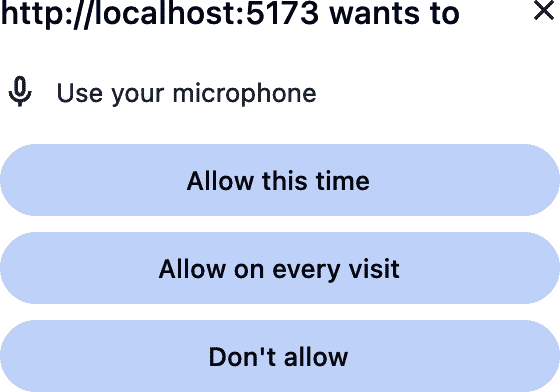

# 第九章：Web Speech API

# 引言

在智能设备和助手的时代，您的语音已成为另一种常用的输入方式。无论您是在口述短信还是询问明天的天气预报，语音识别和合成正在成为应用开发中有用的工具。使用 Web Speech API，您可以让您的应用发出声音或监听用户的语音输入。

## 语音识别

Web Speech API 将语音*识别*带到浏览器中。一旦用户允许使用麦克风，它将监听语音。当它识别到一系列单词时，它将触发包含识别内容的事件。

###### 注意

尽管不是所有浏览器都支持语音识别。查看[CanIUse](https://oreil.ly/SGLlc)获取最新的兼容性数据。

在开始监听语音之前，您需要用户的许可。由于隐私设置，第一次尝试监听时，用户将被提示授予您的应用使用麦克风的权限（参见图 9-1）。



###### 图 9-1。在 Chrome 中的麦克风权限请求

一些浏览器，如 Chrome，使用外部服务器分析捕获的音频以识别语音。这意味着在离线时语音识别将无法工作，并且可能引起隐私问题。

## 语音合成

Web Speech API 还提供语音*合成*。给定一些文本，它可以创建一个合成的语音来朗读文本。浏览器有一组内置的语音可以用来朗读您的内容。一旦选择了适合目标语言的语音，您可以自定义语音的音调和说话速度。

您可以结合语音识别和语音合成来创建对话式语音用户界面。它们可以监听问题或命令，并朗读输出或反馈。

## 浏览器支持

在撰写时，对 Web Speech API 的支持有些有限。

这个 API 的规范还添加了一些其他功能，一旦它们在浏览器中得到支持，将增强语音识别和合成的功能。

其中之一是自定义语法，它允许您通过指定要识别的单词和短语来微调语音识别。例如，如果您设计了一个带有语音命令的计算器，您的自定义语法将包括数字（“one”，“two” 等）和计算器操作（“plus”，“minus” 等）。使用自定义语法有助于引导语音识别引擎捕捉您的应用程序所需的单词。

SpeechSynthesis API 支持语音合成标记语言（SSML）。SSML 是一种定制语音合成的 XML 语言。您可以在男性和女性之间切换语音，或指定浏览器按字母读取内容。在撰写时，SSML 标记被解析和理解，但引擎不会朗读标记标签，但当前大多数浏览器会忽略大多数指令。

# 添加到文本字段的口述

## 问题

您希望识别口述文本并将其添加到文本字段的内容中，允许用户口述文本字段的内容。

## 解决方案

使用`SpeechRecognition`接口来监听语音。当语音被识别时，提取识别的文本并追加到文本字段中（参见示例 9-1）。

##### 示例 9-1\. 向文本字段添加基本口述

```
/**
 * Starts listening for speech. When speech is recognized, it is appended
 * to the given text field's value.
 * Recognition continues until the returned recognition object is stopped.
 *
 * @param textField A text field to append to
 * @returns The recognition object
 */
function startDictation(textField) {
  // Only proceed if this browser supports speech recognition.
  if ('webkitSpeechRecognition' in window || 'SpeechRecognition' in window) {
    const SpeechRecognition = window.SpeechRecognition
    || window.webkitSpeechRecognition;
    const recognition = new SpeechRecognition();
    recognition.continuous = true;

    recognition.addEventListener('result', event => {
      const result = event.results[event.resultIndex];
      textField.value += result[0].transcript;
    });

    recognition.addEventListener('error', event => {
      console.log('error', event);
    });

    recognition.start();

    // Return the recognition object so recognition
    // can be stopped later (like when the user clicks a toggle button).
    return recognition;
  }
}
```

## 讨论

目前，WebKit 浏览器支持它，`SpeechRecognition`构造函数前缀为`webkitSpeechRecognition`。在不支持的浏览器中，`SpeechRecognition`和`webkitSpeechRecognition`都未定义，所以在继续之前检查浏览器支持是很重要的。

为了使代码具有未来的兼容性，示例检查了前缀版本（`webkitSpeechRecognition`）以及标准的`SpeechRecognition`版本。这样，您就不必更改代码以适应将来实现 API 的浏览器。

接下来，`startDictation`函数创建一个`SpeechRecognition`对象，并将其`continuous`标志设置为`true`。默认情况下，一旦识别到结果，不会执行进一步的识别。设置`continuous`标志告诉语音识别引擎继续监听并提供额外的结果。

当识别引擎识别到一些语音时，会触发一个`result`事件。此事件有一个`results`属性，是一个类似数组的对象（实际上是一个`SpeechRecognitionResultList`对象），包含结果。

当以连续模式运行时，像这个示例一样，`results`列表包含识别引擎识别到的所有结果。用户第一次讲话并识别到一些语音时，这有一个单一的结果。当用户再次讲话并且浏览器识别到更多单词时，会有*两个*结果——原始结果和刚刚识别到的新结果。如果将`continuous`设置为`false`（默认），则引擎只识别一个短语，然后不再触发进一步的`result`事件。

有用的是，事件还有一个`resultIndex`属性，指向触发此事件的新结果列表中的索引。

结果对象是另一个类似数组的对象（`SpeechRecognitionAlternative`对象）。当创建`SpeechRecognition`对象时，可以给它设置`maxAlternatives`属性。浏览器会呈现一系列可能的匹配识别语音的选项，每个都带有置信度值。然而，默认的`maxAlternatives`值为 1，因此这段口述代码只有一个`SpeechRecognitionAlternative`对象在列表中。

最后，此对象有一个`transcript`属性，即引擎识别的实际短语。您可以获取此值并将其追加到文本字段的当前值中。

调用识别对象上的`start`方法开始侦听语音，当听到声音时触发事件。然后`startDictation`函数返回识别对象，以便您在用户完成口述后停止识别。

与任何 API 一样，处理任何可能发生的错误也很重要。在语音识别中，您可能面临的一些常见错误包括：

权限错误

如果用户未授权使用麦克风。事件的`error`属性为`not-allowed`。

网络错误

如果浏览器无法访问语音识别服务。此错误为`network`。

硬件错误

如果浏览器无法访问麦克风。此错误代码为`audio-capture`。

# 创建语音识别的 Promise 辅助工具

## 问题

您希望将语音识别封装成单个函数调用。

## 解决方案

在辅助函数内部的新`Promise`中包装语音识别调用。在辅助函数内部，创建一个新的`SpeechRecognition`对象并侦听语音。当浏览器识别到一些语音时，您可以解析`Promise`（参见示例 9-2）。

##### 示例 9-2\. 用于语音识别的`Promise`辅助工具

```
/**
 * Listens for speech and performs speech recognition.
 * Assumes that speech recognition is available in the current browser.
 * @returns a Promise that is resolved with the recognized transcript when speech
 * is recognized, and rejects on an error.
 */
function captureSpeech() {
  const speechPromise = new Promise((resolve, reject) => {
    const SpeechRecognition = window.SpeechRecognition ||
      window.webkitSpeechRecognition;

    // If this browser doesn't support speech recognition, reject the Promise.
    if (!SpeechRecognition) {
      reject('Speech recognition is not supported on this browser.')
    }

    const recognition = new SpeechRecognition();

    // Resolve the promise on successful speech recognition.
    recognition.addEventListener('result', event => {
      const result = event.results[event.resultIndex];
      resolve(result[0].transcript);
    });

    recognition.addEventListener('error', event => {
      // Reject the promise if there was a recognition error.
      reject(event);
    });

    // Start listening for speech.
    recognition.start();
  });

  // Whether there was successful speech recognition or an error, make sure
  // the recognition engine has stopped listening.
  return speechPromise.finally(() => {
    recognition.stop();
  });
}
```

## 讨论

`captureSpeech`辅助工具不使用`continuous`模式。这意味着您只能使用它来监听单个语音识别事件。如果希望在返回的`Promise`解析后捕获额外的语音，请再次调用`captureSpeech`并等待新的`Promise`。

您可能注意到，示例 9-2 没有直接返回`Promise`。相反，它在该`Promise`上调用`finally`来停止语音识别引擎，无论结果如何。`captureSpeech`函数让您只需等待一个`Promise`就可以快速识别语音（参见示例 9-3）。

##### 示例 9-3\. 使用`captureSpeech`辅助工具

```
const spokenText = await captureSpeech();
```

# 获取可用语音

## 问题

您想确定当前浏览器中可用的语音合成语音。

## 解决方案

通过调用`speechSynthesis.getVoices`查询语音列表，然后根据需要侦听`voiceschanged`事件，如示例 9-4 所示。

##### 示例 9-4\. 获取可用语音合成语音列表

```
function showVoices() {
  speechSynthesis.getVoices().forEach(voice => {
    console.log('Voice:', voice.name);
  });
}

// Some browsers load the voice list asynchronously. In these browsers,
// the voices are available when the voiceschanged event is triggered.
speechSynthesis.addEventListener('voiceschanged', () => showVoices());

// Show the voices immediately in those browsers that support it.
showVoices();
```

## 讨论

某些浏览器（如 Chrome）异步加载语音列表。如果在列表准备好之前调用`getVoices`，您将得到一个空数组。`speech` `Synthesis`对象在列表准备好时会触发`voiceschanged`事件。

其他浏览器，包括 Firefox，立即提供语音列表。在这些浏览器中，`voiceschanged`事件从未触发。示例 9-4 中的代码处理了这两种情况。

###### 注意

每个语音都有一个`lang`属性，指定语音的语言。在朗读文本时，语音使用其语言的发音规则。确保使用与合成文本语言相匹配的语音。否则，发音将不正确。

# 合成语音

## 问题

您希望您的应用向用户朗读一些文本。

## 解决方案

创建一个`SpeechSynthesisUtterance`并将其传递给`speechSynthesis.speak`方法（参见示例 9-5）。

##### 示例 9-5\. 使用 Web Speech API 朗读一些文本

```
function speakText(text) {
  const utterance = new SpeechSynthesisUtterance(text);
  speechSynthesis.speak(utterance);
}
```

## 讨论

话语是您希望浏览器朗读的一组单词。它使用`SpeechSynthesisUtterance`对象创建。

###### 注意

浏览器只会在用户与页面进行交互后才允许语音合成。这是为了防止页面加载时立即开始朗读。因此，`speakText`辅助函数在页面上有用户活动之前不会发出任何声音。

使用默认语音朗读文本。如果要使用不同的支持系统语音，可以使用“获取可用语音”中的技术获取可用语音数组。您可以将话语的`voice`属性设置为该数组中的一个语音对象，如示例 9-6 所示。

##### 示例 9-6\. 使用另一个语音

```
// Assuming the voices are available now
const aliceVoice = speechSynthesis
  .getVoices()
  .find(voice => voice.name === 'Alice');

function speakText(text) {
  const utterance = new SpeechSynthesisUtterance(text);

  // Make sure the "Alice" voice was found.
  if (aliceVoice) {
    utterance.voice = aliceVoice;
  }

  speechSynthesis.speak(utterance);
}
```

# 自定义语音合成参数

## 问题

您希望加快、减慢或调整朗读文本的音调。

## 解决方案

创建`SpeechSynthesisUtterance`时，请使用`rate`和`pitch`属性来自定义朗读语音（参见示例 9-7）。

##### 示例 9-7\. 自定义语音输出

```
const utteranceLow =
new SpeechSynthesisUtterance('This is spoken slowly in a low tone');
utterance.pitch = 0.1;
utterance.rate = 0.5;
speechSynthesis.speak(utterance);

const utteranceHigh =
new SpeechSynthesisUtterance('This is spoken quickly in a high tone');
utterance.pitch = 2;
utterance.rate = 2;
speechSynthesis.speak(utterance);
```

## 讨论

`pitch`选项是一个浮点数，其值可以在 0 到 2 之间。较低的值会导致较低的音调，较高的值会导致较高的音调。降低音调不会影响说话速率。根据使用的浏览器或语音，支持的音调值范围可能会受到限制。

要加快或减慢语音的速率，您可以调整`rate`属性。每个语音都有一个默认的朗读速率，用`rate`值表示为 1。`rate`的值具有乘法效应。如果将`rate`设置为 0.5，则为默认朗读速率的一半。类似地，如果将`rate`设置为 1.5，则比默认速率快 50%。规范定义了有效范围为 0.1 到 10，但浏览器和语音通常将其限制在较小的范围内。

# 自动暂停语音

## 问题

当您的应用正在朗读时，您希望在切换到另一个标签时暂停语音，以免干扰其他标签的使用。同时，当离开页面时也希望停止朗读。

## 解决方案

监听`visibilitychange`事件并检查`document.visibilityState`属性。当页面变为隐藏状态时，暂停语音合成。当再次变为可见状态时，恢复朗读（参见示例 9-8）。

##### 示例 9-8\. 当页面变为隐藏状态时暂停语音

```
document.addEventListener('visibilitychange', () => {
  // speechSynthesis.speaking is true:
  // (1) when speech is currently being spoken
  // (2) when speech was being spoken, but is paused
  if (speechSynthesis.speaking) {
    if (document.visibilityState === 'hidden') {
      speechSynthesis.pause();
    } else if (document.visibilityState === 'visible') {
      speechSynthesis.resume();
    }
  }
});
```

## 讨论

默认情况下，如果在 Web 语音 API 正在播放某些文本时切换到另一个标签页，它会继续播放。这可能是您预期的行为 — 毕竟，如果您正在播放音频或视频然后切换到另一个标签页，您会继续听到来自其他标签页的音频。

当您切换标签页时，会触发`visibilitychange`事件。事件本身并不提供任何关于可见状态的信息，但您可以通过检查`document.visibilityState`属性来获取。示例 9-8 在您切换到另一个标签页时暂停语音播放。当您切换回来时，它会继续之前的播放位置。

有些浏览器即使在您离开页面或执行完整页面刷新时也会继续播放语音。离开或刷新页面也会触发`visibilitychange`事件，因此在示例 9-8 中的代码也能正确停止这些情况下的语音播放。
