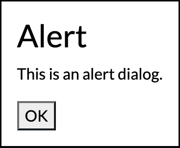
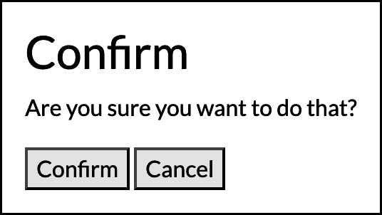
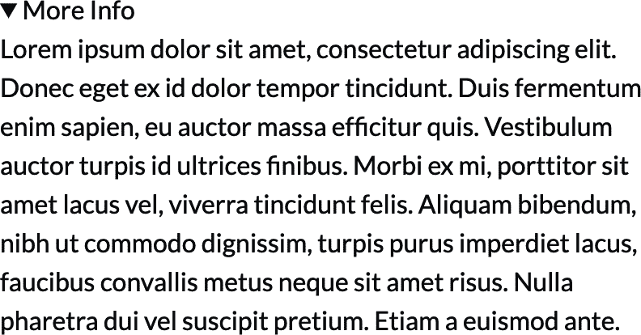
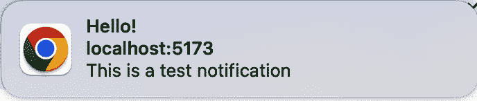

# 第十三章：UI 元素

# 介绍

现代浏览器具有几个强大的内置 UI 元素，您可以在应用程序中使用这些 UI 组件。这些 UI 组件以前需要第三方库（或者您可以自行构建）。

## 对话框

弹出对话框是许多应用程序的重要部分，用于提供反馈和提示输入。有无数的对话框库可供选择，您也可以自己构建。现代浏览器已经为您准备好了`<dialog>`元素。这是一个带有覆盖整个页面背景的弹出对话框。您可以用少量的 CSS 为背景和对话框应用样式。默认情况下，对话框只是一个弹出的框，背景后面是模糊的背景。您可以自行添加标题、按钮和其他内容。

一些对话框包含多个按钮，您希望根据选择的选项运行不同的代码。例如，确认模态框可能有“确认”和“取消”按钮。您还需要自行处理此操作，向按钮添加点击事件侦听器。在每个事件侦听器中，您可以通过调用对话框上的`close`方法来关闭对话框。`close`方法是对话框上的内置方法，它接受一个可选参数，允许您指定一个“返回值”。稍后可以从对话框的`returnValue`属性中检查此返回值。这使您可以从对话框传递数据回到打开它的页面。

## 细节

`<details>` 元素是一个可折叠内容的组件。它有一些摘要内容显示在交互元素中。通过点击该元素，您可以显示或隐藏详细内容。与对话框类似，您可以使用 CSS 样式化组件，并使用 JavaScript 切换其可见性。

## 弹出框

弹出框类似于对话框。这是另一种弹出元素类型。弹出框与对话框之间有一些区别：

+   单击弹出框外部将关闭它。

+   在弹出框可见时，您仍然可以与页面的其余部分进行交互。

+   您可以将任何 HTML 元素转换为弹出框。

## 通知

智能手机广泛使用通知，而较新的操作系统也支持通知。现代浏览器提供了一个 API，用于通过 JavaScript 触发本地操作系统通知。用户必须在发送这些通知之前授予权限。这些通知是在应用程序运行时根据需要在您的 JavaScript 代码中创建的。

# 创建警报对话框

## 问题

您希望显示一个简单消息的对话框，并有一个“确定”按钮来关闭它。

## 解决方案

使用带有“确定”按钮的`<dialog>`元素。

###### 注意

该 API 可能不受较旧浏览器支持。请查看[CanIUse](https://oreil.ly/tk52g)获取最新的兼容性数据。

首先，定义您对话框的 HTML，如示例 13-1 所示。

##### 示例 13-1\. 对话框标记

```
<dialog id="alert">
  <h2>Alert</h2>
  <p>This is an alert dialog.</p>

  <button type="button" id="ok-button">OK</button>
</dialog>

<button type="button" id="show-dialog">Show Dialog</button>
```

你需要两段 JavaScript 代码。首先，你需要一个函数来触发显示对话框，然后你需要一个监听器来监听 OK 按钮以关闭对话框（参见示例 13-2）。

##### 示例 13-2\. 对话框的 JavaScript

```
// Select the dialog, its OK button, and the trigger button elements.
const dialog = document.querySelector('#alert');
const okButton = document.querySelector('#ok-button');
const trigger = document.querySelector('#show-dialog');

// Close the dialog when the OK button is clicked.
okButton.addEventListener('click', () => {
  dialog.close();
});

// Show the dialog when the trigger button is clicked.
trigger.addEventListener('click', () => {
  dialog.showModal();
});
```

这将导致显示在图 13-1 中的对话框。



###### 图 13-1\. 提示对话框

## 讨论

对话框的`showModal`方法显示一个*模态*对话框。模态对话框会阻塞页面的其余部分，直到它关闭。这意味着如果你打开了一个模态对话框，点击页面上的其他元素将不会产生任何效果。在模态对话框中，焦点被“困住”在对话框内部。使用 Tab 键只会在对话框内的可聚焦元素之间循环焦点。如果这不是你想要的效果，你也可以调用`show`方法。这将显示一个*非模态*对话框，允许你在对话框打开时与页面的其余部分交互。

点击 OK 按钮将关闭对话框，因为点击监听器调用了`dialog.close`，但你也可以通过按 Escape 键关闭模态。为了捕获这个操作，你可以监听对话框的`cancel`事件。使用 Escape 键取消对话框也将触发对话框的`close`事件。最后，手动调用`close`来关闭对话框也会触发`close`事件。

`<dialog>`元素还具有一些良好的键盘可访问性功能。当你点击“显示对话框”按钮并且对话框打开时，第一个可聚焦的按钮元素会自动获得焦点。在这种情况下，它是 OK 按钮。你可以通过为你希望在打开对话框时获得初始焦点的元素添加`autofocus`属性来更改此行为。

当你通过按 Escape 键或点击 OK 按钮关闭对话框时，键盘焦点将返回到“显示对话框”按钮。

你可以使用 CSS 样式化对话框本身及其半透明背景。对于对话框，你可以添加一个 CSS 规则来针对`<dialog>`元素本身。要样式化背景——例如，你可能希望它是更不透明的黑色——你可以使用`::backdrop`伪元素（参见示例 13-3）。

##### 示例 13-3\. 设置背景样式

```
#alert::backdrop {
  background: rgba(0, 0, 0, 0.75);
}
```

# 创建确认对话框

## 问题

你希望提示用户确认一个操作。提示应该显示一个问题，并有确认和取消按钮。

## 解决方案

这是另一个很好的使用场景，用于`<dialog>`。首先，使用提示和按钮创建你的对话框内容，如示例 13-4 所示。

##### 示例 13-4\. 确认对话框的标记

```
<dialog id="confirm">
  <h2>Confirm</h2>
  <p>Are you sure you want to do that?</p>

  <button type="button" class="confirm-button">Confirm</button>
  <button type="button" class="cancel-button">Cancel</button>
</dialog>
```

###### 注意

这个 API 可能还不被所有浏览器支持。请参考[CanIUse](https://oreil.ly/tk52g)获取最新的兼容性数据。

您希望两个按钮都关闭对话框，但执行不同的操作。为此，可以向`dialog.close`传递一个字符串参数。这将在对话框本身上设置`returnValue`属性，您可以在接收到`close`事件时检查它（参见示例 13-3）。

##### 示例 13-5\. 确认对话框的事件监听器

```
const dialog = document.querySelector('#confirm');

confirmButton.addEventListener('click', () => {
  // Close the dialog with a return value of 'confirm'
  dialog.close('confirm');
});

cancelButton.addEventListener('click', () => {
  // Close the dialog with a return value of 'cancel'
  dialog.close('cancel');
});

dialog.addEventListener('cancel', () => {
  // Canceling with the Escape key doesn't set a return value.
  // Set it to 'cancel' here so the close event handler will get
  // the proper value.
  dialog.returnValue = 'cancel';
});

dialog.addEventListener('close', () => {
  if (dialog.returnValue === 'confirm') {
    // The user clicked the Confirm button.
    // Perform the action, such as creating or deleting data.
  } else {
    // The user clicked the Cancel button or pressed the Escape key.
    // Don't perform the action.
  }
});
```

生成的确认对话框如图 13-2 所示。



###### 图 13-2\. 确认对话框

## 讨论

如果用户点击其中一个按钮，则将使用取决于所点击按钮的返回值关闭对话框。对话框关闭后，将触发`close`事件，您可以在其中检查`returnValue`属性。如果`returnValue`是`confirm`，则知道用户点击了确认按钮。否则，`returnValue`是`cancel`，您可以取消操作。

此示例还监听`cancel`事件。如果通过按下 Escape 键关闭对话框，则触发此事件。当以这种方式关闭对话框时，对话框的`returnValue`不会更新，并将保留先前的任何值。为了确保`returnValue`正确，`cancel`事件处理程序将其设置。这是因为`close`事件在`cancel`事件之后触发。因为按 Escape 键会触发此事件，所以您实际上不需要监听 Escape 键是否被按下。

为什么需要处理这种情况？如果关闭对话框，它并没有被销毁。它仍然存在于 DOM 中，只是隐藏了，并且仍然设置了相同的`returnValue`。假设您之前打开了对话框，并且点击了确认。现在返回值设置为`confirm`。如果您再次打开确认对话框并通过按 Escape 键取消，则在处理`close`事件时，返回值仍然是`confirm`。为了避免这种潜在的 bug，您可以使用`cancel`事件处理程序将`returnValue`显式设置为`cancel`。

# 创建确认对话框 Web 组件

## 问题

您希望创建一个可定制的确认对话框。显示对话框时，您希望得到一个`Promise`，以便解决返回值，而不是必须监听多个事件。

## 解决方案

将对话框包装在 Web 组件中，使用插槽来显示确认消息。该组件公开一个`showConfirmation`方法，使用一个`Promise`。

###### 注意

目前可能不是所有浏览器都支持此 API。有关最新的兼容性数据，请参见[CanIUse](https://oreil.ly/tk52g)。

与大多数 Web 组件一样，首先定义模板，如示例 13-6 所示。

##### 示例 13-6\. 确认对话框组件的模板

```
const template = document.createElement('template');
template.innerHTML = `
 <dialog id="confirm">
 <h2>Confirm</h2>
 <p><slot></slot></p>

 <button type="button" class="confirm-button">Confirm</button>
 <button type="button" class="cancel-button">Cancel</button>
 </dialog>
`;
```

模板包含一个插槽，将接收组件的子内容。接下来，示例 13-7 展示了组件的实现。

##### 示例 13-7\. 确认组件实现

```
class ConfirmDialog extends HTMLElement {
  connectedCallback() {
    const shadowRoot = this.attachShadow({ mode: 'open' });
    shadowRoot.appendChild(template.content.cloneNode(true));

    this.dialog = shadowRoot.querySelector('dialog');
    this.dialog.addEventListener('cancel', () => {
      this.dialog.returnValue = 'cancel';
    });

    shadowRoot.querySelector('.confirm-button')
      .addEventListener('click', () => {
        this.dialog.close('confirm');
      });

    shadowRoot.querySelector('.cancel-button')
      .addEventListener('click', () => {
        this.dialog.close('cancel');
      });
  }

  showConfirmation() {
    this.dialog.showModal();

    return new Promise(resolve => {
      // Listen for the next close event and resolve the Promise.
      // Resolve the Promise with a boolean indicating whether or not the
      // user confirmed.
      this.dialog.addEventListener('close', () => {
        resolve(this.dialog.returnValue === 'confirm');
      }, {
        // Only listen for the event once, then remove the listener.
        once: true
      });
    });
  }
}

customElements.define('confirm-dialog', ConfirmDialog);
```

假设你想使用此组件来确认删除操作。你可以将元素添加到你的页面，并将确认提示作为子内容（参见 示例 13-8）。

##### 示例 13-8\. 组件标记

```
<confirm-dialog id="confirm-delete">
  Are you sure you want to delete this item?
</confirm-dialog>
```

要显示对话框，选择 DOM 元素并调用它的 `showConfirmation` 方法。等待返回的 `Promise` 以获取返回值（参见 示例 13-9）。

##### 示例 13-9\. 使用确认对话框组件

```
const confirmDialog = document.querySelector('#confirm-delete');
if (await confirmDialog.showConfirmation()) {
  // perform the delete operation
}
```

就像 “创建披露组件” 来自 第十二章 一样，你需要添加一些 CSS 来隐藏子内容，直到它放置在插槽中，以防止对话内容的闪烁（参见 示例 13-10）。

##### 示例 13-10\. 修复闪烁问题

```
confirm-dialog:not(:defined) {
  display: none;
}
```

## 讨论

这是利用 Web 组件封装自定义行为的一个很好的例子。在这种情况下，你还添加了一个可以从外部调用的自定义方法。这个方法显示对话框并抽象了监听多个事件的需求。你只需要显示对话框并等待结果。

# 使用披露元素

## 问题

当你有一些内容想要使用切换按钮显示或隐藏时。

## 解决方案

使用内置的 `<details>` 元素（参见 示例 13-10）。

##### 示例 13-11\. 使用 `details` 元素

```
<details>
  <summary>More Info</summary>
  Here are some extra details that you can toggle.
</details>
```

当详情折叠时，你只会看到更多信息触发按钮，如 图 13-3 所示。


###### 图 13-3\. 折叠的详情元素

当你点击摘要时，详情打开，箭头变化指示内容已展开，如 图 13-4 所示。



###### 图 13-4\. 展开的详情元素

## 讨论

默认情况下，内部内容是隐藏的，你只会看到一个包含 `<summary>` 元素内容的披露元素。在这种情况下，按钮将显示更多信息。当你点击更多信息按钮时，隐藏内容将显示出来。如果再次点击它，内容将再次隐藏。

你可以使用 `open` 属性改变这种默认行为。如果你添加了这个属性，内容将初始可见（参见 示例 13-12）。

##### 示例 13-12\. 使用 `open` 属性控制默认状态

```
<details open>
  <summary>More Info</summary>
  This content is visible by default.
</details>
```

最后，你还可以使用 JavaScript 切换内容。你可以直接改变元素的 `open` 属性的值，就像 示例 13-13 中展示的那样。

##### 示例 13-13\. 使用 JavaScript 切换可见性

```
// Show the content
document.querySelector('details').open = true;
```

大多数浏览器对该元素有良好的辅助功能支持，识别触发元素给屏幕阅读器，并指示其展开或折叠状态。

# 显示弹出窗口

## 问题

你想通过点击按钮显示弹出内容，但仍允许用户与页面的其余部分交互。

## 解决方案

给元素添加 `popover` 属性，并在触发按钮上添加 `popovertarget` 属性（参见 示例 13-14）。

##### 示例 13-14\. 自动连接弹出框

```
<button type="button" popovertarget="greeting">Open Popover</button>
<div popover id="greeting">Hello world!</div>
```

###### 注意

此 API 可能尚未被所有浏览器支持。请参见 [CanIUse](https://oreil.ly/YFjQX) 获取最新的兼容性数据。

## 讨论

弹出框与对话框在几个方面有所不同：

+   您可以在没有任何 JavaScript 的情况下打开它。

+   与对话框不同，弹出框没有背景。

+   与对话框不同，您在显示弹出框时不会被阻止与底层页面的交互。

+   单击弹出框外部将关闭它。

要将元素变成弹出框，请给它添加 `popover` 属性。弹出框元素还需要一个 `id` 属性。为了将触发按钮链接到弹出框，该按钮被赋予一个 `popovertarget` 属性。此属性的值应与弹出框的 `id` 对应。

弹出框 API 当前的一个缺点是没有机制可以将弹出框相对于其触发器定位。默认情况下，弹出框始终出现在屏幕中心。如果您想更改其位置，则需要手动使用 CSS 进行调整。

将来，您将能够使用 CSS 锚点定位来将弹出框相对于其触发器定位。与此同时，还有第三方库，如 Floating UI，您可以使用它来增强此解决方案以定位元素。

# 手动控制弹出框

## 问题

您希望使用 `popover` 属性，但希望使用 JavaScript 以编程方式控制何时显示和隐藏弹出框。

## 解决方案

将 `popover` 属性设置为 `manual` 并调用其 `showPopover`、`hidePopover` 或 `togglePopover` 方法（参见 示例 13-15）。

##### 示例 13-15\. 弹出框和触发器标记

```
<button type="button" id="trigger">Show Popover</button>
<div id="greeting" popover="manual">Hello World!</div>
```

###### 注意

此 API 可能尚未被所有浏览器支持。请参见 [CanIUse](https://oreil.ly/YFjQX) 获取最新的兼容性数据。

`popover="manual"` 属性告诉浏览器弹出框将由手动控制（参见 示例 13-16）。要显示弹出框，请选择弹出框元素并调用其 `togglePopover` 方法。这将在弹出框隐藏时显示它，并在显示时隐藏弹出框。

##### 示例 13-16\. 切换按钮代码

```
const trigger = document.querySelector('#trigger');
const popover = document.querySelector('#greeting');
trigger.addEventListener('click', () => {
  popover.togglePopover();
});
```

## 讨论

如果您想手动控制弹出框的可见性，请确保将 `popover` 属性设置为 `manual`。当弹出框元素设置为手动控制时，单击弹出框外部将 *不* 关闭它。要关闭弹出框，您需要调用其 `hidePopover` 或 `togglePopover` 方法之一。

# 将弹出框相对于一个元素进行定位

## 问题

您想显示一个弹出框，但不希望它出现在屏幕中间。您希望将其相对于另一个元素定位，例如触发它的按钮。

## 解决方案

计算元素的边界矩形，然后相应调整弹出窗口的位置。此示例将覆盖将工具提示定位在元素正下方的情况。

###### 注意

这个 API 可能尚未被所有浏览器支持。参见[CanIUse](https://oreil.ly/YFjQX)获取最新的兼容性数据。

首先，您需要对弹出窗口元素应用一些样式，如示例 13-17 所示。

##### 示例 13-17\. 弹出窗口样式

```
.popover {
  margin: 0;
  margin-top: 1em;
  position: absolute;
}
```

默认情况下，浏览器使用边距来将弹出窗口居中显示在视口内。要相对于另一个元素定位弹出窗口，您需要移除此边距。由于您将工具提示定位在其他元素的下方，因此可以设置`margin-top`以在元素和弹出窗口之间留出一小段空间。最后，为了使弹出窗口随元素滚动，您需要设置`position: fixed`。

接下来，您可以在触发器上使用`popovertarget`属性，以便在单击时自动显示弹出窗口（参见示例 13-18）。

##### 示例 13-18\. 弹出窗口和触发器标记

```
<button type="button" class="trigger" popovertarget="popover">Show Popover</button>
<div class="popover" popover>
  This is popover content anchored to the trigger button.
</div>
```

最后一步是在弹出窗口显示时更新其位置。您可以侦听弹出窗口元素的`toggle`事件，该事件在弹出窗口显示或隐藏时触发。处理此事件时，可以计算触发器元素的位置，并用其来更新弹出窗口的位置（参见示例 13-19）。

##### 示例 13-19\. 设置弹出窗口的位置

```
const popover = document.querySelector('.popover');
const trigger = document.querySelector('.trigger');

popover.addEventListener('toggle', event => {
  // Update the position if the popover is being opened.
  if (event.newState === 'open') {
    // Find the position of the trigger element.
    const triggerRect = trigger.getBoundingClientRect();

    // Since the popover is positioned relative to the viewport,
    // you need to account for the scroll offset.
    popover.style.top = `${triggerRect.bottom + window.scrollY}px`;
    popover.style.left = `${triggerRect.left}px`;
  }
});
```

## 讨论

如果您熟悉 CSS 定位，可能会对此处`position: absolute`的行为感到有些困惑。通常情况下，`position: absolute`会将元素相对于其最近的已定位祖先元素定位。但在这种情况下，弹出窗口始终相对于视口定位。

这是因为弹出窗口位于浏览器的*顶层*内。这是一个特殊的层，位于文档中所有其他层的顶部。无论您的弹出窗口元素在 DOM 中的位置如何，弹出窗口内容都放置在顶层中。由于它位于这个特殊的顶层中，`position: absolute`将使元素相对于视口定位。

弹出窗口的位置是通过调用触发器元素上的`getBoundingClientRect`计算的。随着页面滚动，此矩形的顶部和底部位置将发生变化。为了确保弹出窗口正确地位于触发器下方，还需在计算中包括`window.scrollY`。

有一些限制需要注意。首先，如果触发器元素位于文档底部，则可能没有足够的空间在元素下方显示弹出窗口。您可以检查这一点，并在空间不足时将弹出窗口定位*在*触发器上方。

另一件你可能想要处理的事情是，如果在弹出窗口可见时调整窗口大小，则位置可能不会正确更新。你可以使用 `ResizeObserver` 或窗口的 `resize` 事件来处理这种情况。

# 显示工具提示

## 问题

当你希望在悬停或焦点在一个元素上时显示工具提示。

## 解决方案

使用手动控制的弹出窗口，在相应的鼠标事件中显示和隐藏它。这将使用与 “相对于元素定位弹出窗口的位置” 相同的定位方法，因此首先需要为弹出窗口定义自定义样式（参见 示例 13-20）。

##### 示例 13-20。工具提示样式

```
#tooltip {
  margin: 0;
  margin-top: 1em;
  position: absolute;
}
```

###### 注意

这个 API 可能还不被所有浏览器支持。查看 [CanIUse](https://oreil.ly/YFjQX) 获取最新的兼容性数据。

将工具提示实现为一个带有 `popover` 属性设置为 `manual` 的弹出窗口，如 示例 13-21 所示。

##### 示例 13-21。工具提示标记

```
<button type="button" id="trigger">Hover Me</button>
<div id="tooltip" popover="manual" role="tooltip">Here is some tooltip content</div>
```

当鼠标悬停在触发器上时，计算位置并在 `mouseover` 事件上显示弹出窗口元素。在 `mouseout` 事件上隐藏弹出窗口元素（参见 示例 13-22）。

##### 示例 13-22。显示和隐藏工具提示

```
const button = document.querySelector('#trigger');
const tooltip = document.querySelector('#tooltip');

function showTooltip() {
  // Find the position of the trigger element.
  const triggerRect = trigger.getBoundingClientRect();

  // Since the popover is positioned relative to the viewport,
  // you need to account for the scroll offset.
  tooltip.style.top = `${triggerRect.bottom + window.scrollY}px`;
  tooltip.style.left = `${triggerRect.left}px`;

  tooltip.showPopover();
}

// Show and hide the tooltip in response to mouse events.
button.addEventListener('mouseover', () => {
  showTooltip();
});

button.addEventListener('mouseout', () => {
  tooltip.hidePopover();
});

// For keyboard accessibility, also show and hide the tooltip
// in response to focus events.
button.addEventListener('focus', () => {
  showTooltip();
});

button.addEventListener('blur', () => {
  tooltip.hidePopover();
});
```

## 讨论

由于这使用与 “相对于元素定位弹出窗口的位置” 相同的定位技术，因此它具有相同的限制：

+   它没有考虑到如果下方没有足够的空间来显示工具提示的情况。

+   它没有考虑调整窗口大小的情况。

# 显示通知

## 问题

当应用程序中发生某些事件时，你希望通知用户。

## 解决方案

使用 `Notification` 对象来显示原生操作系统通知。

要显示通知，必须首先请求用户的权限。这可以通过 `Notification.requestPermission` 方法来实现。要检查用户是否已经给予了权限，可以检查 `Notification.permission` 属性。

示例 13-23 展示了一个检查权限的辅助函数，如果需要的话会请求用户的权限，并返回一个布尔值，指示是否可以显示通知。

##### 示例 13-23。检查通知权限

```
async function getPermission() {
  // If the user has already explicitly denied permission, don't ask again.
  if (Notification.permission !== 'denied') {
    // The result of this permission request will update the Notification.permission
    // property.
    // The permission request returns a Promise.
    await Notification.requestPermission();
  }

  // Only show a notification if Notification.permission is 'granted'.
  return Notification.permission === 'granted';
}
```

一旦检查了权限，你可以通过创建一个新的 `Notification` 实例来发送新通知。使用 `getPermission` 辅助函数来确定是否应该显示通知（参见 示例 13-24）。

##### 示例 13-24。显示通知

```
if (await getPermission()) {
  new Notification('Hello!', {
    body: 'This is a test notification'
  });
}
```

如果尝试在未获得权限的情况下显示通知，则 `Notification` 对象将触发一个 `error` 事件。

图 13-5 展示了桌面电脑上此通知可能的样子。



###### 第 13-5 图。在 macOS 14 上渲染的通知

## 讨论

通知只能从运行在*安全上下文*中的应用程序中显示。通常，这意味着它必须通过 HTTPS 或者 `localhost` URL 提供。

`Notification.permission` 属性有三个可能的值之一：

`granted`

用户已明确授予显示通知的权限。

`denied`

用户明确拒绝在提示时显示通知。

`default`

用户未响应通知权限请求。浏览器将其视为与 `denied` 情况相同。

一个 `Notification` 也可以触发其他一些事件：

`show`

在通知显示时触发

`close`

在通知关闭时触发

`click`

在通知被点击时触发
