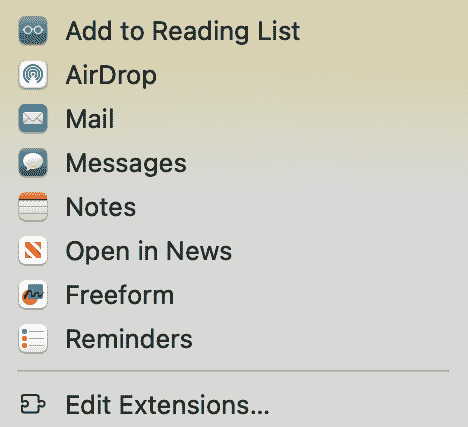
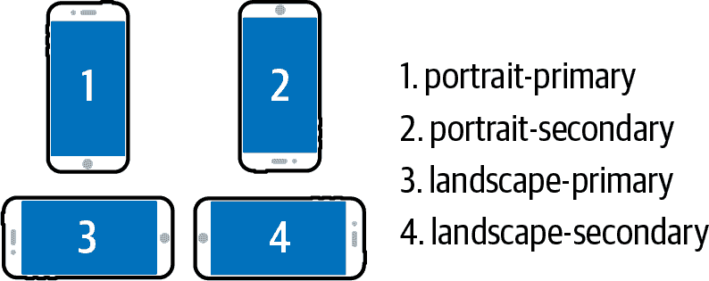

# 第十四章：设备集成

# 介绍

现代网络浏览器平台包括与各种设备信息和功能进行交互的 API，包括：

+   电池状态

+   网络状态

+   地理位置

+   设备剪贴板

+   分享内容

+   触觉反馈

在撰写本文时，某些 API 还没有得到良好支持。有些仍被视为实验性质，因此您不应立即在生产应用中使用它们。

某些浏览器可能支持这些 API，如 Chrome，但如果设备缺少所需的功能，则仍无法使用。例如，振动 API 在 Chrome 上得到了很好的支持，但在没有振动支持的笔记本电脑或其他设备上无法工作。

# 读取电池状态

## 问题

您希望在应用程序中显示设备的电池充电状态。

## 解决方案

使用电池状态 API。

###### 注意

一些浏览器可能尚未支持此 API。请查看 [CanIUse](https://oreil.ly/DWFvk) 获取最新的兼容性数据。

您可以通过调用`navigator.getBattery`来查询电池状态 API。此方法返回一个`Promise`，解析为包含电池信息的对象。

首先，编写一些 HTML 占位元素来保存电池状态，如 示例 14-1 所示。

##### 示例 14-1\. 电池状态标记

```
<ul>
  <li>Battery charge level:<span id="battery-level">--</span></li>
  <li>Battery charge status:<span id="battery-charging">--</span></li>
</ul>
```

然后，您可以查询电池状态 API 来获取电池充电水平和充电状态，并将它们添加到相应的 DOM 元素中（参见 示例 14-2）。

##### 示例 14-2\. 查询电池状态 API

```
const batteryLevelItem = document.querySelector('#battery-level');
const batteryChargingItem = document.querySelector('#battery-charging');

navigator.getBattery().then(battery => {
  // Battery level is a number between 0 and 1\. Multiply by 100 to convert it to
  // a percentage.
  batteryLevelItem.textContent = `${battery.level * 100}%`;

  batteryChargingItem.textContent = battery.charging ? 'Charging' : 'Not charging';
});
```

如果您拔掉笔记本电脑的电源，显示的充电状态将不再准确。为处理这种情况，您可以监听一些事件：

`levelchange`

当电池充电水平发生变化时触发

`chargingchange`

当电池开始充电或停止充电时触发

当这些事件发生时，您可以更新 UI。确保您有对`battery`对象的引用，然后添加事件侦听器（参见示例 14-3）。

##### 示例 14-3\. 监听电池事件

```
battery.addEventListener('levelchange', () => {
  batteryLevelItem.textContent = `${battery.level * 100}%`;
});

battery.addEventListener('chargingchange', () => {
  batteryChargingItem.textContent = battery.charging ? 'Charging' : 'Not charging';
});
```

现在您的电池状态保持更新。如果您拔掉笔记本电脑，充电状态将从“正在充电”变为“未充电”。

## 讨论

在撰写本文时，一些浏览器根本不支持此 API。您可以使用 示例 14-4 中的代码来检查用户浏览器上是否支持电池状态 API。

##### 示例 14-4\. 检查电池状态 API 支持

```
if ('getBattery' in navigator) {
  // request the battery status here
} else {
  // it's not supported
}
```

`battery`对象还有一些其他可用的属性。这些包括：

`chargingTime`

如果电池正在充电，直到电池完全充满还剩余的秒数。如果电池未充电，则该值为`Infinity`。

`dischargingTime`

如果电池未充电，直到电池完全放电还剩余的秒数。如果电池未放电，则该值为`Infinity`。

这两个属性还有它们自己的`change`事件，您可以监听`chargingtimechange`和`dischargingtimechange`。

电池状态 API 提供的信息可以做很多事情。例如，如果电池电量低，您可以禁用后台任务或其他高耗电操作。或者，甚至可以简单地提醒用户应该保存他们的更改，因为设备的电池电量低。

您还可以使用它来显示简单的电池状态指示器。如果您有一系列代表不同电池状态的图标（充满电、未充电、充电中、低电量），您可以通过监听变更事件来保持显示的图标更新。

# 阅读网络状态

## 问题

您想知道用户的网络连接速度有多快。

## 解决方案

使用网络信息 API 获取有关用户网络连接的数据（参见 示例 14-5）。

##### 示例 14-5\. 检查网络能力

```
if (navigator.connection.effectiveType === '4g') {
  // User can perform high-bandwidth activities.
}
```

###### 注意

此 API 可能尚未由所有浏览器支持。请查看 [CanIUse](https://oreil.ly/krDAV) 获取最新的兼容性数据。

## 讨论

网络信息包含在 `navigator.connection` 对象中。要获取网络连接能力的近似值，可以检查 `navigator.connection.effectiveType` 属性。目前根据下载速度，`navigator.connection.effectiveType` 可能的取值包括：

+   `slow-2g`: 最高 50 Kbps

+   `2g`: 最高 70 Kbps

+   `3g`: 最高 700 Kbps

+   `4g`: 700 Kbps 及以上

这些数值是基于真实用户数据的测量结果计算的。规范说明这些数值可能会在未来更新。您可以使用这些数值来大致确定设备的网络能力。例如，`effectiveType` 为 `slow-2g` 的设备可能无法处理像高清视频流等高带宽活动。

如果页面打开时网络连接发生变化，`navigator.connection` 对象可以触发 `change` 事件。您可以监听此事件，并根据接收到的新网络连接信息调整您的应用程序。

# 获取设备位置

## 问题

您想获取设备的位置。

## 解决方案

使用地理位置 API 获取纬度和经度。地理位置 API 提供了 `navigator.geolocation` 对象，该对象用于使用 `getCurrentPosition` 方法请求用户的位置。这是一个基于回调的 API。`getCurrentPosition` 接受两个参数。第一个参数是成功的回调函数，第二个是错误回调（参见 示例 14-6）。

##### 示例 14-6\. 请求设备位置

```
navigator.geolocation.getCurrentPosition(position => {
  console.log('Latitude: ' + position.coords.latitude);
  console.log('Longitude: ' + position.coords.longitude);
}, error => {
  // Either the user denied permission, or the device location could not
  // be determined.
  console.log(error);
});
```

此 API 需要用户授权。第一次调用 `getCurrentPosition` 时，浏览器会询问用户是否允许共享其位置。如果用户未授权，则地理位置请求失败，并调用错误回调。

如果您希望事先检查权限，以避免捕获错误，则可以使用权限 API 检查其状态（参见示例 14-7）。

##### 示例 14-7\. 检查地理位置权限

```
const permission = await navigator.permissions.query({
  name: 'geolocation'
});
```

返回的权限对象具有`state`属性，可以具有`granted`、`denied`或`prompt`之一的值。如果状态为`denied`，则表示用户已经被提示过并拒绝了，因此您不应再尝试获取其位置，因为这将失败。

## 讨论

浏览器可以尝试几种方式来检测用户的位置。它可以尝试使用设备的 GPS，或者可能使用关于用户 WiFi 连接或 IP 地址的信息。在某些情况下，例如用户使用 VPN 时，基于 IP 的地理位置可能无法返回用户设备的正确位置。

地理位置 API 在浏览器支持方面非常好，因此除非您针对旧版浏览器，否则不需要检查功能支持。

除了坐标之外，`position`对象还包含一些其他可能不适用于所有设备的有趣信息：

`altitude`

设备相对海平面的高度，以米为单位

`heading`

设备的罗盘方位，以度数表示

`speed`

如果设备正在移动，则其速度以每秒米数显示。

您还可以通过调用`navigator.geolocation.watchCurrentPosition`来监视设备位置的更改。当位置发生变化时，浏览器定期调用您传递给此方法的回调函数，提供更新后的坐标。

# 在地图上显示设备位置

## 问题

您想要显示设备位置的地图。

## 解决方案

使用像 Google Maps API 或 OpenStreetMaps 这样的服务生成地图，从地理位置 API 传递纬度和经度坐标。

###### 注意

对于此示例，您需要注册一个 Google Maps API 密钥。您可以在[Google 开发者网站上](https://oreil.ly/9Uujk)找到注册 API 密钥的说明。

此示例显示了如何使用 Google Maps 嵌入 API 嵌入地图。您可以通过嵌入一个带有特别设计 URL 的`iframe`元素来使用 Google Maps 嵌入 API。URL 必须包含：

+   地图类型（本示例中，您需要一个`place`地图）

+   您的 API 密钥

+   地理位置坐标

请求设备位置，并在成功回调中创建`iframe`并将其添加到文档中（参见示例 14-8）。

##### 示例 14-8\. 创建地图 iframe

```
// Assuming you have a placeholder element in the page with the ID 'map'
const map = document.querySelector('#map');

navigator.geolocation.getCurrentPosition(position => {
  const { latitude, longitude } = position.coords;

  // Adjust the iframe size as desired.
  const iframe = document.createElement('iframe');
  iframe.width = 450;
  iframe.height = 250;

  // The map type is part of the URL path.
  const url = new URL('https://www.google.com/maps/embed/v1/place');

  // The 'key' parameter contains your API key.
  url.searchParams.append('key', 'YOUR_GOOGLE_MAPS_API_KEY');

  // The 'q' parameter contains the latitude and longitude coordinates
  // separated by a comma.
  url.searchParams.append('q', `${latitude},${longitude}`);
  iframe.src = url;

  map.appendChild(iframe);
});
```

## 讨论

参见[此 Google 文章](https://oreil.ly/WhO-r)以了解如何正确保护 Google Maps API 密钥。

一旦获取了设备的位置信息，您可以使用许多可能的地图集成之一。Google Maps 有其他类型的 API，还有像 Mapbox 或 OpenStreetMap 这样的其他服务。您还可以集成地理编码 API 以显示带有实际地址的地图标记。

# 复制和粘贴文本

## 问题

在文本区域内，您希望添加复制和粘贴功能。用户应能够突出显示某些文本并复制它，粘贴时应替换所选的任何文本。

## 解决方案

使用 Clipboard API 与文本区域中选择的文本交互。您可以在 UI 中添加复制和粘贴按钮，调用 Clipboard API 中相应的功能。

###### 注意

此 API 可能尚未被所有浏览器完全支持。请查看[CanIUse](https://oreil.ly/4i7sm)以获取最新的兼容性数据。

要复制文本，获取选择的起始和结束索引，然后从文本区域的值中取该子字符串。然后，将该文本写入系统剪贴板（参见示例 14-9）。

##### 示例 14-9\. 从选择中复制文本

```
async function copySelection(textarea) {
  const { selectionStart, selectionEnd } = textarea;
  const selectedText = textarea.value.slice(selectionStart, selectionEnd);

  try {
    await navigator.clipboard.writeText(selectedText);
  } catch (error) {
    console.error('Clipboard error:', error);
  }
}
```

粘贴类似，但还有一个额外的步骤。如果文本区域内选择了文本，则需要删除所选的文本并从剪贴板中插入新的文本（参见示例 14-10）。Clipboard API 是异步的，因此您需要等待一个`Promise`来接收系统剪贴板中的值。

##### 示例 14-10\. 在选择中粘贴文本

```
async function pasteToSelection(textarea) {
  const currentValue = textarea.value;
  const { selectionStart, selectionEnd } = textarea;

  try {
    const clipboardValue = await navigator.clipboard.readText();
    const newValue = currentValue.slice(0, selectionStart)
    + clipboardValue + currentValue.slice(selectionEnd);
    textarea.value = newValue;
  } catch (error) {
    console.error('Clipboard error:', error);
  }
}
```

这将用剪贴板的文本替换当前选定的文本。

## 讨论

请注意，即使您没有处理`navigator.clipboard.writeText`的返回值，仍然需要等待`Promise`。这是因为您需要处理`Promise`被拒绝的情况。

另外，在粘贴时，还有另外两种情况需要注意：

+   如果没有选择文本但文本区域有焦点，则文本将粘贴在光标位置。

+   如果文本区域失去焦点，则文本将粘贴到文本区域值的末尾。

正如您可能预期的那样，通过程序从系统剪贴板读取文本可能会引起隐私问题。因此，它需要用户的许可。当您首次尝试从剪贴板读取时，浏览器会询问用户是否允许。如果他们允许，剪贴板操作完成。如果他们拒绝权限，则 Clipboard API 返回的`Promise`将被拒绝并显示错误。

如果您想避免权限错误，可以使用权限 API 来检查用户是否已授予从系统剪贴板读取的权限（参见示例 14-11）。

##### 示例 14-11\. 检查剪贴板读取权限

```
const permission = await navigator.permissions.query({
  name: 'clipboard-read'
});

if (permission.state !== 'denied') {
  // Continue with the clipboard read operation.
}
```

`permission.state`的三个可能值是：

`granted`

用户已明确授予权限。

`denied`

用户已明确拒绝了权限。

`prompt`

用户尚未被请求授权。

如果`permission.state`的值为`prompt`，则浏览器将在您首次尝试执行剪贴板读取操作时自动提示用户。

# 使用 Web Share API 分享内容

## 问题

您希望为用户提供一种使用其设备的原生分享功能来轻松分享链接的方法。

## 解决方案

使用 Web Share API 来分享内容。

###### 注意

此 API 可能尚未被所有浏览器支持。请参阅 [CanIUse](https://oreil.ly/1IwEq) 获取最新的兼容性数据。

调用 `navigator.share` 并传递包含标题和 URL 的对象（参见 示例 14-12）。在支持的设备和浏览器上，这将弹出一个熟悉的共享界面，允许用户以各种方式共享链接。

##### 示例 14-12\. 共享链接

```
if ('share' in navigator) {
  navigator.share({
    title: 'Web API Cookbook',
    text: 'Check out this awesome site!',
    url: 'https://browserapis.dev'
  });
}
```

从这里，用户可以创建包含内容链接的文本消息、电子邮件或其他通信。

## 讨论

设备和操作系统不同，共享界面看起来也不同。例如，图 14-1 是我在运行 macOS 14 的电脑上的共享界面的截图。



###### 图 14-1\. macOS 14 上的共享界面

# 使设备振动

## 问题

您想要在应用中添加一些触觉反馈，使用户设备振动。

## 解决方案

使用振动 API 来对设备进行编程振动。

###### 注意

此 API 可能尚未被所有浏览器支持。请参阅 [CanIUse](https://oreil.ly/G0d6m) 获取最新的兼容性数据。

要执行单次振动，可以调用 `navigator.vibrate` 并传递一个整数参数（振动的持续时间），如 示例 14-13 所示。

##### 示例 14-13\. 触发单次振动

```
// A single vibration for 500ms
navigator.vibrate(500);
```

您还可以通过将数组传递给 `navigator.vibrate` 来触发一系列的振动（见 示例 14-14）。数组的元素被解释为一系列振动和暂停。

##### 示例 14-14\. 连续振动三次

```
// Vibrate for 500ms three times, with a 250ms pause in between
navigator.vibrate([500, 250, 500, 250, 500]);
```

## 讨论

此 API 在某些不支持振动的设备上也可用，例如 MacBook Pro 上的 Chrome。对于这些设备，调用 `navigator.vibrate` 没有效果，但也不会报错。

如果正在运行一系列的振动，可以调用 `navigator.vibrate(0)` 来取消任何正在进行的振动。

与自动播放视频一样，在页面加载时不能自动触发振动。用户必须在页面上进行某种交互，然后才能进行振动。

# 获取设备方向

## 问题

您想要确定设备是处于竖直还是水平方向。

## 解决方案

使用 `screen.orientation.type` 属性来获取设备的方向，或者使用 `screen.orientation.angle` 属性来获取设备相对于其自然方向的角度。

## 讨论

`screen.orientation.type` 可能有四个值之一，具体取决于设备及其方向（见 图 14-2）：

+   `portrait-primary`: 0 度（自然设备位置）

+   `portrait-secondary`: 180 度

+   `landscape-primary`: 90 度

+   `landscape-secondary`: 270 度



###### 图 14-2\. 不同的方向值

前述数值适用于像手机这样自然方向为纵向的设备。对于其他自然方向为横向（如某些平板电脑）的设备，数值则相反：

+   `landscape-primary`: 0 度（设备的自然位置）

+   `landscape-secondary`: 180 度

+   `portrait-primary`: 90 度

+   `portrait-secondary`: 270 度

`screen.orientation` 对象还具有 `change` 事件，您可以监听该事件以获取设备方向变化的通知。
