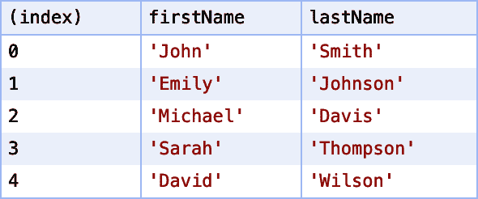

# 第十六章：使用控制台

# 简介

尽管您的意图良好，但您的代码可能出现问题。有几种调试工具可供使用。今天的浏览器内置了强大的调试器，可让您逐步执行代码并检查变量和表达式的值。但有时，您可能希望保持简单并使用控制台。

最基本的形式是通过调用`console.log`与消息进行交互。此消息将打印到浏览器的 JavaScript 控制台。虽然比基于断点的调试更冗长，但有时仍然可以在运行时记录和检查值。

除了简单的`console.log`外，您还可以执行其他操作，如分组消息、使用计数器、显示表格，甚至使用 CSS 样式化输出。还有其他日志级别（错误、警告、调试）可供分类和筛选控制台消息使用。

# 样式化控制台输出

## 问题

您希望对控制台日志输出应用一些 CSS 样式。例如，也许您想要增加字体大小并改变颜色。

## 解决方案

在您的日志消息中使用`%c` *指令*来指示您想要样式化的文本。对于每个`%c`的使用，都要在`console.log`中添加另一个参数，其中包含 CSS 样式（参见示例 16-1）。

##### 示例 16-1\. 样式化控制台输出

```
console.log('%cHello world!', 'font-size: 2rem; color: red;');
console.log('This console message uses %cstyled text. %cCool!',
  'font-style: italic;',
  'font-weight: bold;'
);
```

图 16-1 展示了控制台中样式文本的效果。


###### 图 16-1\. 样式化的控制台输出

## 讨论

`console.log`接受可变数量的参数。对于每个`%c`指令的使用，应有相应的额外参数，其中包含要应用于该文本部分的样式。

注意在图 16-1 中，每个`%c`部分之间的样式会被重置。第一部分的斜体字体不会延续到第二部分的粗体字体中。

# 使用日志级别

## 问题

您希望在控制台中区分信息、警告和错误消息。

## 解决方案

分别使用`console.info`，`console.warn`和`console.error`代替`console.log`（参见示例 16-2）。这些消息的样式不同，并且大多数浏览器允许您按其级别筛选日志消息。

##### 示例 16-2\. 使用不同的日志级别

```
console.info('This is an info message');
console.warn('This is a warning message');
console.error('This is an error message');
```

消息显示不同的样式和图标，如图 16-2 所示。


###### 图 16-2\. 不同的日志级别（在 Chrome 中显示）

## 讨论

警告和错误消息还会显示可以展开并在控制台中查看的堆栈跟踪。这使得跟踪错误发生的位置变得更加容易。

# 创建命名记录器

## 问题

您希望以给定颜色的模块名称为前缀记录来自应用程序不同模块的消息。

## 解决方案

在`console.log`函数上使用`Function.prototype.bind`，绑定模块名前缀和颜色样式（参见示例 16-3）。

##### 示例 16-3\. 创建一个命名的日志记录器

```
function createLogger(name, color) {
  return console.log.bind(console, `%c${name}`, `color: ${color};`);
}
```

`createLogger`函数返回一个新的日志函数，你可以像调用`console.log`一样调用它，但消息有一个彩色前缀（参见示例 16-4）。

##### 示例 16-4\. 使用命名的日志记录器

```
const rendererLogger = createLogger('renderer', 'blue');
const dataLogger = createLogger('data', 'green');

// Outputs with a blue "renderer" prefix
rendererLogger('Rendering component');

// Outputs with a green "data" prefix
dataLogger('Fetching data');
```

这会按照彩色前缀渲染日志消息，如图 16-3 所示。


###### 图 16-3\. 彩色日志记录器（在 Chrome 中显示）

## 讨论

以这种方式调用`bind`会创建`console.log`函数的*部分应用*版本，它会自动添加前缀和颜色。你传递给它的任何其他参数都会在前缀和颜色样式之后添加。

# 在表格中显示对象数组

## 问题

你有一个对象数组，想要以易读的方式记录它们。

## 解决方案

将数组传递给`console.table`，它会显示一个表格。每个对象属性对应一列，数组中每个对象对应一行（参见示例 16-5）。

##### 示例 16-5\. 记录表格

```
const users = [
  { firstName: "John", lastName: "Smith", department: "Sales" },
  { firstName: "Emily", lastName: "Johnson", department: "Marketing" },
  { firstName: "Michael", lastName: "Davis", department: "Human Resources" },
  { firstName: "Sarah", lastName: "Thompson", department: "Finance" },
  { firstName: "David", lastName: "Wilson", department: "Engineering" }
];

console.table(users);
```

图 16-4 展示了数据以表格形式记录的方式。


###### 图 16-4\. 日志记录的表格（在 Chrome 中显示）

## 讨论

通过向`console.table`传递第二个参数，可以限制显示的对象属性。这个参数是一个属性名的数组。如果提供了这个参数，则只会显示这些属性在表格输出中。

`console.table`也可以与对象一起使用。在示例 16-6 中，`index`列包含属性名而不是数组索引。

##### 示例 16-6\. 向`console.table`传递一个对象

```
console.table({
  name: 'sysadmin',
  email: 'admin@example.com'
});
```

示例 16-6 生成了图 16-5 中的表格。


###### 图 16-5\. 记录的表格（在 Chrome 中显示）

示例 16-7 将用户记录在表格中，但只显示 firstName 和 lastName 列（参见图 16-6）。

##### 示例 16-7\. 限制表格列

```
const users = [
  { firstName: "John", lastName: "Smith", department: "Sales" },
  { firstName: "Emily", lastName: "Johnson", department: "Marketing" },
  { firstName: "Michael", lastName: "Davis", department: "Human Resources" },
  { firstName: "Sarah", lastName: "Thompson", department: "Finance" },
  { firstName: "David", lastName: "Wilson", department: "Engineering" }
];

console.table(users, ['firstName', 'lastName']);
```



###### 图 16-6\. 仅显示名字和姓氏列（在 Chrome 中显示）

渲染的表格也是可排序的。你可以点击列名以按该列排序表格（参见图 16-7）。


###### 图 16-7\. 按姓氏排序表格（在 Chrome 中显示）

# 使用控制台计时器

## 问题

你想要计算某段代码的执行时间，用于调试目的。

## 解决方案

使用`console.time`和`console.timeEnd`方法（参见示例 16-8）。

##### 示例 16-8\. 使用`console.time`和`console.timeEnd`

```
// Start the' loadTransactions' timer.
console.time('loadTransactions');

// Load some data.
const data = await fetch('/api/users/123/transactions');

// Stop the 'loadTransactions' timer.
// Prints: "loadTransactions: <elapsed time> ms"
console.timeEnd('loadTransactions');
```

当你使用`console.time`并指定一个计时器名称时，它会启动命名的计时器。进行要进行性能分析的工作，完成后，使用相同的计时器名称调用`console.timeEnd`。消耗的时间和计时器名称将被打印到控制台上。

如果使用一个不存在的计时器名称调用 `console.timeEnd`，不会抛出错误，但会在控制台上记录一个警告消息，指示计时器不存在。

## 讨论

这与在 第十五章 中描述的 `window.performance.mark` 和 `window.perfor⁠mance​.measure` 不同。`console.time` 通常在调试期间用于临时计时。显著的区别在于，`console.time` 和 `console.timeEnd` 不会向性能时间线添加条目。一旦为给定计时器调用了 `console.timeEnd`，该计时器就会被销毁。如果需要在内存中持久保存计时数据，你可能会想使用性能 API。

# 使用控制台分组

## 问题

想要更好地组织日志消息的组。

## 解决方案

使用 `console.group` 创建可以展开和折叠的嵌套消息组（参见 示例 16-9）。

##### 示例 16-9\. 使用控制台分组

```
const users = [
  { id: 1, firstName: "John", lastName: "Smith", department: "Sales" },
  { id: 2, firstName: "Emily", lastName: "Johnson", department: "Marketing" },
  { id: 3, firstName: "Michael", lastName: "Davis", department: "Human Resources" },
  { id: 4, firstName: "Sarah", lastName: "Thompson", department: "Finance" },
  { id: 5, firstName: "David", lastName: "Wilson", department: "Engineering" }
];

console.log('Updating user data');
for (const user of users) {
  console.group(`User: ${user.firstName} ${user.lastName}`);
  console.log('Loading employee data from API');
  const response = await fetch(`/api/users/${user.id}`);
  const userData = await response.json();

  console.log('Updating profile');
  userData.lastUpdated = Date.now();

  console.log('Saving user data');
  await fetch(`/api/users/${user.id}`, {
    method: 'POST',
    body: JSON.stringify(userData),
    headers: {
      'Content-Type': 'application/json'
    }
  });
  console.groupEnd();
}
```

这将在控制台中打印分组消息。你可以展开和折叠这些组，以便专注于你感兴趣的特定组，就像 图 16-8 中所示。


###### 图 16-8\. 分组的控制台消息（在 Chrome 中显示）

## 讨论

你也可以使用控制台分组来追踪复杂算法。分组可以嵌套多层，这样在复杂计算过程中跟踪日志消息会更加轻松。当需要默认折叠一个组时，可以使用 `console.groupCollapsed` 而不是 `console.group`。

# 使用计数器

## 问题

想要统计你的代码中某部分被调用的次数。

## 解决方案

使用一个在你的代码中唯一的计数器名称调用 `console.count`。每次执行 `console.count` 语句时，它都会打印并递增计数器的值。这样你可以跟踪 `console.count` 被调用的次数。

##### 示例 16-10\. 使用计数器

```
const users = [
  { id: 1, firstName: "John", lastName: "Smith", department: "Sales" },
  { id: 2, firstName: "Emily", lastName: "Johnson", department: "Marketing" },
  { id: 3, firstName: "Michael", lastName: "Davis", department: "Human Resources" },
  { id: 4, firstName: "Sarah", lastName: "Thompson", department: "Finance" },
  { id: 5, firstName: "David", lastName: "Wilson", department: "Engineering" }
];

users.forEach(user => {
  console.count('user');
});
```

示例 16-10 输出的结果如 示例 16-11 所示。

##### 示例 16-11\. 计数器输出

```
user: 1
user: 2
user: 3
user: 4
user: 5
```

## 讨论

`console.count` 用于追踪循环迭代或递归函数调用。和其他控制台方法一样，它主要用于调试目的，而不是用于收集使用指标。

你还可以不带任何参数调用 `console.count`，这样它将使用一个名为 `default` 的计数器。

# 记录变量及其值

## 问题

想要记录一个变量名及其值，而不必重复输入变量名。

## 解决方案

使用对象简写符号来记录包含变量的对象（参见 示例 16-12）。

##### 示例 16-12\. 记录变量及其值

```
const username = 'sysadmin';

// logs { username: 'sysadmin' }
console.log({ username });
```

这将创建一个名为 `username` 的对象，其值为 `username` 变量的值，并将其记录到控制台中，如 图 16-9 所示。


###### 图 16-9\. 具有命名值的对象（在 Chrome 中显示）

## 讨论

在对象简写符号出现之前，您需要两次输入变量名（参见 示例 16-13）。

##### 示例 16-13\. 记录变量及其值（不使用对象简写）

```
const username = 'sysadmin';

console.log('username', username);
```

这不是很大的改变，但是它是一个快速省时的捷径。

# 记录堆栈跟踪

## 问题

您希望查看代码当前执行时的堆栈跟踪。

## 解决方案

使用 `console.trace` 记录当前调用堆栈的跟踪（参见 示例 16-14）。

##### 示例 16-14\. 使用 `console.trace`

```
function foo() {
  function bar() {
    console.trace();
  }
  bar();
}

foo();
```

这将输出显示在 图 16-10 中的堆栈跟踪。


###### 图 16-10\. 记录堆栈跟踪（在 Chrome 中显示）

## 讨论

堆栈跟踪是一个有用的调试工具。它显示调用堆栈的当前状态。堆栈跟踪中的第一个条目是 `console.trace` 调用本身。然后，下一个条目是调用包含 `console.trace` 调用的函数的函数，依此类推。在大多数浏览器中，您可以单击堆栈跟踪元素以跳转到代码的那一行。您可以使用此功能添加日志语句或设置断点。

# 验证预期值

## 问题

在调试过程中，您希望确保表达式具有预期的值。如果没有，您希望看到控制台错误。

## 解决方案

使用 `console.assert` 来在表达式不匹配预期值时打印错误（参见 示例 16-15）。

##### 示例 16-15\. 使用 `console.assert`

```
function updateUser(user) {
  // Log an error if the user id is null.
  console.assert(user.id !== null, 'user.id must not be null');

  // Update the user.
  return fetch(`/api/users/${user.id}`, {
    method: 'PUT',
    body: JSON.stringify(user),
    headers: {
      'Content-Type': 'application/json'
    }
  });
}
```

如果 `updateUser` 被调用时使用没有 `id` 属性的用户对象，将记录错误。

## 讨论

断言通常不用于生产环境，因为它是像其他控制台方法一样的调试工具。需要注意的是，如果断言失败，它会打印一个错误消息，但不会抛出错误或者停止函数的执行。在 示例 16-15 中，如果用户 ID 的断言失败，它仍然尝试进行 PUT 请求来更新用户。这可能会导致 404 错误，因为 URL 中为 `null`。

# 检查对象的属性

## 问题

您想要检查对象的属性，包括深度嵌套的属性和原型链。

## 解决方案

使用 `console.dir` 来记录对象。

示例 16-16 展示了如何使用 `console.dir` 来检查 `console` 对象本身。

##### 示例 16-16\. 使用 `console.dir`

```
console.dir(console);
```

图 16-11 显示了可展开的树状结构，该结构被记录到控制台中。对象中的每个函数和属性都是可展开的。它还包括原型链，也可以展开并检查。


###### 图 16-11\. 在控制台对象上使用 `console.dir`（在 Chrome 中显示）

## 讨论

在某些浏览器版本中，`console.log` 也提供了一个交互式结构来检查对象。虽然这种行为依赖于浏览器，`console.dir` 总是检查对象，如图 16-11 所示。

欲了解更多信息，请查看[官方控制台规范](https://oreil.ly/osZhg)。
