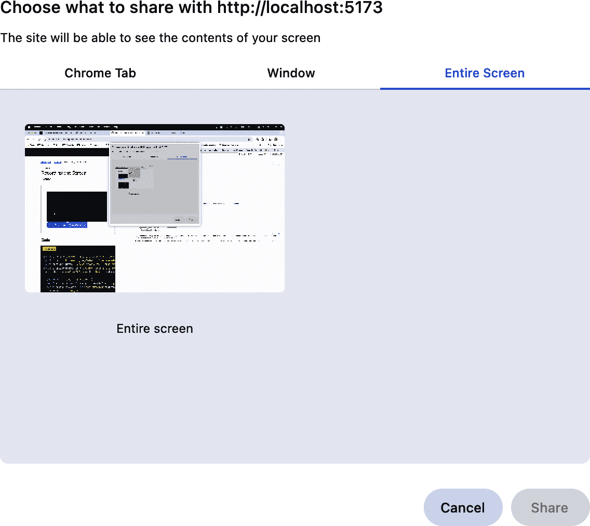

# 第十八章：媒体

# 介绍

现代浏览器提供了丰富的 API，用于处理视频和音频流。WebRTC API 支持从摄像头等设备创建这些流。

可以在 `<video>` 元素中实时播放视频流，并从中捕获视频帧以保存为图像或上传到 API。`<video>` 元素还可用于播放从流中录制的视频。

在这些 API 可用之前，您需要浏览器插件来访问用户的摄像头。如今，您可以使用媒体捕获和流 API 只需少量代码即可从摄像头和麦克风开始读取数据。

# 录制屏幕

## 问题

您想要捕获用户屏幕的视频。

## 解决方案

使用屏幕捕获 API 捕获屏幕视频，然后将其设置为 `<video>` 元素的源（参见 示例 18-1）。

##### 示例 18-1\. 捕获屏幕的视频

```
async function captureScreen() {
  const stream = await navigator.mediaDevices.getDisplayMedia();
  const mediaRecorder = new MediaRecorder(stream, {
    mimeType: 'video/webm'
  });

  mediaRecorder.addEventListener('dataavailable', event => {
    const blob = new Blob([event.data], {
      type: 'video/webm',
    });

    const url = URL.createObjectURL(blob);
    video.src = url;
  });

  mediaRecorder.start();
}
```

###### 注意

屏幕内容并不会实时流到 `<video>` 元素中。相反，屏幕共享被捕获到内存中。一旦完成屏幕捕获，录制的视频将在 `<video>` 元素中播放。

这里有很多事情要做。首先，调用 `navigator.mediaDevices.getDisplayMedia()` 来启动屏幕捕获。根据浏览器和操作系统的不同，您会看到有关屏幕录制的提示（见 图 18-1）。



###### 图 18-1\. 来自 macOS Chrome 的屏幕录制提示

此函数返回一个 `Promise`，解析为用户屏幕的 `MediaStream`。一旦此 `Promise` 解析，屏幕即开始录制，但数据尚未传送到任何地方。

要停止录制，请单击由浏览器提供的停止共享按钮或调用 `mediaRecorder.stop()`。这将触发 `dataavailable` 事件。

接下来，事件处理程序创建一个包含捕获视频数据的 `Blob` 并创建一个对象 URL。然后，您可以将视频的 `src` 属性设置为此对象 URL。

完成此步骤后，屏幕录制将开始在浏览器中播放。

## 讨论

此示例使用具有良好浏览器支持的 `video/webm` MIME 类型。WebM 是一种开放的音频和视频文件格式，支持多种编解码器。

如果用户未授权屏幕录制，`getDisplayMedia` 返回的 `Promise` 将被拒绝并带有错误。

此示例展示了如何在 `<video>` 元素中播放屏幕录制内容，但是一旦获取了 `Blob` 和对象 URL，您还可以做其他事情。

例如，您可以使用 Fetch API 将 `Blob` 发送到服务器（参见 示例 18-2）。

##### 示例 18-2\. 上传捕获的屏幕录制

```
const form = new FormData();
// Here, "blob" is the Blob created in the captureScreen method.
formData.append('file', blob);

fetch('/api/video/upload', {
  method: 'POST',
  body: formData
});
```

您还可以触发浏览器下载捕获的视频（参见 示例 18-3）。

##### 示例 18-3\. 使用隐藏链接触发下载

```
const link = document.createElement('a');

// Here, "url" is the object URL created in the captureScreen method.
link.href = url;
link.textContent = 'Download';
link.download = 'screen-recording.webm';
link.click();
```

# 从用户摄像头捕获图像

## 问题

您希望激活用户的摄像头并拍照。

## 解决方案

使用 `navigator.mediaDevices.getUserMedia` 获取来自摄像头的视频。

首先，您需要创建几个元素，如示例 18-4 所示。

##### 示例 18-4\. 从摄像头捕获图像的标记

```
<style>
  #canvas {
    display: none;
  }

  #photo {
    width: 640px;
    height: 480px;
  }
</style>

<canvas id="canvas"></canvas>

<video id="preview">
```

画布被隐藏，因为它是生成图像之前的中间步骤。

总体方法如下：

1.  将视频流发送到 `<video>` 元素，以显示来自摄像头的实时预览。

1.  当您想要拍摄照片时，在画布上绘制当前视频帧。

1.  从画布创建数据 URL 以生成 JPEG 图像，并在 `` 元素中设置它。

首先，打开视频流并将其附加到 `<video>` 元素上（见示例 18-5）。

##### 示例 18-5\. 获取视频流

```
const preview = document.querySelector('#preview');

async function startCamera() {
  const stream = await navigator.mediaDevices.getUserMedia(
    {
      video: true,
      audio: false
    }
  );
  preview.srcObject = stream;
  preview.play();
}
```

稍后，通过按钮点击或其他事件捕获图像（见示例 18-6）。

##### 示例 18-6\. 捕获图像

```
// This is the <video> element.
const preview = document.querySelector('#preview');

const photo = document.querySelector('#photo');
const canvas = document.querySelector('#canvas');

function captureImage() {
  // Resize the canvas based on the device pixel density.
  // This helps prevent a blurred or pixellated image.
  canvas.width = canvas.width * window.devicePixelRatio;
  canvas.height = canvas.height * window.devicePixelRatio;

  // Get the 2D context from the canvas and draw the current video frame.
  const context = canvas.getContext('2d');
  context.drawImage(preview, 0, 0, canvas.width, canvas.height);

  // Create a JPEG data URL and set it as the image source.
  const dataUrl = canvas.toDataURL('image/jpeg');
  photo.src = dataUrl;
}
```

## 讨论

正如您可能期望的那样，从摄像头读取会引发隐私问题。因此，第一次为用户打开相机将在浏览器中触发权限请求，用户必须接受以授予访问权限。如果此请求被拒绝，`navigator.mediaDevices.getUserMedia` 返回的 `Promise` 将被拒绝并伴有错误。

# 从用户摄像头捕获视频

## 问题

您希望从用户的摄像头录制视频并在浏览器中播放它。

## 解决方案

此解决方案包含以下几个步骤：

1.  使用 `getUserMedia` 打开来自摄像头的流。

1.  使用 `<video>` 元素显示视频预览。

1.  使用 `MediaRecorder` 录制视频。

1.  在 `<video>` 元素中播放已录制的视频。

对于此示例，您需要 `<video>` 元素和开始/停止录制的按钮（见示例 18-7）。

##### 示例 18-7\. 设置视频元素

```
<video id="preview" muted></video>
<button id="record-button">Record</button>
<button id="stop-record-button">Stop Recording</button>
```

接下来，打开视频流并设置 `<video>` 元素来预览它（见示例 18-8）。

##### 示例 18-8\. 打开音频和视频流

```
const preview = document.querySelector('#preview');

const stream = await navigator.mediaDevices.getUserMedia({
  video: true,
  audio: true
});
preview.srcObject = stream;
preview.play();
```

一旦流打开，下一步是设置 `MediaRecorder`（见示例 18-9）。

##### 示例 18-9\. 设置 `MediaRecorder`

```
mediaRecorder = new MediaRecorder(stream, {
  mimeType: 'video/webm'
});

mediaRecorder.addEventListener('dataavailable', event => {
  const blob = new Blob([event.data], {
    type: 'video/webm',
  });

  const url = URL.createObjectURL(blob);

  // Clear the "muted" flag so that the playback will
  // include audio.
  preview.muted = false;

  // Reset the source of the video element to the object
  // URL just created.
  preview.srcObject = null;
  preview.src = url;

  // Start playing the recording immediately.
  preview.autoplay = true;
  preview.loop = true;
  preview.controls = true;
});
```

最后一步是连接按钮以启动和停止 `MediaRecorder`（见示例 18-10）。

##### 示例 18-10\. 添加按钮事件处理程序

```
document.querySelector('#record-button').addEventListener('click', () => {
  mediaRecorder.start();
});

document.querySelector('#stop-record-button').addEventListener('click', () => {
  mediaRecorder.stop();
});
```

## 讨论

您可能已经注意到，初始时 `video` 元素上设置了 `muted` 属性。您打开的媒体流包含视频和音频。您想要预览视频，但可能不希望预览音频 —— 这会导致录制的任何音频立即在扬声器上播放回来，可能会影响录制或甚至导致麦克风反馈。为防止这种情况发生，您可以在 `<video>` 元素上设置 `muted` 属性。

稍后，当播放录制内容时，您需要清除 `muted` 标志，以使录制的音频也能播放。

# 确定系统媒体能力

## 问题

你想知道特定的媒体类型是否被浏览器支持。

## 解决方案

使用媒体能力 API 来查询浏览器是否支持给定的媒体类型。结果将告诉你该媒体类型是否被支持（参见示例 18-11）。

##### 示例 18-11\. 检查媒体能力

```
navigator.mediaCapabilities.decodingInfo({
  type: 'file',
  audio: {
    contentType: 'audio/mp3'
  }
}).then(result => {
  if (result.supported) {
    // mp3 audio is supported!
  }
});

navigator.mediaCapabilities.decodingInfo({
  type: 'file',
  audio: {
    contentType: 'audio/webm;codecs=opus'
  }
}).then(result => {
  if (result.supported) {
    // WebM audio is supported with the opus codec.
  }
});
```

## 讨论

示例 18-11 展示了一些检查音频编解码器支持的示例。媒体能力 API 还允许你检查特定视频格式的支持。你不仅可以按编解码器查询，还可以按帧率、比特率、宽度和高度等其他属性查询（参见示例 18-12）。

##### 示例 18-12\. 检查支持的视频格式

```
navigator.mediaCapabilities.decodingInfo({
  type: 'file',
  video: {
    contentType: 'video/webm;codecs=vp8',
    bitrate: 4000000, // 4 MB
    framerate: 30,
    width: 1920,
    height: 1080
  }
}).then(result => {
  if (result.supported) {
    // This WebM configuration is supported.
  }
});
```

# 应用视频滤镜

## 问题

你想给视频流应用一个滤镜效果。

## 解决方案

将视频流渲染到一个`<canvas>`中，并对 canvas 应用 CSS 滤镜。

你将视频流设置为`<video>`元素的源，如“从用户摄像头捕获图像”。然而，在这种情况下，你会隐藏`<video>`元素，因为它只是一个中间步骤。

然后，根据所需的帧率，将视频的每一帧渲染到一个`<canvas>`元素中。从那里，你可以应用 CSS 滤镜。

首先，标记（参见示例 18-13）。

##### 示例 18-13\. 视频滤镜示例的标记

```
<canvas id="canvas"></canvas>
<video id="preview" style="display: none;"></video>
```

然后，打开媒体流并将其设置在`<video>`元素中（参见示例 18-14）。

##### 示例 18-14\. 设置视频流

```
async function startCamera() {
  const stream = await navigator.mediaDevices.getUserMedia({
    video: true,
    audio: false
  });

  // Hook up the video element to the stream.
  preview.srcObject = stream;
  preview.play();

  // Resize the canvas based on the device pixel density.
  // This helps prevent a blurred or pixelated image.
  canvas.width = canvas.width * window.devicePixelRatio;
  canvas.height = canvas.height * window.devicePixelRatio;
  const context = canvas.getContext('2d');

  // Target frame rate of 30 FPS—draw each frame to the canvas.
  setInterval(() => {
    context.drawImage(preview, 0, 0, canvas.width, canvas.height);
  }, 30 / 1000);
}
```

现在，你可以向`<canvas>`元素应用 CSS 滤镜（参见示例 18-15）。

##### 示例 18-15\. 应用滤镜

```
#canvas {
  filter: hue-rotate(90deg);
}
```

## 讨论

每 0.03 秒，视频的当前帧将被绘制到 canvas 上。这实际上是媒体流的预览，使用`<video>`元素作为中间件。这是因为目前还没有直接将媒体流“绘制”到`<canvas>`元素的方法。

除了使用 CSS 设置滤镜之外，你还可以使用 canvas 2D 上下文的`filter`属性来设置它们。
