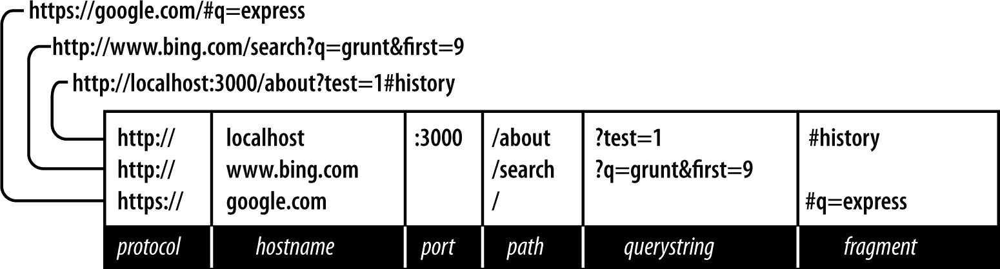

# 第六章：请求和响应对象

在本章中，我们将学习请求和响应对象的重要细节，这些对象基本上是 Express 应用程序中发生的一切的起点和终点。当你使用 Express 构建 Web 服务器时，你将大部分时间都是从请求对象开始，然后结束于响应对象。

这两个对象起源于 Node 并由 Express 扩展。在我们深入研究这些对象提供的内容之前，让我们先了解一下客户端（通常是浏览器）如何从服务器请求页面以及页面如何返回的背景知识。

# URL 的组成部分

我们经常看到 URL，但很少停下来考虑它们的组成部分。让我们考虑三个 URL 并检查它们的组成部分。



协议

协议决定了请求如何传输。我们将专门处理*http*和*https*。其他常见的协议包括*file*和*ftp*。

主机

主机标识服务器。在你的计算机（本地主机）或本地网络上的服务器可能仅用一个单词或数字 IP 地址来标识。在互联网上，主机将以顶级域名（TLD）结尾，如*.com*或*.net*。此外，可能还有*子域*，作为主机名的前缀。*www*是常见的子域，虽然可以是任何东西。子域是可选的。

端口

每台服务器都有一组编号的端口。一些端口号是特殊的，比如 80 和 443。如果省略端口，则假定为 HTTP 的端口 80 和 HTTPS 的端口 443。通常情况下，如果不使用 80 或 443 端口，则应使用大于 1023 的端口号。^(1) 使用易记的端口号如 3000、8080 和 8088 是很常见的。每个端口只能与一个服务器关联，尽管可以选择很多端口号，但如果使用了常用端口号，则可能需要更改端口号。

路径

路径通常是 URL 中你的应用程序关心的第一部分（虽然可以根据协议、主机和端口做出决策，但这不是一个好的做法）。路径应用于唯一标识你的应用程序中的页面或其他资源。

查询字符串

查询字符串是一个可选的名称/值对集合。查询字符串以问号（*?*）开头，名称/值对之间用和号（*&*）分隔。名称和值都应进行*URL 编码*。JavaScript 提供了内置函数来完成这个操作：`encodeURIComponent`。例如，空格将被加号（*+*）替换。其他特殊字符将被数字字符引用替换。有时查询字符串也被称为*搜索字符串*或简称*搜索*。

片段

片段（或*哈希*）根本不会传递给服务器；它严格用于浏览器使用。一些单页面应用程序使用片段来控制应用程序导航。最初，片段的唯一目的是导致浏览器显示文档的特定部分，由锚标记标记（例如：<a id="chapter06">）。

# HTTP 请求方法

HTTP 协议定义了一组*请求方法*（通常称为*HTTP 动词*），客户端用它们与服务器通信。远远地，最常见的方法是 `GET` 和 `POST`。

在浏览器中键入 URL（或点击链接）时，浏览器会向服务器发出 HTTP `GET` 请求。传递给服务器的重要信息是 URL 路径和查询字符串。方法、路径和查询字符串的组合是应用程序用来确定如何响应的关键。

对于网站，大多数页面将响应 `GET` 请求。`POST` 请求通常用于向服务器发送信息（例如表单处理）。服务器处理请求后，通常会使用与相应 `GET` 请求相同的 HTML 响应。浏览器主要在与服务器通信时使用 `GET` 和 `POST` 方法。然而，您的应用程序进行的 Ajax 请求可能使用任何 HTTP 动词。例如，有一种称为 `DELETE` 的 HTTP 方法非常适合用于 API 调用来删除事物。

在 Node 和 Express 中，您完全可以控制如何响应方法。在 Express 中，通常会编写特定方法的处理程序。

# 请求头

当您导航到页面时，传递给服务器的不仅是 URL。每次访问网站时，您的浏览器都会发送大量“隐形”信息。我不是在谈论神秘的个人信息（尽管如果您的浏览器感染了恶意软件，这可能会发生）。浏览器会告诉服务器它喜欢以哪种语言接收页面（例如，如果您在西班牙下载 Chrome，则会请求访问的页面的西班牙语版本，如果存在的话）。它还会发送关于*用户代理*（浏览器、操作系统和硬件）和其他信息的信息。所有这些信息都作为请求头发送，通过请求对象的 `headers` 属性可供您使用。如果您想查看浏览器发送的信息，可以创建一个简单的 Express 路由来显示该信息（在配套仓库中的 *ch06/00-echo-headers.js*）。

```
app.get('/headers', (req, res) => {
  res.type('text/plain')
  const headers = Object.entries(req.headers)
    .map(([key, value]) => `${key}: ${value}`)
  res.send(headers.join('\n'))
})
```

# 响应头

正如你的浏览器通过请求头将隐藏信息发送到服务器一样，当服务器响应时，它也会发送一些不一定由浏览器渲染或显示的信息。响应头通常包括元数据和服务器信息。我们已经看到了`Content-Type`头部，它告诉浏览器正在传输的内容类型（HTML、图片、CSS、JavaScript 等）。请注意，浏览器将尊重`Content-Type`头部，无论 URL 路径是什么。因此，你可以从 */image.jpg* 的路径提供 HTML 或从 */text.html* 的路径提供图片。 （没有合理的理由这样做；重要的是理解路径是抽象的，浏览器使用`Content-Type`来确定如何渲染内容。）除了`Content-Type`，头部还可以指示响应是否压缩以及使用的编码类型。响应头还可以包含有关浏览器可以缓存资源多长时间的提示。这是优化网站的重要考虑因素，我们将在第十七章中详细讨论这一点。

响应头中通常也包含一些关于服务器的信息，指示服务器类型以及有时甚至有关操作系统的详细信息。返回服务器信息的缺点是，它给黑客一个入手点来危害你的网站。极端注重安全的服务器通常会省略这些信息，甚至提供错误信息。禁用 Express 默认的`X-Powered-By`头部很容易（在附带的存储库中的 *ch06/01-disable-x-powered-by.js*）：

```
app.disable('x-powered-by')
```

如果你想查看响应头，可以在浏览器的开发者工具中找到。例如，要在 Chrome 中查看响应头：

1.  打开 JavaScript 控制台。

1.  点击网络选项卡。

1.  刷新页面。

1.  从请求列表中选择 HTML（这将是第一个）。

1.  点击头部选项卡，你将看到所有的响应头。

# 互联网媒体类型

`Content-Type`头部非常重要；没有它，客户端将痛苦地猜测如何渲染内容。`Content-Type`头部的格式是 *互联网媒体类型*，包括类型、子类型和可选参数。例如，`text/html; charset=UTF-8` 指定了“text”类型，“html”子类型和 UTF-8 字符编码。互联网分配号码管理局维护着[互联网媒体类型的官方列表](https://www.iana.org/assignments/media-types/media-types.xhtml)。通常情况下，“内容类型”、“互联网媒体类型”和“MIME 类型”可以互换使用。MIME（多用途互联网邮件扩展）是互联网媒体类型的前身，在大多数情况下是等效的。

# 请求正文

除了请求头部外，请求还可以有一个*主体*（就像响应的主体是实际返回的内容一样）。普通的`GET`请求没有主体，但`POST`请求通常有。最常见的`POST`主体媒体类型是`application/x-www-form-urlencoded`，它简单地编码了用与号分隔的名称/值对（本质上与查询字符串的格式相同）。如果`POST`需要支持文件上传，则媒体类型是`multipart/form-data`，这是一种更复杂的格式。最后，Ajax 请求可以使用`application/json`作为主体。我们将在第八章学习更多有关请求主体的内容。

# 请求对象

*请求对象*（作为请求处理程序的第一个参数传递，这意味着您可以随意命名它；通常将其命名为`req`或`request`）从`http.IncomingMessage`的实例开始其生命周期，这是一个核心 Node 对象。Express 添加了更多功能。让我们看看请求对象的最有用的属性和方法（所有这些方法都是由 Express 添加的，除了`req.headers`和`req.url`，它们起源于 Node）：

`req.params`

包含*命名路由参数*的数组。我们将在第十四章学习更多相关内容。

`req.query`

包含查询字符串参数（有时称为`GET`参数）的名称/值对的对象。

`req.body`

包含`POST`参数的对象。之所以这样命名，是因为`POST`参数是在请求的主体中传递的，而不是像查询字符串参数那样在 URL 中。要使`req.body`可用，您需要能够解析主体内容类型的中间件，我们将在第十章中学习。

`req.route`

当前匹配路由的信息。这主要用于路由调试。

`req.cookies`/`req.signedCookies`

包含从客户端传递的 cookie 值的对象。参见第九章。

`req.headers`

从客户端接收的请求头部。这是一个对象，其键是头部名称，值是头部值。请注意，这是来自底层`http.IncomingMessage`对象的，因此您在 Express 文档中找不到它。

`req.accepts(types)`

一个方便的方法，用于确定客户端是否接受给定的类型或类型（可选的`types`可以是单个 MIME 类型，如`application/json`，逗号分隔的列表或数组）。这个方法对于编写公共 API 的人来说非常重要；默认情况下假定浏览器总是接受 HTML。

`req.ip`

客户端的 IP 地址。

`req.path`

请求路径（不包括协议、主机、端口或查询字符串）。

`req.hostname`

返回客户端报告的主机名的方便方法。此信息可以伪造，不应用于安全目的。

`req.xhr`

一个方便的属性，如果请求来自 Ajax 调用，则返回`true`。

`req.protocol`

用于发起此请求的协议（对我们而言，可能是 `http` 或 `https`）。

`req.secure`

一个便捷属性，如果连接安全则返回 `true`。这等同于 `req.protocol === 'https'`。

`req.url`/`req.originalUrl`

有些名称并不完全准确，这些属性返回路径和查询字符串（不包括协议、主机或端口）。`req.url` 可以为内部路由目的重写，但 `req.originalUrl` 设计为保留原始请求和查询字符串。

# 响应对象

*响应对象*（作为请求处理程序的第二个参数传递，意味着可以随意命名为 `res`、`resp` 或 `response`）起初是 `http.ServerResponse` 的实例，这是 Node 的核心对象。Express 添加了更多功能。让我们看看响应对象的最有用的属性和方法（所有这些都是 Express 添加的）：

`res.status(code)`

设置 HTTP 状态码。Express 默认为 200（OK），因此您需要使用这个方法来返回 404（未找到）或 500（服务器错误）等其他状态码。对于重定向（状态码 301、302、303 和 307），有一个 `redirect` 方法，这是首选方法。请注意，`res.status` 返回响应对象，这意味着您可以链接调用：`res.status(404).send('Not found')`。

`res.set(name, value)`

设置响应头。这通常不是您手动操作的内容。您也可以通过传递一个对象参数一次性设置多个头部，对象的键是头部名称，值是头部的值。

`res.cookie(name, value, [options])`，`res.clearCookie(name, [options])`

设置或清除将存储在客户端的 cookie。这需要一些中间件支持；请参见第九章。

`res.redirect([status], url)`

重定向浏览器。默认的重定向代码是 302（Found）。通常情况下，应尽量减少重定向，除非您要永久移动页面，此时应使用代码 301（Moved Permanently）。

`res.send(body)`

向客户端发送响应。Express 默认为 `text/html` 类型的内容，因此如果您希望将其更改为 `text/plain`（例如），您需要在调用 `res.send` 之前调用 `res.type('text/plain')`。如果 `body` 是对象或数组，则响应将以 JSON 形式发送（内容类型会适当设置），但如果要发送 JSON，建议直接调用 `res.json`。

`res.json(json)`

向客户端发送 JSON。

`res.jsonp(json)`

向客户端发送 JSONP。

`res.end()`

结束连接而不发送响应。要了解 `res.send`、`res.json` 和 `res.end` 之间的区别，请参阅 Tamas Piros 的[这篇文章](https://blog.fullstacktraining.com/res-json-vs-res-send-vs-res-end-in-express/)。

`res.type(type)`

一个便捷方法来设置`Content-Type`头部。这基本上等同于`res.set('Content-Type', type)`，除非您提供一个没有斜杠的字符串，它还将尝试将文件扩展名映射到互联网媒体类型。例如，`res.type('txt')`将导致`Content-Type`为`text/plain`。在某些情况下，这种功能可能很有用（例如，自动服务不同的多媒体文件），但通常情况下，您应该避免这样做，而是显式设置正确的互联网媒体类型。

`res.format(object)`

这种方法允许您根据`Accept`请求头发送不同的内容。这在 API 中非常有用，我们将在第十五章进一步讨论这个问题。这里有一个简单的例子：`res.format({'text/plain': 'hi there', 'text/html': '<b>hi there</b>'})`。

`res.attachment([filename])`，`res.download(path, [filename], [callback])`

这两种方法都将`Content-Disposition`响应头设置为`attachment`；这将提示浏览器下载内容而不是在浏览器中显示它。您可以指定`filename`作为浏览器的提示。使用`res.download`，您可以指定要下载的文件，而`res.attachment`仅设置头部；您仍然需要向客户端发送内容。

`res.sendFile(path, [options], [callback])`

这种方法将读取由`path`指定的文件，并将其内容发送到客户端。对于这种方法几乎没有什么需求；使用`static`中间件并将您希望客户端能够访问的文件放在*public*目录中更容易。但是，如果您希望根据某些条件从同一个 URL 提供不同的资源，那么这种方法可能会有用。

`res.links(links)`

设置`Links`响应头。在大多数应用程序中几乎没有实际用途的专用头部。

`res.locals`，`res.render(view, [locals], callback)`

`res.locals`是一个包含*默认*渲染视图上下文的对象。`res.render`将使用配置的模板引擎来渲染视图（`res.render`的`locals`参数不应与`res.locals`混淆：它将覆盖`res.locals`中的上下文，但未被覆盖的上下文仍将可用）。注意，`res.render`默认响应码为 200；使用`res.status`指定不同的响应码。视图渲染将在第七章详细讨论。

# 获取更多信息

由于 JavaScript 的原型继承，确切地知道你正在处理的东西有时可能是具有挑战性的。Node 提供了 Express 扩展的对象，而你添加的包也可能会扩展这些对象。有时候确切地弄清楚可用的功能是具有挑战性的。总的来说，我建议你往回推导：如果你在寻找某些功能，首先检查[Express API 文档](http://expressjs.com/api.html)。Express 的 API 非常完整，很有可能你会在那里找到你要找的内容。

如果你需要查找未记录的信息，有时候你必须深入研究[Express 源代码](https://github.com/expressjs/express)。我鼓励你这样做！你可能会发现这并没有你想象中的那么吓人。以下是在 Express 源代码中找到信息的快速路线图：

*lib/application.js*

主要的 Express 接口。如果你想了解中间件是如何链接或者如何渲染视图的，这是你应该查看的地方。

*lib/express.js*

这是一个相对较短的文件，主要提供`createApplication`函数（该文件的默认导出），用于创建 Express 应用程序实例。

*lib/request.js*

扩展 Node 的`http.IncomingMessage`对象以提供强大的请求对象。要了解有关请求对象的所有属性和方法的信息，这就是你要查找的地方。

*lib/response.js*

扩展 Node 的`http.ServerResponse`对象以提供响应对象。要了解响应对象的所有属性和方法的信息，这就是你要查找的地方。

*lib/router/route.js*

提供基本的路由支持。虽然路由是你应用程序的核心，但是这个文件不到 230 行；你会发现它非常简单和优雅。

当你深入研究 Express 源代码时，你可能会想参考[Node 文档](https://nodejs.org/en/docs/)，特别是关于`HTTP`模块的部分。

# 简化问题

本章已经概述了请求和响应对象，这些是 Express 应用程序的核心部分。然而，你大部分时间可能只会使用它们的一个小子集功能。所以让我们按照你最频繁使用的功能来详细讨论一下。

## 渲染内容

当你渲染内容时，你最常使用的是`res.render`，它在布局中呈现视图，提供最大的价值。偶尔，你可能想要编写一个快速的测试页面，所以如果只是想要一个测试页面，你可能会使用`res.send`。你可以使用`req.query`获取查询字符串的值，使用`req.session`获取会话值，或者使用`req.cookie`/`req.signedCookies`获取 cookie。示例 6-1 到示例 6-8 演示了常见的内容渲染任务。

##### 示例 6-1\. 基本用法（*ch06/02-basic-rendering.js*）

```
// basic usage
app.get('/about', (req, res) => {
  res.render('about')
})
```

##### 示例 6-2\. 除了 200 之外的响应代码（*ch06/03-different-response-codes.js*）

```
app.get('/error', (req, res) => {
  res.status(500)
  res.render('error')
})

// or on one line...

app.get('/error', (req, res) => res.status(500).render('error'))
```

##### 示例 6-3\. 将上下文传递给视图，包括查询字符串、cookie 和会话值（*ch06/04-view-with-content.js*）

```
app.get('/greeting', (req, res) => {
  res.render('greeting', {
    message: 'Hello esteemed programmer!',
    style: req.query.style,
    userid: req.cookies.userid,
    username: req.session.username
  })
})
```

##### 示例 6-4\. 渲染不带布局的视图（*ch06/05-view-without-layout.js*）

```
// the following layout doesn't have a layout file, so
// views/no-layout.handlebars must include all necessary HTML
app.get('/no-layout', (req, res) =>
  res.render('no-layout', { layout: null })
)
```

##### 示例 6-5\. 使用自定义布局渲染视图（*ch06/06-custom-layout.js*）

```
// the layout file views/layouts/custom.handlebars will be used
app.get('/custom-layout', (req, res) =>
  res.render('custom-layout', { layout: 'custom' })
)
```

##### 示例 6-6\. 渲染纯文本输出（*ch06/07-plaintext-output.js*）

```
app.get('/text', (req, res) => {
  res.type('text/plain')
  res.send('this is a test')
})
```

##### 示例 6-7\. 添加错误处理程序（*ch06/08-error-handler.js*）

```
// this should appear AFTER all of your routes
// note that even if you don't need the "next" function, it must be
// included for Express to recognize this as an error handler
app.use((err, req, res, next) => {
  console.error('** SERVER ERROR: ' + err.message)
  res.status(500).render('08-error',
    { message: "you shouldn't have clicked that!" })
})
```

##### 示例 6-8\. 添加一个 404 处理程序（*ch06/09-custom-404.js*）

```
// this should appear AFTER all of your routes
app.use((req, res) =>
  res.status(404).render('404')
)
```

## 处理表单

在处理表单时，表单信息通常在 `req.body` 中（有时在 `req.query` 中）。您可以使用 `req.xhr` 来判断请求是 Ajax 请求还是浏览器请求（这将在 Chapter 8 中详细介绍）。参见 Example 6-9 和 Example 6-10。在以下示例中，您需要链接 body parser 中间件：

```
const bodyParser = require('body-parser')
app.use(bodyParser.urlencoded({ extended: false }))
```

我们将在第八章详细学习关于 body parser 中间件的内容，Chapter 8。

##### 示例 6-9\. 基本表单处理（*ch06/10-basic-form-processing.js*）

```
app.post('/process-contact', (req, res) => {
  console.log(`received contact from ${req.body.name} <${req.body.email}>`)
  res.redirect(303, '10-thank-you')
})
```

##### 示例 6-10\. 更健壮的表单处理（*ch06/11-more-robust-form-processing.js*）

```
app.post('/process-contact', (req, res) => {
  try {
    // here's where we would try to save contact to database or other
    // persistence mechanism...for now, we'll just simulate an error
    if(req.body.simulateError) throw new Error("error saving contact!")
    console.log(`contact from ${req.body.name} <${req.body.email}>`)
    res.format({
      'text/html': () => res.redirect(303, '/thank-you'),
      'application/json': () => res.json({ success: true }),
    })
  } catch(err) {
    // here's where we would handle any persistence failures
    console.error(`error processing contact from ${req.body.name} ` +
      `<${req.body.email}>`)
    res.format({
      'text/html': () =>  res.redirect(303, '/contact-error'),
      'application/json': () => res.status(500).json({
        error: 'error saving contact information' }),
    })
  }
})
```

## 提供 API

在提供 API 时，类似处理表单，参数通常在 `req.query` 中，尽管您也可以使用 `req.body`。API 的不同之处在于，通常会返回 JSON、XML 或纯文本，而不是 HTML，并且经常使用较少见的 HTTP 方法如 `PUT`、`POST` 和 `DELETE`。API 的提供将在 Chapter 15 中介绍。Example 6-11 和 Example 6-12 使用以下“products”数组（通常从数据库中检索）：

```
const tours = [
  { id: 0, name: 'Hood River', price: 99.99 },
  { id: 1, name: 'Oregon Coast', price: 149.95 },
]
```

###### 注意

术语 *endpoint* 常用来描述 API 中的单个函数。

##### 示例 6-11\. 简单的 GET 端点仅返回 JSON（*ch06/12-api.get.js*）

```
app.get('/api/tours', (req, res) => res.json(tours))
```

Example 6-12 使用 Express 中的 `res.format` 方法根据客户端的偏好来响应。

##### 示例 6-12\. 返回 JSON、XML 或文本的 GET 端点（*ch06/13-api-json-xml-text.js*）

```
app.get('/api/tours', (req, res) => {
  const toursXml = '<?xml version="1.0"?><tours>' +
    tours.map(p =>
      `<tour price="${p.price}" id="${p.id}">${p.name}</tour>`
    ).join('') + '</tours>'
  const toursText = tours.map(p =>
      `${p.id}: ${p.name} (${p.price})`
    ).join('\n')
  res.format({
    'application/json': () => res.json(tours),
    'application/xml': () => res.type('application/xml').send(toursXml),
    'text/xml': () => res.type('text/xml').send(toursXml),
    'text/plain': () => res.type('text/plain').send(toursXml),
  })
})
```

在 Example 6-13 中，PUT 端点更新产品并返回 JSON。参数通过请求体传递（路由字符串中的 `:id` 告诉 Express 将 `id` 属性添加到 `req.params`）。

##### 示例 6-13\. 用于更新的 PUT 端点（*ch06/14-api-put.js*）

```
app.put('/api/tour/:id', (req, res) => {
  const p = tours.find(p => p.id === parseInt(req.params.id))
  if(!p) return res.status(404).json({ error: 'No such tour exists' })
  if(req.body.name) p.name = req.body.name
  if(req.body.price) p.price = req.body.price
  res.json({ success: true })
})
```

最后，Example 6-14 展示了一个 DELETE 端点。

##### 示例 6-14\. 删除端点用于删除（*ch06/15-api-del.js*）

```
app.delete('/api/tour/:id', (req, res) => {
  const idx = tours.findIndex(tour => tour.id === parseInt(req.params.id))
  if(idx < 0) return res.json({ error: 'No such tour exists.' })
  tours.splice(idx, 1)
  res.json({ success: true })
})
```

# 结论

希望本章中的微型示例让您对 Express 应用程序中常见的功能有所了解。这些示例旨在成为您将来可以重访的快速参考。

在下一章中，我们将深入探讨模板化，这在本章的渲染示例中有所涉及。

^(1) 端口 0–1023 是保留给[常见服务](http://bit.ly/33InJu7)的“众所周知的端口”。
