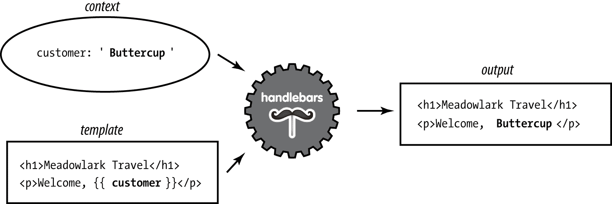
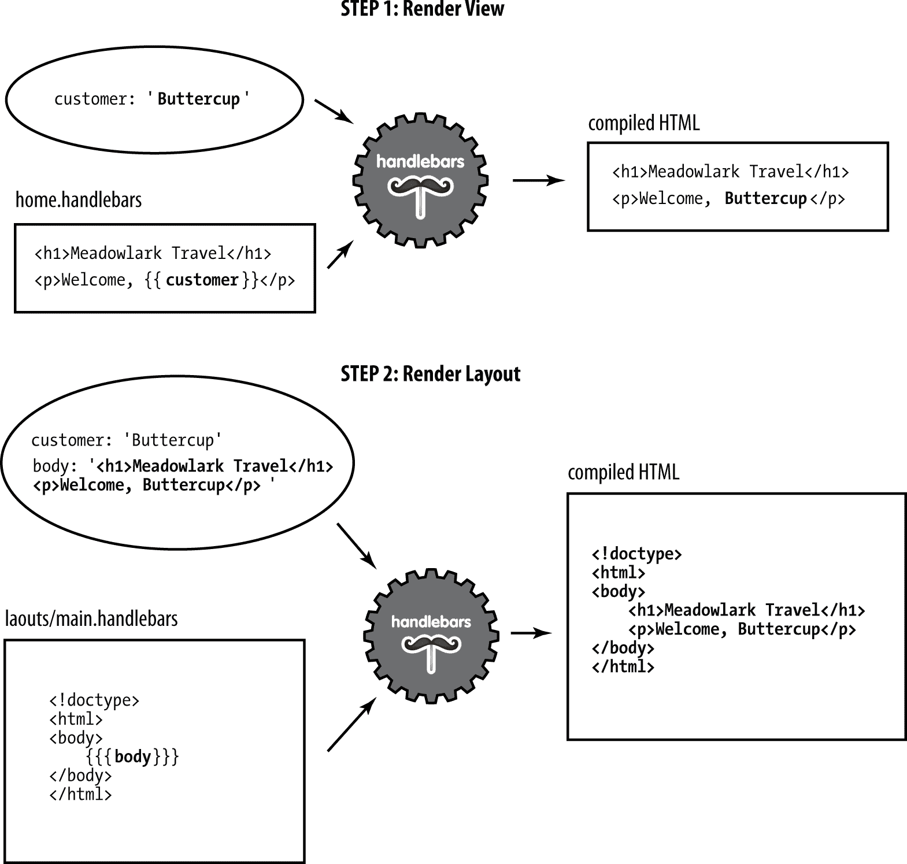

# 第七章：使用 Handlebars 进行模板化

在本章中，我们将讨论 *模板化*，这是一种构建和格式化你的内容以显示给用户的技术。你可以将模板化视为表单信的进化：“亲爱的 [姓名]：我们很遗憾地告诉你，再也没有人使用 [过时的技术] 了，但模板化仍然活跃！”要将这封信发送给一群人，你只需要替换 [姓名] 和 [过时的技术]。

###### 注意

这种替换字段的过程有时被称为 *插值*，在这个上下文中，它只是一个“提供缺失信息”的花哨词语。

尽管服务器端模板正在被 React、Angular 和 Vue 等前端框架快速取代，但它仍然有应用，比如创建 HTML 邮件。此外，Angular 和 Vue 都使用类似模板的方法编写 HTML，因此你在服务器端模板方面学到的内容可以转移到这些前端框架中。

如果你来自 PHP 背景，可能会对这些问题感到奇怪：PHP 是第一个真正可以称之为模板语言的语言之一。几乎所有为 Web 而适应的主要语言都包含了某种模板支持。如今不同的是 *模板引擎* 正从语言中解耦。

那么模板看起来是什么样子？让我们从考虑用一种最明显和直接的方式生成一种语言来替代的方式开始（具体来说，我们将使用 JavaScript 生成一些 HTML）：

```
document.write('<h1>Please Don\'t Do This</h1>')
document.write('<p><span class="code">document.write</span> is naughty,\n')
document.write('and should be avoided at all costs.</p>')
document.write('<p>Today\'s date is ' + new Date() + '.</p>')
```

或许唯一显得“显而易见”的原因是这一直是编程教学的方式：

```
10 PRINT "Hello world!"
```

在命令式语言中，我们习惯于说：“先做这个，然后做那个，然后再做其他事情。”对于某些事情，这种方法很有效。如果你有 500 行 JavaScript 来执行一个复杂的计算，最终得到一个数字，每一步都依赖于前一步，那么这样做并没有什么问题。但反过来呢？你有 500 行 HTML 和 3 行 JavaScript。写 500 次 `document.write` 有意义吗？完全没有。

实际上，问题归根结底是：切换上下文是有问题的。如果你经常写大量的 JavaScript，混合 HTML 是不方便且令人困惑的。反过来就没那么糟糕。我们习惯在 `<script>` 块中编写 JavaScript，但希望你能看出其中的区别：仍然存在上下文切换，你要么在写 HTML，要么在 `<script>` 块里写 JavaScript。让 JavaScript 生成 HTML 存在许多问题：

+   你必须经常担心哪些字符需要转义以及如何进行转义。

+   使用 JavaScript 生成包含 JavaScript 的 HTML 很快就会导致混乱。

+   通常会失去编辑器具有的漂亮语法高亮和其他有用的特定于语言的功能。

+   发现格式不正确的 HTML 可能会更加困难。

+   你的代码很难在视觉上解析。

+   这可能会使其他人更难理解你的代码。

通过模板化，可以解决这个问题，允许你用目标语言编写，同时提供插入动态数据的能力。考虑前面的例子重写为 Mustache 模板：

```
<h1>Much Better</h1>
<p>No <span class="code">document.write</span> here!</p>
<p>Today's date is {{today}}.</p>
```

现在我们只需要为`{{today}}`提供一个值，这是模板语言的核心。

# 除了这条，没有绝对的规则

我并不建议你在 JavaScript 中*从不*写 HTML，只是尽可能避免。特别是在前端代码中，尤其是如果你正在使用强大的前端框架。例如，这样的代码对我来说不太容易接受：

```
document.querySelector('#error').innerHTML =
  'Something <b>very bad</b> happened!'
```

然而，假设最终变成了这样：

```
document.querySelector('#error').innerHTML =
  '<div class="error"><h3>Error</h3>' +
  '<p>Something <b><a href="/error-detail/' + errorNumber +
  '">very bad</a></b> ' +
  'happened.  <a href="/try-again">Try again<a>, or ' +
  '<a href="/contact">contact support</a>.</p></div>'
```

然后我可能会建议现在是使用模板的时候了。关键是，在决定在字符串中使用 HTML 和使用模板之间划界线时，我建议你培养良好的判断力。不过，我更倾向于使用模板，除了最简单的情况外，尽量避免在 JavaScript 中生成 HTML。

# 选择模板引擎

在 Node 世界中，你有很多模板引擎可供选择，那么如何选择呢？这是一个复杂的问题，非常依赖于你的需求。以下是一些需要考虑的标准：

性能

显然，你希望你的模板引擎尽可能快速。这不是你想要拖慢网站速度的东西。

客户端、服务器或两者？

大多数但并非所有的模板引擎都可以在服务器端和客户端两边使用。如果你需要在两个领域中都使用模板（你会需要的），我建议你选择在任何一种情况下都同样有能力的东西。

抽象化

想要一些熟悉的东西（比如常规的带有大括号的 HTML，例如），还是你暗地里讨厌 HTML，并且希望有些东西可以让你摆脱那些尖括号？模板（特别是服务器端的模板）在这里给你一些选择。

这些只是选择模板语言时的一些更突出的标准之一。目前，模板选项非常成熟，所以无论你选择什么，都不会太错。

Express 允许你使用任何你喜欢的模板引擎，所以如果 Handlebars 不合你的口味，你会发现很容易替换它。如果你想探索选项，你可以使用有趣且实用的[模板引擎选择器](http://bit.ly/2CExtK0)（尽管它已经不再更新，但仍然很有用）。

在我们讨论 Handlebars 之前，让我们先看看一个特别抽象的模板引擎。

# Pug：一种不同的方法

虽然大多数模板引擎都采用以 HTML 为中心的方法，但 Pug 通过将 HTML 的细节抽象化而脱颖而出。还值得注意的是，Pug 的创始人是 TJ Holowaychuk，他也是 Express 的创作者。因此，Pug 与 Express 的集成非常好。Pug 采取的方法是高尚的：它的核心观点是 HTML 是一种繁琐且乏味的手工编写语言。让我们来看看一个 Pug 模板的示例，以及它将输出的 HTML（原始取自[Pug 主页](https://pugjs.org)，并稍作修改以符合本书的格式）：

```
doctype html                        <!DOCTYPE html>
html(lang="en")                     <html lang="en">
  head                              <head>
    title= pageTitle                <title>Pug Demo</title>
    script.                         <script>
      if (foo) {                        if (foo) {
         bar(1 + 5)                         bar(1 + 5)
      }                                 }
  body                              </script>
                                    <body>
    h1 Pug                         <h1>Pug</h1>
    #container                      <div id="container">
      if youAreUsingPug
        p You are amazing           <p>You are amazing</p>
      else
        p Get on it!
      p.                            <p>
        Pug is a terse and           Pug is a terse and
        simple templating             simple templating
        language with a               language with a
        strong focus on               strong focus on
        performance and               performance and
        powerful features.            powerful features.
                                    </p>
                                    </body>
                                    </html>
```

Pug 显然输入较少（不再有尖括号或闭合标签）。相反，它依赖缩进和一些常识规则，使表达意思变得更容易。Pug 的另一个优势在于：从理论上讲，当 HTML 本身发生变化时，你可以简单地让 Pug 针对最新版本的 HTML 进行重新定位，从而使你的内容“未来证明”。

尽管我钦佩 Pug 的哲学和其执行的优雅，但我发现我不想让 HTML 的细节从我身边消失。作为一个网页开发者，HTML 是我所做的一切的核心，如果代价是键盘上的尖括号键被磨损，那就算了。我和许多前端开发者交流后发现，他们的看法也是如此，也许这个世界还没有准备好接受 Pug。

这就是我们与 Pug 分道扬镳的地方；你在本书中将不会看到它。然而，如果你喜欢这种抽象化的方式，你肯定不会遇到使用 Pug 与 Express 的问题，并且有很多资源可以帮助你实现这一点。

# Handlebars 基础

*Handlebars* 是 Mustache 的扩展，另一个流行的模板引擎。我推荐 Handlebars 是因为它容易与 JavaScript 集成（前端和后端都可以），并且语法熟悉。对我来说，它在各个方面都找到了平衡点，这也是我们本书的重点内容。我们讨论的概念广泛适用于其他模板引擎，因此如果 Handlebars 不适合你，你也可以尝试其他模板引擎。

理解模板的关键在于理解 *上下文* 的概念。当你渲染一个模板时，你向模板引擎传递一个叫做 *上下文对象* 的对象，这就是允许替换操作正常工作的对象。

例如，如果我的上下文对象是

```
{ name: 'Buttercup' }
```

and my template is

```
<p>Hello, {{name}}!</p>
```

那么 `{{name}}` 将被替换为 `Buttercup`。如果你想向模板传递 HTML 呢？例如，如果我们的上下文对象改为

```
{ name: '<b>Buttercup</b>' }
```

那么使用之前的模板将导致 `<p>Hello, &lt;b&gt;Buttercup&lt;b&gt;</p>`，这可能不是你想要的结果。要解决这个问题，只需使用三个大括号而不是两个：`{{{name}}}`。

###### Note

虽然我们已经确立了不应该在 JavaScript 中编写 HTML 的观点，但是使用三个花括号来关闭 HTML 转义的能力确实有一些重要用途。例如，如果您正在构建带有所见即所得（WYSIWYG）编辑器的内容管理系统（CMS），您可能希望能够向视图传递 HTML。此外，在 *布局* 和 *部分* 中渲染上下文的属性时关闭 HTML 转义也很重要，我们很快会学到这一点。

在 图 7-1 中，我们看到 Handlebars 引擎如何使用上下文（用椭圆表示）结合模板来渲染 HTML。



###### 图 7-1\. 使用 Handlebars 渲染 HTML

## 注释

在 Handlebars 中，*注释* 的形式是 `{{! comment goes here }}`。重要的是要理解 Handlebars 注释与 HTML 注释的区别。考虑以下模板：

```
{{! super-secret comment }}
<!-- not-so-secret comment -->
```

假设这是一个服务器端模板，则超级秘密注释永远不会发送到浏览器，而不那么秘密的注释如果用户检查 HTML 源码则会可见。您应该优先使用 Handlebars 注释来处理任何暴露实现细节或其他不希望公开的内容。

## 块

当考虑 *块* 时，情况开始变得更加复杂。块提供流程控制、条件执行和可扩展性。考虑以下上下文对象：

```
{
  currency: {
    name: 'United States dollars',
    abbrev: 'USD',
  },
  tours: [
    { name: 'Hood River', price: '$99.95' },
    { name: 'Oregon Coast', price: '$159.95' },
  ],
  specialsUrl: '/january-specials',
  currencies: [ 'USD', 'GBP', 'BTC' ],
}
```

现在让我们来看看我们可以将该上下文传递到的模板：

```
<ul>
  {{#each tours}}
    {{! I'm in a new block...and the context has changed }}
    <li>
      {{name}} - {{price}}
      {{#if ../currencies}}
        ({{../currency.abbrev}})
      {{/if}}
    </li>
  {{/each}}
</ul>
{{#unless currencies}}
  <p>All prices in {{currency.name}}.</p>
{{/unless}}
{{#if specialsUrl}}
  {{! I'm in a new block...but the context hasn't changed (sortof) }}
  <p>Check out our <a href="{{specialsUrl}}">specials!</p>
{{else}}
  <p>Please check back often for specials.</p>
{{/if}}
<p>
  {{#each currencies}}
    <a href="#" class="currency">{{.}}</a>
  {{else}}
    Unfortunately, we currently only accept {{currency.name}}.
  {{/each}}
</p>
```

这个模板涵盖了很多内容，所以让我们逐步分解它。它以`each`助手开始，允许我们迭代一个数组。重要的是要理解，在`{{#each tours}}`和`{{/each tours}}`之间，上下文会发生变化。第一次迭代时，上下文变为`{ name: 'Hood River', price: '$99.95' }`，第二次迭代时，上下文是`{ name: 'Oregon Coast', price: '$159.95' }`。因此，在这个块内部，我们可以引用`{{name}}`和`{{price}}`。然而，如果我们想要访问`currency`对象，我们必须使用`../`来访问*父*上下文。

如果上下文的属性本身是一个对象，我们可以像平常一样用点号访问它的属性，比如 `{{currency.name}}`。

`if` 和 `each` 都有一个可选的 `else` 块（对于 `each`，如果数组中没有元素，则会执行 `else` 块）。我们还使用了 `unless` 助手，它实际上是 `if` 助手的反义：只有在参数为假时才执行。

这个模板的最后一点是在 `{{#each currencies}}` 块中使用 `{{.}}`。`{{.}}` 指的是当前上下文；在这种情况下，当前上下文仅仅是我们要打印输出的数组中的一个字符串。

###### 提示

使用单独的句点访问当前上下文还有另一种用途：它可以区分帮助程序（我们将很快学习的）和当前上下文的属性。例如，如果您有一个名为`foo`的帮助程序和当前上下文中的一个属性也叫`foo`，`{{foo}}`指的是帮助程序，`{{./foo}}`指的是属性。

## 服务器端模板

*服务器端模板*允许您在将 HTML 发送到客户端*之前*进行渲染。与客户端模板不同，后者的模板对于那些知道如何查看 HTML 源代码的好奇用户是可见的，但您的用户永远不会看到您的服务器端模板或用于生成最终 HTML 的上下文对象。

服务器端模板除了隐藏您的实现细节外，还支持模板*缓存*，这对性能至关重要。模板引擎将缓存编译后的模板（仅在模板本身更改时重新编译和重新缓存），这将提高模板视图的性能。默认情况下，在开发模式下禁用视图缓存，在生产模式下启用。如果您想显式启用视图缓存，可以这样做：

```
app.set('view cache', true)
```

默认情况下，Express 支持 Pug、EJS 和 JSHTML。我们已经讨论过 Pug，但我觉得 EJS 或 JSHTML 都不够（在语法上，不符合我的口味）。因此，我们需要添加一个 Node 包，为 Express 提供 Handlebars 支持：

```
npm install express-handlebars
```

然后我们将其链接到 Express 中（在伴随存储库中的*ch07/00/meadowlark.js*）：

```
const expressHandlebars = require('express-handlebars')
app.engine('handlebars', expressHandlebars({
  defaultLayout: 'main',
})
app.set('view engine', 'handlebars')
```

###### 小贴士

`express-handlebars`期望 Handlebars 模板具有*.handlebars*扩展名。我已经习惯了这个，但如果对您来说太啰嗦，创建`express-handlebars`实例时可以将扩展名更改为也很常见的*.hbs*：`app.engine('handlebars', expressHandlebars({ extname: '.hbs' }))`。

## 视图和布局

*视图*通常表示网站上的单个页面（尽管它可以表示页面的 Ajax 加载部分、电子邮件或任何其他内容）。默认情况下，Express 在*views*子目录中查找视图。*布局*是一种特殊类型的视图——本质上是模板的模板。布局至关重要，因为您网站上的大多数（如果不是所有）页面将具有几乎相同的布局。例如，它们必须有一个`<html>`元素和一个`<title>`元素，它们通常加载相同的 CSS 文件等等。您不希望为每个页面都重复此代码，这就是布局的作用。让我们看一个基本的布局文件：

```
<!doctype html>
<html>
  <head>
    <title>Meadowlark Travel</title>
    <link rel="stylesheet" href="/css/main.css">
  </head>
  <body>
    {{{body}}}
  </body>
</html>
```

注意 `<body>` 标签中的文本：`{{{body}}}`。这样视图引擎就知道在哪里渲染视图内容。使用三个大括号而不是两个是很重要的：因为我们的视图很可能包含 HTML，我们不希望 Handlebars 尝试转义它。请注意，`{{{body}}}` 字段的放置位置没有限制。例如，如果您正在构建 Bootstrap 中的响应式布局，则可能希望将视图放在容器 `<div>` 内。此外，像页眉和页脚这样的常见页面元素通常位于布局而不是视图中。以下是一个例子：

```
<!-- ... -->
<body>
  <div class="container">
    <header>
      <div class="container">
        <h1>Meadowlark Travel</h1>
        
      </div>
    </header>
    <div class="container">
      {{{body}}}
    </div>
    <footer>&copy; 2019 Meadowlark Travel</footer>
  </div>
</body>
```

在 图 7-2 中，我们看到模板引擎如何结合视图、布局和上下文。这个图表清楚地表明了操作顺序的重要性。首先，这可能看起来有些违反直觉：视图在布局内部被渲染，那么布局不应该首先渲染吗？虽然技术上可以这样做，但反向操作有其优势。特别是，它允许视图本身进一步定制布局，在我们稍后讨论本章中的 *sections* 时将会很有用。

###### 注意

由于操作顺序的原因，您可以将名为`body`的属性传递给视图，并且它将在视图中正确渲染。然而，在渲染布局时，`body`的值将被渲染视图覆盖。

## 在 Express 中使用布局（或不使用）

大多数情况下（如果不是全部），您的页面将使用相同的布局，因此每次渲染视图时都指定布局没有意义。您会注意到，当我们创建视图引擎时，我们指定了默认布局的名称：

```
app.engine('handlebars', expressHandlebars({
  defaultLayout: 'main',
})
```

默认情况下，Express 在 *views* 子目录中查找视图，在 *views/layouts* 中查找布局。因此，如果您有一个名为 *views/foo.handlebars* 的视图，您可以这样渲染它：

```
app.get('/foo', (req, res) => res.render('foo'))
```

它将使用 *views/layouts/main.handlebars* 作为布局。如果您不想使用任何布局（这意味着您必须在视图中拥有所有样板内容），您可以在上下文对象中指定 `layout: null`：

```
app.get('/foo', (req, res) => res.render('foo', { layout: null }))
```



###### 图 7-2\. 使用布局渲染视图

或者，如果我们想使用不同的模板，我们可以指定模板名称：

```
app.get('/foo', (req, res) => res.render('foo', { layout: 'microsite' }))
```

这将使用 *views/layouts/microsite.handlebars* 渲染视图。

请记住，模板越多，您需要维护的基本 HTML 布局就越多。另一方面，如果页面在布局上有显著不同，这可能值得一试；您需要找到适合您项目的平衡。

## 分段

我从微软出色的*Razor*模板引擎中借用的一个技术是*sections*的概念。如果所有的视图都能完美地适应布局中的一个单一元素，那么布局工作得很好，但是当你的视图需要将自己注入布局的不同部分时会发生什么呢？一个常见的例子是视图需要向`<head>`元素添加内容或者插入一个`<script>`，有时这是布局的最后一件事，出于性能原因。

Handlebars 和`express-handlebars`都没有内置的方法来实现这一点。幸运的是，Handlebars 助手使这变得非常简单。当我们实例化 Handlebars 对象时，我们将添加一个名为`section`的助手（在伴侣存储库中的*ch07/01/meadowlark.js*文件中）：

```
app.engine('handlebars', expressHandlebars({
  defaultLayout: 'main',
  helpers: {
    section: function(name, options) {
      if(!this._sections) this._sections = {}
      this._sections[name] = options.fn(this)
      return null
    },
  },
}))
```

现在我们可以在视图中使用`section`助手了。让我们添加一个视图（*views/section-test.handlebars*），向`<head>`添加一些内容和一个脚本：

```
{{#section 'head'}}
  <!-- we want Google to ignore this page -->
  <meta name="robots" content="noindex">
{{/section}}

<h1>Test Page</h1>
<p>We're testing some script stuff.</p>

{{#section 'scripts'}}
  <script>
    document.querySelector('body')
      .insertAdjacentHTML('beforeEnd', '<small>(scripting works!)</small>')
  </script>
{{/section}}
```

现在在我们的布局中，我们可以像放置`{{{body}}}`一样放置 sections：

```
{{#section 'head'}}
  <!-- we want Google to ignore this page -->
  <meta name="robots" content="noindex">
{{/section}}

<h1>Test Page</h1>
<p>We're testing some script stuff.</p>

{{#section 'scripts'}}
  <script>
    const div = document.createElement('div')
    div.appendChild(document.createTextNode('(scripting works!)'))
    document.querySelector('body').appendChild(div)
  </script>
{{/section}}
```

## 部分

很多时候，你会有一些组件希望在不同页面上重用（在前端圈子里有时称为*widgets*）。通过模板实现这一点的一种方法是使用*partials*（因为它们不会渲染整个视图或整个页面）。让我们想象我们想要一个当前天气组件，显示波特兰、本德和曼扎尼塔的当前天气状况。我们希望这个组件是可重用的，所以我们将使用一个部分。首先，我们创建一个部分文件，*views/partials/weather.handlebars*：

```
<div class="weatherWidget">
  {{#each partials.weatherContext}}
    <div class="location">
      <h3>{{location.name}}</h3>
      <a href="{{location.forecastUrl}}">
        
        {{weather}}, {{temp}}
      </a>
    </div>
  {{/each}}
  <small>Source: <a href="https://www.weather.gov/documentation/services-web-api">
    National Weather Service</a></small>
</div>
```

请注意，我们通过以`partials.weatherContext`开头来为我们的上下文命名空间。因为我们希望能够在任何页面上使用这个部分，所以每次视图都传递上下文是不现实的，因此我们使用`res.locals`（这对每个视图都可用）。但是因为我们不想干扰单独视图指定的上下文，所以我们将所有部分上下文放在`partials`对象中。

###### 警告

`express-handlebars`允许你将部分模板作为上下文的一部分传递。例如，如果你在上下文中添加`partials.foo = "Template!"`，你可以使用`{{> foo}}`来渲染这个部分。这种用法将覆盖任何*.handlebars*视图文件，这就是为什么我们之前使用`partials.weatherContext`而不是`partials.weather`的原因，后者会覆盖*views/partials/weather.handlebars*。

在第十九章中，我们将看到如何从免费的国家气象服务 API 获取当前天气信息。目前，我们将仅使用从我们称为`getWeatherData`的函数返回的虚拟数据。

在这个例子中，我们希望这些天气数据可以在任何视图中使用，并且最好的机制是中间件（我们将在第十章中了解更多）。我们的中间件将把天气数据注入到`res.locals.partials`对象中，这将作为部分的上下文可用。

为了使我们的中间件更具可测试性，我们将其放入自己的文件中，即 *lib/middleware/weather.js*（在配套的存储库中为 *ch07/01/lib/middleware/weather.js*）：

```
const getWeatherData = () => Promise.resolve([
  {
    location: {
      name: 'Portland',
      coordinates: { lat: 45.5154586, lng: -122.6793461 },
    },
    forecastUrl: 'https://api.weather.gov/gridpoints/PQR/112,103/forecast',
    iconUrl: 'https://api.weather.gov/icons/land/day/tsra,40?size=medium',
    weather: 'Chance Showers And Thunderstorms',
    temp: '59 F',
  },
  {
    location: {
      name: 'Bend',
      coordinates: { lat: 44.0581728, lng: -121.3153096 },
    },
    forecastUrl: 'https://api.weather.gov/gridpoints/PDT/34,40/forecast',
    iconUrl: 'https://api.weather.gov/icons/land/day/tsra_sct,50?size=medium',
    weather: 'Scattered Showers And Thunderstorms',
    temp: '51 F',
  },
  {
    location: {
      name: 'Manzanita',
      coordinates: { lat: 45.7184398, lng: -123.9351354 },
    },
    forecastUrl: 'https://api.weather.gov/gridpoints/PQR/73,120/forecast',
    iconUrl: 'https://api.weather.gov/icons/land/day/tsra,90?size=medium',
    weather: 'Showers And Thunderstorms',
    temp: '55 F',
  },
])

const weatherMiddleware = async (req, res, next) => {
  if(!res.locals.partials) res.locals.partials = {}
  res.locals.partials.weatherContext = await getWeatherData()
  next()
}

module.exports = weatherMiddleware
```

现在一切都设置好了，我们只需在视图中使用部分即可。例如，要在主页上放置我们的小部件，请编辑 *views/home.handlebars*：

```
<h2>Home</h2>
{{> weather}}
```

`{{> partial_name}}` 语法是在视图中包含部分的方式：`express-handlebars` 将会查找名为 *partial_name.handlebars*（或者在我们的示例中为 *weather.handlebars*）的视图，位于 *views/partials* 目录中。

###### 提示

`express-handlebars` 支持子目录，因此如果有很多部分，您可以对其进行组织。例如，如果您有一些社交媒体部分，您可以将它们放在 *views/partials/social* 目录中，并使用 `{{> social/facebook}}`、`{{> social/twitter}}` 等来包含它们。

## 完善您的模板

模板是您网站的核心。良好的模板结构将节省开发时间，促进网站的一致性，并减少布局问题的隐藏位置。但要实现这些好处，您必须花时间精心制作模板。决定您应该有多少模板是一门艺术；通常情况下，模板越少越好，但根据页面的统一性，也会有收益递减点。您的模板也是对抗跨浏览器兼容性问题和有效 HTML 的第一道防线。它们应该由精通前端开发的人士精心制作和维护。一个很好的开始地方，尤其是如果您是新手，是[HTML5 Boilerplate](http://html5boilerplate.com)。在之前的例子中，为了适应书籍的格式，我们使用了一个最小的 HTML5 模板，但对于我们的实际项目，我们将使用 HTML5 Boilerplate。

另一个开始模板的热门地点是第三方主题。像[Themeforest](http://bit.ly/34Tdkfj)和[WrapBootstrap](https://wrapbootstrap.com)这样的网站有数百个现成的 HTML5 主题，您可以用作模板的起点。使用第三方主题的方法是从主文件（通常是 *index.html*）开始，将其重命名为 *main.handlebars*（或您选择的任何布局文件名称），并将所有资源（CSS、JavaScript、图像）放置在您用于静态文件的 *public* 目录中。然后，您需要编辑模板文件，并确定您想要放置 `{{{body}}}` 表达式的位置。

根据你的模板元素，你可能希望将其中一些元素移入局部模板中。一个很好的例子是*标题横幅*（一个旨在吸引用户注意力的高大横幅）。如果标题横幅出现在每个页面上（这可能是一个不好的选择），你会将标题横幅留在模板文件中。如果它只出现在一个页面上（通常是首页），那么它只会在那个视图中出现。如果它出现在几个页面上，但不是所有页面，那么你可能会考虑将其放在局部模板中。选择权在你手中，这也是制作独特、引人入胜的网站的艺术所在。

# 结论

我们已经看到模板化如何让我们的代码更容易编写、阅读和维护。多亏了模板，我们不必再痛苦地用 JavaScript 字符串拼凑 HTML；我们可以在我们喜爱的编辑器中编写 HTML，并使用一种紧凑而易于阅读的模板语言使其动态化。

现在我们已经学会了如何格式化我们的内容以便显示，接下来我们将把注意力转向如何使用 HTML 表单将数据*输入*到我们的系统中。
