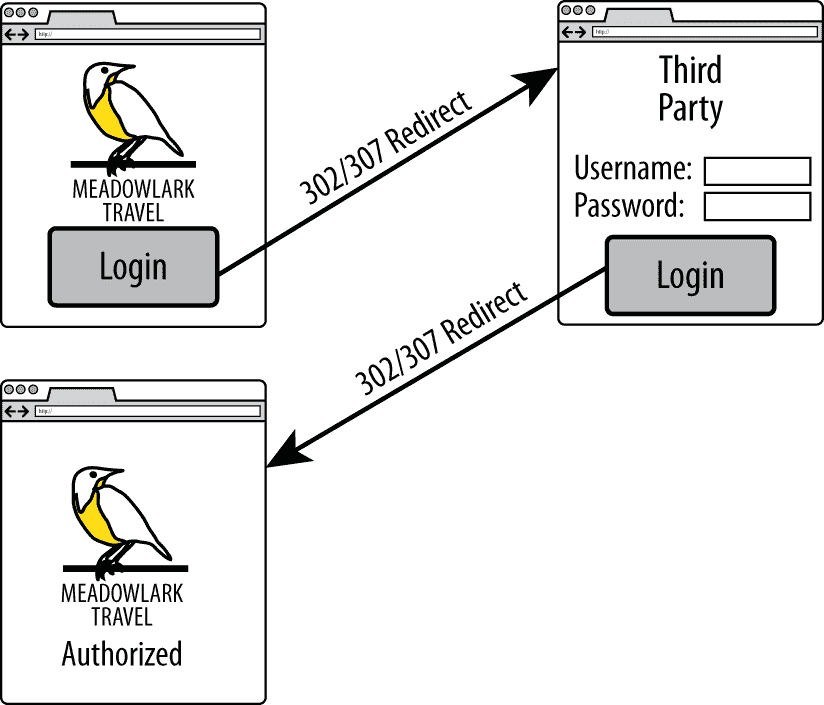
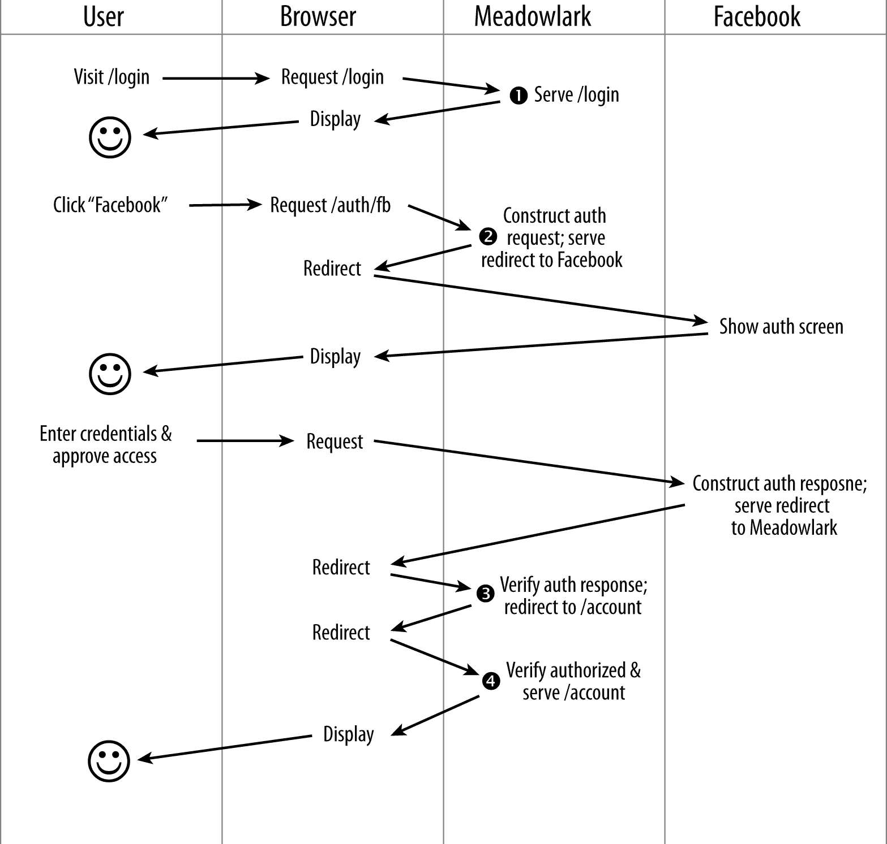

# 第十八章：安全

如今大多数网站和应用程序都有某种安全性要求。如果您允许用户登录，或者存储个人身份信息（PII），则需要为您的网站实施安全性。在本章中，我们将讨论*HTTP 安全*（HTTPS），它为您构建安全网站奠定了基础，并介绍认证机制，重点介绍第三方认证。

安全是一个大课题，可以写成一本书。因此，我们的重点将放在利用现有的认证模块上。编写自己的认证系统当然是可能的，但是这是一个庞大而复杂的工作。此外，有很多理由倾向于使用第三方登录方法，我们将在本章后面讨论。

# HTTPS

提供安全服务的第一步是使用 HTTPS。互联网的性质使得第三方有可能拦截客户端和服务器之间传输的数据包。HTTPS 对这些数据包进行加密，使得攻击者极难获取传输的信息。（我说“非常困难”，而不是“不可能”，因为没有绝对安全的事物。然而，HTTPS 被认为对于银行业务、企业安全和医疗保健是足够安全的。）

你可以把 HTTPS 看作是保护网站安全的基础。它并不提供认证，但它为认证奠定了基础。例如，你的认证系统可能涉及传输密码；如果密码未加密传输，无论认证有多复杂，都无法保护你的系统。安全性如同链条中的最弱环节一般，而这个链条的第一环就是网络协议。

HTTPS 协议基于服务器拥有的*公钥证书*，有时也称为 SSL 证书。当前 SSL 证书的标准格式称为*X.509*。证书的理念是有*证书颁发机构*（CA）发布证书。证书颁发机构将*受信任的根证书*提供给浏览器供应商。在安装浏览器时，浏览器会包含这些受信任的根证书，这就建立了 CA 与浏览器之间的信任链。为了使这个链条有效，你的服务器必须使用由 CA 颁发的证书。

结论是，要提供 HTTPS，您需要从 CA 获取证书，那么如何获取这样的证书呢？大体上讲，您可以自己生成，从免费的 CA 获取，或者从商业 CA 购买。

## 生成您自己的证书

生成自己的证书很容易，但通常仅适用于开发和测试目的（可能也适用于内部部署）。由于证书颁发机构建立的层次结构，浏览器只信任由已知 CA 生成的证书（而您可能不是）。如果您的网站使用来自浏览器不认识的 CA 的证书，浏览器将以非常警告的语言警告您正在与一个未知的（因此不受信任的）实体建立安全连接。在开发和测试中，这没问题：您和您的团队知道您生成了自己的证书，并且您希望浏览器表现出这种行为。如果您要将此类网站部署到面向公众的生产环境中，他们会大量流失。

###### 注意

如果您控制浏览器的分发和安装，可以在安装浏览器时自动安装您自己的根证书。这将防止使用该浏览器的人在连接到您的网站时收到警告。然而，这并不是一件容易设置的事情，并且仅适用于您控制使用的浏览器的环境。除非您有非常充分的理由采取这种方法，否则通常比值得的麻烦多。

要生成自己的证书，您需要一个 OpenSSL 实现。表 18-1 显示如何获取一个实现。

表 18-1\. 获取不同平台的实现

| Platform | Instructions |
| --- | --- |
| macOS | `brew install openssl` |
| Ubuntu, Debian | `sudo apt-get install openssl` |
| Other Linux | 从 [*http://www.openssl.org/source/;*](http://www.openssl.org/source/;) 下载并解压 tarball，然后按照说明进行操作 |
| Windows | 从 [*http://gnuwin32.sourceforge.net/packages/openssl.htm*](http://gnuwin32.sourceforge.net/packages/openssl.htm) 下载 |

###### 提示

如果您是 Windows 用户，可能需要指定 OpenSSL 配置文件的位置，由于 Windows 路径名可能比较复杂。确定可行的方法是找到 *openssl.cnf* 文件（通常在安装的 *share* 目录中），在运行 `openssl` 命令之前设置 `OPENSSL_CONF` 环境变量：`SET OPENSSL_CONF=openssl.cnf`。

安装完 OpenSSL 后，您可以生成私钥和公共证书：

```
openssl req -x509 -nodes -days 365 -newkey rsa:2048 -keyout meadowlark.pem
	-out meadowlark.crt
```

在申请证书时，您将被要求提供一些详细信息，如您的国家代码、城市和州、完全合格的域名（FQDN，也称为通用名称或完全合格的主机名）和电子邮件地址。由于此证书是用于开发/测试目的，您提供的值并不特别重要（事实上，它们都是可选的，但是省略它们会导致浏览器更加怀疑您的证书）。通用名称（FQDN）是浏览器用来识别域名的。因此，如果您使用 *localhost*，您可以将其用作您的 FQDN，或者如果可用，您可以使用服务器的 IP 地址或服务器名称。如果在 URL 中使用的通用名称和域名不匹配，加密仍将起作用，但您的浏览器将额外警告您有关不匹配的信息。

如果您对这个命令的详细内容感兴趣，可以在[OpenSSL 文档页面](http://bit.ly/2q64psm)上了解更多。值得指出的是，`-nodes` 选项与 Node 或者复数形式的 "nodes" 没有关系：它实际上意味着 "no DES"，即私钥未经 DES 加密。

这个命令的结果是两个文件，*meadowlark.pem* 和 *meadowlark.crt*。Privacy-Enhanced Electronic Mail (PEM) 文件是您的私钥，不应该提供给客户端。CRT 文件是自签名证书，将被发送到浏览器以建立安全连接。

或者，有些网站提供免费的自签名证书，比如[这个网站](http://bit.ly/354ClEL)。

## 使用免费证书颁发机构

HTTPS 建立在信任的基础上，遗憾的是，获得互联网上信任的最简单方式之一是购买它。而且这并非都是蛇油，建立安全基础设施、保险证书以及与浏览器供应商维持关系都是昂贵的事情。

购买证书并不是生产准备好证书的唯一合法选择：[Let's Encrypt](https://letsencrypt.org)，一个基于开源的免费自动化 CA，已经成为一个很好的选择。事实上，除非您已经投资于提供免费或廉价证书作为托管服务一部分的基础设施（例如 AWS），否则 Let's Encrypt 是一个很好的选择。Let's Encrypt 的唯一不足是其证书的最大生存期为 90 天。这个缺点可以通过 Let's Encrypt 非常容易地自动续订证书来抵消，并建议每 60 天设置一个自动化流程来确保证书不会过期。

所有主要的证书供应商（如 Comodo 和 Symantec）都提供免费试用证书，有效期从 30 到 90 天不等。如果您想测试商业证书，这是一个有效的选择，但是在试用期结束之前，您需要购买证书以确保服务的连续性。

## 购买证书

目前，每个主要浏览器分发的大约 50 个根证书中，有 90%归属于四家公司：Symantec（购并 VeriSign）、Comodo Group、Go Daddy 和 GlobalSign。直接从 CA（证书颁发机构）购买可能非常昂贵：通常起价约为每年$300（尽管有些提供少于每年$100 的证书）。通过经销商是一个更便宜的选择，你可以以每年至少$10 或更少的价格获得 SSL 证书。

确切了解你支付的内容及其原因是非常重要的，不论是支付$10、$150 还是$300（或更高）的证书。理解的第一个重要点是，$10 的证书和$1,500 的证书在加密级别上完全没有任何区别。这是昂贵的证书颁发机构宁愿你不知道的事实：他们的营销努力掩盖这一事实。

如果选择商业证书供应商，我建议在做出选择时考虑以下三个因素：

客户支持

如果你在使用证书时遇到问题，无论是浏览器支持（客户会告诉你他们的浏览器是否将你的证书标记为不可信任）、安装问题还是续订麻烦，你会感激良好的客户支持。这是你可能购买更昂贵证书的一个原因。通常，你的托管提供商将转售证书，根据我的经验，他们提供更高水平的客户支持，因为他们也希望保持你作为托管客户。

单域、多子域、通配符和多域证书

最便宜的证书通常是*单域*的。这听起来可能不那么糟糕，但请记住，这意味着如果你为*meadowlarktravel.com*购买了证书，那么该证书对*www.meadowlarktravel.com*或反之无效。因此，我倾向于避免单域证书，尽管对于极度节约成本的人来说可能是一个不错的选择（你始终可以设置重定向来引导请求到正确的域名）。*多子域*证书之所以好，是因为你可以购买一个覆盖*meadowlarktravel.com*、*www.meadowlark.com*、*blog.meadowlarktravel.com*、*shop.meadowlarktravel.com*等所有子域的单一证书。缺点是你必须预先知道要使用哪些子域。

如果你计划在一年内增加或使用不同的子域（需要支持 HTTPS），你可能最好选择*通配符*证书，它们通常更昂贵。但它们适用于*任何*子域，并且你不需要指定子域是什么。

最后，还有*多域证书*，就像通配符证书一样，往往更昂贵。这些证书支持多个完整的域，因此，例如，您可以拥有*meadowlarktravel.com*、*meadowlarktravel.us*、*meadowlarktravel.com*以及*www*变体。

域名、组织和扩展验证证书

有三种类型的证书：域名、组织和扩展验证。*域名证书*如其名称所示，仅提供您确实正在与您认为的*域名*进行业务。另一方面，*组织证书*则对您正在打交道的实际组织提供了一些保证。这些证书更难获取：通常涉及文件工作，您必须提供州和/或联邦商业名称记录、物理地址等。不同的证书供应商可能需要不同的文件，因此，请确保向您的证书供应商询问获取这些证书所需的文件。最后是*扩展验证证书*，它们是 SSL 证书的劳斯莱斯。它们类似于组织证书，因为它们验证组织的存在，但它们要求更高的证明标准，甚至可能需要昂贵的审计来建立您的数据安全实践（尽管这种情况似乎越来越少见）。单个域名的扩展验证证书可以低至 150 美元。

我建议使用更便宜的域名证书或扩展验证证书。组织证书虽然验证了您的组织的存在，但与浏览器显示无异，因此根据我的经验，除非用户确实检查证书（这种情况很少），否则这与域名证书之间没有明显区别。另一方面，扩展验证证书通常会向用户显示一些线索，表明他们正在与合法的企业打交道（例如，URL 栏显示为绿色，并且组织名称显示在 SSL 图标旁边）。

如果你以前处理过 SSL 证书，你可能会想为什么我没有提到证书保险。我省略了这一价格差异化因素，因为本质上这是针对几乎不可能发生的情况的保险。其理念是，如果有人因为你网站上的交易而遭受了财务损失，并且他们能够*证明这是由于不足的加密措施*，那么保险将赔偿你的损失。尽管有可能，如果你的应用涉及财务交易，某人可能会因财务损失而对你提起法律诉讼，但由于加密不足导致的情况几乎为零。如果我试图因为与公司的在线服务相关的财务损失而寻求赔偿，我最后绝不会采取的方法就是试图证明 SSL 加密已被破解。如果你面对两张唯一区别在价格和保险覆盖范围的证书，那么选择便宜的证书吧。

购买证书的过程从创建私钥开始（就像我们之前为自签名证书所做的那样）。然后，你将生成一个*证书签名请求*（CSR），在证书购买过程中上传该请求（证书颁发机构将提供操作说明）。请注意，证书颁发机构永远不会访问你的私钥，也不会通过互联网传输你的私钥，这保护了私钥的安全性。颁发机构将随后发送证书给你，其扩展名为*.crt*、*.cer*或*.der*（证书将采用称为 Distinguished Encoding Rules 或 DER 的格式，因此也有较少见的*.der*扩展名）。你还将收到证书链中的任何证书。可以安全地通过电子邮件发送这些证书，因为没有你生成的私钥，这些证书无法正常工作。

## 为你的 Express 应用启用 HTTPS

你可以修改你的 Express 应用程序以通过 HTTPS 提供网站服务。在实践和生产中，这是极不常见的，我们将在下一节中了解更多。然而，对于高级应用程序、测试以及对 HTTPS 的理解，了解如何提供 HTTPS 服务是非常有用的。

一旦你有了私钥和证书，在你的应用中使用它们就很容易。让我们重新审视一下我们一直在创建服务器的方式：

```
app.listen(app.get('port'), () => {
  console.log(`Express started in ${app.get('env')} mode ` +
    `on port + ${app.get('port')}.`)
})
```

切换到 HTTPS 很简单。我建议你将私钥和 SSL 证书放在名为*ssl*的子目录中（尽管将其放在项目根目录中也很常见）。然后，你只需使用`https`模块而不是`http`，并向`createServer`方法传递一个`options`对象：

```
const https = require('https')
const fs = require('fs')           // usually at top of file

// ...the rest of your application configuration

const options = {
  key: fs.readFileSync(__dirname + '/ssl/meadowlark.pem'),
  cert: fs.readFileSync(__dirname + '/ssl/meadowlark.crt'),
}

const port = process.env.PORT || 3000
https.createServer(options, app).listen(port, () => {
  console.log(`Express started in ${app.get('env')} mode ` +
    `on port + ${port}.`)
})
```

就是这么简单。假设你仍在使用端口 3000 运行服务器，现在你可以连接到[*https://localhost:3000*](https://localhost:3000)。如果你尝试连接到[*http://localhost:3000*](http://localhost:3000)，连接将简单超时。

## 端口注意事项

不管你知不知道，当你访问一个网站时，你总是连接到一个特定的端口，即使它在 URL 中没有指定。如果你没有指定端口，HTTP 默认使用端口 80。事实上，大多数浏览器在显式指定端口 80 时将简单地去掉端口号。例如，访问 [*http://www.apple.com:80*](http://www.apple.com:80)；页面加载时，浏览器将会直接省略 *:80*。它仍然是在端口 80 连接；只是隐含的。

同样地，HTTPS 有一个标准端口 443。浏览器的行为类似：如果你连接到 [*https://www.google.com:443*](https://www.google.com:443)，大多数浏览器将简单地不显示 *:443*，但实际上它们是连接到这个端口的。

如果你不使用端口 80 进行 HTTP 或端口 443 进行 HTTPS，你将不得不显式指定端口和协议才能正确连接。没有办法在同一个端口上同时运行 HTTP 和 HTTPS（从技术上讲是可能的，但没有充分理由这样做，而且实现起来非常复杂）。

如果你想在端口 80 运行你的 HTTP 应用，或者在端口 443 运行 HTTPS 应用以免显式指定端口，你需要考虑两件事情。首先是很多系统已经在端口 80 上运行了默认的 Web 服务器。

还有一件事需要知道的是，在大多数操作系统上，端口 1–1023 需要特权才能打开。例如，在 Linux 或 macOS 机器上，如果尝试在端口 80 上启动你的应用程序，可能会因为 `EACCES` 错误而失败。要在端口 80 或 443（或任何低于 1024 的端口）上运行，你需要通过使用 `sudo` 命令提升权限。如果你没有管理员权限，将无法直接在端口 80 或 443 上启动服务器。

除非你管理自己的服务器，否则你可能没有你托管账户的 root 访问权限：那么当你想在端口 80 或 443 上运行时会发生什么呢？一般来说，托管提供商会有某种特权代理服务，将请求传递到运行在非特权端口上的应用程序。我们将在下一节中详细了解更多信息。

## HTTPS 和代理

正如我们所见，使用 Express 来进行 HTTPS 非常简单，并且在开发阶段可以正常工作。然而，当你想要扩展你的网站以处理更多的流量时，你会希望使用像 NGINX 这样的代理服务器（参见第十二章）。如果你的网站运行在共享主机环境中，几乎可以肯定会有一个代理服务器来路由请求到你的应用程序。

如果您使用代理服务器，那么客户端（用户的浏览器）将与*代理服务器*通信，而不是与您的服务器通信。代理服务器反过来很可能会通过常规的 HTTP 与您的应用程序通信（因为您的应用程序和代理服务器将在受信任的网络上一起运行）。人们经常会说 HTTPS 在代理服务器处*终止*，或者代理服务器正在执行“SSL 终结”。

大部分情况下，一旦您或您的托管提供商正确配置了代理服务器以处理 HTTPS 请求，您就不需要进行任何额外的工作了。唯一的例外是，如果您的应用程序需要处理安全和非安全请求。

这个问题有三种解决方案。第一种方法是简单地配置代理将所有 HTTP 流量重定向到 HTTPS，从本质上迫使所有与您的应用程序的通信都是通过 HTTPS 进行的。这种方法变得越来越普遍，显然是解决问题的简便方法。

第二种方法是以某种方式将客户端代理通信中使用的协议传达给服务器。通常的通信方式是通过`X-Forwarded-Proto`头部。例如，在 NGINX 中设置此头部：

```
proxy_set_header X-Forwarded-Proto $scheme;
```

然后，在您的应用程序中，您可以测试协议是否为 HTTPS：

```
app.get('/', (req, res) => {
  // the following is essentially
  // equivalent to: if(req.secure)
  if(req.headers['x-forwarded-proto'] === 'https') {
    res.send('line is secure')
  } else {
    res.send('you are insecure!')
  }
})
```

###### 注意

在 NGINX 中，HTTP 和 HTTPS 有各自独立的`server`配置块。如果在对应于 HTTP 的配置块中未设置`X-Forwarded-Protocol`，您就有可能使客户端伪造该头部，并误导您的应用程序认为连接是安全的，尽管实际上并非如此。如果您采用这种方法，请确保*始终*设置`X-Forwarded-Protocol`头部。

当您使用代理时，Express 提供了一些便利属性，使代理更加“透明”（就像您没有使用代理一样，同时又不损失其好处）。要利用这一点，告诉 Express 信任代理，使用`app.enable('trust proxy')`。一旦这样做，`req.protocol`、`req.secure`和`req.ip`将指代客户端与代理的连接，而不是您的应用程序。

# 跨站点请求伪造

*跨站请求伪造*（CSRF）攻击利用用户通常信任其浏览器并在同一会话中访问多个站点的事实。在 CSRF 攻击中，恶意站点上的脚本向另一个站点发出请求：如果您在另一个站点上已登录，则恶意站点可以成功访问另一个站点的安全数据。

要防止 CSRF 攻击，您必须有一种方法确保请求确实来自您的网站。我们做的方式是向浏览器传递一个唯一的令牌。然后当浏览器提交表单时，服务器会检查令牌是否匹配。`csurf`中间件会为您处理令牌的创建和验证；您只需确保令牌包含在对服务器的请求中即可。安装`csurf`中间件（`npm install csurf`）；然后在链接`body-parser`、`cookie-parser`和`express-session`之后链接它，并在`res.locals`中添加一个令牌。确保在链接`csurf`中间件之前链接`body-parser`、`cookie-parser`和`express-session`：

```
// this must come after we link in body-parser,
// cookie-parser, and express-session
const csrf = require('csurf')

app.use(csrf({ cookie: true }))
app.use((req, res, next) => {
  res.locals._csrfToken = req.csrfToken()
  next()
})
```

`csurf`中间件将`csrfToken`方法添加到请求对象中。我们不必将其分配给`res.locals`；我们可以只需将`req.csrfToken()`明确地传递给每个需要它的视图，但这通常会更麻烦一些。

###### 注意

注意，包本身被称为`csurf`，但大多数变量和方法是`csrf`，没有“u”。在这里很容易被绊倒，所以要注意你的元音！

现在在所有的表单（和 AJAX 调用）中，您必须提供一个名为`_csrf`的字段，它必须与生成的令牌匹配。让我们看看如何将其添加到我们的一个表单中：

```
<form action="/newsletter" method="POST">
  <input type="hidden" name="_csrf" value="{{_csrfToken}}">
  Name: <input type="text" name="name"><br>
  Email: <input type="email" name="email"><br>
  <button type="submit">Submit</button>
</form>
```

`csurf`中间件将处理剩余的工作：如果请求体包含字段但没有有效的`_csrf`字段，它将引发错误（确保您的中间件中有一个错误路由！）。试着移除隐藏字段，看看会发生什么。

###### 提示

如果您有一个 API，您可能不希望`csurf`中间件干扰它。如果您希望限制来自其他网站的对您的 API 的访问，请查看 API 库（如`connect-rest`）的“API 密钥”功能。为了防止`csurf`干扰您的中间件，将其链接在`csurf`之前。

# 认证

认证是一个复杂的大课题。不幸的是，它也是大多数非平凡网络应用的重要组成部分。我能给你的最重要的建议是*不要试图自己做*。如果你看看你的名片上没有写“安全专家”，那么你可能没有准备好设计安全认证系统所涉及的复杂考虑。

我并不是说你不应该试图理解你的应用程序中的安全系统。我只是建议你不要自己动手构建它。可以自由地研究我即将推荐的认证技术的开源代码。这肯定会让你明白为什么你可能不想单枪匹马地承担这个任务！

## 认证与授权

虽然这两个术语经常被交替使用，但它们有所不同。*认证*指的是验证用户的身份，即确认他们是他们所说的那个人。*授权*则指确定用户被授权访问、修改或查看什么内容。例如，顾客可能被授权访问他们的账户信息，而 Meadowlark Travel 的员工则被授权访问其他人的账户信息或销售记录。

###### 注意

认证通常缩写为*authN*，而“授权”缩写为*authZ*。

通常情况下（但并非总是如此），认证先进行，然后确定授权。授权可以非常简单（授权/未授权），也可以很广泛（用户/管理员），或者非常细化，指定对不同账户类型的读取、写入、删除和更新权限。你的授权系统的复杂程度取决于你正在编写的应用程序的类型。

由于授权非常依赖于你的应用程序的细节，所以在本书中我只会提供一个粗略的概述，使用一个非常广泛的认证方案（客户/员工）。我经常会使用“auth”的缩写，但只有在上下文中明确表明它是指“认证”还是“授权”，或者这并不重要时才会这样做。

## 密码的问题

密码的问题在于，每个安全系统的强度取决于它最薄弱的环节。而密码要求用户创造一个密码，这就是最薄弱的环节。人类在创建安全密码方面众所周知地很差。在对 2018 年的安全漏洞进行分析时，最流行的密码是“123456”。“password”排名第二。即使在 2018 年这样注重安全性的年代，人们仍然选择极其糟糕的密码。例如，密码策略要求包括大写字母、数字和标点符号，结果往往是一个“Password1!”这样的密码。

即使分析密码是否与常见密码列表匹配，也无法有效解决问题。随后，人们开始将他们更高质量的密码写在记事本上，存放在未加密的文件中或通过电子邮件发送给自己。

归根结底，这是一个你作为应用设计者无法解决的问题。然而，你可以采取一些措施来促进更安全的密码管理。一种方法是将认证责任交给第三方。另一种方法是使你的登录系统适合密码管理服务，比如 1Password、Bitwarden 和 LastPass。

## 第三方认证

第三方认证利用了几乎所有互联网用户至少在一个主要服务上拥有账户的事实，比如谷歌、Facebook、Twitter 或 LinkedIn。所有这些服务都提供一种机制，通过其服务对用户进行认证和识别。

###### 注意

第三方认证通常被称为*联合认证*或*委托认证*。这些术语基本上可以互换使用，尽管联合认证通常与安全声明标记语言（SAML）和 OpenID 相关联，而委托认证则常与 OAuth 相关联。

第三方认证有三大优势。首先，您的认证负担减轻了。您无需担心单独认证每个用户，只需与信任的第三方交互即可。第二个优势是减少*密码疲劳*：与拥有过多账户相关的压力。我使用[LastPass](http://lastpass.com)，刚刚查看了我的密码保险库：我几乎有 400 个密码。作为技术专业人员，我可能比普通互联网用户拥有更多账户，但即使是偶尔上网的用户，拥有几十甚至上百个账户也并不罕见。最后，第三方认证是*无摩擦*的：它允许用户使用已有的凭证更快地开始使用您的网站。通常，如果用户发现他们需要再创建*另一个*用户名和密码，他们可能会选择放弃。

如果您不使用密码管理器，那么您很可能会为大多数网站使用相同的密码（大多数人都有一个用于银行等的“安全”密码，以及一个用于其他所有事务的“不安全”密码）。这种方法的问题在于，如果您使用的任何一个网站遭到入侵，并且您的密码泄露了，黑客将尝试在其他服务中使用相同的密码。这就像把所有的鸡蛋放在一个篮子里一样。

第三方认证也有其不足之处。难以置信的是，*确实*有些人并没有 Google、Facebook、Twitter 或 LinkedIn 的账户。此外，即使是拥有这些账户的人，他们出于怀疑（或希望保护隐私）可能不愿意使用这些凭证登录到您的网站上。许多网站通过鼓励用户使用现有账户来解决这个特定问题，但那些没有这些账户的人（或不愿意使用它们访问您的服务的人）可以为您的服务创建一个新的登录账户。

## 在您的数据库中存储用户

无论您是否依赖第三方来认证您的用户，您都希望在自己的数据库中存储用户记录。例如，如果您使用 Facebook 进行认证，那么这仅验证了用户的身份。如果您需要保存特定于该用户的设置，您不能合理地使用 Facebook 来实现：您必须在自己的数据库中存储有关该用户的信息。此外，您可能希望将电子邮件地址与您的用户关联起来，而他们可能不希望使用与 Facebook（或任何其他第三方认证服务）相同的电子邮件地址。最后，将用户信息存储在您的数据库中允许您自己执行认证，如果您希望提供该选项的话。

让我们为我们的用户创建一个模型，*models/user.js*：

```
const mongoose = require('mongoose')

const userSchema = mongoose.Schema({
  authId: String,
  name: String,
  email: String,
  role: String,
  created: Date,
})

const User = mongoose.model('User', userSchema)
module.exports = User
```

并且使用适当的抽象修改*db.js*（如果您使用的是 PostgreSQL，我会留下这个抽象的实现作为练习）：

```
const User = require('./models/user')

module.exports = {
  //...
  getUserById: async id => User.findById(id),
  getUserByAuthId: async authId => User.findOne({ authId }),
  addUser: async data => new User(data).save(),
}
```

请记住，MongoDB 数据库中的每个对象都有自己独特的 ID，存储在其`_id`属性中。然而，那个 ID 是由 MongoDB 控制的，我们需要一些方法将用户记录映射到第三方 ID，所以我们有自己的 ID 属性，称为`authId`。由于我们将使用多种认证策略，该 ID 将是策略类型和第三方 ID 的组合，以防止冲突。例如，Facebook 用户的`authId`可能是`facebook:525764102`，而 Twitter 用户的则可能是`twitter:376841763`。

在我们的示例中，我们将使用两种角色：“客户”和“员工”。

## 认证与注册及用户体验

认证是指验证用户身份的过程，可以通过一个可信任的第三方，或者通过您提供给用户的凭据（例如用户名和密码）。注册是指用户在您的站点上获得账户的过程（从我们的角度来看，注册是在数据库中创建用户记录的过程）。

当用户第一次加入您的站点时，应清楚地告知他们他们正在注册。使用第三方认证系统，如果他们成功通过第三方进行身份验证，我们可以在未经他们同意的情况下为他们注册。这通常不被视为一种良好的做法，用户应清楚地知道他们是在为您的站点注册（无论他们是否通过第三方进行认证），并提供一个明确的机制来取消他们的会员资格。

要考虑的一个用户体验情况是“第三方认证混乱”。如果一个用户在一月份使用 Facebook 注册了您的服务，然后在七月份回来时，看到一个屏幕提供了使用 Facebook、Twitter、Google 或 LinkedIn 登录的选项，那么用户很可能已经忘记了最初使用的注册服务。这是第三方认证的一个缺点，对此几乎无能为力。这是请求用户提供电子邮件地址的另一个很好的理由：这样，您可以让用户通过电子邮件查找他们的帐户，并向该地址发送一封电子邮件，指明用于认证的服务。

如果您觉得自己对用户使用的社交网络有很好的把握，可以通过一个主要的认证服务来简化这个问题。例如，如果您相当有信心大多数用户拥有 Facebook 账号，您可以设置一个大按钮，上面写着“使用 Facebook 登录”。然后，使用较小的按钮或者仅仅是文本链接，比如“或者使用 Google、Twitter 或 LinkedIn 登录”。这种方法可以减少第三方认证可能带来的混乱情况。

## 护照（Passport）

*Passport* 是 Node/Express 的一个非常流行且强大的身份验证模块。它不与任何一个认证机制绑定；相反，它基于可插拔认证*策略*的概念（包括本地策略，如果你不想使用第三方认证）。理解身份验证信息的流程可能会让人感到不知所措，所以我们将从一个认证机制开始，稍后再添加更多。

重要的细节在于，使用第三方认证时，你的应用程序*永远不会接收到密码*。这完全由第三方处理。这是件好事：它将安全处理和存储密码的负担放在了第三方身上。^(1)

整个流程依赖于重定向（如果你的应用程序永远不会接收用户的第三方密码，这一点是必须的）。起初，你可能会对为什么可以向第三方传递*localhost*网址并成功验证感到困惑（毕竟，处理你请求的第三方服务器并不知道*你的* *localhost*）。这是因为第三方简单地指示*你的浏览器*重定向，而你的浏览器位于你的网络内，因此可以重定向到本地地址。

基本流程如图 18-1 所示。此图表显示了功能流程的重要部分，清晰地表明认证实际上是在第三方网站上进行的。享受这张图表的简洁性——事情即将变得更加复杂。

当你使用 Passport 时，你的应用程序将负责四个步骤。考虑到第三方认证流程的更详细视图，如图 18-2 所示。



###### 图 18-1\. 第三方认证流程

为简单起见，我们使用 Meadowlark Travel 代表你的应用程序，Facebook 代表第三方认证机制。图 18-2 展示了用户从登录页面到安全账户信息页面的过程（账户信息页面仅用于说明目的：这可以是你网站上需要身份验证的任何页面）。

这张图表展示了在此背景下你通常不会考虑到但却很重要的细节。特别是，当你访问一个 URL 时，*你*并不是在向服务器发出请求：实际上是浏览器在执行这个动作。话虽如此，浏览器可以执行三件事情：发出 HTTP 请求、显示响应并执行重定向（实质上是发出另一个请求并显示另一个响应……这反过来又可能是另一个重定向）。

在 Meadowlark 栏中，您可以看到您的应用程序实际负责的四个步骤。幸运的是，我们将利用 Passport（和可插拔策略）来执行这些步骤的详细信息；否则，这本书会变得更加冗长。



###### 图 18-2。第三方认证流程详细视图

在我们深入实现细节之前，让我们更详细地考虑每个步骤：

登录页面

登录页面是用户可以选择登录方法的地方。如果您使用第三方认证，通常只有一个按钮或链接。如果您使用本地认证，将包括用户名和密码字段。如果用户尝试访问需要身份验证的 URL（例如我们示例中的`/account`），而没有登录，则可能需要重定向到此页面（或者，您可以重定向到未授权页面，并附带指向登录页面的链接）。

构建认证请求

在此步骤中，您将构建一个要发送到第三方的请求（通过重定向）。此请求的详细信息复杂且特定于认证策略。Passport（和策略插件）将在此处完成所有重要工作。认证请求包括对中间人攻击的保护，以及其他攻击者可能利用的向量。通常，认证请求的生命周期很短，因此您不能存储它并期望以后使用：这有助于通过限制攻击者有时间行动的窗口来防止攻击。在此处，您可以从第三方授权机制请求附加信息。例如，请求用户的姓名和可能的电子邮件地址是常见的。请注意，您从用户请求的信息越多，他们授权您的应用程序的可能性就越小。

验证认证响应

假设用户授权了您的应用程序，您将从第三方获得一个有效的认证响应，这是用户身份的证明。再次强调，此验证的详细信息较为复杂，将由 Passport（和策略插件）处理。如果认证响应表明用户未经授权（例如输入了无效凭据，或者用户未授权您的应用程序），则应将其重定向到适当的页面（可以是返回登录页面，或者是未授权或无法授权页面）。认证响应中将包括用户在特定第三方身份的 ID，以及您在步骤 2 中请求的任何附加详细信息。为了完成第 4 步，我们必须“记住”用户已经授权。通常的做法是设置一个包含用户 ID 的会话变量，指示此会话已经授权（也可以使用 cookies，但我建议使用会话）。

验证授权

在第 3 步，我们在会话中存储了一个用户 ID。该用户 ID 的存在允许我们从数据库中检索用户对象，该对象包含关于用户授权操作的信息。通过这种方式，我们无需为每个请求与第三方进行身份验证（这将导致用户体验缓慢而痛苦）。这项任务很简单，我们不再需要 Passport 来执行此操作：我们有自己的用户对象，其中包含我们自己的身份验证规则。（如果该对象不可用，则表示请求未经授权，我们可以重定向到登录页面或未授权页面。）

###### 提示

使用 Passport 进行身份验证是相当多的工作，正如您在本章中所看到的那样。然而，身份验证是您的应用程序的重要部分，我认为在正确设置方面投入一些时间是明智的。有一些项目（如[LockIt](http://bit.ly/lock_it)）试图提供更“即插即用”的解决方案。另一个越来越受欢迎的选择是[Auth0](https://auth0.com)，它非常强大，但设置起来不像 LockIt 那样简单。然而，为了最有效地使用 LockIt 或 Auth0（或类似的解决方案），了解身份验证和授权的详细信息对您来说是非常重要的，而这正是本章的设计目的。此外，如果您需要定制身份验证解决方案，Passport 是一个很好的起点。

### 设置 Passport

为了保持简单，我们将从一个身份验证提供者开始。任意地，我们选择了 Facebook。在我们可以设置 Passport 和 Facebook 策略之前，我们需要在 Facebook 上进行一些配置。对于 Facebook 身份验证，您需要一个*Facebook 应用程序*。如果您已经有一个合适的 Facebook 应用程序，您可以使用它，或者您可以为身份验证专门创建一个新的应用程序。如果可能的话，您应该使用您组织的官方 Facebook 帐户来创建应用程序。也就是说，如果您在 Meadowlark Travel 工作，您将使用 Meadowlark Travel 的 Facebook 帐户来创建应用程序（您始终可以将您的个人 Facebook 帐户添加为应用程序的管理员，以便更方便地进行管理）。为了测试目的，使用您自己的 Facebook 帐户是可以的，但是在生产中使用个人帐户会给您的用户留下不专业和可疑的印象。

Facebook 应用程序管理的详细信息似乎经常更改，因此我不打算在此处详细说明。如果您需要有关创建和管理您的应用程序的详细信息，请参阅[Facebook 开发者文档](http://bit.ly/372bc7c)。

为了开发和测试目的，您需要将开发/测试域名与该应用关联起来。Facebook 允许您使用*localhost*（和端口号），这对测试非常有利。或者，您可以指定本地 IP 地址，这在使用虚拟化服务器或网络中的另一台服务器进行测试时会很有帮助。重要的是，您在浏览器中输入的用于测试应用程序的 URL（例如*http://localhost:3000*）与 Facebook 应用程序关联起来。目前，您只能将一个域名与您的应用程序关联起来：如果您需要使用多个域名，您将不得不创建多个应用程序（例如，您可以拥有 Meadowlark Dev、Meadowlark Test 和 Meadowlark Staging；您的生产应用程序可以简称为 Meadowlark Travel）。

配置完成应用程序后，您将需要其唯一的应用程序 ID 和应用程序密钥，这两者都可以在该应用程序的 Facebook 应用管理页面上找到。

###### 提示

您可能会面临的最大挑战之一可能是收到来自 Facebook 的消息，例如“给定的 URL 未在应用配置中允许”。这表明回调 URL 中的主机名和端口与您在应用中配置的不匹配。如果查看浏览器中的 URL，您将看到编码的 URL，这应该会给您一个提示。例如，如果我使用了 192.168.0.103:3443，并且收到了那个消息，我会查看 URL。如果我在查询字符串中看到*redirect_uri=https%3A%2F%2F192.68.0.103%3A3443%2F* *auth%2Ffacebook%2Fcallback*，我很快就会发现错误：我在主机名中使用了 68 而不是 168。

现在让我们安装 Passport 和 Facebook 认证策略：

```
npm install passport passport-facebook
```

在我们完成之前，将会有大量的认证代码（特别是如果我们支持多种策略），我们不希望在*meadowlark.js*中混杂所有这些代码。相反，我们将创建一个名为*lib/auth.js*的模块。这将是一个大文件，因此我们将逐步进行（请参见伴随存储库中的*ch18*以获取完成示例）。我们将从导入和 Passport 需要的两个方法`serializeUser`和`deserializeUser`开始：

```
const passport = require('passport')
const FacebookStrategy = require('passport-facebook').Strategy

const db = require('../db')

passport.serializeUser((user, done) => done(null, user._id))

passport.deserializeUser((id, done) => {
  db.getUserById(id)
    .then(user => done(null, user))
    .catch(err => done(err, null))
})
```

Passport 使用`serializeUser`和`deserializeUser`将请求映射到经过身份验证的用户，允许您使用任何存储方法。在我们的情况下，我们只会将数据库 ID（即 `_id` 属性）存储在会话中。我们在这里使用 ID 的方式使得“序列化”和“反序列化”有点名不副实：实际上，我们只是在会话中存储了一个用户 ID。然后，当需要时，我们可以通过在数据库中查找该 ID 来获取用户对象。

一旦实现了这两种方法，只要存在活动会话，并且用户已经成功认证，`req.session.passport.user`将是从数据库检索到的相应用户对象。

接下来，我们将选择导出什么内容。为了启用 Passport 的功能，我们需要执行两个不同的活动：初始化 Passport，并注册处理身份验证和来自第三方身份验证服务的重定向回调的路由。我们不想在一个函数中将这两个活动合并，因为在我们的主应用程序文件中，我们可能希望选择何时将 Passport 链接到中间件链中（记住在添加中间件时顺序很重要）。因此，我们不是导出执行这些操作中的任一操作的模块导出函数，而是返回一个返回我们需要的方法的对象的函数。为什么不直接返回一个对象？因为我们需要嵌入一些配置值。而且，由于我们需要将 Passport 中间件链接到我们的应用程序中，使用函数可以轻松地传递 Express 应用程序对象：

```
module.exports = (app, options) => {
  // if success and failure redirects aren't specified,
  // set some reasonable defaults
  if(!options.successRedirect) options.successRedirect = '/account'
  if(!options.failureRedirect) options.failureRedirect = '/login'
  return {
    init: function() { /* TODO */ },
    registerRoutes: function() { /* TODO */ },
  }
}
```

在我们详细讨论 `init` 和 `registerRoutes` 方法之前，让我们看看我们将如何使用这个模块（希望这能让我们返回一个返回对象的函数的业务更加清晰）：

```
const createAuth = require('./lib/auth')

// ...other app configuration

const auth = createAuth(app, {
  // baseUrl is optional; it will default to localhost if you omit it;
  // it can be helpful to set this if you're not working on
  // your local machine.  For example, if you were using a staging server,
  // you might set the BASE_URL environment variable to
  // https://staging.meadowlark.com
  baseUrl: process.env.BASE_URL,
  providers: credentials.authProviders,
  successRedirect: '/account',
  failureRedirect: '/unauthorized',
})

// auth.init() links in Passport middleware:
auth.init()

// now we can specify our auth routes:
auth.registerRoutes()
```

请注意，除了指定成功和失败重定向路径外，我们还指定了一个名为 `providers` 的属性，该属性已在凭据文件中外部化（参见第十三章）。我们需要将 `authProviders` 属性添加到 *.credentials.development.json* 文件中：

```
"authProviders": {
  "facebook": {
    "appId": "your_app_id",
    "appSecret": "your_app_secret"
  }
}
```

###### 提示

另一个将认证代码打包成这样一个模块的原因是我们可以将其重用于其他项目；事实上，已经有一些认证包在基本上做我们在这里做的事情。但是，了解正在进行的一切的细节非常重要，因此即使最终使用别人编写的模块，这也将帮助您理解您的认证流程中发生的一切。

现在让我们处理我们的 `init` 方法（先前在 *auth.js* 中作为“TODO”）：

```
init: function() {
  var config = options.providers

  // configure Facebook strategy
  passport.use(new FacebookStrategy({
    clientID: config.facebook.appId,
    clientSecret: config.facebook.appSecret,
    callbackURL: (options.baseUrl || '') + '/auth/facebook/callback',
  }, (accessToken, refreshToken, profile, done) => {
    const authId = 'facebook:' + profile.id
    db.getUserByAuthId(authId)
      .then(user => {
        if(user) return done(null, user)
        db.addUser({
          authId: authId,
          name: profile.displayName,
          created: new Date(),
          role: 'customer',
        })
          .then(user => done(null, user))
          .catch(err => done(err, null))
      })
      .catch(err => {
        if(err) return done(err, null);
      })
  }))

  app.use(passport.initialize())
  app.use(passport.sessionp))
},
```

这段代码非常密集，但实际上大部分只是 Passport 的样板代码。关键在于传递给 `FacebookStrategy` 实例的函数内部。当这个函数被调用时（用户成功认证后），`profile` 参数包含了关于 Facebook 用户的信息。最重要的是，它包括了 Facebook ID：这是我们将使用来关联 Facebook 帐户到我们自己的用户对象的信息。请注意，我们通过在 `authId` 属性前加上 `*facebook:*` 的前缀来命名空间化我们的属性。尽管可能性微乎其微，但这样可以防止 Facebook ID 与 Twitter 或 Google ID 冲突（同时也允许我们检查用户模型，查看用户使用的认证方法，这可能会很有用）。如果数据库已经包含了这个命名空间化的 ID 的条目，我们只需返回它（这时会调用 `serializeUser`，它会将我们自己的用户 ID 放入会话中）。如果没有返回用户记录，我们会创建一个新的用户对象并将其保存到数据库中。

我们要做的最后一件事是创建我们的 `registerRoutes` 方法（别担心，这个方法要短得多）：

```
  registerRoutes: () => {
    app.get('/auth/facebook', (req, res, next) => {
      if(req.query.redirect) req.session.authRedirect = req.query.redirect
      passport.authenticate('facebook')(req, res, next)
    })
    app.get('/auth/facebook/callback', passport.authenticate('facebook',
      { failureRedirect: options.failureRedirect }),
      (req, res) => {
        // we only get here on successful authentication
        const redirect = req.session.authRedirect
        if(redirect) delete req.session.authRedirect
        res.redirect(303, redirect || options.successRedirect)
      }
    )
  },
```

现在我们有了路径 */auth/facebook*；访问此路径将自动将访问者重定向到 Facebook 的身份验证界面（这是通过 `passport.authenticate('facebook’)` 完成的），见 图 18-1 第 2 步。请注意，我们检查是否有查询字符串参数 `redirect`；如果有，我们将其保存在会话中。这样我们就可以在完成身份验证后自动重定向到预定的目标。一旦用户通过 Twitter 授权，浏览器将被重定向回您的站点——具体来说，是到路径 */auth/facebook/callback*（带有可选的 `redirect` 查询字符串，指示用户最初的位置）。

另外，在查询字符串中还有 Passport 将验证的身份验证令牌。如果验证失败，Passport 将重定向浏览器到 `options.failureRedirect`。如果验证成功，Passport 将调用 `next`，这是您的应用程序再次参与的地方。请注意中间件在处理 */auth/facebook/callback* 的处理程序中是如何链接的：首先调用 `passport.authenticate`。如果它调用了 `next`，控制权将传递给您的函数，然后根据情况重定向到原始位置或 `options.successRedirect`，如果未指定 `redirect` 查询字符串参数。

###### 小贴士

省略 `redirect` 查询字符串参数可能会简化您的身份验证路由，如果只有一个需要身份验证的 URL，这可能会很诱人。但是，将此功能可用将来会很方便，并提供更好的用户体验。毫无疑问，您之前也经历过这种情况：找到想要的页面，然后被要求登录。您登录后，会被重定向到默认页面，然后必须导航回原始页面。这并不是一个令人满意的用户体验。

在这个过程中 Passport 所做的“魔术”是将用户（在我们的情况下，仅仅是数据库用户 ID）保存到会话中。这是件好事，因为浏览器正在*重定向*，这是一个不同的 HTTP 请求：如果会话中没有这些信息，我们将无法知道用户是否已经通过了身份验证！一旦用户成功通过身份验证，`req.session.passport.user` 将被设置，这样未来的请求就会知道用户已经通过了身份验证。

让我们看看我们的 `/account` 处理程序如何检查用户是否已经通过了身份验证（此路由处理程序将在我们的主应用程序文件中，或者在一个单独的路由模块中，而不是在 */lib/auth.js* 中）：

```
app.get('/account', (req, res) => {
  if(!req.user)
    return res.redirect(303, '/unauthorized')
  res.render('account', { username: req.user.name })
})
// we also need an 'unauthorized' page
app.get('/unauthorized', (req, res) => {
  res.status(403).render('unauthorized')
})
// and a way to logout
app.get('/logout', (req, res) => {
  req.logout()
  res.redirect('/')
})
```

现在只有经过身份验证的用户才能看到帐户页面；其他所有人将被重定向到一个未授权页面。

## 基于角色的授权

到目前为止，我们在技术上并没有执行任何授权（我们只是区分了经过授权和未经授权的用户）。然而，假设我们只想让顾客看到他们的账户视图（员工可能有一个完全不同的视图，他们可以在其中查看用户账户信息）。

记住，在单个路由中，你可以有多个按顺序调用的函数。让我们创建一个名为`customerOnly`的函数，它将只允许顾客：

```
const customerOnly = (req, res, next) => {
  if(req.user && req.user.role === 'customer') return next()
  // we want customer-only pages to know they need to logon
  res.redirect(303, '/unauthorized')
}
```

让我们还创建一个`employeeOnly`函数，它将有所不同。假设我们有一个路径*/sales*，我们希望只有员工能够访问。此外，我们不希望非员工甚至意外地知道它的存在。如果潜在的攻击者访问了*/sales*路径，并看到了一个未经授权的页面，这可能会使攻击变得更容易（只需知道页面的存在）。因此，为了增加一点安全性，我们希望非员工在访问*/sales*页面时看到一个普通的 404 页面，让潜在的攻击者没有可利用的信息：

```
const employeeOnly = (req, res, next) => {
  if(req.user && req.user.role === 'employee') return next()
  // we want employee-only authorization failures to be "hidden", to
  // prevent potential hackers from even knowing that such a page exists
  next('route')
}
```

调用`next('route’)`不仅仅会执行路由中的下一个处理程序：它将完全跳过这个路由。假设后面没有处理`/account`的路由，最终将会传递给 404 处理程序，从而得到我们想要的结果。

使用这些功能非常容易：

```
// customer routes

app.get('/account', customerOnly, (req, res) => {
  res.render('account', { username: req.user.name })
})
app.get('/account/order-history', customerOnly, (req, res) => {
  res.render('account/order-history')
})
app.get('/account/email-prefs', customerOnly, (req, res) => {
  res.render('account/email-prefs')
})

// employer routes

app.get('/sales', employeeOnly, (req, res) => {
	res.render('sales')
})
```

应该明确的是基于角色的授权可以像你希望的那样简单或者复杂。例如，如果你想允许多个角色怎么办？你可以使用下面的函数和路由：

```
const allow = roles => (req, res, next) => {
  if(req.user && roles.split(',').includes(req.user.role)) return next()
  res.redirect(303, '/unauthorized')
}
```

希望这个例子能让你对基于角色的授权有所了解。你甚至可以根据其他属性进行授权，比如用户成为会员的时间长度或者与你预定的假期数量。

## 添加认证提供者

现在我们的框架已经就位，添加更多认证提供者变得很容易。假设我们想要与 Google 进行认证。在我们开始添加代码之前，你需要在你的 Google 账号上设置一个项目。

前往你的[Google 开发者控制台](http://bit.ly/2KcY1X0)，并在导航栏中选择一个项目（如果你还没有项目，点击新建项目并按照指示操作）。一旦选择了项目，点击“启用 API 和服务”，启用 Cloud Identity API。点击凭据，然后创建凭据，选择“OAuth 客户端 ID”，然后选择“Web 应用程序”。输入你的应用程序的适当 URL：用于测试你可以使用*http://localhost:3000*作为授权来源，*http://localhost:3000/auth/google/callback*作为授权重定向 URI。

一旦你在 Google 端设置好了一切，运行`npm install passport-google-oauth20`，然后将以下代码添加到*lib/auth.js*中：

```
// configure Google strategy
passport.use(new GoogleStrategy({
  clientID: config.google.clientID,
  clientSecret: config.google.clientSecret,
  callbackURL: (options.baseUrl || '') + '/auth/google/callback',
}, (token, tokenSecret, profile, done) => {
  const authId = 'google:' + profile.id
  db.getUserByAuthId(authId)
    .then(user => {
      if(user) return done(null, user)
      db.addUser({
        authId: authId,
        name: profile.displayName,
        created: new Date(),
        role: 'customer',
      })
        .then(user => done(null, user))
        .catch(err => done(err, null))
    })
    .catch(err => {
      console.log('whoops, there was an error: ', err.message)
      if(err) return done(err, null);
    })
}))
```

并将以下内容添加到`registerRoutes`方法中：

```
app.get('/auth/google', (req, res, next) => {
  if(req.query.redirect) req.session.authRedirect = req.query.redirect
  passport.authenticate('google', { scope: ['profile'] })(req, res, next)
})
app.get('/auth/google/callback', passport.authenticate('google',
  { failureRedirect: options.failureRedirect }),
  (req, res) => {
    // we only get here on successful authentication
    const redirect = req.session.authRedirect
    if(redirect) delete req.session.authRedirect
    res.redirect(303, req.query.redirect || options.successRedirect)
  }
)
```

# 结论

恭喜您通过了最复杂的章节！很遗憾，如此重要的功能（认证和授权）如此复杂，但在一个充满安全威胁的世界中，这是不可避免的复杂性。幸运的是，像 Passport 这样的项目（以及基于它的优秀认证方案）在某种程度上减轻了我们的负担。然而，我鼓励您不要在应用程序的这个领域马虎对待：在安全领域保持谨慎将使您成为一个优秀的网络公民。您的用户可能永远不会因此感谢您，但如果因为安全不当导致用户数据泄露，应用程序的所有者将会后悔不已。

^(1) 第三方也不太可能存储密码。密码可以通过存储所谓的*盐值哈希*来验证，这是密码的单向转换。也就是说，一旦你从密码生成了哈希值，就无法恢复密码。*对哈希进行加盐*可以提供额外的保护，防止某些类型的攻击。
