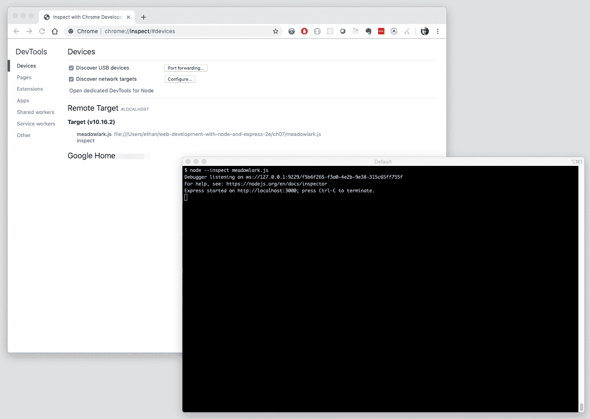
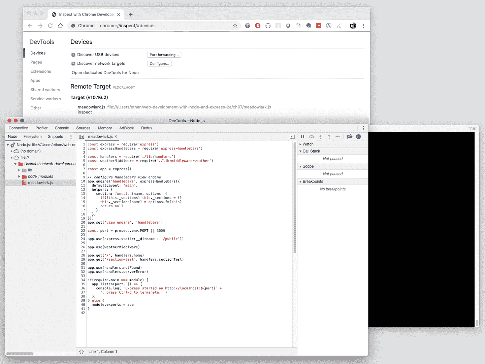

# 第二十章：调试

“调试”可能是一个不幸的术语，因为它与缺陷有关。事实上，我们所说的“调试”是一种活动，你会发现自己一直在做，无论是实现新功能、学习某些东西的工作原理，还是实际修复一个 bug。一个更好的术语可能是“探索”，但我们还是坚持使用“调试”，因为它所指的活动是明确的，无论动机如何。

调试是一个经常被忽视的技能：似乎大多数程序员被期望天生就知道如何做。也许计算机科学教授和书籍作者认为调试是如此明显的一项技能，以至于他们忽视了它。

事实上，调试是一种可以教授的技能，它是程序员了解他们所工作的框架以及他们自己和团队代码的重要方式。在本章中，我们将讨论一些可以有效调试 Node 和 Express 应用程序的工具和技术。

# 调试的第一原则

顾名思义，“调试”通常指找出和消除缺陷的过程。在谈论工具之前，让我们考虑一些通用的调试原则。

> 我多少次告诉过你，当你排除了不可能的事情之后，无论多么不可思议，剩下的一定是真相？
> 
> 阿瑟·柯南·道尔

调试的第一个和最重要的原则是*排除*的过程。现代计算机系统非常复杂，如果你必须在脑海中掌握整个系统，并从中挑出单个问题的源头，你可能甚至都不知道从哪里开始。每当你面对一个不明显的问题时，你的*第一个想法*应该是：“我可以*排除*作为问题来源的哪些因素？”你能排除得越多，你就需要查找的地方就越少。

排除可以采取多种形式。以下是一些常见的例子：

+   系统地注释或禁用代码块。

+   编写可以通过单元测试覆盖的代码；单元测试本身提供了一个排除错误的框架。

+   分析网络流量以确定问题是客户端还是服务器端。

+   测试与第一个相似的系统的不同部分。

+   使用之前成功的输入，并逐步更改输入直到问题显现。

+   使用版本控制在时间上前后移动，直到问题消失，并且你可以将其隔离到特定的更改（有关此信息，请参见[`git bisect`](http://bit.ly/34TOufp)）。

+   “模拟”功能以消除复杂的子系统。

虽然消除不是万能药，但它也不是银弹。通常，问题是由两个或更多组件之间复杂的交互引起的：消除（或模拟）任何一个组件，问题可能会消失，但问题不能被隔离到任何单一组件。即使在这种情况下，消除也可以帮助缩小问题的范围，即使它没有在确切位置上点亮霓虹灯。

消除最成功的时候要谨慎和有条理。当你只是肆意消除组件而不考虑这些组件对整体的影响时，很容易忽略事物。和自己玩一个游戏：当你考虑消除一个组件时，走一遍消除那个组件将如何影响系统的步骤。这将告诉你要期待什么，以及消除组件是否会告诉你有用的信息。

# 充分利用 REPL 和控制台

无论是 Node 还是你的浏览器都提供了一个*读取-评估-打印循环*（REPL）；这基本上只是一种交互式编写 JavaScript 的方式。你输入一些 JavaScript 代码，按 Enter，立即看到输出。这是一个很好的玩耍方式，通常也是在小段代码中找到错误最快最直观的方式。

在浏览器中，你只需打开 JavaScript 控制台，你就有了一个 REPL。在 Node 中，你只需不带任何参数输入`node`，你就进入了 REPL 模式；你可以要求包、创建变量和函数，或者做你在代码中通常能做的任何其他事情（除了创建包：在 REPL 中没有有意义的方式来做这件事）。

控制台日志也是你的好朋友。这是一种粗糙的调试技术，也许是一种简单的技术（易于理解和实现）。在 Node 中调用`console.log`将以易于阅读的格式输出对象的内容，因此你可以轻松地发现问题。请记住，某些对象可能很大，将它们记录到控制台中将产生大量输出，这样你可能很难找到任何有用的信息。例如，尝试在你的路径处理程序中使用`console.log(req)`。

# 使用 Node 的内置调试器

Node 有一个内置的调试器，允许你像陪同 JavaScript 解释器一样逐步调试你的应用程序。要开始调试你的应用程序，你只需使用`inspect`参数：

```
node inspect meadowlark.js
```

当你这样做时，你会立即注意到几件事情。首先，在你的控制台上你会看到一个 URL；这是因为 Node 调试器通过创建自己的 Web 服务器来工作，这允许你控制被调试应用程序的执行。现在可能并不令人印象深刻，但当我们讨论检查器客户端时，这种方法的有用性将是显而易见的。

当你处于控制台调试器时，你可以输入 `help` 来获取命令列表。你最常使用的命令是 `n`（下一步）、`s`（步进）和 `o`（步出）。`n` 将“跳过”当前行：它会执行它，但如果该指令调用其他函数，则这些函数将在控制返回给你之前执行。相比之下，`s` 将*进入*当前行：如果该行调用其他函数，你将能够逐步执行它们。`o` 允许你从当前执行的函数中跳出。（请注意，“步入”和“步出”仅适用于*函数*；它们不会进入或退出`if`或`for`块或其他流程控制语句。）

命令行调试器具有更多功能，但你可能不经常使用它。命令行非常适合许多事情，但调试不是它的长项。当需要时可以快速使用（例如，如果你只能通过 SSH 访问服务器，或者你的服务器甚至没有安装 GUI）。更常见的情况是，你会想要使用图形检视器客户端。

# 节点检视器客户端

虽然你可能不想在一般情况下使用命令行调试器，但 Node 通过 Web 服务公开其调试控件，给你提供了其他选项。

最直接的调试器是使用 Chrome，它使用与调试前端代码相同的调试接口。因此，如果你以前使用过该接口，你应该会很快上手。入门很容易。使用`--inspect`选项启动你的应用程序（这与前面提到的`inspect`参数是不同的）：

```
node --inspect meadowlark.js
```

现在开始有趣的部分：在你的浏览器的 URL 栏中输入 `*chrome://inspect*`。你会看到一个开发者工具页面，在设备部分点击“为 Node 打开专用的 DevTools”。这将打开一个新窗口，即你的调试器：



点击“Sources”选项卡，然后在最左边的窗格中点击 Node.js 以展开它，接着点击“file://”。你会看到你的应用所在的文件夹；展开它，你将看到所有的 JavaScript 源代码（如果你在其他地方引入了，你只会看到 JavaScript 和有时 JSON 文件）。从这里，你可以点击任何文件以查看其源代码，并设置断点：



与我们之前在命令行调试器的经验不同，你的应用程序已经在运行：所有中间件都已链接，并且应用程序正在监听。那么我们如何逐步执行我们的代码？最简单的方法（也是你可能经常使用的方法）是设置一个*断点*。这只是告诉调试器在特定行上停止执行，以便你可以逐步执行代码。

设置断点的方法很简单，只需在调试器中打开“file://”浏览器中的源文件，然后点击左侧列中的行号；一个小蓝色箭头将出现，表示该行上设置了断点（再次点击可取消）。尝试在其中一个路由处理程序内设置一个断点。然后，在另一个浏览器窗口中，访问该路由。如果您使用的是 Chrome，浏览器将自动切换到调试器窗口，而原始浏览器则会停滞不前（因为服务器已暂停且未响应请求）。

在调试器窗口中，您可以以比命令行调试器更加直观的方式逐步执行程序。您会看到设置断点的那一行会被标记为蓝色。这表示当前执行的行（实际上是将要执行的下一行）。从这里，您可以像在命令行调试器中一样使用相同的命令。类似于命令行调试器，我们可以执行以下操作：

恢复脚本执行（F8）

这将简单地“让它飞翔”；除非在另一个断点停止，否则不会再逐步执行代码。通常在您已经看到所需内容或想要跳转到另一个断点时使用此操作。

跳过下一个函数调用（F10）

如果当前行调用了一个函数，调试器将不会深入到该函数中。也就是说，函数会被执行，调试器会在函数调用后继续执行下一行。当您对一个函数调用不感兴趣的详细信息时使用此操作。

进入下一个函数调用（F11）

这将深入到函数调用中，毫不隐藏地展示所有内容给您。如果这是您唯一使用的操作，最终您将看到所有执行的内容——起初听起来很有趣，但一个小时后，您会对 Node 和 Express 为您做了什么有了新的尊重！

退出当前函数（Shift-F11）

将执行您当前所在的函数的其余部分，并在调用此函数的*调用方*的下一行恢复调试。通常情况下，当您意外地进入一个函数或者已经看到函数的所需内容时，您会使用此操作。

除了所有的控制操作，您还可以访问一个控制台：该控制台在*您应用程序的当前上下文*中执行。因此，您可以检查变量甚至更改它们，或调用函数。这对于尝试一些非常简单的事情非常方便，但很容易混淆，所以我不建议您过多地以这种方式动态修改正在运行的应用程序；这样很容易迷失方向。

右侧是一些有用的数据。从顶部开始是*监视表达式*；这些是你可以定义的 JavaScript 表达式，在你逐步执行应用程序时会实时更新。例如，如果有特定的变量你想要跟踪，你可以在这里输入它。

在监视表达式下方是*调用堆栈*；它展示了你是如何到达当前位置的。也就是说，你所在的函数是被某个函数调用的，而那个函数是被某个函数调用的；调用堆栈列出了所有这些函数。在 Node.js 高度异步的世界中，调用堆栈可能非常难以解开和理解，特别是当涉及匿名函数时。列表中最顶部的条目就是你现在所在的地方。其下的条目是调用当前函数的函数，依此类推。如果你点击列表中的任何条目，你将神奇地跳转到那个上下文中：所有你的监视和控制台上下文现在都在那个上下文中。

在调用堆栈下方是作用域变量。顾名思义，这些变量是当前作用域内的（包括父作用域中对我们可见的变量）。这一部分通常能够一览你感兴趣的关键变量的大量信息。如果你有很多变量，这个列表会变得难以管理，你可能最好只定义你感兴趣的变量作为监视表达式。

接下来是所有断点的列表，这实际上只是一种簿记：如果你正在调试一个棘手的问题并且设置了很多断点，这很方便。点击其中一个将直接带你到那里（但它不会像点击调用堆栈中的条目那样改变上下文；这是有道理的，因为并不是每个断点都代表一个活动上下文，而调用堆栈中的每一项都是）。

有时，你需要调试的是你的应用程序设置（例如将中间件链接到 Express）。按照我们一直使用的调试器，这一切将在我们设置断点之前一眨眼间发生。幸运的是，这里有一个解决办法。我们只需指定`--inspect-brk`，而不是简单的`--inspect`：

```
node --inspect-brk meadowlark.js
```

调试器会在你的应用程序的第一行断开，然后你可以根据需要逐步执行或设置断点。

Chrome 不是你唯一的检查客户端选择。特别是，如果你使用 Visual Studio Code，它内置的调试器效果非常好。不要使用`--inspect`或`--inspect-brk`选项启动你的应用程序，而是点击 Visual Studio Code 侧边栏中的调试图标（一个有横线穿过的虫子）。在侧边栏顶部，你会看到一个小齿轮图标；点击它，会打开一些调试配置设置。你唯一需要关注的设置是“程序”；确保它指向你的入口点（例如*meadowlark.js*）。

###### 提示

你可能还需要设置当前工作目录，或者`"cwd"`。例如，如果你在*meadowlark.js*所在的父目录中打开了 Visual Studio Code，你可能需要设置`"cwd"`（这与在运行`node meadowlark.js`之前必须`cd`到正确目录是一样的）。

一旦设置好，只需点击调试工具栏中的绿色播放箭头，你的调试器就开始运行了。界面与 Chrome 略有不同，但如果你使用的是 Visual Studio Code，你可能会觉得非常熟悉。更多信息，请参阅[在 Visual Studio Code 中进行调试](http://bit.ly/2pb7JBV)。

# 调试异步函数

第一次接触异步编程时，人们最常遇到的挫折之一是调试。例如，考虑以下代码：

```
1 console.log('Baa, baa, black sheep,');
2 fs.readFile('yes_sir_yes_sir.txt', (err, data) => {
3	  console.log('Have you any wool?');
4	  console.log(data);
5 })
6 console.log('Three bags full.')
```

如果你对异步编程还不熟悉，你可能期望看到以下内容：

```
Baa, baa, black sheep,
Have you any wool?
Yes, sir, yes, sir,
Three bags full.
```

但你不会这样做；相反，你会看到这个：

```
Baa, baa, black sheep,
Three bags full.
Have you any wool?
Yes, sir, yes, sir,
```

如果你对此感到困惑，调试可能不会有帮助。你从第 1 行开始，然后跳过它，到达第 2 行。接着你步入函数，期望进入第 3 行，但实际上你却到了第 5 行！这是因为`fs.readFile`只有在*读取文件完成后*才执行函数，这将发生在你的应用程序处于空闲状态时。因此你跳过第 5 行，然后落到第 6 行……然后你继续尝试步进，但永远无法到达第 3 行（最终你会到达，但可能需要一段时间）。

如果你想调试第 3 或第 4 行，你只需在第 3 行设置断点，然后让调试器运行。当文件被读取并调用函数时，你将在那一行断点处停下，希望一切都会清楚。

# 调试 Express

如果像我一样，在职业生涯中见过很多过度工程化的框架，那么穿越框架源代码可能听起来像疯狂（或折磨）。探索 Express 源代码并非儿戏，但对于理解 JavaScript 和 Node 的人来说并不困难。有时，当你在代码中遇到问题时，通过穿越 Express 源代码本身（或第三方中间件）来调试这些问题可能是最好的解决方法。

本节将简要介绍 Express 源代码，以便您在调试 Express 应用程序时更加高效。对于这次的介绍，我将会给出文件名（相对于 Express 根目录，在你的 *node_modules/express* 目录中找得到）和函数名。我不使用行号，因为具体的 Express 版本不同，行号可能会有所不同：

Express 应用程序创建（*lib/express.js*，`function createApplication`）

这是你的 Express 应用程序的起始点。这个函数在你的代码中调用`const app = express()`时被调用。

Express 应用程序初始化（*lib/application.js*，`app.defaultConfiguration`）

这是 Express 初始化的地方：这是查看 Express 默认设置的好地方。很少需要在这里设置断点，但至少需要逐步进行一次以了解默认的 Express 设置。

添加中间件（*lib/application.js*，`app.use`）

每次 Express 将中间件链接进来（无论您是否显式执行此操作，或者是由 Express 或任何第三方显式执行），都会调用此函数。这看起来非常简单，但要真正理解它需要一些努力。有时在这里设置断点是有用的（在运行应用程序时您需要使用 `--debug-brk`，否则所有中间件都会在您设置断点之前添加），但这可能会让人不知所措：您会惊讶地发现典型应用程序中链接的中间件有多少。

渲染视图（*lib/application.js*，`app.render`）

这是另一个非常重要的函数，但如果您需要调试与视图相关的复杂问题，则非常有用。如果您逐步执行此函数，您将看到如何选择和调用视图引擎。

请求扩展（*lib/request.js*）

你可能会对这个文件如此简洁和易于理解感到惊讶。Express 添加到请求对象的大多数方法都是非常简单的便捷函数。很少需要逐行查看此代码或设置断点，因为代码的简单性使其很少需要。但是，查看此代码以理解某些 Express 便捷方法的工作原理通常是有帮助的。

发送响应（*lib/response.js*，`res.send`）

实际上，无论您如何构造响应—`.send`、`.render`、`.json`或`.jsonp`—最终都会到达此函数（例外是`.sendFile`）。因此，设置断点的地方应该是每个响应的调用点。然后您可以使用调用堆栈来查看如何到达此处，这有助于找出可能存在问题的地方。

响应扩展（*lib/response.js*）

在 `res.send` 函数中有一些核心内容，但响应对象中的大多数其他方法都非常直观。偶尔在这些函数中设置断点可以准确查看应用程序对请求的响应方式。

静态中间件（*node_modules/serve-static/index.js*，`function staticMiddleware`）

通常，如果静态文件未按您的预期提供服务，则问题可能出在路由设置上，而不是静态中间件上：路由优先于静态中间件。因此，如果您有一个文件 *public/test.jpg*，和一个路由 */test.jpg*，静态中间件甚至不会被调用，以遵循路由。但是，如果您需要了解静态文件的头部如何设置不同，逐步执行静态中间件可能会有所帮助。

如果您正在思考中间件的位置，那是因为 Express 中的中间件非常少（静态中间件和路由器是明显的例外）。

当你试图解开一个困难问题时，深入了解 Express 源代码是很有帮助的，你可能需要查看你的中间件源代码。确实有太多内容需要处理，但有三个我想提一下，因为它们在理解 Express 应用程序中发生的事情方面非常基础：

会话中间件（*node_modules/express-session/index.js*，`function session`）

很多工作需要让会话正常运行，但代码相当简单。如果与会话相关的问题困扰着你，可能需要在这个函数中设置断点。请记住，你需要自己提供会话中间件的存储引擎。

记录器中间件（*node_modules/morgan/index.js*，`function logger`）

记录器中间件真的很适合作为调试辅助工具，而不是用来进行调试的。然而，日志记录工作的某些微妙之处，你只有在调试记录器中间件一两次后才能领会到。我第一次这样做时，有了很多“啊哈”时刻，并发现自己在应用程序中更有效地使用日志记录，因此我建议至少进行一次这个中间件的探索之旅。

URL 编码的请求体解析（*node_modules/body-parser/lib/types/urlencoded.js*，`function` `urlencoded`）

请求体解析的方式通常让人感到神秘。它并不是真的很复杂，通过调试这个中间件将帮助你理解 HTTP 请求的工作方式。除了作为学习经验之外，你不会经常需要进入这个中间件进行调试。

# 结论

在本书中我们讨论了*大量*的中间件。我无法合理地列出你在探索 Express 内部时可能想查看的每一个重要点，但希望这些亮点能消除 Express 的一些神秘感，并鼓励你在需要时探索框架源代码。中间件不仅在质量上有很大差异，而且在可访问性上也有很大差异：有些中间件非常难以理解，而有些则像清澈的水池一样明了。无论如何，不要害怕去看：如果太复杂，你可以继续前进（除非你确实需要理解它），如果不是，你可能会学到一些东西。
